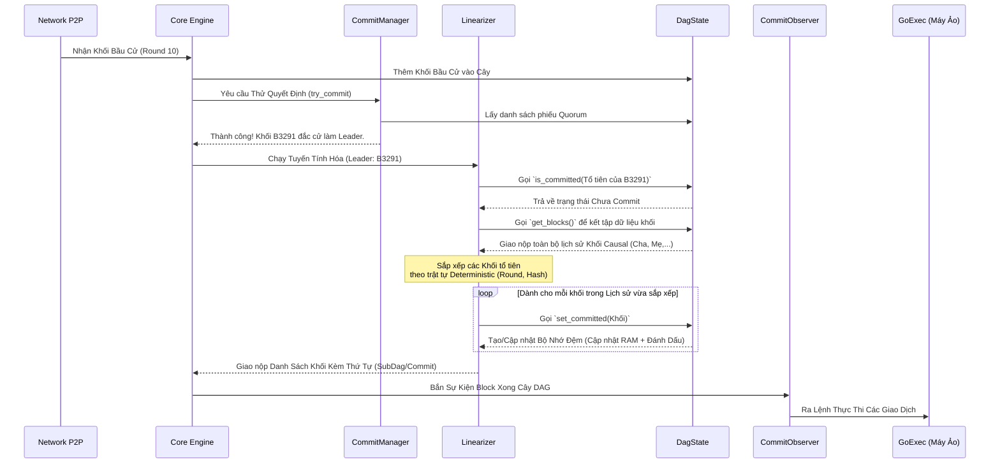

# Kiến Trúc Hệ Thống Đồng Thuận (MetaNode Consensus Architecture)

Tài liệu này mô tả chi tiết cách các thành phần trong lõi đồng thuận (Consensus Core) của MetaNode tương tác với nhau, đặc biệt tập trung vào quá trình đồng thuận khối và tuyến tính hóa (Linearization).

## 1. Sơ Đồ Kiến Trúc Tổng Quan (Architecture Diagram)

Dưới đây là sơ đồ phối hợp giữa các thành phần chính yếu trong hệ thống khối MetaNode:

```mermaid
graph TD
    %% Định nghĩa các node
    Network(("🌐 Mạng P2P\n(Peers)"))
    CommSyncer["🔄 CommitSyncer\n(Đồng bộ hóa & Catch-up)"]
    AuthNode["🏢 AuthorityNode\n(Quản lý Vòng Đời Node)"]
    
    subgraph Lõi Đồng Thuận (Consensus Engine)
        CoreThread["🧵 CoreThread / Dispatcher\n(Kênh Xử Lý Sự Kiện Chính)"]
        Core["🧠 Core\n(Máy Trạng Thái Đồng Thuận)"]
        BlockMgr["📦 BlockManager\n(Xác thực & Quản lý Khối)"]
        DagState["🕸️ DagState\n(Lưu trữ Cây DAG & Cache bộ nhớ)"]
        CommitMgr["⚖️ CommitManager\n(Bầu Chọn Lãnh Đạo - Leader Election)"]
        Linearizer["📏 Linearizer\n(Tuyến Tính Hóa Giao Dịch)"]
    end
    
    CommitObserver["👁️ CommitObserver / BlockDelivery\n(Chuyển Giao Khối Cho Go)"]
    GoExec["⚙️ Máy Ảo Thực Thi (Go Master)"]
    RocksDB[("💽 RocksDB\n(Lưu trữ Bền Vững)")]

    %% Định nghĩa luồng dữ liệu
    Network -- Nhận/Gửi Khối --> AuthNode
    Network <==> CommSyncer
    
    CommSyncer -- Gửi Khối Thiếu/Commits --> CoreThread
    AuthNode -- Đẩy Sự Kiện Mạng --> CoreThread
    
    CoreThread -- Chuyển giao Lệnh --> Core
    
    Core -- 1. Gửi Khối mới --> BlockMgr
    BlockMgr -- 2. Chấp nhận Khối --> DagState
    DagState -. Lấy/Lưu dữ liệu .-> RocksDB
    
    Core -- 3. Yêu cầu Bầu Chọn --> CommitMgr
    CommitMgr -- Lấy thông tin DAG --> DagState
    
    CommitMgr -- 4. Quyết định Leader --> Linearizer
    Linearizer -- 5. Tra cứu Lịch sử Cha-Con (Ancestors) --> DagState
    
    Linearizer -- 6. Khối đã Sắp Xếp (Commits) --> CommitObserver
    CommitObserver -- 7. Đẩy Dữ Liệu --> GoExec
```

> [!NOTE]
> **CoreThread** giữ vai trò như một phễu duy nhất (Single-threaded MPSC Receiver) tiếp nhận mọi tín hiệu từ mạng và luồng đồng bộ, đảm bảo **Core** không bị lỗi tương tranh (race conditions) khi chỉnh sửa DAG.

---

## 2. Chi Tiết Vai Trò Các Thành Phần

### 🌟 1. Core & CoreThread (Trái Tim Hệ Thống)
- **CoreThread:** Thực chất là một vòng lặp sự kiện bất đồng bộ. Mọi khối mới tóm được từ P2P hoặc từ quá trình tải lại (như từ `CommitSyncer`) đều phải xếp hàng đi qua `CoreThread` trước khi đưa xuống `Core`.
- **Core:** Chịu trách nhiệm thực thi logic trạng thái. Khi nhận được một khối mới, nó sẽ phối hợp với `BlockManager` và `DagState` để kết nối vào mạng lưới DAG hiện tại.

### 📦 2. BlockManager (Người Gác Cổng)
Mọi khối giao dịch truyền đến đều tới tay `BlockManager` trước. Nhiệm vụ của nó là:
- Đảm bảo các khối cha của khối này đã tồn tại (nếu thiếu, khối sẽ bị treo ở trạng thái _suspended_ để chờ).
- Đẩy các khối hợp lệ sang cho `DagState`.

### 🕸️ 3. DagState (Kho Lưu Trữ DAG Trạng Thái)
- **DagState** nắm giữ đồ thị vạch hướng không tuần hoàn (Directed Acyclic Graph) đại diện cho toàn bộ các khối.
- Do việc đọc ghi vào ổ cứng tốn kém, `DagState` duy trì **`recent_blocks`** làm bộ nhớ đệm (Cache). 
- Nó quản lý các biến quan trọng như `gc_round` (Vòng dọn rác) tính toán cái gì cần giữ ở RAM, cái gì cất xuống `RocksDB`.

### ⚖️ 4. CommitManager (Người Bầu ChọnLãnh Đạo)
Khác với các hệ thống Blockchain chuỗi thẳng, MetaNode sử dụng DAG. Tại mỗi vòng (round), `CommitManager` sẽ đánh giá biểu đồ DAG hiện tại để xác định xem ai (Leader) được sự đồng thuận của đa số (Quorum). 

### 📏 5. Linearizer (Bộ Sắp Xếp Chuỗi Khối)
Sau khi `CommitManager` xác định được **Khối Lãnh Đạo** (Leader Block), nó phải gọi `Linearizer` để biến Mạng Lưới DAG đa chiều thành Một Mạch Tàu Khối thẳng góc duy nhất:
1. `Linearizer` lấy Leader Block làm điểm mốc hiện hành.
2. Quét dội ngược về quá khứ qua hàm `DagState::get_blocks` để tìm mọi con đường (cha, ông nội,...) đã trỏ đến Leader này.
3. Bỏ qua các khối đã được Commit (kiểm tra qua `DagState::is_committed`).
4. Sắp xếp lại lịch sử hỗn độn thành 1 mảng tĩnh duy nhất theo Thuật Toán Đồng Thuận Xác Định (Deterministic Order).
5. Đánh dấu tất cả chúng bằng cờ Commit (`DagState::set_committed`).

### 🔄 6. CommitSyncer (Đội Cấp Cứu)
Khi `Máy Go` gặp tình trạng chết máy, khởi động lại từ Snapshot cũ, hay kết nối mạng bị rớt dài hạn: `CommitSyncer` sẽ kích hoạt **Chế Độ FastForward catch-up**. Nó đi xin các "Committed Blocks" đã được chốt sổ từ node hàng xóm đem về nhét thẳng vào `CoreThread` để chạy lại đồ thị lịch sử.

---

## 3. Quy Trình Phối Hợp Tuyến Tính Hóa (Linearization Workflow Sequence)

Dưới đây là một sơ đồ mô tả luồng giao tiếp thời gian thực tại thời điểm Khối Lãnh đạo được chọn cho tới khi được đẩy vào thực thi:



---

## 4. Tối Ưu Hóa Ghi Dữ Liệu Bất Đồng Bộ (Async RocksDB Flush Decoupling) & Kháng Fork

Một trong những giới hạn lớn nhất của CoreThread trước đây là việc ghi dữ liệu đồng bộ (Synchronous IO) xuống đĩa cứng bằng RocksDB (`fsync=true` để bắt buộc lưu đĩa nhằm chống Equivocation/Fork mạng). Việc này tiêu tốn 10ms - 50ms và làm tê liệt toàn bộ hoạt động của Node.

Với kiến trúc **Async Broadcaster with Deferred Ticket** mới được áp dụng, giới hạn này đã bị phá vỡ:

1. **Bóc tách I/O khỏi RAM:** Hàm `DagState::flush()` không còn chặn CoreThread nữa. Nó chỉ vào chiếm Lock 1 micro-giây để bốc lấy gói khối (`pending_blocks`) rồi đẩy qua một nhánh Task Nền (`tokio::task::spawn_blocking`), sau đó lập tức nhả ổ khóa ra. Nhờ vậy, mạng P2P và các thành phần đọc biến `DagState` tiếp tục hoạt động siêu tốc ngang vận tốc RAM.
2. **Chiếc Vé Hứa (Flush Ticket):** Thay vì đứng chờ đợi, `flush()` cấp lại 1 vé tín hiệu (`tokio::sync::oneshot::Receiver`). 
3. **Phát Sóng Khối Trì Hoãn (Deferred Broadcasting):** Để triệt tiêu rủi ro mất mạng lúc lưu ổ đĩa gây ra rẽ nhánh Fork. Proposer tại `try_new_block` khi tạo thành công Khối mới, thay vì bung lụa gửi đi cho mạng P2P (broadcast), nó sẽ bàn giao khối cùng tấm Vé Hứa cho một Khối Lệnh Chờ (`CoreSignals::new_block_with_ticket`).
   - Sứ giả phát sóng sẽ bị buộc dừng khẩn cấp ở hàm `.await` để chờ hiệu lệnh đĩa từ tấm Vé.
   - Khi ổ đĩa SSD vang tiếng click (thành công), khối mới lập tức tràn ra ngoài mạng Blockchain để xin phiếu bầu. Hoàn toàn không còn đợt gián đoạn băng thông nào trên trục lõi rẽ nhánh.
