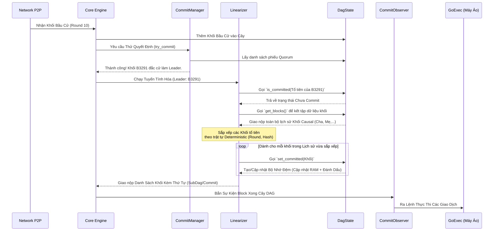
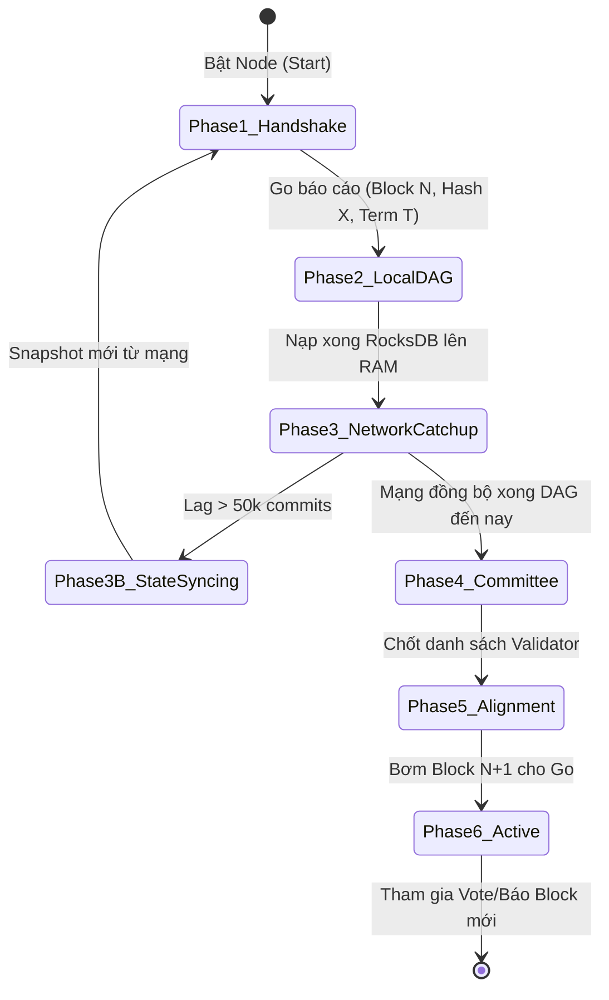
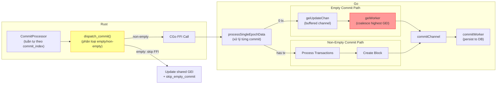
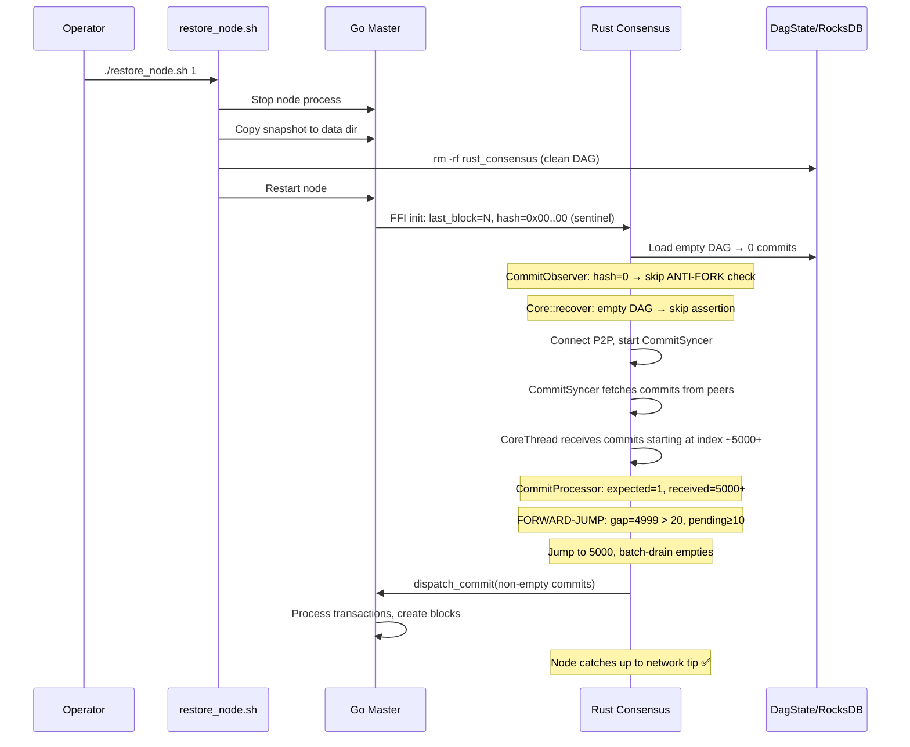

# Kiến Trúc Hệ Thống Đồng Thuận (MetaNode Consensus Architecture)

Tài liệu này mô tả chi tiết cách các thành phần trong lõi đồng thuận (Consensus Core) của MetaNode tương tác với nhau, đặc biệt tập trung vào quá trình đồng thuận khối và tuyến tính hóa (Linearization).

## 1. Sơ Đồ Kiến Trúc Tổng Quan (Architecture Diagram)

Dưới đây là sơ đồ phối hợp giữa các thành phần chính yếu trong hệ thống khối MetaNode:

```mermaid
graph TD
    %% Định nghĩa các node
    Network(("🌐 Mạng P2P\n(Peers)"))
    CommSyncer["🔄 CommitSyncer\n(Đồng bộ hóa & Catch-up)"]
    AuthNode["🏢 AuthorityNode\n(Quản lý Vòng Đời Node)"]
    
    subgraph Lõi Đồng Thuận (Consensus Engine)
        CoreThread["🧵 CoreThread / Dispatcher\n(Kênh Xử Lý Sự Kiện Chính)"]
        Core["🧠 Core\n(Máy Trạng Thái Đồng Thuận)"]
        BlockMgr["📦 BlockManager\n(Xác thực & Quản lý Khối)"]
        DagState["🕸️ DagState\n(Lưu trữ Cây DAG & Cache bộ nhớ)"]
        CommitMgr["⚖️ CommitManager\n(Bầu Chọn Lãnh Đạo - Leader Election)"]
        Linearizer["📏 Linearizer\n(Tuyến Tính Hóa Giao Dịch)"]
    end
    
    CommitObserver["👁️ CommitObserver / BlockDelivery\n(Chuyển Giao Khối Cho Go)"]
    GoExec["⚙️ Máy Ảo Thực Thi (Go Master)"]
    RocksDB[("💽 RocksDB\n(Lưu trữ Bền Vững)")]

    %% Định nghĩa luồng dữ liệu
    Network -- Nhận/Gửi Khối --> AuthNode
    Network <==> CommSyncer
    
    CommSyncer -- Gửi Khối Thiếu/Commits --> CoreThread
    AuthNode -- Đẩy Sự Kiện Mạng --> CoreThread
    
    CoreThread -- Chuyển giao Lệnh --> Core
    
    Core -- 1. Gửi Khối mới --> BlockMgr
    BlockMgr -- 2. Chấp nhận Khối --> DagState
    DagState -. Lấy/Lưu dữ liệu .-> RocksDB
    
    Core -- 3. Yêu cầu Bầu Chọn --> CommitMgr
    CommitMgr -- Lấy thông tin DAG --> DagState
    
    CommitMgr -- 4. Quyết định Leader --> Linearizer
    Linearizer -- 5. Tra cứu Lịch sử Cha-Con (Ancestors) --> DagState
    
    Linearizer -- 6. Khối đã Sắp Xếp (Commits) --> CommitObserver
    CommitObserver -- 7. Đẩy Dữ Liệu --> GoExec
```

> [!NOTE]
> **CoreThread** giữ vai trò như một phễu duy nhất (Single-threaded MPSC Receiver) tiếp nhận mọi tín hiệu từ mạng và luồng đồng bộ, đảm bảo **Core** không bị lỗi tương tranh (race conditions) khi chỉnh sửa DAG.

---

## 2. Chi Tiết Vai Trò Các Thành Phần

### 🌟 1. Core & CoreThread (Trái Tim Hệ Thống)
- **CoreThread:** Thực chất là một vòng lặp sự kiện bất đồng bộ. Mọi khối mới tóm được từ P2P hoặc từ quá trình tải lại (như từ `CommitSyncer`) đều phải xếp hàng đi qua `CoreThread` trước khi đưa xuống `Core`.
- **Core:** Chịu trách nhiệm thực thi logic trạng thái. Khi nhận được một khối mới, nó sẽ phối hợp với `BlockManager` và `DagState` để kết nối vào mạng lưới DAG hiện tại.

### 📦 2. BlockManager (Người Gác Cổng)
Mọi khối giao dịch truyền đến đều tới tay `BlockManager` trước. Nhiệm vụ của nó là:
- Đảm bảo các khối cha của khối này đã tồn tại (nếu thiếu, khối sẽ bị treo ở trạng thái _suspended_ để chờ).
- Đẩy các khối hợp lệ sang cho `DagState`.

### 🕸️ 3. DagState (Kho Lưu Trữ DAG Trạng Thái)
- **DagState** nắm giữ đồ thị vạch hướng không tuần hoàn (Directed Acyclic Graph) đại diện cho toàn bộ các khối.
- Do việc đọc ghi vào ổ cứng tốn kém, `DagState` duy trì **`recent_blocks`** làm bộ nhớ đệm (Cache). 
- Nó quản lý các biến quan trọng như `gc_round` (Vòng dọn rác) tính toán cái gì cần giữ ở RAM, cái gì cất xuống `RocksDB`.

### ⚖️ 4. CommitManager (Người Bầu ChọnLãnh Đạo)
Khác với các hệ thống Blockchain chuỗi thẳng, MetaNode sử dụng DAG. Tại mỗi vòng (round), `CommitManager` sẽ đánh giá biểu đồ DAG hiện tại để xác định xem ai (Leader) được sự đồng thuận của đa số (Quorum). 

### 📏 5. Linearizer (Bộ Sắp Xếp Chuỗi Khối)
Sau khi `CommitManager` xác định được **Khối Lãnh Đạo** (Leader Block), nó phải gọi `Linearizer` để biến Mạng Lưới DAG đa chiều thành Một Mạch Tàu Khối thẳng góc duy nhất:
1. `Linearizer` lấy Leader Block làm điểm mốc hiện hành.
2. Quét dội ngược về quá khứ qua hàm `DagState::get_blocks` để tìm mọi con đường (cha, ông nội,...) đã trỏ đến Leader này.
3. Bỏ qua các khối đã được Commit (kiểm tra qua `DagState::is_committed`).
4. Sắp xếp lại lịch sử hỗn độn thành 1 mảng tĩnh duy nhất theo Thuật Toán Đồng Thuận Xác Định (Deterministic Order).
5. Đánh dấu tất cả chúng bằng cờ Commit (`DagState::set_committed`).

### 🔄 6. CommitSyncer (Đội Cấp Cứu)
Khi `Máy Go` gặp tình trạng chết máy, khởi động lại từ Snapshot cũ, hay kết nối mạng bị rớt dài hạn: `CommitSyncer` sẽ kích hoạt **Chế Độ FastForward catch-up**. Nó đi xin các "Committed Blocks" đã được chốt sổ từ node hàng xóm đem về nhét thẳng vào `CoreThread` để chạy lại đồ thị lịch sử.

---

## 3. Quy Trình Phối Hợp Tuyến Tính Hóa (Linearization Workflow Sequence)

Dưới đây là một sơ đồ mô tả luồng giao tiếp thời gian thực tại thời điểm Khối Lãnh đạo được chọn cho tới khi được đẩy vào thực thi:



---

## 4. Tối Ưu Hóa Ghi Dữ Liệu Bất Đồng Bộ (Async RocksDB Flush Decoupling) & Kháng Fork

Một trong những giới hạn lớn nhất của CoreThread trước đây là việc ghi dữ liệu đồng bộ (Synchronous IO) xuống đĩa cứng bằng RocksDB (`fsync=true` để bắt buộc lưu đĩa nhằm chống Equivocation/Fork mạng). Việc này tiêu tốn 10ms - 50ms và làm tê liệt toàn bộ hoạt động của Node.

Với kiến trúc **Async Broadcaster with Deferred Ticket** mới được áp dụng, giới hạn này đã bị phá vỡ:

1. **Bóc tách I/O khỏi RAM:** Hàm `DagState::flush()` không còn chặn CoreThread nữa. Nó chỉ vào chiếm Lock 1 micro-giây để bốc lấy gói khối (`pending_blocks`) rồi đẩy qua một nhánh Task Nền (`tokio::task::spawn_blocking`), sau đó lập tức nhả ổ khóa ra. Nhờ vậy, mạng P2P và các thành phần đọc biến `DagState` tiếp tục hoạt động siêu tốc ngang vận tốc RAM.
2. **Chiếc Vé Hứa (Flush Ticket):** Thay vì đứng chờ đợi, `flush()` cấp lại 1 vé tín hiệu (`tokio::sync::oneshot::Receiver`). 
3. **Phát Sóng Khối Trì Hoãn (Deferred Broadcasting):** Để triệt tiêu rủi ro mất mạng lúc lưu ổ đĩa gây ra rẽ nhánh Fork. Proposer tại `try_new_block` khi tạo thành công Khối mới, thay vì bung lụa gửi đi cho mạng P2P (broadcast), nó sẽ bàn giao khối cùng tấm Vé Hứa cho một Khối Lệnh Chờ (`CoreSignals::new_block_with_ticket`).
   - Khi ổ đĩa SSD vang tiếng click (thành công), khối mới lập tức tràn ra ngoài mạng Blockchain để xin phiếu bầu. Hoàn toàn không còn đợt gián đoạn băng thông nào trên trục lõi rẽ nhánh.

---

## 5. Kiến Trúc Quản Lý Khởi Động & Phục Hồi (Startup & Recovery Lifecycle)

Một thách thức lớn trong thực tế là quản lý vòng đời khởi động lại (Restart/Recovery). Khi node gặp sự cố (cúp điện, crash), **Go Master** và **Rust Consensus** có thể bị lệch pha. Dữ liệu tối thiểu và duy nhất đáng tin cậy lúc này là trạng thái lưu trên ổ cứng của Go: `Last_Executed_Block_Number`, `Last_Executed_Block_Hash` và `Current_Term` (hay GEI - Go Execution Interface).

Để đảm bảo trạng thái thống nhất và **tuyệt đối không gây phân nhánh (fork)** trước khi node thực sự "Ready", MetaNode áp dụng mô hình **Cỗ Máy Trạng Thái Khởi Động (Startup State Machine)** với 6 Giai Đoạn (Phases) nghiêm ngặt do `AuthorityNode` và `CommitObserver` điều phối:

### Mô Hình Các Giai Đoạn Khởi Động



#### 🤝 Phase 1: Bắt tay Nội Bộ (State Handshake)
- Khi Rust Consensus khởi động, nó **không kết nối mạng P2P ngay lập tức**.
- Rust gọi RPC/IPC sang Go Master yêu cầu **Cột mốc mới nhất**: Khối đã chạy cuối cùng (`latest_block`), Mã Hash của nó (`latest_hash`) và Term hiện hành.

#### 💽 Phase 2: Khôi phục DAG Cục bộ (Local DAG Recovery)
- `DagState` và `BlockManager` đọc cấu trúc mạng lưới DAG từ `RocksDB` cục bộ.
- Xây dựng lại biểu đồ quan hệ Cha-Con trên RAM lên tới điểm cao nhất có thể trong đĩa cứng.

#### 🌐 Phase 3: Bắt kịp Mạng lưới (Network Catch-up / Sync)
Tùy thuộc vào mức độ lạc hậu của nút so với mạng mà tiến trình này chia làm 2 nhánh:

- **Nhánh 3A - Đồng bộ DAG Theo Khối (Cùng Epoch hoặc Lệch Ít, VD: 1 Epoch):** 
  - Nếu nút bị chậm giới hạn trong 1 Epoch hoặc khoảng cách khối không quá lớn, `CommitSyncer` và `Synchronizer` sẽ tải tịnh tiến các khối bị thiếu (Missing Blocks) hoặc **Tải theo cụm (Batch Block Download)** để tốc độ hóa việc vá cây DAG. Nút sẽ dịch chuyển xuyên qua ranh giới Epoch cũ và bắt kịp `Network Tip` một cách an toàn mà vẫn để máy ảo Go đuổi theo tuần tự.
- **Nhánh 3B - Tụt Hậu Epoch Quá Sâu (Deep Epoch Lag / Fast-Forward Snapshot):** 
  - Khi node phát hiện `Network_Epoch` đã vượt quá xa mức chịu đựng (VD: Lệch từ 2 Epochs trở lên), việc tải và chạy lại (replay) toàn bộ hàng triệu khối của các Epoch cũ trong `Linearizer` là một thảm họa phi thực tế, dẫn tới chết nghẽn RAM do hết hạn chứng chỉ (cerificate expiration) và thay đổi Committee liên tục.
  - Lúc này, node tự động ngắt cơ chế quét quét tải khối và chuyển sang **State Sync (Cấy Snapshot)** hoặc **Epoch Fast-Forward**.
  - Node tải **Biên lai chốt sổ (Certified/Epoch Commit)** của Epoch mới nhất. Sau đó xả rỗng DAG cũ, giao phó Go Master khôi phục trạng thái bằng file Snapshot mạng thay vì chạy lại lịch sử. Quá trình bắt đầu lại từ `Phase 1` với mốc `N` mới do mạng quyết định.

- **Nhánh 3C - Tụt Hậu Commit Quá Sâu (Deep Commit Lag / StateSyncing):**
  - Khi node bị tụt hậu hơn **50,000 commits** so với mạng (tính theo `local_commit < quorum_commit - 50_000`), `CommitSyncer` chuyển sang phase `StateSyncing`.
  - Trong phase này, P2P batch block download bị tạm dừng hoàn toàn. Node chờ Go Engine khôi phục trạng thái từ Snapshot thay vì tải từng khối lẻ.
  - `CommitSyncer` không còn lập lịch `try_schedule_once()` cho đến khi phase chuyển về `CatchingUp` hoặc `Healthy`.

- **Ghi chú an toàn:** Trong suốt Phase 1->5, Node hoàn toàn ở chế độ `SyncOnly` (Chỉ nghe, Không Đề xuất khối, Không Bỏ phiếu).

#### 🏛️ Phase 4: Xác định Ủy Ban (Committee Determination)
- Tại ranh giới của Term/Epoch (ngay sau khi tải đủ DAG liên quan đến Term hiện tại), mô-đun `EpochChange` sẽ trích xuất thông tin Stake và xác định danh sách **Committee (Nhóm Ủy ban Validator)** có quyền biểu quyết ở Term này.

#### 📏 Phase 5: Canh lề Trạng thái & Lọc Giao Giao Block (State Alignment & Delivery Filtering)
Đây là chốt chặn cực kỳ quan trọng để chống Fork giữa Rust và Go:
1. `Linearizer` bắt đầu quét từ trên xuống dưới DAG đã đồng bộ và tạo ra một cuộn dây chuyền tính trạng (Linearized Chain).
2. `CommitObserver` đóng vai trò **Người gác cổng**:
   - Nếu `Linearizer` nhả ra một khối có `Number <= N` (N là khối Go đã báo cáo ở Phase 1): **Bỏ qua (Discard)**. Không đẩy sang Go để tránh chạy lại 2 lần.
   - **Xác minh Hash Anti-Fork:** Khi `Linearizer` duyệt tới khối thứ `N`, `CommitObserver` TỰ ĐỘNG kiểm tra chéo bằng `last_executed_commit_hash` được truyền qua `CommitConsumerArgs::new(replay_index, processed_index, last_executed_commit_hash)`:
     - `Hash_Của_Khối_N_Trên_DAG == last_executed_commit_hash (của Go)`.
     - ❌ *Nếu sai:* Tức là node đã bị rẽ nhánh (Forked/Corrupted RocksDB). Node phải **Panic ngay lập tức** để người quản trị tải lại Snapshot, cấm tuyệt đối việc ghi đè gây nát trạng thái.
     - ✅ *Nếu đúng:* Trạng thái khớp hoàn hảo.
   - Trường `commit_hash` trong message `ExecutableBlock` (Protobuf field 9) chứa digest của Rust DAG commit. Go Engine **bắt buộc** lưu trữ hash này và trả lại trong `LastBlockNumberResponse` để phục vụ kiểm tra chéo ở các lần khởi động sau.
   - Khi đó, khối đầu tiên được đẩy qua kênh MPSC sang cho máy ảo Go sẽ chính xác là khối **`N + 1`**.

#### ⚡ Phase 6: Chế Độ Tham Gia Tích Cực (Active Mode)
- Chỉ khi nút Go đã tiếp nhận đủ mọi khối `N+1, N+2...` và báo "Đã bắt kịp hoàn toàn Mạng (Fully Synced)".
- `AuthorityNode` gạt công tắc trạng thái từ `SyncOnly` sang **`Active`**.
- Lúc này, Node mới bắt đầu chia sẻ Mempool, đề xuất Block mới (Proposer), và gửi chữ ký biểu quyết. Hệ thống hoàn chỉnh việc hồi sinh an toàn, bảo đảm đồng thuận mạnh mẽ (Strong Consistency).

---

## 6. Quy Tắc Hash Khối (Block Hash Determinism)

Block hash được tính bằng Keccak256 trên protobuf serialize **có chọn lọc** các trường header. Quy tắc quan trọng:

- **INCLUDED**: `BlockNumber`, `AccountStatesRoot`, `StakeStatesRoot`, `ReceiptRoot`, `LeaderAddress`, `TimeStamp`, `TransactionsRoot`, `Epoch`
- **EXCLUDED**: `LastBlockHash` (chống hash chain divergence khi restart), `GlobalExecIndex` (non-deterministic mapping Rust→Go), `AggregateSignature` (set sau khi hash)

> [!IMPORTANT]
> **`GlobalExecIndex` bị loại khỏi hash** vì GEI là mapping từ Rust commit index → Go block number. Khi node restore/catch-up, cùng một block có thể nhận GEI khác nhau tùy theo thứ tự xử lý commit (synced vs local DAG replay). GEI vẫn được lưu trong header cho monitoring nhưng KHÔNG ảnh hưởng block identity.

---

## 7. Pipeline Rust→Go (Commit Execution Pipeline)

Đây là phần QUAN TRỌNG NHẤT gây ra hầu hết lỗi stall/fork. Pipeline truyền commit từ Rust consensus sang Go execution:

### 7.1. Luồng dữ liệu chi tiết



### 7.2. Bất Biến An Toàn (Safety Invariants)

| # | Bất Biến | Cách Bảo Vệ |
|---|----------|-------------|
| 1 | Mọi BFT-certified commit PHẢI được thực thi | CATCH-UP FORK GUARD đã bị XÓA — không suppress commit nào |
| 2 | GEI phải tăng đơn điệu | `storage.UpdateLastGlobalExecIndex()` dùng `atomic.CompareAndSwap` |  
| 3 | Empty commits không qua FFI | `dispatch_commit()` fast-path: chỉ update shared_gei + executor skip |
| 4 | Epoch transition chờ Go flush xong | `poll_go_until_synced` + `ForceCommit` mỗi 3s, tolerance ≤5 GEI |
| 5 | Snapshot restore tạo gap → auto-jump | FORWARD-JUMP: khi ≥10 pending + gap >20, nhảy đến smallest_pending |
| 6 | Block hash deterministic | GEI và LastBlockHash **KHÔNG** nằm trong hash |

### 7.3. Điểm Nghẽn Đã Biết & Fix

#### ❌ CATCH-UP FORK GUARD (ĐÃ XÓA)
- **Trước**: Khi Go lag >10, suppress non-empty commits → `stateRoot` diverge → FORK
- **Sau**: Tất cả commits qua BFT đều canonical, thực thi vô điều kiện

#### ⏱️ Epoch Transition Stall (ĐÃ FIX) 
- **Trước**: `poll_go_until_synced` chờ 300s thụ động, Go async pipeline giữ 3 GEI cuối trong buffer
- **Sau**: Timeout 30s + `ForceCommit` flush Go pipeline + tolerance ≤5 GEI

#### 🚀 Snapshot Restore Gap (ĐÃ FIX)
- **Trước**: CommitProcessor stuck vĩnh viễn chờ commits không bao giờ đến (DAG đã reset)  
- **Sau**: FORWARD-JUMP batch drain — phát hiện gap, nhảy đến pending, batch-skip empties

#### ⚠️ Go geiUpdateChan Ordering (GIÁM SÁT)
- Go dùng **coalescing channel** cho empty commits: chỉ giữ GEI cao nhất
- Khi channel full, GEI có thể bị drop → Rust poll thấy GEI cũ → stall ngắn
- **Mitigation**: ForceCommit + tolerance trong poll_go_until_synced

---

## 8. Quy Trình Phục Hồi Snapshot (Snapshot Restore Recovery)



> [!CAUTION]  
> **Hash = 0x00..00 sau restore**: Đây là sentinel value, KHÔNG phải lỗi. Go trả về zero hash vì `LastExecutedCommitHash` chưa tồn tại trong BackupDB (key được tạo bởi feature mới). Hash sẽ tự có giá trị thật sau commit đầu tiên. ANTI-FORK check tự động skip khi hash=0.

---

## 9. Nguyên Tắc Khởi Động An Toàn & Tránh Phân Nhánh (Safe Startup & Fork Avoidance)

Thiết kế khởi động của MetaNode yêu cầu tính **tuần tự và nghiêm ngặt** để đảm bảo quá trình đồng bộ hóa thành công mà không gây ra lỗi tương tranh (race conditions), phân nhánh (fork), hoặc crash hệ thống.

### 9.1. Vấn Đề Khởi Động Quá Sớm
Nếu các thành phần lõi đồng thuận (như `CommitFinalizer`, `ProposedBlockHandler`, hay `CoreThread`) khởi động ngay lập tức mà **chưa có đủ dữ liệu từ mạng** (sau khi restart hoặc restore từ snapshot):
- Các thành phần lõi sẽ dùng **trạng thái rỗng (empty state)** hoặc **trạng thái cũ** dẫn đến sai lệch.
- Việc xử lý song song các luồng sự kiện khi `CommitSyncer` chưa nạp đủ dữ liệu mạng sẽ dẫn đến việc các commit bị đứt gãy (gap). Ví dụ, nếu `CommitFinalizer` nhận được một commit nhưng thiếu commit trước đó (do đang được sync), nó có thể đưa ra lỗi `assertion` gây **chết toàn bộ engine**.
- Khi một task chết, nó kéo theo sự sụp đổ dây chuyền (cascade crash), khiến cả node sập và rơi vào vòng lặp Auto-Restart liên tục mang theo state hỏng.

### 9.2. Cơ Chế Khởi Động Tuần Tự & Màn Chắn Dữ Liệu
Để triệt tiêu lỗi thiếu dữ liệu ban đầu, kiến trúc khởi động thiết lập các màn chắn phòng thủ:

1. **Chờ Mốc Phân Ranh Mạng (Wait for Baseline)**:
   - Hệ thống khởi tạo ở chế độ `Bootstrapping`. P2P Network được kết nối, nhưng `Core` không bắt đầu phát hay chốt khối. `CommitSyncer` là thành phần duy nhất được cấp quyền hành động để đánh giá mức độ đồng bộ của mạng lưới xung quanh.

2. **Khởi Động Thành Phần Theo Lớp (Layered Spawning)**:
   - **Lớp Dữ Liệu Nền:** Go Master phải chạy trước và hoàn tất quá trình nạp dữ liệu từ `RocksDB / PebbleDB`.
   - **Lớp Cầu Nối:** Rust FFI và `ExecutorClient` kết nối sang Go, lấy mốc Block cao nhất. Node thử thách liên tục qua số lần `Retries` thay vì panic ngay nếu Go Master chưa kịp tải cấu trúc.
   - **Lớp Bắt Kịp (Catch-up):** `CommitSyncer` kích hoạt tải dữ liệu thiếu (Gap Fetching). Các bộ xử lý khối mạnh mẽ như `ProposedBlockHandler` sẽ bỏ qua (ignore) các thông điệp mạng nếu trạng thái chưa chỉ định `Healthy`, ngăn ngừa ô nhiễm DAG.

3. **Cơ Chế Bỏ Qua An Toàn & Miễn Nhiễm Gaps (Graceful Skipping)**:
   - Thay vì kiểm tra trật tự một cách độc đoán dẫn đến thủ tiêu tiến trình (Crash on Assert), các pipeline phía sau như `CommitFinalizer` được nới lỏng thành **Cảnh Báo & Bỏ Qua (Warn & Skip)**.
   - Khi mạng tải thành từng cụm ngắt quãng hoặc có bước đại nhảy vọt `FORWARD-JUMP`, hệ thống dễ dàng hấp thụ các mảnh dữ liệu nhảy cóc, bảo toàn sự sống cho toàn bộ cỗ máy đồng thuận.

4. **Kích Hoạt Hoàn Toàn (Full Activation)**:
   - Chỉ khi dữ liệu mạng đã thẩm thấu và bắt kịp (hoặc độ trễ chênh lệch xấp xỉ bằng không), `ConsensusCoordinationHub` mới gạt công tắc đưa `Node` sang mode `Healthy/Active`. 
   - Từ đây, lá chắn được dỡ bỏ, các luồng sức mạnh như Lắng nghe giao dịch, Đề xuất khối và Biểu quyết đồng thuận mới chính thức bung sức lan tỏa, thiết lập trạng thái Strong Consistency tuyệt đối.

### 9.3. Kiến Trúc Quản Lý Trạng Thái Dùng Chung Tập Trung (Centralized Shared State)
Trong môi trường đồng thuận đa tiến trình (Multi-threading) và Kiến trúc Hợp nhất (Rust-Go FFI):
- **Nguyên tắc "Một Nguồn Sự Thật" (Single Source of Truth)**: Nếu hai hay nhiều thành phần dùng chung một thông số trạng thái (Ví dụ: `Global_Execution_Index`, `Epoch`, `is_transitioning`), trạng thái đó **tuyệt đối không được sao chép phân tán**. Nó phải được quản lý tập trung ở **một nơi duy nhất** (như `ConsensusCoordinationHub` hoặc `SharedRwLock`). 
- **Theo dõi & Cấp quyền (Monitor & Mutate)**: Bất kỳ thành phần nào muốn đọc đều phải trỏ tham chiếu (reference) về Bộ quản lý tập trung. Quyền ghi (mutate) phải được hạn chế nghiêm ngặt thông qua các hàm có khóa vây bảo vệ (Lock Guards / Atomic Operations) để tránh Deadlock và sự bất đồng bộ giữa các luồng.
- Nhờ có Hub trung tâm, khi trạng thái thay đổi, hệ thống bảo đảm mọi components quan tâm (từ Mạng P2P, Linearizer, đến Go Master) đều nhận cùng một sự thật ở cùng một thời điểm phần nghìn giây.
