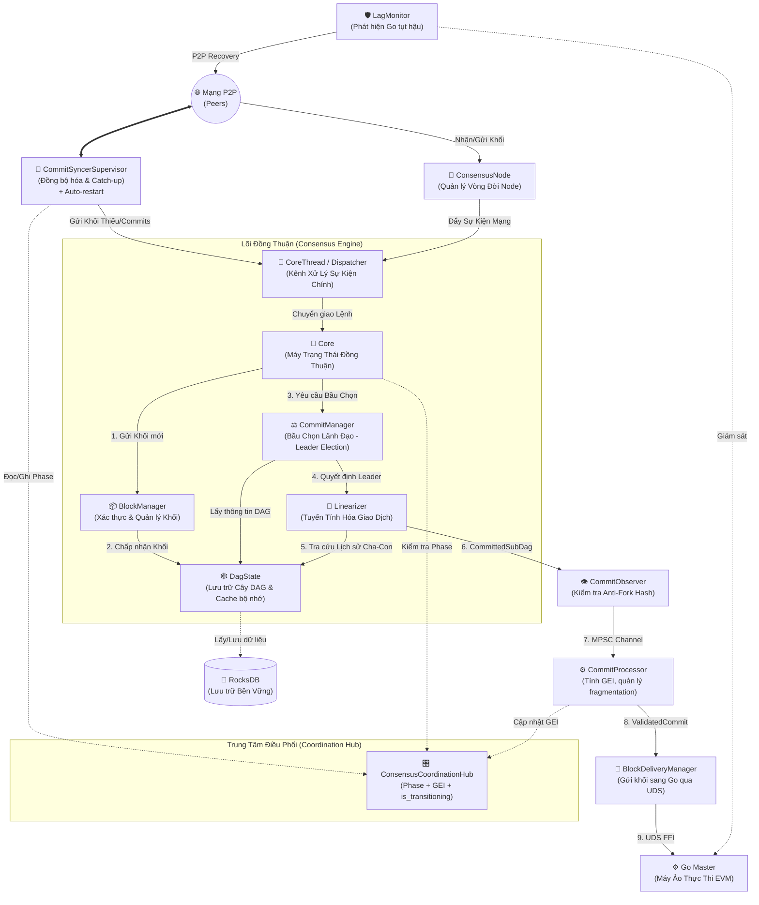
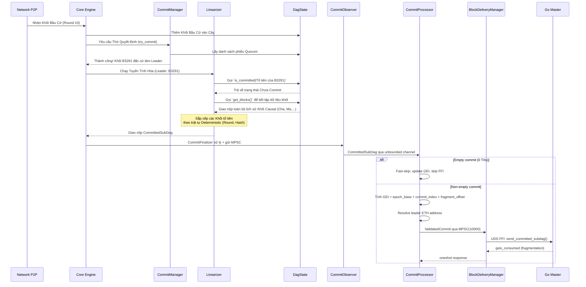
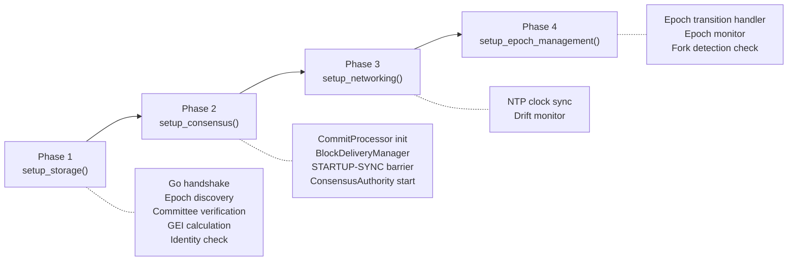
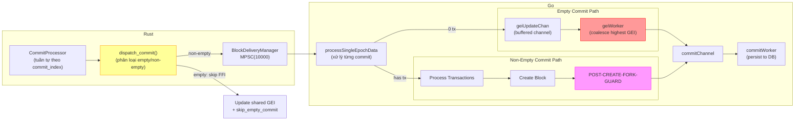
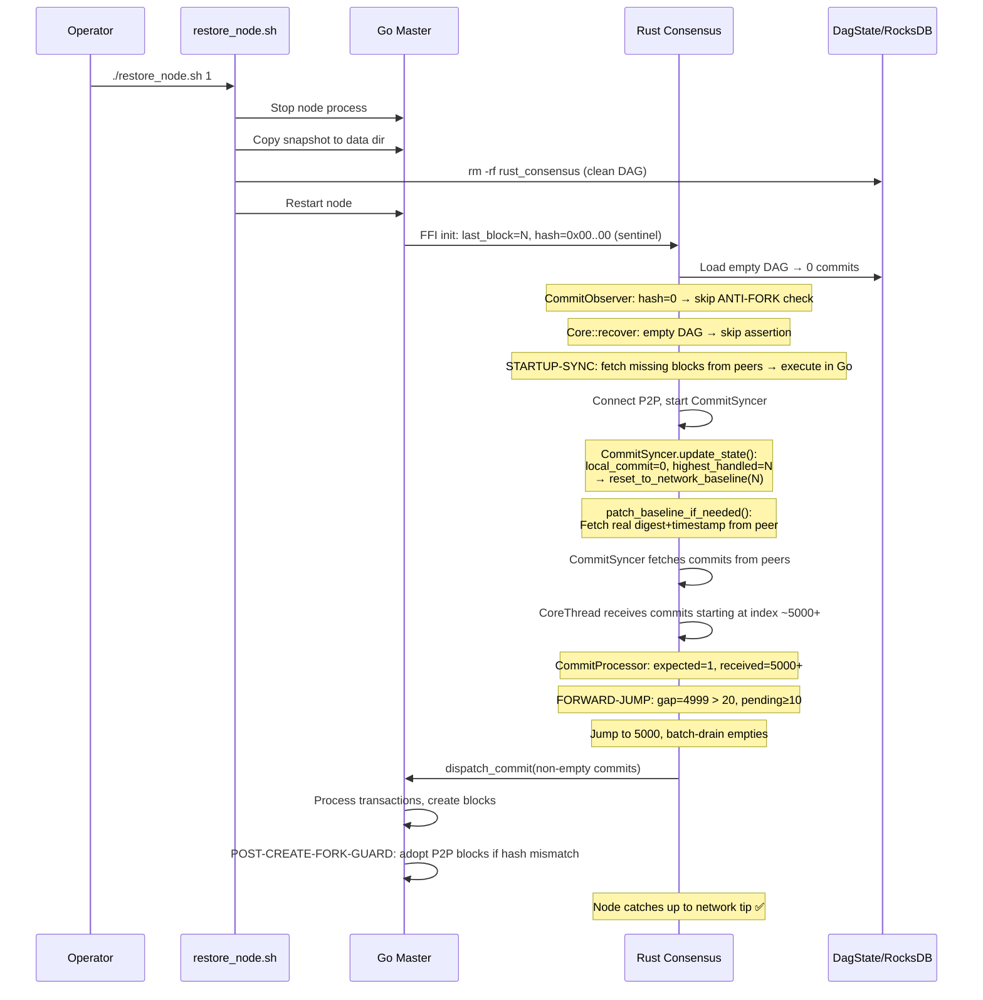

# Kiến Trúc Hệ Thống Đồng Thuận (MetaNode Consensus Architecture)

Tài liệu này mô tả chi tiết cách các thành phần trong lõi đồng thuận (Consensus Core) của MetaNode tương tác với nhau, đặc biệt tập trung vào quá trình đồng thuận khối, tuyến tính hóa (Linearization), pipeline truyền dữ liệu Rust→Go và các cơ chế chống phân nhánh (anti-fork).

**Cập nhật lần cuối:** 2026-04-25

## 1. Sơ Đồ Kiến Trúc Tổng Quan (Architecture Diagram)

Dưới đây là sơ đồ phối hợp giữa các thành phần chính yếu trong hệ thống khối MetaNode:



> [!NOTE]
> **CoreThread** giữ vai trò như một phễu duy nhất (Single-threaded MPSC Receiver) tiếp nhận mọi tín hiệu từ mạng và luồng đồng bộ, đảm bảo **Core** không bị lỗi tương tranh (race conditions) khi chỉnh sửa DAG.

> [!IMPORTANT]
> **ConsensusCoordinationHub** là nơi DUY NHẤT quản lý 3 trạng thái dùng chung: `Phase` (Initializing→Healthy), `GEI` (Global Execution Index), và `is_transitioning` (epoch transition lock). Tất cả components đều đọc từ Hub này thay vì duy trì bản sao riêng.

---

## 2. Chi Tiết Vai Trò Các Thành Phần

### 🌟 1. Core & CoreThread (Trái Tim Hệ Thống)
- **CoreThread:** Thực chất là một vòng lặp sự kiện bất đồng bộ. Mọi khối mới tóm được từ P2P hoặc từ quá trình tải lại (như từ `CommitSyncer`) đều phải xếp hàng đi qua `CoreThread` trước khi đưa xuống `Core`.
- **Core:** Chịu trách nhiệm thực thi logic trạng thái. Khi nhận được một khối mới, nó sẽ phối hợp với `BlockManager` và `DagState` để kết nối vào mạng lưới DAG hiện tại.
- **Should_Propose Guard:** Core kiểm tra `ConsensusCoordinationHub.should_skip_proposal()` — chỉ cho phép propose block khi phase = `Healthy`. Điều này ngăn equivocation sau snapshot restore.

### 📦 2. BlockManager (Người Gác Cổng)
Mọi khối giao dịch truyền đến đều tới tay `BlockManager` trước. Nhiệm vụ của nó là:
- Đảm bảo các khối cha của khối này đã tồn tại (nếu thiếu, khối sẽ bị treo ở trạng thái _suspended_ để chờ).
- Đẩy các khối hợp lệ sang cho `DagState`.

### 🕸️ 3. DagState (Kho Lưu Trữ DAG Trạng Thái)
- **DagState** nắm giữ đồ thị vạch hướng không tuần hoàn (Directed Acyclic Graph) đại diện cho toàn bộ các khối.
- Do việc đọc ghi vào ổ cứng tốn kém, `DagState` duy trì **`recent_blocks`** làm bộ nhớ đệm (Cache). 
- Nó quản lý các biến quan trọng như `gc_round` (Vòng dọn rác) tính toán cái gì cần giữ ở RAM, cái gì cất xuống `RocksDB`.
- Hàm `reset_to_network_baseline()` cho phép fast-forward DAG khi snapshot restore (đặt gc_round và synced_commit cao lên để skip các commit cũ).

### ⚖️ 4. CommitManager (Người Bầu Chọn Lãnh Đạo)
Khác với các hệ thống Blockchain chuỗi thẳng, MetaNode sử dụng DAG. Tại mỗi vòng (round), `CommitManager` sẽ đánh giá biểu đồ DAG hiện tại để xác định xem ai (Leader) được sự đồng thuận của đa số (Quorum). 

### 📏 5. Linearizer (Bộ Sắp Xếp Chuỗi Khối)
Sau khi `CommitManager` xác định được **Khối Lãnh Đạo** (Leader Block), nó phải gọi `Linearizer` để biến Mạng Lưới DAG đa chiều thành Một Mạch Tàu Khối thẳng góc duy nhất:
1. `Linearizer` lấy Leader Block làm điểm mốc hiện hành.
2. Quét dội ngược về quá khứ qua hàm `DagState::get_blocks` để tìm mọi con đường (cha, ông nội,...) đã trỏ đến Leader này.
3. Bỏ qua các khối đã được Commit (kiểm tra qua `DagState::is_committed`).
4. Sắp xếp lại lịch sử hỗn độn thành 1 mảng tĩnh duy nhất theo Thuật Toán Đồng Thuận Xác Định (Deterministic Order).
5. Đánh dấu tất cả chúng bằng cờ Commit (`DagState::set_committed`).

### 🔄 6. CommitSyncer & CommitSyncerSupervisor (Đội Cấp Cứu)
Khi node gặp sự cố, khởi động lại từ Snapshot cũ, hay kết nối mạng bị rớt dài hạn: `CommitSyncer` sẽ kích hoạt **Chế Độ FastForward catch-up**. Nó đi xin các "Committed Blocks" đã được chốt sổ từ node hàng xóm đem về nhét thẳng vào `CoreThread` để chạy lại đồ thị lịch sử.

- **CommitSyncerSupervisor** bọc bên ngoài CommitSyncer với cơ chế **auto-restart**: nếu CommitSyncer crash hoặc panic, Supervisor tự động tạo instance mới sau backoff (1s → 2s → ... → 10s cap). Điều này ngăn ngừa node phải restart toàn bộ chỉ vì một task đồng bộ gặp lỗi.
- **patch_baseline_if_needed()**: Sau khi fast-forward DAG, CommitSyncer tự động lấy digest và timestamp thật từ mạng cho synthetic baseline commit, đảm bảo timestamp monotonicity chính xác.

### 🎛️ 7. ConsensusCoordinationHub (Trung Tâm Điều Phối)
Hub tập trung quản lý **ba trạng thái dùng chung** duy nhất:

| Trạng Thái | Kiểu Dữ Liệu | Nguồn Ghi (Writer) | Nguồn Đọc (Reader) |
|---|---|---|---|
| `phase` | `Arc<parking_lot::RwLock<NodeConsensusPhase>>` | CommitSyncer, startup code | Core, CommitSyncer, Proposer |
| `global_exec_index` | `Arc<tokio::sync::Mutex<u64>>` | CommitProcessor, startup | LagMonitor, epoch transition |
| `is_transitioning` | `Arc<AtomicBool>` | Epoch transition handler | CommitProcessor, TX receivers |

Phase lifecycle:
```
Initializing → Bootstrapping → CatchingUp → Healthy
                                    ↓
                               StateSyncing → (restart) → Initializing
```

### 🚚 8. BlockDeliveryManager (Băng Chuyền Giao Hàng)
- Nhận `ValidatedCommit` từ CommitProcessor qua MPSC channel (buffer 10,000).
- Gọi `ExecutorClient.send_committed_subdag()` tuần tự để gửi từng commit sang Go qua UDS.
- Trả về `geis_consumed` qua oneshot channel để CommitProcessor cập nhật fragment offset.
- Nếu gửi thất bại → **panic ngay lập tức** (không thể phục hồi — block phải được thực thi).

### 🛡️ 9. LagMonitor (Giám Sát Tụt Hậu)
- Chạy song song, poll định kỳ so sánh Rust GEI (shared_last_global_exec_index) vs Go GEI/Block.
- Phát `LagAlert::ModerateLag` hoặc `LagAlert::SevereLag` khi phát hiện Go tụt hậu.
- Handler trong `consensus_node.rs` tự động kích hoạt **P2P block fetch + execution** để bù đắp khoảng cách.

---

## 3. Quy Trình Phối Hợp Tuyến Tính Hóa (Linearization Workflow Sequence)

Dưới đây là một sơ đồ mô tả luồng giao tiếp thời gian thực tại thời điểm Khối Lãnh đạo được chọn cho tới khi được đẩy vào thực thi:



---

## 4. Tối Ưu Hóa Ghi Dữ Liệu Bất Đồng Bộ (Async RocksDB Flush Decoupling) & Kháng Fork

Một trong những giới hạn lớn nhất của CoreThread trước đây là việc ghi dữ liệu đồng bộ (Synchronous IO) xuống đĩa cứng bằng RocksDB (`fsync=true` để bắt buộc lưu đĩa nhằm chống Equivocation/Fork mạng). Việc này tiêu tốn 10ms - 50ms và làm tê liệt toàn bộ hoạt động của Node.

Với kiến trúc **Async Broadcaster with Deferred Ticket** mới được áp dụng, giới hạn này đã bị phá vỡ:

1. **Bóc tách I/O khỏi RAM:** Hàm `DagState::flush()` không còn chặn CoreThread nữa. Nó chỉ vào chiếm Lock 1 micro-giây để bốc lấy gói khối (`pending_blocks`) rồi đẩy qua một nhánh Task Nền (`tokio::task::spawn_blocking`), sau đó lập tức nhả ổ khóa ra. Nhờ vậy, mạng P2P và các thành phần đọc biến `DagState` tiếp tục hoạt động siêu tốc ngang vận tốc RAM.
2. **Chiếc Vé Hứa (Flush Ticket):** Thay vì đứng chờ đợi, `flush()` cấp lại 1 vé tín hiệu (`tokio::sync::oneshot::Receiver`). 
3. **Phát Sóng Khối Trì Hoãn (Deferred Broadcasting):** Để triệt tiêu rủi ro mất mạng lúc lưu ổ đĩa gây ra rẽ nhánh Fork. Proposer tại `try_new_block` khi tạo thành công Khối mới, thay vì bung lụa gửi đi cho mạng P2P (broadcast), nó sẽ bàn giao khối cùng tấm Vé Hứa cho một Khối Lệnh Chờ (`CoreSignals::new_block_with_ticket`).
   - Khi ổ đĩa SSD vang tiếng click (thành công), khối mới lập tức tràn ra ngoài mạng Blockchain để xin phiếu bầu. Hoàn toàn không còn đợt gián đoạn băng thông nào trên trục lõi rẽ nhánh.

---

## 5. Kiến Trúc Quản Lý Khởi Động & Phục Hồi (Startup & Recovery Lifecycle)

### 5.1. Quy Trình Khởi Tạo 4 Pha (4-Phase Constructor)

Toàn bộ quá trình khởi tạo `ConsensusNode` được chia thành **4 pha tuần tự** trong `consensus_node.rs`:



| Pha | Hàm | File | Chức Năng Chính |
|-----|------|------|-----------------|
| 1 | `setup_storage()` | `consensus_node.rs:130-870` | Kết nối Go, lấy epoch/block/GEI, xây committee, xác định identity |
| 2 | `setup_consensus()` | `consensus_node.rs:960-1494` | Tạo CommitProcessor, BlockDeliveryManager, STARTUP-SYNC; khởi động ConsensusAuthority |
| 3 | `setup_networking()` | `consensus_node.rs:1500-1522` | Khởi tạo NTP sync, clock drift monitor |
| 4 | `setup_epoch_management()` | `consensus_node.rs:1529-1676` | Epoch transition handler, unified epoch monitor, fork detection |

### 5.2. STARTUP-SYNC Barrier (Đồng Bộ Trước Consensus)

Trước khi consensus bắt đầu, `setup_consensus()` thực hiện kiểm tra **STARTUP-SYNC**:

```
if executor_read_enabled:
    1. Query GO: local_block = get_last_block_number()
    2. Query PEERS: max_peer_block = max(peer.last_block for peer in peer_rpc_addresses)
    3. if local_block < max_peer_block:
        → fetch_blocks_from_peer(local_block+1, max_peer_block)
        → sync_and_execute_blocks(blocks)  // Go xử lý trước khi consensus chạy
    4. else: log "Local state in sync"
```

> [!WARNING]
> Nếu bỏ qua bước này, node sẽ tham gia consensus với state root cũ → block hash diverge → fork vĩnh viễn.

### 5.3. Mô Hình Các Giai Đoạn Hoạt Động (Phase State Machine)

```mermaid
stateDiagram-v2
    [*] --> Initializing: Bật Node (Start)

    Initializing --> Bootstrapping: Go handshake + Load DAG
    
    Bootstrapping --> Healthy: Genesis (highest_handled=0)
    Bootstrapping --> CatchingUp: Snapshot restore (quorum > 0)
    
    CatchingUp --> Healthy: local >= quorum
    CatchingUp --> StateSyncing: lag > 50,000 commits
    
    StateSyncing --> CatchingUp: Snapshot applied
    
    Healthy --> CatchingUp: Network advances past local

    note right of Initializing: Core: NO propose, NO P2P
    note right of Bootstrapping: Core: NO propose (chống equivocation)
    note right of CatchingUp: CommitSyncer: 4x batch, turbo poll
    note right of StateSyncing: P2P download PAUSED
    note right of Healthy: Full consensus participation
```

#### Phase Details

| Phase | Propose? | CommitSyncer Interval | Batch Size | Ghi Chú |
|-------|----------|----------------------|------------|---------|
| Initializing | ❌ | 1s | Normal | Chờ Go handshake |
| Bootstrapping | ❌ | 200ms | Normal | DAG loaded, establishing baseline |
| CatchingUp | ❌ | 150ms | 4x normal | Aggressive sync from peers |
| StateSyncing | ❌ | 5s | N/A | Chờ state snapshot |
| Healthy | ✅ | 2s (standby) | Normal | Full consensus |

### 5.4. Quy Trình Phase Transition Chi Tiết

Mọi chuyển đổi phase do `CommitSyncer::update_state()` quyết định (ngoại trừ Initializing→Bootstrapping do startup code):

```
fn update_state():
    1. if local_commit == 0 && highest_handled > 0:
        → reset_to_network_baseline(highest_handled)  // Snapshot restore fast-forward
        → synced_commit_index = highest_handled
    
    2. lag = quorum_commit - local_commit
    
    3. next_phase = match lag:
        > 50,000 → StateSyncing
        > 0      → CatchingUp
        == 0     → Healthy
    
    4. Special cases:
        - Bootstrapping + Genesis (highest_handled=0) → Healthy immediately
        - Bootstrapping + Snapshot (highest_handled>0) → Wait for quorum > 0
```

---

## 6. Quy Tắc Hash Khối (Block Hash Determinism) & Chống Phân Nhánh (Anti-Forking)

Sự nhất quán của Hash khối trên toàn cụm mạng phụ thuộc hoàn toàn vào tính chất tất định (determinism) của dữ liệu đi vào. Block hash được tính bằng Keccak256 trên protobuf serialize **có chọn lọc** các trường header. Quy tắc quan trọng:

- **INCLUDED**: `BlockNumber`, `AccountStatesRoot`, `StakeStatesRoot`, `ReceiptRoot`, `LeaderAddress`, `TimeStamp`, `TransactionsRoot`, `Epoch`
- **EXCLUDED**: `LastBlockHash` (chống hash chain divergence khi restart), `GlobalExecIndex` (non-deterministic mapping Rust→Go), `AggregateSignature` (set sau khi hash)

> [!IMPORTANT]
> **`GlobalExecIndex` bị loại khỏi hash** vì GEI là mapping từ Rust commit index → Go block number. Khi node restore/catch-up, cùng một block có thể nhận GEI khác nhau tùy theo thứ tự xử lý commit (synced vs local DAG replay). GEI vẫn được lưu trong header cho monitoring nhưng KHÔNG ảnh hưởng block identity.

### 6.1. Hóa Giải Phân Nhánh Hash (Hash Divergence Resolution)
**Deterministic Leader Address Fallback** (`executor.rs`):

Khi Rust (Narwhal) có `leader_author_index >= committee_size` (do mismatch giữa Narwhal committee và Go genesis):
1. Retry refresh epoch_eth_addresses từ Go (tối đa 10 lần × 500ms)
2. Nếu vẫn out-of-bounds → **Deterministic Fallback**: `eth_addresses.iter().find(|a| a.len() == 20)` — TẤT CẢ nodes chọn cùng một address 20-byte đầu tiên
3. Nếu không có address hợp lệ → `vec![1; 20]` (KHÔNG BAO GIỜ dùng `vec![0; 20]` vì Go sẽ fallback về local address → divergence)

### 6.2. Anti-Fork Hash Check (CommitObserver)
Tại `commit_observer.rs::recover_and_send_commits()`:

```rust
if replay_after_commit_index > 0:
    go_hash = commit_consumer.last_executed_commit_hash  // [u8; 32] từ Go
    
    if go_hash == [0; 32]:
        → SKIP check (sentinel: snapshot restore hoặc uninitialized)
    else:
        local_hash = store.scan_commits(replay_after_commit_index).digest()
        if local_hash != go_hash:
            → PANIC! "FORK DETECTED! DAG DB corrupted or network fork"
        else:
            → "State consistent" ✅
```

> [!CAUTION]
> `last_executed_commit_hash` được truyền qua `CommitConsumerArgs::new(go_replay_after, go_replay_after, commit_hash)` và is REQUIRED cho anti-fork verification. Zero hash (snapshot restore) tự động bypass check an toàn.

### 6.3. POST-CREATE-FORK-GUARD (Go Side)
Bên trong `block_processor_sync.go` (line ~790-860):
- Sau khi Go tạo block cục bộ, kiểm tra xem P2P sync đã viết block cùng number với hash KHÁC chưa
- Nếu hash mismatch: **Adopt P2P version** (network-authoritative)
  - Replace in-memory state
  - Remap BlockNumber→Hash trong blockchain index
  - CommitBlockState + RebuildTries + ClearAllMVMApi
- Chỉ node đang catching up mới trigger guard này. Node in-sync produce identical blocks → never triggered.

---

## 7. Pipeline Rust→Go (Commit Execution Pipeline)

Đây là phần QUAN TRỌNG NHẤT gây ra hầu hết lỗi stall/fork. Pipeline truyền commit từ Rust consensus sang Go execution:

### 7.1. Luồng dữ liệu chi tiết



### 7.2. GEI Calculation Formula

```
global_exec_index = epoch_base_index + commit_index + cumulative_fragment_offset
```

| Thành Phần | Nguồn Gốc | Tính Chất |
|---|---|---|
| `epoch_base_index` | Go epoch boundary data, lưu qua `with_epoch_info()` | Cố định suốt epoch, giống nhau mọi node |
| `commit_index` | Mysticeti BFT consensus | Giống nhau mọi node |
| `cumulative_fragment_offset` | Tích lũy từ fragmentation (`MAX_TXS_PER_GO_BLOCK`) | Deterministic: cùng TXs → cùng fragments |

> [!WARNING]
> **epoch_base_index_override**: CommitProcessor lưu `epoch_base_index` riêng biệt qua `with_epoch_info()`, KHÔNG derive từ `shared_last_global_exec_index` runtime. Lý do: sau cold-start, shared GEI bị update lên network commit (VD: 4364), nhưng epoch base cho epoch 1 phải = 0. Dùng sai base → GEI sai → hash diverge → FORK.

### 7.3. Fragment Offset Crash Recovery

Khi commit lớn (>12K TXs) bị fragment thành N blocks, `cumulative_fragment_offset` tăng thêm (N-1). Nếu node crash giữa chừng:

1. **Disk persistence**: `persist_fragment_offset()` lưu offset sau mỗi thay đổi
2. **Math recovery**: Nếu persisted = 0 (snapshot restore xóa file):
   ```
   math_offset = last_gei - epoch_base - (next_expected_commit - 1)
   ```
3. **Startup**: `CommitProcessor::run()` chọn `max(persisted, math)` để khôi phục chính xác

### 7.4. Bất Biến An Toàn (Safety Invariants)

| # | Bất Biến | Cách Bảo Vệ |
|---|----------|-------------|
| 1 | Mọi BFT-certified commit PHẢI được thực thi | CATCH-UP FORK GUARD đã bị XÓA — không suppress commit nào |
| 2 | GEI phải tăng đơn điệu | `storage.UpdateLastGlobalExecIndex()` dùng `atomic.CompareAndSwap` |  
| 3 | Empty commits không qua FFI | `dispatch_commit()` fast-path: chỉ update shared_gei + executor skip |
| 4 | Epoch transition chờ Go flush xong | `poll_go_until_synced` + `ForceCommit` mỗi 3s, tolerance ≤5 GEI |
| 5 | Snapshot restore tạo gap → auto-jump | FORWARD-JUMP: khi ≥10 pending + gap >20, nhảy đến smallest_pending |
| 6 | Block hash deterministic | GEI và LastBlockHash **KHÔNG** nằm trong hash |
| 7 | is_transitioning chặn CommitProcessor | Busy-wait loop 100ms trong run() khi epoch đang chuyển |
| 8 | Fragment offset crash-safe | Persist to disk + math recovery from GEI difference |
| 9 | Leader address deterministic | Fallback dùng first valid 20-byte address, tránh vec![0;20] |

### 7.5. Điểm Nghẽn Đã Biết & Fix

#### ❌ CATCH-UP FORK GUARD (ĐÃ XÓA)
- **Trước**: Khi Go lag >10, suppress non-empty commits → `stateRoot` diverge → FORK
- **Sau**: Tất cả commits qua BFT đều canonical, thực thi vô điều kiện

#### ⏱️ Epoch Transition Stall (ĐÃ FIX) 
- **Trước**: `poll_go_until_synced` chờ 300s thụ động, Go async pipeline giữ 3 GEI cuối trong buffer
- **Sau**: Timeout 30s + `ForceCommit` flush Go pipeline + tolerance ≤5 GEI

#### 🚀 Snapshot Restore Gap (ĐÃ FIX)
- **Trước**: CommitProcessor stuck vĩnh viễn chờ commits không bao giờ đến (DAG đã reset)  
- **Sau**: FORWARD-JUMP batch drain — phát hiện gap, nhảy đến pending, batch-skip empties

#### ⚠️ Go geiUpdateChan Ordering (GIÁM SÁT)
- Go dùng **coalescing channel** cho empty commits: chỉ giữ GEI cao nhất
- Khi channel full, GEI có thể bị drop → Rust poll thấy GEI cũ → stall ngắn
- **Mitigation**: ForceCommit + tolerance trong poll_go_until_synced

---

## 8. Quy Trình Phục Hồi Snapshot (Snapshot Restore Recovery)



> [!CAUTION]  
> **Hash = 0x00..00 sau restore**: Đây là sentinel value, KHÔNG phải lỗi. Go trả về zero hash vì `LastExecutedCommitHash` chưa tồn tại trong BackupDB (key được tạo bởi feature mới). Hash sẽ tự có giá trị thật sau commit đầu tiên. ANTI-FORK check tự động skip khi hash=0.

---

## 9. Epoch Transition Pipeline

### 9.1. Luồng xử lý Epoch Transition

```
EndOfEpoch system tx detected in CommitProcessor
│
├─ epoch_transition_callback(new_epoch, boundary_block, global_exec_index)
│
├─ CommitProcessor: HALT processing (break from loop)
│
└─ transition_to_epoch_from_system_tx():
    │
    ├─ STEP 1: Guard (duplicate check, swap_epoch_transitioning(true))
    │   └─ Drop Guard: ensures is_transitioning = false even on panic
    │
    ├─ STEP 2: Discover committee source
    │   └─ CommitteeSource::discover(config)
    │
    ├─ STEP 3: Wait for commit processor flush (Validator only)
    │   └─ wait_for_commit_processor_completion(target, timeout)
    │
    ├─ STEP 4: Stop old authority + flush blocks + poll Go GEI
    │   ├─ Pre-shutdown flush
    │   ├─ auth.take() → preserve store in LegacyEpochStoreManager
    │   ├─ auth.stop()
    │   ├─ Post-shutdown flush (5 retries × 200ms)
    │   └─ poll_go_until_synced(30s timeout, ForceCommit every 3s)
    │
    ├─ STEP 5: Update state (epoch, GEI, cleanup)
    │   └─ coordination_hub.set_initial_global_exec_index(effective_synced)
    │
    ├─ STEP 6: Advance Go epoch
    │   └─ executor_client.advance_epoch(new_epoch, timestamp, boundary, gei)
    │
    ├─ STEP 7: Fetch committee → start components
    │   ├─ setup_validator_consensus() OR setup_synconly_sync()
    │   └─ Update epoch_eth_addresses cache (keep 2 max)
    │
    ├─ STEP 8: Post-transition
    │   ├─ wait_for_consensus_ready()
    │   ├─ recover_epoch_pending_transactions()
    │   ├─ set_epoch_transitioning(false)
    │   └─ VALIDATOR PRIORITY: SyncOnly→Validator upgrade if in committee
    │
    └─ STEP 9: Verification
        └─ verify_epoch_consistency()
```

### 9.2. is_transitioning Safety

`is_transitioning` flag bảo vệ 2 điểm quan trọng:

1. **CommitProcessor** (`processor.rs:344-356`): Busy-wait 100ms loop khi `is_transitioning = true`. Ngăn push execution state sang Go khi Go đang re-initialize.
2. **TX Receivers**: Reject incoming transactions khi epoch đang chuyển.
3. **Drop Guard** (`epoch_transition.rs:97-104`): Struct `Guard` implement `Drop` để đảm bảo flag luôn được reset ngay cả khi function panic.

---

## 10. Nguyên Tắc Kiến Trúc (Architectural Principles)

### 10.1. Quản Lý Trạng Thái Dùng Chung Tập Trung (Centralized Shared State)
Trong môi trường đồng thuận đa tiến trình (Multi-threading) và Kiến trúc Hợp nhất (Rust-Go FFI):
- **Nguyên tắc "Một Nguồn Sự Thật" (Single Source of Truth)**: Nếu hai hay nhiều thành phần dùng chung một thông số trạng thái (Ví dụ: `Global_Execution_Index`, `Epoch`, `is_transitioning`), trạng thái đó **tuyệt đối không được sao chép phân tán**. Nó phải được quản lý tập trung ở **một nơi duy nhất** (như `ConsensusCoordinationHub`). 
- **Theo dõi & Cấp quyền (Monitor & Mutate)**: Bất kỳ thành phần nào muốn đọc đều phải trỏ tham chiếu (reference) về Bộ quản lý tập trung. Quyền ghi (mutate) phải được hạn chế nghiêm ngặt thông qua các hàm có khóa vây bảo vệ (Lock Guards / Atomic Operations) để tránh Deadlock.
- Nhờ có Hub trung tâm, khi trạng thái thay đổi, hệ thống bảo đảm mọi components quan tâm đều nhận cùng một sự thật.

### 10.2. Khởi Động Tuần Tự & Chống Equivocation
1. **Chờ Mốc Phân Ranh Mạng**: Hệ thống khởi tạo ở chế độ `Bootstrapping`. P2P Network được kết nối, nhưng `Core` không propose blocks. `CommitSyncer` là thành phần duy nhất hoạt động để đánh giá mức độ đồng bộ.
2. **STARTUP-SYNC Barrier**: Trước khi consensus bắt đầu, fetch missing blocks từ peers và execute trong Go để đảm bảo state parity.
3. **Kích Hoạt Hoàn Toàn**: Chỉ khi `ConsensusCoordinationHub` chuyển sang `Healthy`, Core mới được phép propose.

### 10.3. Fault Isolation
- **CommitSyncerSupervisor**: Auto-restart CommitSyncer khi crash (exponential backoff 1s → 10s)
- **CommitFinalizer auto-restart**: CommitObserver tự rebuild CommitFinalizer khi channel closed
- **is_terminally_failed**: AtomicBool flag — nếu BlockDeliveryManager hoặc CommitProcessor chết, node tự đánh dấu failed để orchestrator có thể restart.
