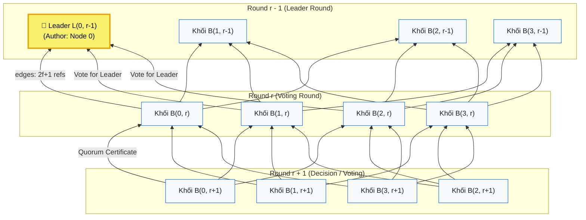
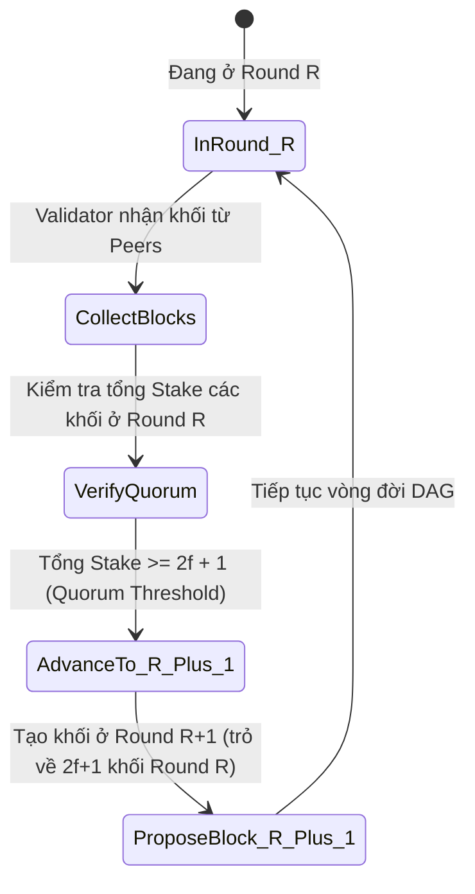
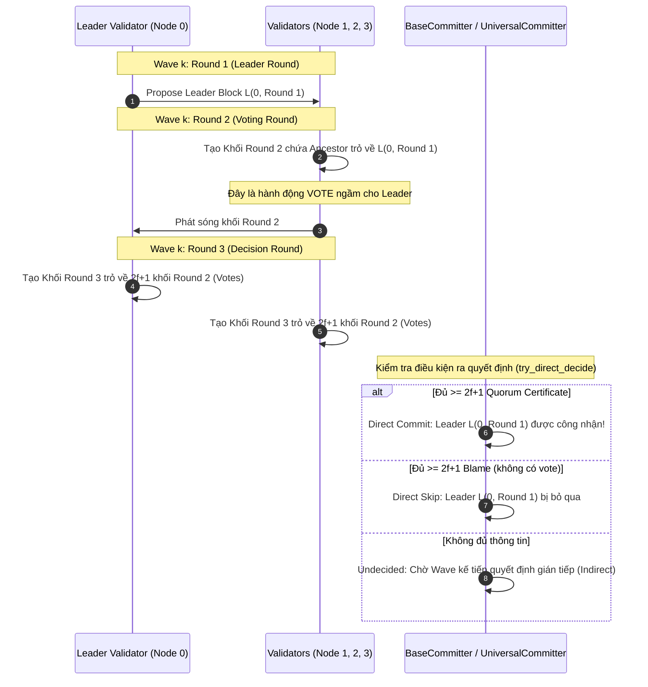
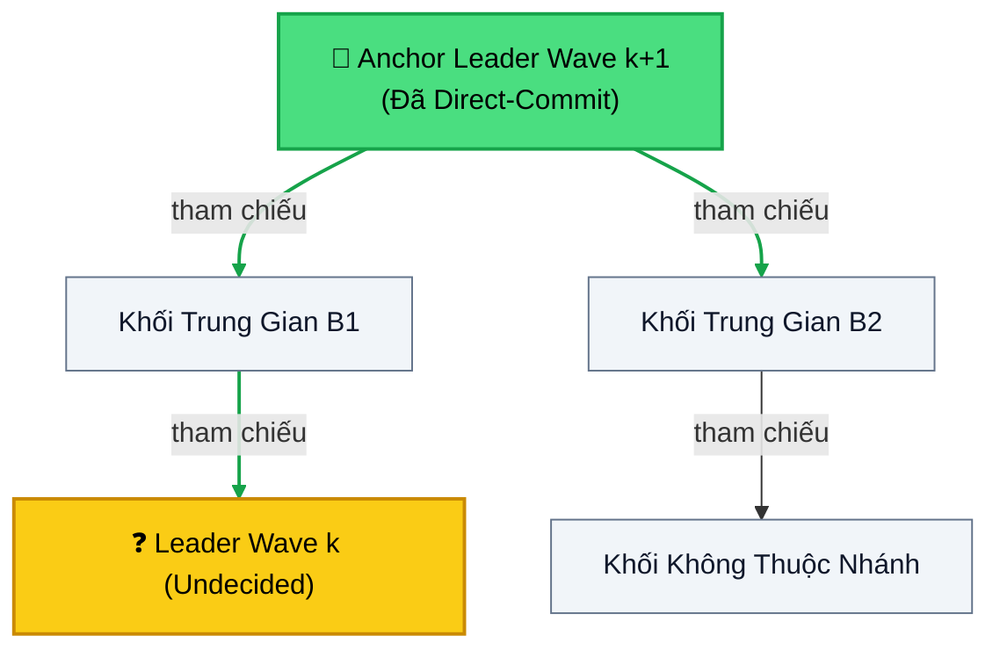
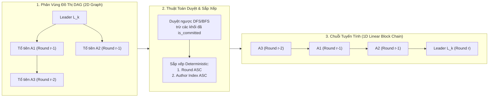
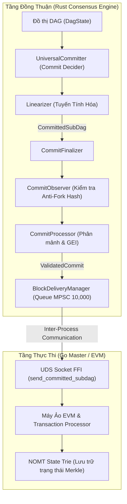

# 🕸️ Kiến Trúc Đồ Thị Có Hướng Không Tuần Hoàn (DAG) Trong Hệ Thống Đồng Thuận MetaNode

Tài liệu này cung cấp mô tả chi tiết, chuyên sâu và trực quan về kiến trúc **DAG (Directed Acyclic Graph)** trong lõi đồng thuận (Consensus Core) của blockchain MetaNode. Tài liệu tập trung vào cấu trúc đồ thị, cơ chế tiến vòng (Threshold Clock), chu kỳ Wave, thuật toán bầu chọn và quyết định Leader (Direct & Indirect Decision), quy trình tuyến tính hóa (Linearization), cùng các rào chắn bảo vệ bất biến **Zero-Fork Invariant**.

> [!NOTE]
> Tài liệu này mô tả logic luồng khối DAG nội bộ (Rust Consensus). Để hiểu về sự tương tác với máy ảo EVM (Go), xem phần Pipeline ở cuối tài liệu.

## 📑 Mục Lục
1. [Tổng Quan Kiến Trúc Đồng Thuận Dựa Trên DAG](#1-tổng-quan-kiến-trúc-đồng-thuận-dựa-trên-dag)
2. [Cấu Trúc Khối Và Đồ Thị (Block, Vertices & Edges)](#2-cấu-trúc-khối-và-đồ-thị-block-vertices--edges)
3. [Tiến Trình Thời Gian & Đồng Hồ Ngưỡng (Threshold Clock)](#3-tiến-trình-thời-gian--đồng-hồ-ngưỡng-threshold-clock)
4. [Chu Kỳ Wave & Bầu Chọn Lãnh Đạo (Waves & Leader Election)](#4-chu-kỳ-wave--bầu-chọn-lãnh-đạo-waves--leader-election)
5. [Quy Tắc Quyết Định: Trực Tiếp Và Gián Tiếp (Direct & Indirect Decision)](#5-quy-tắc-quyết-định-trực-tiếp-và-gián-tiếp-direct--indirect-decision)
6. [Tuyến Tính Hóa Đồ Thị (Linearization) & Tạo Sub-DAG](#6-tuyến-tính-hóa-đồ-thị-linearization--tạo-sub-dag)
7. [Rào Chắn Chống Phân Nhánh (Zero-Fork Invariant) Trong Kiến Trúc DAG](#7-rào-chắn-chống-phân-nhánh-zero-fork-invariant-trong-kiến-trúc-dag)
8. [Luồng Dữ Liệu Từ Rust DAG Sang Go EVM & Cơ Chế Phân Mảnh](#8-luồng-dữ-liệu-từ-rust-dag-sang-go-evm--cơ-chế-phân-mảnh)
9. [Điểm Mạnh Và Điểm Yếu Của Kiến Trúc DAG](#9-điểm-mạnh-và-điểm-yếu-của-kiến-trúc-dag)

---

## 1. Tổng Quan Kiến Trúc Đồng Thuận Dựa Trên DAG

Trong các blockchain truyền thống (như Bitcoin, Ethereum 1.0, Tendermint), quá trình **phát tán dữ liệu (data dissemination)** và **đồng thuận thứ tự (ordering/consensus)** gắn liền với nhau: mỗi round một block đơn được đề xuất và biểu quyết, gây nghẽn băng thông và độ trễ cao.

MetaNode sử dụng mô hình đồng thuận DAG BFT hiệu năng cao (lấy cảm hứng từ kiến trúc Narwhal / Bullshark / Mysticeti):
1. **Phát tán song song (Parallel Proposing):** Tất cả validator đồng thời tạo và phát sóng các khối chứa giao dịch ở mỗi round mà không cần chờ đợi một leader duy nhất đóng block.
2. **Bỏ phiếu ngầm qua cấu trúc liên kết (Implicit Voting via Edges):** Không cần gửi riêng các thông điệp vote/commit rời rạc. Mỗi khối được tạo ở round $r$ sẽ tự động chứa tham chiếu mã hóa (edges) trỏ về ít nhất $2f+1$ khối của round $r-1$. Sự hiện diện của liên kết này chính là lá phiếu xác nhận tính hợp lệ của các khối tổ tiên.
3. **Tách rời Thực thi và Đồng thuận (Decoupled Consensus & Execution):** Đồ thị DAG được xây dựng và chốt thứ tự (Linearization) hoàn toàn trong lõi Rust, sau đó các `CommittedSubDag` được chuyển giao tuần tự sang Go Master để thực thi máy ảo EVM và cập nhật state trie NOMT.

---

## 2. Cấu Trúc Khối Và Đồ Thị (Block, Vertices & Edges)

Đồ thị DAG trong MetaNode là tập hợp các đỉnh (Vertices - là các `VerifiedBlock`) và các cạnh có hướng (Edges - là các liên kết tham chiếu tổ tiên `BlockRef`).



### Cấu trúc dữ liệu cốt lõi:
- **`VerifiedBlock` (`consensus/metanode/meta-consensus/core/src/block.rs`):**
  - `author`: `AuthorityIndex` định danh validator tạo khối.
  - `round`: Số thứ tự vòng hiện tại (1, 2, 3...).
  - `epoch`: Epoch đang hoạt động.
  - `ancestors`: Danh sách `BlockRef` gồm ít nhất $2f+1$ khối hợp lệ ở vòng $r-1$.
  - `transactions`: Mảng payload giao dịch (user txs, system txs).
  - `digest`: `BlockDigest` (Keccak/Blake2b hash duy nhất của khối).
  - `timestamp_ms`: Mốc thời gian tạo khối của tác giả.
- **`DagState` (`consensus/metanode/meta-consensus/core/src/dag_state/`):**
  - Nơi quản lý và lưu giữ đồ thị DAG trong RAM kết hợp lưu bền vững xuống `RocksDB`.
  - Cung cấp các thao tác tra cứu tổ tiên (`get_blocks`), kiểm tra khối đã commit (`is_committed`), và xác định vòng dọn rác (`gc_round`).

---

## 3. Tiến Trình Thời Gian & Đồng Hồ Ngưỡng (Threshold Clock)

Hệ thống DAG trong MetaNode hoạt động hoàn toàn bất đồng bộ (Asynchronous) đối với thời gian vật lý. Việc chuyển đổi giữa các Round được điều khiển bởi **Threshold Clock**:



1. **Điều kiện tiến vòng:** Một validator chỉ có thể bước từ Round $r$ sang Round $r+1$ khi và chỉ khi trong bộ đệm cục bộ của nó đã nhận và xác thực thành công các khối ở Round $r$ từ tập hợp validators đại diện cho ít nhất **$2f+1$ tổng số Stake** (Quorum Threshold).
2. **Không có kẹt thời gian:** Kể cả khi clock giữa các máy có độ lệch (drift), tiến trình consensus vẫn tiến lên liên tục dựa trên dữ liệu mạng (Data-Driven Progression).

---

## 4. Chu Kỳ Wave & Bầu Chọn Lãnh Đạo (Waves & Leader Election)

Để biến DAG thành thứ tự giao dịch tuyến tính tuyệt đối, các vòng (Rounds) được nhóm thành các **Wave**. Mặc định độ dài wave là **3 rounds** (`DEFAULT_WAVE_LENGTH = 3`):

$$\text{Wave}(r) = \lfloor r / 3 \rfloor$$

Trong mỗi Wave, các round đóng vai trò chuyên biệt:

| Thứ Tự Trong Wave | Tên Round | Chức Năng Chính |
|---|---|---|
| **Round $3k + 1$** | **Leader Round** | Mỗi Wave có 1 vị trí Leader định trước (`Slot = (Round, Authority)`) dựa trên thuật toán giả ngẫu nhiên xác định `LeaderSchedule`. Validator Leader công bố khối tại round này. |
| **Round $3k + 2$** | **Voting Round** | Tất cả validators đề xuất khối ở round này. Một khối chứa liên kết tổ tiên trỏ đến Leader Block được tính là **1 phiếu bầu (Vote)** cho Leader. |
| **Round $3k + 3$** | **Decision Round** | Các validator đề xuất khối trỏ về các khối ở Voting Round. Nếu khối ở Decision Round có quan hệ nhân quả trỏ tới đủ $2f+1$ phiếu bầu, khối đó cấu thành một **Chứng chỉ (Quorum Certificate)** chứng nhận Leader đắc cử. |



---

## 5. Quy Tắc Quyết Định: Trực Tiếp Và Gián Tiếp (Direct & Indirect Decision)

Lõi đồng thuận `BaseCommitter` và `UniversalCommitter` (`consensus/metanode/meta-consensus/core/src/base_committer.rs`) áp dụng hai cơ chế ra quyết định:

### 5.1. Quyết định trực tiếp (`try_direct_decide`)
Được áp dụng ngay tại Decision Round của chính Wave đó:
- **Direct Commit (`LeaderStatus::Commit(LeaderBlock)`):** Nếu khối Leader nhận được sự hỗ trợ từ ít nhất $2f+1$ stake tại Decision Round (`enough_leader_support`).
- **Direct Skip (`LeaderStatus::Skip(LeaderSlot)`):** Nếu có ít nhất $2f+1$ non-votes (blame) từ các validators tại Voting Round (`enough_leader_blame`), chứng minh rằng khối Leader sẽ không bao giờ có thể đạt được chứng chỉ hợp lệ.

### 5.2. Quyết định gián tiếp (`try_indirect_decide`)
Nếu mạng bị chậm hoặc mất gói khiến Leader của Wave cũ rơi vào trạng thái `Undecided`:
- Thuật toán không bao giờ dùng timeout để ép commit.
- Nó sẽ chờ đợi Leader của các Wave tương lai (gọi là **Anchor Leader**) được commit thành công.
- **Quy tắc đệ quy nhân quả:** Duyệt ngược đồ thị DAG từ Anchor Leader:
  - Nếu tồn tại đường đi (causal path) từ Anchor Leader về Leader cũ $\to$ **Commit gián tiếp** Leader cũ.
  - Nếu không tồn tại đường đi $\to$ **Skip gián tiếp** Leader cũ.


> [!NOTE]
> *Đồ thị nhân quả từ Anchor trỏ ngược về Leader cũ: Quyết định commit gián tiếp Leader cũ được bảo toàn trên 100% các node mà không cần đồng thuận lại.*

---

## 6. Tuyến Tính Hóa Đồ Thị (Linearization) & Tạo Sub-DAG

Khi một Leader $L_k$ được quyết định (Committed), nhiệm vụ của `Linearizer` (`consensus/metanode/meta-consensus/core/src/linearizer/mod.rs`) là chuyển đổi phân vùng đồ thị 2 chiều (DAG) thành một danh sách khối 1 chiều xác định (Linear Chain):



### Chi tiết các bước thực hiện trong mã nguồn:
1. **Duyệt ngược tìm tổ tiên (`linearize_sub_dag`):**
   - Bắt đầu từ `LeaderBlock`.
   - Thu thập tất cả các khối tổ tiên chưa được commit (`!dag_state.is_committed(ancestor)`) có `round > gc_round`.
   - Nếu phát hiện bất kỳ khối tổ tiên nào còn thiếu trong local DAG, quá trình thu thập sẽ tạm dừng (defer) để chờ đồng bộ khối, triệt tiêu nguy cơ sai lệch trạng thái.
2. **Sắp xếp xác định (`sort_sub_dag_blocks`):**
   ```rust
   // Sắp xếp các khối trong sub-dag theo thứ tự round tăng dần, 
   // nếu cùng round thì so sánh chỉ số tác giả (AuthorityIndex)
   pub(crate) fn sort_sub_dag_blocks(blocks: &mut [VerifiedBlock]) {
       blocks.sort_by(|a, b| {
           a.round()
               .cmp(&b.round())
               .then_with(|| a.author().cmp(&b.author()))
       })
   }
   ```
3. **Đóng gói `CommittedSubDag`:**
   - Tạo đối tượng `CommittedSubDag` chứa Leader, danh sách khối đã sắp xếp và toàn bộ transactions.
   - Tạo bản ghi lưu trữ `CommitV1` chứa `index`, `previous_digest`, `timestamp_ms`, `global_exec_index`, `leader_address`.
   - Đánh dấu tất cả các khối trong SubDag bằng cờ `is_committed = true` trong `DagState`.

---

## 7. Rào Chắn Chống Phân Nhánh (Zero-Fork Invariant) Trong Kiến Trúc DAG

> [!IMPORTANT]
> Cơ chế DAG của MetaNode tuân thủ nghiêm ngặt nguyên tắc tối thượng: **100% KHÔNG FORK — Thà pending chứ không fork**.

| Cơ Chế Bảo Vệ | Vị Trí Triển Khai | Mô Tả Kỹ Thuật |
|---|---|---|
| **Cold-Start Guard (Guard 6/6a/6b)** | `linearizer/mod.rs` | Kiểm tra toàn diện mọi khối cha round $r-1$ mà Leader trỏ đến phải tồn tại trong local DAG trước khi tính `median_timestamp_by_stake`. Nếu thiếu dù chỉ 1 block cha, commit sẽ bị hủy (abort/defer) để tránh tính lệch timestamp giữa các nodes. |
| **Immutability of `global_exec_index`** | `commit.rs` / `linearizer/mod.rs` | Chỉ số thực thi toàn cục `GEI` được chốt chết ngay trong cấu trúc `CommitV1` được đồng thuận. Không cho phép bất kỳ node nào tự suy đoán hoặc tính toán lại tại local. |
| **Consensus-Agreed `leader_address`** | `commit.rs` (`new_with_leader_address`) | Địa chỉ ví EVM của Leader được nhúng trực tiếp vào payload của `CommitV1` tại thời điểm tạo commit bởi Linearizer, ngăn chặn sự sai lệch khi các node phân giải địa chỉ validator. |
| **Deferred Broadcaster (RocksDB Ticket)** | `core.rs` / `dag_state.rs` | Block mới tạo được lưu xuống đĩa SSD (`fsync`) xong xuôi thì vé `FlushTicket` mới kích hoạt việc phát sóng P2P. Ngăn chặn triệt để hiện tượng Equivocation nếu node bị crash đột ngột. |
| **Peer Attestation (CommitVoteMonitor)** | `commit_vote_monitor.rs` | Deadlock escape hoàn toàn dựa trên dữ liệu thật từ các peers (`PeerAttestResult { Ok, Conflict, Insufficient }`). Tuyệt đối không dùng `sleep` hay `timeout` để ép commit. |

---

## 8. Luồng Dữ Liệu Từ Rust DAG Sang Go EVM & Cơ Chế Phân Mảnh

Sau khi đồ thị DAG được tuyến tính hóa thành các Sub-DAG, luồng dữ liệu được đẩy sang tầng thực thi Go:



### Cơ Chế Phân Mảnh (Fragmentation):
Khác với mô hình một khối truyền thống, một Sub-DAG có thể bao gồm hàng trăm `VerifiedBlock` với hàng triệu giao dịch, vượt quá khả năng xử lý gas của một Block thực thi Go. Do đó, quy trình được quản lý qua `CommitProcessor`:
1. **`CommitProcessor`** xử lý fragmentation (chia nhỏ Sub-DAG):
   - Nếu tổng gas của Sub-DAG vượt quá gas limit của Go (ví dụ: 100M gas), Sub-DAG sẽ được chia thành nhiều *fragments* (mảnh nhỏ).
   - Mỗi mảnh được gán một Global Execution Index (`GEI`) riêng biệt để Go thực thi thành các khối liên tiếp.
2. **`BlockDeliveryManager`** kiểm soát tốc độ gửi qua Unix Domain Socket (UDS) sang Go Master. Nếu quá trình gửi sang Go thất bại, hệ thống sẽ dừng ngay lập tức (fail-fast) để tránh mất mát thứ tự block.
3. **Go Master** tiếp nhận danh sách transactions của từng fragment, thực thi state transition trong EVM, tạo receipt và cập nhật cơ sở dữ liệu NOMT Trie theo từng `GEI`.

---

## 9. Điểm Mạnh Và Điểm Yếu Của Kiến Trúc DAG

Việc triển khai cấu trúc DAG-BFT cho MetaNode Consensus mang lại bước nhảy vọt về hiệu năng, nhưng cũng đi kèm với một số sự đánh đổi về độ phức tạp.

### 🌟 Điểm Mạnh (Strengths)

1. **Thông lượng cực cao (Ultra-high Throughput):** Khác với PBFT hay Tendermint (khi 1 leader đóng gói 1 block ở mỗi round), DAG cho phép *tất cả* các validators phát tán block song song (Parallel Proposing). Băng thông mạng được sử dụng tối đa, loại bỏ hoàn toàn hiện tượng thắt cổ chai tại leader.
2. **Độ trễ thấp & Kháng lỗi Asynchronous:** Nhờ `Threshold Clock`, hệ thống tiến vòng khi nhận đủ dữ liệu ($2f+1$ stake) thay vì dựa vào timeout hay đồng hồ vật lý. DAG BFT hoàn toàn miễn nhiễm với các lỗi đồng bộ hóa thời gian (clock drift) hay độ trễ mạng ngẫu nhiên.
3. **Không gián đoạn khi Leader sập (Graceful Degradation):** Khi Leader của một Wave bị ngắt kết nối (offline) hoặc kiểm duyệt, mạng lưới không cần trải qua quá trình thay đổi leader (View Change) phức tạp. Các node chỉ lỡ 1 nhịp commit tại Wave đó, và Leader lỗi sẽ được "Commit Gián Tiếp" (Indirect Decision) ngay ở các Wave tiếp theo khi có Anchor Leader mới.
4. **Tính Công Bằng (Fairness):** Vì mọi node đều đóng góp giao dịch vào đồ thị DAG ở mọi round, phần thưởng (reward) có thể được tính toán công bằng dựa trên số lượng block của validator được thu thập vào Sub-DAG, thay vì tình huống "được ăn cả" khi may mắn làm leader.

### ⚠️ Điểm Yếu / Đánh Đổi (Trade-offs / Weaknesses)

1. **Độ phức tạp lập trình cao:** Việc thiết kế và bảo trì một cấu trúc đồ thị 2 chiều khó khăn và dễ sinh lỗi hơn rất nhiều so với chuỗi đơn truyền thống (Linear Blockchain). Đặc biệt là việc xử lý các "khoảng trống đồ thị" (Missing blocks/Gaps) có thể dẫn đến lệch trạng thái nếu không có các hàng rào chống fork nghiêm ngặt (như Guard 6).
2. **Tiêu tốn I/O và Bộ Nhớ:** DAG duy trì hàng ngàn block trỏ chéo lẫn nhau trong một khoảng thời gian ngắn. Hệ thống đòi hỏi phải giữ tập hợp `recent_blocks` khổng lồ trong RAM và thường xuyên ghi xuống `RocksDB` (để chống Equivocation), làm tăng chi phí phần cứng (Disk I/O & Memory Overhead).
3. **Độ Phức Tạp Phân Mảnh (Fragmentation):** Do quá trình Linearization gộp *tất cả* block của mọi người vào một khối Sub-DAG duy nhất, kích thước một lần chốt (Commit) có thể lên đến hàng triệu giao dịch, dễ dàng làm sập máy ảo thực thi. Quá trình chia nhỏ Sub-DAG thành các `GEI` fragments đòi hỏi logic xử lý vi mô phức tạp.
4. **Chi Phí Phục Hồi (Recovery Overhead):** Khi một node bị sập và tái khởi động, quá trình đồng bộ hóa bắt kịp (Catch-up) đòi hỏi Node phải tải và vẽ lại một vùng biểu đồ DAG rườm rà qua mạng P2P thay vì chỉ tải từng block nối đuôi đơn giản.
