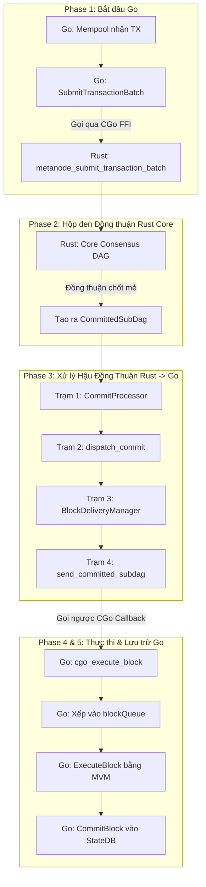

# Luồng Vòng Đời Của Một Giao Dịch (Go ↔ Rust)

Tài liệu này được viết theo dạng **tuyến tính (step-by-step)** để bạn dễ dàng hình dung đường đi của một giao dịch từ khi user gửi lên, chui qua Rust đồng thuận, và quay về Go để lưu vào Database.

---

## 1. Bức Tranh Tổng Quan Toàn Tập

---

## 2. Diễn Biến Chi Tiết Từng Giai Đoạn (The Linear Flow)

Dưới đây là chi tiết từng bước giao dịch đi qua hệ thống.

### GIAI ĐOẠN 1: Khởi nguồn (Từ Go đi vào Rust)

Giao dịch bắt đầu hành trình của nó từ Go.

- Khi người dùng gửi giao dịch qua RPC, nó nằm ở Mempool của Go.
- Go Master sẽ gom các giao dịch này thành một mảng bytes (batch) và gọi hàm `SubmitTransactionBatch` (trong file `ffi_bridge.go`).
- **Xuyên không (FFI):** Hàm này gọi thẳng vào CGo để chuyển mảng bytes sang Rust. Rust đón nhận tại hàm `metanode_submit_transaction_batch` (trong `ffi.rs`) và ném thẳng vào lõi đồng thuận.

### GIAI ĐOẠN 2: "Hộp đen" Đồng Thuận (Lõi Rust)

Đây là phần khó nhất của thuật toán (HotStuff / Mysticeti DAG).

- Bạn **KHÔNG CẦN** hiểu sâu phần này. Hãy coi nó là cái máy giặt. Bạn ném quần áo (giao dịch) vào, máy chạy rầm rầm.
- Cuối cùng, máy giặt xả ra một mẻ quần áo đã được giặt sạch và sắp xếp đúng thứ tự. Mẻ này gọi là `CommittedSubDag`.

### GIAI ĐOẠN 3: Xử Lý Hậu Đồng Thuận (Chuẩn bị trả về Go)

Ngay khi lõi đồng thuận nhả ra `CommittedSubDag`, dữ liệu sẽ đi qua **4 Trạm kiểm soát** của Rust để dọn dẹp trước khi trả về Go:

- **Trạm 1: `CommitProcessor` (Kẻ giữ trật tự - `processor.rs`)**
  Nó đứng đợi mẻ dữ liệu và **giữ đúng thứ tự commit**. Điểm mới quan trọng:
  - **DIGEST-GATE:** Commit local luôn bị buffer cho đến khi quorum digest xác nhận hoặc có `CertifiedCommit` từ mạng.
  - **WAL (Write-Ahead Log):** Ghi PENDING trước khi gửi qua FFI, đánh dấu COMMITTED sau khi Go xác nhận.
  - **Không còn auto-jump / DAG-reset:** Không nhảy index theo gap. Chỉ xử lý theo thứ tự, thiếu commit thì chờ CommitSyncer.
  - **Fast-forward lịch sử:** Nếu `commit_index <= go_last_commit_index` thì skip luôn.

- **Trạm 2: `dispatch_commit` (Hải quan & Màng lọc - `executor.rs`)**
  Nó đếm TX, dựng `batch_id`, và kiểm tra **GEI guard** dựa trên Go (định kỳ query). Điểm mới:
  - **FAST-SKIP commit rỗng** (không TX, không SystemTX) → **không gửi Go** và **không tăng GEI**.
  - Trả về `geis_consumed` để CommitProcessor cập nhật cursor GEI (1 hoặc N nếu bị fragment).
  - Sau khi qua các guard, nó gói `ValidatedCommit` để gửi xuống BlockDeliveryManager.

- **Trạm 3: `BlockDeliveryManager` (Người vận chuyển - `block_delivery.rs`)**
  Chạy ngầm liên tục, túc trực ở ống nước. Có `ValidatedCommit` rơi xuống là nó vác đi 2 nơi: một là ném cho P2P broadcast, hai là ném cho Trạm 4.

- **Trạm 4: `send_committed_subdag` (Xưởng đóng gói xuất khẩu - `block_sending.rs`)**
  - **Fragmentation:** Chặt commit nếu > `MAX_TXS_PER_GO_BLOCK` (hiện tại 50,000 TX/fragment), mỗi fragment tiêu thụ 1 GEI.
  - **Protobuf strict boundary:** Từ chối dữ liệu sai schema (leader_address không đủ 20 bytes, v.v.).
  - **Dedup + replay protection:** Skip fragment đã được xử lý hoặc đã gửi.
  - Lọc `SystemTransaction` khỏi user tx, encode Protobuf rồi gọi `cgo_execute_block`.

### GIAI ĐOẠN 4 & 5: Thực thi và Chốt sổ (Về lại Go)

- Go đang ngủ thì nhận được lệnh gọi từ Rust qua hàm `cgo_execute_block`.
- Nó giải mã Protobuf thành `ExecutableBlock` và ném vào một hàng đợi tên là `blockQueue`.
- Vòng lặp `processRustEpochData` (trong `block_processor_network.go`) nhặt block ra.
- Go gọi máy ảo **MVM (ExecuteBlock)** để chạy code smart contract, trừ tiền, cộng tiền.
- Cuối cùng, chạy **CommitBlock**, lưu số dư mới vào PebbleDB/RocksDB và cập nhật rễ cây Merkle (State Root). Hoàn tất một vòng đời!

---

## 3. Tư Duy Debug: Chốt chặn ở 2 Cửa Ngõ

Nếu bạn gặp bug liên quan đến định dạng giao dịch, mất giao dịch, hoặc hash bị sai, hãy áp dụng tư duy "Hộp đen". Lỗi 99% nằm ở 2 cửa ngõ Xuyên Không:

1. **CỬA VÀO (Lỗi do Go gửi sai):**
   - File: `ffi_bridge.go` (Go) và `ffi.rs` (Rust).
   - *Cách Debug:* In log mảng bytes ngay trước khi Go ấn nút gửi đi xem có đúng chuẩn Protobuf hay không.

2. **CỬA RA (Lỗi do Rust trả về sai):**
   - File: `block_sending.rs` (Trạm 4).
   - Đây là nơi thường xuyên lọt rác nhất. Lỗi `(size=64 bytes)` mà Go phàn nàn không unmarshal được chính là do **Trạm 4** làm rò rỉ dữ liệu (không lọc sạch rác) trước khi đẩy cho Go.
   - *Cách Debug:* Bắt lỗi `Unmarshal` bên Go để in ra mã Hex, từ đó quay lại Trạm 4 của Rust viết code chẹn (if block) để lọc mã Hex đó đi.

---

## 4. Cấu trúc Dữ liệu Truyền tải (ExecutableBlock)

Khi Rust gửi block sang Go (qua CGO FFI), dữ liệu được gói trong Protobuf chứa:

- **`Transactions`**: Mảng chứa danh sách bytes của các giao dịch. Đây là nơi Go hay phàn nàn nếu có rác.
- **`Global_exec_index` (GEI)**: Số thứ tự toàn cầu. GEI **chỉ tăng khi commit thật sự được dispatch** (commit rỗng bị FAST-SKIP không làm tăng GEI).
- **`Block_number`**: Số thứ tự của Block. Chú ý: Block rỗng sẽ bị đánh số `0` và Go sẽ vứt bỏ không ghi vào DB.
- **`Commit_timestamp_ms`**: Thời gian để làm `block.timestamp` cho Smart Contract.

---
*Tài liệu này được sắp xếp theo dạng Tuyến Tính để bạn dễ dàng theo dõi dòng chảy dữ liệu của toàn bộ kiến trúc MetaNode.*
