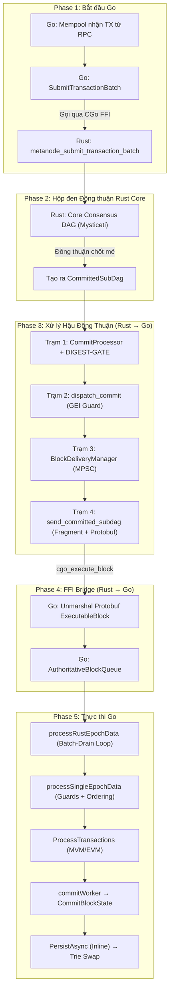
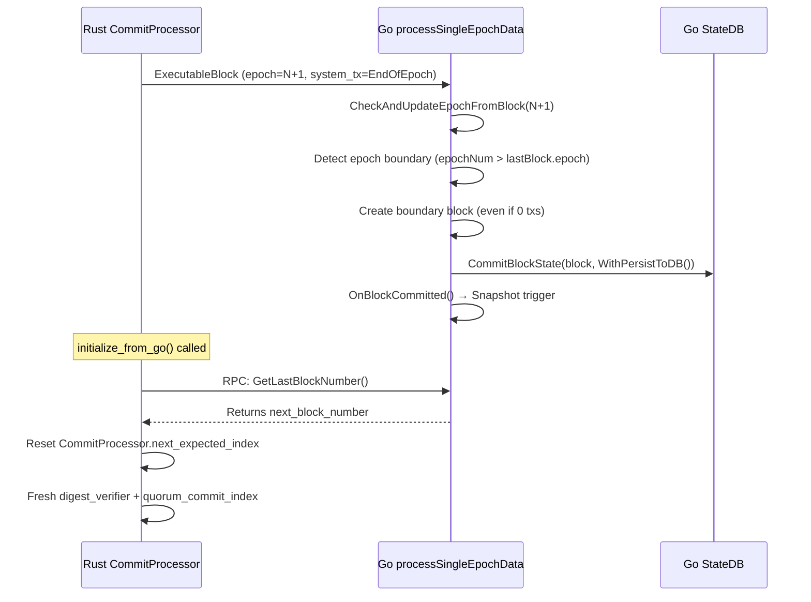

# Luồng Vòng Đời Của Một Giao Dịch (Go ↔ Rust)

Tài liệu này được viết theo dạng **tuyến tính (step-by-step)** để bạn dễ dàng hình dung đường đi của một giao dịch từ khi user gửi lên, chui qua Rust đồng thuận, và quay về Go để lưu vào Database.

---

## 1. Bức Tranh Tổng Quan Toàn Tập

---

## 2. Diễn Biến Chi Tiết Từng Giai Đoạn (The Linear Flow)

Dưới đây là chi tiết từng bước giao dịch đi qua hệ thống.

### GIAI ĐOẠN 1: Khởi nguồn (Từ Go đi vào Rust)

Giao dịch bắt đầu hành trình của nó từ Go.

- Khi người dùng gửi giao dịch qua RPC, nó nằm ở Mempool của Go.
- Go Master sẽ gom các giao dịch này thành một mảng bytes (batch) và gọi hàm `SubmitTransactionBatch` (trong file `ffi_bridge.go`).
- **Xuyên không (FFI):** Hàm này gọi thẳng vào CGo để chuyển mảng bytes sang Rust. Rust đón nhận tại hàm `metanode_submit_transaction_batch` (trong `ffi.rs`) và ném thẳng vào lõi đồng thuận.

**File liên quan:** `executor/ffi_bridge.go` (line 280-291)

### GIAI ĐOẠN 2: "Hộp đen" Đồng Thuận (Lõi Rust)

Đây là phần khó nhất của thuật toán (HotStuff / Mysticeti DAG).

- Bạn **KHÔNG CẦN** hiểu sâu phần này. Hãy coi nó là cái máy giặt. Bạn ném quần áo (giao dịch) vào, máy chạy rầm rầm.
- Cuối cùng, máy giặt xả ra một mẻ quần áo đã được giặt sạch và sắp xếp đúng thứ tự. Mẻ này gọi là `CommittedSubDag`.

### GIAI ĐOẠN 3: Xử Lý Hậu Đồng Thuận (Chuẩn bị trả về Go)

Ngay khi lõi đồng thuận nhả ra `CommittedSubDag`, dữ liệu sẽ đi qua **4 Trạm kiểm soát** của Rust để dọn dẹp trước khi trả về Go:

#### Trạm 1: `CommitProcessor` — Kẻ giữ trật tự (`processor.rs`)

Nó đứng đợi mẻ dữ liệu và **giữ đúng thứ tự commit**. Đây là nơi quan trọng nhất:

- **DIGEST-GATE (Cơ chế chống fork):**
  - Commit từ Local Committer (DAG local) → **KHÔNG dispatch ngay**.
  - Buffer vào `pending_local_commits` (BTreeMap).
  - CHỈ dispatch khi `digest_verifier` xác nhận quorum (2f+1 node) đồng ý cùng `digest`.
  - Nếu `CertifiedCommit` từ mạng đến cùng `commit_index` → dùng CertifiedCommit, vứt local.

- **3 Bypass Case:**

  | Bypass | Điều kiện | Mục đích |
  |---|---|---|
  | **QUORUM-GC-BYPASS** | `quorum_commit_index > local_idx + 50,000` | Digest đã bị GC → mạng đã đồng ý |
  | **COLD-START-BYPASS** | `qci == 0 && waiting >= 30s` | Epoch mới, chưa có digest data |
  | **MEMORY-GUARD** | Buffer > 500 commits | Drop oldest, CommitSyncer re-deliver |

- **WAL (Write-Ahead Log):**
  - Ghi trạng thái `PENDING` trước khi gọi FFI tới Go.
  - Đánh dấu `COMMITTED` sau khi Go xác nhận qua `DoneChan`.
  - Khi restart, WAL cho biết commit nào bị crash giữa chừng.

- **Strict-Order Dispatch:**
  - `next_expected_index` CHỈ tăng khi commit thực sự được dispatch.
  - Commit bị buffer → index KHÔNG tăng → đảm bảo Go nhận đúng thứ tự.
  - Không còn auto-jump hay DAG-reset.

- **Fast-forward lịch sử:** Nếu `commit_index <= go_last_commit_index` → skip luôn.

- **FORK-FORENSIC logging:** Khi local leader ≠ certified leader → log đầy đủ fingerprint (author_idx, ETH address, digest, tx count) để forensic phân tích sau.

> **🔍 GIẢI PHẪU 2 LOẠI BUFFER TRONG COMMIT PROCESSOR:**
>
> **1. `pending_local_commits` (Bộ đệm chờ kiểm duyệt Digest)**
> - **Là gì:** Chứa các commit do chính node hiện tại tự sinh ra (Local Commit / `decided_with_local_blocks == true`).
> - **Khi nào được lưu:** Ngay khi nhận được từ lõi đồng thuận, nhưng mạng lưới (Quorum) **chưa** xác nhận chữ ký Digest. Nó phải nằm đây chờ `DIGEST-GATE`.
> - **Khi nào bị xóa (Remove):**
>   - *Hợp lệ (Dispatch):* Khi `digest_verifier` báo có 2f+1 node mạng xác nhận cùng hash digest → Gỡ khỏi buffer để gửi sang Go xử lý.
>   - *Hết hạn (Stale Evict):* Nếu bị lệch hash với mạng lưới quá 30 giây → Bị xóa bỏ hoàn toàn (chờ mạng gửi bản Certified chuẩn về thay thế).
>   - *Bị đè (Replace):* Nếu nhận được một `CertifiedCommit` (mạng đã verify) có cùng `commit_index` → Xóa bản local trong buffer, dùng bản certified.
>   - *Đầy bộ nhớ:* Khi vượt quá `MAX_PENDING_LOCAL_COMMITS` (500) → Drop cái cũ nhất để chống OOM.
>
> **2. `pending_commits` (Bộ đệm chờ tới lượt - Out-of-Order)**
> - **Là gì:** Chứa các commit (có thể là local hoặc certified) bay về **sai thứ tự** (nhảy cóc).
> - **Khi nào được lưu:** Khi `commit_index > next_expected_index`. Ví dụ hệ thống đang đợi commit 10, nhưng nhảy bụp một phát nhận được commit 12. Commit 12 sẽ bị nhét vào đây chờ.
> - **Khi nào bị xóa (Remove):**
>   - *Tới lượt (Drain):* Khi hệ thống đã xử lý xong commit 10, 11 (do `CommitSyncer` kéo về lấp chỗ trống), `next_expected_index` chạy tới 12 → Nó sẽ gỡ commit 12 ra để xử lý tiếp (kiểm duyệt digest hoặc dispatch).
>   - *Quá tải (Capacity Evict):* Nếu mảng này phình to > 50,000 commits (`MAX_PENDING_COMMITS`) → Dùng `pop_last()` để xóa commit có index **lớn nhất (xa nhất trong tương lai)**. Lõi đồng thuận sẽ tự `sync` lại commit này sau.
>
> **⚙️ CƠ CHẾ HOẠT ĐỘNG 3 PHA CỦA COMMIT PROCESSOR:**
>
> CommitProcessor chạy một vòng lặp liên tục xử lý block theo cơ chế 3 pha khép kín. Mục đích tối thượng là đảm bảo tính **Tuyệt đối Tuần tự (Strict Sequential Order)** theo `next_expected_index`:
> 
> - **Pha 1: Duyệt `pending_local_commits` (DIGEST-GATE POLL)**
>   Kiểm tra các commit do máy tự đào (Local) đang bị nhốt. Nếu `digest_verifier` báo có đủ 2f+1 chữ ký mạng (hoặc thỏa điều kiện Bypass), hệ thống sẽ tháo nó ra và gửi sang Go (dispatch). Sau khi dispatch thành công, tăng `next_expected_index` lên 1.
>
> - **Pha 2: Rút rỗng `pending_commits` (OOO DRAIN)**
>   Vì Pha 1 vừa tăng `next_expected_index`, hệ thống sẽ quét xem index mới đó có đang nằm sẵn trong "Phòng chờ Tương lai" không. Nếu có, tháo ra xử lý (nếu là local thì lại kiểm duyệt, nếu là certified thì đi tiếp), dispatch, tăng index lên 1, và lặp lại vét đáy rổ cho đến khi đứt chuỗi.
>
> - **Pha 3: Nhận khối mới từ `receiver` (RECEIVE NEW)**
>   Sau khi dọn dẹp sạch sẽ 2 phòng chờ, nó mới mở ống nước nhận khối mới từ lõi DAG.
>   - *Cơ chế Chống Kẹt (Polling & Timeout):* NẾU phòng chờ Local đang có khối bị nhốt, nó dùng `tokio::select!` đợi khối mới tối đa 200ms. Hết 200ms mà không có ai đến, nó `continue` quay lại đầu vòng lặp (Pha 1) để rà soát xem khối đang nhốt đã được mạng đóng mộc chưa.
>   - *Cơ chế Ép ngược (Backpressure):* NẾU phòng chờ trống trơn, nó dùng `receiver.recv().await` đợi vô thời hạn để tiết kiệm 100% CPU và điều tiết tốc độ sinh block của mạng.
>
> **Bảo vệ Tuần Tự (Strict Order):** Không một nhánh logic nào được phép gửi khối sang Go nếu `commit_index != next_expected_index`. Việc tăng sai biến số này sẽ lập tức gây chia nhánh (Fork) vì Go (Execution Layer) sẽ tính toán sai Global Execution Index (GEI).

**File liên quan:** `consensus/commit_processor/processor.rs`

#### Trạm 2: `dispatch_commit` — Hải quan & Màng lọc (`executor.rs`)

Đếm TX, dựng `batch_id`, và kiểm tra các guard:

- **FAST-SKIP commit rỗng:** Nếu `total_transactions == 0` VÀ không có SystemTX → return `Ok(0)`.  
  GEI **KHÔNG tăng** cho commit rỗng → đảm bảo tính toán xác định dựa trên TX thật.

- **GEI GUARD:** Mỗi 200 commit, query Go RPC `get_last_global_exec_index()`.  
  Nếu Go đã xử lý GEI này → skip (trừ EndOfEpoch commit).

- **Pipeline Delivery:** Gửi `ValidatedCommit` vào `delivery_sender` (MPSC channel, capacity 10,000).  
  Trả `expected_fragments` ngay lập tức để unblock CommitProcessor (pipeline, không chờ Go xong).

- **TX Tracking:** Ghi hash TX đã committed vào `committed_transaction_hashes` để `tx_recycler` không resubmit vào epoch mới.  
  Dùng `DEFERRED_TASK_SEMAPHORE` (64 permits) để tránh unbounded goroutine.

- **ForceCommit:** Gửi tín hiệu `ForceCommit` tới Go để trigger Event-Driven Block Generation ngay lập tức.

**File liên quan:** `consensus/commit_processor/executor.rs`

#### Trạm 3: `BlockDeliveryManager` — Người vận chuyển (`block_delivery.rs`)

- Chạy ngầm liên tục trên Tokio runtime.
- Nhận `ValidatedCommit` từ MPSC channel.
- Gọi `executor_client.send_committed_subdag()` để chuyển tới Trạm 4.
- Nếu gửi thất bại → **panic** (fatal, không thể recovery).
- Trả `geis_consumed` về CommitProcessor qua `oneshot` channel.

**File liên quan:** `node/block_delivery.rs`

#### Trạm 4: `send_committed_subdag` — Xưởng đóng gói xuất khẩu (`block_sending.rs`)

Đây là trạm phức tạp nhất, xử lý nhiều edge case:

- **LAYER-1: Protobuf Strict Boundary:**
  - `leader_address` phải chính xác 20 bytes → reject nếu sai (tránh fork do String/Bytes encoding).

- **REPLAY PROTECTION:**
  - `next_expected_index`: Skip block nếu GEI đã xử lý.
  - `sent_indices` (BTreeSet, cap 10,000): Ngăn duplicate từ Consensus + Sync dual-stream.

- **Block Fragmentation:**
  - Nếu commit > `MAX_TXS_PER_GO_BLOCK` (50,000 TX) → chặt thành N fragment.
  - Mỗi fragment có GEI riêng (`GEI, GEI+1, GEI+2, ...`).
  - `commit_index` chỉ gán cho fragment cuối → nếu crash giữa chừng, Go replay toàn bộ commit.
  - Fragment count tính từ `total_tx_before` (consensus deterministic), KHÔNG từ `total_after_dedup`.

- **Sequential Buffering:**
  - Block đi vào `send_buffer` (BTreeMap, key = GEI).
  - `flush_buffer()` gửi FFI tuần tự từ `next_expected_index`.
  - Batch tối đa 500 blocks/lần flush.
  - Nếu gap > 100 → sync Go RPC `get_last_global_exec_index()` để bridge.

- **FFI Call:** Gọi `cgo_execute_block(ptr, len)` → C callback vào Go.

- **Persistence:** Mỗi 100 commits → persist `last_sent_index` ra disk.  
  Mỗi 10 commits → persist `wipe_safe` index (cho DAG-wipe recovery).

- **Block Store:** Lưu `ExecutableBlock` bytes vào RocksDB để sync node có thể fetch trực tiếp.

**File liên quan:** `node/executor_client/block_sending.rs`

### GIAI ĐOẠN 4: FFI Bridge (Rust → Go)

- Rust gọi C function `cgo_execute_block(payload, len)`.
- Go nhận tại `cgo_execute_block()` trong `ffi_bridge.go`:
  1. `C.GoBytes()` — copy data từ C heap sang Go heap.
  2. `proto.Unmarshal(data, &subDag)` — decode Protobuf thành `ExecutableBlock`.
  3. Đẩy vào `AuthoritativeBlockQueue` (channel, capacity 1000).
  4. **Chờ response** từ Go processor (synchronous, timeout 300s).
  5. Return `true/false` cho Rust.

- **AuthoritativeBlockQueue** giúp Go processor gán GEI chính thức và báo lại cho Rust biết `actual_gei` + `geis_consumed`.

**File liên quan:** `executor/ffi_bridge.go` (line 98-157)

### GIAI ĐOẠN 5: Thực thi và Chốt sổ (Về lại Go)

#### 5a. `processRustEpochData` — Vòng lặp chính (`block_processor_network.go`)

- Đọc từ 2 channel: `dataChan` (FFI blocks) và `authQueue` (authoritative blocks).
- **Batch-Drain Optimization:**
  - Empty commits (0 TX) → gom thành batch, chỉ persist GEI cuối cùng 1 lần.
  - Drain window 5ms giữa các burst → batch lớn hơn (2000 commits/batch thay vì 200 batch × 10).
  - Tăng tốc 100-10000× cho catch-up sync.

- **TRANSITION SYNC:** Nếu DB GEI > in-memory `nextExpected` → sync từ DB (xử lý epoch transition khi Go state advance ngầm).

- **TRANSITION GUARD (khi dataChan đóng):**
  - Flush `lastBlock` in-memory ra DB qua `CommitBlockState(WithPersistToDB(), WithCommitMappings())`.
  - Ngăn race giữa consensus blocks (in-memory) và P2P sync blocks (DB).

**File liên quan:** `processor/block_processor_network.go` (line 128-470)

#### 5b. `processSingleEpochData` — Xử lý từng block (`block_processor_sync.go`)

Hàm này là nơi chạy MVM/EVM và có rất nhiều guard chống fork:

- **Fast-Path (0 TX):** Skip toàn bộ MVM nếu không có TX. Chỉ cập nhật GEI + epoch.
  - Ngoại lệ: **Epoch Boundary** → vẫn tạo block rỗng đánh dấu epoch mới.
  - Ngoại lệ: **Ghost-Block-Guard** → nếu Rust gán `block_number > 0` → tạo block rỗng tránh gap.

- **Case 1 (Duplicate/Old):** `GEI < nextExpected` → skip. Nếu duplicate có TX mà block trước rỗng → thay thế (EPOCH-RACE-FIX).
- **Case 2 (Future/Gap):** `GEI > nextExpected` → adopt GEI ngay (Rust FFI tuần tự, gap = empty commits đã skip).
- **Case 3 (Sequential):** `GEI == nextExpected` → xử lý bình thường.

- **Guards trước khi execute TX:**
  | Guard | Mục đích |
  |---|---|
  | **NOMT RE-EXECUTION** | Không re-execute block đã có trong DB (NOMT chỉ giữ state mới nhất) |
  | **GEI REGRESSION** | Skip commit đã execute (GEI ≤ lastBlock.GEI) |
  | **TIMESTAMP REGRESSION** | Drop commit nếu timestamp lùi > 30s so với parent (stale DAG local committer) |
  | **NOMT ROOT VERIFY** | So sánh NOMT handle root với trie root, re-align nếu khác |
  | **InvalidateAllState()** | Xóa cache cũ (loadedAccounts, LRU, SmartContract) trước mỗi block |

- **Block Number:** Dùng `block_number` từ Rust (authoritative). Nếu Rust gửi `block_number=0` → skip.

- **COMMIT-FINGERPRINT log:** Mỗi block log đầy đủ `block#, GEI, epoch, commitIdx, leader, digest, txCount` — dùng để so sánh forensic giữa các node.

- **ProcessTransactions:** Gọi MVM/EVM execute → `accumulatedResults` (TXs + Receipts).

- **LATE SILENT DROP:** Nếu tất cả TX đều duplicate → drop block (giữ parity với node continuous đã drop sớm ở Rust `tx_recycler`).

**File liên quan:** `processor/block_processor_sync.go` (line 100-955)

#### 5c. `commitWorker` + `commitToMemoryParallel` — Chốt sổ (`block_processor_commit.go`)

- `commitWorker` nhận `CommitJob` từ `commitChannel`:
  1. Set `GlobalExecIndex` lên block header.
  2. Flush MVM Xapian DB (trước snapshot trigger).
  3. Gọi `CommitBlockState(block, WithPersistToDB(), WithSaveTxMapping())` — atomic state update.
  4. Chạy `commitToMemoryParallel()` — IntermediateRoot + PersistAsync.
  5. **BLS Sign** block hash → gán vào header `AggregateSignature` (TRƯỚC khi close DoneChan).
  6. Close `DoneChan` → signal Rust rằng block đã committed.

- **commitToMemoryParallel:**
  - Chạy `IntermediateRoot(true)` trên Account/Stake/SC tries song song.
  - **PersistAsync chạy INLINE** (không đẩy vào background channel nữa).
  - Đảm bảo trie swap hoàn tất TRƯỚC khi function return.
  - Fix triệt để race condition gây fork tại Block 10136.

- **CommitBlockState** (`block_state_commit.go`):
  Atomic update tất cả state components:
  1. `SetcurrentBlockHeader()` — in-memory header pointer
  2. `SetBlockNumberToHash()` — block→hash mapping
  3. `UpdateLastBlockNumber()` — storage counter
  4. `SaveTxMapping()` — tx_hash→block_number (optional)
  5. `SaveLastBlock()` — persist to LevelDB (optional)
  6. `UpdateStateForNewHeader()` — rebuild tries from roots (optional)
  7. `Commit()` — flush mappings to LevelDB (optional)
  8. `CheckAndUpdateEpochFromBlock()` — auto-update epoch

  **Sequential Guard:** Reject block nếu `blockNum < lastBlockNum` (chống fork/inflation).

**File liên quan:**
- `processor/block_processor_commit.go`
- `pkg/blockchain/block_state_commit.go`

---

## 3. Cơ chế An toàn Chống Fork (Fork-Safety Mechanisms)

### 3a. Phía Rust (Consensus Layer)

| Cơ chế | Vị trí | Mô tả |
|---|---|---|
| **DIGEST-GATE** | `processor.rs` | Buffer local commits, chỉ dispatch khi quorum xác nhận digest |
| **WAL** | `processor.rs` | Ghi PENDING/COMMITTED cho crash recovery |
| **Strict-Order** | `processor.rs` | `next_expected_index` chỉ tăng khi dispatch thành công |
| **GEI GUARD** | `executor.rs` | Query Go RPC, skip nếu Go đã xử lý |
| **FAST-SKIP** | `executor.rs` | Skip empty commits → GEI không tăng |
| **LAYER-1** | `block_sending.rs` | Reject leader_address ≠ 20 bytes |
| **REPLAY PROTECTION** | `block_sending.rs` | `next_expected_index` + `sent_indices` dedup |
| **Deterministic Fragment** | `block_sending.rs` | Fragment count dùng `total_tx_before` (consensus) |

### 3b. Phía Go (Execution Layer)

| Cơ chế | Vị trí | Mô tả |
|---|---|---|
| **GEI REGRESSION** | `block_processor_sync.go` | Skip block nếu GEI ≤ lastBlock.GEI |
| **TIMESTAMP REGRESSION** | `block_processor_sync.go` | Drop block nếu timestamp lùi > 30s |
| **NOMT ROOT VERIFY** | `block_processor_sync.go` | Re-align trie nếu NOMT root ≠ trie root |
| **Sequential Guard** | `block_state_commit.go` | Reject `blockNum < lastBlockNum` |
| **InvalidateAllState()** | `block_processor_sync.go` | Xóa stale cache trước mỗi block |
| **PersistAsync Inline** | `block_processor_commit.go` | Trie swap đồng bộ, không async |
| **BLS Sign trước DoneChan** | `block_processor_commit.go` | Đảm bảo Sub node nhận block đã ký |
| **EPOCH-INFLATION-GUARD** | `block_processor_sync.go` | Chỉ advance epoch cho live blocks (GEI > persisted) |

---

## 4. Tư Duy Debug: Chốt chặn ở 2 Cửa Ngõ

Nếu bạn gặp bug liên quan đến định dạng giao dịch, mất giao dịch, hoặc hash bị sai, hãy áp dụng tư duy "Hộp đen". Lỗi 99% nằm ở 2 cửa ngõ Xuyên Không:

1. **CỬA VÀO (Lỗi do Go gửi sai):**
   - File: `ffi_bridge.go` (Go) và `ffi.rs` (Rust).
   - *Cách Debug:* In log mảng bytes ngay trước khi Go ấn nút gửi đi xem có đúng chuẩn Protobuf hay không.

2. **CỬA RA (Lỗi do Rust trả về sai):**
   - File: `block_sending.rs` (Trạm 4).
   - Đây là nơi thường xuyên lọt rác nhất. Lỗi `(size=64 bytes)` mà Go phàn nàn không unmarshal được chính là do **Trạm 4** làm rò rỉ dữ liệu (không lọc sạch rác) trước khi đẩy cho Go.
   - *Cách Debug:* Bắt lỗi `Unmarshal` bên Go để in ra mã Hex, từ đó quay lại Trạm 4 của Rust viết code chẹn (if block) để lọc mã Hex đó đi.

3. **CỬA SỔ — Fork/Hash Mismatch (Lỗi state divergence):**
   - Dùng log `[COMMIT-FINGERPRINT]` trên Go và `[FORK-FORENSIC]` trên Rust.
   - So sánh `leader`, `digest`, `txs`, `GEI` giữa 2 node.
   - Nếu leader khác → Rust local committer tạo fork (DIGEST-GATE nên đã chặn).
   - Nếu leader giống nhưng hash khác → Go PersistAsync race hoặc trie divergence.

---

## 5. Cấu trúc Dữ liệu Truyền tải (ExecutableBlock)

Khi Rust gửi block sang Go (qua CGO FFI), dữ liệu được gói trong Protobuf `ExecutableBlock`:

| Field | Mô tả |
|---|---|
| `transactions` | Mảng `TransactionExe` (sorted, deduped by Rust) |
| `global_exec_index` (GEI) | Số thứ tự toàn cầu. GEI **chỉ tăng khi commit có TX** (empty = skip) |
| `commit_index` | Số thứ tự commit từ consensus DAG |
| `block_number` | Số thứ tự Block (Rust authoritative). `0` = Go skip tạo block |
| `epoch` | Epoch hiện tại của consensus |
| `commit_timestamp_ms` | Thời gian deterministic (median stake-weighted) cho `block.timestamp` |
| `leader_author_index` | Index của leader trong committee |
| `leader_address` | 20-byte ETH address của leader validator |
| `commit_hash` | Digest của commit (cho forensic + dedup) |
| `is_authoritative_gei` | `false` (hiện tại Rust là authority cho GEI) |
| `system_transactions` | SystemTX (EndOfEpoch, etc.) — chỉ gán cho fragment cuối |

---

## 6. Luồng Đặc biệt: Epoch Transition

**Lưu ý quan trọng:**
- `COLD-START-BYPASS` (30s timeout) cho phép dispatch unverified commit khi epoch mới chưa có digest data.
- `EPOCH-INFLATION-GUARD` (Go) ngăn auto-advance epoch cho replayed blocks (GEI ≤ persisted).
- `initialize_from_go()` phải được gọi sau epoch transition để Go không reject block do "regression".

---

## 7. Resource Monitoring (`block_processor_monitoring.go`)

Go có hệ thống giám sát tài nguyên chạy mỗi 30s:

| Metric | Warning Threshold | Critical Threshold |
|---|---|---|
| ProcessedVirtualTxChain | 80% capacity | — |
| commitChannel | 80% capacity | — |
| stateCommitBlockBuffer | > 100 entries | — |
| Goroutines | > 1,000 | > 10,000 (leak!) |
| Memory (Alloc) | > 2GB | — |
| Memory (Sys) | — | > 4GB (leak!) |
| persistChannel | > 0 items (fence-only!) | — |

**Lưu ý:** `persistChannel` bây giờ là **fence-only**. PersistAsync chạy inline. Nếu có item trong channel → bug.

---

*Tài liệu này được sắp xếp theo dạng Tuyến Tính để bạn dễ dàng theo dõi dòng chảy dữ liệu của toàn bộ kiến trúc MetaNode. Cập nhật lần cuối: May 2026.*
