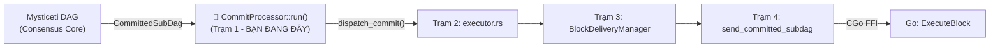
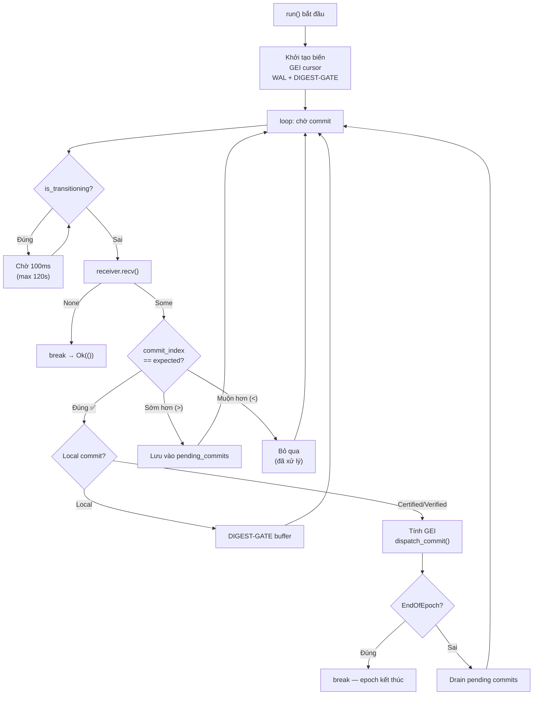

# Giải Thích Chi Tiết Hàm `CommitProcessor::run()`

> [!IMPORTANT]
> **Đúng rồi!** Hàm `run()` chính là **Trạm 1 (Station 1)** trong pipeline xử lý **hậu đồng thuận DAG**. Nó nhận kết quả từ lõi consensus Mysticeti DAG (các `CommittedSubDag`) và đảm bảo chúng được xử lý **đúng thứ tự** trước khi gửi xuống Go để thực thi.

---

## Vị Trí Trong Kiến Trúc



---

## Giải Thích Từng Dòng Code

### PHẦN 1: Khởi Tạo Biến

```rust
let mut receiver = self.receiver;
let mut next_expected_index = self.next_expected_index;
let mut pending_commits = self.pending_commits;
let go_last_commit_index = self.go_last_commit_index;
let commit_index_callback = self.commit_index_callback;
let current_epoch = self.current_epoch;
let executor_client = self.executor_client;
let delivery_sender = self.delivery_sender;
let epoch_transition_callback = self.epoch_transition_callback;
let epoch_eth_addresses = self.epoch_eth_addresses;
let digest_verifier = self.digest_verifier.clone();
```

**Giải thích:** Hàm `run(self)` consume `self` (lấy ownership), nên nó **move** tất cả các field ra thành biến local. Điều này vì Rust ownership — bạn không thể borrow `self` lâu dài trong async loop.

| Biến | Vai trò |
|------|---------|
| `receiver` | Channel nhận `CommittedSubDag` từ consensus core |
| `next_expected_index` | Commit index tiếp theo cần xử lý (bắt đầu từ 1) |
| `pending_commits` | BTreeMap chứa commit đến lệch thứ tự, chờ xử lý sau |
| `commit_index_callback` | Callback thông báo commit index đã xử lý xong |
| `current_epoch` | Epoch hiện tại (dùng tính GEI) |
| `executor_client` | Client gRPC/FFI gửi block sang Go |
| `delivery_sender` | Channel gửi `ValidatedCommit` cho BlockDeliveryManager |
| `go_last_commit_index` | Commit index cuối cùng mà Go đã xử lý (để fast-forward) |
| `epoch_eth_addresses` | Cache ETH address theo epoch để resolve leader |
| `digest_verifier` | Kiểm tra quorum digest (DIGEST-GATE) |
| `epoch_transition_callback` | Callback gọi khi phát hiện EndOfEpoch |

---

### PHẦN 2: GEI Cursor — PHASE-B (Go-Authoritative)

Hiện tại **GEI do Go là nguồn sự thật cuối cùng**. Rust chỉ giữ một **cursor** nội bộ để
gửi tuần tự sang Go:

```rust
let gei = {
    let gei_guard = shared_gei.lock().await;
    *gei_guard + 1
};
```

- `shared_last_global_exec_index` giữ GEI đã xác nhận trước đó.
- Mỗi commit được dispatch xong sẽ **cộng thêm `geis_consumed`** (1 hoặc N nếu fragment).
- **Không còn `epoch_base_index` hay `fragment_offset`** trong CommitProcessor.

---

### PHẦN 3: Heartbeat + LagMonitor (Dòng 273–295)

```rust
let mut last_heartbeat_commit = 0u32;                       // L273
let mut last_heartbeat_time = std::time::Instant::now();    // L274
const HEARTBEAT_INTERVAL: u32 = 1000;                      // L275
const HEARTBEAT_TIMEOUT_SECS: u64 = 300;                   // L276
```

Mỗi **1000 commit** in ra một log heartbeat (`💓`). Nếu **5 phút** (300s) không có commit mới → cảnh báo processor có thể bị **stuck**.

```rust
// Spawn LagMonitor (L279-293)
if let (Some(client), Some(shared_gei), Some(sender)) = (...) {
    let lag_monitor = LagMonitor::new(client, shared_gei, sender);
    tokio::spawn(async move { lag_monitor.run().await; });
}
```

**LagMonitor**: Chạy song song, theo dõi khoảng cách (lag) giữa Rust consensus và Go execution. Nếu Go xử lý quá chậm → gửi alert.

---

### PHẦN 4: WAL + DIGEST-GATE Buffer (Crash-Safe + Fork-Safe)

**WAL (Write-Ahead Log)** ghi `PENDING` trước khi gọi FFI và `COMMITTED` sau khi Go xác nhận.
Nếu crash giữa chừng, WAL cho biết commit nào cần đối chiếu lại (Go idempotent sẽ skip nếu đã xử lý).

**DIGEST-GATE Buffer** giữ các commit local trong `pending_local_commits` cho đến khi:
- `digest_verifier` xác nhận quorum digest **khớp**, hoặc
- Có `CertifiedCommit` từ network thay thế.

Quy tắc: **không bao giờ dispatch commit local chưa xác minh**.

---

### PHẦN 5: Vòng Lặp Chính — `loop` (Dòng 340+)

#### 5A. Kiểm Tra Epoch Transition (Dòng 341–368)

```rust
if let Some(ref is_transitioning) = self.is_transitioning {
    while is_transitioning.load(Ordering::Acquire) {        // L347
        // LOG + CHỜ 100ms mỗi vòng
        tokio::time::sleep(Duration::from_millis(100)).await; // L363

        // SAFETY: Nếu chờ > 120s → force clear flag              
        if elapsed > 120s { is_transitioning.store(false); break; } // L356-361
    }
}
```

> [!WARNING]
> **CRITICAL DEFENSE!** Khi đang chuyển epoch, Go Master đang re-initialize. Nếu Rust tiếp tục gửi commit mới → Go bị **nghẹn**. Nên processor **tạm dừng** (pause) cho đến khi flag `is_transitioning` = false.
>
> Timeout 120s để tránh **deadlock vĩnh viễn** nếu flag không bao giờ được clear (do panic, task bị cancel...).

---

#### 5B. Nhận Commit Từ Channel (Dòng 370–374)

```rust
match receiver.recv().await {
    Some(subdag) => {
        let commit_index: u32 = subdag.commit_ref.index;   // L372
        // ...
    }
    None => { break; }  // Channel đóng → thoát loop (L808-811)
}
```

Đây là **blocking wait**: processor ngồi chờ consensus core nhả ra `CommittedSubDag` tiếp theo.

---

#### 5C. Heartbeat Check (Dòng 376–392)

Mỗi 1000 commit → in log `💓`. Nếu 5 phút không có progress → in cảnh báo `⚠️`.

---

#### 5D. FAST-FORWARD Lịch Sử (Go đã xử lý)

```rust
if commit_index <= go_last_commit_index {
    // Go đã xử lý rồi → skip
}
```

Node restart sẽ **không auto-jump** nữa. Thiếu commit thì chờ CommitSyncer bù đủ.

> Không còn heuristic DAG-reset. Tránh nhảy index gây lệch GEI.

---

#### 5F. Xử Lý Commit Đúng Thứ Tự — **PHẦN QUAN TRỌNG NHẤT**

```rust
if commit_index == next_expected_index {
```

Khi commit đến **đúng số thứ tự mong đợi**, thực hiện pipeline đầy đủ:

- **Commit local** sẽ bị **buffer** (DIGEST-GATE) cho đến khi quorum digest khớp hoặc có `CertifiedCommit` thay thế.
- **Commit certified** (network) được dispatch ngay.
- `next_expected_index` **chỉ tăng khi commit thực sự được dispatch**.

**Bước 1:** Lấy GEI từ cursor nội bộ

```rust
let gei = {
    let gei_guard = shared_gei.lock().await;
    *gei_guard + 1
};
```

**Bước 2:** Tạo `batch_id` cho tracing

```rust
let batch_id = format!("E{}C{}G{}", current_epoch, commit_index, gei);
// Ví dụ: "E0C42G42" → Epoch 0, Commit 42, GEI 42
```

**Bước 3:** Đếm tổng TX trong commit (dòng 455–459)

```rust
let total_txs_in_commit = subdag.blocks.iter()
    .map(|b| b.transactions().len())
    .sum::<usize>();
```

**Bước 4:** 🔥 **Gọi `dispatch_commit()`** — Gửi commit cho pipeline phía dưới

```rust
let geis_consumed = super::executor::dispatch_commit(
    &subdag,
    gei,
    current_epoch,
    executor_client.clone(),
    delivery_sender.clone(),
).await?;
```

**Bước 5:** TX Recycler — Xác nhận TX đã commit (dòng 476–488)

```rust
if let Some(ref recycler) = self.tx_recycler {
    recycler.confirm_committed(&committed_tx_data).await;
}
```

Thông báo cho TxRecycler rằng các TX này đã được commit → **không re-submit** nữa.

**Bước 6:** Cập nhật callbacks + GEI cursor

```rust
if let Some(ref callback) = commit_index_callback {
    callback(commit_index);
}

// GEI cursor tăng đúng số fragment đã tiêu thụ
*shared_gei += geis_consumed;
```

**Bước 7:** Tăng `next_expected_index` (dòng 515)

```rust
next_expected_index += 1;
```

**Bước 8:** Kiểm tra EndOfEpoch (dòng 517–552)

```rust
if let Some((_block_ref, system_tx)) = subdag.extract_end_of_epoch_transaction() {
    if let Some((new_epoch, boundary_block)) = system_tx.as_end_of_epoch() {
        if let Some(ref callback) = epoch_transition_callback {
            callback(new_epoch, subdag.timestamp_ms, boundary_block, gei)?;
        }
        
        // PHẢI BREAK! Epoch này kết thúc rồi.
        break;
    }
}
```

> [!CAUTION]
> **PHẢI `break` sau EndOfEpoch!** Nếu không break, processor sẽ tiếp tục gửi commit cũ sang Go → Go tăng GEI sai → **FORK** ở epoch mới!

---

#### 5G. Xử Lý Pending Out-of-Order Commits

Sau khi xử lý commit đúng thứ tự, processor kiểm tra xem có commit nào đã đến trước (lệch thứ tự) mà bây giờ đã đến lượt chưa:

```rust
while let Some(pending) = pending_commits.remove(&next_expected_index) {
    // Tính GEI → dispatch_commit() → cập nhật cursor GEI → tăng next_expected
    // Kiểm tra EndOfEpoch trong pending commit nữa!
}
```

Ví dụ: Nhận commit 5, 7, 6 → xử lý 5 → check pending → thấy 6 → xử lý 6 → thấy 7 → xử lý 7.

---

#### 5H. Commit Đến Sớm (Out-of-Order)

```rust
} else if commit_index > next_expected_index {
    // Buffer vào pending_commits (giới hạn 5000)
    pending_commits.insert(commit_index, subdag);
}
```

Commit đến **sớm hơn mong đợi** → lưu vào `BTreeMap`, chờ commit đúng thứ tự đến.

> Không còn cơ chế forward-jump theo gap. Thiếu commit thì chờ CommitSyncer.

---

#### 5I. Commit Đến Muộn (Đã Xử Lý Rồi)

```rust
} else {
    warn!("Received commit with index {} which is less than expected {}", ...);
}
```

Commit cũ (đã xử lý) → bỏ qua, chỉ log warning.

Nếu đây là **CertifiedCommit** thay thế local commit đã buffer, processor vẫn xử lý để tránh kẹt vĩnh viễn.

---

## Tóm Tắt Luồng Hoạt Động



---

## Các Cơ Chế An Toàn (Safety Mechanisms)

| Cơ chế | Mục đích | Dòng |
|--------|----------|------|
| **DIGEST-GATE** | Buffer local commit cho đến khi quorum digest xác nhận | — |
| **Epoch Transition Pause** | Dừng xử lý khi Go đang re-init | 341–368 |
| **120s Deadlock Timeout** | Force-clear flag nếu bị stuck | 356–361 |
| **WAL (PENDING/COMMITTED)** | Crash-safe giữa Rust và Go | — |
| **FAST-FORWARD** | Skip commit đã được Go xử lý | — |
| **Pending Commits Cap** | Giới hạn 5000 pending → tránh OOM | 623–632 |
| **EndOfEpoch Break** | Dừng hoàn toàn khi epoch kết thúc | 548–550 |
| **Heartbeat + LagMonitor** | Phát hiện processor bị stuck | 273–293 |
