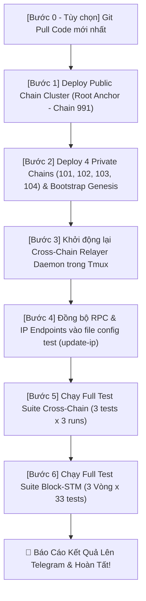

# 🚀 Hướng Dẫn Sử Dụng Script Tự Động Hóa `run_pipeline.sh`

Tài liệu này hướng dẫn chi tiết cách vận hành script tự động hóa **`run_pipeline.sh`** (hoặc `deploy/ansible/run_full_pipeline.sh`) để triển khai toàn diện cụm Public Chain, Private Chains, Relayer và chạy toàn bộ các bài test Cross-Chain cùng Block-STM.

---

## ⚡ 1. Các Lệnh Chạy Nhanh (Quick Start)

| Nhu Cầu | Lệnh Thực Thi Tại Root | Lệnh Thực Thi Trong `deploy/ansible/` |
| :--- | :--- | :--- |
| **Chạy từ mã nguồn hiện tại** *(Không pull Git)* | `./run_pipeline.sh` | `./run_full_pipeline.sh` |
| **Kéo code mới nhất từ `origin/dev` rồi chạy** | `./run_pipeline.sh --pull` | `./run_full_pipeline.sh -p` |
| **Kéo code từ nhánh tùy chọn** *(VD: `cross-chain-registry`)* | `./run_pipeline.sh -p -b cross-chain-registry` | `./run_full_pipeline.sh -p -b cross-chain-registry` |
| **Deploy nhanh** *(Bỏ qua chạy bộ test Block-STM)* | `./run_pipeline.sh --skip-tests` | `./run_full_pipeline.sh --skip-tests` |
| **Xem menu trợ giúp & các tùy chọn** | `./run_pipeline.sh --help` | `./run_full_pipeline.sh -h` |

---

## ⚙️ 2. Bảng Tùy Chọn Đầy Đủ (CLI Flags)

| Flag | Rút gọn | Mặc định | Ý Nghĩa / Tác Vụ |
| :--- | :---: | :---: | :--- |
| `--pull` | `-p` | `false` | Tự động `git checkout` & `git pull` code mới nhất từ remote Git trước khi build & deploy. |
| `--branch <tên_nhánh>` | `-b` | `dev` | Chỉ định tên nhánh Git cần pull. Tự động kích hoạt cờ `--pull`. |
| `--rounds <N>` | | `3` | Số vòng chạy lặp lại toàn bộ bộ test Block-STM (mỗi vòng gồm 33 bài test). |
| `--skip-tests` | | `false` | Bỏ qua bước chạy 33 bài test Block-STM (`run_all_tests.sh`) để rút ngắn thời gian deploy. |
| `--skip-cross-chain` | | `false` | Bỏ qua bộ test Cross-Chain (`cross-chain/run_all_tests.sh`). |
| `--help` | `-h` | | Hiển thị bảng trợ giúp và các ví dụ thực thi. |

> 📱 **Tự Động Báo Cáo Telegram:** Script tự động đọc `telegram_bot_token` & `telegram_chat_id` từ [inventory.yml](inventory.yml). Nếu gặp bất kỳ lỗi nào ở bất kỳ bước nào, script sẽ **lập tức gửi thông báo khẩn cấp qua Telegram** kèm IP, nhánh Git, tên bước và lệnh bị lỗi! Khi chạy thành công toàn bộ, một tin nhắn báo cáo kết quả tổng kết cũng sẽ được gửi.

---

## 🔄 3. Chi Tiết Quy Trình 6 Bước Tự Động



1. **[Bước 0 - Git Pull]** *(Kích hoạt khi có cờ `-p`)*:
   * Chuyển nhánh và cập nhật `origin/<branch>` cho repository `metanode`.
   * Tự động cập nhật repository `metanode-suite` (nếu có Git).
2. **[Bước 1 - Public Chain (Root Anchor)]**:
   * Thực thi `deploy/ansible/ansible_deploy.sh --reset-all`.
   * Reset dữ liệu cũ, sinh genesis, cấu hình systemd service và khởi chạy cụm 3 node Root Anchor (Chain 991).
3. **[Bước 2 - Private Chains]**:
   * Thực thi `deploy/ansible_private_chains/deploy_private_chains.sh --reset-all`.
   * Triển khai 4 chuỗi Private độc lập (101, 102, 103, 104), tự động nạp danh bạ lên Gateway Precompile (`0x1002`) và phân bổ hạn mức ban đầu (`fundGenesis`).
4. **[Bước 3 - Relayer Daemon]**:
   * Thực thi `deploy/ansible_private_chains/run_relayer_tmux.sh restart`.
   * Khởi động daemon Relayer trong phiên tmux nền `relayer`, chờ 3 giây để WebSocket kết nối ổn định.
5. **[Bước 4 - Cập nhật IP/RPC]**:
   * Thực thi `metanode-suite/scripts/update-ip/update-ip.sh`.
   * Đồng bộ toàn bộ các file `config.json` của các kịch bản test theo IP/RPC thực tế vừa sinh.
6. **[Bước 5 - Full Test Cross-Chain]**:
   * Thực thi `metanode-suite/test-simple/test-rpc/test-blockstm/cross-chain/run_all_tests.sh`.
   * Chạy đầy đủ 3 bài test: `01-client-only-transfer`, `02-cross-chain-caro-game`, `03-cross-chain-failure-refund` (mỗi bài lặp lại 3 lần để kiểm tra độ tin cậy).
7. **[Bước 6 - Full Test Block-STM]**:
   * Thực thi `metanode-suite/test-simple/test-rpc/test-blockstm/run_all_tests.sh`.
   * Kiểm thử song song 32+ kịch bản Block-STM (conflict, stress test, DEX, Xapian...).

---

## 📊 4. Vị Trí Logs & Báo Cáo Kết Quả

* **Log Relayer Realtime:**
  ```bash
  cd deploy/ansible_private_chains
  ./run_relayer_tmux.sh logs
  ```
* **Báo cáo kết quả Cross-Chain:**
  ```bash
  cat /home/abc/nhat/con-chain-v2/metanode-suite/test-simple/test-rpc/test-blockstm/cross-chain/test_report.md
  ```
* **Log chi tiết các bài test Block-STM:**
  ```bash
  ls -la /home/abc/nhat/con-chain-v2/metanode-suite/test-simple/test-rpc/test-blockstm/test_logs/
  ```
