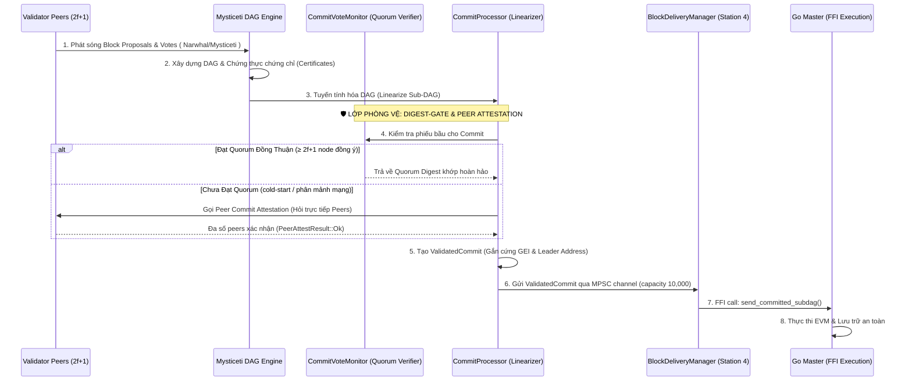

# Kiến Trúc Bảo Đảm Đồng Thuận BFT Consensus & Ranh Giới Thực Thi (Consensus-Execution Boundary Guarantee)

Tài liệu này mô tả chi tiết kiến trúc bảo vệ ranh giới giữa tầng đồng thuận (Consensus Layer - Rust) và tầng thực thi (Execution Layer - Go). Thiết kế này đảm bảo nguyên tắc tối thượng: **Chỉ các khối dữ liệu (Block/Commit) đã đạt đồng thuận BFT tuyệt đối (được biểu quyết bởi ≥ 2f+1 validators) mới được Rust gửi sang Go để thực thi EVM/MVM.**

---

## 1. Ranh Giới Tách Biệt Trách Nhiệm (Consensus-Execution Separation)

Hệ thống Metanode được chia thành hai lớp kiến trúc độc lập và giao tiếp bất đồng bộ qua Unix Domain Socket (UDS):

1. **Consensus Layer (Rust)**: Chịu trách nhiệm thu thập giao dịch, xây dựng đồ thị DAG (Mysticeti), chạy biểu quyết BFT, sắp xếp thứ tự tuyến tính (Linearization) và chỉ định Leader xác định.
2. **Execution Layer (Go)**: Chịu trách nhiệm nhận khối đã được chốt từ Rust, thực thi các giao dịch qua máy ảo EVM/MVM để cập nhật trạng thái Merkle Tree (NOMT) và ghi xuống PebbleDB cơ sở dữ liệu.

Go **không bao giờ** tự ý quyết định thứ tự giao dịch hay đóng block. Rust là nguồn sự thật duy nhất (authoritative source) về thứ tự và tính đồng thuận của dữ liệu.

---

## 2. Luồng Bảo Đảm Đồng Thuận (BFT Quorum Verification Flow)

Để đảm bảo Go không bao giờ thực thi một block chưa đạt đồng thuận mạng lưới (ngăn chặn hoàn toàn nguy cơ rẽ nhánh - Zero-Fork), luồng dữ liệu trong Rust phải trải qua hệ thống kiểm duyệt đa tầng trước khi đóng gói gửi qua FFI:



---

## 3. Các Thành Phần Bảo Vệ Cốt Lõi (Core Guardians)

### 3.1. Đồ thị DAG Mysticeti & Chứng chỉ Chứng thực
Mọi Block Proposal của validators trong đồ thị DAG chỉ được coi là hợp lệ khi đính kèm chữ ký/phiếu bầu hợp lệ từ đa số validators. Các khối này liên kết chặt chẽ với nhau tạo thành một DAG bất biến. Khi một block nhận đủ $2f+1$ phiếu bầu, nó được cấp một **Chứng chỉ (Certificate)**, chứng minh khối đã được mạng lưới thừa nhận.

### 3.2. Bộ lọc Quorum (CommitVoteMonitor - DIGEST-GATE)
Trước khi một `CommittedSubDag` được giải phóng khỏi bộ máy đồng thuận, nó phải đi qua **DIGEST-GATE** được quản lý bởi `CommitVoteMonitor`:
- **Chức năng**: Theo dõi và đếm số phiếu bầu (votes) từ mạng lưới cho từng chỉ mục commit cụ thể (`commit_index`).
- **Nguyên tắc**: Chỉ khi tích lũy đủ $2f+1$ phiếu bầu đồng nhất từ các validator online về mã hash digest của commit, `CommitVoteMonitor` mới xác nhận trạng thái đạt đồng thuận (`quorum_commit_digest` khả dụng).
- **Phòng vệ đặc biệt (Zero-Timeout Peer Attestation)**: Trong các kịch bản lạnh (cold-start hoặc đầu epoch), node chủ động hỏi chéo peers qua giao thức P2P. Nếu có bằng chứng xác thực (`PeerAttestResult::Ok`) mới cho phép đi tiếp. Nếu thiếu thông tin (`Insufficient`), khối bắt buộc phải **giữ trạng thái PENDING** trong buffer. **Thà dừng hệ thống (pending) chứ tuyệt đối không tạo block rẽ nhánh (Fork).**

### 3.3. Bộ đóng gói và phân phối khối tuần tự (BlockDeliveryManager)
Khi commit vượt qua được bộ lọc đồng thuận, nó được chuyển đổi thành cấu trúc `ValidatedCommit` chứa:
- Bản ghi Sub-DAG gốc từ DAG đồng thuận.
- Chỉ số thực thi toàn cục (`global_exec_index` - GEI) đã được định đoạt một cách deterministic.
- Địa chỉ Leader thực tế đề xuất khối đã được lưu cứng.

`ValidatedCommit` được đưa vào một hàng đợi bất đồng bộ có giới hạn (`mpsc::channel` giới hạn buffer tối đa 10,000). Tiến trình chạy đơn luồng `BlockDeliveryManager` (Conveyor belt) sẽ tuần tự đọc từ hàng đợi này và gọi FFI:
```rust
self.executor_client.send_committed_subdag(
    &msg.subdag,
    msg.epoch,
    msg.global_exec_index,
    msg.leader_address,
)
```
Việc sử dụng hàng đợi có giới hạn (bounded channel) tạo ra cơ chế **Backpressure (kiểm soát áp lực ngược)** tự nhiên. Nếu Go thực thi chậm hoặc bị tắc nghẽn, hàng đợi sẽ đầy và tự động điều tốc bộ máy đề xuất đồng thuận của Rust, giữ cho toàn bộ hệ thống luôn vận hành nhịp nhàng.

---

## 4. Các Quy Tắc Bất Biến Về Tính Đồng Thuận (Invariants of Consensus Delivery)

Để duy trì tính toàn vẹn tuyệt đối cho mạng lưới, kiến trúc cam kết tuân thủ nghiêm ngặt 3 quy tắc bất biến sau:

| Quy tắc bất biến | Mô tả kỹ thuật | Phòng vệ ngăn chặn |
|---|---|---|
| **INV-QUORUM-BEFORE-EXEC** | Chỉ block được $2f+1$ nodes bầu chọn và xác nhận trùng digest mới được phép đẩy sang kênh giao tiếp FFI Go Master. | `CommitVoteMonitor` chặn đứng mọi commits chưa đạt BFT quorum hoặc bị lệch digest với mạng lưới. |
| **INV-SEQUENTIAL-DELIVERY** | Mọi ValidatedCommit phải được gửi sang Go Master theo đúng thứ tự tuyến tính tăng dần của `commit_index` và `global_exec_index`. | Hàng đợi MPSC của `BlockDeliveryManager` đảm bảo FIFO tuyệt đối và `next_expected_index` ở tầng Go sẽ reject bất kỳ khối nào bị nhảy vọt chỉ số. |
| **INV-NO-TIMEOUT-DISPATCH** | Tuyệt đối không dùng thời gian (timeout, sleep) để tự động quyết định thông qua một commit nếu mạng lưới chưa đồng thuận. | Loại bỏ hoàn toàn bypass dựa trên timeout trong `commit_syncer.rs`, ép buộc tất cả các node phải hội tụ data-driven P2P. |

---

## 5. Kết Luận (Architectural Summary)

Nhờ sự kết hợp chặt chẽ giữa **Mysticeti DAG BFT, CommitVoteMonitor (DIGEST-GATE), và BlockDeliveryManager**, Metanode thiết lập một ranh giới thực thi cực kỳ kiên cố. Tầng thực thi EVM/MVM ở Go Master luôn được bảo đảm chỉ nhận dữ liệu đã "sạch", đã đạt đồng thuận BFT tối thượng của mạng lưới, triệt tiêu hoàn toàn rủi ro rẽ nhánh trạng thái (Fork) hay các lỗi bất đồng bộ khi node khởi động lại hoặc gặp sự cố phân mảnh mạng.
