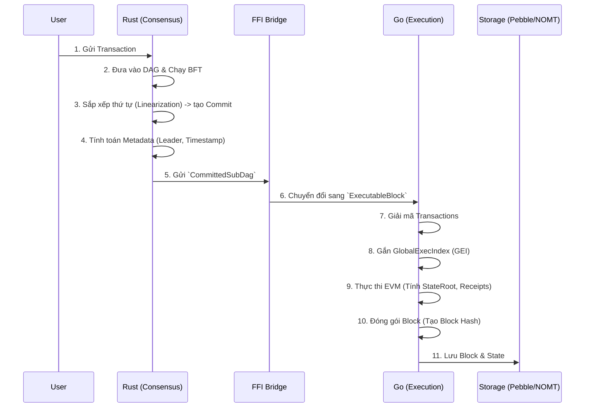
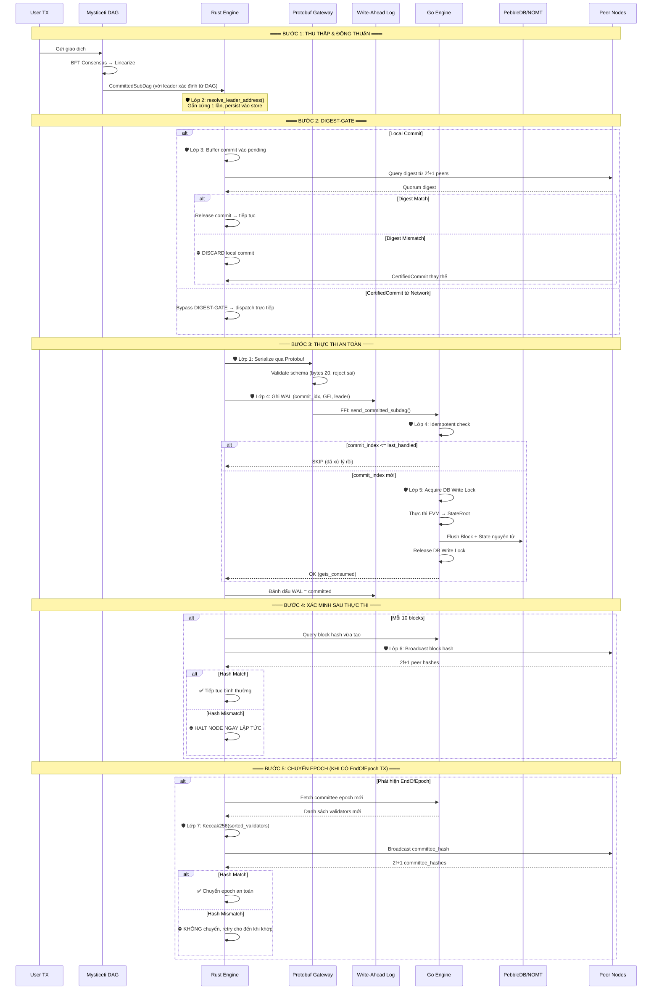
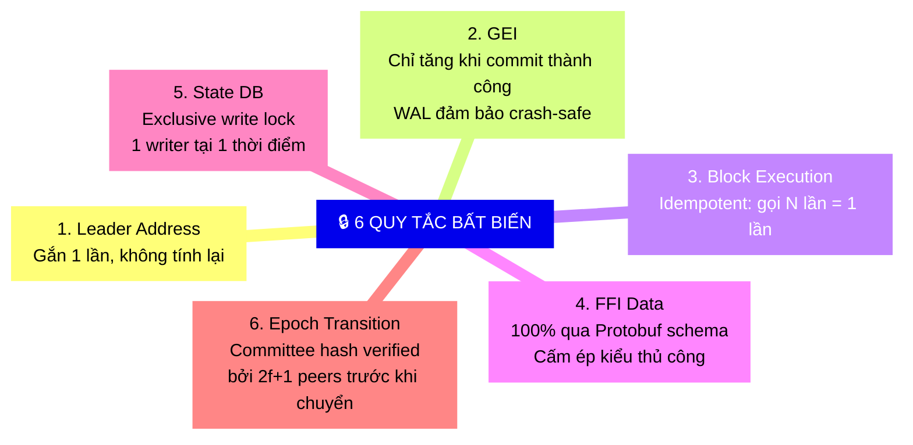

# Kiến Trúc Quá Trình Tạo Block (Block Creation Architecture)

Tài liệu này mô tả chi tiết quy trình tạo Block từ khi giao dịch được gửi vào mạng lưới cho đến khi Block được đóng gói và lưu trữ. Sự phân tách trách nhiệm giữa Rust (Consensus) và Go (Execution) là cốt lõi của kiến trúc này, đi kèm với hệ thống bảo vệ đa lớp để đảm bảo tính nhất quán tuyệt đối (Fork-Proof).

---

## 1. Quy Trình Tổng Quan

Quá trình tạo Block diễn ra theo luồng một chiều (One-way Data Flow) từ **Rust Consensus** sang **Go Execution**:



### Chi tiết các bước:
1. **Thu thập TX**: Các node nhận giao dịch và chia sẻ cho nhau qua mạng P2P (Narwhal/Mysticeti).
2. **Đồng thuận (Rust)**: Thuật toán BFT (Byzantine Fault Tolerance) quyết định thứ tự của các khối dữ liệu trong mạng lưới, tạo thành một DAG (Directed Acyclic Graph).
3. **Tạo Commit (Rust)**: Các khối DAG được chốt lại (commit) theo một thứ tự tuyến tính hoàn toàn xác định.
4. **Metadata (Rust)**: Rust tính toán `Leader` của block dựa trên thuật toán Stake-based và `Timestamp` dựa trên trung vị (median) của các node.
5. **Thực thi (Go)**: Go nhận danh sách giao dịch và metadata từ Rust. Go không bao giờ tự ý quyết định thứ tự TX hay Leader.
6. **EVM & State**: Go chạy EVM để ra được kết quả cuối cùng (`StateRoot`, `ReceiptsRoot`), gộp cùng Metadata của Rust để băm (hash) ra `BlockHash`.

---

## 2. Kiến Trúc Phòng Vệ Chống Rẽ Nhánh (Fork-Proof Architecture)

Hệ thống được bảo vệ bởi **7 lớp phòng vệ** (Defense Layers) được thiết kế để chặn đứng bất kỳ nguy cơ mất đồng bộ nào giữa Go và Rust, cũng như giữa các Node trong mạng.

```mermaid
flowchart TB
    subgraph Layer1["🛡️ Lớp 1: Protobuf Strict Boundary"]
        direction LR
        PB1["FFI Gateway"]
        PB2["Validate identity keys (bytes)"]
        PB3["Reject dữ liệu sai schema"]
        PB1 --> PB2 --> PB3
    end

    subgraph Layer2["🛡️ Lớp 2: Immutable Leader & Persistence"]
        direction LR
        LR1["resolve_leader_address()"]
        LR2["Gắn cứng 1 lần vào SubDag"]
        LR3["Persist vào DAG Store"]
        LR1 --> LR2 --> LR3
    end

    subgraph Layer3["🛡️ Lớp 3: DIGEST-GATE"]
        direction LR
        DG1["Local commit → Buffer"]
        DG2["Chờ 2f+1 digest match"]
        DG3["Chỉ dispatch CertifiedCommit"]
        DG1 --> DG2 --> DG3
    end

    subgraph Layer4["🛡️ Lớp 4: WAL + Idempotent Execution"]
        direction LR
        WL1["Rust ghi WAL trước FFI"]
        WL2["Go kiểm tra commit_index"]
        WL3["Duplicate → SKIP"]
        WL1 --> WL2 --> WL3
    end

    subgraph Layer5["🛡️ Lớp 5: DB Write Lock"]
        direction LR
        DB1["Go acquire exclusive lock"]
        DB2["ProcessBlock chạy độc quyền"]
        DB3["P2P/Sub-node bị block"]
        DB1 --> DB2 --> DB3
    end

    subgraph Layer6["🛡️ Lớp 6: Inline Hash Verification"]
        direction LR
        IH1["Mỗi 10 blocks → query peers"]
        IH2["So sánh block hash"]
        IH3["Mismatch → HALT node"]
        IH1 --> IH2 --> IH3
    end

    subgraph Layer7["🛡️ Lớp 7: Epoch Committee Hash Assert"]
        direction LR
        EC1["Keccak256 sorted validators"]
        EC2["Broadcast committee_hash"]
        EC3["2f+1 mismatch → Không chuyển epoch"]
        EC1 --> EC2 --> EC3
    end

    Layer1 -->|"Dữ liệu sạch"| Layer2
    Layer2 -->|"Leader xác định"| Layer3
    Layer3 -->|"Commit verified"| Layer4
    Layer4 -->|"Execution an toàn"| Layer5
    Layer5 -->|"State sạch"| Layer6
    Layer6 -->|"Block đồng nhất"| Layer7
    Layer7 -->|"Epoch an toàn"| SAFE["✅ FORK-FREE"]

    style SAFE fill:rgba(0,200,100,0.2),stroke:#00c853,stroke-width:3px,color:#00c853
```

### Chi tiết các lớp phòng vệ:
* **Lớp 1 (Protobuf Strict Boundary):** Mọi ranh giới giao tiếp RPC/FFI được định nghĩa chặt chẽ bằng Protobuf. Các trường định danh như `AuthorityKey` bắt buộc dùng kiểu `bytes`. Dữ liệu được truyền thẳng dưới dạng byte-perfect để loại bỏ 100% lỗi ép kiểu string.
* **Lớp 2 (Immutable Leader):** `LeaderAddress` được gắn cứng 1 lần và lưu xuống `LeaderStore`. Khi restart, Node ưu tiên đọc từ cache đĩa này thay vì tính lại, chống trôi LeaderAddress.
* **Lớp 3 (DIGEST-GATE):** Local commit không được thực thi ngay mà bị buffer cho đến khi mạng lưới đồng thuận (2f+1 peers xác nhận chung 1 digest).
* **Lớp 4 (WAL + Idempotent Execution):** Rust sử dụng Write-Ahead Log (WAL) ghi nhận trạng thái commit. Ở phía Go, hàm thực thi kiểm tra `commit_index`; nếu là bản sao (duplicate) thì sẽ tự động bỏ qua (Skip) để đảm bảo không làm trôi `GlobalExecIndex` (GEI).
* **Lớp 5 (DB Write Lock Isolation):** Toàn bộ hàm thực thi ghi xuống cơ sở dữ liệu State Trie (NOMT) được khóa độc quyền (`Mutex`). Không luồng P2P nào có thể gây nhiễu ("Nhiễm độc" State Trie).
* **Lớp 6 (Inline Hash Verification):** Mỗi 10 blocks, Rust truy vấn hash từ Go và kiểm tra chéo với các peers. Nếu phát hiện rẽ nhánh, Node lập tức HALT để ngăn lỗi lan rộng.
* **Lớp 7 (Epoch Committee Assert):** Khi chuyển Epoch, Node sinh ra `transition_hash` (băm của Committee mới) và RPC chéo các peers. Nếu không có đa số đồng thuận, Node sẽ dừng chuyển Epoch và retry.

---

## 3. Luồng Xử Lý Block Hoàn Chỉnh (End-to-End Block Processing)



---

## 4. Quy Tắc Bất Biến (Invariants)

Kiến trúc đảm bảo 6 quy tắc bất biến tuyệt đối:



---

## 5. Crash Recovery Flow (Luồng Phục Hồi Khi Sập)

Mô hình đảm bảo khi Node bị Crash ở bất kỳ thời điểm nào giữa Rust và Go, dữ liệu luôn được khôi phục đồng bộ:

```mermaid
flowchart TD
    CRASH["⚡ Node Crash/Restart"] --> READ_WAL["Đọc WAL: tìm entry chưa committed"]

    READ_WAL --> HAS_PENDING{"Có entry pending?"}

    HAS_PENDING -->|"Không"| NORMAL["Khởi động bình thường<br/>next_expected = last_committed + 1"]

    HAS_PENDING -->|"Có"| QUERY_GO["Query Go: get_last_commit_index()"]

    QUERY_GO --> COMPARE{"Go đã xử lý commit này?"}

    COMPARE -->|"Đã xử lý<br/>(go_commit >= wal_commit)"| MARK_OK["Đánh dấu WAL = committed<br/>GEI đã đúng, không cần replay"]

    COMPARE -->|"Chưa xử lý<br/>(go_commit < wal_commit)"| REPLAY["Replay commit từ WAL<br/>Go sẽ thực thi block bị thiếu"]

    MARK_OK --> NORMAL
    REPLAY --> NORMAL

    NORMAL --> STARTUP_SYNC["STARTUP-SYNC: verify hash với peers"]
    STARTUP_SYNC --> READY["✅ Node sẵn sàng tham gia consensus"]

    style CRASH fill:rgba(255,50,50,0.2),stroke:#ff3333,color:#ff3333
    style READY fill:rgba(0,200,100,0.2),stroke:#00c853,color:#00c853
```

---

## 6. Phân Tích Deadlock & Liveness (Deadlock-Free Guarantee)

Hệ thống được thiết kế theo nguyên lý **Chờ Mãi Mãi > Fork** (Wait forever is safer than Forking). Tuy nhiên, kiến trúc đảm bảo hệ thống **luôn tiến** (always makes progress) miễn là có ≥2f+1 node online. Mỗi điểm chờ (blocking point) đều có cơ chế tránh deadlock.

### Bảng Đánh Giá Các Điểm Chờ

| # | Điểm chờ | Đang chờ gì? | Cơ chế | Trạng thái |
|---|---|---|---|---|
| ① | `is_transitioning` flag | Epoch transition hoàn tất | Timeout 120s force-clear | 🟢 **AN TOÀN** |
| ② | DIGEST-GATE buffer | CertifiedCommit hoặc digest match | 200ms poll loop. CertifiedCommit thay thế. Buffer giới hạn (MAX=100) | 🟢 **AN TOÀN** |
| ③ | QUORUM-GATE | `quorum_commit_index >= commit_index` | 200ms poll loop + CertifiedCommit | 🟢 **AN TOÀN** |
| ④ | Runtime Fork Guard | Go đạt `next_check_block` | Background task, Backoff 60s khi peers fail | 🟢 **AN TOÀN** |
| ⑤ | DB Write Lock | ProcessBlock hoàn tất | `defer Unlock()`. Single-writer. | 🟢 **AN TOÀN** |
| ⑥ | ProcessBlock I/O | NOMT trie flush | Bounded I/O | 🟢 **AN TOÀN** |
| ⑦ | Committee Hash | ≥1 peer xác nhận hash | Retry loop vĩnh viễn (5s timeout). 1 match = Accept. | 🟢 **AN TOÀN** |
| ⑧ | CommitSyncer | Peer trả blocks | RPC timeout + retry peer khác | 🟢 **AN TOÀN** |

**Định lý Liveness:**
> Với N node trong cluster (N ≥ 3f+1), nếu ≥ 2f+1 node online và có thể giao tiếp qua mạng, hệ thống Metanode **luôn tạo block mới** trong thời gian hữu hạn. Hệ thống **TUYỆT ĐỐI KHÔNG fork** trong mọi kịch bản.

Cơ chế Seed (Cold-Start toàn cluster):
Khi TẤT CẢ node restart đồng thời: Node sẽ vào retry loop (chờ peers). Khi các node online, chúng sẽ cross-verify lẫn nhau và cùng tiếp tục (cơ chế tự nhiên từ retry loop, không cần seed node đặc biệt).
