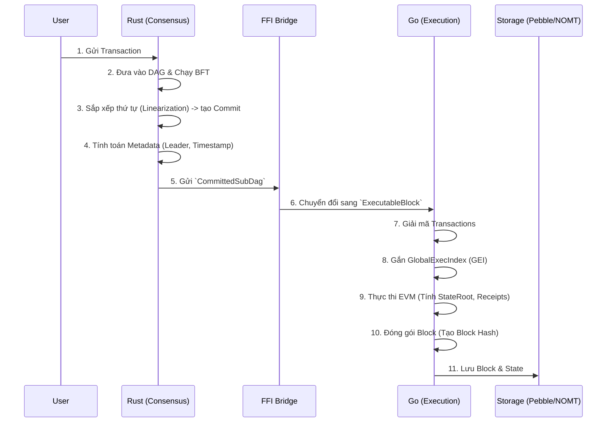
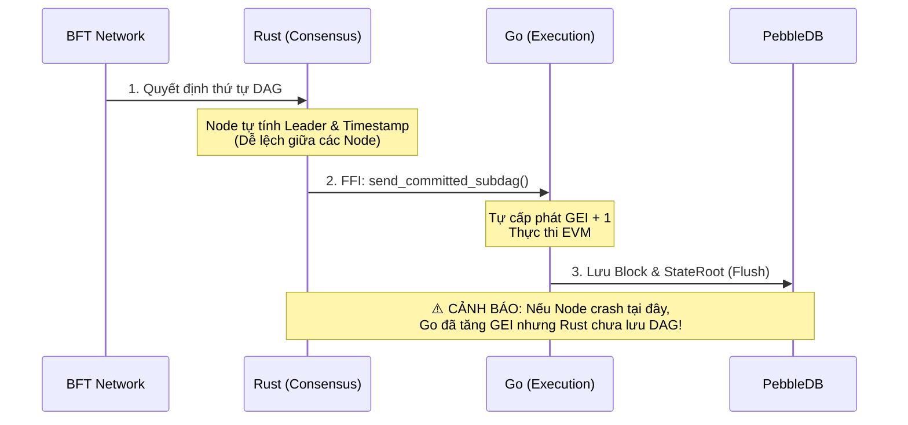
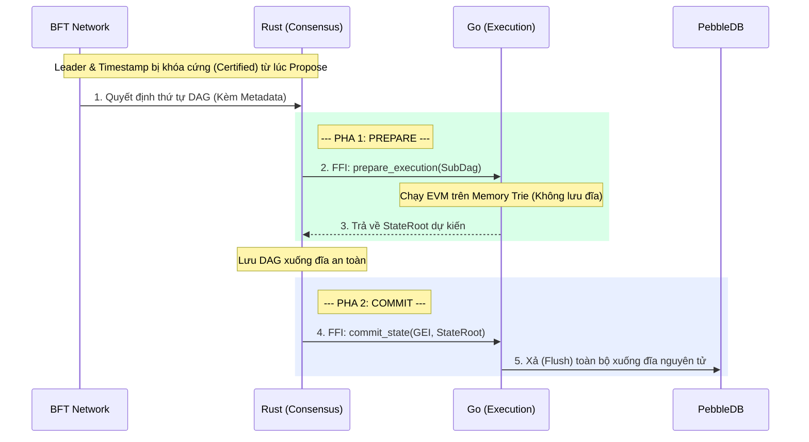
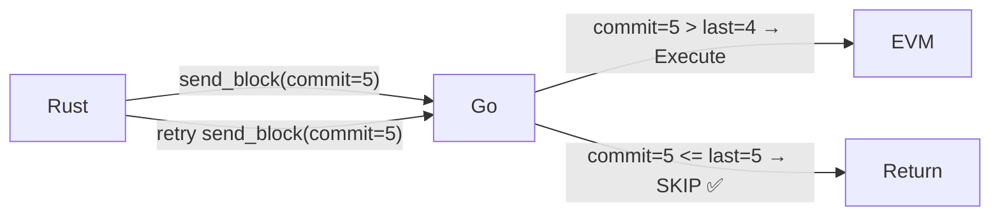
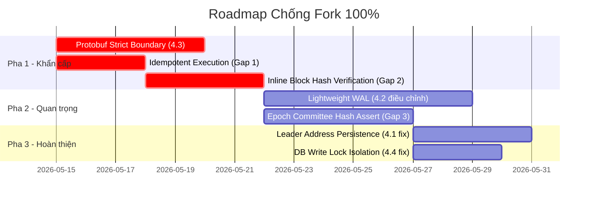
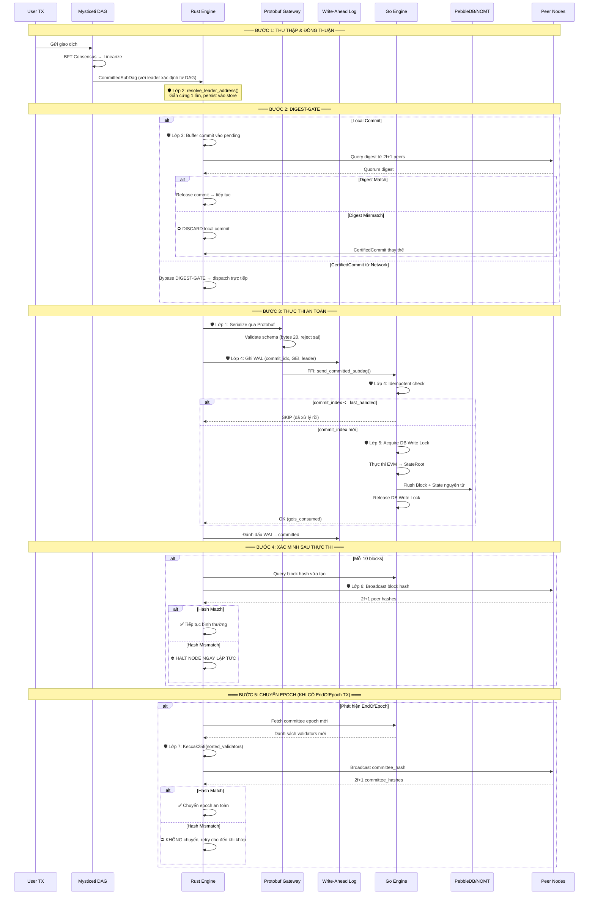
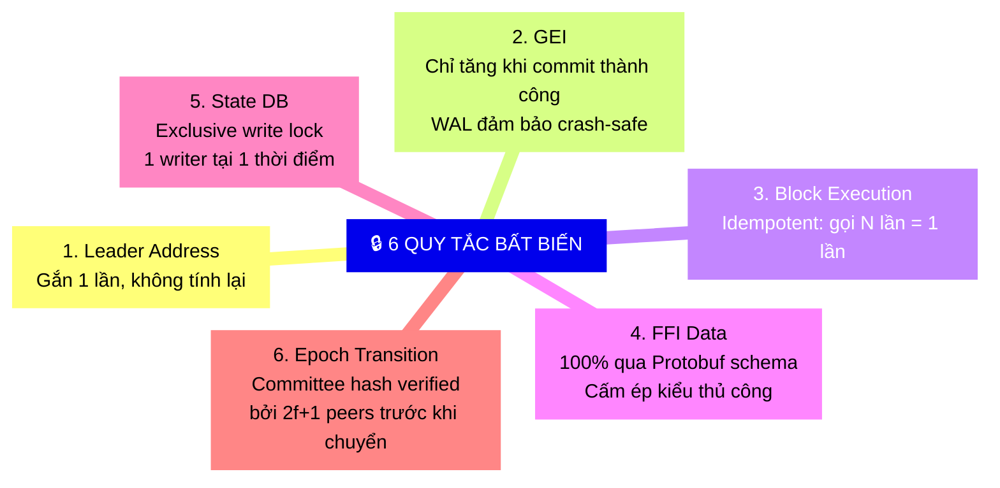

# Kiến Trúc Quá Trình Tạo Block (Block Creation Architecture)

Tài liệu này mô tả chi tiết quy trình tạo Block từ khi giao dịch được gửi vào mạng lưới cho đến khi Block được đóng gói và lưu trữ. Sự phân tách trách nhiệm giữa Rust (Consensus) và Go (Execution) là cốt lõi của kiến trúc này.

---

## 1. Quy Trình Tổng Quan

Quá trình tạo Block diễn ra theo luồng một chiều (One-way Data Flow) từ **Rust Consensus** sang **Go Execution**:



### Chi tiết các bước:
1. **Thu thập TX**: Các node nhận giao dịch và chia sẻ cho nhau qua mạng P2P (Narwhal/Mysticeti).
2. **Đồng thuận (Rust)**: Thuật toán BFT (Byzantine Fault Tolerance) quyết định thứ tự của các khối dữ liệu trong mạng lưới, tạo thành một DAG (Directed Acyclic Graph).
3. **Tạo Commit (Rust)**: Các khối DAG được chốt lại (commit) theo một thứ tự tuyến tính hoàn toàn xác định.
4. **Metadata (Rust)**: Rust tính toán `Leader` của block dựa trên thuật toán Stake-based và `Timestamp` dựa trên trung vị (median) của các node.
5. **Thực thi (Go)**: Go nhận danh sách giao dịch và metadata từ Rust. Go không bao giờ tự ý quyết định thứ tự TX hay Leader.
6. **EVM & State**: Go chạy EVM để ra được kết quả cuối cùng (`StateRoot`, `ReceiptsRoot`), gộp cùng Metadata của Rust để băm (hash) ra `BlockHash`.

---

## 2. Rủi Ro Rẽ Nhánh (Fork Risks) trên Kiến Trúc Hiện Tại

Do hệ thống tách biệt thành 2 engine (Rust và Go), nguy cơ lớn nhất là sự mất đồng bộ (Mismatched State/Metadata) giữa hai bên. Chỉ cần một sai số nhỏ ở 1 Node sẽ dẫn đến Block Hash khác biệt hoàn toàn (Hard Fork).

```mermaid
flowchart TD
    subgraph Rust Engine
        R_TX[Thứ tự TX]
        R_Leader[Leader Address]
        R_Time[Timestamp]
    end

    subgraph Go Engine
        G_GEI[GlobalExecIndex]
        G_EVM[EVM Execution]
        G_State[StateRoot / Trie]
    end

    R_TX --> |Rủi ro 1| G_EVM
    R_Leader --> |Rủi ro 2| BlockHash
    R_Time --> |Rủi ro 3| BlockHash
    G_GEI --> |Rủi ro 4| BlockHash
    G_EVM --> G_State
    G_State --> BlockHash

    style R_Leader fill:rgba(255, 100, 100, 0.15),stroke:#ff4444,stroke-width:2px,color:#ff4444
    style G_GEI fill:rgba(255, 100, 100, 0.15),stroke:#ff4444,stroke-width:2px,color:#ff4444
```

### 🔴 Các Điểm Rủi Ro Chính (Nguyên nhân gây Fork)

1. **Rủi ro 1: Sai lệch thuật toán sắp xếp (Sorting Mismatch) - Đã Fix**
   - *Mô tả:* Rust và Go sử dụng cách sắp xếp danh sách Validators khác nhau (ví dụ: String vs Raw Bytes).
   - *Hậu quả:* Rust chọn Node A làm Leader, nhưng Go (hoặc node khác) lại chọn Node B. Khi `LeaderAddress` đưa vào hash khác nhau, Block sẽ bị Fork ngay lập tức (như lỗi ở Block 77).

2. **Rủi ro 2: Khác biệt Timestamp (Timestamp Non-determinism)**
   - *Mô tả:* Nếu mạng lưới khôi phục từ một DAG bị thiếu dữ liệu lịch sử (ancestor blocks), hàm tính `median_timestamp` có thể ra kết quả lệch nhau vài giây giữa các Node.
   - *Hậu quả:* Timestamp tham gia trực tiếp vào Block Hash. Lệch 1 mili-giây cũng làm thay đổi toàn bộ Hash.

3. **Rủi ro 3: Bất đồng bộ GEI (Global Exec Index Desync)**
   - *Mô tả:* Các Node đếm số lượng Block rỗng (Empty Blocks) khác nhau do có node xử lý commit không có TX, có node lại bỏ qua.
   - *Hậu quả:* GEI bị lệch dẫn đến Sequence Shifting. Giao dịch hợp lệ ở Node này lại bị coi là sai thứ tự (nonce error) ở Node khác.

4. **Rủi ro 4: "Nhiễm độc" State Trie (State Poisoning)**
   - *Mô tả:* Trong quá trình `STARTUP-SYNC`, Go vô tình nhận các Block từ mạng P2P (foreign data) song song với luồng FFI từ Rust.
   - *Hậu quả:* Database (NOMT) bị ghi đè dữ liệu rác, `StateRoot` thay đổi mãi mãi và không thể tự phục hồi.

---

## 3. Đánh Giá & Cải Tiến Quy Trình Logging (Log Mismatch)

Dựa trên mẫu `hash_mismatch_alert.log` hiện tại, hệ thống log đang làm tốt việc phát hiện **Hash Mismatch**, nhưng chưa đủ sâu để giúp Developer tìm ra nguyên nhân gốc rễ (Root Cause) ngay lập tức. 

### Vấn đề của Log hiện tại:
- **Quá tải thông tin (Cluttered):** Tất cả các trường (`hash`, `stateRoot`, `txRoot`, `leader`...) bị dồn vào một dòng rất dài, cực kỳ khó so sánh bằng mắt thường.
- **Không chỉ ra điểm khác biệt:** Developer phải tự dò xem chuỗi Hash nào khác chuỗi nào. Trong ví dụ Block 17, `m0` và `m1` khác biệt ở cả `txRoot`, `receiptsRoot`, và `leader`, nhưng log không làm nổi bật điều đó.
- **Thiếu thông tin Commit (Rust):** Block Hash Checker hiện chỉ đọc từ Go (qua RPC). Không có thông tin `CommitIndex` tương ứng bên Rust để đối chiếu.

### Khuyến nghị Cải Tiến Tool `block_hash_checker`:

1. **Highlight điểm khác biệt (Diffing):**
   Thay vì in toàn bộ, tool nên so sánh với giá trị đa số (Majority) và in màu đỏ phần bị sai lệch.
   *Ví dụ:* 
   `m0: leader=0xb014... (MISMATCH - Expected 0xCCc7...)`

2. **Cấu trúc lại Log Formatter (JSON / Bảng):**
   Hiển thị theo dạng bảng so sánh dọc thay vì ngang:
   ```text
   [Block 17] - FORK DETECTED!
   Field        | Majority (m1, m2, m3)                 | Minority (m0, m4)
   -------------|---------------------------------------|---------------------------------------
   Leader       | 0xCCc7f510...                         | 0xb01455c5... ❌
   TxRoot       | 0xa7d4c46f...                         | 0x13cb4b64... ❌
   StateRoot    | 0x58129c8f...                         | 0x58129c8f... ✅
   ```

3. **Bổ sung API Audit (Góc nhìn giao dịch):**
   Nếu `txRoot` khác nhau, tool phải tự động gọi API lấy chi tiết Block (ví dụ `eth_getBlockByNumber`) để in ra: *"M0 chứa 15 TXs, M1 chứa 10 TXs (Thiếu TX hash: 0xabc...)"*. Điều này giúp xác định ngay giao dịch nào bị rơi rớt giữa các Node.

---

## 4. Đề Xuất Cải Tiến Kiến Trúc (Architecture Improvements)

Để khắc phục triệt để điểm yếu "mất đồng bộ giữa 2 Engine (Rust-Go)", tôi đề xuất 4 giải pháp cải tiến cốt lõi sau:

### 4.1. Single Source of Truth cho Metadata qua BFT (Certified Metadata)
* **Thực trạng:** Hiện tại Rust tự chạy thuật toán bầu Leader (`elect_leader_stake_based`) và tự tính Median Timestamp ở mỗi node. Quá trình Sync có thể làm lệch tham số đầu vào.
* **Cải tiến:** `LeaderAddress` và `Timestamp` KHÔNG được tính toán lại cục bộ ở các node đang sync. Node Proposer (Người tạo khối) phải gắn cứng `LeaderAddress` và `Timestamp` vào cấu trúc khối và đưa qua quá trình ký đồng thuận BFT (CertifiedCommit). Các node khác chỉ **Verify** (xác thực) chữ ký, không tính toán lại.

### 4.2. Atomic State Commit (Cơ chế Commit Nguyên Tử 2 Pha qua FFI)
* **Thực trạng:** Rust gửi `CommittedSubDag` sang Go, Go tự tăng GEI và cập nhật DB (NOMT). Nếu node sập giữa chừng, GEI bên Go đã lưu nhưng DAG bên Rust chưa lưu.
* **Cải tiến:** Triển khai **2-Phase Commit (2PC)**.
  - Pha 1 (`Prepare`): Rust gửi TXs sang Go. Go chạy EVM trên State tạm (Memory Trie), trả về `StateRoot` dự kiến.
  - Pha 2 (`Commit`): Khi Rust đã lưu DAG thành công, Rust gọi `Commit(GEI, StateRoot)`. Go mới thực sự xả (flush) dữ liệu xuống đĩa (PebbleDB). Đảm bảo 100% không bao giờ trôi lệch GEI.

### 4.3. Protobuf Strict Boundary (Ranh giới Schema siêu khắt khe)
* **Thực trạng:** Lỗi rẽ nhánh ở Block 77 xảy ra vì Rust so sánh bằng String, Go so sánh bằng Raw Bytes.
* **Cải tiến:** Cấm việc parser tay hoặc ép kiểu tay qua lại giữa CGo. Mọi ranh giới giao tiếp phải định nghĩa bằng **Protobuf**. Code sinh tự động (auto-generated) sẽ ép kiểu khắt khe (ví dụ Validator Address bắt buộc là `bytes` 20-byte array). Bất kỳ dữ liệu nào không đúng chuẩn sẽ bị FFI Gateway từ chối ngay lập tức trước khi chạm vào EVM.

### 4.4. FFI Checksum Isolation (Cách ly dữ liệu ngoại lai)
* **Thực trạng:** Go có thể nhập (import) nhầm Block từ mạng P2P (foreign data) đè lên dữ liệu do Rust gửi xuống.
* **Cải tiến:** Rust cấp một mã `Session_Token` (hoặc Hash của SubDag) cho mỗi FFI call. Trong quá trình tạo khối, Go Execution Engine bị **khóa cứng** với mạng P2P bên ngoài, chỉ tiếp nhận lệnh thực thi có mang đúng `Session_Token` từ Rust. Điều này ngăn chặn hoàn toàn "State Poisoning".

---

## 5. So Sánh Kiến Trúc (Current vs Proposed Architecture)

Dưới đây là biểu đồ so sánh sự khác biệt giữa kiến trúc hiện tại và kiến trúc đề xuất (Atomic 2-Phase Commit & Certified Metadata).

### ❌ Kiến Trúc Hiện Tại (Rủi ro rẽ nhánh cao)
Luồng dữ liệu một chiều (One-way fire-and-forget), thiếu cơ chế rollback nếu Node bị sập giữa chừng.



### ✅ Kiến Trúc Đề Xuất (Fork-proof)
Sử dụng **Certified Metadata** từ BFT và **2-Phase Commit (2PC)** giữa Rust và Go.



**Bảng so sánh cốt lõi:**

| Đặc tả | Kiến trúc hiện tại (Legacy) | Kiến trúc đề xuất (Atomic 2PC) |
|---|---|---|
| **Metadata (Leader/Time)** | Tự tính toán (Nguy cơ rẽ nhánh) | Gắn cứng chữ ký BFT (Certified) |
| **Giao thức FFI** | 1 Chiều (Bắn và quên) | 2 Pha (Chuẩn bị & Chốt) |
| **Gắn GEI** | Go tự tăng cục bộ | Rust quản lý và truyền trực tiếp xuống |
| **Phục hồi (Recovery)** | Dễ hỏng state nếu Crash ngang | Đảm bảo nguyên tử 100% (Atomic) |

---

## 6. Đánh Giá Phản Biện & Bổ Sung Lỗ Hổng (Critical Review)

> ⚠️ Phần này đánh giá tính khả thi thực tế của từng đề xuất ở Mục 4, dựa trên kiến trúc Mysticeti/DAG BFT hiện tại của Metanode. Mục tiêu: xác định rõ đâu là cải tiến **phải làm ngay**, đâu là cải tiến **nên làm sau**, và đâu **không khả thi** trong kiến trúc hiện tại.

### 6.1. Đánh giá Đề xuất 4.1 — Certified Metadata

| Tiêu chí | Đánh giá |
|---|---|
| **Tính khả thi** | ⚠️ **CẦN ĐIỀU CHỈNH** |
| **Mức ưu tiên** | 🟡 Trung bình |

**Vấn đề:** Trong kiến trúc DAG-based BFT (Mysticeti), Leader được xác định **SAU KHI** DAG đã commit — không phải trước. Không thể "gắn cứng Leader vào lúc Propose" vì tại thời điểm propose, chưa biết ai là Leader.

**Thực tế trong code:** Hệ thống hiện tại đã có cơ chế tương đương:
- `CommittedSubDag.leader_address` được gắn cứng **một lần duy nhất** bởi `resolve_leader_address()` và đánh dấu immutable (`MUST NOT be recalculated`).
- Node đang sync sử dụng `leader_address` đã nhúng sẵn trong commit data từ peer/stored commit (`if subdag.leader_address.len() == 20 → skip re-resolution`).

**Điều chỉnh đúng:**
- ✅ **Đã có:** Node sync/recovery dùng pre-embedded leader_address (FORK-SAFETY May 2026 tag).
- ❌ **Thiếu:** Chưa có cơ chế **lưu trữ** `leader_address` vào DAG store (RocksDB). Khi node restart, nếu DAG bị wipe nhưng Go DB không wipe, `leader_address` phải được khôi phục từ Go hoặc peer thay vì tính lại. → **Cần bổ sung persistence cho leader_address trong commit store.**

---

### 6.2. Đánh giá Đề xuất 4.2 — Atomic 2-Phase Commit

| Tiêu chí | Đánh giá |
|---|---|
| **Tính khả thi** | ⚠️ **TỐT NHƯNG CHƯA ĐỦ** |
| **Mức ưu tiên** | 🟢 Cao |

**Vấn đề hiệu năng:** Thêm 1 round-trip (Prepare → StateRoot → Commit) qua FFI Bridge cho mỗi block sẽ **tăng gấp đôi latency** block production. Với target 1000+ TPS, đây là trade-off nghiêm trọng.

**Thực tế trong code:** Hệ thống đã có cơ chế phòng vệ tương đương nhưng nhẹ hơn:
- `GEIAuthority` ở Go đảm bảo GEI chỉ tăng khi block thực sự được commit.
- `REPLAY PROTECTION` trong `dispatch_commit` ngăn duplicate execution.
- `initialize_from_go()` đồng bộ lại GEI/CommitIndex khi restart.

**Điều chỉnh thực tế (Lightweight WAL thay vì Full 2PC):**
- Thay vì 2-Phase Commit nặng, sử dụng **Write-Ahead Log (WAL)** nhẹ hơn:
  1. Rust ghi `(commit_index, GEI, leader_address)` vào WAL **trước** khi gọi FFI.
  2. Go thực thi bình thường (không cần pha Prepare riêng).
  3. Khi Go trả về thành công, Rust đánh dấu WAL entry là "committed".
  4. Khi restart: Rust đọc WAL, so sánh với Go state. Entry nào chưa "committed" → Go rollback hoặc Rust replay.
- **Ưu điểm:** Không thêm round-trip, vẫn đảm bảo crash-safe.

---

### 6.3. Đánh giá Đề xuất 4.3 — Protobuf Strict Boundary

| Tiêu chí | Đánh giá |
|---|---|
| **Tính khả thi** | ✅ **KHUYẾN KHÍCH MẠNH** |
| **Mức ưu tiên** | 🟢 Cao |

**Đánh giá:** Đây là đề xuất **tốt nhất** và nên ưu tiên triển khai đầu tiên. Lỗi Fork ở Block 17/77 xảy ra 100% do ép kiểu thủ công (String vs Bytes). Protobuf schema sẽ loại bỏ hoàn toàn lớp lỗi này.

**Bổ sung cụ thể:**
- Định nghĩa `authority_key` trong Protobuf là `bytes` (không phải `string`).
- Thêm **validation layer** trong FFI Gateway: reject bất kỳ `ValidatorInfo` nào có `authority_key` không decode được thành raw bytes hợp lệ.
- Áp dụng cho cả 2 chiều: Rust→Go (SubDag) và Go→Rust (EpochBoundaryData).

---

### 6.4. Đánh giá Đề xuất 4.4 — FFI Checksum Isolation

| Tiêu chí | Đánh giá |
|---|---|
| **Tính khả thi** | ✅ **TỐT** |
| **Mức ưu tiên** | 🟡 Trung bình |

**Đánh giá:** Hợp lý về mặt lý thuyết. Tuy nhiên, hệ thống hiện tại đã disable P2P import trên Master node. Rủi ro chủ yếu còn tồn tại khi có **Sub-node** chạy song song và vô tình ghi vào cùng DB.

**Bổ sung:** Thay vì Session_Token phức tạp, cách đơn giản hơn là **khóa cứng DB write lock** ở tầng Go: Trong suốt quá trình `ProcessBlock()`, Go acquire một exclusive write lock trên NOMT. Bất kỳ source nào khác cố ghi vào NOMT sẽ bị block cho đến khi ProcessBlock() hoàn tất.

---

### 6.5. 🔴 Lỗ Hổng Chưa Được Đề Cập (Missing Gaps)

Ngoài 4 đề xuất trên, tôi phát hiện thêm **3 lỗ hổng nghiêm trọng** chưa được đề cập trong tài liệu:

#### Gap 1: Idempotent Execution (Thực thi Lũy Đẳng)

**Vấn đề:** Nếu Go nhận cùng một block 2 lần (do Rust retry sau timeout), Go sẽ thực thi lại và tăng GEI lần nữa → State drift vĩnh viễn.

**Giải pháp:** Go PHẢI kiểm tra `commit_index` trước khi thực thi. Nếu `commit_index <= last_handled_commit_index` → **bỏ qua hoàn toàn** (return success ngay, không chạy EVM). Đây là thuộc tính Idempotent — gọi bao nhiêu lần cũng cho kết quả như nhau.



#### Gap 2: Inline Block Hash Verification (Kiểm tra Hash Nội tuyến)

**Vấn đề:** Hiện tại `block_hash_checker` chạy **bên ngoài** hệ thống như một tool giám sát. Khi nó phát hiện fork, đã quá muộn — chuỗi block đã phân nhánh hàng chục block rồi.

**Giải pháp:** Tích hợp **inline verification** ngay trong `CommitProcessor`:
- Mỗi N block (ví dụ N=10), Rust query hash của block vừa tạo từ Go và broadcast cho peers.
- Nếu 2f+1 peers trả về hash khác → **dừng node ngay lập tức** (`process::exit(1)`).
- Cơ chế này **đã tồn tại một phần** (Runtime Fork Guard — 500 block), nhưng cần mở rộng thành cơ chế **vĩnh viễn**, không chỉ 500 block đầu tiên.

#### Gap 3: Epoch Transition Determinism (Chuyển Epoch Xác Định)

**Vấn đề:** Khi epoch chuyển đổi, committee mới được fetch từ Go. Nếu Go chưa sync xong dữ liệu epoch mới, committee trả về có thể **thiếu validator** hoặc **sai thứ tự** → Leader epoch mới bị lệch → Fork ngay block đầu tiên của epoch mới.

**Giải pháp:** Thêm **Committee Hash Assertion** vào quá trình chuyển epoch:
1. Rust tính `committee_hash = Keccak256(sorted_validators)` từ dữ liệu Go trả về.
2. Rust broadcast `committee_hash` cho peers.
3. Nếu `committee_hash` không khớp 2f+1 peers → **KHÔNG chuyển epoch**, retry cho đến khi khớp.
4. Hàm `calculate_committee_hash()` đã có sẵn trong `committee_source.rs` — chỉ cần tích hợp vào luồng chính.

---

### 6.6. Bảng Tổng Kết & Roadmap Triển Khai



| # | Cải tiến | Mức ưu tiên | Độ phức tạp | Chống Fork |
|---|---|---|---|---|
| **4.3** | Protobuf Strict Boundary | 🔴 Khẩn cấp | Thấp | Loại bỏ 100% lỗi ép kiểu |
| **Gap 1** | Idempotent Execution | 🔴 Khẩn cấp | Thấp | Ngăn duplicate execution |
| **Gap 2** | Inline Hash Verification | 🔴 Khẩn cấp | Trung bình | Phát hiện fork trong <10 blocks |
| **4.2'** | Lightweight WAL | 🟡 Quan trọng | Trung bình | Crash-safe GEI alignment |
| **Gap 3** | Epoch Committee Hash Assert | 🟡 Quan trọng | Thấp | Ngăn fork ở epoch boundary |
| **4.1'** | Leader Address Persistence | 🟢 Hoàn thiện | Thấp | Phòng vệ sâu khi DAG wipe |
| **4.4'** | DB Write Lock Isolation | 🟢 Hoàn thiện | Thấp | Ngăn State Poisoning |

---

## 7. Kiến Trúc Hoàn Thiện Cuối Cùng (Final Fork-Proof Architecture)

Phần này tổng hợp toàn bộ cải tiến từ Mục 4 (đã điều chỉnh) và Mục 6 (lỗ hổng bổ sung) thành **một kiến trúc duy nhất**, sẵn sàng để triển khai.

### 7.1. Tổng Quan Kiến Trúc (Big Picture)

Kiến trúc hoàn thiện có **7 lớp phòng vệ** (Defense Layers), mỗi lớp chặn một loại fork riêng biệt. Nếu một lớp bị xuyên qua, lớp tiếp theo sẽ bắt lỗi.

```mermaid
flowchart TB
    subgraph Layer1["🛡️ Lớp 1: Protobuf Strict Boundary"]
        direction LR
        PB1["FFI Gateway"]
        PB2["Validate authority_key = bytes 20"]
        PB3["Reject dữ liệu sai schema"]
        PB1 --> PB2 --> PB3
    end

    subgraph Layer2["🛡️ Lớp 2: Immutable Leader Resolution"]
        direction LR
        LR1["resolve_leader_address()"]
        LR2["Gắn cứng 1 lần vào SubDag"]
        LR3["Persist vào DAG Store"]
        LR1 --> LR2 --> LR3
    end

    subgraph Layer3["🛡️ Lớp 3: DIGEST-GATE"]
        direction LR
        DG1["Local commit → Buffer"]
        DG2["Chờ 2f+1 digest match"]
        DG3["Chỉ dispatch CertifiedCommit"]
        DG1 --> DG2 --> DG3
    end

    subgraph Layer4["🛡️ Lớp 4: WAL + Idempotent Execution"]
        direction LR
        WL1["Rust ghi WAL trước FFI"]
        WL2["Go kiểm tra commit_index"]
        WL3["Duplicate → SKIP"]
        WL1 --> WL2 --> WL3
    end

    subgraph Layer5["🛡️ Lớp 5: DB Write Lock"]
        direction LR
        DB1["Go acquire exclusive lock"]
        DB2["ProcessBlock chạy độc quyền"]
        DB3["P2P/Sub-node bị block"]
        DB1 --> DB2 --> DB3
    end

    subgraph Layer6["🛡️ Lớp 6: Inline Hash Verification"]
        direction LR
        IH1["Mỗi 10 blocks → query peers"]
        IH2["So sánh block hash"]
        IH3["Mismatch → HALT node"]
        IH1 --> IH2 --> IH3
    end

    subgraph Layer7["🛡️ Lớp 7: Epoch Committee Hash Assert"]
        direction LR
        EC1["Keccak256 sorted validators"]
        EC2["Broadcast committee_hash"]
        EC3["2f+1 mismatch → Không chuyển epoch"]
        EC1 --> EC2 --> EC3
    end

    Layer1 -->|"Dữ liệu sạch"| Layer2
    Layer2 -->|"Leader xác định"| Layer3
    Layer3 -->|"Commit verified"| Layer4
    Layer4 -->|"Execution an toàn"| Layer5
    Layer5 -->|"State sạch"| Layer6
    Layer6 -->|"Block đồng nhất"| Layer7
    Layer7 -->|"Epoch an toàn"| SAFE["✅ FORK-FREE"]

    style SAFE fill:rgba(0,200,100,0.2),stroke:#00c853,stroke-width:3px,color:#00c853
```

### 7.2. Luồng Xử Lý Block Hoàn Chỉnh (End-to-End Block Processing)



### 7.3. Ma Trận Phòng Vệ (Defense Matrix)

Bảng sau cho thấy mỗi loại fork sẽ bị chặn bởi lớp phòng vệ nào:

| Loại Fork | Nguyên nhân gốc | Lớp phòng vệ chặn | Kết quả |
|---|---|---|---|
| Leader Mismatch | String vs Byte sorting | **Lớp 1** (Protobuf) + **Lớp 2** (Immutable Leader) | Không thể xảy ra |
| Timestamp Drift | DAG thiếu ancestor | **Lớp 3** (DIGEST-GATE) | Commit local bị discard |
| GEI Desync | Crash giữa chừng | **Lớp 4** (WAL + Idempotent) | Rollback tự động |
| State Poisoning | P2P ghi đè NOMT | **Lớp 5** (DB Write Lock) | Bị block hoàn toàn |
| Silent Divergence | Block hash khác nhưng không phát hiện | **Lớp 6** (Inline Hash Verify) | Phát hiện trong ≤10 blocks |
| Epoch Boundary Fork | Committee sai thứ tự | **Lớp 7** (Committee Hash Assert) | Không chuyển epoch |
| Duplicate Execution | Rust retry cùng block | **Lớp 4** (Idempotent) | Go skip tự động |
| Sparse DAG Local Commit | Node quyết định một mình | **Lớp 3** (DIGEST-GATE) | Chờ quorum xác nhận |

### 7.4. Quy Tắc Bất Biến (Invariants)

Kiến trúc hoàn thiện đảm bảo 6 quy tắc bất biến tuyệt đối:



### 7.5. Crash Recovery Flow (Luồng Phục Hồi Khi Sập)

```mermaid
flowchart TD
    CRASH["⚡ Node Crash/Restart"] --> READ_WAL["Đọc WAL: tìm entry chưa committed"]

    READ_WAL --> HAS_PENDING{"Có entry pending?"}

    HAS_PENDING -->|"Không"| NORMAL["Khởi động bình thường<br/>next_expected = last_committed + 1"]

    HAS_PENDING -->|"Có"| QUERY_GO["Query Go: get_last_commit_index()"]

    QUERY_GO --> COMPARE{"Go đã xử lý commit này?"}

    COMPARE -->|"Đã xử lý<br/>(go_commit >= wal_commit)"| MARK_OK["Đánh dấu WAL = committed<br/>GEI đã đúng, không cần replay"]

    COMPARE -->|"Chưa xử lý<br/>(go_commit < wal_commit)"| REPLAY["Replay commit từ WAL<br/>Go sẽ thực thi block bị thiếu"]

    MARK_OK --> NORMAL
    REPLAY --> NORMAL

    NORMAL --> STARTUP_SYNC["STARTUP-SYNC: verify hash với peers"]
    STARTUP_SYNC --> READY["✅ Node sẵn sàng tham gia consensus"]

    style CRASH fill:rgba(255,50,50,0.2),stroke:#ff3333,color:#ff3333
    style READY fill:rgba(0,200,100,0.2),stroke:#00c853,color:#00c853
```

---

## 8. Phân Tích Deadlock & Liveness (Deadlock-Free Guarantee)

> Mục tiêu: Chứng minh rằng hệ thống **luôn tiến** (always makes progress) miễn là có ≥2f+1 node online. Mỗi điểm chờ (blocking point) trong kiến trúc 7 lớp đều PHẢI có escape hatch (lối thoát) để tránh deadlock.

### 8.1. Bản Đồ Các Điểm Chờ (Blocking Points Map)

```mermaid
flowchart LR
    subgraph CONSENSUS["Rust Consensus Engine"]
        BP1["① is_transitioning wait<br/>(Epoch Lock)"]
        BP2["② DIGEST-GATE buffer<br/>(pending_local_commits)"]
        BP3["③ QUORUM-GATE<br/>(quorum_commit_index)"]
        BP4["④ runtime_fork_guard<br/>(peer query loop)"]
    end

    subgraph EXECUTION["Go Execution Engine"]
        BP5["⑤ DB Write Lock<br/>(nomtWriteLock)"]
        BP6["⑥ ProcessBlock I/O<br/>(NOMT flush)"]
    end

    subgraph NETWORK["Cross-Node"]
        BP7["⑦ Epoch Committee Hash<br/>(2f+1 peer query)"]
        BP8["⑧ CommitSyncer<br/>(peer fetch blocks)"]
    end

    style BP1 fill:rgba(255,200,0,0.2),stroke:#ffa000,color:#ffa000
    style BP2 fill:rgba(255,50,50,0.2),stroke:#ff3333,color:#ff3333
    style BP7 fill:rgba(255,50,50,0.2),stroke:#ff3333,color:#ff3333
```

### 8.2. Đánh Giá Từng Điểm Chờ

| # | Điểm chờ | Đang chờ gì? | Cơ chế | Escape Hatch | Trạng thái |
|---|---|---|---|---|---|
| ① | `is_transitioning` flag | Epoch transition hoàn tất | ✅ Timeout 120s | Force-clear sau 120s | 🟢 **AN TOÀN** |
| ② | DIGEST-GATE buffer | CertifiedCommit hoặc digest match | ✅ 200ms poll | CertifiedCommit thay thế. **Không bao giờ force-dispatch.** Buffer max 100 (drop, không dispatch) | 🟢 **AN TOÀN** |
| ③ | QUORUM-GATE | `quorum_commit_index >= commit_index` | ✅ 200ms poll | Poll loop + CertifiedCommit | 🟢 **AN TOÀN** |
| ④ | Runtime Fork Guard | Go đạt `next_check_block` | Background task | Backoff 60s khi peers fail, không block consensus | 🟢 **AN TOÀN** |
| ⑤ | DB Write Lock | ProcessBlock hoàn tất | `defer Unlock()` | Single-writer, no circular dependency | 🟢 **AN TOÀN** |
| ⑥ | ProcessBlock I/O | NOMT trie flush | Bounded I/O | N/A (disk) | 🟢 **AN TOÀN** |
| ⑦ | Committee Hash | ≥1 peer xác nhận hash | ✅ Retry loop vĩnh viễn | 5s per-peer timeout, 10s retry interval. Mismatch=HALT. | 🟢 **AN TOÀN** (đã fix) |
| ⑧ | CommitSyncer | Peer trả blocks | ✅ RPC timeout | Retry với peer khác | 🟢 **AN TOÀN** |

### 8.3. Phân Tích DIGEST-GATE (② — Rủi ro Trung bình)

**Tình huống deadlock tiềm ẩn:**
- Node A tạo local commit C₅ với Leader=X, chèn vào `pending_local_commits`.
- Network quorum đồng ý Leader=Y cho C₅ → digest khác.
- Node A chờ CertifiedCommit nhưng CommitSyncer chưa kịp fetch.

**Tại sao KHÔNG deadlock:**

```mermaid
flowchart TD
    LOCAL["Local commit C₅<br/>digest mismatch"] --> POLL["Poll mỗi 200ms"]
    POLL --> CHECK{"digest_verifier(5)?"}
    CHECK -->|"Some(quorum_digest)"| MATCH{"local == quorum?"}
    MATCH -->|"Khớp"| DISPATCH["✅ Dispatch"]
    MATCH -->|"Lệch"| WAIT["Chờ CertifiedCommit"]
    CHECK -->|"None"| WAIT
    WAIT --> CERTIFIED["CertifiedCommit từ CommitSyncer"]
    CERTIFIED -->|"Thay thế local commit"| DISPATCH
    WAIT -->|"200ms timeout"| POLL

    style DISPATCH fill:rgba(0,200,100,0.2),stroke:#00c853,color:#00c853
```

**Đảm bảo liveness:** CommitSyncer luôn chạy song song và sẽ fetch CertifiedCommit từ peers. Miễn là ≥2f+1 node online, CertifiedCommit **luôn tồn tại** trên mạng. Vòng lặp `select!` với 200ms timeout đảm bảo processor không bị block mãi.

**Trường hợp xấu nhất:** Nếu CommitSyncer chậm (peers quá tải), local commit bị buffer tối đa vài giây. Không phải deadlock — chỉ là latency tạm thời.

### 8.4. Phân Tích DB Write Lock (⑤ — Rủi ro Trung bình)

**Tình huống deadlock tiềm ẩn:**
- ProcessBlock acquire `nomtWriteLock`.
- EVM execution gặp lỗi → panic → lock không được release.

**Giải pháp đã có:**
- Go sử dụng `defer nomtWriteLock.Unlock()` → lock LUÔN được release kể cả khi panic.
- `nomtWriteLock` chỉ protect ProcessBlock → không có circular dependency với lock khác.
- Chỉ 1 goroutine gọi ProcessBlock tại 1 thời điểm (sequential từ FFI channel).

**Kết luận:** 🟢 **DEADLOCK-FREE** — không có circular wait, `defer` đảm bảo release.

### 8.5. Epoch Committee Hash Assert (⑦ — ĐÃ FIX: Retry Vĩnh Viễn)

**Tình huống cũ (nguy hiểm):**
- Check 1 peer → mismatch = HALT, hoặc accept local mù nếu unreachable.
- **Rủi ro fork** nếu accept local committee sai.

**Giải pháp mới — Retry Loop Vĩnh Viễn:**

```
RULE TUYỆT ĐỐI:
1. Mismatch với BẤT KỲ peer nào → HALT ngay (ngăn fork).
2. ≥1 peer match, 0 mismatch → ACCEPT (đã xác nhận).
3. 0 match, 0 mismatch (tất cả unreachable) → RETRY mãi mãi.
   Hệ thống chờ vĩnh viễn. CHỜ AN TOÀN HƠN FORK.
```

```mermaid
flowchart TD
    CALC["Tính committee_hash"] --> QUERY["Query TẤT CẢ peers<br/>(5s timeout/peer)"]
    QUERY --> RESULT{"Kết quả?"}
    RESULT -->|"≥1 peer MISMATCH"| HALT["🛑 HALT NODE<br/>Wipe DB hoặc verify snapshot"]
    RESULT -->|"≥1 peer MATCH<br/>0 mismatch"| ACCEPT["✅ ACCEPT<br/>Đã xác nhận bởi peer"]
    RESULT -->|"0 match, 0 mismatch<br/>(tất cả unreachable)"| WAIT["⏳ Chờ 10s"]
    WAIT --> QUERY

    style HALT fill:rgba(255,50,50,0.2),stroke:#ff3333,color:#ff3333
    style ACCEPT fill:rgba(0,200,100,0.2),stroke:#00c853,color:#00c853
    style WAIT fill:rgba(255,200,0,0.2),stroke:#ffa000,color:#ffa000
```

**Cơ chế Seed (Cold-Start toàn cluster):**
Khi TẤT CẢ node restart đồng thời:
- Node đầu tiên khởi động → vào retry loop (chờ peers).
- Node thứ hai khởi động → cũng vào retry loop.
- Khi cả hai online → cross-verify lẫn nhau → cả hai ACCEPT → tiếp tục.
- **Không cần seed node đặc biệt** — cơ chế tự nhiên từ retry loop.

### 8.6. Triết Lý Tuyệt Đối: Chờ Mãi Mãi > Fork

```mermaid
flowchart LR
    subgraph RULE["🛡️ NGUYÊN TẮC BẤT BIẾN"]
        direction TB
        R1["KHÔNG BAO GIỜ dispatch<br/>commit chưa verify"]
        R2["KHÔNG BAO GIỜ accept<br/>committee chưa peer xác nhận"]
        R3["CHỜ VĨ VIỄN<br/>an toàn hơn fork"]
    end

    subgraph ALL_SAFE["✅ DEADLOCK-FREE khi ≥ 2f+1 online"]
        direction TB
        S1["① Epoch Lock → 120s timeout"]
        S2["② DIGEST-GATE → Chờ CertifiedCommit<br/>(không bao giờ force-dispatch)"]
        S3["③ QUORUM-GATE → 200ms poll"]
        S4["④ Fork Guard → background task"]
        S5["⑤ DB Lock → defer Unlock"]
        S6["⑥ Disk I/O → bounded"]
        S7["⑦ Committee Hash → Retry vĩnh viễn<br/>(≥1 peer match = accept)"]
        S8["⑧ CommitSyncer → RPC timeout + retry"]
    end

    RULE --> ALL_SAFE

    style RULE fill:rgba(255,50,50,0.1),stroke:#ff3333
    style ALL_SAFE fill:rgba(0,200,100,0.1),stroke:#00c853
```

**Định lý Liveness:**

> Với N node trong cluster (N ≥ 3f+1), nếu ≥ 2f+1 node online và có thể giao tiếp qua mạng, hệ thống Metanode **luôn tạo block mới** trong thời gian hữu hạn. Hệ thống **TUYỆT ĐỐI KHÔNG fork** trong mọi kịch bản.

**Chứng minh:**
1. **Consensus (Mysticeti DAG):** Luôn commit khi ≥2f+1 tham gia (BFT protocol).
2. **DIGEST-GATE:** Local commit bị buffer → CertifiedCommit từ CommitSyncer giải phóng. **Không bao giờ force-dispatch** — chờ mãi miễn cần.
3. **Epoch transition:** Timeout 120s đảm bảo processor không kẹt.
4. **Committee Hash:** Retry mãi mãi → ≥1 peer online sẽ trả lời → xác nhận → proceed.
5. **Go execution:** Sequential, single-writer, `defer` unlock → không circular wait.
6. **Cluster Cold-Start:** Node đầu tiên chờ → node thứ hai online → cross-verify → cả hai tiến.

### 8.7. Bảng Hành Động Đã Hoàn Thành

| # | Vấn đề | Mức độ | Hành động | Trạng thái |
|---|---|---|---|---|
| 1 | Committee Hash chờ mãi khi all peers offline | 🔴 Critical | Retry loop vĩnh viễn (10s interval) + HALT on mismatch | ✅ **ĐÃ FIX** (`consensus_node.rs`) |
| 2 | DIGEST-GATE buffer unbounded | 🟡 Medium | `MAX=100` entries, DROP (không dispatch) oldest khi overflow | ✅ **ĐÃ FIX** (`processor.rs`) |
| 3 | DIGEST-GATE monitor stale commits | 🟢 Info | Log cảnh báo tại 60s, 120s, 300s — không force-dispatch | ✅ **ĐÃ FIX** (`processor.rs`) |
| 4 | Runtime Fork Guard log spam | 🟢 Low | Chỉ log mỗi 100 blocks | ✅ **ĐÃ FIX** (`consensus_node.rs`) |


