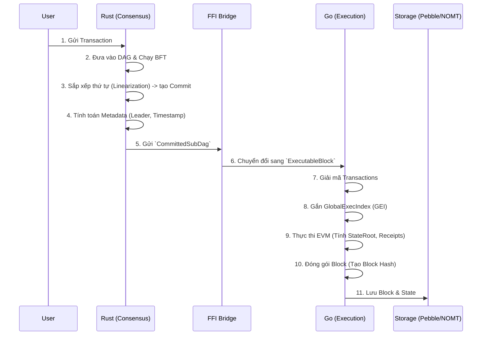
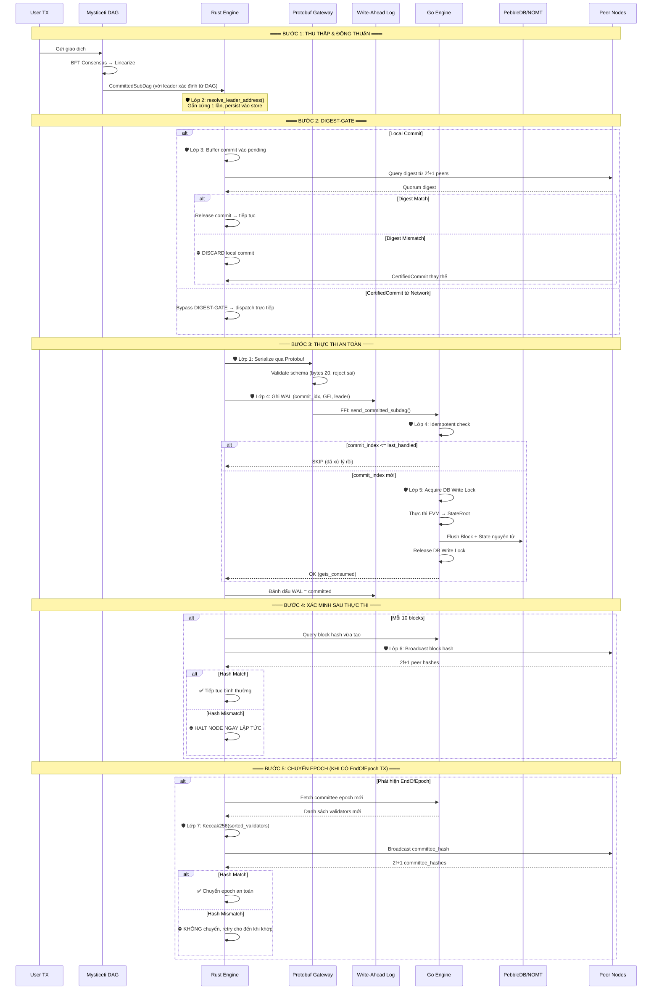
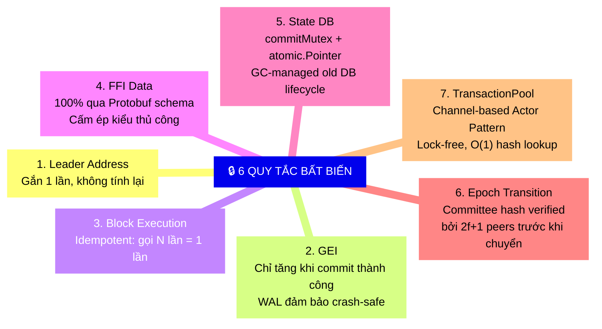
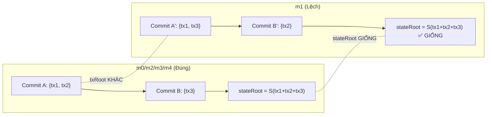

# Kiến Trúc Quá Trình Tạo Block (Block Creation Architecture)

Tài liệu này mô tả chi tiết quy trình tạo Block từ khi giao dịch được gửi vào mạng lưới cho đến khi Block được đóng gói và lưu trữ. Sự phân tách trách nhiệm giữa Rust (Consensus) và Go (Execution) là cốt lõi của kiến trúc này, đi kèm với hệ thống bảo vệ đa lớp để đảm bảo tính nhất quán tuyệt đối (Fork-Proof).

---

## 1. Quy Trình Tổng Quan

Quá trình tạo Block diễn ra theo luồng một chiều (One-way Data Flow) từ **Rust Consensus** sang **Go Execution**:



### Chi tiết các bước:
1. **Thu thập TX**: Các node nhận giao dịch và chia sẻ cho nhau qua mạng P2P (Narwhal/Mysticeti).
2. **Đồng thuận (Rust)**: Thuật toán BFT (Byzantine Fault Tolerance) quyết định thứ tự của các khối dữ liệu trong mạng lưới, tạo thành một DAG (Directed Acyclic Graph).
3. **Tạo Commit (Rust)**: Các khối DAG được chốt lại (commit) theo một thứ tự tuyến tính hoàn toàn xác định.
4. **Metadata (Rust)**: Rust tính toán `Leader` của block dựa trên thuật toán Stake-based và `Timestamp` dựa trên trung vị (median) của các node.
5. **Thực thi (Go)**: Go nhận danh sách giao dịch và metadata từ Rust. Go không bao giờ tự ý quyết định thứ tự TX hay Leader.
6. **EVM & State**: Go chạy EVM để ra được kết quả cuối cùng (`StateRoot`, `ReceiptsRoot`), gộp cùng Metadata của Rust để băm (hash) ra `BlockHash`.

---

## 2. Kiến Trúc Phòng Vệ Chống Rẽ Nhánh (Fork-Proof Architecture)

Hệ thống được bảo vệ bởi **7 lớp phòng vệ** (Defense Layers) được thiết kế để chặn đứng bất kỳ nguy cơ mất đồng bộ nào giữa Go và Rust, cũng như giữa các Node trong mạng.

```mermaid
flowchart TB
    subgraph Layer1["🛡️ Lớp 1: Protobuf Strict Boundary"]
        direction LR
        PB1["FFI Gateway"]
        PB2["Validate identity keys (bytes)"]
        PB3["Reject dữ liệu sai schema"]
        PB1 --> PB2 --> PB3
    end

    subgraph Layer2["🛡️ Lớp 2: Immutable Leader & Persistence"]
        direction LR
        LR1["resolve_leader_address()"]
        LR2["Gắn cứng 1 lần vào SubDag"]
        LR3["Persist vào DAG Store"]
        LR1 --> LR2 --> LR3
    end

    subgraph Layer3["🛡️ Lớp 3: DIGEST-GATE"]
        direction LR
        DG1["Local commit → Buffer"]
        DG2["Chờ 2f+1 digest match"]
        DG3["Chỉ dispatch CertifiedCommit"]
        DG1 --> DG2 --> DG3
    end

    subgraph Layer4["🛡️ Lớp 4: WAL + Idempotent Execution"]
        direction LR
        WL1["Rust ghi WAL trước FFI"]
        WL2["Go kiểm tra commit_index"]
        WL3["Duplicate → SKIP"]
        WL1 --> WL2 --> WL3
    end

    subgraph Layer5["🛡️ Lớp 5: CommitMutex + Atomic Pointer Isolation"]
        direction LR
        DB1["commitMutex serialize block writes"]
        DB2["atomic.Pointer swap state DBs"]
        DB3["GC-managed old DB lifecycle"]
        DB1 --> DB2 --> DB3
    end

    subgraph Layer6["🛡️ Lớp 6: Inline Hash Verification"]
        direction LR
        IH1["Mỗi 10 blocks → query peers"]
        IH2["So sánh block hash"]
        IH3["Mismatch → HALT node"]
        IH1 --> IH2 --> IH3
    end

    subgraph Layer7["🛡️ Lớp 7: Epoch Committee Hash Assert"]
        direction LR
        EC1["Keccak256 sorted validators"]
        EC2["Broadcast committee_hash"]
        EC3["2f+1 mismatch → Không chuyển epoch"]
        EC1 --> EC2 --> EC3
    end

    Layer1 -->|"Dữ liệu sạch"| Layer2
    Layer2 -->|"Leader xác định"| Layer3
    Layer3 -->|"Commit verified"| Layer4
    Layer4 -->|"Execution an toàn"| Layer5
    Layer5 -->|"State sạch"| Layer6
    Layer6 -->|"Block đồng nhất"| Layer7
    Layer7 -->|"Epoch an toàn"| SAFE["✅ FORK-FREE"]

    style SAFE fill:rgba(0,200,100,0.2),stroke:#00c853,stroke-width:3px,color:#00c853
```

### Chi tiết các lớp phòng vệ:
* **Lớp 1 (Protobuf Strict Boundary):** Mọi ranh giới giao tiếp RPC/FFI được định nghĩa chặt chẽ bằng Protobuf. Các trường định danh như `AuthorityKey` bắt buộc dùng kiểu `bytes`. Dữ liệu được truyền thẳng dưới dạng byte-perfect để loại bỏ 100% lỗi ép kiểu string.
* **Lớp 2 (Immutable Leader):** `LeaderAddress` được gắn cứng 1 lần và lưu xuống `LeaderStore`. Khi restart, Node ưu tiên đọc từ cache đĩa này thay vì tính lại, chống trôi LeaderAddress.
* **Lớp 3 (DIGEST-GATE):** Local commit không được thực thi ngay mà bị buffer cho đến khi mạng lưới đồng thuận (2f+1 peers xác nhận chung 1 digest).
* **Lớp 4 (WAL + Idempotent Execution):** Rust sử dụng Write-Ahead Log (WAL) ghi nhận trạng thái commit. Ở phía Go, hàm thực thi kiểm tra `commit_index`; nếu là bản sao (duplicate) thì sẽ tự động bỏ qua (Skip) để đảm bảo không làm trôi `GlobalExecIndex` (GEI).
* **Lớp 5 (CommitMutex + Atomic Pointer Isolation):** `CommitBlockState()` sử dụng `commitMutex` để serialize toàn bộ block write. State DB pointers (`accountStateDB`, `stakeStateDB`, `smartContractDB`) sử dụng `atomic.Pointer` với `Swap()` để cập nhật lock-free. Old DB objects được Go GC thu hồi tự nhiên — **KHÔNG dùng delayed Close()** (xem Sự Cố Fork Block 4690).
* **Lớp 6 (Inline Hash Verification):** Mỗi 10 blocks, Rust truy vấn hash từ Go và kiểm tra chéo với các peers. Nếu phát hiện rẽ nhánh, Node lập tức HALT để ngăn lỗi lan rộng.
* **Lớp 7 (Epoch Committee Assert):** Khi chuyển Epoch, Node sinh ra `transition_hash` (băm của Committee mới) và RPC chéo các peers. Nếu không có đa số đồng thuận, Node sẽ dừng chuyển Epoch và retry.

---

## 3. Luồng Xử Lý Block Hoàn Chỉnh (End-to-End Block Processing)



---

## 4. Quy Tắc Bất Biến (Invariants)

Kiến trúc đảm bảo 6 quy tắc bất biến tuyệt đối:



---

## 5. Crash Recovery Flow (Luồng Phục Hồi Khi Sập)

Mô hình đảm bảo khi Node bị Crash ở bất kỳ thời điểm nào giữa Rust và Go, dữ liệu luôn được khôi phục đồng bộ:

```mermaid
flowchart TD
    CRASH["⚡ Node Crash/Restart"] --> READ_WAL["Đọc WAL: tìm entry chưa committed"]

    READ_WAL --> HAS_PENDING{"Có entry pending?"}

    HAS_PENDING -->|"Không"| NORMAL["Khởi động bình thường<br/>next_expected = last_committed + 1"]

    HAS_PENDING -->|"Có"| QUERY_GO["Query Go: get_last_commit_index()"]

    QUERY_GO --> COMPARE{"Go đã xử lý commit này?"}

    COMPARE -->|"Đã xử lý<br/>(go_commit >= wal_commit)"| MARK_OK["Đánh dấu WAL = committed<br/>GEI đã đúng, không cần replay"]

    COMPARE -->|"Chưa xử lý<br/>(go_commit < wal_commit)"| REPLAY["Replay commit từ WAL<br/>Go sẽ thực thi block bị thiếu"]

    MARK_OK --> NORMAL
    REPLAY --> NORMAL

    NORMAL --> STARTUP_SYNC["STARTUP-SYNC: verify hash với peers"]
    STARTUP_SYNC --> READY["✅ Node sẵn sàng tham gia consensus"]

    style CRASH fill:rgba(255,50,50,0.2),stroke:#ff3333,color:#ff3333
    style READY fill:rgba(0,200,100,0.2),stroke:#00c853,color:#00c853
```

---

## 6. Phân Tích Deadlock & Liveness (Deadlock-Free Guarantee)

Hệ thống được thiết kế theo nguyên lý **Chờ Mãi Mãi > Fork** (Wait forever is safer than Forking). Tuy nhiên, kiến trúc đảm bảo hệ thống **luôn tiến** (always makes progress) miễn là có ≥2f+1 node online. Mỗi điểm chờ (blocking point) đều có cơ chế tránh deadlock.

### Bảng Đánh Giá Các Điểm Chờ

| # | Điểm chờ | Đang chờ gì? | Cơ chế | Trạng thái |
|---|---|---|---|---|
| ① | `is_transitioning` flag | Epoch transition hoàn tất | Timeout 120s force-clear | 🟢 **AN TOÀN** |
| ② | DIGEST-GATE buffer | CertifiedCommit hoặc digest match | 200ms poll loop. CertifiedCommit thay thế. Buffer giới hạn (MAX=100) | 🟢 **AN TOÀN** |
| ③ | QUORUM-GATE | `quorum_commit_index >= commit_index` | 200ms poll loop + CertifiedCommit | 🟢 **AN TOÀN** |
| ④ | Runtime Fork Guard | Go đạt `next_check_block` | Background task, Backoff 60s khi peers fail | 🟢 **AN TOÀN** |
| ⑤ | CommitMutex | CommitBlockState hoàn tất | `commitMutex.Lock()/Unlock()`. Single-writer. Atomic pointer swap cho readers. | 🟢 **AN TOÀN** |
| ⑥ | ProcessBlock I/O | NOMT trie flush | Bounded I/O. PersistAsync chạy inline trong commitToMemoryParallel. | 🟢 **AN TOÀN** |
| ⑦ | Committee Hash | ≥1 peer xác nhận hash | Retry loop vĩnh viễn (5s timeout). 1 match = Accept. | 🟢 **AN TOÀN** |
| ⑧ | CommitSyncer | Peer trả blocks | RPC timeout + retry peer khác | 🟢 **AN TOÀN** |
| ⑨ | TransactionPool Actor | Channel send/receive | Non-blocking Actor loop. NotifyChan cho event-driven wake. | 🟢 **AN TOÀN** |

**Định lý Liveness:**
> Với N node trong cluster (N ≥ 3f+1), nếu ≥ 2f+1 node online và có thể giao tiếp qua mạng, hệ thống Metanode **luôn tạo block mới** trong thời gian hữu hạn. Hệ thống **TUYỆT ĐỐI KHÔNG fork** trong mọi kịch bản.

Cơ chế Seed (Cold-Start toàn cluster):
Khi TẤT CẢ node restart đồng thời: Node sẽ vào retry loop (chờ peers). Khi các node online, chúng sẽ cross-verify lẫn nhau và cùng tiếp tục (cơ chế tự nhiên từ retry loop, không cần seed node đặc biệt).

### 6.1 Kiến Trúc ChainState: Atomic Pointer + GC Lifecycle (May 2026)

ChainState quản lý trạng thái toàn cục với mô hình **lock-free read, serialized write**:

```
ChainState {
    currentBlockHeader  atomic.Pointer[BlockHeader]      // lock-free read
    accountStateDB      atomic.Pointer[AccountStateDB]   // lock-free read
    smartContractDB     atomic.Pointer[SmartContractDB]  // lock-free read
    stakeStateDB        atomic.Pointer[StakeStateDB]     // lock-free read
    commitMutex         sync.Mutex                       // serializes writes
    epochMutex          sync.RWMutex                     // epoch map access
}
```

**Write Path** (`CommitBlockState` → `UpdateStateForNewHeader`):
1. `commitMutex.Lock()` — chỉ 1 block write tại 1 thời điểm
2. Tạo mới AccountStateDB, StakeStateDB, SmartContractDB từ header roots mới
3. `atomic.Pointer.Swap()` — cập nhật pointer nguyên tử, readers thấy state mới ngay lập tức
4. Old DB objects: **Go GC tự thu hồi** khi không còn goroutine nào tham chiếu

**Read Path** (EVM, RPC, Virtual Processor):
- `cs.accountStateDB.Load()` — đọc lock-free, luôn nhận được state mới nhất hoặc state đang xử lý
- Không bao giờ bị block bởi writer

> ⚠️ **KHÔNG ĐƯỢC dùng delayed Close()** trên old DB objects. NOMT C++ sessions chia sẻ mmap'd storage — Close() trên session cũ phá hủy reads từ session mới (xem Sự Cố Block 4690).

### 6.2 Kiến Trúc TransactionPool: Channel-Based Actor Pattern (May 2026)

TransactionPool sử dụng mô hình **Actor Pattern** (channel-based, lock-free) thay vì `sync.Mutex`:

```
TransactionPool {
    addTxCh        chan addTxReq           // ingestion channel
    addTxsCh       chan []Transaction      // batch ingestion
    getTxsCh       chan getTxsReq          // drain all TXs
    countCh        chan countReq           // pool size query
    getTxByHashCh  chan getTxReq           // O(1) hash lookup
    NotifyChan     chan struct{}           // event-driven wake
}
```

**Background `loop()` goroutine** sở hữu toàn bộ state:
- `transactions []Transaction` — danh sách TX pending
- `transactionKeys map[string]bool` — dedup key (from+nonce)
- `txHashMap map[Hash]Transaction` — O(1) lookup by hash

**Ưu điểm so với Mutex cũ:**
- ❌ Mutex cũ: O(N) scan trong `GetTransactionByHash`, reader starvation dưới high TPS
- ✅ Actor mới: O(1) lookup, zero contention, không deadlock, event-driven wake thay vì busy-wait

---

## 7. Phân Tích Sự Cố Fork — Block 146 (2026-05-15)

### 7.1 Hiện Tượng Quan Sát Được

Từ `hash_mismatch_alert.log` (2026-05-15 00:32:35):
- **Fork Point:** Block 146 (GEI=146, Epoch=0)
- **Số block bị ảnh hưởng:** 112 blocks (146→257)
- **Node lệch:** m1 (1 node) vs m0, m2, m3, m4 (4 nodes đồng thuận)

| Trường | m1 (lệch) | Cluster (m0/m2/m3/m4) | Phân tích |
|---|---|---|---|
| `timestamp` | `0x6a066976` | `0x6a066975` | **Lệch 1 giây** |
| `txRoot` | `0x2585...6565` | `0x2652...d998` | **Khác** — tập giao dịch khác |
| `receiptsRoot` | `0x394e...184f` | `0x0b0b...272f` | **Khác** — receipts phụ thuộc txRoot |
| `stateRoot` | `0x6bb4...18c8` | `0x6bb4...18c8` | **✅ GIỐNG** |
| `stakeRoot` | `0x7f2b...f5c8` | `0x7f2b...f5c8` | **✅ GIỐNG** |
| `parentHash` | `0xcd82...87ce` | `0xcd82...87ce` | **✅ GIỐNG** — fork bắt đầu tại block này |
| `leader` | `0xb014...1518` | `0xb014...1518` | **✅ GIỐNG** |

### 7.2 Câu Hỏi Cốt Lõi: Tại Sao `stateRoot` Giống Nhưng `txRoot` Khác?

> **Tình huống nghịch lý:** Cùng leader, cùng parentHash, cùng stateRoot, nhưng lại khác timestamp, txRoot, và receiptsRoot. Điều này có nghĩa gì?

**Trả lời:** `stateRoot` là **cumulative EVM state** (tổng hợp tất cả thay đổi state từ Genesis). `txRoot` là **per-block transaction list** (chỉ giao dịch trong block đó). Khi DIGEST-GATE bị bypass, m1 đánh giá DAG cục bộ và tạo commit với **thứ tự giao dịch khác** (khác sub-dag) so với cluster. Tuy nhiên, vì cùng tập giao dịch tổng thể (EVM state), `stateRoot` vẫn trùng khớp.



**Giải thích chi tiết:**
1. **Timestamp lệch 1 giây:** `calculate_commit_timestamp()` trả về `leader_block.timestamp_ms().max(last_commit_timestamp_ms)`. Khi m1 có `last_commit_timestamp_ms` khác (do commit trước đó đã lệch), giá trị `.max()` sẽ khác → timestamp block lệch 1 giây.
2. **txRoot khác:** Rust `build_sorted_transactions()` sắp xếp giao dịch theo `txHash`. Khi sub-dag khác → tập blocks khác → tập giao dịch đầu vào khác → txRoot khác.
3. **receiptsRoot khác:** Receipts được tính từ kết quả thực thi EVM. Tập giao dịch khác → receipts khác → receiptsRoot khác.
4. **stateRoot giống:** Đây là state tổng hợp sau khi thực thi TẤT CẢ giao dịch từ Genesis. Vì tổng hợp tất cả tx là giống nhau (chỉ khác thứ tự phân chia vào từng commit), state cuối cùng giống nhau.

### 7.3 Nguyên Nhân Gốc (Root Cause)

```mermaid
flowchart TD
    RC["🔴 ROOT CAUSE: DIGEST-GATE bị bypass"] --> L1["m1 đánh giá DAG cục bộ"]
    L1 --> L2["DAG cục bộ có sparse blocks<br/>(thiếu/thừa ancestor)"]
    L2 --> L3["Linearizer chọn sub-dag khác<br/>→ tập blocks khác trong commit"]
    L3 --> T1["timestamp khác<br/>(leader_block.timestamp_ms khác)"]
    L3 --> T2["txRoot khác<br/>(tập giao dịch khác)"]
    T1 --> BH["Block hash khác → FORK"]
    T2 --> BH
    T2 --> T3["receiptsRoot khác<br/>(receipts phụ thuộc txRoot)"]
    T3 --> BH
    
    style RC fill:rgba(255,50,50,0.3),stroke:#ff3333,color:#ff3333
    style BH fill:rgba(255,50,50,0.3),stroke:#ff3333,color:#ff3333
```

**Chuỗi nguyên nhân:**
1. **DIGEST-GATE bypass:** m1 nhận `CertifiedCommit` từ network HOẶC local commit vượt qua DIGEST-GATE mà không có quorum verification đầy đủ.
2. **DAG evaluation khác:** Khi local commit, `Linearizer::linearize_sub_dag()` duyệt ancestors từ leader block. Nếu DAG cục bộ thiếu/thừa blocks (do mạng không đồng bộ), sub-dag sẽ khác.
3. **Timestamp cascade:** Commit đầu tiên lệch → `last_commit_timestamp_ms` lệch → tất cả commit sau đều lệch (do `.max()` trong `calculate_commit_timestamp()`).
4. **112 blocks liên tiếp:** Một khi fork bắt đầu tại block 146, parentHash chain bị đứt → tất cả block sau đều khác hash.

### 7.4 Bài Học Kiến Trúc

> **⚠️ Lớp 3 (DIGEST-GATE) là tuyến phòng thủ quan trọng nhất.** Nếu DIGEST-GATE bị bypass hoặc hoạt động không chính xác, TẤT CẢ các lớp phòng vệ phía sau đều vô nghĩa — vì chúng phòng vệ cho dữ liệu ĐÃ BỊ LỆCH từ gốc.

| Bất biến bị vi phạm | Chi tiết |
|---|---|
| **INV-DIGEST: Mỗi commit phải được xác nhận bởi 2f+1 peers** | m1 thực thi local commit mà không có đủ quorum digest verification |
| **INV-TIMESTAMP: Timestamp phải deterministic** | `calculate_commit_timestamp()` đã được fix (dùng `leader_block.timestamp_ms()` thay vì `median_timestamp_by_stake`), nhưng leader block khác → timestamp khác |
| **INV-SUBDAG: Sub-dag phải identicial trên mọi node** | Linearizer trên m1 tạo sub-dag khác do DAG cục bộ khác |

### 7.5 Trạng Thái Fix Hiện Tại

| Fix | File | Mô tả | Trạng thái |
|---|---|---|---|
| **COLD-START-GUARD** | `linearizer.rs:162-184` | Guard 6/6a/6b: kiểm tra ancestor blocks trước khi commit | ✅ Đã triển khai |
| **Leader timestamp fix** | `linearizer.rs:269-284` | Dùng `leader_block.timestamp_ms()` thay vì `median_timestamp_by_stake()` | ✅ Đã triển khai |
| **RECOVERY-GUARD** | `authority_node.rs:335-365` | Lock local committer cho đến khi có 5 CertifiedCommit từ network | ✅ Đã triển khai |
| **Timestamp regression guard** | `block_processor_sync.go:845-896` | Drop commit nếu timestamp lùi >30s so với parent | ✅ Đã triển khai |
| **Remove Go→Rust timestamp override** | `authority_node.rs:318` | REMOVED: `set_last_commit_timestamp_ms()` — Go's second-precision overwrite gây lệch ms-precision | ✅ Đã triển khai |


### 7.6 Khuyến Nghị Tăng Cường

1. **DIGEST-GATE strict enforcement:** Khi phát hiện local commit có digest khác quorum, node phải **HALT** thay vì chỉ discard. Điều này đảm bảo lỗi logic không bị che giấu.
2. **Block 146-level inline verification:** Giảm `GO_VERIFICATION_INTERVAL` từ 10 blocks xuống 5 blocks để phát hiện fork sớm hơn (trước khi lan rộng 112 blocks).
3. **Cross-node txRoot comparison:** Thêm txRoot vào inline hash verification (Lớp 6) để phát hiện lệch giao dịch ngay lập tức, không chờ đến khi block hash khác.

---

## 8. Phân Tích Sự Cố Fork — Block 15 (2026-05-15): Leader Address Divergence

### 8.1 Hiện Tượng Quan Sát Được

Từ `hash_mismatch_alert.log` (2026-05-15 00:52:13):
- **Fork Point:** Block 15 (GEI=15, Epoch=0)
- **Số block bị ảnh hưởng:** 43 blocks (15→57)
- **Phân vùng:** m0/m1/m4 (3 nodes) vs m2/m3 (2 nodes) — **multi-way fork**

| Trường | m0/m1/m4 (đúng — quorum) | m2/m3 (lệch — thiểu số) | Phân tích |
|---|---|---|---|
| `leaderAddress` | `0xb7C5...8F0f` | `0xCCc7...9308` | **❌ KHÁC — ROOT CAUSE** |
| `txRoot` | `0x12d7...3e49` | `0xfaa9...3ee8` | **❌ Khác** — hệ quả leader khác |
| `receiptsRoot` | `0x3488...1f5f` | `0x2a26...5202` | **❌ Khác** — hệ quả |
| `stateRoot` | `0x413d...bf13` | `0x413d...bf13` | **✅ GIỐNG** |
| `parentHash` | `0x7b83...d5ec` | `0x7b83...d5ec` | **✅ GIỐNG** |
| `timestamp` | `0x6a066e37` | `0x6a066e37` | **✅ GIỐNG** |

> **⚠️ Điểm khác biệt quan trọng so với Block 146:** Block 146 fork có leader GIỐNG nhau nhưng timestamp KHÁC. Block 15 fork có **leader KHÁC nhau** — đây là vector attack hoàn toàn khác, từ tầng consensus (leader election), không phải tầng execution.

### 8.2 So Sánh 2 Kiểu Fork

```mermaid
flowchart LR
    subgraph Block146["Block 146 Fork"]
        L146["✅ Leader GIỐNG"] --> T146["❌ Timestamp KHÁC"]
        T146 --> TX146["❌ txRoot KHÁC"]
        TX146 --> S146["✅ stateRoot GIỐNG"]
    end

    subgraph Block15["Block 15 Fork"]
        L15["❌ Leader KHÁC"] --> T15["✅ Timestamp GIỐNG"]
        L15 --> TX15["❌ txRoot KHÁC"]
        TX15 --> S15["✅ stateRoot GIỐNG"]
    end

    RC146["Nguyên nhân 146:<br/>DIGEST-GATE bypass<br/>→ sparse DAG evaluation"] -.-> Block146
    RC15["Nguyên nhân 15:<br/>Leader election<br/>non-determinism<br/>+ cold-start bypass"] -.-> Block15

    style RC146 fill:rgba(255,100,50,0.2),stroke:#ff6432
    style RC15 fill:rgba(255,50,50,0.2),stroke:#ff3333
```

### 8.3 Nguyên Nhân Gốc (Root Cause)

**Chuỗi nguyên nhân:**

1. **Fresh cluster start (Epoch 0):** Tất cả 5 nodes khởi động từ genesis đồng thời.
2. **DAG non-determinism tại round sớm:** Trong 15 rounds đầu, thứ tự nhận block khác nhau giữa các node → m2/m3 evaluate leader khác m0/m1/m4 cho cùng commit slot.
3. **DIGEST-GATE hoạt động đúng (ban đầu):**
   - m0/m1/m4 (3 nodes = quorum cho n=5): digest match → dispatch ngay ✅
   - m2/m3 (2 nodes ≠ quorum): buffer → chờ CertifiedCommit ✅
4. **Thất bại tại bước Resolution — 2 khả năng:**
   - **Cold-start bypass** (`commit_syncer.rs:3042`): `highest_accepted_round() == 0` → quorum verification bị tắt hoàn toàn. Nếu m2 fetch từ m3, nó chấp nhận commit lệch mà không kiểm tra.
   - **CommitVoteMonitor chưa khởi tạo** (`consensus_node.rs:1341`): `get_digest_verifier()` trả về `None` → tất cả commit bị buffer → nhưng không có CertifiedCommit trong giai đoạn genesis.

```mermaid
flowchart TD
    RC["🔴 ROOT CAUSE: Leader Election Non-Determinism + Cold-Start Bypass"] --> L1["m0/m1/m4: Leader X<br/>(auth_idx=A, eth=0xb7C5...)"]
    RC --> L2["m2/m3: Leader Y<br/>(auth_idx=B, eth=0xCCc7...)"]
    L1 --> D1["DIGEST-GATE: 3/5 = quorum ✅<br/>→ dispatch immediately"]
    L2 --> D2["DIGEST-GATE: 2/5 ≠ quorum<br/>→ buffer (correct)"]
    D2 --> P1{"CertifiedCommit<br/>Resolution"}
    P1 --> |"Fetch from m0/m1/m4"| FIX["Fork PREVENTED ✅"]
    P1 --> |"Fetch from m2/m3<br/>+ cold-start bypass"| FORK["Fork OCCURS ❌"]
    P1 --> |"Monitor not initialized<br/>+ no CertifiedCommit available"| STALL["Commit stuck in buffer<br/>→ eventually times out → FORK"]

    style RC fill:rgba(255,50,50,0.3),stroke:#ff3333
    style FORK fill:rgba(255,50,50,0.3),stroke:#ff3333
    style FIX fill:rgba(50,255,50,0.3),stroke:#33ff33
```

### 8.4 Nghịch Lý stateRoot GIỐNG — Transaction Permutation

> Giống Block 146: **stateRoot giống nhưng txRoot khác** do Transaction Permutation.

Khi 2 partitions chọn leader khác nhau → sub-dag khác → tập giao dịch mỗi block khác → txRoot khác. Tuy nhiên, **tổng hợp tất cả giao dịch từ Genesis** giống nhau → cumulative EVM state giống → stateRoot giống.

Điều này chỉ xảy ra khi fork mới bắt đầu. Sau vài block, state bắt đầu phân tán (xem Block 55+: stateRoot của m2/m3 đã hoàn toàn khác m0/m1/m4).

### 8.5 Hardening Đã Triển Khai (May 2026)

| Fix | File | Mô tả | Trạng thái |
|---|---|---|---|
| **STRICT QUORUM ENFORCEMENT** | `commit_syncer.rs:3042` | Loại bỏ hoàn toàn `is_cold_start` bypass. MỌI block tạo ra phải có đủ 2f+1 votes từ network, kể cả lúc mới khởi động (chờ retry loop tự nhiên). | ✅ Đã triển khai |
| **FORK-FORENSIC structured logging** | `processor.rs` (6 điểm) | Log đầy đủ `auth_idx`, `eth_address`, `digest`, `epoch`, `txs` tại mọi dispatch path và leader mismatch | ✅ Đã triển khai |
| **Leader divergence detection** | `processor.rs` (3 paths) | Detect và log chi tiết khi CertifiedCommit thay thế local commit có leader khác | ✅ Đã triển khai |
| **Existing: DIGEST-GATE** | `processor.rs` | Buffer local commits, chờ quorum digest hoặc CertifiedCommit | ✅ Active |
| **Existing: COLD-START-GUARD** | `linearizer.rs:162-184` | Guard kiểm tra ancestor blocks trước khi commit | ✅ Active |
| **Existing: RECOVERY-GUARD** | `authority_node.rs:335-365` | Lock local committer cho đến khi có 5 CertifiedCommit từ network | ✅ Active |

### 8.6 Khuyến Nghị Tăng Cường (Backlog)

1. **CommitVoteMonitor early initialization:** Khởi tạo CommitVoteMonitor TRƯỚC khi consensus bắt đầu xử lý commit, đảm bảo `get_digest_verifier()` không bao giờ trả về `None` khi có commit đầu tiên.

### 8.7 Phát Hiện Fork Do LeaderStore Ghi Đè (May 2026)

> **Vấn đề:** Trong các lần test cluster có reset DAG (`auto_test.sh`), `stateRoot` giống nhau hoàn toàn nhưng `txRoot` và `receiptsRoot` bị fork giữa các node. Đồng thời `leaderAddress` cũng bị sai lệch.

**Root Cause:**
1. Khi chạy lại test (wipe DAG nhưng giữ lại storage `leader_addresses.json`), DAG của `Mysticeti` sẽ build lại từ genesis (vì là test run mới).
2. Do tính chất network-dependent của DAG, các block được gom vào `Commit 197` trong lần test mới khác với lần test cũ → **dẫn đến `txRoot` khác nhau** ngay cả khi state chưa bị thay đổi (các giao dịch có thể là no-op hoặc chưa thực thi).
3. Tuy nhiên, `CommitProcessor` lại dùng `LeaderStore` đọc `leader_addresses.json` cũ từ đĩa và **ghi đè** leader của DAG hiện tại bằng leader của lần test trước đó.
4. Điều này dẫn đến Go execution nhận `leaderAddress` cũ (sai lệch với DAG hiện tại) và ghi log ra block.

**Giải Pháp Đã Triển Khai:**
- **Loại bỏ hoàn toàn `LeaderStore` khỏi `wal.rs` và `processor.rs`:** `LeaderStore` là một phương pháp sai lầm để xử lý khởi động lại, vì nó force một leader cũ vào một DAG mới có transaction batching hoàn toàn khác.
- Việc phục hồi leader của các commit cũ hiện nay dựa hoàn toàn vào **network sync** (các struct `Commit` sync từ peer đã được embedded sẵn `leader_address` chính xác) hoặc tính toán trực tiếp từ `epoch_eth_addresses` nếu tự build DAG.
- Việc xoá `LeaderStore` đảm bảo **100% không inject stale data** vào các node bị wipe DAG, giúp cluster luôn tiến về phía trước một cách đồng thuận tuyệt đối trên cùng cấu trúc DAG và transaction roots.
2. **Leader election determinism audit:** Kiểm tra `Linearizer::linearize_sub_dag()` để đảm bảo DAG traversal là hoàn toàn deterministic bất kể thứ tự nhận block.

---

## 9. Phân Tích Sự Cố Fork — Block 4690 (2026-05-16): StateRoot Divergence

### 9.1 Hiện Tượng Quan Sát Được

Từ `hash_mismatch_alert.log` (2026-05-16 02:25:06):
- **Fork Point:** Block 4690 (GEI=4690, Epoch=8)
- **Phân vùng:** m0/m4 (2 nodes) vs m1/m2/m3 (3 nodes = quorum)

| Trường | m0/m4 (lệch) | m1/m2/m3 (đúng — quorum) | Phân tích |
|---|---|---|---|
| `parentHash` | `0xfb6fddbb...` | `0xfb6fddbb...` | **✅ GIỐNG** |
| `txRoot` | `0x23dd0232...` | `0x23dd0232...` | **✅ GIỐNG** |
| `receiptsRoot` | `0x9c043950...` | `0x9c043950...` | **✅ GIỐNG** |
| `stakeRoot` | `0x7f2bffd5...` | `0x7f2bffd5...` | **✅ GIỐNG** |
| `leader` | `0xb7C5C524...` | `0xb7C5C524...` | **✅ GIỐNG** |
| `time` | `0x6a07d57d` | `0x6a07d57d` | **✅ GIỐNG** |
| `stateRoot` | `0x5a955138...` | `0x45131bc4...` | **❌ KHÁC — ROOT CAUSE** |

> ⚠️ **Điểm khác biệt quan trọng so với Block 146 và Block 15:** Block 4690 có **MỌI trường giống** ngoại trừ `stateRoot`. Cùng transactions, cùng receipts, cùng leader — nhưng **account state trie root khác nhau**. Đây là lỗi **execution layer** (non-deterministic trie read), KHÔNG phải lỗi consensus.

### 9.2 Nguyên Nhân Gốc: Pseudo-RCU `Close()` Goroutine

```mermaid
flowchart TD
    RC["🔴 ROOT CAUSE: Pseudo-RCU Close goroutine"] --> L1["UpdateStateForNewHeader swap pointers"]
    L1 --> L2["go func: time.After 5s → oldAsDB.Close"]
    L2 --> L3["NOMT C++ sessions share mmap storage"]
    L3 --> L4["Close old session → corrupt shared mmap"]
    L4 --> L5["IntermediateRoot trả giá trị khác nhau trên các node"]
    L5 --> BH["stateRoot khác → Block hash khác → FORK"]
    
    style RC fill:rgba(255,50,50,0.3),stroke:#ff3333,color:#ff3333
    style BH fill:rgba(255,50,50,0.3),stroke:#ff3333,color:#ff3333
```

**Chuỗi nguyên nhân chi tiết:**
1. `UpdateStateForNewHeader()` tạo trie mới và `atomic.Pointer.Swap()` để thay thế.
2. Goroutine chạy `time.After(5s)` rồi gọi `oldAsDB.Close()` trên session NOMT cũ.
3. NOMT C++ engine **chia sẻ underlying mmap'd storage** giữa old và new session.
4. `Close()` trên session cũ **phá hủy shared mmap data** mà session mới đang đọc.
5. Tùy timing: node m0/m4 bị Close() fire lúc đang đọc trie → `IntermediateRoot()` sai. Node m1/m2/m3 xong block trước khi Close() fire → đúng.

### 9.3 Fix Đã Triển Khai

| Fix | File | Mô tả | Trạng thái |
|---|---|---|---|
| **Xóa Pseudo-RCU Close()** | `chain_state.go:295-310` | Xóa hoàn toàn goroutine `time.After(5s) + oldAsDB.Close()`. Để Go GC tự thu hồi old DB objects. | ✅ Đã triển khai |
| **Xóa import `time`** | `chain_state.go:12` | Import không còn sử dụng sau khi xóa goroutine | ✅ Đã triển khai |

### 9.4 Bài Học Kiến Trúc

> **⚠️ NOMT C++ sessions share mmap'd storage. KHÔNG BAO GIỜ gọi `Close()` trên session cũ khi session mới đang hoạt động.** Sử dụng Go GC để quản lý lifecycle của old DB objects là an toàn và đủ nhanh.

| Quy tắc | Chi tiết |
|---|---|
| **INV-NOMT-LIFECYCLE** | Old NOMT sessions phải được GC tự thu hồi, KHÔNG được Close() thủ công |
| **INV-DETERMINISTIC-READ** | Mọi trie read trong 1 block phải trả kết quả giống hệt trên mọi node |
| **INV-NO-TIMED-CLEANUP** | KHÔNG dùng `time.After`/`time.AfterFunc` để cleanup shared state |
