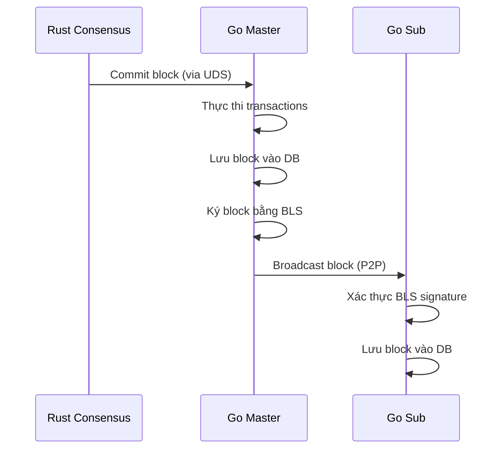

# BLS Block Signing — Kiến Trúc & Quy Trình

## Tổng Quan

Hệ thống sử dụng **BLS12-381** để ký và xác thực block, đảm bảo tính toàn vẹn dữ liệu giữa các node. Có 3 tầng bảo vệ:

1. **Block Signing** — Master ký mỗi block, Sub xác thực trước khi chấp nhận
2. **State Attestation** — Mỗi N block, các node so sánh state hash
3. **Fork Detection** — Nếu state lệch ≥2/3 peers → node dừng ngay

```
┌─────────────────────────────────────────────────────────────┐
│                    BLS KEY ARCHITECTURE                      │
├─────────────────────────────────────────────────────────────┤
│  Private Key (32 bytes) ←── CHUNG cho cả Go và Rust        │
│       │                                                      │
│       ├──→ Go (min-pk)  → PublicKey 48 bytes                │
│       │    Dùng cho: block signing, tx signing, attestation │
│       │                                                      │
│       └──→ Rust (min-sig) → PublicKey 96 bytes              │
│            Dùng cho: authority_key trong committee.json      │
└─────────────────────────────────────────────────────────────┘
```

---

## Cấu Trúc Dữ Liệu — Chữ Ký Nằm Ở Đâu

### Protobuf Schema

Chữ ký BLS nằm trong trường `AggregateSignature` (**field 6**) của `BlockHeader`:

**File:** [block.proto](file:///home/abc/chain-n/mtn-simple-2025/pkg/proto/block.proto)

```protobuf
message BlockHeader {
  bytes  LastBlockHash      = 1;   // 32 bytes — hash block trước
  uint64 BlockNumber        = 2;   // Số thứ tự block
  bytes  AccountStatesRoot  = 3;   // 32 bytes — Merkle root account state
  bytes  ReceiptRoot        = 4;   // 32 bytes — Merkle root receipts
  bytes  LeaderAddress      = 5;   // 20 bytes — địa chỉ validator tạo block
  bytes  AggregateSignature = 6;   // ⭐ 96 bytes — CHỮ KÝ BLS NẰM Ở ĐÂY
  uint64 TimeStamp          = 7;   // Unix timestamp (ms)
  bytes  TransactionsRoot   = 8;   // 32 bytes — Merkle root transactions
  bytes  StakeStatesRoot    = 9;   // 32 bytes — Merkle root stake state
  uint64 Epoch              = 10;  // Epoch number
  uint64 GlobalExecIndex    = 11;  // Rust consensus commit index
}
```

### Go Struct

**File:** [block_header.go](file:///home/abc/chain-n/mtn-simple-2025/pkg/block/block_header.go#L13-L25)

```go
type BlockHeader struct {
    lastBlockHash      common.Hash    // 32 bytes
    blockNumber        uint64
    accountStatesRoot  common.Hash    // 32 bytes
    stakeStatesRoot    common.Hash    // 32 bytes
    receiptRoot        common.Hash    // 32 bytes
    leaderAddress      common.Address // 20 bytes
    timeStamp          uint64
    aggregateSignature []byte         // ⭐ 96 bytes — CHỮ KÝ BLS
    transactionsRoot   common.Hash    // 32 bytes
    epoch              uint64
    globalExecIndex    uint64
}
```

### Interface Methods cho Chữ Ký

**File:** [block.go](file:///home/abc/chain-n/mtn-simple-2025/types/block.go#L38-L40)

```go
type BlockHeader interface {
    AggregateSignature() []byte          // Đọc chữ ký
    SetAggregateSignature([]byte)        // Ghi chữ ký (Master gọi sau khi ký)
    HashWithoutSignature() common.Hash   // Hash header KHÔNG bao gồm chữ ký
}
```

### Luồng Ký — Tránh Vòng Lặp Hash

> [!IMPORTANT]
> Nếu hash cả header (bao gồm signature) → signature thay đổi → hash thay đổi → không verify được.
> Giải pháp: `HashWithoutSignature()` serialize tất cả trường **TRỪ** `AggregateSignature` rồi hash.

```
MASTER:
  BlockHeader (chưa có sig)
       │
       ▼
  HashWithoutSignature()
  = Keccak256(proto WITHOUT AggregateSignature)
  = signing_hash (32 bytes)
       │
       ▼
  BLS.Sign(private_key, signing_hash)
  = signature (96 bytes, G2 point)
       │
       ▼
  SetAggregateSignature(signature)  ←── gắn vào header
       │
       ▼
  Broadcast qua P2P ──────────────► SUB NODE
                                        │
                                        ▼
                                    sig = header.AggregateSignature()  (96 bytes)
                                    hash = header.HashWithoutSignature()
                                    BLS.Verify(masterPubKey, sig, hash) → ✅ / 🚨
```

### Serialization: Proto() vs FromProto()

| Method | AggregateSignature? | Giải thích |
|:---|:---|:---|
| `Proto()` | ❌ **KHÔNG** serialize | Chỉ gồm 10 fields (1-5, 7-11), bỏ qua field 6 |
| `Hash()` | ❌ **KHÔNG** bao gồm | Gọi `Proto()` → marshal → Keccak256 |
| `HashWithoutSignature()` | ❌ **KHÔNG** bao gồm | Tạo proto riêng, bỏ qua AggregateSignature |
| `FromProto()` | ✅ **CÓ** đọc vào | `b.aggregateSignature = pb.AggregateSignature` |

> [!NOTE]
> `Proto()` hiện tại **không** serialize `aggregateSignature` → `Hash()` cũng không bao gồm sig.
> Sig được truyền qua P2P trong protobuf message (qua `FromProto`) nhưng không ảnh hưởng block hash.

---

## Phase 1: Block Signing (Ký Block)

### Luồng xử lý



### Master Node — Ký Block

**File:** [`block_processor_commit.go`](file:///home/abc/chain-n/mtn-simple-2025/cmd/simple_chain/processor/block_processor_commit.go#L123-L134)

```go
// Trong commitWorker(), sau khi lưu block vào DB:
if bp.blockSigner != nil {
    signingHash := job.Block.Header().HashWithoutSignature()
    signature := bp.blockSigner.SignBlockHash(signingHash)
    job.Block.Header().SetAggregateSignature(signature)
}
```

**Chi tiết từng bước:**

| Bước | Hành động | Chi tiết |
|:--:|:---|:---|
| 1 | `HashWithoutSignature()` | Hash toàn bộ header **trừ** trường `AggregateSignature` |
| 2 | `SignBlockHash(hash)` | Ký hash bằng BLS private key → 96 bytes signature |
| 3 | `SetAggregateSignature(sig)` | Gắn signature vào header trước khi broadcast |

> [!NOTE]
> BLS sign chỉ mất ~0.5ms — không ảnh hưởng TPS. Signing chạy **đồng bộ** trong `commitWorker` nhưng **trước** khi broadcast (Phase 2-4 chạy async).

### Sub Node — Xác Thực Signature

**File:** [`block_processor_network.go`](file:///home/abc/chain-n/mtn-simple-2025/cmd/simple_chain/processor/block_processor_network.go#L834-L858)

```go
// Trong ProcessBlockData(), khi nhận block từ P2P:
if len(bp.masterBLSPubKey) > 0 && !bp.skipSigVerification {
    sig := header.AggregateSignature()
    if len(sig) > 0 {
        signingHash := header.HashWithoutSignature()
        if !block_signer.VerifyBlockSignature(signingHash, sig, bp.masterBLSPubKey) {
            // 🚨 REJECTED — block bị từ chối
            return nil
        }
    }
}
```

**Xử lý các trường hợp:**

| Trường hợp | Kết quả |
|:---|:---|
| Signature hợp lệ | ✅ Block được chấp nhận, tiếp tục xử lý |
| Signature **không** hợp lệ | 🚨 Block bị **từ chối hoàn toàn** |
| Không có signature (block cũ) | ⚠️ Warning log, vẫn chấp nhận (backward compatible) |
| `masterBLSPubKey` chưa set | Block chấp nhận không verify (signing disabled) |

---

## Phase 2: State Attestation (Xác Nhận Trạng Thái)

**File:** [`block_processor_attestation.go`](file:///home/abc/chain-n/mtn-simple-2025/cmd/simple_chain/processor/block_processor_attestation.go)

Mỗi `attestation_interval` block (cấu hình trong genesis, mặc định = 10):

### Quy trình

```
Khi blockNumber % attestation_interval == 0:

1. Tính attestation_hash:
   attestation_hash = Keccak256(blockNumber ‖ accountRoot ‖ stakeRoot)

2. Ký bằng BLS:
   bls_signature = BLS.Sign(private_key, attestation_hash)

3. Gửi P2P (StateAttestationTopic):
   { block_number, attestation_hash, account_root, stake_root,
     bls_signature, validator_pub_key, node_address }

4. Thu thập attestation từ peers

5. Quorum check: local hash vs ≥2/3 peers
```

### Cấu trúc StateAttestation

```go
type StateAttestation struct {
    BlockNumber     uint64      // Block number tại thời điểm attestation
    AttestationHash common.Hash // Keccak256(blockNum ‖ accountRoot ‖ stakeRoot)
    AccountRoot     common.Hash // Merkle root của account state
    StakeRoot       common.Hash // Merkle root của stake state
    BLSSignature    []byte      // BLS signature (96 bytes)
    ValidatorPubKey []byte      // BLS public key (48 bytes, min-pk)
    NodeAddress     string      // Địa chỉ node
}
```

---

## Phase 3: Fork Detection (Phát Hiện Fork)

### Thuật toán

```
Khi nhận attestation từ peer:
  1. Verify BLS signature trên attestation_hash
  2. Lưu vào attestationCollector[blockNumber][hash] → [nodes]
  3. Kiểm tra quorum:

     total_peers = len(all_attestations)
     matching = len(attestations[local_hash])
     non_matching = total_peers - matching

     if non_matching >= ceil(2/3 * total_validators):
       🚨 FORK DETECTED → os.Exit(1)
```

### Hành vi khi fork

| Tình huống | Hành động |
|:---|:---|
| Tất cả peers cùng hash | ✅ An toàn, log thành công |
| < 2/3 peers khác hash | ⚠️ Warning, tiếp tục chạy |
| ≥ 2/3 peers **khác** hash | 🚨 **HALT** — `os.Exit(1)` |

---

## Quản Lý Key

### Key Files

| File | Nội dung | Format |
|:---|:---|:---|
| `config/node_N_authority_key.json` | BLS private key | Hex (32 bytes) |
| `config/committee.json` → `authority_key` | Rust public key | Base64 (96 bytes, min-sig) |
| `config-master-nodeN.json` → `BLSPrivateKey` | Go private key | Hex (32 bytes) |
| `genesis.json` → `authority_key` | Rust public key | Base64 (96 bytes) |
| `genesis.json` → `publicKeyBls` | Go public key | Hex (48 bytes, min-pk) |

### Cùng Private Key, Khác Public Key

```
Private Key: 0109751113666a88b1d335c312a6fb49...

Go (BLS12-381 min-pk):
  PublicKey = G1 point = 48 bytes
  Signature = G2 point = 96 bytes
  → Dùng cho: block signing, alloc publicKeyBls

Rust (BLS12-381 min-sig):
  PublicKey = G2 point = 96 bytes
  Signature = G1 point = 48 bytes
  → Dùng cho: committee authority_key
```

### Tạo Key Mới

```bash
# 1. Generate genesis → tạo authority private keys
cd mtn-consensus/metanode
./target/release/metanode generate --output ./config
# → Tạo config/node_N_authority_key.json

# 2. Derive Go public keys
cd mtn-simple-2025
go run cmd/keygen/main.go
# → In ra publicKeyBls cho genesis.json alloc

# 3. Cập nhật configs
# - config-master-nodeN.json → BLSPrivateKey
# - genesis.json → authority_key (từ committee.json)
# - genesis.json → alloc publicKeyBls (từ keygen output)
```

---

## Source Code References

| Component | File | Function |
|:---|:---|:---|
| BLS Signer | [block_signer.go](file:///home/abc/chain-n/mtn-simple-2025/pkg/block_signer/block_signer.go) | `SignBlockHash`, `VerifyBlockSignature` |
| Master Signing | [block_processor_commit.go](file:///home/abc/chain-n/mtn-simple-2025/cmd/simple_chain/processor/block_processor_commit.go#L123-L134) | `commitWorker` |
| Sub Verification | [block_processor_network.go](file:///home/abc/chain-n/mtn-simple-2025/cmd/simple_chain/processor/block_processor_network.go#L834-L858) | `ProcessBlockData` |
| State Attestation | [block_processor_attestation.go](file:///home/abc/chain-n/mtn-simple-2025/cmd/simple_chain/processor/block_processor_attestation.go) | `checkAndLogAttestation` |
| Fork Detection | [block_processor_attestation.go](file:///home/abc/chain-n/mtn-simple-2025/cmd/simple_chain/processor/block_processor_attestation.go) | `ProcessStateAttestation` |
| P2P Topic | [constant.go](file:///home/abc/chain-n/mtn-simple-2025/pkg/common/constant.go) | `StateAttestationTopic` |
| Block Header | [block_header.go](file:///home/abc/chain-n/mtn-simple-2025/pkg/block/block_header.go) | `SetAggregateSignature`, `HashWithoutSignature` |
| Rust Authority Key | [crypto.rs](file:///home/abc/chain-n/mtn-consensus/metanode/meta-consensus/config/src/crypto.rs) | `AuthorityKeyPair.private_key_bytes()` |
| Rust Genesis | [config.rs](file:///home/abc/chain-n/mtn-consensus/metanode/src/config.rs#L380-L387) | `generate_multiple` (save auth key) |

---

→ Xem chi tiết tại [storage_map.md](file:///home/abc/chain-n/mtn-simple-2025/docs/06-diagnostics-guides/storage-map.md)

---

## Performance

| Operation | Thời gian | Ảnh hưởng TPS |
|:---|:---|:---|
| BLS Sign (Master) | ~0.5ms | Không đáng kể |
| BLS Verify (Sub) | ~1ms | Không ảnh hưởng (sub-node only) |
| Attestation Hash | ~0.01ms | Không ảnh hưởng (async) |
| Fork Check | ~0.01ms | Không ảnh hưởng (async) |
| Attestation Persist (LevelDB) | ~0.1ms | Không ảnh hưởng (async) |

**Kết quả TPS test:** 100,000 TXs → 5 blocks, ~16,666 tx/s, 100% BLS verified, 0 fork.

