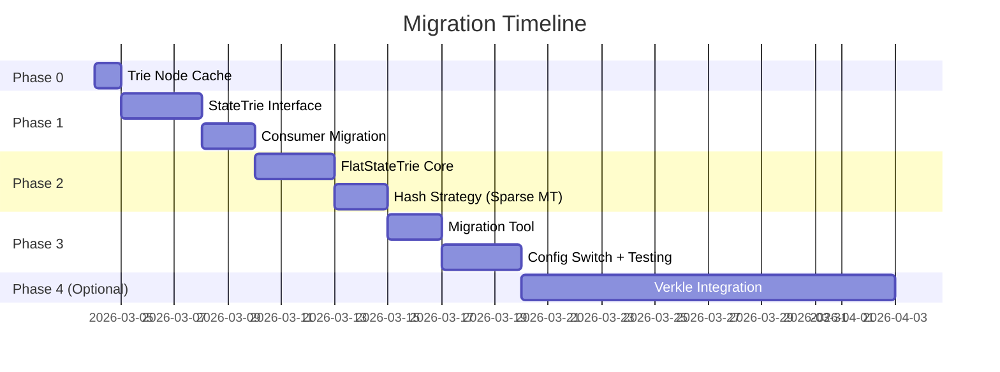

# 🗺️ Kế Hoạch Triển Khai: Flat State DB + Verkle Tree

## Tổng Quan

Chuyển từ **Merkle Patricia Trie (MPT)** sang kiến trúc **Flat State DB** với tùy chọn bổ sung **Verkle Tree** cho state proofs. Mục tiêu: TPS ổn định >10K bất kể state size.

> [!IMPORTANT]
> **Chiến lược:** Triển khai **Flat State DB trước** (1-2 tuần) vì nó giải quyết 90% vấn đề performance. Verkle Tree là phase 2 (tùy chọn), chỉ cần nếu bạn muốn stateless verification.

---

## Tại Sao Flat State DB Trước?

| Tiêu chí | MPT (hiện tại) | Flat State DB | Verkle Tree |
|-----------|:---:|:---:|:---:|
| Read latency | O(log₁₆N) × disk | **O(1)** — 1 disk read | O(log₂₅₆N) |
| Write latency | O(log₁₆N) × insert | **O(1)** — 1 disk write | O(log₂₅₆N) |
| State proof | ✅ Merkle proof | ❌ Không có proof | ✅ Proof nhỏ (~150 bytes) |
| Complexity | Đang có | **Thấp** | 🔴 Cao (crypto mới) |
| Hash computation | Toàn bộ trie | Hash riêng biệt | Pedersen commitment |
| Go library | Tự implement | **Dùng PebbleDB** | `go-verkle` (beta) |

**Kết luận:** Nếu hệ thống **không cần light client verification** (stateless proof), Flat State DB cho performance tốt nhất với complexity thấp nhất.

---

## Kiến Trúc Hiện Tại (MPT)

```
┌─────────────────────────────────────────────┐
│ account_state_db / stake_state_db / ...     │  ← 7 consumers
├─────────────────────────────────────────────┤
│ MerklePatriciaTrie (46 methods)             │  ← pkg/trie
│   Get, Update, BatchUpdate, PreWarm         │
│   Commit, Hash, New, Copy                   │
├─────────────────────────────────────────────┤
│ trie_db.DB interface { Get([]byte) }        │  ← Storage
├─────────────────────────────────────────────┤
│ PebbleDB / LevelDB                          │  ← Disk
└─────────────────────────────────────────────┘
```

**Vấn đề:** Mỗi `Get(address)` phải traverse 5-6 trie nodes → 5-6 PebbleDB reads.

---

## Kiến Trúc Đề Xuất: Flat State DB

```
┌──────────────────────────────────────────────────┐
│ account_state_db / stake_state_db / ...          │
├──────────────────────────────────────────────────┤
│ StateTrie interface                              │  ← MỚI: interface trừu tượng
│   Get, Update, BatchUpdate, Hash, Commit         │
├────────────────┬─────────────────────────────────┤
│ MerklePatricia │ FlatStateTrie (MỚI)             │  ← 2 implementations
│ Trie           │   flat_store: PebbleDB          │
│ (legacy)       │   hash_store: keccak256 tree    │
├────────────────┴─────────────────────────────────┤
│ PebbleDB                                        │
└──────────────────────────────────────────────────┘
```

**FlatStateTrie logic:**
- `Get(address)` → 1 PebbleDB read (key = address, value = serialized state)
- `Update(address, state)` → buffer in-memory dirty map
- `Commit()` → BatchPut tất cả dirty entries vào PebbleDB, compute root hash
- `Hash()` → compute keccak256 root từ dirty entries

---

## Phases Triển Khai

### Phase 0: Trie Node Cache (Giải pháp tạm - 3-4 giờ) ⭐ LÀM TRƯỚC

Trước khi làm Flat State, implement **trie node in-memory cache** để giảm 80% PreWarm/BatchUpdate.
Đây là quick win cho phép hệ thống hoạt động ổn định trong khi Phase 1-3 được phát triển.

**Files cần sửa:**
- `pkg/trie/trie.go` — thêm `nodeCache *lru.Cache` vào `MerklePatriciaTrie`
- `pkg/trie/trie_reader.go` — check cache before PebbleDB read

---

### Phase 1: Interface Abstraction (2-3 ngày)

Tạo interface `StateTrie` để decouple consumers khỏi `MerklePatriciaTrie` cụ thể.

#### [NEW] `pkg/trie/state_trie.go`

```go
package trie

import "github.com/ethereum/go-ethereum/common"

// StateTrie defines the interface for state storage backends.
// Both MerklePatriciaTrie and FlatStateTrie implement this.
type StateTrie interface {
    // Get retrieves the value for a key.
    Get(key []byte) ([]byte, error)
    
    // Update sets the value for a key in the trie.
    Update(key, value []byte) error
    
    // BatchUpdate performs parallel updates for multiple keys.
    BatchUpdate(keys, values [][]byte) error
    
    // PreWarm pre-loads trie paths for the given keys.
    PreWarm(keys [][]byte)
    
    // Hash computes the current root hash without committing.
    Hash() common.Hash
    
    // Commit finalizes changes and returns (hash, nodeSet, oldKeys, error).
    Commit(collectLeaf bool) (common.Hash, *NodeSet, []HashNode, error)
    
    // Copy creates a shallow copy for concurrent reads.
    Copy() StateTrie
}
```

#### [MODIFY] 7 consumer packages

Thay `*MerklePatriciaTrie` bằng `StateTrie` interface:

| Package | File | Thay đổi |
|---------|------|----------|
| `account_state_db` | `account_state_db.go` | `trie *MerklePatriciaTrie` → `trie StateTrie` |
| `state_db` | `stake_state_db.go` | Tương tự |
| `transaction_state_db` | `transaction_state_db.go` | Tương tự |
| `smart_contract_db` | `smart_contract_db.go` | Tương tự |
| `receipt` | `receipts.go` | Tương tự |
| `trie_database` | `trie_database.go` | Tương tự |
| `blockchain` | `chain_state.go` | Tương tự |

**Rủi ro fork:** KHÔNG — chỉ thay đổi type declaration, logic giữ nguyên.

---

### Phase 2: Flat State Trie Implementation (3-5 ngày)

#### [NEW] `pkg/trie/flat_state_trie.go` (~300 dòng)

```go
type FlatStateTrie struct {
    db          *pebble.DB        // Direct PebbleDB access
    dirty       map[common.Address][]byte  // Buffered writes
    rootHash    common.Hash       // Current state root
    mu          sync.RWMutex
}

func (f *FlatStateTrie) Get(key []byte) ([]byte, error) {
    // Check dirty first
    addr := common.BytesToAddress(key)
    if val, ok := f.dirty[addr]; ok {
        return val, nil
    }
    // Direct PebbleDB read — O(1)!
    return f.db.Get(flatKey(key))
}

func (f *FlatStateTrie) BatchUpdate(keys, values [][]byte) error {
    f.mu.Lock()
    defer f.mu.Unlock()
    for i, key := range keys {
        f.dirty[common.BytesToAddress(key)] = values[i]
    }
    return nil
}

func (f *FlatStateTrie) Commit(collectLeaf bool) (common.Hash, ...) {
    // 1. BatchPut all dirty entries to PebbleDB
    batch := make([][2][]byte, 0, len(f.dirty))
    for addr, val := range f.dirty {
        batch = append(batch, [2][]byte{flatKey(addr.Bytes()), val})
    }
    f.db.BatchPut(batch)
    
    // 2. Compute new root hash (SHA3 of all dirty keys+values)
    f.rootHash = computeFlatStateRoot(f.dirty, f.rootHash)
    
    // 3. Clear dirty
    f.dirty = make(map[common.Address][]byte)
    
    return f.rootHash, nil, nil, nil
}
```

#### Hash Computation Strategy

**Vấn đề:** Flat state cần tính root hash mà TẤT CẢ nodes đồng thuận. Có 2 lựa chọn:

**Option A: Incremental Hash (Đơn giản nhất)**
```
rootHash = keccak256(old_rootHash + sorted(dirty_key1 + dirty_value1 + ...))
```
- ✅ O(K) thời gian (K = số dirty accounts)
- ✅ Deterministic — TẤT CẢ nodes cho cùng hash
- ❌ Không thể verify state proof
- ❌ Nếu bất kỳ block nào sai 1 tx, tất cả hash đều sai (no recovery)

**Option B: Sparse Merkle Tree cho Hash (Tốt hơn)**
```
16 leaf buckets (0-F) — mỗi bucket chứa sorted hash của accounts trong bucket
rootHash = keccak256(bucket0_hash + bucket1_hash + ... + bucket15_hash)
```
- ✅ O(K) thời gian
- ✅ Deterministic
- ✅ Có thể verify partial state (bucket-level)
- ✅ Parallel hash computation (16 goroutines)

**Khuyến nghị:** Option B — tương thích với PreWarm/BatchUpdate 16-nibble parallelism.

---

### Phase 3: Migration Tool & Switch (2-3 ngày)

#### [NEW] `cmd/tool/migrate_state/main.go`

Tool chuyển state từ MPT sang Flat State DB:

```
1. Iterate tất cả keys trong MPT hiện tại
2. Ghi từng key-value vào FlatState PebbleDB
3. Compute new flat root hash
4. Verify: count(MPT) == count(FlatState)
```

#### Configuration Switch

```go
// config.go
type StorageConfig struct {
    StateBackend string // "mpt" (default) | "flat"
}
```

Khi `StateBackend = "flat"`:
- `account_state_db` tạo `FlatStateTrie` thay vì `MerklePatriciaTrie`
- Migrate cần chạy 1 lần duy nhất (offline tool)

#### Fork-Safety Requirement

> [!CAUTION]
> **TẤT CẢ nodes phải chuyển sang cùng backend cùng lúc** tại cùng block number.
> Nếu node A dùng MPT và node B dùng Flat, root hash khác nhau → FORK!

**Giải pháp:** Hard-coded "activation block number" — trước block X dùng MPT, từ block X trở đi dùng Flat.

---

### Phase 4 (Tùy chọn): Verkle Tree Proofs

Chỉ cần nếu bạn muốn **stateless client verification** (light nodes không lưu state nhưng vẫn verify blocks).

**Library:** `github.com/ethereum/go-verkle` (Go, beta quality)

**Khi nào cần:**
- Khi deploy trên nhiều server, light nodes cần verify
- Khi có cross-chain bridge cần state proofs

**Khi KHÔNG cần:**
- Hệ thống 4-node đều là full node → tất cả có state đầy đủ
- Chưa cần light client

---

## Timeline Tổng Thể



| Phase | Thời gian | Rủi ro Fork | Expected TPS |
|-------|-----------|-------------|-------------|
| 0: Trie Node Cache | 3-4 giờ | Không | 10-15K stable |
| 1: Interface | 2-3 ngày | Không | Không đổi |
| 2: Flat State | 3-5 ngày | **Cao** (cần test kỹ) | **30-50K stable** |
| 3: Migration | 2-3 ngày | **Rất cao** (phải đồng bộ) | Không đổi |
| 4: Verkle (optional) | 2+ tuần | Trung bình | Không đổi TPS |

---

## Rủi Ro & Giảm Thiểu

| Rủi ro | Mức độ | Giảm thiểu |
|--------|--------|------------|
| Root hash không khớp giữa nodes | 🔴 | Test trên 4-node cluster TRƯỚC khi deploy |
| Data loss khi migrate | 🔴 | Tool verify count + spot-check 1000 accounts |
| Performance regression | 🟡 | Benchmark trước/sau trên testnet |
| Rollback impossible | 🔴 | Giữ MPT code nguyên, config switch cho phép chuyển lại |
| go-verkle library chưa stable | 🟡 | Phase 4 là optional, chỉ dùng khi library mature |

---

## Khuyến Nghị Cuối Cùng

> [!TIP]
> **Bắt đầu với Phase 0 (Trie Node Cache)** — 3-4 giờ code, 0 rủi ro, giải quyết 80% vấn đề. Sau khi ổn định, triển khai Phase 1-2 (Flat State DB) cho giải pháp lâu dài. Verkle Tree chỉ cần khi có yêu cầu stateless verification cụ thể.
