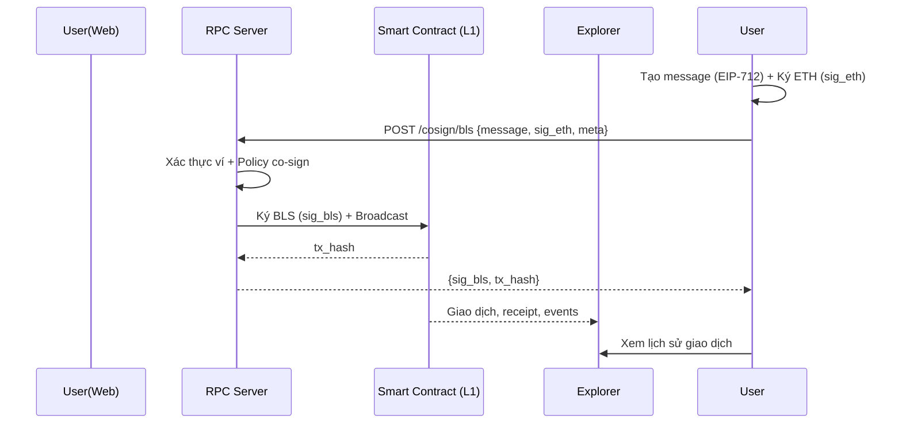
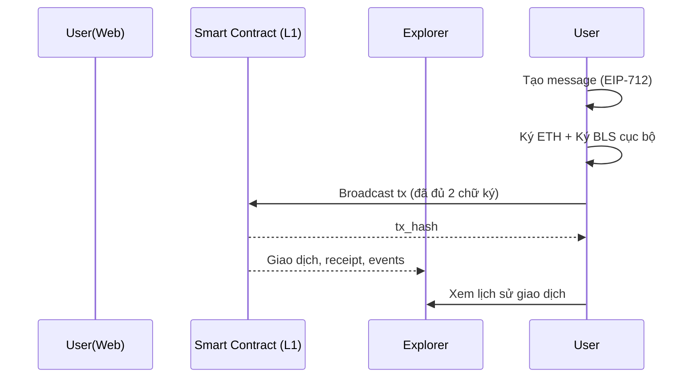
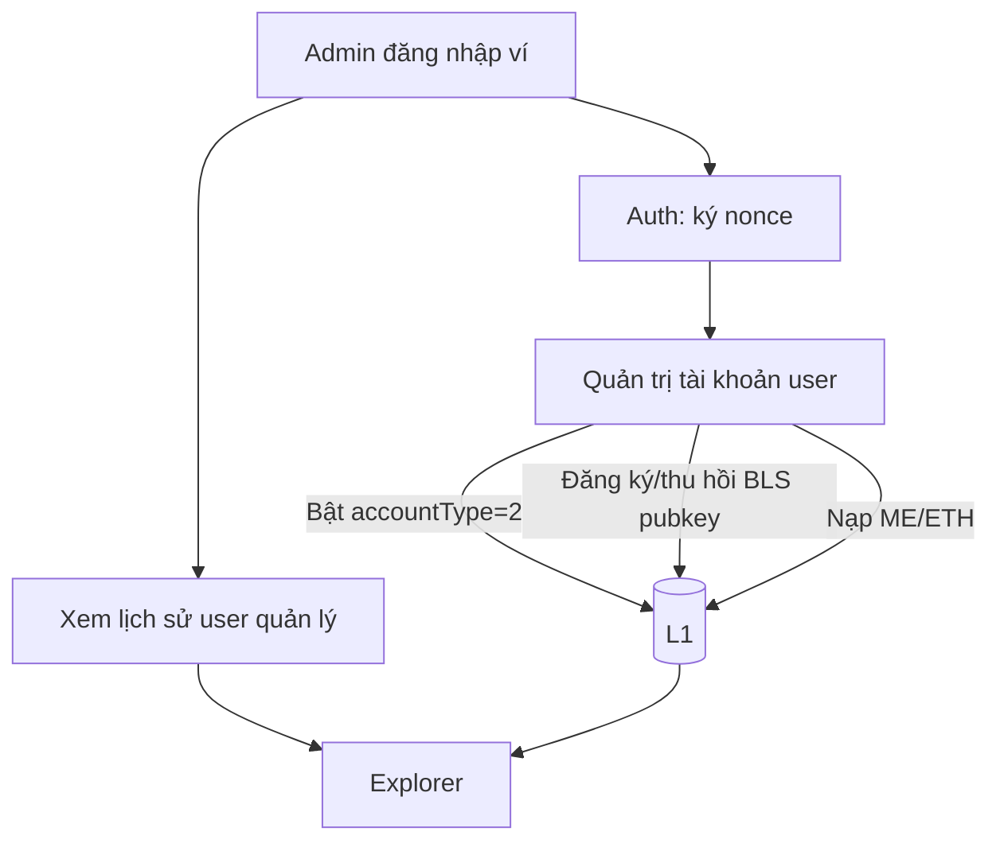

## Thiết kế luồng (User thường, Admin) — Website dựa trên rpc-client

### Sơ đồ tổng quan vai trò

```mermaid
flowchart LR
  subgraph Web[Website Frontend]
    U[User thường<br/>MetaMask/WalletConnect]
    A[Admin<br/>MetaMask/WalletConnect]
  end
  subgraph S[RPC Server ký hộ]
    COSIGN[/Co-sign BLS/]
    ADMINAPI[/Admin APIs/]
  end
  subgraph L1[Blockchain L1 + Smart Contract]
    ACCT2[accountType=2<br/>Require ETH+BLS]
    VERIFY[Verify sig_eth + sig_bls]
  end
  subgraph EXP[Explorer]
    TXS[Txs, Receipts, Events]
  end

  U -->|Ký ETH| COSIGN
  COSIGN -->|Ký BLS + Broadcast| L1
  A --> ADMINAPI
  ADMINAPI -->|Config accountType=2, BLS pubkey, Fund| L1
  L1 --> EXP
  U -->|Xem lịch sử (địa chỉ)| EXP
  A -->|Xem lịch sử user quản lý| EXP
```

### Luồng 1 — User thường co-sign (server ký hộ BLS)



### Luồng 2 — User VIP tự ký (ETH+BLS), tự trả phí



### Phân hệ Admin



Ghi chú:
- Bắt buộc 2 chữ ký (ETH + BLS) ở `accountType=2`.
- Nếu thiếu chữ ký user, tx server đẩy bị bác bỏ.
- Explorer là nguồn sự thật cho lịch sử giao dịch.


