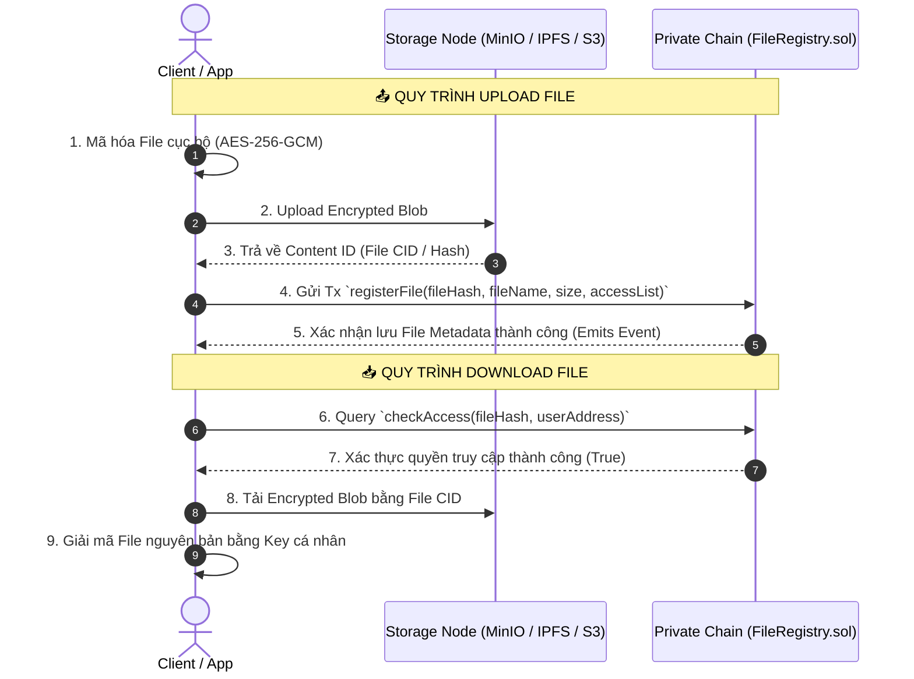

# 📐 So sánh Kiến trúc Triển khai Private Chain & Giải pháp Lưu trữ Tệp (File Storage)

Tài liệu này đánh giá chi tiết **ưu/nhược điểm** của các mô hình triển khai Private Chain từ một Public Chain, đồng thời đưa ra kiến trúc giải pháp tối ưu nhất để tích hợp tính năng **Upload / Download Tệp tin (File Storage)** cho Private Chain.

---

## 🏗️ Part 1: Đánh giá Ưu & Nhược điểm Các Mô hình Triển khai Private Chain

### Mô hình 1: Hub-and-Spoke Native Protocol (Công nghệ: Metanode Hub, Cosmos ICS)
Public Chain đóng vai trò **Hub** điều phối, quản lý danh sách `ChainRegistry`, giữ cọc Stake (Slashing Vault) và nhận Checkpoint định kỳ từ các Private Chain (**Spokes**).

- **Ưu điểm:**
  - **Tính toàn vẹn cao:** Private Chain được bảo vệ bởi toàn bộ giá trị vốn hóa (Stake) của Public Chain. Nếu Private Chain giấu transaction hoặc fork trái phép, Validator sẽ bị tịch thu stake trên Public Chain.
  - **Tiết kiệm hạ tầng:** Cho phép chia sẻ dàn Validator (Shared Security) giữa Public Chain và Private Chain.
  - **Cross-Chain Native:** Dễ dàng luân chuyển tài sản và thông điệp qua lại giữa Public Chain và Private Chains.
- **Nhược điểm:**
  - Cần phát triển bộ giao thức liên chuỗi (Cross-chain Bridge / Relayer) ổn định ở cấp độ giao thức.

---

### Mô hình 2: ZK Rollup / Validium (Công nghệ: Polygon CDK, zkSync Hyperchains)
Private Chain gửi bằng chứng toán học (Zero-Knowledge Proof - ZK-SNARK/STARK) về Public Chain. Ở chế độ Validium, dữ liệu giao dịch được lưu riêng tư (Off-chain) bởi một Data Availability Committee (DAC).

- **Ưu điểm:**
  - **Bảo mật tuyệt đối:** Tính chính xác của giao dịch được đảm bảo bằng toán học (ZK Proof), không cần tin tưởng Validator.
  - **Quyền riêng tư dữ liệu (Privacy):** Chi tiết giao dịch nội bộ ở chế độ Validium hoàn toàn không xuất hiện trên Public Chain.
- **Nhược điểm:**
  - **Chi phí phần cứng cao:** Cần máy chủ cực mạnh trang bị GPU đắt tiền để sinh ZK Proof (Prover).
  - Tốc độ xác nhận khối phụ thuộc vào thời gian tính toán bằng chứng ZK.

---

### Mô hình 3: Subnet / Permissioned L1 (Công nghệ: Avalanche Subnets, Cosmos SDK AppChain)
Mỗi Private Chain chạy độc lập với bộ Validator riêng (được quy định trong Whitelist KYC/AML), sử dụng đồng thuận BFT riêng.

- **Ưu điểm:**
  - **Hiệu năng & Tùy biến tối đa:** Tự do tùy biến Gas Token, Block Size, Block Time và logic thực thi mà không bị giới hạn bởi Public Chain.
  - Tốc độ xử lý cực nhanh (hàng nghìn TPS).
- **Nhược điểm:**
  - **Rủi ro an ninh độc lập:** Nếu bộ Validator riêng của Private Chain quá nhỏ (ví dụ < 4 node), Private Chain dễ bị tấn công 51% hoặc gian lận nội bộ nếu không nộp checkpoint lên Public Chain.

---

### Mô hình 4: Single-Node / Autonomous Private Chain (Metanode Standalone Private Chain)
Private Chain chạy với 1 Validator độc lập hoặc cụm Validator nội bộ doanh nghiệp.

- **Ưu điểm:**
  - **Chi phí thấp nhất & Dễ triển khai nhất:** Chỉ cần 1 lệnh script (`init_private_chain.sh`) là có thể khởi chạy một mạng blockchain hoàn chỉnh.
  - **Latency siêu thấp (<1s):** Phù hợp tuyệt đối cho môi trường Dev, Staging, hoặc hệ thống nội bộ doanh nghiệp closed-loop.
- **Nhược điểm:**
  - Cần nộp Checkpoint Digest định kỳ lên Public Chain để ngăn chặn việc chỉnh sửa lịch sử dữ liệu (Data Tampering).

---

## 📊 Bảng So sánh Tổng hợp Các Mô hình

| Tiêu chí | Hub-and-Spoke (Metanode/Cosmos) | ZK Validium (Polygon CDK) | Subnet L1 (Avalanche) | Standalone (Metanode 1-Val) |
| :--- | :--- | :--- | :--- | :--- |
| **Bảo mật (Security)** | 🟢 Rất cao (Shared Stake) | 🟢 Tuyệt đối (Math ZK) | 🟡 Phụ thuộc vào Validator | 🟡 Cần Checkpoint |
| **Quyền riêng tư (Privacy)**| 🟡 Trung bình | 🟢 Tuyệt đối (Off-chain Data)| 🟢 Cao (Private Network) | 🟢 Tuyệt đối (Nội bộ) |
| **Chi phí hạ tầng** | 🟢 Thấp / Trung bình | 🔴 Rất cao (Cần GPU Prover)| 🟡 Trung bình | 🟢 Rất thấp |
| **Tốc độ (TPS & Latency)**| 🟢 Cao (< 1s) | 🟡 Phụ thuộc Prover | 🟢 Siêu cao (< 1s) | 🟢 Siêu cao (< 100ms) |
| **Độ phức tạp triển khai** | 🟢 Dễ (Script 1-click) | 🔴 Rất phức tạp | 🟡 Trung bình | 🟢 Rất dễ |

---

## 📁 Part 2: Giải pháp Tải & Tải tệp (File Upload / Download) cho Private Chain

### ⚠️ Thách thức kỹ thuật
Blockchain EVM **không thể lưu trực tiếp các tệp dung lượng lớn** (ảnh, PDF, video, tài liệu MB/GB) trực tiếp vào state DB (PebbleDB/NOMT). Nếu lưu trực tiếp:
- State DB bị phình to (State Bloat), lãng phí RAM/Disk.
- Phí Gas giao dịch sẽ bị đẩy lên cực cao.
- Làm nghẽn băng thông đồng thuận P2P giữa các Validator.

### 🏗️ Kiến trúc Giải pháp Tối ưu: Hybrid On-chain Metadata + Off-chain Encrypted Storage

Mô hình kết hợp giữa **Smart Contract kiểm soát phân quyền (On-chain)** và **Cụm lưu trữ blob mã hóa (Off-chain Storage Cluster)**.



---

### 💻 Smart Contract Phân quyền Lưu trữ Tệp (`FileRegistry.sol`)

Dưới đây là Smart Contract chuẩn EVM được deploy lên Private Chain để quản lý phân quyền và kiểm tra tính toàn vẹn của tệp tin:

```solidity
// SPDX-License-Identifier: MIT
pragma solidity ^0.8.20;

contract FileRegistry {
    struct FileMetadata {
        string fileHash;       // SHA-256 hoặc IPFS CID của tệp mã hóa
        string fileName;       // Tên tệp
        uint256 fileSize;      // Kích thước tệp (bytes)
        address owner;         // Chủ sở hữu tệp
        uint256 createdAt;     // Thời gian tạo
        bool isRestricted;     // True: Chỉ cho phép danh sách được cấp quyền
    }

    // Mapping: fileHash => FileMetadata
    mapping(string => FileMetadata) private _files;
    
    // Mapping: fileHash => (userAddress => hasAccess)
    mapping(string => mapping(address => bool)) private _accessPermissions;

    event FileRegistered(string indexed fileHash, string fileName, address indexed owner, uint256 fileSize);
    event AccessGranted(string indexed fileHash, address indexed grantee);
    event AccessRevoked(string indexed fileHash, address indexed revokee);

    modifier onlyFileOwner(string memory fileHash) {
        require(_files[fileHash].owner == msg.sender, "FileRegistry: Caller is not file owner");
        _;
    }

    /// @notice Đăng ký tệp tin mới lên Private Chain
    function registerFile(
        string memory fileHash,
        string memory fileName,
        uint256 fileSize,
        bool isRestricted
    ) external {
        require(_files[fileHash].owner == address(0), "FileRegistry: File already registered");
        require(bytes(fileHash).length > 0, "FileRegistry: Invalid file hash");

        _files[fileHash] = FileMetadata({
            fileHash: fileHash,
            fileName: fileName,
            fileSize: fileSize,
            owner: msg.sender,
            createdAt: block.timestamp,
            isRestricted: isRestricted
        });

        // Chủ sở hữu mặc định có quyền truy cập
        _accessPermissions[fileHash][msg.sender] = true;

        emit FileRegistered(fileHash, fileName, msg.sender, fileSize);
    }

    /// @notice Cấp quyền xem/tải tệp cho một địa chỉ ví khác
    function grantAccess(string memory fileHash, address grantee) external onlyFileOwner(fileHash) {
        require(grantee != address(0), "FileRegistry: Invalid grantee");
        _accessPermissions[fileHash][grantee] = true;
        emit AccessGranted(fileHash, grantee);
    }

    /// @notice Thu hồi quyền xem/tải tệp của một địa chỉ ví
    function revokeAccess(string memory fileHash, address revokee) external onlyFileOwner(fileHash) {
        require(revokee != msg.sender, "FileRegistry: Cannot revoke owner access");
        _accessPermissions[fileHash][revokee] = false;
        emit AccessRevoked(fileHash, revokee);
    }

    /// @notice Kiểm tra địa chỉ ví có quyền tải tệp hay không
    function checkAccess(string memory fileHash, address user) external view returns (bool) {
        FileMetadata memory file = _files[fileHash];
        require(file.owner != address(0), "FileRegistry: File does not exist");
        if (!file.isRestricted) {
            return true; // Tệp công khai nội bộ
        }
        return _accessPermissions[fileHash][user];
    }

    /// @notice Lấy thông tin metadata của tệp
    function getFileMetadata(string memory fileHash) external view returns (FileMetadata memory) {
        require(_files[fileHash].owner != address(0), "FileRegistry: File does not exist");
        return _files[fileHash];
    }
}
```

---

## 🔗 Liên kết Dự án Thực tế & Công nghệ Tham chiếu

### 🌐 Mạng Blockchain Hub & Subnet
- **Avalanche Subnets:** [https://docs.avax.network/subnets](https://docs.avax.network/subnets)
- **Polygon CDK:** [https://polygon.technology/polygon-cdk](https://polygon.technology/polygon-cdk)
- **Arbitrum Orbit:** [https://docs.arbitrum.io/launch-orbit-chain/orbit-gentle-introduction](https://docs.arbitrum.io/launch-orbit-chain/orbit-gentle-introduction)
- **Cosmos IBC:** [https://ibcprotocol.dev/](https://ibcprotocol.dev/)

### 📦 Giải pháp Lưu trữ Tệp Off-chain Doanh nghiệp

#### 🦀 Giải pháp Thuần Rust (Rust-Native Storage — Phù hợp nhất cho Metanode Ecosystem):
1. **[Iroh (`n0-computer/iroh`)](https://iroh.computer/):**
   - *Đặc điểm:* Hệ thống P2P Content-Addressed Blob Storage thế hệ mới viết 100% bằng **Rust**. Sử dụng hash tốc độ cao **BLAKE3** và giao thức truyền tải **QUIC**.
   - *Ưu điểm:* Tốc độ truyền dữ liệu siêu nhanh, dung lượng footprint cực nhẹ, có thể nhúng trực tiếp dạng **Cargo Crate** vào binary của Metanode hoặc chạy daemon riêng.
   - *Link:* [https://github.com/n0-computer/iroh](https://github.com/n0-computer/iroh)

---

### 🚀 Cơ chế Upload & Download Tệp của Iroh trong Rust

Iroh hoạt động theo mô hình **Content-Addressed Blob Store** kết hợp giao thức mạng **QUIC** và thuật toán băm **BLAKE3 (Bao Tree)**.

#### 1. Quy trình Upload (Thêm File vào Iroh Blob Store)
1. **Chia nhỏ & Tạo Hash (Chunking & Hashing):** Khi thêm tệp vào Iroh, dữ liệu được chia nhỏ thành các khối (chunks) và tạo cây băm **Bao (BLAKE3 Verified Tree)**.
2. **Sinh Blob ID (BLAKE3 Hash):** Iroh trả về duy nhất một mã Hash 32-byte (Blob ID) đại diện cho tệp (ví dụ: `2b3a4f...`).
3. **Lưu trữ Blob (Local Store):** Tệp được lưu trong bộ nhớ blob cục bộ của Iroh Node (`iroh-blobs`).
4. **Tạo Ticket (Định danh kết nối):** Iroh có thể tạo ra một `BlobTicket` chứa `[Hash + NodeId + RelayAddresses]`. Ticket này đóng vai trò như một địa chỉ tải file an toàn xuyên qua NAT/Firewall.

#### 2. Quy trình Download (Tải Tệp Verified qua P2P QUIC)
1. **Thiết lập kết nối P2P (Hole Punching & Relay):** Node người tải sử dụng `NodeId` và `RelayUrl` từ Ticket để thiết lập kết nối QUIC trực tiếp tới Node chứa file (tự động xuyên qua NAT/Firewall bằng STUN/DERP).
2. **Streaming & Xác thực BLAKE3 thời gian thực (Verified Streaming):** Khi các byte dữ liệu được truyền qua mạng QUIC, Iroh kiểm tra (verify) từng chunk byte dựa trên cây băm BLAKE3 **ngay lập tức trong lúc stream**.
3. **Bảo mật tuyệt đối:** Nếu dữ liệu bị lỗi, sửa đổi hoặc hư hỏng trên đường truyền, Iroh sẽ phát hiện và từ chối chunk bị lỗi ngay lập tức trước khi ghi ra đĩa.

---

#### 💻 Mã nguồn Ví dụ Tích hợp Iroh bằng Rust (Cargo SDK)

```rust
use iroh::node::Node;
use iroh_blobs::rpc::client::blobs::AddProgress;
use tokio::fs::File;

#[tokio::main]
async fn main() -> anyhow::Result<()> {
    // Khởi tạo Iroh Node trực tiếp trong ứng dụng Rust
    let node = Node::memory().spawn().await?;
    let client = node.client();

    // 📤 1. UPLOAD (Import File vào Iroh Blob Store)
    let file_path = "./my_document.pdf";
    let tag = client.blobs().add_from_path(file_path, false, SetTagOption::Auto).await?;
    let blob_hash = tag.hash;
    println!("✅ Upload thành công! File BLAKE3 Hash: {}", blob_hash);

    // Lưu `blob_hash` này lên Smart Contract Private Chain `FileRegistry.sol`
    // ...

    // 📥 2. DOWNLOAD (Tải File dựa trên BLAKE3 Hash & NodeId)
    let destination_path = "./downloaded_document.pdf";
    client.blobs().download_to_path(blob_hash, destination_path).await?;
    println!("✅ Download & Verify dữ liệu thành công ra file: {}", destination_path);

    Ok(())
}
```

2. **[Garage Data (`GarageHQ`)](https://garagehq.uno/):**
   - *Đặc điểm:* Hệ thống Object Storage phân tán tương thích S3 (S3-compatible) viết 100% bằng **Rust**.
   - *Ưu điểm:* Thay thế hoàn hảo cho MinIO trong hệ sinh thái Rust, tiêu tốn ít RAM/CPU hơn MinIO nhiều lần, thiết kế đa trung tâm dữ liệu (Multi-datacenter) hiệu quả.
   - *Link:* [https://garagehq.uno/](https://garagehq.uno/)
3. **[Apache OpenDAL (`apache/opendal`)](https://opendal.apache.org/):**
   - *Đặc điểm:* Thư viện Data Access Layer chuẩn của Apache viết bằng **Rust**, cho phép mã nguồn Rust kết nối đến bất kỳ dịch vụ lưu trữ nào (S3, MinIO, IPFS, Local Disk, RocksDB) qua một API duy nhất.
   - *Link:* [https://github.com/apache/opendal](https://github.com/apache/opendal)

#### 🌐 Các Giải pháp Đa Nền tảng / Cloud Khác:
- **MinIO High-Performance Object Storage:** [https://min.io/](https://min.io/) *(Phù hợp cho Cloud Go/Java sẵn có)*
- **IPFS Private Cluster:** [https://ipfs.tech/](https://ipfs.tech/) *(Mạng IPFS riêng tư)*
- **Arweave DevDocs:** [https://www.arweave.org/](https://www.arweave.org/)

