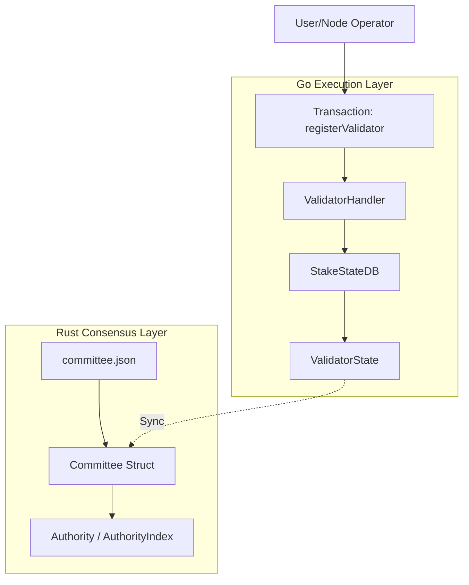
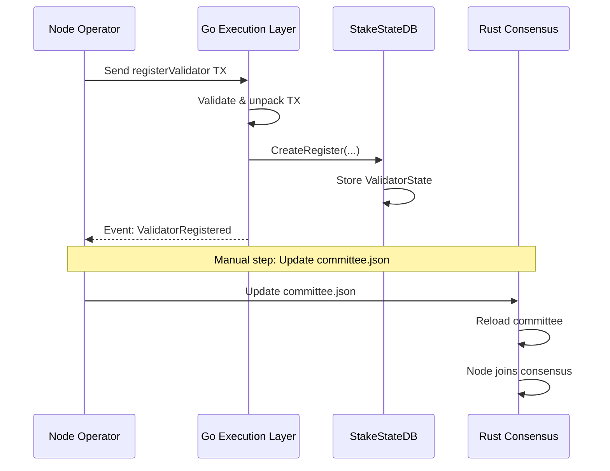

# Thêm Node Mới và Committee vào Go State

Tài liệu này mô tả quy trình đăng ký một node mới vào hệ thống mtn-consensus/Meta-Node, bao gồm cách thêm node vào Go state và đồng bộ với committee của Rust consensus.

## Tổng Quan Kiến Trúc



## Thành Phần Chính

### 1. Rust Consensus - Committee

File: `metanode/meta-consensus/config/src/committee.rs`

**Cấu trúc Authority:**
```rust
pub struct Authority {
    pub stake: Stake,                    // Voting power (tổng = 10,000)
    pub address: Multiaddr,              // Network address (VD: /ip4/127.0.0.1/tcp/9000)
    pub hostname: String,                // Node hostname
    pub authority_key: AuthorityPublicKey,  // BLS public key (Sui identity)
    pub protocol_key: ProtocolPublicKey,    // Ed25519 - verifying blocks
    pub network_key: NetworkPublicKey,      // Ed25519 - TLS/network identity
}
```

**committee.json mẫu:**
```json
{
  "epoch": 0,
  "total_stake": 4000,
  "quorum_threshold": 2666,
  "validity_threshold": 1333,
  "authorities": [
    {
      "stake": 1000,
      "address": "/ip4/127.0.0.1/tcp/9000",
      "hostname": "node-0",
      "authority_key": "rRc6m7ayID8mMo6jaZorLVeo...",
      "protocol_key": "pyAaUZvnDwTTmf/JmjjeQ70pFGMSKlMHkECrXBcBXpI=",
      "network_key": "IOWdw2t2NQZBjgC9M+Pa8nmHyvVSBHNDx4v5El1hy9s="
    }
  ],
  "epoch_timestamp_ms": 1769313658904,
  "last_global_exec_index": 0
}
```

### 2. Go Execution Layer - ValidatorState

File: `pkg/state/validator_state.go`

**Interface ValidatorState:**
```go
type ValidatorState interface {
    Address() common.Address
    TotalStakedAmount() *big.Int
    IsJailed() bool
    CommissionRate() uint64
    Name() string
    Description() string
    Website() string
    Image() string
    PrimaryAddress() string
    WorkerAddress() string
    P2PAddress() string
    PubKeyBls() string       // BLS public key
    PubKeySecp() string      // Secp256k1 key (legacy)
    ProtocolKey() string     // Ed25519 - tương thích committee.json
    NetworkKey() string      // Ed25519 - tương thích committee.json
    MinSelfDelegation() *big.Int
    AccumulatedRewardsPerShare() *big.Int
    // ... và các setter methods
}
```

---

## Quy Trình Đăng Ký Node Mới

### Bước 1: Tạo Keypairs Cho Node Mới

Mỗi node cần các keypair sau:

| Key Type | Thuật toán | Mục đích |
|----------|------------|----------|
| **Authority Key** | BLS12-381 | Sui identity, dùng trong consensus voting |
| **Protocol Key** | Ed25519 | Ký và verify blocks |
| **Network Key** | Ed25519 | TLS handshake, network identity |
| **Secp256k1 Key** | ECDSA | Ethereum address, transaction signing |

### Bước 2: Đăng Ký Qua Transaction

Gọi hàm `registerValidator` trên smart contract `VALIDATION_CONTRACT_ADDRESS`:

**ABI Method:**
```json
{
  "name": "registerValidator",
  "inputs": [
    { "name": "primaryAddress", "type": "string" },
    { "name": "workerAddress", "type": "string" },
    { "name": "p2pAddress", "type": "string" },
    { "name": "name", "type": "string" },
    { "name": "description", "type": "string" },
    { "name": "website", "type": "string" },
    { "name": "image", "type": "string" },
    { "name": "commissionRate", "type": "uint64" },
    { "name": "minSelfDelegation", "type": "uint256" }
  ]
}
```

**Ví dụ gọi từ web3:**
```javascript
const validatorContract = new web3.eth.Contract(ValidationABI, VALIDATION_ADDRESS);

await validatorContract.methods.registerValidator(
    "/ip4/192.168.1.100/tcp/9000",  // primaryAddress (P2P)
    "0x...",                         // workerAddress
    "/ip4/192.168.1.100/tcp/9001",  // p2pAddress
    "My Validator",                  // name
    "A reliable validator node",     // description
    "https://myvalidator.com",       // website
    "https://myvalidator.com/logo.png", // image
    1000,                            // commissionRate (10.00% = 1000)
    1000000000000000000000n          // minSelfDelegation (1000 tokens)
).send({ from: validatorWallet });
```

### Bước 3: Xử Lý Trong Go Layer

Khi transaction được xử lý, `ValidatorHandler.handleRegisterValidator()` sẽ:

1. **Unpack input data** từ ABI
2. **Derive public keys** từ transaction signature
3. **Kiểm tra validator chưa tồn tại**
4. **Tạo ValidatorState mới** qua `StakeStateDB.CreateRegister()`
5. **Emit event** `ValidatorRegistered`

```go
// File: pkg/blockchain/tx_processor/validation_transaction.go

func (h *ValidatorHandler) handleRegisterValidator(
    chainState *blockchain.ChainState, tx types.Transaction,
    method *abi.Method, inputData []byte, blockTime uint64,
) ([]types.EventLog, error) {
    // 1. Unpack parameters
    args, _ := method.Inputs.Unpack(inputData)
    primaryAddress, _ := args[0].(string)
    // ...

    // 2. Get BLS public key from account
    pubKeyBls, _ := chainState.GetAccountStateDB().GetPublicKeyBls(tx.FromAddress())
    
    // 3. Create validator state
    stakeStateDB.CreateRegister(
        tx.FromAddress(),
        name, description, website, image,
        commissionRate, minSelfDelegation,
        primaryAddress, workerAddress, p2pAddress,
        pubKeyBlsHex,
        common.Bytes2Hex(compressedPubKey),
    )
    // ...
}
```

### Bước 4: Đồng Bộ Với Committee.json

Sau khi validator được đăng ký trong Go state, cần cập nhật `committee.json` để Rust consensus nhận diện node:

```json
// Thêm authority mới vào mảng authorities
{
  "stake": 1000,
  "address": "/ip4/192.168.1.100/tcp/9000",
  "hostname": "new-node",
  "authority_key": "<BLS_PUBLIC_KEY_BASE64>",
  "protocol_key": "<ED25519_PROTOCOL_KEY_BASE64>",
  "network_key": "<ED25519_NETWORK_KEY_BASE64>"
}
```

> [!IMPORTANT]
> `protocol_key` và `network_key` trong committee.json phải tương ứng với `ProtocolKey()` và `NetworkKey()` trong ValidatorState.

---

## Cấu Trúc Lưu Trữ State

### StakeStateDB

File: `pkg/state_db/stake_state_db.go`

```go
// Tạo validator với full keys tương thích committee.json
func (db *StakeStateDB) CreateRegisterWithKeys(
    address common.Address,
    name string,
    description string,
    website string,
    image string,
    commissionRate uint64,
    minSelfDelegation *big.Int,
    primaryAddress string,
    workerAddress string,
    p2pAddress string,
    pubKeyBls string,      // BLS key (authority_key)
    protocolKey string,    // Ed25519 (protocol_key)
    networkKey string,     // Ed25519 (network_key)
) error
```

### Protobuf Schema

File: `pkg/proto/state.proto`

```protobuf
message Validator {
    string address = 1;
    bool is_jailed = 2;
    uint64 commission_rate = 3;
    string min_self_delegation = 4;
    string name = 5;
    string description = 6;
    string website = 7;
    string image = 8;
    string primary_address = 9;
    string worker_address = 10;
    string p2p_address = 11;
    string pubkey_bls = 12;
    string pubkey_secp = 13;      // Legacy Secp256k1
    string protocol_key = 14;      // Ed25519 protocol key
    string network_key = 15;       // Ed25519 network key
    // ... delegation fields
}
```

---

## Mapping Giữa Go và Rust

| Go ValidatorState | Rust Authority | Mô tả |
|-------------------|----------------|-------|
| `PrimaryAddress()` | `address` | Network address (multiaddr format) |
| `PubKeyBls()` | `authority_key` | BLS public key |
| `ProtocolKey()` | `protocol_key` | Ed25519 for block verification |
| `NetworkKey()` | `network_key` | Ed25519 for TLS |
| `TotalStakedAmount()` | `stake` | Voting power |

---

## Thresholds Trong Committee

```go
// calculations trong committee.rs
total_stake := sum of all authorities' stake
fault_tolerance := (total_stake - 1) / 3
quorum_threshold := total_stake - fault_tolerance    // 2f+1
validity_threshold := fault_tolerance + 1            // f+1
```

Ví dụ với 4 nodes, mỗi node stake = 1000:
- `total_stake` = 4000
- `fault_tolerance` = 1333
- `quorum_threshold` = 2667 (cần ít nhất 3 nodes đồng ý)
- `validity_threshold` = 1334 (cần ít nhất 2 nodes)

---

## Quy Trình Thêm Node Mới (Tóm Tắt)



---

## Lưu Ý Quan Trọng

> [!WARNING]
> - Commission rate phải <= 10000 (tương đương 100%)
> - Validator không thể đăng ký lại nếu đã tồn tại
> - Self-delegation phải đủ `minSelfDelegation` để tham gia consensus

> [!CAUTION]
> Khi thay đổi committee.json:
> 1. Backup file cũ
> 2. Verify tất cả public keys đúng định dạng Base64
> 3. Đảm bảo `total_stake` và thresholds được tính lại
> 4. Restart tất cả nodes để load committee mới

---

## Xem Thêm

- [Validator State Interface](../pkg/state/validator_state.go)
- [Stake State DB](../pkg/state_db/stake_state_db.go)
- [Validation Transaction Handler](../pkg/blockchain/tx_processor/validation_transaction.go)
- [Committee Configuration](../../mtn-consensus/metanode/meta-consensus/config/src/committee.rs)
