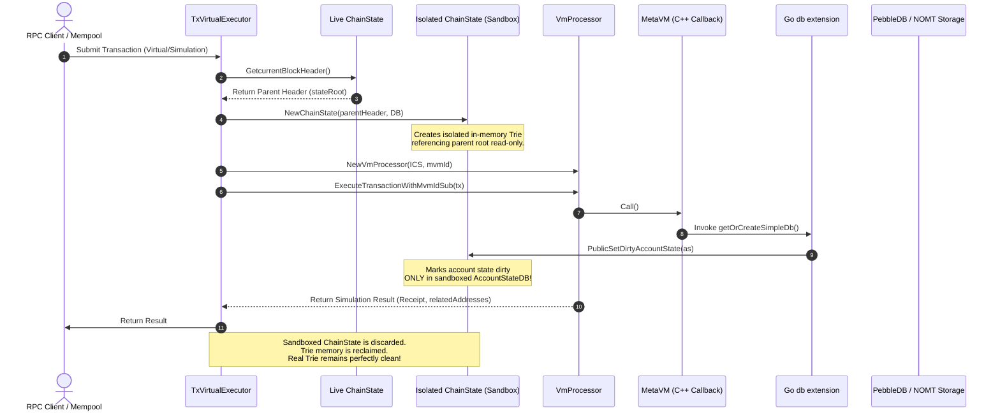

# Metanode: Real vs. Virtual Execution State Isolation Architecture

This document describes the architectural framework implemented in the Metanode Go execution engine to strictly isolate **Real Block Execution (Chạy Thật)** from **Virtual/Simulated Execution (Chạy Giả)**. 

By enforcing absolute structural database and memory cache isolation, the system guarantees that concurrent transaction validations, RPC queries, and cross-chain simulations can never mutate or pollute the authoritative consensus state, ensuring a **Zero-Fork Invariant** under high throughput.

---

## 1. High-Level Concepts: Real vs. Virtual Execution

Metanode splits transaction execution into two distinct lanes depending on whether the execution is consensus-authoritative or purely investigatory:

| Dimension | Real Execution (Chạy Thật) | Virtual Execution (Chạy Giả) |
| :--- | :--- | :--- |
| **Trigger** | Rust BFT Consensus consensus commits ($2f+1$ Quorum verified) delivered via Unix Domain Sockets (UDS) stream. | Mempool submissions (`ProcessSingleTransactionVirtual`), Cross-Chain inbound simulations, or Debug RPCs (`eth_call`, `estimateGas`). |
| **State Context** | Writes directly to the active `ChainState` and authoritative `AccountStateDB`. | Creates a localized, read-only sandboxed `ChainState` pointing to a specific parent block header's `stateRoot`. |
| **Storage Interaction** | Mutates active PebbleDB/NOMT storage, generating a persistent `stateRoot` committed upon block seal. | Read-only access to storage. All mutations are localized to an ephemeral memory cache. |
| **Lifecycle** | State mutations persist forever. | Discarded and garbage-collected immediately upon completion. **0% persistent writes**. |
| **Concurrency Mode** | Single-threaded sequential block processing driven by the BFT Commit Engine. | Highly concurrent, multi-threaded execution run asynchronously in the background. |

---

## 2. The Contamination Vector (Why Isolation is Mandatory)

In a naive execution design, concurrent off-chain simulations run against the live, in-memory state. This leads to **State Contamination**:

```
[Vulnerable Sharing Pattern]

Consensus Thread ──► Block Execute ──────► Authoritative AccountStateDB ──► [Merkle Trie Root]
                                                   ▲
RPC / Mempool Thread ──► Virtual Execute ──────────┘ (Pollutes active caches & marks accounts dirty)
                                                   ▼
                                         [State Root Divergence / Fork]
```

### The Root Cause
During EVM virtual execution (e.g. checking a transaction in the mempool), if a smart contract calls custom database extension callbacks (`getOrCreateSimpleDb` or `deleteDb` registered under `extension.go`), the Go callback handlers retrieve the active `MVMApi` instance, obtain the bound `AccountStateDB`, and mark the account states as dirty:
```go
mvmApi.accountStateDb.PublicSetDirtyAccountState(as)
```
If this simulation uses the **live** `AccountStateDB` instance, these dirty mock states contaminate the active memory trie cache. When the next real block is sealed, the block processor commits **all** dirty states from the active `AccountStateDB` into the database, generating a mutated `stateRoot` and causing the node to **fork** from the network consensus.

---

## 3. The Multi-Layer Isolation Framework

To prevent state contamination and ensure absolute safety, Metanode implements a **Multi-Layer State Isolation Sandbox**:

```
┌─────────────────────────────────────────────────────────────────────────┐
│                   Virtual/Simulated Execution (Chạy Giả)               │
│                                                                         │
│   1. Read-Only Trie Snapshot          2. Memory Cache Partitioning      │
│ ┌───────────────────────────┐       ┌───────────────────────────────┐   │
│ │   trie.NewStateTrie()     │       │    Ephemeral AccountStateDB   │   │
│ │  (PebbleDB/NOMT Snapshot) │       │     (Local dirty state maps)  │   │
│ └─────────────┬─────────────┘       └───────────────┬───────────────┘   │
│               │                                     │                   │
│               ▼                                     ▼                   │
│   3. MetaVM API Binding               4. Ephemeral Garbage Collection   │
│ ┌───────────────────────────┐       ┌───────────────────────────────┐   │
│ │  Unique 'mvmId' partition │       │    Drop scope upon completion │   │
│ │   (No cross-context leak) │       │   (0% persistent DB writes)   │   │
│ └───────────────────────────┘       └───────────────────────────────┘   │
└─────────────────────────────────────────────────────────────────────────┘
```

### Layer 1: Ephemeral Trie DB Sandbox (NOMT/PebbleDB Snapshots)
Instead of executing on the active `ChainState`, the virtual executor creates a **Local Sandboxed ChainState** at the exact state root of the parent block:
```go
headerPtr := v.chainState.GetcurrentBlockHeader()
blHeader := *headerPtr
blockDatabase := block.NewBlockDatabase(v.storageManager.GetStorageBlock())
chainStateNew, err := blockchain.NewChainState(v.storageManager, blockDatabase, blHeader, v.chainState.GetConfig(), v.chainState.GetFreeFeeAddress(), "")
```
`blockchain.NewChainState` reads the parent block's `AccountStatesRoot()` and opens a read-only `accountStateTrie` view pointing to the underlying PebbleDB / NOMT storage handles. Because storage is read-only, **no physical database copies are created** (near-zero performance overhead), while all write boundaries are isolated in memory.

### Layer 2: Memory Cache Partitioning (`AccountStateDB` Isolation)
The sandboxed `ChainState` initializes a dedicated, local `AccountStateDB` instance. Any write operations (`PublicSetDirtyAccountState`, `SetNonce`, `SetBalance`) mark states as dirty **only** in this local instance's `dirtyAccountState` cache. 

### Layer 3: MetaVM Execution Partitioning (`mvmId` Context)
During EVM simulations, smart contracts interact with C++ extensions via callbacks. To avoid C++ state caching conflicts across concurrent simulations or block execution, each virtual execution is assigned a unique, randomly-generated `mvmId`:
```go
combinedHash := sha256.Sum256([]byte(fmt.Sprintf("%x%d%d", tx.Hash(), rand.Int63(), time.Now().UnixNano())))
mvmId := common.BytesToAddress(combinedHash[12:])
```
The Go runtime calls `mvm.ProtectMVMApi(mvmId)` to bind the isolated `AccountStateDB` specifically to this `mvmId` execution context. Go callbacks retrieve this exact sandboxed database, preventing concurrent collisions.

### Layer 4: Ephemeral Lifecycle & Garbage Collection
The temporary `ChainState` and its sandboxed trie structures are local variables. Once the simulation function returns, the references are dropped, and all temporary mock state modifications are garbage collected. Since `Commit()` is never called on these ephemeral `ChainState` instances, no writes are ever persisted to the disk.

---

## 4. Sequence of Operations

The sequence diagram below illustrates the lifecycle of a virtual execution sandbox compared to the main ledger:



---

## 5. Architectural Safeguards

1. **Read-Concurrency**: PebbleDB and NOMT support high-concurrency read snapshots. Multiple concurrent simulations (e.g. multi-threaded RPC servers handling `eth_call`) do not block the active consensus block execution, maintaining high throughput (>900+ tx/s).
2. **Explicit Verification Gate**: All blocks sent from Rust to Go for execution must pass through the BFT Quorum Verification Gate (`CommitVoteMonitor` checking $2f+1$ digest votes). No virtual/simulated blocks are ever allowed to enter Go's sequential `BlockProcessor` loop, guaranteeing that only fully-consensued blocks are executed.
3. **No-Bypass Invariant**: Any dry-run execution operates on the sandboxed `ChainState` clone, meaning there is zero code path where a simulation can "bypass" the sandbox and write to the live trie.

> [!IMPORTANT]
> The isolation of virtual execution is verified under stress by the integration test suite (`execution/executor/no_fork_invariant_test.go`). This suite spawns multiple concurrent virtual transaction pipelines alongside active block processing to guarantee that the `stateRoot` remains deterministic and untouched.
