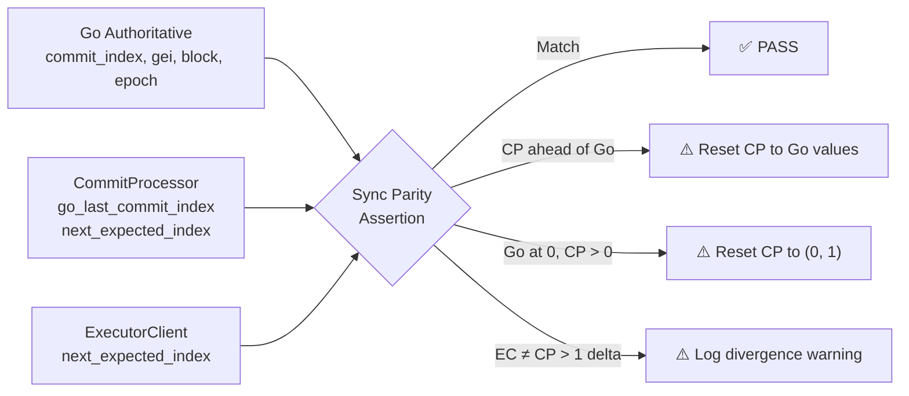
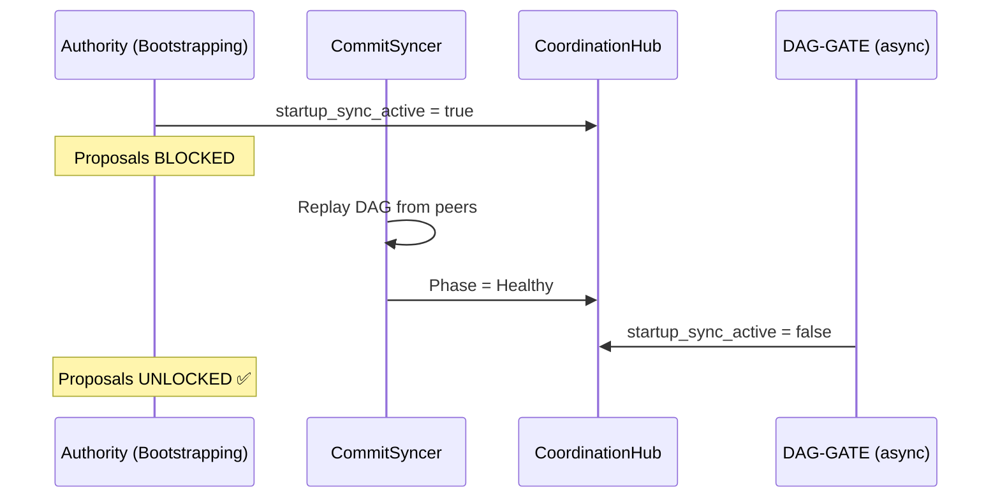
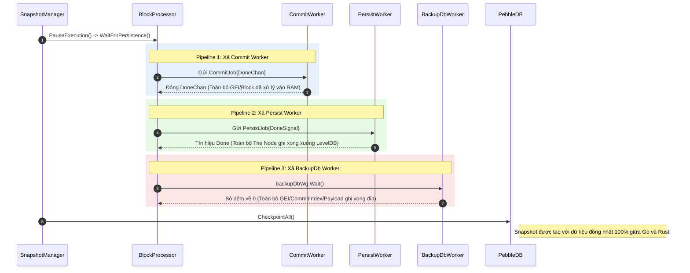
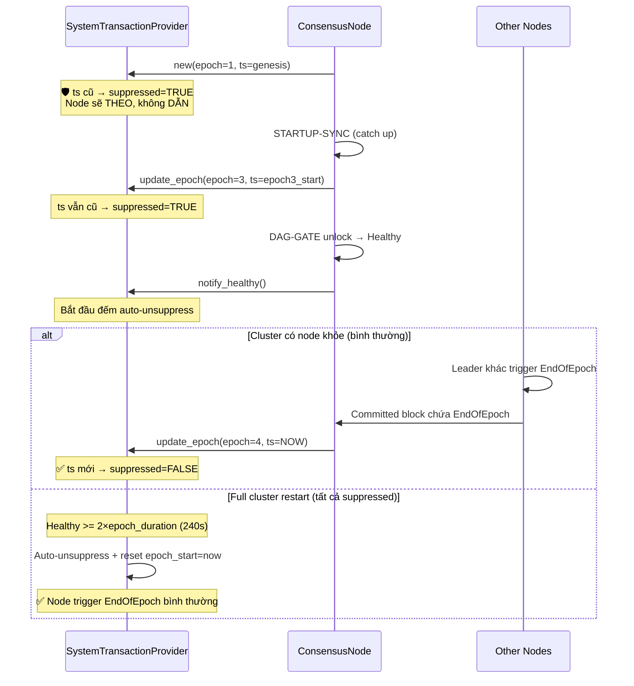
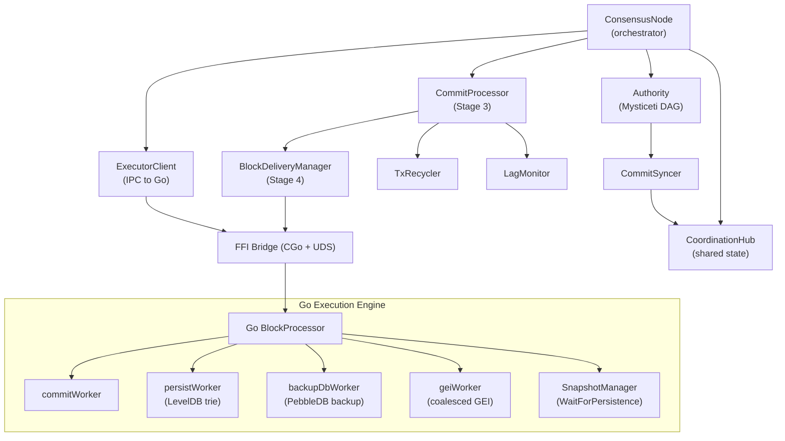

# Metanode Startup Architecture

> Kiến trúc khởi động tuần tự, không over-engineering, đảm bảo chính xác dữ liệu.

---

## 1. Tổng Quan Kiến Trúc

Metanode gồm 2 engine chạy trong cùng 1 process:

| Engine | Ngôn ngữ | Vai trò | Source of Truth |
|--------|---------|---------|-----------------|
| **Consensus** | Rust | DAG, Leader Election, GEI, Epoch | GEI, CommitIndex, Leader, Timestamp |
| **Execution** | Go | State Trie (NOMT), Block Storage, EVM | Block Number, StateRoot, AccountState |

Giao tiếp qua **FFI Bridge** (CGo) và **Unix Domain Socket** (IPC).

### Nguyên Tắc Cốt Lõi

```
Rust KHÔNG ĐƯỢC tự suy đoán trạng thái Go.
Go KHÔNG ĐƯỢC tự suy đoán trạng thái Rust.
Mỗi engine hỏi trực tiếp engine kia khi cần dữ liệu.
Queue transactions độc lập: Không chặn cứng quá trình tạo DAG bằng các tác vụ mạng đồng bộ. Các giao dịch trong lúc khởi tạo hoặc chuyển epoch được hàng đợi (queue) an toàn, tránh rơi rớt giao dịch đầu tiên.
```

---

## 2. Chuỗi Khởi Động 4 Pha

Khởi động diễn ra **tuần tự nghiêm ngặt**. Mỗi pha phải hoàn thành trước khi pha sau bắt đầu.

```mermaid
flowchart TD
    START(["ConsensusNode::new()"]) --> P1

    subgraph P1["Phase 1: setup_storage()"]
        direction TB
        A1["ExecutorClient::new(IPC)"] --> A2["get_last_block_number()\n⏳ Infinite retry until is_ready=true"]
        A2 --> A3["get_current_epoch() — LOCAL Go only\n(peers gây deadlock snapshot)"]
        A3 --> A4["get_epoch_boundary_data()\nvalidators + boundary_gei + timestamp"]
        A4 --> A5["Committee Hash Verify vs Peers\n(cold-start only)"]
        A5 --> A6["calculate_last_global_exec_index()\nGEI + CommitIndex + CommitHash"]
        A6 --> A7["Identity: find own_index in committee"]
    end

    P1 --> P2

    subgraph P2["Phase 2: setup_consensus()"]
        direction TB
        B1["go_replay_after = last_handled_commit_index"] --> B2["Create CommitProcessor + CommitConsumer"]
        B2 --> B3["Early Peer RPC Server\n(ngăn deadlock cluster)"]
        B3 --> B4

        subgraph B4["STARTUP-SYNC (retry loop)"]
            direction TB
            S1["Anti-Fork: verify local block hash vs peers\n🔴 PANIC nếu mismatch"] --> S2["Fetch blocks từ peers (chunk by epoch)"]
            S2 --> S3["Execute qua Go FFI"]
            S3 --> S4["Re-query Go: GEI, CommitIndex, Epoch"]
            S4 --> S5{"Gap ≤ 2?"}
            S5 -->|"Không"| S2
            S5 -->|"Có"| S6["Post-Sync block hash verify\n🔴 EXIT(1) nếu mismatch"]
        end

        B4 --> B5["initialize_from_go() — ĐỒNG BỘ\nnext_block, next_gei, replay_guard"]
        B5 --> B6["Sync Parity Assertion\nCP vs ExecutorClient vs Go"]
        B6 --> B7["GEI Cross-check vs peers"]
        B7 --> B8["Post-Sync Committee Resolution\n(epoch > 0, retry 3x + peer fallback)"]
        B8 --> B9["Start Authority\n(Bootstrapping phase)"]
        B9 --> B10["DAG-GATE: async wait Healthy\nthen unlock proposals"]
    end

    P2 --> P3["Phase 3: setup_networking()\nClock/NTP sync"]
    P3 --> P4["Phase 4: setup_epoch_management()\nTransitionManager + EpochMonitor + SyncController"]
    P4 --> LIVE(["🟢 Node Live"])
```



---

## 3. Chi Tiết Từng Pha

### 3.1 Phase 1: setup_storage() — Đọc Trạng Thái Go

**Mục đích**: Thu thập dữ liệu nền (block, epoch, committee) từ Go làm baseline.

**Luồng**:
```
Rust                              Go
  │                                │
  ├─ get_last_block_number() ─────►│ Đợi is_ready=true
  │◄───── (block=893, epoch=1) ────┤
  │                                │
  ├─ get_current_epoch() ─────────►│
  │◄───── (epoch=1) ──────────────┤
  │                                │
  ├─ get_epoch_boundary_data() ───►│ Committee + boundary
  │◄───── (validators, GEI) ──────┤
  │                                │
  ├─ get_last_handled_commit() ───►│ Commit tracking
  │◄───── (commit_idx, GEI) ──────┤
```

**Gate**: Go phải trả về `is_ready=true` trước khi Rust tin tưởng giá trị block_number. Điều này đảm bảo Go đã load xong toàn bộ DB (bao gồm snapshot data).

**Không làm**:
- ❌ Không hỏi peers để lấy epoch → gây deadlock nếu Go chưa sẵn sàng
- ❌ Không dùng `max()` để inflate GEI → gây fork

### 3.2 Phase 2: setup_consensus() — Sync + Khởi Động Consensus

**Mục đích**: Bắt kịp mạng, đồng bộ trạng thái, khởi động consensus core.

#### 3.2.1 STARTUP-SYNC

Đây là bước quan trọng nhất để tránh fork sau snapshot restore.

```
Rust                    Peers                   Go
  │                       │                      │
  ├─ query_peer_info() ──►│                      │
  │◄── (peer_block=894) ──┤                      │
  │                       │                      │
  │  local=893 < peer=894 → CẦN SYNC            │
  │                       │                      │
  ├─ fetch_blocks(894) ──►│                      │
  │◄── [Block 894 data] ──┤                      │
  │                       │                      │
  ├─ FFI: send_block(894) ──────────────────────►│
  │                       │                      ├─ Execute TXs
  │                       │                      ├─ Update State
  │◄──────────── (done) ─────────────────────────┤
  │                       │                      │
  │  Lặp lại cho đến khi local >= peer           │
```

**Gate (Partial Commit Prevention Guard)**: Go Master (peer) **sẽ từ chối (break loop)** phục vụ các blocks thuộc một commit chưa được xử lý hoàn tất (`header.CommitIndex() > lastHandledCommit`). Điều này ngăn chặn việc node đang sync tải về một phần của commit, dẫn đến sai lệch `lastHandledCommitIndex` và bỏ sót transaction khi Rust tiếp tục chạy.

**Gate (Execution Complete)**: STARTUP-SYNC phải hoàn thành toàn bộ **TRƯỚC KHI** Authority bắt đầu produce commits.

#### 3.2.2 initialize_from_go() — Đồng Bộ Cuối Cùng

```rust
// PHẢI chạy ĐỒNG BỘ, không được spawn async
executor_client_for_proc.initialize_from_go().await;
```

Hàm này:
1. Đọc `last_block_number` từ Go → set `next_block_number = last_block + 1`
2. Đọc `last_gei` từ Go → set `next_expected_index = last_gei + 1`
3. Đọc `last_handled_commit_index` → cập nhật replay guard

**Tại sao đồng bộ**: Nếu chạy async, CommitProcessor có thể bắt đầu xử lý commits **trước** khi guards được cập nhật → tạo block trùng lặp → fork.

#### 3.2.3 Anti-Fork Hash Verification (Mandatory State Parity)

Trong quá trình `STARTUP-SYNC`, Rust thực hiện cross-check block hiện tại của Go Master với mạng lưới:

```
Rust                    Peers                   Go
  │                       │                      │
  ├─ fetch_blocks(local) ─►│                      │
  │◄── [Peer Block X] ────┤                      │
  │                       │                      │
  ├─ get_blocks_range(local) ───────────────────►│
  │◄── [Local Block X] ──────────────────────────┤
  │                       │                      │
  │  Compare:             │                      │
  │  - block_hash         │                      │
  │  - timestamp_ms       │                      │
  │  - txRoot & receiptRoot                      │
  │                       │                      │
```

**Gate (FATAL PANIC):** Nếu bất kỳ trường dữ liệu nào (đặc biệt là hash, timestamp, txRoot, stateRoot) của `local` không khớp với `peer`, node sẽ bị **chặn hoàn toàn (panic!)** thay vì chỉ warning và gán `local_block = 0`. Điều này ngăn chặn việc state bị hỏng (corrupted DAG hoặc snapshot cũ) tiếp tục chạy và lan truyền state lỗi lên consensus, buộc operator phải wipe DB và sync lại từ đầu.

#### 3.2.4 GEI Cross-Check

```
Rust                    Peers
  │                       │
  ├─ local GEI = 898      │
  ├─ query_peer_gei() ───►│
  │◄── peer GEI = 898 ────┤
  │                       │
  │  GEI khớp → ✅ PASS    │
```

Cảnh báo nhưng không chặn nếu GEI lệch (peer có thể tạm thời ahead).

#### 3.2.5 Sync Parity Assertion (Post-init Verification)

Ngay sau `initialize_from_go()`, hệ thống thực hiện kiểm tra chéo 3 chiều:



**Mục đích**: Ngăn chặn CommitProcessor bỏ sót commits (nếu ahead) hoặc replay commits đã xử lý (nếu behind) so với trạng thái Go thực tế.

#### 3.2.6 Post-Sync Committee Resolution

Sau khi STARTUP-SYNC hoàn tất và epoch có thể đã thay đổi, hệ thống **giải lại committee**:

1. Query Go cho epoch hiện tại (retry 3 lần, mỗi lần cách 500ms)
2. Nếu Go thất bại → fallback sang peers (`get_safe_epoch_boundary_data_with_force`)
3. Nếu cả Go và peers đều thất bại → **graceful degradation** sang SyncOnly mode (không panic)
4. Cập nhật `storage.committee`, `validator_eth_addresses`, `own_index`, `epoch_timestamp_ms`

**Gate**: Không panic. Node tự chuyển sang SyncOnly nếu không thể xác định committee.

#### 3.2.7 DAG-GATE (Dynamic Proposal Unlock)

Sau khi Authority khởi động ở trạng thái `Bootstrapping`, hệ thống **không cho phép tạo proposals** ngay lập tức:



**Mục đích**: CommitSyncer cần thời gian để tái tạo DAG từ peers (leader schedule, commit history). Nếu unlock proposals quá sớm, node sẽ tạo blocks với metadata sai (timestamp, txRoot khác cluster) → fork.

#### 3.2.8 Runtime Fork Guard (500-block Background Verification)

Sau khi STARTUP-SYNC đồng bộ blocks, hệ thống spawn một task nền kiểm tra **500 block đầu tiên** sau khởi động:

- Mỗi 10 blocks, so sánh hash của block mới nhất với peers
- Nếu mismatch → `process::exit(1)` dừng node ngay lập tức
- Nếu pass 500 blocks → task tự huỷ

**Mục đích**: Bắt các fork muộn xuất phát từ lỗi timestamp non-determinism hoặc state drift nhỏ mà POST-SYNC-VERIFY bỏ sót (vì nó chỉ kiểm tra block cuối cùng được sync).

#### 3.2.9 Health Check

```rust
HealthCheckResult {
    block_parity: true,   // Block number khớp peers
    gei_parity: true,     // GEI khớp peers
    state_root_match: true, // StateRoot khớp peers
    committee_match: true,  // Committee khớp peers
}
```

Log kết quả nhưng không chặn khởi động (non-blocking diagnostic).

### 3.3 Phase 3: setup_networking()

Clock/NTP sync — đơn giản, không ảnh hưởng consensus.

### 3.4 Phase 4: setup_epoch_management()

Khởi tạo các module quản lý epoch transition, mode switching (Validator ↔ SyncOnly).

---

## 4. Luồng Dữ Liệu Sau Khởi Động

Sau khi khởi động xong, dữ liệu chảy một chiều:

```
┌─────────┐  commits   ┌─────────────┐  ExecutableBlock  ┌──────────┐
│  Rust   │ ──────────►│  Commit     │ ─────────────────►│   Go     │
│  DAG    │            │  Processor  │   (FFI Bridge)    │  EVM     │
└─────────┘            └─────────────┘                   └──────────┘
                                                              │
                              ┌────────────────────────────────┘
                              │ Block created + committed
                              ▼
                        ┌──────────┐
                        │ PebbleDB │  (Persistent storage)
                        │ + NOMT   │
                        └──────────┘
```

Mỗi `ExecutableBlock` từ Rust chứa **tất cả** metadata cần thiết:

| Trường | Nguồn | Deterministic? |
|--------|-------|:--------------:|
| `transactions` | DAG commit | ✅ |
| `global_exec_index` | Rust CommitProcessor | ✅ |
| `commit_index` | Rust DAG | ✅ |
| `epoch` | Rust epoch tracking | ✅ |
| `commit_timestamp_ms` | Median stake-weighted | ✅ |
| `leader_author_index` | DAG leader election | ✅ |
| `leader_address` | 20-byte ETH address | ✅ |
| `block_number` | Rust sequential counter | ✅ |
| `commit_hash` | DAG commit digest | ✅ |

Go **không tự tính** bất kỳ giá trị nào từ bảng trên. Go chỉ:
1. Giải mã transactions
2. Thực thi EVM → tính StateRoot
3. Tạo block với metadata từ Rust + StateRoot từ EVM

---

## 5. Block Hash — Trường Tham Gia

Block hash được tính từ **9 trường**, tất cả đều deterministic:

```
Hash = Keccak256(Proto(
    BlockNumber,        ← Rust
    AccountStatesRoot,  ← Go EVM execution
    StakeStatesRoot,    ← Go EVM execution
    ReceiptRoot,        ← Go receipt trie
    LeaderAddress,      ← Rust (20-byte direct)
    TimeStamp,          ← Rust (commit_timestamp_ms / 1000)
    TransactionsRoot,   ← Go tx trie
    Epoch,              ← Rust
    GlobalExecIndex,    ← Rust
))
```

**Loại trừ** (không tham gia hash):
- `LastBlockHash` — cho phép sync linh hoạt
- `AggregateSignature` — BLS signature
- `CommitIndex` — Rust internal tracking

---

## 6. Snapshot Recovery — Quy Trình Phục Hồi

```
Bước 1: Dừng node
       │
       ▼
Bước 2: Restore snapshot (LVM/Btrfs → PebbleDB + NOMT)
       │
       ▼
Bước 3: Xóa DAG (consensus_db) → Rust bắt đầu fresh
       │
       ▼
Bước 4: Khởi động lại
       │
       ▼
Bước 5: Phase 1 — Go load snapshot data
       │  Go reports: block=893, epoch=1
       ▼
Bước 6: Phase 2 — STARTUP-SYNC
       │  Rust phát hiện: local=893 < peer=900
       │  Fetch blocks 894..900 từ peers
       │  Gửi từng block tới Go qua FFI
       │  Go thực thi → cập nhật state
       ▼
Bước 7: initialize_from_go()
       │  next_block = Go.last_block + 1
       │  next_gei = Go.last_gei + 1
       ▼
Bước 8: Authority starts
       │  Consensus core bắt đầu produce commits
       │  Commits mới tiếp tục từ đúng điểm mạng
```

### Điều Kiện Gây Fork (Phải Tránh)

| Điều kiện | Hậu quả | Cách tránh |
|-----------|---------|------------|
| Consensus produce commits TRƯỚC khi sync xong | Block với metadata sai (leader, timestamp, GEI) | STARTUP-SYNC gate |
| `initialize_from_go()` chạy async | CommitProcessor bypass replay guard | Chạy đồng bộ |
| Dùng `max()` để inflate GEI | GEI mapping sai → block number lệch | Đọc trực tiếp từ Go |
| Timeout trong `stop_authority_and_poll_go` dùng Go's trailing GEI | GEI overlap, bỏ sót block epoch mới | Dùng `synced_global_exec_index` từ callback |
| Go import P2P blocks song song với consensus | Trie state bị overwrite bởi foreign data | Disabled trên Master |
| Update GEI và CommitIndex rời rạc | Sequence shifting, duplicate blocks sau khi restart | Dùng `BatchPut` lưu atomic (Atomic Consensus Persistence) |
| Local DAG rỗng nhưng `local_commit` pre-seeded > 0 | Node bị lọt qua SCHEDULE-RECOVERY-GUARD, tạo block với leader schedule rỗng → Fork | Dùng `dag_state.last_commit.is_none()` (DAG Sparseness Detection) thay vì kiểm tra số học |
| Local committer chạy trên DAG thiếu ancestor blocks | `median_timestamp_by_stake()` tính từ tập con → timestamp lệch 1-5 giây → txRoot/receiptsRoot lệch → Fork (Block 1000 bug) | COLD-START-GUARD v2: kiểm tra full committee coverage + deep ancestor verification trước khi cho phép local commit |

---

## 7. Synchronized Snapshot Pipeline (Phòng Chống Mất Dữ Liệu GEI)

**Vấn đề cốt lõi:**
Trước đây, khi `snapshot_manager` kích hoạt tạo snapshot (PebbleDB Checkpoint), nó chỉ chờ `persistWorker` xả xong bộ nhớ của Trie (tức là stateRoot) mà bỏ qua tiến trình của `commitWorker` và `backupDbWorker`. Do quá trình lưu block payloads và cập nhật `GlobalExecIndex` (GEI) diễn ra bất đồng bộ, snapshot bị tạo ra **trước khi** GEI mới nhất được ghi xuống `backup_db`. Hậu quả là node sau khi restore snapshot sẽ bị mất GEI (GEI = 0) và tự động rơi vào trạng thái fork hoặc panic fail-fast.

**Kiến trúc mới:**
Quá trình tạo snapshot nay yêu cầu một khóa bảo vệ liên hoàn (Synchronized Drain) quét qua toàn bộ 3 pipeline lưu trữ ngầm trước khi cho phép đóng băng hệ thống để lấy Checkpoint.



Nhờ kiến trúc rào chắn 3 lớp này, `metadata.json` chứa `stateRoot` và `backup_db` chứa `GEI/CommitIndex` luôn khớp hoàn hảo, đảm bảo không có giao dịch nào bị thất thoát qua khe hở async.

---

## 8. Atomic Consensus Persistence & Crash Recovery

**Vấn đề cốt lõi:**
Khi Go xử lý xong block từ Rust, hệ thống phải cập nhật 2 giá trị vào ổ đĩa (`BackupDb` - PebbleDB) để đánh dấu tiến độ: `last_global_exec_index` (GEI) và `last_handled_commit_index`.

Nếu 2 thao tác này diễn ra rời rạc (non-atomic), một sự cố sập nguồn (crash) xảy ra giữa chừng sẽ đẩy DB vào trạng thái bất nhất: **GEI đã nhảy số, nhưng CommitIndex thì chưa**.

**Quá trình gây Fork:**
1. Khi khởi động lại, Rust đọc lại tiến độ. Do CommitIndex cũ, Rust lôi Commit cũ ra bắt Go chạy lại (Replay).
2. Khi cấp GEI cho block chạy lại này, Rust thấy GEI đã nâng lên, nên cấp GEI mới toanh (X+1).
3. Do GEI X+1 lớn hơn GEI cũ X trên blockchain của Go, `GEI-REGRESSION GUARD` của Go bị đánh lừa! Nó tưởng đây là khối mới, tạo ra bản duplicate của block cũ nhưng với GEI mới!
4. **Hệ quả:** Toàn bộ chuỗi sau đó bị đẩy lùi 1 GEI. `txRoot`, `receiptsRoot`, `leaderAddress` và `timestamp` của các block sau đó lệch hoàn toàn giữa các node (do node sập có thêm một block rác chen vào giữa). Dù GEI giống nhau, nhưng nó ánh xạ tới một Commit khác biệt (thời gian trễ hơn, leader khác), tạo ra Fork hệ thống.

**Giải Pháp Kiến Trúc:**
Từ phiên bản tối ưu, quá trình này **bắt buộc** phải sử dụng `BatchPut` để đóng gói `GlobalExecIndex`, `CommitIndex`, và `Epoch` vào một transaction Atomic duy nhất (`updateAndPersistConsensusState`). Đảm bảo một là ghi đủ, hai là không ghi gì cả.

---

## 9. CommitSyncer Gap Handling & Consumer Monitor Synchronization

**Vấn đề cốt lõi:**
Khi CommitSyncer nhận thấy `local_commit_index` (của DAG) vượt xa tiến độ xử lý `highest_handled_commit` (của Go) quá 10 commit (Gap > 10), nó sẽ kích hoạt cơ chế kéo lùi `synced_commit_index` về vị trí `highest_handled_commit` để ưu tiên fetch lại block cho Go đuổi kịp.

**Quá trình gây lặp fetch và fork state:**
1. Trong các thiết kế trước, `highest_handled_commit` **chỉ được cập nhật duy nhất 1 lần** trong quá trình `STARTUP-SYNC` ở Phase 1. Trong suốt thời gian consensus hoạt động (Healthy/CatchingUp), biến này **không hề nhúc nhích**.
2. Vì `highest_handled_commit` bị kẹt ở chỉ số cũ (ví dụ: 967), khoảng cách (Gap) giữa nó và tiến độ tạo block của DAG (ví dụ: 1803) sẽ ngày càng giãn rộng ra.
3. Khi Gap > 10, CommitSyncer lôi ngược `synced_commit_index` từ 1803 về 967.
4. CommitSyncer đi hỏi P2P để kéo lại các commit từ 968 -> 1803. Khi kéo về, nó ném vào `Core`.
5. `Core` đẩy các commit này sang `CommitProcessor`. Tuy nhiên, `CommitProcessor` lại đang có `next_expected_index` = 1804. Nó thấy commit 968 < 1804 nên nó drop toàn bộ!
6. Vòng lặp trên diễn ra liên tục. Trong khi đó, Go Master không nhận được block mới (kể cả empty commits cũng bị drop). State bị kẹt. Node rơi vào trạng thái fork với state root cũ kỹ so với leader.

**Giải Pháp Kiến Trúc (Synchronous Consumer Monitor):**
`CommitProcessor` nay được cấp quyền truy cập trực tiếp vào `CommitConsumerMonitor` thông qua callback (`create_commit_index_callback`).
Bất kể commit đó có chứa transaction hay là empty commit (bị `dispatch_commit` skip qua FAST-PATH), ngay sau khi xử lý xong, `CommitProcessor` sẽ đồng thời:
1. Cập nhật `current_commit_index`
2. Cập nhật `highest_handled_commit` trong Monitor

Từ đó, `highest_handled_commit` luôn bám sát nút `local_commit` của DAG. Gap luôn được giữ mức ~0-1 (trừ khi Go thực sự treo do IO/Backpressure), ngăn chặn hoàn toàn việc CommitSyncer bị ảo giác về tiến trình và kéo lùi sync network một cách mù quáng.

---

## 10. Transaction Decoupling (Tách Biệt Nhận Giao Dịch và Quản Lý DAG)

**Vấn đề cốt lõi:**
Trước đây, khi tạo Genesis hoặc chuyển Epoch, quá trình `STARTUP-SYNC` hoặc `poll_go_until_synced` diễn ra đồng bộ và chặn luồng. Lúc này `TxSocketServer` bị vướng timeout (giới hạn số lần thử) và tự động drop "giao dịch đầu tiên" nếu việc khởi tạo DAG kéo dài (vd: mất hơn 2 phút chờ Go). Điều này gây ra việc mất giao dịch hệ thống và giao dịch người dùng ngay sau khi tạo epoch/genesis.

**Giải Pháp Kiến Trúc:**
Từ bản fix tháng 05/2026, luồng nhận giao dịch qua FFI/UDS hoàn toàn tách biệt:
1. **No Drop Timeout:** `TxSocketServer` xóa bỏ giới hạn số lần retry (timeout). Giao dịch đến từ Go Master qua FFI sẽ được safely buffered (queue vô hạn với periodic log `Delayed TXs`) trong lúc Node thực hiện chuyển giao Epoch hoặc bắt kịp tiến độ (SyncOnly).
2. **Smooth DAG Initialization:** `DagState::new` chỉ chạy sau khi quá trình đồng bộ hoàn tất (Phase 2). Việc này không còn bị vướng chặn timeout của Network UDS, tạo sự mượt mà lúc chuyển mạng và giữ an toàn tuyệt đối cho transactions ở buffer.
3. **Backpressure:** Nếu hàng đợi của `ffi_tx_receiver` quá đầy (capacity = 1000 batches), Go Master sẽ nhận được `false` và tự động retry bên phía Go, đảm bảo 0% mất mát.

---

## 11. Epoch Transition Timestamp Determinism

Quá trình chuyển giao Epoch (Epoch Transition) tiềm ẩn rủi ro fork lớn nhất nếu xử lý không cẩn thận.
Nguyên tắc bất biến:
1. **Timestamp**: Phải dùng `boundary_timestamp_ms` (lấy từ commit chứa EndOfEpoch). Go tuyệt đối **KHÔNG ĐƯỢC** dùng `time.Now()` hay tự fallback timestamp cho block chuyển giao epoch.
2. **Deterministic GEI Base**: Khi epoch mới bắt đầu, GEI phải được nối tiếp chính xác từ GEI của block chuyển giao epoch (`synced_global_exec_index` từ `epoch_transition_callback`).
3. **Go Processing Lag**: Trong lúc Rust đã sẵn sàng sang epoch mới, Go có thể đang xử lý các commit cuối của epoch cũ trong pipeline (Go lag). Rust **phải** dùng `synced_global_exec_index` làm `effective_synced` thay vì dùng giá trị GEI mà Go trả về lúc đó (`get_last_global_exec_index`). Nếu dùng GEI trả về từ Go khi Go chưa xử lý xong, epoch mới sẽ bị gán đè GEI lên các commit đang chờ xử lý của epoch cũ, dẫn đến mất transactions và fork (do GEI-REGRESSION guard của Go sẽ skip).

### 11.1 SystemTransactionProvider Startup Sync (FIX 7 — May 2026)

**Vấn đề**: `SystemTransactionProvider` được tạo **TRƯỚC** STARTUP-SYNC (line ~1186) với `epoch_timestamp_ms` từ snapshot (rất cũ). FIX 6 reset thành `now()`, nhưng sau 120s (`epoch_duration`), provider trigger `EndOfEpoch` → node nhảy epoch liên tục (3→4→5→6) trong khi cluster giữ epoch 3.

**Triệu chứng**: m3 fork tại block 1113 với:
- Khác `txRoot` (chứa EndOfEpoch system TX)
- Khác `receiptsRoot`, `leaderAddress` (epoch-scoped)
- Khác `timestamp` (epoch boundary timestamp)
- GEI nhảy 3 mỗi block (do 3 system TX/block)

**Nguyên tắc**: Node vừa phục hồi snapshot **KHÔNG ĐƯỢC** tự quyết định khi nào EndOfEpoch. Epoch timing là quyết định **toàn mạng**, node chưa sẵn sàng phải **THEO** chứ không **DẪN**.

**Giải pháp (FIX 7 — Suppression Flag)**:

1. **Suppress**: Khi phát hiện timestamp cũ (`elapsed >= epoch_duration`), đặt `epoch_change_suppressed = true`
2. **Follow**: Node vẫn **XỬ LÝ** EndOfEpoch từ committed blocks, chỉ không **ĐỀ XUẤT** chúng
3. **Auto-clear (từ cluster)**: Khi `update_epoch()` nhận timestamp **mới** (`elapsed < epoch_duration`) — tức cluster đã commit EndOfEpoch thật → suppression tự động tắt
4. **Re-sync**: Sau Post-Sync Committee Resolution, gọi `system_transaction_provider.update_epoch()` — nếu timestamp vẫn cũ, suppression vẫn giữ
5. **Auto-unsuppress (safety net)**: Nếu node đã ở Healthy **>= 2×epoch_duration** (240s) mà chưa nhận EndOfEpoch từ cluster → auto-clear suppression. Xử lý trường hợp **tất cả node restart đồng thời** (không ai trigger EndOfEpoch).



---

## 12. Module Dependencies



### Thứ Tự Khởi Tạo Module

1. **ExecutorClient** — kết nối tới Go (phải có trước tất cả)
2. **CoordinationHub** — shared state container (startup_sync_active, GEI, phase)
3. **StorageSetup** — đọc state từ Go qua ExecutorClient
4. **CommitProcessor** — cần StorageSetup data
5. **Early Peer RPC Server** — ngăn deadlock cluster
6. **STARTUP-SYNC** — cần CommitProcessor + peers
7. **initialize_from_go()** — sau STARTUP-SYNC (đồng bộ)
8. **Sync Parity Assertion** — sau initialize_from_go()
9. **Post-Sync Committee Resolution** — sau GEI cross-check
10. **SystemTransactionProvider re-sync** — `update_epoch()` với epoch/timestamp mới (suppression giữ nếu timestamp cũ)
11. **Authority** — sau committee resolution (Bootstrapping phase)
12. **DAG-GATE** — async, unlock proposals khi phase == Healthy

---

## 13. Anti-Patterns (Tránh Over-Engineering)

| ❌ Không làm | ✅ Thay thế |
|-------------|------------|
| Hash committee rồi so sánh hash | So sánh trực tiếp sorted authority keys |
| Tạo ExecutorClient mới cho mỗi RPC | Dùng chung `executor_client_for_proc` |
| GEI tolerance / fuzzy matching | Đọc chính xác từ Go, retry nếu fail |
| Parent hash fatal (crash node) | Warning log, hash excludes parentHash |
| Import P2P blocks trên Master | Chỉ Master tạo block từ consensus |
| Async initialize_from_go() | Synchronous — fast (<1ms UDS call) |
| Multiple source of truth | Go = state truth, Rust = consensus truth |
| Reset epoch_start = now() (FIX 6) | Suppress EndOfEpoch, chờ cluster quyết định (FIX 7) |
| Node vừa restore tự trigger EndOfEpoch | Node THEO cluster, không tự DẪN epoch transition |
| Dùng timeout (vd: 10s) để chặn local committer | Dùng flag deterministic, unlock bằng sự kiện (CertifiedCommit) |

---

## 14. Local Committer Guard Architecture (Anti-Fork Defense-in-Depth)

`Core::try_commit()` trong `commit_manager.rs` chứa **6 lớp bảo vệ** chống fork, được đánh giá tuần tự trước khi local committer được phép chạy. Tất cả đều **event-driven** (không timeout).

```mermaid
flowchart TD
    START(["try_commit() — local path"]) --> G1
    
    G1{"1. is_healthy_stable?"}
    G1 -->|No| SKIP1["⏭️ SKIP: Chưa Healthy"]
    G1 -->|Yes| G2
    
    G2{"2. local_commit < quorum_commit?"}
    G2 -->|Yes| SKIP2["⏳ ANTI-FORK: Tụt hậu"]
    G2 -->|No| G3
    
    G3{"3. Snapshot Recovery?\n(last_decided=0 AND commit>0)"}
    G3 -->|Yes| G3B{"is_local_commit_unlocked?"}
    G3B -->|No| SKIP3["🔒 RECOVERY-GUARD"]
    G3B -->|Yes| G4
    G3 -->|No (Genesis/Normal)| G4
    
    G4{"4. is_catching_up OR\nis_state_syncing?"}
    G4 -->|Yes| SKIP4["🛡️ PHASE-GUARD"]
    G4 -->|No| G5
    
    G5{"5. is_schedule_confirmed?"}
    G5 -->|No| SKIP5["🛡️ SCHEDULE-GUARD"]
    G5 -->|Yes| G6
    
    G6(["✅ Local committer chạy:\ntry_decide() → linearize → commit"])
```

### Chi tiết từng Guard

| # | Guard | File | Điều kiện Block | Unlock bằng | Phạm vi |
|---|-------|------|-----------------|-------------|--------|
| 1 | **HEALTHY-STABLE** | `commit_manager.rs:231` | `!is_healthy_stable()` | Phase transition → Healthy | Mọi lúc |
| 2 | **ANTI-FORK** | `commit_manager.rs:247` | `local_commit < quorum_commit` | CommitSyncer fetch + process commits | Mọi lúc |
| 3 | **RECOVERY-GUARD** | `commit_manager.rs:265` | `last_decided==0 AND commit>0 AND !unlocked` | `add_certified_commits()` nhận CertifiedCommit | Chỉ snapshot recovery |
| 4 | **PHASE-GUARD** | `commit_manager.rs:327` | `is_catching_up() \|\| is_state_syncing()` | CommitSyncer → phase = Healthy | CatchingUp/StateSyncing |
| 5 | **SCHEDULE-GUARD** | `commit_manager.rs:345` | `!is_schedule_confirmed()` | 300-commit scoring cycle hoặc baseline injection | Sau restart thiếu CommitInfo |
| 6 | **COLD-START-GUARD** | `linearizer.rs:164` | Bất kỳ parent block nào **được tham chiếu** nhưng thiếu trong DAG | Blocks arrive from peers | **Mọi lúc** (kể cả Genesis) |

> [!IMPORTANT]
> **Giải pháp Không-Fork (No-Fork) Toàn diện & Tuyệt đối**
> Việc chống Fork (như lỗi ở Block 1000) được đảm bảo tuyệt đối nhờ sự kết hợp 2 cơ chế luôn hoạt động (Mọi lúc):
> 1. **Guard 6 (Kiểm tra Parents trực tiếp):** Nếu Leader tham chiếu đến một parent block mà node chưa có, `median_timestamp_by_stake` sẽ tính ra kết quả sai lệch. Guard 6 chặn đứng điều này: chỉ tính timestamp khi node đã có đủ *đúng những block mà Leader tham chiếu*.
> 2. **Deep Ancestor Check (trong `linearize_sub_dag`):** Quá trình gom blocks (sub-dag) sẽ đệ quy quét toàn bộ lịch sử. Nếu *bất kỳ* block tổ tiên nào bị thiếu (chưa được fetch về), hàm sẽ lập tức `return None` và hoãn local commit.
>
> Chúng ta **CỐ Ý KHÔNG** sử dụng điều kiện `parent_count < committee_size` (Guard 6a cũ) vì điều kiện này phá vỡ tính BFT (buộc mạng lưới phải có 5/5 validator online mới chạy được). Khi có deadlock cục bộ (do thiếu block), cơ chế `CommitSyncer` sẽ luôn có thể hỏi mạng lưới (fetch `CertifiedCommit`) để phục hồi và tiếp tục, đảm bảo liveness.

### Tại sao KHÔNG dùng Timeout?

Tất cả guards đều dùng **sự kiện xác định** (CertifiedCommit, phase transition, block arrival) thay vì timeout. Lý do:

| Timeout (❌) | Event-driven (✅) |
|---|---|
| Quá ngắn → fork vẫn xảy ra | Chờ đến khi có bằng chứng xác thực |
| Quá dài → liveness stall | Tự động unlock ngay khi điều kiện đúng |
| Phụ thuộc tốc độ mạng | Hoạt động đúng bất kể latency |
| Node không biết trạng thái đích | CertifiedCommit = trạng thái chuẩn (2f+1) |

### Trường hợp đặc biệt: Genesis (commit=0, block=0)

**RECOVERY-GUARD** có điều kiện `local_commit_index > 0` để **bỏ qua** Genesis:
- Ở Genesis, chưa có bất kỳ CertifiedCommit nào trên mạng
- Nếu guard áp dụng cho Genesis → toàn bộ cluster deadlock vĩnh viễn
- `local_commit_index == 0` chứng tỏ node chưa từng commit → không phải snapshot recovery

### ConsensusCoordinationHub — State Machine

```
Fields:
├── phase: NodeConsensusPhase          — Initializing → Bootstrapping → CatchingUp → Healthy
├── recovery_local_commit_unlocked     — false khi khởi tạo, true sau CertifiedCommit đầu tiên
├── startup_sync_active                — true trong STARTUP-SYNC, false sau khi sync xong  
├── quorum_commit_index                — cập nhật từ CommitVoteMonitor qua CommitSyncer
├── startup_go_sync_completed          — true khi Go đã poll peers xong
├── global_exec_index                  — GEI hiện tại
└── is_transitioning                   — true khi đang chuyển epoch
```

**Phase transitions** (managed by CommitSyncer::update_state):
```
Initializing → Bootstrapping → CatchingUp ⇄ Healthy
                                    ↓
                               StateSyncing → (restart)
```

Hysteresis: Enter CatchingUp khi lag > 5, stay khi lag > 0, exit khi lag == 0.

---

## 15. Active Peer Sync Recovery (thay thế DEADLOCK-RECOVERY)

**Triết lý thiết kế:**
> Blockchain **tuyệt đối không được fork**. Thay vì dùng timeout để quyết định hành động, hệ thống luôn hỏi đồng bộ các node khác để biết mình nên làm gì tiếp theo hoặc đồng bộ dữ liệu để thoát deadlock.

**Vấn đề cốt lõi:**
Khi node ở phase `Healthy` nhưng local committer bị khoá (RECOVERY-GUARD), node cần phải thoát ra để mạng tiến được. Thiết kế cũ dùng **timeout → poll → unlock** — điều này gây fork Block #1184 vì unlock xảy ra khi LeaderSwapTable chưa được rebuild từ dữ liệu mạng.

**Giải Pháp Kiến Trúc (Active Peer Sync Recovery):**

`CommitSyncer` hỏi peers mỗi 5 giây và dùng **DỮ LIỆU** từ peers để quyết định hành động:

| Case | Trạng Thái Peers | Hành Động | Unlock? |
|------|-----------------|-----------|---------|
| **A** | Peers **ahead** (`max_peer > my_commit`) | Update quorum → CommitSyncer fetch → `add_certified_commits()` → unlock tự nhiên | Qua dữ liệu |
| **B** | Peers **same** + `schedule_recovery_pending` | KHÔNG unlock. Trigger active fetch commits để rebuild LeaderSwapTable. Khi schedule confirmed → unlock qua dữ liệu | Qua dữ liệu |
| **C** | Peers **same** + schedule **confirmed** | Genuine deadlock (cluster cold-start). Unlock an toàn — tất cả nodes có state đã verified | Trực tiếp (an toàn) |
| **D** | Genesis (`local=0, quorum=0`) | Xử lý bởi Stall Detector 3 (Core kick) | N/A |
| **E** | **Không liên lạc được** peers | Wait, retry lần sau. KHÔNG BAO GIỜ hành động đơn phương khi không có dữ liệu | Không |

**Nguyên tắc bất di bất dịch:**
1. **KHÔNG BAO GIỜ** unlock local committer dựa trên timeout
2. Chỉ unlock khi `add_certified_commits()` xác nhận đã nhận CertifiedCommit từ mạng (event-driven), HOẶC
3. Peers xác nhận ĐÚNG deadlock VÀ schedule đã confirmed (data-driven)

**Case B chi tiết — Active Fetch cho Schedule Rebuild:**
```
Node phục hồi snapshot → schedule_recovery_pending = true
→ Peers ở cùng commit level → "deadlock" nhưng KHÔNG unlock
→ Bump quorum lên my_commit + 1 → trigger CatchingUp phase
→ CommitSyncer fetch CertifiedCommits từ peers
→ Sau 300 commits → update_leader_schedule_v2() chạy
→ schedule_recovery_pending = false → unlock tự nhiên
```

**Case B Exhaustion (Liveness Escape Valve):**
Nếu hệ thống gặp kịch bản **tất cả** các node cùng phục hồi snapshot đồng thời (ALL nodes snapshot restore):
- Node sẽ thực hiện Case B retry (hỏi peers nhưng không ai có dữ liệu mới).
- Sau **12 lần retry (60s)**, hệ thống coi đây là bằng chứng cluster-wide deadlock (đủ thời gian cho network bootstrap, internet latency, packet loss).
- Node tự động xoá `schedule_recovery_pending`, escalate lên **Case C**, và an toàn unlock.

### 9 Kịch Bản Liveness Đã Kiểm Chứng

Hệ thống được thiết kế đảm bảo **luôn phục hồi và không fork** dưới mọi kịch bản nếu đủ quorum:

| # | Kịch bản | Cơ chế phục hồi | Kết quả |
|---|----------|-----------------|---------|
| 1 | Cold start (all restart, DAG preserved) | Case C (schedule confirmed) | ✅ Unlock ~5s |
| 2 | Snapshot 1 node (4 running) | Case A (peers ahead) | ✅ Fetch → unlock |
| 3 | Snapshot 1 node (4 stalled) | Case B → A (4 nodes unlock via C, advance) | ✅ Catch up |
| 4 | Node chậm | CatchingUp → fetch | ✅ Auto catch up |
| 5 | Network partition (heals) | Case A after heal | ✅ Catch up |
| 6 | Genesis (fresh cluster) | Stall Detector 3 (Core kick) | ✅ Kick every 10s |
| 7 | Post-epoch transition | Stall Detector 5 (fast-forward) | ✅ Fast-forward |
| 8 | 2 nodes snapshot restore | Case A (3 nodes quorum) | ✅ Fetch → catch up |
| 9 | ALL 5 nodes snapshot restore | Case B × 12 → Case C (exhaustion) | ✅ Unlock ~60s |

---


