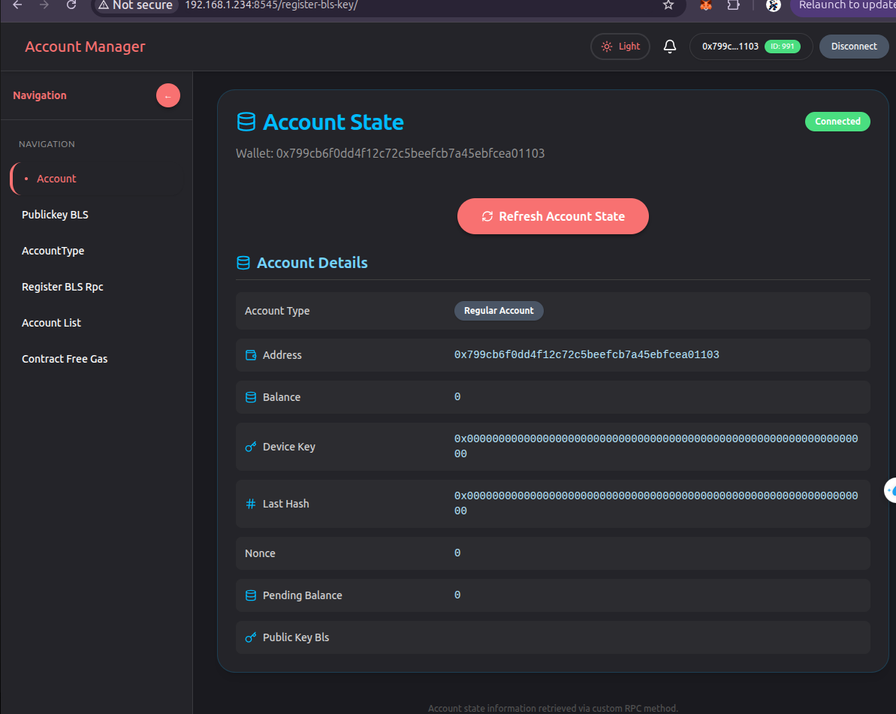
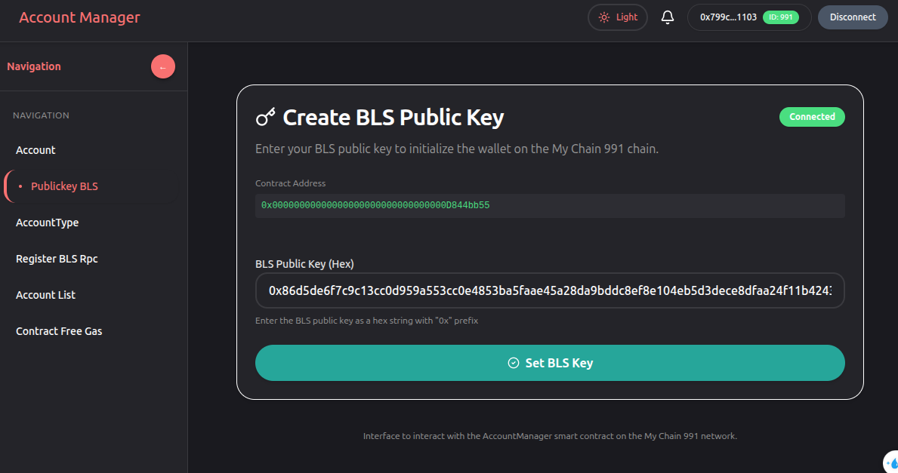
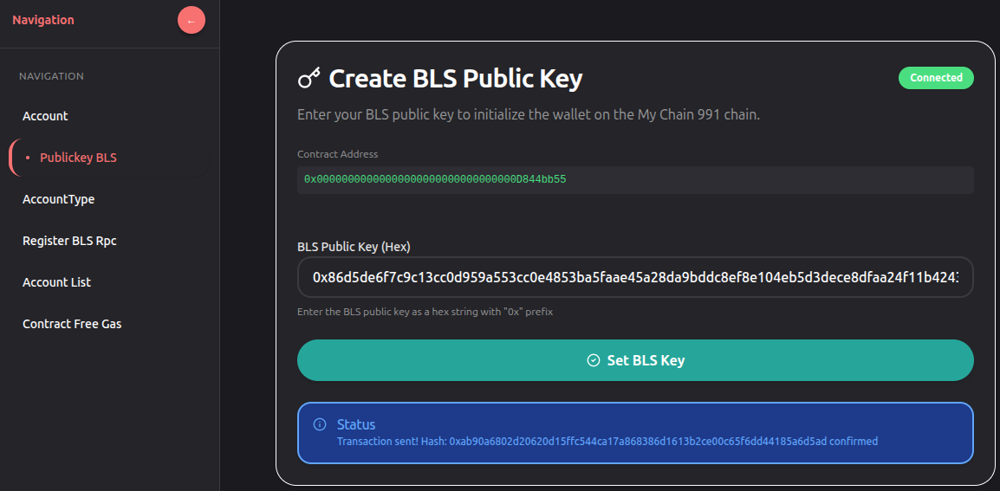
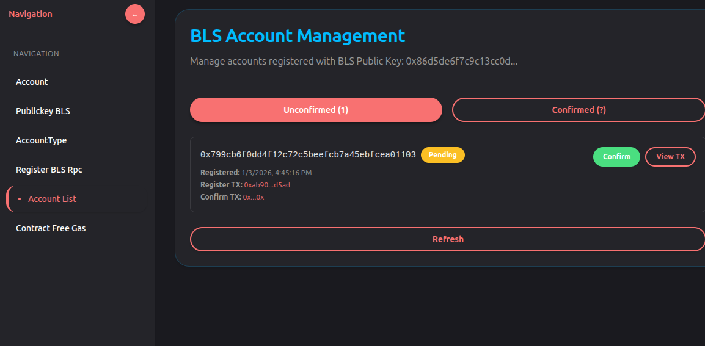
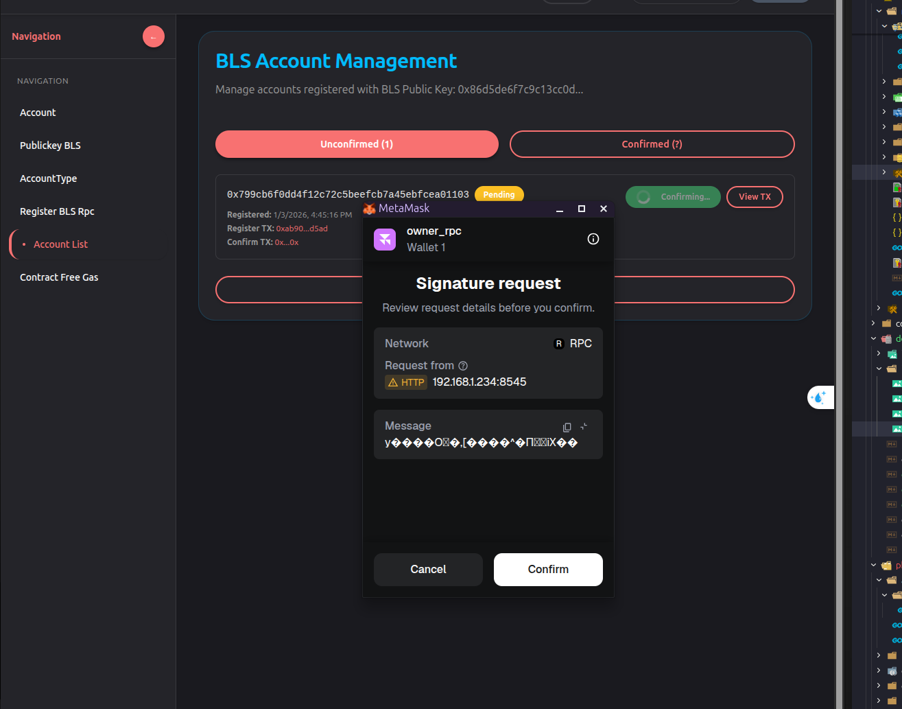
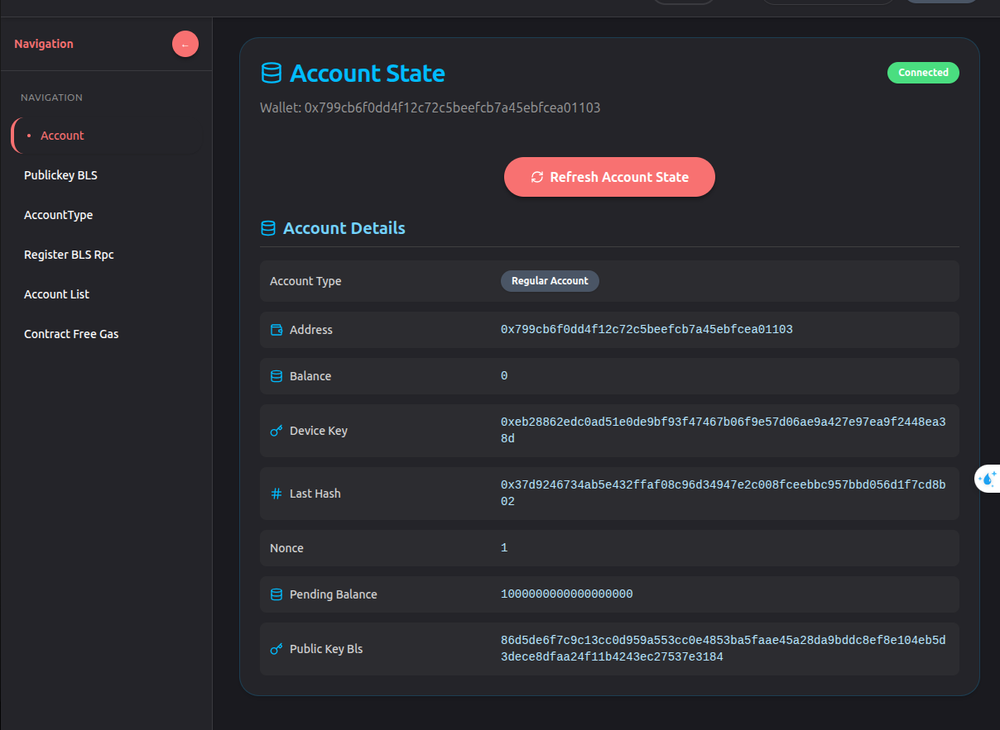

# Hướng dẫn Đăng ký BLS Key

Tài liệu này mô tả chi tiết quy trình đăng ký BLS (Boneh-Lynn-Shacham) Key cho tài khoản trên hệ thống.

---

## Tổng quan

Quy trình đăng ký BLS Key bao gồm 2 vai trò chính:
- **Người dùng**: Đăng ký BLS Public Key và gửi yêu cầu
- **Admin**: Xác nhận (confirm) yêu cầu đăng ký

---

## Bước 1: Kết nối ví cần đăng ký BLS



### Mô tả:
Người dùng cần kết nối ví Ethereum (MetaMask hoặc ví tương tự) với ứng dụng để bắt đầu quá trình đăng ký BLS Key.

### Thao tác:
1. Mở ứng dụng đăng ký BLS
2. Kết nối ví bằng cách:
   - Click nút **"Connect Wallet"**
   - Chọn ví MetaMask hoặc ví tương thích
   - Xác nhận kết nối

### Kết quả:
- Ví đã được kết nối thành công
- Địa chỉ ví hiển thị trên giao diện
- Sẵn sàng để thực hiện đăng ký BLS Key

---

## Bước 2: Chọn Public Key BLS và đăng ký



### Mô tả:
Người dùng nhập BLS Public Key và thực hiện đăng ký lên hệ thống.

### Thao tác:
1. Nhập **BLS Public Key** vào ô input
   - Định dạng: Hex string (ví dụ: `0x86d5de6f7c9c13cc0d959a553cc0e4853ba5faae45a28da9bddc8ef8e104eb5d3dece8dfaa24f11b4243ec27537e3184`)
2. Click nút **"Set BLS key"** để gửi yêu cầu đăng ký
3. Xác nhận giao dịch trên ví MetaMask

### Kết quả:
- Giao dịch được gửi lên blockchain
- Yêu cầu đăng ký BLS được tạo và ở trạng thái **"Pending"** (chờ xác nhận)
- Thông báo được gửi đến Admin

---

## Bước 2.1: Xác nhận đăng ký thành công



### Mô tả:
Sau khi gửi yêu cầu đăng ký BLS Key, hệ thống hiển thị thông báo xác nhận.

### Thao tác:
- Kiểm tra thông báo thành công trên giao diện
- Ghi nhận transaction hash (nếu có)

### Kết quả:
- ✅ Thông báo: **"BLS Key đã được gửi yêu cầu đăng ký"**
- Yêu cầu đang ở trạng thái chờ Admin xác nhận
- Người dùng cần chờ Admin confirm để hoàn tất đăng ký

---

## Bước 3: Admin xem danh sách Account chờ xác nhận



### Mô tả:
Admin sử dụng ví admin để xem danh sách các tài khoản đang chờ xác nhận đăng ký BLS Key.

### Yêu cầu Admin:
1. **Ví Admin:**
   - Địa chỉ ví admin được cấu hình trong file `config-rpc.json` tại field `owner_rpc_address`
   - Địa chỉ ví: `0x0b143e894a600114c4a3729874214e5fc5ea9cbc`
   - Private key tương ứng: `48d0959736be4999d4fcfce48423e2e0f98610663ae3ee87f879eb69f74a0746`

2. **Thao tác:**
   - Import ví admin vào MetaMask:
     - Mở MetaMask
     - Click vào icon account → **"Import Account"**
     - Chọn **"Private Key"**
     - Dán private key: `48d0959736be4999d4fcfce48423e2e0f98610663ae3ee87f879eb69f74a0746`
     - Click **"Import"**
   - Kết nối ví admin vào ứng dụng
   - Truy cập tab **"Account List"** để xem danh sách các account đang chờ confirm

### Kết quả:
- Danh sách các tài khoản đang chờ xác nhận đăng ký BLS Key
- Hiển thị thông tin:
  - Địa chỉ ví (Address)
  - BLS Public Key
  - Trạng thái: **Pending**
  - Thời gian đăng ký

---

## Bước 4: Admin xác nhận Account



### Mô tả:
Admin sử dụng ví admin để xác nhận (confirm) yêu cầu đăng ký BLS Key của người dùng.

### Thao tác:
1. Trong tab **"Account List"**, tìm account cần xác nhận
2. Click nút **"Confirm"** hoặc **"Approve"** tương ứng với account đó
3. Xác nhận giao dịch trên MetaMask

### Kết quả:
- Giao dịch confirm được gửi lên blockchain
- Account được chuyển từ trạng thái **Pending** sang **Confirmed**
- Người dùng sẽ nhận được thông báo đăng ký thành công

---

## Bước 5: Xác minh đăng ký thành công



### Mô tả:
Sau khi Admin xác nhận, kiểm tra lại thông tin account đã được đăng ký BLS Key thành công.

### Thông tin xác minh:

**Ví đã đăng ký thành công:**
- **Địa chỉ ví:** `0x799cb6f0dd4f12c72c5beefcb7a45ebfcea01103`
- **Nonce:** `1` (sau khi đăng ký)
- **BLS Public Key:** `86d5de6f7c9c13cc0d959a553cc0e4853ba5faae45a28da9bddc8ef8e104eb5d3dece8dfaa24f11b4243ec27537e3184`

### Kiểm tra:
1. Kiểm tra **Nonce** của account:
   - Nonce = 1 (chứng tỏ đã có giao dịch đăng ký BLS được thực hiện)
2. Kiểm tra **BLS Public Key**:
   - Public Key hiển thị đúng với giá trị đã đăng ký
   - Public Key được lưu trữ và liên kết với địa chỉ ví

### Kết quả:
- ✅ Account đã được đăng ký BLS Key thành công
- ✅ BLS Public Key đã được liên kết với địa chỉ ví
- ✅ Account có thể sử dụng các tính năng BLS trên hệ thống

---

## Tóm tắt quy trình

```
1. Người dùng kết nối ví
   ↓
2. Người dùng nhập BLS Public Key và click "Set BLS key"
   ↓
3. Giao dịch được gửi, yêu cầu ở trạng thái Pending
   ↓
4. Admin kết nối ví admin và xem Account List
   ↓
5. Admin click "Confirm" để xác nhận account
   ↓
6. Account được xác nhận, BLS Key đã được đăng ký thành công
```

---

## Lưu ý quan trọng

1. **Bảo mật Private Key:**
   - Private key của ví admin cần được bảo mật tuyệt đối
   - Không chia sẻ private key với người không được phép

2. **Định dạng BLS Public Key:**
   - BLS Public Key phải là hex string hợp lệ
   - Độ dài chuẩn: 96 bytes (192 hex characters + "0x" prefix)

3. **Quyền Admin:**
   - Chỉ có địa chỉ ví được cấu hình trong `owner_rpc_address` mới có quyền confirm account
   - Đảm bảo địa chỉ này được cấu hình đúng trong file config

4. **Trạng thái giao dịch:**
   - Sau khi đăng ký, account ở trạng thái **Pending** cho đến khi Admin confirm
   - Chỉ sau khi Admin confirm, BLS Key mới chính thức được liên kết với account

---

## Thông tin cấu hình

**File cấu hình:** `cmd/rpc-client/config-rpc.json`

```json
{
  "owner_rpc_address": "0x0b143e894a600114c4a3729874214e5fc5ea9cbc"
}
```

**Ví Admin:**
- Address: `0x0b143e894a600114c4a3729874214e5fc5ea9cbc`
- Private Key: `48d0959736be4999d4fcfce48423e2e0f98610663ae3ee87f879eb69f74a0746`

