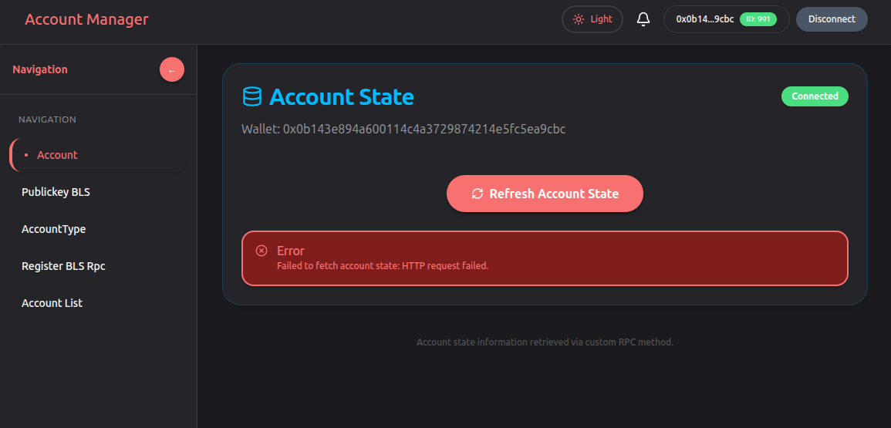
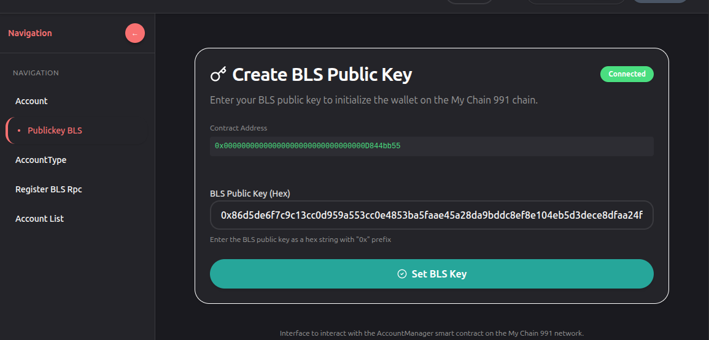
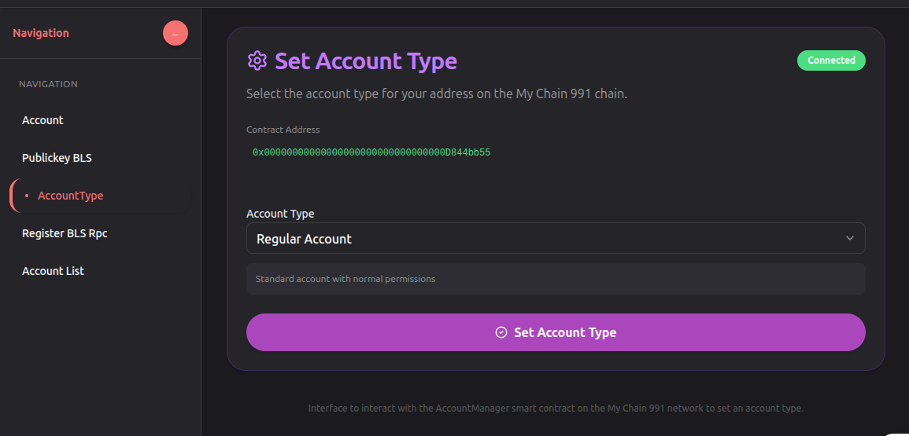
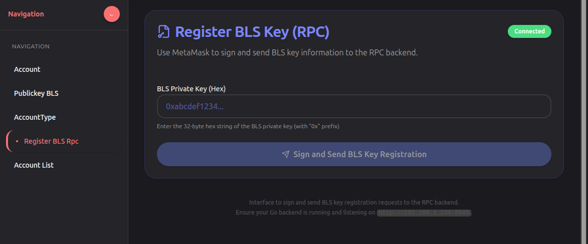
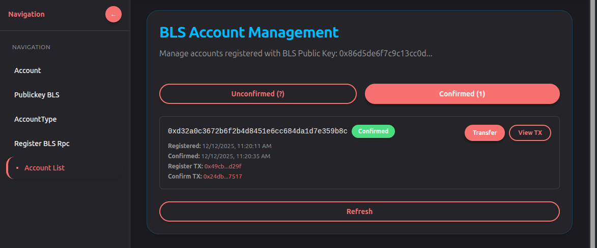
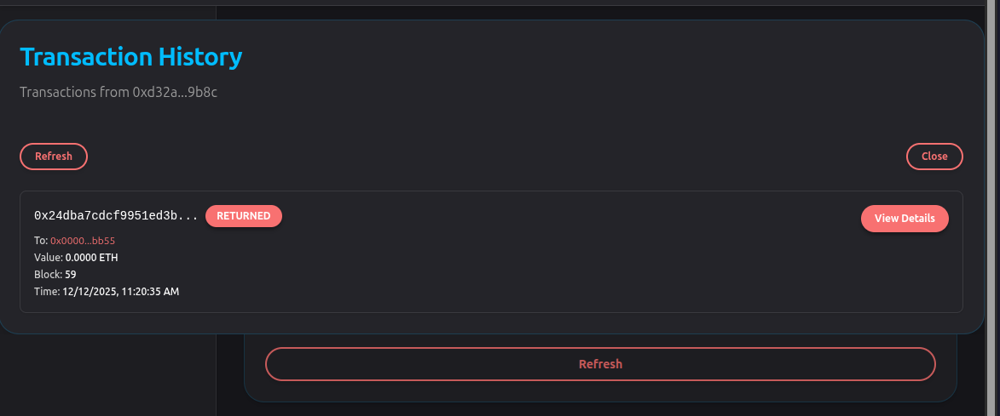
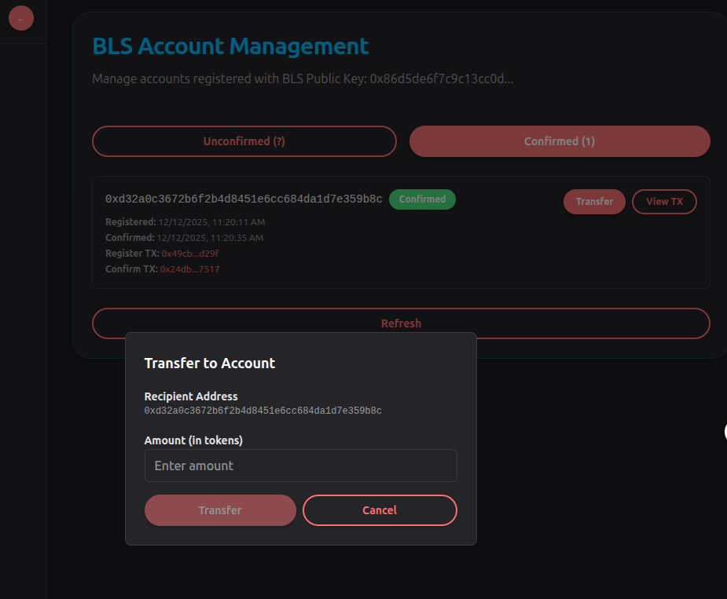
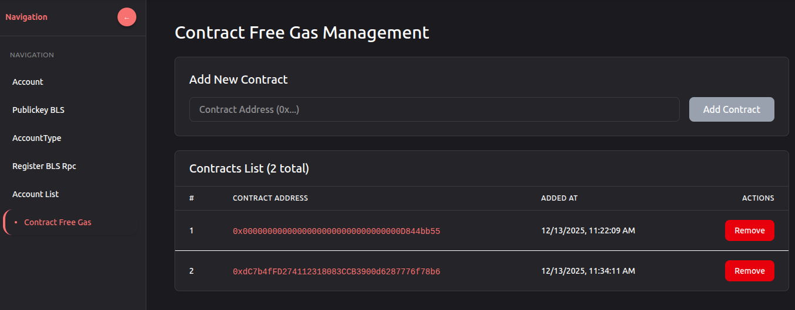

# Hướng dẫn sử dụng giao diện MetaCoSign

## Mục lục
1. [Giao diện tổng quan](#giao-diện-tổng-quan)
2. [Thanh điều hướng (Sidebar)](#thanh-điều-hướng-sidebar)
3. [Quản lý Tài khoản (Account)](#quản-lý-tài-khoản-account)
4. [Đăng ký Khóa BLS (Public Key BLS)](#đăng-ký-khóa-bls-public-key-bls)
5. [Cài đặt loại tài khoản (Account Type)](#cài-đặt-loại-tài-khoản-account-type)
6. [Đăng ký BLS Private Key](#đăng-ký-bls-private-key)
7. [Danh sách tài khoản (Account List)](#danh-sách-tài-khoản-account-list)
8. [Xem giao dịch (View Transaction)](#xem-giao-dịch-view-transaction)
9. [Chuyển tiền (Transfer)](#chuyển-tiền-transfer)

---

## Giao diện tổng quan



Giao diện chính của MetaCoSign bao gồm:
- **Header**: Hiển thị thông tin ví, nút kết nối MetaMask
- **Sidebar**: Menu điều hướng các tính năng chính
- **Content Area**: Hiển thị nội dung của từng tính năng
- **Notification Bell**: Hiển thị các thông báo real-time

---

## Thanh điều hướng (Sidebar)

Sidebar bên trái cung cấp các menu chính để điều hướng đến các tính năng:

### Menu Items:

1. **🏠 Home** - Trang chủ
2. **👤 Account** - Chi tiết tài khoản của bạn
3. **🔐 Public Key BLS** - Đăng ký khóa BLS công khai
4. **⚙️ Account Type** - Cài đặt loại tài khoản
5. **📝 Register BLS** - Đăng ký BLS private key
6. **📊 Account List** - Danh sách tất cả tài khoản

---

## Quản lý Tài khoản (Account)

### Mục đích:
Xem chi tiết thông tin tài khoản hiện tại của bạn.

### Cách sử dụng:
1. Click vào **"Account"** ở sidebar
2. Giao diện sẽ hiển thị:
   - 📱 Địa chỉ ví MetaMask của bạn
   - ⛓️ Chain ID
   - 💰 Số dư tài khoản
   - 🔗 Các thông tin liên quan

### Chức năng:
- Xem chi tiết địa chỉ ví
- Sao chép địa chỉ ví
- Kiểm tra số dư

---

## Đăng ký Khóa BLS (Public Key BLS)



### Mục đích:
Đăng ký khóa BLS công khai của bạn lên hệ thống. Đây là bước đầu tiên để sử dụng tính năng BLS.

### Cách sử dụng:

1. **Truy cập trang:**
   - Click vào **"Public Key BLS"** ở sidebar

2. **Nhập khóa BLS:**
   - Dán khóa BLS công khai của bạn vào ô input
   - Khóa BLS phải có định dạng hex: `0x...`

3. **Gửi yêu cầu:**
   - Click nút **"Register BLS"**
   - Hệ thống sẽ:
     - Tạo giao dịch với địa chỉ ví của bạn
     - Lưu khóa BLS công khai vào database
     - Tạo một thông báo cho Admin

4. **Trạng thái:**
   - Yêu cầu của bạn sẽ ở trạng thái **"Pending"** (chờ duyệt)
   - Admin sẽ duyệt yêu cầu của bạn
   - Bạn sẽ nhận được thông báo khi được duyệt: **"✅ BLS Registered"**


---

## Cài đặt loại tài khoản (Account Type)



### Mục đích:
Chọn loại chữ ký để bảo mật tài khoản của bạn.

### Các loại tài khoản:

#### 1️⃣ **Regular (1 chữ ký)**
- **Mô tả**: Sử dụng 1 chữ ký để xác thực giao dịch

#### 🛡️ **Read-Write-Strict (2 chữ ký)**
- **Mô tả**: Sử dụng 2 chữ ký  để xác thực

---

## Đăng ký BLS Private Key



### Mục đích:
Đăng ký một BLS private key riêng cho tài khoản của bạn (khác với BLS mặc định hệ thống).

### Điểm khác biệt:
- **Public Key BLS**: Khóa công khai (đã đăng ký ở bước trên)
- **Register BLS**: Đăng ký khóa riêng cho tài khoản của bạn

### Cách sử dụng:

1. **Truy cập trang:**
   - Click vào **"Register BLS"** ở sidebar

2. **Nhập thông tin:**
   - **BLS Private Key**: Khóa riêng của bạn (định dạng hex)
   - **Account Address**: Địa chỉ ví để liên kết (tự động điền)

3. **Xác nhận:**
   - Click nút **"Register"**
   - Hệ thống sẽ:
     - Xác thực khóa private
     - Lưu trữ an toàn trong database
     - Liên kết với tài khoản của bạn

4. **Kết quả:**
   - ✅ Thông báo: **"BLS Private Key Registered"**
   - Bạn giờ có thể sử dụng khóa này cho giao dịch

### ⚠️ Lưu ý bảo mật:
- **KHÔNG** chia sẻ private key với ai
- **KHÔNG** lưu private key ở nơi công cộng
- Chỉ dùng private key trên ứng dụng tin cậy

---

## Danh sách tài khoản (Account List)



### Mục đích:
Xem danh sách tất cả tài khoản (chưa xác nhận và đã xác nhận).

### Giao diện:

#### Tab Unconfirmed (Chưa xác nhận)
- Hiển thị các tài khoản đang chờ Admin duyệt
- Mỗi tài khoản hiển thị:
  - 📱 Địa chỉ ví
  - ⏰ Thời gian đăng ký
  - 🔐 Khóa BLS công khai
  - 📋 Trạng thái: **"⏳ Pending"**
  - 🔘 Nút **"Confirm"** - Để Admin duyệt tài khoản
  - 👁️ Nút **"View TX"** - Xem chi tiết giao dịch

#### Tab Confirmed (Đã xác nhận)
- Hiển thị các tài khoản đã được Admin duyệt
- Mỗi tài khoản hiển thị:
  - 📱 Địa chỉ ví
  - ⏰ Thời gian đăng ký
  - ✅ Thời gian xác nhận
  - 🔐 Khóa BLS công khai
  - 📋 Trạng thái: **"✅ Confirmed"**
  - 💸 Nút **"Transfer"** - Chuyển tiền đến tài khoản này
  - 👁️ Nút **"View TX"** - Xem chi tiết giao dịch

### Cách sử dụng:

1. **Truy cập trang:**
   - Click vào **"Account List"** ở sidebar

2. **Chuyển tab:**
   - Nhấp vào **"Unconfirmed"** hoặc **"Confirmed"** để xem danh sách tương ứng

3. **Lọc và tìm kiếm:**
   - Danh sách hỗ trợ phân trang
   - Click vào số trang để xem tài khoản tiếp theo

4. **Cập nhật:**
   - Click nút **"Refresh"** để làm mới danh sách

---

## Xem giao dịch (View Transaction)



### Mục đích:
Xem chi tiết lịch sử giao dịch của một tài khoản cụ thể.

### Cách sử dụng:

1. **Mở modal:**
   - Tại bất kỳ tài khoản nào trong danh sách
   - Click nút **"View TX"**

2. **Xem danh sách giao dịch:**
   - Modal sẽ hiển thị:
     - 📅 Thời gian giao dịch
     - 🔗 Hash giao dịch
     - 📊 Trạng thái (Success/Failed)
     - 💰 Số tiền
     - 📝 Loại giao dịch

3. **Chi tiết mỗi giao dịch:**
   - **Transaction Hash**: Định danh giao dịch
   - **Status**: ✅ Success hoặc ❌ Failed
   - **Amount**: Số tiền giao dịch
   - **Timestamp**: Thời gian thực hiện
   - **From**: Địa chỉ gửi
   - **To**: Địa chỉ nhận

4. **Đóng modal:**
   - Click nút **"Close"** hoặc nhấp ra ngoài modal


---

## Chuyển tiền (Transfer)



### Mục đích:
Chuyển tiền từ tài khoản của bạn đến tài khoản khác.

### Điều kiện:
- ✅ Tài khoản phải ở trạng thái **"Confirmed"** (đã được duyệt)
- ✅ Bạn phải có tiền trong tài khoản
- ✅ Bạn phải kết nối MetaMask

### Cách sử dụng:

1. **Mở modal Transfer:**
   - Tại một tài khoản **Confirmed**
   - Click nút **"Transfer"**

2. **Nhập thông tin:**
   - **Recipient Address**: Địa chỉ ví nhận tiền (tự động điền)
   - **Amount**: Số tiền cần chuyển (tính bằng token)
     - Ví dụ: `100` = 100 tokens
     - Hệ thống tự convert sang wei

3. **Xác nhận:**
   - Click nút **"Transfer"**
   - MetaMask sẽ hiện lên để bạn ký giao dịch

4. **Ký giao dịch:**
   - **Message để ký**:
     ```
     Message = [toAddress, amount, timestamp]
     ```
   - Hệ thống tạo tin nhắn từ 3 thành phần:
     - `toAddress`: Địa chỉ nhận (20 bytes)
     - `amount`: Số tiền (uint256 = 32 bytes)
     - `timestamp`: Thời gian (uint256 = 32 bytes)
   - Click **"Sign"** trong MetaMask

5. **Gửi giao dịch:**
   - Hệ thống gửi giao dịch transfer lên blockchain
   - Hiện loading indicator

6. **Kết quả:**
   - ✅ Thông báo: **"✅ Transfer Successful!"**
   - 📱 Cả bạn và người nhận đều nhận notification real-time
   - 💾 Giao dịch được lưu vào database

### Thông báo nhận được:

**Người gửi thấy:**
```
🔔 Transfer
You transferred 100 to 0xBBB...
```

**Người nhận thấy:**
```
🔔 Transfer  
You received 100 from 0xAAA...
```

### Ví dụ chi tiết:

```
1. Nhấp "Transfer" tại tài khoản 0xBBB...
   ↓
2. Modal hiện lên:
   - Recipient: 0xBBB... (tự động)
   - Amount: [nhập 100]
   ↓
3. Click "Transfer"
   ↓
4. MetaMask hiện lên - ký message:
   - Message: 0xBBB... + 100 + 1702365600
   ↓
5. Click "Sign" 
   ↓
6. Giao dịch gửi đi, loading...
   ↓
7. ✅ "Successfully transferred 100 to 0xBBB...!"
   ↓
8. Người nhận (0xBBB) nhận notification:
   - "You received 100 from 0xAAA..."
```

---

## Thông báo (Notifications)

### Vị trí:
- 🔔 Icon chuông ở header phải
- Hiển thị số thông báo chưa đọc

### Loại thông báo:

| Icon | Loại | Mô tả |
|------|------|-------|
| ✅ | Account Confirmed | Tài khoản được duyệt |
| 🔐 | BLS Registered | Khóa BLS được đăng ký |
| 💸 | Transfer | Chuyển tiền (gửi/nhận) |

### Xem thông báo:
1. Click vào 🔔 icon
2. Xem danh sách thông báo
3. Click vào thông báo để xem chi tiết
4. Các thông báo được lưu vào database


## Xem danh sách 


### Mục đích:
Xem và quản lý của các hợp đồng đã đăng ký được nạp tiền khi đủ tiền giao dịch ở hợp đồng.

### Lưu ý:
- Khi số tiền của user đạt tới 1 ngưỡng ví dụ 0.001 thì sẻ tự động chuyển chuyển một lượng tiền ```extra_account ``` (được cấu hình ở rpc)cho cho user 