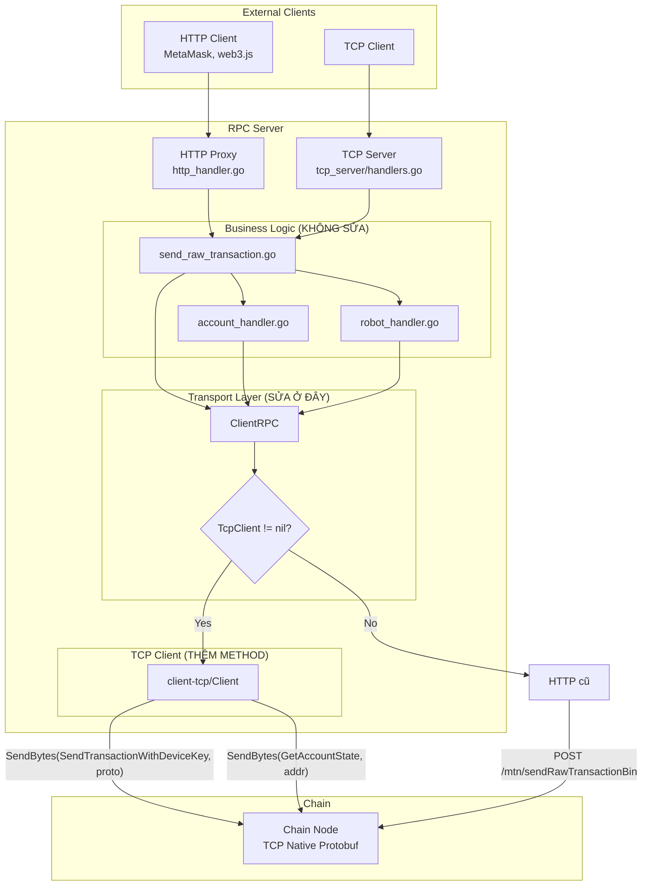

# Hướng dẫn tích hợp TCP Transport cho MetaCoSign RPC

## Mục lục
1. [Tổng quan vấn đề](#1-tổng-quan-vấn-đề)
2. [Nguyên tắc thiết kế](#2-nguyên-tắc-thiết-kế)
3. [Kiến trúc](#3-kiến-trúc)
4. [Hướng dẫn từng bước](#4-hướng-dẫn-từng-bước)
5. [Kiểm tra và xác minh](#5-kiểm-tra-và-xác-minh)

---

## 1. Tổng quan vấn đề

### Hiện tại

[rpc_client/client.go](file:///home/nhat/Desktop/MetaCoSign/pkg/rpc_client/client.go) giao tiếp với chain bằng **HTTP**:
- `SendRawTransactionBinary()` → HTTP POST protobuf bytes
- `GetAccountState()` → HTTP JSON-RPC
- `GetDeviceKey()` → HTTP JSON-RPC

Tất cả các module đều gọi qua `ClientRPC`:
- [account_handler.go](file:///home/nhat/Desktop/MetaCoSign/pkg/account_handler/account_handler.go) → `ClientRpc.SendRawTransactionBinary()`, `ClientRpc.BuildTransactionWithDeviceKeyFromEthTx()`
- [robot_handler.go](file:///home/nhat/Desktop/MetaCoSign/pkg/robot_handler/robot_handler.go) → `ClientRpc.SendRawTransactionBinary()`, `ClientRpc.SendHTTPRequest()`
- [send_raw_transaction.go](file:///home/nhat/Desktop/MetaCoSign/cmd/rpc-client/handlers/send_raw_transaction.go) → `ClientRpc.SendRawTransactionBinary()`
- [tcp_server/handlers.go](file:///home/nhat/Desktop/MetaCoSign/cmd/rpc-client/internal/tcp_server/handlers.go) → `handlers.ProcessSendRawTransaction()`, `ClientRpc.SendHTTPRequest()`

### Mục tiêu

Chuyển tất cả giao tiếp chain sang **TCP native protobuf** mà **không sửa** các module trên.

### Tại sao không cần sửa nhiều?

Tất cả module đều gọi qua **2-3 method chốt** của `ClientRPC`:

```
account_handler ─┐
robot_handler   ─┤─→ ClientRPC.SendRawTransactionBinary()  ← SỬA Ở ĐÂY
send_raw_tx     ─┤─→ ClientRPC.GetAccountState()           ← SỬA Ở ĐÂY
tcp_server      ─┘─→ ClientRPC.GetDeviceKey()              ← SỬA Ở ĐÂY
```

Sửa 3 method → tất cả module tự động dùng TCP.

---

## 2. Nguyên tắc thiết kế

| Nguyên tắc | Mô tả |
|------------|-------|
| **Tái sử dụng** | `client-tcp/Client` đã có sẵn TCP connection, handler, receiptRouter |
| **Ít thay đổi** | Chỉ sửa `ClientRPC` (transport layer), không sửa business logic |
| **Backward compatible** | `TcpClient == nil` → dùng HTTP như cũ |
| **Protobuf native** | Gửi trực tiếp protobuf bytes, không chuyển đổi qua JSON |

---

## 3. Kiến trúc



---

## 4. Hướng dẫn từng bước

### Bước 1: Thêm interface `TcpTransport` vào `rpc_client/client.go`

> [!TIP]
> Đặt interface ở đầu file, sau phần import.

Mở [client.go](file:///home/nhat/Desktop/MetaCoSign/pkg/rpc_client/client.go) và thêm:

```go
// TcpTransport định nghĩa các method giao tiếp TCP với chain.
// client-tcp/Client implement interface này.
type TcpTransport interface {
    // Gửi pre-built TransactionWithDeviceKey protobuf bytes lên chain.
    // metaTx đã được build bởi BuildTransactionWithDeviceKeyFromEthTx().
    // Trả về txHash để caller có thể track.
    SendTransactionWithDeviceKeyBytes(protoBytes []byte) (common.Hash, error)

    // Query account state qua TCP native command.
    GetAccountStateTcp(address common.Address) (mt_types.AccountState, error)

    // Query device key qua TCP native command.
    GetDeviceKeyTcp(lastHash common.Hash) (common.Hash, error)

    // Chờ receipt theo txHash (dùng receiptRouter đã có).
    FindReceiptByHash(txHash common.Hash) (mt_types.Receipt, error)

    // Kiểm tra connection còn sống không.
    IsParentConnected() bool
}
```

---

### Bước 2: Thêm `TcpClient` field vào `ClientRPC` struct

Trong cùng file [client.go](file:///home/nhat/Desktop/MetaCoSign/pkg/rpc_client/client.go):

```diff
 type ClientRPC struct {
     HttpConn  *http.Client
     WsConn    *websocket.Conn
     UrlHTTP   string
     UrlWS     string
     KeyPair   *bls.KeyPair
     ChainId   *big.Int
+    TcpClient TcpTransport // nil = dùng HTTP, non-nil = dùng TCP
 }
```

---

### Bước 3: Sửa `GetAccountState()` — thêm TCP path

Tìm hàm `GetAccountState` trong [client.go](file:///home/nhat/Desktop/MetaCoSign/pkg/rpc_client/client.go#L340):

```diff
 func (c *ClientRPC) GetAccountState(address common.Address, blockNrOrHash rpc.BlockNumberOrHash) (mt_types.AccountState, error) {
+    // TCP path — gửi native command
+    if c.TcpClient != nil {
+        return c.TcpClient.GetAccountStateTcp(address)
+    }
+    // HTTP path — JSON-RPC (code cũ giữ nguyên)
     request := &JSONRPCRequest{
         Jsonrpc: "2.0",
         Method:  "mtn_getAccountState",
         // ... code cũ ...
```

---

### Bước 4: Sửa `GetDeviceKey()` — thêm TCP path

Tìm hàm `GetDeviceKey` trong [client.go](file:///home/nhat/Desktop/MetaCoSign/pkg/rpc_client/client.go#L374):

```diff
 func (c *ClientRPC) GetDeviceKey(hash common.Hash) (common.Hash, error) {
+    if c.TcpClient != nil {
+        return c.TcpClient.GetDeviceKeyTcp(hash)
+    }
     request := &JSONRPCRequest{
         // ... code cũ giữ nguyên ...
```

---

### Bước 5: Sửa `SendRawTransactionBinary()` — thêm TCP path

Tìm hàm `SendRawTransactionBinary` trong [client.go](file:///home/nhat/Desktop/MetaCoSign/pkg/rpc_client/client.go#L409):

```diff
 func (c *ClientRPC) SendRawTransactionBinary(metaTx []byte, releaseMeta func(), ethTx []byte, releaseEth func(), pubKeyBls []byte) JSONRPCResponse {
+    // TCP path — gửi protobuf trực tiếp qua TCP command
+    if c.TcpClient != nil {
+        txHash, err := c.TcpClient.SendTransactionWithDeviceKeyBytes(metaTx)
+        // Release buffers ngay
+        if releaseMeta != nil { releaseMeta() }
+        if releaseEth != nil { releaseEth() }
+        if err != nil {
+            return JSONRPCResponse{
+                Jsonrpc: "2.0",
+                Error:   &JSONRPCError{Code: -1, Message: err.Error()},
+            }
+        }
+        return JSONRPCResponse{
+            Jsonrpc: "2.0",
+            Result:  txHash.Hex(),
+        }
+    }
+    // HTTP path (code cũ giữ nguyên bên dưới)
     reader, totalLen := newBinaryPayloadReader(metaTx, ethTx, pubKeyBls)
     // ... code cũ ...
```

---

### Bước 6: Implement interface trên `client-tcp/Client`

Mở [client-tcp/client.go](file:///home/nhat/Desktop/MetaCoSign/cmd/rpc-client/client-tcp/client.go) và thêm 3 method mới ở cuối file:

```go
// ========== TcpTransport Interface Implementation ==========

// SendTransactionWithDeviceKeyBytes gửi pre-built TransactionWithDeviceKey
// protobuf bytes trực tiếp lên chain.
// metaTx đã được build bởi ClientRPC.BuildTransactionWithDeviceKeyFromEthTx().
func (client *Client) SendTransactionWithDeviceKeyBytes(protoBytes []byte) (common.Hash, error) {
    parentConn := client.clientContext.ConnectionsManager.ParentConnection()
    if parentConn == nil || !parentConn.IsConnect() {
        if err := client.ReconnectToParent(); err != nil {
            return common.Hash{}, fmt.Errorf("TCP not connected: %w", err)
        }
        parentConn = client.clientContext.ConnectionsManager.ParentConnection()
    }

    // Decode protobuf để lấy txHash (cần cho tracking)
    txWithDK := &pb.TransactionWithDeviceKey{}
    if err := proto.Unmarshal(protoBytes, txWithDK); err != nil {
        return common.Hash{}, fmt.Errorf("unmarshal TransactionWithDeviceKey: %w", err)
    }
    tx := mt_transaction.TransactionFromProto(txWithDK.Transaction)
    txHash := tx.Hash()

    // Gửi lên chain qua TCP native command
    err := client.clientContext.MessageSender.SendBytes(
        parentConn,
        command.SendTransactionWithDeviceKey,
        protoBytes, // gửi nguyên protobuf bytes
    )
    if err != nil {
        return common.Hash{}, fmt.Errorf("TCP send failed: %w", err)
    }

    logger.Info("📤 TCP SendTransactionWithDeviceKey: txHash=%s", txHash.Hex())
    return txHash, nil
}

// GetAccountStateTcp lấy account state qua TCP native command.
// Chain trả AccountState qua accountStateChan.
func (client *Client) GetAccountStateTcp(address common.Address) (types.AccountState, error) {
    parentConn := client.clientContext.ConnectionsManager.ParentConnection()
    if parentConn == nil || !parentConn.IsConnect() {
        if err := client.ReconnectToParent(); err != nil {
            return nil, fmt.Errorf("TCP not connected: %w", err)
        }
        parentConn = client.clientContext.ConnectionsManager.ParentConnection()
    }

    // Gửi command GetAccountState với address bytes
    err := client.clientContext.MessageSender.SendBytes(
        parentConn,
        command.GetAccountState,
        address.Bytes(),
    )
    if err != nil {
        return nil, fmt.Errorf("TCP GetAccountState send failed: %w", err)
    }

    // Chờ response qua channel (handler.go đã push vào accountStateChan)
    select {
    case as := <-client.accountStateChan:
        return as, nil
    case <-time.After(10 * time.Second):
        return nil, fmt.Errorf("timeout waiting for AccountState of %s", address.Hex())
    }
}

// GetDeviceKeyTcp lấy device key qua TCP native command.
// Chain trả DeviceKey qua deviceKeyChan.
func (client *Client) GetDeviceKeyTcp(lastHash common.Hash) (common.Hash, error) {
    parentConn := client.clientContext.ConnectionsManager.ParentConnection()
    if parentConn == nil || !parentConn.IsConnect() {
        if err := client.ReconnectToParent(); err != nil {
            return common.Hash{}, fmt.Errorf("TCP not connected: %w", err)
        }
        parentConn = client.clientContext.ConnectionsManager.ParentConnection()
    }

    err := client.clientContext.MessageSender.SendBytes(
        parentConn,
        command.GetDeviceKey,
        lastHash.Bytes(),
    )
    if err != nil {
        return common.Hash{}, fmt.Errorf("TCP GetDeviceKey send failed: %w", err)
    }

    select {
    case dk := <-client.deviceKeyChan:
        deviceKeyHash := common.BytesToHash(dk.LastDeviceKeyFromServer)
        return deviceKeyHash, nil
    case <-time.After(10 * time.Second):
        return common.Hash{}, fmt.Errorf("timeout waiting for DeviceKey")
    }
}
```

> [!IMPORTANT]
> `FindReceiptByHash(txHash)` và `IsParentConnected()` đã có sẵn trong `client-tcp/Client` — **không cần thêm**.

---

### Bước 7: Kết nối TCP Client vào ClientRPC

Mở [context.go](file:///home/nhat/Desktop/MetaCoSign/cmd/rpc-client/app/context.go#L79) và thêm **1 dòng** sau khi tạo `clientTcp`:

```diff
 clientTcp, err := client_tcp.NewClient(tcpCfg)
 if err != nil {
     pkStore.Close()
     return nil, fmt.Errorf("failed to create TCP client: %w", err)
 }

+// Gắn TCP client vào ClientRPC → tất cả chain communication đi qua TCP
+clientRpc.TcpClient = clientTcp
```

**Xong!** Khi `TcpClient != nil`:
- `GetAccountState()` → TCP
- `GetDeviceKey()` → TCP
- `SendRawTransactionBinary()` → TCP
- Tất cả module gọi qua `ClientRPC` → tự động TCP

---

## 5. Kiểm tra và xác minh

### Checklist

- [ ] Build thành công: `go build ./...`
- [ ] `client-tcp/Client` satisfy `TcpTransport` interface (compiler sẽ báo lỗi nếu thiếu method)
- [ ] Test với TCP disabled: bỏ dòng `clientRpc.TcpClient = clientTcp` → verify HTTP vẫn hoạt động
- [ ] Test với TCP enabled: giữ dòng `clientRpc.TcpClient = clientTcp` → verify chain communication qua TCP

### Test cases

| Test | Mô tả | Verify |
|------|--------|--------|
| `eth_call` | Gửi read-only query | Chain trả kết quả qua TCP |
| `eth_sendRawTransaction` | Gửi transaction thường | `SendRawTransactionBinary` đi qua TCP |
| Confirm account | `account_handler.handleConfirmAccount` | `GetAccountState` + `GetDeviceKey` + `SendRawTransactionBinary` đều qua TCP |
| Robot emitQuestion | `robot_handler.handleEmitQuestion` | Queue xử lý, `executeSingleTransaction` gửi qua TCP |
| Free gas transfer | `BuildTransactionWithDeviceKeyFromEthTx` khi balance thấp | Transfer transaction gửi qua TCP |

### Debug

Nếu gặp vấn đề, kiểm tra:
1. **Connection**: `client.IsParentConnected()` trả `true`?
2. **InitConnection**: TCP client đã gửi `InitConnection` với đúng address?
3. **Channel blocking**: `accountStateChan`, `deviceKeyChan` có bị full? (buffer size = 2000, 1)
4. **Timeout**: Tăng timeout nếu chain chậm respond

### Đổi lại HTTP (rollback)

Chỉ cần comment 1 dòng trong `context.go`:

```go
// clientRpc.TcpClient = clientTcp  // ← comment dòng này → fallback HTTP
```
