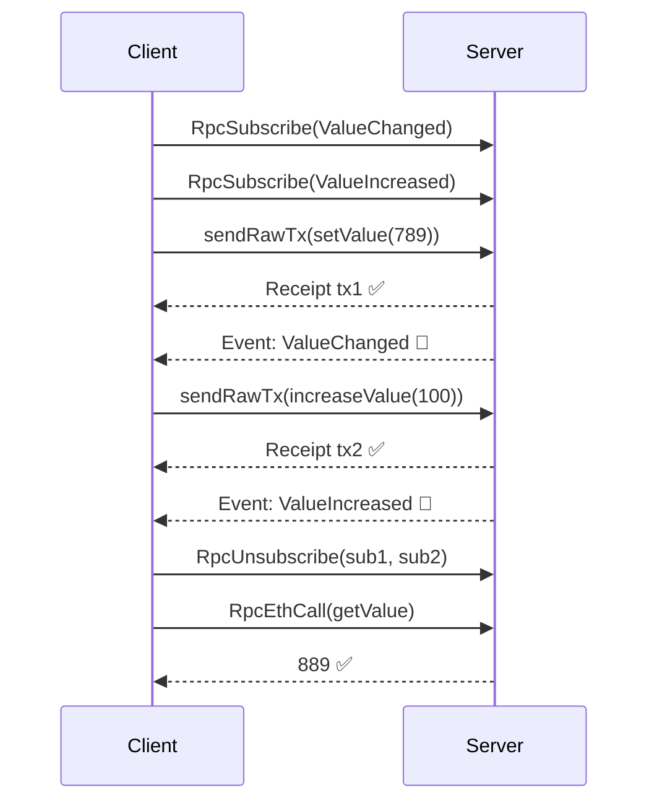
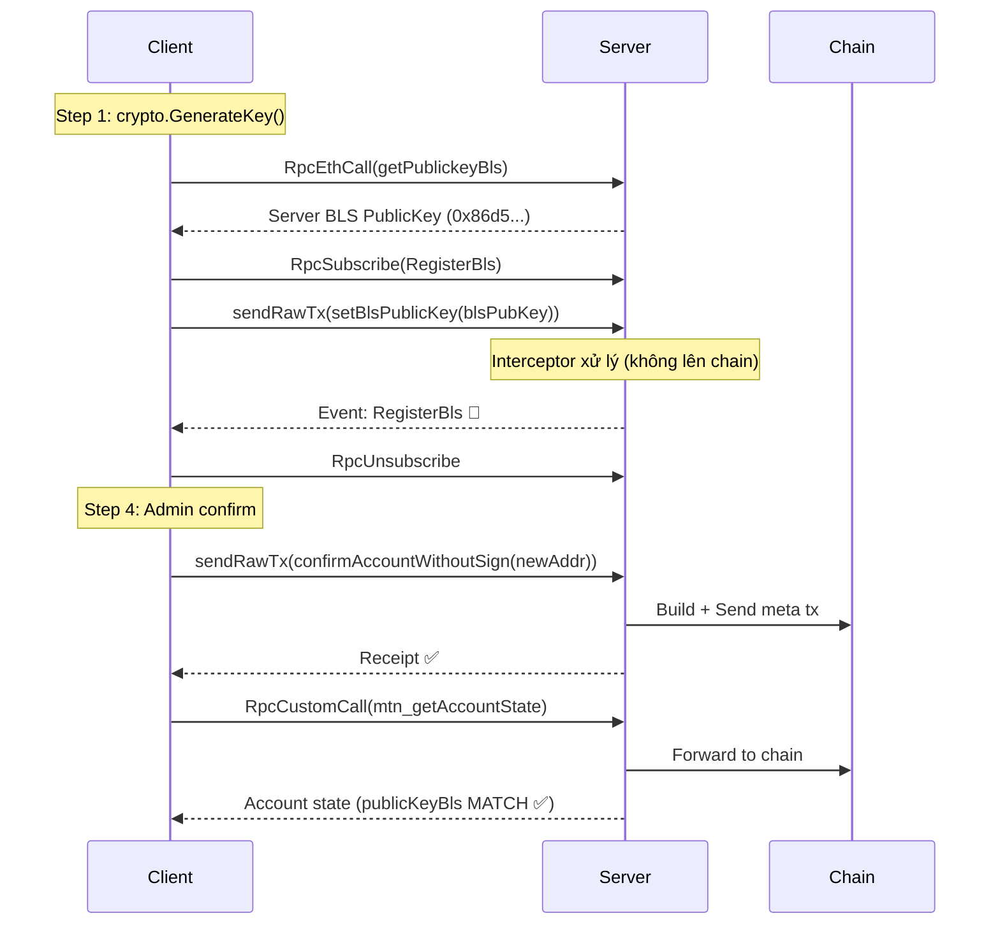

# TCP-RPC Client — Hướng dẫn sử dụng

## Run rpc

``` cd rpc-client -> go run main.go ```

## Run test transfer

```go run main.go -test=transfer```

# test crud

```go run main.go -test=demo```

# test đăng ký bls

```go run main.go -test=bls -count 5 -out bls_keys.json```

# goi các hàm trên chain 4200

```go run main.go -test=chain```

```go run main.go -test=all```

# test free gas

```go run main.go -test=freegas```

### Trong đăng ký bls hàm confirmAdmin chỉ mới có receipt còn lại k có receipt

---

## Cấu hình (`config-test.json`)

```json
{
  "private_key": "2b3aa0f620d2d73c...",
  "parent_connection_address": "0.0.0.0:9545",
  "chain_id": 991,
  "parent_connection_type": "client",
  "parent_address": "0x0b143e89...",
  "eth_private_key": "48d0959736be4999...",
  "demo_abi_path": "../pkg/abi/demo_abi.json",
  "demo_contract_address": "0x6DEFc189..."
}
```

| Field                      | Mô tả                              |
| -------------------------- | ----------------------------------- |
| `private_key`              | BLS private key cho kết nối P2P     |
| `parent_connection_address`| Địa chỉ TCP server (host:port)      |
| `chain_id`                 | Chain ID (991)                      |
| `parent_address`           | Address của node cha                |
| `eth_private_key`          | ETH private key để ký giao dịch     |
| `demo_abi_path`            | Đường dẫn file ABI contract         |
| `demo_contract_address`    | Địa chỉ smart contract              |

---

## Khởi tạo Client

```go
import (
    client_tcp "github.com/meta-node-blockchain/meta-node/cmd/observer/client-tcp"
    tcp_config "github.com/meta-node-blockchain/meta-node/cmd/observer/client-tcp/config"
)

cfgRaw, _ := tcp_config.LoadConfig("config-test.json")
cfg := cfgRaw.(*tcp_config.ClientConfig)

tcpClient, err := client_tcp.NewClient(cfg)
if err != nil {
    log.Fatal(err)
}
time.Sleep(1 * time.Second)
```

---

## API Reference

### 1. `RpcNetVersion()` — Network version (decimal)

```go
version, _ := tcpClient.RpcNetVersion()
// "991"
```

### 2. `RpcGetChainId()` — Chain ID (hex)

```go
chainId, _ := tcpClient.RpcGetChainId()
// "0x3df"
```

### 3. `RpcEthCall()` — Đọc contract cho hàm view

```go
callData, _ := parsedABI.Pack("getValue")
resultBytes, _ := tcpClient.RpcEthCall(contractAddr, callData)
results, _ := parsedABI.Unpack("getValue", resultBytes)
value := results[0].(*big.Int) // 889
```

### 4. `RpcGetPendingNonce()` — Lấy nonce hiện tại

```go
nonce, _ := tcpClient.RpcGetPendingNonce(fromAddr)
// 17
```

### 5. `RpcSendRawTransaction()` — Gửi giao dịch đã ký theo chuẩn ETH

```go
nonce, _ := tcpClient.RpcGetPendingNonce(fromAddr)
inputData, _ := parsedABI.Pack("setValue", big.NewInt(789))
tx := types.NewTransaction(nonce, contractAddr, big.NewInt(0), 20000000, big.NewInt(10000000), inputData)
signedTx, _ := types.SignTx(tx, signer, ethPrivKey)
rawTxBytes, _ := signedTx.MarshalBinary()

txHash, _ := tcpClient.RpcSendRawTransaction("0x" + hex.EncodeToString(rawTxBytes))
```

> [!IMPORTANT]
> **Phải đợi receipt trước khi gửi giao dịch tiếp!** Nếu không sẽ bị **nonce conflict**.

### 6. `RpcGetTransactionReceipt()` — Lấy receipt (Protobuf)

Trả về `*pb.RpcReceipt`. Trả `nil` nếu pending.

```go
receipt, _ := tcpClient.RpcGetTransactionReceipt(txHash)
if receipt != nil {
    fmt.Println("Status:", receipt.Status)      // "0x1"
    fmt.Println("GasUsed:", receipt.GasUsed)     // "0x1107"
    fmt.Println("Logs:", len(receipt.Logs))       // 1
}
```

#### Pattern: Đợi receipt (polling)

```go
func waitReceipt(tcpClient *client_tcp.Client, txHash string) *pb.RpcReceipt {
    timer := time.NewTimer(30 * time.Second)
    defer timer.Stop()
    for {
        receipt, err := tcpClient.RpcGetTransactionReceipt(txHash)
        if err != nil { return nil }
        if receipt != nil { return receipt }
        select {
        case <-timer.C: return nil
        case <-time.After(10 * time.Millisecond):
        }
    }
}
```

### 7. `RpcSubscribe()` — Lắng nghe event từ contract

```go
func (client *Client) RpcSubscribe(
    contractAddrs []string,    // 1 contract address
    topics []string,           // event topic hash
    callback func([]byte),     // nhận raw protobuf RpcEvent
) (string, error)
```

Mỗi subscription có **callback riêng**, dispatch theo `subscription_id`:

```go
topic := parsedABI.Events["ValueChanged"].ID.Hex()

subID, _ := tcpClient.RpcSubscribe(
    []string{contractAddr.Hex()},
    []string{topic},
    func(eventData []byte) {
        event := &pb.RpcEvent{}
        proto.Unmarshal(eventData, event)
        fmt.Println("Contract:", event.Log.Address)
        fmt.Println("Topics:", event.Log.Topics)
        fmt.Println("Data:", event.Log.Data)
    },
)
```

#### Subscribe nhiều events cùng lúc

```go
sub1, _ := tcpClient.RpcSubscribe(
    []string{addr.Hex()}, []string{topic1}, handler1,
)
sub2, _ := tcpClient.RpcSubscribe(
    []string{addr.Hex()}, []string{topic2}, handler2,
)
```

### 8. `RpcUnsubscribe()` — Huỷ lắng nghe

```go
ok, _ := tcpClient.RpcUnsubscribe(subID) // true
```

### 9. `RpcCustomCall()` — Gọi bất kỳ RPC method

```go
params, _ := json.Marshal([]interface{}{address.Hex(), "latest"})
result, _ := tcpClient.RpcCustomCall("mtn_getAccountState", params, 10*time.Second)

var state map[string]interface{}
json.Unmarshal(result, &state)
fmt.Println(state["publicKeyBls"])
```

---

## Protobuf Messages

Định nghĩa trong `rpc_receipt.proto`:

### `RpcLogEntry` — Log entry dùng chung

```protobuf
message RpcLogEntry {
    string address = 1;
    repeated string topics = 2;
    string data = 3;
    string block_number = 4;
    string transaction_hash = 5;
    string block_hash = 6;
    string transaction_index = 7;
    string log_index = 8;
    bool removed = 9;
}
```

### `RpcEvent` — Event push qua subscription

```protobuf
message RpcEvent {
    string subscription_id = 1;
    RpcLogEntry log = 2;
}
```

### `RpcReceipt` — Transaction receipt

```protobuf
message RpcReceipt {
    string transaction_hash = 1;
    string from = 2;
    string to = 3;
    string contract_address = 4;
    string status = 5;
    string gas_used = 6;
    string cumulative_gas_used = 7;
    string effective_gas_price = 8;
    string block_hash = 9;
    string block_number = 10;
    string transaction_index = 11;
    string type = 12;
    repeated RpcLogEntry logs = 13;
    string logs_bloom = 14;
}
```

> [!NOTE]
> Tất cả fields dùng **string** (hex) để khớp với chain JSON-RPC output.

---

## Serialization Model

| Hướng                                  | Format             | Lý do                                  |
| -------------------------------------- | ------------------ | -------------------------------------- |
| **Client → Server** (request params)   | JSON               | Server forward thẳng lên chain         |
| **Server → Client** (event push)       | Protobuf `RpcEvent`| Stream liên tục, typed                 |
| **Server → Client** (receipt)          | Protobuf `RpcReceipt`| Structured, không cần parse JSON     |
| **Server → Client** (RPC response khác)| JSON               | Dynamic format, forward từ chain       |

---

## Chạy Test

```bash
# Tất cả tests
go run main.go

# Chỉ test demo contract (events + setValue + increaseValue)
go run main.go -test=demo

# Chỉ test BLS registration
go run main.go -test=bls

# Config khác
go run main.go -config=my-config.json -test=bls
```

---

## Test Suite 1: Demo Contract

Flow: subscribe 2 events → gửi 2 tx tuần tự → verify



> [!WARNING]
> **Gửi tx tuần tự!** Đợi receipt tx1 xong mới gửi tx2. Gửi song song sẽ bị nonce conflict.

---

## Test Suite 2: BLS Registration

Flow: tạo key → lấy BLS từ server → đăng ký → admin confirm → verify on-chain



### Flow chi tiết

| Step | Action                        | Mô tả                                           |
| ---- | ----------------------------- | ------------------------------------------------ |
| 1    | `crypto.GenerateKey()`        | Tạo ETH private key mới                         |
| 2    | `getPublickeyBls` (eth_call)  | Lấy BLS public key từ server                    |
| 3    | Subscribe + `setBlsPublicKey` | Đăng ký BLS key (interceptor, không có receipt)  |
| 4    | `confirmAccountWithoutSign`   | Admin confirm account (gửi meta tx lên chain)   |
| 5    | `mtn_getAccountState`         | Verify BLS key on-chain MATCH + check balance    |

> [!NOTE]
> `setBlsPublicKey` được interceptor xử lý off-chain, không tạo receipt. Dùng BLS key từ `getPublickeyBls` (server trả về).

---

## Helper Functions

### `waitReceipt` — Đợi receipt (polling, timeout 30s)

```go
func waitReceipt(tcpClient *client_tcp.Client, txHash string) *pb.RpcReceipt
```

### `sendTxAndWait` — Tạo + ký + gửi + đợi receipt

```go
func sendTxAndWait(
    tcpClient, privKey, fromAddr, toAddr, parsedABI, signer,
    method string, args ...interface{},
) (txHash string, receipt *pb.RpcReceipt)
```

### `makeEventHandler` — Tạo event callback chung

```go
func makeEventHandler(eventName string, wg *sync.WaitGroup, once *sync.Once) func([]byte)
```

--
