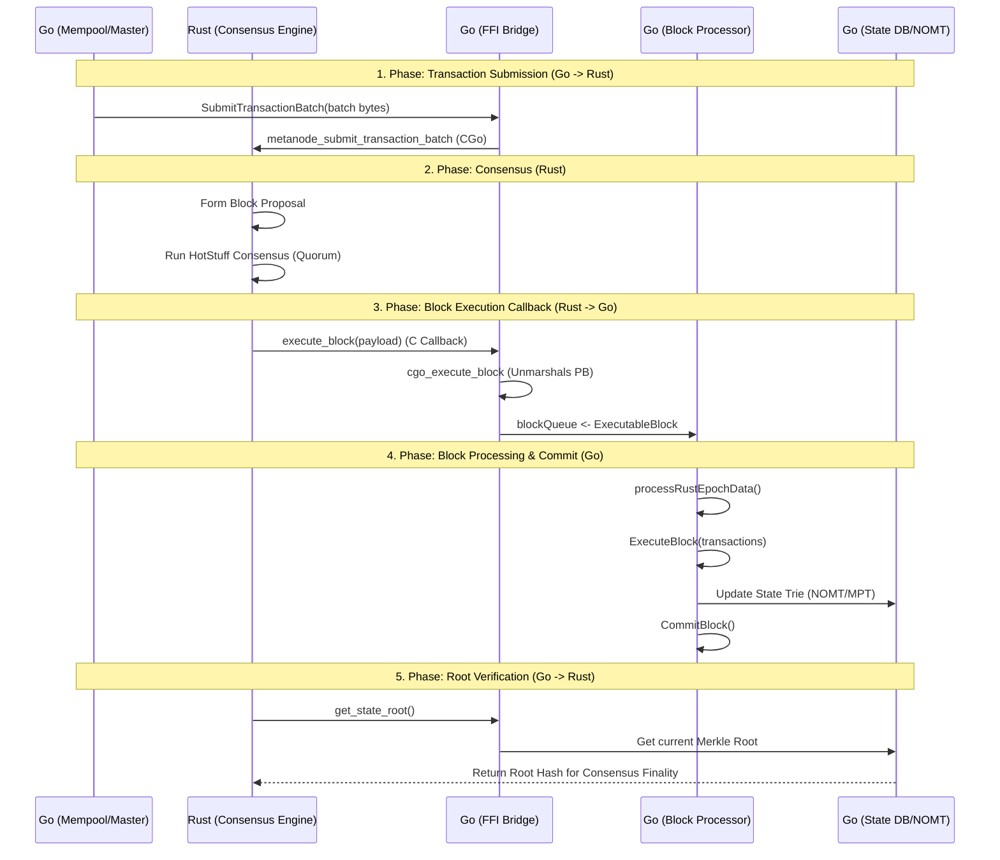

# Luồng Tạo và Xử lý Block (Go ↔ Rust)

Tài liệu này mô tả chi tiết quy trình vòng đời của một block từ khi giao dịch được gửi đi cho đến khi state được commit vào database, thông qua sự tương tác giữa Go (Executor/Master) và Rust (Consensus).

## 1. Sơ đồ Tổng quan (Mermaid)

## 2. Chi tiết các Bước

### Bước 1: Transaction Submission (Go → Rust)
*   **Thành phần:** Mempool, FFI Bridge.
*   **Hàm chính:** `SubmitTransactionBatch(batch []byte)` trong `ffi_bridge.go`.
*   **Mô tả:** Khi Go Master nhận được các giao dịch (Transactions) từ người dùng hoặc RPC, nó sẽ đóng gói thành một batch và gọi sang phía Rust thông qua hàm CGo `metanode_submit_transaction_batch`. Giao dịch lúc này được đẩy vào hàng chờ của Rust Consensus.

### Bước 2: Consensus (Rust)
*   **Thành phần:** Rust Consensus Engine (HotStuff/Narwhal).
*   **Mô tả:** Phía Rust nhận các transaction batch, tạo ra một **Block Proposal**. Sau đó, nó thực hiện giao thức đồng thuận (Consensus) với các node khác trong mạng. Khi đã đạt được đủ chữ ký (Quorum Certificate), block được coi là đã "finalized" về mặt đồng thuận nhưng chưa được thực thi.

### Bước 3: Block Execution Callback (Rust → Go)
*   **Thành phần:** FFI Bridge Callback.
*   **Hàm chính:** `cgo_execute_block` (Go), `execute_block` (Rust callback).
*   **Mô tả:** Sau khi consensus hoàn tất, Rust gọi ngược lại (callback) hàm của Go. Hàm `cgo_execute_block` sẽ thực hiện giải mã (unmarshal) dữ liệu Protobuf từ Rust thành struct `ExecutableBlock` và đẩy vào channel `blockQueue`.

### Bước 4: Block Processing & Commit (Go)
*   **Thành phần:** Block Processor, MVM, State DB.
*   **Hàm chính:** `processRustEpochData`, `ExecuteBlock`, `CommitBlock`.
*   **Mô tả:** 
    *   `processRustEpochData` lắng nghe `blockQueue` và đảm bảo các block được xử lý theo đúng thứ tự `GlobalExecIndex`.
    *   **ExecuteBlock:** Go gọi MVM (Meta Virtual Machine) để thực thi các giao dịch, tính toán thay đổi số dư và cập nhật smart contract.
    *   **CommitBlock:** Sau khi thực thi thành công, Go lưu trữ (persist) block vào database (PebbleDB/RocksDB) và cập nhật cây Merkle (NOMT hoặc MPT).

### Bước 5: Root Verification (Rust → Go)
*   **Thành phần:** FFI Bridge Query.
*   **Hàm chính:** `cgo_get_state_root`.
*   **Mô tả:** Rust có thể gọi hàm `get_state_root` thông qua FFI để lấy về Root Hash mới nhất sau khi Go đã commit block. Điều này giúp Rust đảm bảo rằng state của node Go đồng nhất với các node khác trong cluster.

## 3. Danh sách các file quan trọng

| File | Vai trò |
| :--- | :--- |
| `execution/executor/ffi_bridge.go` | Cầu nối CGo giữa Go và Rust, chứa các hàm callback và submission. |
| `execution/cmd/simple_chain/processor/block_processor_network.go` | Chứa vòng lặp `processRustEpochData` để nhận block từ channel. |
| `execution/cmd/simple_chain/processor/block_processor_processing.go` | Logic xử lý chi tiết từng block (Execute). |
| `execution/cmd/simple_chain/processor/block_processor_commit.go` | Logic commit dữ liệu vào DB và tính toán state root. |
| `execution/pkg/account_state_db/account_state_db.go` | Quản lý state của tài khoản và cây Merkle (NOMT/MPT). |

---
*Tài liệu này được tạo tự động để hỗ trợ việc tìm hiểu luồng hệ thống MetaNode.*
