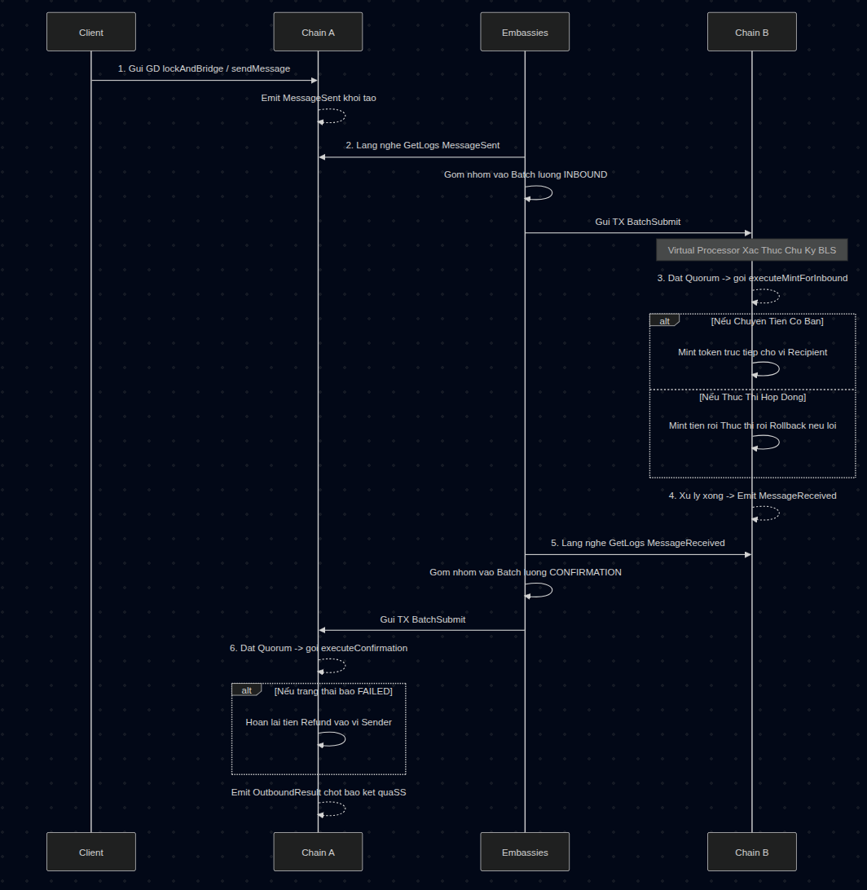
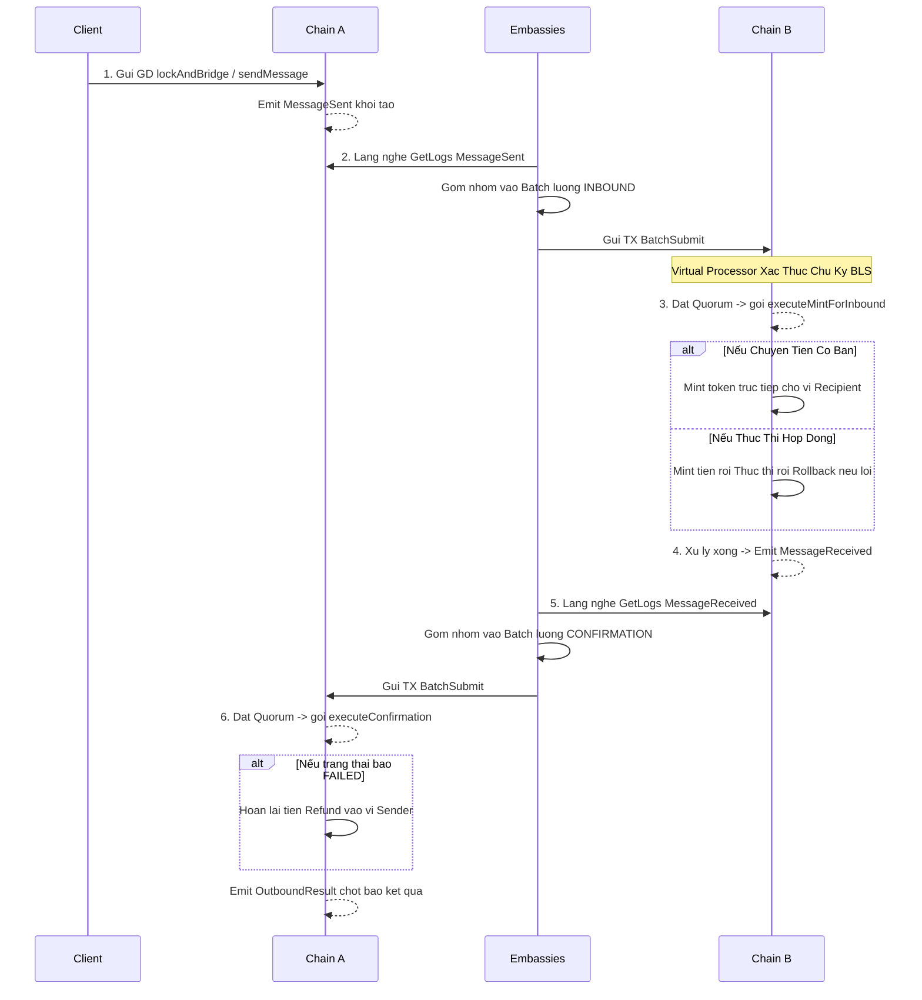

# Kiến Trúc Dòng Chảy Của Giao Dịch Chuyển Tiền Xuyên Chuỗi (Cross-Chain Transfer)

Tài liệu này mô tả chi tiết luồng hoạt động của một giao dịch chuyển đổi và xác nhận tài sản xuyên chuỗi, từ lúc được khởi tạo bởi Client cho đến khi thực thi thành công thông qua sự đồng thuận của các đại sứ quán (Embassies) trong mạng MetaNode.

> **GHI CHÚ QUAN TRỌNG:**
> Mô hình chuẩn sẽ bao gồm 2 Chain (chuỗi) giao tiếp với nhau:
>
> - **Chain A (Chuỗi Nguồn)**: Nơi Client bắt đầu gửi tiền/lệnh đi.
> - **Chain B (Chuỗi Đích)**: Nơi tiếp nhận tiền/lệnh và xử lý trả kết quả.

---

## 1. Tổng Quan Luồng Xử Lý

Xem Source code cấu trúc sơ đồ (Lưu trữ dự phòng)

---

## 2. Các Mảnh Ghép Chính Trong Hệ Thống

### 2.1. Lắng Nghe Và Phân Tích Sự Kiện Qua `scanner.go` (Observer)

- **Vai trò**: Liên tục quét (scan) các khối (blocks) trên mạng để tìm kiếm sự kiện giao dịch.
- **Quy Trình**:
  - `GetLogs()`: Crawler lấy log từ block để phân loại thành 2 tuyến sự kiện chính:
    1. **`MessageSent`** $\to$ Cấu trúc thành **INBOUND_EVENT** (Yêu cầu xử lý nhận đầu vào tại Chain B).
       - *Giải thích chi tiết*: Đây là sự kiện do Client ở **Chain A** chủ động gửi lên (thông qua hàm chuyển tiền hoặc gọi smart contract). Event này chứa thông tin gói tài sản bị đốt/khóa để yêu cầu Chain B thực hiện in tiền tương ứng.
    2. **`MessageReceived`** $\to$ Cấu trúc thành **CONFIRMATION_EVENT** (Xác nhận kết quả xử lý trả về Chain A).
       - *Giải thích chi tiết*: Đây là sự kiện do **Chain B** phát ra sau khi nó đã xử lý xong yêu cầu (với trạng thái nội tại là `SUCCESS` hay `FAILED`). Đem event này về Chain A để xác nhận chốt hạ giao dịch hoặc hoàn tiền (refund).
  - Khởi tạo Batch: Các tập sự kiện (Events) được nhồi vào một cấu trúc mảng để tránh phân tán.
  - Gửi lên chain cục bộ dưới dạng gói lệnh `batchSubmit` qua một *Wallet Pool* của Embassy. Tx này bao gồm việc ký BLS công khai xác nhận.

### 2.2. Kiểm Tra Chữ Ký Nhanh Qua `transaction_virtual_processor.go`

- **Vai Trò**: Xử lý logic sơ khởi, nhận dạng và tích lũy chữ ký đồng thuận từ nhiều Embassies một cách an toàn mà chưa làm biến đổi ngay toàn bộ trạng thái (State) của hệ thống.
- **Tiến trình `processBatchSubmitVirtual()`**:
  1. Yêu cầu **Nonce Đồng Bộ**: Nếu Transaction Nonce không khớp $\to$ Reject.
  2. Xác thực **BLS Signature**: Ký của TX có khớp với danh sách Active Embassies đã đăng ký hay không (Chỉ cần 1 operation O(1)).
  3. **Tích Luỹ Vote (Vote Accumulation)**: Tính hash của *sự kiện nguyên thủy* (`key = sha256(events_packed)`), không bao gồm chữ ký để đếm xem bao nhiêu Embassy gửi cùng 1 thông điệp.
  4. Quản lý trạng thái thực thi:
     - **Tình trạng thiếu chữ ký ($< 2/3$ hệ thống mạng)**: `updatedTx.SetReadOnly(true)`. Master node chỉ lập receipt pending, miễn phí/giảm ga và bỏ qua chuyển trạng thái.
     - **Khi đủ chữ ký ($= 2/3$ mạng)**: `updatedTx.SetReadOnly(false)`. Dry-run (Chạy giả lập) EVM để fetch danh sách các `relatedAddresses` chính xác phục vụ cho việc thực thi song song, chống xung đột biến trạng thái.

### 2.3. Trình Thực Thi Xác Lập Qua Master Node (`tx_processor.go`)

- **Vai trò**: Đại điện cho tầng lõi thực thi chính thức từ danh sách giao dịch đã "tổng duyệt" qua Validator xử lý song song.
- **Quy Trình `ProcessSingleGroup`**:
   1. Kiểm tra trạng thái cờ `tx.GetReadOnly()`.
   2. Nếu **ReadOnly == True** (Pending Vote/Tích lũy): Chạy vòng đời `ExecuteNonceOnly`. Không làm biến đổi smart_contract state của người hưởng lợi. TX vẫn được ghi nhận trong block và sinh receipt báo hiệu "Ghi nhận Vote của đại sứ quán".
   3. Nếu **ReadOnly == False** (Nút thắt Quorum hoàn tất): Bước vào pipeline `HandleTransaction` (Chuyển tiếp qua logic của Cross Chain Handler).

### 2.4. Khai Nhỏ Các Giao Dịch Vào `cross_chain_batch_submit.go`

- **Vai Trò**: Giải mã sự kiện và quyết định logic kinh tế: Phân bổ Token, Gọi hợp đồng thông minh, hoặc Refund cất trữ do lỗi.
- **Tiến Trình `handleBatchSubmit()`**:
  - Dùng ABI để unpack trực tiếp danh sách sự kiện qua `eventsLen`.
  - Phân loại 2 lệnh xử lý chi tiết theo EventKind:

    **1. Lệnh INBOUND (0) - Tiếp nhận xử lý tại Chain B:**
    Gọi hàm `executeMintForInbound()`. Đây là nơi hành động thực tiễn xảy ra với 2 kịch bản:
    - **Kịch bản Chuyển Tiền Chay (Native Transfer)**: (Xảy ra khi `Target` bị để trống cấu trúc báo hiệu). Hệ thống gọi `ProcessNativeMintBurn()` với type *MINT* để đúc chính xác lượng Native Token cho ví hưởng thụ (`Recipient`) ở Chain B.
    - **Kịch bản Thực Thi Smart Contract (Contract Call)**: Hệ thống phải ưu tiên thực thi dây chuyền an toàn (Atomic Flow).
      - *(B1)* **Pre-Mint**: Nếu Transaction đính kèm cả một lượng gói coin mang theo (`val > 0`), hệ thống sẽ trực tiếp phát hành (mint) lượng số dư này thẳng vào ví của Embassy.
      - *(B2)* **Khởi tạo ngữ cảnh**: Hệ giả lập `SetCrossChainContext` tạo môi trường ngầm để các hàm `getOriginalSender()` và `getSourceChainId()` trong Smart Contract hoạt động chính xác trả ra đúng ai thực thi nó từ Chain A.
      - *(B3)* **Thực thi Contract**: Thông qua `ExecuteTransactionWithMvmId` với Payload đóng gói sẵn.
      - *(B4)* **Rollback chống thất thoát**: Nếu quá trình B3 bị Smart Contract bật lại (Revert / Reject mã độc vv...): Hệ thống hiểu rằng pre-mint bị thừa ra, liên kết gọi ngược hàm `ProcessNativeMintBurn()` mang Type *BURN* để đốt đúng số tiền đã in ở B1. Đảm bảo triệt tiêu lạm phát.
    - Cuối cùng, TẤT CẢ các kịch bản Inbound bên trên (bất chấp thành công hay lỗi) đều **sinh ra sự kiện `MessageReceived`** phát thanh lên không gian Chain B đem theo cờ trạng thái `SUCCESS` hoặc `FAILED` cộng lí do thông báo minh bạch.

    **2. Lệnh CONFIRMATION (1) - Xác Quyết Cuối Cùng Trả Về Chain A:**
    Gọi hàm `executeConfirmation()`. Crawler (embassies) chép cờ MessageReceived từ Chain B đẩy về đây:
    - Đọc mã xác thực. Nếu cờ Inbound phản quang màu **FAILED** $\to$ Chain A gọi lại `ProcessNativeMintBurn` để Mint hoàn trả (Refund) toàn bộ số dư cho `Sender` tương ứng với số dư bị khóa lúc đi.
    - Đóng chốt ván cờ: Emit ra event chốt **`OutboundResult`**. Đây là phễu tin cậy cuối cùng mà Client cần theo dõi để gật đầu rằng số tiền của mình "đã hạ cánh ở bên kia hay được hoàn trả do sự cố". Dữ liệu ghi trọn vẹn lý lịch chuyến đi.

---

## 3. Kiến Trúc Tối Ưu Chạy Song Song (Parallel Execution) & Khả Năng Chịu Lỗi (Fault Tolerance)

### 3.1. Cơ Chế Chịu Lỗi Khi Gửi Batch (Node Fallback)
Khi Embassy thực hiện `batchSubmit`, hệ thống thiết kế cơ chế tự động cân bằng tải và chịu lỗi:
- **Định Tuyến Cố Định (Deterministic Routing)**: Node nhận giao dịch được tính toán bằng `batchId % Số_Lượng_Node`. Việc này đảm bảo cả 3 Embassy (hoặc nhiều hơn) đều gửi lệnh vote của cùng một Batch tới **duy nhất một Node**. Điều này tối ưu hóa băng thông mạng P2P, ngăn chặn tình trạng spam mạng khi các Embassy phát chung một dữ liệu lớn cho toàn cụm.
- **Tự Động Fallback**: Nếu Node đích bị lỗi (down/timeout), Embassy sẽ tự động trượt sang Node tiếp theo (`targetIndex + 1`) cho đến khi tìm được Node còn sống để tiếp nhận giao dịch. Cơ chế này đảm bảo giao dịch cross-chain không bao giờ bị nghẽn mạch kể cả khi một phần mạng lưới sụp đổ.

### 3.2. Cơ Chế Gom Nhóm Song Song (Deterministic Grouping & Related Addresses)
Để đạt được hiệu suất cao nhất (TPS), các giao dịch Cross-chain phải được chạy song song nhiều nhất có thể, nhưng tuyệt đối không được gây xung đột trạng thái (Race Condition) làm lệch StateRoot.
Hệ thống sử dụng mảng `RelatedAddresses` để điều phối:
- **Loại bỏ Bottleneck (Bỏ To Address)**: Địa chỉ của `CROSS_CHAIN_CONTRACT_ADDRESS` bị **cố tình loại bỏ** khỏi danh sách `RelatedAddresses`. Bởi vì Contract này đóng vai trò như một bộ định tuyến (Router) và không lưu trữ trạng thái cố định nào (Stateless Router). Việc bỏ địa chỉ này cho phép hàng ngàn giao dịch Cross-chain đi qua nó có thể **chạy hoàn toàn song song** mà không phải chờ đợi nhau.
- **Ép Buộc Tuần Tự Cho Các Trạng Thái Nhạy Cảm (Force Sequential)**:
  - **Ví Người Gửi (FromAddress / Sender)**: Luôn được ép thêm vào mảng `RelatedAddresses`. Việc này đảm bảo: Nếu cùng một ví Embassy gửi nhiều lệnh `batchSubmit` liên tiếp, hoặc nếu cùng một người dùng (Sender) có nhận Refund, tất cả các giao dịch này sẽ bị gom chung vào **Một Group** và chạy **Tuần Tự**. Việc này triệt tiêu hoàn toàn lỗi đụng độ biến `Nonce` và đụng độ biến `Balance`.
  - **Ví Người Nhận (Recipient) / Trạng Thái Đích (Target)**: Khi Virtual Processor quét nội dung `batchSubmit`, tuỳ theo loại sự kiện mà nó linh hoạt trích xuất và nạp vào `RelatedAddresses`:
    - **Với sự kiện INBOUND (0)**: Nếu là gọi Smart Contract, địa chỉ `Target` (Hợp đồng đích) sẽ được thêm vào. Nếu là chuyển tiền thuần, địa chỉ `Recipient` (Người nhận) sẽ được thêm vào.
    - **Với sự kiện CONFIRMATION (1)**: Địa chỉ `Sender` (Người gửi gốc ở Chain A) sẽ được nạp vào, bởi vì kịch bản Failed sẽ thực hiện hoàn tiền (Mint Refund) vào ví này.
    - *Kết quả*: Bất kỳ giao dịch nào cùng chạm vào một `Target`, `Recipient` hoặc `Sender` đều bị ép chạy tuần tự, triệt tiêu mọi khả năng đè dữ liệu (Race Condition) làm lệch StateRoot.

Nhờ thiết kế thông minh này, MetaNode giải quyết được bài toán khó nhất của Cross-Chain: **Duy trì tốc độ song song cực cao cho các luồng độc lập, nhưng vẫn đồng bộ trạng thái chính xác (Tất định) tuyệt đối.**

### 3.3. Tối Ưu Quorum Cục Bộ & Cờ `ReadOnly = True` (Tiết Kiệm State & Băng Thông)
Để một Batch được thực thi, hệ thống cần chữ ký xác nhận từ nhiều Embassy (Quorum $\ge 2/3$). Nếu các Embassy gửi loạn xạ lên tất cả các Node, mạng lưới sẽ bị spam và phải xử lý logic quorum ở khắp nơi. Hệ thống giải quyết bằng 2 bước:
1. **Gom Tụ Về Một Node (Routing by BatchId)**: Các Embassy không broadcast đi khắp mạng lưới, mà dựa vào `batchId % Số_Node` để cùng nã giao dịch vào **Đúng 1 Node duy nhất**. Node này sẽ đóng vai trò là "Nhà cái" gom chữ ký cục bộ thông qua `CCBatchVoteAccumulator`.
2. **Quyết Định Bằng Cờ ReadOnly**: Tại Node tiếp nhận này:
   - Các giao dịch bay đến đầu tiên (chưa đủ Quorum) $\to$ Bị gán `ReadOnly = true`.
   - Giao dịch vừa vặn đạt đủ ngưỡng Quorum (2/3) $\to$ Được chọn làm giao dịch chính thức gán cờ `ReadOnly = false`.
   - Các giao dịch trễ sau đó $\to$ Bị gán `ReadOnly = true`.
- **An Toàn Với Transaction Hash**: Cờ `ReadOnly` **KHÔNG** nằm trong cấu trúc `TransactionHashData`. Do đó, việc Node tự động bật/tắt cờ này hoàn toàn **không làm thay đổi Hash của giao dịch**, chữ ký BLS của Embassy vẫn hoàn toàn hợp lệ.
- **Tác Dụng Kép Của ReadOnly = true**: Giao dịch bị gán cờ này sẽ không đi qua máy ảo MVM (không đúc/đốt tiền, không chạy Smart Contract). Nó chỉ gọi `ExecuteNonceOnly` để **trừ tiền Gas** và **cộng Nonce + 1** cho ví Embassy, đồng thời sinh ra Receipt `SUCCESS`. Nhờ đó, chuỗi khối vẫn có bằng chứng (Receipt) là Embassy đó đã hoàn thành nghĩa vụ vote, nhưng tuyệt đối không bị lặp side-effect (Double Spend/Mint) lên tài sản của người dùng ở Chain B.
