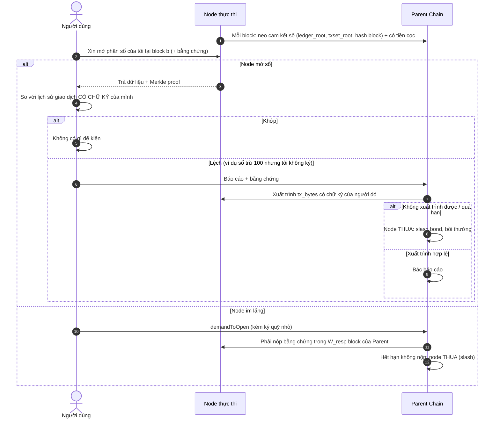

# Đánh giá tính khả thi: chứng minh gian lận của node thực thi
*(Phạm vi: Native Coin và token ERC-20 chuẩn)*

> **Cập nhật:** 2026-09-30, nhánh `dev`.
> **Trạng thái:** tài liệu đánh giá. **Chưa có dòng code nào** của cơ chế fraud proof (xem mục 7). Đặc tả chi tiết ở các tài liệu tham chiếu: [`L1_FRAUD_PROOF_DESIGN.md`](L1_FRAUD_PROOF_DESIGN.md) · [`SEQUENCER_FRAUD_PROOF_DESIGN.md`](SEQUENCER_FRAUD_PROOF_DESIGN.md) · [`SEQUENCER_ERC20_STANDARD_TX_PROOF.md`](SEQUENCER_ERC20_STANDARD_TX_PROOF.md) (đặc tả chốt A0–A4) · [`README.md`](README.md).
>
> **Nhãn mức độ chắc chắn**
> 🟢 **ĐÃ CÓ** trong code, đã đọc/kiểm tra · 🟡 **THIẾT KẾ CHỐT** (đã chốt trong đặc tả, chưa có code) · 🔵 **ĐỀ XUẤT** (ý tưởng mới, chưa vào đặc tả chốt) · ⚪ **GIẢ ĐỊNH** (chưa kiểm chứng)
>
> **Nhãn kết quả:** ✅ bắt được · ◐ bắt được một phần · ❌ không bắt được

---

## 0. Kết luận nhanh

**Khả thi CÓ ĐIỀU KIỆN. Không khả thi nếu yêu cầu bảo vệ tuyệt đối mọi người dùng trong mọi tình huống.**

### Giải thích đơn giản

Hãy coi node thực thi như một **ngân hàng tư nhân** giữ sổ cái của bạn, còn Parent Chain là **tòa án** giữ tiền cọc của ngân hàng. Tòa án không nhìn được bên trong ngân hàng, nhưng bắt ngân hàng thua khi nó:
- **trừ tiền của bạn mà không đưa ra được chữ ký của bạn** (chữ ký không giả được);
- **ký hai sổ khác nhau cho cùng một ngày** (tự mâu thuẫn);
- **im lặng khi bị hỏi** (im lặng = thua, mất tiền cọc).

Những gì tòa án **không** làm được: biết ngân hàng có giấu sổ hay không (chỉ phạt được, không đòi lại được tiền nếu cọc nhỏ hơn số bị lấy); biết ngân hàng tính đúng hay sai kết quả một hợp đồng phức tạp; bảo vệ người chẳng bao giờ kiểm tra sổ của mình. Vì vậy phần rủi ro không chứng minh được phải được **giới hạn bằng tiền cọc và trần số tiền ngân hàng được giữ**.

Node là hộp đen: nó tự chạy, tự giữ dữ liệu, Parent Chain chỉ giữ mã băm (root). Trong phạm vi hẹp (chuyển Native Coin và ERC-20 chuẩn) ta chứng minh được một số gian lận bằng những thứ node **không giả được** (chữ ký của người dùng, hai chữ ký mâu thuẫn của chính node). Phần còn lại không chứng minh được bằng dữ liệu, chỉ **giới hạn thiệt hại bằng tiền cọc**.

| Nhóm | Gian lận | Kết quả |
|---|---|---|
| **Chứng minh được** | Trừ tiền / bịa giao dịch của người dùng · Node ký hai kết quả khác nhau (equivocation) | ✅ |
| **Một phần** | Node im lặng, giấu dữ liệu (phạt được, không hoàn tiền) · Ém tiền vào của người có kiểm toán · Đánh rớt sai giao dịch hợp lệ · **In tiền khống** (chỉ bắt được nếu thêm cây tổng, mục 4.7) | ◐ |
| **Không chứng minh được** | **Node nhắm riêng vào tài khoản không kiểm toán** · **Chữ ký hợp lệ nhưng không phản ánh ý muốn** (chọn giữa các giao dịch cùng nonce, tài khoản do khóa cluster quản lý, sắp xếp thứ tự) · **Kết quả logic contract / DeFi** (node khai "mất tiền trong contract") · Token không chuẩn / tài khoản EIP-7702 · Kiểm duyệt · Tái thực thi EVM trên Parent Chain | ❌ |

### Vấn đề nằm ở đâu (vì sao có phần không khả thi)

| # | Vấn đề gốc | Vì sao | Hệ quả | Cách xử lý |
|---|---|---|---|---|
| 1 | **Zero-DA** (Parent Chain không lưu dữ liệu) | Không có dữ liệu thì không ai dựng được bằng chứng | Node giấu dữ liệu: chỉ **phạt** được node, **không hoàn tiền** nếu tiền bị chiếm > tiền cọc | Bond thật + trần cấp phát; tùy chọn ủy ban dữ liệu (DAC) |
| 2 | **Bằng chứng do chính người dùng tạo** | Không có watchtower toàn cục | Người dùng không kiểm toán / không online trong cửa sổ tranh chấp thì không được bảo vệ | Bond thật; DAC; client tự kiểm toán |
| 3 | **Phạm vi chỉ có giao dịch chuẩn** | Tác động số dư qua contract/router không đọc được từ calldata | Không chứng minh được node khai đúng hay sai kết quả contract; contract, DeFi, token không chuẩn, EIP-7702 nằm ngoài bảo vệ | Loại khỏi phạm vi; chặn trần thiệt hại bằng ủy quyền (mục 6.1); cờ cảnh báo `ns_root` |
| 4 | **Parent Chain không có EVM** | Parent Chain là dịch vụ Rust; MVM là C++ chạy Block-STM song song | Không tái thực thi giao dịch trên L1 | Không làm trong thời gian gần (cần viết lại bằng Rust hoặc dùng ZK) |
| 5 | **Chưa có bộ kiểm tra proof ở Parent Chain** | Repo có *sinh* proof NOMT, chưa có phần *kiểm tra* | Chưa dùng được proof trạng thái | Viết bộ kiểm tra Rust ở Parent Chain |
| 6 | **Chữ ký hợp lệ ≠ ý muốn của người dùng** | Chữ ký chỉ chứng minh "đã ký nội dung này", không chứng minh "muốn thực hiện lúc này, đúng một lần, đúng thứ tự" | Replay, chọn giữa các giao dịch cùng nonce, khóa cluster dùng chung, sắp xếp thứ tự: không chứng minh được hoặc chỉ một phần (mục 5.4(a)) | Lưu nonce trong sổ; chỉ bảo vệ luồng ECDSA; chấp nhận giới hạn |

### Câu hỏi thường gặp: giao dịch qua contract phức tạp thì sao?

Ví dụ: người dùng gọi một router/DeFi, node báo "bạn mất tiền trong contract" và người dùng không biết logic contract. **Không chứng minh được** node nói đúng hay sai, vì kết quả do code contract quyết định và Parent Chain không chạy được contract (mục 6.1). Cái chặn được chỉ là **trần thiệt hại**: node không thể lấy vượt quá số người dùng đã **ký** (`value` + phí) hoặc đã **approve**. Trong giới hạn đó, node có thể khai sai kết quả contract mà không bị phát hiện. Vì vậy: tài sản cần bảo vệ chỉ nên chuyển trực tiếp; đi qua contract là tin vào operator, với thiệt hại tối đa bằng số đã ký/approve.

### Giải pháp đã đủ tốt chưa?

**Chưa đủ để coi node là không đáng tin trong phạm vi rộng.** Giải pháp tốt ở lớp phát hiện gian lận rõ ràng có chữ ký (trừ tiền không chữ ký, phát lại, chia nhìn) cho người dùng ECDSA có kiểm toán. Node **vẫn gian lận được** ở: kết quả contract/DeFi, tài khoản khóa cluster, giao dịch hệ thống do chính node tạo, ví không ai kiểm toán, giữ tiền làm con tin, thứ tự giao dịch. Chi tiết từng cách và mức bảo vệ theo loại người dùng ở mục 5.7.

> ⚠️ **Chỗ dựa an toàn cuối cùng:** mọi rủi ro không chứng minh được phải được rào bằng kinh tế: **trần cấp phát của mỗi chain ≤ tiền cọc (bond)**, tức đặt `BondLeverage ≤ 1` (nếu > 1 thì có thể mất nhiều hơn bond, xem L5 ở mục 8). Cơ chế này đã có trong Gateway nhưng đang **tắt** (`BondLeverage = 0`) — xem mục 7.

---

## 1. Thuật ngữ

| Thuật ngữ | Ý nghĩa |
|---|---|
| **Node thực thi** | Máy chủ chạy chain rollup (sequencer/operator). Trong tài liệu này coi là "hộp đen" có thể gian lận |
| **Parent Chain (L1)** | Chain cha (Rust), đóng vai "tòa án": giữ root, tiền cọc, phán xử |
| **Root** | Mã băm đại diện toàn bộ trạng thái/sổ. Node nộp root lên Parent Chain |
| **Zero-DA** | Parent Chain **không lưu** dữ liệu giao dịch, chỉ lưu root |
| **Bond / Slash** | Tiền cọc của node / bị tịch thu khi gian lận |
| **Equivocation** | Node ký hai nội dung mâu thuẫn cho cùng một block |
| **`tx_bytes`** | Giao dịch nguyên bản kèm chữ ký người dùng |
| **A0–A4** | Các giả định của đặc tả chốt (số dư bắt đầu từ 0, người dùng thu đủ giao dịch, kiểm toán ở mức block, chỉ giao dịch chuẩn, chỉ token chuẩn) |
| **P7** | Quy tắc: số dư tích lũy của một người không bao giờ âm |
| **P8** | Bắt lỗi node đánh `FAILED` sai cho giao dịch chuyển tiền rõ ràng hợp lệ |
| **`txset_root`, `ns_root`** | Root tập hash giao dịch của block / cờ đánh dấu block có giao dịch không chuẩn |
| **DAC** | Ủy ban dữ liệu: nhóm validator xác nhận đã lưu dữ liệu block |
| **`nonce`** | Số thứ tự giao dịch của một tài khoản; mỗi giá trị chỉ được dùng một lần |
| **Replay (phát lại)** | Chạy lại một giao dịch đã ký; chữ ký vẫn hợp lệ nên phải chặn bằng `nonce` |
| **EOA** | Tài khoản thường (không có code), chỉ trừ tiền khi có chữ ký của chủ |
| **Allowance / `approve`** | Hạn mức chủ token cho phép một địa chỉ khác (router, contract) tiêu số token của mình |
| **Cây tổng thay đổi** | Cây Merkle cam kết tổng biến động số dư của block, dùng để bắt in/đốt tiền |
| **Forced inclusion** | Ép node ghi nhận tiền nạp từ L1 theo hàng đợi ưu tiên |
| **Cửa sổ tranh chấp / `W_resp`** | Số block của Parent Chain mà người dùng được khiếu nại / node được trả lời |

---

## 2. Bối cảnh và ràng buộc

Node được coi là **hộp đen độc hại**: Parent Chain và người dùng không phụ thuộc cách nó cài đặt, chỉ dựa vào (a) các cam kết node neo lên Parent Chain, (b) chữ ký của người dùng, (c) trạng thái trên Parent Chain.

1. **Node toàn quyền:** giữ mọi replica, dữ liệu và khóa ký. Chữ ký của node chỉ dùng làm bằng chứng *chống lại* node (equivocation), không phải bằng chứng sự thật.
2. **Không có watchtower toàn cục:** không ai giám sát thay người dùng. Người dùng tự giữ lịch sử giao dịch của mình (gồm cả giao dịch người khác gửi cho mình, do bên gửi đưa lại — giả định A1).
3. **Zero-DA:** Parent Chain chỉ lưu O(1) mỗi chain.
4. **Phán quyết xác định:** Parent Chain phán theo bằng chứng và **chiều cao block của chính nó**, không dùng đồng hồ của node (phù hợp nguyên tắc zero-fork).

---

## 3. Luồng hoạt động từ đầu đến cuối

Điểm mấu chốt: **Parent Chain không cần dữ liệu của cả chain.** Nó chỉ cần (1) cam kết đã neo, (2) người dùng chịu khiếu nại, (3) node hoặc nộp được bằng chứng có chữ ký chính chủ, hoặc thua. Vì vậy người dùng không khiếu nại thì không có phán quyết (lý do của vấn đề #2 ở mục 0).

---

## 4. Từng loại gian lận và cách xử lý

### 4.1. Trừ tiền / bịa giao dịch ✅ 🟡
- **Node làm gì:** trừ số dư của Alice, hoặc ghi một giao dịch Alice chưa từng ký.
- **Cách chứng minh:** mọi khoản trừ phải có `tx_bytes` mang chữ ký của chính Alice. Node không thể giả chữ ký. Alice so sổ node mở ra với lịch sử của mình; lệch thì báo cáo, node không xuất trình được thì thua.
- **Lưu ý về chữ ký chính chủ:** với ví ETH là ECDSA (R,S,V — 🟢 code giữ cả `R,S,V` lẫn `Sign` BLS trong giao dịch). Với tài khoản có **khóa BLS riêng** thì dùng khóa đó. **Khóa BLS của cluster dùng chung không tính**: nó chỉ chứng minh "node ký", không chứng minh người dùng cho phép (node ký BLS thay khi nhận `eth_sendRawTransaction`).
- **Điều kiện:** Alice có giữ giao dịch của mình và chạy kiểm toán (A1).

### 4.2. Equivocation ✅ 🟡
- **Node làm gì:** đưa cho người dùng hash block khác với hash đã neo lên Parent Chain.
- **Cách chứng minh:** hai chữ ký hợp lệ của cùng node cho hai hash khác nhau ở cùng chỉ số block. Không cần dữ liệu bên trong.
- **Điều kiện:** node phải ký phản hồi cho người dùng (điểm móc H8). 🟢 Gateway đã có `SlashOnEquivocation` cho `commitRoot`; phiên bản cho hash block trả người dùng cần bổ sung.

### 4.3. Node im lặng / giấu dữ liệu ◐ 🟡
- **Node làm gì:** từ chối mở sổ hoặc không nộp bằng chứng.
- **Cách xử lý:** "im lặng = thua". Sau `W_resp` block của Parent mà node không nộp thì bị slash.
- **Giới hạn thật:** đây là cơ chế **phạt**, không phải **hoàn tiền**. Không có dữ liệu thì Parent Chain không biết số dư đúng. Tiền cọc nhỏ hơn số bị chiếm thì người dùng vẫn mất phần chênh lệch (vấn đề #1).

### 4.4. Ém tiền vào của một người (P7) ◐ 🟡
- **Ý tưởng:** số dư tích lũy không được âm. Node giấu khoản Bob được nhận; khi Bob chi tiêu thành công, sổ của node cho Bob số dư âm, tức node tự mâu thuẫn.
- **Giới hạn thật:** node chỉ cần đánh giao dịch chi của Bob là `FAILED` thì số dư không âm và bẫy không kích hoạt. Khi đó chỉ P8 (mục 4.5) có thể bắt, mà P8 lại tính số dư đầu block từ sổ của chính node. Vì vậy P7 **không tự nó đủ**.
- **Cách vá cho tiền nạp từ L1:** 🔵 ép node ghi nhận tiền nạp theo hàng đợi ưu tiên trên L1 (forced inclusion). Tiền chuyển L2→L2 bị ém ở bên nhận: phải nhờ cây tổng (mục 4.7).
- **Điều kiện:** A0 (số dư bắt đầu từ 0) và A1.

### 4.5. Đánh rớt sai giao dịch hợp lệ (P8) ◐ 🟡
- **Bắt được khi:** số dư đầu block ≥ tổng chi tối đa trong block và `gas_limit ≥ G_std` mà node vẫn ghi `FAILED`.
- **Không bắt được:** mọi thất bại sai khác (cần tái thực thi). Phạm vi rất hẹp.

### 4.6. Tác động số dư ERC-20: đọc từ calldata, bỏ qua biên lai ✅ 🟡
Biên lai do node tự sinh nên không tin. Với **token chuẩn** (A4: không phí chuyển, không rebasing, không hook) và **giao dịch chuẩn** (A3: gọi trực tiếp `transfer`, `transferFrom`, `approve`, `value = 0`), tác động số dư suy ra từ **calldata đã ký + trạng thái thành công**, không cần đọc log. Giao dịch qua router/contract không thuộc phạm vi (mục 6).

### 4.7. In tiền / đốt tiền khống ◐ 🔵
- **Node làm gì:** tự cộng số dư cho chính nó (hoặc đốt tiền).
- **Vì sao P7 không bắt được:** tiền khống chuyển cho Bob chỉ làm số dư Bob tăng, không tạo số dư âm.
- **Cách bắt (đề xuất):** mỗi block cam kết một **cây tổng thay đổi** (chỉ gồm tài khoản bị chạm). Bất biến: `tổng thay đổi số dư của block = tiền nạp từ L1 − tiền rút về L1` (± phần thưởng/phí phát hành đã biết). Một nút Merkle sai tổng là bằng chứng gian lận (kiểm tra được ở một bước).
- **Điều kiện:** phải đo hiệu năng — băm state hiện đã ~120–240 ms cho block ~11k tx. Chưa nằm trong đặc tả chốt, cần chủ dự án quyết.

### 4.8. Giới hạn kinh tế: bond và trần cấp phát 🟢 (đang tắt)
Trong Gateway: `PerChainAllocation ≤ BondLeverage × SecurityBond`. Nếu bật với bond đủ lớn, mọi thiệt hại chưa chứng minh được bị chặn ở mức tiền cọc. **Cảnh báo khi bật:** các chain đã đăng ký từ trước có bond bằng 0; bật `BondLeverage` trước khi họ đặt bond sẽ chặn mọi tăng cấp phát của họ. Chỉ bật sau khi các chain thật đã `PostSecurityBond`.

### 4.9. Các cam kết node phải neo và L1 kiểm tra gì

| Cam kết (node neo mỗi block hoặc mỗi lô) | Nội dung | Bằng chứng gian lận dùng nó | Trạng thái |
|---|---|---|---|
| `ledger_root` | Cây Merkle-sum-min theo `(tài sản, holder)`: biến động số dư từng block | F1, F5, F6 | 🟡 |
| `txset_root` | Tập hash giao dịch của block kèm `status` | F1, F3, F4, F5 | 🟡 |
| Hash block (MMR) | Chuỗi hash block để chống viết lại lịch sử | F7 | 🟡 |
| `ns_root` | Cờ đánh dấu block có giao dịch không chuẩn | F9 | 🟡 |
| Cây tổng thay đổi | Tổng biến động số dư toàn block | F2 | 🔵 |
| Nhật ký cấp giao dịch | `(người gửi, nonce, người nhận, số tiền)` cho từng giao dịch chuẩn | F3, F4 | 🔵 |
| Chứng nhận dữ liệu (DAC) | Chữ ký BLS ≥2f+1 validator Parent xác nhận đã lưu dữ liệu block | Mọi bằng chứng (đảm bảo có dữ liệu) | 🔵 (tùy chọn) |

Parent Chain lưu: MMR các anchor, tiền cọc, và trạng thái các tranh chấp đang mở. Không lưu dữ liệu giao dịch (Zero-DA).

### 4.10. Các loại bằng chứng gian lận: nộp gì và L1 kiểm gì

| Mã | Bằng chứng | Dữ liệu nộp | L1 kiểm tra | Trạng thái |
|---|---|---|---|---|
| F1 | Trừ tiền không chữ ký | Lá `ledger_root` của holder cho block b + Merkle proof; yêu cầu node xuất trình `tx_bytes` | Node không xuất trình được giao dịch có chữ ký hợp lệ (ECDSA/BLS của chính chủ) bao phủ khoản trừ, hoặc số trừ vượt số đã ký; giao dịch hệ thống phải thuộc danh sách có bất biến riêng (L10) | 🟡 |
| F2 | Vi phạm bảo toàn nguồn cung | Một nút cây tổng có `tổng ≠ trái + phải`, hoặc tổng gốc ≠ nạp − rút của L1 | Một phép băm và cộng | 🔵 |
| F3 | Phát lại / nonce trùng | Hai lá nhật ký cùng `(người gửi, nonce)` hoặc nonce không tuần tự + proof | So sánh hai giá trị | 🔵 |
| F4 | Chuyển hướng khoản nhận | `tx_bytes` (Alice→Bob, số tiền) + proof lá nhật ký cho thấy người nhận khác | Giải mã calldata, so người nhận và số tiền | 🔵 |
| F5 | Đánh rớt sai (P8) | Số dư đầu block của holder + `tx_bytes` + `status = FAILED` | `S_start ≥ Out_b` và `gas_limit ≥ G_std` | 🟡 |
| F6 | Số dư tích lũy âm (P7) | Đường Merkle-sum-min cho thấy `minPrefix < 0` | Kiểm tra tính nhất quán của các nút | 🟡 |
| F7 | Equivocation | Hai chữ ký của node cho cùng chỉ số block với hash khác nhau | Xác thực hai chữ ký, so hash | 🟡 |
| F8 | Node im lặng | Yêu cầu mở dữ liệu (`demandToOpen`) + hạn `W_resp` | Hết hạn mà chưa có bằng chứng ⇒ node thua | 🟡 |
| F9 | Lạm dụng cờ `ns_root` | Yêu cầu `challengeNonstandard` | Node phải xuất trình một giao dịch thật có chữ ký của người thách thức trong block đó; không có ⇒ phạt | 🟡 |

### 4.11. Bất biến kiểm được với mọi cách thực thi 🔵

Vì node là hộp đen, nên ưu tiên các bất biến **đúng bất kể node chạy gì** và kiểm được bởi bất kỳ ai có dữ liệu:

| Bất biến | Nội dung | Ngoại lệ |
|---|---|---|
| I1 | Số dư một EOA chỉ giảm nhiều nhất bằng tổng (`value` + phí tối đa) của các giao dịch do chính nó ký | Tài khoản EIP-7702, tài khoản contract, và giao dịch hệ thống do node tạo (L10) |
| I2 | Tổng thay đổi số dư của block = nạp L1 − rút L1 (± phần thưởng/phí phát hành đã biết) | — |
| I3 | Giao dịch cấp cao nhất gửi `value` tới EOA mà thành công thì bên nhận được cộng đúng `value` | — |
| I4 | `nonce` tăng tuần tự, không lặp | — |
| I5 | Chuyển EOA→EOA với số dư đủ (value + phí) và gas tối thiểu thì phải thành công | Địa chỉ miễn phí và quirk phí cần khớp ngữ nghĩa Metanode |

Với ERC-20 chuẩn: khoản trừ số dư chỉ hợp lệ khi là `transfer` do chính chủ ký hoặc trong hạn mức `approve` đã ký. I1–I5 chặn được trần thiệt hại cho cả các luồng đi qua contract (mục 6.1), nhưng **không** chứng minh được kết quả logic contract.

---

## 5. Phân tích sâu: node có thể gian lận thế nào và vì sao một số không chứng minh được

### 5.1. Node kiểm soát những gì

| Năng lực | Ví dụ |
|---|---|
| Thứ tự và việc đưa giao dịch vào block | Nhận, bỏ qua, sắp xếp lại |
| Kết quả thực thi | Số dư, trạng thái, `status` của từng giao dịch |
| Dữ liệu và cách phục vụ | Ai được xem gì, khi nào |
| Khóa ký | Khóa BLS cluster dùng chung, khóa neo root |
| Phản hồi RPC | Số dư và biên lai mà người dùng nhìn thấy |
| Thời điểm | Khi nào neo root, khi nào trả lời khiếu nại |
| Đường ra L1 | Rút tiền, rút tiền cọc |

### 5.2. Danh mục tấn công, sắp xếp từ dễ đến khó chứng minh

Mã `T` càng lớn càng khó chứng minh. Ba nhóm: **A** chứng minh được (✅), **B** chứng minh được một phần hoặc chỉ phạt/chặn bằng thiết kế thêm (◐), **C** không chứng minh được (❌).

**Nhóm A — Chứng minh được ✅**

| Mã | Tấn công | Node giả mạo dữ liệu nào và cách làm | Bằng chứng còn lại | Điều kiện |
|---|---|---|---|---|
| T1 | Trừ tiền không chữ ký | Ghi vào sổ/state một khoản trừ cho Alice; thêm giao dịch bịa hoặc không ghi giao dịch nào | Node phải xuất trình `tx_bytes` có chữ ký của Alice; không có ⇒ F1 | Chỉ luồng ECDSA (`R,S,V`); Alice hoặc người kiểm toán đối chiếu sổ với giao dịch đã ký |
| T2 | Chia nhìn / viết lại lịch sử | Đưa hai hash block hoặc state root khác nhau cho hai nhóm; sửa block đã trả | Hai chữ ký của node cho cùng chỉ số block ⇒ F7 | Node phải ký phản hồi (H8); người dùng giữ phản hồi đã ký |

**Nhóm B — Một phần ◐** (sắp theo mức gần với chứng minh được)

| Mã | Tấn công | Node giả mạo dữ liệu nào và cách làm | Bằng chứng còn lại / cách bắt | Giới hạn |
|---|---|---|---|---|
| T3 | Phát lại giao dịch đã ký | Chèn lại **đúng các byte** của một giao dịch cũ vào block mới; chữ ký vẫn hợp lệ | Hai lá cùng `(người gửi, nonce)` ⇒ F3 | Sổ hiện chỉ ghi biến động số dư nên không thấy; cần nhật ký nonce 🔵 (L8) |
| T4 | In / đốt tiền | Cộng số dư cho ví node hoặc giảm số dư người khác không có nguồn; sửa tổng cung | Nút cây tổng sai tổng, hoặc tổng ≠ nạp − rút ⇒ F2 | Cần cây tổng 🔵 (4.7); P7 không bắt |
| T5 | Chuyển hướng khoản nhận | Trừ Alice đúng nhưng ghi khoản nhận vào ví khác (của node) thay vì Bob | `tx_bytes` có `to = Bob` so với người nhận trong nhật ký ⇒ F4 | Tổng vẫn bảo toàn nên cây tổng không thấy; cần nhật ký cấp giao dịch 🔵; Alice hoặc Bob phải đối chiếu |
| T6 | Ém khoản nhận / đánh `FAILED` | Bỏ khoản Bob được nhận khỏi sổ; hoặc đánh giao dịch chi hợp lệ của Bob là `FAILED` để không lộ số dư âm | P7 (F6) chỉ bắt khi chi thành công; P8 (F5) chỉ bắt trường hợp rõ | Phụ thuộc A0/A1; phạm vi hẹp (4.4, 4.5) |
| T7 | Trộm rồi rút ra L1 và bỏ chạy | Sau khi lấy tiền trong L2, rút tài sản thật khỏi L1 và rút bond trước khi tranh chấp xong | Không phải bằng chứng dữ liệu mà là ràng buộc L1: trễ rút + đóng băng khi có tranh chấp + mở khóa bond sau cùng | Cần thiết kế L1 (L9) |
| T8 | Giấu dữ liệu chọn lọc | Trả dữ liệu cho mọi người trừ nạn nhân; hoặc trả cắt xén, trả chậm | F8: yêu cầu mở dữ liệu + hạn `W_resp`, chỉ **phạt** | Không chứng minh được sự vắng mặt; không hoàn tiền nếu tiền cọc thiếu |

**Nhóm C — Không chứng minh được ❌** (sắp theo mức khó, dễ giảm thiểu đứng trước)

| Mã | Tấn công | Node giả mạo dữ liệu nào và cách làm | Vì sao không chứng minh được | Cách giảm thiểu |
|---|---|---|---|---|
| T9 | Tài khoản do khóa cluster quản lý | Node tự tạo giao dịch bằng khóa BLS cluster cho bất kỳ tài khoản nào nó quản | L1 không phân biệt "người dùng yêu cầu" với "node tự làm" | Chỉ bảo vệ luồng ECDSA; nói rõ tài khoản còn lại không được bảo vệ (L3) |
| T10 | Chọn giữa các giao dịch cùng `nonce` đã ký | Người dùng ký hai giao dịch cùng nonce (gốc và bản "hủy"); node chạy bản gốc | Cả hai đều có chữ ký hợp lệ của chủ | Giao dịch có hạn dùng hoặc ví ký xác nhận (đổi định dạng, mất tương thích ví ETH chuẩn) |
| T11 | Kiểm duyệt chọn lọc | Không đưa giao dịch của một người vào block, hoặc trì hoãn vô hạn | Thứ không được đưa vào không để lại dấu vết | Forced inclusion, chỉ cho tiền nạp từ L1 |
| T12 | Sắp xếp / chạy trước | Chọn thứ tự có lợi, ví dụ chạy trước giao dịch đổi `approve` để tiêu cả hạn mức cũ lẫn mới | Mọi thứ tự đều hợp lệ; không có luật thứ tự làm chuẩn | Luật thứ tự chuẩn (ví dụ theo `nonce`/hash) làm node mất một phần quyền sắp xếp |
| T13 | Khai sai kết quả contract | Khai số nhận lại hoặc log sai trong biên độ đã ủy quyền | Cần tái thực thi contract (mục 6.1) | Chặn trần bằng ủy quyền; tài sản cần bảo vệ chỉ chuyển trực tiếp |
| T14 | Chỉ nhắm vào tài khoản không kiểm toán | Chọn ví ngủ đông; dùng T1/T3/T5 chỉ với ví không ai kiểm; giữ dữ liệu giả nhất quán cho ví đó | Bằng chứng do chính chủ tạo; hết cửa sổ thì root cuối cùng | Chỉ chặn trần kinh tế; hoặc auditor toàn cục có dữ liệu (5.3.4, 5.4(d)) |

### 5.3. Node làm giả dữ liệu như thế nào

#### 5.3.1. Những gì node **không** kiểm soát (nguồn độc lập)
1. **Khóa và giao dịch đã ký** của chính người dùng, cùng các phản hồi có chữ ký của node mà người dùng đã giữ.
2. **Cam kết đã neo trên Parent Chain** (`ledger_root`, `txset_root`, hash block): đã neo thì không sửa được.
3. **Tiền nạp/rút và số dư escrow trên L1.**
4. **Chữ ký và dữ liệu do người dùng khác giữ.**

Mọi thứ còn lại (phản hồi RPC, biên lai, trạng thái, danh sách giao dịch, thứ tự, dữ liệu phục vụ, thời điểm) do node quyết định, nên **không được coi là bằng chứng**.

#### 5.3.2. Node có thể làm giả gì, theo từng loại dữ liệu

| Loại dữ liệu | Cách node làm giả | Người dùng nhìn thấy gì | Dấu vết còn lại | Bắt được? |
|---|---|---|---|---|
| **Phản hồi RPC** (số dư, nonce, biên lai, `status`, log) | Trả số dư sai nhưng tự nhất quán; báo `success` khi thực tế `FAILED` hoặc ngược lại; bịa/xóa event log | Số liệu trông hợp lý, khớp nhau | Không có, trừ khi phản hồi được node ký (H8) | Chỉ khi đối chiếu với nguồn độc lập (T2) |
| **Danh sách giao dịch của block** | Thêm giao dịch (bịa hoặc lặp lại), bớt giao dịch (kiểm duyệt), sắp xếp lại | Giao dịch của mình "biến mất" hoặc thứ tự khác | `txset_root` đã neo | Bịa không chữ ký: T1 ✅; lặp: T3 ◐; bớt hoặc đổi thứ tự: ❌ (T11, T12) |
| **Kết quả thực thi** (`status`, số dư sau giao dịch) | Đảo `status`; tính sai số tiền; cộng sai người nhận | Biên lai sai so với ý định | Calldata + `status` của giao dịch chuẩn suy ra tác động đúng | Giao dịch chuẩn: T5, T6 ◐; contract: T13 ❌ |
| **Sổ `ledger_root`** (biến động theo holder) | Bớt/thêm biến động; giả tổng | Sổ mở ra cho holder không khớp lịch sử mình giữ | Sổ đã neo, so với giao dịch ký của chủ | T1 ✅; ém tiền vào: T6 ◐; in tiền: T4 ◐ |
| **State thật (NOMT) so với sổ** | Giữ hai bản khác nhau: sổ cam kết cho kiểm toán, state cho RPC/contract | Số dư trong DApp khác với số dư trong sổ | **Không có**, nếu L1 không quy định sổ hay state là chuẩn | Không bắt được cho đến khi chốt L1 (L1 ở mục 8) |
| **Hash block và root** | Đưa hash khác nhau cho hai nhóm; sửa block đã trả | Mỗi nhóm thấy một lịch sử | Hai chữ ký node cho cùng chỉ số block | T2 ✅ (nếu người dùng giữ phản hồi đã ký) |
| **Dữ liệu phục vụ** (proof, sổ riêng) | Từ chối, trả chậm, cắt xén, chỉ giấu với nạn nhân | Không nhận được gì hoặc bị chậm | Yêu cầu có nêu block và hash | T8 ◐ (chỉ phạt) |
| **Xác nhận nạp/rút với L1** | Không ghi nhận tiền nạp; trì hoãn rút; rút hai lần | Tiền nạp "không đến" | L1 tự biết mọi khoản nạp/rút | Nạp: forced inclusion; rút hai lần: đối soát escrow |
| **Chữ ký của node** | Ký hai bản mâu thuẫn; dùng khóa cluster dùng chung để ký thay tài khoản | Chữ ký "hợp lệ" nhưng không phản ánh ý chủ | Hai chữ ký mâu thuẫn là bằng chứng chống node | Ký mâu thuẫn: T2 ✅; ký thay: T9 ❌ |
| **Thời điểm** | Neo root muộn/sớm; trả lời khiếu nại phút chót; trì hoãn phản hồi | Cửa sổ tranh chấp bị co lại | Chiều cao block của Parent | Không phải gian lận về dữ liệu; phải tính vào thiết kế cửa sổ (L9) |

#### 5.3.3. Hai thế giới nhất quán (split-view)

Node dựng hai thế giới, cả hai đều nhất quán nội bộ:
- **Thế giới A:** cái đã neo lên Parent Chain (chứa khoản trừ trái phép).
- **Thế giới B:** cái đưa cho nạn nhân qua RPC (không có khoản trừ; số dư cũ, biên lai cũ, log cũ).

Nạn nhân chỉ thấy B nên mọi thứ hợp lý. Chỉ phát hiện được bằng nguồn độc lập: (i) một **phản hồi có chữ ký của node** cho block/state root ở chiều cao h mà nạn nhân giữ, đem so với root đã neo ⇒ hai chữ ký mâu thuẫn (T2); (ii) đối chiếu sổ với giao dịch mình đã ký ⇒ T1. Nếu RPC không ký thì node chỉ việc **chối**. Vì vậy các phản hồi quan trọng phải được ký và chứa `(chiều cao, root)`.

#### 5.3.4. Kịch bản nhiều bước: trộm ví ngủ đông với dữ liệu giả nhất quán

| Bước | Node làm | Dấu vết / điểm có thể phát hiện |
|---|---|---|
| 1 | Chọn Carol: ví có 1.000.000, không hoạt động một năm (T14) | Không có |
| 2 | Ghi khoản trừ 1.000.000 từ Carol chuyển sang ví node, **không có chữ ký của Carol** | Có trong sổ và `txset_root`; **không** làm sai cây tổng vì tổng bảo toàn (chuyển từ Carol sang node) |
| 3 | Giữ thế giới B cho Carol: nếu Carol hỏi RPC thì trả số dư cũ | Chỉ lộ nếu phản hồi có chữ ký và Carol giữ lại (T2) |
| 4 | Neo `ledger_root` của thế giới A lên L1 | Đã neo, không sửa được |
| 5 | Rút tài sản thật qua bridge bằng ví node (T7) | Bị chặn nếu có trễ rút và đóng băng khi tranh chấp |
| 6 | Chờ hết cửa sổ tranh chấp | Sau đó root là cuối cùng |

Điểm rút ra: **trộm dạng chuyển tiền (bảo toàn tổng) không bị cây tổng bắt.** Chỉ có kiểm tra chữ ký (F1) bắt được, và F1 kiểm được bởi **bất kỳ ai có dữ liệu**, không chỉ nạn nhân: một auditor toàn cục duyệt mọi khoản trừ có giao dịch ký tương ứng thì bắt được bước 2 mà không cần Carol. Điều này phụ thuộc dữ liệu có sẵn (DAC), tức là gắn với vấn đề #1 ở mục 0.

### 5.4. Đào sâu các tấn công không chứng minh được (theo thứ tự từ dễ đến khó)

**(a) Chữ ký hợp lệ nhưng không phản ánh ý muốn (T3, T9, T10, T12).**
- Chữ ký chỉ chứng minh "chủ đã ký nội dung này", không chứng minh "muốn thực hiện lúc này, đúng một lần, đúng thứ tự".
- Replay (T3) sửa được bằng cách lưu `nonce` trong sổ. Khóa cluster dùng chung (T9): phải chọn hoặc chỉ bảo vệ luồng ECDSA, hoặc ép người dùng dùng khóa riêng.
- Thay thế/hủy (T10) không sửa được nếu node giữ cả hai giao dịch: giao dịch Ethereum không có hạn dùng. Chỉ giảm bằng cách người dùng không để lộ giao dịch đã hủy, hoặc đổi định dạng giao dịch (phá tương thích ví ETH).
- Thứ tự (T12): không có luật thứ tự thì không có gian lận nào được định nghĩa để chứng minh.

**(b) Giấu dữ liệu, kiểm duyệt và rút tiền (T7, T8, T11).**
- Không tồn tại "chứng minh sự vắng mặt". "Im lặng = thua" biến vấn đề chứng minh thành vấn đề **phạt**, không hoàn tiền. Kiểm duyệt (T11) cũng không để lại dấu vết; riêng tiền nạp L1 thì ép được bằng forced inclusion.
- Kịch bản trộm rồi chạy (T7) cần ba ràng buộc thời gian trên L1: (i) trễ rút ≥ cửa sổ tranh chấp + thời hạn phản hồi; (ii) tranh chấp đang mở thì đóng băng các khoản rút liên quan; (iii) thời gian mở khóa bond dài hơn (i). Gateway hiện tính `UnbondingPeriodSeconds` theo giây, trong khi nguyên tắc zero-fork dùng chiều cao block; cần thống nhất.

**(c) Ngữ nghĩa contract (T13).** Node chỉ cần khai sai kết quả trong biên độ đã ủy quyền (mục 6.1). Approve vô hạn làm biên độ đó không giới hạn.

**(d) Nhắm vào người không kiểm toán (T14): thiết kế giới hạn thiệt hại nhưng không ngăn được.**
- Bằng chứng do chính chủ tài khoản tạo ra, và hết cửa sổ tranh chấp thì root là cuối cùng. Node biết ví nào không hoạt động và không chạy client, nên chọn đúng nhóm đó.
- Xác suất bị phát hiện `p` xấp xỉ 0 với nhóm đã chọn. Lợi nhuận kỳ vọng ≈ `V·(1−p) − p·bond`, dương khi `V > 0` và `p` nhỏ. Tiền cọc chỉ bị phạt khi bị phát hiện, nên **không ngăn được** tấn công có chọn lọc.
- Cái tiền cọc và trần cấp phát làm được là **giới hạn tổng thiệt hại**, không phải ngăn chặn. Muốn ngăn: cần người giám sát bắt buộc (DAC cùng auditor toàn cục có thưởng), hoặc ưu tiên các bất biến **kiểm được bởi bất kỳ ai có dữ liệu** (cây tổng, nonce/replay, mọi khoản trừ có chữ ký) thay vì kiểm toán theo từng người.

### 5.5. Cần thêm điều gì để chúng chứng minh được

| Nhóm | Cơ chế / giả định thêm | Đổi lại |
|---|---|---|
| Nhắm người không kiểm toán | Watcher bắt buộc hoặc DAC có thưởng; ưu tiên bất biến kiểm được bởi bất kỳ ai | Tin đa số ủy ban trung thực; chi phí vận hành |
| Replay | Lưu `(người gửi, nonce)` trong sổ | Thêm dữ liệu sổ mỗi block |
| Thay thế / hủy | Giao dịch có hạn dùng hoặc ví ký xác nhận | Đổi định dạng giao dịch, mất tương thích ví ETH chuẩn |
| Khóa cluster dùng chung | Chỉ bảo vệ luồng ECDSA | Thu hẹp phạm vi bảo vệ |
| Chuyển hướng khoản nhận | Sổ cấp giao dịch `(người gửi, người nhận, số tiền)` | Dữ liệu mỗi block lớn hơn (L4) |
| Kiểm duyệt / thứ tự | Forced inclusion và luật thứ tự (ví dụ theo `nonce`/hash) | Node mất một phần quyền sắp xếp |
| Kết quả contract | Ủy ban tái thực thi hoặc nhiều operator độc lập | Thêm bên tin cậy |
| Trộm rồi chạy | Trễ rút + đóng băng khi tranh chấp + mở khóa bond sau cùng | Rút tiền chậm hơn |

### 5.6. Ví dụ minh họa (số liệu chỉ để minh họa)

**Ví dụ 1 — Replay.** Alice ký giao dịch `nonce = 5` chuyển 100 cho Bob; nó chạy ở block 10. Ở block 20 node chạy lại **đúng các byte đó**. Chữ ký hợp lệ nên trông như Alice ký thêm khoản 100. Nếu sổ chỉ ghi biến động số dư, không ai thấy hai khoản khác nhau; nếu sổ lưu `(Alice, 5)` thì hai lá trùng nhau và F3 bắt được.

**Ví dụ 2 — Chuyển hướng khoản nhận.** Alice gửi Bob 100. Node ghi: Alice −100, ví node +100 (Bob +0). Tổng block vẫn bằng 0 nên cây tổng không báo lỗi. Bob không biết Alice đã gửi. Alice nhìn thấy giao dịch của mình `success` trong `txset_root` nhưng chỉ phát hiện sai nếu sổ có nhật ký cấp giao dịch để so người nhận với calldata (F4). Nếu Alice không kiểm tra thì không ai biết.

**Ví dụ 3 — Ví ngủ đông.** Ví của Carol có 1.000.000 và không hoạt động một năm. Node rút dần từng phần nhỏ (ghi giao dịch không có chữ ký của Carol). Carol quay lại sau khi cửa sổ tranh chấp đã đóng: root đã là cuối cùng, F1 quá hạn. Thiệt hại chỉ bị chặn bởi trần cấp phát của chain, không phải bởi bằng chứng.

**Ví dụ 4 — Trộm rồi chạy.** Node in 5.000.000 cho ví của nó, quy đổi thành tài sản thật và rút qua bridge trong khi cửa sổ 7 ngày còn mở. Nếu rút tức thì thì tiền đã thoát trước khi F2 kịp chứng minh. Nếu rút có trễ ≥ cửa sổ và tranh chấp mở thì đóng băng, khoản rút bị chặn và bond bị phạt.

### 5.7. Rủi ro còn lại: node vẫn gian lận được gì sau khi áp dụng toàn bộ giải pháp

Giả sử mọi đề xuất đã triển khai đủ: F1–F9, cây tổng, nhật ký cấp giao dịch, forced inclusion, trễ rút và đóng băng khi có tranh chấp, `BondLeverage ≤ 1`, chỉ bảo vệ luồng ECDSA, DAC. Phần dưới là những gì node **vẫn làm được**.

#### 5.7.1. Danh sách rủi ro còn lại

| Mã | Node làm gì (từng bước) | Vì sao giải pháp không bắt | Thiệt hại tối đa | Cách giảm |
|---|---|---|---|---|
| R1 | **Khai sai kết quả contract trong biên độ ủy quyền.** Người dùng approve cho router 1.000 token để swap. Node khai swap chỉ trả lại 1 token, phần còn lại "nằm trong contract" | Kết quả do logic contract quyết định; không tái thực thi được | Tổng `value` đã ký hoặc số đã `approve` | Approve đúng số, không vô hạn; tái thực thi bằng ủy ban (6.1) |
| R2 | **Rút cạn tài sản đang nằm trong contract/pool.** Node sửa state của contract để chuyển token trong pool cho ví node | Giao dịch qua contract bị đánh cờ `ns_root` chứ không được kiểm toán; state do node kiểm soát | Toàn bộ giá trị khóa trong contract | Không đưa tài sản cần bảo vệ vào contract; tái thực thi |
| R3 | **Tài khoản ngoài luồng ECDSA.** Node tự tạo giao dịch bằng khóa cluster cho tài khoản do nó quản | Không tồn tại chữ ký riêng của người dùng | Toàn bộ số dư các tài khoản đó | Chỉ bảo vệ ECDSA, hoặc ép dùng khóa riêng (L3) |
| R4 | **Giao dịch hệ thống do chính node tạo.** Node gắn nhãn khoản lấy tiền là "thưởng leader", "hoàn/ghi có Gateway" hay "sự kiện hệ thống" | Các đường này **hợp lệ mà không cần chữ ký người nhận** (thưởng leader `RewardBlockLeader` cộng phí vào leader; Gateway ghi có/hoàn bằng `AddBalance`; giao dịch `RollupSystemAddress`). F1 phải có luật cho phép chúng, và mỗi luật cho phép là một lỗ | Không giới hạn nếu luật quá rộng; nếu chặt thì bị chặn bởi sự kiện L1 tương ứng | Mỗi loại giao dịch hệ thống phải có bất biến hẹp: ghi có Gateway ≤ khoản đã được chứng thực; thưởng ≤ tổng phí đã ký (L10) |
| R5 | **Trộm ví ngủ đông khi thiếu auditor toàn cục.** Xem 5.3.4 | Bằng chứng do chủ tạo; hết cửa sổ thì cuối cùng | Theo trần cấp phát | DAC + auditor toàn cục có thưởng |
| R6 | **Bắt con tin.** Node từ chối xử lý yêu cầu rút; người dùng đòi thoát cưỡng chế trên L1; node im lặng nên bị phạt bond, nhưng tiền người dùng vẫn nằm trong escrow. Node chấp nhận mất bond để giữ con tin và đòi tiền chuộc | Phạt bond không trả lại số dư bị khóa (L6) | Toàn bộ số dư bị chặn | Cơ chế thoát dựa trên sổ trả trực tiếp từ escrow (L6) |
| R7 | **Giữ giao dịch đã ký và thực thi muộn hoặc theo thứ tự có lợi.** Ví dụ chạy trước giao dịch đổi `approve` để tiêu cả hạn mức cũ lẫn mới | Giao dịch Ethereum không có hạn dùng; mọi thứ tự đều hợp lệ | Có thể gấp đôi hạn mức trong cuộc đua `approve`; các trường hợp khác tùy ngữ cảnh | Luật thứ tự, giao dịch có hạn dùng (đổi định dạng) |
| R8 | **Chọn giữa các giao dịch cùng nonce.** Người dùng ký chuyển 100 rồi ký bản hủy; node chạy bản chuyển | Cả hai đều có chữ ký hợp lệ | Số tiền của giao dịch bị hủy | Hạn dùng hoặc ví ký xác nhận |
| R9 | **Thu phí tối đa cho giao dịch contract.** Gas thực dùng do node khai, luôn tính đến mức phí tối đa đã ký | Phí thực dùng của contract không kiểm được | Tổng (phí tối đa − phí thực dùng), nhỏ nhưng có hệ thống | Gas xác định cho lệnh chuẩn (kiểm được); contract thì không |
| R10 | **Lợi dụng lệch giữa bộ kiểm tra L1 và thực thi thật.** Giấu khoản trộm trong quirk phí: địa chỉ miễn phí, giao dịch nonce 0 miễn phí, phí tạo tài khoản mới, thưởng leader | Bộ kiểm tra chỉ tin phần nó mô hình hóa | Tùy quirk | Bộ kiểm thử tương thích và fuzz giữa executor và bộ kiểm tra; mỗi quirk có bất biến riêng |
| R11 | **Cấu kết với ủy ban dữ liệu.** Node mua chuộc đa số DAC để xác nhận dữ liệu giả hoặc không lưu | DAC giả định đa số trung thực | Quay về R5 và giấu dữ liệu | Chọn ủy ban độc lập với node, có stake |
| R12 | **Dàn xếp và gây nhiễu khiếu nại.** Trả tiền để nạn nhân rút khiếu nại; hoặc spam khiếu nại để câu giờ | Khiếu nại ký quỹ nhỏ có thể bị dùng làm công cụ | Chậm trễ vận hành, nạn nhân nhận ít hơn | Ký quỹ khiếu nại đủ lớn; khiếu nại đã mở không rút được |

#### 5.7.2. Mức bảo vệ theo loại người dùng và tài sản

| Đối tượng | Được bảo vệ khỏi | Vẫn bị | Mức |
|---|---|---|---|
| Người dùng ECDSA, chỉ chuyển trực tiếp, chạy client kiểm toán | Trừ tiền trái phép (T1), phát lại (T3), chia nhìn (T2) | Chạy trước/thứ tự (R7), chọn nonce (R8), chặn rút (R6) | **Tốt** |
| Người nhận tiền | Chuyển hướng khoản nhận (T5) chỉ khi người gửi hoặc người nhận đối chiếu | Ém khoản nhận (T6) | **Trung bình** |
| Người dùng ECDSA không kiểm toán (ví ngủ đông) | Nếu có DAC + auditor toàn cục thì được như nhóm đầu | Không có DAC: chỉ còn trần cấp phát (R5) | **Yếu** nếu thiếu DAC |
| Người dùng contract/DeFi | Trần theo số đã ký/approve | R1, R2, R7 | **Yếu** |
| Tài khoản do khóa cluster quản | Không | R3 | **Không** |
| Nhà cung cấp thanh khoản / pool | Không | R2 | **Không** |
| Tiền qua bridge (nạp, rút) | Forced inclusion, trễ rút, đóng băng khi tranh chấp | R6 nếu chưa có thoát từ escrow | **Trung bình đến khá** |

#### 5.7.3. Tổn thất bị chia chung (chạy đua rút)

Trần cấp phát và bond bảo vệ **tổng**, không bảo vệ **từng cá nhân**. Ví dụ minh họa: escrow 10 triệu, tổng số dư L2 hợp lệ 10 triệu. Node lấy 3 triệu bằng một hành vi không chứng minh được (R1, R2 hoặc R3) và rút ra L1. Escrow còn 7 triệu cho 10 triệu số dư hợp lệ: thiếu 30%, người rút cuối cùng mất tiền. Bồi thường từ bond chỉ áp dụng cho phần chứng minh được.

#### 5.7.4. Khi nào node gian lận có lãi

Lợi nhuận kỳ vọng ≈ `V·(1−p) − p·bond`, trong đó `p` là xác suất bị chứng minh. Số liệu minh họa.

| Hướng tấn công | `p` | Có lãi? |
|---|---|---|
| Chỉ nhắm luồng ECDSA có kiểm toán (T1, T3) | ≈ 1 | Không: mất bond |
| Ví ngủ đông, không auditor toàn cục (R5) | ≈ 0 | **Có**, ≈ giá trị ví |
| Trong biên độ approve của contract (R1) | ≈ 0 | **Có**, ≈ ngân sách approve |
| Bắt con tin (R6) | phạt bond | **Có** nếu số tiền giữ > bond + chi phí |
| Tài khoản khóa cluster (R3) | ≈ 0 | **Có** |
| Có DAC + auditor toàn cục | ≈ 1 cho T1, T3, T4 | Không cho T1, T3, T4; **vẫn có** cho R1, R2, R3, R4, R6, R7, R8 |

#### 5.7.5. Giải pháp đã tốt chưa?

| Mức | Nội dung |
|---|---|
| **Tốt** | Phát hiện và phạt trừ tiền trái phép, phát lại và chia nhìn với người dùng ECDSA có kiểm toán; in tiền nếu thêm cây tổng |
| **Chưa đủ** | Ém tiền vào, chuyển hướng khoản nhận, giấu dữ liệu, trộm rồi chạy (nhóm B): chỉ một phần hoặc chỉ phạt |
| **Không bảo vệ** | Toàn bộ nhóm C và R1–R4, R6–R8: người dùng phải tin operator, thiệt hại bị chặn bởi bond/trần chứ không bị ngăn |

**Nhận định:** giải pháp tốt ở lớp *phát hiện gian lận rõ ràng có chữ ký*, nhưng **không đủ** để coi node là không đáng tin trong phạm vi rộng. An toàn thực tế dựa vào bốn thứ đi cùng nhau: (1) bond thật và trần cấp phát ≤ bond; (2) DAC cùng auditor toàn cục; (3) thu hẹp phạm vi (ECDSA, chuyển trực tiếp); (4) đường thoát trả tiền từ escrow. Thiếu (2) thì R5 bỏ ngỏ; thiếu (4) thì R6 bỏ ngỏ.

---

## 6. Ngoài phạm vi (không được bảo vệ)

| Trường hợp | Lý do |
|---|---|
| Smart contract, router, DeFi | Số dư đổi qua lời gọi nội bộ; calldata của người dùng không chứa `transfer` của token. Chi tiết và các lựa chọn: mục 6.1 |
| Token không chuẩn | Vi phạm A4 (phí chuyển, rebasing, hook...) |
| Tài khoản **EIP-7702** (đã ủy quyền code) | Contract có thể trừ số dư mà không cần chữ ký chủ; phải coi như tài khoản contract |
| Chứng minh số dư cho **người thứ ba** | Lịch sử một người có thể bị giấu bớt giao dịch chi; người thứ ba chỉ tin cam kết của node đã được các holder kiểm toán |
| Kiểm duyệt (node từ chối nhận giao dịch) | Không có gì để chứng minh |
| Lỗi EVM tự nhất quán (node tính sai nhưng log khớp) | Cần tái thực thi/ZK (mục 6.1) |

### 6.1. Trường hợp "node nói bạn mất tiền trong contract" — chứng minh thế nào?

**Không chứng minh được nếu chỉ có dữ liệu và chữ ký.** Chữ ký của người dùng chỉ chứng minh "tôi cho phép gọi contract này với tham số này". Kết quả (nhận lại bao nhiêu, mất bao nhiêu) do **code contract** quyết định; muốn biết node khai đúng hay sai phải chạy lại đúng contract trên đúng trạng thái, mà Parent Chain không có EVM và node là hộp đen.

**Vẫn chặn được trần thiệt hại** (đúng với mọi contract, không cần biết logic). 🔵 *Đề xuất: cơ chế "ràng buộc ủy quyền" này chưa có trong đặc tả chốt A0–A4 (đặc tả chốt chỉ chứng minh khi mọi giao dịch ảnh hưởng token đều là giao dịch chuẩn).*

| Tình huống | Kết quả | Vì sao |
|---|---|---|
| Ký tx `value = 10`, node nói mất 50 native | ✅ gian lận | Trừ vượt (`value` + phí tối đa) đã ký |
| Chỉ `approve(router, 100)`, node trừ 300 token | ✅ gian lận | Vượt hạn mức đã ký |
| `approve(router, 100)`, swap, node nói chỉ nhận lại 1 token, "99 mất trong contract" | ❌ không chứng minh được | Nằm trong phạm vi đã cho phép; đúng/sai tùy logic contract |
| Node in hoặc đốt tiền qua contract | ◐ | Chỉ bắt được nếu có cây tổng (4.7) |

Vậy **thiệt hại tối đa khi dùng contract = số người dùng đã ký/approve**; trong giới hạn đó node có thể khai sai kết quả và ta không bắt được.

**Độ chính xác của ràng buộc ủy quyền (giới hạn thật):**
- Đây là chặn **trên tích lũy**: tổng số bị trừ ≤ tổng số đã ký trực tiếp + tổng số đã approve. Người dùng approve lại nhiều lần thì phần "dư" của ngân sách vẫn là chỗ node có thể lợi dụng.
- Approve vô hạn (`2^256 − 1`) làm ràng buộc vô nghĩa: khi đó chặn trên không giới hạn gì. Ví nên khuyến khích approve đúng số.
- Với native coin, ràng buộc chỉ đúng cho EOA thường. Tài khoản EIP-7702 và tài khoản contract có thể bị trừ mà không cần chữ ký chủ (mục 6).

**Các lựa chọn**

| Cách | Bảo vệ | Chi phí / giả định | Đánh giá |
|---|---|---|---|
| A. Không bảo vệ, chỉ giới hạn trần bằng ủy quyền và bond | Trần thiệt hại | Rẻ nhất | Nên làm trước |
| B. Ràng buộc ủy quyền (`approve` đúng số, không vô hạn; `value` đã ký) 🔵 | Chặn trừ vượt phạm vi ký | Rẻ; cần ví hỗ trợ; chặn trên tích lũy (xem độ chính xác ở trên) | Khả thi |
| C. Ủy ban phân xử: validator Parent chạy lại contract ngoài chuỗi bằng cùng VM rồi bỏ phiếu | Kết quả contract | Cần dữ liệu đầu vào block, chạy VM không trạng thái; tin đa số ủy ban | ⚪ Có thể, khối lượng lớn, chưa xác minh |
| D. Chia đôi + one-step prover trên L1 | Mọi contract | Parent Chain không có EVM; MVM chạy Block-STM | Không khả thi gần |
| E. Bằng chứng ZK cho MVM | Mọi contract | Cực lớn | Không khả thi gần |
| F. Nhiều operator độc lập thực thi lặp lại (BFT) | Mọi contract | Cần nhiều bên độc lập; một operator điều khiển cả cụm thì không có | Mâu thuẫn mô hình một operator hiện tại |

**Khuyến nghị:** giữ contract **ngoài phạm vi bảo vệ**, làm A và B. Người dùng cần biết: tài sản cần bảo vệ chỉ nên chuyển trực tiếp; mọi thứ đi qua contract là niềm tin vào operator, thiệt hại tối đa bằng số đã ký. Nếu sau này cần bảo vệ contract thì chọn C hoặc F, không phải D/E.

### 6.2. Vấn đề "Bằng chứng vắng mặt": Chứng minh số dư cho người thứ ba

Trong bảng liệt kê giới hạn (mục 0.3 và mục 6), tài liệu có nhấn mạnh: **"Người thứ ba chỉ tin cam kết của node đã được các holder kiểm toán"**. Điều này xuất phát từ bản chất Zero-DA và mô hình Optimistic.

#### Tình huống: Alice muốn vay tiền của Bob (Người thứ ba)
Alice muốn chứng minh với Bob rằng cô ấy đang có chính xác 1.000 Coin trong tài khoản trên Metanode Rollup.

- **Trên mạng lưới bình thường có Full DA (như Ethereum L1):** Bob chỉ cần chạy một full node hoặc mở Block Explorer, tải toàn bộ giao dịch về là tự xác minh được số dư của Alice.
- **Trên mạng lưới Metanode (Zero-DA):** Bob **không thể** tự kiểm tra từ L1 vì Parent Chain không lưu giao dịch.
  
#### Lỗ hổng khi dùng lịch sử giao dịch cá nhân
Giả sử Alice đưa cho Bob xem danh sách 5 giao dịch hợp lệ (có chữ ký) chứng minh cô ấy đã nhận 1.000 Coin.
- **Tại sao Bob không tin?** Bob sẽ thắc mắc: *"Làm sao tôi biết ngoài 5 giao dịch này, cô **KHÔNG** ký một giao dịch thứ 6 để tiêu sạch 1.000 Coin rồi, và cô đang cố tình giấu tôi giao dịch thứ 6 đó?"*
- **Bất khả thi:** Alice **toán học không thể chứng minh sự vắng mặt** của giao dịch thứ 6. Vì Parent Chain không lưu mọi giao dịch, Bob không có nguồn tham chiếu độc lập để đối chiếu.

#### Người thứ ba (Bob) buộc phải tin vào Hộp đen (Node thực thi)
Vì lịch sử cá nhân của Alice không có giá trị khách quan để kiểm toán toàn vẹn, Bob chỉ còn cách dựa vào **State Root** (hoặc `ledger_root`) mà Node thực thi đã neo lên Parent Chain. 

Nhưng Node có thể gian lận. Vì sao Bob lại tin Root của Node?
- Bob buộc phải dựa vào nguyên lý **Optimistic (Lạc quan)**: Root này đã nằm trên Parent Chain qua một "Cửa sổ tranh chấp" mà không bị ai kiện. 
- Nghĩa là, Bob tin số dư của Alice là thật **chỉ vì** anh ta đặt niềm tin rằng: *những người dùng khác trong mạng lưới đã tự kiểm toán sổ của họ, không thấy Node gian lận làm lệch tổng cung, nên cái Root mà Node cung cấp đang phản ánh sự thật.*

**Kết luận:** Trong kiến trúc Fraud Proof này, lịch sử giao dịch cá nhân chỉ có tác dụng **làm vũ khí để bạn tự bảo vệ tiền của chính mình trước Node**. Nó **KHÔNG có giá trị khách quan để đi chứng minh tài sản với một bên thứ ba**. Người thứ ba cuối cùng vẫn phải dựa vào cái Root do Node cung cấp (vốn được bảo đảm bằng Tiền cọc/Bond của Node).

---

## 7. Trạng thái trong code (kiểm tra ngày 2026-09-30)

| Thành phần | Hiện trạng | Ý nghĩa |
|---|---|---|
| Các hàm fraud proof (`challengeForgery`, `reportRewrite`, `reportNegativePrefix`, `reportWrongFailure`, `demandToOpen`, `demandInclusion`, `challengeNonstandard`, `reportUnauthorizedDebit`, `OneStepProver`) | ⚪ **Không có trong code** | Toàn bộ mới là thiết kế |
| `transactionsRoot`, `receiptRoot` | 🟢 Dùng **FlatStateTrie** (bộ cộng dồn modulo, chọn vì hiệu năng) | Không có Merkle proof cho từng giao dịch/biên lai. Đặc tả chốt vòng qua bằng 256 bucket + `txset_root` (không đổi backend trie) |
| Trạng thái tài khoản | 🟢 **NOMT** (cây Merkle thật), có `GenerateProof()` | Chưa có bộ **kiểm tra** proof ở Parent Chain |
| Lưu chữ ký | 🟢 Giao dịch giữ cả `Sign` (BLS) và `R,S,V` (ETH) | ECDSA gốc của ví ETH kiểm được ở L1; BLS dùng chung của cluster thì không (mục 4.1) |
| Bond/slash | 🟢 Gateway có `SecurityBond`, `BondLeverage`, `SlashOnEquivocation` | **`BondLeverage = 0` = TẮT** |
| Kiểm chữ ký ở thực thi | 🟢 `FilterInvalidSignatures` chạy ở mọi validator | Tuyến phòng thủ thứ nhất: validator honest tự loại tx sai chữ ký. Fraud proof chỉ là dự phòng khi mọi node bị chiếm |
| Chain ngừng hoạt động | 🟢 Chỉ tuyên bố chết qua `SlashOnEquivocation` | Không có ủy ban cứu hộ bổ nhiệm sequencer mới; chain chết mà không có bằng chứng ký đôi thì tiền bị khóa |
| Parent Chain | 🟢 Dịch vụ Rust (`cmd/parent_chain`), không EVM | Bộ kiểm tra phải viết bằng Rust |

---

## 8. Vấn đề logic của thiết kế hiện tại (phải giải quyết trước khi triển khai)

Các điểm dưới đây là chỗ thiết kế chưa khép kín. Mỗi điểm cần một quyết định rõ ràng; chưa quyết thì cơ chế fraud proof có thể chạy đúng về toán nhưng vẫn không bảo vệ được người dùng.

| # | Vấn đề | Vì sao là vấn đề | Cần quyết định / giải pháp |
|---|---|---|---|
| L1 | **Nguồn sự thật trên L1 là "sổ" hay "state"?** | Fraud proof kiểm tra *sổ tối giản* (cam kết của node), còn RPC, contract, DApp dùng *state thật* (NOMT). Không ai kiểm tra sổ khớp state. Nếu rút tiền/bồi thường dựa vào state thì kiểm toán sổ vô nghĩa | Định nghĩa rõ: quyền rút và bồi thường trên L1 **chỉ** dựa vào sổ (tổng biến động từ 0), state chỉ là bản sao tiện lợi. Nếu không, cần thêm bằng chứng sổ = state |
| L2 | **A0 "số dư bắt đầu từ 0" mâu thuẫn với số dư có sẵn** | Chain thực tế có số dư genesis và tài khoản đã hoạt động; đặc tả chốt không hỗ trợ baseline hay chứng minh theo đoạn | Mọi số dư ban đầu phải được ghi như biến động đầu tiên có neo (nạp L1 hoặc genesis cam kết). Chain/tài khoản đang chạy không được bảo vệ cho đến khi làm vậy |
| L3 | **"Chữ ký chính chủ" chỉ đúng với giao dịch có `R,S,V` hợp lệ** | Tài khoản do khóa BLS dùng chung của cluster quản lý (một khóa cho nhiều tài khoản) thì không tồn tại chữ ký riêng của người dùng: L1 không phân biệt được "người dùng yêu cầu" với "node tự làm" | Chỉ bảo vệ luồng có ECDSA hợp lệ, L1 kiểm `ValidEthSign`. Tài khoản chỉ có chữ ký cluster nằm ngoài bảo vệ (nói rõ với người dùng) |
| L4 | **Chi phí sổ Merkle-sum-min theo từng holder mỗi block chưa đo** | Mỗi block phải cập nhật cây cho mọi holder bị chạm và tính root. Ở tải ~6,000–7,000 tx/s đây là hàng chục nghìn lần cập nhật mỗi giây, cộng với băm state hiện có (~120–240 ms/block ~11k tx). Chỉ riêng verify chữ ký đã làm giảm ~9% TPS | Làm thí nghiệm nhỏ đo chi phí trước khi chốt; nếu quá đắt thì chuyển sang cam kết theo lô/epoch thay vì mỗi block |
| L5 | **Tiền cọc có thể nhỏ hơn thiệt hại, và chưa có luật chia** | Công thức Gateway là `PerChainAllocation ≤ BondLeverage × SecurityBond`; nếu `BondLeverage > 1` thì tổng có thể mất > bond. Chưa có quy tắc chia tiền phạt cho nạn nhân (theo tỉ lệ hay ai kiện trước) | Đặt `BondLeverage ≤ 1` nếu muốn bồi thường đủ; định nghĩa thuật toán chia theo tỉ lệ thiệt hại đã chứng minh |
| L6 | **Chưa có cơ chế lấy lại tiền còn lại sau khi node bị phạt hoặc biến mất** | Phạt bond không trả lại số dư của những người chưa kiện. Không có thoát cưỡng chế/mass exit thì tiền còn lại bị khóa | Thiết kế thoát dựa trên sổ (L1) và điều kiện người dùng giữ bằng chứng; nếu chưa làm được thì ghi rõ "chưa có đường thoát" |
| L7 | **A1 phụ thuộc bên gửi đưa lại `tx_bytes` mà không có giao thức** | Người nhận không thể tự biết mình đã nhận tiền từ ai; nếu không có giao thức cung cấp, kiểm toán tiền vào không hoạt động | Định nghĩa kênh trả lại giao dịch (ví/SDK); nếu không, coi bảo vệ tiền vào là không bảo đảm |
| L8 | **Phát lại và chọn giữa các giao dịch cùng nonce** | Sổ chỉ ghi biến động số dư nên không thấy replay; hai giao dịch cùng nonce đều có chữ ký hợp lệ nên node chọn bản có lợi (T3, T10) | Lưu `(người gửi, nonce)` trong sổ; chấp nhận rằng giao dịch đã ký-rồi-hủy không chống được |
| L9 | **Rút tiền ra L1 và mở khóa bond** | Node trộm xong rút tài sản thật ra L1 và bỏ chạy trước khi tranh chấp kết thúc (T7); Gateway tính unbonding theo giây | Trễ rút ≥ cửa sổ + hạn phản hồi; tranh chấp mở thì đóng băng; unbonding dài hơn; thống nhất đơn vị (chiều cao block) |
| L10 | **Giao dịch hệ thống do chính node tạo** | Thưởng leader, ghi có/hoàn của Gateway và giao dịch `RollupSystemAddress` đổi số dư mà không cần chữ ký người nhận. F1 ("khoản trừ phải có chữ ký") phải cho phép chúng, và mỗi luật cho phép là chỗ node có thể nhãn khoản trộm thành "hệ thống" (R4) | Liệt kê từng loại giao dịch hệ thống; mỗi loại có bất biến hẹp và bị chặn bởi sự kiện L1 hoặc tổng phí đã ký |

**Đánh giá tổng quan:** phần *phát hiện trừ tiền trái phép bằng chữ ký chính chủ* có logic chặt (khi L3 được đáp ứng). Phần *sổ per-holder, P7/P8* có logic đúng nhưng phụ thuộc mạnh vào A0/A1 và chưa rõ chi phí (L2, L4, L7). Phần *bồi thường và thoát* chưa có (L5, L6).

---

## 9. Điều kiện tiên quyết và lộ trình

**Điều kiện tiên quyết**
1. **Bật `BondLeverage ≤ 1` với bond thật** (theo cảnh báo ở 4.8 và L5) trước khi đưa giá trị lớn vào.
2. Chốt chính sách A3: danh sách token thuộc phạm vi (quyết định vận hành/sản phẩm).
3. Hoàn tất F0 còn lại: xác nhận `transactionsRoot` tích lũy; giao dịch chuẩn có `R,S,V` hay chỉ BLS (quyết định cách Parent kiểm chữ ký); chạy thử revert token thật.
4. **Giải quyết L1–L10 ở mục 8**, tối thiểu L1 (nguồn sự thật là sổ), L2 (số dư ban đầu), L3 (chỉ bảo vệ giao dịch có `R,S,V`), L4 (đo chi phí).
5. Bộ kiểm tra ở Parent Chain phải **khớp ngữ nghĩa phí Metanode** (địa chỉ miễn phí, tx nonce 0 miễn phí, phí tạo tài khoản mới, thưởng leader). Lệch dù nhỏ sẽ báo gian lận nhầm hoặc bỏ sót gian lận thật.

**Lộ trình**

| Giai đoạn | Nội dung | Phụ thuộc |
|:---:|---|---|
| **1** | Bật bond/trần cấp phát; bổ sung equivocation cho hash block trả người dùng; "im lặng = thua"; forced inclusion tiền nạp L1 | Cần các chain đã đặt bond; phần "im lặng = thua" là code mới |
| **2** | Trừ tiền trái phép (chữ ký chính chủ), giao dịch chuẩn A0–A4, P7/P8 trên Parent Chain | Chính sách A3; bộ kiểm tra ECDSA/Merkle bằng Rust; benchmark chi phí kiểm chữ ký |
| **3** | Cây tổng thay đổi chống in tiền (4.7) | Đo hiệu năng băm state |
| **2b (đề xuất)** | Ràng buộc ủy quyền cho luồng qua contract (6.1-B): chặn trừ vượt số đã ký/approve; khuyến khích ví approve đúng số | Cần quyết định đưa vào đặc tả; ví/SDK hỗ trợ; loại trừ 7702 và contract |
| **Tùy chọn** | DAC: node phải nhận chứng nhận BLS "đã lưu dữ liệu block" từ ≥2f+1 validator Parent trước khi root được chấp nhận | Quyết định sản phẩm: đánh đổi nguyên tắc Zero-DA lấy Data Availability |
| **Không làm gần** | One-step prover, storage-slot proof cho contract bất kỳ, bảo vệ kết quả logic contract (6.1-C/D/E/F) | Xem mục 6.1 |

### 9.1. Quyết định cần chủ dự án chốt

| # | Quyết định | Liên quan |
|---|---|---|
| D1 | Một operator duy nhất hay nhiều bên độc lập cùng thực thi? | Quyết định có cần cả bộ máy fraud proof hay không (mục 10.1) |
| D2 | Nguồn sự thật trên L1 là sổ hay state? | L1 |
| D3 | Có bật DAC (đánh đổi Zero-DA lấy Data Availability) không? | Mục 5.4(d), N1 |
| D4 | Danh sách token nằm trong phạm vi bảo vệ (chính sách A3) | Mục 6 |
| D5 | Có đổi định dạng giao dịch (hạn dùng, ví ký xác nhận) hay giữ tương thích ví ETH chuẩn? | T10, mục 5.5 |
| D6 | `BondLeverage` và giá trị bond thật | L5, mục 4.8 |
| D7 | Đơn vị thời gian và độ dài cửa sổ tranh chấp / `W_resp` / unbonding (chiều cao block hay giây) | L9 |
| D8 | Chỉ bảo vệ luồng có ECDSA `R,S,V`, hay cả tài khoản có khóa BLS riêng | L3 |

### 9.2. Kế hoạch kiểm chứng (thí nghiệm trước khi cam kết triển khai)

| # | Thí nghiệm | Mục tiêu | Tiêu chí |
|---|---|---|---|
| E1 | Đo chi phí ghi sổ per-holder, nhật ký cấp giao dịch và cây tổng trên benchmark blast | Trả lời L4 | Chi phí băm thêm mỗi block và ảnh hưởng TPS/P95 |
| E2 | Xác nhận `R,S,V` còn nguyên trong giao dịch lưu ở block cho mọi đường vào (RPC ETH, ví BLS native, cross-chain) | Trả lời L3 | Danh sách đường vào mà L1 kiểm được chữ ký chính chủ |
| E3 | Mô phỏng có chủ đích trên devnet: replay, chuyển hướng khoản nhận, trừ tiền không chữ ký | Kiểm F1, F3, F4 | Mỗi kịch bản có bằng chứng L1 chấp nhận được |
| E4 | Đo chi phí xác thực ECDSA/BLS và Merkle proof ở Parent Chain (Rust) | Chi phí phán quyết | Thời gian mỗi bằng chứng |
| E5 | Thử dùng crate NOMT để kiểm proof ở Parent Chain | Trả lời N8 | Proof sinh bởi node được Parent kiểm đúng |
| E6 | Lập danh sách số dư genesis và tài khoản hiện hữu | Trả lời L2 | Cách ghi chúng như biến động đầu tiên có neo |
| E7 | Mô hình độ phủ kiểm toán mong muốn và bond cần thiết | Trả lời 5.4(d) | Bond/trần ứng với mức thiệt hại chấp nhận được |

---

## 10. Kết luận và khuyến nghị triển khai

**Về khả thi.** Với Native Coin và ERC-20 chuẩn, khả thi **chứng minh** trừ tiền trái phép (khi có chữ ký `R,S,V`) và equivocation, **phạt** node im lặng, **bắt một phần** việc ém tiền/đánh rớt sai; chống **in tiền khống** cần thêm cây tổng (đề xuất). **Không khả thi:** bảo vệ tuyệt đối khi node giấu dữ liệu, bảo vệ người không kiểm toán, chứng minh kết quả logic contract/DeFi, 7702, kiểm duyệt, tái thực thi EVM trên Parent Chain. Với contract chỉ chặn được **trần thiệt hại** (không vượt số đã ký/approve); tài sản cần bảo vệ nên chỉ chuyển trực tiếp.

**Phần còn lại node vẫn gian lận được** (mục 5.7) là lý do các bậc "Làm ngay" đứng trước: bond thật, DAC cùng auditor toàn cục, thu hẹp phạm vi và đường thoát từ escrow mới là thứ giới hạn thiệt hại.

**Có nên triển khai không?** Không nên triển khai toàn bộ ngay. Nên làm theo bậc, mỗi bậc có tiêu chí dừng:

| Bậc | Làm | Vì sao làm ngay / chờ |
|---|---|---|
| **Làm ngay** | Bật `BondLeverage ≤ 1` với bond thật; equivocation cho hash block trả người dùng; kiểm chữ ký `R,S,V` ở Parent; quy định rõ luồng nào được bảo vệ (L3) | Rẻ, độc lập, không phụ thuộc thứ chưa đo. Đây là phần giới hạn thiệt hại thực sự |
| **Làm thí nghiệm rồi mới quyết** | Đo chi phí sổ per-holder và cây tổng (L4); chốt L1, L2, L6, L7 bằng thiết kế cụ thể | Chưa biết có đủ nhanh không, và chưa biết bảo vệ có thật sự chạm tới người dùng không |
| **Chưa làm** | Toàn bộ bộ máy khiếu nại per-holder (P7/P8, `demandToOpen`...) và DAC | Phụ thuộc mạnh vào A0/A1, chi phí chưa đo, chưa có đường bồi thường/thoát |

Nếu yêu cầu là "một operator duy nhất và vẫn phải chứng minh được gian lận", bộ máy đầy đủ cần cả ba bậc và vẫn để lại phần không chứng minh được (giấu dữ liệu, contract). Nếu chấp nhận nhiều bên độc lập cùng thực thi (validator BFT như chain chính), bảo vệ mạnh hơn và đơn giản hơn nhiều; nên cân nhắc trước khi đầu tư vào fraud proof.

**Nguyên tắc bất di bất dịch:** chữ ký của chính người dùng là thẩm quyền tối cao; chữ ký và biên lai của node không phải bằng chứng sự thật. Phần không chứng minh được phải rào bằng bond thật và trần cấp phát, vì cơ chế toán học không thay được rào cản kinh tế.

### 10.1. Hướng thay thế cần so sánh

| Hướng | Điều tin cậy | Bảo vệ | Chi phí / hạn chế |
|---|---|---|---|
| Fraud proof (tài liệu này) | Ít nhất một người kiểm toán trung thực chủ động + bond | Trừ tiền, equivocation, một phần in tiền/replay | Không bảo vệ người không kiểm toán; giấu dữ liệu chỉ phạt được; kết quả contract không kiểm được |
| **ZK validity proof cho làn chuyển tiền** ⚪ | Toán học (không cần người kiểm toán hay cửa sổ tranh chấp) | Mọi chuyển tiền trong làn được chứng minh đúng | Cần mạch cho luật phí và chữ ký (ECDSA, BLS), khối lượng lớn; vẫn cần Data Availability để người dùng rút; chưa đánh giá chi tiết |
| **Nhiều operator độc lập cùng thực thi (BFT)** | Đa số operator trung thực | Mọi giao dịch, kể cả contract | Đơn giản và mạnh nhất; mâu thuẫn mô hình một operator; cần nhiều bên độc lập |

Nếu D1 là "nhiều bên độc lập", bộ máy fraud proof có thể không cần thiết. Nếu D1 là "một operator", fraud proof chỉ giảm được một phần rủi ro (mục 0) và phải đi kèm bond thật.
