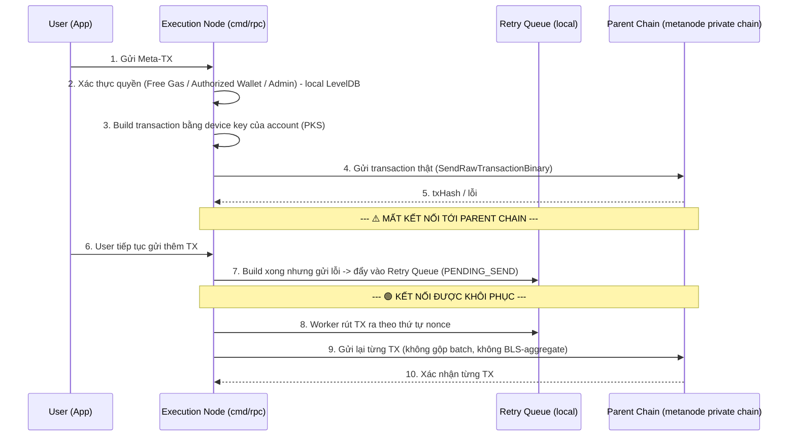

# Thiết kế Node Thực thi Độc lập (Standalone Execution Node) — Custodial BLS cho Ký hộ

> Đây **không phải Rollup, không phải Validator, không tham gia đồng thuận**. Đây là một node thực thi (execution-only) chạy độc lập như một service/app bình thường — đúng vai trò `cmd/rpc` hiện có: kết nối lên Parent Chain với tư cách **client** (`parent_connection_type: "client"`), không phải thành viên BFT.

## 1. Tổng quan Kiến trúc

**Mục tiêu cốt lõi:**
- **Thực thi nhanh, độc lập:** Node nhận giao dịch, xử lý/ký hộ và forward lên Parent Chain ngay, không có bước đề xuất block/bỏ phiếu nào.
- **Custody nhiều account bằng 1 node:** Một node duy nhất giữ (custody) private key của nhiều account người dùng để ký hộ (device key), thay vì mỗi account tự giữ ví riêng. Đây là cơ chế đã có, không thay đổi.
- **Khả năng chịu mất kết nối tạm thời với Parent Chain:** Khi rớt kết nối, node vẫn nhận và xử lý được yêu cầu cục bộ, rồi gửi bù (retry) khi kết nối phục hồi — giống một hàng đợi retry của app thông thường, không phải cơ chế "Sync-to-L1" kiểu rollup.
- **Public Chain làm registry, không giữ state:** Có thể có nhiều Private Chain / node thực thi (mỗi node custody một tập account riêng). Public Chain đứng trên tất cả, chỉ giữ (a) account nào đang do Private Chain nào quản lý, (b) trạng thái thực thi của từng giao dịch (đã chạy chưa), (c) node thực thi đã báo cáo đồng bộ lên Public Chain tới đâu — **không lưu balance/nonce/state thật** của account, state thật vẫn nằm ở Private Chain (không đổi so với mục 2-3).

---

## 2. Các Thành phần (map theo code hiện có trong `cmd/rpc`)

### 2.1. Node BLS Key — danh tính của chính node (`app.Context.NodeBlsPrivateKey/NodeBlsPublicKey`)
- Là keypair BLS **của node**, dùng làm danh tính khi node kết nối tới Parent Chain (`ClientRpc`, `ClientTcp`) và khi node tự ký các thao tác quản trị (confirm account, reward...).
- **Không phải** "chữ ký đại diện cho toàn bộ pool tài khoản" theo nghĩa BLS-aggregate-verify trên L1 — không có hợp đồng nào verify 1 chữ ký này để unlock state hàng loạt. Nó chỉ là key nhận diện + ký giao dịch quản trị của bản thân node.

### 2.2. Private Key Store — PKS (`cmd/rpc-client/store`)
- Custody riêng biệt **device key** (BLS keypair) cho **từng account** đã đăng ký qua `handleSetBlsPublicKey` + được admin `confirm`.
- Đây chính là phần "1 node quản lý nhiều account": mỗi account vẫn có key/chữ ký của riêng nó (không gộp chữ ký), node chỉ đóng vai trò giữ hộ và ký hộ (custodial signer), tương tự mô hình MPC/KMS ví nhưng đơn giản hơn — **giữ nguyên, không đổi**.
- Khi build & gửi transaction cho một account (`handleConfirmAccountWithoutSign`), node dùng đúng device key của account đó (`bls.NewKeyPair(senderPkString)`), không dùng key chung để ký thay.

### 2.3. AccountHandlerNoReceipt — vòng xử lý thực thi (`pkg/account_handler`)
- Nhận Meta-transaction, xác thực quyền qua `fromAddress` (ECDSA/BLS recover), cập nhật trạng thái free-gas/authorized-wallet/admin (LevelDB, prefix `adm:/aw:/cfg:`), rồi forward transaction thật lên Parent Chain qua `ClientRpc.SendRawTransactionBinary` — **ngay lập tức**, không có bước "chờ gộp batch".
- Đây là phần tương đương "Local Execution" trong thiết kế cũ, nhưng thực tế **không giữ một bản state độc lập lâu dài chờ đồng bộ** — mỗi tx được forward lên Parent Chain trong cùng luồng xử lý request.

### 2.4. Batch/Queue nội bộ hiện có (`pkg/storage/batchstore.go`, `cached_batch_writer.go`)
- `CachedBatchWriter`/`BackUpDb` đã tồn tại, nhưng dùng để **tối ưu I/O ghi LevelDB nội bộ** (gom nhiều write thành 1 batch cho nhanh), **không phải** để gộp nhiều chữ ký BLS của nhiều account thành 1 chữ ký gửi lên chain.
- Nếu cần hàng đợi cho kịch bản mất kết nối (mục 3), nên tái sử dụng pattern này (channel + goroutine worker + LevelDB persist) thay vì thiết kế WAL/BLS-Aggregator mới từ đầu.

### 2.5. Kết nối tới Parent Chain (`ClientRpc`, `ClientTcp`, `ChainConnectionPool`)
- Node là **client** của Parent Chain, dùng `parent_connection_address` để gửi transaction thật (`SendRawTransactionBinary`) và nhận trạng thái/nonce khi cần.
- Parent Chain xử lý transaction như bất kỳ transaction ECDSA/BLS đơn lẻ nào khác — không có precompile "verify 1 chữ ký batch" nào cần xây thêm ở phía Parent Chain cho model hiện tại.

---

## 3. Xử lý khi mất kết nối tới Parent Chain (retry queue, không phải "Deferred Sync" kiểu rollup)

1. **Thực thi & phản hồi nhanh:** Request tới, node xác thực quyền cục bộ (LevelDB) và build transaction ngay.
2. **Nếu gửi lên Parent Chain thất bại (mất kết nối):** đẩy transaction đã build vào hàng đợi retry cục bộ (tái dùng cơ chế batch-writer hiện có ở mục 2.4), đánh dấu `PENDING_SEND`.
3. **Khi kết nối phục hồi:** worker goroutine rút hàng đợi ra, gửi lại **từng transaction một** theo đúng nonce/thứ tự — vì Parent Chain xử lý transaction đơn lẻ bình thường, không có khái niệm "Super-Batch + 1 chữ ký chung" để gộp nhiều tx lại.
4. **Idempotency:** mỗi transaction giữ nguyên nonce đã build ban đầu — nếu bị gửi trùng do retry, Parent Chain tự từ chối vì nonce đã dùng (không cần cơ chế chống trùng riêng ở tầng node).

> Lưu ý: cơ chế này là một **retry queue thông thường của một app backend**, không phải "Asynchronous Sync lên L1" — vì Parent Chain ở đây là một private chain nội bộ cùng hệ (metanode), không phải một public L1 xa lạ cần tối ưu chi phí verify.

---

## 4. Luồng Xử lý Giao dịch (Workflow)

---

## 5. Rủi ro & Vấn đề cần xử lý

1. **Trùng lặp/mất thứ tự khi retry:** Worker retry phải gửi **đúng thứ tự nonce** đã build ban đầu; nếu build lại transaction mới (nonce mới) trong lúc bản cũ vẫn còn trong queue, có thể tạo 2 transaction hợp lệ cùng ý định chi tiêu khác kết quả. → Cần đảm bảo transaction trong queue được build 1 lần, không build lại.
2. **Custody risk (đã biết, không đổi hướng xử lý):** Node giữ private key của nhiều account (PKS) — vẫn là **single point of trust** đúng như bản chất "ký hộ", rủi ro này thuộc phạm vi bảo mật vận hành (mã hoá PKS bằng `master_password`/`app_pepper` đã có), không phải vấn đề kiến trúc mới cần giải quyết bằng BLS-aggregate hay lock tài khoản trên L1 như bản thiết kế cũ từng đề xuất — **không cần cơ chế "khoá tài khoản trên L1"** vì Parent Chain vẫn nhận trực tiếp transaction từ chính account đó bình thường (không có state tách biệt cần đồng bộ).
3. **Hàng đợi retry phình to khi mất kết nối lâu:** Cần giới hạn kích thước/độ tuổi item trong queue + cảnh báo vận hành, tương tự bất kỳ retry queue nào của app backend — không cần giới hạn theo gas-limit của block vì mỗi TX vẫn gửi riêng lẻ.
4. **Single point of failure về availability:** Vì đây là 1 node thực thi độc lập (không phải cụm đồng thuận), node chết = dịch vụ ký hộ ngừng. Cần giám sát/khởi động lại (giống vận hành app thường), không nằm trong phạm vi thiết kế giao thức.

---

## 6. Cấu trúc Code (map vào layout hiện có, không tạo package `rollup` mới)

- `pkg/account_handler/account_handler.go`: nơi xử lý request, xác thực quyền, build & forward transaction — **mở rộng tại đây** cho logic retry queue, không tạo executor riêng.
- `pkg/storage/cached_batch_writer.go`, `batchstore.go`: tái sử dụng pattern batch/cache hiện có cho hàng đợi retry (persist xuống LevelDB, worker goroutine flush).
- `cmd/rpc-client/store` (PKS): giữ nguyên, không đổi cơ chế custody device key theo account.
- `pkg/rpc_client` (`ClientRpc`): nơi gọi `SendRawTransactionBinary` — thêm error path để đẩy vào retry queue khi gửi thất bại do mất kết nối.
- `pkg/connection_manager` (`ChainConnectionPool`): theo dõi trạng thái kết nối tới Parent Chain để trigger worker rút hàng đợi khi kết nối phục hồi.

---

## 7. Public Chain — Account Registry & Sync Status (không lưu account state)

### 7.1. Vai trò
Khi có nhiều Private Chain / node thực thi (mỗi node custody riêng một tập account theo mục 2.2), cần một nơi **công khai, duy nhất** để:
1. Biết một account (BLS account) hiện đang được **Private Chain nào** quản lý (đăng ký ở node thực thi nào).
2. Cho user tự tra cứu: **giao dịch của tôi đã được Private Chain thực thi chưa** (theo txHash).
3. Cho user/ops tự tra cứu: **node thực thi đó đã đồng bộ báo cáo lên Public Chain đến đâu / có đang "sống" không**.

Public Chain **không giữ balance/nonce/state thật** của account — state thật vẫn chỉ nằm ở Private Chain tương ứng (đúng như mục 2-3, không đổi). Public Chain chỉ giữ 3 loại dữ liệu registry/metadata ở trên.

### 7.2. Dữ liệu lưu trên Public Chain

| Bảng | Key | Value | Ghi chú |
|---|---|---|---|
| Account Registry | `account_address` | `private_chain_id` (+ thời điểm đăng ký) | Ghi 1 lần khi account được confirm ở Private Chain (mục 2.2), Private Chain report lên |
| Tx Status | `tx_hash` | `{status, private_chain_id, reported_at}` | `status` ∈ `EXECUTED_LOCAL` (Private Chain đã chạy, đợi xác nhận thêm) / `EXECUTED_CONFIRMED` (đã report chắc chắn lên Public Chain) / `FAILED` |
| Node Sync Status | `private_chain_id` | `{last_report_at, last_reported_tx_count, is_stale}` | Cập nhật mỗi lần node gửi report; `is_stale = now - last_report_at > threshold` |

### 7.3. Cơ chế report (Private Chain → Public Chain)

- Node thực thi (`cmd/rpc`) định kỳ (hoặc theo batch) gửi 1 report gồm: danh sách `(tx_hash, status)` mới + heartbeat, **ký bằng chính `NodeBlsPrivateKey`** của node (đã có sẵn, không cần sinh thêm key mới — mục 2.1).
- Public Chain verify chữ ký này khớp với `NodeBlsPublicKey` đã đăng ký cho `private_chain_id` đó (whitelist node giống cách `owner_rpc_address`/admin whitelist account ở mục 2.2 hiện tại), rồi mới ghi nhận report.
- **Đây vẫn là mô hình tin theo báo cáo (trust-based), không phải verify lại state transition** — cùng ranh giới tin cậy đã nêu ở mục 5.2: Public Chain tin Private Chain báo cáo đúng, không re-execute hay yêu cầu proof. Cần nói rõ điều này với người dùng cuối khi họ tra cứu trạng thái, tránh hiểu nhầm "Public Chain đã xác minh" thành "đã được verify độc lập".

### 7.4. API tra cứu cho end-user (đọc, không tốn gas)

- `getAccountPrivateChain(address) -> private_chain_id`
- `getTxStatus(tx_hash) -> {status, private_chain_id, reported_at}`
- `getNodeSyncStatus(private_chain_id) -> {last_report_at, is_stale}`

### 7.5. Vấn đề cần lưu ý

1. **Phân biệt rõ 2 trạng thái dễ nhầm:** "Private Chain đã thực thi xong" (tiền đã chuyển thật ở Private Chain) khác với "đã report lên Public Chain" (độ trễ giữa 2 mốc này luôn tồn tại vì report là định kỳ/batch — mục 3). Nếu gộp chung thành 1 trạng thái "PENDING", user sẽ hiểu nhầm giao dịch chưa chạy trong khi thực ra tiền đã chuyển ở Private Chain rồi, chỉ là chưa kịp báo cáo lên. → cần tách `EXECUTED_LOCAL` và `EXECUTED_CONFIRMED` như bảng 7.2, không dùng chung 1 field `status` mập mờ.
2. **Đăng ký account 1 lần, không cho ghi đè tuỳ ý:** Report gán `account -> private_chain_id` nên chỉ chấp nhận lần đầu (hoặc yêu cầu chữ ký của chính Private Chain đang giữ account hiện tại để chuyển nhượng) — tránh một report replay/cũ vô tình gán lại account sang node khác.
3. **`is_stale` chỉ là tín hiệu heartbeat, không phải bằng chứng an toàn:** Node có thể vẫn "sống" và xử lý tx nội bộ bình thường nhưng tạm thời không gửi report được (giống rủi ro mất kết nối ở mục 3) — `is_stale=true` nên hiển thị cho user là "chưa xác nhận được trạng thái mới nhất", không phải "giao dịch bị mất".
4. **Chưa xác định**: tần suất report (theo thời gian hay theo số lượng tx tích luỹ), và Public Chain này có phải chính là Parent Chain ở mục 2.5 hay là một chain riêng biệt khác — cần chốt trước khi triển khai vì ảnh hưởng đến việc node phải giữ bao nhiêu kết nối cùng lúc (Parent Chain để gửi tx thật, Public Chain để report trạng thái).

---

> Gợi ý: vì thiết kế này không còn liên quan "rollup", nên cân nhắc đổi tên thư mục chứa tài liệu này (hiện là `pkg/rollup/`) sang tên phản ánh đúng vai trò, ví dụ `pkg/execnode/` — nói riêng với bạn để xác nhận trước khi đổi, vì đây là thao tác đổi tên thư mục.
