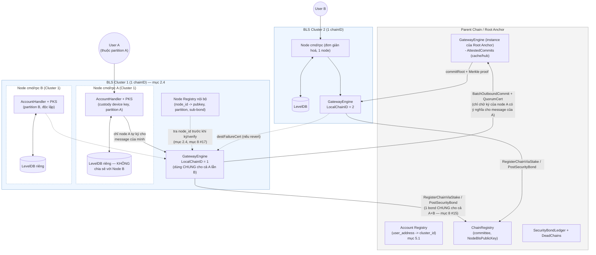
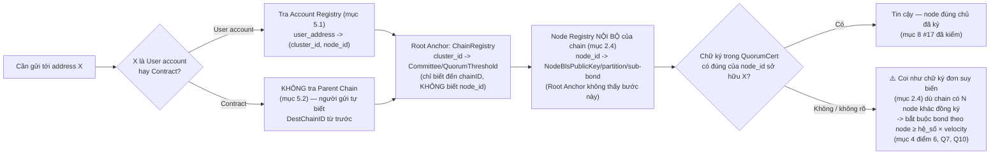
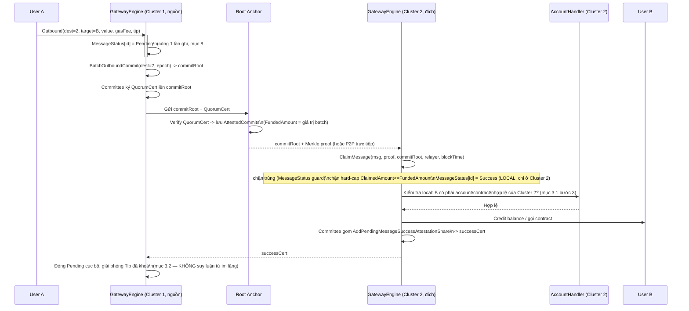
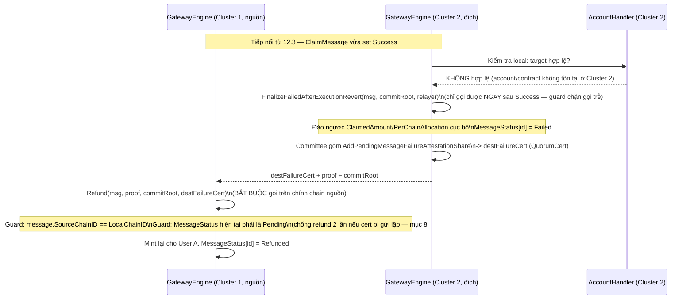
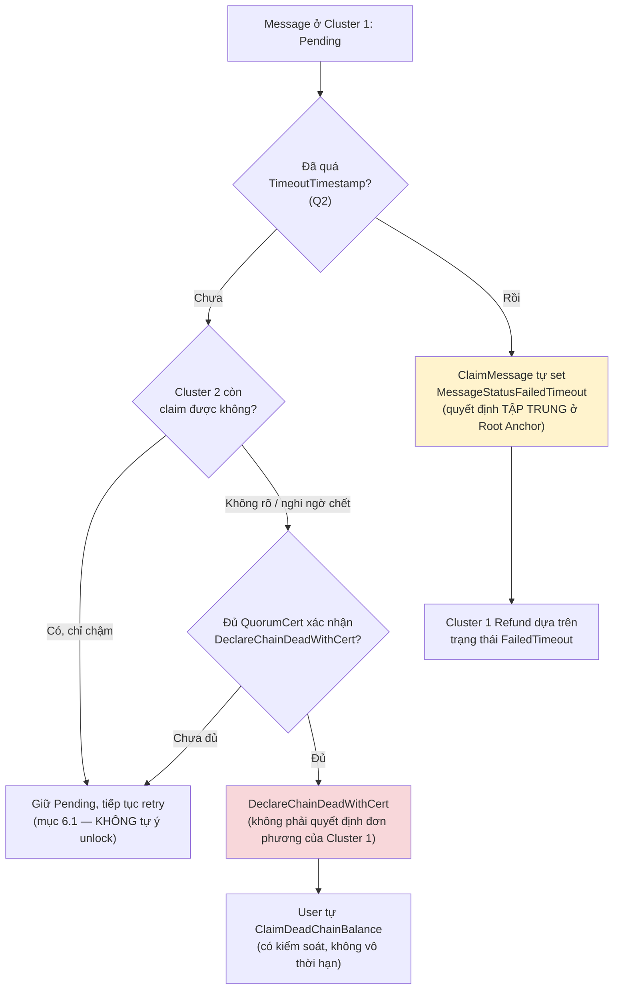
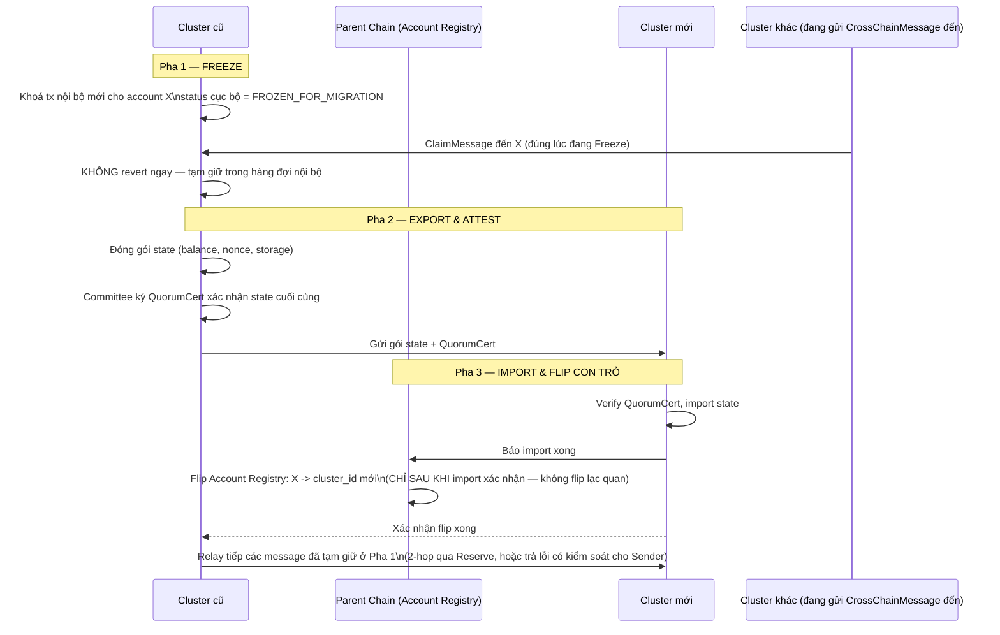

# Thiết kế Kiến trúc BLS Cluster & Giao tiếp Cross-Cluster (Thay thế Parent Chain Execution)

> **Cập nhật mới:** Parent Chain hiện tại KHÔNG CÒN xử lý logic smart contract hay chuyển tiền. Parent Chain chỉ đóng vai trò là **Registry (Đăng ký tài khoản, phân bổ BLS)** và **Relay/Router (Luân chuyển tin nhắn Cross-Cluster)**. Mọi logic state (balance, contract) được xử lý hoàn toàn nội bộ tại các Cụm BLS (BLS Clusters).

> ⚠️ **CẢNH BÁO KIẾN TRÚC QUAN TRỌNG (đọc trước khi triển khai):** Bài toán "nhiều cụm độc lập giữ state riêng, cần chuyển giá trị/gọi contract an toàn giữa các cụm" **đã tồn tại và đã được audit nhiều vòng** trong chính repo này, tại `execution/pkg/cross_chain/gateway.go` (`GatewayEngine`). Hệ thống đó đã có: `ChainRegistry` (đăng ký chain qua stake), `PerChainAllocation` (bất biến tổng cung — `ErrInvariantViolation`), `QuorumCert` + Merkle-proof cho việc claim message (`ClaimMessage`), hard-cap `FundedAmount`/`ClaimedAmount`, `SecurityBond`+`SlashOnEquivocation`, `DeadChains`/`DeclareChainDeadWithCert`+`ClaimDeadChainBalance`, `Refund`/`FinalizeFailedAfterExecutionRevert`, `TimeoutTimestamp` trên message. Bản thiết kế "Cross-Cluster Message (CCM)" ở mục 3 (bản trước) tự viết lại y hệt bài toán này nhưng **thiếu gần hết các cơ chế trên** — mỗi phần thiếu tương ứng với một lỗi logic/bảo mật cụ thể được liệt kê ở mục 8. Khuyến nghị: **coi mỗi BLS Cluster là một `chainID` đăng ký trong `ChainRegistry`, và tái dùng `GatewayEngine` làm tầng chuyển giá trị/message giữa các cụm**, thay vì xây `CrossClusterMessage`/`Outbox` riêng.

---

## 1. Tổng quan Kiến trúc

**Mục tiêu cốt lõi:**
- **Thực thi phân tán (Sharded Execution):** Mỗi Cụm BLS (Cluster) hoạt động như một shard độc lập, quản lý state, balance và smart contract của tập người dùng thuộc Cluster đó.
- **Parent Chain làm mỏ neo (Anchor):** Parent Chain chỉ quản lý danh bạ tài khoản (Account → Cluster) và xác thực danh tính các Cluster, hoàn toàn giải phóng khỏi việc xử lý giao dịch. **Về bản chất Parent Chain ở đây chính là vai trò Root Anchor trong `pkg/cross_chain`** — cần chốt xem đây là cùng một chain hay hai chain khác nhau (câu hỏi mở, xem mục 10.1 Q1).
- **Cross-Cluster Interoperability:** Chuyển tiền và gọi smart contract giữa 2 Cụm BLS khác nhau, dùng lại cơ chế `CrossChainMessage` + `QuorumCert` đã có, không phát minh giao thức mới.

---

## 2. Phân chia Vai trò

### 2.1. Parent Chain / Root Anchor (Coordination Layer)
- **Đăng ký tài khoản (Account Registry):** Giữ nguyên luồng đăng ký tài khoản với BLS như chain cũ. Map `User_Address -> Cluster_ID`. **(Đây là phần MỚI, chưa có sẵn trong `pkg/cross_chain` — chi tiết mục 5.)**
- **Đăng ký & xác thực danh tính Cluster:** Mỗi Cluster đăng ký như một `chainID` qua `GatewayEngine.RegisterChainViaStake` (đã có sẵn) — tự động có `NodeBlsPublicKey`/committee, `SecurityBond`, và tham gia được `PerChainAllocation`.
- **Relay/Attest tin nhắn:** Dùng nguyên cơ chế checkpoint + `QuorumCert` đã có (`SubmitCheckpoint`, `AttestCommit`, `BatchOutboundCommit`) — **không dùng chữ ký đơn lẻ của 1 node** cho việc di chuyển giá trị (xem mục 8, vấn đề #1).
- **KHÔNG LƯU STATE ứng dụng:** Không lưu balance/contract-state của người dùng cuối. Nếu đóng vai trò relay/hub cho route "qua Root Anchor" (mục 3.1 bước 2), Root Anchor có thể giữ một bản cache `AttestedCommits` để tiện chuyển tiếp cho Cluster đích — nhưng đây vẫn là sổ cái **kế toán liên-cụm** (protocol ledger), không phải state ứng dụng, và **không phải bản duy nhất/quyền uy nhất**: mỗi Cluster vẫn tự giữ và tự verify lại bản của mình trước khi tin (xem mục 3.2, mục 7 để tránh hiểu nhầm đây là 1 bảng dùng chung toàn hệ thống).
- **Cách định vị 1 account/contract về đúng Node/BLS quản lý (2 bước tra cứu):** (1) `Account Registry` (mục 5.1) trả về `cluster_id` từ `user_address`; (2) `ChainRegistry` (đã có sẵn) trả về `Committee`/`NodeBlsPublicKey` từ `cluster_id`. Xác thực nguồn gốc message dựa đúng vào chữ ký `QuorumCert` ký trên checkpoint bằng committee đó. **Đúng như mô tả, nhưng lưu ý:** nếu Cluster chỉ có 1 node, `Committee` chỉ có 1 `NodeBlsPublicKey` → `QuorumCert` suy biến thành chữ ký đơn, xem cảnh báo và bất biến bond bắt buộc ở mục 4 điểm 6.

### 2.2. BLS Cluster (Execution Layer)
- **Quản lý State Nội bộ:** Mỗi Cluster sở hữu database riêng (LevelDB) lưu trữ balance, nonce, và state của smart contract.
- **Custody Private Key (PKS):** Cluster giữ device key của người dùng để ký hộ (không đổi, xem bản thiết kế `cmd/rpc` trước).
- **Thực thi Giao dịch Nội bộ (Intra-Cluster):** Giao dịch giữa User A và User B (cùng Cluster) được xử lý ngay lập tức, cập nhật state nội bộ mà không cần gửi lên Parent Chain.
- **Xử lý Giao dịch Liên cụm (Cross-Cluster):** Gọi `GatewayEngine.Outbound(...)` của chính Cluster mình (mỗi Cluster chạy 1 instance `GatewayEngine` với `LocalChainID = cluster_id`) khi đích đến nằm ở Cluster khác — không tự đóng gói/tự ký CCM thủ công.

### 2.3. Rủi ro Custody tập trung (PKS giữ Device Key) — chưa có gì mới giải quyết, cần ghi nhận rõ

Mục 2.2 kế thừa nguyên mô hình custody từ bản thiết kế `cmd/rpc` trước: Cluster giữ 100% device key của user để ký hộ. Trong bối cảnh Cluster giờ còn cầm cả quyền phát `Outbound`/tham gia ký `QuorumCert` cross-cluster, rủi ro này cần nhìn lại nghiêm túc hơn:

- **Nếu Node/Cluster bị hack:** kẻ tấn công có device key trong tay, có thể ký giao dịch **nội bộ trong cùng Cluster** y hệt user thật — không để lại bằng chứng mật mã nào chứng minh "đây không phải user ký", vì chữ ký vẫn hợp lệ theo đúng key đã đăng ký. **Đây là vấn đề bảo mật cục bộ (local), các cơ chế `SecurityBond`/`QuorumCert`/`PerChainAllocation` ở mục 4 KHÔNG bảo vệ được trường hợp này**, vì tiền không hề rời khỏi Cluster (không đi qua `Outbound`/`ClaimMessage`) nên không có gì để chặn hay slash.
- **Không thể "giải quyết triệt để bằng kỹ thuật"** nếu vẫn giữ mô hình custody 100% — đây là đánh đổi cố hữu của "ký hộ" (đã ghi nhận từ bản `cmd/rpc`). Việc cần làm là **giảm thiểu**, không phải loại bỏ:
  1. **Giới hạn rút/chuyển theo ngưỡng + độ trễ (withdrawal delay):** giao dịch vượt một ngưỡng giá trị nhất định bị delay + thông báo cho user (qua kênh ngoài, ví dụ notification đã có ở `cmd/rpc`) trước khi thực thi, cho user cơ hội phát hiện bất thường.
  2. **Phát hiện bất thường (anomaly detection):** cảnh báo vận hành khi 1 account có pattern giao dịch lệch hẳn lịch sử (rút cạn số dư, chuyển hết sang 1 địa chỉ lạ trong Cluster).
  3. **Chế độ non-custodial tuỳ chọn cho tài khoản giá trị cao:** cho phép user tự giữ key (tự ký, Cluster chỉ forward) thay vì bắt buộc custody 100% — nên là lựa chọn, không áp đặt toàn hệ thống.
- **Đây là quyết định về threat model, không phải bug kỹ thuật** — cần đội vận hành xác nhận mức rủi ro custody này có chấp nhận được cho quy mô tài sản dự kiến hay không, trước khi go-live (mục 10.1 Q9).

### 2.4. Kiến trúc nội bộ 1 Chain: nhiều Node `cmd/rpc` độc lập, KHÔNG chia sẻ state (đã xác nhận với đội)

⚠️ **Đây là chỉnh sửa nền tảng, ảnh hưởng lại toàn bộ mục 3-8 phía trên.** Xác nhận lại: **1 "chain" (1 `chainID`/Cluster) không phải 1 node duy nhất, mà là một nhóm hành chính gồm NHIỀU node `cmd/rpc`** (mỗi node là 1 "BLS ký hộ" độc lập, đã tích hợp sẵn phần thực thi từ thiết kế gốc). Xác nhận rõ: **các node này KHÔNG chia sẻ/đồng bộ state với nhau** — mỗi node tự quản 1 tập account riêng biệt, không chồng lấn, tự thực thi cục bộ (đúng tinh thần "không đồng thuận" ban đầu của `cmd/rpc`).

**Hệ quả bảo mật trực tiếp — vì sao đây KHÔNG phải chi tiết vặt:**

- `GatewayEngine.ChainRegistry.Committee`/`QuorumThreshold` (mục 2.1, mục 4) **hoạt động ở granularity `chainID`, không biết đến khái niệm "node con"/"account partition" bên trong 1 chain**. Một `QuorumCert` hợp lệ chỉ chứng minh "đủ ngưỡng chữ ký trong danh sách committee của chainID này" — **KHÔNG chứng minh rằng chính node đang thực sự sở hữu/thực thi account đó đã ký**. Vì các node không chia sẻ state, các node "anh em" khác trong cùng chain **không có cách nào verify độc lập** một message đến từ 1 node cụ thể trước khi (có thể) đồng ký.
- Kết quả: **"vấn đề chữ ký đơn suy biến" ở mục 4 điểm 6 không còn là trường hợp cạnh (Cluster chỉ có 1 node) — nó là MẶC ĐỊNH của toàn hệ thống.** Dù 1 chain có 10 node, mỗi message vẫn chỉ thực sự được đảm bảo bởi đúng 1 chữ ký có ý nghĩa (của node sở hữu account đó); 9 node còn lại nếu đồng ký cũng chỉ là "ký khống theo niềm tin", không phải xác minh thật.

**3 việc bắt buộc phải làm thêm (chưa có sẵn trong `GatewayEngine`, không được bỏ qua):**

1. **Node Registry nội bộ của chain (mới, KHÔNG đặt trên Root Anchor):** mapping `node_id -> NodeBlsPublicKey, account_partition, sub-bond`. Đây là sổ nội bộ do chính chain/đội vận hành chain đó giữ, không phải Root Anchor — Root Anchor chỉ biết `chainID`, không cần biết có bao nhiêu node bên trong.
2. **Mở rộng Account Registry (mục 5.1) từ `user_address -> cluster_id` thành `user_address -> (cluster_id, node_id)`:** vì sau khi 1 message được `ClaimMessage` thành công ở mức `chainID` (mục 3.1 bước 3), vẫn cần thêm 1 bước dispatch nội bộ để biết chuyển tiếp cho đúng node nào xử lý — `GatewayEngine` không tự làm việc này.
3. **Lớp kiểm tra "partition ownership" bổ sung (mới, phải tự xây):** trước khi tin 1 `QuorumCert`, cần kiểm tra thêm **chữ ký thực sự trong cert có bao gồm đúng node sở hữu `Sender`/`Target` của message hay không** — đây là kiểm tra ở tầng ứng dụng, `ClaimMessage`/`AttestCommit` của `GatewayEngine` không tự làm (nó chỉ verify tổng số chữ ký ≥ ngưỡng, không biết chữ ký của "ai" gắn với "account nào").

**Bond & Slashing phải scope theo NODE, không phải theo CHAIN (sửa lại mục 4 điểm 6):**
- Nếu `SecurityBond`/`SlashOnEquivocation`/`DeclareChainDeadWithCert` chỉ áp được ở granularity `chainID` (đúng như code hiện có), thì **1 node gian lận sẽ kéo theo cả chain bị slash/declare-dead**, gây thiệt hại oan cho user của các node khác hoàn toàn vô tội trong cùng chain — đây là **rủi ro mới (collateral damage)**, liệt kê ở mục 8 #15.
- Tương tự, `checkAndRecordVelocity` tính theo `sourceChainID` (mục 4 điểm 5) — nghĩa là **các node trong cùng chain đang DÙNG CHUNG 1 hạn mức velocity 24h**, 1 node giao dịch nhiều (hợp lệ) có thể chặn oan node khác cùng chain — rủi ro "noisy neighbor", liệt kê ở mục 8 #16.
- **Quyết định cần chốt (mục 10.1 Q10):** chấp nhận rủi ro collateral/noisy-neighbor này ở mức chain (đơn giản, dùng thẳng `GatewayEngine` không sửa), hay bắt buộc phải tự xây sub-ledger bond/velocity theo từng `node_id` bên trong chain (an toàn hơn, nhưng là code mới hoàn toàn, không có sẵn).

---

## 3. Cơ chế Chuyển giá trị/Gọi Contract Cross-Cluster (tái dùng `GatewayEngine`)

Khi User A (Cluster 1) muốn chuyển tiền hoặc gọi Contract cho User/Contract B (Cluster 2).

### 3.1. Luồng hoạt động (Workflow)

1. **Khởi tạo tại Cluster 1 (Nguồn):**
   - User A gửi yêu cầu tới Cluster 1's `AccountHandler`.
   - Cluster 1 gọi `GatewayEngine.Outbound(sender=A, params{DestChainID: 2, Target: B, Value, Payload, GasFee, Tip}, txHash)` — hàm này **đã tự** gán `MessageID`, `Sequence`, set `MessageStatusPending`, và đưa vào `PendingOutboundMessages[2]`. **Không tự trừ tiền cục bộ trước** rồi mới build message riêng — việc khoá state phải nằm trong cùng logic với `Outbound` (xem vấn đề #2, mục 8) để tránh trừ tiền xong nhưng message không bao giờ được ghi nhận nếu crash giữa chừng.
   - Cluster 1 **không tự ký CCM bằng khoá node đơn lẻ**. Giá trị chỉ thực sự di chuyển được sau khi message nằm trong một **checkpoint đã được cả committee của Cluster 1 attest** (`QuorumCert`), theo đúng cách `AttestCommit`/`SubmitCheckpoint` đang hoạt động.

2. **Luân chuyển & Attest (qua Root Anchor):**
   - Batch các outbound message định kỳ: `BatchOutboundCommit(destChainID=2, epoch)` → sinh `commitRoot` + Merkle tree.
   - Root Anchor nhận `QuorumCert` (đa chữ ký của committee Cluster 1, không phải 1 chữ ký đơn) xác nhận `commitRoot` này là thật → lưu vào `AttestedCommits`, đồng thời hard-cap `FundedAmount` cho commit đó.
   - Cluster 2 lấy `commitRoot` + Merkle proof của message của mình từ Root Anchor (hoặc P2P trực tiếp, tự verify lại `QuorumCert` — như "Cách 2" ở bản trước, vẫn hợp lệ vì không phụ thuộc phải hỏi Root Anchor real-time).

3. **Thực thi đích (Tại Cluster 2 - Đích):**
   - Cluster 2 gọi `GatewayEngine.ClaimMessage(message, proof, commitRoot, relayer, blockTime)`. Hàm này đã tự:
     - Từ chối claim trùng (`currentStatus != MessageStatusPending` → lỗi `ErrAlreadyClaimed`) — **đây chính là chống-replay bắt buộc**, không phải tính năng tuỳ chọn như bản CCM cũ.
     - Verify Merkle proof + domain-separated leaf hash.
     - Kiểm tra timeout (`TimeoutTimestamp`) — tự động set `MessageStatusFailedTimeout` nếu quá hạn.
     - Kiểm tra đúng `DestChainID == LocalChainID` — chặn 1 message bị claim nhầm chain.
     - Hard-cap `ClaimedAmount <= FundedAmount` — chặn Cluster 2 (hoặc relayer) claim vượt số đã thực sự attest.
   - `ClaimMessage` set `MessageStatus[messageID] = Success` **trên chính engine cục bộ của Cluster 2** (mỗi `GatewayEngine` là 1 instance riêng — Cluster 1 và Cluster 2 KHÔNG chia sẻ chung 1 bảng `MessageStatus`, xem lưu ý ở mục 3.2).
   - ⚠️ **Trước khi tin `ClaimMessage` đã đủ (mục 2.4):** vì `QuorumCert` chỉ chứng minh "đủ ngưỡng committee của cả chain ký", cần thêm bước verify tầng ứng dụng: **chữ ký trong cert có thực sự bao gồm đúng `node_id` đang sở hữu `Sender` (theo Account Registry của Cluster 1) hay không** — nếu không, dù `QuorumCert` valid về mặt mật mã vẫn phải coi là đáng ngờ (có thể là node khác trong cùng chain ký khống thay). Đây là kiểm tra mới, `GatewayEngine` không tự làm.
   - **Bước dispatch nội bộ (mới, mục 2.4):** ngay sau khi `ClaimMessage` trả `Success`, Cluster 2 tra `Account Registry` (mục 5.1) để lấy `node_id` đích, rồi chuyển giao cho đúng node `cmd/rpc` đó xử lý tiếp — **không phải node nào trong chain cũng tự động thấy/xử lý được message này**, vì các node không chia sẻ state (mục 2.4).
   - **Bước kiểm tra tồn tại cục bộ (chưa có sẵn trong `GatewayEngine`, vì engine chỉ làm việc ở mức `chainID`, không biết B là ai):** node `cmd/rpc` đích (đã xác định ở bước trên) kiểm tra local: **`B` có phải account hợp lệ đang được chính mình quản lý không**. Nếu không hợp lệ:
     1. Gọi **ngay lập tức** `FinalizeFailedAfterExecutionRevert(message, commitRoot, relayer)` — hàm này **chỉ chấp nhận gọi khi status hiện tại đúng là `Success` vừa được `ClaimMessage` set** (guard chặn gọi trễ/gọi lại) — nó tự đảo ngược `ClaimedAmount`/`PerChainAllocation` cục bộ và set `MessageStatus = Failed`.
     2. Committee của Cluster 2 gom chữ ký thất bại qua `AddPendingMessageFailureAttestationShare(key, share)` cho đến khi đủ ngưỡng quorum, rồi tổng hợp thành `destFailureCert` (`QuorumCert`).
     3. Gửi `destFailureCert` + proof + `commitRoot` về Cluster 1.

### 3.2. Đóng gói kết quả về Cluster nguồn — KHÔNG có bảng `MessageStatus` dùng chung

⚠️ Sửa một hiểu lầm quan trọng ở bản trước: mỗi `GatewayEngine` là **một instance riêng cho từng chain**, nên `MessageStatus` của Cluster 1 (nguồn) và của Cluster 2 (đích) là **hai bảng độc lập, không tự đồng bộ cho nhau**. Cluster 1 gọi `GetMessageStatus(messageID)` trên chính engine của mình sẽ **mãi mãi thấy `Pending`** cho tới khi chính Cluster 1 tự cập nhật — không có cơ chế "tự động" nào làm việc đó thay nó. Do đó bắt buộc phải có bước tường minh sau, đúng như cách hệ thống hiện có xử lý (không tự chế ACK/NACK riêng, chỉ nối đúng các hàm đã có):

- **Trường hợp thất bại (đích revert, ví dụ account không hợp lệ ở mục 3.1 bước 3):** Cluster 1 nhận `destFailureCert` (mục 3.1), gọi `Refund(message, messageProof, commitRoot, destFailureCert)` **trên chính engine của Cluster 1** (hàm này bắt buộc `message.SourceChainID == LocalChainID` — chỉ gọi được ở đúng chain nguồn). `Refund` tự kiểm tra `MessageStatus` hiện tại phải là `Pending` (chưa từng xử lý) trước khi mint lại cho User A — đây chính là **idempotency guard bắt buộc, chống refund 2 lần** nếu `destFailureCert` bị gửi lặp.
- **Trường hợp thành công:** cơ chế song song `AddPendingMessageSuccessAttestationShare`/`GetPendingMessageSuccessAttestationShares` tồn tại đúng để committee Cluster 2 chứng thực "đã xử lý thành công", cho Cluster 1 (hoặc Reserve, trong định tuyến 2-hop) đóng trạng thái cục bộ của mình một cách có xác thực (dọn `Pending`, giải phóng `Tip` đã khoá nếu có) — **không suy luận "không thấy Failed thì coi như thành công"**, vì im lặng có thể chỉ là do mất kết nối tạm thời (mục 6.1), không phải bằng chứng thành công.

→ Nói ngắn gọn: **cả 2 chiều (thành công/thất bại) đều cần một chứng thực (`QuorumCert`) đi kèm gửi ngược về nguồn**, không có chiều nào được phép suy luận từ sự im lặng.

---

## 4. Bảo mật kinh tế cho Cluster (mới — bắt buộc, không phải tuỳ chọn)

Vấn đề nghiêm trọng nhất của bản thiết kế CCM cũ: **không có gì ngăn một Cluster (do bug hoặc cố ý) phát ra vô hạn message "mint" giá trị ở Cluster khác** mà không thực sự khoá tài sản tương ứng ở Cluster nguồn — vì Parent Chain "KHÔNG LƯU STATE" nên không tự kiểm tra được. Đây là lý do bắt buộc phải dùng nguyên cụm cơ chế đã có:

1. **`PostSecurityBond`**: mỗi Cluster phải ký quỹ bond khi đăng ký (`RegisterChainViaStake`) — mất bond nếu gian lận.
2. **`SlashOnEquivocation`**: phát hiện Cluster ký 2 checkpoint mâu thuẫn (double-sign) → slash bond ngay.
3. **Hard-cap theo `FundedAmount`/`ClaimedAmount`**: một commit chỉ cho claim tối đa đúng số đã thực sự được attest, không thể "mint" vượt mức.
4. **`PerChainAllocation` + bất biến `Σ per_chain_allocation == genesis_total_supply`** (`ErrInvariantViolation`): mọi giao dịch cross-cluster phải giữ tổng cung không đổi — nếu một cluster tự ý cộng tiền không qua `ClaimMessage`, tổng sẽ lệch và bị phát hiện.
5. **Giới hạn tốc độ rút (velocity limit)** — `checkAndRecordVelocity`: đã có sẵn cửa sổ trượt 24h, mặc định chặn nếu 1 Cluster attest-outflow vượt quá **20% allocation tại thời điểm mở cửa sổ** trong 24h. Đây chính là cơ chế chống-spam/giới hạn thiệt hại nếu 1 Cluster bị compromise — không cần thiết kế rate-limit riêng cho CCM, chỉ cần xác nhận ngưỡng 20%/24h này có phù hợp với quy mô BLS Cluster hay cần điều chỉnh (mục 10).
6. **Bất biến Bond-phải-che-phủ-Exposure (mới, bắt buộc — chưa có sẵn trong code, cần thêm ở tầng đăng ký Cluster):** `SecurityBond`/`QuorumCert` chỉ thực sự có tác dụng răn đe nếu **giá trị mất khi bị slash > lợi ích thu được khi gian lận**. Nếu 1 Cluster (đặc biệt Cluster chỉ có 1 node — committee suy biến thành 1 chữ ký, xem cảnh báo cuối mục này) có thể có tổng giá trị cross-cluster đang treo (`ClaimedAmount` cộng dồn trong 1 cửa sổ velocity) **lớn hơn** `SecurityBondLedger` của chính nó, node đó có động lực kinh tế hợp lý để ký khống rồi chấp nhận mất bond — vì lợi vẫn > hại. Quy tắc bắt buộc khi duyệt đăng ký/tăng hạn mức 1 Cluster:
   > `SecurityBond(cluster) ≥ hệ_số_an_toàn × giới_hạn_velocity_24h(cluster)` (hệ số an toàn do đội vận hành chốt, khuyến nghị ≥ 1.5–2x để bù thời gian phát hiện + slash không tức thời).
   
   Đây là **quy tắc governance cần enforce khi đăng ký/tăng allocation cho Cluster**, không phải thứ `GatewayEngine` tự kiểm tra hộ — phải thêm bước duyệt thủ công hoặc on-chain check riêng trước khi chấp nhận nâng hạn mức 1 Cluster (mục 10.1 Q7).
   
   ⚠️ **Cập nhật (mục 2.4 — đã xác nhận với đội):** đây KHÔNG chỉ là trường hợp cạnh "Cluster chỉ có 1 node". Vì các node `cmd/rpc` trong cùng 1 chain không chia sẻ state, **mọi message trong thực tế đều chỉ được đảm bảo bởi đúng 1 chữ ký có ý nghĩa** (của node sở hữu account liên quan) dù chain có bao nhiêu node — về bản chất không khác gì chữ ký đơn lẻ ở bản CCM cũ (vấn đề #1 mục 8). Bất biến bond-vs-exposure ở trên **phải áp dụng theo từng `node_id`** (mục 2.4), không phải theo tổng cả chain — nếu không, bond của cả chain có thể "trông có vẻ đủ" trong khi phần bond thực sự gắn với node đang gian lận lại quá nhỏ so với giá trị nó vừa ký khống. Xem thêm Q3, Q10.

→ Không thiết kế lại các cơ chế này cho BLS Cluster; **đăng ký mỗi Cluster như một `chainID` bình thường trong `GatewayEngine`** là đủ để thừa hưởng toàn bộ tầng bảo mật kinh tế này (trừ điểm 6, là quy tắc governance mới cần tự xây).

---

## 5. Đăng ký & Tra cứu Account/Contract (phần thực sự MỚI, GatewayEngine không có sẵn)

`GatewayEngine` chỉ biết đến `chainID`, không biết định danh user/contract cụ thể nào thuộc cluster nào — đây là phần Parent Chain/Root Anchor cần bổ sung riêng cho use-case này. Cần tách rõ **Account (user, đăng ký tường minh)** và **Contract (sinh ra tự động khi deploy)** vì đặc tính rủi ro khác hẳn nhau.

### 5.1. Account Registry (user, đăng ký tường minh — như bản trước, MỞ RỘNG thêm `node_id` theo mục 2.4)

| Bảng | Key | Value | Vai trò |
|---|---|---|---|
| Account Registry | `user_address` | `cluster_id`, `node_id` | Định tuyến `Target` của message đến đúng chain, rồi dispatch tiếp tới đúng node `cmd/rpc` bên trong chain đó (mục 2.4) trước khi node đó tự kiểm tra hợp lệ và credit (mục 3.1 bước 3) |

> Lưu ý: `cluster_id` dùng để `ClaimMessage` ở mức `GatewayEngine` (Root Anchor chỉ cần biết đến đây); `node_id` là bước dispatch **nội bộ của chain, sau khi claim ở mức chain đã thành công** — Root Anchor không cần và không nên biết `node_id` (giữ đúng nguyên tắc `GatewayEngine` chỉ làm việc ở granularity `chainID`, mục 2.4).

**Vấn đề cần xử lý (đã áp dụng ở mục 3.1):**
- **Đăng ký 1 lần, chống ghi đè tuỳ ý:** chỉ chấp nhận đăng ký lần đầu, hoặc yêu cầu chữ ký của chính Cluster đang giữ account hiện tại nếu muốn "chuyển nhượng" account sang cluster khác — tránh một report cũ/replay vô tình đổi chủ account (chi tiết giao thức chuyển nhượng ở mục 5.3).
- **Cluster đích luôn tự kiểm tra lại** account có thuộc mình không trước khi credit (không tin tưởng mù quáng vào `Target` trong message), vì Account Registry ở Parent Chain có thể chưa đồng bộ kịp lúc User A gửi giao dịch.
- **Vì sao registry này an toàn trước DoS:** đăng ký account đi qua đúng luồng `handleSetBlsPublicKey` + admin `confirm` đã có ở `cmd/rpc` (2 bước, có gate admin) — **không permissionless, không tự động**, nên không có đường để spam hàng loạt registration miễn phí. Đây là lý do Contract (mục 5.2) phải xử lý khác hẳn — vì contract sinh ra tự động, không qua gate nào cả.

**Ràng buộc vốn khởi tạo khi 1 Cluster mới đăng ký (đã có sẵn trong `RegisterChainViaStake`, cần đưa vào kế hoạch vận hành):** stake đăng ký của Cluster mới được cấp bằng `TransferAllocation` **rút từ pool của Reserve chain** (không phải mint tự do — điểm này từng bị phát hiện là lỗ hổng mint-không-giới-hạn và đã fix bằng cách bắt buộc rút từ Reserve). Hệ quả: **nếu Reserve không còn đủ allocation, đăng ký Cluster mới sẽ thất bại.** Cần có kế hoạch cấp vốn ban đầu cho Reserve tương ứng với số lượng Cluster dự kiến ra mắt, đây là một precondition vận hành, không phải lỗi logic — liệt kê trong checklist production (mục 10).

### 5.2. Contract Registry — KHÔNG dùng registry toàn cục (khác hẳn Account)

**Vấn đề:** nếu áp dụng y hệt mô hình Account Registry cho contract (mỗi contract mới deploy phải đăng ký lên Parent Chain), sẽ có 2 hệ quả xấu:
1. **DoS/State Bloat:** 1 contract độc hại tự sinh hàng vạn sub-contract (factory pattern) sẽ buộc Cluster spam hàng vạn giao dịch đăng ký lên Parent Chain — không có gate nào chặn vì deploy contract là hành động permissionless trong nội bộ Cluster.
2. **Race Condition khi tra cứu:** nếu message cross-cluster gửi đến ngay sau khi contract vừa deploy nhưng đăng ký lên Parent Chain chưa kịp lan, message sẽ bị định tuyến sai/thất bại dù contract đã tồn tại thật.

**Quyết định thiết kế: không cần Contract Registry toàn cục.** Lý do:
- `Outbound(params{DestChainID, Target, ...})` **đã bắt buộc bên gửi tự chỉ định rõ `DestChainID`** — giống hệt cách mọi hệ multi-chain hiện có hoạt động (người gửi/dApp luôn biết trước contract đích nằm ở chain nào, không có ai "tra cứu ngẫu nhiên" một contract lạ trên toàn hệ thống). Trách nhiệm biết "contract B nằm ở Cluster nào" thuộc về người/dApp tạo giao dịch gửi đi (thường chính là deployer hoặc tài liệu/ABI của dự án), không phải trách nhiệm của Parent Chain.
- Bước kiểm tra tồn tại cục bộ tại đích (đã có sẵn ở mục 3.1 bước 3 cho Account) áp dụng y hệt cho Contract: Cluster đích tự kiểm tra `Target` có phải contract address hợp lệ đang tồn tại tại chính mình không, **hoàn toàn không cần hỏi Parent Chain** — nếu sai, `FinalizeFailedAfterExecutionRevert` + refund như bình thường (mục 3.1, mục 3.2).
- **Kết quả:** loại bỏ hoàn toàn con đường DoS (không có API "đăng ký contract" nào để spam) và loại bỏ luôn race condition tra cứu (vì không có bước tra cứu Parent Chain nào cho contract — chỉ có kiểm tra cục bộ tại đích, vốn dĩ luôn đồng bộ với chính state của Cluster đó).
- **Đánh đổi:** người dùng cuối không thể "gửi tới 1 địa chỉ contract mà không biết trước cluster nào" — chấp nhận được vì đây vốn là hạn chế bình thường của mọi kiến trúc multi-chain/multi-shard, không phải thứ cần Parent Chain giải quyết hộ.

### 5.3. Giao thức Chuyển nhượng Account/Contract (Migration) — 3 pha, chặn race condition

Bản trước chỉ ghi 1 câu "yêu cầu chữ ký của cluster hiện tại" — chưa đủ, vì chuyển account không chỉ là đổi 1 record ở Parent Chain mà phải di dời cả **state thật** (balance, nonce, contract storage), và trong lúc di dời, một `CrossChainMessage` gửi đến account này có thể bị kẹt nếu cả 2 Cluster đều từ chối nhận. Giao thức 3 pha, mượn đúng tinh thần "chuyển trạng thái cần `QuorumCert`" đã dùng cho `UpdateCommitteeWithRecoveryCert`/`DeclareChainDeadWithCert`:

1. **Pha Freeze (tại Cluster cũ):** Cluster cũ **khoá** account/contract (từ chối tx nội bộ mới, nhưng **không xoá state**, và **không từ chối `ClaimMessage` đến** — thay vào đó đưa vào hàng đợi tạm giữ nội bộ, không revert ngay). Trạng thái `FROZEN_FOR_MIGRATION` được ghi nhận cục bộ.
2. **Pha Export & Attest:** Cluster cũ đóng gói toàn bộ state cần chuyển (balance, nonce, storage nếu là contract) thành 1 gói dữ liệu, cả committee Cluster cũ ký thành `QuorumCert` xác nhận "đây là state cuối cùng, chính xác, tại thời điểm freeze". Gửi gói này + cert sang Cluster mới.
3. **Pha Import & Mở khoá (tại Cluster mới):** Cluster mới verify `QuorumCert`, import state, rồi mới báo lên Parent Chain để **flip con trỏ Account Registry** (`user_address -> cluster_id mới`). **Chỉ sau khi Cluster mới xác nhận import xong**, Cluster cũ mới xử lý nốt các `ClaimMessage` đã tạm giữ trong Pha Freeze — bằng cách relay chúng tiếp sang Cluster mới (dùng lại chính cơ chế 2-hop route qua Reserve đã có, `ReleaseRelayedValue`), hoặc trả lỗi có kiểm soát cho người gửi để họ tự gửi lại đúng địa chỉ Cluster mới.

**Bất biến bắt buộc:** tại mọi thời điểm, chỉ có **đúng 1 Cluster** (cũ HOẶC mới, không bao giờ cả hai hoặc không cluster nào) được coi là "sở hữu" account đó theo Parent Chain — con trỏ chỉ flip đúng 1 lần, sau khi đã có xác nhận import thành công, không flip "lạc quan" trước khi chắc chắn. Đây là điểm khác biệt quan trọng với thiết kế "ghi đè record" đơn giản ở bản trước.

---

## 6. Xử lý Mất kết nối & Cluster chết vĩnh viễn

Bản trước chỉ xử lý mất kết nối *tạm thời*. Cần tách rõ 2 tình huống khác nhau vì cách xử lý và rủi ro khác hẳn nhau:

### 6.1. Mất kết nối tạm thời
- **Giao dịch Nội bộ:** Vẫn hoạt động 100% bình thường kể cả khi mất mạng với Parent Chain, vì state nằm hoàn toàn tại Cluster.
- **Giao dịch Cross-Cluster:** Nếu gửi checkpoint/claim thất bại do mất mạng, Cluster giữ nguyên item trong `PendingOutboundMessages`/hàng đợi gửi checkpoint cục bộ (LevelDB), retry theo `MessageID` cố định — **không build lại message mới với ID khác cho cùng 1 yêu cầu**, nếu không có thể tạo 2 message hợp lệ cho cùng 1 ý định chi tiêu.

### 6.2. Cluster đích không phản hồi vĩnh viễn (chết hẳn, không phải mất mạng tạm thời)
Đây là lỗ hổng bị bỏ sót hoàn toàn ở bản trước: nếu Cluster 1 tự ý "timeout rồi unlock/refund cho User A" theo phán đoán riêng của mình, trong khi Cluster 2 thực ra chỉ chậm chứ không chết hẳn và **sau đó vẫn credit cho User B** → giá trị bị tạo ra 2 lần từ 1 lần khoá (double-spend kinh điển ở các cầu nối liên chuỗi). Vì vậy:
- **Không cho một Cluster tự ý unlock theo timeout riêng của nó.** Dùng `TimeoutTimestamp` đã có trên `CrossChainMessage` — khi hết hạn, `ClaimMessage` tự chuyển `MessageStatusFailedTimeout` một cách **thống nhất trên Root Anchor** (nguồn sự thật duy nhất), rồi Cluster 1 mới được refund dựa trên trạng thái đó.
- **Nếu Cluster chết hẳn (không còn khả năng claim vĩnh viễn):** dùng `DeclareChainDeadWithCert` (cần `QuorumCert`, không phải quyết định đơn phương của Cluster 1) + `ClaimDeadChainBalance` để user rút lại tài sản một cách có kiểm soát, thay vì "Pending/Locked" vô thời hạn như bản thiết kế cũ.

---

## 7. Tóm tắt Cấu trúc Data Model

### Tại Parent Chain / Root Anchor
| Bảng / Struct | Nguồn | Vai trò |
|---|---|---|
| Account Registry | Mới (mục 5) | `user_address -> cluster_id` |
| `ChainRegistry` | Có sẵn (`gateway.go`) | Danh tính + committee + bond của từng Cluster (chạy trên instance `GatewayEngine` của chính Root Anchor) |
| `SecurityBondLedger` | Có sẵn | Bond + slash cho hành vi gian lận/double-sign |
| `DeadChains` | Có sẵn | Cluster đã tuyên bố chết, chặn outflow mới |

### Tại mỗi BLS Cluster (Local DB — MỖI Cluster tự chạy 1 instance `GatewayEngine` riêng)
| Bảng / Struct | Key | Value | Vai trò |
|---|---|---|---|
| Account State | `user_address` | `balance`, `nonce`, `contract_state` | State thực sự |
| `GatewayEngine` instance | — | `LocalChainID = cluster_id` | Client cục bộ gọi `Outbound`/`ClaimMessage`/`Refund` |
| `PerChainAllocation` (bản cục bộ) | `chain_id` | `allocation` | Bất biến tổng cung — **cộng dồn qua các engine khác nhau, không phải 1 bảng dùng chung** (mục 3.2) |
| `AttestedCommits` (bản cục bộ) | `sourceChain:commitRoot:assetId` | `FundedAmount`, `ClaimedAmount` | Hard-cap claim, chỉ tồn tại trên engine đã nhận attest cho commit đó |
| `MessageStatus` (bản cục bộ) | `message_id` | `Pending/Success/Failed/FailedTimeout` | **Local cho từng engine** — Cluster nguồn và Cluster đích có 2 bản ghi độc lập cho cùng 1 `message_id`, đồng bộ qua `destFailureCert`/success-cert (mục 3.2), không tự động giống nhau |
| Retry Queue (checkpoint gửi đi) | `message_id` | `payload`, `status` | Chỉ cho mất-kết-nối tạm thời (mục 6.1) |

> Lưu ý: bảng trên giả định mỗi Cluster (kể cả Root Anchor) tự chạy một instance `GatewayEngine` độc lập — cần đội cross-chain hiện tại xác nhận đúng topology triển khai thật (mục 10, mục Q1).

---

## 8. Danh sách vấn đề logic/bảo mật đã phát hiện & cách xử lý trong bản này

| # | Vấn đề ở bản CCM cũ | Rủi ro cụ thể | Xử lý trong bản này |
|---|---|---|---|
| 1 | Cross-cluster message chỉ ký bằng 1 `NodeBlsPrivateKey` của Cluster nguồn | 1 khoá node bị lộ → giả mạo message "mint" giá trị ở cluster khác vô hạn | Bắt buộc `QuorumCert` (đa chữ ký committee) qua checkpoint/`AttestCommit`, không chấp nhận chữ ký đơn lẻ cho giá trị (mục 3.1-3.2, mục 4) |
| 2 | Trừ tiền cục bộ trước, tạo/gửi message sau, là 2 bước tách rời | Crash giữa chừng → tiền mất, message không tồn tại | Gộp vào `Outbound(...)` cùng 1 lần ghi (mục 3.1 bước 1) |
| 3 | Đánh dấu chống-replay ở đích là "tuỳ chọn" | Gửi lại message do retry → credit 2 lần | Bắt buộc, dựa trên `MessageStatus` guard có sẵn trong `ClaimMessage` (mục 3.1 bước 3) |
| 4 | Chỉ có NACK khi thất bại, không có xác nhận khi thành công | Cluster nguồn không bao giờ biết chắc để dọn trạng thái "Pending/Locked" | Dùng `MessageStatus` (Pending/Success/Failed/FailedTimeout) làm nguồn sự thật duy nhất thay vì kênh ACK riêng (mục 3.2) |
| 5 | Không có cơ chế nào chặn 1 cluster "mint" giá trị không có thật ở cluster khác | Phá vỡ toàn bộ tính an toàn kinh tế của hệ thống | `SecurityBond` + `SlashOnEquivocation` + hard-cap `FundedAmount/ClaimedAmount` + bất biến `PerChainAllocation` (mục 4) |
| 6 | Không xử lý cluster đích chết vĩnh viễn — tài sản bị khoá vô thời hạn | Người dùng mất quyền truy cập tài sản không lý do | `TimeoutTimestamp` + `DeclareChainDeadWithCert` + `ClaimDeadChainBalance` (mục 6.2) |
| 7 | Cluster nguồn tự ý quyết định timeout rồi tự unlock | Double-spend nếu cluster đích thực ra chỉ chậm, không chết | Timeout được phân xử tập trung trên Root Anchor (nguồn sự thật duy nhất), không cho quyết định đơn phương (mục 6.2) |
| 8 | Không có phí/thưởng cho cluster đích khi phải thực thi hộ contract-call | Không có động lực kinh tế, dễ bị spam CCM miễn phí | Tái dùng field `GasFee`/`Tip` đã có sẵn trong `CrossChainMessage`/`OutboundParams` |
| 9 | Message chỉ có `DstCluster`, không xác minh `B` thật sự thuộc Cluster đó | Credit nhầm/"treo" tiền cho account không tồn tại ở cluster đích | Cluster đích tự kiểm tra Account Registry cục bộ trước khi credit; nếu sai, `Refund` như một revert bình thường (mục 3.1 bước 3, mục 5) |
| 10 | Account Registry cho phép ghi đè mapping tuỳ ý | Report cũ/replay có thể "cướp" account sang cluster khác | Chỉ chấp nhận đăng ký lần đầu hoặc có chữ ký của cluster hiện tại để chuyển nhượng, chi tiết giao thức ở #13 (mục 5.1, 5.3) |
| 11 | Không có thiết kế nào cho contract tự sinh (deploy trong Cluster) — nếu bắt đăng ký như Account sẽ bị spam | DoS/state-bloat lên Parent Chain (factory contract sinh hàng vạn địa chỉ) + race condition tra cứu khi contract mới deploy chưa kịp đăng ký | Bỏ hẳn Contract Registry toàn cục; dùng `DestChainID` tường minh từ người gửi + kiểm tra tồn tại cục bộ tại đích (đã có sẵn ở #9) (mục 5.2) |
| 12 | `QuorumCert` của Cluster chỉ có 1 node suy biến thành chữ ký đơn — không có ràng buộc bond phải đủ che phủ giá trị đang treo | Node có động lực kinh tế ký khống nếu giá trị treo > tiền cọc, chấp nhận mất bond vì vẫn lời | Bất biến `SecurityBond ≥ hệ_số_an_toàn × giới_hạn_velocity_24h`, enforce ở bước duyệt đăng ký/nâng hạn mức Cluster (mục 4 điểm 6) |
| 13 | Chuyển nhượng account chỉ mô tả bằng 1 câu, không xử lý atomicity của việc di dời state thật | Message đến đúng lúc đang chuyển giao có thể bị cả 2 Cluster từ chối → mất tiền hoặc kẹt vĩnh viễn | Giao thức 3 pha Freeze → Export & Attest (`QuorumCert`) → Import & flip con trỏ, chỉ flip sau khi xác nhận import xong (mục 5.3) |
| 14 | Custody 100% device key tại Cluster (PKS) không có gì phát hiện nếu Node bị hack và tự ký giao dịch nội bộ giả | Mất tiền không để lại bằng chứng mật mã, nằm ngoài phạm vi bảo vệ của `SecurityBond`/`QuorumCert` (tiền không rời Cluster) | Không tự giải quyết triệt để được (đánh đổi cố hữu của custody) — thêm ngưỡng delay/anomaly-detection, tuỳ chọn non-custodial cho tài khoản lớn, và đây là quyết định threat-model cần chốt (mục 2.3, mục 10.1 Q9) |
| 15 | 1 chain gồm nhiều node `cmd/rpc` không chia sẻ state, nhưng `SlashOnEquivocation`/`DeclareChainDeadWithCert` chỉ áp được ở granularity `chainID` | 1 node gian lận kéo theo cả chain bị slash/declare-dead, gây thiệt hại oan cho user của các node khác vô tội cùng chain | Cần chốt chính sách: chấp nhận collateral damage ở mức chain, hay tự xây sub-ledger bond/slash theo `node_id` (mục 2.4, mục 10.1 Q10) |
| 16 | `checkAndRecordVelocity` tính hạn mức 24h theo `sourceChainID`, dùng chung cho mọi node trong cùng chain | 1 node giao dịch nhiều (hợp lệ) có thể chặn oan node khác cùng chain do dùng chung 1 "quota" (noisy neighbor) | Cùng nhóm quyết định với #15 — cần sub-ledger velocity theo `node_id` nếu muốn tránh (mục 2.4, mục 10.1 Q10) |
| 17 | `QuorumCert` chỉ chứng minh "đủ ngưỡng committee của chain ký", không chứng minh đúng node sở hữu account đã ký | Node khác trong cùng chain (không sở hữu account đó, không có visibility vào state của nó) có thể đồng ký khống mà không ai phát hiện — làm mất hết ý nghĩa "đa chữ ký" dù chain có N node | Thêm bước verify tầng ứng dụng: chữ ký trong cert phải bao gồm đúng `node_id` sở hữu `Sender` theo Account Registry (mục 2.4, mục 3.1 bước 3) |

---

## 10. Production Readiness Checklist

### 10.1. Quyết định còn mở — PHẢI chốt trước khi triển khai (không phải lỗi kỹ thuật, mà là quyết định thiếu sẽ chặn triển khai)

| # | Câu hỏi | Vì sao quan trọng |
|---|---|---|
| Q1 | "Parent Chain" ở tài liệu này có phải chính là Root Anchor đang chạy, hay là 1 chain hoàn toàn mới? | Quyết định có cần deploy thêm hạ tầng committee/attest mới hay dùng lại committee đã có (mục 1, mục 7 ghi chú) |
| Q2 | Ngưỡng `TimeoutTimestamp` mặc định cho message cross-cluster là bao lâu? | Quá ngắn → refund oan khi mạng chậm bình thường; quá dài → tài sản User A bị khoá lâu khi Cluster đích thực sự có vấn đề (mục 6.2) |
| Q3 | `QuorumThreshold` (số chữ ký committee tối thiểu) cho mỗi Cluster là bao nhiêu, và committee của 1 Cluster gồm bao nhiêu validator? | Ảnh hưởng trực tiếp mức độ chống giả mạo của `QuorumCert` (mục 4) — 1 Cluster chỉ có 1-2 node thì "committee" gần như vô nghĩa, cần tối thiểu bao nhiêu node/validator độc lập mới coi là an toàn |
| Q4 | Ngưỡng velocity limit mặc định (20%/24h, đã có sẵn trong code) có phù hợp quy mô BLS Cluster không, hay cần chỉnh riêng theo từng Cluster? | Cluster nhỏ có thể cần ngưỡng chặt hơn; Cluster lớn/nhiều giao dịch hợp lệ có thể bị chặn oan nếu để mặc định (mục 4 điểm 5) |
| Q5 | Kế hoạch cấp vốn Reserve ban đầu cho N Cluster dự kiến ra mắt là bao nhiêu? | `RegisterChainViaStake` thất bại nếu Reserve không đủ allocation (mục 5, ghi chú vốn khởi tạo) |
| Q6 | Mỗi Cluster (kể cả Root Anchor) có thực sự chạy 1 instance `GatewayEngine` riêng, hay có thiết kế tập trung hoá khác? | Ảnh hưởng trực tiếp cách đồng bộ `MessageStatus`/`PerChainAllocation` mô tả ở mục 3.2, mục 7 |
| Q7 | Hệ số an toàn cho bất biến `SecurityBond ≥ hệ_số × giới_hạn_velocity_24h` là bao nhiêu, và ai duyệt khi 1 Cluster xin nâng hạn mức? | Không chốt số cụ thể thì bất biến ở mục 4 điểm 6 chỉ là khẩu hiệu, không enforce được |
| Q8 | Giao thức Migration 3 pha (mục 5.3) đã được implement & test kịch bản "message đến đúng lúc đang Freeze" chưa? | Đây là phần hoàn toàn mới, chưa có sẵn trong `GatewayEngine` — rủi ro cao nhất nếu bỏ qua test |
| Q9 | Mức rủi ro custody PKS (mục 2.3) có chấp nhận được cho quy mô tài sản dự kiến không, hay bắt buộc phải có chế độ non-custodial cho tài khoản lớn? | Đây là quyết định threat-model của đội vận hành, không phải điều kỹ thuật có thể tự quyết |
| Q10 | Chấp nhận collateral damage khi 1 node gây lỗi kéo theo cả chain bị slash/declare-dead/chia sẻ velocity limit (mục 2.4, mục 8 #15-#16), hay bắt buộc xây sub-ledger bond/velocity theo `node_id`? | Ảnh hưởng trực tiếp độ phức tạp code cần xây thêm — nếu chấp nhận rủi ro thì dùng thẳng `GatewayEngine`, nếu không thì đây là 1 hệ thống con hoàn toàn mới |
| Q11 | Cách xác minh "chữ ký trong `QuorumCert` đúng là của `node_id` sở hữu account" (mục 8 #17) triển khai ở đâu — ngay trong `ClaimMessage`/`AttestCommit` (sửa `GatewayEngine`) hay 1 lớp wrapper riêng bên ngoài? | Sửa trực tiếp `GatewayEngine` ảnh hưởng mọi chain khác đang dùng chung engine này (kể cả các hệ cross-chain hiện có ngoài phạm vi BLS Cluster) — cần cân nhắc kỹ trước khi động vào code dùng chung |

### 10.2. Vận hành (operational, cần có trước khi nhận traffic thật)

- **Quản lý khoá committee:** quy trình tạo/backup/rotate BLS key cho committee của từng Cluster — nếu khoá node/validator bị lộ, cần quy trình rotate không làm gián đoạn message đang `Pending`.
- **Giám sát bắt buộc:** cảnh báo khi (a) `MessageStatus` ở trạng thái `Pending` quá lâu (ngưỡng theo Q2) mà chưa có cert thành công/thất bại, (b) `SecurityBondLedger` của 1 Cluster giảm gần ngưỡng slash, (c) `DeadChains` có entry mới, (d) velocity limit bị chạm liên tục (dấu hiệu bất thường hoặc ngưỡng sai — Q4).
- **Backup & Disaster Recovery:** backup định kỳ LevelDB của từng Cluster (Account State + `AttestedCommits`/`MessageStatus` cục bộ) và state của Root Anchor (`ChainRegistry`/`SecurityBondLedger`/`DeadChains`); quy trình khôi phục 1 Cluster từ backup mà không làm lệch `PerChainAllocation` toàn hệ thống.
- **Runbook xử lý sự cố:** ít nhất 2 kịch bản — (1) 1 Cluster bị nghi compromise (khi nào trigger `SlashOnEquivocation`/`DeclareChainDeadWithCert` thủ công), (2) message kẹt `Pending` do mất cert cả 2 chiều (mục 3.2) cần người vận hành can thiệp thế nào.

### 10.3. Checklist bảo mật trước khi go-live (đối chiếu mục 8)

- [ ] #1–#14 ở mục 8 đã được review độc lập bởi người khác ngoài người viết thiết kế này (không tự ký-tự duyệt).
- [ ] Q1–Q9 ở mục 10.1 đã có quyết định bằng văn bản, không còn để ngỏ.
- [ ] Đã chạy thử ít nhất 1 kịch bản thất bại thật (Cluster đích revert do account không hợp lệ → refund), 1 kịch bản Cluster chết (`DeclareChainDeadWithCert` → `ClaimDeadChainBalance`), và 1 kịch bản Migration có message đến giữa lúc Freeze (mục 5.3) trên môi trường staging, không chỉ đọc code.
- [ ] Đã xác nhận `Σ per_chain_allocation == genesis_total_supply` được kiểm tra tự động (không chỉ khi có lỗi) — ví dụ một job định kỳ so khớp, không chỉ dựa vào việc code tự throw `ErrInvariantViolation` khi có thao tác vi phạm.
- [ ] Đã xác nhận bằng số liệu thật: `SecurityBond` của từng Cluster ≥ hệ số an toàn (Q7) × giới hạn velocity 24h hiện tại của Cluster đó — không chỉ ghi trong tài liệu mà chưa đối chiếu với số thật.

---

## 11. Lộ trình triển khai (Next Steps)

1. **Chốt Q1–Q6 (mục 10.1)** trước khi viết code — đây là các quyết định kiến trúc/vận hành, không thể lùi lại sau.
2. **Refactor Parent Chain:** Gỡ bỏ các module xử lý State Machine (EVM/WASM, Balance) ở tầng ứng dụng, chỉ giữ Account Registry (mục 5) và **tái dùng nguyên `GatewayEngine`** làm tầng liên-cụm — không viết `CrossClusterMessage`/`Outbox` mới.
3. **Nâng cấp Cụm BLS:** Mỗi Cluster chạy 1 instance `GatewayEngine` với `LocalChainID = cluster_id`, đăng ký qua `RegisterChainViaStake`. Tích hợp `AccountHandler` nội bộ gọi `Outbound`/`ClaimMessage`/`Refund`/`FinalizeFailedAfterExecutionRevert` thay vì tự ký/tự verify CCM.
4. **Bổ sung Account Registry (mục 5):** Đây là phần thực sự cần code mới — mapping `user_address -> cluster_id`, kèm quy tắc chống ghi-đè và bước kiểm tra tại cluster đích trước khi credit (mục 3.1 bước 3, mục 8 #9-#10).
5. **Dựng hạ tầng vận hành (mục 10.2)** song song với bước 2-4, không để tới sau khi code xong mới làm.
6. **Chạy checklist 10.3** trước khi cho phép traffic thật (không chỉ testnet nội bộ).

---

## 12. Sơ đồ các luồng chính

### 12.1. Kiến trúc tổng quan

### 12.2. Tra cứu Account/Contract → Node BLS quản lý (3 bước, mục 2.1/2.4/5.1/5.2)

### 12.3. Luồng chuyển giá trị Cross-Cluster — trường hợp THÀNH CÔNG (mục 3.1, 3.2)

### 12.4. Luồng chuyển giá trị Cross-Cluster — trường hợp THẤT BẠI & Hoàn tiền (mục 3.1 bước 3, 3.2)

### 12.5. Cluster đích không phản hồi — Timeout vs Chết hẳn (mục 6.2)

### 12.6. Giao thức Migration Account/Contract — 3 pha (mục 5.3)

