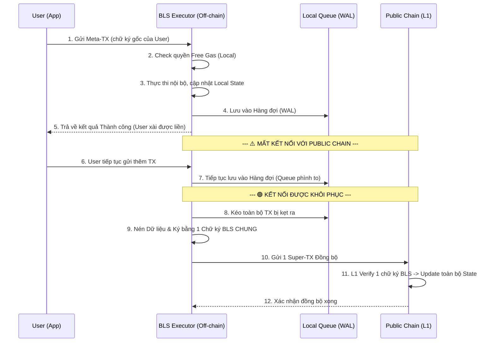

# Thiết kế Kiến trúc Execution Proxy với BLS Aggregation cho Hệ thống Ký hộ

## 1. Tổng quan Kiến trúc (Đánh giá lại)
Hệ thống này được thiết kế **chỉ tập trung vào việc thực thi (Execution Only)** với hai đặc điểm quan trọng nhất:
1. **Chung một chữ ký BLS (BLS Signature Aggregation):** Tất cả tài khoản/giao dịch thuộc hệ thống này dùng chung một chữ ký BLS đại diện khi gửi lên mạng chính.
2. **Khả năng Hoạt động Ngoại tuyến (Offline-First / Asynchronous Sync):** Hệ thống có khả năng hoạt động hoàn toàn độc lập ngay cả khi mất kết nối với mạng chính (Public Chain). Giao dịch vẫn được xử lý, trạng thái vẫn được cập nhật, và việc đồng bộ lên mạng chính sẽ được thực hiện sau (Deferred Sync) khi kết nối phục hồi.

**Mục tiêu cốt lõi:**
- **Thực thi Độc lập:** Node (Executor) nhận giao dịch, chạy state nội bộ và tính toán kết quả mà không cần chờ L1.
- **Tiết kiệm tối đa chi phí trên L1:** Nhờ BLS Aggregation, mạng chính chỉ tốn chi phí xác minh 1 chữ ký cho hàng ngàn giao dịch thay vì hàng ngàn chữ ký ECDSA riêng lẻ.

---

## 2. Các Thành phần (Components)

### 2.1. BLS Executor (Node Thực thi Off-chain Độc lập)
Đây là service chạy độc lập (ví dụ `pkg/rollup/executor.go`), bao gồm:
1. **RPC Endpoint:** Nhận Meta-transaction từ User.
2. **Local State Engine & FreeGas DB:** Sở hữu một bản sao trạng thái nội bộ (Local State) và DB kiểm tra quyền Free Gas. Thực thi giao dịch và thay đổi số dư/trạng thái *ngay lập tức*. Trả kết quả thành công cho người dùng (Fast Finality).
3. **WAL (Write-Ahead Log) & Batch Queue:** Lưu trữ an toàn tất cả các giao dịch đã thực thi vào ổ đĩa. Nếu mất kết nối L1, dữ liệu vẫn nằm an toàn trong Queue chờ ngày được gửi đi.
4. **BLS Aggregator (Bộ cộng gộp chữ ký):** 
   - Gom $N$ giao dịch thành một lô (Batch).
   - Node Executor dùng **Private Key BLS tổng** của hệ thống (đại diện cho toàn bộ pool tài khoản này) để ký lên toàn bộ dữ liệu lô (Batch Payload).
5. **Relayer (Trình đồng bộ):** Chịu trách nhiệm theo dõi kết nối với Public Chain. Gửi Transaction chứa Batch Data + **1 Chữ ký BLS duy nhất** lên Public Chain. Tự động retry khi rớt mạng.

### 2.2. L1 Smart Contract / Core Logic (Trên Public Chain)
1. **BLS Proxy Contract / Consensus Precompile:**
   - Verify **đúng 1 chữ ký BLS** đối chiếu với **BLS Public Key chung** của Executor.
   - Khi verify thành công, Public Chain unpack Batch Data và cập nhật State hàng loạt.

---

## 3. Khả năng Chạy Độc Lập (Offline/Asynchronous Mode)

Để Executor vẫn chạy bình thường khi **mất kết nối** với Public Chain, hệ thống áp dụng cơ chế **Asynchronous Sync**:

1. **Thực thi và Phản hồi Tức thì:** Người dùng gửi giao dịch, Executor xác thực qua LevelDB (Local), cập nhật Local State và báo thành công cho người dùng trong vài mili-giây.
2. **Lưu trữ Cục bộ (Persistent Queue):** Giao dịch được ghi vào một hàng đợi (Queue) trên ổ đĩa. Executor cứ tiếp tục gộp Batch (Ví dụ: Batch 1, Batch 2, Batch 3...) nhưng giữ ở trạng thái `PENDING_SYNC`.
3. **Phục hồi Kết nối (Re-sync):** Khi Relayer phát hiện có kết nối lại với Public Chain:
   - Nó có thể gửi lần lượt từng Batch đang kẹt.
   - **Tối ưu hơn:** Nó gom tất cả các Batch đang kẹt lại thành một **Super-Batch** khổng lồ và chỉ cần dùng **1 chữ ký BLS** để đồng bộ toàn bộ thời gian offline đó lên L1 trong 1 giao dịch duy nhất.

---

## 4. Luồng Xử lý Giao dịch (Workflow)

---

## 5. Rủi ro và Vấn đề Cần Xử lý (Trust & State Conflict)

1. **Vấn đề Xung đột Trạng thái (State Conflict - Split Brain):**
   - **Tình huống:** Nếu trong lúc Executor bị mất kết nối mạng, một User lấy trực tiếp Account của họ lên L1 (Public Chain) thực hiện giao dịch (rút tiền). Khi Executor online lại và đẩy Batch lên, số dư trên L1 không còn khớp với Local State của Executor.
   - **Giải pháp bắt buộc (State Partitioning):** Để Executor có thể tự tin chạy độc lập offline, L1 **PHẢI** khóa (lock) quyền thay đổi số dư của các tài khoản này trên Public Chain. Hoặc định nghĩa rõ: Bất kỳ tài khoản nào đã tham gia hệ thống BLS Executor này thì **mọi giao dịch chi tiêu bắt buộc phải đi qua Executor**. L1 sẽ từ chối giao dịch trực tiếp từ người dùng cho đến khi họ gọi lệnh "Thoát khỏi Executor" (Withdraw/Exit).

2. **Vấn đề "Điểm tập trung" (Single Point of Trust):**
   - L1 tin tưởng hoàn toàn vào **Chữ ký BLS chung**. Nếu Executor bị lộ Private Key BLS, hacker có thể tự tạo Batch giả.
   - **Giải pháp:** Bảo mật Private Key BLS này cực kỳ cẩn thận (KMS, MPC).

---

## 6. Cấu trúc Code Đề xuất (pkg/rollup/)

- `executor.go`: Vòng lặp nhận giao dịch, thực thi state thay đổi nội bộ độc lập.
- `queue_wal.go`: Write-Ahead Log, lưu trữ giao dịch xuống ổ cứng an toàn, đảm bảo không mất dữ liệu khi cúp điện/sập node.
- `bls_aggregator.go`: Nén dữ liệu giao dịch thành mảng byte, và dùng BLS Private Key chung tạo Aggregate Signature.
- `relayer.go`: Vòng lặp theo dõi kết nối L1. Lấy dữ liệu từ Queue ra gửi lên mạng chính khi có mạng.
- `state_db.go`: Lưu trạng thái local của các tài khoản.
