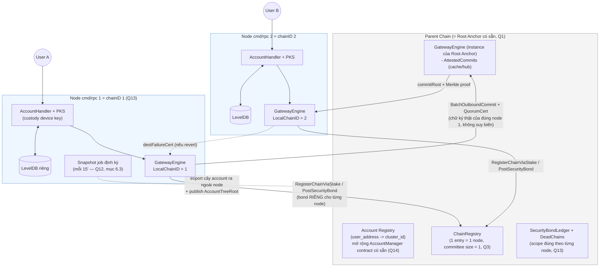
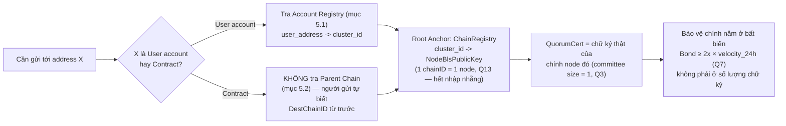
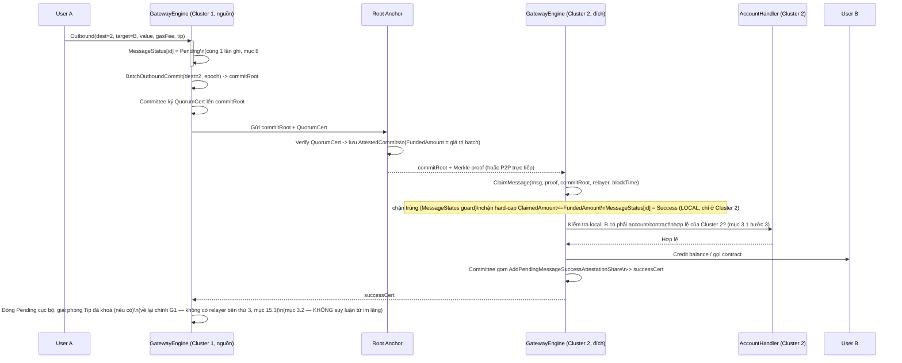
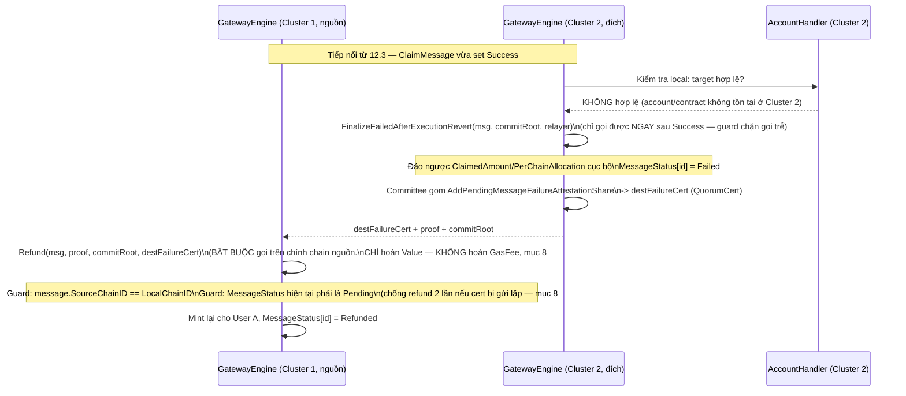
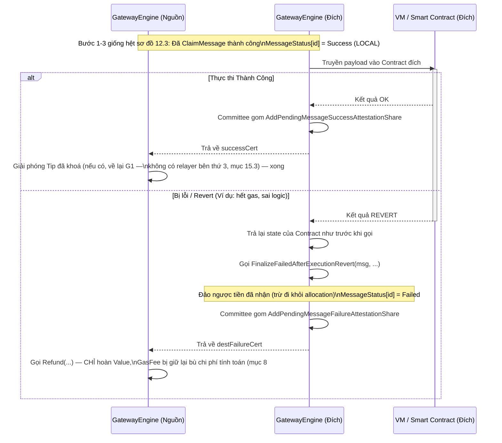
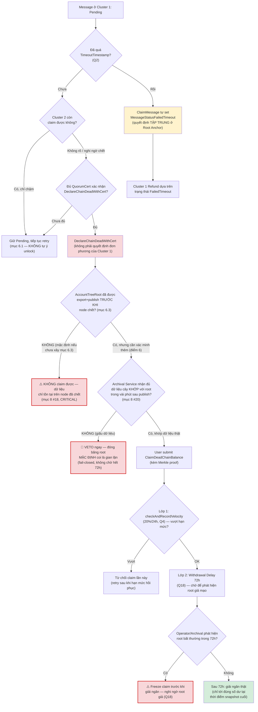
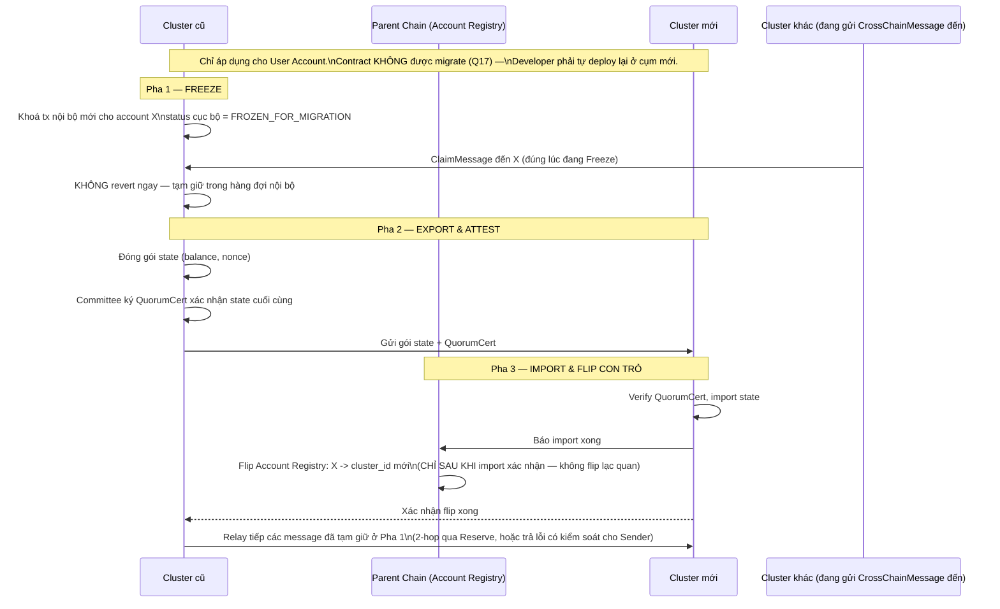
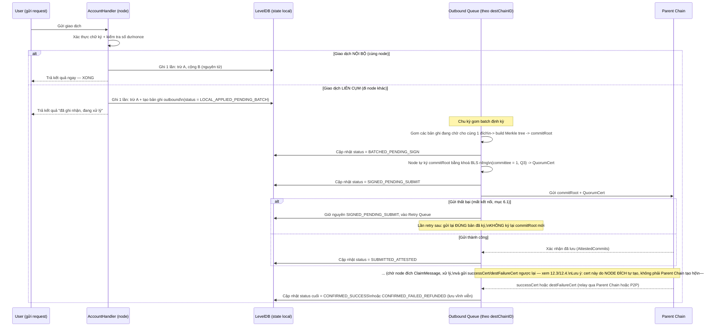

# Thiết kế Kiến trúc BLS Cluster & Giao tiếp Cross-Cluster (Thay thế Parent Chain Execution)

> **Cập nhật mới:** Parent Chain hiện tại KHÔNG CÒN xử lý logic smart contract hay chuyển tiền. Parent Chain chỉ đóng vai trò là **Registry (Đăng ký tài khoản, phân bổ BLS)** và **Relay/Router (Luân chuyển tin nhắn Cross-Cluster)**. Mọi logic state (balance, contract) được xử lý hoàn toàn nội bộ tại các Cụm BLS (BLS Clusters).

> ⚠️ **CẢNH BÁO KIẾN TRÚC QUAN TRỌNG (đọc trước khi triển khai):** Bài toán "nhiều cụm độc lập giữ state riêng, cần chuyển giá trị/gọi contract an toàn giữa các cụm" **đã tồn tại và đã được audit nhiều vòng** trong chính repo này, tại `execution/pkg/cross_chain/gateway.go` (`GatewayEngine`). Hệ thống đó đã có: `ChainRegistry` (đăng ký chain qua stake), `PerChainAllocation` (bất biến tổng cung — `ErrInvariantViolation`), `QuorumCert` + Merkle-proof cho việc claim message (`ClaimMessage`), hard-cap `FundedAmount`/`ClaimedAmount`, `SecurityBond`+`SlashOnEquivocation`, `DeadChains`/`DeclareChainDeadWithCert`+`ClaimDeadChainBalance`, `Refund`/`FinalizeFailedAfterExecutionRevert`, `TimeoutTimestamp` trên message. Bản thiết kế "Cross-Cluster Message (CCM)" ở mục 3 (bản trước) tự viết lại y hệt bài toán này nhưng **thiếu gần hết các cơ chế trên** — mỗi phần thiếu tương ứng với một lỗi logic/bảo mật cụ thể được liệt kê ở mục 8. Khuyến nghị: **coi mỗi BLS Cluster là một `chainID` đăng ký trong `ChainRegistry`, và tái dùng `GatewayEngine` làm tầng chuyển giá trị/message giữa các cụm**, thay vì xây `CrossClusterMessage`/`Outbox` riêng.

---

## 1. Tổng quan Kiến trúc

**Mục tiêu cốt lõi:**
- **Thực thi phân tán (Sharded Execution):** Mỗi Cụm BLS (Cluster) hoạt động như một shard độc lập, quản lý state, balance và smart contract của tập người dùng thuộc Cluster đó.
- **Parent Chain làm mỏ neo (Anchor):** Parent Chain chỉ quản lý danh bạ tài khoản (Account → Cluster) và xác thực danh tính các Cluster, hoàn toàn giải phóng khỏi việc xử lý giao dịch. **Đã chốt: Parent Chain chính là Root Anchor hiện có trong `pkg/cross_chain`**, không dựng chain coordination mới (mục 10.1 Q1).
- **Cross-Cluster Interoperability:** Chuyển tiền và gọi smart contract giữa 2 Cụm BLS khác nhau, dùng lại cơ chế `CrossChainMessage` + `QuorumCert` đã có, không phát minh giao thức mới.

---

## 2. Phân chia Vai trò

### 2.1. Parent Chain / Root Anchor (Coordination Layer)
- **Đăng ký tài khoản (Account Registry):** Giữ nguyên luồng đăng ký tài khoản với BLS như chain cũ. Map `User_Address -> Cluster_ID`. **(Đây là phần MỚI, chưa có sẵn trong `pkg/cross_chain` — chi tiết mục 5.)**
- **Đăng ký & xác thực danh tính Cluster:** Mỗi Cluster đăng ký như một `chainID` qua `GatewayEngine.RegisterChainViaStake` (đã có sẵn) — tự động có `NodeBlsPublicKey`/committee, `SecurityBond`, và tham gia được `PerChainAllocation`.
- **Relay/Attest tin nhắn:** Dùng nguyên cơ chế checkpoint + `QuorumCert` đã có (`SubmitCheckpoint`, `AttestCommit`, `BatchOutboundCommit`) — **không dùng chữ ký đơn lẻ của 1 node** cho việc di chuyển giá trị (xem mục 8, vấn đề #1).
- **KHÔNG LƯU STATE ứng dụng:** Không lưu balance/contract-state của người dùng cuối. Nếu đóng vai trò relay/hub cho route "qua Root Anchor" (mục 3.1 bước 2), Root Anchor có thể giữ một bản cache `AttestedCommits` để tiện chuyển tiếp cho Cluster đích — nhưng đây vẫn là sổ cái **kế toán liên-cụm** (protocol ledger), không phải state ứng dụng, và **không phải bản duy nhất/quyền uy nhất**: mỗi Cluster vẫn tự giữ và tự verify lại bản của mình trước khi tin (xem mục 3.2, mục 7 để tránh hiểu nhầm đây là 1 bảng dùng chung toàn hệ thống).
- **Cách định vị 1 account/contract về đúng Node/BLS quản lý (2 bước tra cứu):** (1) `Account Registry` (mục 5.1) trả về `cluster_id` từ `user_address`; (2) `ChainRegistry` (đã có sẵn) trả về `Committee`/`NodeBlsPublicKey` từ `cluster_id`. Xác thực nguồn gốc message dựa đúng vào chữ ký `QuorumCert` ký trên checkpoint bằng committee đó. **Đúng như mô tả.** Sau khi chốt Q13 (1 node = 1 chainID), `Committee` của mỗi Cluster luôn chỉ có đúng 1 `NodeBlsPublicKey` — `QuorumCert` về bản chất luôn là chữ ký đơn của chính node đó, đây là sự thật đã chấp nhận (Q3), phòng thủ chính nằm ở bất biến bond-vs-exposure (mục 4 điểm 6, Q7).

### 2.2. BLS Cluster (Execution Layer)
- **Quản lý State Nội bộ:** Mỗi Cluster sở hữu database riêng (LevelDB) lưu trữ balance, nonce, và state của smart contract.
- **Custody Private Key (PKS):** Cluster giữ device key của người dùng để ký hộ (không đổi, xem bản thiết kế `cmd/rpc` trước).
- **Thực thi Giao dịch Nội bộ (Intra-Cluster):** Giao dịch giữa User A và User B (cùng Cluster) được xử lý ngay lập tức, cập nhật state nội bộ mà không cần gửi lên Parent Chain.
- **Xử lý Giao dịch Liên cụm (Cross-Cluster):** Gọi `GatewayEngine.Outbound(...)` của chính Cluster mình (mỗi Cluster chạy 1 instance `GatewayEngine` với `LocalChainID = cluster_id`) khi đích đến nằm ở Cluster khác — không tự đóng gói/tự ký CCM thủ công.

### 2.3. Rủi ro Custody tập trung (PKS giữ Device Key) — chưa có gì mới giải quyết, cần ghi nhận rõ

Mục 2.2 kế thừa nguyên mô hình custody từ bản thiết kế `cmd/rpc` trước: Cluster giữ 100% device key của user để ký hộ. Trong bối cảnh Cluster giờ còn cầm cả quyền phát `Outbound`/tham gia ký `QuorumCert` cross-cluster, rủi ro này cần nhìn lại nghiêm túc hơn:

- **Nếu Node/Cluster bị hack:** kẻ tấn công có device key trong tay, có thể ký giao dịch **nội bộ trong cùng Cluster** y hệt user thật — không để lại bằng chứng mật mã nào chứng minh "đây không phải user ký", vì chữ ký vẫn hợp lệ theo đúng key đã đăng ký. **Đây là vấn đề bảo mật cục bộ (local), các cơ chế `SecurityBond`/`QuorumCert`/`PerChainAllocation` ở mục 4 KHÔNG bảo vệ được trường hợp này**, vì tiền không hề rời khỏi Cluster (không đi qua `Outbound`/`ClaimMessage`) nên không có gì để chặn hay slash.
- **Không thể "giải quyết triệt để bằng kỹ thuật"** nếu vẫn giữ mô hình custody 100% — đây là đánh đổi cố hữu của "ký hộ" (đã ghi nhận từ bản `cmd/rpc`). Việc cần làm là **giảm thiểu**, không phải loại bỏ:
  1. **Giới hạn rút/chuyển theo ngưỡng + độ trễ (withdrawal delay):** giao dịch vượt một ngưỡng giá trị nhất định bị delay + thông báo cho user (qua kênh ngoài, ví dụ notification đã có ở `cmd/rpc`) trước khi thực thi, cho user cơ hội phát hiện bất thường.
  2. **Phát hiện bất thường (anomaly detection):** cảnh báo vận hành khi 1 account có pattern giao dịch lệch hẳn lịch sử (rút cạn số dư, chuyển hết sang 1 địa chỉ lạ trong Cluster).
  3. **Chế độ non-custodial tuỳ chọn cho tài khoản giá trị cao:** cho phép user tự giữ key (tự ký, Cluster chỉ forward) thay vì bắt buộc custody 100% — nên là lựa chọn, không áp đặt toàn hệ thống.
- **Đây là quyết định về threat model, không phải bug kỹ thuật** — cần đội vận hành xác nhận mức rủi ro custody này có chấp nhận được cho quy mô tài sản dự kiến hay không, trước khi go-live (mục 10.1 Q9).

### 2.4. Kiến trúc nội bộ: 1 Node `cmd/rpc` = 1 `chainID` riêng (ĐÃ CHỐT — Q13)

⚠️ **Đây từng là chỉnh sửa nền tảng gây ra #15-#18, nay đã CHỐT hướng giải quyết.** Ban đầu có đề xuất nhóm nhiều node `cmd/rpc` (mỗi node 1 "BLS ký hộ" độc lập, không chia sẻ state, tự thực thi cục bộ) dưới 1 `chainID` chung. Phân tích sâu cho thấy: `GatewayEngine.ChainRegistry.Committee`/`QuorumThreshold`/`SecurityBond`/`checkAndRecordVelocity`/`AccountTreeRoot` **đều hoạt động ở đúng granularity `chainID`**, ngầm giả định `chainID` = 1 đơn vị tin cậy/replication duy nhất (giống các chain BFT thật khác trong `pkg/cross_chain`, nơi cả committee cùng giữ state). Nhóm nhiều node độc lập-không-chia-sẻ-state dưới 1 `chainID` phá vỡ đúng giả định này ở **4 chỗ cùng lúc** (#15 collateral damage, #16 noisy-neighbor velocity, #17 QuorumCert suy biến không phát hiện được, và làm phức tạp thêm #18).

**QUYẾT ĐỊNH: mỗi node `cmd/rpc` đăng ký như 1 `chainID` riêng qua `RegisterChainViaStake`, không nhóm nhiều node dưới 1 chain.** Hệ quả trực tiếp:

- **#15 (collateral damage) — RESOLVED:** `SlashOnEquivocation`/`DeclareChainDeadWithCert` giờ chỉ ảnh hưởng đúng 1 node/chainID, không còn "hàng xóm vô tội" nào để liên luỵ.
- **#16 (noisy neighbor velocity) — RESOLVED:** `checkAndRecordVelocity` tính theo `sourceChainID` giờ tự nhiên scope đúng theo từng node, không cần sub-ledger nào thêm.
- **#17 (QuorumCert suy biến không phát hiện được) — RESOLVED theo hướng khác:** không còn "committee nhiều node giả vờ đồng ký hộ 1 node" nữa — mỗi `chainID` chính là 1 node, `QuorumCert` của nó **thành thật là chữ ký của đúng node đó**, không còn nhập nhằng "ai thực sự sở hữu account". Không cần lớp kiểm tra "partition ownership" (Node Registry nội bộ, dispatch `node_id`) nữa — **bỏ hoàn toàn, đơn giản hoá lại mục 3.1/5.1 như bản gốc (`user_address -> cluster_id` 2 cột, không cần `node_id`)**.
- **Đánh đổi còn lại, KHÔNG biến mất:** vì mỗi node-chainID thực tế vẫn chỉ có 1 signer thật (đúng bản chất `cmd/rpc`), "chữ ký đơn" vẫn là sự thật — nhưng giờ đây là **1 sự thật hiển nhiên, được xử lý đúng bằng bất biến Bond-vs-Exposure (mục 4 điểm 6)**, không còn là 1 lỗ hổng ẩn giấu sau vẻ ngoài "nhiều node cùng ký". Đây chính là câu trả lời cho Q3 (mục 10.1): **committee mỗi node-chainID chấp nhận là 1 (không có redundancy signer thật để thêm mà không phá vỡ tiền đề "1 node = 1 thực thể ký hộ độc lập"), phòng thủ chính nằm ở bất biến bond-vs-exposure, không nằm ở số lượng chữ ký.**
- **#18 (Snapshot & Archival Pipeline, mục 6.3) — KHÔNG biến mất, vẫn bắt buộc xây:** nguyên nhân gốc của #18 là dữ liệu chỉ tồn tại trên 1 node vật lý, không liên quan gì đến việc gộp nhiều node dưới 1 chainID hay không — dù chọn "1 node = 1 chainID", node đó vẫn là **điểm lưu trữ duy nhất** cho account tree của chính nó.
- **Chi phí đánh đổi (cần đội xác nhận chấp nhận được, nhưng không chặn thiết kế):** số lượng `chainID`/bond đăng ký tăng theo đúng số node (không theo số "cluster" như dự tính ban đầu) — ảnh hưởng trực tiếp Q5 (kế hoạch vốn Reserve, xem mục 10.1).

---

## 3. Cơ chế Chuyển giá trị/Gọi Contract Cross-Cluster (tái dùng `GatewayEngine`)

Khi User A (Cluster 1) muốn chuyển tiền hoặc gọi Contract cho User/Contract B (Cluster 2).

### 3.1. Luồng hoạt động (Workflow)

1. **Khởi tạo tại Cluster 1 (Nguồn):**
   - User A gửi yêu cầu tới Cluster 1's `AccountHandler`.
   - Cluster 1 gọi `GatewayEngine.Outbound(sender=A, params{DestChainID: 2, Target: B, Value, Payload, GasFee, Tip}, txHash)` — hàm này **đã tự** gán `MessageID`, `Sequence`, set `MessageStatusPending`, và đưa vào `PendingOutboundMessages[2]`. **Không tự trừ tiền cục bộ trước** rồi mới build message riêng — việc khoá state phải nằm trong cùng logic với `Outbound` (xem vấn đề #2, mục 8) để tránh trừ tiền xong nhưng message không bao giờ được ghi nhận nếu crash giữa chừng. (`Tip` là tham số kế thừa từ chữ ký hàm gốc, không có ý nghĩa kinh tế thật trong kiến trúc này — xem giải thích đầy đủ ở bước 3 bên dưới và mục 15.3.)
   - Cluster 1 **không tự ký CCM bằng khoá node đơn lẻ**. Giá trị chỉ thực sự di chuyển được sau khi message nằm trong một **checkpoint đã được cả committee của Cluster 1 attest** (`QuorumCert`), theo đúng cách `AttestCommit`/`SubmitCheckpoint` đang hoạt động.

2. **Luân chuyển & Attest (qua Root Anchor):**
   - Batch các outbound message định kỳ: `BatchOutboundCommit(destChainID=2, epoch)` → sinh `commitRoot` + Merkle tree.
   - Root Anchor nhận `QuorumCert` (đa chữ ký của committee Cluster 1, không phải 1 chữ ký đơn) xác nhận `commitRoot` này là thật → lưu vào `AttestedCommits`, đồng thời hard-cap `FundedAmount` cho commit đó.
   - Cluster 2 lấy `commitRoot` + Merkle proof của message của mình từ Root Anchor (hoặc P2P trực tiếp, tự verify lại `QuorumCert` — như "Cách 2" ở bản trước, vẫn hợp lệ vì không phụ thuộc phải hỏi Root Anchor real-time).

3. **Thực thi đích (Tại Cluster 2 - Đích):**
   - Cluster 2 gọi `GatewayEngine.ClaimMessage(message, proof, commitRoot, relayer, blockTime)`. ⚠️ **`relayer` ở đây luôn chính là địa chỉ của Cluster 2 tự gọi cho mình** — vì mỗi node chạy `GatewayEngine` như 1 instance riêng tư trong tiến trình nội bộ (mục 7, Q6), không phải smart contract công khai, nên **không có bên thứ 3 độc lập nào khác gọi được hàm này thay Cluster 2**. Tham số `relayer` chỉ là kế thừa nguyên chữ ký hàm gốc (vốn dùng cho hệ cross-chain công khai rộng hơn, nơi bên thứ 3 thật sự tồn tại) — trong kiến trúc này nó không mang thêm ý nghĩa kinh tế nào khác ngoài việc tự ghi nhận. Hàm này đã tự:
     - Từ chối claim trùng (`currentStatus != MessageStatusPending` → lỗi `ErrAlreadyClaimed`) — **đây chính là chống-replay bắt buộc**, không phải tính năng tuỳ chọn như bản CCM cũ.
     - Verify Merkle proof + domain-separated leaf hash.
     - Kiểm tra timeout (`TimeoutTimestamp`) — tự động set `MessageStatusFailedTimeout` nếu quá hạn.
     - Kiểm tra đúng `DestChainID == LocalChainID` — chặn 1 message bị claim nhầm chain.
     - Hard-cap `ClaimedAmount <= FundedAmount` — chặn Cluster 2 (hoặc relayer) claim vượt số đã thực sự attest.
   - `ClaimMessage` set `MessageStatus[messageID] = Success` **trên chính engine cục bộ của Cluster 2** (mỗi `GatewayEngine` là 1 instance riêng — Cluster 1 và Cluster 2 KHÔNG chia sẻ chung 1 bảng `MessageStatus`, xem lưu ý ở mục 3.2).
   - **(Đã đơn giản hoá theo Q13/mục 2.4):** vì mỗi `chainID` giờ chính là 1 node duy nhất, không còn bước dispatch `node_id` hay verify "partition ownership" nào cần thêm — `QuorumCert` hợp lệ = chính node đó đã ký, không có node "anh em" nào khác để nhầm lẫn.
   - **Bước kiểm tra tồn tại cục bộ (chưa có sẵn trong `GatewayEngine`, vì engine chỉ làm việc ở mức `chainID`, không biết B là ai):** Cluster 2 kiểm tra local: **`B` có phải account hợp lệ đang được chính mình quản lý không**. Nếu không hợp lệ:
     1. Gọi **ngay lập tức** `FinalizeFailedAfterExecutionRevert(message, commitRoot, relayer)` — hàm này **chỉ chấp nhận gọi khi status hiện tại đúng là `Success` vừa được `ClaimMessage` set** (guard chặn gọi trễ/gọi lại) — nó tự đảo ngược `ClaimedAmount`/`PerChainAllocation` cục bộ và set `MessageStatus = Failed`.
     2. Committee của Cluster 2 gom chữ ký thất bại qua `AddPendingMessageFailureAttestationShare(key, share)` cho đến khi đủ ngưỡng quorum, rồi tổng hợp thành `destFailureCert` (`QuorumCert`).
     3. Gửi `destFailureCert` + proof + `commitRoot` về Cluster 1.

### 3.2. Đóng gói kết quả về Cluster nguồn — KHÔNG có bảng `MessageStatus` dùng chung

⚠️ Sửa một hiểu lầm quan trọng ở bản trước: mỗi `GatewayEngine` là **một instance riêng cho từng chain**, nên `MessageStatus` của Cluster 1 (nguồn) và của Cluster 2 (đích) là **hai bảng độc lập, không tự đồng bộ cho nhau**. Cluster 1 gọi `GetMessageStatus(messageID)` trên chính engine của mình sẽ **mãi mãi thấy `Pending`** cho tới khi chính Cluster 1 tự cập nhật — không có cơ chế "tự động" nào làm việc đó thay nó. Do đó bắt buộc phải có bước tường minh sau, đúng như cách hệ thống hiện có xử lý (không tự chế ACK/NACK riêng, chỉ nối đúng các hàm đã có):

- **Trường hợp thất bại (đích revert, ví dụ account không hợp lệ ở mục 3.1 bước 3):** Cluster 1 nhận `destFailureCert` (mục 3.1), gọi `Refund(message, messageProof, commitRoot, destFailureCert)` **trên chính engine của Cluster 1** (hàm này bắt buộc `message.SourceChainID == LocalChainID` — chỉ gọi được ở đúng chain nguồn). `Refund` tự kiểm tra `MessageStatus` hiện tại phải là `Pending` (chưa từng xử lý) trước khi mint lại cho User A — đây chính là **idempotency guard bắt buộc, chống refund 2 lần** nếu `destFailureCert` bị gửi lặp.
  ⚠️ **Quy tắc bắt buộc (mục 8 #19, chống DoS spam-revert):** verify code xác nhận `Refund()` chỉ khôi phục đúng `message.Value` vào `PerChainAllocation` — **hoàn toàn không đụng đến `GasFee`**, và `FinalizeFailedAfterExecutionRevert` phía đích cũng không claw-back `GasFee` đã cấp khi revert (cùng cách xử lý với `Tip` — xem comment gốc trong code: *"Double Refund of Tip and GasFee on Reverted Executions"*). Vậy **AccountHandler của Cluster 1, khi hoàn tiền cho User A ở tầng local, CHỈ được hoàn `Value` — TUYỆT ĐỐI KHÔNG hoàn lại `GasFee`.** `GasFee` bị mất dù giao dịch thất bại — bù chi phí tính toán thật sự đích đã bỏ ra để thử thực thi rồi phát hiện lỗi. Nếu hoàn cả `GasFee`, kẻ tấn công có thể spam hàng loạt message cố tình gây revert ở Cluster đích (bào CPU/RAM miễn phí) mà không mất 1 xu — đây là điểm dev dễ code sai nhất vì `Value`+`GasFee` bị khoá CÙNG LÚC ở bước `Outbound` (mục 14.3 bước 1), dễ lầm tưởng phải hoàn cùng lúc.
- **Trường hợp thành công:** cơ chế song song `AddPendingMessageSuccessAttestationShare`/`GetPendingMessageSuccessAttestationShares` tồn tại đúng để committee Cluster 2 chứng thực "đã xử lý thành công", cho Cluster 1 (hoặc Reserve, trong định tuyến 2-hop) đóng trạng thái cục bộ của mình một cách có xác thực (dọn `Pending`, giải phóng `Tip` đã khoá nếu có) — **không suy luận "không thấy Failed thì coi như thành công"**, vì im lặng có thể chỉ là do mất kết nối tạm thời (mục 6.1), không phải bằng chứng thành công.

→ Nói ngắn gọn: **cả 2 chiều (thành công/thất bại) đều cần một chứng thực (`QuorumCert`) đi kèm gửi ngược về nguồn**, không có chiều nào được phép suy luận từ sự im lặng.

---

## 4. Bảo mật kinh tế cho Cluster (mới — bắt buộc, không phải tuỳ chọn)

Vấn đề nghiêm trọng nhất của bản thiết kế CCM cũ: **không có gì ngăn một Cluster (do bug hoặc cố ý) phát ra vô hạn message "mint" giá trị ở Cluster khác** mà không thực sự khoá tài sản tương ứng ở Cluster nguồn — vì Parent Chain "KHÔNG LƯU STATE" nên không tự kiểm tra được. Đây là lý do bắt buộc phải dùng nguyên cụm cơ chế đã có:

1. **`PostSecurityBond`**: mỗi Cluster phải ký quỹ bond khi đăng ký (`RegisterChainViaStake`) — mất bond nếu gian lận.
2. **`SlashOnEquivocation`**: phát hiện Cluster ký 2 checkpoint mâu thuẫn (double-sign) → slash bond ngay.
3. **Hard-cap theo `FundedAmount`/`ClaimedAmount`**: một commit chỉ cho claim tối đa đúng số đã thực sự được attest, không thể "mint" vượt mức.
4. **`PerChainAllocation` + bất biến `Σ per_chain_allocation == genesis_total_supply`** (`ErrInvariantViolation`): mọi giao dịch cross-cluster phải giữ tổng cung không đổi — nếu một cluster tự ý cộng tiền không qua `ClaimMessage`, tổng sẽ lệch và bị phát hiện.
5. **Giới hạn tốc độ rút (velocity limit)** — `checkAndRecordVelocity`: đã có sẵn cửa sổ trượt 24h, mặc định chặn nếu 1 Cluster attest-outflow vượt quá **20% allocation tại thời điểm mở cửa sổ** trong 24h. Đây chính là cơ chế chống-spam/giới hạn thiệt hại nếu 1 Cluster bị compromise — không cần thiết kế rate-limit riêng cho CCM, chỉ cần xác nhận ngưỡng 20%/24h này có phù hợp với quy mô BLS Cluster hay cần điều chỉnh (mục 10).
6. **Bất biến Bond-phải-che-phủ-Exposure (mới, bắt buộc — chưa có sẵn trong code, cần thêm ở tầng đăng ký Cluster):** `SecurityBond`/`QuorumCert` chỉ thực sự có tác dụng răn đe nếu **giá trị mất khi bị slash > lợi ích thu được khi gian lận**. Nếu 1 Cluster (đặc biệt Cluster chỉ có 1 node — committee suy biến thành 1 chữ ký, xem cảnh báo cuối mục này) có thể có tổng giá trị cross-cluster đang treo (`ClaimedAmount` cộng dồn trong 1 cửa sổ velocity) **lớn hơn** `SecurityBondLedger` của chính nó, node đó có động lực kinh tế hợp lý để ký khống rồi chấp nhận mất bond — vì lợi vẫn > hại. Quy tắc bắt buộc khi duyệt đăng ký/tăng hạn mức 1 Cluster:
   > `SecurityBond(cluster) ≥ hệ_số_an_toàn × giới_hạn_velocity_24h(cluster)` (hệ số an toàn do đội vận hành chốt, khuyến nghị ≥ 1.5–2x để bù thời gian phát hiện + slash không tức thời).
   
   Đây là **quy tắc governance cần enforce khi đăng ký/tăng allocation cho Cluster**, không phải thứ `GatewayEngine` tự kiểm tra hộ — phải thêm bước duyệt thủ công hoặc on-chain check riêng trước khi chấp nhận nâng hạn mức 1 Cluster (mục 10.1 Q7).
   
   ⚠️ **Cập nhật (mục 2.4/Q13 — ĐÃ CHỐT):** mỗi node `cmd/rpc` = 1 `chainID` riêng, nên đây không còn là "trường hợp cạnh" mà là **sự thật hiển nhiên của mọi node**: `SecurityBond` của 1 `chainID` áp dụng đúng cho đúng 1 node đó, không còn nhập nhằng "bond chung của cả nhóm node" như phương án bị bác bỏ trước đây. Bất biến bond-vs-exposure ở trên **áp dụng trực tiếp theo từng `chainID`/node**, đơn giản, không cần sub-ledger nào thêm. Xem thêm Q3, Q7.

→ Không thiết kế lại các cơ chế này cho BLS Cluster; **đăng ký mỗi Cluster như một `chainID` bình thường trong `GatewayEngine`** là đủ để thừa hưởng toàn bộ tầng bảo mật kinh tế này (trừ điểm 6, là quy tắc governance mới cần tự xây).

---

## 5. Đăng ký & Tra cứu Account/Contract (phần thực sự MỚI, GatewayEngine không có sẵn)

`GatewayEngine` chỉ biết đến `chainID`, không biết định danh user/contract cụ thể nào thuộc cluster nào — đây là phần Parent Chain/Root Anchor cần bổ sung riêng cho use-case này. Cần tách rõ **Account (user, đăng ký tường minh)** và **Contract (sinh ra tự động khi deploy)** vì đặc tính rủi ro khác hẳn nhau.

### 5.1. Account Registry (user, đăng ký tường minh — ĐÃ ĐƠN GIẢN theo Q13/mục 2.4: 1 node = 1 chainID nên không cần cột `node_id` riêng)

| Bảng | Key | Value | Vai trò |
|---|---|---|---|
| Account Registry | `user_address` | `cluster_id` (= chính `chainID` của node sở hữu) | Định tuyến `Target` của message đến đúng node (chainID); node đó tự kiểm tra hợp lệ và credit (mục 3.1 bước 3) — không còn bước dispatch nội bộ nào thêm |

**Vấn đề cần xử lý (đã áp dụng ở mục 3.1):**
- **Đăng ký 1 lần, chống ghi đè tuỳ ý:** chỉ chấp nhận đăng ký lần đầu, hoặc yêu cầu chữ ký của chính Cluster đang giữ account hiện tại nếu muốn "chuyển nhượng" account sang cluster khác — tránh một report cũ/replay vô tình đổi chủ account (chi tiết giao thức chuyển nhượng ở mục 5.3).
- **Chặn 1 account đăng ký đồng thời ở 2 node/Cluster khác nhau (chi tiết đầy đủ ở mục 13, Q1):** cơ chế chặn PHẢI nằm ở chính write vào Account Registry trên Parent Chain (1 dòng transaction, được block/chain xử lý tuần tự) — **không được coi bước admin-confirm cục bộ tại node (`handleSetBlsPublicKey` + confirm, đã có ở `cmd/rpc`) là đủ để "chốt" quyền sở hữu**, vì đó chỉ là hành động local, 2 node khác nhau hoàn toàn có thể cùng confirm cục bộ cho cùng 1 address nếu không có bước xác nhận ngược lại từ Parent Chain.
- **Cluster đích luôn tự kiểm tra lại** account có thuộc mình không trước khi credit (không tin tưởng mù quáng vào `Target` trong message), vì Account Registry ở Parent Chain có thể chưa đồng bộ kịp lúc User A gửi giao dịch.
- **Vì sao registry này an toàn trước DoS:** đăng ký account đi qua đúng luồng `handleSetBlsPublicKey` + admin `confirm` đã có ở `cmd/rpc` (2 bước, có gate admin) — **không permissionless, không tự động**, nên không có đường để spam hàng loạt registration miễn phí. Đây là lý do Contract (mục 5.2) phải xử lý khác hẳn — vì contract sinh ra tự động, không qua gate nào cả.

**Ràng buộc vốn khởi tạo khi 1 Cluster mới đăng ký (đã có sẵn trong `RegisterChainViaStake`, cần đưa vào kế hoạch vận hành):** stake đăng ký của Cluster mới được cấp bằng `TransferAllocation` **rút từ pool của Reserve chain** (không phải mint tự do — điểm này từng bị phát hiện là lỗ hổng mint-không-giới-hạn và đã fix bằng cách bắt buộc rút từ Reserve). Hệ quả: **nếu Reserve không còn đủ allocation, đăng ký Cluster mới sẽ thất bại.** Cần có kế hoạch cấp vốn ban đầu cho Reserve tương ứng với số lượng Cluster dự kiến ra mắt, đây là một precondition vận hành, không phải lỗi logic — liệt kê trong checklist production (mục 10).

### 5.2. Contract Registry — KHÔNG dùng registry toàn cục (khác hẳn Account)

**Vấn đề:** nếu áp dụng y hệt mô hình Account Registry cho contract (mỗi contract mới deploy phải đăng ký lên Parent Chain), sẽ có 2 hệ quả xấu:
1. **DoS/State Bloat:** 1 contract độc hại tự sinh hàng vạn sub-contract (factory pattern) sẽ buộc Cluster spam hàng vạn giao dịch đăng ký lên Parent Chain — không có gate nào chặn vì deploy contract là hành động permissionless trong nội bộ Cluster.
2. **Race Condition khi tra cứu:** nếu message cross-cluster gửi đến ngay sau khi contract vừa deploy nhưng đăng ký lên Parent Chain chưa kịp lan, message sẽ bị định tuyến sai/thất bại dù contract đã tồn tại thật.

**Quyết định thiết kế: không cần Contract Registry toàn cục.** Lý do:
- `Outbound(params{DestChainID, Target, ...})` **đã bắt buộc bên gửi tự chỉ định rõ `DestChainID`** — giống hệt cách mọi hệ multi-chain hiện có hoạt động (người gửi/dApp luôn biết trước contract đích nằm ở chain nào, không có ai "tra cứu ngẫu nhiên" một contract lạ trên toàn hệ thống). Trách nhiệm biết "contract B nằm ở Cluster nào" thuộc về người/dApp tạo giao dịch gửi đi (thường chính là deployer hoặc tài liệu/ABI của dự án), không phải trách nhiệm của Parent Chain.
- Bước kiểm tra tồn tại cục bộ tại đích (đã có sẵn ở mục 3.1 bước 3 cho Account) áp dụng y hệt cho Contract: Cluster đích tự kiểm tra `Target` có phải contract address hợp lệ đang tồn tại tại chính mình không, **hoàn toàn không cần hỏi Parent Chain** — nếu sai, `FinalizeFailedAfterExecutionRevert` + refund như bình thường (mục 3.1, mục 3.2).
- **Kết quả:** loại bỏ hoàn toàn con đường DoS (không có API "đăng ký contract" nào để spam) và loại bỏ luôn race condition tra cứu (vì không có bước tra cứu Parent Chain nào cho contract — chỉ có kiểm tra cục bộ tại đích, vốn dĩ luôn đồng bộ với chính state của Cluster đó).
- **Đánh đổi:** người dùng cuối không thể "gửi tới 1 địa chỉ contract mà không biết trước cluster nào" — chấp nhận được vì đây vốn là hạn chế bình thường của mọi kiến trúc multi-chain/multi-shard, không phải thứ cần Parent Chain giải quyết hộ.

### 5.3. Giao thức Chuyển nhượng Account (Migration) — 3 pha, chặn race condition (User Only)

⚠️ **Lưu ý quan trọng (Lỗi logic đã sửa):** Chỉ có **Account của User** mới được phép Migrate. **Smart Contract KHÔNG ĐƯỢC PHÉP Migrate (Tài sản bất di bất dịch)**. Lý do: Mục 5.2 đã loại bỏ Contract Registry để chống Spam, nên nếu Contract đổi `chainID`, các dApp/Contract khác sẽ không thể biết địa chỉ mới của nó, dẫn đến tàng hình và mất kết nối. Nếu muốn đổi cụm, Developer phải tự deploy lại Contract ở cụm mới.

Bản trước chỉ ghi 1 câu "yêu cầu chữ ký của cluster hiện tại" — chưa đủ, vì chuyển account không chỉ là đổi 1 record ở Parent Chain mà phải di dời cả **state thật** (balance, nonce), và trong lúc di dời, một `CrossChainMessage` gửi đến account này có thể bị kẹt nếu cả 2 Cluster đều từ chối nhận. Giao thức 3 pha, mượn đúng tinh thần "chuyển trạng thái cần `QuorumCert`" đã dùng cho `UpdateCommitteeWithRecoveryCert`/`DeclareChainDeadWithCert`:

1. **Pha Freeze (tại Cluster cũ):** Cluster cũ **khoá** account (từ chối tx nội bộ mới, nhưng **không xoá state**, và **không từ chối `ClaimMessage` đến** — thay vào đó đưa vào hàng đợi tạm giữ nội bộ, không revert ngay). Trạng thái `FROZEN_FOR_MIGRATION` được ghi nhận cục bộ.
2. **Pha Export & Attest:** Cluster cũ đóng gói toàn bộ state cần chuyển (balance, nonce) thành 1 gói dữ liệu, cả committee Cluster cũ ký thành `QuorumCert` xác nhận "đây là state cuối cùng, chính xác, tại thời điểm freeze". Gửi gói này + cert sang Cluster mới.
3. **Pha Import & Mở khoá (tại Cluster mới):** Cluster mới verify `QuorumCert`, import state, rồi mới báo lên Parent Chain để **flip con trỏ Account Registry** (`user_address -> cluster_id mới`). **Chỉ sau khi Cluster mới xác nhận import xong**, Cluster cũ mới xử lý nốt các `ClaimMessage` đã tạm giữ trong Pha Freeze — bằng cách relay chúng tiếp sang Cluster mới (dùng lại chính cơ chế 2-hop route qua Reserve đã có, `ReleaseRelayedValue`), hoặc trả lỗi có kiểm soát cho người gửi để họ tự gửi lại đúng địa chỉ Cluster mới.

**Bất biến bắt buộc:** tại mọi thời điểm, chỉ có **đúng 1 Cluster** (cũ HOẶC mới, không bao giờ cả hai hoặc không cluster nào) được coi là "sở hữu" account đó theo Parent Chain — con trỏ chỉ flip đúng 1 lần, sau khi đã có xác nhận import thành công, không flip "lạc quan" trước khi chắc chắn. Đây là điểm khác biệt quan trọng với thiết kế "ghi đè record" đơn giản ở bản trước.

---

## 6. Xử lý Mất kết nối & Cluster chết vĩnh viễn

Bản trước chỉ xử lý mất kết nối *tạm thời*. Cần tách rõ 2 tình huống khác nhau vì cách xử lý và rủi ro khác hẳn nhau:

### 6.1. Mất kết nối tạm thời
- **Giao dịch Nội bộ:** Vẫn hoạt động 100% bình thường kể cả khi mất mạng với Parent Chain, vì state nằm hoàn toàn tại Cluster.
- **Giao dịch Cross-Cluster:** Nếu gửi checkpoint/claim thất bại do mất mạng, Cluster giữ nguyên item trong `PendingOutboundMessages`/hàng đợi gửi checkpoint cục bộ (LevelDB), retry theo `MessageID` cố định — **không build lại message mới với ID khác cho cùng 1 yêu cầu**, nếu không có thể tạo 2 message hợp lệ cho cùng 1 ý định chi tiêu.

### 6.2. Cluster đích không phản hồi vĩnh viễn (chết hẳn, không phải mất mạng tạm thời)
Đây là lỗ hổng bị bỏ sót hoàn toàn ở bản trước: nếu Cluster 1 tự ý "timeout rồi unlock/refund cho User A" theo phán đoán riêng của mình, trong khi Cluster 2 thực ra chỉ chậm chứ không chết hẳn và **sau đó vẫn credit cho User B** → giá trị bị tạo ra 2 lần từ 1 lần khoá (double-spend kinh điển ở các cầu nối liên chuỗi). Vì vậy:
- **Không cho một Cluster tự ý unlock theo timeout riêng của nó.** Dùng `TimeoutTimestamp` đã có trên `CrossChainMessage` — khi hết hạn, `ClaimMessage` tự chuyển `MessageStatusFailedTimeout` một cách **thống nhất trên Root Anchor** (nguồn sự thật duy nhất), rồi Cluster 1 mới được refund dựa trên trạng thái đó. (Lưu ý: đây chỉ giải quyết được giá trị **đang treo trong 1 message cross-cluster cụ thể** — không giải quyết được số dư thông thường của user nằm trong Cluster/Node đã chết, xem mục 6.3.)
- **Nếu Cluster chết hẳn:** dùng `DeclareChainDeadWithCert` + `ClaimDeadChainBalance` để user rút lại tài sản — **NHƯNG đã kiểm tra code thật và phát hiện đây KHÔNG tự động hoạt động được** với mô hình đã chốt ở mục 2.4 (mỗi node không chia sẻ state). Chi tiết + thiết kế bổ sung bắt buộc ở mục 6.3.

### 6.3. ⚠️ `ClaimDeadChainBalance` KHÔNG tự hoạt động được — cần xây thêm Snapshot & Archival Pipeline

**Bằng chứng từ code (`gateway.go`):**

```go
func (g *GatewayEngine) ClaimDeadChainBalance(..., proof MerkleProof, accountLeafHash common.Hash) error {
    ...
    if !VerifyMerkleProof(accountLeafHash, proof, registry.AccountTreeRoot) {
        return ErrInvalidMerkleProof
    }
    ...
}
```

`ClaimDeadChainBalance` bắt buộc user cung cấp 1 Merkle proof đối chiếu với `ChainRegistry.AccountTreeRoot`. Grep toàn bộ nơi field này được **ghi** thì chỉ có đúng 1 chỗ: `UpdateCommitteeWithRecoveryCert` — một luồng "recovery" ngoại lệ, cần `QuorumCert` riêng. **`SubmitCheckpoint` (luồng chạy định kỳ, bình thường) KHÔNG hề cập nhật field này** — nó chỉ cập nhật `Checkpoints[chainID].StateRoot`, một field hoàn toàn khác, không liên quan.

**Hệ quả — đúng như trực giác đã nêu:**

1. **Trong vận hành bình thường, `AccountTreeRoot` gần như chắc chắn vẫn là hash rỗng (chưa từng được set)** — vì không có gì tự động publish nó. Không có root → `VerifyMerkleProof` luôn thất bại → `ClaimDeadChainBalance` **không thể gọi thành công**, bất kể user có bằng chứng gì.
2. Ngay cả nếu root từng được publish (qua đúng con đường ngoại lệ `UpdateCommitteeWithRecoveryCert`), **Merkle proof (danh sách sibling hash) không tự nhiên mà có** — dữ liệu để tính proof là **toàn bộ cây tài khoản**, và cây đó **chỉ tồn tại trên chính node đã chết** (mục 2.4: không node nào khác giữ bản sao). Node chết = dữ liệu để tạo proof cũng biến mất theo, không ai — kể cả Root Anchor — có thể tự tính hộ.
3. **Khác biệt nền tảng với thiết kế gốc của `GatewayEngine`:** cơ chế `AccountTreeRoot`/recovery này vốn được thiết kế cho 1 chain có **committee nhiều validator cùng đồng thuận, cùng giữ replica state** (giống các chain thật khác trong `pkg/cross_chain`) — khi 1 validator/leader chết, các validator còn lại trong committee **vẫn còn đủ state** để tự tính root + attest recovery. Mô hình BLS Cluster (mục 2.4) phá vỡ đúng giả định này: 1 node = 1 partition độc quyền, không ai khác có bản sao.

**Kết luận: nếu không xây thêm hạ tầng dưới đây, mục 6.2 "user tự ClaimDeadChainBalance có kiểm soát" chỉ là lời hứa trên giấy — hậu quả thực tế giống hệt kịch bản tệ nhất từng cảnh báo ở bản CCM đầu tiên (tài sản khoá vĩnh viễn khi node chết).** Đây là **Critical**, liệt kê ở mục 8 #18. Hơn nữa, nó mở ra 1 lỗ hổng cực kỳ nghiêm trọng: **Bypass Velocity Limit** nếu không có chốt chặn.

**Thành phần mới bắt buộc phải xây (không có sẵn trong `GatewayEngine`, không thể bỏ qua nếu muốn mục 6.2 an toàn và có thật):**

1. **Snapshot Export định kỳ, PROACTIVE (lúc node còn sống, không phải sau khi chết):** mỗi node `cmd/rpc` định kỳ (ví dụ mỗi N phút) tự tính cây Merkle của toàn bộ account state, và **export cây (hoặc tối thiểu đủ dữ liệu để tính lại proof cho bất kỳ account nào) ra một nơi lưu trữ BÊN NGOÀI chính node đó** (backup server độc lập, object storage, hoặc broadcast công khai). Nếu chỉ export root mà không export dữ liệu cây, root publish được cũng vô dụng vì không ai tính được proof.
2. **Publish `AccountTreeRoot` có xác thực lên Root Anchor mỗi lần export** — dùng `UpdateCommitteeWithRecoveryCert` cho việc này là dùng sai mục đích tên gọi (dành cho recovery, không phải publish định kỳ khi khoẻ mạnh); cần xác nhận với đội có nên thêm 1 API mới ở tầng chain-cụ-thể, tránh sửa `GatewayEngine` dùng chung (đúng tinh thần thận trọng đã nêu ở Q11). ⚠️ **Ràng buộc bắt buộc (xem điểm 6 — chống Data Availability Withholding):** Root Anchor **không được coi 1 root là hợp lệ chỉ vì có chữ ký đúng** — phải có thêm bằng chứng dữ liệu thật đứng sau root đó đã đến tay Archival Service.
3. **Chốt chặn CRITICAL — đã cụ thể hoá (mục 10.1 Q18): kết hợp CẢ HAI lớp, không phải "HOẶC" 1 trong 2.** Verify code xác nhận `ClaimDeadChainBalance` gọi thẳng `SupplyLedger.TransferAllocation`, **không hề gọi `checkAndRecordVelocity`** — bỏ sót hoàn toàn lớp phòng thủ mà luồng `Outbound`/`AttestCommit` bình thường vẫn có. Kết hợp với Q3 (committee mỗi node = 1, tự ký root của chính mình), 1 node độc hại hoàn toàn có thể tự publish root giả (gán 100% TVL cho địa chỉ mình kiểm soát) rồi "chết" để rút sạch ngay lập tức. Quyết định 2 lớp:
   - **Lớp 1 (bắt buộc, tái dùng cơ chế có sẵn — không cần code mới):** mọi giá trị chuyển qua `ClaimDeadChainBalance` phải đi qua đúng `checkAndRecordVelocity` (20%/24h, Q4) như mọi luồng khác — chặn được rút 100% TVL trong 1 lần, nhưng riêng nó vẫn để hacker rút hết trong ~5 ngày (5 × 20%).
   - **Lớp 2 (mới, cần xây — Withdrawal Delay/Challenge Window):** thêm tối thiểu **72 giờ** giữa lúc `ClaimDeadChainBalance` được submit và lúc giá trị thực sự được giải ngân, cho operator/dịch vụ archival (điểm 5) có thời gian đối chiếu root vừa publish với bản snapshot hợp lệ gần nhất — nếu phát hiện sai lệch, freeze claim trước khi tiền rời hệ thống vĩnh viễn.
   - Hai lớp bổ trợ nhau: lớp 1 chặn tốc độ rút, lớp 2 chặn cả trường hợp rút chậm nhưng vẫn gian lận trong nhiều ngày.
   - ⚠️ **Sửa lại mặc định của Lớp 2 (điểm 6 — Data Availability):** "không phát hiện gian lận trong 72h" **KHÔNG được mặc định coi là "giải ngân"** — phải phân biệt rõ "đã kiểm tra và thấy hợp lệ" với "không kiểm tra được vì thiếu dữ liệu". Chi tiết ở điểm 6.
4. **Cửa sổ mất mát = tần suất export:** bất kỳ giao dịch nào xảy ra SAU lần export cuối cùng, nếu node chết ngay sau đó, **không thể chứng minh/claim được** — đây là đánh đổi cố hữu (giống mọi cơ chế "exit bằng last-known-state" của rollup thật). **Đã chốt mặc định: mỗi 15 phút** (mục 10.1 Q12), có thể tăng tần suất sau khi có số liệu chi phí vận hành thật.
5. **Ai tính proof hộ user?** Không nên bắt user tự giữ sẵn proof của mình (dễ mất, dễ sai) — nên có 1 dịch vụ archival độc lập giữ bản sao cây mới nhất, tính proof theo yêu cầu bất cứ lúc nào (giống mô hình exit của các rollup thật, ví dụ Optimism/Arbitrum không bắt user tự giữ Merkle proof).
6. **[MỚI, CRITICAL] Chống tấn công giấu dữ liệu (Data Availability Withholding Attack) — mục 8 #20:** Lớp 2 (Withdrawal Delay 72h) ở điểm 3 giả định Archival Service **có đủ dữ liệu để kiểm tra** root có gian lận hay không. Nhưng nếu node độc hại publish 1 root giả (gán 100% TVL cho ví hacker) rồi **cố tình không gửi dữ liệu cây chi tiết** cho Archival Service, Archival Service sẽ **không có gì để đối chiếu** — không phát hiện được gian lận không phải vì root hợp lệ, mà vì thiếu bằng chứng để kết luận. Nếu hệ thống mặc định "không phát hiện gì trong 72h thì cứ giải ngân" (như thiết kế ban đầu ở điểm 3), hacker chỉ cần im lặng chờ hết 72h là rút được tiền — đây là dạng tấn công Data Availability kinh điển của các hệ Rollup/Optimistic Chain thật. **Quy tắc bắt buộc, đảo ngược mặc định (fail-closed thay vì fail-open):**
   - Archival Service phải xác nhận **đã nhận đủ dữ liệu cây khớp với root vừa publish** ngay tại thời điểm publish (điểm 2) — nếu trong 1 khoảng thời gian ngắn (ví dụ vài phút, ngắn hơn nhiều so với 72h) mà Archival Service **không nhận được dữ liệu khớp**, nó có **đặc quyền VETO: đóng băng/từ chối root đó ngay trên Parent Chain**, không cần chờ hết 72h.
   - **Mặc định khi không đủ dữ liệu = coi như gian lận, KHÔNG giải ngân** — không phải "không có bằng chứng nên cứ cho qua". Đây là điểm khác biệt cốt lõi so với thiết kế ban đầu ở điểm 3.
   - Root Anchor không bao giờ được tin 1 root mà dữ liệu đứng sau nó bị giấu, bất kể chữ ký ký root đó có hợp lệ về mặt mật mã hay không.

**Đã chốt (mục 10.1 Q13):** mục 8 #15, #16, #17 (không #18 — xem trên) đều bắt nguồn từ CÙNG 1 nguyên nhân — nhóm nhiều node `cmd/rpc` độc lập-không-chia-sẻ-state dưới 1 `chainID`. Quyết định **mỗi node `cmd/rpc` đăng ký như 1 `chainID` riêng**, khớp thẳng thiết kế gốc `GatewayEngine`, loại bỏ 3/4 vấn đề bằng cách xoá tiền đề gây ra chúng thay vì vá từng lớp.

---

## 7. Tóm tắt Cấu trúc Data Model

### Tại Parent Chain / Root Anchor
| Bảng / Struct | Nguồn | Vai trò |
|---|---|---|
| Account Registry | Mở rộng `AccountManager` contract có sẵn (Q14) | `user_address -> cluster_id` (= chainID của node, 1 node = 1 chainID theo Q13) |
| `ChainRegistry` | Có sẵn (`gateway.go`) | Danh tính + committee + bond của từng Cluster (chạy trên instance `GatewayEngine` của chính Root Anchor) |
| `SecurityBondLedger` | Có sẵn | Bond + slash cho hành vi gian lận/double-sign |
| `DeadChains` | Có sẵn | Cluster đã tuyên bố chết, chặn outflow mới |

### Tại mỗi BLS Cluster (Local DB — MỖI Cluster tự chạy 1 instance `GatewayEngine` riêng)
| Bảng / Struct | Key | Value | Vai trò |
|---|---|---|---|
| Account State | `user_address` | `balance`, `nonce`, `contract_state` | State thực sự |
| `GatewayEngine` instance | — | `LocalChainID = cluster_id` | Client cục bộ gọi `Outbound`/`ClaimMessage`/`Refund` |
| `PerChainAllocation` (bản cục bộ) | `chain_id` | `allocation` | Bất biến tổng cung — **cộng dồn qua các engine khác nhau, không phải 1 bảng dùng chung** (mục 3.2) |
| `AttestedCommits` (bản cục bộ) | `sourceChain:commitRoot:assetId` | `FundedAmount`, `ClaimedAmount` | Hard-cap claim, chỉ tồn tại trên engine đã nhận attest cho commit đó |
| `MessageStatus` (bản cục bộ) | `message_id` | `Pending/Success/Failed/FailedTimeout` | **Local cho từng engine** — Cluster nguồn và Cluster đích có 2 bản ghi độc lập cho cùng 1 `message_id`, đồng bộ qua `destFailureCert`/success-cert (mục 3.2), không tự động giống nhau |
| Retry Queue (checkpoint gửi đi) | `message_id` | `payload`, `status` | Chỉ cho mất-kết-nối tạm thời (mục 6.1) |

> Lưu ý: bảng trên giả định mỗi Cluster (kể cả Root Anchor) tự chạy một instance `GatewayEngine` độc lập — đã chốt (mục 10.1 Q6, hệ quả trực tiếp của Q13).

---

## 8. Danh sách vấn đề logic/bảo mật đã phát hiện & cách xử lý trong bản này

| # | Vấn đề ở bản CCM cũ | Rủi ro cụ thể | Xử lý trong bản này |
|---|---|---|---|
| 1 | Cross-cluster message chỉ ký bằng 1 `NodeBlsPrivateKey` của Cluster nguồn | 1 khoá node bị lộ → giả mạo message "mint" giá trị ở cluster khác vô hạn | Bắt buộc `QuorumCert` (đa chữ ký committee) qua checkpoint/`AttestCommit`, không chấp nhận chữ ký đơn lẻ cho giá trị (mục 3.1-3.2, mục 4) |
| 2 | Trừ tiền cục bộ trước, tạo/gửi message sau, là 2 bước tách rời | Crash giữa chừng → tiền mất, message không tồn tại | Gộp vào `Outbound(...)` cùng 1 lần ghi (mục 3.1 bước 1) |
| 3 | Đánh dấu chống-replay ở đích là "tuỳ chọn" | Gửi lại message do retry → credit 2 lần | Bắt buộc, dựa trên `MessageStatus` guard có sẵn trong `ClaimMessage` (mục 3.1 bước 3) |
| 4 | Chỉ có NACK khi thất bại, không có xác nhận khi thành công | Cluster nguồn không bao giờ biết chắc để dọn trạng thái "Pending/Locked" | Dùng `MessageStatus` (Pending/Success/Failed/FailedTimeout) làm nguồn sự thật duy nhất thay vì kênh ACK riêng (mục 3.2) |
| 5 | Không có cơ chế nào chặn 1 cluster "mint" giá trị không có thật ở cluster khác | Phá vỡ toàn bộ tính an toàn kinh tế của hệ thống | `SecurityBond` + `SlashOnEquivocation` + hard-cap `FundedAmount/ClaimedAmount` + bất biến `PerChainAllocation` (mục 4) |
| 6 | Không xử lý cluster đích chết vĩnh viễn — tài sản bị khoá vô thời hạn | Người dùng mất quyền truy cập tài sản không lý do | `TimeoutTimestamp` + `DeclareChainDeadWithCert` + `ClaimDeadChainBalance` (mục 6.2) — **nhưng bản thân cơ chế claim này lại có lỗ hổng riêng, xem #18** |
| 7 | Cluster nguồn tự ý quyết định timeout rồi tự unlock | Double-spend nếu cluster đích thực ra chỉ chậm, không chết | Timeout được phân xử tập trung trên Root Anchor (nguồn sự thật duy nhất), không cho quyết định đơn phương (mục 6.2) |
| 8 | Không có gì bù chi phí tính toán khi cluster đích phải thực thi contract-call cho user của chính nó | Không có nguồn bù chi phí vận hành, dễ bị spam message miễn phí | Tái dùng field `GasFee` đã có sẵn trong `CrossChainMessage`/`OutboundParams` — **lưu ý sửa lại**: `Tip` (đúng nghĩa gốc là thưởng cho relayer bên thứ 3) không áp dụng được trong kiến trúc này vì không có bên thứ 3 nào relay hộ (mục 3.1 bước 3, mục 15.3) — chỉ `GasFee` (bù chi phí tính toán, trả từ người gửi cho chính node đích) còn ý nghĩa thật |
| 9 | Message chỉ có `DstCluster`, không xác minh `B` thật sự thuộc Cluster đó | Credit nhầm/"treo" tiền cho account không tồn tại ở cluster đích | Cluster đích tự kiểm tra Account Registry cục bộ trước khi credit; nếu sai, `Refund` như một revert bình thường (mục 3.1 bước 3, mục 5) |
| 10 | Account Registry cho phép ghi đè mapping tuỳ ý | Report cũ/replay có thể "cướp" account sang cluster khác | Chỉ chấp nhận đăng ký lần đầu hoặc có chữ ký của cluster hiện tại để chuyển nhượng, chi tiết giao thức ở #13 (mục 5.1, 5.3) |
| 11 | Không có thiết kế nào cho contract tự sinh (deploy trong Cluster) — nếu bắt đăng ký như Account sẽ bị spam | DoS/state-bloat lên Parent Chain (factory contract sinh hàng vạn địa chỉ) + race condition tra cứu khi contract mới deploy chưa kịp đăng ký | Bỏ hẳn Contract Registry toàn cục; dùng `DestChainID` tường minh từ người gửi + kiểm tra tồn tại cục bộ tại đích (đã có sẵn ở #9) (mục 5.2) |
| 12 | `QuorumCert` của Cluster chỉ có 1 node suy biến thành chữ ký đơn — không có ràng buộc bond phải đủ che phủ giá trị đang treo | Node có động lực kinh tế ký khống nếu giá trị treo > tiền cọc, chấp nhận mất bond vì vẫn lời | Bất biến `SecurityBond ≥ hệ_số_an_toàn × giới_hạn_velocity_24h`, enforce ở bước duyệt đăng ký/nâng hạn mức Cluster (mục 4 điểm 6) |
| 13 | Chuyển nhượng account chỉ mô tả bằng 1 câu, không xử lý atomicity của việc di dời state thật | Message đến đúng lúc đang chuyển giao có thể bị cả 2 Cluster từ chối → mất tiền hoặc kẹt vĩnh viễn | Giao thức 3 pha Freeze → Export & Attest (`QuorumCert`) → Import & flip con trỏ, chỉ flip sau khi xác nhận import xong. **Lưu ý: Contract KHÔNG được migrate (mục 5.3)** |
| 14 | Custody 100% device key tại Cluster (PKS) không có gì phát hiện nếu Node bị hack và tự ký giao dịch nội bộ giả | Mất tiền không để lại bằng chứng mật mã, nằm ngoài phạm vi bảo vệ của `SecurityBond`/`QuorumCert` (tiền không rời Cluster) | Không tự giải quyết triệt để được (đánh đổi cố hữu của custody) — thêm ngưỡng delay/anomaly-detection, tuỳ chọn non-custodial cho tài khoản lớn, và đây là quyết định threat-model cần chốt (mục 2.3, mục 10.1 Q9) |
| 15 | ~~1 chain gồm nhiều node không chia sẻ state, nhưng `SlashOnEquivocation`/`DeclareChainDeadWithCert` chỉ áp được ở granularity `chainID`~~ | 1 node gian lận kéo theo cả chain bị slash/declare-dead, gây thiệt hại oan cho user của các node khác vô tội cùng chain | ✅ **RESOLVED (Q13):** mỗi node = 1 `chainID` riêng, không còn "node anh em vô tội" nào để liên luỵ (mục 2.4) |
| 16 | ~~`checkAndRecordVelocity` tính hạn mức 24h theo `sourceChainID`, dùng chung cho mọi node trong cùng chain~~ | 1 node giao dịch nhiều (hợp lệ) có thể chặn oan node khác cùng chain do dùng chung 1 "quota" (noisy neighbor) | ✅ **RESOLVED (Q13):** velocity limit tự nhiên scope đúng theo từng node vì mỗi node đã là 1 `chainID` riêng (mục 2.4) |
| 17 | ~~`QuorumCert` chỉ chứng minh "đủ ngưỡng committee của chain ký", không chứng minh đúng node sở hữu account đã ký~~ | Node khác trong cùng chain có thể đồng ký khống mà không ai phát hiện | ✅ **RESOLVED (Q13):** không còn "node khác trong cùng chain" nữa — `QuorumCert` của 1 `chainID` chính là chữ ký thật của đúng node đó (mục 2.4) |
| 18 | **[CRITICAL — KHÔNG được giải quyết bởi Q13]** `ClaimDeadChainBalance` cần `AccountTreeRoot` + Merkle proof, nhưng field này chỉ được ghi qua luồng ngoại lệ, và dữ liệu để tính proof chỉ nằm trên node đã chết. Đáng sợ hơn, hàm này xác nhận KHÔNG gọi `checkAndRecordVelocity` — 1 node có thể tự publish Root giả mạo rồi sập node để rút sạch 100% TVL. | "User tự claim khi cluster chết" không hoạt động được nếu thiếu Snapshot Pipeline; đồng thời hệ thống bị đe doạ Bypass Velocity Limit (hacker cuỗm 100% TVL 1 lần) | Xây Snapshot & Archival Pipeline (mục 6.3) VÀ áp dụng đúng `checkAndRecordVelocity` có sẵn cho claim + thêm Withdrawal Delay 72h trước khi giải ngân thật (mục 6.3 điểm 3, mục 10.1 Q18) |
| 19 | Verify code xác nhận `Refund()`/`FinalizeFailedAfterExecutionRevert` chỉ hoàn `Value`, không đụng `GasFee` — nhưng tài liệu chưa từng viết tường minh quy tắc này cho tầng AccountHandler local, dễ khiến dev tự hoàn nhầm cả `GasFee` vì `Value`+`GasFee` bị khoá cùng lúc ở `Outbound` | Kẻ tấn công spam message cố tình gây revert ở đích (bào CPU/RAM node đích) rồi được hoàn 100% kể cả `GasFee` nếu dev code sai → DoS miễn phí cho node đích | Ghi rõ quy tắc bắt buộc: `AccountHandler` khi hoàn tiền theo `Refund` **CHỈ hoàn `Value`, tuyệt đối không hoàn `GasFee`** — khớp đúng hành vi code gốc (mục 3.2, mục 12.4/12.5) |
| 20 | **[CRITICAL]** Lớp Withdrawal Delay 72h (mục 6.3 điểm 3) giả định Archival Service luôn có đủ dữ liệu để kiểm tra root — nhưng node độc hại có thể publish root giả rồi **cố tình giấu dữ liệu cây** (Data Availability Withholding), khiến Archival Service không có gì để đối chiếu | Nếu mặc định "không phát hiện gian lận = giải ngân", hacker chỉ cần im lặng giấu dữ liệu chờ hết 72h là rút được tiền — tấn công DA kinh điển của Rollup | Đảo ngược mặc định thành fail-closed: thiếu dữ liệu khớp root trong vài phút sau publish = Archival Service có đặc quyền VETO/đóng băng root ngay, không chờ hết 72h; "không đủ dữ liệu" PHẢI coi như gian lận, không phải "không có bằng chứng nên cho qua" (mục 6.3 điểm 6) |

---

## 10. Production Readiness Checklist

### 10.1. Decision Log — 16 câu hỏi đã rà soát, 14 đã CHỐT, 2 còn mở chờ số liệu thật từ đội

**Nguyên tắc phân loại:** những gì thuần kỹ thuật/kiến trúc (không phụ thuộc số liệu tài chính hay khẩu vị rủi ro thật của đội) đã được quyết theo bằng chứng đã kiểm chứng trong tài liệu này. Những gì phụ thuộc dữ liệu chỉ đội mới có (vốn thật, khối lượng giao dịch thật, ngân sách vận hành thật) **không tự bịa số** — để rõ ở cuối bảng.

| # | Câu hỏi | ✅ Quyết định | Căn cứ |
|---|---|---|---|
| Q13 | 1 node = 1 chainID hay nhiều node/1 chainID? | **1 node `cmd/rpc` = 1 `chainID` riêng.** | Loại bỏ #15/#16/#17 cùng lúc, khớp thẳng thiết kế gốc `GatewayEngine` (mục 2.4) |
| Q1 | Parent Chain có phải chính Root Anchor đang chạy? | **Dùng lại Root Anchor hiện có**, không dựng chain coordination mới. | Tránh trùng lặp hạ tầng committee/attest đã đầu tư; dễ đảo ngược sau nếu phát sinh yêu cầu tách biệt (không cascade như Q13) |
| Q6 | Mỗi chain có tự chạy 1 instance `GatewayEngine` riêng? | **Có** — hệ quả trực tiếp của Q13 (1 node = 1 chainID = 1 instance). | mục 2.4 |
| Q3 | Committee/`QuorumThreshold` mỗi node bao nhiêu validator? | **Chấp nhận = 1** (chính node đó) — không có redundancy signer thật để thêm mà không phá vỡ tiền đề "1 node = 1 thực thể ký hộ độc lập" (mục cmd/rpc gốc). Phòng thủ chính chuyển sang bất biến bond-vs-exposure (Q7), không nằm ở số chữ ký. | mục 2.4, mục 4 điểm 6 |
| Q11 | Lớp verify "partition ownership" đặt ở đâu? | **Không cần xây nữa** — vấn đề #17 tự triệt tiêu theo Q13 (mục 2.4). | — |
| Q10 | Bond/velocity scope theo node hay theo chain? | **Không cần sub-ledger riêng** — Q13 làm cho "theo chain" và "theo node" là MỘT, tự động đúng. | mục 2.4 |
| Q7 | Hệ số an toàn Bond-vs-Exposure? | **2x** giới hạn velocity 24h làm mặc định khởi điểm (nằm trong khoảng 1.5–2x đã đề xuất ở mục 4 điểm 6) — do đây là hệ số kỹ thuật (bù thời gian phát hiện+slash không tức thời), không phải số tiền thật, có thể chốt được. Đội vận hành **có quyền tăng** nếu thực tế phát hiện chậm hơn giả định, nhưng 2x là sàn khởi điểm để bắt đầu triển khai. | mục 4 điểm 6 |
| Q4 | Velocity limit 20%/24h có phù hợp? | **Giữ nguyên mặc định có sẵn** (20%/24h) cho giai đoạn ra mắt — chưa có số liệu khối lượng giao dịch thật để tinh chỉnh, và thay đổi hằng số này rẻ/dễ đảo ngược sau khi có dữ liệu thật, không đáng để chặn triển khai. | mục 4 điểm 5 |
| Q2 | `TimeoutTimestamp` mặc định? | **Công thức, không phải số cố định:** `Timeout = max(3 × chu kỳ SubmitCheckpoint thực tế, sàn tối thiểu 1 giờ)`. Lý do dùng công thức: số tuyệt đối hợp lý phụ thuộc chu kỳ checkpoint thật của hệ thống (chưa đo trong tài liệu này); công thức đảm bảo tự thích nghi mà không cần bịa số. | mục 6.2 |
| Q15 | Tiêu chí trigger `DeclareChainDeadWithCert`? | **Chính sách 2 lớp:** (1) tự động cảnh báo sau N lần `SubmitCheckpoint` liên tiếp bị lỡ vượt quá `TimeoutTimestamp` (Q2) — lớp phát hiện; (2) **bắt buộc xác nhận thủ công của operator** trước khi thực sự gọi `DeclareChainDeadWithCert` — không tự động hoá hoàn toàn, vì hậu quả (khoá hẳn 1 node, chặn outflow) quá lớn để giao hết cho máy quyết định. | mục 6.2, mục 10.2 runbook |
| Q14 | Account Registry (mục 5.1) triển khai ở đâu? | **Mở rộng `AccountManager` contract đã có sẵn ở `cmd/rpc`** (đang dùng cho đăng ký BLS hiện tại qua `contracts_interceptor`), không dựng contract/precompile mới hoàn toàn. | Tái dùng gate admin-confirm đã có, đúng tinh thần "tái dùng cái đã audit" xuyên suốt tài liệu này |
| Q16 | Cần cơ chế reconciliation khi thông báo từ chối bị mất? | **Có — bắt buộc xây.** Node chạy job định kỳ (ví dụ mỗi giờ) tự đối chiếu từng account đang custody cục bộ với Account Registry thật trên Parent Chain; nếu phát hiện lệch (Registry ghi nhận chain khác), tự khoá account đó cục bộ + cảnh báo operator ngay, không đợi user report. | mục 13 Q1 |
| Q12 | Tần suất Snapshot & Archival + ai vận hành? | **Tần suất mặc định: mỗi 15 phút** (cân bằng cửa sổ mất mát vs chi phí, có thể tăng tần suất sau khi đo chi phí thật). **Ai vận hành:** mặc định chính node operator tự chạy job export (đơn giản nhất để bắt đầu); khuyến nghị bổ sung 1 bên lưu trữ độc lập thứ 2 sau khi hệ thống có tài sản thật đáng kể (không chặn go-live ban đầu). | mục 6.3 |
| Q9 (phần build) | Có cần xây các lớp giảm thiểu custody risk (mục 2.3)? | **Có — bắt buộc xây cả 3** (ngưỡng+delay, anomaly detection, tuỳ chọn non-custodial) làm baseline trước go-live, bất kể kết quả phần "chấp nhận rủi ro" bên dưới ra sao — chi phí xây thấp, phòng thủ theo chiều sâu. | mục 2.3 |
| Q8 | Migration 3 pha đã test chưa? | **Không phải quyết định — là task.** Chuyển xuống mục 10.3 checklist go-live (đã có), không phải câu hỏi kiến trúc cần "chốt". | mục 5.3, mục 10.3 |
| Q17 | Chuyển nhượng (Migration) cho phép cả Smart Contract không? | **Không.** Chỉ User Account mới được phép. | Vì Contract Registry đã bị loại bỏ (chống spam), Contract di chuyển sẽ bị "tàng hình" với các dApp/Contract khác. (Mục 5.2, 5.3) |
| Q18 | Làm sao ngăn Node tự sập và rút 100% TVL qua `ClaimDeadChainBalance`? | **Kết hợp 2 lớp: (1) bắt buộc áp `checkAndRecordVelocity` có sẵn (20%/24h) cho claim; (2) thêm Withdrawal Delay/Challenge Window tối thiểu 72h trước khi giải ngân thật.** | `ClaimDeadChainBalance` xác nhận KHÔNG gọi `checkAndRecordVelocity` (verify code) — node có toàn quyền publish root giả (committee=1, Q3) và rút TVL nếu không có 2 lớp trên (mục 6.3 điểm 3, #18) |
| Q19 | `Refund` khi giao dịch cross-cluster thất bại có hoàn lại `GasFee` cho người gửi không? | **Không.** `AccountHandler` hoàn `Value` duy nhất, `GasFee` bị mất dù thất bại — bù chi phí tính toán node đích đã bỏ ra. | Verify code: `Refund()`/`FinalizeFailedAfterExecutionRevert` không đụng đến `GasFee` — khớp với hành vi có sẵn (giống cách `Tip` không bị claw-back khi revert). Nếu hoàn cả `GasFee`, spam-revert trở thành DoS miễn phí lên node đích (mục 8 #19) |
| Q20 | Làm sao chặn tấn công giấu dữ liệu (Data Availability Withholding) trong cửa sổ Withdrawal Delay 72h ở Q18? | **Đảo mặc định thành fail-closed:** Archival Service phải xác nhận nhận đủ dữ liệu khớp root trong vài phút sau publish; nếu không, có đặc quyền VETO/đóng băng root ngay — "không đủ dữ liệu" = coi như gian lận, không phải "không có bằng chứng nên cho qua". | Cửa sổ 72h ở Q18 chỉ có tác dụng NẾU Archival Service thực sự kiểm tra được — 1 node giấu dữ liệu chi tiết khiến "im lặng 72h" không phải bằng chứng vô tội, chỉ là bằng chứng không kiểm tra được (mục 6.3 điểm 6, #20) |

**2 mục CÒN MỞ THẬT SỰ — cần input từ đội, không thể tự đề xuất số:**

| # | Câu hỏi | Vì sao tôi không tự quyết được |
|---|---|---|
| Q5 | Kế hoạch cấp vốn Reserve ban đầu cho N node dự kiến ra mắt (lưu ý: N nay tính theo **số node**, không phải số cluster, sau Q13) là bao nhiêu? | Phụ thuộc số tiền thật đội sẵn sàng phân bổ và số node dự kiến — dữ liệu tài chính thực, không có trong phạm vi thiết kế |
| Q9 (phần chấp nhận rủi ro) | Với quy mô tài sản thật dự kiến, mức rủi ro custody còn lại (sau khi đã xây đủ 3 lớp giảm thiểu ở trên) có chấp nhận được, hay bắt buộc non-custodial ngay từ đầu cho mọi tài khoản lớn? | Đây là khẩu vị rủi ro kinh doanh thật (bao nhiêu tài sản, đội chấp nhận mất bao nhiêu trong kịch bản xấu nhất) — không phải câu hỏi kỹ thuật |

### 10.2. Vận hành (operational, cần có trước khi nhận traffic thật)

- **Quản lý khoá committee:** quy trình tạo/backup/rotate BLS key cho committee của từng Cluster — nếu khoá node/validator bị lộ, cần quy trình rotate không làm gián đoạn message đang `Pending`.
- **Giám sát bắt buộc:** cảnh báo khi (a) `MessageStatus` ở trạng thái `Pending` quá lâu (ngưỡng theo Q2) mà chưa có cert thành công/thất bại, (b) `SecurityBondLedger` của 1 Cluster giảm gần ngưỡng slash, (c) `DeadChains` có entry mới, (d) velocity limit bị chạm liên tục (dấu hiệu bất thường hoặc ngưỡng sai — Q4).
- **Backup & Disaster Recovery:** backup định kỳ LevelDB của từng Cluster (Account State + `AttestedCommits`/`MessageStatus` cục bộ) và state của Root Anchor (`ChainRegistry`/`SecurityBondLedger`/`DeadChains`); quy trình khôi phục 1 Cluster từ backup mà không làm lệch `PerChainAllocation` toàn hệ thống.
- **Runbook xử lý sự cố:** ít nhất 2 kịch bản — (1) 1 Cluster bị nghi compromise (khi nào trigger `SlashOnEquivocation`/`DeclareChainDeadWithCert` thủ công), (2) message kẹt `Pending` do mất cert cả 2 chiều (mục 3.2) cần người vận hành can thiệp thế nào.

### 10.3. Checklist bảo mật trước khi go-live (đối chiếu mục 8)

- [ ] #1–#20 ở mục 8 đã được review độc lập bởi người khác ngoài người viết thiết kế này (không tự ký-tự duyệt) — đặc biệt #18/#20 (Critical, cần Snapshot Pipeline + Withdrawal Delay 72h + veto Data Availability thật sự chạy, không chỉ nằm trên giấy) và các quyết định kỹ thuật tự chốt ở mục 10.1 cần người khác kiểm tra lại, không chỉ tự tin theo tài liệu này.
- [ ] Chỉ còn 2 mục thật sự cần đội xác nhận bằng số liệu thật (mục 10.1, cuối bảng): Q5 (vốn Reserve) và Q9-phần-rủi-ro (chấp nhận custody risk ở quy mô tài sản thật) — không được bỏ qua dù 14 câu còn lại đã có đề xuất kỹ thuật.
- [ ] Đã chạy thử ít nhất 1 kịch bản thất bại thật (Cluster đích revert do account không hợp lệ → refund, xác nhận số tiền hoàn về đúng bằng `Value`, không kèm `GasFee` — Q19), 1 kịch bản Cluster chết (`DeclareChainDeadWithCert` → `ClaimDeadChainBalance`), 1 kịch bản Migration có message đến giữa lúc Freeze (mục 5.3), và 1 kịch bản mô phỏng node cố tình giấu dữ liệu cây khi publish `AccountTreeRoot` (xác nhận Archival Service thực sự VETO được, không chỉ chờ hết 72h rồi mới phát hiện — Q20), trên môi trường staging, không chỉ đọc code.
- [ ] Đã xác nhận `Σ per_chain_allocation == genesis_total_supply` được kiểm tra tự động (không chỉ khi có lỗi) — ví dụ một job định kỳ so khớp, không chỉ dựa vào việc code tự throw `ErrInvariantViolation` khi có thao tác vi phạm.
- [ ] Đã xác nhận bằng số liệu thật: `SecurityBond` của từng Cluster ≥ hệ số an toàn (Q7) × giới hạn velocity 24h hiện tại của Cluster đó — không chỉ ghi trong tài liệu mà chưa đối chiếu với số thật.

---

## 11. Lộ trình triển khai (Next Steps)

1. **14/16 câu hỏi đã chốt (mục 10.1 Decision Log)**, bao gồm Q13 (1 node = 1 chainID) — đơn giản hoá phần lớn tài liệu. **Chỉ còn Q5 (vốn Reserve) và Q9-phần-rủi-ro cần đội xác nhận bằng số liệu thật** trước khi viết code — không thể tự đề xuất số cho 2 mục này.
2. **Refactor Parent Chain:** Gỡ bỏ các module xử lý State Machine (EVM/WASM, Balance) ở tầng ứng dụng, chỉ giữ Account Registry (mục 5) và **tái dùng nguyên `GatewayEngine`** làm tầng liên-cụm — không viết `CrossClusterMessage`/`Outbox` mới.
3. **Nâng cấp Cụm BLS:** Mỗi Cluster chạy 1 instance `GatewayEngine` với `LocalChainID = cluster_id`, đăng ký qua `RegisterChainViaStake`. Tích hợp `AccountHandler` nội bộ gọi `Outbound`/`ClaimMessage`/`Refund`/`FinalizeFailedAfterExecutionRevert` thay vì tự ký/tự verify CCM.
4. **Bổ sung Account Registry (mục 5):** Đây là phần thực sự cần code mới — mapping `user_address -> cluster_id`, kèm quy tắc chống ghi-đè và bước kiểm tra tại cluster đích trước khi credit (mục 3.1 bước 3, mục 8 #9-#10).
5. **Dựng hạ tầng vận hành (mục 10.2)** song song với bước 2-4, không để tới sau khi code xong mới làm.
6. **Chạy checklist 10.3** trước khi cho phép traffic thật (không chỉ testnet nội bộ).

---

## 12. Sơ đồ các luồng chính

### 12.1. Kiến trúc tổng quan



**Tóm tắt bằng lời:** Mỗi node `cmd/rpc` là một đơn vị hoàn toàn độc lập — tự giữ dữ liệu tài khoản của riêng mình, không ai khác nhìn thấy hay đụng vào được. Parent Chain (dùng lại Root Anchor có sẵn) không giữ tiền của ai cả, nó chỉ đóng vai trò như một "cuốn sổ danh bạ": biết account nào thuộc node nào, và biết danh tính (khoá công khai) của từng node để xác minh chữ ký. Mỗi node cũng tự động sao lưu dữ liệu ra ngoài định kỳ, phòng trường hợp chính nó gặp sự cố. Khi 2 node cần chuyển giá trị cho nhau, node gửi tự ký xác nhận rồi báo lên Parent Chain, node nhận lấy thông tin đó về để xử lý — không có ai đứng giữa giữ tiền hộ.

### 12.2. Tra cứu Account/Contract → Node BLS quản lý (2 bước, ĐÃ ĐƠN GIẢN theo Q13 — mục 2.1/2.4/5.1/5.2)



**Tóm tắt bằng lời:** Muốn gửi gì đó tới 1 địa chỉ, hệ thống cần biết địa chỉ đó "sống ở đâu". Nếu là tài khoản người dùng thông thường, hệ thống tra 1 cuốn sổ đăng ký để biết nó thuộc node nào. Nếu là hợp đồng thông minh, không cần tra sổ nào cả — người gửi vốn đã phải biết trước hợp đồng đó nằm ở node nào (giống việc bạn phải biết trước 1 website ở domain nào, không có "công cụ tìm kiếm toàn cục" cho việc này). Sau khi biết node, hệ thống tra tiếp danh tính (khoá xác thực) của đúng node đó. Vì quy định mỗi node chỉ quản 1 nhóm tài khoản riêng của mình, chữ ký xác nhận luôn là chữ ký thật của chính node sở hữu — cái giữ an toàn ở đây không phải "có nhiều người cùng ký cho chắc", mà là node đó phải đặt cọc đủ lớn để không có lợi khi làm bậy.

### 12.3. Luồng chuyển giá trị Cross-Cluster — trường hợp THÀNH CÔNG (mục 3.1, 3.2)



**Tóm tắt bằng lời:**
1. User A gửi yêu cầu chuyển giá trị cho User B (ở node khác).
2. Node của A ghi nhận ngay yêu cầu này ở trạng thái "đang chờ xử lý".
3. Đến chu kỳ xử lý định kỳ, node của A gom các yêu cầu đang chờ lại, tự ký xác nhận, rồi báo lên Parent Chain.
4. Parent Chain kiểm tra chữ ký hợp lệ thì lưu lại làm bằng chứng.
5. Node của B lấy bằng chứng đó về, kiểm tra kỹ B có đúng là tài khoản của mình không, rồi mới thực sự cộng tiền cho B.
6. Node của B ký một xác nhận "đã xử lý xong" và gửi ngược lại cho node của A.
7. Node của A nhận được xác nhận này thì mới coi giao dịch đã hoàn tất và đóng lại — nó **không** tự suy diễn "không thấy báo lỗi thì chắc là xong", mà luôn chờ đúng xác nhận này.

### 12.4. Luồng chuyển giá trị Cross-Cluster — trường hợp THẤT BẠI & Hoàn tiền (mục 3.1 bước 3, 3.2)



**Tóm tắt bằng lời:** Tiếp nối luồng thành công ở trên, nhưng lần này khi node đích kiểm tra thì phát hiện B không phải tài khoản hợp lệ của mình (ví dụ: chưa từng tồn tại). Node đích lập tức huỷ ngay phần vừa ghi nhận — không cộng tiền cho ai cả — rồi ký một xác nhận "thất bại" gửi về node nguồn. Node nguồn nhận được xác nhận thất bại này thì mới hoàn tiền lại cho A — **nhưng chỉ hoàn đúng số tiền gốc (Value), phần phí đã trả để node đích thử tính toán (GasFee) KHÔNG được hoàn lại**, vì node đích vẫn đã thực sự tốn công sức kiểm tra dù kết quả là thất bại (mục 8 #19 — nếu hoàn cả phí này, ai cũng có thể spam giao dịch cố tình gây lỗi để bắt node đích làm việc miễn phí). Có một chốt chặn quan trọng khác: nếu vì lý do nào đó xác nhận "thất bại" bị gửi tới 2 lần, node nguồn chỉ hoàn tiền đúng 1 lần — lần thứ 2 sẽ tự động bị từ chối.

### 12.5. Luồng gọi Smart Contract Cross-Cluster (Thực thi & Phản hồi)

Bản chất luồng gọi Contract **giống hệt 100%** luồng chuyển giá trị ở các bước 1, 2, 3 (Gom batch, neo lên Parent Chain, và Claim tại đích). Sự khác biệt duy nhất nằm ở bước thực thi tại đích (GatewayEngine giao việc cho Máy ảo / EVM).



**Tóm tắt bằng lời:** 3 bước đầu (gom, ký, gửi lên Parent Chain, lấy về) giống hệt luồng chuyển tiền ở 12.3 — khác biệt duy nhất nằm ở bước cuối. Thay vì cộng thẳng tiền vào tài khoản, node đích đưa dữ liệu vào hợp đồng thông minh để hợp đồng đó tự chạy logic của nó. Nếu hợp đồng chạy trơn tru: coi như thành công, xử lý y hệt luồng 12.3. Nếu hợp đồng bị lỗi giữa chừng (hết gas, logic sai...): mọi thay đổi vừa làm được hoàn tác lại như chưa từng xảy ra, và toàn bộ phần còn lại xử lý y hệt luồng hoàn tiền ở 12.4.

### 12.6. Cluster đích không phản hồi — Timeout vs Chết hẳn (mục 6.2)



**Tóm tắt bằng lời:**
1. Nếu 1 yêu cầu bị "treo" (chưa có xác nhận thành công lẫn thất bại), hệ thống không đoán mò — nó chờ đúng khoảng thời gian đã định trước rồi mới coi là "quá hạn", chứ không tự ý huỷ sớm chỉ vì thấy chậm.
2. Nếu nghi ngờ node đích đã "chết" thật sự (chứ không chỉ mạng chậm), việc tuyên bố "chết" cần nhiều bên cùng xác nhận — không phải chỉ node còn lại tự phán rồi tự rút tiền, tránh trường hợp rút nhầm khi đối phương thực ra vẫn đang hoạt động.
3. Sau khi đã tuyên bố chết chính thức, user muốn lấy lại tài sản: **chỉ lấy được nếu trước đó node đã từng sao lưu dữ liệu ra bên ngoài.** Nếu node chưa từng sao lưu, tài sản coi như không còn cách nào lấy lại — đây là lý do việc sao lưu định kỳ (mục 6.3) không phải tuỳ chọn.
4. **Điểm dễ bị bỏ sót nhất (mục 8 #20):** dù có "root" được publish, phải kiểm tra tiếp — dữ liệu thật đứng sau root đó có thực sự đến tay dịch vụ lưu trữ ngoài (Archival Service) hay không. Nếu 1 node xấu công bố root nhưng cố tình giấu dữ liệu chi tiết, hệ thống **không được coi "im lặng = an toàn"** — phải chủ động đóng băng ngay, không đợi hết thời gian chờ, vì càng chờ càng không có cách nào phát hiện gian lận nếu dữ liệu gốc rễ chưa từng tồn tại ở nơi kiểm tra được.
5. Ngay cả khi qua được bước kiểm tra dữ liệu, việc rút tiền vẫn phải qua 2 lớp chặn để chống gian lận: (a) mỗi ngày chỉ được rút tối đa 1 phần nhỏ tổng số dư (không cho rút sạch trong 1 lần), và (b) sau khi yêu cầu rút, phải chờ thêm 3 ngày mới thực sự nhận được tiền — khoảng chờ này để cho người vận hành có cơ hội phát hiện và chặn lại nếu phát hiện có dấu hiệu gian lận.

### 12.7. Giao thức Migration Account (CHỈ User, KHÔNG áp dụng cho Contract — Q17, mục 5.3)



**Tóm tắt bằng lời:**
1. Việc chuyển account sang node khác chỉ áp dụng cho tài khoản người dùng — hợp đồng thông minh không được phép chuyển, muốn "đổi chỗ" thì developer phải tự deploy lại bản mới ở node đích.
2. Node cũ tạm khoá account lại (không cho giao dịch nội bộ mới), nhưng **không xoá dữ liệu**. Nếu trong lúc này có ai gửi tiền/tin nhắn đến account đang bị khoá, yêu cầu đó được giữ lại chờ chứ không bị từ chối ngay.
3. Node cũ đóng gói toàn bộ số dư của account, tự ký xác nhận "đây đúng là số liệu cuối cùng", rồi gửi cả gói dữ liệu này sang node mới.
4. Node mới nhận, kiểm tra chữ ký hợp lệ, nạp dữ liệu vào hệ thống của mình, rồi mới báo lên Parent Chain để đổi "chủ sở hữu" của account — việc đổi này **chỉ xảy ra sau khi** node mới đã chắc chắn nhận đủ dữ liệu, không đổi trước cho "nhanh".
5. Sau khi đã đổi xong, node cũ mới xử lý nốt các yêu cầu đã giữ lại ở bước 2 — chuyển tiếp chúng sang node mới, hoặc báo lỗi rõ ràng cho người gửi để họ tự gửi lại đúng địa chỉ mới.

---

## 13. Câu hỏi thường gặp (Q&A)

### Q1. Làm sao tránh 1 account đăng ký cùng lúc ở 2 node/Cluster BLS khác nhau?

**Vấn đề cụ thể:** luồng gốc của `cmd/rpc` (`handleSetBlsPublicKey` → lưu pending cục bộ → admin `confirm` cục bộ) là hành động **hoàn toàn local tại 1 node**. Nếu User X gửi request đăng ký tới Node A, rồi (vô tình hoặc cố ý) cũng gửi tới Node B trước khi 2 node kịp đồng bộ, **cả 2 node đều có thể tự confirm cục bộ và đều nghĩ mình sở hữu account X** — dẫn tới 2 node cùng custody/ký hộ cho 1 địa chỉ, phá vỡ hoàn toàn bất biến "1 account chỉ có đúng 1 chủ" mà mục 5.1/5.3 dựa vào.

**Câu trả lời — 3 lớp chặn, không lớp nào được bỏ qua:**

1. **Xác thực chủ sở hữu bằng chữ ký, không phải bằng "ai đến trước":** đăng ký chỉ hợp lệ khi có chữ ký ECDSA thật của chính `user_address` đó (`tx.FromAddress()` recover từ tx — đúng cơ chế đã có sẵn ở `cmd/rpc`). Điều này chặn được **kẻ tấn công đăng ký hộ địa chỉ người khác** (squatting), nhưng KHÔNG chặn được trường hợp chính chủ tự gửi đăng ký tới 2 node khác nhau — cần thêm lớp 2.
2. **Quyền quyết định cuối cùng PHẢI nằm ở ghi vào Account Registry trên Parent Chain, không phải ở admin-confirm cục bộ tại node.** Vì Parent Chain xử lý transaction tuần tự (theo block), việc ghi `user_address -> cluster_id` vào Account Registry tự nhiên trở thành **điểm serialize duy nhất**: dù Node A và Node B cùng gửi transaction đăng ký X lên Parent Chain gần như đồng thời, chỉ 1 trong 2 transaction được xử lý trước và ghi thành công; transaction còn lại **bị Parent Chain từ chối on-chain** vì key đã tồn tại (đúng quy tắc "chỉ chấp nhận đăng ký lần đầu" ở mục 5.1).
3. **Node không được coi "admin đã confirm cục bộ" là đã sở hữu chắc chắn** — phải đợi xác nhận ngược từ Parent Chain rằng chính `node_id` của mình đứng tên trong Account Registry rồi mới thực sự bắt đầu custody/ký hộ cho account đó. Nếu Parent Chain từ chối (vì node kia đã đăng ký trước), node phải **rollback trạng thái pending/confirmed cục bộ** và báo lỗi rõ ràng cho user ("account đã đăng ký ở Cluster/Node khác"), không được âm thầm giữ account đó ở trạng thái "coi như của mình" — nếu không sẽ tạo đúng kịch bản split-brain đã cảnh báo ở mục 8.

> Đây là một sửa đổi thật với luồng gốc `cmd/rpc` (turn đầu tiên): `handleConfirmAccountWithoutSign` hiện tại đánh dấu `MarkAccountConfirmed` **ngay sau khi gửi transaction thành công** (`SendRawTransactionBinary` trả về txHash), chưa đợi xác nhận riêng rằng chính Account Registry đã ghi nhận đúng node mình — cần bổ sung bước chờ/xác nhận này khi tích hợp vào kiến trúc BLS Cluster.

### Q2. 1 chain có bắt buộc phải gồm nhiều node `cmd/rpc` không, hay nên để 1 node = 1 chainID?

→ **Đã chốt: 1 node = 1 chainID riêng** (mục 10.1 Q13) — loại bỏ 3/4 vấn đề mục 8 #15-#17 bằng cách xoá bỏ tiền đề gây ra chúng, thay vì vá từng lớp riêng lẻ.

### Q3. Vì sao không cần 1 Contract Registry toàn cục trên Parent Chain như Account?

→ Vì bên gửi (`Outbound`) đã luôn phải tự chỉ định `DestChainID` tường minh, và bước kiểm tra tồn tại cục bộ tại đích (đã có sẵn) là đủ — xem phân tích đầy đủ ở mục 5.2.

### Q4. Chain có nhiều node cùng ký `QuorumCert` thì có an toàn hơn chain 1 node không?

→ Không tự động an toàn hơn nếu các node không chia sẻ state — mỗi message thực tế vẫn chỉ được đảm bảo bởi đúng 1 chữ ký có ý nghĩa (của node sở hữu account đó); các node khác đồng ký chỉ là "ký khống theo niềm tin". Xem phân tích đầy đủ ở mục 2.4 và vấn đề #17 (mục 8).

### Q5. Ngay bây giờ (chưa xây gì thêm), nếu 1 node chết đột ngột, user có tự rút lại được tài sản qua `ClaimDeadChainBalance` không?

→ **Không.** `ChainRegistry.AccountTreeRoot` mặc định chưa từng được publish trong vận hành bình thường, và dữ liệu để tính Merkle proof chỉ tồn tại trên chính node đã chết. Phải xây thêm Snapshot & Archival Pipeline trước — xem mục 6.3 và vấn đề #18 (mục 8, Critical).

### Q6. Vì sao tài liệu ban đầu gọi đây là "BLS Aggregation" nhưng bản hiện tại lại dùng `QuorumCert` kiểu multisig thông thường?

→ "BLS Aggregation" theo đúng nghĩa mật mã học (gộp nhiều chữ ký của nhiều signer khác nhau thành 1 chữ ký ngắn) chỉ có giá trị khi có NHIỀU signer độc lập thật sự xác minh cùng 1 nội dung trước khi ký — đúng như `QuorumCert` đang dùng. Vấn đề #1 (mục 8) chỉ ra bản CCM đầu tiên dùng "1 signer đại diện cả pool" — không cần đến BLS aggregation thật để làm việc đó, dùng chữ ký đơn thường là đủ và không gây hiểu nhầm về mức an toàn.

---

## 14. Luồng xử lý nội bộ tại 1 Node: Từ giao dịch đến Gom batch, Ký BLS, và Lưu trạng thái local

Mục 3.1 mới mô tả luồng cross-cluster ở mức khái quát ("gom batch, ký, gửi lên Root Anchor"). Mục này đi sâu vào **bên trong 1 node** — chính xác node lưu trạng thái từng giao dịch cục bộ như thế nào qua từng bước, vì đây là phần quyết định node có **chịu được crash giữa chừng mà không double-spend hay mất giao dịch** hay không (liên quan trực tiếp vấn đề #2, mục 8).

### 14.1. Hai loại giao dịch, hai luồng xử lý hoàn toàn khác nhau

- **Giao dịch NỘI BỘ** (người gửi và người nhận cùng 1 node): xử lý xong ngay tại chỗ, không cần gom batch hay ký BLS gì cả — chiếm đa số giao dịch thực tế.
- **Giao dịch LIÊN CỤM** (người nhận ở node khác): phải đi qua đường gom batch + ký BLS + gửi lên Parent Chain, mô tả chi tiết ở 14.3.

### 14.2. Giao dịch nội bộ — luồng đơn giản (không qua BLS)

1. Request đến `AccountHandler` của node.
2. Xác thực chữ ký người gửi (ECDSA/BLS device key — đúng cơ chế ký hộ đã có ở `cmd/rpc`).
3. Kiểm tra số dư/nonce hiện có trong LevelDB.
4. Ghi thay đổi (trừ người gửi, cộng người nhận) vào LevelDB trong **1 lần batch-write nguyên tử** — không tách thành 2 thao tác ghi riêng rẽ, để tránh crash đúng lúc giữa 2 lần ghi làm lệch tổng số dư.
5. Trả kết quả ngay cho user. Xong — không còn bước nào khác, không liên quan gì đến BLS/Parent Chain.

### 14.3. Giao dịch liên cụm — chi tiết từng bước Gom batch → Ký BLS → Lưu trạng thái

**Bước 1 — Thực thi cục bộ trước (giống 14.2 bước 2-4), nhưng khác ở đích đến:**
Vì người nhận ở node khác, node **không cộng tiền cho ai ngay** — thay vào đó, cùng 1 lần ghi nguyên tử với việc trừ tiền người gửi, node ghi thêm 1 bản ghi "đang chờ gom batch" vào LevelDB. Đây chính là điểm mấu chốt của vấn đề #2 (mục 8): trừ tiền và tạo bản ghi outbound phải là **CÙNG MỘT lần ghi**, không phải 2 bước tách rời — nếu không, crash giữa chừng sẽ làm tiền mất mà không có bản ghi nào để phục hồi.
→ Trạng thái local: `LOCAL_APPLIED_PENDING_BATCH`.

**Bước 2 — Gom batch (vì sao không gửi ngay từng cái một):**
Mỗi giao dịch liên cụm không gửi lên Parent Chain ngay lập tức — sẽ tốn quá nhiều lần ký + quá nhiều lần ghi lên Parent Chain, không hiệu quả. Node giữ 1 hàng đợi riêng theo từng chain đích (tương đương `PendingOutboundMessages[destChainID]`), và theo chu kỳ cố định gom tất cả giao dịch đang chờ cho 1 đích lại, build thành 1 cây Merkle, tính ra `commitRoot` đại diện cho cả batch. Danh sách "giao dịch nào thuộc batch nào" được ghi lại — cần thiết để sau này build proof cho từng giao dịch riêng lẻ khi node đích claim.
→ Trạng thái local: `BATCHED_PENDING_SIGN`.

**Bước 3 — Ký BLS:**
Vì mỗi chain giờ chỉ có đúng 1 node (đã chốt Q13), "committee ký" ở bước này thực chất là **node tự ký `commitRoot` bằng khoá BLS của chính mình** — không cần chờ ai khác đồng ký. Chữ ký này tạo thành `QuorumCert` (về bản chất là chữ ký đơn — sự thật đã chấp nhận ở Q3, bảo vệ chính nằm ở bond chứ không ở số lượng chữ ký, xem mục 4 điểm 6).
→ Trạng thái local: `SIGNED_PENDING_SUBMIT`.

**Bước 4 — Gửi lên Parent Chain:**
Gửi `commitRoot` + `QuorumCert` lên Parent Chain. Nếu gửi thất bại do mất kết nối (mục 6.1): **giữ nguyên** trạng thái `SIGNED_PENDING_SUBMIT`, đẩy vào Retry Queue cục bộ, thử gửi lại sau — **tuyệt đối không ký lại/tạo `commitRoot` mới** cho cùng batch đã ký, chỉ gửi lại đúng y hệt bản đã có. Nếu ký lại, 1 batch sẽ có 2 bản ghi hợp lệ khác nhau, dễ gây xử lý trùng ở phía node đích.
Khi Parent Chain xác nhận đã lưu: → Trạng thái local: `SUBMITTED_ATTESTED` — node nguồn coi như xong phần trách nhiệm của mình, chỉ còn chờ phản hồi từ node đích.

**Bước 5 — Nhận phản hồi & đóng trạng thái:**
Khi nhận được `successCert` hoặc `destFailureCert` từ node đích (mục 3.2), node cập nhật trạng thái local cuối cùng: `CONFIRMED_SUCCESS` hoặc `CONFIRMED_FAILED_REFUNDED`. Đây là trạng thái **lưu vĩnh viễn** (không xoá record) — làm audit trail để sau này còn tra cứu lại (phục vụ cả nhu cầu "user tự kiểm tra giao dịch đã xử lý chưa" và dữ liệu cho Snapshot Export ở mục 6.3).

### 14.4. Bảng trạng thái local đầy đủ (state machine nội bộ của 1 node)

> Lưu ý: đây là state machine **nội bộ, riêng của node** (chưa có sẵn trong `GatewayEngine`, cần tự xây), khác với `MessageStatus` (Pending/Success/Failed/FailedTimeout) vốn do `GatewayEngine` quản lý ở tầng cao hơn. 4 trạng thái đầu tiên dưới đây đều nằm gọn trong giai đoạn `MessageStatus = Pending` — node cần theo dõi chi tiết hơn để tự phục hồi đúng khi crash, không phải để lộ ra ngoài cho Parent Chain hay node khác thấy.

| Trạng thái | Ý nghĩa | Lưu ở đâu | Chuyển tiếp khi nào |
|---|---|---|---|
| `LOCAL_APPLIED_PENDING_BATCH` | Đã trừ tiền/khoá tài sản người gửi, chưa gom vào batch nào | LevelDB, cùng 1 batch-write với việc trừ tiền (bước 1) | Khi rơi vào 1 chu kỳ gom batch định kỳ |
| `BATCHED_PENDING_SIGN` | Đã vào 1 batch, có `commitRoot`, chưa ký | LevelDB, kèm `batch_id` | Ngay sau khi ký (thường cùng tiến trình, gần như tức thời) |
| `SIGNED_PENDING_SUBMIT` | Đã ký `QuorumCert`, chưa gửi thành công lên Parent Chain | LevelDB Retry Queue (mục 6.1) | Khi Parent Chain xác nhận đã nhận |
| `SUBMITTED_ATTESTED` | Parent Chain đã xác nhận, đang chờ phản hồi từ node đích | LevelDB | Khi nhận `successCert`/`destFailureCert` |
| `CONFIRMED_SUCCESS` / `CONFIRMED_FAILED_REFUNDED` | Kết thúc, lưu vĩnh viễn làm audit trail | LevelDB (không xoá) | — (trạng thái cuối cùng) |

### 14.5. Vì sao phải tách nhiều trạng thái nhỏ thay vì chỉ "Pending/Done"

Nếu chỉ có 2 trạng thái, node restart sau crash **không biết chính xác đã làm tới đâu** — dễ dẫn tới 1 trong 2 lỗi: làm lại từ đầu (double-spend, vì tiền đã trừ rồi) hoặc bỏ sót (mất giao dịch, vì tưởng đã xong). Ví dụ cụ thể: nếu crash ngay sau bước 3 (đã ký, `SIGNED_PENDING_SUBMIT`) nhưng trước khi gửi thành công ở bước 4, khi khởi động lại node **phải gửi lại đúng `commitRoot`+`QuorumCert` đã ký từ trước** — tuyệt đối không được ký lại một `commitRoot` mới cho cùng batch đó, đúng nguyên tắc đã nêu ở bước 4.

### 14.6. Sơ đồ nội bộ



**Tóm tắt bằng lời:** Khi 1 giao dịch đến, node kiểm tra trước tiên: 2 bên có cùng ở node này không? Nếu có, xử lý xong ngay lập tức, không liên quan gì đến ký BLS hay gửi đi đâu cả. Nếu người nhận ở node khác, node trừ tiền người gửi VÀ ghi nhận "giao dịch này đang chờ xử lý" trong cùng 1 thao tác — không tách rời, để nếu máy có sập giữa chừng thì cũng không bị mất dấu. Sau đó, thay vì gửi ngay từng giao dịch một (tốn kém), node gom nhiều giao dịch đang chờ (cùng đích) lại thành 1 gói, tự ký xác nhận gói đó bằng khoá riêng của mình, rồi mới gửi lên Parent Chain. Nếu gửi thất bại vì mất mạng, node chỉ gửi lại đúng gói đã ký, không tự ý ký gói mới. Mỗi bước đều được ghi lại trạng thái riêng trong cơ sở dữ liệu cục bộ — để nếu node có khởi động lại giữa chừng, nó biết chính xác đã làm đến đâu, tiếp tục đúng chỗ chứ không làm lại từ đầu (tránh trừ tiền 2 lần) hay bỏ quên (tránh mất giao dịch).

---

## 15. Trao đổi dữ liệu Node ↔ Parent Chain & Mô hình Doanh thu Parent Chain

### 15.1. Node gửi gì lên Parent Chain, và lấy gì về — 2 chiều tách bạch

⚠️ **Lưu ý quan trọng dễ nhầm:** `ClaimMessage`/`Refund`/`FinalizeFailedAfterExecutionRevert` **không phải lệnh gọi lên Parent Chain** — mỗi node tự chạy 1 instance `GatewayEngine` riêng (mục 7, Q6), nên các hàm này chạy **cục bộ trên chính node đó**, chỉ dùng dữ liệu (commitRoot, proof) đã lấy VỀ từ Parent Chain trước đó. Bảng dưới tách rõ chiều nào thật sự là request/response với Parent Chain, chiều nào là xử lý nội bộ dùng dữ liệu đã lấy về.

**Node → Parent Chain (ghi lên, tốn gas trên Root Anchor):**

| Dữ liệu gửi lên | Khi nào | Vai trò |
|---|---|---|
| `RegisterChainViaStake` (payload đăng ký + stake) | 1 lần khi node gia nhập hệ thống | Xác lập danh tính node (`chainID`), cấp vốn khởi tạo cho circulating allocation của node (mục 5.1) |
| `PostSecurityBond` | Khi đăng ký, hoặc khi cần nâng hạn mức | Đặt cọc kinh tế — điều kiện bắt buộc để được tin tưởng theo bất biến bond-vs-exposure (mục 4 điểm 6) |
| `commitRoot` + `QuorumCert` (qua `AttestCommit`/`SubmitCheckpoint`) | Định kỳ, mỗi khi gom xong 1 batch giao dịch liên cụm (mục 14.3 bước 4) | **Đây là dữ liệu quan trọng nhất** — chứng thực "batch giao dịch liên cụm này là thật, do đúng node này ký", làm nguồn sự thật duy nhất chống double-spend/double-claim giữa các node |
| `AccountTreeRoot` snapshot (mục 6.3) | Định kỳ (mặc định 15 phút, Q12) | Phòng hờ khi node chết — cho phép user sau này chứng minh số dư qua `ClaimDeadChainBalance` |
| Yêu cầu đăng ký/chuyển nhượng Account Registry (mục 5.1, 5.3) | Khi có user đăng ký mới, hoặc khi Migration hoàn tất | Xác lập/cập nhật "account này thuộc node nào" — nguồn tra cứu công khai duy nhất |
| `DeclareChainDeadWithCert` (thường do bên thứ 3/committee phục hồi gọi, không phải chính node tự báo mình chết) | Khi 1 node khác bị nghi ngờ chết hẳn | Đóng băng outflow từ node đã chết, mở đường cho `ClaimDeadChainBalance` |

**Parent Chain → Node (đọc/lấy về, không tốn gas — đọc dữ liệu công khai):**

| Dữ liệu lấy về | Khi nào | Vai trò |
|---|---|---|
| `commitRoot` + Merkle proof của batch cần nhận | Khi có message cross-cluster gửi đến mình | Node đích dùng để tự `ClaimMessage` **cục bộ** (không phải gọi lên Parent Chain) |
| `ChainRegistry` (danh tính + `NodeBlsPublicKey` của node khác) | Khi cần verify chữ ký 1 node khác (routing P2P trực tiếp, mục 3.1 "Cách 2") | Xác thực nguồn gốc message mà không cần hỏi Parent Chain real-time mỗi lần |
| `Account Registry` (`user_address -> cluster_id`) | Khi cần định tuyến 1 giao dịch đến đúng node | Biết gửi `Outbound` với `DestChainID` nào (mục 5.1, mục 12.2) |
| `DeadChains` (danh sách chain đã tuyên bố chết) | Định kỳ hoặc trước khi gửi 1 message mới | Chặn tự gửi thêm giá trị vào 1 chain đã biết là chết (đã có sẵn trong `Outbound`, mục 3.1) |

**Node ↔ Node (không qua Parent Chain, chỉ tham chiếu dữ liệu đã lấy từ đó):** `successCert`/`destFailureCert` (mục 3.2) và gói state khi Migration (mục 5.3) đi **thẳng giữa 2 node** — Parent Chain chỉ đóng vai trò cung cấp danh tính để 2 node verify lẫn nhau, không đứng giữa chuyển tiếp nội dung (trừ khi chọn route "qua Root Anchor" như 1 kênh relay tiện lợi, mục 3.1 "Cách 1" — vẫn là tuỳ chọn, không bắt buộc).

### 15.2. Vai trò tổng thể của việc trao đổi này

Nói ngắn gọn, Parent Chain đóng đúng 4 vai trò qua các trao đổi trên, không hơn:
1. **Sổ danh bạ** — ai (account) thuộc node nào, node nào có danh tính (khoá công khai) gì.
2. **Trọng tài trung lập cho bằng chứng** — mọi batch giao dịch liên cụm phải có 1 bản ghi bất biến, công khai, không ai sửa được sau khi đã ghi (chống chối bỏ + chống double-spend giữa các node độc lập không tin nhau).
3. **Nơi giữ tiền cọc & thực thi hình phạt** — bond, slash, velocity limit — biến "lời hứa trung thực" của mỗi node thành có ràng buộc kinh tế thật.
4. **Lưới an toàn cuối cùng khi 1 node chết** — dead-declare + claim dựa trên snapshot đã publish trước đó.

### 15.3. Doanh thu Parent Chain — phân tích, CHƯA phải quyết định đã chốt (cần đội sản phẩm/tokenomics quyết)

Tài liệu trước giờ chưa bàn tới mô hình doanh thu. Đây là quyết định kinh doanh thật (ảnh hưởng tokenomics, không phải thuần kỹ thuật), nên tôi liệt kê các nguồn khả dĩ kèm rõ **cái nào đã có sẵn miễn phí trong code** vs **cái nào là gợi ý mới, cần tự xây nếu muốn**, không tự chốt thay đội.

| # | Nguồn doanh thu | Đã có sẵn? | Ghi chú |
|---|---|---|---|
| 1 | **Gas fee cơ bản** của mọi giao dịch gọi vào `GatewayEngine` (đăng ký, bond, checkpoint, claim-dead, ghi Account Registry...) | ✅ **Có sẵn, không cần xây thêm** | Đây là nguồn thu tự nhiên nhất — mọi lệnh ở mục 15.1 đều là 1 transaction thật trên Root Anchor, tự động trả gas theo đúng cơ chế gas hiện có của chain đó, giống bất kỳ giao dịch nào khác. Ổn định, không cần thiết kế gì thêm. |
| 2 | **Phí đăng ký 1 lần** (tách biệt khỏi stake/bond) | ❌ Chưa có | `RegisterChainViaStake` hiện tại: `amount` node trả **toàn bộ trở thành bond của chính node đó** (không mất đi, có thể unbond lại sau qua `ClaimUnbondedBond`) — không có phần nào tách ra làm doanh thu cho Parent Chain. Muốn có, cần thêm 1 khoản phí KHÔNG hoàn lại, cộng thêm vào bên cạnh stake. |
| 3 | **Phí dịch vụ Snapshot Archival** (mục 6.3) | ❌ Chưa có, gắn với Q12 | Nếu Root Anchor (hoặc bên liên kết) đứng ra vận hành dịch vụ archival chung cho nhiều node thay vì để từng node tự lo, có thể thu phí định kỳ theo dung lượng/tần suất — giống mô hình "bảo hiểm lưu trữ": node trả phí, đổi lại yên tâm hơn về #18. |
| 4 | **Phí ưu tiên xử lý checkpoint** | ❌ Chưa có, chỉ đáng cân nhắc khi hệ thống lớn | Giống phí ưu tiên gas ở các chain đông đúc — chỉ thực sự có ý nghĩa khi block space của Root Anchor bắt đầu khan hiếm (nhiều node cùng cạnh tranh), chưa cần thiết ở quy mô ban đầu. |

**Khuyến nghị:** bắt đầu với #1 (đã có sẵn, không tốn công) là đủ cho giai đoạn ra mắt; cân nhắc #2 khi hệ thống có traffic thật để biết mức phí đăng ký hợp lý mà không đẩy node bỏ đi; #3 chỉ có ý nghĩa nếu quyết định vận hành archival tập trung (một trong 2 nhánh mở của Q12); #4 mang tính đầu cơ, không cần tính đến ở giai đoạn này.

> Không liệt kê "cắt % `Tip`" làm nguồn thu — kiến trúc này không có relayer bên thứ 3 (`ClaimMessage` luôn do chính node đích tự gọi cho mình, mục 3.1 bước 3), nên không có dòng tiền thật nào để cắt. Nếu sau này đội muốn có relayer bên thứ 3 thật (ví dụ tăng độ sẵn sàng khi node bận), đó là 1 thay đổi kiến trúc riêng, ngoài phạm vi tài liệu này.
