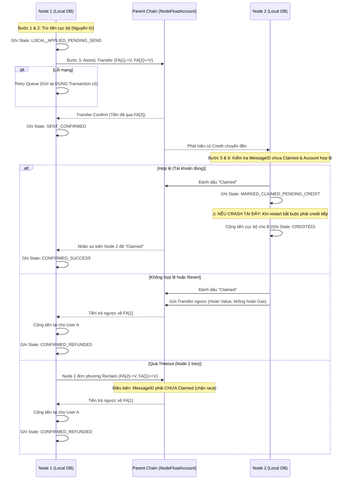

# Thiết kế Kiến trúc BLS Node & Node Float Account (Cross-Node Value Transfer)

> **Tổng quan:** Mỗi node thực thi (`cmd/rpc`) là 1 `chainID` độc lập, tự quản state/balance/contract của user thuộc node đó. Parent Chain (Root Anchor) giữ 2 việc: sổ danh bạ (Account Registry, ChainRegistry) và **`NodeFloatAccount`** — quỹ liên-node **tiền thật** cho từng node, không phải trần phân bổ trừu tượng. `NodeFloatAccount` không có bước "nạp quỹ" rời rạc — nó là 1 bất biến tự động, luôn ≥ và tự hội tụ về đúng tổng số dư user của node đó (mục 3.2). Chuyển giá trị cross-node = ghi sổ chuyển khoản atomic trực tiếp giữa 2 `NodeFloatAccount` (mục 3.3), không cần "khoá batch → attest → claim". Giao dịch nội bộ cùng node vẫn tức thời, không đụng Parent Chain.

> ⚠️ **Nền tảng kỹ thuật:** đăng ký chain (stake), `SecurityBond`, `RecoveryCommittee`, `DeclareChainDeadWithCert` dùng nguyên `GatewayEngine` có sẵn (`execution/pkg/cross_chain/gateway.go`) — chỉ riêng cơ chế **di chuyển giá trị giữa các node** là thiết kế riêng (Float Account), thay cho mô hình mint-theo-trần-rồi-claim.

---

## 1. Tổng quan Kiến trúc

**Mục tiêu cốt lõi:**
- **Thực thi phân tán:** Mỗi Node (`cmd/rpc`) là 1 `chainID` độc lập (đã chốt — mục 2.4), tự quản state, balance, smart contract của user thuộc node đó.
- **Parent Chain = Root Anchor có sẵn** (đã chốt), đóng 2 vai trò: (1) sổ danh bạ (Account Registry, ChainRegistry), (2) **nơi giữ thật "quỹ liên-node"** của từng node (`NodeFloatAccount`) — tiền thật, không phải trần phân bổ trừu tượng.
- **Cross-Node Interoperability:** Chuyển giá trị = ghi sổ chuyển khoản trực tiếp giữa 2 `NodeFloatAccount` trên Parent Chain — atomic, không cần dance "khoá batch → attest → claim" nhiều bước.

---

## 2. Phân chia Vai trò

### 2.1. Parent Chain / Root Anchor
- **Account Registry:** `user_address -> chainID` (mục 5.1).
- **ChainRegistry:** danh tính + `NodeBlsPublicKey` từng node (có sẵn trong `GatewayEngine`).
- **`NodeFloatAccount`** (thay cho `PerChainAllocation`-làm-trần): `chainID -> balance` — **tiền thật**, Parent Chain trực tiếp enforce không cho âm. Đây là state duy nhất Parent Chain giữ ngoài registry — vẫn **không giữ balance của từng user cuối** (state đó vẫn 100% ở local mỗi node).
- **`SecurityBondLedger` + `RecoveryCommittee`:** phạm vi bảo vệ: đăng ký chain + chống khai khống PHÂN BỔ khi node chết (mục 4.1).

### 2.2. BLS Node (Execution Layer)
- **State nội bộ:** LevelDB riêng — balance, nonce, contract state của user thuộc node.
- **Custody Private Key (PKS):** giữ nguyên như thiết kế `cmd/rpc` gốc.
- **Giao dịch nội bộ:** xử lý ngay lập tức, **không đồng bộ per-transaction** lên Parent Chain (mục 13.2) — nhưng vẫn có 1 kênh đồng bộ nền, định kỳ (không phải per-tx): Snapshot Export mỗi 15 phút publish `AccountTreeRoot` lên Parent Chain (mục 6.3 điểm 1), phục vụ chứng minh phân bổ khi node chết — không phải cơ chế xác nhận/finality cho từng giao dịch.
- **Giao dịch cross-node:** gọi thẳng thao tác chuyển khoản trên `NodeFloatAccount` của mình (mục 3).

### 2.3. Rủi ro Custody tập trung (PKS giữ Device Key)

Node giữ 100% device key để ký hộ — nếu bị hack, kẻ tấn công ký được giao dịch nội bộ giả mà không để lại bằng chứng phân biệt được với user thật. Không giải quyết triệt để bằng kỹ thuật được (đánh đổi cố hữu của mô hình ký hộ); giảm thiểu bằng: (1) ngưỡng rút + delay cho giao dịch lớn, (2) anomaly detection, (3) tuỳ chọn non-custodial cho tài khoản lớn, (4) **Signed Receipt + kênh report cho user** khi nghi ngờ node thực thi sai (mục 15) — bắt buộc xây cả 4 làm baseline trước go-live (mục 9.1 Q9-phần-build). ✅ **ĐÃ CHỐT (2026-09-24):** chấp nhận custodial thuần cho giai đoạn thử nghiệm/quy mô nhỏ, đánh giá lại khi quy mô tài sản tăng (Q9-phần-rủi-ro, `SEQUENCER_DIAGRAMS_AND_OPEN_ISSUES.md` mục B.1). ⚠️ **4 biện pháp trên chỉ GIẢM THIỆT HẠI, không phải PHỤC HỒI** — khi khoá đã thực sự bị lộ/mất, con đường phục hồi thật là `RecoveryCommittee` gọi `UpdateCommitteeWithRecoveryCert` để cài khoá mới cho chainID đó (mục 6.2) — cần đưa vào runbook (mục 9.2), không phải chi tiết ngầm hiểu.

### 2.4. 1 Node `cmd/rpc` = 1 `chainID` riêng (ĐÃ CHỐT — Q13)

Mỗi node đăng ký `chainID` riêng qua `RegisterChainViaStake`, không nhóm nhiều node dưới 1 chain. Lý do: `GatewayEngine` (`ChainRegistry`, `SecurityBond`, `RecoveryCommittee`) hoạt động ở đúng granularity `chainID`, ngầm giả định đây là 1 đơn vị tin cậy duy nhất — nhóm nhiều node độc lập dưới 1 chain phá vỡ giả định này. Hệ quả: committee mỗi node = 1 (chính nó), không có redundancy signer thật.

---

## 3. Cơ chế Chuyển giá trị Cross-Node — Node Float Account

### 3.1. Vì sao Node Float Account thay vì trần phân bổ + bond

Mô hình `PerChainAllocation`-làm-trần + `SecurityBond` tách biệt (răn đe SAU KHI phát hiện gian lận) cần 3 bước cho mỗi giao dịch cross-node (`Outbound` → `BatchOutboundCommit`+`QuorumCert` → `ClaimMessage` với hard-cap `FundedAmount`/`ClaimedAmount`), và khi node chết cần cả 1 pipeline nặng (Snapshot, Archival, Velocity, Delay 72h, chống DA-Withholding) mới rút lại được tài sản treo.

`NodeFloatAccount` là tiền thật, Parent Chain tự enforce không cho âm — chuyển giá trị cross-node là 1 lệnh ghi sổ atomic, không cần "khoá rồi chờ claim".

⚠️ **Giới hạn thật còn lại:** Parent Chain "không lưu state ứng dụng" nên vẫn không thể tự verify 1 node có credit đúng cho user cục bộ của mình hay không. Đây **không phải** 1 "bước Nạp quỹ" rời rạc nào (mục 3.2: không có bước đó, không có gì để khai khống ở đây) — mà là rủi ro custody đã biết (mục 2.3/#8: node toàn quyền với state cục bộ). Cách duy nhất bắt được sai lệch này là ở thời điểm node chết, qua Snapshot/Allocation-proof pipeline (mục 6.3).

### 3.2. `NodeFloatAccount` — bất biến tự động, không có bước nạp quỹ

`NodeFloatAccount[node]` **luôn ≥, và tự động hội tụ về đúng bằng** tổng số dư của mọi user thuộc node đó — không phải 1 con số node "quyết định nạp bao nhiêu". Tiền chỉ vào `NodeFloatAccount` qua đúng 2 cách, cả 2 đều do chính hành động của 1 user cụ thể kích hoạt, xác minh trực tiếp trên Parent Chain:

1. **User tự nạp tiền vào TÀI KHOẢN CỦA CHÍNH HỌ** (không phải "nạp cho node" chung chung): bất kỳ ví nào có số dư thật trên Parent Chain chuyển tiền vào, gắn `Target = user_address` + `MessageID` duy nhất — Parent Chain cộng thật số đó vào `NodeFloatAccount[node]` ngay trong 1 transaction, xác minh trực tiếp, không có gì để khai khống. Vì Parent Chain không giữ balance của từng user cuối (mục 2.1), phần credit local cho user theo đúng cơ chế **watch-rồi-credit giống hệt Transfer đến** (mục 3.3 bước 5-7, dùng chung `ClaimedMessages`) — có 1 cửa sổ ngắn nơi FA đã tăng nhưng local chưa credit kịp, luôn an toàn theo 1 chiều (FA tạm thời cao hơn tổng local thật, không bao giờ thấp hơn — xem mục 3.5).
2. **Nhận Transfer cross-node đến** (mục 3.3) — cùng cơ chế: FA bên nhận tăng ngay khi Parent Chain confirm Transfer, local credit theo sau qua watch-rồi-credit (đã có đầy đủ crash-recovery `MARKED_CLAIMED_PENDING_CREDIT`, #13).

**Hệ quả — giải quyết Q5 và bài toán "vốn khởi đầu cho node":** 1 node mới tinh chưa có user nào thì `NodeFloatAccount = 0` — khi user đầu tiên nạp tiền vào tài khoản của họ (cách 1), `NodeFloatAccount` tăng ngay trên Parent Chain, node chỉ cần chạy watcher từ genesis để bắt kịp credit local. Không có khái niệm "Bond-vs-Deposit" hay "giới hạn nạp quỹ mỗi chu kỳ" — không còn hành động "nạp quỹ" rời rạc nào để giới hạn.

**Điều Parent Chain vẫn KHÔNG biết:** tổng `NodeFloatAccount` của 1 node là thật (không thể khai khống — mỗi đồng gắn với 1 giao dịch xác minh được) nhưng Parent Chain không biết tổng đó chia cho user nào bao nhiêu, và không tự verify được node có trung thực credit local đúng người/đúng hạn hay không (rủi ro custody đã biết, mục 2.3/#8). Đây là lý do Snapshot Pipeline (mục 6.3) vẫn cần — để chứng minh **phân bổ**, không phải tổng số.

### 3.3. Chuyển giá trị cross-node (Transfer) — luồng thành công

1. User A (Node 1) gửi yêu cầu chuyển cho User B (Node 2).
2. Vì `NodeFloatAccount` luôn ≥ balance của A (mục 3.5), không có kịch bản "Float không đủ" cần phân biệt với mất-kết-nối — bước này chỉ là **kiểm tra số dư cục bộ của A** (bình thường, không liên quan Parent Chain) trước khi trừ. Việc đọc-kiểm tra-rồi-ghi cần node tự serialize/khoá nội bộ, để tránh 2 yêu cầu cùng lúc từ CÙNG 1 user A đọc thấy "đủ" rồi cùng trừ vượt quá số dư thật.
3. Qua được bước kiểm tra: Node 1 trừ balance cục bộ của A, đồng thời gửi 1 giao dịch **duy nhất, atomic** lên Parent Chain: `NodeFloatAccount[1] -= V`, `NodeFloatAccount[2] += V`, kèm metadata (`Target: B`, `MessageID` duy nhất, `Payload` nếu là contract-call). Committee mỗi node = 1 nên chữ ký chính là Node 1 tự ký, gộp luôn vào transaction này.
4. Ngay khi transaction confirm trên Parent Chain: **tiền đã thật sự nằm ở `NodeFloatAccount[2]`** — không có khái niệm "Pending chờ claim" cho phần GIÁ TRỊ.
5. Node 2 theo dõi Parent Chain, thấy có credit mới addressed cho mình. **Chống xử lý trùng bắt buộc (#10):** Node 2 phải tự kiểm tra `MessageID` này đã xử lý (credit hoặc refund) chưa trước khi làm bất cứ gì — tự giữ 1 bảng "MessageID đã xử lý" cục bộ (không có hàm trung tâm nào làm hộ).
6. Node 2 kiểm tra local: `B` có phải account hợp lệ đang được chính mình quản lý không.
7. Nếu hợp lệ: Node 2 **trước tiên** gửi 1 transaction nhỏ lên Parent Chain đánh dấu `MessageID` này = `Claimed` (mục 3.6 — cần cho cơ chế Reclaim-theo-timeout), **rồi mới** cộng balance cục bộ cho B. Tiền đã an toàn ngay từ bước 4 — đánh dấu `Claimed` chỉ để phối hợp với mục 3.6, không phải điều kiện an toàn giá trị.

### 3.4. Nếu kiểm tra local thất bại (account không hợp lệ) hoặc Contract Call bị revert

Tiền **đã thật sự nằm ở `NodeFloatAccount[2]`** — nên hoàn tiền là **1 giao dịch Transfer khác, chiều ngược lại**, dùng lại đúng cơ chế ở mục 3.3:

1. Node 2 phát hiện B không hợp lệ, hoặc Contract Call revert (hoàn tác toàn bộ thay đổi state đã thử).
2. **Chống hoàn tiền 2 lần bắt buộc (#9):** Node 2 **phải tự đánh dấu `MessageID` = `Claimed`** trên Parent Chain (đúng bước ở mục 3.3 bước 7, dùng chung 1 cơ chế cho cả credit thành công lẫn hoàn tiền) **TRƯỚC KHI** gửi Transfer hoàn tiền — nếu crash giữa chừng và retry, Node 2 phải kiểm tra `MessageID` này đã `Claimed` chưa trước khi tạo giao dịch hoàn tiền mới, tránh gửi hoàn tiền 2 lần (tự bào mòn quỹ của chính Node 2).
3. Node 2 gửi Transfer ngược: `NodeFloatAccount[2] -= Value` (**chỉ đúng phần `Value`**), `NodeFloatAccount[1] += Value`.
4. Node 1 nhận lại, cộng trả cho User A.
5. **`GasFee` KHÔNG được hoàn** (xem #5): Node 2 đã thực sự tốn chi phí tính toán để thử thực thi/kiểm tra dù kết quả thất bại. Nếu hoàn cả `GasFee`, kẻ tấn công spam giao dịch cố tình gây revert để bào CPU/RAM Node 2 miễn phí.

### 3.5. Thanh khoản — bất khả thi bằng toán học với giao dịch hợp lệ

Vì `NodeFloatAccount[node] = Σ balance mọi user thuộc node đó`, và mọi số dư đều `≥ 0`, nên `NodeFloatAccount ≥` balance của **bất kỳ 1 user nào**. User A không bao giờ được phép gửi quá số dư CỦA CHÍNH A (kiểm tra cơ bản đã có sẵn ở mọi hệ thống) — nên `NodeFloatAccount ≥ balance(A) ≥ V` LUÔN đúng khi A định gửi V. **Không có kịch bản nào 1 giao dịch hợp lệ bị "chặn vì Float không đủ"**.

**Điều duy nhất còn lại — cửa sổ ngắn khi crash giữa chừng (không phải "thanh khoản cạn"):** giữa lúc trừ balance cục bộ và lúc Parent Chain xác nhận Transfer (mục 3.3 bước 2-3) vẫn có 1 khoảng ngắn có thể gián đoạn nếu crash/mất mạng — đây là vấn đề **crash-recovery** (đã xử lý bằng Retry Queue, mục 6.1) chứ không phải thiếu vốn. Tương tự, chiều nạp tiền vào (mục 3.2 cách 1/2) cũng có 1 cửa sổ watch-rồi-credit ngắn — cả 2 cửa sổ đều lệch theo đúng hướng an toàn (FA tạm thời ≥ tổng local thật, không bao giờ ngược lại), nên không ảnh hưởng bất đẳng thức `FA ≥ balance(A)` dùng ở trên.

### 3.6. Node đích còn sống nhưng kẹt/chậm xử lý — Timeout & Reclaim (#12)

Khác với node chết hẳn (mục 6, cần `RecoveryCommittee`), trường hợp này là Node 2 **vẫn hoạt động bình thường** nhưng vì lý do nào đó (backlog, bug, quá tải) không xử lý (không credit local, không hoàn tiền) 1 credit đã nhận trong thời gian dài — tiền nằm im ở `NodeFloatAccount[2]`, User A không được phục vụ cũng không được hoàn, không có điểm dừng theo thời gian nếu không thiết kế thêm.

- **Cơ chế Reclaim:** nếu quá 1 khoảng thời gian cấu hình kể từ lúc Transfer confirm mà `MessageID` vẫn CHƯA được đánh dấu `Claimed` (mục 3.3 bước 7), **chính Node 1** (thay mặt User A) có quyền gửi 1 transaction Reclaim thẳng lên Parent Chain: `NodeFloatAccount[2] -= Value`, `NodeFloatAccount[1] += Value` — **không cần Node 2 hợp tác**, vì tiền vốn dĩ do Parent Chain custody thật.
- ⚠️ **Điều kiện "quá timeout" phải do chính Parent Chain kiểm tra on-chain (so sánh `blockTime` hiện tại với thời điểm Transfer confirm), KHÔNG được chỉ là quy ước Node 1 tự giác tuân theo ở tầng client.** Nếu không enforce on-chain, 1 implementation lỗi/hấp tấp ở Node 1 có thể Reclaim ngay lập tức sau khi gửi, trước khi Node 2 (dù hoàn toàn khoẻ mạnh, chỉ hơi chậm) kịp xử lý — không làm mất tiền của ai (vẫn có guard chặn race ở dưới), nhưng phá hỏng đúng mục đích của cơ chế Reclaim và tạo ma sát/trải nghiệm xấu không cần thiết cho Node 2.
- **Chặn race Reclaim-vs-Claimed (bắt buộc):** Parent Chain chỉ cho Reclaim thành công nếu `MessageID` đó **chưa** được đánh dấu `Claimed` tại thời điểm xử lý Reclaim — nếu Node 2 vừa kịp đánh dấu `Claimed` đúng lúc Node 1 gửi Reclaim, chỉ 1 trong 2 thắng (Parent Chain xử lý tuần tự) — bên thua bị từ chối, không có chuyện cả 2 cùng thành công.

---

## 4. Bảo mật kinh tế

### 4.1. Vai trò của `SecurityBond`/`RecoveryCommittee` trong mô hình Float Account

Không cần bất biến "Bond-vs-Deposit" nào — `NodeFloatAccount` là 1 bất biến tự động (mục 3.2), không có bước "nạp quỹ" rời rạc để node khai khống, nên không còn gì để giới hạn thiệt hại ở bước đó. `SecurityBond` vẫn giữ nguyên 2 con đường bị mất vốn có sẵn trong `GatewayEngine`: (1) `SlashOnEquivocation` — **permissionless, không cần `RecoveryCommittee`** — khi double-sign; (2) forfeit khi `RecoveryCommittee` gọi `DeclareChainDeadWithCert`/`UnregisterChainWithCert` (3 quyền hạn cụ thể của `RecoveryCommittee`, xem mục 6.2). Còn đúng 1 vai trò MỚI cần bảo vệ: chống **node khai khống PHÂN BỔ** khi chết (gán tổng tiền thật cho 1 địa chỉ nó kiểm soát thay vì chia đúng cho user) — cơ chế bảo vệ xem mục 6.3 (Snapshot + DA-Withholding + Delay 72h). ✅ **ĐÃ CHỐT — `SlashOnEquivocation` bắt được double-sign `AccountTreeRoot`, không cần xây thêm gì:** xem xác nhận từ code ở mục 6.2.

### 4.2. Velocity-limit cho Transfer: không cần để chống mint sai — nhưng vẫn cần vì lý do khác

Mỗi Transfer là ghi sổ trực tiếp trên số dư THẬT đã có sẵn trong `NodeFloatAccount` — không có gì để "mint sai" ở bước này, nên không cần velocity-limit cho lý do chống-gian-lận. Velocity-limit vẫn cần, nhưng vì 1 lý do khác hẳn: giới hạn thiệt hại khi KHOÁ KÝ của node bị lộ (không phải khi node cố ý gian lận) — xem mục 4.4.

### 4.3. Bất biến tổng cung

**`Σ NodeFloatAccount == genesis_total_supply`** — bất biến **kiểm tra tự động được hoàn toàn** trên Parent Chain (không còn số hạng "local balance chưa nạp quỹ" nào cần ước lượng, vì mọi số dư user đều tự động phản ánh trong `NodeFloatAccount` ngay khi phát sinh — mục 3.2).

> Lưu ý nhỏ: `NodeFloatAccount` có thể gồm thêm phần doanh thu `GasFee` node đã thu (mục 3.4 điểm 5 — không hoàn khi thất bại) chưa gắn với user cụ thể nào — phần này vẫn nằm trong tổng bảo toàn (chỉ chuyển từ `NodeFloatAccount` node gửi sang node nhận), không phá vỡ bất biến, chỉ là 1 phần nhỏ không thuộc "Σ balance user" theo nghĩa hẹp.

### 4.4. Velocity-limit cho Transfer OUTFLOW: giới hạn thiệt hại khi khoá ký node bị lộ (#11)

**Vấn đề:** vì Float Account là tiền thật và Transfer không còn hard-cap/velocity nào (mục 4.2), nếu khoá ký (device key/BLS key) của 1 node bị lộ, kẻ tấn công có thể gửi 1 Transfer DUY NHẤT rút sạch **TOÀN BỘ** `NodeFloatAccount` của node đó sang 1 địa chỉ kiểm soát bởi kẻ tấn công, ngay lập tức — không có gì cản. Vì `NodeFloatAccount[node] ≈ Σ balance mọi user thuộc node đó` (mục 3.2), rút sạch FA trong 1 giao dịch **đồng nghĩa rút sạch TOÀN BỘ tiền của MỌI user node đó cùng lúc** — không phải rút 1 "quỹ dự trữ riêng" tách khỏi tiền user. Đây là rủi ro nặng nhất trong toàn hệ thống, nặng hơn cả #8 (custody local, mục 2.3 — vốn chỉ ký được giao dịch nội bộ giả, không rút tiền ra khỏi node được).

**Quyết định:** tái áp dụng velocity-limit, nhưng cho **Transfer OUTFLOW**:

> Tổng giá trị gửi ra (Transfer outflow) của 1 `NodeFloatAccount` trong 1 cửa sổ trượt (ví dụ 24h) không được vượt quá X% số dư đầu cửa sổ — mặc định đề xuất **20%/24h**, cần đội xác nhận lại theo dữ liệu traffic thật.

Đây **không phải** hard-cap chống gian lận (không có gì để gian lận ở bước Transfer) mà là **circuit-breaker chống lộ khoá** — giống hệt lý do các sàn/ngân hàng đặt hạn mức rút tiền/ngày ngay cả với tài khoản đã xác minh đầy đủ danh tính. Khi vượt ngưỡng: giao dịch bị tạm giữ + cảnh báo operator ngay (không tự động từ chối vĩnh viễn, vì đây có thể là traffic hợp lệ tăng đột biến, không phải luôn là dấu hiệu bị hack).

⚠️ **Loại trừ bắt buộc (#14):** ngưỡng này **CHỈ áp dụng cho Transfer gửi mới** (mục 3.3) — **KHÔNG áp dụng cho Hoàn tiền** (mục 3.4) hay **Reclaim** (mục 3.6). Lý do: hoàn tiền/reclaim chỉ bao giờ trả lại đúng giá trị đã thực sự nhận trước đó (bị chặn trên bởi số tiền đã vào, không phải 1 bề mặt tấn công mới để lộ khoá khai thác), trong khi Transfer gửi mới mới là nơi kẻ tấn công có khoá lộ có thể tạo ra dòng tiền HOÀN TOÀN MỚI ra 1 địa chỉ nó kiểm soát. Nếu lỡ áp chung 1 ngưỡng cho cả 2 loại: 1 node đang bị tấn công spam-revert (#5) có thể bị chính circuit-breaker này chặn luôn cả việc hoàn tiền hợp lệ cho user vô tội đang chờ — tạo ra DoS tầng 2 do chính cơ chế phòng thủ gây ra.

---

## 5. Đăng ký & Tra cứu Account/Contract

### 5.1. Account Registry

| Bảng | Key | Value | Vai trò |
|---|---|---|---|
| Account Registry | `user_address` | `chainID` (của node sở hữu) | Định tuyến `Target` đến đúng node; node đó tự kiểm tra hợp lệ trước khi credit (mục 3.3 bước 4) |

- **Đăng ký 1 lần, chống ghi đè:** chỉ chấp nhận lần đầu, hoặc cần chữ ký của node hiện tại để chuyển nhượng (Migration, mục 5.3).
- **Chặn double-registration:** cơ chế chặn nằm ở chính write vào Account Registry trên Parent Chain (transaction xử lý tuần tự = điểm serialize duy nhất) — không coi admin-confirm cục bộ tại node là đã chốt quyền sở hữu (chi tiết đầy đủ mục 12 Q1).
- **An toàn trước DoS:** đăng ký qua `handleSetBlsPublicKey` + admin confirm (2 bước, có gate) — không permissionless.
- **Vốn khởi tạo khi đăng ký node mới (đã đóng — Q5):** `RegisterChainViaStake` dùng đúng số tiền thật operator/nhà đầu tư tự bỏ ra từ ví của họ (bond đăng ký) — không rút từ 1 "pool Reserve" do Parent Chain khởi tạo genesis. `NodeFloatAccount` của node mới không cần "vốn khởi đầu" riêng nào cả — nó bắt đầu ở 0 và tự động tăng đúng bằng số tiền user đầu tiên tự nạp vào tài khoản của họ (mục 3.2).

### 5.2. Contract Registry — KHÔNG dùng registry toàn cục

Bên gửi (`Target`+`chainID` đích) đã phải tự biết trước contract nằm ở node nào — không có API đăng ký contract để tránh DoS/race-condition tra cứu. Kiểm tra tồn tại cục bộ tại đích (mục 3.3 bước 4) là đủ.

### 5.3. Migration Account (CHỈ User, KHÔNG áp dụng Contract)

✅ **ĐÃ CHỐT (2026-09-24): HOÃN, không triển khai ở bản đầu.** Đây là tiện ích vận hành (đổi node quản lý cho 1 user), không nằm trên đường an toàn tiền (Float Account/Transfer/Reclaim ở mục 3 mới là phần bắt buộc). User cố định ở node đã đăng ký cho tới khi tính năng này (nếu có) được xây ở roadmap sau — không ảnh hưởng bất kỳ bất biến bảo mật nào đã thiết kế. Giao thức 3 pha bên dưới giữ lại làm tài liệu tham khảo cho lúc cần, chưa lên lịch xây.

Contract không được migrate (vì mục 5.2 không có Contract Registry, contract đổi node sẽ "tàng hình"). Giao thức 3 pha cho User Account: **Freeze** (khoá tx nội bộ mới, giữ lại request đến trong hàng đợi tạm, không revert ngay) → **Export & Attest** (đóng gói balance+nonce, ký `QuorumCert`) → **Import & Flip con trỏ** (chỉ flip Account Registry SAU KHI node mới xác nhận import xong, không lạc quan).

---

## 6. Xử lý Mất kết nối & Node chết vĩnh viễn

### 6.1. Mất kết nối tạm thời

Giao dịch nội bộ không bị ảnh hưởng. Giao dịch cross-node gửi thất bại do mất mạng: giữ nguyên trong Retry Queue cục bộ, gửi lại đúng transaction đã ký, không tạo transaction mới cho cùng 1 yêu cầu.

### 6.2. Node chết hẳn — ai xác nhận, xử lý ra sao

- Tiêu chí trigger: 2 lớp — (1) tự động cảnh báo sau N lần bỏ lỡ chu kỳ hoạt động bình thường liên tiếp, (2) **bắt buộc xác nhận thủ công của operator** trước khi thực sự gọi `DeclareChainDeadWithCert` — không tự động hoá hoàn toàn vì hậu quả quá lớn.
- `RecoveryCommittee` là 1 BLS committee **cố định, set 1 lần từ config lúc triển khai** (`RecoveryCommitteeJSON`/`RecoveryQuorumThreshold`), **không có đường lớn lên on-chain** (khác hẳn tập hợp Governance cũ từng tự phình ra theo mỗi lần `RegisterChainViaStake` — đúng lỗ hổng Sybil-vote-buying mà thiết kế này chủ đích đóng lại). Set 1 lần, không ai tự thêm mình vào được.

**3 quyền hạn cụ thể của `RecoveryCommittee`** (grounded trực tiếp từ `gateway.go`, không phải suy diễn):

1. **`DeclareChainDeadWithCert(chainID, cert)`** — tuyên bố 1 chainID chết: forfeit `SecurityBond` ngay + set cờ `DeadChains[chainID]` (chính cờ này chặn outflow mới, mục 6.3/mục 7), mở khoá `ClaimDeadChainBalance` cho user bị kẹt. Dùng `RecoveryCommittee` thay vì committee của chính chain đó vì: 1 chain đã chết, theo định nghĩa, không thể tự authorize gì được nữa.
2. **`UnregisterChainWithCert(chainID, cert, blockTime)`** — xoá hẳn chainID khỏi `ChainRegistry`. Nếu chain còn bond active, **không release ngay** mà bắt đầu unbonding period — chống đúng kịch bản "hit and run": unregister rồi rút bond ngay TRƯỚC KHI ai kịp thu thập bằng chứng equivocation để slash.
3. **`UpdateCommitteeWithRecoveryCert(update, cert)`** — cài 1 committee (khoá ký) **HOÀN TOÀN MỚI** cho 1 chainID mà committee cũ không còn liên lạc được (khác cơ chế cập nhật committee bình thường, vốn cần chính committee cũ tự ký cho committee kế nhiệm — chỉ dùng khi điều đó bất khả thi). Có guard chống replay: epoch mới bắt buộc > epoch hiện tại, không cho lùi/lặp lại cert cũ. ⚠️ **Đây chính là con đường PHỤC HỒI thật cho rủi ro #8** (khoá node bị lộ/mất — mục 2.3): mục 2.3 hiện mới liệt kê các biện pháp GIẢM THIỆT HẠI (delay, anomaly detection), chưa nói rõ khi khoá đã bị lộ/mất thật thì phục hồi bằng cách nào — câu trả lời là qua `UpdateCommitteeWithRecoveryCert`, cần nêu rõ trong runbook (mục 9.2).

⚠️ **Sửa 1 điểm nhầm lẫn ở mục 4.1 — `SlashOnEquivocation` KHÔNG cần `RecoveryCommittee`:** đây là cơ chế **permissionless** — bất kỳ ai cầm được 2 `QuorumCert` hợp lệ của cùng 1 chain, cùng epoch, ký cho 2 `commitRoot` khác nhau, có thể tự submit để slash bond ngay, không qua `RecoveryCommittee`.

✅ **ĐÃ CHỐT (đọc code thật, `execution/pkg/cross_chain/epoch_sync.go`):** `SlashOnEquivocation` verify mỗi cert qua `ComputeCommitRootAttestMessage(commitRoot)` — message này **hoàn toàn generic** (`"COMMIT_ROOT_ATTEST_V1:" + commitRoot.Bytes()`), không hề gắn với nội dung `BatchOutboundCommit` cụ thể nào. Nghĩa là `SlashOnEquivocation` bắt equivocation cho **BẤT KỲ root nào được attest qua đúng message này**, không quan trọng root đó đại diện cho cái gì. **Yêu cầu implement duy nhất:** khi node publish `AccountTreeRoot` (mục 6.3), phải ký `QuorumCert` cho đúng `ComputeCommitRootAttestMessage(accountTreeRoot)` — dùng lại nguyên primitive có sẵn, không cần code equivocation-detection riêng nào cho `AccountTreeRoot`. Nếu double-sign 2 `AccountTreeRoot` khác nhau cùng epoch, `SlashOnEquivocation` bắt được ngay, miễn phí.

### 6.3. Rút lại giá trị khi node chết — bài toán PHÂN BỔ

`NodeFloatAccount` là 1 bất biến tự động (mục 3.2) — mọi số dư user LUÔN tự động phản ánh trong `NodeFloatAccount` ngay khi phát sinh, không có phần "chưa kịp nạp" nằm chờ dài hạn nào cả. Khi node chết, chỉ còn đúng **1 bài toán duy nhất**: `NodeFloatAccount[node chết]` chắc chắn có THẬT (Parent Chain tự verify được, mục 4.3) — nhưng **Parent Chain không biết tổng đó phải CHIA cho user nào bao nhiêu**, vì phân bổ chi tiết chỉ tồn tại trên local node đã chết.

**Phần xử lý ngay, không cần chờ gì:**
- Transfer đang "đi ngang" tới node chết nhưng chưa `Claimed`: dùng cơ chế **Reclaim** (mục 3.6), Node 1 tự đòi lại, kích hoạt ngay khi `RecoveryCommittee` xác nhận chết — không cần Transfer ngược (mục 3.4, cần node sống mới gửi được). ⚠️ Reclaim tự nó CŨNG là 1 outflow từ FA của node chết — `DeadChains` chặn outflow mới (mục 7) phải loại trừ tường minh Reclaim, không thì chính cơ chế bảo vệ này lại chặn luôn đường thu hồi hợp lệ duy nhất cho Transfer đang treo.
- Không cần Merkle proof cho bước này — đây chỉ là ghi sổ 2 chiều bình thường trên Parent Chain.

**Bài toán còn lại — chứng minh PHÂN BỔ:**
1. **Snapshot Export định kỳ, PROACTIVE** (mỗi 15 phút, mục 9.1) — export cây Merkle **phân bổ** account state ra ngoài node + publish `AccountTreeRoot` có xác thực lên Parent Chain. Root này dùng để chứng minh **"tổng đã biết trước đó (NodeFloatAccount) được chia cho ai bao nhiêu"** — không dùng để chứng minh tổng có thật (đã tự động đúng).
2. **Chống Data Availability Withholding (fail-closed):** 1 node có thể publish 1 cây phân bổ giả (gán hết cho ví nó kiểm soát) dù TỔNG là thật, rồi giấu dữ liệu chi tiết để Archival Service không đối chiếu được. Archival Service phải xác nhận nhận đủ dữ liệu khớp root trong vài phút sau publish; không đủ = VETO ngay, không đợi hết thời gian chờ. ⚠️ **Check này chạy MỖI chu kỳ 15 phút, kể cả khi node hoàn toàn khoẻ mạnh** (không phải chỉ kích hoạt sau khi node đã chết) — vì 2 lý do: (a) đảm bảo Archival Service luôn sẵn dữ liệu THẬT từ trước, không phụ thuộc chính node đã chết mới đi lấy; (b) DA-check thất bại trên 1 node đang sống là tín hiệu cảnh báo SỚM (node có thể đang chuẩn bị gian lận) — xem mục 9.2 giám sát riêng loại cảnh báo này, tách khỏi "VETO" (vốn chỉ có ý nghĩa hành động cụ thể — chặn giải ngân — sau khi node đã được tuyên bố chết).
3. **`ClaimDeadChainBalance` + Withdrawal Delay tối thiểu 72 giờ:** cho operator/Archival thời gian phát hiện cây phân bổ giả mạo trước khi giải ngân thật. Không cần lớp velocity-limit riêng cho bước này — TỔNG tiền đã được `NodeFloatAccount` giới hạn chính xác từ trước (không thể rút vượt tổng thật), rủi ro duy nhất còn lại là phân bổ sai giữa các user trong CÙNG tổng đó, không phải rút vượt tổng — Delay 72h + DA-defense đã đủ xử lý.
4. **Cửa sổ mất mát = tần suất export** (mặc định 15 phút) — giao dịch NỘI BỘ (cùng node, không qua `NodeFloatAccount`) sau lần export cuối vẫn có thể không chứng minh được PHÂN BỔ chính xác nếu node chết ngay sau đó (dù tổng tiền vẫn an toàn) — đây là lý do vẫn cần export định kỳ dù tổng đã luôn đúng. ⚠️ **Hậu quả cụ thể cho user, làm rõ để tránh hiểu lầm mức độ rủi ro:** claim dựa trên snapshot gần nhất đã xác thực — mọi giao dịch nội bộ SAU snapshot đó (kể cả đã báo thành công cho user tại thời điểm giao dịch) coi như CHƯA từng xảy ra khi tính phân bổ cuối cùng: người gửi được khôi phục về số dư TRƯỚC giao dịch, người nhận KHÔNG được cộng phần đã nhận. Không mất tiền THẬT ngoài cửa sổ này (tổng node vẫn đúng), nhưng user nhận tiền nội bộ trong ≤15 phút cuối trước khi node chết có thể mất đúng khoản đó vĩnh viễn dù giao dịch từng báo thành công — cần công bố rõ giới hạn này với người dùng, không chỉ coi là chi tiết kỹ thuật nội bộ.
5. **Ai tính proof hộ user:** dịch vụ archival độc lập, không bắt user tự giữ Merkle proof.

---

## 7. Tóm tắt Cấu trúc Data Model

### Tại Parent Chain / Root Anchor
| Bảng / Struct | Nguồn | Vai trò |
|---|---|---|
| Account Registry | Mở rộng `AccountManager` contract có sẵn | `user_address -> chainID` |
| `ChainRegistry` | Có sẵn (`gateway.go`) | Danh tính + `NodeBlsPublicKey` từng node |
| **`NodeFloatAccount`** | Cần xây | `chainID -> balance` — tiền thật, thay cho `PerChainAllocation`-làm-trần |
| **`ClaimedMessages`** | Cần xây | `MessageID -> bool` — đánh dấu đã xử lý (credit local hoặc hoàn tiền), dùng để chống xử lý trùng (#10), chống hoàn tiền 2 lần (#9), và làm điều kiện chặn Reclaim (mục 3.6, #12) |
| `SecurityBondLedger` | Có sẵn | Bond, bảo vệ đăng ký chain + chống khai khống PHÂN BỔ khi node chết (mục 4.1) |
| `DeadChains` | Có sẵn | Node đã tuyên bố chết, chặn outflow mới — **loại trừ tường minh Reclaim** (mục 6.3), vốn cũng là 1 outflow từ FA node chết nhưng là cơ chế thu hồi hợp lệ, không phải giao dịch mới cần chặn |

### Tại mỗi BLS Node (Local DB)
| Bảng / Struct | Key | Value | Vai trò |
|---|---|---|---|
| Account State | `user_address` | `balance`, `nonce`, `contract_state` | State thực sự |
| Retry Queue | `message_id` | `payload`, `status` | Chỉ cho mất-kết-nối tạm thời (mục 6.1) |
| Local state machine | `message_id` | `LOCAL_APPLIED_PENDING_SEND / SENT_CONFIRMED / ...` | Xem mục 13.4 |

---

## 8. Danh sách vấn đề logic/bảo mật còn hiệu lực

> **Đã tách sang file riêng:** `SEQUENCER_DIAGRAMS_AND_OPEN_ISSUES.md` (mục B.2) — index #1-16 (đã có fix thiết kế). Mọi trích dẫn `#N` trong tài liệu này (ví dụ `#12`, `mục 4.4 #11`) trỏ vào đúng bảng đó. 5 vấn đề THẬT SỰ còn chặn triển khai được gộp riêng ở mục B.1 (cùng file).

---

## 9. Production Readiness Checklist

### 9.1. Decision Log

> **Đã tách sang file riêng:** `SEQUENCER_DIAGRAMS_AND_OPEN_ISSUES.md` (mục B.1) — ✅ **5/5 mục đã chốt (2026-09-24)**: `RecoveryCommittee` = dev/operator tự ký tạm, Q9-rủi-ro = chấp nhận giai đoạn thử nghiệm, report node sai = Hướng A, Migration = hoãn, `SlashOnEquivocation`/`AccountTreeRoot` = có bắt được (chỉ cần ký đúng message có sẵn).

### 9.2. Vận hành

- **Quản lý khoá `RecoveryCommittee`** (ưu tiên cao hơn khoá node — #7): multisig/HSM/threshold-signing riêng, tách biệt quy trình vận hành khoá node thường.
- **Giám sát Snapshot Pipeline** (phục vụ chứng minh phân bổ khi node chết, mục 6.3): 2 loại cảnh báo tách biệt — (1) node **bỏ lỡ** chu kỳ export (mức độ: vận hành, có thể do bug/quá tải), và (2) **DA-check thất bại** trên 1 node vẫn đang sống (node CÓ publish `AccountTreeRoot` nhưng Archival Service không lấy đủ dữ liệu khớp root — mục 6.3 điểm 2) — mức độ: **nghi vấn gian lận đang diễn ra**, phải escalate ngay cho operator/`RecoveryCommittee` xem xét, không chờ tới khi node chết mới xử lý.
- **Backup & DR:** backup LevelDB từng node + state Parent Chain (`ChainRegistry`/`NodeFloatAccount`/`SecurityBondLedger`/`DeadChains`).
- **Runbook:** kịch bản node bị nghi compromise (khi nào trigger `SlashOnEquivocation`/`DeclareChainDeadWithCert`), và kịch bản khoá node bị lộ/mất nhưng node vẫn còn muốn hoạt động tiếp (không tuyên bố chết) — quy trình gọi `UpdateCommitteeWithRecoveryCert` (mục 6.2) để cài khoá mới, ai được phép yêu cầu, xác minh danh tính operator thế nào trước khi `RecoveryCommittee` ký cert.
- **Quản lý tăng trưởng `ClaimedMessages`:** bảng này ghi vĩnh viễn mỗi `MessageID` đã xử lý — cần kế hoạch archive/prune định kỳ các bản ghi cũ (ví dụ sau N tháng) để tránh phình state Parent Chain vô hạn theo thời gian.

### 9.3. Checklist bảo mật trước khi go-live

- [ ] #1–#16 (mục B.1 + B.2 của `SEQUENCER_DIAGRAMS_AND_OPEN_ISSUES.md`) đã được review độc lập bởi người khác (không tự ký-tự duyệt) — đặc biệt #6 (Snapshot Pipeline chứng minh phân bổ khi node chết), #7 (`RecoveryCommittee`), #11/#14 (velocity-limit chống lộ khoá + loại trừ hoàn tiền — dễ bị bỏ sót nhất vì trực giác "Float Account tự an toàn" dễ khiến quên mất đây là rủi ro KHÁC, không phải gian lận), #13 (crash-recovery giữa `Claimed` và credit local), #15 (cơ chế report node sai — mục 15, chưa có hướng chốt), và #16 (SlashOnEquivocation/AccountTreeRoot, chưa xác nhận).
- [x] `RecoveryCommittee`, Q9-rủi-ro, Q(report node sai), Q(Migration scope), Q(SlashOnEquivocation) — 5/5 đã chốt (2026-09-24, `SEQUENCER_DIAGRAMS_AND_OPEN_ISSUES.md` mục B.1). Cần ghi lại quyết định bằng văn bản chính thức của đội (không chỉ trong tài liệu này) trước khi coi là final.
- [ ] Signed Receipt (mục 15.2) đã triển khai cho MỌI giao dịch (nội bộ lẫn cross-node) trước go-live — đây là điều kiện nền tảng bắt buộc dù chọn Hướng A hay B, không phải tính năng tuỳ chọn.
- [ ] Đã test trên staging: (1) Transfer thành công, (2) Transfer thất bại → hoàn đúng `Value`, không hoàn `GasFee`, (3) Node chết → Parent Chain biết TỔNG số thật ngay (mục 4.3, tự động), Archival Service chạy đúng pipeline Snapshot+Delay 72h để chứng minh PHÂN BỔ cho user (mục 6.3), (4) Migration có message đến giữa lúc Freeze — **CHỈ áp dụng nếu Migration (mục 5.3) thật sự được triển khai ở bản đầu, có thể bỏ qua nếu hoãn**, (5) node cố tình giấu dữ liệu snapshot → Archival Service VETO được, (6) retry crash-giữa-chừng ở bước hoàn tiền → không hoàn 2 lần (#9), (7) giả lập khoá node bị lộ, thử rút vượt ngưỡng velocity outflow → bị chặn (#11), (8) Node 2 chậm xử lý quá timeout → Node 1 Reclaim thành công mà không cần Node 2 hợp tác, và thử race Reclaim-vs-Claimed để xác nhận chỉ 1 bên thắng (#12), (9) crash Node 2 đúng giữa lúc `Claimed` và credit local, khởi động lại → xác nhận tự hoàn tất credit, không credit trùng, không bỏ sót (#13), (10) Node 2 chết hẳn khi đang có Transfer tới nhưng chưa `Claimed` → xác nhận dùng đúng cơ chế Reclaim (mục 3.6), không phải Transfer ngược (mục 3.4, vốn cần Node 2 sống), (11) giả lập 1 node vừa bị chạm ngưỡng velocity outflow (#11) vừa cần hoàn tiền hợp lệ cho user khác → xác nhận hoàn tiền vẫn đi qua bình thường, không bị chặn nhầm bởi circuit-breaker (#14).
- [ ] `Σ NodeFloatAccount == genesis_total_supply` (mục 4.3) được kiểm tra tự động định kỳ trên Parent Chain — đây là bất biến kiểm chứng được hoàn toàn.

---

## 10. Lộ trình triển khai

1. ✅ **Đã chốt 5/5 mục từng chặn triển khai** (`RecoveryCommittee` = dev/operator tự ký tạm, Q9-rủi-ro = chấp nhận giai đoạn thử nghiệm, report node sai = Hướng A, Migration = hoãn, `SlashOnEquivocation`/`AccountTreeRoot` = có bắt được, chỉ cần ký đúng message — chi tiết `SEQUENCER_DIAGRAMS_AND_OPEN_ISSUES.md` mục B.1) — có thể bắt đầu bước 2.
2. **Xây `NodeFloatAccount` trên Parent Chain** — cấu trúc dữ liệu mới, thay thế vai trò "trần phân bổ" của `PerChainAllocation` cho mục đích cross-node.
3. **Xây luồng user tự nạp tiền vào tài khoản của mình** — atomic tăng `NodeFloatAccount` cùng lúc với balance cục bộ user, không có bước "nạp quỹ" riêng của node (mục 3.2).
4. **Xây luồng Transfer atomic** (mục 3.3) thay thế `Outbound`/`BatchOutboundCommit`/`ClaimMessage` 3 bước cho phần giá trị — giữ nguyên cơ chế message/payload cho phần gọi Contract.
5. **Giữ nguyên Snapshot & Archival Pipeline** (mục 6.3) — phục vụ chứng minh PHÂN BỔ khi node chết, không phải chứng minh tổng số (đã tự động ở mục 4.3). **Bắt buộc:** publish `AccountTreeRoot` phải ký qua đúng `ComputeCommitRootAttestMessage(accountTreeRoot)` có sẵn (mục 6.2) để `SlashOnEquivocation` tự động bắt được double-sign, không code thêm equivocation-detection riêng.
6. **Bổ sung Account Registry** (mục 5.1, 5.2) — riêng Migration (mục 5.3) có thể hoãn sang roadmap sau, không bắt buộc cho bản đầu.
7. **Xây Signed Receipt cho mọi giao dịch** (mục 15.2) + kênh report vận hành (Hướng A, mục 15.3) — nền tảng bắt buộc trước go-live, không phải tính năng có thể hoãn.
8. **Dựng hạ tầng vận hành** (mục 9.2) song song, không để tới sau khi code xong mới làm.
9. **Chạy checklist 9.3** trước khi cho traffic thật.

---

## 11. Sơ đồ các luồng chính

> **Đã tách sang file riêng:** `SEQUENCER_DIAGRAMS_AND_OPEN_ISSUES.md` (mục A.1-A.6) — 6 sơ đồ mermaid đầy đủ (kiến trúc tổng quan, tra cứu account/contract, Transfer thành công, hoàn tiền & Reclaim, node chết, migration), mỗi sơ đồ kèm "Quy trình từng bước" bằng lời.

---

## 12. Câu hỏi thường gặp (Q&A)

### Q1. Làm sao tránh 1 account đăng ký cùng lúc ở 2 node khác nhau?

3 lớp chặn: (1) chữ ký ECDSA thật của chính `user_address` (chặn squatting, không chặn chính chủ tự gửi 2 nơi), (2) quyền quyết định cuối cùng nằm ở ghi vào Account Registry trên Parent Chain (transaction xử lý tuần tự = điểm serialize duy nhất, node thua bị Parent Chain từ chối on-chain), (3) node không coi admin-confirm cục bộ là đã sở hữu chắc chắn — phải đợi Parent Chain xác nhận, nếu bị từ chối phải rollback trạng thái cục bộ. Cần thêm job reconciliation định kỳ đối chiếu Account Registry thật, phòng trường hợp thông báo từ chối bị mất do mất kết nối.

### Q2. Vì sao chuyển sang Node Float Account thay vì giữ mô hình bond?

Vì mô hình bond cần cả 1 pipeline nặng (Snapshot+Velocity+Delay 72h+chống DA-Withholding) cho MỌI giá trị cross-node đang treo, kể cả phần chưa từng gặp sự cố gì. Float Account biến `NodeFloatAccount` thành 1 bất biến tự động — luôn bằng đúng tổng số dư user của node đó, không có bước "nạp quỹ" rời rạc nào để khai khống (mục 3.2) — nên TỔNG số tiền của node luôn có thật 100%, tự động kiểm chứng được (mục 4.3), không cần tin tưởng gì cả. Pipeline nặng đó giờ chỉ còn cần cho 1 việc hẹp hơn hẳn: chứng minh PHÂN BỔ theo từng user khi node chết (mục 6.3).

### Q3. Mô hình mới có loại bỏ hoàn toàn rủi ro node khai khống không?

Rủi ro khai khống TỔNG SỐ bị loại bỏ hoàn toàn — không còn bước "nạp quỹ" nào để node tự khai báo số dư, `NodeFloatAccount` luôn khớp thật với tiền user do chính cơ chế ghi sổ atomic (mục 3.2, 4.3). Rủi ro còn lại chỉ nằm ở PHÂN BỔ: node vẫn có thể khai khống ai-sở-hữu-bao-nhiêu trong nội bộ sổ cục bộ của mình (ví dụ khi node chết, cố khai user X sở hữu nhiều hơn thực tế) — đây là đúng vấn đề mà Snapshot + chống DA-Withholding + Delay 72h (mục 6.3, mục 4.1) xử lý.

### Q4. Vì sao không cần Contract Registry toàn cục?

Người gửi luôn phải tự biết trước contract đích nằm ở node nào — kiểm tra tồn tại cục bộ tại đích là đủ, không cần Parent Chain tra cứu hộ. Xem mục 5.2.

### Q5. `RecoveryCommittee` là gì, vì sao quan trọng?

Thực thể BLS committee cố định, set 1 lần từ config lúc triển khai, duy nhất có quyền thực hiện đúng 3 hành động (mục 6.2): `DeclareChainDeadWithCert` (tuyên bố chết + tịch thu bond), `UnregisterChainWithCert` (xoá chain, bond vào unbonding chứ không release ngay), `UpdateCommitteeWithRecoveryCert` (cài khoá ký hoàn toàn mới cho 1 node — con đường phục hồi thật khi khoá bị lộ/mất, mục 2.3). ✅ **ĐÃ CHỐT (2026-09-24): dev/operator tự ký tạm** — 1 committee nhỏ do chính đội vận hành nắm giữ (threshold-signing nội bộ), siết chặt quy trình bảo vệ khoá khi lên production thật với tài sản lớn hơn (`SEQUENCER_DIAGRAMS_AND_OPEN_ISSUES.md` mục B.1). Xem #7.

---

## 13. Luồng xử lý nội bộ tại 1 Node

### 13.1. Hai loại giao dịch

- **Nội bộ** (cùng node): xử lý ngay, không qua BLS/Parent Chain — chiếm đa số giao dịch thực tế.
- **Cross-node**: qua Transfer atomic (mục 3.3) — không cần gom-batch-ký-gửi-chờ-claim.

### 13.2. Giao dịch nội bộ

1. Request đến `AccountHandler`.
2. Xác thực chữ ký người gửi.
3. Kiểm tra số dư/nonce.
4. Ghi 1 lần nguyên tử: trừ người gửi, cộng người nhận.
5. Trả kết quả ngay. Xong.

⚠️ **Không có bước nào ở trên đụng Parent Chain — đây là chủ đích** (tốc độ), không phải thiếu sót. Đồng bộ duy nhất cho giao dịch nội bộ là kênh nền định kỳ (Snapshot Export mỗi 15 phút, mục 6.3 điểm 1) — không xác nhận/finality từng giao dịch, chỉ phục vụ chứng minh phân bổ nếu node chết. Hệ quả: giao dịch nội bộ trong khoảng 15 phút chưa export, nếu node chết đúng lúc đó, không có nơi nào ngoài node đã chết biết chúng từng xảy ra — xem hậu quả cụ thể ở mục 6.3 điểm 4.

### 13.3. Giao dịch cross-node

1. **Kiểm tra balance (bình thường):** xác thực chữ ký + xác nhận balance cục bộ người gửi ≥ `V` — không cần tra `NodeFloatAccount` riêng, vì FA luôn ≥ balance cục bộ theo bất biến (mục 3.5). Chỉ cần serialize để tránh race giữa nhiều yêu cầu từ CÙNG 1 user.
2. Trừ balance cục bộ người gửi, **cùng 1 lần ghi** với việc tạo bản ghi "đang gửi" — không tách rời (tránh crash giữa chừng làm mất dấu).
   → Trạng thái local: `LOCAL_APPLIED_PENDING_SEND`.
3. Gửi Transfer atomic lên Parent Chain (mục 3.3) — không cần gom batch/ký riêng, vì mỗi Transfer đã tự đủ điều kiện gửi ngay (committee = 1, chữ ký gộp luôn vào transaction).
   → Nếu gửi thất bại do mất kết nối: giữ nguyên trạng thái, vào Retry Queue, gửi lại đúng transaction đã có — không tạo transaction mới cho cùng 1 yêu cầu.
   → Khi Parent Chain xác nhận: trạng thái local: `SENT_CONFIRMED` — **tiền đã an toàn tuyệt đối tại đây**.
4. Nếu quá timeout mà chưa thấy Node đích đánh dấu `Claimed` (mục 3.6, #12): tự gửi Reclaim, không cần Node đích hợp tác.
5. Nhận thông báo Node đích đã `Claimed` (credit local xong hoặc hoàn tiền) — cập nhật `CONFIRMED_SUCCESS`/`CONFIRMED_REFUNDED` để làm audit trail. Không còn ý nghĩa bảo mật cho phần giá trị (tiền đã an toàn từ bước 3), nhưng có ý nghĩa vận hành: đây là điều kiện để KHÔNG tự động gửi Reclaim ở bước 4.

**Phía Node đích, khi thấy credit mới:** kiểm tra `MessageID` chưa có trong `ClaimedMessages` cục bộ (#10) → kiểm tra `B` hợp lệ → gửi transaction đánh dấu `Claimed` lên Parent Chain (#9, #12) [trạng thái local: `MARKED_CLAIMED_PENDING_CREDIT`] → rồi mới credit local cho B [trạng thái local: `CREDITED`] (hoặc gửi Transfer hoàn tiền nếu không hợp lệ/revert). ⚠️ **Phục hồi sau crash (#13):** nếu node đích khởi động lại và thấy 1 `MessageID` đã `MARKED_CLAIMED_PENDING_CREDIT` cục bộ nhưng chưa `CREDITED`, phải tiếp tục credit ngay — không re-mark `Claimed` (đã làm rồi), không bỏ qua (tiền sẽ kẹt vĩnh viễn nếu bỏ qua).

### 13.4. Bảng trạng thái local

| Trạng thái | Ý nghĩa | Chuyển tiếp khi nào |
|---|---|---|
| `LOCAL_APPLIED_PENDING_SEND` | Đã trừ tiền cục bộ, chưa gửi Transfer lên Parent Chain | Khi gửi Transfer thành công |
| `SENT_CONFIRMED` | Parent Chain đã xác nhận Transfer — **tiền đã an toàn tuyệt đối** | Khi nhận thông báo `Claimed` từ đích, HOẶC khi tự gửi Reclaim vì quá timeout |
| `CONFIRMED_SUCCESS` / `CONFIRMED_REFUNDED` | Audit trail cuối, lưu vĩnh viễn | — |

### 13.5. Sơ đồ State Machine Nội bộ cho Giao dịch Cross-Node

Để làm rõ bảng trạng thái trên và đảm bảo lập trình viên nắm bắt chính xác quy trình crash-recovery, đây là luồng hoạt động trực quan:

---

## 14. Trao đổi dữ liệu Node ↔ Parent Chain & Doanh thu

### 14.1. Node gửi gì lên Parent Chain, lấy gì về

**Gửi lên (tốn gas):** `RegisterChainViaStake`/`PostSecurityBond` (đăng ký, 1 lần), **User tự nạp tiền** (atomic cùng lúc balance cục bộ + `NodeFloatAccount`, không phải node "nạp quỹ" — mục 3.2), **Transfer** (mỗi giao dịch cross-node — mục 3.3), `AccountTreeRoot` snapshot (định kỳ, phục vụ chứng minh phân bổ khi node chết — mục 6.3), đăng ký/chuyển nhượng Account Registry.

**Lấy về (đọc, không tốn gas):** trạng thái `NodeFloatAccount` của chính mình, `ChainRegistry` (danh tính node khác), Account Registry (định tuyến), `DeadChains`.

### 14.2. Vai trò tổng thể của Parent Chain

1. Sổ danh bạ (account/contract thuộc node nào).
2. **Sổ quỹ thật** — giữ `NodeFloatAccount`, enforce trực tiếp không cho âm.
3. Nơi giữ bond + thực thi hình phạt — bảo vệ đăng ký/gian lận phân bổ (mục 4.1).
4. Lưới an toàn khi node chết — dead-declare + claim TỔNG luôn tức thời và tự động (mục 4.3), chỉ còn cần pipeline nặng cho việc chứng minh phân bổ (mục 6.3).

### 14.3. Doanh thu Parent Chain — phân tích, chưa chốt

| # | Nguồn | Đã có sẵn? | Ghi chú |
|---|---|---|---|
| 1 | **Gas fee cơ bản** mọi giao dịch (đăng ký, nạp tiền, Transfer, snapshot...) | ✅ Có sẵn | Nguồn thu tự nhiên nhất, không cần thiết kế thêm |
| 2 | Phí đăng ký 1 lần (tách khỏi bond) | ❌ Chưa có | Cần thêm khoản phí không hoàn lại riêng |
| 3 | **Phí giữ quỹ / lãi suất trên `NodeFloatAccount`** | ❌ Chưa có | Parent Chain giờ thực sự custody tiền thật của user (không chỉ của node) — có thể tính phí custody định kỳ (như phí giữ tài khoản ngân hàng) hoặc chia sẻ lãi nếu Parent Chain đầu tư phần float nhàn rỗi (rủi ro thanh khoản cần cân nhắc kỹ, vì FA giờ PHẢI luôn ≥ Σ balance user theo bất biến mục 3.5 — không còn "phần nhàn rỗi" thật sự an toàn để đầu tư mà không phá bất biến) |
| 4 | Phí dịch vụ Snapshot Archival (chứng minh phân bổ khi node chết — mục 6.3) | ❌ Chưa có | Mô hình "bảo hiểm lưu trữ" |
| 5 | Phí ưu tiên xử lý | ❌ Chưa có, chỉ cần khi hệ thống lớn | Đầu cơ |

**Khuyến nghị:** #1 đủ cho giai đoạn ra mắt; #3 (phí custody đơn thuần) vẫn khả thi, nhưng phần "đầu tư float nhàn rỗi" của ý tưởng này không hợp lý — bất biến mục 3.5 nghĩa là không có "phần nhàn rỗi" nào tách rời khỏi tiền user để đầu tư mà không phá vỡ chính bất biến đó.

---

## 15. Cơ chế Report & Tranh chấp khi Node Thực thi Sai

### 15.1. Vấn đề & phạm vi — gap hiện tại

**Hiện trạng: KHÔNG có cơ chế nào cho user report "node tôi thực thi sai" ở cấp giao dịch/tài khoản cá nhân.** Cần phân biệt rõ với các cơ chế đã có, vì cả 2 đều hoạt động ở **cấp toàn-chain**, không phải cấp giao dịch:
- `RecoveryCommittee` (mục 6.2) chỉ can thiệp khi tuyên bố **cả node chết hẳn**, hoặc bắt được double-sign checkpoint (`SlashOnEquivocation`) — không có nhánh nào cho "node vẫn sống, nhưng tính sai balance của 1 user cụ thể".
- Snapshot Pipeline (mục 6.3) chỉ chụp **state hiện tại** định kỳ để chứng minh PHÂN BỔ khi node chết — không lưu **transaction log replay được**, nên không ai verify được node đã tính đúng hay sai cho 1 giao dịch cụ thể trong quá khứ, chỉ verify được "state hôm nay có khớp với root node từng công bố hay không".

**Taxonomy lỗi cần phân biệt (mỗi loại cần bằng chứng/xử lý khác nhau):**
1. **Node báo balance sai** (thấp hơn thực tế phải có) — do bug tính toán, hoặc cố ý gian lận.
2. **Censorship** — node từ chối xử lý 1 giao dịch hợp lệ (không có lỗi kỹ thuật, chỉ không chịu làm).
3. **Rollback âm thầm** — node đã báo giao dịch thành công, sau đó đảo ngược/xoá dấu vết mà không thông báo.
4. **Khoá bị lộ** — kẻ tấn công tự tạo + tự ký request giả (đã ghi nhận ở #8, mục 2.3 — khác bản chất với 3 loại trên vì không phải lỗi thực thi, mà là request từ đầu đã không do user thật gửi).
5. **Bug logic thực thi smart contract** — node tính sai kết quả 1 contract call do lỗi trong chính engine thực thi, không phải gian lận cố ý.

### 15.2. Điều kiện tiên quyết cho MỌI hướng giải quyết: Signed Receipt

Hiện mục 13.2 bước 5 ("Trả kết quả ngay") không có cấu trúc ký — response chỉ là 1 câu trả lời thường, node có thể nói bất cứ điều gì mà không để lại bằng chứng chống chối bỏ.

**Đề xuất nền tảng:** mọi phản hồi giao dịch (nội bộ lẫn cross-node) phải kèm 1 **receipt ký bằng `NodeBlsPrivateKey`** (khoá đã có sẵn, cùng khoá dùng ký Transfer lên Parent Chain — mục 3.3), chứa tối thiểu: `{user_address, nonce, pre_balance, post_balance, tx_hash hoặc payload_hash, timestamp, result: success|fail, prev_receipt_hash}`. User tự giữ receipt này ở phía client — node không thể từ chối đã ký sau này (non-repudiation).

⚠️ **`prev_receipt_hash` bắt buộc, không phải tuỳ chọn:** nếu receipt không chain hoá với receipt liền trước của CÙNG user, node có thể chọn lọc trình bày 1 tập con receipt để dựng câu chuyện nhất quán giả — đặc biệt nguy hiểm với taxonomy #3 "rollback âm thầm" (mục 15.1): node có thể phát hành thêm 1 receipt "bù" hợp lý-nghe-được để che dấu vết đã đảo ngược, nếu không có gì buộc các receipt phải nối liền mạch. Có `prev_receipt_hash` (giống hash-chain cá nhân hoá cho từng user) thì bất kỳ khoảng hở/rẽ nhánh nào trong chuỗi tự nó là bằng chứng equivocation ở cấp user — cùng nguyên lý với `SlashOnEquivocation` cấp checkpoint (mục 4.1), chỉ áp xuống tận giao dịch cá nhân.

- **Chi phí không đáng kể:** node đã có BLS key sẵn; ký thêm 1 message nhỏ mỗi giao dịch rẻ hơn nhiều so với năng lực đã đo (~52.000 chữ ký/giây theo `cmd/rpc/BLS_PERFORMANCE_REPORT.md` hiện có trong repo) — dư sức cho throughput giao dịch nội bộ thực tế.
- **Đây là điều kiện NỀN TẢNG bắt buộc** dù chọn Hướng A hay B bên dưới — không có receipt thì không có gì để report/verify cả, kể cả điều tra thủ công.

### 15.3. Hướng A — Kênh report vận hành (nhẹ, khả thi ngay)

- User giữ receipt đã ký làm bằng chứng.
- Khi nghi ngờ sai lệch: gửi report (kèm receipt liên quan) qua kênh support/operator — dùng chung khung runbook đã có ở mục 9.2 ("kịch bản node bị nghi compromise").
- Operator điều tra: truy cập LevelDB/log thực tế của node, đối chiếu receipt vs state thực tế.
- Nếu xác nhận sai: xử lý thủ công (hoàn tiền qua thao tác vận hành trực tiếp), hoặc escalate lên `RecoveryCommittee` nếu đủ nghiêm trọng để coi là node compromise (kích hoạt luồng #8).
- **Bắt buộc tách vai trò:** người điều tra report KHÔNG được là chính operator của node bị report (xung đột lợi ích) — nên route qua `RecoveryCommittee` hoặc 1 bên vận hành độc lập, không phải chính đội vận hành node đó tự điều tra mình.

**Ưu điểm:** triển khai nhanh, không cần thay đổi kiến trúc cốt lõi, không cần node publish dữ liệu công khai.
**Nhược điểm:** KHÔNG trustless — phụ thuộc thiện chí + năng lực điều tra của operator/`RecoveryCommittee`; không có SLA bắt buộc; không tự động hoá.

### 15.4. Hướng B — Fraud-proof đầy đủ qua publish transaction log (nặng, đổi kiến trúc)

- Node publish (không chỉ Merkle root state, mà) **toàn bộ input log** — mọi giao dịch nội bộ theo đúng thứ tự — đủ để bất kỳ ai replay lại state-transition function và tự tính ra state, đối chiếu với root đã công bố.
- Mở rộng vai trò Archival Service (mục 6.3): dùng liên tục để bất kỳ verifier nào (không cần quyền đặc biệt) tự replay kiểm tra, không chỉ để phục hồi lúc node chết.
- **Challenge window:** nếu verifier phát hiện root công bố không khớp kết quả replay → submit fraud-proof lên Parent Chain trong 1 khung thời gian (có thể dùng lại cơ chế Withdrawal Delay 72h đã có, mục 6.3) → nếu đúng, trigger slash `SecurityBond` + hoàn tiền cho user bị hại từ phần bond bị tịch thu.

**Ưu điểm:** thật sự trustless — không cần tin operator/`RecoveryCommittee` điều tra công tâm, ai cũng tự verify được.
**Nhược điểm — đáng kể, không phải chi tiết nhỏ:**
1. Chi phí băng thông/lưu trữ lớn hơn hẳn (toàn bộ tx log thay vì chỉ root) — đặc biệt nặng vì giao dịch nội bộ "chiếm đa số giao dịch thực tế" (mục 13.1).
2. Cần đặc tả lại "giao dịch nội bộ" (mục 13.2) theo 1 state-transition function **deterministic, replay được** — hiện tài liệu mới mô tả ở mức khái niệm, chưa cam kết determinism nào.
3. Cần 1 engine replay **độc lập** với chính binary của node — nếu chỉ dùng lại code node để replay, bug trong chính node sẽ bị replay giống hệt, không phát hiện được gì. Đây là bài toán "verifier implementation" kinh điển của các hệ rollup thật (Optimism/Arbitrum tốn nhiều năm mới làm đúng) — không nên đánh giá thấp effort.
4. **Mâu thuẫn 1 phần với chính lý do chọn Float Account** (mục 3.1): "Parent Chain không lưu state ứng dụng" là giả định nền tảng của toàn bộ thiết kế hiện tại. Hướng B không đòi Parent Chain lưu state, nhưng đòi node công khai TOÀN BỘ log — về bản chất đảo ngược phần lớn lợi ích "custody riêng tư, gọn nhẹ" mà mô hình Float Account đang theo đuổi.

### 15.5. So sánh & khuyến nghị

| Tiêu chí | Hướng A (report vận hành) | Hướng B (fraud-proof đầy đủ) |
|---|---|---|
| Trustless | Không — dựa vào operator/`RecoveryCommittee` | Có |
| Effort triển khai | Thấp — chỉ cần thêm signed receipt + quy trình | Rất cao — đổi kiến trúc thực thi + verifier engine độc lập |
| Chi phí vận hành liên tục | Thấp | Cao (băng thông/lưu trữ toàn bộ tx log) |
| Phù hợp giai đoạn | Bắt buộc trước go-live | Roadmap dài hạn, khi quy mô tài sản đủ lớn để đáng đầu tư |

✅ **ĐÃ CHỐT (2026-09-24):** Signed Receipt + Hướng A là **baseline bắt buộc trước go-live** — đây chính là mảnh còn thiếu thứ 4 trong bộ mitigation đã liệt kê ở mục 2.3 cho rủi ro #8 (hiện mới có 3: ngưỡng rút+delay, anomaly detection, non-custodial tuỳ chọn — thiếu hẳn 1 kênh cho user tự report). Hướng B để dành làm lựa chọn dài hạn/tuỳ chọn, không chặn go-live — chỉ đáng đầu tư nếu quy mô tài sản custody tập trung lớn tới mức rủi ro ở #8 không còn chấp nhận được nữa (Q9-rủi-ro cũng đã chốt cùng đợt — mục 2.3).

### 15.6. Giới hạn nền tảng — dù chọn hướng nào

- **Không giải quyết được trường hợp khoá bị lộ hoàn toàn (loại 4 ở mục 15.1):** nếu kẻ tấn công tự tạo VÀ tự ký request giả từ đầu, receipt chỉ chứng minh "node đã ký cái này" — không chứng minh "user thật sự yêu cầu cái này". Đây vẫn là giới hạn của #8 đã ghi nhận từ trước — Signed Receipt giải quyết lớp "node nói dối về kết quả nó tự thực thi", KHÔNG giải quyết lớp "khoá bị lộ, request giả từ đầu".
- **Không giúp gì cho giao dịch trong "cửa sổ mất mát 15 phút"** (mục 6.3 điểm 4) nếu node chết trước khi ai kịp lấy được receipt hoặc archival data — receipt chỉ hữu ích nếu đã có nơi lưu ngoài node (client của user, hoặc archival đã kịp thu thập).
