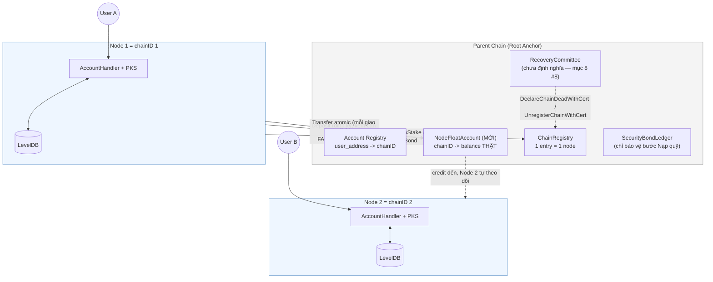
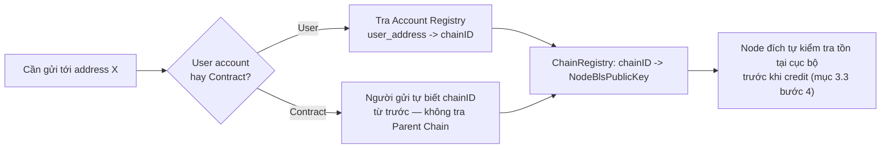
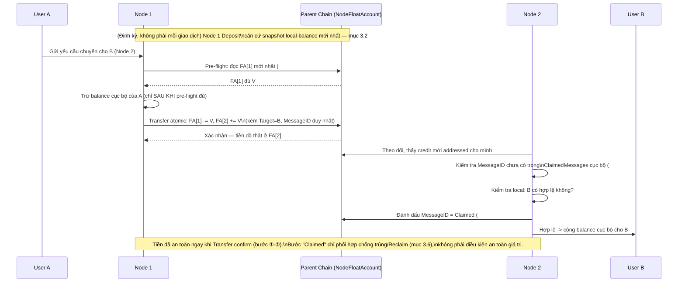
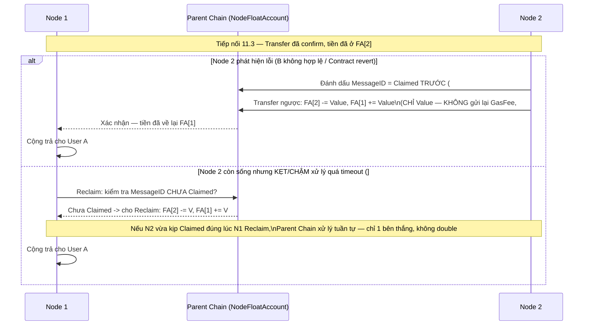
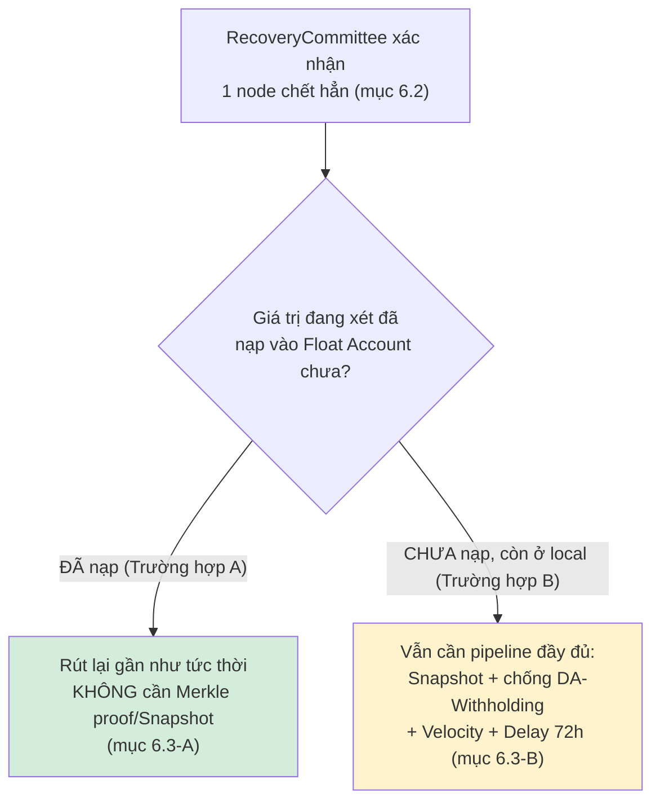
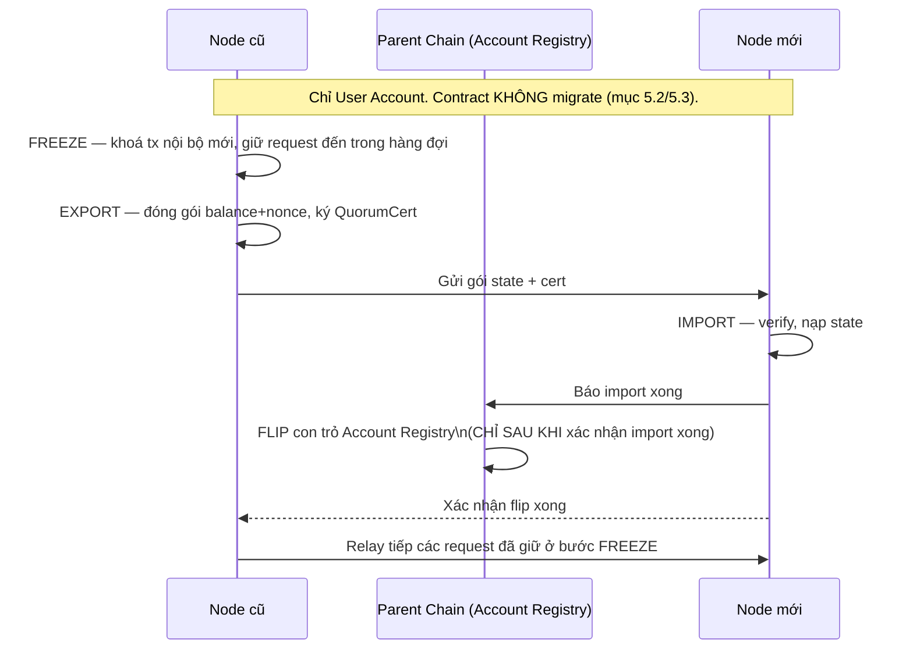

# Thiết kế Kiến trúc BLS Node & Node Float Account (Cross-Node Value Transfer)

> **v2 — CHỐT HƯỚNG:** Từ bản này, cơ chế chuyển giá trị cross-node chính thức chuyển sang mô hình **Node Float Account** — Parent Chain giữ thật "quỹ liên-node" của từng node (không phải trần phân bổ + tiền cọc răn đe như bản trước). Toàn bộ nội dung liên quan tới `Outbound`/`BatchOutboundCommit`/`ClaimMessage`/`FundedAmount`-`ClaimedAmount`/velocity-limit-cho-mọi-giao-dịch/Withdrawal-Delay-72h-cho-toàn-bộ-giá-trị đã bị loại bỏ khỏi tài liệu vì không còn phù hợp — chỉ giữ lại phần vẫn đúng cho **phần số dư CHƯA nạp quỹ** (mục 6.3). Giao dịch nội bộ cùng node **không đổi, vẫn tức thời**.

> ⚠️ **Nền tảng kỹ thuật vẫn là `execution/pkg/cross_chain/gateway.go`** (đăng ký chain qua stake, `SecurityBond`, `RecoveryCommittee`, `DeclareChainDeadWithCert`...) — chỉ riêng cơ chế **di chuyển giá trị giữa các node** được thiết kế lại thành ghi sổ trực tiếp (Float Account) thay vì mô hình mint-theo-trần-rồi-claim.

---

## 1. Tổng quan Kiến trúc

**Mục tiêu cốt lõi:**
- **Thực thi phân tán:** Mỗi Node (`cmd/rpc`) là 1 `chainID` độc lập (đã chốt — mục 2.4), tự quản state, balance, smart contract của user thuộc node đó.
- **Parent Chain = Root Anchor có sẵn** (đã chốt), đóng 2 vai trò: (1) sổ danh bạ (Account Registry, ChainRegistry), (2) **nơi giữ thật "quỹ liên-node"** của từng node (`NodeFloatAccount`) — khác bản trước ở chỗ đây là **tiền thật**, không phải trần phân bổ trừu tượng.
- **Cross-Node Interoperability:** Chuyển giá trị = ghi sổ chuyển khoản trực tiếp giữa 2 `NodeFloatAccount` trên Parent Chain — atomic, không cần dance "khoá batch → attest → claim" nhiều bước như bản trước.

---

## 2. Phân chia Vai trò

### 2.1. Parent Chain / Root Anchor
- **Account Registry:** `user_address -> chainID` (mục 5.1).
- **ChainRegistry:** danh tính + `NodeBlsPublicKey` từng node (có sẵn trong `GatewayEngine`).
- **`NodeFloatAccount` (MỚI, thay cho `PerChainAllocation`-làm-trần):** `chainID -> balance` — **tiền thật**, Parent Chain trực tiếp enforce không cho âm. Đây là state duy nhất Parent Chain giữ ngoài registry — vẫn **không giữ balance của từng user cuối** (state đó vẫn 100% ở local mỗi node).
- **`SecurityBondLedger` + `RecoveryCommittee`:** vẫn giữ nguyên vai trò, nhưng **phạm vi bảo vệ thu hẹp lại chỉ còn bước Nạp quỹ** (mục 4).

### 2.2. BLS Node (Execution Layer)
- **State nội bộ:** LevelDB riêng — balance, nonce, contract state của user thuộc node.
- **Custody Private Key (PKS):** giữ nguyên như thiết kế `cmd/rpc` gốc.
- **Giao dịch nội bộ:** xử lý ngay lập tức, không đụng Parent Chain (mục 13.2 — không đổi).
- **Giao dịch cross-node:** gọi thẳng thao tác chuyển khoản trên `NodeFloatAccount` của mình (mục 3), không còn qua `Outbound`/`ClaimMessage` 3 bước.

### 2.3. Rủi ro Custody tập trung (PKS giữ Device Key)

Không đổi so với bản trước: Node giữ 100% device key để ký hộ — nếu bị hack, kẻ tấn công ký được giao dịch nội bộ giả mà không để lại bằng chứng phân biệt được với user thật. Không giải quyết triệt để bằng kỹ thuật được (đánh đổi cố hữu của mô hình ký hộ); giảm thiểu bằng: (1) ngưỡng rút + delay cho giao dịch lớn, (2) anomaly detection, (3) tuỳ chọn non-custodial cho tài khoản lớn — bắt buộc xây cả 3 làm baseline trước go-live (mục 9.1 Q9-phần-build). Mức rủi ro còn lại có chấp nhận được với quy mô tài sản thật hay không là quyết định threat-model của đội (Q9-phần-rủi-ro, còn mở).

### 2.4. 1 Node `cmd/rpc` = 1 `chainID` riêng (ĐÃ CHỐT — Q13)

Không đổi so với bản trước — vẫn là quyết định nền tảng. Mỗi node đăng ký `chainID` riêng qua `RegisterChainViaStake`, không nhóm nhiều node dưới 1 chain. Lý do: `GatewayEngine` (`ChainRegistry`, `SecurityBond`, `RecoveryCommittee`) hoạt động ở đúng granularity `chainID`, ngầm giả định đây là 1 đơn vị tin cậy duy nhất — nhóm nhiều node độc lập dưới 1 chain phá vỡ giả định này. Hệ quả: committee mỗi node = 1 (chính nó), không có redundancy signer thật.

---

## 3. Cơ chế Chuyển giá trị Cross-Node — Node Float Account

### 3.1. Vì sao chuyển từ mô hình cũ (trần phân bổ + bond) sang mô hình này

**Mô hình cũ (đã bỏ):** mỗi node có `PerChainAllocation` — một **trần phân bổ**, không phải tiền thật — cộng với `SecurityBond` — tiền cọc **tách biệt**, chỉ có tác dụng răn đe SAU KHI phát hiện gian lận. Mỗi giao dịch cross-node phải qua 3 bước (`Outbound` → `BatchOutboundCommit`+`QuorumCert` → `ClaimMessage` với hard-cap `FundedAmount`/`ClaimedAmount`), và khi node chết, tài sản treo cần cả 1 pipeline nặng (Snapshot định kỳ, Archival Service, Velocity Limit, Withdrawal Delay 72h, chống Data-Availability-Withholding) mới rút lại được.

**Mô hình mới:** mỗi node có 1 **Float Account** trên Parent Chain — **tiền thật**, Parent Chain tự enforce không cho âm. Chuyển giá trị cross-node = 1 lệnh ghi sổ trực tiếp, atomic — không cần "khoá rồi chờ bên kia claim".

⚠️ **Hiểu đúng — mô hình mới KHÔNG loại bỏ hoàn toàn lỗ hổng gốc, nó THU HẸP phạm vi:** Parent Chain "không lưu state ứng dụng" nên vẫn không thể tự verify 1 node có thật sự sở hữu giá trị nó khai báo hay không — lỗ hổng này bị đẩy lùi về đúng **1 điểm duy nhất: bước Nạp quỹ** (mục 3.2), thay vì tồn tại ở MỌI giao dịch cross-node như mô hình cũ. Đây là cải tiến thật (bề mặt tấn công thu nhỏ, tần suất thấp hơn, dễ giám sát tập trung hơn), không phải loại bỏ hoàn toàn.

### 3.2. Nạp quỹ vào Float Account — 2 đường khác hẳn nhau, không được gộp chung

⚠️ **Sửa lại so với bản trước — thiếu 1 đường nạp quỹ khiến node MỚI không có cách nào bootstrap vốn ban đầu.** Có 2 loại nạp quỹ, rủi ro và cơ chế xác minh khác hẳn nhau:

**A. Nạp trực tiếp từ ví (Operator Funding) — KHÔNG cần "tin cậy có kiểm chứng", chỉ là chuyển khoản thường:**
Bất kỳ ví nào có số dư thật trên Parent Chain (operator của node, nhà đầu tư, hoặc chính node tự chuyển tiếp) đều có thể chuyển thẳng vào `NodeFloatAccount[node]`, **y hệt 1 giao dịch ví-sang-ví bình thường** — Parent Chain chỉ cần verify ví nguồn có đủ số dư thật (bình thường như mọi transaction), **không cần snapshot, không cần bond-vs-deposit, không có gì để "khai khống"** vì đây là tiền đã thật sự tồn tại trên chính Parent Chain từ trước, không phải lời tuyên bố về state cục bộ ở nơi khác.
- **Đây là đường DUY NHẤT để 1 node MỚI có vốn khởi đầu** — 1 node vừa đăng ký chưa có user nào, snapshot local-balance = 0, nên đường B (dưới đây) không dùng được cho tới khi node đã hoạt động 1 thời gian và tích luỹ số dư local thật.
- **Giải quyết luôn Q5 (vốn Reserve ban đầu):** dưới mô hình Float Account, **không còn khái niệm Parent Chain phải khởi tạo/quy hoạch 1 "pool Reserve" chia cho N node** như mô hình cũ (`RegisterChainViaStake` từng `TransferAllocation` từ Reserve — tàn dư của `PerChainAllocation`-làm-trần, không còn khớp với Float Account). Ai muốn vận hành/đầu tư vào 1 node chỉ cần chuyển tiền thật vào Float Account của node đó, đúng như chuyển khoản cho 1 ví bất kỳ — không cần đội lập kế hoạch cấp vốn genesis nữa. **Q5 coi như đã đóng** (mục 9.1).

**B. Nạp từ số dư local đã tích luỹ (Snapshot-backed Deposit) — vẫn cần "tin cậy có kiểm chứng" như bản trước:**
Sau khi node đã hoạt động và có user với số dư local thật, muốn CHUYỂN một phần số dư đó thành quỹ liên-node (thay vì chỉ nằm im ở local), node mới cần đường này:
1. Node tự ký xác nhận "tôi nạp X vào Float Account", kèm căn cứ: tham chiếu snapshot local-balance mới nhất đã publish (mục 6.3) — **không được nạp vượt quá số dư đã chứng minh qua snapshot trừ đi phần đã nạp trước đó**.
2. Parent Chain verify chữ ký (committee = 1, chính node đó — Q3) + hard-cap theo bất biến Bond-vs-Deposit (mục 4.1) + đối chiếu căn cứ snapshot, rồi cộng thật vào `NodeFloatAccount[node]`.
3. Lý do vẫn cần kiểm chứng ở đường này (khác đường A): số dư local là state ngoài tầm nhìn của Parent Chain (mục 2.1), node CÓ THỂ khai khống — đây vẫn là điểm duy nhất trong toàn hệ thống còn giữ nguyên rủi ro "tin cậy chưa kiểm chứng được hoàn toàn" (mục 3.1).

### 3.3. Chuyển giá trị cross-node (Transfer) — luồng thành công

1. User A (Node 1) gửi yêu cầu chuyển cho User B (Node 2).
2. ⚠️ **Pre-flight check bắt buộc (mục 8 #11) — TRƯỚC KHI đụng vào balance cục bộ của A:** Node 1 đọc `NodeFloatAccount[1]` mới nhất, xác nhận `>= V`. Nếu KHÔNG đủ (Float cạn — mục 3.5), **từ chối/queue yêu cầu ngay tại đây, KHÔNG trừ balance cục bộ của A** — trả cho user 1 trạng thái rõ ràng "đang chờ node nạp quỹ", tách bạch hẳn với lỗi mất kết nối. Đây là điểm dễ nhầm nhất: mất-kết-nối và float-không-đủ là 2 nguyên nhân khác hẳn nhau, không được gộp chung xử lý "cứ retry là được" — float-không-đủ cần node nạp thêm thật, retry đơn thuần không giải quyết được. Việc đọc-kiểm tra-rồi-ghi phải được node tự serialize/khoá nội bộ (không xử lý song song nhiều outbound Transfer cùng lúc mà không khoá), tránh 2 yêu cầu cùng đọc thấy "đủ" rồi cùng trừ vượt quá số dư thật.
3. Qua được pre-flight check: Node 1 trừ balance cục bộ của A, đồng thời gửi 1 giao dịch **duy nhất, atomic** lên Parent Chain: `NodeFloatAccount[1] -= V`, `NodeFloatAccount[2] += V`, kèm metadata (`Target: B`, `MessageID` duy nhất, `Payload` nếu là contract-call). **Không cần batch-rồi-chờ-ký-committee** (committee = 1 nên chữ ký chỉ là chính Node 1 tự ký, gộp luôn vào transaction này) — đơn giản hơn hẳn 3 bước của mô hình cũ.
4. Ngay khi transaction confirm trên Parent Chain: **tiền đã thật sự nằm ở `NodeFloatAccount[2]`** — không còn khái niệm "Pending chờ claim" cho phần GIÁ TRỊ.
5. Node 2 theo dõi Parent Chain, thấy có credit mới addressed cho mình. ⚠️ **Chống xử lý trùng bắt buộc (mục 8 #13):** Node 2 phải tự kiểm tra `MessageID` này đã xử lý (credit hoặc refund) chưa trước khi làm bất cứ gì — mô hình cũ có `ErrAlreadyClaimed` tự động trong `ClaimMessage`, mô hình mới KHÔNG còn hàm trung tâm nào làm việc này hộ, node phải tự giữ 1 bảng "MessageID đã xử lý" cục bộ.
6. Node 2 kiểm tra local: `B` có phải account hợp lệ đang được chính mình quản lý không (không đổi so với bản trước).
7. Nếu hợp lệ: Node 2 **trước tiên** gửi 1 transaction nhỏ lên Parent Chain đánh dấu `MessageID` này = `Claimed` (mục 3.6 — cần cho cơ chế Reclaim-theo-timeout), **rồi mới** cộng balance cục bộ cho B. Không cần cert thành công gửi ngược lại Node 1 để "đóng Pending" như mô hình cũ, vì tiền đã an toàn ngay từ bước 4 — đánh dấu `Claimed` chỉ để phối hợp với mục 3.6, không phải điều kiện an toàn giá trị.

### 3.4. Nếu kiểm tra local thất bại (account không hợp lệ) hoặc Contract Call bị revert

Tiền **đã thật sự nằm ở `NodeFloatAccount[2]`** (khác mô hình cũ, nơi tiền chỉ là 1 "quyền claim" chưa thực sự di chuyển) — nên hoàn tiền giờ đơn giản là **1 giao dịch Transfer khác, chiều ngược lại**, dùng lại đúng cơ chế ở mục 3.3, không cần `FinalizeFailedAfterExecutionRevert`/`destFailureCert`/`Refund` 3 bước như trước:

1. Node 2 phát hiện B không hợp lệ, hoặc Contract Call revert (hoàn tác toàn bộ thay đổi state đã thử).
2. ⚠️ **Chống hoàn tiền 2 lần bắt buộc (mục 8 #12):** mô hình cũ có guard tường minh trong `Refund()` (chỉ chạy khi `MessageStatus == Pending`). Mô hình mới không còn hàm trung tâm này — Node 2 **phải tự đánh dấu `MessageID` = `Claimed`** trên Parent Chain (đúng bước đã thêm ở mục 3.3 bước 7, dùng chung 1 cơ chế cho cả credit thành công lẫn hoàn tiền) **TRƯỚC KHI** gửi Transfer hoàn tiền — nếu crash giữa chừng và retry lại từ đầu, Node 2 phải kiểm tra `MessageID` này đã `Claimed` chưa trước khi tạo giao dịch hoàn tiền mới, tránh gửi hoàn tiền 2 lần (tự bào mòn quỹ của chính Node 2, không phải lỗi hệ thống nhưng vẫn là mất tiền thật cho node đó).
3. Node 2 gửi Transfer ngược: `NodeFloatAccount[2] -= Value` (**chỉ đúng phần `Value`**), `NodeFloatAccount[1] += Value`.
4. Node 1 nhận lại, cộng trả cho User A.
5. ⚠️ **`GasFee` KHÔNG được hoàn** (quy tắc không đổi so với bản trước — vẫn cần giữ, xem mục 8 #6): Node 2 đã thực sự tốn chi phí tính toán để thử thực thi/kiểm tra dù kết quả thất bại. Nếu hoàn cả `GasFee`, kẻ tấn công spam giao dịch cố tình gây revert để bào CPU/RAM Node 2 miễn phí.

### 3.5. Node chưa nạp quỹ đủ / thanh khoản cạn — vấn đề MỚI, cần chính sách vận hành

Đánh đổi thật của mô hình mới, không có trong mô hình cũ:

- Nếu `NodeFloatAccount[1]` không đủ để gửi 1 Transfer, giao dịch outbound của user bị **block** cho tới khi node kịp nạp thêm — giống bài toán thanh khoản kênh (channel liquidity) của Lightning Network.
- Cần cơ chế cảnh báo + auto top-up khi Float Account xuống dưới ngưỡng (mục 9.2).
- Vốn bị khoá thật (locked capital): node phải giữ 1 khoản tiền "nằm chờ" trên Parent Chain — chi phí cơ hội thật, khác mô hình cũ (chỉ cần bond đủ tỷ lệ, không cần tiền thật nằm sẵn để phục vụ giao dịch).

### 3.6. Node đích còn sống nhưng kẹt/chậm xử lý — Timeout & Reclaim (mục 8 #15, MỚI)

Khác với node chết hẳn (mục 6, cần `RecoveryCommittee`), trường hợp này là Node 2 **vẫn hoạt động bình thường** nhưng vì lý do nào đó (backlog, bug, quá tải) không xử lý (không credit local, không hoàn tiền) 1 credit đã nhận trong thời gian dài — tiền nằm im ở `NodeFloatAccount[2]`, User A không được phục vụ cũng không được hoàn, không có điểm dừng theo thời gian nếu không thiết kế thêm.

- **Cơ chế Reclaim:** nếu quá 1 khoảng thời gian cấu hình (ví dụ tương tự `TimeoutTimestamp` cũ) kể từ lúc Transfer confirm mà `MessageID` vẫn CHƯA được đánh dấu `Claimed` (mục 3.3 bước 7), **chính Node 1** (thay mặt User A) có quyền gửi 1 transaction Reclaim thẳng lên Parent Chain: `NodeFloatAccount[2] -= Value`, `NodeFloatAccount[1] += Value` — **không cần Node 2 hợp tác**, vì tiền vốn dĩ do Parent Chain custody thật (điểm mạnh của mô hình Float Account so với mô hình cũ, nơi phải phụ thuộc đích tạo `destFailureCert`).
- **Chặn race Reclaim-vs-Claimed (bắt buộc):** Parent Chain chỉ cho Reclaim thành công nếu `MessageID` đó **chưa** được đánh dấu `Claimed` tại thời điểm xử lý Reclaim — nếu Node 2 vừa kịp đánh dấu `Claimed` (đang credit local cho B) đúng lúc Node 1 gửi Reclaim, chỉ 1 trong 2 thắng (Parent Chain xử lý tuần tự, ai đến trước với `MessageID` chưa bị đánh dấu thì thắng) — bên thua bị từ chối, không có chuyện cả 2 cùng thành công.

---

## 4. Bảo mật kinh tế — thu hẹp phạm vi theo mô hình Float Account

### 4.1. Bất biến Bond-vs-Deposit (thay cho Bond-vs-Exposure cũ)

Vì mỗi giao dịch Transfer (mục 3.3) giờ đã an toàn tuyệt đối bằng chính cơ chế ghi sổ (không thể rút âm `NodeFloatAccount`), **bất biến bond giờ chỉ cần áp cho bước Nạp quỹ** — phạm vi nhỏ hơn hẳn bản trước (từng áp cho MỌI giá trị cross-node đang treo):

> `SecurityBond(node) ≥ hệ_số_an_toàn × giới_hạn_nạp_quỹ_mỗi_chu_kỳ(node)` — hệ số an toàn mặc định **2x** (giữ nguyên đề xuất bản trước, vẫn hợp lý vì bản chất bài toán "bù thời gian phát hiện gian lận" không đổi).

Nếu node khai khống khi Nạp quỹ (Deposit) vượt quá số dư local thật, `SlashOnEquivocation`/phát hiện gian lận (qua đối chiếu snapshot định kỳ, mục 6.3) vẫn tịch thu bond như cũ — nhưng giờ thiệt hại tối đa bị giới hạn bởi **giới hạn nạp quỹ mỗi chu kỳ**, không phải toàn bộ giá trị có thể "mint" qua từng message riêng lẻ như trước.

### 4.2. Velocity-limit cho Transfer: không cần để chống MINT SAI, nhưng vẫn cần vì lý do KHÁC (đã sửa lại — xem mục 4.4)

Mô hình cũ cần `checkAndRecordVelocity` áp cho mọi `AttestCommit` vì mỗi message là 1 "tuyên bố mint" cần giới hạn thiệt hại nếu sai. Mô hình mới: mỗi Transfer là ghi sổ trực tiếp trên số dư THẬT đã có sẵn trong `NodeFloatAccount` — không có gì để "mint sai" ở bước này, nên **đúng là không cần velocity-limit CHO LÝ DO CHỐNG-GIAN-LẬN**. ⚠️ **Nhưng đây không phải toàn bộ câu chuyện — velocity-limit còn có vai trò thứ 2 hoàn toàn khác mà bản thảo đầu của mục này đã bỏ sót: giới hạn thiệt hại khi KHOÁ KÝ CỦA NODE BỊ LỘ (không phải khi node cố ý gian lận). Xem mục 4.4 — vai trò này vẫn cần, chỉ là lý do khác.**

### 4.3. Bất biến tổng cung

`Σ NodeFloatAccount + Σ (local balance chưa nạp quỹ, không kiểm chứng được on-chain) == genesis_total_supply`. Lưu ý phần thứ 2 (local balance chưa nạp) **không tự động kiểm chứng được** — đây chính là lý do bước Nạp quỹ vẫn cần căn cứ snapshot + bond như mục 4.1, không thể bỏ hoàn toàn.

### 4.4. [MỚI — mục 8 #14] Velocity-limit cho Transfer OUTFLOW: giới hạn thiệt hại khi khoá ký node bị lộ

**Vấn đề:** vì Float Account là tiền thật và Transfer không còn hard-cap/velocity nào (mục 4.2), nếu khoá ký (device key/BLS key) của 1 node bị lộ, kẻ tấn công có thể gửi 1 Transfer DUY NHẤT rút sạch **TOÀN BỘ** `NodeFloatAccount` của node đó sang 1 địa chỉ kiểm soát bởi kẻ tấn công, ngay lập tức — không có gì cản. Đây là rủi ro **nặng hơn** cả #9 (custody local, mục 2.3), vì quỹ liên-node có thể lớn hơn hẳn tổng số dư local của node (mục 3.5 khuyến khích giữ đủ thanh khoản để không bị block giao dịch).

**Quyết định:** tái áp dụng velocity-limit, nhưng cho **Transfer OUTFLOW** (không phải cho Deposit như mục 4.1 — đây là 1 giới hạn khác, mục đích khác):

> Tổng giá trị gửi ra (Transfer outflow) của 1 `NodeFloatAccount` trong 1 cửa sổ trượt (ví dụ 24h) không được vượt quá X% số dư đầu cửa sổ — mặc định đề xuất giữ nguyên **20%/24h** (số đã dùng quen ở bản trước cho mục đích khác, nhưng cùng bậc độ lớn hợp lý cho mục đích mới này) — cần đội xác nhận lại theo dữ liệu traffic thật.

Đây **không phải** hard-cap chống gian lận (không có gì để gian lận ở bước Transfer) mà là **circuit-breaker chống lộ khoá** — giống hệt lý do các sàn/ngân hàng đặt hạn mức rút tiền/ngày ngay cả với tài khoản đã xác minh đầy đủ danh tính. Khi vượt ngưỡng: giao dịch bị tạm giữ + cảnh báo operator ngay (không tự động từ chối vĩnh viễn, vì đây có thể là traffic hợp lệ tăng đột biến, không phải luôn là dấu hiệu bị hack).

---

## 5. Đăng ký & Tra cứu Account/Contract

*(Không đổi so với bản trước — cơ chế này độc lập với việc chuyển giá trị dùng mô hình nào.)*

### 5.1. Account Registry

| Bảng | Key | Value | Vai trò |
|---|---|---|---|
| Account Registry | `user_address` | `chainID` (của node sở hữu) | Định tuyến `Target` đến đúng node; node đó tự kiểm tra hợp lệ trước khi credit (mục 3.3 bước 4) |

- **Đăng ký 1 lần, chống ghi đè:** chỉ chấp nhận lần đầu, hoặc cần chữ ký của node hiện tại để chuyển nhượng (Migration, mục 5.3).
- **Chặn double-registration:** cơ chế chặn nằm ở chính write vào Account Registry trên Parent Chain (transaction xử lý tuần tự = điểm serialize duy nhất) — không coi admin-confirm cục bộ tại node là đã chốt quyền sở hữu (chi tiết đầy đủ mục 12 Q1).
- **An toàn trước DoS:** đăng ký qua `handleSetBlsPublicKey` + admin confirm (2 bước, có gate) — không permissionless.
- **Vốn khởi tạo khi đăng ký node mới (đã đóng — Q5):** `RegisterChainViaStake` dùng đúng số tiền thật operator/nhà đầu tư tự bỏ ra từ ví của họ (bond đăng ký) — **không còn rút từ 1 "pool Reserve" do Parent Chain khởi tạo genesis** như tàn dư của mô hình `PerChainAllocation`-làm-trần cũ. Vốn khởi đầu cho Float Account của node cũng vậy — nạp trực tiếp từ ví (mục 3.2 đường A). Không cần đội lập kế hoạch cấp vốn Reserve cho N node nữa.

### 5.2. Contract Registry — KHÔNG dùng registry toàn cục

Không đổi: bên gửi (`Target`+`chainID` đích) đã phải tự biết trước contract nằm ở node nào — không có API đăng ký contract để tránh DoS/race-condition tra cứu. Kiểm tra tồn tại cục bộ tại đích (mục 3.3 bước 4) là đủ.

### 5.3. Migration Account (CHỈ User, KHÔNG áp dụng Contract)

Không đổi: Contract không được migrate (vì mục 5.2 đã bỏ Contract Registry, contract đổi node sẽ "tàng hình"). Giao thức 3 pha cho User Account: **Freeze** (khoá tx nội bộ mới, giữ lại request đến trong hàng đợi tạm, không revert ngay) → **Export & Attest** (đóng gói balance+nonce, ký `QuorumCert`) → **Import & Flip con trỏ** (chỉ flip Account Registry SAU KHI node mới xác nhận import xong, không lạc quan).

---

## 6. Xử lý Mất kết nối & Node chết vĩnh viễn

### 6.1. Mất kết nối tạm thời

Không đổi: giao dịch nội bộ không bị ảnh hưởng. Giao dịch cross-node gửi thất bại do mất mạng: giữ nguyên trong Retry Queue cục bộ, gửi lại đúng transaction đã ký, không tạo transaction mới cho cùng 1 yêu cầu.

### 6.2. Node chết hẳn — ai xác nhận, xử lý ra sao

- Tiêu chí trigger: 2 lớp — (1) tự động cảnh báo sau N lần bỏ lỡ chu kỳ hoạt động bình thường liên tiếp, (2) **bắt buộc xác nhận thủ công của operator** trước khi thực sự gọi `DeclareChainDeadWithCert` — không tự động hoá hoàn toàn vì hậu quả quá lớn.
- `DeclareChainDeadWithCert` đòi hỏi `QuorumCert` của **`RecoveryCommittee`** — một thực thể quyền lực riêng, cố định, set 1 lần từ config lúc triển khai, **chưa được định nghĩa trong tài liệu này** (ai ngồi trong đó, bao nhiêu người, ngưỡng quorum — mục 8 #8, còn mở). Không phải quyết định đơn phương của node còn lại.

### 6.3. Rút lại giá trị khi node chết — tách rõ 2 trường hợp (khác biệt lớn nhất so với mô hình cũ)

**Trường hợp A — Giá trị ĐÃ nạp vào Float Account (mục 3.2):** ĐƠN GIẢN, gần như tức thời. Tiền đã thật sự nằm ở `NodeFloatAccount[node chết]` trên Parent Chain — không cần Merkle proof, không cần dữ liệu từ chính node đã chết. Sau khi `RecoveryCommittee` xác nhận node chết:
- Phần đang "đi ngang" (Transfer đã gửi TỚI node chết nhưng chưa kịp credit local cho user đích): tự động hoàn lại người gửi ban đầu, dùng đúng cơ chế Transfer ngược ở mục 3.4 — coi như 1 dạng "revert vì node đích không còn hoạt động".
- Phần Float Account của chính node chết (quỹ nó tự nạp, chưa dùng hết): trả lại cho operator của node đó sau khi hoàn tất unregister (tương tự cơ chế `ClaimUnbondedBond` có sẵn).
- **Không cần Snapshot Pipeline, không cần Velocity Limit, không cần Withdrawal Delay 72h, không cần lo Data Availability Withholding cho PHẦN NÀY** — đây là điểm khác biệt lớn nhất so với mô hình cũ.

**Trường hợp B — Giá trị CHƯA nạp vào Float Account (còn nằm ở local balance của user trong node đã chết):** **VẪN CẦN y hệt pipeline cũ**, không có gì thay đổi — vì đây đúng là phần dữ liệu chỉ tồn tại trên node đã chết, mô hình Float Account không giúp được:
1. **Snapshot Export định kỳ, PROACTIVE** (mỗi 15 phút, Q12) — export cây Merkle account state ra ngoài node + publish `AccountTreeRoot` có xác thực lên Parent Chain (không dùng nhầm `UpdateCommitteeWithRecoveryCert`, cần API riêng).
2. **Chống Data Availability Withholding (fail-closed):** Archival Service phải xác nhận nhận đủ dữ liệu khớp root trong vài phút sau publish; nếu không, VETO/đóng băng root ngay — không đợi hết thời gian chờ, "không đủ dữ liệu" = coi như gian lận.
3. **`ClaimDeadChainBalance` + 2 lớp chặn:** velocity-limit (20%/24h) + Withdrawal Delay tối thiểu **72 giờ** trước khi giải ngân thật, cho operator/Archival có thời gian phát hiện root giả mạo.
4. **Cửa sổ mất mát = tần suất export** (mặc định 15 phút) — giao dịch sau lần export cuối, nếu node chết ngay sau đó, không chứng minh được.
5. **Ai tính proof hộ user:** dịch vụ archival độc lập, không bắt user tự giữ Merkle proof.

**Khuyến nghị vận hành:** khuyến khích node nạp quỹ thường xuyên, giữ local balance thấp (chuyển nhanh sang trạng thái "đã nạp") để thu hẹp dần phạm vi Trường hợp B theo thời gian — nhưng không thể loại bỏ hoàn toàn Trường hợp B chỉ bằng chính sách, vì local balance của user luôn tồn tại 1 khoảng thời gian trước khi được nạp quỹ.

---

## 7. Tóm tắt Cấu trúc Data Model

### Tại Parent Chain / Root Anchor
| Bảng / Struct | Nguồn | Vai trò |
|---|---|---|
| Account Registry | Mở rộng `AccountManager` contract có sẵn | `user_address -> chainID` |
| `ChainRegistry` | Có sẵn (`gateway.go`) | Danh tính + `NodeBlsPublicKey` từng node |
| **`NodeFloatAccount` (MỚI)** | Cần xây | `chainID -> balance` — tiền thật, thay cho `PerChainAllocation`-làm-trần |
| **`ClaimedMessages` (MỚI)** | Cần xây | `MessageID -> bool` — đánh dấu đã xử lý (credit local hoặc hoàn tiền), dùng để chống xử lý trùng (#13), chống hoàn tiền 2 lần (#12), và làm điều kiện chặn Reclaim (mục 3.6, #15) |
| `SecurityBondLedger` | Có sẵn | Bond, phạm vi thu hẹp chỉ còn bảo vệ bước Nạp quỹ (mục 4.1) |
| `DeadChains` | Có sẵn | Node đã tuyên bố chết, chặn outflow mới |

### Tại mỗi BLS Node (Local DB)
| Bảng / Struct | Key | Value | Vai trò |
|---|---|---|---|
| Account State | `user_address` | `balance`, `nonce`, `contract_state` | State thực sự |
| Retry Queue | `message_id` | `payload`, `status` | Chỉ cho mất-kết-nối tạm thời (mục 6.1) |
| Local state machine | `message_id` | `LOCAL_APPLIED_PENDING_SEND / SENT_CONFIRMED / ...` | Xem mục 13.4 — đơn giản hơn bản trước vì Transfer atomic |

---

## 8. Danh sách vấn đề logic/bảo mật còn hiệu lực với mô hình Float Account

> Danh sách này đã dọn bỏ các vấn đề chỉ tồn tại trong mô hình cũ (3 bước `Outbound`/`AttestCommit`/`ClaimMessage`, bond-vs-exposure cho từng giao dịch, ACK/NACK 2 chiều cho phần giá trị) — chúng tự triệt tiêu khi chuyển sang Float Account (mục 3.1). Chỉ giữ lại vấn đề vẫn còn hiệu lực thật.

| # | Vấn đề | Rủi ro cụ thể | Xử lý |
|---|---|---|---|
| 1 | Committee mỗi node = 1 (chính nó) — không có redundancy signer thật | `QuorumCert` về bản chất là chữ ký đơn | Phòng thủ chuyển sang bất biến Bond-vs-Deposit (mục 4.1), không nằm ở số lượng chữ ký |
| 2 | Nạp quỹ (Deposit) vẫn là điểm duy nhất còn cần "tin cậy có kiểm chứng" | Node có thể khai khống số dư local khi nạp quỹ | Giới hạn theo snapshot đã publish + bond-vs-deposit + velocity theo chu kỳ nạp (mục 3.2, 4.1) |
| 3 | Account Registry cho phép ghi đè mapping tuỳ ý nếu không kiểm soát | Report cũ/replay có thể "cướp" account sang node khác | Chỉ chấp nhận đăng ký lần đầu hoặc chữ ký của node hiện tại để chuyển nhượng (mục 5.1, 5.3) |
| 4 | Contract tự sinh (deploy trong node) không thể đăng ký registry toàn cục | DoS/state-bloat lên Parent Chain nếu bắt đăng ký như Account | Bỏ hẳn Contract Registry toàn cục; dùng `chainID` đích tường minh từ người gửi + kiểm tra tồn tại cục bộ (mục 5.2) |
| 5 | Chuyển nhượng account (Migration) không atomic nếu không thiết kế kỹ | Message đến đúng lúc đang chuyển giao có thể bị kẹt/mất | Giao thức 3 pha Freeze → Export & Attest → Import & flip con trỏ (mục 5.3) |
| 6 | `GasFee` bị hoàn nhầm khi giao dịch cross-node thất bại | Spam-revert trở thành DoS miễn phí lên node đích | Transfer hoàn tiền (mục 3.4) CHỈ hoàn `Value`, không hoàn `GasFee` |
| 7 | Node chết hẳn, phần local balance CHƯA nạp quỹ không có cách rút | Tài sản khoá vĩnh viễn nếu thiếu Snapshot Pipeline | Snapshot & Archival Pipeline + chống DA-Withholding + Velocity + Withdrawal Delay 72h — **chỉ áp dụng cho phần chưa nạp quỹ** (mục 6.3 Trường hợp B) |
| 8 | `RecoveryCommittee` — thực thể duy nhất có quyền tuyên bố node chết, tịch thu bond, thay khoá ký bất kỳ node nào — chưa được định nghĩa | Lộ/compromise `RecoveryCommittee` ảnh hưởng TOÀN hệ thống, nặng hơn lộ 1 node đơn lẻ | Cần đội xác định thành viên, ngưỡng quorum, quy trình bảo vệ khoá — quyết định tổ chức thật, không tự đề xuất được (mục 9.1, còn mở) |
| 9 | Custody 100% device key (PKS) — Node bị hack có thể ký giao dịch nội bộ giả | Mất tiền không để lại bằng chứng mật mã, ngoài phạm vi bảo vệ của Float Account (tiền không rời node) | Không giải quyết triệt để bằng kỹ thuật — giảm thiểu bằng delay/anomaly-detection/non-custodial tuỳ chọn (mục 2.3) |
| 10 | Thanh khoản Float Account cạn giữa chừng (mới, do đổi mô hình) | Giao dịch outbound bị block cho tới khi node kịp nạp thêm | Cảnh báo + auto top-up khi xuống dưới ngưỡng (mục 3.5, 9.2) |
| 11 | **[MỚI]** Không phân biệt "mất kết nối" (retry được) với "Float Account không đủ" (retry đơn thuần không giải quyết được) trước khi trừ balance cục bộ | User bị trừ tiền cục bộ nhưng giao dịch kẹt vô thời hạn nếu chỉ retry mà không nạp quỹ thật | Pre-flight check `NodeFloatAccount >= V` TRƯỚC khi đụng balance cục bộ, tách bạch 2 loại lỗi rõ ràng cho user (mục 3.3 bước 2) |
| 12 | **[MỚI]** Reverse Transfer (hoàn tiền, mục 3.4) không có cơ chế chống gửi 2 lần — mô hình cũ có guard `MessageStatus==Pending` trong `Refund()`, mô hình mới chưa thay thế | Crash giữa chừng rồi retry có thể gửi hoàn tiền 2 lần, tự bào mòn quỹ của chính node đang hoàn tiền | Đánh dấu `MessageID` = `Claimed` trên Parent Chain TRƯỚC khi gửi hoàn tiền, kiểm tra lại trạng thái này trước khi retry (mục 3.3 bước 7, mục 3.4 bước 2) |
| 13 | **[MỚI]** Node đích không có cơ chế chống xử lý trùng 1 credit đến — mô hình cũ có `ErrAlreadyClaimed` tự động trong `ClaimMessage`, mô hình mới không còn hàm trung tâm nào làm việc này hộ | Node đích có thể credit local 2 lần cho cùng 1 `MessageID` nếu logic theo dõi/watcher bị lỗi hoặc quét lại block cũ | Node đích tự giữ bảng "MessageID đã xử lý", kiểm tra trước khi làm bất cứ gì (mục 3.3 bước 5) |
| 14 | **[MỚI, NGHIÊM TRỌNG]** Bỏ velocity-limit cho Transfer với lý do "không mint sai được" đúng cho gian lận nhưng bỏ sót vai trò giới hạn thiệt hại khi KHOÁ KÝ node bị lộ | Node bị lộ khoá có thể bị rút sạch TOÀN BỘ Float Account trong 1 giao dịch tức thời — nặng hơn cả #9 (custody local) vì quỹ liên-node có thể lớn hơn local balance | Tái áp dụng velocity-limit cho Transfer OUTFLOW (khác mục đích với Deposit ở mục 4.1) — circuit-breaker chống lộ khoá, không phải hard-cap chống gian lận (mục 4.4) |
| 15 | **[MỚI]** Không có timeout nếu node đích còn sống nhưng kẹt/chậm xử lý 1 credit đã nhận (khác node chết hẳn, không cần `RecoveryCommittee`) | Tiền nằm im ở Float Account của đích, User A gốc không được phục vụ cũng không được hoàn, không có điểm dừng theo thời gian | Cơ chế Reclaim: quá timeout mà `MessageID` chưa `Claimed`, Node 1 tự reclaim thẳng từ Parent Chain không cần Node 2 hợp tác — có chặn race với việc Node 2 vừa kịp `Claimed` (mục 3.6) |

---

## 9. Production Readiness Checklist

### 9.1. Decision Log

| # | Câu hỏi | Quyết định | Căn cứ |
|---|---|---|---|
| Q(mô hình giá trị) | Chuyển hẳn sang Node Float Account hay giữ mô hình bond cũ? | **Đã chốt: chuyển hẳn**, phạm vi giới hạn ở quỹ liên-node (giao dịch nội bộ không đổi) | mục 3 |
| Q13 | 1 node = 1 chainID? | **Đã chốt**, không đổi từ bản trước | mục 2.4 |
| Q3 | Committee mỗi node bao nhiêu validator? | **Chấp nhận = 1** (chính node) | mục 2.4 |
| Q(hệ số Bond-vs-Deposit) | Hệ số an toàn cho bất biến mục 4.1? | **2x** giới hạn nạp quỹ mỗi chu kỳ, có thể tăng nếu phát hiện chậm hơn giả định | mục 4.1 |
| Q(giới hạn nạp quỹ mỗi chu kỳ) | Bao nhiêu mỗi chu kỳ? | Công thức: gắn với số dư đã chứng minh qua snapshot gần nhất, trừ phần đã nạp — không phải số tuyệt đối cố định | mục 3.2 |
| Q(tần suất snapshot) | Bao nhiêu lâu 1 lần? | **Mặc định 15 phút**, có thể tăng sau khi đo chi phí thật — chỉ ảnh hưởng Trường hợp B (mục 6.3) | mục 6.3 |
| Q(ngưỡng Float Account) | Ngưỡng tối thiểu cảnh báo/auto top-up? | Còn mở — cần dữ liệu traffic thật để tính (mục 3.5) |
| Q(velocity Transfer outflow) | Ngưỡng circuit-breaker chống lộ khoá cho Transfer (mục 4.4)? | **Mặc định khởi điểm 20%/24h**, giữ nguyên tinh thần bản trước nhưng đổi mục đích — cần đội xác nhận lại theo traffic thật, không chặn triển khai ban đầu | mục 4.4, mục 8 #14 |
| Q(timeout Reclaim) | Bao lâu thì Node 1 được phép Reclaim nếu Node 2 chưa `Claimed`? | Công thức tương tự `TimeoutTimestamp` cũ (mục 6.2 bản trước) — chưa có số tuyệt đối, cần đo chu kỳ xử lý bình thường thật trước khi chốt | mục 3.6, mục 8 #15 |
| Q(RecoveryCommittee) | Ai ngồi trong đó, bao nhiêu người, ngưỡng quorum? | **CÒN MỞ THẬT SỰ** — quyết định tổ chức/nhân sự, không tự đề xuất được. **Chặn cứng go-live**: code không chạy được nếu thiếu config này | mục 8 #8 |
| Q5 | Vốn Reserve ban đầu cho N node? | **✅ ĐÃ ĐÓNG — không còn áp dụng.** Không cần Parent Chain khởi tạo/quy hoạch pool Reserve nữa — node lấy vốn khởi đầu trực tiếp từ ví operator/nhà đầu tư (mục 3.2 đường A), đúng bản chất "chuyển khoản ví-sang-ví, chuyển bao nhiêu thì node có bấy nhiêu" | mục 3.2, mục 5.1 |
| Q9-rủi-ro | Mức rủi ro custody PKS chấp nhận được với quy mô tài sản thật? | **CÒN MỞ** — khẩu vị rủi ro kinh doanh thật | mục 2.3 |

**2 mục còn mở thật sự, không tự đề xuất số được:** `RecoveryCommittee` thành viên, Q9-rủi-ro (custody risk acceptance). (Q5 đã đóng — xem trên.)

### 9.2. Vận hành

- **Quản lý khoá `RecoveryCommittee`** (ưu tiên cao hơn khoá node — mục 8 #8): multisig/HSM/threshold-signing riêng, tách biệt quy trình vận hành khoá node thường.
- **Giám sát Float Account:** cảnh báo khi `NodeFloatAccount` của 1 node xuống dưới ngưỡng vận hành an toàn (mục 3.5); auto top-up nếu khả thi.
- **Giám sát Snapshot Pipeline** (chỉ ảnh hưởng Trường hợp B, mục 6.3): cảnh báo nếu 1 node bỏ lỡ chu kỳ export.
- **Backup & DR:** backup LevelDB từng node + state Parent Chain (`ChainRegistry`/`NodeFloatAccount`/`SecurityBondLedger`/`DeadChains`).
- **Runbook:** kịch bản node bị nghi compromise (khi nào trigger `SlashOnEquivocation`/`DeclareChainDeadWithCert`), kịch bản Float Account cạn thanh khoản giữa giờ cao điểm.

### 9.3. Checklist bảo mật trước khi go-live

- [ ] #1–#15 ở mục 8 đã được review độc lập bởi người khác (không tự ký-tự duyệt) — đặc biệt #7 (Snapshot Pipeline cho Trường hợp B), #8 (`RecoveryCommittee`), và #14 (velocity-limit chống lộ khoá — dễ bị bỏ sót nhất vì trực giác "Float Account tự an toàn" dễ khiến quên mất đây là rủi ro KHÁC, không phải gian lận).
- [ ] `RecoveryCommittee`, Q9-rủi-ro đã có quyết định bằng văn bản từ đội — không được bỏ qua. (Q5 đã đóng, không còn cần quyết định gì thêm.)
- [ ] Đã test trên staging: (1) Transfer thành công, (2) Transfer thất bại → hoàn đúng `Value`, không hoàn `GasFee`, (3) Node chết với Float Account còn dư → rút lại được ngay không cần Merkle proof (Trường hợp A), (4) Node chết với local balance chưa nạp quỹ → chạy đúng pipeline Snapshot+Velocity+Delay 72h (Trường hợp B), (5) Migration có message đến giữa lúc Freeze, (6) node cố tình giấu dữ liệu snapshot → Archival Service VETO được, (7) Float không đủ → user thấy đúng thông báo "chờ nạp quỹ", KHÔNG bị trừ tiền cục bộ (#11), (8) retry crash-giữa-chừng ở bước hoàn tiền → không hoàn 2 lần (#12), (9) giả lập khoá node bị lộ, thử rút vượt ngưỡng velocity outflow → bị chặn (#14), (10) Node 2 chậm xử lý quá timeout → Node 1 Reclaim thành công mà không cần Node 2 hợp tác, và thử race Reclaim-vs-Claimed để xác nhận chỉ 1 bên thắng (#15).
- [ ] Đã xác nhận `Σ NodeFloatAccount + Σ local-chưa-nạp == genesis_total_supply` được kiểm tra tự động định kỳ.
- [ ] Đã xác nhận bằng số liệu thật: `SecurityBond` mỗi node ≥ hệ số an toàn × giới hạn nạp quỹ mỗi chu kỳ của node đó.

---

## 10. Lộ trình triển khai

1. **Chốt 2 mục còn mở** (`RecoveryCommittee`, Q9-rủi-ro) trước khi viết code.
2. **Xây `NodeFloatAccount` trên Parent Chain** — cấu trúc dữ liệu mới, thay thế vai trò "trần phân bổ" của `PerChainAllocation` cho mục đích cross-node.
3. **Xây luồng Nạp quỹ (Deposit)** với căn cứ snapshot + bond-vs-deposit (mục 3.2, 4.1).
4. **Xây luồng Transfer atomic** (mục 3.3) thay thế `Outbound`/`BatchOutboundCommit`/`ClaimMessage` 3 bước cho phần giá trị — giữ nguyên cơ chế message/payload cho phần gọi Contract.
5. **Giữ nguyên Snapshot & Archival Pipeline** (mục 6.3) — chỉ áp dụng cho Trường hợp B, không xoá.
6. **Bổ sung Account Registry** (mục 5) — không đổi so với bản trước.
7. **Dựng hạ tầng vận hành** (mục 9.2) song song, không để tới sau khi code xong mới làm.
8. **Chạy checklist 9.3** trước khi cho traffic thật.

---

## 11. Sơ đồ các luồng chính

### 11.1. Kiến trúc tổng quan

**Tóm tắt bằng lời:** Mỗi node vẫn tự giữ dữ liệu tài khoản của mình như cũ. Điểm mới: Parent Chain giờ có thêm 1 "sổ quỹ" thật — mỗi node có 1 tài khoản trên đó, nạp tiền vào định kỳ, và khi cần chuyển giá trị sang node khác thì chuyển thẳng từ tài khoản của mình sang tài khoản của node kia trên chính sổ đó, giống chuyển khoản ngân hàng — không còn phải "tuyên bố rồi chờ bên kia xác nhận" như trước.

### 11.2. Tra cứu Account/Contract → Node quản lý

### 11.3. Chuyển giá trị Cross-Node — THÀNH CÔNG

**Tóm tắt bằng lời:** Node 1 định kỳ nạp sẵn 1 khoản quỹ vào tài khoản của mình trên Parent Chain. Khi User A muốn chuyển tiền cho User B (ở Node 2), Node 1 **kiểm tra trước** xem quỹ của mình có đủ không — nếu đủ mới trừ tiền A cục bộ, rồi chuyển thẳng đúng số đó sang tài khoản Node 2 trên Parent Chain. Node 2 thấy tiền về, kiểm tra chưa xử lý giao dịch này lần nào, kiểm tra B có đúng là tài khoản của mình không, đánh dấu "đã nhận" trên sổ chung rồi mới cộng tiền cục bộ. Khác bản trước: tiền đã thật sự an toàn ngay khi bước chuyển khoản xác nhận xong.

### 11.4. Thất bại, Hoàn tiền & Reclaim-theo-timeout

**Tóm tắt bằng lời:** Có 2 tình huống cần hoàn tiền. Nếu Node 2 chủ động phát hiện lỗi (người nhận sai, hợp đồng lỗi), nó tự đánh dấu đã xử lý xong rồi chuyển khoản ngược lại — phần phí tính toán không được hoàn vì Node 2 đã thực sự tốn công. Tình huống thứ hai mới hơn: nếu Node 2 vẫn còn sống nhưng vì lý do gì đó không xử lý quá lâu, Node 1 không cần chờ Node 2 hợp tác — có thể tự đòi lại tiền thẳng từ Parent Chain sau khi hết thời gian chờ, miễn là Node 2 chưa kịp đánh dấu "đã xử lý" giao dịch đó. Nếu cả hai xảy ra gần như cùng lúc, chỉ một bên thắng, không bao giờ có chuyện tiền bị xử lý 2 lần.

### 11.5. Node chết — 2 trường hợp khác biệt

**Tóm tắt bằng lời:** Khi 1 node chết hẳn, phải phân biệt rõ 2 loại tiền. Tiền node đã nạp sẵn vào quỹ trên Parent Chain thì rút lại gần như ngay lập tức, vì nó vốn đã nằm sẵn ở đó — không cần bằng chứng gì thêm. Tiền còn nằm trong sổ cục bộ của user mà node chưa kịp nạp quỹ thì vẫn khó — vẫn cần đúng quy trình sao lưu + chờ 72 giờ như thiết kế cũ, vì dữ liệu đó chỉ tồn tại trên chính node đã chết.

### 11.6. Migration Account (CHỈ User)

---

## 12. Câu hỏi thường gặp (Q&A)

### Q1. Làm sao tránh 1 account đăng ký cùng lúc ở 2 node khác nhau?

3 lớp chặn: (1) chữ ký ECDSA thật của chính `user_address` (chặn squatting, không chặn chính chủ tự gửi 2 nơi), (2) quyền quyết định cuối cùng nằm ở ghi vào Account Registry trên Parent Chain (transaction xử lý tuần tự = điểm serialize duy nhất, node thua bị Parent Chain từ chối on-chain), (3) node không coi admin-confirm cục bộ là đã sở hữu chắc chắn — phải đợi Parent Chain xác nhận, nếu bị từ chối phải rollback trạng thái cục bộ. Cần thêm job reconciliation định kỳ đối chiếu Account Registry thật, phòng trường hợp thông báo từ chối bị mất do mất kết nối.

### Q2. Vì sao chuyển sang Node Float Account thay vì giữ mô hình bond?

Vì mô hình bond cần cả 1 pipeline nặng (Snapshot+Velocity+Delay 72h+chống DA-Withholding) cho MỌI giá trị cross-node đang treo, kể cả phần chưa từng gặp sự cố gì. Float Account làm cho phần đã nạp quỹ an toàn tuyệt đối bằng chính cơ chế ghi sổ — pipeline nặng đó giờ chỉ còn cần cho phần CHƯA nạp quỹ (mục 6.3 Trường hợp B), thu hẹp phạm vi đáng kể. Đánh đổi: phát sinh bài toán thanh khoản mới (mục 3.5).

### Q3. Mô hình mới có loại bỏ hoàn toàn rủi ro node khai khống không?

Không. Rủi ro bị đẩy về đúng 1 điểm: bước Nạp quỹ (mục 3.2) — node vẫn có thể khai khống số dư local khi nạp. Nhưng đây là 1 thao tác tần suất thấp, có căn cứ đối chiếu (snapshot) và giới hạn theo bond-vs-deposit, dễ giám sát hơn hẳn so với phải tin từng giao dịch cross-node riêng lẻ như mô hình cũ.

### Q4. Vì sao không cần Contract Registry toàn cục?

Người gửi luôn phải tự biết trước contract đích nằm ở node nào — kiểm tra tồn tại cục bộ tại đích là đủ, không cần Parent Chain tra cứu hộ. Xem mục 5.2.

### Q5. `RecoveryCommittee` là gì, vì sao quan trọng?

Thực thể BLS committee cố định, set 1 lần từ config lúc triển khai, duy nhất có quyền: tuyên bố 1 node chết + tịch thu bond, hoặc thay hẳn khoá ký của bất kỳ node nào. Chưa được định nghĩa trong tài liệu này (ai, bao nhiêu người, ngưỡng quorum) — chặn cứng go-live vì code bắt buộc cần config này mới chạy được. Xem mục 8 #8.

---

## 13. Luồng xử lý nội bộ tại 1 Node

### 13.1. Hai loại giao dịch

- **Nội bộ** (cùng node): xử lý ngay, không qua BLS/Parent Chain — chiếm đa số giao dịch thực tế.
- **Cross-node**: qua Transfer atomic (mục 3.3) — đơn giản hơn hẳn bản trước vì không còn 3 bước gom-batch-ký-gửi-chờ-claim.

### 13.2. Giao dịch nội bộ

1. Request đến `AccountHandler`.
2. Xác thực chữ ký người gửi.
3. Kiểm tra số dư/nonce.
4. Ghi 1 lần nguyên tử: trừ người gửi, cộng người nhận.
5. Trả kết quả ngay. Xong.

### 13.3. Giao dịch cross-node

1. **Pre-flight check (mục 8 #11):** đọc `NodeFloatAccount` mới nhất, xác nhận đủ `V`. Không đủ → từ chối/queue ngay, KHÔNG đụng balance cục bộ người gửi, báo user rõ ràng "chờ nạp quỹ" (khác hẳn lỗi mất kết nối).
2. Đủ quỹ: Xác thực + trừ balance cục bộ người gửi, **cùng 1 lần ghi** với việc tạo bản ghi "đang gửi" — không tách rời (tránh crash giữa chừng làm mất dấu).
   → Trạng thái local: `LOCAL_APPLIED_PENDING_SEND`.
3. Gửi Transfer atomic lên Parent Chain (mục 3.3) — **không cần bước gom batch/ký riêng như bản trước**, vì mỗi Transfer đã tự đủ điều kiện gửi ngay (committee = 1, chữ ký gộp luôn vào transaction).
   → Nếu gửi thất bại do mất kết nối (khác hẳn "float không đủ" đã lọc ở bước 1): giữ nguyên trạng thái, vào Retry Queue, gửi lại đúng transaction đã có — không tạo transaction mới cho cùng 1 yêu cầu.
   → Khi Parent Chain xác nhận: trạng thái local: `SENT_CONFIRMED` — **tiền đã an toàn tuyệt đối tại đây**, khác bản trước (nơi phải chờ thêm cert từ phía đích mới coi là xong).
4. Nếu quá timeout mà chưa thấy Node đích đánh dấu `Claimed` (mục 3.6, #15): tự gửi Reclaim, không cần Node đích hợp tác.
5. Nhận thông báo Node đích đã `Claimed` (credit local xong hoặc hoàn tiền) — cập nhật `CONFIRMED_SUCCESS`/`CONFIRMED_REFUNDED` để làm audit trail. **Không còn ý nghĩa bảo mật cho phần giá trị** (tiền đã an toàn từ bước 3), nhưng giờ có thêm ý nghĩa vận hành: đây là điều kiện để KHÔNG tự động gửi Reclaim ở bước 4.

**Phía Node đích, khi thấy credit mới:** kiểm tra `MessageID` chưa có trong `ClaimedMessages` cục bộ (#13) → kiểm tra `B` hợp lệ → gửi transaction đánh dấu `Claimed` lên Parent Chain (#12, #15) → rồi mới credit local cho B (hoặc gửi Transfer hoàn tiền nếu không hợp lệ/revert).

### 13.4. Bảng trạng thái local (đã đơn giản hơn bản trước — bớt 2 trạng thái trung gian)

| Trạng thái | Ý nghĩa | Chuyển tiếp khi nào |
|---|---|---|
| `PENDING_FLOAT` (MỚI) | Yêu cầu đã nhận, đang chờ Float Account đủ — CHƯA đụng balance cục bộ | Khi pre-flight check qua |
| `LOCAL_APPLIED_PENDING_SEND` | Đã trừ tiền cục bộ, chưa gửi Transfer lên Parent Chain | Khi gửi Transfer thành công |
| `SENT_CONFIRMED` | Parent Chain đã xác nhận Transfer — **tiền đã an toàn tuyệt đối** | Khi nhận thông báo `Claimed` từ đích, HOẶC khi tự gửi Reclaim vì quá timeout |
| `CONFIRMED_SUCCESS` / `CONFIRMED_REFUNDED` | Audit trail cuối, lưu vĩnh viễn | — |

So với mô hình cũ (5 trạng thái: `LOCAL_APPLIED_PENDING_BATCH` → `BATCHED_PENDING_SIGN` → `SIGNED_PENDING_SUBMIT` → `SUBMITTED_ATTESTED` → `CONFIRMED_*`), mô hình mới vẫn gọn hơn (không cần gom batch riêng, không cần tách bước ký khỏi bước gửi), nhưng đã thêm lại `PENDING_FLOAT` so với bản nháp đầu tiên của v2 — cần thiết để tách bạch rõ lỗi mất-kết-nối và lỗi float-không-đủ (#11).

---

## 14. Trao đổi dữ liệu Node ↔ Parent Chain & Doanh thu

### 14.1. Node gửi gì lên Parent Chain, lấy gì về

**Gửi lên (tốn gas):** `RegisterChainViaStake`/`PostSecurityBond` (đăng ký, 1 lần), **Deposit** (định kỳ, kèm căn cứ snapshot — mục 3.2), **Transfer** (mỗi giao dịch cross-node — mục 3.3, thay cho `AttestCommit` cũ), `AccountTreeRoot` snapshot (định kỳ, chỉ phục vụ Trường hợp B mục 6.3), đăng ký/chuyển nhượng Account Registry.

**Lấy về (đọc, không tốn gas):** trạng thái `NodeFloatAccount` của chính mình, `ChainRegistry` (danh tính node khác), Account Registry (định tuyến), `DeadChains`.

### 14.2. Vai trò tổng thể của Parent Chain

1. Sổ danh bạ (account/contract thuộc node nào).
2. **Sổ quỹ thật (MỚI)** — giữ `NodeFloatAccount`, enforce trực tiếp không cho âm.
3. Nơi giữ bond + thực thi hình phạt (thu hẹp phạm vi, chỉ còn bảo vệ bước Nạp quỹ).
4. Lưới an toàn khi node chết (dead-declare + claim, đơn giản hơn hẳn cho phần đã nạp quỹ).

### 14.3. Doanh thu Parent Chain — phân tích, chưa chốt

| # | Nguồn | Đã có sẵn? | Ghi chú |
|---|---|---|---|
| 1 | **Gas fee cơ bản** mọi giao dịch (đăng ký, Deposit, Transfer, snapshot...) | ✅ Có sẵn | Nguồn thu tự nhiên nhất, không cần thiết kế thêm |
| 2 | Phí đăng ký 1 lần (tách khỏi bond) | ❌ Chưa có | Cần thêm khoản phí không hoàn lại riêng |
| 3 | **Phí giữ quỹ / lãi suất trên `NodeFloatAccount` (MỚI, phát sinh từ mô hình Float)** | ❌ Chưa có | Parent Chain giờ thực sự custody tiền thật của node — có thể tính phí custody định kỳ (như phí giữ tài khoản ngân hàng) hoặc chia sẻ lãi nếu Parent Chain đầu tư phần float nhàn rỗi (rủi ro thanh khoản cần cân nhắc kỹ nếu làm việc này) |
| 4 | Phí dịch vụ Snapshot Archival (chỉ cho Trường hợp B) | ❌ Chưa có | Mô hình "bảo hiểm lưu trữ" |
| 5 | Phí ưu tiên xử lý | ❌ Chưa có, chỉ cần khi hệ thống lớn | Đầu cơ |

**Khuyến nghị:** #1 đủ cho giai đoạn ra mắt; #3 là ý tưởng mới đáng cân nhắc nhưng cần thận trọng (đầu tư float nhàn rỗi tạo rủi ro thanh khoản mới, có thể mâu thuẫn với mục tiêu "rút lại gần như tức thời" ở Trường hợp A, mục 6.3) — nếu làm, nên giới hạn ở phí custody đơn thuần, không đầu tư phần float.
