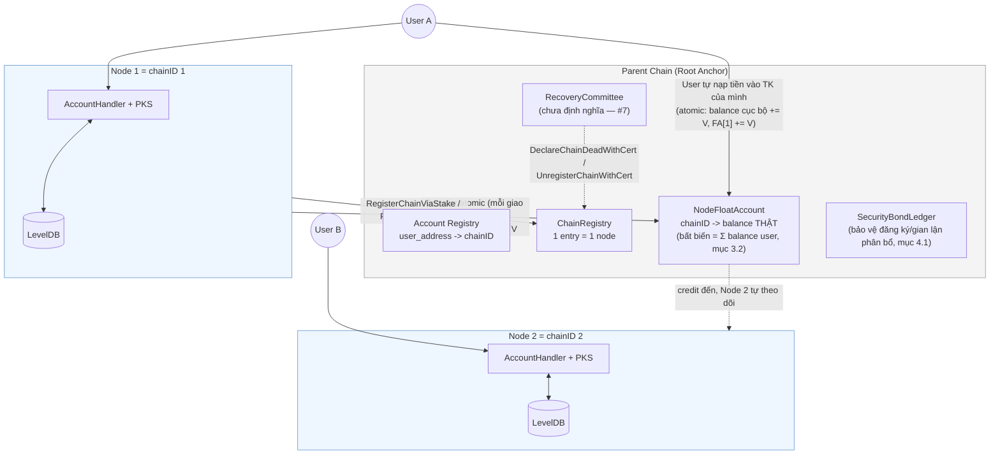
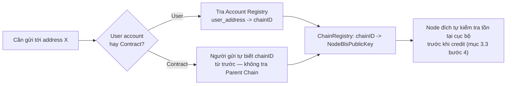
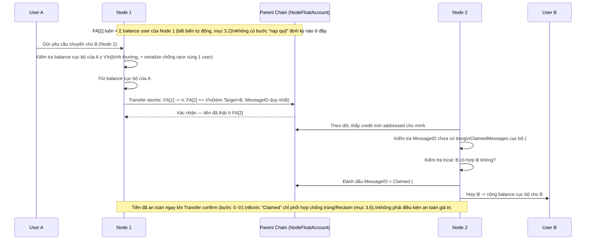
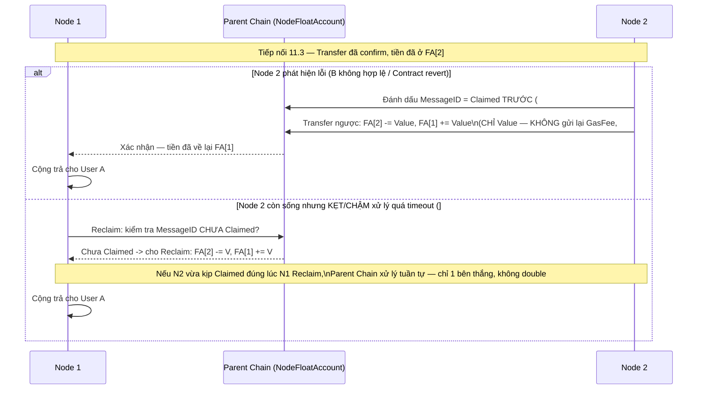
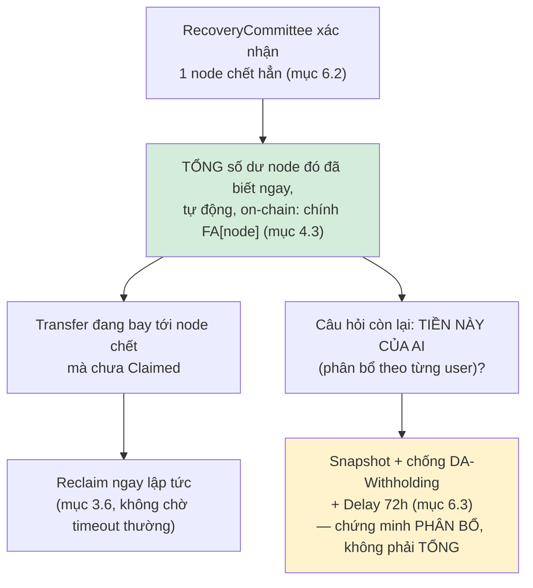
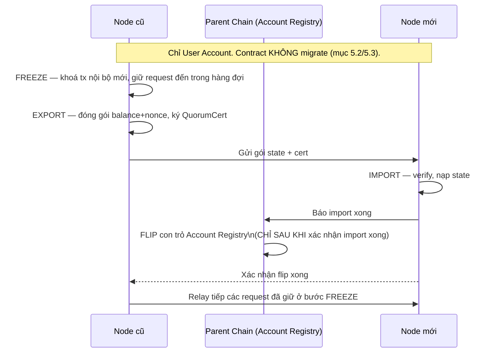
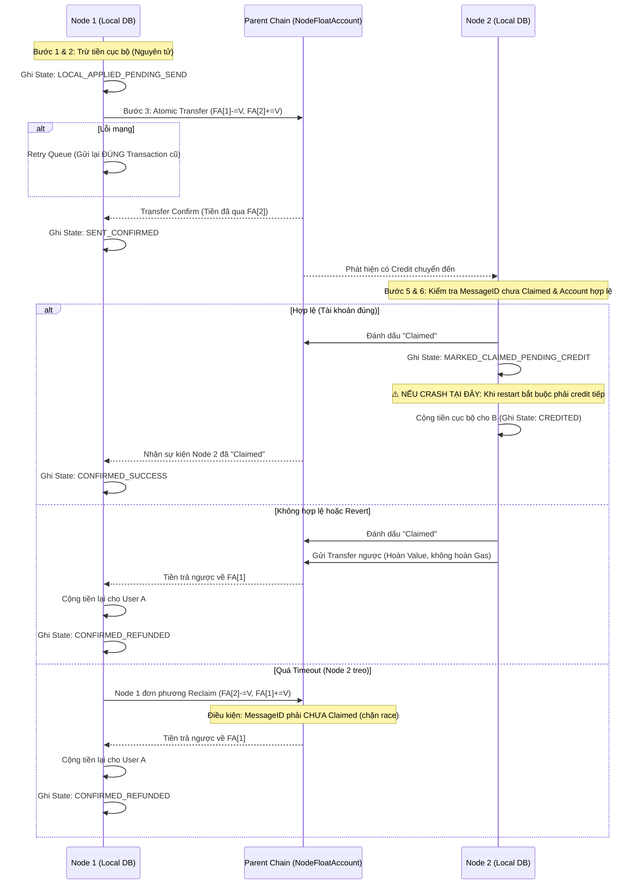

# Thiết kế Kiến trúc BLS Node & Node Float Account (Cross-Node Value Transfer)

> **Tổng quan:** Mỗi node thực thi (`cmd/rpc`) là 1 `chainID` độc lập, tự quản state/balance/contract của user thuộc node đó. Parent Chain (Root Anchor) giữ 2 việc: sổ danh bạ (Account Registry, ChainRegistry) và **`NodeFloatAccount`** — quỹ liên-node **tiền thật** cho từng node, không phải trần phân bổ trừu tượng. `NodeFloatAccount` không có bước "nạp quỹ" rời rạc — nó là 1 bất biến tự động, luôn ≥ và tự hội tụ về đúng tổng số dư user của node đó (mục 3.2). Chuyển giá trị cross-node = ghi sổ chuyển khoản atomic trực tiếp giữa 2 `NodeFloatAccount` (mục 3.3), không cần "khoá batch → attest → claim". Giao dịch nội bộ cùng node vẫn tức thời, không đụng Parent Chain.

> ⚠️ **Nền tảng kỹ thuật:** đăng ký chain (stake), `SecurityBond`, `RecoveryCommittee`, `DeclareChainDeadWithCert` dùng nguyên `GatewayEngine` có sẵn (`execution/pkg/cross_chain/gateway.go`) — chỉ riêng cơ chế **di chuyển giá trị giữa các node** là thiết kế riêng (Float Account), thay cho mô hình mint-theo-trần-rồi-claim.

---

## 1. Tổng quan Kiến trúc

**Mục tiêu cốt lõi:**
- **Thực thi phân tán:** Mỗi Node (`cmd/rpc`) là 1 `chainID` độc lập (đã chốt — mục 2.4), tự quản state, balance, smart contract của user thuộc node đó.
- **Parent Chain = Root Anchor có sẵn** (đã chốt), đóng 2 vai trò: (1) sổ danh bạ (Account Registry, ChainRegistry), (2) **nơi giữ thật "quỹ liên-node"** của từng node (`NodeFloatAccount`) — tiền thật, không phải trần phân bổ trừu tượng.
- **Cross-Node Interoperability:** Chuyển giá trị = ghi sổ chuyển khoản trực tiếp giữa 2 `NodeFloatAccount` trên Parent Chain — atomic, không cần dance "khoá batch → attest → claim" nhiều bước.

---

## 2. Phân chia Vai trò

### 2.1. Parent Chain / Root Anchor
- **Account Registry:** `user_address -> chainID` (mục 5.1).
- **ChainRegistry:** danh tính + `NodeBlsPublicKey` từng node (có sẵn trong `GatewayEngine`).
- **`NodeFloatAccount`** (thay cho `PerChainAllocation`-làm-trần): `chainID -> balance` — **tiền thật**, Parent Chain trực tiếp enforce không cho âm. Đây là state duy nhất Parent Chain giữ ngoài registry — vẫn **không giữ balance của từng user cuối** (state đó vẫn 100% ở local mỗi node).
- **`SecurityBondLedger` + `RecoveryCommittee`:** phạm vi bảo vệ: đăng ký chain + chống khai khống PHÂN BỔ khi node chết (mục 4.1).

### 2.2. BLS Node (Execution Layer)
- **State nội bộ:** LevelDB riêng — balance, nonce, contract state của user thuộc node.
- **Custody Private Key (PKS):** giữ nguyên như thiết kế `cmd/rpc` gốc.
- **Giao dịch nội bộ:** xử lý ngay lập tức, không đụng Parent Chain (mục 13.2).
- **Giao dịch cross-node:** gọi thẳng thao tác chuyển khoản trên `NodeFloatAccount` của mình (mục 3).

### 2.3. Rủi ro Custody tập trung (PKS giữ Device Key)

Node giữ 100% device key để ký hộ — nếu bị hack, kẻ tấn công ký được giao dịch nội bộ giả mà không để lại bằng chứng phân biệt được với user thật. Không giải quyết triệt để bằng kỹ thuật được (đánh đổi cố hữu của mô hình ký hộ); giảm thiểu bằng: (1) ngưỡng rút + delay cho giao dịch lớn, (2) anomaly detection, (3) tuỳ chọn non-custodial cho tài khoản lớn — bắt buộc xây cả 3 làm baseline trước go-live (mục 9.1 Q9-phần-build). Mức rủi ro còn lại có chấp nhận được với quy mô tài sản thật hay không là quyết định threat-model của đội (Q9-phần-rủi-ro, còn mở).

### 2.4. 1 Node `cmd/rpc` = 1 `chainID` riêng (ĐÃ CHỐT — Q13)

Mỗi node đăng ký `chainID` riêng qua `RegisterChainViaStake`, không nhóm nhiều node dưới 1 chain. Lý do: `GatewayEngine` (`ChainRegistry`, `SecurityBond`, `RecoveryCommittee`) hoạt động ở đúng granularity `chainID`, ngầm giả định đây là 1 đơn vị tin cậy duy nhất — nhóm nhiều node độc lập dưới 1 chain phá vỡ giả định này. Hệ quả: committee mỗi node = 1 (chính nó), không có redundancy signer thật.

---

## 3. Cơ chế Chuyển giá trị Cross-Node — Node Float Account

### 3.1. Vì sao Node Float Account thay vì trần phân bổ + bond

Mô hình `PerChainAllocation`-làm-trần + `SecurityBond` tách biệt (răn đe SAU KHI phát hiện gian lận) cần 3 bước cho mỗi giao dịch cross-node (`Outbound` → `BatchOutboundCommit`+`QuorumCert` → `ClaimMessage` với hard-cap `FundedAmount`/`ClaimedAmount`), và khi node chết cần cả 1 pipeline nặng (Snapshot, Archival, Velocity, Delay 72h, chống DA-Withholding) mới rút lại được tài sản treo.

`NodeFloatAccount` là tiền thật, Parent Chain tự enforce không cho âm — chuyển giá trị cross-node là 1 lệnh ghi sổ atomic, không cần "khoá rồi chờ claim".

⚠️ **Giới hạn thật còn lại:** Parent Chain "không lưu state ứng dụng" nên vẫn không thể tự verify 1 node có credit đúng cho user cục bộ của mình hay không. Đây **không phải** 1 "bước Nạp quỹ" rời rạc nào (mục 3.2: không có bước đó, không có gì để khai khống ở đây) — mà là rủi ro custody đã biết (mục 2.3/#8: node toàn quyền với state cục bộ). Cách duy nhất bắt được sai lệch này là ở thời điểm node chết, qua Snapshot/Allocation-proof pipeline (mục 6.3).

### 3.2. `NodeFloatAccount` — bất biến tự động, không có bước nạp quỹ

`NodeFloatAccount[node]` **luôn ≥, và tự động hội tụ về đúng bằng** tổng số dư của mọi user thuộc node đó — không phải 1 con số node "quyết định nạp bao nhiêu". Tiền chỉ vào `NodeFloatAccount` qua đúng 2 cách, cả 2 đều do chính hành động của 1 user cụ thể kích hoạt, xác minh trực tiếp trên Parent Chain:

1. **User tự nạp tiền vào TÀI KHOẢN CỦA CHÍNH HỌ** (không phải "nạp cho node" chung chung): bất kỳ ví nào có số dư thật trên Parent Chain chuyển tiền vào, gắn `Target = user_address` + `MessageID` duy nhất — Parent Chain cộng thật số đó vào `NodeFloatAccount[node]` ngay trong 1 transaction, xác minh trực tiếp, không có gì để khai khống. Vì Parent Chain không giữ balance của từng user cuối (mục 2.1), phần credit local cho user theo đúng cơ chế **watch-rồi-credit giống hệt Transfer đến** (mục 3.3 bước 5-7, dùng chung `ClaimedMessages`) — có 1 cửa sổ ngắn nơi FA đã tăng nhưng local chưa credit kịp, luôn an toàn theo 1 chiều (FA tạm thời cao hơn tổng local thật, không bao giờ thấp hơn — xem mục 3.5).
2. **Nhận Transfer cross-node đến** (mục 3.3) — cùng cơ chế: FA bên nhận tăng ngay khi Parent Chain confirm Transfer, local credit theo sau qua watch-rồi-credit (đã có đầy đủ crash-recovery `MARKED_CLAIMED_PENDING_CREDIT`, #13).

**Hệ quả — giải quyết Q5 và bài toán "vốn khởi đầu cho node":** 1 node mới tinh chưa có user nào thì `NodeFloatAccount = 0` — khi user đầu tiên nạp tiền vào tài khoản của họ (cách 1), `NodeFloatAccount` tăng ngay trên Parent Chain, node chỉ cần chạy watcher từ genesis để bắt kịp credit local. Không có khái niệm "Bond-vs-Deposit" hay "giới hạn nạp quỹ mỗi chu kỳ" — không còn hành động "nạp quỹ" rời rạc nào để giới hạn.

**Điều Parent Chain vẫn KHÔNG biết:** tổng `NodeFloatAccount` của 1 node là thật (không thể khai khống — mỗi đồng gắn với 1 giao dịch xác minh được) nhưng Parent Chain không biết tổng đó chia cho user nào bao nhiêu, và không tự verify được node có trung thực credit local đúng người/đúng hạn hay không (rủi ro custody đã biết, mục 2.3/#8). Đây là lý do Snapshot Pipeline (mục 6.3) vẫn cần — để chứng minh **phân bổ**, không phải tổng số.

### 3.3. Chuyển giá trị cross-node (Transfer) — luồng thành công

1. User A (Node 1) gửi yêu cầu chuyển cho User B (Node 2).
2. Vì `NodeFloatAccount` luôn ≥ balance của A (mục 3.5), không có kịch bản "Float không đủ" cần phân biệt với mất-kết-nối — bước này chỉ là **kiểm tra số dư cục bộ của A** (bình thường, không liên quan Parent Chain) trước khi trừ. Việc đọc-kiểm tra-rồi-ghi cần node tự serialize/khoá nội bộ, để tránh 2 yêu cầu cùng lúc từ CÙNG 1 user A đọc thấy "đủ" rồi cùng trừ vượt quá số dư thật.
3. Qua được bước kiểm tra: Node 1 trừ balance cục bộ của A, đồng thời gửi 1 giao dịch **duy nhất, atomic** lên Parent Chain: `NodeFloatAccount[1] -= V`, `NodeFloatAccount[2] += V`, kèm metadata (`Target: B`, `MessageID` duy nhất, `Payload` nếu là contract-call). Committee mỗi node = 1 nên chữ ký chính là Node 1 tự ký, gộp luôn vào transaction này.
4. Ngay khi transaction confirm trên Parent Chain: **tiền đã thật sự nằm ở `NodeFloatAccount[2]`** — không có khái niệm "Pending chờ claim" cho phần GIÁ TRỊ.
5. Node 2 theo dõi Parent Chain, thấy có credit mới addressed cho mình. **Chống xử lý trùng bắt buộc (#10):** Node 2 phải tự kiểm tra `MessageID` này đã xử lý (credit hoặc refund) chưa trước khi làm bất cứ gì — tự giữ 1 bảng "MessageID đã xử lý" cục bộ (không có hàm trung tâm nào làm hộ).
6. Node 2 kiểm tra local: `B` có phải account hợp lệ đang được chính mình quản lý không.
7. Nếu hợp lệ: Node 2 **trước tiên** gửi 1 transaction nhỏ lên Parent Chain đánh dấu `MessageID` này = `Claimed` (mục 3.6 — cần cho cơ chế Reclaim-theo-timeout), **rồi mới** cộng balance cục bộ cho B. Tiền đã an toàn ngay từ bước 4 — đánh dấu `Claimed` chỉ để phối hợp với mục 3.6, không phải điều kiện an toàn giá trị.

### 3.4. Nếu kiểm tra local thất bại (account không hợp lệ) hoặc Contract Call bị revert

Tiền **đã thật sự nằm ở `NodeFloatAccount[2]`** — nên hoàn tiền là **1 giao dịch Transfer khác, chiều ngược lại**, dùng lại đúng cơ chế ở mục 3.3:

1. Node 2 phát hiện B không hợp lệ, hoặc Contract Call revert (hoàn tác toàn bộ thay đổi state đã thử).
2. **Chống hoàn tiền 2 lần bắt buộc (#9):** Node 2 **phải tự đánh dấu `MessageID` = `Claimed`** trên Parent Chain (đúng bước ở mục 3.3 bước 7, dùng chung 1 cơ chế cho cả credit thành công lẫn hoàn tiền) **TRƯỚC KHI** gửi Transfer hoàn tiền — nếu crash giữa chừng và retry, Node 2 phải kiểm tra `MessageID` này đã `Claimed` chưa trước khi tạo giao dịch hoàn tiền mới, tránh gửi hoàn tiền 2 lần (tự bào mòn quỹ của chính Node 2).
3. Node 2 gửi Transfer ngược: `NodeFloatAccount[2] -= Value` (**chỉ đúng phần `Value`**), `NodeFloatAccount[1] += Value`.
4. Node 1 nhận lại, cộng trả cho User A.
5. **`GasFee` KHÔNG được hoàn** (xem #5): Node 2 đã thực sự tốn chi phí tính toán để thử thực thi/kiểm tra dù kết quả thất bại. Nếu hoàn cả `GasFee`, kẻ tấn công spam giao dịch cố tình gây revert để bào CPU/RAM Node 2 miễn phí.

### 3.5. Thanh khoản — bất khả thi bằng toán học với giao dịch hợp lệ

Vì `NodeFloatAccount[node] = Σ balance mọi user thuộc node đó`, và mọi số dư đều `≥ 0`, nên `NodeFloatAccount ≥` balance của **bất kỳ 1 user nào**. User A không bao giờ được phép gửi quá số dư CỦA CHÍNH A (kiểm tra cơ bản đã có sẵn ở mọi hệ thống) — nên `NodeFloatAccount ≥ balance(A) ≥ V` LUÔN đúng khi A định gửi V. **Không có kịch bản nào 1 giao dịch hợp lệ bị "chặn vì Float không đủ"**.

**Điều duy nhất còn lại — cửa sổ ngắn khi crash giữa chừng (không phải "thanh khoản cạn"):** giữa lúc trừ balance cục bộ và lúc Parent Chain xác nhận Transfer (mục 3.3 bước 2-3) vẫn có 1 khoảng ngắn có thể gián đoạn nếu crash/mất mạng — đây là vấn đề **crash-recovery** (đã xử lý bằng Retry Queue, mục 6.1) chứ không phải thiếu vốn. Tương tự, chiều nạp tiền vào (mục 3.2 cách 1/2) cũng có 1 cửa sổ watch-rồi-credit ngắn — cả 2 cửa sổ đều lệch theo đúng hướng an toàn (FA tạm thời ≥ tổng local thật, không bao giờ ngược lại), nên không ảnh hưởng bất đẳng thức `FA ≥ balance(A)` dùng ở trên.

### 3.6. Node đích còn sống nhưng kẹt/chậm xử lý — Timeout & Reclaim (#12)

Khác với node chết hẳn (mục 6, cần `RecoveryCommittee`), trường hợp này là Node 2 **vẫn hoạt động bình thường** nhưng vì lý do nào đó (backlog, bug, quá tải) không xử lý (không credit local, không hoàn tiền) 1 credit đã nhận trong thời gian dài — tiền nằm im ở `NodeFloatAccount[2]`, User A không được phục vụ cũng không được hoàn, không có điểm dừng theo thời gian nếu không thiết kế thêm.

- **Cơ chế Reclaim:** nếu quá 1 khoảng thời gian cấu hình kể từ lúc Transfer confirm mà `MessageID` vẫn CHƯA được đánh dấu `Claimed` (mục 3.3 bước 7), **chính Node 1** (thay mặt User A) có quyền gửi 1 transaction Reclaim thẳng lên Parent Chain: `NodeFloatAccount[2] -= Value`, `NodeFloatAccount[1] += Value` — **không cần Node 2 hợp tác**, vì tiền vốn dĩ do Parent Chain custody thật.
- ⚠️ **Điều kiện "quá timeout" phải do chính Parent Chain kiểm tra on-chain (so sánh `blockTime` hiện tại với thời điểm Transfer confirm), KHÔNG được chỉ là quy ước Node 1 tự giác tuân theo ở tầng client.** Nếu không enforce on-chain, 1 implementation lỗi/hấp tấp ở Node 1 có thể Reclaim ngay lập tức sau khi gửi, trước khi Node 2 (dù hoàn toàn khoẻ mạnh, chỉ hơi chậm) kịp xử lý — không làm mất tiền của ai (vẫn có guard chặn race ở dưới), nhưng phá hỏng đúng mục đích của cơ chế Reclaim và tạo ma sát/trải nghiệm xấu không cần thiết cho Node 2.
- **Chặn race Reclaim-vs-Claimed (bắt buộc):** Parent Chain chỉ cho Reclaim thành công nếu `MessageID` đó **chưa** được đánh dấu `Claimed` tại thời điểm xử lý Reclaim — nếu Node 2 vừa kịp đánh dấu `Claimed` đúng lúc Node 1 gửi Reclaim, chỉ 1 trong 2 thắng (Parent Chain xử lý tuần tự) — bên thua bị từ chối, không có chuyện cả 2 cùng thành công.

---

## 4. Bảo mật kinh tế

### 4.1. Vai trò của `SecurityBond`/`RecoveryCommittee` trong mô hình Float Account

Không cần bất biến "Bond-vs-Deposit" nào — `NodeFloatAccount` là 1 bất biến tự động (mục 3.2), không có bước "nạp quỹ" rời rạc để node khai khống, nên không còn gì để giới hạn thiệt hại ở bước đó. `SecurityBond`/`RecoveryCommittee` vẫn giữ nguyên vai trò cho các mục đích sẵn có trong `GatewayEngine` (đăng ký chain, `SlashOnEquivocation` khi double-sign checkpoint, `DeclareChainDeadWithCert`), và còn đúng 1 vai trò cần bảo vệ: chống **node khai khống PHÂN BỔ** khi chết (gán tổng tiền thật cho 1 địa chỉ nó kiểm soát thay vì chia đúng cho user) — cơ chế bảo vệ xem mục 6.3 (Snapshot + DA-Withholding + Delay 72h).

### 4.2. Velocity-limit cho Transfer: không cần để chống mint sai — nhưng vẫn cần vì lý do khác

Mỗi Transfer là ghi sổ trực tiếp trên số dư THẬT đã có sẵn trong `NodeFloatAccount` — không có gì để "mint sai" ở bước này, nên không cần velocity-limit cho lý do chống-gian-lận. Velocity-limit vẫn cần, nhưng vì 1 lý do khác hẳn: giới hạn thiệt hại khi KHOÁ KÝ của node bị lộ (không phải khi node cố ý gian lận) — xem mục 4.4.

### 4.3. Bất biến tổng cung

**`Σ NodeFloatAccount == genesis_total_supply`** — bất biến **kiểm tra tự động được hoàn toàn** trên Parent Chain (không còn số hạng "local balance chưa nạp quỹ" nào cần ước lượng, vì mọi số dư user đều tự động phản ánh trong `NodeFloatAccount` ngay khi phát sinh — mục 3.2).

> Lưu ý nhỏ: `NodeFloatAccount` có thể gồm thêm phần doanh thu `GasFee` node đã thu (mục 3.4 điểm 5 — không hoàn khi thất bại) chưa gắn với user cụ thể nào — phần này vẫn nằm trong tổng bảo toàn (chỉ chuyển từ `NodeFloatAccount` node gửi sang node nhận), không phá vỡ bất biến, chỉ là 1 phần nhỏ không thuộc "Σ balance user" theo nghĩa hẹp.

### 4.4. Velocity-limit cho Transfer OUTFLOW: giới hạn thiệt hại khi khoá ký node bị lộ (#11)

**Vấn đề:** vì Float Account là tiền thật và Transfer không còn hard-cap/velocity nào (mục 4.2), nếu khoá ký (device key/BLS key) của 1 node bị lộ, kẻ tấn công có thể gửi 1 Transfer DUY NHẤT rút sạch **TOÀN BỘ** `NodeFloatAccount` của node đó sang 1 địa chỉ kiểm soát bởi kẻ tấn công, ngay lập tức — không có gì cản. Vì `NodeFloatAccount[node] ≈ Σ balance mọi user thuộc node đó` (mục 3.2), rút sạch FA trong 1 giao dịch **đồng nghĩa rút sạch TOÀN BỘ tiền của MỌI user node đó cùng lúc** — không phải rút 1 "quỹ dự trữ riêng" tách khỏi tiền user. Đây là rủi ro nặng nhất trong toàn hệ thống, nặng hơn cả #8 (custody local, mục 2.3 — vốn chỉ ký được giao dịch nội bộ giả, không rút tiền ra khỏi node được).

**Quyết định:** tái áp dụng velocity-limit, nhưng cho **Transfer OUTFLOW**:

> Tổng giá trị gửi ra (Transfer outflow) của 1 `NodeFloatAccount` trong 1 cửa sổ trượt (ví dụ 24h) không được vượt quá X% số dư đầu cửa sổ — mặc định đề xuất **20%/24h**, cần đội xác nhận lại theo dữ liệu traffic thật.

Đây **không phải** hard-cap chống gian lận (không có gì để gian lận ở bước Transfer) mà là **circuit-breaker chống lộ khoá** — giống hệt lý do các sàn/ngân hàng đặt hạn mức rút tiền/ngày ngay cả với tài khoản đã xác minh đầy đủ danh tính. Khi vượt ngưỡng: giao dịch bị tạm giữ + cảnh báo operator ngay (không tự động từ chối vĩnh viễn, vì đây có thể là traffic hợp lệ tăng đột biến, không phải luôn là dấu hiệu bị hack).

⚠️ **Loại trừ bắt buộc (#14):** ngưỡng này **CHỈ áp dụng cho Transfer gửi mới** (mục 3.3) — **KHÔNG áp dụng cho Hoàn tiền** (mục 3.4) hay **Reclaim** (mục 3.6). Lý do: hoàn tiền/reclaim chỉ bao giờ trả lại đúng giá trị đã thực sự nhận trước đó (bị chặn trên bởi số tiền đã vào, không phải 1 bề mặt tấn công mới để lộ khoá khai thác), trong khi Transfer gửi mới mới là nơi kẻ tấn công có khoá lộ có thể tạo ra dòng tiền HOÀN TOÀN MỚI ra 1 địa chỉ nó kiểm soát. Nếu lỡ áp chung 1 ngưỡng cho cả 2 loại: 1 node đang bị tấn công spam-revert (#5) có thể bị chính circuit-breaker này chặn luôn cả việc hoàn tiền hợp lệ cho user vô tội đang chờ — tạo ra DoS tầng 2 do chính cơ chế phòng thủ gây ra.

---

## 5. Đăng ký & Tra cứu Account/Contract

### 5.1. Account Registry

| Bảng | Key | Value | Vai trò |
|---|---|---|---|
| Account Registry | `user_address` | `chainID` (của node sở hữu) | Định tuyến `Target` đến đúng node; node đó tự kiểm tra hợp lệ trước khi credit (mục 3.3 bước 4) |

- **Đăng ký 1 lần, chống ghi đè:** chỉ chấp nhận lần đầu, hoặc cần chữ ký của node hiện tại để chuyển nhượng (Migration, mục 5.3).
- **Chặn double-registration:** cơ chế chặn nằm ở chính write vào Account Registry trên Parent Chain (transaction xử lý tuần tự = điểm serialize duy nhất) — không coi admin-confirm cục bộ tại node là đã chốt quyền sở hữu (chi tiết đầy đủ mục 12 Q1).
- **An toàn trước DoS:** đăng ký qua `handleSetBlsPublicKey` + admin confirm (2 bước, có gate) — không permissionless.
- **Vốn khởi tạo khi đăng ký node mới (đã đóng — Q5):** `RegisterChainViaStake` dùng đúng số tiền thật operator/nhà đầu tư tự bỏ ra từ ví của họ (bond đăng ký) — không rút từ 1 "pool Reserve" do Parent Chain khởi tạo genesis. `NodeFloatAccount` của node mới không cần "vốn khởi đầu" riêng nào cả — nó bắt đầu ở 0 và tự động tăng đúng bằng số tiền user đầu tiên tự nạp vào tài khoản của họ (mục 3.2).

### 5.2. Contract Registry — KHÔNG dùng registry toàn cục

Bên gửi (`Target`+`chainID` đích) đã phải tự biết trước contract nằm ở node nào — không có API đăng ký contract để tránh DoS/race-condition tra cứu. Kiểm tra tồn tại cục bộ tại đích (mục 3.3 bước 4) là đủ.

### 5.3. Migration Account (CHỈ User, KHÔNG áp dụng Contract)

Contract không được migrate (vì mục 5.2 không có Contract Registry, contract đổi node sẽ "tàng hình"). Giao thức 3 pha cho User Account: **Freeze** (khoá tx nội bộ mới, giữ lại request đến trong hàng đợi tạm, không revert ngay) → **Export & Attest** (đóng gói balance+nonce, ký `QuorumCert`) → **Import & Flip con trỏ** (chỉ flip Account Registry SAU KHI node mới xác nhận import xong, không lạc quan).

---

## 6. Xử lý Mất kết nối & Node chết vĩnh viễn

### 6.1. Mất kết nối tạm thời

Giao dịch nội bộ không bị ảnh hưởng. Giao dịch cross-node gửi thất bại do mất mạng: giữ nguyên trong Retry Queue cục bộ, gửi lại đúng transaction đã ký, không tạo transaction mới cho cùng 1 yêu cầu.

### 6.2. Node chết hẳn — ai xác nhận, xử lý ra sao

- Tiêu chí trigger: 2 lớp — (1) tự động cảnh báo sau N lần bỏ lỡ chu kỳ hoạt động bình thường liên tiếp, (2) **bắt buộc xác nhận thủ công của operator** trước khi thực sự gọi `DeclareChainDeadWithCert` — không tự động hoá hoàn toàn vì hậu quả quá lớn.
- `DeclareChainDeadWithCert` đòi hỏi `QuorumCert` của **`RecoveryCommittee`** — một thực thể quyền lực riêng, cố định, set 1 lần từ config lúc triển khai, **chưa được định nghĩa trong tài liệu này** (ai ngồi trong đó, bao nhiêu người, ngưỡng quorum — #7, còn mở). Không phải quyết định đơn phương của node còn lại.

### 6.3. Rút lại giá trị khi node chết — bài toán PHÂN BỔ

`NodeFloatAccount` là 1 bất biến tự động (mục 3.2) — mọi số dư user LUÔN tự động phản ánh trong `NodeFloatAccount` ngay khi phát sinh, không có phần "chưa kịp nạp" nằm chờ dài hạn nào cả. Khi node chết, chỉ còn đúng **1 bài toán duy nhất**: `NodeFloatAccount[node chết]` chắc chắn có THẬT (Parent Chain tự verify được, mục 4.3) — nhưng **Parent Chain không biết tổng đó phải CHIA cho user nào bao nhiêu**, vì phân bổ chi tiết chỉ tồn tại trên local node đã chết.

**Phần xử lý ngay, không cần chờ gì:**
- Transfer đang "đi ngang" tới node chết nhưng chưa `Claimed`: dùng cơ chế **Reclaim** (mục 3.6), Node 1 tự đòi lại, kích hoạt ngay khi `RecoveryCommittee` xác nhận chết — không cần Transfer ngược (mục 3.4, cần node sống mới gửi được).
- Không cần Merkle proof cho bước này — đây chỉ là ghi sổ 2 chiều bình thường trên Parent Chain.

**Bài toán còn lại — chứng minh PHÂN BỔ:**
1. **Snapshot Export định kỳ, PROACTIVE** (mỗi 15 phút, mục 9.1) — export cây Merkle **phân bổ** account state ra ngoài node + publish `AccountTreeRoot` có xác thực lên Parent Chain. Root này dùng để chứng minh **"tổng đã biết trước đó (NodeFloatAccount) được chia cho ai bao nhiêu"** — không dùng để chứng minh tổng có thật (đã tự động đúng).
2. **Chống Data Availability Withholding (fail-closed):** 1 node có thể publish 1 cây phân bổ giả (gán hết cho ví nó kiểm soát) dù TỔNG là thật, rồi giấu dữ liệu chi tiết để Archival Service không đối chiếu được. Archival Service phải xác nhận nhận đủ dữ liệu khớp root trong vài phút sau publish; không đủ = VETO ngay, không đợi hết thời gian chờ.
3. **`ClaimDeadChainBalance` + Withdrawal Delay tối thiểu 72 giờ:** cho operator/Archival thời gian phát hiện cây phân bổ giả mạo trước khi giải ngân thật. Không cần lớp velocity-limit riêng cho bước này — TỔNG tiền đã được `NodeFloatAccount` giới hạn chính xác từ trước (không thể rút vượt tổng thật), rủi ro duy nhất còn lại là phân bổ sai giữa các user trong CÙNG tổng đó, không phải rút vượt tổng — Delay 72h + DA-defense đã đủ xử lý.
4. **Cửa sổ mất mát = tần suất export** (mặc định 15 phút) — giao dịch NỘI BỘ (cùng node, không qua `NodeFloatAccount`) sau lần export cuối vẫn có thể không chứng minh được PHÂN BỔ chính xác nếu node chết ngay sau đó (dù tổng tiền vẫn an toàn) — đây là lý do vẫn cần export định kỳ dù tổng đã luôn đúng.
5. **Ai tính proof hộ user:** dịch vụ archival độc lập, không bắt user tự giữ Merkle proof.

---

## 7. Tóm tắt Cấu trúc Data Model

### Tại Parent Chain / Root Anchor
| Bảng / Struct | Nguồn | Vai trò |
|---|---|---|
| Account Registry | Mở rộng `AccountManager` contract có sẵn | `user_address -> chainID` |
| `ChainRegistry` | Có sẵn (`gateway.go`) | Danh tính + `NodeBlsPublicKey` từng node |
| **`NodeFloatAccount`** | Cần xây | `chainID -> balance` — tiền thật, thay cho `PerChainAllocation`-làm-trần |
| **`ClaimedMessages`** | Cần xây | `MessageID -> bool` — đánh dấu đã xử lý (credit local hoặc hoàn tiền), dùng để chống xử lý trùng (#10), chống hoàn tiền 2 lần (#9), và làm điều kiện chặn Reclaim (mục 3.6, #12) |
| `SecurityBondLedger` | Có sẵn | Bond, bảo vệ đăng ký chain + chống khai khống PHÂN BỔ khi node chết (mục 4.1) |
| `DeadChains` | Có sẵn | Node đã tuyên bố chết, chặn outflow mới |

### Tại mỗi BLS Node (Local DB)
| Bảng / Struct | Key | Value | Vai trò |
|---|---|---|---|
| Account State | `user_address` | `balance`, `nonce`, `contract_state` | State thực sự |
| Retry Queue | `message_id` | `payload`, `status` | Chỉ cho mất-kết-nối tạm thời (mục 6.1) |
| Local state machine | `message_id` | `LOCAL_APPLIED_PENDING_SEND / SENT_CONFIRMED / ...` | Xem mục 13.4 |

---

## 8. Danh sách vấn đề logic/bảo mật còn hiệu lực

| # | Vấn đề | Rủi ro cụ thể | Xử lý |
|---|---|---|---|
| 1 | Committee mỗi node = 1 (chính nó) — không có redundancy signer thật | `QuorumCert` về bản chất là chữ ký đơn | Phòng thủ không nằm ở số lượng chữ ký mà ở giới hạn thiệt hại: velocity-limit cho Transfer OUTFLOW khi khoá bị lộ (mục 4.4) + Snapshot/Delay 72h khi node chết hẳn (mục 6.3) |
| 2 | Account Registry cho phép ghi đè mapping tuỳ ý nếu không kiểm soát | Report cũ/replay có thể "cướp" account sang node khác | Chỉ chấp nhận đăng ký lần đầu hoặc chữ ký của node hiện tại để chuyển nhượng (mục 5.1, 5.3) |
| 3 | Contract tự sinh (deploy trong node) không thể đăng ký registry toàn cục | DoS/state-bloat lên Parent Chain nếu bắt đăng ký như Account | Bỏ hẳn Contract Registry toàn cục; dùng `chainID` đích tường minh từ người gửi + kiểm tra tồn tại cục bộ (mục 5.2) |
| 4 | Chuyển nhượng account (Migration) không atomic nếu không thiết kế kỹ | Message đến đúng lúc đang chuyển giao có thể bị kẹt/mất | Giao thức 3 pha Freeze → Export & Attest → Import & flip con trỏ (mục 5.3) |
| 5 | `GasFee` bị hoàn nhầm khi giao dịch cross-node thất bại | Spam-revert trở thành DoS miễn phí lên node đích | Transfer hoàn tiền (mục 3.4) CHỈ hoàn `Value`, không hoàn `GasFee` |
| 6 | Node chết hẳn — Parent Chain biết TỔNG tiền thật nhưng không biết PHÂN BỔ cho user nào bao nhiêu | Node có thể khai khống PHÂN BỔ (gán hết cho ví nó kiểm soát) dù tổng đã chắc chắn đúng | Snapshot & Archival Pipeline + chống DA-Withholding + Withdrawal Delay 72h — bảo vệ đúng rủi ro phân bổ (mục 6.3) |
| 7 | `RecoveryCommittee` — thực thể duy nhất có quyền tuyên bố node chết, tịch thu bond, thay khoá ký bất kỳ node nào — chưa được định nghĩa | Lộ/compromise `RecoveryCommittee` ảnh hưởng TOÀN hệ thống, nặng hơn lộ 1 node đơn lẻ | Cần đội xác định thành viên, ngưỡng quorum, quy trình bảo vệ khoá — quyết định tổ chức thật, không tự đề xuất được (mục 9.1, còn mở) |
| 8 | Custody 100% device key (PKS) — Node bị hack có thể ký giao dịch nội bộ giả | Mất tiền không để lại bằng chứng mật mã, ngoài phạm vi bảo vệ của Float Account (tiền không rời node) | Không giải quyết triệt để bằng kỹ thuật — giảm thiểu bằng delay/anomaly-detection/non-custodial tuỳ chọn (mục 2.3) |
| 9 | Reverse Transfer (hoàn tiền, mục 3.4) không có cơ chế chống gửi 2 lần | Crash giữa chừng rồi retry có thể gửi hoàn tiền 2 lần, tự bào mòn quỹ của chính node đang hoàn tiền | Đánh dấu `MessageID` = `Claimed` trên Parent Chain TRƯỚC khi gửi hoàn tiền, kiểm tra lại trạng thái này trước khi retry (mục 3.3 bước 7, mục 3.4 bước 2) |
| 10 | Node đích không có cơ chế chống xử lý trùng 1 credit đến | Node đích có thể credit local 2 lần cho cùng 1 `MessageID` nếu logic theo dõi/watcher bị lỗi hoặc quét lại block cũ | Node đích tự giữ bảng "MessageID đã xử lý", kiểm tra trước khi làm bất cứ gì (mục 3.3 bước 5) |
| 11 | **[NGHIÊM TRỌNG]** Không có velocity-limit cho Transfer, dù đúng là không cần để chống mint sai — bỏ sót vai trò giới hạn thiệt hại khi KHOÁ KÝ node bị lộ | Node bị lộ khoá có thể bị rút sạch TOÀN BỘ Float Account trong 1 giao dịch tức thời — nặng hơn cả #8 (custody local) vì FA ≈ tổng tiền của MỌI user node đó | Tái áp dụng velocity-limit cho Transfer OUTFLOW — circuit-breaker chống lộ khoá, không phải hard-cap chống gian lận (mục 4.4) |
| 12 | Không có timeout nếu node đích còn sống nhưng kẹt/chậm xử lý 1 credit đã nhận (khác node chết hẳn, không cần `RecoveryCommittee`) | Tiền nằm im ở Float Account của đích, User A gốc không được phục vụ cũng không được hoàn, không có điểm dừng theo thời gian | Cơ chế Reclaim: quá timeout mà `MessageID` chưa `Claimed`, Node 1 tự reclaim thẳng từ Parent Chain không cần Node 2 hợp tác — có chặn race với việc Node 2 vừa kịp `Claimed` (mục 3.6) |
| 13 | Node đích không có bước phục hồi nếu crash ĐÚNG GIỮA lúc đánh dấu `Claimed` (đã gửi lên Parent Chain) và lúc credit local cho B (chưa kịp làm) | Restart mà không kiểm tra đúng trạng thái này có thể credit local 2 lần, hoặc bỏ sót vĩnh viễn | Node đích cần state machine cục bộ riêng: `MARKED_CLAIMED_PENDING_CREDIT` → `CREDITED` — khi restart, nếu thấy `Claimed` trên Parent Chain nhưng local chưa ghi `CREDITED`, phải tiếp tục credit chứ không được re-mark `Claimed` cũng không được bỏ qua (mục 13.3) |
| 14 | Velocity-limit chống lộ khoá cho Transfer outflow (#11/mục 4.4) chưa nói rõ có loại trừ Hoàn tiền (mục 3.4)/Reclaim (mục 3.6) hay không | Nếu áp chung 1 ngưỡng cho cả 2 loại, 1 node đang bị tấn công spam-revert (#5) có thể bị chính circuit-breaker này chặn luôn cả việc hoàn tiền hợp lệ cho user vô tội đang chờ — DoS tầng 2 do chính cơ chế phòng thủ gây ra | Loại trừ tường minh: ngưỡng chỉ áp cho Transfer gửi MỚI (mục 3.3); Hoàn tiền/Reclaim luôn được miễn vì chỉ trả lại đúng giá trị đã thực nhận trước đó, không phải bề mặt tấn công mới (mục 4.4) |

---

## 9. Production Readiness Checklist

### 9.1. Decision Log

| # | Câu hỏi | Quyết định | Căn cứ |
|---|---|---|---|
| Q(mô hình giá trị) | Chuyển hẳn sang Node Float Account hay giữ mô hình bond cũ? | **Đã chốt: chuyển hẳn**, phạm vi giới hạn ở quỹ liên-node (giao dịch nội bộ không đổi) | mục 3 |
| Q13 | 1 node = 1 chainID? | **Đã chốt** | mục 2.4 |
| Q3 | Committee mỗi node bao nhiêu validator? | **Chấp nhận = 1** (chính node) | mục 2.4 |
| Q(tần suất snapshot) | Bao nhiêu lâu 1 lần? | **Mặc định 15 phút**, có thể tăng sau khi đo chi phí thật — Snapshot phục vụ chứng minh PHÂN BỔ (mục 6.3) | mục 6.3 |
| Q(velocity Transfer outflow) | Ngưỡng circuit-breaker chống lộ khoá cho Transfer (mục 4.4)? | **Mặc định khởi điểm 20%/24h** — cần đội xác nhận lại theo traffic thật, không chặn triển khai ban đầu | mục 4.4, #11 |
| Q(timeout Reclaim) | Bao lâu thì Node 1 được phép Reclaim nếu Node 2 chưa `Claimed`? | Chưa có số tuyệt đối, cần đo chu kỳ xử lý bình thường thật trước khi chốt | mục 3.6, #12 |
| Q(RecoveryCommittee) | Ai ngồi trong đó, bao nhiêu người, ngưỡng quorum? | **CÒN MỞ THẬT SỰ** — quyết định tổ chức/nhân sự, không tự đề xuất được. **Chặn cứng go-live**: code không chạy được nếu thiếu config này | #7 |
| Q9-rủi-ro | Mức rủi ro custody PKS chấp nhận được với quy mô tài sản thật? | **CÒN MỞ** — khẩu vị rủi ro kinh doanh thật | mục 2.3 |

**2 mục còn mở thật sự, không tự đề xuất số được:** `RecoveryCommittee` thành viên, Q9-rủi-ro (custody risk acceptance).

### 9.2. Vận hành

- **Quản lý khoá `RecoveryCommittee`** (ưu tiên cao hơn khoá node — #7): multisig/HSM/threshold-signing riêng, tách biệt quy trình vận hành khoá node thường.
- **Giám sát Snapshot Pipeline** (phục vụ chứng minh phân bổ khi node chết, mục 6.3): cảnh báo nếu 1 node bỏ lỡ chu kỳ export.
- **Backup & DR:** backup LevelDB từng node + state Parent Chain (`ChainRegistry`/`NodeFloatAccount`/`SecurityBondLedger`/`DeadChains`).
- **Runbook:** kịch bản node bị nghi compromise (khi nào trigger `SlashOnEquivocation`/`DeclareChainDeadWithCert`).
- **Quản lý tăng trưởng `ClaimedMessages`:** bảng này ghi vĩnh viễn mỗi `MessageID` đã xử lý — cần kế hoạch archive/prune định kỳ các bản ghi cũ (ví dụ sau N tháng) để tránh phình state Parent Chain vô hạn theo thời gian.

### 9.3. Checklist bảo mật trước khi go-live

- [ ] #1–#14 ở mục 8 đã được review độc lập bởi người khác (không tự ký-tự duyệt) — đặc biệt #6 (Snapshot Pipeline chứng minh phân bổ khi node chết), #7 (`RecoveryCommittee`), #11/#14 (velocity-limit chống lộ khoá + loại trừ hoàn tiền — dễ bị bỏ sót nhất vì trực giác "Float Account tự an toàn" dễ khiến quên mất đây là rủi ro KHÁC, không phải gian lận), và #13 (crash-recovery giữa `Claimed` và credit local).
- [ ] `RecoveryCommittee`, Q9-rủi-ro đã có quyết định bằng văn bản từ đội — không được bỏ qua.
- [ ] Đã test trên staging: (1) Transfer thành công, (2) Transfer thất bại → hoàn đúng `Value`, không hoàn `GasFee`, (3) Node chết → Parent Chain biết TỔNG số thật ngay (mục 4.3, tự động), Archival Service chạy đúng pipeline Snapshot+Delay 72h để chứng minh PHÂN BỔ cho user (mục 6.3), (4) Migration có message đến giữa lúc Freeze, (5) node cố tình giấu dữ liệu snapshot → Archival Service VETO được, (6) retry crash-giữa-chừng ở bước hoàn tiền → không hoàn 2 lần (#9), (7) giả lập khoá node bị lộ, thử rút vượt ngưỡng velocity outflow → bị chặn (#11), (8) Node 2 chậm xử lý quá timeout → Node 1 Reclaim thành công mà không cần Node 2 hợp tác, và thử race Reclaim-vs-Claimed để xác nhận chỉ 1 bên thắng (#12), (9) crash Node 2 đúng giữa lúc `Claimed` và credit local, khởi động lại → xác nhận tự hoàn tất credit, không credit trùng, không bỏ sót (#13), (10) Node 2 chết hẳn khi đang có Transfer tới nhưng chưa `Claimed` → xác nhận dùng đúng cơ chế Reclaim (mục 3.6), không phải Transfer ngược (mục 3.4, vốn cần Node 2 sống), (11) giả lập 1 node vừa bị chạm ngưỡng velocity outflow (#11) vừa cần hoàn tiền hợp lệ cho user khác → xác nhận hoàn tiền vẫn đi qua bình thường, không bị chặn nhầm bởi circuit-breaker (#14).
- [ ] `Σ NodeFloatAccount == genesis_total_supply` (mục 4.3) được kiểm tra tự động định kỳ trên Parent Chain — đây là bất biến kiểm chứng được hoàn toàn.

---

## 10. Lộ trình triển khai

1. **Chốt 2 mục còn mở** (`RecoveryCommittee`, Q9-rủi-ro) trước khi viết code.
2. **Xây `NodeFloatAccount` trên Parent Chain** — cấu trúc dữ liệu mới, thay thế vai trò "trần phân bổ" của `PerChainAllocation` cho mục đích cross-node.
3. **Xây luồng user tự nạp tiền vào tài khoản của mình** — atomic tăng `NodeFloatAccount` cùng lúc với balance cục bộ user, không có bước "nạp quỹ" riêng của node (mục 3.2).
4. **Xây luồng Transfer atomic** (mục 3.3) thay thế `Outbound`/`BatchOutboundCommit`/`ClaimMessage` 3 bước cho phần giá trị — giữ nguyên cơ chế message/payload cho phần gọi Contract.
5. **Giữ nguyên Snapshot & Archival Pipeline** (mục 6.3) — phục vụ chứng minh PHÂN BỔ khi node chết, không phải chứng minh tổng số (đã tự động ở mục 4.3).
6. **Bổ sung Account Registry** (mục 5).
7. **Dựng hạ tầng vận hành** (mục 9.2) song song, không để tới sau khi code xong mới làm.
8. **Chạy checklist 9.3** trước khi cho traffic thật.

---

## 11. Sơ đồ các luồng chính

### 11.1. Kiến trúc tổng quan

**Quy trình từng bước:**
1. **Lưu trữ dữ liệu:** Mỗi Node thực thi (Node 1, Node 2) tự lưu trữ và quản lý số dư của User trên cơ sở dữ liệu cục bộ (LevelDB) của riêng mình.
2. **Sổ quỹ Parent Chain:** Thay vì giữ chi tiết từng User, Parent Chain tạo ra một "Sổ quỹ liên-node" (`NodeFloatAccount`). Tại đây, mỗi Node có 1 tài khoản tổng.
3. **Bất biến của Quỹ:** Số dư quỹ của 1 Node trên Parent Chain luôn tự động bằng ĐÚNG tổng số dư của tất cả User thuộc Node đó. Tiền chảy vào quỹ chỉ thông qua 2 đường: User tự nạp vào trực tiếp, hoặc nhận chuyển khoản từ Node khác.
4. **Giao dịch liên-node:** Khi cần chuyển tiền giữa các Node, hệ thống chỉ cần trừ quỹ Node gửi và cộng quỹ Node nhận ngay trên Parent Chain (giống hệt thanh toán bù trừ liên ngân hàng).

### 11.2. Tra cứu Account/Contract → Node quản lý

**Quy trình từng bước:**
1. **Xác định đối tượng:** Khi User gửi yêu cầu đến 1 địa chỉ đích (X), hệ thống sẽ phân loại xem X là User Account (tài khoản người dùng) hay Smart Contract (hợp đồng).
2. **Trường hợp User Account:** Hệ thống truy vấn `Account Registry` trên Parent Chain để biết ví của User X đang nằm ở Node (`chainID`) nào.
3. **Trường hợp Smart Contract:** Hệ thống KHÔNG cần tra cứu Parent Chain. Người gửi phải tự biết trước và chỉ định rõ Contract đích đang nằm ở Node nào.
4. **Xác thực Node & Giao dịch:** Sau khi có được `chainID` đích, hệ thống lấy khoá công khai của Node đích từ `ChainRegistry` để chuẩn bị liên lạc. Tại đích, Node nhận sẽ tự kiểm tra lại lần cuối xem X có thực sự tồn tại trong dữ liệu của nó hay không trước khi cộng tiền.

### 11.3. Chuyển giá trị Cross-Node — THÀNH CÔNG

**Quy trình từng bước:**
1. **Khởi tạo:** User A (thuộc Node 1) yêu cầu chuyển tiền cho User B (thuộc Node 2).
2. **Trừ tiền cục bộ:** Node 1 kiểm tra xem User A có đủ tiền trong database cục bộ hay không. Nếu đủ, Node 1 lập tức trừ tiền của A.
3. **Ghi sổ Parent Chain:** Cùng lúc đó, Node 1 gửi 1 giao dịch Atomic lên Parent Chain để báo: Trừ quỹ của Node 1 và Cộng quỹ cho Node 2. Ngay khi giao dịch này xác nhận, **tiền đã thật sự nằm ở Quỹ của Node 2**.
4. **Bắt sóng & Kiểm tra:** Node 2 theo dõi Parent Chain và phát hiện có tiền gửi đến. Nó tự kiểm tra chống trùng lặp (`MessageID`) và xác minh User B có hợp lệ trong mạng của nó hay không.
5. **Ghi nhận & Hoàn tất:** Nếu B hợp lệ, Node 2 gửi tín hiệu báo cáo "Đã Claimed" lên Parent Chain để chốt sổ. Ngay sau đó, Node 2 cộng tiền vào số dư cục bộ của User B. Mọi thứ hoàn tất.

### 11.4. Thất bại, Hoàn tiền & Reclaim-theo-timeout

**Quy trình từng bước:**

**Kịch bản 1: Thất bại (Tài khoản sai hoặc Contract bị lỗi)**
1. Mặc dù tiền đã vào Quỹ của Node 2, nhưng khi Node 2 kiểm tra nội bộ lại phát hiện User B không tồn tại (hoặc Contract đích bị Revert do lỗi).
2. Node 2 lập tức đánh dấu "Đã Claimed" trên Parent Chain để chốt giao dịch (không cho xử lý lại).
3. Node 2 chủ động tạo một giao dịch **chuyển ngược tiền** (`Value`) về lại Quỹ của Node 1. (Lưu ý: Tiền Gas bị tịch thu để chống Hacker spam giao dịch lỗi).
4. Node 1 nhận lại tiền và cộng hoàn trả vào số dư của User A.

**Kịch bản 2: Reclaim (Node 2 bị treo/chậm)**
1. Node 2 nhận được tiền vào Quỹ, nhưng vì lý do nào đó (treo máy, quá tải) không chịu xử lý sau một thời gian dài (Timeout).
2. Node 1 chủ động gửi lệnh "Đòi tiền" (Reclaim) trực tiếp lên Parent Chain mà không cần chờ Node 2 đồng ý.
3. Parent Chain kiểm tra xem Node 2 đã đánh dấu "Claimed" chưa. Nếu chưa, Parent Chain tự động trừ tiền từ Quỹ Node 2 và trả lại Quỹ Node 1.
4. *(Chặn Race Condition)*: Nếu Node 2 đột nhiên tỉnh dậy và đánh dấu Claimed CÙNG LÚC với lệnh Reclaim của Node 1, Parent Chain sẽ xử lý tuần tự: Lệnh nào đến trước sẽ thắng, đảm bảo không bao giờ bị xử lý đúp.

### 11.5. Node chết — bài toán PHÂN BỔ

**Quy trình từng bước:**
1. **Xác nhận Node tử vong:** `RecoveryCommittee` (Hội đồng phục hồi) chính thức xác nhận một Node đã chết hoàn toàn (offline vĩnh viễn).
2. **Chốt Quỹ tổng:** Quỹ Float Account của Node đó trên Parent Chain lập tức bị đóng băng. Vì toàn bộ tiền thật luôn nằm sẵn ở Quỹ này, hệ thống bảo toàn 100% tổng tài sản.
3. **Cứu hộ giao dịch treo:** Những giao dịch đang chuyển dở dang tới Node chết sẽ được Node nguồn kích hoạt lệnh `Reclaim` để đòi lại ngay lập tức (không cần đợi hết hạn Timeout).
4. **Bài toán Phân bổ:** Vấn đề duy nhất còn lại là số tiền lớn trong Quỹ thuộc về những User nào (vì danh sách số dư chi tiết nằm ở Node đã chết).
5. **Chứng minh & Giải ngân:** Hệ thống sử dụng bản sao lưu (Snapshot) định kỳ do Archival Service nắm giữ. Sau thời gian thử thách 72 giờ (để chống hacker tung Snapshot giả giấu dữ liệu), tiền từ Quỹ sẽ được phân bổ lại và giải ngân đúng cho từng User.

### 11.6. Migration Account (CHỈ User)

**Quy trình từng bước:**
1. **Khoá Tài khoản (Freeze):** Node cũ tiến hành khoá tài khoản User cần chuyển mạng. Các giao dịch nội bộ mới bị chặn, nhưng các giao dịch từ nơi khác gửi đến vẫn được Node cũ lưu tạm vào một hàng đợi chờ xử lý.
2. **Đóng gói & Ký xác nhận (Export):** Node cũ đóng gói số dư và nonce của User, tự ký xác nhận (QuorumCert) chốt dữ liệu cuối cùng, rồi gửi sang Node mới.
3. **Nhập & Xác thực (Import):** Node mới nhận gói dữ liệu, kiểm tra chữ ký và nạp số dư vào cơ sở dữ liệu nội bộ của mình.
4. **Cập nhật Sổ Danh Bạ:** Sau khi nạp thành công, Node mới báo cáo lên Parent Chain để cập nhật lại `Account Registry` (chuyển địa chỉ ví sang quản lý bởi Node mới).
5. **Xử lý Tồn đọng:** Node mới thông báo cho Node cũ biết đã sang tên đổi chủ xong. Node cũ tiến hành chuyển tiếp (Relay) toàn bộ các giao dịch đang nằm trong hàng đợi ở Bước 1 sang Node mới để xử lý nốt.

---

## 12. Câu hỏi thường gặp (Q&A)

### Q1. Làm sao tránh 1 account đăng ký cùng lúc ở 2 node khác nhau?

3 lớp chặn: (1) chữ ký ECDSA thật của chính `user_address` (chặn squatting, không chặn chính chủ tự gửi 2 nơi), (2) quyền quyết định cuối cùng nằm ở ghi vào Account Registry trên Parent Chain (transaction xử lý tuần tự = điểm serialize duy nhất, node thua bị Parent Chain từ chối on-chain), (3) node không coi admin-confirm cục bộ là đã sở hữu chắc chắn — phải đợi Parent Chain xác nhận, nếu bị từ chối phải rollback trạng thái cục bộ. Cần thêm job reconciliation định kỳ đối chiếu Account Registry thật, phòng trường hợp thông báo từ chối bị mất do mất kết nối.

### Q2. Vì sao chuyển sang Node Float Account thay vì giữ mô hình bond?

Vì mô hình bond cần cả 1 pipeline nặng (Snapshot+Velocity+Delay 72h+chống DA-Withholding) cho MỌI giá trị cross-node đang treo, kể cả phần chưa từng gặp sự cố gì. Float Account biến `NodeFloatAccount` thành 1 bất biến tự động — luôn bằng đúng tổng số dư user của node đó, không có bước "nạp quỹ" rời rạc nào để khai khống (mục 3.2) — nên TỔNG số tiền của node luôn có thật 100%, tự động kiểm chứng được (mục 4.3), không cần tin tưởng gì cả. Pipeline nặng đó giờ chỉ còn cần cho 1 việc hẹp hơn hẳn: chứng minh PHÂN BỔ theo từng user khi node chết (mục 6.3).

### Q3. Mô hình mới có loại bỏ hoàn toàn rủi ro node khai khống không?

Rủi ro khai khống TỔNG SỐ bị loại bỏ hoàn toàn — không còn bước "nạp quỹ" nào để node tự khai báo số dư, `NodeFloatAccount` luôn khớp thật với tiền user do chính cơ chế ghi sổ atomic (mục 3.2, 4.3). Rủi ro còn lại chỉ nằm ở PHÂN BỔ: node vẫn có thể khai khống ai-sở-hữu-bao-nhiêu trong nội bộ sổ cục bộ của mình (ví dụ khi node chết, cố khai user X sở hữu nhiều hơn thực tế) — đây là đúng vấn đề mà Snapshot + chống DA-Withholding + Delay 72h (mục 6.3, mục 4.1) xử lý.

### Q4. Vì sao không cần Contract Registry toàn cục?

Người gửi luôn phải tự biết trước contract đích nằm ở node nào — kiểm tra tồn tại cục bộ tại đích là đủ, không cần Parent Chain tra cứu hộ. Xem mục 5.2.

### Q5. `RecoveryCommittee` là gì, vì sao quan trọng?

Thực thể BLS committee cố định, set 1 lần từ config lúc triển khai, duy nhất có quyền: tuyên bố 1 node chết + tịch thu bond, hoặc thay hẳn khoá ký của bất kỳ node nào. Chưa được định nghĩa trong tài liệu này (ai, bao nhiêu người, ngưỡng quorum) — chặn cứng go-live vì code bắt buộc cần config này mới chạy được. Xem #7.

---

## 13. Luồng xử lý nội bộ tại 1 Node

### 13.1. Hai loại giao dịch

- **Nội bộ** (cùng node): xử lý ngay, không qua BLS/Parent Chain — chiếm đa số giao dịch thực tế.
- **Cross-node**: qua Transfer atomic (mục 3.3) — không cần gom-batch-ký-gửi-chờ-claim.

### 13.2. Giao dịch nội bộ

1. Request đến `AccountHandler`.
2. Xác thực chữ ký người gửi.
3. Kiểm tra số dư/nonce.
4. Ghi 1 lần nguyên tử: trừ người gửi, cộng người nhận.
5. Trả kết quả ngay. Xong.

### 13.3. Giao dịch cross-node

1. **Kiểm tra balance (bình thường):** xác thực chữ ký + xác nhận balance cục bộ người gửi ≥ `V` — không cần tra `NodeFloatAccount` riêng, vì FA luôn ≥ balance cục bộ theo bất biến (mục 3.5). Chỉ cần serialize để tránh race giữa nhiều yêu cầu từ CÙNG 1 user.
2. Trừ balance cục bộ người gửi, **cùng 1 lần ghi** với việc tạo bản ghi "đang gửi" — không tách rời (tránh crash giữa chừng làm mất dấu).
   → Trạng thái local: `LOCAL_APPLIED_PENDING_SEND`.
3. Gửi Transfer atomic lên Parent Chain (mục 3.3) — không cần gom batch/ký riêng, vì mỗi Transfer đã tự đủ điều kiện gửi ngay (committee = 1, chữ ký gộp luôn vào transaction).
   → Nếu gửi thất bại do mất kết nối: giữ nguyên trạng thái, vào Retry Queue, gửi lại đúng transaction đã có — không tạo transaction mới cho cùng 1 yêu cầu.
   → Khi Parent Chain xác nhận: trạng thái local: `SENT_CONFIRMED` — **tiền đã an toàn tuyệt đối tại đây**.
4. Nếu quá timeout mà chưa thấy Node đích đánh dấu `Claimed` (mục 3.6, #12): tự gửi Reclaim, không cần Node đích hợp tác.
5. Nhận thông báo Node đích đã `Claimed` (credit local xong hoặc hoàn tiền) — cập nhật `CONFIRMED_SUCCESS`/`CONFIRMED_REFUNDED` để làm audit trail. Không còn ý nghĩa bảo mật cho phần giá trị (tiền đã an toàn từ bước 3), nhưng có ý nghĩa vận hành: đây là điều kiện để KHÔNG tự động gửi Reclaim ở bước 4.

**Phía Node đích, khi thấy credit mới:** kiểm tra `MessageID` chưa có trong `ClaimedMessages` cục bộ (#10) → kiểm tra `B` hợp lệ → gửi transaction đánh dấu `Claimed` lên Parent Chain (#9, #12) [trạng thái local: `MARKED_CLAIMED_PENDING_CREDIT`] → rồi mới credit local cho B [trạng thái local: `CREDITED`] (hoặc gửi Transfer hoàn tiền nếu không hợp lệ/revert). ⚠️ **Phục hồi sau crash (#13):** nếu node đích khởi động lại và thấy 1 `MessageID` đã `MARKED_CLAIMED_PENDING_CREDIT` cục bộ nhưng chưa `CREDITED`, phải tiếp tục credit ngay — không re-mark `Claimed` (đã làm rồi), không bỏ qua (tiền sẽ kẹt vĩnh viễn nếu bỏ qua).

### 13.4. Bảng trạng thái local

| Trạng thái | Ý nghĩa | Chuyển tiếp khi nào |
|---|---|---|
| `LOCAL_APPLIED_PENDING_SEND` | Đã trừ tiền cục bộ, chưa gửi Transfer lên Parent Chain | Khi gửi Transfer thành công |
| `SENT_CONFIRMED` | Parent Chain đã xác nhận Transfer — **tiền đã an toàn tuyệt đối** | Khi nhận thông báo `Claimed` từ đích, HOẶC khi tự gửi Reclaim vì quá timeout |
| `CONFIRMED_SUCCESS` / `CONFIRMED_REFUNDED` | Audit trail cuối, lưu vĩnh viễn | — |

### 13.5. Sơ đồ State Machine Nội bộ cho Giao dịch Cross-Node

Để làm rõ bảng trạng thái trên và đảm bảo lập trình viên nắm bắt chính xác quy trình crash-recovery, đây là luồng hoạt động trực quan:

---

## 14. Trao đổi dữ liệu Node ↔ Parent Chain & Doanh thu

### 14.1. Node gửi gì lên Parent Chain, lấy gì về

**Gửi lên (tốn gas):** `RegisterChainViaStake`/`PostSecurityBond` (đăng ký, 1 lần), **User tự nạp tiền** (atomic cùng lúc balance cục bộ + `NodeFloatAccount`, không phải node "nạp quỹ" — mục 3.2), **Transfer** (mỗi giao dịch cross-node — mục 3.3), `AccountTreeRoot` snapshot (định kỳ, phục vụ chứng minh phân bổ khi node chết — mục 6.3), đăng ký/chuyển nhượng Account Registry.

**Lấy về (đọc, không tốn gas):** trạng thái `NodeFloatAccount` của chính mình, `ChainRegistry` (danh tính node khác), Account Registry (định tuyến), `DeadChains`.

### 14.2. Vai trò tổng thể của Parent Chain

1. Sổ danh bạ (account/contract thuộc node nào).
2. **Sổ quỹ thật** — giữ `NodeFloatAccount`, enforce trực tiếp không cho âm.
3. Nơi giữ bond + thực thi hình phạt — bảo vệ đăng ký/gian lận phân bổ (mục 4.1).
4. Lưới an toàn khi node chết — dead-declare + claim TỔNG luôn tức thời và tự động (mục 4.3), chỉ còn cần pipeline nặng cho việc chứng minh phân bổ (mục 6.3).

### 14.3. Doanh thu Parent Chain — phân tích, chưa chốt

| # | Nguồn | Đã có sẵn? | Ghi chú |
|---|---|---|---|
| 1 | **Gas fee cơ bản** mọi giao dịch (đăng ký, nạp tiền, Transfer, snapshot...) | ✅ Có sẵn | Nguồn thu tự nhiên nhất, không cần thiết kế thêm |
| 2 | Phí đăng ký 1 lần (tách khỏi bond) | ❌ Chưa có | Cần thêm khoản phí không hoàn lại riêng |
| 3 | **Phí giữ quỹ / lãi suất trên `NodeFloatAccount`** | ❌ Chưa có | Parent Chain giờ thực sự custody tiền thật của user (không chỉ của node) — có thể tính phí custody định kỳ (như phí giữ tài khoản ngân hàng) hoặc chia sẻ lãi nếu Parent Chain đầu tư phần float nhàn rỗi (rủi ro thanh khoản cần cân nhắc kỹ, vì FA giờ PHẢI luôn ≥ Σ balance user theo bất biến mục 3.5 — không còn "phần nhàn rỗi" thật sự an toàn để đầu tư mà không phá bất biến) |
| 4 | Phí dịch vụ Snapshot Archival (chứng minh phân bổ khi node chết — mục 6.3) | ❌ Chưa có | Mô hình "bảo hiểm lưu trữ" |
| 5 | Phí ưu tiên xử lý | ❌ Chưa có, chỉ cần khi hệ thống lớn | Đầu cơ |

**Khuyến nghị:** #1 đủ cho giai đoạn ra mắt; #3 (phí custody đơn thuần) vẫn khả thi, nhưng phần "đầu tư float nhàn rỗi" của ý tưởng này không hợp lý — bất biến mục 3.5 nghĩa là không có "phần nhàn rỗi" nào tách rời khỏi tiền user để đầu tư mà không phá vỡ chính bất biến đó.
