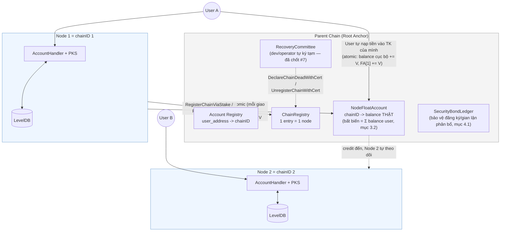
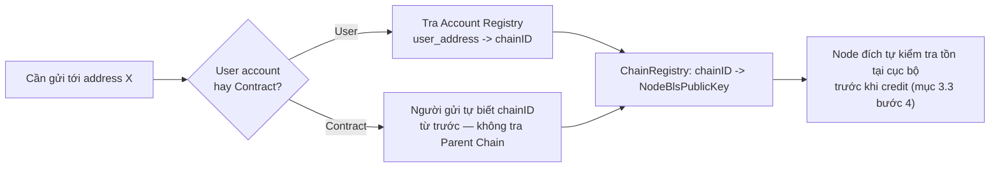
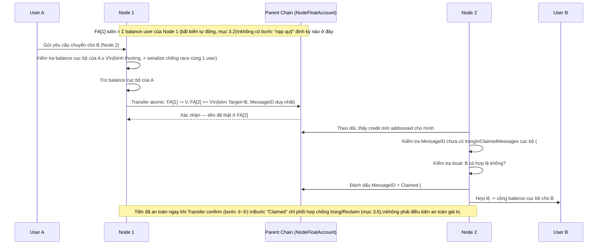
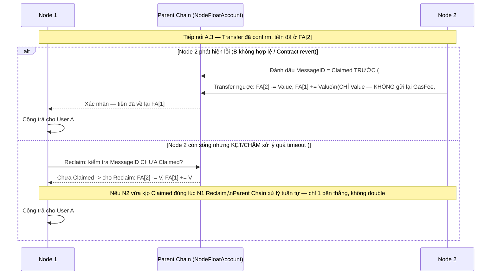
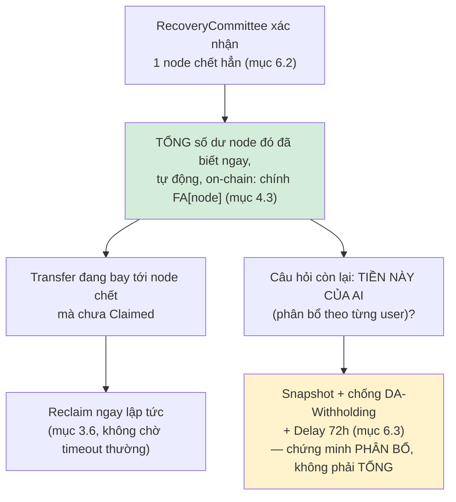
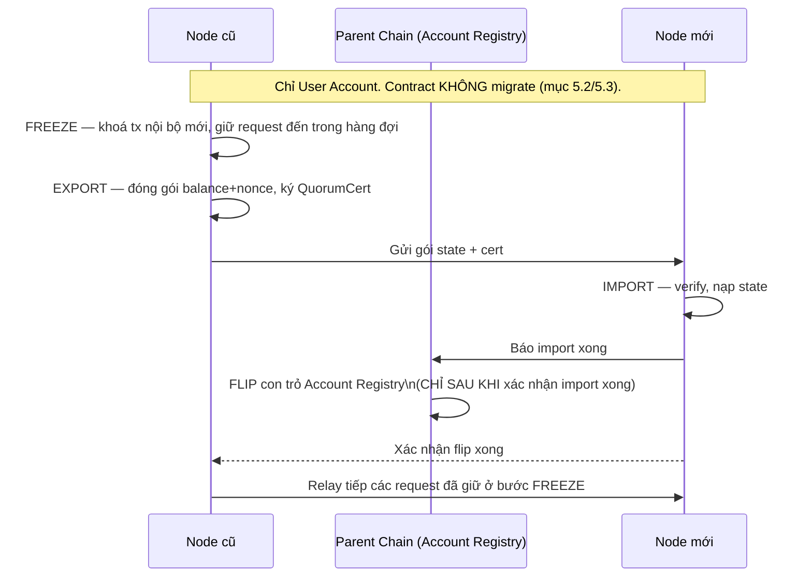

# Sơ đồ Luồng & Vấn đề Còn Mở — BLS Node / Node Float Account

> Tách từ `SEQUENCER_DESIGN.md` (mục 8, 9.1, 11 gốc) để tài liệu chính gọn hơn, tập trung vào kiến trúc. File này chứa (1) toàn bộ sơ đồ minh hoạ các luồng chính (Phần A) và (2) 5 quyết định từng chặn việc bắt đầu code — nay đã chốt 5/5 (2026-09-24, Phần B.1) — mọi vấn đề đã có fix thiết kế sẵn chỉ còn 1 dòng index gọn ở Phần B.2 để `#N` còn tra được, chi tiết đầy đủ nằm trong `SEQUENCER_DESIGN.md`.

---

## Phần A — Sơ đồ các luồng chính

### A.1. Kiến trúc tổng quan

**Quy trình từng bước:**
1. **Lưu trữ dữ liệu:** Mỗi Node thực thi (Node 1, Node 2) tự lưu trữ và quản lý số dư của User trên cơ sở dữ liệu cục bộ (LevelDB) của riêng mình.
2. **Sổ quỹ Parent Chain:** Thay vì giữ chi tiết từng User, Parent Chain tạo ra một "Sổ quỹ liên-node" (`NodeFloatAccount`). Tại đây, mỗi Node có 1 tài khoản tổng.
3. **Bất biến của Quỹ:** Số dư quỹ của 1 Node trên Parent Chain luôn tự động **≥** tổng số dư của tất cả User thuộc Node đó, và hội tụ về đúng bằng (chênh lệch chỉ tồn tại trong 1 cửa sổ ngắn watch-rồi-credit, luôn lệch theo chiều an toàn — mục 3.2, 3.5). Tiền chảy vào quỹ chỉ thông qua 2 đường: User tự nạp vào trực tiếp, hoặc nhận chuyển khoản từ Node khác.
4. **Giao dịch liên-node:** Khi cần chuyển tiền giữa các Node, hệ thống chỉ cần trừ quỹ Node gửi và cộng quỹ Node nhận ngay trên Parent Chain (giống hệt thanh toán bù trừ liên ngân hàng).

### A.2. Tra cứu Account/Contract → Node quản lý

**Quy trình từng bước:**
1. **Xác định đối tượng:** Khi User gửi yêu cầu đến 1 địa chỉ đích (X), hệ thống sẽ phân loại xem X là User Account (tài khoản người dùng) hay Smart Contract (hợp đồng).
2. **Trường hợp User Account:** Hệ thống truy vấn `Account Registry` trên Parent Chain để biết ví của User X đang nằm ở Node (`chainID`) nào.
3. **Trường hợp Smart Contract:** Hệ thống KHÔNG cần tra cứu Parent Chain. Người gửi phải tự biết trước và chỉ định rõ Contract đích đang nằm ở Node nào.
4. **Xác thực Node & Giao dịch:** Sau khi có được `chainID` đích, hệ thống lấy khoá công khai của Node đích từ `ChainRegistry` để chuẩn bị liên lạc. Tại đích, Node nhận sẽ tự kiểm tra lại lần cuối xem X có thực sự tồn tại trong dữ liệu của nó hay không trước khi cộng tiền.

### A.3. Chuyển giá trị Cross-Node — THÀNH CÔNG

**Quy trình từng bước:**
1. **Khởi tạo:** User A (thuộc Node 1) yêu cầu chuyển tiền cho User B (thuộc Node 2).
2. **Trừ tiền cục bộ:** Node 1 kiểm tra xem User A có đủ tiền trong database cục bộ hay không. Nếu đủ, Node 1 lập tức trừ tiền của A.
3. **Ghi sổ Parent Chain:** Cùng lúc đó, Node 1 gửi 1 giao dịch Atomic lên Parent Chain để báo: Trừ quỹ của Node 1 và Cộng quỹ cho Node 2. Ngay khi giao dịch này xác nhận, **tiền đã thật sự nằm ở Quỹ của Node 2**.
4. **Bắt sóng & Kiểm tra:** Node 2 theo dõi Parent Chain và phát hiện có tiền gửi đến. Nó tự kiểm tra chống trùng lặp (`MessageID`) và xác minh User B có hợp lệ trong mạng của nó hay không.
5. **Ghi nhận & Hoàn tất:** Nếu B hợp lệ, Node 2 gửi tín hiệu báo cáo "Đã Claimed" lên Parent Chain để chốt sổ. Ngay sau đó, Node 2 cộng tiền vào số dư cục bộ của User B. Mọi thứ hoàn tất.

### A.4. Thất bại, Hoàn tiền & Reclaim-theo-timeout

**Quy trình từng bước:**

**Kịch bản 1: Thất bại (Tài khoản sai hoặc Contract bị lỗi)**
1. Mặc dù tiền đã vào Quỹ của Node 2, nhưng khi Node 2 kiểm tra nội bộ lại phát hiện User B không tồn tại (hoặc Contract đích bị Revert do lỗi).
2. Node 2 lập tức đánh dấu "Đã Claimed" trên Parent Chain để chốt giao dịch (không cho xử lý lại).
3. Node 2 chủ động tạo một giao dịch **chuyển ngược tiền** (`Value`) về lại Quỹ của Node 1. (Lưu ý: Tiền Gas bị tịch thu để chống Hacker spam giao dịch lỗi).
4. Node 1 nhận lại tiền và cộng hoàn trả vào số dư của User A.

**Kịch bản 2: Reclaim (Node 2 bị treo/chậm)**
1. Node 2 nhận được tiền vào Quỹ, nhưng vì lý do nào đó (treo máy, quá tải) không chịu xử lý sau một thời gian dài (Timeout).
2. Node 1 chủ động gửi lệnh "Đòi tiền" (Reclaim) trực tiếp lên Parent Chain mà không cần chờ Node 2 đồng ý.
3. Parent Chain kiểm tra xem Node 2 đã đánh dấu "Claimed" chưa. Nếu chưa, Parent Chain tự động trừ tiền từ Quỹ Node 2 và trả lại Quỹ Node 1.
4. *(Chặn Race Condition)*: Nếu Node 2 đột nhiên tỉnh dậy và đánh dấu Claimed CÙNG LÚC với lệnh Reclaim của Node 1, Parent Chain sẽ xử lý tuần tự: Lệnh nào đến trước sẽ thắng, đảm bảo không bao giờ bị xử lý đúp.

### A.5. Node chết — bài toán PHÂN BỔ

**Quy trình từng bước:**
1. **Xác nhận Node tử vong:** `RecoveryCommittee` (Hội đồng phục hồi) chính thức xác nhận một Node đã chết hoàn toàn (offline vĩnh viễn).
2. **Chốt Quỹ tổng:** Quỹ Float Account của Node đó trên Parent Chain lập tức bị đóng băng. Vì toàn bộ tiền thật luôn nằm sẵn ở Quỹ này, hệ thống bảo toàn 100% tổng tài sản.
3. **Cứu hộ giao dịch treo:** Những giao dịch đang chuyển dở dang tới Node chết sẽ được Node nguồn kích hoạt lệnh `Reclaim` để đòi lại ngay lập tức (không cần đợi hết hạn Timeout).
4. **Bài toán Phân bổ:** Vấn đề duy nhất còn lại là số tiền lớn trong Quỹ thuộc về những User nào (vì danh sách số dư chi tiết nằm ở Node đã chết).
5. **Chứng minh & Giải ngân:** Hệ thống sử dụng bản sao lưu (Snapshot) định kỳ do Archival Service nắm giữ. Sau thời gian thử thách 72 giờ (để chống hacker tung Snapshot giả giấu dữ liệu), tiền từ Quỹ sẽ được phân bổ lại và giải ngân đúng cho từng User.

### A.6. Migration Account (CHỈ User) — có thể hoãn, xem `SEQUENCER_DESIGN.md` mục 5.3

**Quy trình từng bước:**
1. **Khoá Tài khoản (Freeze):** Node cũ tiến hành khoá tài khoản User cần chuyển mạng. Các giao dịch nội bộ mới bị chặn, nhưng các giao dịch từ nơi khác gửi đến vẫn được Node cũ lưu tạm vào một hàng đợi chờ xử lý.
2. **Đóng gói & Ký xác nhận (Export):** Node cũ đóng gói số dư và nonce của User, tự ký xác nhận (QuorumCert) chốt dữ liệu cuối cùng, rồi gửi sang Node mới.
3. **Nhập & Xác thực (Import):** Node mới nhận gói dữ liệu, kiểm tra chữ ký và nạp số dư vào cơ sở dữ liệu nội bộ của mình.
4. **Cập nhật Sổ Danh Bạ:** Sau khi nạp thành công, Node mới báo cáo lên Parent Chain để cập nhật lại `Account Registry` (chuyển địa chỉ ví sang quản lý bởi Node mới).
5. **Xử lý Tồn đọng:** Node mới thông báo cho Node cũ biết đã sang tên đổi chủ xong. Node cũ tiến hành chuyển tiếp (Relay) toàn bộ các giao dịch đang nằm trong hàng đợi ở Bước 1 sang Node mới để xử lý nốt.

---

## Phần B — Quyết định để triển khai

> Chỉ giữ lại những gì thật sự từng chặn việc bắt đầu viết code. Toàn bộ vấn đề đã có fix thiết kế sẵn (không cần quyết định gì thêm) đã gộp thành 1 bảng index gọn ở B.2 — chi tiết đầy đủ nằm trong `SEQUENCER_DESIGN.md`, không lặp lại ở đây.

### B.1. 5 mục từng chặn triển khai — ĐÃ CHỐT 5/5 (2026-09-24)

| # | Câu hỏi | Loại | Quyết định |
|---|---|---|---|
| Q(RecoveryCommittee) | Ai ngồi trong `RecoveryCommittee`, bao nhiêu người, ngưỡng quorum? | Tổ chức/nhân sự | ✅ **Dev/operator tự ký tạm** — 1 committee nhỏ do chính đội vận hành nắm giữ (threshold-signing nội bộ), siết chặt quy trình bảo vệ khoá khi lên production thật với tài sản lớn hơn (#7) |
| Q9-rủi-ro | Mức rủi ro custody PKS chấp nhận được với quy mô tài sản thật? | Kinh doanh | ✅ **Chấp nhận cho giai đoạn thử nghiệm/quy mô nhỏ** — đủ 4 biện pháp giảm thiểu (delay, anomaly detection, non-custodial tuỳ chọn, Signed Receipt), đánh giá lại khi quy mô tài sản tăng (mục 2.3) |
| Q(report node sai) | Hướng A (report vận hành) hay Hướng B (fraud-proof đầy đủ)? | Kỹ thuật + kinh doanh | ✅ **Hướng A** — Signed Receipt + kênh report vận hành qua `RecoveryCommittee`/operator làm baseline (mục 15.5, `SEQUENCER_DESIGN.md`) (#15) |
| Q(Migration scope) | Có triển khai Migration Account (mục 5.3) ở bản đầu không? | Phạm vi | ✅ **Hoãn** — user cố định ở node đã đăng ký, không xây giao thức 3 pha Freeze/Export/Import ở bản đầu (#4) |
| Q(SlashOnEquivocation) | `SlashOnEquivocation` có bắt double-sign `AccountTreeRoot` không? | Kỹ thuật | ✅ **Có, miễn phí** — đọc code thật xác nhận `ComputeCommitRootAttestMessage` hoàn toàn generic (`epoch_sync.go`); chỉ cần publish `AccountTreeRoot` ký qua đúng message này (mục 6.2, `SEQUENCER_DESIGN.md`) — không cần code equivocation-detection riêng (#16) |

### B.2. Index vấn đề đã có fix thiết kế (không cần quyết định — chỉ để `#N` còn tra được)

| # | Tên ngắn | Chi tiết đầy đủ |
|---|---|---|
| 1 | Committee=1, không redundancy signer | `SEQUENCER_DESIGN.md` mục 4.4, 6.3 |
| 2 | Account Registry chống ghi đè | mục 5.1, 5.3 |
| 3 | Không dùng Contract Registry toàn cục | mục 5.2 |
| 5 | `GasFee` không hoàn khi thất bại | mục 3.4 |
| 6 | Node chết — TỔNG biết, PHÂN BỔ cần Snapshot | mục 6.3 |
| 8 | Custody 100% device key — giảm thiểu + phục hồi qua `RecoveryCommittee` | mục 2.3, 6.2 |
| 9 | Reverse Transfer chống gửi hoàn 2 lần | mục 3.4 |
| 10 | Chống credit trùng ở node đích | mục 3.3 |
| 11 | Velocity-limit Transfer OUTFLOW chống lộ khoá | mục 4.4 |
| 12 | Timeout & Reclaim khi node đích kẹt (không chết) | mục 3.6 |
| 13 | Crash-recovery giữa `Claimed` và credit local | mục 13.3 |
| 14 | Velocity-limit loại trừ Hoàn tiền/Reclaim | mục 4.4 |
| 16 | `SlashOnEquivocation` bắt double-sign `AccountTreeRoot` — đã xác nhận, chỉ cần ký đúng message | mục 4.1, 6.2 |

**Không còn mục nào chặn cứng việc bắt đầu viết code.** Có thể bắt đầu theo đúng lộ trình 9 bước ở mục 10 (`SEQUENCER_DESIGN.md`).

**Tham số đã có default, không chặn code, chỉ cần tinh chỉnh sau khi đo traffic thật:** tần suất snapshot (15 phút), ngưỡng velocity outflow (20%/24h), timeout Reclaim (chưa có số tuyệt đối — cần đo chu kỳ xử lý bình thường trước khi chốt số cứng).
