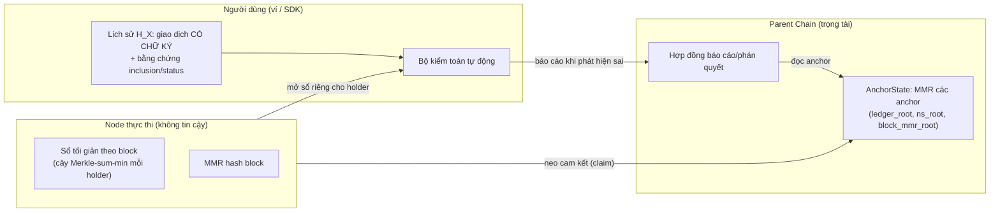

# Đặc tả CHỐT: Chứng minh ERC20 bằng giao dịch chuẩn có chữ ký

> **Trạng thái:** ✅ **ĐÃ CHỐT (2026-09-25)** — đây là **đường chính** và là **nguồn sự thật duy nhất cho triển khai** phần bằng chứng gian lận ERC20.
> **Vai trò của các tài liệu khác:** `SEQUENCER_FRAUD_PROOF_DESIGN.md`, `SEQUENCER_ERC20_USER_HISTORY_PROOF.md` (mục 0–15, chế độ tổng quát dựa trên log), `SEQUENCER_PARENT_ANCHORING.md`, `SEQUENCER_ERC20_DISPUTE.md` là **nền phân tích / chế độ tổng quát CHƯA LÀM**. Khi mâu thuẫn, **tài liệu này thắng**.
>
> **Quy ước:** **[XÁC MINH]** đã đối chiếu code · **[ĐỀ XUẤT]** thiết kế mới · **[CHƯA XÁC MINH]** phải kiểm tra trước khi làm (gom ở mục 14).

---

## 1. Mục tiêu và mô hình đe doạ

**Mục tiêu:** người dùng có thể **phát hiện và chứng minh trên Parent Chain** rằng node thực thi đã làm sai ERC20 theo hướng gây hại cho họ, và node bị phạt.

| # | Ràng buộc đã chốt |
|---|---|
| T1 | **Operator không đáng tin** (điều khiển mọi replica và khoá ký dùng chung). Chữ ký của node là bằng chứng *chống lại* node, không phải bằng chứng sự thật. |
| T2 | **Không ai giám sát dữ liệu trong node.** Không watcher mặc định. |
| T3 | **Người dùng chỉ nhớ giao dịch của mình + giao dịch người khác gửi cho mình** (A1). |
| T4 | **Người ngoài không thấy lịch sử** cho tới khi người dùng báo cáo (mục 9). |
| T5 | **Parent Chain lưu tối thiểu** (O(1) lâu dài mỗi chain). |
| T6 | **Xử lý block Go giữ nguyên**; mọi thứ thêm vào nằm ngoài đường xử lý block. |
| T7 | Phán quyết là **hàm xác định của bằng chứng**, tính hạn bằng **`blockTime` của Parent Chain**; node im lặng quá hạn thì thua; thiếu bằng chứng thì từ chối, không đoán. |

---

## 2. Giả định và phạm vi (điều kiện để bằng chứng có hiệu lực)

| Mã | Giả định | Kiểm tra / hệ quả nếu vi phạm |
|---|---|---|
| **A0** | **Số dư bắt đầu bằng 0**: chỉ chứng minh trên **toàn bộ lịch sử từ sự kiện đầu** của `(token, holder)`; không baseline, không theo đoạn | ví nhập sẵn token, client thiếu lịch sử đầu ⇒ `FROM_ZERO=false`, **không** hỗ trợ |
| **A1** | Người dùng **thu thập đủ** mọi giao dịch ảnh hưởng số dư của mình (tiền ra: của mình; tiền vào và bị `transferFrom`: người trả/người tiêu đưa lại `tx_bytes`) | không kiểm chứng được; vi phạm ⇒ **bảo vệ yếu đi** cho phần thiếu, **node không lợi dụng được** (mục 7, phản bác) |
| **A2** | **Kiểm toán root chỉ ở mức block**; node chỉ cung cấp **tập hash giao dịch** của block (không nội dung) khi cần | F0 đã xác minh: `transactionsRoot` là bộ cộng dồn cộng, kiểm bằng 256 bucket + `txset_root` (mục 14.2) |
| **A3** | **Chỉ chứng minh khi mọi giao dịch ảnh hưởng token là giao dịch chuẩn** | phát hiện lúc tranh chấp; cờ `nonstandard` (mục 4.3) |
| **A4** | **Token chuẩn**: không phí chuyển, không rebasing, không hook, không hàm quản trị làm giảm số dư, mọi số dư ban đầu tạo bằng lời gọi chuẩn (mint đã đăng ký) | kiểm tra tuân thủ trước khi đăng ký token |

**Giao dịch chuẩn** (định nghĩa chính xác): giao dịch **gọi trực tiếp** (không qua contract khác) tới **đúng địa chỉ token** đã đăng ký, `value = 0`, calldata thuộc tập:
- `transfer(address,uint256)` — selector `0xa9059cbb`
- `transferFrom(address,address,uint256)` — `0x23b872dd`
- `approve(address,uint256)` — `0x095ea7b3` (không đổi số dư; cần cho `transferFrom`)
- `mint`/`burn`: **chỉ nếu** bộ mô tả token định nghĩa.

Tác động lên số dư của giao dịch chuẩn **đọc được từ calldata + `status`**, không cần log.

---

## 3. Kiến trúc: hai vai trò



- **Khẳng định (claim):** node cam kết, bất biến trên Parent Chain, **tổng biến động số dư theo từng block** cho từng `(token, holder)` (mục 4.2). Sau này có thể **thay bằng bằng chứng state** khi phần NOMT sẵn sàng; đó là phương án dài hạn, không thuộc phạm vi hiện tại.
- **Kiểm toán (audit):** người dùng đối chiếu cam kết của node với **giao dịch có chữ ký** của họ. Chữ ký là thứ duy nhất node **không giả được**.
- **Lưu ý về ý nghĩa:** hệ thống này giúp **phát hiện node gian lận**. Nó **không** cho phép người dùng chứng minh số dư cho **người thứ ba** chỉ bằng lịch sử của mình (người dùng có thể giấu giao dịch chi); người thứ ba dựa vào **cam kết của node đã được các holder kiểm toán**.

---

## 4. Dữ liệu

### 4.1. Trên Parent Chain (lâu dài, O(1) mỗi chain)  **[ĐỀ XUẤT]**

```proto
message AnchorLeaf {              // một lá của MMR các anchor
  uint32 schema_version   = 1;    // = 1
  uint64 block_number     = 2;
  bytes  block_hash       = 3;    // 32 byte
  bytes  block_mmr_root   = 4;    // MMR mọi block_hash tới block này
  bytes  ledger_root      = 5;    // MPT khoá keccak256(token ‖ holder) -> HolderLeaf hash (4.2)
  bytes  ns_root          = 6;    // cờ "block không chuẩn" theo (token, block) (4.3)
  // KHÔNG có tx_count_total (tránh lộ tổng hoạt động)
}
message AnchorState {
  uint64 chain_id = 1;  uint64 anchors = 2;  bytes anchors_root = 3;
  uint64 last_block = 4; bytes signature = 5;   // khoá dùng chung, miền "ROLLUP_ANCHOR_V1:"
}
```
- Parent chỉ lưu `AnchorState` (~100 byte) và **append** lá mới vào MMR các anchor. Anchor **đơn điệu**; hai `anchors_root` khác nhau cùng `anchors` là equivocation ⇒ slash (`SlashOnEquivocation`, `#16`).
- Anchor **chỉ neo block đã commit Raft và bền DB** (quy tắc thu gọn log, `SEQUENCER_SCHEMAS_AND_TEST_PLAN.md` mục 1.4). Cadence **dày**.

### 4.2. Cam kết của node: sổ tối giản theo block  **[ĐỀ XUẤT]**

Với mỗi `(token T, holder X)`, node dựng một cây **Merkle-sum-min** cho các block **có giao dịch chuẩn thành công ảnh hưởng `X`**:

```proto
message BlockLeaf {            // lá: một block
  uint64 block      = 1;
  bytes  delta_sum  = 2;       // int256 có dấu (33 byte): tổng tác động lên X trong block, theo quy tắc mục 5.1
}
// nút trong: sum = L.sum + R.sum ; minPrefix = min(L.minPrefix, L.sum + R.minPrefix)
//            hash = H("BLKNODE_V1:" ‖ L.hash ‖ R.hash ‖ signed(sum) ‖ signed(minPrefix))
message HolderLeaf {
  uint32 schema_version = 1;   // = 3
  bytes  sum_root_hash  = 2;   // = H("SUMROOT_V1:" ‖ treeRootHash ‖ signed(sum) ‖ signed(minPrefix) ‖ be64(leafCount))
}
// ledger MPT: keccak256(token ‖ holder) -> H("HLEAF_V3:" ‖ sum_root_hash)
```
- `sum` = số dư; `minPrefix` = số dư tích luỹ nhỏ nhất **tại ranh giới block** (P7). `sum`, `minPrefix`, `leafCount` **nằm trong hash** nên không lộ khi chỉ trình bằng chứng đường đi.
- **Bất biến:** `sum ≥ 0`, `minPrefix ≥ 0`, block đầu có `delta_sum > 0`, các block **tăng ngặt**.
- **Chỉ tính giao dịch chuẩn** (đọc từ calldata + `status`), **không** đọc log.
- **Không dùng thứ tự giao dịch trong block** (chỉ tổng biến động của cả block).
- Mọi replica dựng **giống hệt** (hàm xác định của block đã commit) và **đối chiếu `ledger_root`** (chống lỗi); replica lệch dừng.

### 4.3. Cờ "block không chuẩn"  **[ĐỀ XUẤT]**

`ns_root` = gốc Merkle của tập khoá `keccak256(token ‖ be64(block))` cho các block mà **có ít nhất một giao dịch thành công có log `Transfer` của `token` nhưng KHÔNG phải giao dịch chuẩn** (qua router, multicall…). Node dựng từ receipt (ngoài đường xử lý block). Ý nghĩa: **phạm vi chứng minh của mọi holder bị vô hiệu từ block đầu tiên bị cờ** (client kiểm ngay, không tốn gì).

**Chống lạm dụng cờ:** node có thể đặt cờ giả để vô hiệu bảo vệ. Vì vậy cờ **thách thức được** (mục 6.3 `challengeNonstandard`): node phải **chứng minh có một giao dịch không chuẩn thật** trong block đó (receipt có log `Transfer` của token + giao dịch không phải lời gọi trực tiếp chuẩn); không chứng minh được hoặc im lặng ⇒ `NODE_AT_FAULT`.

### 4.4. Người dùng tự lưu  **[ĐỀ XUẤT]**

```proto
message TxRecord {                 // dùng cho giao dịch của mình VÀ giao dịch người khác đưa mình (A1)
  uint32 schema_version   = 1;     // = 1
  uint64 chain_id         = 2;
  bytes  tx_bytes         = 3;     // giao dịch đã ký (pb.Transaction, gồm Sign)
  bytes  tx_hash          = 4;
  uint64 block_number     = 5;
  bytes  block_header     = 6;     // header preimage
  bytes  block_hash       = 7;
  bytes  tx_proof         = 8;     // Merkle proof (tx_hash,status) ∈ txset_root của block (F0: transactionsRoot là bộ cộng dồn, không có proof)
  bytes  receipt_bytes    = 9;     // cần status, exception, return (do node tạo; chỉ có giá trị khi kèm signed_response)
  bytes  receipt_proof    = 10;    // (dành riêng, không dùng: receiptRoot không có proof)
  bytes  block_mmr_proof  = 11;    // block_hash ∈ block_mmr_root của anchor `anchor_index`
  uint64 anchor_index     = 12;
  bytes  anchor_proof     = 13;    // anchor ∈ anchors_root
  bytes  signed_response  = 14;    // (tuỳ chọn) chữ ký node trên (chain, block_number, block_hash, tx_hash)
}
```
- Lưu **ngay** lúc có receipt; lấy bằng chứng MMR/anchor ngay khi anchor phủ block (node có thể ngừng phục vụ).
- Bằng chứng anchor cũ **nâng cấp được** dưới `anchors_root` mới bằng dữ liệu công khai.

---

## 5. Quy tắc tính và các kiểm tra

### 5.1. Tác động của một giao dịch chuẩn

```
status = SUCCESS:
   transfer(to, amt)              : tx.from −= amt ;  to += amt
   transferFrom(from, to, amt)    : from    −= amt ;  to += amt
   approve(...)                   : không đổi số dư
   mint(to, amt) / burn(from,amt) : theo bộ mô tả token (nếu có)
status = FAILED                   : không tác động
delta_b(X) = Σ tác động lên X của mọi giao dịch thuộc H_X trong block b
B_calc(X, đến b) = Σ_{b' ≤ b} delta_{b'}(X)      (từ 0)
```

### 5.2. Các kiểm tra của người dùng (mọi bằng chứng đều kiểm được trên Parent Chain)

| Mã | Kiểm tra | Phát hiện |
|---|---|---|
| **P1** | Với mỗi giao dịch: chữ ký hợp lệ; `(tx_hash,status) ∈ txset_root` (neo trong `AnchorLeaf`); block ∈ MMR ∈ anchor | giao dịch/kết quả của tôi đúng như đã cam kết |
| **P4'** | `delta_b(X)` tính từ `H_X` **==** `BlockLeaf(X,b).delta_sum` của node, với mọi block | node cam kết sai tổng biến động của một block |
| **P7** | Số dư tích luỹ tại **ranh giới block** luôn ≥ 0 (`minPrefix ≥ 0`); block đầu `delta_sum > 0` | sổ tự mâu thuẫn (bỏ sót tiền vào rồi có chi thật; hoặc success bất khả thi) |
| **P8** | **Không thất bại sai giao dịch của mình** (dưới đây) | node đánh dấu FAILED một giao dịch chuyển hợp lệ |
| **P6** | Nếu có `signed_response` cho block `b`: `block_hash` đã ký == hash tại vị trí `b` trong `block_mmr_root` | viết lại lịch sử / chia nhìn |
| **P5'** | Chữ ký từng giao dịch trong tập giao dịch của block (kiểm cùng bộ cộng dồn `transactionsRoot`, mục 14.2) hợp lệ với `FromAddress` | node đưa giao dịch chưa được uỷ quyền |
| **NS** | Block trong phạm vi không nằm trong `ns_root` (cờ không chuẩn) | phạm vi bị vô hiệu (client biết ngay) |

**P8 — chi tiết (vá lỗ hổng "success/fail là lời của node"):**
Cho block `b` và giao dịch `t` của `X` là `transfer(to, amt)` với `status = FAILED`. Đặt
`S_start = B_calc(X, b−1)` (đã kiểm toán đến cuối block trước) và
`Out_b = Σ số lượng của MỌI khoản chi ảnh hưởng X trong block b mà X biết` (mọi `transfer` của X + mọi `transferFrom` rút từ X, **bất kể status**).
Nếu **`S_start ≥ Out_b`** thì mọi khoản chi đó **phải** thành công dù thứ tự thực thi thế nào (tổng chi tối đa không vượt số dư đầu block). Khi đó `t` bị FAILED **vì lý do "không đủ số dư"** là **mâu thuẫn** ⇒ node sai. **Loại trừ để không kết tội oan:** chỉ áp dụng khi receipt cho thấy lý do là **revert của token** (không phải hết gas / thiếu phí gốc / lỗi khác): `Status == THREW` **và** `Exception == ERR_EXECUTION_REVERTED (5)` (đã xác minh trong code, mục 14.1 F0-4); **không** dựa vào chuỗi lý do trong `Return` (token không chuẩn) **[còn chạy thử với token thật, mục 14.3]**. Lý do khác ⇒ **không áp dụng P8** (không báo cáo).

---

## 6. Quy trình và báo cáo

### 6.1. Ghi nhận (client, mỗi giao dịch)
1. Nhận receipt (kèm phản hồi ký của node, H8); kiểm cục bộ hash header và `(tx_hash,status) ∈ txset_root`.
2. Lưu `TxRecord`; khi anchor phủ block, lấy bằng chứng MMR/anchor và lưu.
3. Giao dịch **người khác gửi cho mình** (A1): người trả đưa `tx_bytes`; client xin node `status` + bằng chứng, lưu cùng dạng `TxRecord`.

### 6.2. Kiểm toán định kỳ (client, sau mỗi anchor)
1. Kiểm **P1**, **P5'**, **NS**, **P6** trên các `TxRecord` mới.
2. Xin node **mở sổ riêng** của `(token, X)` (kênh xác thực, chỉ holder, mục 9). Tính `delta_b(X)` từ `H_X`, so `BlockLeaf(X,b).delta_sum`; **chia đôi** trên cây tìm **block đầu tiên lệch `b*`** (O(log n)).
3. Kiểm **P7** (`minPrefix ≥ 0`) và **P8**.
4. Mọi thứ khớp ⇒ **không làm gì** (số dư đúng theo nghĩa của mục 2, dưới A0–A4).
5. Có lệch/vi phạm ⇒ nộp **một** báo cáo (6.3) cho block liên quan.

### 6.3. Báo cáo lên Parent Chain

Mọi báo cáo cần **chữ ký holder + ký quỹ**; mốc thời gian theo `blockTime` Parent.

| Báo cáo | Người dùng nộp | Parent Chain kiểm | Node được làm gì | Kết quả |
|---|---|---|---|---|
| **`reportBalanceMismatch`** (P4') | các giao dịch của X trong `b*` (`tx_bytes` có chữ ký, bằng chứng inclusion + status) + đường Merkle-sum-min tới `BlockLeaf(X,b*)` | header ∈ MMR ∈ anchor; **chữ ký từng giao dịch**; `(t,status) ∈ txset_root`; giao dịch là **chuẩn**; tính `delta_{b*}(X)`; so `delta_sum` | **Phản bác** (6.4) trong `W_resp` | node không phản bác được & lệch ⇒ `NODE_AT_FAULT` |
| **`reportNegativePrefix`** (P7) | `HolderLeaf` + đường bằng chứng tới nút/điểm `minPrefix < 0` (mở `sum_root_hash`) | bằng chứng hợp lệ; `(sum, minPrefix)` nhất quán dọc đường; giá trị âm | không có (sổ tự mâu thuẫn) | `NODE_AT_FAULT` ngay |
| **`reportWrongFailure`** (P8) | giao dịch `t`, receipt (Exception/Return), lịch sử đến `b−1` cho `S_start` và `Out_b` (mỗi giao dịch kèm bằng chứng) | điều kiện `S_start ≥ Out_b` và lý do revert "vượt số dư" | phản bác bằng giao dịch **thật** làm `Out_b` lớn hơn `S_start` | `NODE_AT_FAULT` nếu không phản bác được |
| **`reportInvalidSignature`** (P5') | `tx_bytes` (có `Sign`) + Merkle proof ∈ `txset_root` ∈ anchor | Parent tự kiểm chữ ký với `FromAddress` | không có | `NODE_AT_FAULT` ngay |
| **`reportRewrite`** (P6) | phản hồi ký `{chain, epoch, block_number, block_hash,…, sig}` + bằng chứng MMR cho hash khác tại vị trí đó | chữ ký hợp lệ (khoá tại `epoch`); MMR/anchor hợp lệ; hash khác | không có | equivocation ⇒ slash ngay |
| **`challengeNonstandard`** (cờ NS giả) | `(token, block)` bị cờ | — | node phải chứng minh **một** giao dịch không chuẩn thật (receipt có log `Transfer` của token + giao dịch không chuẩn) trong `W_resp` | node im lặng/sai ⇒ `NODE_AT_FAULT` |

### 6.4. Phản bác của node (chỉ có hai cách, đều kiểm chứng được)
1. **Nộp thêm một giao dịch thật ảnh hưởng `X` trong `b*`** mà người dùng thiếu (chữ ký hợp lệ, ∈ `transactionsRoot`, có `status`): làm `delta_{b*}` thay đổi; nếu giờ khớp thì **báo cáo bị bác** (A1 không thoả), ký quỹ người dùng bị phạt một phần.
2. **Nộp một giao dịch KHÔNG chuẩn** (receipt có log `Transfer` của token liên quan `X` nhưng không phải lời gọi trực tiếp chuẩn) ⇒ **A3 bị vi phạm**: báo cáo **vô hiệu** (hoàn ký quỹ, không phạt ai) và **cặp `(token, X)` ngoài phạm vi từ block đó**.

Node **không thể** bịa giao dịch (thiếu chữ ký hợp lệ) và **không cần** chứng minh sự không tồn tại của giao dịch nào.

### 6.5. Phán quyết (mọi mốc theo `blockTime` Parent)
| Tình huống | Kết quả |
|---|---|
| Báo cáo đúng, node không phản bác được / im lặng quá `W_resp` | `NODE_AT_FAULT`: forfeit một phần `SecurityBond`, bồi thường người báo, hoàn ký quỹ |
| Node phản bác thành công (giao dịch thật làm khớp) | báo cáo bị bác; ký quỹ người báo bị tịch thu một phần |
| Node chứng minh giao dịch không chuẩn | báo cáo vô hiệu; hoàn ký quỹ; đánh dấu ngoài phạm vi |
| Báo cáo không đủ bằng chứng | từ chối; ký quỹ bị phạt một phần |

### 6.6. Kiểm toán root của block bằng tập hash giao dịch (A2)
Chỉ khi cần (node phản bác rằng "block `b*` có giao dịch mà bạn thiếu", hoặc nghi ngờ header): node nộp **danh sách hash giao dịch đã sắp** của `b*`; Parent tính lại và so `transactionsRoot` ⇒ **tập giao dịch của block đầy đủ** (đếm `N_b`). **Không lộ nội dung.** Hash **không** cho biết giao dịch nào ảnh hưởng `X` — phần đó dựa vào A1 và phản bác 6.4. **F0 đã trả lời:** `transactionsRoot` là bộ cộng dồn cộng (không phải Merkle) nên node nộp 256 bucket của block N (8 KB, kiểm bằng `keccak(bucket…)==header.transactionsRoot`) và tập giao dịch; Parent kiểm `bucket_N−bucket_{N-1}` khớp và `txset_root` khớp (mục 14.2). Vì bộ cộng dồn hash cả bytes giao dịch, phải nộp đủ `tx_bytes` (không chỉ hash) khi kiểm mức này; kiểm chỉ theo hash dùng `txset_root`. Không đưa lên Parent thường xuyên.

---

## 7. Vì sao đúng (dưới A0–A4)

- **Không bịa được giao dịch:** mọi giao dịch cần chữ ký hợp lệ của người gửi và nằm trong `transactionsRoot` đã neo.
- **Node giấu tiền vào của X:** X giữ giao dịch đó (A1) ⇒ `delta_{b*}` lệch ⇒ node không thể nộp thứ gì làm sổ của nó khớp ⇒ thua.
- **Node bịa khoản trong sổ:** không có giao dịch ký hợp lệ ủng hộ ⇒ thua.
- **Người dùng giấu giao dịch chi để kết tội oan:** node nộp giao dịch đó (chữ ký của X) ⇒ báo cáo bị bác.
- **Node thất bại sai giao dịch chuyển hợp lệ của X:** P8 (trong phạm vi hẹp, mục 5.2).
- **Viết lại lịch sử:** P6.

---

## 8. Giới hạn (nói thẳng)

1. **A1 là giả định về người dùng**, không kiểm chứng được: thiếu một khoản tiền vào thì mất bảo vệ phần đó (node không lợi dụng được).
2. **Không chứng minh số dư cho người thứ ba chỉ bằng lịch sử của một người dùng** (mục 3).
3. **A3 chỉ phát hiện lúc tranh chấp** hoặc qua cờ `ns_root`; cần **chính sách hệ sinh thái**: chỉ dùng lời gọi trực tiếp với token thuộc phạm vi; ví cảnh báo khi dùng router.
4. **P8 hẹp:** chỉ bắt thất bại sai trong trường hợp rõ (`S_start ≥ Out_b`) và lý do revert "vượt số dư"; **không** bắt mọi thất bại sai (cần tái thực thi).
5. **Không bắt lỗi EVM tự nhất quán** ngoài các mâu thuẫn ở mục 5.2 (cần tái thực thi/ZK, ngoài phạm vi).
6. **Không chống kiểm duyệt** (node từ chối nhận giao dịch).
7. **Chỉ áp dụng khi số dư bắt đầu bằng 0** (A0).
8. Bằng chứng khi báo cáo **lộ** các giao dịch ảnh hưởng `X` trong block `b*` (kể cả địa chỉ/số lượng của người gửi cho `X`) và calldata; dữ liệu lên chuỗi **tồn tại vĩnh viễn**.

---

## 9. Quyền riêng tư

- **Trước khi báo cáo:** Parent Chain chỉ có hash/gốc (không có `tx_count_total`). RPC của node **phải gate** cả giao dịch, **receipt** (log `Transfer` tự lộ người gửi/nhận/số lượng) và `GetLogs`; header đầy đủ (có `logsBloom`) chỉ cấp cho người tham gia. **Hiện các RPC đọc công khai hoàn toàn** ⇒ cần **H7** (`privacy_mode`, mặc định-tắt; `SEQUENCER_ERC20_USER_HISTORY_PROOF.md` mục 13).
- **Mở sổ riêng** `(token, X)`: chỉ holder (xác thực bằng chữ ký thách thức). `sum_root_hash` che `sum`/`minPrefix`/`leafCount`; chỉ mở khi chính holder báo cáo P4'/P7.
- **Khi báo cáo:** chỉ lộ giao dịch của `X` trong `b*` (và, nếu bị thách thức cờ NS, **một** giao dịch không chuẩn của người khác).
- **Kiểm toán viên độc lập:** không mặc định; chỉ theo sự đồng ý của từng người dùng.

---

## 10. Tham số  **[ĐỀ XUẤT, chốt theo số đo]**

`W_resp` (hạn node phản hồi), **`H_audit` = `UnbondingPeriodSeconds`** (thời gian còn được báo cáo cho một anchor; ≥ `W_resp` + xử lý + 1 chu kỳ anchor), ký quỹ người báo (≥ chi phí công bố dự kiến của node), `N_tx_max` (số giao dịch tối đa mỗi báo cáo, chia đợt nếu vượt), cadence anchor `K`, mức ký quỹ tối thiểu của chain theo giá trị ERC20 được bảo vệ, tỉ lệ forfeit. **Không đặt số trước khi đo.**

---

## 11. Bổ sung hợp đồng và điểm móc so với các tài liệu trước

| Thành phần | Thay đổi so với chế độ tổng quát |
|---|---|
| Sổ node | **Chỉ** cây Merkle-sum-min theo block (`delta_sum`), **không** có `EventLeaf`, `incl_root`, `events_root` |
| Loại báo cáo | `reportBalanceMismatch`, `reportNegativePrefix`, `reportWrongFailure`, `reportInvalidSignature`, `reportRewrite`, `challengeNonstandard` — **bỏ** `demandInclusion`, `demandOpen`, kiểm toán block mức 0/2, bằng chứng bloom |
| Điểm móc trong code cũ | **H7** (cổng đọc riêng tư) và **H8** (RPC ký phản hồi mang `block_hash`) — đều mặc định-tắt, cần bạn duyệt |
| Đọc từ code | calldata + `status`/`Exception`/`Return`; **không** cần giải mã log để dựng sổ (log chỉ dùng để dựng cờ `ns_root`) |

---

## 12. Bước triển khai (thay Giai đoạn F/F-min cũ)

| Bước | Việc | Phụ thuộc | Kích thước |
|---|---|---|---|
| **F0** | **Đã đọc code (mục 14.1–14.2)**: root là bộ cộng dồn, chữ ký BLS+ETH, revert=5. **Còn lại (mục 14.3):** xác nhận root tích luỹ, R,S,V của tx chuẩn, chạy thử revert thật | — | S |
| **F1** | `AnchorState` + MMR các anchor trên Parent Chain (append, đơn điệu, equivocation slash); gap analysis với `SubmitCheckpoint` | A0 (kế hoạch), F0 | M |
| **F2** | **Bộ dựng sổ tối giản theo block** (cây Merkle-sum-min từ giao dịch chuẩn) + **`ns_root`** + MMR hash block trên mọi replica (xác định, đối chiếu gốc); job kiểm tra tuân thủ token; sổ đăng ký token/bộ mô tả | F0, C2 | L |
| **F3** | Node: worker neo (leader, sau commit Raft + bền DB); **mở sổ riêng** cho holder (xác thực); **H7** cổng đọc riêng tư; **H8** RPC ký phản hồi; dịch vụ bằng chứng (tx, receipt, block MMR, đường Merkle-sum-min) | C1, F2 | L |
| **F4** | Parent Chain: 6 loại báo cáo, phản bác, phán quyết theo `blockTime`, forfeit/bồi thường, ràng buộc unbonding ≥ `H_audit` | F1, F3 | L |
| **F5** | **SDK/ví tự kiểm toán** (lưu `TxRecord`, kiểm P1/P4'/P5'/P6/P7/P8/NS, chia đôi tìm `b*`, tự nộp báo cáo); công cụ dòng lệnh | F3, F4 | M |
| **F6** | Đối kháng/chaos: node giấu tiền vào, bịa, thất bại sai, đổi hash, cờ NS giả, im lặng, rút ký quỹ; người dùng giấu giao dịch chi; token không chuẩn | F4, F5 | L |

---

## 13. Test (`T-SD-*` chốt; bổ sung `T-PV-*` mục 13 của tài liệu người dùng)

Các test `T-SD-01..15` (đã có ở `SEQUENCER_ERC20_USER_HISTORY_PROOF.md` mục 16.7) **giữ nguyên**, thêm:

| ID | Test | Đạt khi |
|---|---|---|
| T-SD-16 | **P8:** node FAILED một `transfer` của X có revert "vượt số dư" trong khi `S_start ≥ Out_b` | `reportWrongFailure` ⇒ `NODE_AT_FAULT` |
| T-SD-17 | FAILED vì **hết gas** / thiếu phí gốc | P8 **không** áp dụng; không báo cáo, không phạt |
| T-SD-18 | Một `transferFrom` của spender rút X trong cùng block làm X hết tiền hợp lệ; X biết (A1) | `Out_b` gồm khoản đó ⇒ P8 không áp dụng; không báo oan |
| T-SD-19 | `S_start < Out_b` (tổng chi vượt số dư) | không kết luận; không báo cáo |
| T-SD-20 | Node đặt **cờ `ns_root` giả** cho một block | `challengeNonstandard`: node không chứng minh được ⇒ `NODE_AT_FAULT` |
| T-SD-21 | Cờ đúng (có giao dịch qua router) | node chứng minh ⇒ báo cáo vô hiệu; phạm vi kết thúc ở block đó |
| T-SD-22 | Client dừng chứng minh sau block có cờ | không phát biểu, không báo cáo cho phần sau |
| T-SD-23 | Sổ tối giản dựng trên 2 replica từ cùng block | `ledger_root`, `ns_root` giống hệt; lệch ⇒ replica dừng |
| T-SD-24 | Đảo thứ tự giao dịch trong block | kết quả `delta_sum`/P7 **giống hệt** (không phụ thuộc thứ tự trong block) |
| T-SD-25 | Cây Merkle-sum-min: nút trong sai `(sum, minPrefix)` | phát hiện bằng bằng chứng O(log n) |
| T-SD-26 | Chỉ holder mở được sổ riêng; người khác bị từ chối | đúng |
| T-SD-27 | `AnchorState` đơn điệu; hai `anchors_root` khác nhau cùng `anchors` | mới hơn nhận; mâu thuẫn ⇒ slash |
| T-SD-28 | Bằng chứng anchor cũ nâng cấp dưới `anchors_root` mới | kiểm được; sửa 1 bit ⇒ từ chối |
| T-SD-29 | Rút ký quỹ (`UnregisterChainWithCert`) rồi báo cáo trong `H_audit` | forfeit được; sau `H_audit` ⇒ không |
| T-SD-30 | Toàn bộ vòng client tự động trong kịch bản đối kháng | phát hiện mọi bất nhất; **không báo oan** khi node đúng |

---

## 14. Kết quả F0 và điểm còn chưa xác minh

### 14.1. Đã xác minh bằng đọc code (F0, chưa chạy thực tế)

| # | Điểm | Kết quả (nguồn) | Hệ quả cho thiết kế |
|---|---|---|---|
| F0-1 | Cấu trúc `transactionsRoot` / `receiptRoot` | **Không phải cây Merkle.** Dù backend mặc định là NOMT, hai namespace `transaction_state` và `receipts` bị ép dùng `FlatStateTrie` ("PERF FIX", `pkg/trie/trie_factory.go`). `FlatStateTrie` là **256 bộ cộng dồn cộng modulo** `p = 2^256-189`: `bucket[i] = Σ keccak256(key‖value) mod p` (key[0]==i), `root = keccak256(bucket[0]‖…‖bucket[255])` (`pkg/trie/flat_state_trie.go`). Giá trị `value` của trie giao dịch là **bytes đã marshal của giao dịch** (gồm `Sign`), khoá là `tx.Hash()`. Không có API chứng minh thành viên | **Bằng chứng thành viên O(log n) cho `transactionsRoot`/`receiptRoot` không tồn tại.** Mọi chỗ trong spec dựa vào "Merkle inclusion proof của giao dịch/receipt vào header" phải bỏ (xem 14.2) |
| F0-2 | Root có tích luỹ qua các block không | **Có vẻ tích luỹ** (mỗi block dựng trie từ root của block trước rồi thêm giao dịch: `postProcessBlock`, `NewTransactionStateDBFromRoot(header.TransactionsRoot())`) — *suy ra từ cách dùng, chưa đọc nơi ghi root* | Kiểm toán block N = kiểm `bucket(N) − bucket(N-1)` khớp với tập giao dịch của block N |
| F0-3 | Băm/xác minh chữ ký | `tx.Hash()` = keccak256(proto tất định của `TransactionHashData`) gồm from, to, amount, gas, data, nonce, chainID, **R, S, V**, …; **không gồm `Sign` (BLS)** và `Sidecar`. Xác minh mempool (`validation.go`): (1) BLS `NewVerifyTransactionRequest(hash, PublicKeyBls của tài khoản, Sign)`; nếu BLS sai thì **vẫn hợp lệ nếu `ValidEthSign()`** (khôi phục địa chỉ từ chữ ký secp256k1 kiểu Ethereum rồi so `FromAddress`); (2) tài khoản `AccountType==1` phải có **cả hai** chữ ký; (3) khoá BLS đặt bằng giao dịch `setBlsPublicKey` (nonce 0, chỉ ký secp256k1, **không đổi được sau đó** — `PublicKeyExists`) | Parent Chain có thể kiểm chữ ký **chỉ bằng ECDSA** (`ValidEthSign`) khi giao dịch mang R,S,V; nếu chỉ có BLS thì cần thêm giao dịch `setBlsPublicKey` của chính người dùng (nonce 0, tự chứng minh địa chỉ↔khoá BLS). Vì `Sign` không nằm trong `tx_hash`, `tx_bytes` phải gồm `Sign` và bằng chứng phải nộp đủ bytes (không chỉ hash) |
| F0-4 | Revert "vượt số dư" (P8) | Receipt `Status = THREW`, `Exception = ERR_EXECUTION_REVERTED (5)`, `Return` = dữ liệu revert của EVM (`pkg/mvm/helpers.go`); `Exception` chỉ đọc khi `THREW`. Lỗi khác (hết gas = 0, `ERR_INSUFFICIENT_BALANCE = 3` là số dư **gốc**, không phải token) tách biệt | P8 chỉ áp dụng khi `Exception == 5`; **không** được dựa vào chuỗi lý do trong `Return` (token không chuẩn). Loại trừ 0/3 như đã nêu ở T-SD-17 |
| F0-5 | `SKIP_MEMPOOL_SIG_VERIFY` trên deploy | Mặc định **tắt**: `mtn-orchestrator.sh` chỉ bật khi `MTN_SKIP_MEMPOOL_SIG_VERIFY=true`; ansible (`metanode-execution.service.j2`, `metanode-private.service.j2`) chỉ bật khi biến `skip_mempool_sig_verify` = true (mặc định false). **Bật cứng** trong `deploy/cluster/local_devnet/run_load_test.sh:125` (chỉ bản đo tải cục bộ). Còn thêm điểm dùng ở `cmd/simple_chain/eth_tx_converter.go:82` | Cụm production không bật cờ; kịch bản devnet/đo tải thì bật ⇒ `reportInvalidSignature` vẫn cần. Thêm kiểm tra khởi động: chế độ `raft` + `privacy_mode` **từ chối chạy** nếu cờ bật |
| F0-6 | Chỉ số trong block | `Receipt.TransactionIndex` có; log **không có** `logIndex` (suy ra theo vị trí trong `EventLogs`) | Đã phản ánh ở sổ tối giản (không cần logIndex trong P7 mức block) |

### 14.2. Sửa thiết kế do F0-1 (quan trọng)

Vì `transactionsRoot`/`receiptRoot` là bộ cộng dồn cộng, không có bằng chứng thành viên. Hệ quả và cách xử lý:

1. **Không cần Merkle proof từ header cho giao dịch.** Giao dịch có **chữ ký của người dùng** nên không thể bị làm giả; vai trò của `transactionsRoot` chỉ là cam kết "tập giao dịch của block". Kiểm toán block (A2) đổi thành: node công bố **8 KB** (256 bucket × 32 byte) của block N; người kiểm tra thấy `keccak256(bucket[0]‖…‖bucket[255]) == header.transactionsRoot` rồi so `bucket_N[i] − bucket_{N-1}[i] == Σ keccak256(hash‖tx_bytes) mod p` trên các giao dịch của block. Chi phí O(số giao dịch trong block), không có bằng chứng O(log n).
2. **Receipt do node tạo ra** nên `receiptRoot` (cũng là bộ cộng dồn) **không đủ** làm chứng cứ chống node; spec vốn đã **không** dùng receipt làm bằng chứng (chỉ dùng giao dịch có chữ ký + sổ tối giản của node), nên **không đổi**. Mọi câu chữ "bằng chứng receipt vào `receiptRoot`" trong tài liệu phụ (`SEQUENCER_ERC20_USER_HISTORY_PROOF.md`, các mục P5/P6 cũ) coi là **đã bị thay thế**.
3. **Cảnh báo an ninh của chính mã nguồn** (`SetStateBackend`: "additive mod prime accumulators are vulnerable to Wagner's attack"): với bộ cộng cộng modulo, kẻ vận hành độc hại có thể dựng tập phần tử giả có tổng bằng mục tiêu bằng tấn công sinh nhật tổng quát (chi phí dưới 2^128 khi có nhiều phần tử tự chọn). Với **giao dịch có chữ ký** kẻ đó không tự chọn được phần tử; với **receipt** thì chọn được. Kết luận: **không được coi `receiptRoot` là cam kết chống node**; `transactionsRoot` chỉ đáng tin vì mỗi phần tử có chữ ký người dùng, và kiểm toán (mục 1) phải nộp đủ bytes có chữ ký chứ không chỉ hash.
4. **Chọn cam kết riêng của node, neo trong `AnchorLeaf`:** thay vì sửa backend trie (đụng code cũ, đã bị đẩy sang flat vì NOMT đồng bộ mất >3.5 s/block), node dựng thêm **cây Merkle theo block** với lá `(tx_hash, status)` (sắp theo hash) và đưa `txset_root` vào `AnchorLeaf` — nhờ đó `status` (do node tạo, không nằm trong bộ cộng dồn tin cậy) trở thành **cam kết có neo** thay cho `receiptRoot`. Kiểm toán A2 kiểm **cả hai**: (a) `txset_root` khớp tập hash công bố; (b) bộ cộng dồn của block khớp header (mục 1). Bằng chứng "giao dịch X thuộc block N" khi đó là Merkle proof O(log n) trên `txset_root`. **[ĐỀ XUẤT, cần bạn duyệt vì thêm một trường vào cam kết neo]**
5. **Tuỳ chọn thay thế (không khuyến nghị):** đổi backend hai namespace này sang NOMT/MPT. Đụng code cũ, ảnh hưởng hiệu năng đã đo, và chỉ có lợi cho receipt — không cần cho thiết kế hiện tại.

### 14.3. Điểm còn chưa xác minh

| Điểm | Cách xác minh |
|---|---|
| Nơi ghi `transactionsRoot` của header: xác nhận **tích luỹ** hay theo block (F0-2 mới suy ra) | đọc `block_processor_processing.go` phần dựng header |
| Giao dịch người dùng chuẩn có mang **R,S,V (ECDSA)** hay chỉ `Sign` BLS; nếu chỉ BLS thì Gateway trên Parent cần cách xác minh BLS (thư viện, chi phí) | đọc `cmd/rpc` chuyển đổi giao dịch + chạy thử với ví thật |
| Đo thực tế mã `Exception`/`Return` với token ERC20 chuẩn | chạy thử trên devnet |
| Khoá xác thực dùng cho cổng đọc H7 và mở sổ riêng | đọc lớp tài khoản/khoá |
| Chi phí xác minh trong handler Gateway (giao dịch tuần tự, blob `GatewayEngine`) | benchmark; quyết định `N_tx_max`, `W_resp` |
| Bộ mô tả token và job kiểm tra tuân thủ (không phí, không hook, số dư ban đầu bằng mint chuẩn) | thiết kế + test trên token thật |

---

## 15. Các quyết định đã chốt

| Quyết định | Trạng thái |
|---|---|
| **Chế độ giao dịch chuẩn có chữ ký (A0–A4) là đường chính**; chế độ tổng quát dựa trên log **chưa làm** | ✅ Chốt |
| Kiến trúc hai vai trò: **cam kết tối giản của node (cây Merkle-sum-min theo block)** + **kiểm toán bằng giao dịch có chữ ký** | ✅ Chốt |
| Kiểm toán root chỉ ở mức block bằng **tập hash giao dịch** (cộng `txset_root`, mục 14.2), không đưa lên Parent thường xuyên | ✅ Chốt |
| Thêm **P7** (mức block), **P8** (không thất bại sai giao dịch của mình, phạm vi hẹp) và **cờ `ns_root`** có thể thách thức | ✅ Chốt |
| Phán quyết theo `blockTime` Parent; **im lặng = thua**; ký quỹ người báo; `H_audit` = unbonding | ✅ Chốt |
| **H7** (cổng đọc riêng tư) và **H8** (RPC ký phản hồi) là điểm móc mặc định-tắt trong code cũ | ✅ Chốt (2026-09-25): duyệt cả hai |
| Thêm `txset_root` (cây Merkle theo block, lá `(tx_hash,status)`) vào `AnchorLeaf`; không đổi backend trie (mục 14.2) | ✅ Chốt (2026-09-25) |
| Thư viện Raft cho `consensus_mode = raft`: `hashicorp/raft` | ✅ Chốt (2026-09-25) |
| Chính sách hệ sinh thái cho A3 (danh sách token thuộc phạm vi, cảnh báo ví khi dùng router) | ⏳ Quyết định vận hành |
| Chấp nhận các giới hạn ở mục 8 | ✅ Chốt |
