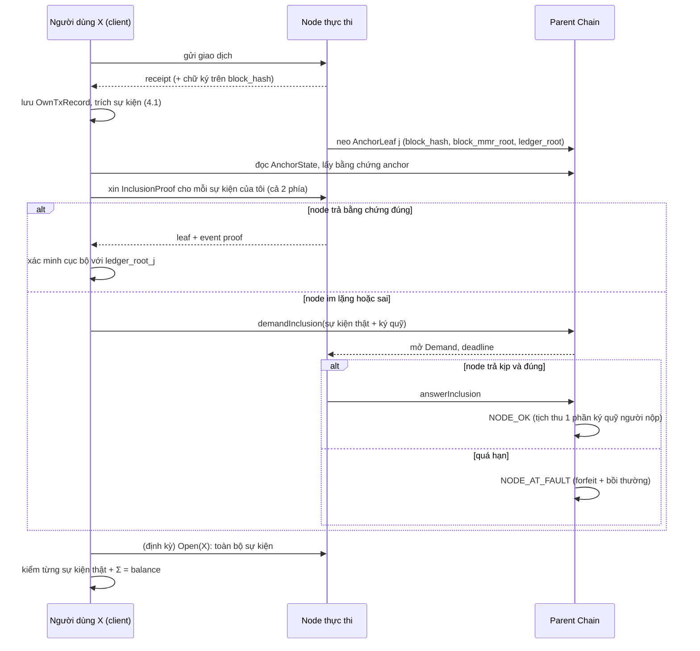

# Luồng chứng minh ERC20 chỉ dựa trên lịch sử của người dùng

> **Trạng thái:** DRAFT đặc tả (2026-09-25). Đây là **luồng chứng minh cụ thể** của thiết kế trong `SEQUENCER_FRAUD_PROOF_DESIGN.md` (đọc mục 2–5 ở đó trước), sau khi rà lại kỹ lần nữa (mục 2 của tài liệu này).
>
> **Phạm vi đúng của "chỉ dựa trên lịch sử người dùng":** người dùng `X` chỉ có **giao dịch mình gửi** (và bằng chứng thanh toán do người khác đưa). Cộng với **cam kết công khai của node trên Parent Chain** (anchor). Không watcher, không dữ liệu của bên thứ ba.
>
> **Quy ước:** **[XÁC MINH]** đã đối chiếu code · **[ĐỀ XUẤT]** thiết kế mới · **[CHƯA XÁC MINH]** phải kiểm tra trước khi làm.

---

> ✅ **ĐÃ CHỐT (2026-09-25): đường chính là chế độ giao dịch chuẩn có chữ ký — đặc tả đầy đủ và chuẩn ở `SEQUENCER_ERC20_STANDARD_TX_PROOF.md`** (mục 16 bên dưới là bản nháp; khi mâu thuẫn, tài liệu đó thắng). Các mục 0–15 là **chế độ tổng quát dựa trên log, chưa làm**.

## Đọc nhanh: quy trình chứng minh ERC20 (giải thích đơn giản)

**Hình dung:** node giữ một **sổ cái ERC20** ghi mọi khoản vào/ra của từng người, bắt đầu từ 0. Mỗi lần "chốt sổ", node **niêm phong** sổ cái đó rồi gửi **mã niêm phong (hash)** lên Parent Chain. Mã này không ai đọc được nội dung, nhưng **node không sửa được sổ sau khi đã niêm phong**. Parent Chain là **trọng tài**.

**Việc của ví (tự động), với mỗi giao dịch ERC20 của bạn:**
1. **Giữ biên lai** (receipt) của giao dịch. Biên lai cho biết ai chuyển cho ai bao nhiêu (trong log). Biên lai giả không được vì hash của nó nằm trong block đã niêm phong.
2. **Sau khi chốt sổ, hỏi 3 câu:**
   - **Câu 1 — "Khoản của tôi có trong sổ không?"** Ví xin node bằng chứng rằng khoản trong biên lai của bạn (và cả bên nhận) có trong sổ đã niêm phong.
   - **Câu 2 — "Trong sổ có khoản nào không có thật không?"** Ví xin node mở sổ của bạn, kiểm từng khoản có biên lai thật.
   - **Câu 3 — "Sổ có vô lý không?"** Cộng từ 0, số dư **không bao giờ được âm** và phải **bằng tổng các khoản**.
3. **Nếu cả 3 câu đều đạt:** không cần làm gì. Đó chính là **"chứng minh ERC20 đúng"**: số dư trong sổ = tổng các khoản có thật, từ 0, gồm mọi khoản bạn biết, và không bao giờ âm.
4. **Nếu node không trả lời hoặc trả lời sai:** ví nộp yêu cầu lên **Parent Chain**. Node có hạn phải chứng minh; **im lặng quá hạn là thua** (bị phạt ký quỹ, bạn được bồi thường). Không cần bên thứ ba nào giám sát.

**Ví dụ:** Alice có 1000. Alice chuyển 300 cho Bob → biên lai ghi "Alice → Bob, 300". Sau khi chốt sổ, ví Alice kiểm: sổ của Alice có "−300"? sổ của Bob có "+300"? Nếu node bỏ khoản "+300" khỏi sổ Bob, ví Alice yêu cầu node chứng minh; node không chứng minh được thì thua.

**Cái ví không biết được:** tiền do **người khác** gửi cho bạn mà không ai kiểm tra (chỉ bị phát hiện khi người gửi kiểm, hoặc khi bạn tiêu số tiền đó làm sổ bị âm). Phần đó được nói rõ ở mục 7.

---

## 0. Phạm vi (ghi chú bắt buộc): chỉ chứng minh khi số dư bắt đầu bằng 0

**Quy định:** luồng chứng minh này **chỉ áp dụng cho một cặp `(token T, holder X)` xét trên TOÀN BỘ lịch sử của nó, tính từ lúc số dư bằng 0** — tức từ **sự kiện đầu tiên** (`event #0`) của `X` đối với `T`. **Không có chứng minh theo đoạn, không có mốc baseline** ("số dư `V0` tại anchor cũ") và không có phát biểu kiểu "biến động giữa hai anchor".

**Hệ quả trực tiếp (đơn giản hoá):**

| Bỏ đi | Lý do |
|---|---|
| Baseline `S0`/`V0` và mọi lời khai số dư làm mốc | Số dư đầu luôn là **0 theo định nghĩa**, không cần tin lời khai nào. |
| Chứng minh theo đoạn `(B1, B2]` và "nối đoạn" (`SEQUENCER_ERC20_DISPUTE.md` mục 3.2.2, 11.3) | Chỉ còn một loại: lịch sử từ `event #0` tới anchor `j`. Việc chia yêu cầu thành nhiều lượt chỉ là **gộp lô** các kiểm tra độc lập, không có trạng thái xuyên lượt. |
| Cận dưới số dư (mục 8 cũ) | Đã bị thay bằng kiểm tra **tiền tố không âm** (P7 bên dưới), chặt hơn và không phụ thuộc hạn mức/`permit`. |

**Điều kiện đủ điều kiện (client đánh dấu `FROM_ZERO(T, X)`; không đủ ⇒ "không hỗ trợ chứng minh", không cố suy diễn):**
1. Token đã qua kiểm tra tuân thủ, **kể cả yêu cầu: mọi số dư ban đầu (mint, phân bổ genesis, pre-mine) đều được tạo bằng sự kiện `Transfer` từ `0x0`**. Token gán số dư ban đầu trong constructor/genesis mà **không** phát sự kiện ⇒ số dư "bắt đầu bằng 0" không đúng ⇒ **loại**.
2. **`event #0` của `X` là một khoản nhận** (`delta > 0`); ví chưa từng có sự kiện thì số dư là 0 và chưa có gì để chứng minh.
3. Client giữ **mọi giao dịch của `X`** (và bằng chứng thanh toán nhận được) **từ đầu**. Ví **nhập từ nơi khác đã có sẵn token** mà client không có lịch sử đầu ⇒ `FROM_ZERO = false` (không chứng minh được, hiển thị rõ cho người dùng).

**Chi phí:** vì chỉ có chứng minh toàn bộ lịch sử, việc **mở sổ** (mục 5.4) là O(số sự kiện của `X`) **ngoài chuỗi**; trên Parent Chain chỉ tốn khi có tranh chấp (từng lượt `demandOpen` ≤ `N_open` chỉ số, độc lập nhau).

### 0.1. Kiểm tra mới mà "bắt đầu từ 0" cho phép: **tiền tố không âm (P7)**

Vì số dư đầu là **đúng 0**, số dư **sau mỗi block** (tổng tích luỹ của mọi sự kiện tới hết block đó) phải **không bao giờ âm** với token chuẩn: trạng thái sau mỗi block là một trạng thái thật, và một chuyển/đốt thành công đòi hỏi đủ số dư. **Chỉ dùng thứ tự theo `block` (đã xác định, tuần tự); KHÔNG dùng thứ tự giao dịch trong block** — tổng biến động của một block **không phụ thuộc thứ tự thực thi bên trong block**, nên kiểm tra này **không thể báo oan** dù Block-STM thực thi song song hay Go sắp giao dịch theo hash. Do đó:

> **P7.** Trong sổ của `X`, **số dư tích luỹ tại mỗi ranh giới block đều ≥ 0**, và block có sự kiện đầu tiên có tổng biến động `> 0`.

**Vì sao mạnh:** nếu node **bỏ sót một khoản nhận** rồi sau đó có một **khoản chi thật của X** (giao dịch của chính X, đã có trong lịch sử của X và đã được ép có mặt bởi P2) thì số dư tích luỹ **tới hết block chứa khoản chi đó** **âm** (khi số dư thật cuối block nhỏ hơn khoản bị bỏ sót) ⇒ sổ của node **tự mâu thuẫn**: X **chứng minh được một mình**. Trước đây (có baseline) không kết luận được điều này. **Đánh đổi có chủ ý:** kiểm ở mức block bỏ qua số dư âm *tạm thời giữa hai giao dịch trong cùng block* (một thực thi hợp lệ cũng không bao giờ tạo ra), để đổi lấy **không phụ thuộc thứ tự trong block**.

**Cách cam kết và kiểm được (hai tầng):** với mỗi holder, sổ có **một lá cho mỗi block có sự kiện của holder đó** (không phải mỗi sự kiện):

```
BlockLeaf  { block, delta_sum (có dấu), event_count, block_events_root }
             block_events_root = gốc Merkle của các EventLeaf của holder trong block đó
             (sắp theo (txIndex, logIndex) CHỈ để đặt danh tính/khử trùng, không mang ý nghĩa thứ tự thực thi)

Cây các BlockLeaf (Merkle-sum-min), sắp tăng ngặt theo block:
  leaf:      sum = delta_sum;                minPrefix = delta_sum          (số dư tích luỹ hết block)
  internal:  sum = L.sum + R.sum;            minPrefix = min( L.minPrefix, L.sum + R.minPrefix )
  hash(nút trong) = H("BLKNODE_V1:" ‖ L.hash ‖ R.hash ‖ signed(sum) ‖ signed(minPrefix))
```

Ở **gốc** `events_root` phải có `minPrefix ≥ 0`, và `HolderLeaf.balance == events_root.sum`. Parent Chain kiểm được (trong `answerInclusion`/`answerOpen`):
- các trường `(sum, minPrefix)` dọc đường bằng chứng **nhất quán** với hai nút con (O(log n));
- `BlockLeaf.delta_sum == Σ delta` của các `EventLeaf` được mở trong block đó (khi mở block);
- **gốc có `minPrefix < 0` ⇒ tự thú lỗi** (sổ chứa một quá khứ bất khả thi) ⇒ `NODE_AT_FAULT` ngay khi bất kỳ lá nào của holder đó được xuất trình.

Bằng chứng một **sự kiện** thuộc sổ = bằng chứng `BlockLeaf ∈ events_root` (O(log số block có sự kiện)) + bằng chứng `EventLeaf ∈ block_events_root` (O(log số sự kiện trong block)).

**Phần dư sau P7:** chỉ còn **khoản nhận bị bỏ sót mà số tiền đó vẫn chưa bị chi** (còn nằm trong số dư): số dư trong sổ thấp hơn thực tế nhưng chưa có khoản chi nào của X "đi qua" nó. Ngay khi X chi vượt số dư trong sổ (dù số dư thật đủ, giao dịch vẫn thành công trên EVM), sổ trở nên **bất khả thi** và bị bắt bởi P7.

---

## 1. Người dùng chứng minh được gì (phát biểu chính xác)

Cho token ERC20 chuẩn `T` đã đăng ký, người dùng `X`, và một anchor `j` trên Parent Chain. Chỉ dùng lịch sử của `X`, `X` **chứng minh được** các điều sau (mỗi điều là **một loại báo cáo có phán quyết xác định**):

| Mã | Điều chứng minh | Nghĩa |
|---|---|---|
| **P1** | **Mỗi giao dịch của tôi đã vào block và có kết quả đúng như receipt** | Giao dịch `tx` nằm trong block `b`; `status = SUCCESS/FAILED`; các log ERC20 của nó là gì. (Chứng minh "tôi đã thực hiện input này và thành công".) |
| **P2** | **Mỗi sự kiện `Transfer` liên quan tôi mà tôi biết đều có trong sổ đã neo** (cả phía gửi và phía nhận) | Node **không thể bỏ sót** một sự kiện tôi nắm. |
| **P3** | **Mỗi sự kiện trong sổ của tôi đều là sự kiện thật** | Node **không thể bịa** sự kiện làm giảm/tăng số dư tôi. |
| **P4** | **Số dư trong sổ = tổng các sự kiện trong sổ** | Node **không thể cam kết** số dư mâu thuẫn với chính các sự kiện của nó. |
| **P5** | **Giao dịch `transfer` của tôi được thực thi đúng** (không thiếu/khác log) | Node **không thể** ghi thành công mà không chuyển đúng. |
| **P6** | **Lịch sử không bị viết lại/chia nhìn** | Node **không thể** đưa cho tôi một lịch sử rồi neo lịch sử khác. |
| **P7** | **Số dư chạy từ 0 không bao giờ âm** (mục 0.1) | Node **không thể** bỏ sót khoản nhận rồi để tôi chi tiếp mà sổ vẫn hợp lệ: sổ sẽ tự mâu thuẫn. |

Từ P2–P4 và P7 suy ra: **số dư trong sổ tại anchor `j` là tổng của các sự kiện thật, tính từ 0, gồm mọi sự kiện tôi biết, và không bao giờ âm** — đó là **"số dư của tôi tại anchor `j`" theo nghĩa chứng minh được** (chỉ khi `FROM_ZERO`, mục 0; mục 7 nêu phần dư còn lại).

**Không chứng minh được (nói thẳng, mục 7):** khoản nhận bị bỏ sót mà **chưa bị chi** và không ai (kể cả người gửi) kiểm tra; số dư *cao* hơn thực tế; lỗi EVM tự nhất quán với log; kiểm duyệt; **mọi trường hợp không bắt đầu từ số dư 0** (mục 0).

---

## 2. Đánh giá lại kỹ: sai sót của bản thiết kế trước và cách sửa

| Mã | Sai sót | Sửa trong tài liệu này |
|---|---|---|
| **R13** | Bản trước dùng **phép tính cận dưới** `L = V0 + Σnhận − Σchi − A`. Phép này phụ thuộc **hạn mức (`approve`)** và **`permit`** (chữ ký hạn mức ngoài chuỗi: người khác rút tiền của X bằng giao dịch **không nằm trong lịch sử của X**), nên có thể **kết tội oan** hoặc vô nghĩa. | Bỏ phép tính đối chiếu số học làm phương tiện chính. Kiểm theo **sự kiện** (P2–P4): không cần biết hạn mức, không cần giả định "không có permit". Cận dưới đã bị loại (mục 8); thay bằng P7 (mục 0.1). |
| **R14** | Dựa vào **lời khai nonce** để chứng minh "đây là mọi giao dịch của tôi" (cần bằng chứng state của tài khoản, **chưa có**). | Không cần: P2 chỉ đòi các sự kiện **tôi có** xuất hiện trong sổ. Việc tôi có giấu giao dịch của chính mình khi báo cáo được xử lý bằng **phản bác của node** (mục 5.5). |
| **R15** | Chưa nói rõ **sự kiện nằm sau anchor cuối** chứng minh thế nào. | Phải chờ anchor kế tiếp phủ block đó; quy tắc "hạn kiểm toán" ở mục 6. |
| **R16** | `HolderLeaf.balance == Σ events` **chỉ chứng minh nhất quán**, không chứng minh sự kiện **thật**. | Thêm P3 (`demandOpen`, mở và kiểm từng sự kiện với receipt + MMR). |
| **R17** | Không nêu cách chống **đếm trùng** một sự kiện và cách xác định danh tính sự kiện. | Danh tính `(block, txIndex, logIndex)`, **thứ tự tăng ngặt** trong cây, kiểm khi mở (mục 4.2). |
| **R18** | Quyền yêu cầu (`demand*`) **không có thời hạn** → node giữ dữ liệu vô hạn; hoặc ngược lại hết hạn khi người dùng offline. | Quyền kéo dài suốt **chân trời kiểm toán** = thời gian ký quỹ còn bị khoá (mục 6). Hạn phản hồi của node tính từ lúc người dùng nộp yêu cầu, không từ lúc neo. |
| **R19** | `ERC721` cũng phát `Transfer` cùng `topic0`. | Nhận diện ERC20 bằng **đúng 3 topic + `data` 32 byte** (mục 4.1); token đã đăng ký là ERC20. |
| **R20** | Chuyển cho chính mình và giao dịch có **nhiều log** chưa nêu. | Quy tắc cụ thể ở mục 4.1 và test T-UH-12..15. |
| **R21** | Sự kiện có **hai phía** nhưng người dùng chỉ kiểm phía mình. | Người **gửi** kiểm **cả hai** sổ (mục 5.2), vì người gửi mới là người chắc chắn có giao dịch. |
| **R22** | Còn **baseline** (`V0` tại anchor cũ) và chứng minh theo đoạn: dựa vào số dư mà chính node đã khai. | **Loại bỏ** theo ràng buộc "số dư bắt đầu bằng 0" (mục 0). |
| **R23** | Cây sự kiện chỉ có **tổng**, không bắt được quá khứ bất khả thi (số dư âm giữa chừng). | Cây **Merkle-sum-min theo block** và kiểm P7 ở ranh giới block (mục 0.1). |
| **R24** | P7 ở mức **sự kiện** phụ thuộc thứ tự thực thi trong block (Go sắp theo hash, Block-STM song song) → có thể báo oan. | Đổi sang **ranh giới block** (mục 0.1): không cần thứ tự trong block, không cần bắt node gửi danh sách hash/trạng thái lên Parent Chain (mục 12). |

---

## 3. Dữ liệu

### 3.1. Công khai (do node neo lên Parent Chain; tham chiếu `SEQUENCER_FRAUD_PROOF_DESIGN.md` mục 5.1–5.2)

- `AnchorState{anchors, anchors_root, last_block, signature}` trên Parent Chain.
- `AnchorLeaf j = {block_number, block_hash, block_mmr_root, ledger_root, tx_count_total}` ∈ MMR các anchor.
- **Sổ holder**: MPT khoá `keccak256(token ‖ holder)` → `HolderLeaf{balance, event_count, events_root}`.
- `events_root`: MMR **có tổng** của các `EventLeaf{block, txIndex, logIndex, delta_signed33, tx_hash}` của riêng holder đó.

### 3.2. Người dùng tự lưu **[ĐỀ XUẤT]** — chính xác các trường

```proto
// Một giao dịch của chính người dùng — lưu NGAY khi giao dịch xong.
message OwnTxRecord {
  uint32 schema_version   = 1;   // = 1
  uint64 chain_id         = 2;
  bytes  tx_bytes         = 3;   // giao dịch đã ký (pb.Transaction)
  bytes  tx_hash          = 4;   // 32 byte
  uint64 nonce            = 5;
  uint64 block_number     = 6;
  bytes  block_header     = 7;   // header preimage; keccak/hash của nó = block_hash
  bytes  block_hash       = 8;   // 32 byte
  uint32 tx_index         = 9;   // vị trí trong block (xác định: Go sắp tx theo hash sau dedup) [CHƯA XÁC MINH cách lấy từ bằng chứng]
  bytes  receipt_bytes    = 10;
  bytes  tx_proof         = 11;  // bằng chứng tx ∈ transactionsRoot
  bytes  receipt_proof    = 12;  // bằng chứng receipt ∈ receiptRoot
  bytes  block_mmr_proof  = 13;  // block_hash ∈ block_mmr_root của anchor `anchor_index`
  uint64 anchor_index     = 14;  // anchor đầu tiên phủ block này
  bytes  anchor_proof     = 15;  // anchor `anchor_index` ∈ anchors_root (tại thời điểm lưu)
  bytes  signed_response  = 16;  // (tuỳ chọn) chữ ký của node trên (chain, block_number, block_hash, tx_hash)
}

// Khoản tiền mình NHẬN do người khác gửi — chỉ khi người gửi đưa bằng chứng.
message ReceivedPaymentProof {
  uint32 schema_version = 1;
  bytes  tx_bytes = 2; bytes block_header = 3; bytes receipt_bytes = 4;
  bytes  tx_proof = 5; bytes receipt_proof = 6; bytes block_mmr_proof = 7;
  uint64 anchor_index = 8; bytes anchor_proof = 9;
}
```

Danh sách **sự kiện suy ra** từ `receipt_bytes` (mục 4.1) cũng được lưu để không phải giải mã lại.

### 3.3. Quy tắc lưu
- Lưu **ngay** lúc giao dịch có receipt; lấy `block_mmr_proof`/`anchor_proof` **ngay khi anchor phủ block** (node có thể ngừng phục vụ sau đó).
- Bằng chứng anchor cũ **nâng cấp được** dưới `anchors_root` mới bằng dữ liệu công khai của Parent Chain (mục 3.1), nên không hết hạn.

---

## 4. Định nghĩa chính xác

### 4.1. Trích sự kiện ERC20 từ receipt

Với mỗi log `L` (theo thứ tự trong receipt, `logIndex` = vị trí trong receipt) của một receipt có `status = SUCCESS`:

```
L là sự kiện ERC20 của token T  ⇔
    L.address == T                                   (T thuộc danh sách token đã đăng ký)
  ∧ L.topics[0] == 0xddf252ad1be2c89b69c2b068fc378daa952ba7f163c4a11628f55a4df523b3ef
                   (= keccak256("Transfer(address,address,uint256)"))
  ∧ len(L.topics) == 3                               (ERC721 có 4 topic ⇒ loại)
  ∧ len(L.data) == 32
  ∧ 12 byte đầu của topics[1] và topics[2] đều bằng 0

from  = address(topics[1]);  to = address(topics[2]);  value = uint256(data)
```

- Receipt `FAILED` **không** tạo sự kiện (không có tác động ERC20; chỉ nonce bị tiêu).
- **Tác động lên từng holder** (`h ≠ 0x0`):
  - `h == from` ⇒ `delta = −value`; `h == to` ⇒ `delta = +value`.
  - `from == to` (chuyển cho chính mình): **một** sự kiện của holder đó với `delta = 0`.
  - `from == 0x0` (mint) chỉ tác động `to`; `to == 0x0` (burn) chỉ tác động `from`.
- Nhiều log `Transfer` trong một giao dịch (token có phí, router): **mỗi log là một sự kiện riêng**, khác `logIndex`.

### 4.2. Danh tính, thứ tự và lá sự kiện

- **Khoá sự kiện** `key = (block, txIndex, logIndex)`; duy nhất trong sổ của mỗi holder; các block **tăng ngặt** trong `events_root`, còn `(txIndex, logIndex)` trong một block chỉ dùng để **đặt danh tính và khử trùng** (không mang ý nghĩa thứ tự thực thi). Hai lá cùng `key` là **lỗi** (đếm trùng).
- `EventLeaf.hash = keccak256("EVLEAF_V1:" ‖ be64(block) ‖ be32(txIndex) ‖ be32(logIndex) ‖ deltaSigned33 ‖ tx_hash)`; các `EventLeaf` của một block nằm dưới `BlockLeaf` (mục 0.1); cây các `BlockLeaf` là **Merkle-sum-min** mang `sum` và `minPrefix` có dấu.
- **Bất biến của lá holder:** `HolderLeaf.balance == events_root.sum`, `events_root.minPrefix ≥ 0` (P7, mức block), `BlockLeaf` đầu tiên có `delta_sum > 0`, và `event_count ≥ 1` khi `balance ≠ 0`.

### 4.3. Thông tin "của tôi" xác định thế nào

Sự kiện `e` là **"của tôi"** nếu:
(a) nó nằm trong receipt của **một giao dịch tôi gửi** (mọi log của receipt đó là dữ liệu của tôi, kể cả log do contract phát khi tôi swap), hoặc
(b) nó nằm trong một `ReceivedPaymentProof` tôi lưu.

Mọi sự kiện loại (a) cho tôi biết **chính xác** cả chi và nhận **trong giao dịch đó**. Tác động của giao dịch **người khác gửi** (nhận tiền, bị `transferFrom`) **không** nằm trong (a).

---

## 5. Luồng chứng minh đầy đủ

### 5.1. Giai đoạn 0 — thiết lập (một lần)
1. Chain và token đã **đăng ký** (qua kiểm tra tuân thủ sự kiện, `SEQUENCER_PARENT_ANCHORING.md` mục 3.2.1).
2. Khách hàng cấu hình: `chain_id`, địa chỉ Parent Chain, khoá công khai của node, danh sách token quan tâm.

### 5.2. Giai đoạn 1 — ghi nhận (mỗi giao dịch của tôi)

```
khi có receipt cho tx của tôi:
  1. Xác minh cục bộ: hash(block_header) == block_hash; tx ∈ transactionsRoot;
     receipt ∈ receiptRoot; ghi status.
  2. Trích sự kiện theo 4.1; lưu OwnTxRecord.
  3. Chờ anchor phủ block b (anchor_index j). Khi có:
       lấy block_mmr_proof + anchor_proof, lưu vào OwnTxRecord.
  4. Nếu phản hồi của node có chữ ký: lưu signed_response. Không có chữ ký: cảnh báo,
     P6 sẽ không áp dụng được cho giao dịch này.
```

### 5.3. Giai đoạn 2 — kiểm toán tại mỗi anchor `j`  (tự động)

Với mỗi `OwnTxRecord r` có `r.anchor_index ≤ j` và chưa kiểm ở anchor này:

**(a) P5 — thực thi đúng.** Nếu `tx.to == T` và calldata là `transfer(to, amt)` (selector `0xa9059cbb`, giải ABI chuẩn) và `status = SUCCESS`, thì receipt phải chứa **đúng một** sự kiện `Transfer(from = tx.from, to, value = amt)` (token không phí). Thiếu/khác ⇒ **`reportTxMismatch`** (mục 5.5b).

**(b) P2 — sự kiện của tôi có trong sổ, cả hai phía.** Với mỗi sự kiện `e` của `r` và mỗi holder `h ∈ {e.from, e.to} \ {0x0}`:
```
ask node: InclusionProof(anchor j, token, h, key(e))
xác minh cục bộ:
   HolderLeaf(token,h) ∈ ledger_root_j            (bằng chứng MPT)
   EventLeaf(key(e), delta_h(e), tx_hash) ∈ leaf.events_root   (bằng chứng MMR có tổng)
   leaf.balance == tổng(leaf.events_root)
nếu node không trả / bằng chứng sai:  file demandInclusion trên Parent Chain (5.5c)
```
(Người gửi kiểm **cả hai** sổ; người chỉ nhận tiền kiểm sổ của mình.)

**(c) P6 — không bị viết lại.** Nếu có `signed_response` cho block `b`: hash tại vị trí `b` trong `block_mmr_root_j` phải bằng `block_hash` đã ký. Khác ⇒ **`reportRewrite`** (5.5a).

**(d)** Đánh dấu `r` đã kiểm ở anchor `j`.

### 5.4. Giai đoạn 3 — mở sổ định kỳ (P3, P4)

```
mỗi chu kỳ kiểm toán (vd. hàng ngày/sau N anchor), cho mỗi token quan tâm:
  ask node: Open(anchor j, token, X)  -> toàn bộ EventLeaf của X + bằng chứng
  kiểm cục bộ, với MỖI sự kiện:
     block_hash ∈ block_mmr_root_j (bằng chứng MMR),  hash(header) khớp,
     receipt ∈ receiptRoot,  status = SUCCESS,  log tại logIndex thoả 4.1,
     holder X ∈ {from, to},  delta đúng dấu/giá trị,  key tăng ngặt (không trùng, không lùi)
  kiểm tổng:  Σ delta == HolderLeaf.balance  ∧  balance ≥ 0  ∧  số sự kiện == event_count
  kiểm P7:    số dư tích luỹ tại MỖI ranh giới block ≥ 0  ∧  block đầu có delta_sum > 0
              (không dùng thứ tự trong block; vi phạm P7 = sổ tự mâu thuẫn -> NODE_AT_FAULT, mục 5.5f)
              (vi phạm P7 = sổ tự mâu thuẫn -> báo cáo NODE_AT_FAULT, mục 5.5f)
  nếu có sự kiện KHÔNG chứng minh được / node không trả:  demandOpen (5.5d)
```
Sự kiện lạ (không có trong (a),(b)) nhưng **thật** là tiền vào/chi ra của người khác: bình thường, cập nhật hiểu biết của tôi. Sự kiện lạ **không thật** là **bịa** (P3).

### 5.5. Giai đoạn 4 — nộp báo cáo lên Parent Chain và phán quyết

Mọi mốc thời gian dùng **`blockTime` của Parent Chain**. Bằng chứng đi kèm luôn gồm chuỗi: `anchor ∈ anchors_root` → `block_hash ∈ block_mmr_root` → `header` → `receipt/tx`.

**(a) `reportRewrite`** — *đầu vào:* phản hồi ký của node `{chain, epoch, block_number, block_hash, …, signature}`; anchor `j` (`block_number ≤ anchor.block_number`); bằng chứng MMR cho vị trí `block_number` của `block_mmr_root_j` có hash `H' ≠ block_hash`. *Parent kiểm:* chữ ký hợp lệ với khoá của `ChainRegistry` tại `epoch`; bằng chứng MMR và anchor hợp lệ; `H' ≠ block_hash`. *Phán quyết:* **`NODE_AT_FAULT` ngay** (equivocation), forfeit ký quỹ, thưởng người báo.

**(b) `reportTxMismatch`** — *đầu vào:* `tx_bytes`, `receipt_bytes`, bằng chứng tx/receipt/MMR/anchor. *Parent kiểm:* toàn bộ bằng chứng; `tx.to ∈ token đăng ký`; calldata giải ra `transfer(to, amt)`; `status = SUCCESS`; đếm log 4.1 khớp `(from=tx.from, to, value=amt)`: **0 hoặc >1** ⇒ mismatch. *Phán quyết:* `NODE_AT_FAULT`. (Không cần chữ ký hay lời khai của node.)

**(c) `demandInclusion`** — *đầu vào:* chứng cứ sự kiện thật `e` (bằng chứng tx/receipt/MMR/anchor như trên), `token`, `holder`, anchor `j`, ký quỹ.
 1. Parent kiểm `e` là **thật**, thuộc `holder`, token đã đăng ký, block ≤ anchor `j`.
 2. Ghi `Demand{id, chain, j, token, holder, key(e), delta_h(e), deadline = blockTime + W_resp, bond}`.
 3. Node phải nộp trước `deadline`: `answerInclusion(id, leafProof, eventProof)`. Parent kiểm: `HolderLeaf ∈ ledger_root_j`; `EventLeaf(key, delta, tx_hash) ∈ events_root`; `balance == tổng(events_root)`.
 4. **Node trả đúng** ⇒ `NODE_OK`, ký quỹ người nộp bị tịch thu một phần (chống lạm dụng). **Sau `deadline` mà chưa có câu trả lời hợp lệ** (ai cũng gọi được `finalizeDemand`) ⇒ **`NODE_AT_FAULT`**.

**(d) `demandOpen`** — *đầu vào:* `token`, `holder = X`, anchor `j`, tập `indices` (hoặc toàn bộ), ký quỹ. Node phải nộp, với mỗi chỉ số, `EventLeaf` + bằng chứng sự kiện thật (MMR + receipt + log). Bất kỳ sự kiện **không chứng minh được** hoặc im lặng quá `deadline` ⇒ `NODE_AT_FAULT`; nộp đủ và đúng ⇒ `NODE_OK`. *Giới hạn kích thước:* mỗi lần tối đa `N_open` chỉ số; sổ dài chia nhiều yêu cầu.

**(f) `reportNegativePrefix`** — *đầu vào:* anchor `j`, `token`, `holder`, `HolderLeaf` + bằng chứng dưới `ledger_root_j`, và **đường bằng chứng Merkle-sum-min** tới nút/điểm mà `minPrefix < 0` (hoặc chính `events_root.minPrefix < 0`). *Parent kiểm:* bằng chứng hợp lệ, các trường `(sum, minPrefix)` nhất quán dọc đường, và giá trị âm. *Phán quyết:* **`NODE_AT_FAULT` ngay** (sổ chứa quá khứ bất khả thi: hoặc bỏ sót khoản nhận, hoặc bịa khoản chi). Không cần chữ ký hay lời khai. Người dùng thường tự gặp trường hợp này khi một khoản chi **thật** của mình (đã ép có mặt bằng `demandInclusion`) làm tổng tiền tố âm.

**(e) Phản bác của node cho báo cáo của người dùng.** Với `demandInclusion`/`demandOpen`/`reportTxMismatch`, node có thể **phản bác** bằng chứng của chính người dùng khi người dùng **giấu dữ liệu để kết tội oan** (ví dụ chỉ trình một phần lịch sử): node nộp thêm sự kiện **thật** nằm trong sổ đã cam kết làm thay đổi kết luận. Vì mọi thứ node nộp phải khớp `ledger_root_j` đã neo, node không thể bịa thêm để cứu mình.

### 5.6. Sơ đồ tổng



---

## 6. Thời hạn, ký quỹ và tham số

| Tham số | Ý nghĩa | Ràng buộc |
|---|---|---|
| `W_resp` | hạn node phản hồi một `demand*` (theo `blockTime` Parent) | > thời gian công bố dữ liệu hợp lý; chốt theo số đo |
| **Chân trời kiểm toán** `H_audit` | thời gian người dùng còn được nộp `demand*`/`report*` cho một anchor | **= `UnbondingPeriodSeconds`** của chain (sau đó ký quỹ có thể bị rút); phải ≥ `W_resp` + xử lý + 1 chu kỳ anchor |
| Ký quỹ người nộp | chống báo bừa | ≥ chi phí công bố dự kiến của node |
| `N_open` | số chỉ số tối đa mỗi `demandOpen` | chốt theo giới hạn Gateway (tx tuần tự) |
| Chu kỳ anchor | độ dày của neo | càng dày càng tốt; khoản lớn hoãn nhả tới hết cửa sổ (`FRAUD_PROOF_DESIGN` R12) |

**Quy tắc cho ứng dụng khách:** kiểm toán mỗi anchor **trước** khi `H_audit` của anchor đó hết (mặc định kiểm ngay và mở sổ theo chu kỳ ngắn hơn `H_audit` rất nhiều).

---

## 7. Ví dụ số (token `T`, người dùng `X`, giả sử không phí)

**Anchor 1:** sổ của X: `balance = 1000`, `events_root` tổng `1000` (3 sự kiện cũ).

**Giữa anchor 1 và 2, X có 3 giao dịch của mình:**
1. `transfer(Y, 300)` → sự kiện `E1 = Transfer(X→Y, 300)` (block 101).
2. `swap` qua router: trong receipt có `Transfer(X→Pool, 200)` và `Transfer(Pool→X, 50)` → `E2 (−200)`, `E3 (+50)` (block 105).
3. `approve(S, 100)`: không phải `Transfer`, không có sự kiện số dư.

**Người khác (không phải X) gửi:** Z chuyển cho X 100 (block 103, giao dịch của Z). Z đưa X bằng chứng thanh toán → X lưu `E4 = Transfer(Z→X, 100)`.

**Sổ đúng phải có cho X tại anchor 2:** `E1(−300), E4(+100), E2(−200), E3(+50)` (sắp theo `(block, txIndex, logIndex)`), `balance = 1000 − 300 + 100 − 200 + 50 = 650`.

| Kịch bản của node | X phát hiện thế nào | Kết quả |
|---|---|---|
| Neo đúng `balance = 650`, đủ 4 sự kiện | kiểm (b): cả 4 có trong sổ; mở sổ: đều thật, `Σ = 650` | không có báo cáo |
| **Bỏ sót `E4`** (Z→X 100), `balance = 550` | (b) cho `E4`: không có bằng chứng → `demandInclusion` | node không trả kịp → **`NODE_AT_FAULT`** |
| **Bỏ sót `E1`** (X→Y 300) khỏi sổ X, `balance = 950` | (b) cho `E1` phía X → `demandInclusion` (dù có lợi cho X, sổ vẫn sai; và sổ **Y** thiếu `+300` mà **X kiểm cả hai phía**) | `NODE_AT_FAULT` |
| **Bịa sự kiện** `Transfer(X→W, 400)` (ẩn trong sổ), `balance = 250` | mở sổ (mục 5.4): sự kiện không có receipt/log thật → `demandOpen` | node không chứng minh được → `NODE_AT_FAULT` |
| Ghi `balance = 600` nhưng các sự kiện cộng ra `650` | kiểm nhất quán ở (b)/mở sổ: `balance ≠ Σ` | phát hiện ngay lúc xuất trình → `NODE_AT_FAULT` |
| Receipt của tx1 có log `Transfer(X→Y, 250)` thay vì `300` | (a) P5: calldata `transfer(Y,300)` mà log 250 → `reportTxMismatch` | `NODE_AT_FAULT` |
| Node ký "block 101 hash = H" cho X, nhưng anchor chứa H′ tại 101 | (c) P6 → `reportRewrite` | `NODE_AT_FAULT` ngay |
| **Bỏ sót một khoản Z→X mà Z không đưa bằng chứng cho X** | **X không biết** | **không phát hiện bởi X** (phần dư, dưới đây) |

**Phần dư còn lại (không chứng minh được bởi X):** khoản tiền vào X **không biết**. Nó được phát hiện **nếu** (i) người gửi (Z) tự kiểm (client của Z kiểm sự kiện của Z có trong **cả hai** sổ, mục 5.3(b)), **hoặc** (ii) X **đã chi** số tiền đó (P7: chi vượt số dư trong sổ ⇒ tiền tố âm). **Chỉ khi** Z không kiểm **và** khoản nhận bị bỏ sót vẫn nằm yên chưa bị chi thì gian lận đó không để lại dấu vết cho ai.

**Chi phí điển hình** mỗi sự kiện kiểm: một bằng chứng MPT + một bằng chứng MMR có tổng (mỗi cái O(log n), cỡ vài trăm byte đến ~2 KB) — **ngoài chuỗi**; trên Parent Chain chỉ tốn khi có tranh chấp.

---

## 8. Cận dưới số dư — ĐÃ LOẠI BỎ

Phát biểu kiểu "số dư trong sổ ≥ số dư tại anchor trước + tiền vào tôi biết − tiền chi tôi biết" **không dùng nữa**: nó cần baseline (bị loại theo mục 0) và vô nghĩa khi có hạn mức/`permit` (R13). Thay bằng **P7 (tiền tố không âm)**, chặt hơn và **không** phụ thuộc hạn mức, `permit`, hay số dư đã khai trước đó.

---

## 9. Điều kiện để luồng này đúng

1. Token **ERC20 chuẩn**, phát `Transfer` cho **mọi** thay đổi số dư (đã qua kiểm tra tuân thủ). Token rebasing / có hàm quản trị làm giảm số dư / `Transfer` không đầy đủ: **không hỗ trợ**.
2. Sổ holder do node dựng **xác định** từ receipt; mọi replica đối chiếu `ledger_root` (chống lỗi, không chống gian lận của operator).
3. `txIndex` và `logIndex` **xác định và chứng minh được** trong receipt trie **[CHƯA XÁC MINH — F0]**.
4. Node **ký** phản hồi mang `block_hash` (chỉ cần cho P6).
5. Ứng dụng khách **thực sự chạy** giai đoạn 2–3; nếu không, mọi bảo vệ không hoạt động.
6. **Thứ tự thực thi bên trong block KHÔNG được dùng:** P7 chỉ xét số dư tích luỹ ở ranh giới block (mục 0.1), nên không phụ thuộc việc Go sắp giao dịch theo hash hay cách Block-STM tuần tự hoá. (`txIndex`/`logIndex` vẫn cần **xác định và chứng minh được** để làm danh tính sự kiện — điều 3.)
7. **Số dư ban đầu chỉ được tạo bằng sự kiện `Transfer` từ `0x0`** (mục 0). Token vi phạm bị loại khi đăng ký.
8. **`FROM_ZERO(T, X)`** đúng (mục 0); nếu không, client **không** phát biểu và **không** nộp báo cáo dựa trên sổ của cặp đó.

---

## 10. Test (`T-UH-*`, bổ sung vào `SEQUENCER_SCHEMAS_AND_TEST_PLAN.md` mục 2.3)

| ID | Test | Đạt khi |
|---|---|---|
| T-UH-01 | Trích sự kiện theo 4.1 từ receipt thật | đúng `from/to/value`, đúng số sự kiện |
| T-UH-02 | Log `Transfer` của ERC721 (4 topic) | bị loại |
| T-UH-03 | Log có 12 byte đầu của topic khác 0 / `data` ≠ 32 byte | bị loại |
| T-UH-04 | Receipt `FAILED` | không tạo sự kiện |
| T-UH-05 | Sổ đúng, đủ mọi sự kiện | mọi bước kiểm (a)–(d) và mở sổ đều qua |
| T-UH-06 | **Bỏ sót sự kiện của X** (phía gửi, phía nhận, cả hai) | `demandInclusion` → `NODE_AT_FAULT` sau `W_resp` |
| T-UH-07 | Node trả đúng sau khi bị yêu cầu | `NODE_OK`, ký quỹ người nộp bị phạt một phần |
| T-UH-08 | **Bịa sự kiện** trong sổ | `demandOpen` → `NODE_AT_FAULT` |
| T-UH-09 | `balance ≠ Σ events_root` | phát hiện ngay lúc xuất trình |
| T-UH-10 | `reportTxMismatch`: `transfer` thành công nhưng thiếu log / khác `to`/`value` / hai log | phát hiện (0 hoặc >1) |
| T-UH-11 | `reportRewrite`: chữ ký node trên `H`, MMR có `H′` | `NODE_AT_FAULT` |
| T-UH-12 | Chuyển cho chính mình | 1 sự kiện `delta = 0`; đếm đúng; không đếm hai lần |
| T-UH-13 | Giao dịch có nhiều log `Transfer` (token có phí, router) | mỗi log một sự kiện, đúng `logIndex` |
| T-UH-14 | Mint (`from = 0x0`) và burn (`to = 0x0`) | chỉ tác động holder ≠ `0x0` |
| T-UH-15 | Hai lá cùng `key` / `key` không tăng ngặt | từ chối |
| T-UH-16 | Sự kiện của X nằm **sau** anchor cuối | không thể nộp `demandInclusion` cho anchor đó; nộp được khi anchor kế tiếp phủ |
| T-UH-17 | Sau `H_audit` (ký quỹ đã rút) | báo cáo cho anchor cũ bị từ chối (ghi rõ trong tài liệu người dùng) |
| T-UH-18 | Người dùng **giấu** một giao dịch chi của chính mình để kết tội oan | node phản bác bằng sự kiện thật trong sổ đã cam kết; báo cáo bị bác, ký quỹ bị phạt |
| T-UH-19 | Bằng chứng người dùng lưu ở anchor cũ | nâng cấp được dưới `anchors_root` mới; kiểm được |
| T-UH-20 | Node ngừng phục vụ hoàn toàn | mọi `demand*` thắng theo `blockTime`; bằng chứng đã lưu vẫn dùng được cho P1, P5, P6 |
| T-UH-21 | Mọi mốc thời gian | chỉ phụ thuộc `blockTime` Parent Chain |
| T-UH-22 | `demandOpen` vượt `N_open` | từ chối, yêu cầu chia đợt |
| T-UH-23 | Client tự động chạy giai đoạn 2–3 trong kịch bản đối kháng (bỏ sót, bịa, đổi hash, đổi tổng) | phát hiện mọi bất nhất; không báo oan khi node đúng |
| T-UH-24 | Người gửi kiểm hai sổ; người nhận không biết gì; node bỏ sót phía người nhận | phát hiện bởi client người gửi |
| T-UH-25 | Node từ chối ký phản hồi | P6 không áp dụng; P1–P5 vẫn hoạt động (ghi rõ) |
| T-UH-26 | **P7:** bỏ sót một khoản nhận rồi có khoản chi thật của X | số dư tích luỹ hết block chứa khoản chi âm ⇒ `reportNegativePrefix` → `NODE_AT_FAULT` |
| T-UH-27 | Sự kiện đầu của holder có `delta ≤ 0` | sổ bị từ chối (bất khả thi) |
| T-UH-28 | Cây Merkle-sum-min: nút trong có `(sum, minPrefix)` sai so với hai nút con | phát hiện bằng bằng chứng O(log n) |
| T-UH-29 | Gốc `events_root.minPrefix < 0` | tự thú lỗi, `NODE_AT_FAULT` ngay khi xuất trình bất kỳ lá nào |
| T-UH-30 | Khoản nhận bị bỏ sót **chưa bị chi** và người gửi không kiểm | **không** bị phát hiện (ghi rõ là phần dư, không phải lỗi test) |
| T-UH-31 | Chứng minh theo đoạn / có baseline | bị **từ chối** (chỉ có chứng minh toàn bộ lịch sử từ 0) |
| T-UH-32 | Token có số dư ban đầu không phát sự kiện | job tuân thủ loại; `FROM_ZERO` sai |
| T-UH-33 | Ví nhập có sẵn token, client thiếu lịch sử đầu | `FROM_ZERO = false`; client không phát biểu, không nộp báo cáo |
| T-UH-34 | **Đảo/đổi thứ tự thực thi giao dịch trong một block** (giả lập Block-STM khác thứ tự sắp theo hash) | P7 **không** báo oan: kết quả kiểm giống hệt (chỉ phụ thuộc tổng biến động của block) |
| T-UH-35 | Tiền tố không âm ở mọi điểm trên sổ đúng có chuyển cho chính mình, mint, burn, nhiều log | không báo oan |

---

## 11. Quyết định cần bạn xác nhận

| Quyết định | Đề xuất |
|---|---|
| Luồng chính là **kiểm toán theo sự kiện** (P1–P6), **không** dùng phép tính cận dưới làm căn cứ kết tội | Đồng ý (sửa R13) |
| Người gửi kiểm **cả hai sổ** (gửi và nhận) là bắt buộc của client | Đồng ý |
| **Chân trời kiểm toán = thời gian unbonding**; sau đó không nộp được | Đồng ý; số cụ thể sau |
| Node có **quyền phản bác** báo cáo bằng sự kiện thật trong sổ đã cam kết | Đồng ý |
| Chấp nhận **phần dư**: tiền vào mà cả người nhận lẫn người gửi đều không kiểm thì không phát hiện | Cần bạn xác nhận |
| Chỉ ERC20 chuẩn đầy đủ sự kiện | Đồng ý |
| **Chỉ chứng minh khi số dư bắt đầu bằng 0** (toàn bộ lịch sử từ `event #0`, không baseline, không theo đoạn) — **đã ghi ở mục 0** | Đã ghi theo yêu cầu |
| Dùng cây **Merkle-sum-min theo block** và kiểm **P7 ở mức ranh giới block** (không dùng thứ tự trong block) | Đồng ý; bỏ điều kiện tiên quyết về thứ tự thực thi |

---

## 12. Có nên bắt node gửi danh sách hash giao dịch + trạng thái thành công/thất bại lên Parent Chain?

**Kết luận: Không cần, và không nên.** Lý do:

1. **Trạng thái thành công/thất bại đã được cam kết rồi.** Mỗi receipt mang `status`; `receiptRoot` nằm trong header; header nằm dưới `block_hash` ∈ `block_mmr_root` ∈ `anchors_root` trên Parent Chain. Người dùng chứng minh "giao dịch của tôi thành công/thất bại" bằng **bằng chứng receipt + MMR** (P1), không cần danh sách riêng.
2. **Danh sách hash + trạng thái không chứng minh được biến động ERC20.** Trạng thái chỉ nói "thành công" chứ không nói **số lượng và người nhận**: với lời gọi qua router/DEX, token có phí, hoặc `transferFrom`, số tiền thật chỉ nằm trong **log** của receipt. Chỉ với `transfer(to, amt)` trực tiếp trên token chuẩn thì "thành công" + calldata mới đủ; đó là trường hợp hẹp.
3. **Nó không giải quyết tính đầy đủ.** Danh sách theo block không đánh chỉ mục theo holder, nên vẫn **không** cho biết người dùng có thiếu giao dịch (nhất là **tiền vào của người khác**) hay không. Vẫn cần sổ holder đã neo.
4. **Chi phí on-chain quá lớn:** ~33 byte mỗi giao dịch; ở vài nghìn giao dịch/giây là hàng chục KB/giây dữ liệu lên Parent Chain — trái mục tiêu **lưu trữ tối thiểu**.
5. **Nó cũng không cần để bỏ phụ thuộc thứ tự thực thi.** Điều bạn lo (P7 phụ thuộc thứ tự trong block) được giải quyết gọn hơn bằng cách **kiểm P7 ở ranh giới block** (mục 0.1, R24): tổng biến động của cả block không phụ thuộc thứ tự thực thi bên trong.

**Khi nào danh sách (hash, trạng thái) mới hữu ích:** chỉ khi muốn kiểm nhanh trạng thái mà **không** giải mã receipt (ví dụ một hợp đồng tích hợp trên Parent Chain cần "giao dịch T thành công?" rẻ). Trường hợp đó dùng đúng bằng chứng receipt (cỡ vài trăm byte, xác minh O(log n)); nếu sau này cần đường rẻ hơn thì thêm `statusRoot` **do node dựng ngoài đường xử lý block** (gốc Merkle của `(txHash, status)` mỗi block, neo trong `AnchorLeaf`) — vẫn **không** đưa từng hash lên chuỗi. Chưa cần cho phạm vi hiện tại.

---

## 13. Quyền riêng tư: người ngoài không thấy lịch sử cho tới khi người dùng báo cáo  **[ĐỀ XUẤT]**

### 13.1. Yêu cầu và định nghĩa

**Yêu cầu:** cho tới khi **chính người dùng** nộp báo cáo, **người ngoài không được thấy lịch sử giao dịch của họ** (giao dịch, người gửi/nhận, số lượng, số dư). Khi báo cáo, chỉ **phần cần thiết cho phán quyết** bị lộ.

**"Người ngoài"** = bất kỳ ai không phải chính người dùng và không phải operator: người đọc Parent Chain, người gọi RPC công khai, người dùng khác, kiểm toán viên (nếu có). **Operator thấy tất cả** (mô hình custodial, `SEQUENCER_DESIGN.md` mục 2.3) — ngoài phạm vi.

### 13.2. Hiện trạng: lịch sử đang **công khai hoàn toàn**  **[XÁC MINH]**

Các RPC đọc của `simple_chain` **không có kiểm soát truy cập**: `GetTransactionByHash`, `GetTransactionReceipt`, `GetLogs`, `GetBlockByNumber`, `GetBalance`, `Call` (`cmd/simple_chain/rpc_transaction.go`, `rpc_block.go`, `rpc_state.go`), thêm chế độ explorer (`is_explorer`, `app.go:205`). Nghĩa là **ai cũng đọc được toàn bộ lịch sử** qua RPC. Vì vậy yêu cầu này **không tự có**: cần thêm **cổng đọc** (điểm móc **H7**, mặc định-tắt, mục 13.4).

### 13.2a. Receipt có lộ ai chuyển cho ai bao nhiêu không?  **[XÁC MINH]**

**Receipt không chứa calldata** (`pkg/proto/receipt.proto`: `TransactionHash, FromAddress, ToAddress, Amount, Status, Return, Exception, GasUsed, GasFee, EventLogs, TransactionIndex, ProcessingType, RHash, GroupIndex`). **Calldata nằm trong giao dịch**, không nằm trong receipt.

**Nhưng receipt vẫn lộ đầy đủ "ai → ai, bao nhiêu" qua `EventLogs`:** log `Transfer(from, to, value)` của ERC20 có `Address` = contract token, `Topics[1]` = người gửi, `Topics[2]` = người nhận, `Data` = số lượng. Vì vậy:

| Dữ liệu | Lộ gì |
|---|---|
| **Receipt** (`FromAddress`, `ToAddress` = contract token, `EventLogs`) | **người gửi, người nhận, số lượng ERC20**, cả khi không có calldata |
| **Giao dịch** (calldata) | tên hàm, tham số do người dùng gửi (`transfer(to, amt)`) |
| **`GetLogs`** | cùng các log trên, không cần biết giao dịch |

**Hệ quả bắt buộc cho thiết kế:**
1. **Cổng đọc H7 phải gate cả receipt và `GetLogs`**, không chỉ giao dịch. Ẩn giao dịch mà để lộ receipt/log thì lịch sử vẫn lộ.
2. **Sổ ERC20 dựng từ log của receipt**, không từ calldata: nên mọi thứ dùng để chứng minh (sự kiện, số lượng, đối tác) **đều nằm trong receipt**.
3. **Báo cáo lộ cả giao dịch lẫn receipt:** `reportTxMismatch` cần calldata (để đối chiếu với log) và log; `demandInclusion` cần receipt và log của sự kiện tranh chấp (bảng 13.6).
4. Lọc theo người tham gia (13.4) phải xét **cả `FromAddress` và các địa chỉ trong `Topics` của log**, không chỉ `from`/`to` của giao dịch.

### 13.3. Cái gì công khai, cái gì không

| Nơi | Công khai (ai cũng thấy) | Không lộ |
|---|---|---|
| **Parent Chain (anchor)** | `block_number`, `block_hash`, `block_mmr_root`, `ledger_root`, chữ ký; (`tx_count_total` — **nên bỏ** hoặc làm tròn) | giao dịch, người gửi/nhận, số lượng, số dư: chỉ có **hash** |
| **RPC của node** (sau khi thêm cổng đọc) | tối thiểu: tồn tại block và số block | tx, **receipt (tự nó lộ người gửi/nhận/số lượng qua log, mục 13.2a)**, log, header đầy đủ (có `logsBloom` và danh sách hash giao dịch), số dư/`eth_call`, đăng ký sự kiện (`logs`, `pendingTransactions`) |
| **Kênh bằng chứng node → người dùng** | chỉ phục vụ **người tham gia** sự kiện, sau khi xác thực | mọi thứ khác |

`logsBloom` trong header cho phép **dò**: kẻ tấn công thử địa chỉ `X` để biết `X` *có thể* có log trong block. Vì vậy **header đầy đủ chỉ cấp cho người tham gia giao dịch trong block đó** (họ nhận kèm giao dịch của mình).

### 13.4. Cổng đọc **H7** (mặc định-tắt, cấu hình `privacy_mode`)

- **Xác thực:** người dùng ký một **thách thức** (nonce do node cấp, dùng một lần, có hạn) bằng **khoá tài khoản** của mình; node suy ra địa chỉ. **[CHƯA XÁC MINH]** loại khoá/định dạng chữ ký dùng chung được với các tài khoản hiện có (ECDSA/BLS).
- **Phạm vi được đọc:** chỉ các bản ghi mà địa chỉ đó là **`from`, `to`, hoặc một `topic` (địa chỉ) trong log** của receipt. `GetLogs`/đăng ký sự kiện được **lọc** theo cùng quy tắc; `GetBalance`/`Call` chỉ cho **chính địa chỉ đó**.
- **Chế độ explorer tắt** khi bật `privacy_mode`.
- **Tác động lên code cũ:** chạm các RPC đọc ở trên và lớp WebSocket đăng ký; phải chạy phân tích ảnh hưởng (`codegraph_impact`/`grep`) và chứng minh **mặc định-tắt** (T-OFF-*) như H1–H6.

### 13.5. Bằng chứng bao gồm **không lộ số dư của người khác**

Vấn đề: bằng chứng "sự kiện `E` có trong sổ của Bob" (do **Alice** kiểm phía Bob, mục 5.3(b)) nếu chứa `HolderLeaf.balance` và các `sum` của cây sẽ **lộ số dư của Bob** cho Alice và (nếu lên chuỗi) cho mọi người.

**Sửa (đổi so với mục 0.1 và `SEQUENCER_FRAUD_PROOF_DESIGN.md` mục 5.2):** mỗi `HolderLeaf` cam kết **hai cây tách biệt**:

```proto
message HolderLeaf {
  uint32 schema_version   = 1;   // = 2
  bytes  incl_root        = 2;   // Merkle THƯỜNG của hash các EventLeaf (chỉ hash, KHÔNG có sum/count)
  bytes  sum_root_hash    = 3;   // = H("SUMROOT_V1:" ‖ sumRootHash ‖ signed(sum) ‖ signed(minPrefix) ‖ be64(event_count))
                                 //   (cây Merkle-sum-min theo block của mục 0.1; sum, minPrefix, event_count nằm TRONG hash, không lộ)
}
// hash lá lưu trong ledger MPT: H("HLEAF_V2:" ‖ incl_root ‖ sum_root_hash)
```

| Kiểm tra | Cần lộ gì | Ai được nộp |
|---|---|---|
| **P2** sự kiện có trong sổ (`demandInclusion`) | đường MPT → `HolderLeaf`, `sum_root_hash` (**không mở**), đường Merkle thường trong `incl_root` | người tham gia sự kiện (gửi hoặc nhận) |
| **P3** sự kiện là thật (`demandOpen`) | mở `EventLeaf` + bằng chứng block/receipt | **chỉ chính holder** |
| **P4/P7** số dư = Σ, tiền tố không âm (`reportNegativePrefix`) | mở `sum_root_hash` (`sum`, `minPrefix`, `event_count`) + đường Merkle-sum-min | **chỉ chính holder** |

Nhờ vậy bằng chứng **P2 không chứa số dư, số sự kiện hay tổng** của người nhận; số dư chỉ lộ khi **chính chủ** yêu cầu (`demandOpen`, P4, P7). `sum_root_hash` che `sum`/`minPrefix` vì nằm trong hash cùng `sumRootHash` (phụ thuộc toàn bộ cây sự kiện nên không thể dò ngược bằng vét cạn giá trị nhỏ).

**Ràng buộc kiểm trên Parent Chain:** `demandOpen`, `reportNegativePrefix` yêu cầu **chữ ký của holder** trên yêu cầu (chống người khác ép lộ lịch sử của bạn).

### 13.6. Cái gì lộ khi báo cáo (và tối thiểu hoá)

| Báo cáo | Lộ ra công khai trên Parent Chain | Tối thiểu hoá |
|---|---|---|
| `reportTxMismatch` | giao dịch của người báo (`from`, `to`, calldata) **và receipt (log: người gửi, người nhận, số lượng)**, header của block | chỉ **một** giao dịch bị tranh chấp |
| `reportRewrite` | `block_hash`, `tx_hash` trong phản hồi ký, bằng chứng MMR | không chứa nội dung giao dịch |
| `demandInclusion` | **một** sự kiện (bên gửi/nhận/số lượng, lấy từ log của receipt) + receipt liên quan + header/bằng chứng của block chứa nó | không lộ số dư, số sự kiện, sự kiện khác |
| `demandOpen` | **các sự kiện được yêu cầu** của holder (chỉ số chọn) | chọn **mẫu chỉ số** thay vì mở toàn bộ khi chỉ nghi ngờ một khoản |
| `reportNegativePrefix` | `sum`/`minPrefix`/`event_count` dọc đường vi phạm; sự kiện gây âm | chỉ đường bằng chứng tới điểm vi phạm |

**Không tránh được:** header preimage (gồm `logsBloom`, gốc, `timestamp`) phải lộ để Parent Chain tính lại hash block. Và **dữ liệu đã lên chuỗi tồn tại vĩnh viễn** — ứng dụng phải **cảnh báo** người dùng trước khi nộp; nên dùng **địa chỉ riêng cho mục đích cần bảo mật**. Che dữ liệu mà vẫn xác minh được cần bằng chứng không tiết lộ (ZK): **ngoài phạm vi**.

### 13.7. Trước khi báo cáo: người ngoài làm được gì

| Hành vi của người ngoài | Kết quả |
|---|---|
| Gọi RPC đọc giao dịch/receipt/log/số dư của người khác | **Bị từ chối** (cổng đọc H7) |
| Đọc Parent Chain | Chỉ thấy hash và gốc; **không** truy ngược được địa chỉ hay số tiền |
| Đoán `(token, holder)` rồi xin node bằng chứng | Bị từ chối (cần chữ ký người tham gia) |
| Thử vét cạn thành viên trong `ledger_root` | Không có bằng chứng nào để kiểm; hash vô hướng |
| Suy ra từ **thời điểm và nhịp anchor**, số block | Lộ **mức hoạt động tổng** của chuỗi (không lộ theo người dùng); chấp nhận |
| Quan sát `tx_count_total` | Lộ tổng số giao dịch — **bỏ trường này** khỏi anchor (hoặc làm tròn) |

**Hạn chế:** giao dịch chuyển giá trị **giữa các chain** (`NodeFloatAccount`, `Transfer` trên Parent Chain, `SEQUENCER_DESIGN.md` mục 3) là **công khai theo bản chất** trên Parent Chain; nằm ngoài phạm vi của tài liệu này.

### 13.8. Xung đột với các phần khác

- **Kiểm toán viên độc lập** (`SEQUENCER_FRAUD_PROOF_DESIGN.md` mục 5.8) cần dữ liệu đầy đủ → **mâu thuẫn** với yêu cầu người ngoài không thấy lịch sử. Với `privacy_mode`, kiểm toán viên chỉ **tuỳ chọn và theo sự đồng ý của từng người dùng** (người dùng tự cấp dữ liệu), không mặc định.
- **Người gửi kiểm hai sổ** vẫn dùng được (bằng chứng P2 không lộ số dư người nhận, mục 13.5).
- **Bằng chứng thanh toán** người gửi đưa người nhận là kênh **riêng giữa hai bên**, không lên chuỗi trừ khi tranh chấp.

### 13.9. Test (`T-PV-*`)

| ID | Test | Đạt khi |
|---|---|---|
| T-PV-01 | Với `privacy_mode`, người **không tham gia** gọi từng RPC đọc (`GetTransactionByHash/Receipt`, `GetLogs`, `GetBlockByNumber` đầy đủ, `GetBalance`, `Call`, đăng ký sự kiện) | tất cả bị từ chối; không rò trong thông báo lỗi |
| T-PV-13 | **Receipt của giao dịch ERC20 không có calldata** nhưng người ngoài gọi `GetTransactionReceipt`/`GetLogs` | vẫn **bị từ chối** (receipt/log tự lộ người gửi, người nhận, số lượng) |
| T-PV-14 | Người là `to` hoặc `topic` trong log (không phải người gửi giao dịch) đọc receipt của giao dịch đó | được đọc **chỉ log liên quan mình**; không thấy log/giao dịch của người khác trong cùng block |
| T-PV-02 | Người **tham gia** (from/to/topic) gọi cùng các RPC | chỉ nhận bản ghi của mình; log lọc đúng |
| T-PV-03 | Thách thức chữ ký: dùng lại nonce, nonce hết hạn, chữ ký của người khác | từ chối |
| T-PV-04 | Bằng chứng P2 (`demandInclusion`) | **không chứa** `balance`, `sum`, `minPrefix`, `event_count` (kiểm bằng phân tích cấu trúc bằng chứng) |
| T-PV-05 | `demandOpen`/`reportNegativePrefix` do người **không phải holder** nộp | từ chối (thiếu chữ ký holder) |
| T-PV-06 | Calldata của từng loại báo cáo | chỉ chứa các trường ở bảng 13.6 (snapshot test) |
| T-PV-07 | `sum_root_hash` | không tính ngược được `sum` từ `incl_root` và giá trị nhỏ (kiểm không có đường dò) |
| T-PV-08 | Anchor | không chứa `tx_count_total` (hoặc đã làm tròn theo cấu hình) |
| T-PV-09 | `privacy_mode` tắt | mọi RPC hành xử **y như cũ** (T-OFF-*) |
| T-PV-10 | Chế độ explorer bật cùng `privacy_mode` | khởi động từ chối (cấu hình mâu thuẫn) |
| T-PV-11 | Kênh bằng chứng node → người dùng | chỉ trả cho người tham gia sự kiện |
| T-PV-12 | Đo kênh phụ: độ trễ/kích thước phản hồi khi hỏi bản ghi có/không thuộc mình | không phân biệt được (không lộ tồn tại bản ghi của người khác) |

### 13.10. Quyết định và điểm chưa xác minh

| Mục | Ghi chú |
|---|---|
| Thêm **H7 (cổng đọc, `privacy_mode`)** vào code cũ | Cần bạn duyệt vì sửa các RPC đọc; mặc định-tắt |
| Loại khoá/chữ ký xác thực dùng chung với tài khoản hiện có | **[CHƯA XÁC MINH]** |
| `HolderLeaf` v2 hai gốc (`incl_root` + `sum_root_hash`) thay cho một `events_root` | Đồng ý; cập nhật schema |
| Bỏ `tx_count_total` khỏi anchor | Đồng ý |
| Header đầy đủ chỉ cấp cho người tham gia | Đồng ý |
| Kiểm toán viên chỉ tuỳ chọn theo sự đồng ý người dùng | Đồng ý |
| Chấp nhận: dữ liệu đã lên chuỗi tồn tại vĩnh viễn; ZK ngoài phạm vi | Cần bạn xác nhận |

---

## 14. Chế độ kiểm toán block  **[ĐỀ XUẤT — có nhiều điều kiện chưa xác minh]**

### 14.1. Mục đích và phạm vi

Khi sổ của một holder mâu thuẫn hoặc bị nghi ngờ **ở một block cụ thể `b`**, giải quyết **không cần tin sổ do node dựng**, chỉ dựa vào **`receiptRoot` trong header** đã neo (qua `block_hash` ∈ `block_mmr_root` ∈ `anchors_root`). Mỗi lần kiểm toán **một block**; block do người dùng chỉ định (từ đường vi phạm P7 ở mục 5.5(f), hoặc block chứa sự kiện mà `demandInclusion` bị bác). Người yêu cầu phải là **chính holder** (chữ ký) và đặt ký quỹ.

### 14.2. Hai sự thật về code quyết định chế độ này chứng minh được gì  **[XÁC MINH]**

| Sự thật | Hệ quả |
|---|---|
| `logsBloom` = bloom kiểu Ethereum 2048 bit, thêm **mọi `Address` và mọi `Topic`** của log (`pkg/receipt/receipt.go:CreateLogsBloom`) | Có thể kiểm **"X không có log nào trong block `b`"** mà **không lộ gì**: nếu **một** trong 3 vị trí bit của topic địa chỉ `X` (đệm trái 32 byte) chưa bật thì chắc chắn `X` không có sự kiện. **Nhưng** với block nhiều log, bloom **bão hoà** nên thường **không kết luận được**. |
| Trie receipt **khoá theo hash giao dịch**, giá trị là bytes receipt (`Receipts.GetReceipt(hash)`, `trie.NewStateTrie(...)`) | **Không có** chỉ số liên tiếp `0..N−1`; tính đầy đủ của block phải dựa vào **tính lại gốc** từ tập `(khoá, giá trị)`. Có làm được **chỉ với hash** hay cần **nội dung** phụ thuộc cách trie băm lá: **[CHƯA XÁC MINH — F0]**. |

Ước lượng lý thuyết xác suất bloom **dương tính giả** cho một địa chỉ (3 bit/mục, 2048 bit; **chưa đo trên chuỗi thật**): ~100 mục ≈ 0,3%; ~500 mục ≈ 14%; ~1000 mục ≈ 45%; ~2000 mục ≈ 85%. Block càng nhiều log, mức 0 càng ít giá trị.

### 14.3. Ba mức, tăng dần mức lộ dữ liệu

| Mức | Cách làm | Chứng minh | Lộ gì | Điều kiện |
|---|---|---|---|---|
| **0 — Bloom** | Parent lấy `logsBloom` từ header (đã có trong bằng chứng header); kiểm 3 bit của `X` | Nếu có bit **chưa bật** ⇒ `X` **không có** sự kiện trong `b` ⇒ `BlockLeaf(X, b)` phải **không tồn tại**; nếu sổ vẫn có ⇒ **`NODE_AT_FAULT`** (sổ bịa block) chỉ với header | **Không lộ gì** thêm | Luôn dùng được; **bão hoà ⇒ không kết luận** |
| **1 — Danh sách khoá receipt (chỉ hash)** | Node nộp danh sách `(tx_hash, hash giá trị)` đã sắp; Parent tính lại gốc và so `receiptRoot` | **Tập giao dịch của block đầy đủ** (đếm `N_b`, không thiếu, không thừa) | hash giao dịch của block, `N_b` (không lộ nội dung) | **Chỉ khi F0 xác nhận** lá của trie cam kết bằng hash giá trị; **không** cho biết receipt nào liên quan `X` |
| **2 — Mở toàn bộ nội dung** | Node nộp **mọi receipt** của block theo thứ tự khoá; Parent tính lại `receiptRoot` (Merkle **streaming**, trạng thái O(log N)), trích **mọi log `Transfer`** của token đã đăng ký, tính `delta_X` | **Kết luận tuyệt đối cho block `b`**: `delta_X` thật và tập sự kiện của `X` trong `b` so với `BlockLeaf(X,b)` (`delta_sum`, `event_count`, `block_events_root`); mọi sự kiện bỏ sót/bịa trong block đó đều bị lộ | **Nội dung mọi receipt của block ⇒ người gửi/nhận/số lượng của MỌI người** | **Chỉ khi `privacy_mode` tắt** (dữ liệu vốn đã công khai). Trong `privacy_mode`: **tắt**, mục 14.4 |

**Luồng chọn mức:** luôn thử **mức 0** (không tốn, không lộ). Không kết luận được ⇒ nếu `privacy_mode` tắt thì mức 2 (mức 1 chỉ thêm nếu F0 cho phép và cần cố định `N_b`); nếu `privacy_mode` bật thì **không có mức nào** trả lời chắc về tính đầy đủ trong block — quay về **P2 (người gửi kiểm hai sổ)** và P7.

### 14.4. Trong `privacy_mode`: giới hạn thẳng thắn

Bằng chứng **đầy đủ tuyệt đối** cho một block đòi **lộ nội dung mọi receipt** của block (log của người khác), **mâu thuẫn** với yêu cầu "người ngoài không thấy lịch sử" (mục 13). Vì header **không** cam kết chỉ mục theo holder, **không có cách** chứng minh "block `b` không còn sự kiện nào khác của `X`" mà không lộ dữ liệu của người khác, **trừ khi** dùng bằng chứng không tiết lộ (ZK, ngoài phạm vi). Do đó trong `privacy_mode`:
- mức 2 **bị tắt**; chế độ kiểm toán block chỉ còn **mức 0** (và mức 1 nếu F0 cho phép);
- tính đầy đủ trong block dựa vào **P2 + kiểm hai sổ + P7**, như đã mô tả.

Đây là **đánh đổi chọn lựa** giữa quyền riêng tư và bằng chứng đầy đủ; cần bạn xác nhận (mục 14.8).

### 14.5. Giao thức, phán quyết, thời hạn

1. `openBlockAudit(anchor j, block b, token, holder, level)` — chữ ký holder + ký quỹ; Parent kiểm header `b` ∈ MMR, ghi `Audit{id, b, holder, level, deadline = blockTime + W_audit}`.
2. **Mức 0:** phán quyết **ngay** (chỉ cần header): bit chưa bật + sổ có `BlockLeaf(X,b)` ⇒ `NODE_AT_FAULT`; ngược lại `INCONCLUSIVE` (không phạt ai, hoàn ký quỹ).
3. **Mức 2 (`privacy_mode` tắt):** node nộp receipt theo lô (mỗi lô ≤ `N_audit_chunk`), Parent giữ **ngăn xếp Merkle streaming** (O(log N) trạng thái) và tổng `delta_X` chạy; sau lô cuối: gốc tính lại **phải bằng** `receiptRoot`, và `delta_X`/tập sự kiện **phải khớp** `BlockLeaf(X,b)`.
4. **Kết quả:** khớp ⇒ `NODE_OK` (ký quỹ người yêu cầu bị phạt một phần); lệch, gốc sai, thiếu receipt, hoặc **im lặng quá `W_audit`** ⇒ `NODE_AT_FAULT`.
5. Giới hạn: `N_b ≤ N_audit_max`; block lớn hơn không kiểm toán được bằng mức 2 (ghi rõ trong tài liệu người dùng).

### 14.6. Test (`T-BA-*`)

| ID | Test | Đạt khi |
|---|---|---|
| T-BA-01 | **Bloom không có âm tính giả:** với block thật/ngẫu nhiên có log của `X`, 3 bit của `X` luôn bật | không bao giờ kết luận "không có sự kiện" sai |
| T-BA-02 | Sổ có `BlockLeaf(X,b)` nhưng bloom chưa bật bit của `X` | mức 0 ⇒ `NODE_AT_FAULT` chỉ với header |
| T-BA-03 | Bloom bão hoà (block nhiều log) | `INCONCLUSIVE`, không phạt oan |
| T-BA-04 | Tính vị trí bit khớp cách `CreateLogsBloom` thêm `Address`/`Topic` (địa chỉ đệm trái 32 byte) | trùng với bloom thật của Go |
| T-BA-05 | Mức 2: sổ đúng | `NODE_OK` |
| T-BA-06 | Mức 2: sổ **bỏ sót** một sự kiện của `X` trong block | phát hiện (lệch `delta_sum`/`event_count`) |
| T-BA-07 | Mức 2: sổ **bịa** một sự kiện | phát hiện |
| T-BA-08 | Mức 2: node giấu một receipt | gốc tính lại ≠ `receiptRoot` ⇒ `NODE_AT_FAULT` |
| T-BA-09 | Mức 2 nộp theo lô | kết quả **giống hệt** nộp một lần; lô thiếu/thừa/đổi thứ tự bị từ chối |
| T-BA-10 | `N_b > N_audit_max` | từ chối rõ ràng |
| T-BA-11 | `privacy_mode` bật, yêu cầu mức 2 | bị từ chối; chỉ mức 0 hoạt động |
| T-BA-12 | Người không phải holder yêu cầu kiểm toán | từ chối (thiếu chữ ký holder) |
| T-BA-13 | Node im lặng quá `W_audit` | `NODE_AT_FAULT` theo `blockTime` Parent Chain |
| T-BA-14 | Mức 1 (nếu F0 cho phép) | tính lại gốc từ `(khoá, hash giá trị)` khớp `receiptRoot`; sửa 1 bit ⇒ từ chối |

### 14.7. Chưa xác minh

| Điểm | Cách xác minh |
|---|---|
| Cấu trúc trie receipt (`NewStateTrie(..., true)`): lá băm giá trị hay nhúng giá trị; định dạng bằng chứng; có tính lại gốc streaming được không | đọc `pkg/trie` (F0) |
| Độ dài bloom, hàm băm chọn bit trong `eth_types.Bloom` và tái hiện trong Go trên Parent Chain | đọc `eth_types.Bloom.Add` |
| Tỉ lệ bão hoà bloom **thực tế** theo số log/block của chuỗi | đo trên dữ liệu thật |
| Chi phí xác minh mức 2 trong handler Gateway (giao dịch tuần tự, blob `GatewayEngine`) | benchmark; quyết định `N_audit_chunk`, `N_audit_max` |

### 14.8. Quyết định cần bạn xác nhận

| Quyết định | Đề xuất |
|---|---|
| Kiểm toán block **mức 0 (bloom)** luôn bật | Đồng ý |
| **Mức 2** chỉ khi `privacy_mode` tắt; trong `privacy_mode` chấp nhận **không có bằng chứng đầy đủ tuyệt đối** trong block | Cần bạn xác nhận (đánh đổi riêng tư ↔ đầy đủ) |
| Mức 1 chỉ làm nếu F0 cho phép | Đồng ý |

---

## 15. Đánh giá ý tưởng "giao dịch có chữ ký + root giao dịch chính xác ⇒ biết số dư chính xác"

### 15.1. Ý tưởng

Người dùng nộp **đầy đủ các giao dịch thành công, có chữ ký**; node xác nhận đủ/đúng, hoặc chỉ ra thiếu/sai; đảm bảo **`transactionsRoot` chính xác**. Khi root giao dịch chính xác thì từ lịch sử giao dịch suy ra **số dư chính xác**, và như vậy là đủ chứng minh.

### 15.2. Đánh giá: đúng ở đâu, thiếu ở đâu

| # | Nhận định | Kết quả |
|---|---|---|
| 1 | **Chữ ký giao dịch chống bịa:** node không thể tạo một giao dịch hợp lệ thay người dùng (không có khoá) | **Đúng và mạnh.** Giao dịch có trường `Sign` (`pkg/proto/transaction.proto`); receipt thì do node tạo, giao dịch thì do người dùng ký. Ý này **được dùng** (mục 15.4). |
| 2 | **Tính lại `transactionsRoot` từ tập giao dịch chứng minh tập đó đầy đủ** cho một block | **Đúng** — là cách chắc chắn duy nhất chứng minh không thiếu giao dịch trong block. Nhưng đòi **mọi giao dịch của block** (cả người khác), tức lộ dữ liệu của mọi người và tốn O(block). Chính là **kiểm toán block mức 1/2** (mục 14). |
| 3 | **"Người dùng nộp đầy đủ giao dịch"** | **Người dùng chỉ có giao dịch của mình.** Số dư còn phụ thuộc giao dịch **của người khác** (tiền vào, `transferFrom`, mint). Danh sách của riêng X không đủ. |
| 4 | **"Root giao dịch chính xác ⇒ đủ lịch sử"** | Chỉ đúng nếu root chính xác **cho MỌI block từ lúc bắt đầu** (từ số dư 0): dữ liệu O(toàn bộ chuỗi) và lộ **mọi giao dịch của mọi người**. Không khả thi và mâu thuẫn quyền riêng tư (mục 13). |
| 5 | **Giao dịch cho biết tác động ERC20** | Chỉ với **lời gọi trực tiếp trên token chuẩn** (`transfer`, `transferFrom`, mint/burn đã đăng ký ABI). Với router/DEX, gọi qua contract khác, token có phí, **số tiền thật nằm trong log của receipt**, không đọc được từ giao dịch. |
| 6 | **"Biết số dư chính xác từ lịch sử giao dịch"** | Đúng theo nghĩa **tái thực thi xác định** toàn bộ giao dịch từ genesis (đủ thứ tự, đủ engine EVM + logic gốc + Gateway): đây là **Hướng D (phát lại)** ở `SEQUENCER_DESIGN.md` mục 15.4 — chính xác tuyệt đối nhưng nặng, và lộ toàn bộ lịch sử. |
| 7 | **"Node xác nhận đúng đủ, hoặc chỉ ra thiếu sai"** | Lời xác nhận của node **không kiểm chứng được**. Phải là kết quả **xác định từ bằng chứng** (tính lại root khớp header đã neo, phần node đưa thêm phải kèm bằng chứng thật); node im lặng quá hạn thì thua. |

**Kết luận:** ý tưởng **đúng về nguyên lý** (root giao dịch + chữ ký + tái thực thi ⇒ số dư chính xác) nhưng **không đủ khi chỉ có lịch sử của một người dùng**, và **đắt cùng lộ dữ liệu** nếu đòi tập giao dịch đầy đủ. Vì vậy thiết kế giữ **sổ holder đã cam kết trước + kiểm hai sổ + P7** thay vì tái thực thi/tập giao dịch đầy đủ, và giữ ý "root giao dịch chính xác" ở dạng **kiểm toán block** cho vài block nghi ngờ.

### 15.3. Khi nào ý tưởng này **đủ**

Nếu chấp nhận **cả hai** điều kiện sau thì "root giao dịch chính xác ⇒ số dư chính xác" đứng vững:
1. **Toàn bộ giao dịch của chuỗi công khai** (không `privacy_mode`), và có dịch vụ lưu trữ cung cấp chúng kèm bằng chứng root;
2. Token **chỉ được dùng qua lời gọi trực tiếp chuẩn** (để tác động đọc được từ giao dịch), **hoặc** có bộ **tái thực thi** đúng.

Khi đó số dư = cộng các tác động **từ 0** (tại thời điểm root giao dịch của mọi block đã được xác minh), không cần sổ holder. Đây là phương án **chính xác nhất nhưng đắt nhất**, không nằm trong lộ trình hiện tại.

### 15.4. Phần dùng được ngay: **chữ ký làm bằng chứng chống bịa (P3+)**

Bổ sung vào **P3** (mọi sự kiện trong sổ đều thật):

> **P3+.** Mỗi sự kiện **chi** của `X` mà **do chính giao dịch của `X`** gây ra (`tx.from == X`) phải có **giao dịch đã ký** của `X` ∈ `transactionsRoot` của block đó; Parent Chain **kiểm chữ ký** bằng khoá của `X`.

**Ý nghĩa:** node **không thể bịa một khoản chi cho `X`** (kể cả khi viết lại cả receipt lẫn header), vì không có chữ ký của `X`. Khoản chi qua người được cấp hạn mức (`transferFrom`) do **giao dịch của người tiêu** gây ra; chúng phải khớp một `approve` đã ký của `X` (hoặc `permit`, chưa hỗ trợ).

**Loại báo cáo mới `reportInvalidSignature`:** một giao dịch nằm trong `transactionsRoot` đã neo nhưng **chữ ký không hợp lệ** với `FromAddress` ⇒ node đã đưa vào một giao dịch không được uỷ quyền ⇒ `NODE_AT_FAULT`. Người nộp: bất kỳ ai có giao dịch đó (thường là người bị hại). *Bằng chứng:* `tx_bytes` (có `Sign`) + bằng chứng giao dịch ∈ `transactionsRoot` ∈ header ∈ MMR ∈ anchor; Parent tự kiểm chữ ký.

**Lưu ý về xác minh chữ ký ở node:** chữ ký giao dịch được xác minh khi vào mempool, **nhưng có thể bị bỏ qua** bằng biến môi trường `SKIP_MEMPOOL_SIG_VERIFY=true` (`pkg/blockchain/tx_processor/validation.go:153`); script điều phối chỉ bật khi đặt rõ `MTN_SKIP_MEMPOOL_SIG_VERIFY=true` (`mtn-orchestrator.sh`, theo issue #103). Trạng thái ở các template deploy khác **[CHƯA XÁC MINH]**. Nếu một cụm chạy với cờ này bật thì chuỗi **không tự bảo vệ** khỏi giao dịch ký sai; khi đó P3+ và `reportInvalidSignature` là lớp bảo vệ **trên Parent Chain**, không thay cho việc tắt cờ.

### 15.5. Test (`T-SG-*`)

| ID | Test | Đạt khi |
|---|---|---|
| T-SG-01 | Sổ có khoản chi của `X` mà **không có giao dịch ký bởi `X`** trong `transactionsRoot` | P3+ ⇒ `NODE_AT_FAULT` |
| T-SG-02 | Khoản chi có giao dịch của `X` với chữ ký hợp lệ | qua |
| T-SG-03 | Chữ ký bị sửa 1 bit / ký bằng khoá khác | `reportInvalidSignature` ⇒ `NODE_AT_FAULT` |
| T-SG-04 | Chi qua `transferFrom` của người tiêu, có `approve` đã ký của `X` | qua |
| T-SG-05 | Chi qua `transferFrom` **không** có `approve` tương ứng | phát hiện |
| T-SG-06 | Node bịa cả receipt và header để tạo khoản chi cho `X` | không có chữ ký của `X` ⇒ bị bắt (P3+) |
| T-SG-07 | Cụm chạy với `SKIP_MEMPOOL_SIG_VERIFY=true` và có giao dịch ký sai | Parent Chain vẫn bắt bằng `reportInvalidSignature` |
| T-SG-08 | Bằng chứng giao dịch cho `X` không lộ giao dịch khác trong block | chỉ đường bằng chứng, không lộ nội dung người khác (kiểm cấu trúc) |

### 15.6. Chưa xác minh

| Điểm | Cách xác minh |
|---|---|
| Sơ đồ chữ ký của giao dịch (ECDSA/BLS/khoá thiết bị) và cách xác minh lại trong Go trên Parent Chain | đọc `pkg/transaction`, `validation.go` |
| `tx_bytes` bao gồm `Sign` và tái tạo đúng `tx_hash` | đọc `pkg/transaction` |
| Cách bằng chứng giao dịch ∈ `transactionsRoot` (trie khoá theo hash) | F0 |
| Trạng thái `SKIP_MEMPOOL_SIG_VERIFY` trên các template deploy | đọc `deploy/` |

### 15.7. Quyết định

| Quyết định | Đề xuất |
|---|---|
| **Không** chọn "tập giao dịch đầy đủ + tái thực thi" làm đường chính (đắt, lộ dữ liệu); giữ làm **Hướng D tuỳ chọn** khi không dùng `privacy_mode` | Đồng ý |
| Thêm **P3+** (khoản chi của `X` phải có chữ ký của `X`) và **`reportInvalidSignature`** | Đồng ý; cần F0 và xác minh chữ ký |

---

## 16. Chế độ giao dịch chuẩn (giả định A1–A3): phiên bản đơn giản, đầy đủ và đúng

> Bổ sung theo chỉ đạo (2026-09-25). Thay thế đường bằng chứng dựa trên **log/sổ sự kiện** (mục 5, 13, 14) **khi cả ba giả định sau được chấp nhận**. Các mục 0–15 vẫn là chế độ **tổng quát** (không cần A1–A3).

### 16.1. Ba giả định

| # | Giả định | Ý nghĩa |
|---|---|---|
| **A1** | **Người dùng thu thập được mọi giao dịch của người khác gửi cho mình** (tiền vào), cộng mọi giao dịch của chính mình (tiền ra) | Lịch sử của `X` là **tập đầy đủ `H_X`** các giao dịch có chữ ký ảnh hưởng số dư `X` của token `T`. |
| **A2** | **Kiểm toán root chỉ ở mức block**, và node chỉ cung cấp **tập hash giao dịch** của block (không nội dung) | Không cần lộ giao dịch của người khác. |
| **A3** | **Chỉ chứng minh khi mọi giao dịch ảnh hưởng token là giao dịch chuẩn** | Bỏ qua router/DEX/multicall, token có phí, rebasing, hook, blacklist… |

**"Giao dịch chuẩn" nghĩa chính xác:** giao dịch **gọi trực tiếp** (không qua contract khác) tới đúng địa chỉ token `T` đã đăng ký, `value = 0`, calldata thuộc tập ABI chuẩn: `transfer(address,uint256)` (`0xa9059cbb`), `transferFrom(address,address,uint256)` (`0x23b872dd`), và `approve(address,uint256)` (`0x095ea7b3`, không đổi số dư nhưng cần cho `transferFrom`); `mint`/`burn` chỉ nếu bộ mô tả token định nghĩa. Token phải **không phí, không rebasing, không hook, không quản trị làm giảm số dư** (đã qua kiểm tra tuân thủ). Với giao dịch chuẩn **tác động lên số dư đọc được từ calldata + trạng thái thành công/thất bại**, không cần log.

### 16.2. Điều cần chứng minh và quy tắc tính

Với mỗi giao dịch `t ∈ H_X` (người dùng giữ `tx_bytes` **có chữ ký**, `block`, `status`):
```
nếu status = SUCCESS:
   transfer(to, amt):            sender −= amt;  to += amt                 (sender = tx.from)
   transferFrom(from, to, amt):  from   −= amt;  to += amt
   approve(...):                 không đổi số dư
nếu status = FAILED:           không tác động
B_calc(X, đến block b) = Σ tác động lên X của mọi t ∈ H_X có block ≤ b, bắt đầu từ 0
```
So với **số dư node đã cam kết** cho `X` (sổ đã neo: `BlockLeaf(X, b)`/`HolderLeaf.balance`, mục 0.1 và 13.5).

**Phát biểu chính xác:** *dưới A1–A3*, `B_calc` **bằng số dư thật** của `X`. Mâu thuẫn giữa `B_calc` và số dư node cam kết ⇒ **node sai**.

### 16.3. Quy trình

**Bước 1 — người dùng (client) thu thập và tự kiểm cục bộ.** Với mỗi giao dịch `t ∈ H_X`: giữ `tx_bytes` (có `Sign`), kiểm chữ ký; lấy từ node `status` và **hai bằng chứng**: `t ∈ transactionsRoot` và receipt(t) ∈ `receiptRoot` (chỉ cần `status`), cùng header và bằng chứng MMR/anchor. Giao dịch của **người khác gửi cho mình**: người trả đưa lại `tx_bytes` (chính là "bằng chứng thanh toán", A1).

**Bước 2 — đối chiếu theo block để khoanh vùng.** Client tính `delta_b(X)` = tổng tác động của `H_X` trong từng block `b`, so với `BlockLeaf(X, b).delta_sum` mà node mở riêng cho `X` (kênh riêng, mục 13). Tìm **block đầu tiên `b*` lệch** (chia đôi trên cây Merkle-sum-min theo block, O(log n)). Không lệch ⇒ **xong: số dư đúng** (dưới A1–A3).

**Bước 3 — báo cáo lên Parent Chain chỉ cho block `b*`** (`reportBalanceMismatch`). Người dùng nộp:
- các giao dịch của `X` trong `b*` (`tx_bytes` có chữ ký + bằng chứng `t ∈ transactionsRoot` + bằng chứng receipt cho `status`) + đường Merkle-sum-min tới `BlockLeaf(X, b*)`;
- chữ ký holder + ký quỹ.

Parent Chain kiểm: (a) header `b*` ∈ MMR ∈ anchor; (b) **chữ ký từng giao dịch** hợp lệ theo `FromAddress`; (c) `t ∈ transactionsRoot` và `status` từ receipt ∈ `receiptRoot`; (d) `t` là **giao dịch chuẩn** (16.1); (e) tính `delta_{b*}(X)`; (f) so `BlockLeaf(X, b*).delta_sum`.

**Bước 4 — node phản bác trong `W_resp`.** Node chỉ có thể làm hai việc, cả hai **kiểm chứng được**:
- **Nộp thêm một giao dịch thật ảnh hưởng `X` trong `b*`** mà người dùng thiếu (chữ ký hợp lệ, ∈ `transactionsRoot`, status): làm thay đổi `delta` ⇒ nếu giờ khớp thì **báo cáo bị bác** (A1 của người dùng không thoả), ký quỹ người dùng bị phạt một phần.
- **Nộp một giao dịch KHÔNG chuẩn** (receipt của nó có log `Transfer` liên quan `X` nhưng không phải lời gọi trực tiếp chuẩn) ⇒ **A3 bị vi phạm** ở block này ⇒ báo cáo **vô hiệu** (không phạt ai, hoàn ký quỹ), và **cặp `(token, X)` bị đánh dấu ngoài phạm vi** kể từ block đó.

**Bước 5 — phán quyết (theo `blockTime` Parent Chain).**
| Tình huống | Kết quả |
|---|---|
| Node **không phản bác** đúng hạn và `delta` lệch | `NODE_AT_FAULT` (forfeit ký quỹ, bồi thường) |
| Node nộp thêm giao dịch thật làm khớp | báo cáo bị bác, ký quỹ người dùng bị phạt một phần |
| Node chứng minh giao dịch không chuẩn | báo cáo vô hiệu, hoàn ký quỹ, đánh dấu ngoài phạm vi |
| `delta` khớp ngay | báo cáo bị bác |

### 16.4. Vì sao đúng (soundness) và đầy đủ (completeness) dưới A1–A3

- **Node không bịa được giao dịch** (cả nộp thêm lẫn trong sổ): mọi giao dịch phải có **chữ ký hợp lệ của người gửi** và nằm trong `transactionsRoot` đã neo.
- **Node giấu tiền vào của `X`:** `X` (theo A1) giữ giao dịch đó ⇒ `delta` lệch ⇒ node không phản bác được (không thể nộp thứ gì làm sổ của nó khớp) ⇒ thua.
- **Node bịa tiền vào/chi ra trong sổ:** không có giao dịch ký hợp lệ nào ủng hộ ⇒ node không phản bác được ⇒ thua.
- **Người dùng giấu giao dịch chi của mình để kết tội oan:** node nộp giao dịch đó (có chữ ký của `X`) ⇒ báo cáo bị bác.
- **Không cần lộ giao dịch của người khác** ngoài các giao dịch **ảnh hưởng `X`** trong đúng block `b*`.

### 16.5. Vai trò của "tập hash giao dịch của block" (A2)

Dưới A1, người dùng đã giữ đủ giao dịch, nên tập hash **không cần** để tính số dư. Nó chỉ dùng để **kiểm toán tính đúng của root** ở block `b*` khi cần (ví dụ node phản bác rằng "block `b*` có giao dịch mà bạn thiếu" hoặc nghi ngờ header):
- Node nộp **danh sách hash giao dịch đã sắp** của `b*`; Parent tính lại và so `transactionsRoot` ⇒ **tập giao dịch của block đầy đủ** (đếm `N_b`, không thừa, không thiếu).
- **Không lộ nội dung**, chỉ hash.
- **Điều kiện:** `transactionsRoot` phải cam kết lá bằng hash giao dịch để tính lại chỉ từ danh sách hash — **[CHƯA XÁC MINH — F0]** (`TransactionStateDB` khoá theo hash giao dịch; cần biết cách băm lá).
- Hash không cho biết giao dịch nào ảnh hưởng `X`; vì vậy nó **chứng minh tập, không chứng minh phần liên quan `X`** — phần đó dựa vào A1 và cơ chế phản bác ở Bước 4.

### 16.6. Giới hạn của chế độ này

1. **A1 là giả định về người dùng**, không kiểm chứng được. Nếu vi phạm (thiếu một khoản tiền vào), **bảo vệ yếu đi nhưng node không lợi dụng được** (node phản bác bằng giao dịch thật). Người dùng chỉ **mất bảo vệ cho phần thiếu**.
2. **A3 không tự đảm bảo** trên chuỗi: bất kỳ ai cũng gọi token qua router. Điều này chỉ **phát hiện được lúc tranh chấp** (Bước 4). Ở phạm vi triển khai cần **chính sách hệ sinh thái**: chỉ dùng lời gọi trực tiếp với token thuộc phạm vi.
3. **Success/fail** là lời của node (receipt trong header đã neo). Chỉ bắt được **success bất khả thi** (số dư âm ở ranh giới block, P7 mức block); **failure sai** (node từ chối một giao dịch hợp lệ) **không chứng minh được** nếu không tái thực thi.
4. **Chi phí:** khoanh vùng theo block nên trên Parent Chain chỉ tốn O(giao dịch của `X` trong một block) + O(log n) bằng chứng; ngoài chuỗi client tính O(|H_X|).
5. **Riêng tư:** bằng chứng lộ các giao dịch ảnh hưởng `X` trong `b*` (kể cả **giao dịch người khác gửi cho `X`**: địa chỉ người gửi, số lượng), và **calldata** đầy đủ; không lộ giao dịch khác trong block. Cổng đọc H7 vẫn bắt buộc (mục 13).

### 16.7. Test (`T-SD-*`)

| ID | Test | Đạt khi |
|---|---|---|
| T-SD-01 | `H_X` đầy đủ, node cam kết đúng | mọi block khớp; không báo cáo |
| T-SD-02 | Node **giấu một khoản tiền vào** của `X` (`X` có giao dịch đó) | `b*` lệch ⇒ node không phản bác được ⇒ `NODE_AT_FAULT` |
| T-SD-03 | Node **bịa** khoản tiền vào/chi ra trong sổ | không có giao dịch ký hợp lệ ⇒ `NODE_AT_FAULT` |
| T-SD-04 | Người dùng **giấu một giao dịch chi** để kết tội oan | node nộp giao dịch (chữ ký `X`) ⇒ báo cáo bị bác, ký quỹ bị phạt |
| T-SD-05 | Người dùng thiếu một khoản **tiền vào thật** (A1 vi phạm) và node không cam kết sai | node nộp giao dịch thật ⇒ khớp ⇒ bị bác (không phạt node) |
| T-SD-06 | Trong `b*` có giao dịch **không chuẩn** (qua router) có log liên quan `X` | node chứng minh ⇒ báo cáo vô hiệu; cặp `(token, X)` đánh dấu ngoài phạm vi |
| T-SD-07 | Giao dịch `status = FAILED` | không tác động; kiểm cả hai chiều (thành công vs thất bại) |
| T-SD-08 | `transferFrom` với `approve` hợp lệ; thiếu `approve` | tác động đúng / phát hiện |
| T-SD-09 | Chữ ký giao dịch sai 1 bit | từ chối (`reportInvalidSignature`, mục 15.4) |
| T-SD-10 | Chia đôi theo block: tìm đúng `b*` đầu tiên lệch | đúng khối, O(log n) bằng chứng |
| T-SD-11 | Tập hash giao dịch của block (nếu F0 cho phép) | tính lại gốc khớp `transactionsRoot`; thiếu/thừa/đổi chỗ ⇒ từ chối |
| T-SD-12 | P7 mức block trên `B_calc` | số dư âm ở ranh giới block ⇒ phát hiện (success bất khả thi) |
| T-SD-13 | Token có phí / rebasing đưa vào chế độ này | bị loại bởi kiểm tra tuân thủ |
| T-SD-14 | Node im lặng quá `W_resp` | `NODE_AT_FAULT` theo `blockTime` Parent Chain |
| T-SD-15 | Báo cáo do người không phải holder | từ chối (thiếu chữ ký holder) |

### 16.8. Chưa xác minh và quyết định

| Điểm | Ghi chú |
|---|---|
| Cách băm lá của `transactionsRoot`/`receiptRoot` (hash-only có tính lại được không), định dạng bằng chứng | F0 |
| Sơ đồ chữ ký giao dịch và xác minh lại trong Go trên Parent Chain; `tx_bytes` gồm `Sign` | mục 15.6 |
| Chính sách hệ sinh thái để đảm bảo A3 (danh sách token thuộc phạm vi, cảnh báo ví khi dùng router) | quyết định vận hành |
| Cách người trả đưa `tx_bytes` cho người nhận (A1) | quy ước sản phẩm/ví |

| Quyết định | Đề xuất |
|---|---|
| Chọn **chế độ giao dịch chuẩn** làm đường chính cho các token/nhóm người dùng thoả A1–A3; **chế độ tổng quát** (mục 0–15) cho phần còn lại | ✅ **Đã chốt (2026-09-25)** — xem `SEQUENCER_ERC20_STANDARD_TX_PROOF.md` |
| Tập hash giao dịch của block chỉ dùng để **kiểm toán root khi tranh chấp**, không đưa lên Parent Chain thường xuyên | ✅ Đã chốt |

