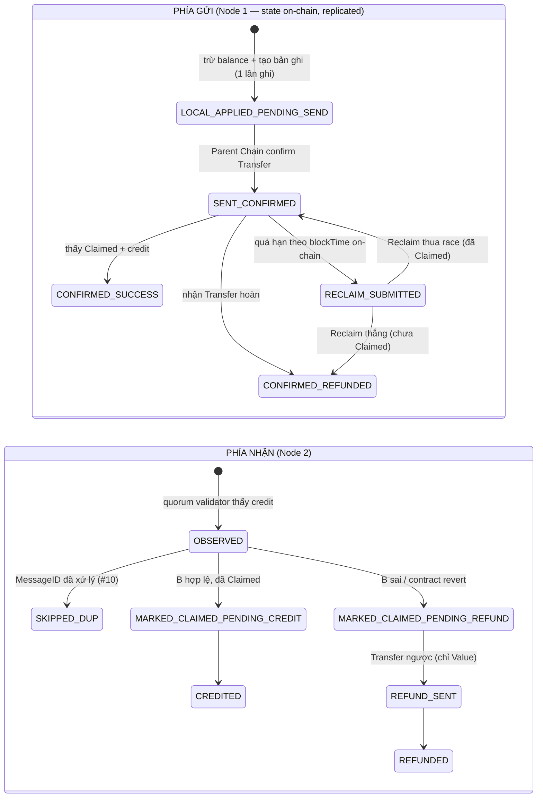

# Kế hoạch Triển khai — BLS Node nội bộ + Cụm HA ngang hàng

> **Trạng thái:** DRAFT (2026-09-24). ⚠️ **Mục 2, 4, 6 bên dưới ĐÃ BỊ THAY THẾ** bởi các quyết định đã chốt trong `SEQUENCER_STEP_BY_STEP_PLAN.md` mục 0.1: giữ committee = 1 validator; dự phòng bằng SyncOnly kèm bảo đảm "dữ liệu nằm trên đa số node trước khi kết quả được nhả ra ngoài" (thay vì cụm N validator + QuorumCert); HA custody hoãn. Failover do operator quyết định, không tự động. Mục 1 (hiện trạng) và mục 3 (state machine) vẫn còn hiệu lực. Đọc file `SEQUENCER_STEP_BY_STEP_PLAN.md` để biết kế hoạch hiện hành.
> **Tài liệu gốc:** `SEQUENCER_DESIGN.md` (kiến trúc), `SEQUENCER_DIAGRAMS_AND_OPEN_ISSUES.md` (sơ đồ + index `#N`).
> **Mục tiêu:** (1) chạy được 1 node nội bộ end-to-end với state machine cross-node; (2) xây cụm có khả năng phục hồi — 1 node chết thì node đồng bộ sẵn còn lại tiếp quản, các node vai trò ngang nhau (không primary cố định).

---

## 1. Hiện trạng đã kiểm chứng trong code

1. **Chưa có code cho phần rollup.** `grep` không thấy `NodeFloatAccount`, `ClaimedMessages`, `LOCAL_APPLIED_PENDING_SEND`, `MARKED_CLAIMED` ở đâu trong repo. `execution/pkg/rollup/` chỉ chứa các file `.md` → làm mới hoàn toàn.
2. **Tài liệu thiết kế mâu thuẫn với yêu cầu HA và đã lỗi thời so với code.** `SEQUENCER_DESIGN.md` mục 2.4 / #1 chốt "1 node = 1 chainID, committee = 1, không có redundancy signer". Trong khi code đã có multi-validator:
   - `execution/pkg/blockchain/tx_processor/committee_attestation_worker.go` (Milestone C): mỗi validator ký 1 share, gom thành BLS QuorumCert qua Root Anchor.
   - Cùng mẫu: `commit_attestation_worker.go`, `message_success_attestation_worker.go`, `message_failure_attestation_worker.go`.
3. **Lớp custody `cmd/rpc/cmd/rpc-client` chưa có HA.** 5 instance (node0..4), mỗi instance một LevelDB riêng (key mã hoá, ví BLS). `ReplicatedLevelDB` (`cmd/rpc/pkg/storage/replicated_leveldb.go`) thực chất chỉ là primary + snapshot, không phải replication.
4. **Chịu lỗi BFT:** `f = ⌊(n−1)/3⌋` (`note/bft_fault_tolerance_node_count.md`). Cụm 3 validator chịu 0 lỗi; muốn chịu 1 node chết cần n ≥ 4.
5. **`GatewayEngine` lưu state dưới dạng 1 JSON blob tại 1 storage key** (`gateway_handler.go`, `gatewayStateStorageKey`) → không chứng minh được per-key. Các cấu trúc mới (`NodeFloatAccount`, `ClaimedMessages`) phải dùng **storage key riêng cho từng entry**.

---

## 2. Kiến trúc HA đề xuất

Một "node" logic (1 chainID) = **cụm N validator ngang hàng** (N ≥ 4). Tái dùng BFT consensus của metanode, không dựng Raft riêng (KISS/YAGNI, không thêm engine consensus thứ hai).

| Lớp | Cơ chế | Khi 1 node chết |
|---|---|---|
| **State** (state machine cross-node) | Chạy trong execution layer như `GatewayHandler` — deterministic, mọi validator có state giống hệt nhau qua BFT. Trạng thái giao dịch là state on-chain của chain đó, không phải bộ nhớ theo process. | Quorum 2f+1 còn lại tiếp tục, không cần bầu lại. |
| **Hành động ra ngoài** (Transfer / `Claimed` / Reclaim lên Parent Chain) | Mọi replica chạy cùng worker (mẫu `CommitteeAttestationWorker`). Chữ ký là QuorumCert của committee, không phải 1 node tự ký. | Submit trùng vô hại vì Parent Chain chống trùng theo `MessageID`. An toàn dựa vào idempotency, không dựa vào thời gian. |
| **Khôi phục mức dự phòng** | Observer (`execution/cmd/observer`) đồng bộ sẵn, nâng lên committee ở ranh giới epoch qua `UpdateCommittee` (cơ chế `CommitteeAttestationWorker`). | Sau khi mất node vĩnh viễn, đưa cụm về lại đủ N. |

Ràng buộc Zero-Fork (AGENTS.md Part 2.5):
- Không dùng timeout/sleep để quyết định dispatch commit. Reclaim dựa trên `blockTime` **on-chain** của Parent Chain, không phải đồng hồ local.
- Trạng thái phía nhận chỉ chuyển khi có tx mang attestation của quorum (không phải 1 validator tự thấy event rồi credit).
- Mất quá f node → cụm dừng ở PENDING (không fork), có ≥ 2f+1 node thì luôn tiến triển.
- Nâng observer lên committee do operator kích hoạt (data-driven), không tự động theo timeout.

Topology tối thiểu: n=4 (f=1); n=7 (f=2). Cụm test hiện tại đặt chung 1 máy nên HA thật cần tách máy/fault domain.

---

## 3. State machine nội bộ cho giao dịch cross-node

Mục 13.4 của `SEQUENCER_DESIGN.md` chỉ liệt kê trạng thái phía gửi; trạng thái phía nhận chỉ có trong văn bản. Sơ đồ đầy đủ:

**Ghi chú thiết kế cần đưa vào `SEQUENCER_DESIGN.md` ở Phase 0:**
- **Thiếu crash-recovery cho nhánh refund.** Tài liệu chỉ có phục hồi cho nhánh credit (#13). Sau khi `Claimed` đã đánh dấu, phía gửi không Reclaim được nữa; nếu Node 2 crash trước khi gửi Transfer hoàn thì tiền kẹt ở `FA[2]`. Cần trạng thái `MARKED_CLAIMED_PENDING_REFUND` + quy tắc "khởi động lại phải resume", đối xứng với #13. Với cụm HA, replica khác resume được; nếu cả cụm chết thì không còn đường cứu (`RecoveryCommittee` đã gỡ 2026-09-24; mục 6.3 của `SEQUENCER_DESIGN.md`).
- **`RECLAIM_SUBMITTED → SENT_CONFIRMED`** (thua race): phải xử lý tường minh, không được kẹt ở RECLAIM_SUBMITTED.
- Mọi chuyển trạng thái phải idempotent theo `MessageID` để replica nào xử lý lại cũng cho cùng kết quả.

---

## 4. Các giai đoạn

### Phase 0 — Chốt thiết kế (không code)
- Sửa `SEQUENCER_DESIGN.md` mục 2.4, #1, mục 3.3 bước 3, mục 4.4: committee = N validator, chữ ký = QuorumCert.
- Bổ sung trạng thái phía nhận + crash-recovery refund vào mục 13.4 / 13.5.
- Ghi quyết định 3 câu ở mục 6 vào `SEQUENCER_DIAGRAMS_AND_OPEN_ISSUES.md` mục B.1.

### Phase 1 — Chạy 1 node nội bộ end-to-end (chưa HA)
1. Package `execution/pkg/rollup`: state machine thuần Go, deterministic, tách khỏi storage bằng 1 interface nhỏ. Unit test chèn crash ở **từng** transition của sơ đồ mục 3.
2. Parent Chain (`pkg/cross_chain`): `NodeFloatAccount`, `ClaimedMessages` (per-key storage), Transfer / Claim / Reclaim atomic. Reclaim kiểm tra `blockTime` on-chain và chặn race với `Claimed`. Bất biến `Σ NodeFloatAccount == genesis_total_supply` kiểm tra tự động.
3. Wiring: handler + worker (1 validator) theo mẫu `GatewayHandler` / attestation workers.
4. Dựng 2 chain 1 validator + Root Anchor devnet trên 1 máy; chạy Transfer thành công, refund, reclaim.
5. Cập nhật `PROJECT_STRUCTURE.md` (package mới).
6. **Exit:** `consensus/metanode/scripts/build_check.sh` sạch (Go + Rust + FFI, 0 warning); các case (1), (2), (6), (8), (9) của `SEQUENCER_DESIGN.md` mục 9.3 đạt.

### Phase 2 — Cụm ngang hàng (HA thật)
- Mỗi node = 4 validator (f=1); ký Transfer/Claim bằng QuorumCert.
- Chaos test: kill 1/4 tại từng transition của sơ đồ; kill 2/4 → cụm dừng PENDING, chạy lại khi node quay về, không fork.
- **Exit:** không credit trùng, không refund trùng, `block_hash_checker` xác nhận zero-fork, `ci.sh run-now` sạch. Test trên ≥ 2 máy khác nhau.

### Phase 3 — Observer dự phòng
- Observer đồng bộ sẵn, nâng lên committee ở ranh giới epoch bằng committee update.
- **Exit:** node chết vĩnh viễn → thay bằng observer, cụm trở lại đủ N, không gián đoạn giao dịch đang bay.

### Phase 4 — HA cho custody `cmd/rpc` (quyết định-gated, xem mục 6.3)
Sau đó tiếp tục các bước 3–9 của roadmap `SEQUENCER_DESIGN.md` mục 10 (Signed Receipt, Snapshot/Archival, velocity-limit, hạ tầng vận hành, checklist 9.3). Không lặp lại ở đây.

---

## 5. Rủi ro & lưu ý

- **Blast radius Phase 1:** `pkg/cross_chain/gateway.go`, `pkg/blockchain/tx_processor/gateway_handler.go`, package mới `pkg/rollup`, `PROJECT_STRUCTURE.md`. Chạy `codegraph_impact` trên `GatewayEngine` trước khi sửa.
- **Hiệu năng:** mỗi giao dịch cross-node thêm 1 vòng attestation của quorum — cần benchmark ở Phase 2. Đường gửi các tx attestation từ worker không được chặn event loop/FFI (mọi call blocking phải `spawn_blocking`/goroutine riêng, có buffer giới hạn).
- **Worker pool/queue mới phải có buffer giới hạn tường minh** (AGENTS.md Part 2).
- **Chưa đo/chưa chạy gì** ở thời điểm viết kế hoạch — mọi con số hiệu năng còn để trống.

---

## 6. Quyết định cần xác nhận trước Phase 0

1. **Đảo quyết định đã chốt Q13 / mục 2.4** (committee = 1) thành committee = N? *Khuyến nghị: có* — không có thì không có HA.
2. **Tái dùng BFT hiện có (khuyến nghị) hay dựng Raft riêng?** Raft có leader (không thật sự ngang hàng) và là thêm 1 engine phải bảo trì.
3. **HA cho key custody (`cmd/rpc`).** Rủi ro bảo mật cao nhất vì replicate key mở rộng bề mặt tấn công. Ba hướng: (a) replicate key mã hoá qua state on-chain; (b) threshold-signing (TSS); (c) hoãn, chấp nhận custody đơn theo mục 2.3 ở giai đoạn thử nghiệm. *Khuyến nghị: (c) cho Phase 1–3.*
