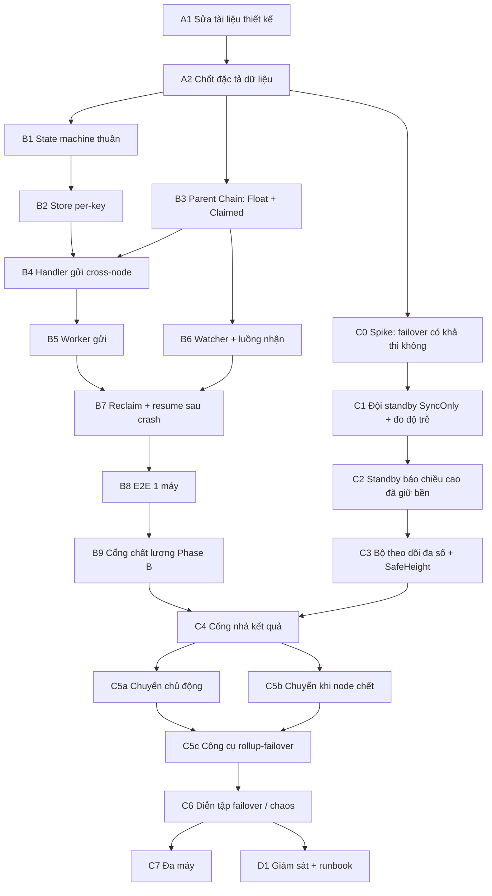

# Kế hoạch Triển khai Từng Bước — BLS Node nội bộ + Dự phòng đồng bộ theo đa số

> **Trạng thái:** cập nhật 2026-09-24 theo các quyết định đã chốt ở mục 0.1.
> **Tài liệu liên quan:** `SEQUENCER_DESIGN.md` (kiến trúc), `SEQUENCER_DIAGRAMS_AND_OPEN_ISSUES.md` (sơ đồ, index `#N`), `SEQUENCER_IMPLEMENTATION_PLAN.md` (tổng quan + hiện trạng; các mục 2, 4, 6 của file đó đã được file này thay thế).

---

## 0. Quyết định đã chốt & quy ước chung

### 0.1. Quyết định đã chốt (2026-09-24)
1. **Mỗi node (1 chainID) giữ 1 validator tự ký** (committee = 1, giữ nguyên `SEQUENCER_DESIGN.md` mục 2.4).
2. **Dự phòng bằng cơ chế SyncOnly hiện có** (node đồng bộ block qua P2P, không tham gia consensus), **cộng thêm bảo đảm dữ liệu:** một kết quả chỉ được "nhả ra ngoài" khi block chứa nó đã nằm trên **đa số** node. Lý do: SyncOnly thuần có thể chậm 1 bước, nên nếu node chính lỗi đúng lúc đó thì mất dữ liệu.
3. **Khoá riêng của user (`cmd/rpc`) — HA hoãn.**
4. **`RecoveryCommittee` đã được gỡ hoàn toàn khỏi hệ thống (2026-09-24)** — code (`gateway.go`, `gateway_handler.go`, ABI, config), tooling deploy và test. Chuyển chủ động dùng chữ ký của khoá cũ; chuyển khi node chết dùng *chứng nhận kế nhiệm ký trước* (C5b). `UnregisterChainWithCert` nay do chính committee của chain tự ký (kèm `UnregisterNonce`); `DeclareChainDeadWithCert` và `UpdateCommitteeWithRecoveryCert` bị xoá; `DeadChains` chỉ do `SlashOnEquivocation` đặt. **Hệ quả chấp nhận:** chain chết hẳn (mất cả primary lẫn standby) mà không double-sign thì `NodeFloatAccount` và bond của nó bị khoá vĩnh viễn — không còn đường cứu tiền cuối cùng.

### 0.2. Hệ quả cần nắm rõ
- **Đây là "dự phòng nóng, thay thế do operator quyết định", không phải tự động.** Khi validator duy nhất chết, chain không còn đóng block, không có ranh giới epoch nên SyncOnly không tự chuyển thành Validator được (`socket-protocol.md`: chuyển chế độ diễn ra ở epoch boundary do consensus phát hiện). Thay thế là hành động của operator, phù hợp `SEQUENCER_DESIGN.md` mục 6.2 ("bắt buộc xác nhận thủ công") và Zero-Fork (không dùng timeout để tự quyết).
- **Bảo đảm dữ liệu:** với tổng T = 1 (primary) + M (standby), "đa số" là ≥ ⌊T/2⌋+1 node. Cấu hình khuyến nghị tối thiểu **M = 2 (T = 3)**: chịu được mất 1 node. Mất cùng lúc primary **và** standby đã ack thì cụm dừng ở PENDING chứ không tự đoán (thà pending còn hơn mất dữ liệu).
- **Cái gì là "nhả ra ngoài"** (chỉ được làm khi block chứa nó đã được đa số giữ bền):
  1. gửi Transfer / `MarkClaimed` / Reclaim lên Parent Chain — **bắt buộc** (an toàn tiền);
  2. trả kết quả thành công / Signed Receipt cho user với giao dịch cross-node — **bắt buộc**;
  3. trả kết quả cho giao dịch **nội bộ** — *khuyến nghị bật*: nó xoá được "cửa sổ mất mát 15 phút" ở `SEQUENCER_DESIGN.md` mục 6.3 điểm 4, đổi lại thêm khoảng 1 vòng mạng tới standby cho mỗi kết quả (chưa đo; cần benchmark ở C4).
- **Muốn tự động thay thế** thì phải nâng lên ≥ 4 validator (committee = N, QuorumCert). Việc đó nằm ở giai đoạn E (tuỳ chọn), không phải giả định của kế hoạch này.

### 0.3. Definition of Done — áp dụng cho MỌI bước có code
1. **Impact analysis trước khi sửa:** `codegraph_impact` / `codegraph_callers` trên symbol bị chạm; liệt kê file bị ảnh hưởng.
2. **Build sạch:** `cd consensus/metanode/scripts && ./build_check.sh` — Go + Rust + FFI, 0 lỗi, 0 warning.
3. **Test:** `go test -race ./...` trong package bị chạm.
4. **Zero-Fork checklist:** không dùng `sleep`/timeout/`Duration` để quyết định dispatch commit hay nhả kết quả; không nhả khi chưa có bằng chứng đa số; chưa đủ bằng chứng thì giữ PENDING.
5. **Bounded concurrency:** mọi queue/worker mới có buffer giới hạn tường minh.
6. **No blocking:** không I/O đồng bộ chặn trong event loop; call chậm trên đường FFI-blocking tách sang goroutine/`spawn_blocking`.
7. Thêm package/entrypoint/kênh giao tiếp → cập nhật `PROJECT_STRUCTURE.md`.

### 0.4. Kích thước
`S` ≈ vài giờ–1 ngày · `M` ≈ 2–4 ngày · `L` ≈ 1 tuần+. Ước lượng thô, chưa hiệu chỉnh bằng dữ liệu thật.

---

## 1. Bản đồ phụ thuộc

**Điểm dừng an toàn:** sau **B9** đã có 1 node chạy được end-to-end (chưa dự phòng). **C0 chạy song song với B** vì nó là rủi ro lớn nhất chưa biết (xem C0) — nếu C0 cho kết quả "không khả thi", phải quay lại quyết định 0.1 sớm, trước khi đổ công vào B.

---

## GIAI ĐOẠN A — Chốt thiết kế (không code)

### A1. Sửa `SEQUENCER_DESIGN.md`  ·  `S`
- Giữ mục 2.4 (committee = 1); **thêm** mục mô tả standby SyncOnly + cổng nhả kết quả theo đa số (mục 0.2 ở trên) và quy trình failover do operator.
- Mục 13.4 / 13.5: thêm trạng thái phía nhận (`OBSERVED`, `MARKED_CLAIMED_PENDING_CREDIT`, `CREDITED`, `MARKED_CLAIMED_PENDING_REFUND`, `REFUND_SENT`, `REFUNDED`, `SKIPPED_DUP`) và phía gửi (`RECLAIM_SUBMITTED`); nhánh thua race `RECLAIM_SUBMITTED → SENT_CONFIRMED`.
- Thêm quy tắc crash-recovery cho nhánh refund, đối xứng #13: sau khi `Claimed` đã đánh dấu, phía gửi không Reclaim được nữa nên node nhận **bắt buộc resume** việc hoàn tiền khi khởi động lại.
- Mục 6.3 điểm 4: ghi rằng cửa sổ mất mát 15 phút thu hẹp lại khi bật cổng nhả kết quả cho giao dịch nội bộ.
- Ghi các quyết định ở 0.1 vào `SEQUENCER_DIAGRAMS_AND_OPEN_ISSUES.md` mục B.1.

**Hoàn thành khi:** tài liệu không mâu thuẫn với 0.1; sơ đồ 13.5 và bảng 13.4 khớp nhau.

### A2. Chốt đặc tả dữ liệu  ·  `S`
1. **Công thức `MessageID`** deterministic: hash của `(sourceChainID, sourceSeq, sender, target, value, payloadHash)`; `sourceSeq` do state machine cấp, không lấy từ đồng hồ.
2. **Timeout Reclaim tính theo `blockTime`/số block của Parent Chain** (on-chain, mục 3.6), không phải timer local. Giá trị mặc định chốt lại sau khi đo ở B8.
3. **Danh sách sự kiện và hành động** của state machine (đầu vào của B1): sự kiện = `TxSubmitted`, `ParentConfirmed`, `ClaimedObserved`, `RefundObserved`, `ReclaimEligible`, `ReclaimWon`, `ReclaimLost`, `CreditObserved`, `LocalCredited`, …; hành động = `SendTransfer`, `SendReclaim`, `MarkClaimed`, `CreditLocal`, `SendRefund`.
4. Loại trừ velocity-limit cho hoàn tiền/Reclaim (#14) ở mức đặc tả field.
5. **Định nghĩa `SafeHeight`:** block cao nhất đã được ≥ ⌊T/2⌋+1 node (kể cả primary) giữ **bền** (đã fsync). Mọi kết quả gắn với block > `SafeHeight` chưa được nhả.

**Hoàn thành khi:** người khác đọc xong viết được B1 và C3 mà không phải hỏi lại.

---

## GIAI ĐOẠN B — Chạy 1 node nội bộ end-to-end (1 validator)

> Giai đoạn B không phụ thuộc hướng dự phòng: giống hệt cho mọi phương án HA.

### B1. State machine thuần  ·  `M`
**Mục tiêu:** bảng chuyển trạng thái deterministic, không I/O, không storage, không thời gian.
- Package mới `execution/pkg/rollup/` (`types.go`, `statemachine.go`).
- Hàm lõi: `Next(state, event) (newState, []Action, error)`. Chuyển không hợp lệ trả lỗi, không panic. Mọi transition idempotent.

**Test (`statemachine_test.go`):** table-driven phủ **mọi cạnh** của sơ đồ ở `SEQUENCER_IMPLEMENTATION_PLAN.md` mục 3; mọi cặp `(state, event)` không hợp lệ bị từ chối; replay 2 lần cho cùng kết quả; không có đường nào vừa `CONFIRMED_SUCCESS` vừa `CONFIRMED_REFUNDED`.

**Hoàn thành khi:** test đạt, chỉ import stdlib + `common.Hash`.

### B2. Store per-key  ·  `M`
**Mục tiêu:** mỗi bản ghi giao dịch nằm ở **storage key riêng theo `MessageID`**, không dùng 1 JSON blob như `gatewayStateStorageKey`.
- Key: `keccak256("rollup_msg_v1" || messageID)`; ghi qua `chainState.GetSmartContractDB().SetStorageValue(...)` (cùng đường commit/state-root như `gateway_handler.go:382-397`). Vì bản ghi nằm trong state của chain nên **tự đồng bộ sang standby SyncOnly qua đường sync block có sẵn** — đây là điều C dựa vào.
- Interface nhỏ (`Get`, `Put`, `ScanNonTerminal`).

**⚠️ Cần xác minh trước:** (a) ghi "trừ balance + tạo record" phải **cùng 1 lần commit** (mục 13.3 bước 2) — xác nhận tính atomic khi commit block; (b) có API iterate theo prefix trên storage trie không, nếu không thì giữ 1 key index các MessageID chưa terminal, cập nhật cùng lúc.

**Test:** reload sau "crash" thấy đúng record; 2 `MessageID` khác nhau không đè nhau.

### B3. Parent Chain: `NodeFloatAccount` + `ClaimedMessages`  ·  `L`
- Trong `execution/pkg/cross_chain/` (cạnh `gateway.go`): `NodeFloatAccount[chainID]` (tiền thật, không âm), `ClaimedMessages[messageID]`; thao tác `DepositToFloat`, `TransferFloat` (atomic `FA[src] -= V, FA[dst] += V`), `MarkClaimed`, `ReclaimFloat`.
- **Storage per-key**, không nhét vào blob `gateway_engine_state_v1`.
- `ReclaimFloat` chỉ thành công khi `blockTime` on-chain ≥ mốc timeout **và** `MessageID` chưa `Claimed`; `DeadChains` **không** chặn Reclaim (mục 6.3).
- Velocity-limit outflow cho `TransferFloat` (#11) tái dùng `checkAndRecordVelocity`; **không áp** cho hoàn tiền/Reclaim (#14).
- Nối vào `gateway_handler.go` (`handleWrite`, `handleView`) + ABI (`rootanchor/gatewayAbi.go`, `tx_processor/abi_contract/`). Tx Gateway chạy dạng barrier (`true_block_stm.go`, `runBarrierTx`).
- Bất biến `Σ NodeFloatAccount == genesis_total_supply`: hàm kiểm tra + đưa vào `consensus/metanode/scripts/invariant_monitor_daemon.py` (đã có) hoặc test.

**Test:** FA không âm, tổng bảo toàn sau chuỗi Transfer/Reclaim ngẫu nhiên; Reclaim trước timeout bị từ chối; Reclaim sau `Claimed` bị từ chối; race Reclaim vs `Claimed`: đúng 1 bên thắng; `Claimed` lần 2 bị từ chối (#9, #10); Reclaim từ FA chain `DeadChains` vẫn chạy, Transfer mới bị chặn; hoàn tiền không bị velocity chặn (#14); persist qua reload.

**Blast radius lớn nhất của kế hoạch** (`GatewayEngine`, `gateway_handler.go` ~2,7k dòng). Bắt buộc `codegraph_impact` trước khi sửa.

### B4. Handler gửi cross-node phía node  ·  `M`
- Giao dịch cross-node của user → record `LOCAL_APPLIED_PENDING_SEND` (mục 13.3 bước 1–2): kiểm tra chữ ký/balance/nonce, serialize chống race cùng 1 user, trừ balance + cấp `sourceSeq` + tính `MessageID` + ghi record trong 1 lần ghi. Chuyển trạng thái **chỉ qua `Next`**.

**⚠️ Cần xác minh trước:** tx cross-node đi vào đường nào — nghiêng về 1 handler mới cạnh `GatewayHandler`, định tuyến qua `isBarrierTx`/`runBarrierTx` trong `true_block_stm.go`. Xác nhận bằng `codegraph_callers`.

**Test:** balance không đủ → từ chối, không có record; 2 tx đồng thời cùng user chỉ 1 tx qua nếu chỉ đủ tiền cho 1; crash sau khi ghi → reload thấy đúng 1 record và balance đã trừ.

### B5. Worker gửi lên Parent Chain  ·  `M`
- File mới cạnh `committee_attestation_worker.go`: quét record `LOCAL_APPLIED_PENDING_SEND` → dựng và ký Transfer → `rootanchor.Client.SubmitTransaction` → khi confirm phát `ParentConfirmed`.
- **Bảng record chính là Retry Queue** (không thêm queue thứ hai): gửi lại đúng tx đã có cho cùng `MessageID`.
- Channel tín hiệu có buffer giới hạn; `select` có `default` không chặn (mẫu `OnEpochAdvanced`). Idempotent: gửi lại 1 Transfer đã confirm được coi là "đã xong", không phải lỗi.
- **Chừa điểm móc cho C4:** worker gọi 1 hàm `isReleasable(record)` trước khi gửi; ở Phase B hàm này luôn trả `true`.

**Test:** mock `rootanchor.Client` — lỗi mạng giữa chừng → retry đúng tx cũ; restart giữa chừng → không gửi trùng; channel đầy → không block.

### B6. Watcher + luồng nhận  ·  `L`
- **Việc mới ở Parent Chain:** `rootanchor.Client` **chưa có** method liệt kê credit đến (`client.go` chỉ có `GetChainRegistry`, các `Get*AttestationShares`, `SubmitTransaction`…). Thêm view `getInboundTransfers(chainID, cursor)` (phân trang bằng cursor) + method client.
- Watcher đọc theo cursor (cursor lưu trong store → sống sót qua restart và **đồng bộ sang standby**) → `CreditObserved`.
- Luồng nhận qua `Next`: kiểm tra chưa xử lý (`SKIPPED_DUP`) → kiểm tra tài khoản/contract → `MarkClaimed` lên Parent Chain **trước** → credit local (`CREDITED`), hoặc gửi Transfer hoàn **chỉ `Value`, không hoàn `GasFee`** (`REFUNDED`).
- Bằng chứng quan sát đi qua interface `EvidenceVerifier` (ở Phase B chỉ là chính validator duy nhất) — để dành chỗ nếu sau này nâng lên nhiều validator.
- Cùng hàm `isReleasable` như B5 cho `MarkClaimed`/Transfer hoàn.

**Test:** credit đến account hợp lệ → `CREDITED`; không hợp lệ → `REFUNDED` đúng `Value`; cùng `MessageID` tới 2 lần → xử lý 1 lần; **crash giữa `MARKED_CLAIMED_PENDING_CREDIT` và credit** → restart credit tiếp, không re-mark, không credit trùng (#13); **crash giữa `MARKED_CLAIMED_PENDING_REFUND` và gửi hoàn** → restart gửi hoàn tiếp, không hoàn 2 lần (#9).

### B7. Reclaim + resume toàn bộ sau crash  ·  `M`
- Record ở `SENT_CONFIRMED` mà Parent Chain báo đủ điều kiện Reclaim (so `blockTime` on-chain) → `ReclaimEligible` → `RECLAIM_SUBMITTED` → `ReclaimWon`/`ReclaimLost`.
- Khi khởi động: `ScanNonTerminal` đưa **mọi** record không terminal về đúng bước tiếp theo. Đây là điểm mà "standby được nâng lên tiếp quản" ở C5 dựa vào.

**Test:** kill giả lập tại **từng** trạng thái không terminal → restart → tới đúng terminal; `ReclaimLost` quay về `SENT_CONFIRMED` rồi kết thúc theo nhánh `Claimed`.

### B8. E2E trên 1 máy  ·  `M`
- Dựng Root Anchor devnet (recipe có sẵn) + 2 chain × 1 validator (Node 1, Node 2); script E2E gửi thật qua RPC.
- Chạy các case `SEQUENCER_DESIGN.md` mục 9.3: **(1)** Transfer thành công, **(2)** thất bại → hoàn đúng `Value`, không hoàn `GasFee`, **(6)** crash giữa refund, **(8)** Reclaim khi Node 2 chậm + race, **(9)** crash giữa `Claimed` và credit.
- Đo chu kỳ xử lý bình thường → chốt tham số timeout Reclaim ở A2. Kiểm `Σ NodeFloatAccount == supply` sau mỗi kịch bản.

**Hoàn thành khi:** 5 case đạt lặp lại nhiều lần liên tiếp, bất biến giữ nguyên.

### B9. Cổng chất lượng Phase B  ·  `S`
- `build_check.sh` sạch; `go test -race` sạch; review độc lập các điểm dễ sót #9, #10, #12, #13, #14.
- Cập nhật `PROJECT_STRUCTURE.md`. Chốt danh sách tham số cuối cùng.

---

## GIAI ĐOẠN C — Dự phòng SyncOnly có bảo đảm đa số

### C0. Spike: failover có khả thi không?  ·  `M`  ·  **làm sớm, song song với B**
**Lý do:** đây là điều chưa được chứng minh. Mình chưa xác minh được rằng một chain chỉ có 1 validator đã chết có thể được khởi động lại với 1 node từng là SyncOnly làm validator duy nhất, hay cần đổi gì ở cấu hình/epoch. Toàn bộ hướng dự phòng phụ thuộc vào điều này.
- Dựng trên 1 máy: 1 validator + 2 SyncOnly (script `execution/cmd/simple_chain/setup-synconly.sh`, `run-synconly.sh`, `config-master-synconly.json`).
- Tạo tải, `kill -9` validator, thử nâng 1 SyncOnly thành validator duy nhất; ghi lại **chính xác** cần thay đổi gì (config, genesis/committee, epoch, key), mất bao lâu, và có mất block nào không.
- **Kiểm chứng chứng nhận kế nhiệm ký trước** (phục vụ C5b): chứng nhận `CommitteeUpdate` do khoá primary ký sẵn có được `ApplyCommitteeUpdate` chấp nhận sau đó không (digest ký có phụ thuộc thời điểm/nonce không; `StateRoot`/`AccountTreeRoot` trong chứng nhận cũ có ghi đè giá trị hiện tại bằng dữ liệu cũ hoặc rỗng không, `epoch_sync.go:489+`). Nếu không dùng được → **không còn đường đổi khoá khi khoá cũ mất** (`RecoveryCommittee` đã gỡ) — phải quay lại quyết định 0.1 (xem C5b).
- Tìm hiểu ràng buộc hạ tầng của SyncOnly: `execution/executor/snapshot_init.go` có kiểm tra FATAL nếu bật snapshot mà ổ đĩa không hỗ trợ reflink (btrfs/xfs) — ảnh hưởng tới máy đặt standby.

**Hoàn thành khi:** có tài liệu ngắn ghi "làm được / không làm được, cần bước X, Y, Z". **Nếu không làm được: dừng và quay lại quyết định 0.1 trước khi làm C1 trở đi.**

### C1. Đội standby SyncOnly + đo độ trễ  ·  `M`
- Chạy M = 2 SyncOnly cho 1 node logic. Mỗi standby **tự tạo BLS key và đăng ký PoP sẵn** (`registerCommitteePop`) để khi thay thế chỉ cần đổi khoá trên Parent Chain, không phải sao chép khoá của primary (tránh tăng bề mặt custody). Ngay sau khi standby đăng ký PoP, primary ký **chứng nhận kế nhiệm** cho khoá đó (xem C5b) và operator cất offline.
- Dưới tải thật, **đo độ trễ của SyncOnly so với primary** (block, không phải cảm tính): phân bố, đỉnh, thời gian bắt kịp sau khi khởi động lại. Đây là con số định lượng cho "chậm 1 bước" và quyết định cổng C4 sẽ chặn bao lâu.

### C2. Standby báo chiều cao đã giữ bền  ·  `M`
- Repo đã có endpoint `/peer_info` trả `last_block` (`consensus/metanode/src/network/peer_rpc/server.rs:325`, lấy từ `executor.get_last_block_number()`), nhưng **chưa rõ `last_block` là đã fsync hay mới apply trong bộ nhớ**.
- Xác minh ngữ nghĩa. Nếu chưa bền, thêm trường `durable_block` = block cao nhất đã fsync xuống đĩa (theo hướng barrier độ bền đã làm ở commit `634b0d39`).
- Có thể chạm Rust + Go + FFI → bắt buộc `build_check.sh` sạch.

**Test:** kill -9 standby ngay sau khi nó báo `durable_block = h` → khởi động lại vẫn có đủ block ≤ h.

### C3. Bộ theo dõi đa số + `SafeHeight`  ·  `M`
- Primary hỏi các standby (data-driven: hỏi rồi đọc, **không** dùng thời gian để quyết định điều gì) và tính `SafeHeight` = chiều cao mà ≥ ⌊T/2⌋+1 node (tính cả primary) đã giữ bền.
- Bounded: số lần hỏi/giây có trần, không tạo goroutine mỗi yêu cầu.
- Standby không trả lời → `SafeHeight` đứng yên (PENDING), không suy đoán.

**Test:** 2 standby, 1 tụt → `SafeHeight` theo standby còn lại; cả 2 tụt → đứng yên; standby quay lại → tiến tiếp; `SafeHeight` không bao giờ lùi.

### C4. Cổng nhả kết quả  ·  `L`
- Hiện thực `isReleasable(record)` (điểm móc ở B5/B6): chỉ `true` khi block chứa record ≤ `SafeHeight`. Áp cho: gửi Transfer/`MarkClaimed`/Reclaim lên Parent Chain; trả kết quả/Signed Receipt cho giao dịch cross-node; và (khuyến nghị) giao dịch nội bộ.
- **Backpressure:** số record đang chờ nhả có trần; chạm trần thì từ chối/làm chậm giao dịch mới (không để queue phình vô hạn khi standby chậm).
- Benchmark: đo độ trễ và TPS trước/sau khi bật cổng, riêng với giao dịch nội bộ, để quyết định có bật cho nội bộ mặc định không.

**Test:** standby dừng → không có Transfer nào rời primary, backlog dừng ở trần, khi standby quay lại thì xả đúng thứ tự, không mất, không trùng.

### C5a. Chuyển chủ động (primary còn sống)  ·  `M`
Dùng khi bảo trì, đổi máy, nâng cấp. **Không mất dữ liệu; chỉ cần chữ ký của khoá cũ.**
1. Kiểm tra điều kiện (do công cụ C5c làm): S1 đã bắt kịp (`durable_block` sát tip); Parent Chain truy cập được; không có Reclaim/`MarkClaimed` đang dở.
2. **Drain:** primary ngừng nhận giao dịch mới, xả hết hàng chờ qua cổng nhả cho tới khi `SafeHeight` = tip. Chốt chiều cao bàn giao H khi S1 đã giữ bền tới H.
3. **Bàn giao khoá:** primary (khoá cũ) ký `CommitteeUpdate` với epoch = epoch hiện tại + 1 sang khoá + PoP của S1, nộp qua đường `ApplyCommitteeUpdate` (`epoch_sync.go:489`, cần chứng nhận của committee cũ đúng epoch hiện tại). Sau bước này chứng nhận của khoá cũ bị Parent Chain từ chối (fencing tiền).
4. Primary dừng hẳn; S1 lên validator; `ScanNonTerminal` (B7) tiếp tục mọi record chưa terminal.
5. Primary cũ chạy lại dưới dạng SyncOnly (đổi vai trò cho nhau), tạo khoá + PoP mới và chứng nhận kế nhiệm mới.
6. Kiểm tra: `Σ NodeFloatAccount == supply`, không record trùng, `block_hash_checker` sạch.

Có thể tận dụng cơ chế chuyển Validator ↔ SyncOnly ở epoch boundary (`mode_transition.rs`, `demotion.rs`) vì primary còn sống nên đi qua được epoch boundary — **chưa xác minh** với chain 1 validator (C0).

### C5b. Chuyển khi node chết đột ngột  ·  `L`
Operator quyết định, **không** tự động theo timeout. Alert chỉ để báo người.
1. **Fencing:** xác nhận primary chết thật (tắt máy / chặn mạng / thu hồi quyền). Primary chỉ bị cô lập mạng mà còn sống thì sẽ có hai primary — **không có bước này thì không đi tiếp**.
2. **Chọn standby** có `durable_block` cao nhất; đối chiếu với mọi Transfer/`MarkClaimed` đã nhả lên Parent Chain (`sourceSeq` cao nhất đã submit ↔ record có trong standby). Thiếu → dừng ở PENDING, không đoán (tính chất giao nhau của đa số).
3. **Đổi khoá trên Parent Chain bằng chứng nhận kế nhiệm ký trước** (không có `RecoveryCommittee` nữa):
   - Lúc còn khoẻ (ngay sau C1, và **ký lại mỗi lần đổi standby**), primary ký sẵn `CommitteeUpdate` epoch +1 sang khoá của S1. Operator cất offline (không để trên máy primary).
   - Lúc sự cố: nộp chứng nhận đó qua `ApplyCommitteeUpdate`. Epoch trên Parent Chain tăng → khoá cũ vô hiệu, kể cả khi primary cũ sống lại. Chứng nhận dùng được **một lần** (epoch đã tăng thì không phát lại được).
   - **Đánh đổi:** niềm tin nằm ở "ai giữ chứng nhận offline" (không còn cơ quan cứu hộ nào khác). Lộ chứng nhận cho phép ép chuyển sang S1 (không cho phép rút tiền: S1 là node của mình và khoá S1 không lộ). Chứng nhận phải làm mới khi thay standby.
   - **Nếu C0 kết luận cơ chế này không dùng được** (xem điểm kiểm chứng ở C0): khi khoá primary mất thì **không có cách đổi khoá trên Parent Chain**. Phải chọn lại một trong hai: (a) lưu bản sao khoá primary đã mã hoá cho standby (tăng bề mặt custody và mất fencing bằng đổi khoá — primary cũ sống lại vẫn ký được), hoặc (b) chấp nhận chain bị kẹt khi mất khoá. Quyết định lúc đó, không tự chọn trước.
4. **Nâng S1** lên validator (cơ chế xác định ở C0); khởi động worker; `ScanNonTerminal` (B7) đưa mọi record chưa terminal về đúng bước. Reclaim cho Transfer đang bay chạy theo `blockTime` on-chain như bình thường.
5. Kiểm tra: `Σ NodeFloatAccount == supply`, không record trùng, `block_hash_checker` sạch.
6. **Khôi phục dự phòng:** node cũ khi sống lại phải xoá dữ liệu và đồng bộ lại thành standby, không được chạy lại như primary; thêm standby mới để đủ T = 3 và ký chứng nhận kế nhiệm mới.

**Nếu mất cả primary lẫn standby đã ack:** không có đủ dữ liệu để failover an toàn → PENDING. **Không còn đường cuối cùng:** `DeclareChainDeadWithCert` và `RecoveryCommittee` đã bị gỡ, `DeadChains` chỉ do `SlashOnEquivocation` đặt, nên chain chết không double-sign thì `NodeFloatAccount` và bond bị khoá (hệ quả đã chấp nhận, `SEQUENCER_DESIGN.md` mục 6.3). Reclaim theo timeout on-chain (mục 3.6) vẫn thu hồi được Transfer đang bay.

### C5c. Công cụ `rollup-failover`  ·  `M`
Công cụ dòng lệnh cho operator (đặt trong `execution/cmd/tool/`, cạnh các công cụ có sẵn). Thêm entrypoint mới → cập nhật `PROJECT_STRUCTURE.md`.
| Lệnh | Việc làm |
|---|---|
| `check` | Chỉ báo cáo, **không thay đổi gì**: `durable_block` từng node, `SafeHeight`, record chưa terminal, trạng thái Parent Chain (epoch, khoá hiện hành), chứng nhận kế nhiệm còn hiệu lực không, standby nào đủ điều kiện. |
| `switchover` | Chạy C5a từng bước, dừng và báo lỗi ngay khi một điều kiện không đạt. |
| `failover` | Chạy C5b từ bước 2. **Từ chối chạy** nếu operator chưa xác nhận đã fencing, hoặc standby chưa chứng minh được có đủ dữ liệu đã nhả. |
- Mọi lệnh có chế độ `--dry-run` in ra đúng các bước sẽ làm. Không có tuỳ chọn ép bỏ qua kiểm tra an toàn.
- Công cụ **chỉ chạy các bước sau khi con người xác nhận** — nó rút ngắn thời gian và giảm sai sót, không thay người quyết định.

**Test:** `check` trên cụm khoẻ báo đúng; `failover` khi standby thiếu dữ liệu bị từ chối; `failover` khi chưa xác nhận fencing bị từ chối; chứng nhận kế nhiệm dùng lần 2 bị Parent Chain từ chối.

### C6. Diễn tập failover / chaos  ·  `L`
| Kịch bản | Kỳ vọng |
|---|---|
| Kill primary tại **từng** trạng thái của state machine, failover theo C5b | Không mất giao dịch đã nhả; không credit/refund trùng |
| Kill primary + 1 standby (T = 3) | Không nâng được nếu thiếu bằng chứng dữ liệu → PENDING, không đoán |
| Primary bị cô lập mạng nhưng vẫn sống, operator nộp chứng nhận kế nhiệm | Transfer của primary cũ bị Parent Chain từ chối; nộp chứng nhận lần 2 bị từ chối |
| `switchover` (C5a) khi đang có tải | Không mất, không trùng giao dịch; primary cũ quay về làm standby |
| Standby chậm rồi bắt kịp | `SafeHeight` đúng, cổng nhả/xả đúng |
| Block chưa qua cổng bị mất khi primary chết | Không có tác động ra ngoài (user chưa được báo, Parent Chain chưa nhận), state nhất quán |
- Sau mỗi kịch bản: bất biến `Σ NodeFloatAccount == supply`; kiểm tra zero-fork; `./ci.sh run-now` sạch.

**Hoàn thành khi:** toàn bộ bảng đạt lặp lại; **mọi giao dịch đã được báo thành công hoặc đã gửi lên Parent Chain đều có mặt sau failover**.

### C7. Triển khai đa máy  ·  `M`
- Đặt primary và từng standby trên **máy khác nhau** (cụm test hiện tại đặt chung 1 máy nên chưa chứng minh được mất cả máy). Dùng ansible có sẵn (`deploy/ansible_private_chains/`); lặp lại C6 bằng cách tắt hẳn 1 máy.

---

## GIAI ĐOẠN D — Vận hành

### D1. Giám sát + runbook  ·  `M`
- Metric: số record theo từng trạng thái; **tuổi record không-terminal lâu nhất**; `SafeHeight` và độ lệch so với primary; số record đang chờ cổng nhả; `Σ NodeFloatAccount` vs supply; số lần Reclaim.
- Cảnh báo: standby tụt quá ngưỡng; chỉ còn đúng số node tối thiểu đạt đa số (sát ngưỡng mất khả năng nhả kết quả); backlog cổng nhả chạm trần.
- Runbook trong `note/`: failover chủ động (C5a) và khi node chết (C5b), mất quá số node cho phép (cụm dừng — cách khôi phục an toàn), khoá bị lộ.

---

## GIAI ĐOẠN E — Ngoài phạm vi (theo dõi riêng)
- **Cơ chế cứu tiền khi mất cả cụm:** hiện không có (đã gỡ `RecoveryCommittee`). Nếu sau này cần, phải thiết kế riêng (ví dụ cơ chế tuyên bố chết dựa trên bằng chứng có thể kiểm chứng on-chain), không nên khôi phục một cơ quan cứu hộ tập trung.
- **Tự động thay thế thật:** nâng lên ≥ 4 validator (committee = N, QuorumCert, worker trên mọi replica, chaos test kill-1-of-4) — phương án đã cân nhắc và **không chọn** ở 0.1; giữ làm tuỳ chọn khi cần failover không cần operator.
- **HA cho custody `cmd/rpc`** (key mã hoá, ví BLS).
- Signed Receipt (mục 15.2), Snapshot & Archival (mục 6.3), Account Registry (mục 5.1), velocity-limit đầy đủ — theo roadmap `SEQUENCER_DESIGN.md` mục 10.

---

## 2. Bảng theo dõi tiến độ

| Bước | Tên | Kích thước | Phụ thuộc | Trạng thái |
|---|---|---|---|---|
| A1 | Sửa tài liệu thiết kế | S | — | ☐ |
| A2 | Chốt đặc tả dữ liệu | S | A1 | ☐ |
| C0 | **Spike: failover khả thi không** | M | A2 | ☐ |
| B1 | State machine thuần | M | A2 | ☐ |
| B2 | Store per-key | M | B1 | ☐ |
| B3 | Parent Chain: Float + Claimed | L | A2 | ☐ |
| B4 | Handler gửi cross-node | M | B2, B3 | ☐ |
| B5 | Worker gửi | M | B4 | ☐ |
| B6 | Watcher + luồng nhận | L | B3, B5 | ☐ |
| B7 | Reclaim + resume sau crash | M | B5, B6 | ☐ |
| B8 | E2E 1 máy | M | B7 | ☐ |
| B9 | Cổng chất lượng Phase B | S | B8 | ☐ |
| C1 | Đội standby + đo độ trễ | M | C0 | ☐ |
| C2 | Standby báo chiều cao bền | M | C1 | ☐ |
| C3 | Bộ theo dõi đa số + SafeHeight | M | C2 | ☐ |
| C4 | Cổng nhả kết quả | L | B9, C3 | ☐ |
| C5a | Chuyển chủ động | M | C4 | ☐ |
| C5b | Chuyển khi node chết | L | C4 | ☐ |
| C5c | Công cụ `rollup-failover` | M | C5a, C5b | ☐ |
| C6 | Diễn tập failover / chaos | L | C5c | ☐ |
| C7 | Đa máy | M | C6 | ☐ |
| D1 | Giám sát + runbook | M | C6 | ☐ |

---

## 3. Điểm chưa xác minh (đọc trước khi làm bước liên quan)

| Điểm | Bước | Cách xác minh |
|---|---|---|
| Chain 1 validator đã chết có khởi động lại được với 1 SyncOnly làm validator duy nhất không, và cần đổi gì | **C0** | Spike thực nghiệm — chưa có bằng chứng |
| `last_block` của `/peer_info` là đã fsync hay chỉ mới apply | C2 | Đọc `executor.get_last_block_number()` và đường commit |
| Ghi nhiều key trong 1 tx có atomic khi commit block không | B2, B4 | `codegraph_explore` trên đường commit `chainState`/smart-contract DB |
| Tx cross-node của user định tuyến vào handler nào | B4 | `codegraph_callers` trên `isBarrierTx` / `runBarrierTx` |
| Có API iterate theo prefix trên storage trie không | B2 | Đọc `smart_contract_db` |
| SyncOnly cần ổ đĩa hỗ trợ reflink (btrfs/xfs) khi bật snapshot | C0, C7 | `execution/executor/snapshot_init.go`, `setup-synconly.sh` |
| Chứng nhận kế nhiệm ký trước có được `ApplyCommitteeUpdate` chấp nhận (digest, ghi đè `StateRoot`/`AccountTreeRoot`); nếu không thì không còn đường đổi khoá khi mất khoá (`RecoveryCommittee` đã gỡ) | C0, C5b | Thử thật ở C0; đọc `epoch_sync.go`, `gateway_handler.go` (`committeeUpdate`) |

## 4. Quyết định còn mở (không chặn việc bắt đầu)

| Quyết định | Mặc định đề xuất | Chốt khi |
|---|---|---|
| Số standby M | 2 (T = 3) | C1, theo số liệu độ trễ |
| Bật cổng nhả cho giao dịch **nội bộ** | Bật | C4, sau benchmark độ trễ/TPS |
| Tham số timeout Reclaim | Đo ở B8 | B8 |
