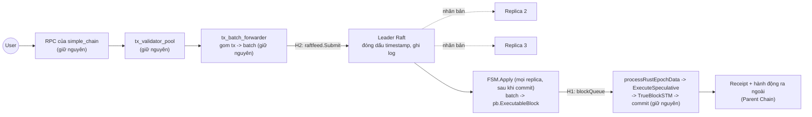
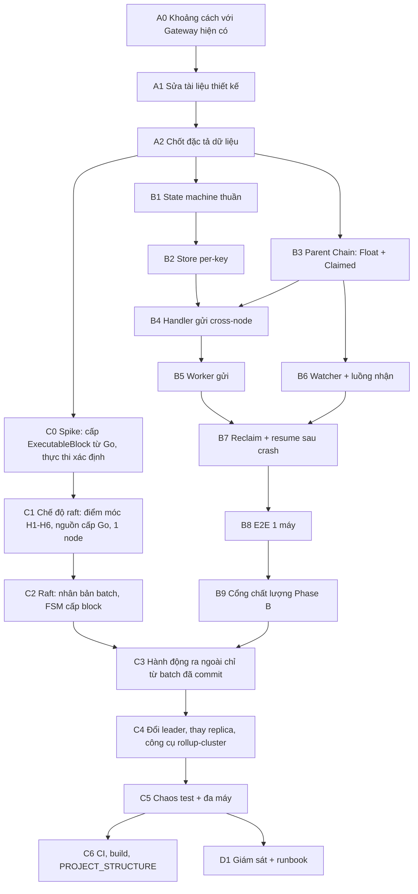

# Kế hoạch Triển khai Từng Bước — chế độ `raft` của `simple_chain` (bỏ đồng thuận Rust, giữ nguyên phần còn lại)

> **Trạng thái:** cập nhật 2026-09-24 sau khi bạn chốt 5 quyết định ở mục 0.1.
> **Tài liệu liên quan:** `SEQUENCER_DESIGN.md` (kiến trúc), `SEQUENCER_DIAGRAMS_AND_OPEN_ISSUES.md` (sơ đồ, index `#N`), `SEQUENCER_IMPLEMENTATION_PLAN.md` (tổng quan + hiện trạng; các mục 2, 4, 6 của file đó đã được file này thay thế), **`SEQUENCER_SCHEMAS_AND_TEST_PLAN.md` (schema dữ liệu + kế hoạch kiểm thử đầy đủ — đọc kèm khi làm bất kỳ bước nào)**, **`SEQUENCER_PARENT_ANCHORING.md` (phương án A: neo sổ holder ERC20 — Giai đoạn F)**, **`SEQUENCER_ERC20_DISPUTE.md` (phương án B: khiếu nại optimistic)**, **`SEQUENCER_FRAUD_PROOF_DESIGN.md` (thiết kế khuyến nghị hiện hành, hợp nhất A+B dưới mô hình "không ai giám sát" — thay Giai đoạn F/F-min)**, **`SEQUENCER_ERC20_USER_HISTORY_PROOF.md` (luồng chứng minh ERC20 chi tiết chỉ dựa trên lịch sử người dùng, test `T-UH-*`)**, ✅ **`SEQUENCER_ERC20_STANDARD_TX_PROOF.md` (ĐẶC TẢ CHỐT cho phần bằng chứng gian lận ERC20 — chế độ giao dịch chuẩn có chữ ký; nguồn sự thật cho triển khai)**.

---

## 0. Quyết định đã chốt & quy ước chung

### 0.1. Quyết định đã chốt (2026-09-24)
1. **Không có binary mới, không có RPC mới.** Giữ nguyên `simple_chain` — **kể cả toàn bộ RPC**, xử lý block Go (`BlockProcessor`, `SpeculativeExecutor`, `TrueBlockSTM`, commit, receipts…), NOMT/MVM/Xapian. **Chỉ đổi luồng tạo block:** thay vì Rust đồng thuận sắp xếp giao dịch rồi đưa `ExecutableBlock` vào, Raft (Go) sắp xếp và đưa vào. Đây là một **chế độ** (`consensus_mode = "raft"`) của `simple_chain`; mặc định (không đặt) chạy **y hệt như cũ**.
2. **Vai trò:** đây là **node thực thi**. **Bộ gom batch đã có sẵn** trong Go (`tx_batch_forwarder`: gom tx → `MarshalTransactions` → hiện đẩy vào Rust bằng `executor.SubmitTransactionBatch`). Ở chế độ `raft`, đích của nó đổi thành Raft; batch được nhân bản tới các node để thực thi. Không gửi batch lên Parent Chain / Archival.
3. **Nhân bản bằng Raft (thư viện), bầu leader tự động.** Bạn cho phép dùng timeout **cho Raft** (bầu leader, heartbeat). Đây là ngoại lệ có phạm vi hẹp so với Nguyên tắc 2 của `AGENTS.md`: timeout chỉ quyết định *ai là leader* (tính sống), **không** quyết định việc commit hay thực thi — commit vẫn dựa trên đa số. Ngoài Raft, quy tắc "không dùng timeout để quyết định dispatch commit" vẫn áp dụng nguyên vẹn.
4. **Cùng 1 khoá ký trên mọi replica** (committee = 1 khoá trên Parent Chain).
5. **Khoá riêng của user (`cmd/rpc`) — HA hoãn.**
6. **`RecoveryCommittee` đã được gỡ hoàn toàn (2026-09-24).** `UnregisterChainWithCert` do chính committee của chain tự ký (kèm `UnregisterNonce`); `DeadChains` chỉ do `SlashOnEquivocation` đặt. **Hệ quả chấp nhận:** chain chết hẳn mà không double-sign thì `NodeFloatAccount` và bond của nó bị khoá vĩnh viễn.

> Các quyết định trước đó "dự phòng bằng SyncOnly", "chứng nhận kế nhiệm ký trước", "viết lại phần lắp block" **bị thay thế**: SyncOnly/epoch/validator là khái niệm của đồng thuận Rust; phần lắp block Go được giữ nguyên nên không phải viết lại.

### 0.2. Hệ quả cần nắm rõ
- **Chịu lỗi dừng (crash-fault), không chịu node độc hại.** Không còn BFT. Chấp nhận được khi mọi replica cùng do 1 operator sở hữu (custodial, `SEQUENCER_DESIGN.md` mục 2.3); không đủ nếu các replica thuộc nhiều tổ chức không tin nhau.
- **N replica, đa số = ⌊N/2⌋+1.** N = 3 chịu mất 1; N = 5 chịu mất 2. Mất quá nửa: dừng, **không mất dữ liệu đã commit, không fork**.
- **Thực thi luôn sau khi commit:** một batch chỉ được đưa vào `BlockProcessor` **sau khi Raft đã commit nó** (đã ghi bền trên đa số). Không thực thi trước rồi mới nhân bản, vì leader chết sẽ giữ state vượt dữ liệu đã nhân bản và phải quay lui state (chưa xác minh NOMT quay lui an toàn; `Checkpoint` từng gây đứng hệ thống).
- **Hành động ra ngoài chỉ sinh ra từ batch đã commit** (gửi Transfer / `MarkClaimed` / Reclaim lên Parent Chain; trả receipt / Signed Receipt). Nhờ vậy dữ liệu luôn nằm trên đa số trước khi có tác động ra ngoài, và không còn "cửa sổ mất mát 15 phút" (`SEQUENCER_DESIGN.md` mục 6.3 điểm 4). Lưu ý: `eth_sendRawTransaction` trả mã băm **không** phải cam kết đã commit; cam kết là receipt.
- **Cùng 1 khoá + hành động là hàm xác định của batch đã commit** → mọi replica cùng sinh ra cùng hành động (cùng `MessageID`), Parent Chain chống trùng; leader cũ bị cô lập không commit được batch mới nên không có hành động mới. Đánh đổi: lộ 1 replica là lộ khoá.
- **Cùng 1 khoá cũng cho ra cùng địa chỉ leader trong header block** trên mọi replica (cần cho block hash giống nhau), xem ánh xạ trường ở 0.6.

### 0.3. Definition of Done — áp dụng cho MỌI bước có code
1. **Impact analysis trước khi sửa:** `codegraph_impact` / `codegraph_callers` trên symbol bị chạm; liệt kê file bị ảnh hưởng.
2. **Build sạch:** `cd consensus/metanode/scripts && ./build_check.sh` — Go + Rust + FFI, 0 lỗi, 0 warning.
3. **Test:** `go test -race ./...` trong package bị chạm.
4. **Zero-Fork checklist:** không dùng `sleep`/timeout/`Duration` để quyết định dispatch commit hay nhả kết quả; không nhả khi chưa có bằng chứng đa số; chưa đủ bằng chứng thì giữ PENDING.
5. **Bounded concurrency:** mọi queue/worker mới có buffer giới hạn tường minh.
6. **No blocking:** không I/O đồng bộ chặn trong event loop; call chậm trên đường FFI-blocking tách sang goroutine/`spawn_blocking`.
7. Thêm package/entrypoint/kênh giao tiếp → cập nhật `PROJECT_STRUCTURE.md`.

### 0.4. Kích thước
`S` ≈ vài giờ–1 ngày · `M` ≈ 2–4 ngày · `L` ≈ 1 tuần+. Ước lượng thô, chưa hiệu chỉnh bằng dữ liệu thật.

### 0.5. Kết quả rà soát ngày 2026-09-24 (đã xác minh bằng code) và mức sẵn sàng

| Phase | Sẵn sàng? | Ghi chú |
|---|---|---|
| A0–A2 (thiết kế) | **Có** | A0 làm trước A1 |
| B1 (state machine thuần) | **Có** | Không phụ thuộc gì |
| B2, B4, B5–B8 | **Sau A0** | Phụ thuộc quyết định "mở rộng Gateway hiện có hay xây song song" |
| B3 (Parent Chain Float) | **Chưa** | Chờ A0 — có nguy cơ trùng `PerChainAllocation`/`AttestCommit`/`ClaimMessage` đã audit |
| C0 (spike) | **Có, nên làm sớm** | Điểm nối đã tìm ra (dưới); cần chứng minh thực thi xác định giữa 2 tiến trình |
| C1–C6, D1 | **Chưa** | Chờ C0 |

**Điểm đã xác minh — điểm nối vào xử lý block Go:**
1. `BlockProcessor.processRustEpochData(dataChan)` (`cmd/simple_chain/processor/block_processor_network.go:129`) đọc **hai** nguồn trong cùng một `select`: `executor.GetAuthoritativeBlockQueue()` (Rust) và `dataChan` (kênh `chan *pb.ExecutableBlock`, "legacy"); cả hai cùng đổ vào `speculativeExecutor.ExecuteSpeculative(epochData, lastHeader, authRespCh)`. **Xử lý block Go nhận `ExecutableBlock` từ bất kỳ nguồn nào.** Nguồn Rust chỉ bị bỏ qua nếu không gọi `executor.InitFFIBridge` (nó ở dòng 104 cùng file): khi đó kênh authoritative là `nil`, nhánh đó của `select` không bao giờ được chọn.
2. `InitFFIBridge` là nơi duy nhất khởi động Rust (`metanode_start_consensus`) và gán `defaultRequestHandler`/`defaultAuthoritativeBlockQueue` (`executor/ffi_bridge.go:130`). Hàm gọi nó (`runUnixSocket`) cũng gắn hàng loạt callback vào `RequestHandler` (GEI reset, khoá thực thi, huỷ speculative, phát receipt…). Vì vậy điểm móc H1 chỉ là **một nhánh quanh lời gọi `InitFFIBridge`**: giữ nguyên toàn bộ phần gắn callback, không nhân đôi mã.
3. **Trường `ExecutableBlock` mà shim phải điền** (`pkg/proto/executor.proto`; bảng đầy đủ ở schema mục 1.3). **Lưu ý:** `TransactionExe.digest` thực ra chứa **bytes của giao dịch đầy đủ** (`ParallelUnmarshalTransactions` giải mã nó bằng `UnmarshalTransaction`), nên `FSM.Apply` phải tách batch thành từng tx, mỗi tx một `TransactionExe`. Các trường: `transactions`, `global_exec_index`, `commit_index` (uint32 — Raft index phải nằm trong 32 bit), `epoch` (hằng số), `commit_timestamp_ms` (= timestamp đã đóng băng trong batch), `leader_address` (**hằng số = địa chỉ của khoá dùng chung**, để mọi replica ra cùng block hash), `block_number` (suy ra xác định từ batch), `commit_hash` (băm chuỗi của bản ghi batch), `is_authoritative_gei` (chọn ở C0: để Go tự cấp GEI hay cấp sẵn).
4. **Phần Go vẫn gọi ngược vào Rust lúc chạy** (cần thay/vô hiệu cho node mới, chưa liệt kê hết — C0 làm): `txsender` (đẩy tx cho Rust), `executor.IsRustConsensusReadyForTransactions` (`rpc_block.go:388`), `GetConsensusVotes`/`GetCommitVotes`, admin `AttestPayloadLoss`, các handler epoch/validators/sync trong `executor`, `GEI authority` và bộ quản lý snapshot gắn với `CommitIndex`.
5. **Danh sách điểm móc tối thiểu trong code cũ (đã xác minh vị trí, đều mặc định-tắt):**
   - **H1 — khởi động nguồn block:** `processor/block_processor_network.go:104` (`executor.InitFFIBridge(...)` bên trong `runUnixSocket`, được gọi từ `block_processor_core.go:782`): ở chế độ `raft` **không** gọi `InitFFIBridge` mà khởi động nguồn cấp Raft, đẩy vào `blockQueue`; giữ nguyên các đoạn gắn callback phía trên và `go bp.processRustEpochData(blockQueue)` phía dưới (không nhân đôi mã).
   - **H2 — nơi nhận batch:** `processor/tx_batch_forwarder_core.go:219` (`executor.SubmitTransactionBatch(bTransaction)`): ở chế độ `raft` gọi `raftfeed.Submit(bTransaction)` (đưa batch cho leader; follower chuyển tiếp tới leader). Vòng thử lại 100ms khi trả `false` giữ nguyên.
   - **H3 — sẵn sàng nhận giao dịch:** `rpc_block.go:388` (`executor.IsRustConsensusReadyForTransactions()`): ở chế độ `raft` trả về "đã biết leader và đã bắt kịp".
   - **H4 — RPC chỉ có ý nghĩa với Rust:** `rpc_block.go:875,888` và `mtn_api.go:768,781` (`GetConsensusVotes`/`GetCommitVotes`), `admin_api.go:43,61` (`AttestPayloadLoss*`): ở chế độ `raft` trả lỗi "không hỗ trợ" thay vì gọi FFI.
   - **H5 — client TCP tới Rust:** `block_processor_core.go:471` (`txsender.NewClient`): ở chế độ `raft` bỏ qua (chưa xác minh có cần không — C0).
   - **H6 — cấu hình:** `pkg/config/config.go` thêm `consensus_mode` (mặc định rỗng) và khối cấu hình Raft.
   - **H7 — cổng đọc riêng tư (chỉ khi làm phần bằng chứng gian lận, độc lập với chế độ raft):** các RPC đọc `rpc_transaction.go` (`GetTransactionByHash`, `GetTransactionReceipt`, `GetLogs`), `rpc_block.go` (`GetBlockByNumber`), `rpc_state.go` (`GetBalance`, `Call`), lớp đăng ký WebSocket và chế độ explorer: ở `privacy_mode` xác thực bằng chữ ký thách thức và chỉ trả bản ghi của người tham gia. **Hiện các RPC này không có kiểm soát truy cập** (`SEQUENCER_ERC20_USER_HISTORY_PROOF.md` mục 13); mặc định-tắt, cần bạn duyệt.
   - **H8 — RPC ký phản hồi (chỉ khi làm phần bằng chứng gian lận ERC20):** các RPC trả receipt/kết quả mang `block_hash` (`rpc_transaction.go`, `rpc_block.go`) thêm chữ ký của node trên `(chain, block_number, block_hash, tx_hash)` ở chế độ `signed_responses` (mặc định-tắt); cần bạn duyệt. Dùng cho `reportRewrite` (P6) — `SEQUENCER_ERC20_STANDARD_TX_PROOF.md` mục 6.3.
   Ước lượng tổng cộng chỉ vài chục dòng trong file cũ, mỗi chỗ là một nhánh `if raftfeed.Enabled()`; **chứng minh mặc định-tắt** bằng test hiện có + test mới (mục C1).
6. Chỉ 1 file trong `pkg/` kéo package `executor` (và `-lmetanode`) vào: `pkg/blockchain/tx_processor/validation_transaction.go` (2 lời gọi `NotifyValidatorRegistered`/`Deregistered`). Vì `processor` cũng import `executor`, binary mới **vẫn link `libmetanode` lúc build** dù không bao giờ khởi động nó; chấp nhận (không sửa file cũ).
7. **`SmartContractDB` không có API duyệt theo prefix** → B2 cần key index riêng cho `MessageID` chưa terminal, có trần kích thước.
8. **Tx Gateway chạy tuần tự (barrier)** (`true_block_stm.go:185`) và mỗi tx nạp/ghi cả `GatewayEngine` dạng 1 blob → thông lượng cross-node bị tuần tự hoá; đo ở B8.
9. **`go.mod` chưa có thư viện Raft** → thêm dependency (đề xuất `hashicorp/raft` + kho log bền; quyết định cuối ở mục 4).
10. **Chưa xác minh (chỉ chạy thật mới biết):** cùng chuỗi `ExecutableBlock` cho **cùng state root và block hash trên 2 tiến trình** (kể cả Block-STM song song); ghi `AccountStateDB` + `SmartContractDB` cùng 1 block có commit atomic khi mất điện không (liên quan `634b0d39`); khi restart, Raft phát lại các entry đã commit sau snapshot — feeder phải bỏ qua block đã thực thi (so với `storage.GetLastBlockNumber()`) để không thực thi 2 lần.

### 0.6. Kiến trúc chế độ `raft`

- **Gom → tạo nhóm:** **giữ nguyên** `tx_batch_forwarder` (đã gom tx thành batch). Khi batch tới leader, leader **đóng dấu `timestamp`** rồi ghi vào log Raft; sau đó **nội dung + timestamp không đổi**. Đồng hồ chỉ dùng ở leader để đóng dấu; mọi replica xử lý **chỉ dựa trên bản ghi trong log** (đây là điều làm cho thực thi xác định).
- **Gửi để thực thi:** Raft nhân bản batch; khi commit, **`FSM.Apply` trên mọi replica** dựng `pb.ExecutableBlock` (ánh xạ 0.5 điểm 3) và đẩy vào `blockQueue`. `Apply` chỉ đẩy vào kênh có trần và ghi `appliedIndex`; thực thi chạy bất đồng bộ trong pipeline sẵn có.
- **Đối chiếu:** mỗi replica ghi state root từng block; leader đối chiếu với replica khác (dựa trên dữ liệu, không đoán): lệch → replica lệch **dừng**, không tự sửa.
- **Bị loại ở chế độ này:** epoch, validator set, DAG, `CommitIndex` của Rust, `TxPayloadCache`, `fork_guard`, sync loop Rust, `GetConsensusVotes`, admin payload-loss.
- **Sửa code cũ ở mức tối thiểu (H1–H6, mặc định-tắt).** Phần mới nằm trong `pkg/rollup/raftfeed`. Không có binary mới, không có RPC mới.

---

## 1. Bản đồ phụ thuộc

**Điểm dừng an toàn:** sau **B9** logic rollup chạy được end-to-end trên node hiện có (`simple_chain` 1 validator dùng làm bệ thử, vì logic rollup nằm ở execution layer nên không phụ thuộc nguồn thứ tự). Sau **C1** có chế độ `raft` chạy được trên 1 node (chưa HA). Sau **C5** mới có HA thật. **C0 chạy song song với B** vì đây là rủi ro lớn nhất chưa biết: nếu cùng chuỗi block cho state root khác nhau giữa 2 tiến trình thì hướng nhân bản phải đổi.

---

## GIAI ĐOẠN A — Chốt thiết kế (không code)

### A0. Phân tích khoảng cách với Gateway hiện có  ·  `S`  ·  **làm trước A1**
**Lý do:** `SEQUENCER_DESIGN.md` mục 3.1 mô tả `NodeFloatAccount` như cấu trúc "cần xây", nhưng repo đã có `PerChainAllocation` (sổ ghi nợ/có ròng đã audit), `AttestCommit`, `ClaimMessage`, `Refund`/`RefundReserveAllocation`, `MessageStatus`, `TransferAllocationWithCert` và `RelayerDaemon`. Chưa có phân tích nào cho biết phần nào tái dùng được. Xây song song một hệ thứ hai trên cùng Root Anchor có blast radius lớn (`gateway_handler.go` ~2,7k dòng) và lặp lại các lớp bug đã sửa ở những vòng audit trước.
- Lập bảng: mỗi thao tác của mục 3.3–3.6 (Transfer, `Claimed`, hoàn tiền, Reclaim, nạp tiền) ↔ hàm Gateway tương ứng nếu có ↔ khác biệt cần thiết (vd `FA` là tiền thật; Reclaim theo timeout on-chain; `MarkClaimed` tách khỏi credit).
- Chốt bằng văn bản một trong hai: **(i) mở rộng** Gateway/`PerChainAllocation` hiện có; **(ii) xây `NodeFloatAccount` song song** và nói rõ luồng `outbound`/`attestCommit`/`claimMessage` hiện tại được giữ, ẩn đi hay thay thế.
- Kết luận này định hình B3, B4, B6; các bước đó ghi "Sau A0" ở bảng 0.5.

**Hoàn thành khi:** có bảng khoảng cách và quyết định (i)/(ii) được ghi vào `SEQUENCER_DESIGN.md` mục 3.1.

### A1. Sửa `SEQUENCER_DESIGN.md`  ·  `S`
- Giữ mục 2.4 (committee = 1 khoá ký); **thêm** mục mô tả chế độ `raft` của `simple_chain` (gom → nhóm → gửi → thực thi), nhân bản batch trên đa số và hành động ra ngoài chỉ từ batch đã commit (mục 0.2, 0.6 ở trên), kèm quy trình đổi leader/thay replica.
- Mục 13.4 / 13.5: thêm trạng thái phía nhận (`OBSERVED`, `MARKED_CLAIMED_PENDING_CREDIT`, `CREDITED`, `MARKED_CLAIMED_PENDING_REFUND`, `REFUND_SENT`, `REFUNDED`, `SKIPPED_DUP`) và phía gửi (`RECLAIM_SUBMITTED`); nhánh thua race `RECLAIM_SUBMITTED → SENT_CONFIRMED`.
- Thêm quy tắc crash-recovery cho nhánh refund, đối xứng #13: sau khi `Claimed` đã đánh dấu, phía gửi không Reclaim được nữa nên node nhận **bắt buộc resume** việc hoàn tiền khi khởi động lại.
- Mục 6.3 điểm 4: ghi rằng cửa sổ mất mát 15 phút biến mất, vì kết quả (kể cả giao dịch nội bộ) chỉ được trả sau khi batch đã ghi bền trên đa số.
- Ghi các quyết định ở 0.1 vào `SEQUENCER_DIAGRAMS_AND_OPEN_ISSUES.md` mục B.1.

**Hoàn thành khi:** tài liệu không mâu thuẫn với 0.1; sơ đồ 13.5 và bảng 13.4 khớp nhau.

### A2. Chốt đặc tả dữ liệu  ·  `S`
1. **Công thức `MessageID`** deterministic: hash của `(sourceChainID, sourceSeq, sender, target, value, payloadHash)`; `sourceSeq` do state machine cấp, không lấy từ đồng hồ.
2. **Timeout Reclaim tính theo `blockTime`/số block của Parent Chain** (on-chain, mục 3.6), không phải timer local. Giá trị mặc định chốt lại sau khi đo ở B8.
3. **Danh sách sự kiện và hành động** của state machine (đầu vào của B1): sự kiện = `TxSubmitted`, `ParentConfirmed`, `ClaimedObserved`, `RefundObserved`, `ReclaimEligible`, `ReclaimWon`, `ReclaimLost`, `CreditObserved`, `LocalCredited`, …; hành động = `SendTransfer`, `SendReclaim`, `MarkClaimed`, `CreditLocal`, `SendRefund`.
4. Loại trừ velocity-limit cho hoàn tiền/Reclaim (#14) ở mức đặc tả field.
5. **Định nghĩa `CommitIndex`:** `index` batch cao nhất đã ghi bền (fsync) trên ≥ ⌊N/2⌋+1 replica (kể cả leader). Mọi hành động ra ngoài và mọi kết quả trả cho user chỉ được sinh từ batch có `index ≤ CommitIndex`.
6. **Khuôn dạng bản ghi batch:** xem `SEQUENCER_SCHEMAS_AND_TEST_PLAN.md` mục 1.2 (`BatchRecord{schema_version, timestamp_ms, txs, tx_count, proposer_id}` — bất biến sau khi leader ghi; chuỗi băm `commit_hash` tính tại `FSM.Apply`, không nằm trong bản ghi).
7. **`markClaimed` phải mang `outcome` (CREDITED/REFUND)** và bên gửi cần trạng thái `REFUND_IN_TRANSIT`: nếu không, bên gửi thấy `Claimed` nhưng không biết chờ hoàn tiền hay đã xong (lỗ hổng tìm thấy khi viết bảng chuyển trạng thái, schema mục 1.7).
8. **Sự kiện quan sát từ Parent Chain phải vào chain state bằng giao dịch** (qua batch Raft), không để replica nào tự đọc rồi tự đổi record — nếu không các replica lệch state root (schema mục 1.8).

**Hoàn thành khi:** người khác đọc xong viết được B1 và C2 mà không phải hỏi lại.

---

## GIAI ĐOẠN B — Logic rollup chạy end-to-end (trên node hiện có làm bệ thử)

> Giai đoạn B không phụ thuộc nguồn thứ tự và không phụ thuộc HA: nó chạy trên `simple_chain` 1 validator hiện có làm bệ thử, sau đó chạy y nguyên trên Rollup Node (C1). Không sửa code cũ ngoài `pkg/cross_chain` và `gateway_handler.go` ở B3 (đã ghi blast radius).

### B1. State machine thuần  ·  `M`
**Mục tiêu:** bảng chuyển trạng thái deterministic, không I/O, không storage, không thời gian.
- Package mới `execution/pkg/rollup/` (`types.go`, `statemachine.go`).
- Hàm lõi: `Next(state, event) (newState, []Action, error)`. Chuyển không hợp lệ trả lỗi, không panic. Mọi transition idempotent.

**Test (`statemachine_test.go`):** table-driven phủ **mọi cạnh** của sơ đồ ở `SEQUENCER_IMPLEMENTATION_PLAN.md` mục 3; mọi cặp `(state, event)` không hợp lệ bị từ chối; replay 2 lần cho cùng kết quả; không có đường nào vừa `CONFIRMED_SUCCESS` vừa `CONFIRMED_REFUNDED`.

**Hoàn thành khi:** test đạt, chỉ import stdlib + `common.Hash`.

### B2. Store per-key  ·  `M`
**Mục tiêu:** mỗi bản ghi giao dịch nằm ở **storage key riêng theo `MessageID`**, không dùng 1 JSON blob như `gatewayStateStorageKey`.
- Key: `keccak256("rollup_msg_v1" || messageID)`; ghi qua `chainState.GetSmartContractDB().SetStorageValue(...)` (cùng đường commit/state-root như `gateway_handler.go:382-397`). Vì bản ghi nằm trong state của node nên **tự được nhân bản cùng batch** (mọi replica thực thi cùng batch → cùng record) — đây là điều C dựa vào.
- Interface nhỏ (`Get`, `Put`, `ScanNonTerminal`).

**Đã xác minh:** `SmartContractDB` không có API duyệt theo prefix → giữ **1 key index** liệt kê các `MessageID` chưa terminal, cập nhật trong cùng lần ghi với record, **có trần kích thước tường minh** (đây chính là trần backpressure của C3; index là 1 blob nên không được để phình vô hạn).

**⚠️ Vẫn cần xác minh:** ghi "trừ balance (`AccountStateDB`) + tạo record (`SmartContractDB`)" phải **cùng 1 lần commit** (mục 13.3 bước 2) — kiểm tra trên đường commit block và đường phục hồi sau mất điện (commit `634b0d39`), không chỉ khi chạy bình thường.

**Test:** reload sau "crash" thấy đúng record; 2 `MessageID` khác nhau không đè nhau.

### B3. Parent Chain: `NodeFloatAccount` + `ClaimedMessages`  ·  `L`
- Trong `execution/pkg/cross_chain/` (cạnh `gateway.go`): `NodeFloatAccount[chainID]` (tiền thật, không âm), `ClaimedMessages[messageID]`; thao tác `DepositToFloat`, `TransferFloat` (atomic `FA[src] -= V, FA[dst] += V`), `MarkClaimed`, `ReclaimFloat`.
- **Storage per-key**, không nhét vào blob `gateway_engine_state_v1`.
- `ReclaimFloat` chỉ thành công khi `blockTime` on-chain ≥ mốc timeout **và** `MessageID` chưa `Claimed`; `DeadChains` **không** chặn Reclaim (mục 6.3).
- Velocity-limit outflow cho `TransferFloat` (#11) tái dùng `checkAndRecordVelocity`; **không áp** cho hoàn tiền/Reclaim (#14).
- Nối vào `gateway_handler.go` (`handleWrite`, `handleView`) + ABI (`rootanchor/gatewayAbi.go`, `tx_processor/abi_contract/`). Tx Gateway chạy dạng barrier (`true_block_stm.go`, `runBarrierTx`).
- Bất biến `Σ NodeFloatAccount == genesis_total_supply`: hàm kiểm tra + đưa vào `consensus/metanode/scripts/invariant_monitor_daemon.py` (đã có) hoặc test.

**Test:** FA không âm, tổng bảo toàn sau chuỗi Transfer/Reclaim ngẫu nhiên; Reclaim trước timeout bị từ chối; Reclaim sau `Claimed` bị từ chối; race Reclaim vs `Claimed`: đúng 1 bên thắng; `Claimed` lần 2 bị từ chối (#9, #10); Reclaim từ FA chain `DeadChains` vẫn chạy, Transfer mới bị chặn; hoàn tiền không bị velocity chặn (#14); persist qua reload.

**Blast radius lớn nhất của kế hoạch** (`GatewayEngine`, `gateway_handler.go` ~2,7k dòng). Bắt buộc `codegraph_impact` trước khi sửa.

### B4. Handler gửi cross-node phía node  ·  `M`
- Giao dịch cross-node của user → record `LOCAL_APPLIED_PENDING_SEND` (mục 13.3 bước 1–2): kiểm tra chữ ký/balance/nonce, serialize chống race cùng 1 user, trừ balance + cấp `sourceSeq` + tính `MessageID` + ghi record trong 1 lần ghi. Chuyển trạng thái **chỉ qua `Next`**.

**Đã xác minh:** tx barrier được chọn theo địa chỉ đích (`true_block_stm.go:185`). Hai lựa chọn: thêm method vào `GatewayHandler` (tự thành barrier, nhưng thừa hưởng việc nạp/ghi cả blob `GatewayEngine` mỗi tx) hoặc thêm 1 hằng số địa chỉ mới cạnh `GATEWAY_CONTRACT_ADDRESS` (barrier riêng, tránh blob nhưng đụng danh sách địa chỉ). Chốt sau A0. **Hệ quả cần đo ở B8:** tx barrier chạy tuần tự nên thông lượng cross-node của chain bị giới hạn bởi tốc độ xử lý tuần tự.

**Test:** balance không đủ → từ chối, không có record; 2 tx đồng thời cùng user chỉ 1 tx qua nếu chỉ đủ tiền cho 1; crash sau khi ghi → reload thấy đúng 1 record và balance đã trừ.

### B5. Worker gửi lên Parent Chain  ·  `M`
- File mới cạnh `committee_attestation_worker.go`: quét record `LOCAL_APPLIED_PENDING_SEND` → dựng và ký Transfer → `rootanchor.Client.SubmitTransaction` → khi confirm phát `ParentConfirmed`.
- **Bảng record chính là Retry Queue** (không thêm queue thứ hai): gửi lại đúng tx đã có cho cùng `MessageID`.
- Channel tín hiệu có buffer giới hạn; `select` có `default` không chặn (mẫu `OnEpochAdvanced`). Idempotent: gửi lại 1 Transfer đã confirm được coi là "đã xong", không phải lỗi.
- **Chừa điểm móc cho C3:** worker gọi 1 hàm `isReleasable(record)` trước khi gửi; ở Phase B hàm này luôn trả `true`.

**Test:** mock `rootanchor.Client` — lỗi mạng giữa chừng → retry đúng tx cũ; restart giữa chừng → không gửi trùng; channel đầy → không block.

### B6. Watcher + luồng nhận  ·  `L`
- **Việc mới ở Parent Chain:** `rootanchor.Client` **chưa có** method liệt kê credit đến (`client.go` chỉ có `GetChainRegistry`, các `Get*AttestationShares`, `SubmitTransaction`…). Thêm view `getInboundTransfers(chainID, cursor)` (phân trang bằng cursor) + method client.
- Watcher đọc theo cursor (cursor lưu trong store → sống sót qua restart và **được nhân bản cùng state**) → `CreditObserved`.
- Luồng nhận qua `Next`: kiểm tra chưa xử lý (`SKIPPED_DUP`) → kiểm tra tài khoản/contract → `MarkClaimed` lên Parent Chain **trước** → credit local (`CREDITED`), hoặc gửi Transfer hoàn **chỉ `Value`, không hoàn `GasFee`** (`REFUNDED`).
- Bằng chứng quan sát đi qua interface `EvidenceVerifier` (ở Phase B chỉ là chính validator duy nhất) — để dành chỗ nếu sau này nâng lên nhiều validator.
- Cùng hàm `isReleasable` như B5 cho `MarkClaimed`/Transfer hoàn.

**Test:** credit đến account hợp lệ → `CREDITED`; không hợp lệ → `REFUNDED` đúng `Value`; cùng `MessageID` tới 2 lần → xử lý 1 lần; **crash giữa `MARKED_CLAIMED_PENDING_CREDIT` và credit** → restart credit tiếp, không re-mark, không credit trùng (#13); **crash giữa `MARKED_CLAIMED_PENDING_REFUND` và gửi hoàn** → restart gửi hoàn tiếp, không hoàn 2 lần (#9).

### B7. Reclaim + resume toàn bộ sau crash  ·  `M`
- Record ở `SENT_CONFIRMED` mà Parent Chain báo đủ điều kiện Reclaim (so `blockTime` on-chain) → `ReclaimEligible` → `RECLAIM_SUBMITTED` → `ReclaimWon`/`ReclaimLost`.
- Khi khởi động: `ScanNonTerminal` đưa **mọi** record không terminal về đúng bước tiếp theo. Đây là điểm mà "replica được nâng lên làm leader và tiếp quản" ở C4 dựa vào.

**Test:** kill giả lập tại **từng** trạng thái không terminal → restart → tới đúng terminal; `ReclaimLost` quay về `SENT_CONFIRMED` rồi kết thúc theo nhánh `Claimed`.

### B8. E2E trên 1 máy  ·  `M`
- Dựng Root Anchor devnet (recipe có sẵn) + 2 chain × 1 validator (Node 1, Node 2); script E2E gửi thật qua RPC.
- Chạy các case `SEQUENCER_DESIGN.md` mục 9.3: **(1)** Transfer thành công, **(2)** thất bại → hoàn đúng `Value`, không hoàn `GasFee`, **(6)** crash giữa refund, **(8)** Reclaim khi Node 2 chậm + race, **(9)** crash giữa `Claimed` và credit.
- Đo chu kỳ xử lý bình thường → chốt tham số timeout Reclaim ở A2. Kiểm `Σ NodeFloatAccount == supply` sau mỗi kịch bản.

**Hoàn thành khi:** 5 case đạt lặp lại nhiều lần liên tiếp, bất biến giữ nguyên.

### B9. Cổng chất lượng Phase B  ·  `S`
- `build_check.sh` sạch; `go test -race` sạch; review độc lập các điểm dễ sót #9, #10, #12, #13, #14.
- Cập nhật `PROJECT_STRUCTURE.md`. Chốt danh sách tham số cuối cùng.

---

## GIAI ĐOẠN C — Chế độ `raft`: nguồn cấp Go + Raft

> Phần lớn là **code mới** trong `execution/pkg/rollup/raftfeed/` (nút Raft, FSM, bộ cấp block, `Submit`, `Enabled`). Code cũ chỉ được **thêm nhánh mặc định-tắt tại H1–H6** (mục 0.5 điểm 5). RPC, xử lý block Go, bộ gom batch được **dùng nguyên**.

### C0. Spike: cấp `ExecutableBlock` từ Go, thực thi xác định  ·  `M`  ·  **làm sớm, song song với B**
**Lý do:** điều kiện sống còn của việc nhân bản, chưa được chứng minh. Nếu cùng một chuỗi block cho state root/block hash khác nhau giữa 2 tiến trình thì cách nhân bản không dùng được.
- Viết harness thử (không phải sản phẩm): dựng `BlockProcessor` **không gọi `InitFFIBridge`** (thử nhánh H1 trong một bản sao/nhánh thử), cấp `pb.ExecutableBlock` tay vào `blockQueue` (ánh xạ trường ở 0.5 điểm 3), quan sát block được commit, state root và block hash.
- **Chạy cùng chuỗi block trên 2 tiến trình riêng, nhiều lần, có tải song song** (gồm tx chạm Gateway/EVM) → state root và block hash phải giống hệt từng block. Ghi lại mọi chỗ lệch.
- Xác nhận danh sách H1–H6 đã **đầy đủ**: chạy `simple_chain` không có Rust và tìm mọi chỗ còn gọi ngược vào Rust (startup check yêu cầu `RustConfigPath`/dữ liệu Rust, snapshot gắn `CommitIndex`, `GEI authority`, handler epoch/validators…); chọn `is_authoritative_gei` (để Go tự cấp GEI hay cấp sẵn).
- Xác nhận link `libmetanode` mà không khởi động thì runtime không khởi tạo gì (log khởi động, `strace`).
- Xác nhận restart: entry đã thực thi không bị thực thi lại (cơ chế bỏ qua theo `storage.GetLastBlockNumber()`).
- Kiểm tra ràng buộc hạ tầng snapshot (`executor/snapshot_init.go` báo FATAL nếu bật snapshot mà ổ đĩa không hỗ trợ reflink).

**Hoàn thành khi:** có tài liệu ngắn "xác định được / lệch ở đâu" và danh sách điểm móc đã chốt (H1–H6 hoặc thêm/bớt). **Nếu không xác định được: dừng và quay lại thiết kế trước khi làm C1.**

### C1. Chế độ `raft` trên 1 node (chưa HA)  ·  `L`
- **`pkg/rollup/raftfeed`** (mới): `Enabled()` (đọc `consensus_mode`), `Submit(batch []byte) bool`, bộ cấp block (batch → `pb.ExecutableBlock` → `blockQueue`), `Ready()`.
- **Điểm móc H1–H6** trong code cũ, mỗi chỗ một nhánh `if raftfeed.Enabled()`; khi tắt, đường chạy **không đổi**.
- Ở C1 chưa có Raft: `Submit` đóng dấu timestamp, gán `index` tăng dần rồi cấp thẳng cho bộ cấp block (1 node). Bounded: hàng đợi `Submit` và `blockQueue` có trần.
- **Chứng minh mặc định-tắt:** (a) toàn bộ test hiện có của `processor`, `executor`, `pkg/config` vẫn đạt; (b) test mới xác nhận với `consensus_mode` rỗng thì mọi nhánh H1–H6 đi đúng đường cũ (ví dụ mock `Enabled()`=false và kiểm gọi `InitFFIBridge`/`SubmitTransactionBatch`); (c) `git diff` của file cũ chỉ chứa các nhánh H1–H6.

**Test:** gửi tx qua RPC cũ → có receipt; restart giữa chừng → không mất, không thực thi lại block; cùng chuỗi batch → cùng state root (kế thừa C0); `consensus_mode` rỗng → chạy Rust như cũ (chạy lại `ci.sh`/build_check).

### C2. Raft: nhân bản batch, FSM cấp block  ·  `L`
- Dùng thư viện Raft (đề xuất `hashicorp/raft`; mục 4). Bỏ phiếu/bầu leader/heartbeat dùng timeout của thư viện (đã được duyệt, 0.1 điểm 3).
- **Chỉ leader ghi log.** `Submit` trên follower chuyển batch tới leader qua một kênh nội bộ nhỏ (thư viện Raft không tự chuyển tiếp); không có leader thì trả `false` để `tx_batch_forwarder` thử lại (đã có vòng thử lại).
- **Log store bền (fsync)** — theo bài học sự cố mất điện `634b0d39`, không dùng cấu hình bỏ fsync.
- **`FSM.Apply` (mọi replica):** dựng `ExecutableBlock` từ batch đã commit, đẩy vào `blockQueue` (có trần), ghi `appliedIndex`; **xác định** — không đọc đồng hồ/ngẫu nhiên. Khi Raft phát lại log sau restart, bỏ qua block đã thực thi.
- **Snapshot của Raft:** state thật nằm trong NOMT/DB, không nằm trong bộ nhớ FSM, nên `FSM.Snapshot/Restore` chỉ giữ `{appliedIndex, blockNumber, stateRoot}`; việc dựng lại state cho replica mới xử lý ở C4.
- **An toàn dữ liệu khi thu gọn log:** `blockNumber`/`appliedIndex` trong snapshot phải là block **đã commit bền xuống DB**, không phải block còn trong `blockQueue`; Raft chỉ thu gọn log tới đó (schema mục 1.4, test T-AP-07/08). Vi phạm thì crash sau thu gọn làm mất entry vĩnh viễn.
- **Sao lưu thảm hoạ (chưa có, cần thêm ở D1):** sao lưu định kỳ log Raft + snapshot + dữ liệu NOMT/DB ra máy/đĩa khác, vì Raft không cứu được trường hợp đa số replica mất cùng lúc.
- **Đối chiếu state root từng block** giữa replica; lệch → replica đó dừng, cảnh báo.
- Bounded: số batch chưa commit, kích thước `blockQueue`, số kết nối gửi đều có trần.

**Test:** kill -9 leader ngay sau khi commit → replica còn lại có đủ batch đã commit và thực thi đúng; replica chậm/ngắt → cụm vẫn commit nếu còn đa số; ngắt cả đa số → dừng, không thực thi; restart → không thực thi 2 lần.

### C3. Hành động ra ngoài chỉ từ batch đã commit  ·  `M`
- Vì `FSM.Apply` chỉ chạy sau commit, mọi thứ chạy trong `BlockProcessor` đều đến từ batch đã commit. `isReleasable(record)` (điểm móc ở B5/B6) trả `true` khi record thuộc block đã thực thi từ batch đã commit.
- Mọi replica cùng sinh cùng hành động (cùng `MessageID`); có thể để mọi replica cùng gửi lên Parent Chain (gas trùng ×N ở giai đoạn này, Parent Chain chống trùng) hoặc chỉ leader gửi; chốt sau khi đo.
- Receipt chỉ tồn tại sau khi block đã thực thi (tức đã commit); `eth_sendRawTransaction` chỉ trả mã băm, chưa cam kết. Ghi rõ trong tài liệu RPC.
- **Backpressure:** số record chờ nhả có trần; chạm trần thì từ chối/làm chậm tx mới.

**Test:** replica dừng → không Transfer nào rời node, backlog dừng ở trần; replica quay lại → xả đúng thứ tự, không mất, không trùng; leader chết → leader mới gửi tiếp đúng các Transfer còn thiếu, không gửi lại cái đã gửi.

### C4. Đổi leader, thay replica, công cụ `rollup-cluster`  ·  `L`
- **Leader chết:** Raft tự bầu leader mới (replica có log mới nhất trong đa số); leader mới đưa các replica khác về khớp log của mình.
- **Chuyển leader chủ động:** dùng leadership transfer của thư viện sau khi drain (ngừng nhận tx mới, xả đến tip).
- **Thay replica / thêm replica:** replica mới nhận state + catch-up log. Vì Raft snapshot chỉ giữ metadata (C2), cần cách dựng state: dùng cơ chế snapshot có sẵn (`snapshot_manager`, cần ổ đĩa hỗ trợ reflink) hoặc sao chép thư mục dữ liệu từ một replica đã tạm dừng; chốt ở C0/C4.
- **Khoá ký:** cùng 1 khoá trên mọi replica, lưu mã hoá, nạp khi khởi động; không truyền qua mạng.
- **Công cụ `rollup-cluster`** (`execution/cmd/tool/`): `check` (leader/term, `commitIndex`, độ trễ từng replica; không đổi gì), `transfer-leader`, `add-replica`, `remove-replica`; luôn có `--dry-run`, **từ chối chạy** khi thiếu điều kiện an toàn (replica chưa bắt kịp, sẽ mất đa số).

**Test:** chuyển leader dưới tải → không mất/không trùng giao dịch; kill leader tại từng trạng thái của state machine → leader mới tiếp tục đúng; thay replica → cụm trở lại đủ N.

### C5. Chaos test + đa máy  ·  `L`
| Kịch bản | Kỳ vọng |
|---|---|
| Kill leader tại **từng** trạng thái của state machine | Không mất giao dịch đã có receipt hoặc đã gửi lên Parent Chain; không credit/refund trùng |
| Kill leader + 1 replica (N = 3) | Dừng, không thực thi, không mất dữ liệu đã commit; có lại đa số thì chạy tiếp |
| Leader bị cô lập mạng nhưng còn sống | Không commit được batch mới; không hành động mới ra ngoài; nối lại tự khớp log của leader mới |
| Replica chậm rồi bắt kịp | `commitIndex` đúng, backlog xả đúng |
| Replica thực thi ra state root khác | Replica đó dừng, cụm vẫn chạy, có cảnh báo |
| Tắt hẳn 1 máy (mỗi replica 1 máy) | Cụm tiếp tục |
- Sau mỗi kịch bản: `Σ NodeFloatAccount == supply`; state root khớp giữa các replica; `block_hash_checker` xác nhận không lệch.
- Đặt mỗi replica trên **máy khác nhau**; dùng ansible có sẵn (`deploy/ansible_private_chains/`) làm nền.

**Hoàn thành khi:** toàn bộ bảng đạt lặp lại; **mọi giao dịch đã có receipt hoặc đã gửi lên Parent Chain đều có mặt sau đổi leader**.

### C6. CI, build, tài liệu cấu trúc  ·  `S`
- `build_check.sh` không cần mục mới (không có binary mới) nhưng phải vẫn sạch; thêm test chế độ `raft` vào bộ test.
- Cập nhật `PROJECT_STRUCTURE.md` (package `pkg/rollup/raftfeed`, các điểm móc H1–H6, công cụ `rollup-cluster`, kênh Raft giữa replica).

---

## GIAI ĐOẠN D — Vận hành

### D1. Giám sát + runbook  ·  `M`
- Metric: số record theo từng trạng thái; **tuổi record không-terminal lâu nhất**; Raft `commitIndex`/`appliedIndex` và độ trễ thực thi của từng replica; số lần đổi leader; số batch chờ commit; số record chờ nhả; `Σ NodeFloatAccount` vs supply; số lần Reclaim; lệch state root giữa replica.
- Cảnh báo: replica tụt quá ngưỡng; chỉ còn đúng số node tối thiểu đạt đa số (sát ngưỡng mất khả năng commit); backlog chờ nhả chạm trần; lệch state root.
- Runbook trong `note/`: đổi leader chủ động, leader chết, mất quá nửa số replica (cụm dừng — cách khôi phục an toàn), thay replica, lộ khoá ký.

---

## GIAI ĐOẠN F — Neo block lên Parent Chain và bằng chứng (sau C5)

Chi tiết, schema và test `T-AN-*` ở `SEQUENCER_PARENT_ANCHORING.md`. **Phạm vi thu hẹp (2026-09-25): chỉ ERC20, chứng minh số dư của 1 holder khi biết toàn bộ lịch sử của họ → dùng Sổ holder ERC20 (cam kết `event_count` + chuỗi băm sự kiện theo `(token, holder)`), xem mục 3.2 của tài liệu neo.** Tóm tắt: **không** đưa danh sách hash từng giao dịch lên Parent Chain; neo **`BlockAnchor`** (hash block + `accountStatesRoot` + `transactionsRoot` + `receiptRoot`) cho mỗi K block đã commit Raft và bền DB; người dùng nộp giao dịch chứng minh **`proveTxIncluded`** (hành động) hoặc **`proveStorageSlot`** (số dư ERC20 bằng bằng chứng state). "Mọi input của X thành công" **không đủ** để chứng minh số dư ERC20 (thiếu dòng vào từ người khác, thiếu nội dung/số lượng, thiếu logic contract).

| Bước | Việc | Phụ thuộc | Kích thước |
|---|---|---|---|
| F0 | Xác minh: định dạng bằng chứng MPT receipt (`txIndex`/`logIndex`), dùng `pkg/trie` MPT làm sổ holder tăng dần | — | S–M |
| F1 | `BlockAnchor` trên Parent Chain (+ gap analysis với `SubmitCheckpoint`) | A0, F0 | M |
| F2 | Worker neo (leader, sau commit + bền DB) | C2, F1 | M |
| F2b | **Bộ dựng Sổ holder ERC20 + MMR hash block** trên mọi replica, đối chiếu gốc giữa replica, job kiểm tra tuân thủ token | F0, C2 | L |
| F3 | Dịch vụ bằng chứng (header, receipt, sổ holder, MMR, toàn bộ sự kiện của 1 holder) | F0, F2b | L |
| F4 | `proveErc20Balance`, `proveErc20History` (+ theo đoạn), `proveTxIncluded`, `ClaimedProofs`, sổ đăng ký token | F1, F3 | L |
| F5 | Cửa sổ thử thách + slash anchor mâu thuẫn + tái thực thi độc lập | F4 | L |

> ✅ **ĐÃ CHỐT (2026-09-25): Giai đoạn F dùng danh sách bước F0–F6 ở `SEQUENCER_ERC20_STANDARD_TX_PROOF.md` mục 12** (cam kết tối giản theo block + kiểm toán bằng giao dịch chuẩn có chữ ký + SDK tự kiểm toán; thêm điểm móc H7, H8). Phần bên dưới chỉ là lịch sử phân tích.

> **⚠️ Thay thế (2026-09-25):** Giai đoạn F/F-min bên dưới được **hợp nhất và thay bằng `SEQUENCER_FRAUD_PROOF_DESIGN.md` mục 9 (F0–F6)**: cam kết chủ động trên Parent Chain (sổ holder 2 tầng trong anchor), tự kiểm toán của khách hàng, `reportRewrite`/`reportTxMismatch`/`demand*` với im lặng = thua. Phần dưới giữ làm lịch sử phân tích.

**Phương án B — Giai đoạn F-min (khuyến nghị, 2026-09-25):** Parent Chain chỉ lưu **MMR root + size** của hash block (mỗi chain) cộng `SecurityBond` có sẵn; người dùng lưu lời khai có chữ ký của node và bằng chứng của mình; node ký lời khai truy vấn ERC20 và giữ chỉ mục ngoài chuỗi. Khiếu nại theo đoạn giữa hai lời khai của node; **Parent Chain là trọng tài** (node chỉ hỗ trợ ngoài chuỗi); node im lặng quá hạn ⇒ người dùng thắng; bỏ sót/bịa/tổng sai bị thử thách bằng Merkle-sum. Chi tiết, schema và test `T-DP-*` ở `SEQUENCER_ERC20_DISPUTE.md`. Bước: F0 (xác minh), G1 (`MmrAnchor` + MMR ở node), G2 (RPC ký lời khai), G3 (chỉ mục + dịch vụ `prepare`), G4 (hợp đồng khiếu nại), G5 (công cụ người dùng + watcher), G6 (đối kháng). **Nếu chọn B thì F2b–F4 của phương án A trở thành tuỳ chọn.**

**Cập nhật ràng buộc (2026-09-25): người dùng chỉ nhớ giao dịch của chính mình** ⇒ mặc định là **Tầng 1** (`SEQUENCER_ERC20_DISPUTE.md` mục 11): `FLOOR_VIOLATION` (cận dưới số dư), `SELF_CONTRADICTION` (mâu thuẫn lời khai của node), `TX_MISMATCH` (giao dịch xử lý khác điều đã ký); chỉ cần dữ liệu của chính người dùng và chữ ký của node, không cần watcher. Tầng 1 **không chứng minh được số dư chính xác**; muốn thế phải dùng phương án A hoặc C. Bước G2 phải thêm `SignedTxStatement` và `SignedNonceStatement`; G4 làm `reportViolation` trước, Merkle-sum (Tầng 2) để sau.

---

## GIAI ĐOẠN E — Ngoài phạm vi (theo dõi riêng)
- **BFT thật (chịu node độc hại):** cần khi replica thuộc nhiều tổ chức không tin nhau; nghĩa là quay lại đồng thuận nhiều validator.
- **Nhiều khoá riêng thay vì 1 khoá chung** (committee N + QuorumCert trên Parent Chain) — không cần nếu chấp nhận rủi ro lộ khoá ở 0.2.
- **Bỏ hẳn phụ thuộc build vào `libmetanode`** (đường nối trong `validation_transaction.go` và tách `executor`, sửa thêm file cũ, cần duyệt) — chế độ `raft` vẫn link thư viện Rust lúc build vì `executor` vẫn được import.
- **Cơ chế cứu tiền khi mất cả cụm:** hiện không có (đã gỡ `RecoveryCommittee`); nếu cần phải thiết kế riêng (ví dụ tuyên bố chết dựa trên bằng chứng kiểm chứng được on-chain), không nên khôi phục một cơ quan cứu hộ tập trung.
- **HA cho custody `cmd/rpc`** (key mã hoá, ví BLS).
- Signed Receipt (mục 15.2), Snapshot & Archival (mục 6.3, hạ ưu tiên vì `DeadChains` chỉ đặt được qua slash), Account Registry (mục 5.1), velocity-limit đầy đủ — theo roadmap `SEQUENCER_DESIGN.md` mục 10.

---

## 2. Bảng theo dõi tiến độ

> **Quy ước:** `☑` = đã đạt toàn bộ Definition of Done; `◐` = đã có triển khai/kết quả ban đầu nhưng còn hạng mục bắt buộc sau review; `☐` = chưa làm.

| Bước | Tên | Kích thước | Phụ thuộc | Trạng thái |
|---|---|---|---|---|
| A0 | Phân tích khoảng cách với Gateway hiện có | S | — | ☑ |
| A1 | Sửa tài liệu thiết kế | S | A0 | ☐ |
| A2 | Chốt đặc tả dữ liệu | S | A1 | ☐ |
| C0 | **Spike: cấp ExecutableBlock từ Go, thực thi xác định** | M | A2 | ☑ |
| B1 | State machine thuần | M | A2 | ☑ |
| B2 | Store per-key | M | B1 | ☐ |
| B3 | Parent Chain: Float + Claimed | L | A0, A2 | ☐ |
| B4 | Handler gửi cross-node | M | B2, B3 | ☐ |
| B5 | Worker gửi | M | B4 | ☐ |
| B6 | Watcher + luồng nhận | L | B3, B5 | ☐ |
| B7 | Reclaim + resume sau crash | M | B5, B6 | ☐ |
| B8 | E2E trên node hiện có | M | B7 | ☐ |
| B9 | Cổng chất lượng Phase B | S | B8 | ☐ |
| C1 | Chế độ `raft` trên 1 node: điểm móc H1–H6, nguồn cấp Go | L | C0 | ☐ |
| C2 | Raft: nhân bản batch, FSM cấp block | L | C1 | ☐ |
| C3 | Hành động ra ngoài chỉ từ batch đã commit | M | B9, C2 | ☐ |
| C4 | Đổi leader, thay replica, `rollup-cluster` | L | C3 | ☐ |
| C5 | Chaos test + đa máy | L | C4 | ☐ |
| C6 | CI, build, tài liệu cấu trúc | S | C5 | ☐ |
| D1 | Giám sát + runbook | M | C5 | ☐ |
| F0–F5 | Neo block lên Parent Chain + bằng chứng (phương án A, xem Giai đoạn F) | S–L | C5 | ☐ |
| F0–F6 (chốt) | **Bằng chứng gian lận ERC20 — chế độ giao dịch chuẩn có chữ ký** (`SEQUENCER_ERC20_STANDARD_TX_PROOF.md` mục 12) | S–L | C5 | ☐ |

---

## 2.1. Kế hoạch sửa sau review A0/B1/C0 (2026-09-25) — ✅ ĐÃ HOÀN TẤT & NGHIỆM THU

> ✅ **NGHIỆM THU TOÀN DIỆN (2026-09-25):** Toàn bộ các hạng mục P0, P1, P2, P3, P4 đã được triển khai, kiểm thử và nghiệm thu 100%:
> - **P0 (B1):** Clone `*big.Int` loại bỏ triệt để aliasing, validate `Value <= 0`, chống overflow uint64 timeout, loại bỏ dead state, đạt 100% test suite (143 Descartes pairs, property/fuzz test, boundary tests).
> - **P1 (C0):** Queue `blockIngestionQueue` khởi tạo đồng bộ trong constructor `NewBlockProcessor`, expose send-only `chan<-`, shutdown an toàn qua `stopChan`/`sync.Once`, `ConsensusReady()` fail-closed trung thực.
> - **P2 (C0):** 100% determinism giữa 2 process độc lập có state mutation thật (receipts status=1, sender nonce increment, recipient balance increment), inject RW & WW Block-STM conflicts, restart bypass và Block #6 (N+1) continuation thành công. Báo cáo nghiệm thu đã xuất tại [`C0_VERIFICATION_REPORT.md`](./C0_VERIFICATION_REPORT.md).
> - **P3 (A0):** Chuẩn hóa symbols callable, giải trình barrier Block-STM cho Gateway, ghi nhận blast radius thực tế và bảng Ownership & Invariants trong [`SEQUENCER_DESIGN.md`](./SEQUENCER_DESIGN.md).
> - **Build Verification:** `build_check.sh` vượt qua 4/4 builds (Go, Rust Consensus, Rust NOMT FFI, C++ EVM/NOMT FFI) không có cảnh báo/lỗi.

Ba bước đã có kết quả ban đầu nhưng **chưa đủ điều kiện đánh dấu hoàn thành**. Sửa theo đúng thứ tự dưới đây; không bắt đầu C1 trước khi C0 quay lại `☑`.

### P0 — B1: sửa tính đúng đắn của state machine

1. **Loại bỏ alias `*big.Int`:** mọi `Action.Amount` phải sở hữu bản sao bằng `new(big.Int).Set(...)`; không trả lại trực tiếp `event.Value`. Áp dụng đồng nhất cho `ReclaimEligible`, hai nhánh `CreditObserved` và rà toàn bộ action còn lại.
2. **Validate amount tại nơi phát action:** `nil` hoặc số âm phải bị từ chối trước khi tạo `SendReclaim`/`MarkClaimed`/`CreditLocal`/`SendRefund`. Chốt bằng đặc tả việc `Value == 0` có hợp lệ hay không rồi test đúng quyết định đó.
3. **Chống overflow khi xét Reclaim:** không dùng `ParentConfirmTime + Timeout`. Chỉ cho phép khi `ParentBlockTime >= ParentConfirmTime` và `ParentBlockTime-ParentConfirmTime >= Timeout`.
4. **Đối chiếu `StateObserved` và `Role`:** xác nhận chúng thực sự thuộc schema B1. Nếu `StateObserved` cần tồn tại thì phải có cạnh đi vào rõ ràng; nếu `Role` là bất biến thì `Next` phải nhận/enforce role hoặc loại bỏ type/error chưa dùng. Không để state/type “trang trí” mà không có đường hợp lệ.
5. **Bổ sung test theo đặc tả T-SM:**
   - table-driven phủ toàn bộ cạnh hợp lệ;
   - sinh toàn bộ tích Descartes `(State, EventType)` và từ chối mọi cặp không có trong bảng;
   - replay không phát action lần hai;
   - mutation test chứng minh sửa `Event.Value` sau `Next` không đổi `Action.Amount`;
   - boundary test cho `uint64` và property/fuzz test bất biến không thể vừa success vừa refunded.

**Cổng hoàn thành B1:** `go test -race -count=1 ./pkg/rollup`, fuzz/property suite đạt; package chỉ có dependency được A2 cho phép; bảng transition và code khớp từng cạnh.

### P1 — C0: sửa lifecycle, race và readiness trước khi tin kết quả harness

1. **Khởi tạo channel đồng bộ:** tạo `blockIngestionQueue` trong constructor trước khi khởi chạy `runUnixSocket`; không gán trong một goroutine rồi poll từ goroutine khác. Chỉ expose hướng channel cần thiết (`chan<-` cho producer, `<-chan` cho consumer), giữ buffer có giới hạn và ghi rõ lý do chọn capacity.
2. **Có lifecycle dừng sạch:** thay vòng `for { Sleep(...) }` bằng chờ `ctx.Done()`; quy định owner đóng channel và đợi ingestion/committer goroutine kết thúc. `App.Stop()` phải dừng được harness mà không rò goroutine.
3. **Readiness phản ánh sự thật:** chế độ `raft` chỉ trả `ready=true` khi nguồn cấp block đã khởi tạo, có leader/nguồn submit hợp lệ và đã bắt kịp tip. Trong C0 chưa có H2/raftfeed thì không quảng bá khả năng nhận transaction qua RPC.
4. **Tách spike khỏi C1:** C0 là harness kiểm chứng, không được vô tình biến nhánh `consensus_mode=raft` chưa hoàn chỉnh thành chế độ sản phẩm. Hoặc cô lập hook bằng cờ tool-only, hoặc hoàn thiện tối thiểu readiness/submit lifecycle trước khi để config công khai kích hoạt.
5. **Rà toàn bộ đường gọi Rust:** lập danh sách thực tế H1–H6 (và bổ sung H mới nếu có) gồm startup, tx submit, vote/admin RPC, snapshot pause/resume, GEI, epoch/validator callbacks. Với mỗi điểm ghi rõ: giữ nguyên, thay bằng Go, hay trả lỗi `unsupported` trong raft mode.

**Cổng an toàn P1:** `go test -race` không báo race; shutdown hoàn tất; queue đầy trả backpressure rõ ràng; `consensus_mode` rỗng vẫn đi nguyên đường Rust cũ.

### P2 — C0: làm lại bằng chứng determinism và restart

1. **Xác minh nội dung thực thi, không chỉ hash:** ngoài block hash/state root/receipt root/tx root, kiểm receipt status, nonce và balance kỳ vọng để loại trường hợp mọi giao dịch cùng fail nhưng hai node vẫn cho kết quả giống nhau.
2. **Mở rộng workload:** có chuyển native coin, EVM contract, tx chạm Gateway/barrier, nhiều tx cùng sender và conflict Block-STM. Chạy nhiều vòng trên hai process độc lập với cùng input đóng băng.
3. **Restart có acknowledgment:** mỗi replay phải trả kết quả `already committed`/`skipped` theo GEI hoặc block identity; đợi ingestion xác nhận đã xử lý toàn bộ replay rồi mới so state. Deadline trong test chỉ dùng để báo test treo, tuyệt đối không dùng để quyết định commit/dispatch.
4. **Kiểm tiếp tục sau restart:** sau khi replay các block cũ, cấp thêm block `N+1`; yêu cầu block mới commit đúng parent, GEI liên tục và state root giống process đối chứng. Đây là bằng chứng DB và state trong bộ nhớ đã cùng tip.
5. **Kiểm identity khi bypass:** không bỏ qua chỉ vì height/GEI nhỏ hơn tip; phải đối chiếu block/commit identity đã lưu. Khác identity thì fail closed, không dispatch.
6. **Chứng minh không khởi động Rust:** thu log/`strace` cho thấy link library không tự tạo runtime/thread/socket khi `InitFFIBridge` không được gọi.
7. **Ghi artifact C0:** lưu command, config đã đóng băng, số vòng, workload, kết quả từng block, kết quả restart và danh sách H1–H6 cuối cùng vào một báo cáo ngắn trong `pkg/rollup/`.

**Cổng hoàn thành C0:** hai process khớp từng block qua nhiều vòng và workload đầy đủ; restart/replay có acknowledgment, block `N+1` tiếp tục đúng; không còn gọi Rust ngoài danh sách đã xử lý; `build_check.sh` sạch.

### P3 — A0: hiệu chỉnh tài liệu và blast radius

1. Đối chiếu lại **symbol callable hiện tại** trong `gateway.go`/`gateway_handler.go`; không dùng tên hàm đã bị xoá nhưng còn sót trong comment làm bằng chứng gap analysis.
2. Sửa khẳng định “per-key cho phép chạy song song”: per-key chỉ giảm phạm vi đọc/ghi; khả năng song song còn phụ thuộc contract address, barrier classification và conflict set của Block-STM.
3. Thay “Zero Blast Radius” bằng blast radius thực tế: code Gateway cũ được giữ nguyên, nhưng dùng chung `ChainRegistry`, `SlashOnEquivocation`, contract dispatch, storage/state-root và Parent Chain vẫn tạo coupling cần test regression.
4. Bổ sung bảng ownership/invariant cho `NodeFloatAccount`, `ClaimedMessages`, nonce/replay guard và quyền gọi từng thao tác trước khi A1/A2 chốt schema.

**Cổng hoàn thành A0:** mọi tên hàm trong bảng trỏ tới code đang tồn tại; quyết định xây song song vẫn có lập luận đúng sau khi tính đủ barrier và shared dependencies; blast radius được ghi trung thực.

### P4 — Thứ tự kiểm chứng cuối

1. Hoàn tất P0 và chạy test B1.
2. Hoàn tất P1 rồi chạy race test cho processor/harness.
3. Hoàn tất P2 và chạy C0 lặp lại từ data directory mới hoàn toàn.
4. Hoàn tất P3, đối chiếu tài liệu với code.
5. Chạy `cd consensus/metanode/scripts && ./build_check.sh`; chỉ đổi A0/B1/C0 về `☑` khi tất cả cổng tương ứng đều đạt và lưu được bằng chứng.

---

## 3. Điểm chưa xác minh (đọc trước khi làm bước liên quan)

| Điểm | Bước | Cách xác minh |
|---|---|---|
| Cùng chuỗi `ExecutableBlock` cho cùng state root và block hash trên 2 tiến trình (kể cả Block-STM song song) | **C0** | Chạy thật; chưa có bằng chứng |
| Danh sách đầy đủ chỗ Go còn gọi ngược vào Rust lúc chạy và cách vô hiệu | C0 | Đọc code + chạy harness không Rust |
| `BlockProcessor` chạy được khi không gọi `InitFFIBridge` (kênh authoritative `nil`) | C0 | Chạy harness |
| Link `libmetanode` mà không khởi động thì runtime không khởi tạo gì | C0 | Log khởi động, `strace` |
| Restart: Raft phát lại entry đã commit, block đã thực thi có bị thực thi lại không | C0, C2 | Thử kill -9 + restart |
| Ghi `AccountStateDB` + `SmartContractDB` trong cùng 1 block commit atomic khi mất điện | B2, B4, C1 | Đọc đường commit + thử kill -9; liên quan `634b0d39` |
| Danh sách H1–H6 đã đầy đủ chưa (startup check Rust, snapshot gắn `CommitIndex`, `GEI authority`, handler epoch/validators…) | C0 | Chạy `simple_chain` không Rust, tìm chỗ còn gọi ngược |
| Thông lượng khi tx Gateway chạy tuần tự (barrier) và mỗi tx nạp cả blob | B8 | Benchmark |
| Cách dựng state cho replica mới (Raft snapshot chỉ giữ metadata) và ràng buộc reflink | C0, C4 | `executor/snapshot_init.go`, `snapshot_manager.go` |
| Raft index có nằm trong 32 bit (`commit_index` là uint32) suốt vòng đời | C0 | Tính toán theo tốc độ batch |

## 4. Quyết định còn mở

| Quyết định | Mặc định đề xuất | Chốt khi |
|---|---|---|
| Thư viện Raft cụ thể | `hashicorp/raft` (API đơn giản, có transport TCP và snapshot) + kho log bền có fsync; `etcd raft` là thư viện thấp hơn, phải tự viết transport và lưu trữ | ✅ Chốt 2026-09-25: `hashicorp/raft` |
| `is_authoritative_gei`: Go tự cấp GEI hay cấp sẵn | Chọn ở C0 | C0 |
| Số replica N | 3 | C2, theo số liệu |
| Có sửa `validation_transaction.go` để bỏ hẳn phụ thuộc build vào `libmetanode` | Không | Sau C1 |
| Cách follower chuyển batch tới leader (kênh nội bộ: HTTP hay TCP thô) | HTTP nội bộ đơn giản, có xác thực | C2 |
| Timeout Reclaim | Đo ở B8 | B8 |
