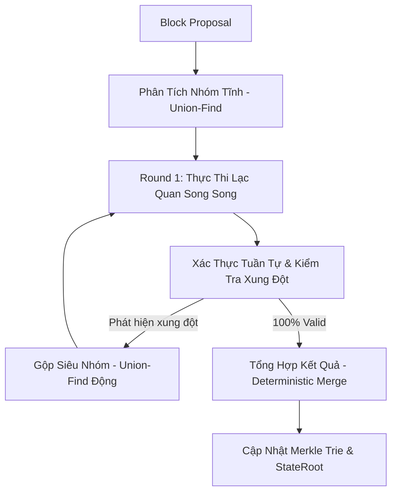

# Kiến Trúc Xử Lý Giao Dịch Đồng Thời (Block-STM) và Zero-Fork Invariant trên Metanode

Tài liệu này cung cấp một cái nhìn toàn diện, chuyên sâu về luồng xử lý giao dịch song song (Parallel Transaction Execution) sử dụng kiến trúc **Optimistic Block-STM** kết hợp thuật toán **Union-Find** tại Metanode Core. Mục đích của tài liệu là dùng để đánh giá lại kiến trúc, phân loại giao dịch, phân tích luồng chạy song song và chứng minh các cơ chế bảo đảm tuyệt đối tính nhất quán trạng thái (Zero-Fork).

---

## 1. Tổng Quan Luồng Xử Lý Block-STM trên Metanode

Khác với kiến trúc Block-STM thuần túy (chỉ dựa trên việc đoán trước và thực thi lại từng giao dịch độc lập), Metanode tối ưu hóa mạnh mẽ bằng mô hình lai (Hybrid Model): **Phân tích nhóm tĩnh (Static Grouping) kết hợp với Block-STM**.

Luồng thực thi diễn ra theo các bước sau:

1. **Phân Tích Nhóm Tĩnh (Static Grouping):** Dựa trên `RelatedAddresses` của các giao dịch, hệ thống dùng thuật toán Union-Find để nhóm các giao dịch chắc chắn xung đột với nhau (VD: cùng `FromAddress`) vào một `RelativeGroup`. Các nhóm này hoàn toàn độc lập với nhau trên lý thuyết.
2. **Round 1 (Thực thi Lạc quan - Parallel Speculative Execution):** Các worker bốc các nhóm ra chạy song song. Các read/write set (`readAccounts`, `readStorage`, `DirtyAccounts`) được ghi nhận vào bộ nhớ tạm (ValidationStateCache).
3. **Pha Xác Thực Tuần Tự (Sequential Validation):** Quá trình duyệt tuần tự mảng gốc. Đối chiếu Read Set của nhóm hiện tại với Write Set của tất cả nhóm trước đó. Nếu đọc nhầm dữ liệu cũ -> Xung đột (Conflict).
4. **Union-Find Động (Khắc phục xung đột):** Các nhóm xung đột được gộp lại thành siêu nhóm (Meta-group). Các siêu nhóm này chạy song song, nhưng giao dịch bên trong siêu nhóm chạy tuần tự. Vòng lặp tiếp tục đến khi hết xung đột.
5. **Phase Cuối (Deterministic Merge):** Tổng hợp Transaction, Receipt, đẩy toàn bộ dữ liệu xuống Global DB và tính toán `IntermediateRoot` để chốt StateRoot.

---

## 2. Phân Loại Giao Dịch và So Sánh Sự Khác Biệt Trong Kiến Trúc Song Song

Hệ thống hỗ trợ các chuẩn giao dịch Ethereum và giao dịch bản địa (Native) của Metanode. 

### A. Các Loại Giao Dịch Theo Chuẩn Ethereum

1. **LegacyTxType (EIP-155 / Frontier):** Giao dịch nguyên bản. Không có Access List, không có Dynamic Fee.
2. **AccessListTxType (EIP-2930):** Giao dịch cung cấp sẵn danh sách `AccessList` (các địa chỉ tài khoản và Storage Keys dự kiến sẽ chạm tới).
   - *Tối ưu Block-STM:* `AccessList` được hệ thống phân tích trước để dự đoán Read/Write Set, biến một phần "xung đột động" của MVM thành "xung đột tĩnh", giúp thuật toán Union-Find gom nhóm chính xác hơn và giảm tỷ lệ Abort ở Round 1.
3. **DynamicFeeTxType (EIP-1559):** Giao dịch phí động với `GasTipCap` và `GasFeeCap`. Tương tự, hỗ trợ `AccessList` để tăng tốc phân luồng.

### B. Các Loại Giao Dịch Theo Hành Vi Thực Thi (Metanode Context)

Trong môi trường máy ảo MVM (Meta Virtual Machine) và C++, các giao dịch được phân loại thành 3 nhóm hành vi chính, ảnh hưởng trực tiếp đến hiệu suất phân luồng:

#### 1. Giao Dịch Gọi Smart Contract (Call Contract / Deploy Contract)
- **Đặc điểm:** Chứa `Data` (bytecode) và có hoặc không có `ToAddress` (Deploy = nil).
- **Thách thức trong Block-STM:** Khó đoán trước dữ liệu Storage sẽ đọc/ghi. `AccessList` (nếu có) giúp gợi ý nhưng không bao hàm tất cả. Dễ xảy ra hiện tượng **Hot-Contract** (nhiều giao dịch cùng gọi 1 contract như IDO, Airdrop) khiến Union-Find gom thành 1 siêu nhóm quá lớn, suy biến thành chạy tuần tự.
- **Xử lý Song song:** 
  - Đọc/Ghi Storage Trie có thể gây xung đột không lường trước (Dynamic Conflict).
  - Áp dụng **Chunking/Giới hạn kích thước siêu nhóm**: Nếu một nhóm quá lớn, ngắt ra thành các chunk nhỏ hơn và chạy theo Pipeline, hoặc xử lý bằng bộ đệm trạng thái cục bộ (Local State Cache) để tránh nghẽn cổ chai.
  - Yêu cầu xử lý **C++ Cache** nghiêm ngặt. Khi chạy lại (Re-execution) do xung đột, MVM API phải bị xóa sạch cache (`mvm.ClearMVMApi(mvmId)`) để tránh lỗi đọc state cũ (Stale Cache) gây lặp vô hạn và OOM.

#### 2. Giao Dịch Chuyển Tiền Thông Thường (Regular Transfer)
- **Đặc điểm:** Chỉ cập nhật số dư (Balance) và Nonce của `FromAddress` và `ToAddress`. Không có `Data`.
- **Thách thức trong Block-STM:** Xung đột khi nhiều người cùng chuyển tiền vào một ví (Crowdfunding/Airdrop).
- **Xử lý Song song:** Thuật toán Union-Find tĩnh làm rất tốt việc gom nhóm các giao dịch này. Nếu có xung đột, việc Merge rất nhẹ vì chỉ tính toán cộng trừ Balance.

#### 3. Giao Dịch Thuần Go (Native Go-Only / BLS TXs)
- **Đặc điểm:** Giao dịch không qua MVM/EVM C++. Ví dụ: Giao dịch thiết lập khóa BLS (`setBlsPublicKey` với `nonce=0`).
- **Thách thức trong Block-STM:** Không được đẩy tất cả vào cùng 1 Worker.
- **Xử lý Song song:** Nhóm này hoàn toàn độc lập với `StakeStateDB`. Cần được phân bổ đều trên toàn bộ các Worker để phân tải CPU, đạt TPS tối đa mà không lo risk data race.

> **💡 Lưu ý quan trọng về phối hợp thực thi:**
> Bất kể là Smart Contract, Regular Transfer hay Native Go-Only, **tất cả** đều được ném vào Worker Pool để thực thi dự đoán (Speculative Execution) hoàn toàn song song cùng một lúc. Các luồng không block lẫn nhau. Chỉ sau khi một vòng thực thi (Round) hoàn tất, hệ thống mới chuyển sang bước **Validation (Check Xung Đột)**. Bất cứ giao dịch nào vi phạm nguyên tắc đọc/ghi sẽ bị hủy và chạy lại ở vòng sau. Cơ chế "Chạy trước, Kiểm tra sau" này là trái tim của Block-STM, giúp tối đa hóa TPS cho mọi loại giao dịch.

### C. So Sánh Sự Khác Biệt Giữa Các Loại

| Tiêu Chí | Contract Call / Deploy (MVM) | Regular Transfer | Native Go-Only (BLS) |
| :--- | :--- | :--- | :--- |
| **Bản chất Xung đột** | Xung đột Động (Dynamic) rất cao tại Storage Slots. | Xung đột Tĩnh (Static) qua `From/To`. | Gần như không xung đột, độc lập. |
| **Khả năng Phân Tích (Preload)** | Phức tạp, phụ thuộc vào thực thi thực tế. | Hoàn hảo (qua `FromAddress`, `ToAddress`). | Hoàn hảo. |
| **Sự Phụ Thuộc C++ / FFI** | **Cao.** Cần cấp phát và dọn dẹp MVM API, có rủi ro memory leak. | **Thấp / Không.** Xử lý trực tiếp StateDB. | **Không.** Chạy hoàn toàn trên Go. |
| **Chi Phí Re-execution** | Rất đắt. Phải reset MVM cache và chạy lại EVM logic. | Rẻ. Chỉ tính lại phép trừ/cộng số dư. | Không bao giờ re-execute (nếu phân luồng đúng). |

---

## 3. Kiến Trúc Bảo Đảm Không Fork (Zero-Fork Invariant)

Mục tiêu quan trọng nhất của kiến trúc này là: **Cho dù phân luồng chạy song song phức tạp cỡ nào, StateRoot (Mã băm trạng thái) trên tất cả các node trong mạng phải giống hệt nhau 100%.** 

Để duy trì tính bất biến (Invariant) này, Metanode áp dụng các cơ chế phòng vệ kiến trúc (Architecture Defenses) ở từng giai đoạn:

> [!IMPORTANT]
> **Bất Khả Xâm Phạm (Zero-Fork Invariant):** Không bao giờ sử dụng `sleep()`, `timeout()`, hay thứ tự ngẫu nhiên trong bất kỳ logic nào có ảnh hưởng đến ghi dữ liệu trạng thái (State write).

### 3.1. Cô Lập Trạng Thái (State Sandbox Isolation)
Mọi việc chạy (cả suy đoán song song lẫn mempool dry-run) đều diễn ra trên **ValidationStateCache** và các **Isolated AccountStateDB**.
- **Không Side-Effect:** Các hàm cập nhật Trie gốc (như `trie.Update()`) tuyệt đối KHÔNG ĐƯỢC GỌI bên trong phase chạy song song (EVM workers). Dữ liệu chỉ cập nhật vào bộ nhớ tạm.
- **MVM Partitioning:** Giao dịch chạy trong EVM C++ được cấp phát `mvmId` dựa trên mã băm của Block và vị trí (Index) giao dịch, đảm bảo C++ context bị cô lập hoàn toàn giữa các worker.

### 3.2. Sắp Xếp Deterministic (Quyết Định Thứ Tự Tuyệt Đối)
- **Thứ tự trong nhóm:** Các giao dịch bên trong cùng một `RelativeGroup` (hoặc siêu nhóm khi merge lại do xung đột) **phải** được sắp xếp bằng `ID` (vị trí gốc trong block proposal). Không sắp xếp theo Nonce/Hash trong pha replay vì sẽ làm vỡ trật tự ban đầu của Leader.
- **Sắp xếp Dirty Addresses:** Trước khi ghi vào Trie ở Phase cuối, mảng các khóa/địa chỉ bắt buộc phải được sắp xếp (`slices.SortFunc`). Vì iterator của Go Map là ngẫu nhiên, việc không sort sẽ làm thứ tự insert khác nhau ở từng node $\rightarrow$ Cây Merkle MPT sẽ có Root Hash khác nhau $\rightarrow$ **FORK MẠNG**.
- **Deterministic Serialization:** Mọi dữ liệu trước khi băm (Hash) để tính StateRoot phải được chuẩn hóa thông qua RLP Encoding hoặc Protobuf ở chế độ deterministic.

### 3.3. Xác Thực Tuần Tự (Sequential Validation Choke-Point)
Dù vòng chạy đầu tiên (Round 1) là hỗn loạn và phi đồng bộ, vòng Validation **luôn luôn** chạy trên một Thread chính và duyệt mảng `groupsToExecute` theo đúng chỉ số gốc (Index 0 $\rightarrow$ N). 
Thuật toán `CheckConflict` đối chiếu `ReadSet` (của TX sau) với `WriteSet` (của TX trước). Nếu có bất kỳ sự giao thoa nào, TX sau bị đánh dấu Abort và bắt buộc chạy lại. Điều này bảo đảm kết quả cuối cùng không khác gì chạy tuần tự 100%.

### 3.4. Quản Lý Trie Song Song (Parallel Trie Root Calculation)
- Các dữ liệu của Smart Contract Storage được chia nhỏ vào các Trie độc lập.
- Việc tính mã băm `IntermediateRoot()` cho các Storage Trie diễn ra song song trên nhiều luồng.
- **Chống Race-Condition:** Tuy nhiên, việc tổng hợp các Hash này ghi vào `TrieDatabaseMapValue` của Account chính lại được chạy tuần tự, khắc phục lỗi Concurrent Write gây lệch Map.

### 3.5. Atomic Batch Write (Ghi Dữ Liệu An Toàn Cuối Cùng)
Sau khi `Deterministic Merge` hoàn tất trên Memory, việc xả dữ liệu xuống Global DB (LevelDB/RocksDB) bắt buộc phải là một **Atomic Batch Write**. Quá trình này phải chạy trên một luồng duy nhất để đảm bảo nếu có sự cố, trạng thái không bị ghi một nửa (partial write), giữ cho StateRoot luôn khớp với Database lưu trữ tĩnh.

---

## 4. Chiến Lược Tối Đa Hóa TPS Đồng Thời

Để đạt được TPS cực đại mà không phá vỡ tính đúng đắn của trạng thái, kiến trúc Block-STM của Metanode áp dụng (và có thể nâng cấp thêm) các chiến lược sau:

1. **Early Abort & Pipelined Validation:** Thay vì chờ Round 1 hoàn tất toàn bộ mới thực hiện tuần tự pha Xác thực (Validation), hệ thống có thể đối chiếu (CheckConflict) ngay khi một giao dịch vừa thực thi lạc quan xong. Nếu phát hiện conflict, phát tín hiệu **Abort ngay lập tức** cho nó và các giao dịch phía sau phụ thuộc vào nó, giúp tránh lãng phí chu kỳ CPU vô ích.
2. **Work-Stealing Scheduler:** Các Worker chạy song song không nên bị khóa cứng vào các nhóm tĩnh ban đầu. Nếu một Worker xử lý xong sớm, nó có thể "trộm" việc (Work-stealing) từ hàng đợi của một Worker đang bị nghẽn (ví dụ do gặp siêu nhóm Hot-Contract), giúp phân bổ tải CPU luôn tiệm cận 100%.
3. **Phân Luồng Riêng Cho Native TX (BLS):** Đẩy các giao dịch BLS hoặc Native Go-Only (không chạm MVM) sang một Threadpool riêng biệt để chạy song song hoàn toàn, không cần chờ đồng bộ với các nhóm Smart Contract.

---

## 5. Các Rủi Ro Tiềm Ẩn Cần Kiểm Soát Khi Bảo Trì

> [!WARNING]
> Bất kỳ sửa đổi nào vào `block_stm.go` hoặc `transaction.go` cần phải chú ý:

1. **Quên Clear C++ Cache khi Re-execution:** Khi Union-Find bắt các nhóm chạy lại ở Vòng 2, nếu thiếu `mvm.ClearMVMApi(mvmId)`, giao dịch sẽ đọc trúng Cache cũ từ C++ MVM, gây sai số dư $\rightarrow$ **FORK**.
2. **Missing Storage Read/Write Set Tracking:** Nếu Engine EVM bỏ sót việc báo cáo một `StorageKey` vừa đọc hoặc ghi vào bộ Tracking của Block-STM, thuật toán `CheckConflict` sẽ bỏ lọt xung đột $\rightarrow$ Giao dịch chạy song song đè data lẫn nhau $\rightarrow$ **FORK**.
3. **Giao dịch Go-only (BLS) spam:** Nếu tập hợp sai toàn bộ BLS Tx vào một group duy nhất, CPU sẽ xảy ra hiện tượng thắt cổ chai đơn luồng trong khi mạng đang chịu tải lớn, làm giảm TPS đột ngột.

## 6. Kết Luận Đánh Giá
Kiến trúc luồng xử lý giao dịch hiện tại của Metanode thể hiện sự tinh vi cao độ. Việc sử dụng Union-Find trước khi chạy Block-STM giúp loại bỏ chi phí Abort lãng phí cho các giao dịch chắc chắn xung đột tĩnh. Việc kết hợp AccessList, Pipelining và Work-Stealing sẽ giúp hệ thống mở rộng TPS lên mức tối đa. Các cơ chế Sandbox Memory, Atomic Batch Write và Deterministic Sorting tạo thành "bức tường lửa" vững chắc chống lại mọi vector gây Fork mạng. Cần tiếp tục duy trì nguyên tắc State Isolation nghiêm ngặt khi bổ sung các tính năng hoặc chuẩn EIP mới trong tương lai.
