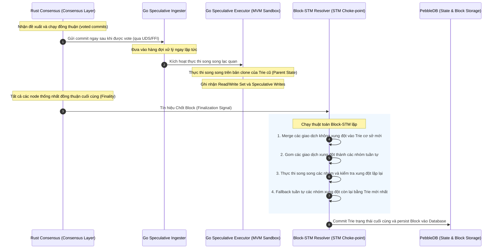
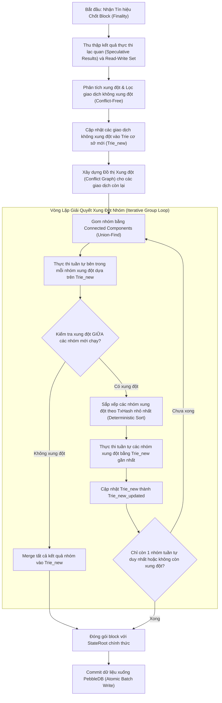

# 🪐 Kiến Trúc Block-STM Lặp (Iterative Group Conflict Resolution) trên Go Executor

Tài liệu này mô tả chi tiết thiết kế kiến trúc xử lý giao dịch song song mới, trong đó **Rust tối giản hóa vai trò** (chỉ chạy đồng thuận và gửi các commit đã được vote sang Go) và **Go chịu trách nhiệm xử lý xung đột động** bằng thuật toán **Block-STM lặp (Iterative Group Conflict Resolution)** khi chốt block.

---

## 1. Luồng Kiến Trúc Tổng Quan (Rust ➡️ Go)

Sự thay đổi căn bản trong phân chia vai trò giữa hai lớp:



### Phân rã vai trò:
1. **Rust (Consensus Layer):** KHÔNG chịu trách nhiệm đóng gói block nữa. Rust chỉ chạy giao thức đồng thuận (DAG/BFT). Ngay khi các commit nhận đủ vote từ các node khác, Rust lập tức dispatch commit sang Go thông qua FFI/UDS channel, không cần chờ chốt block.
2. **Go (Execution Layer):** Nhận commit và thực thi lạc quan ngay lập tức (Speculative execution) dựa trên Trie trạng thái của block trước đó (Parent Trie). Khi nhận được tín hiệu đồng thuận cuối cùng từ Rust, Go sẽ gom các commit và chạy thuật toán Block-STM lặp để xử lý xung đột động, tính toán StateRoot và đóng gói block chính thức.

## 1.5. Quy Tắc Gom Commit Thành Block (Commit-to-Block Packaging Rules)

Để đảm bảo tính nhất quán tuyệt đối giữa Go và Rust, lớp Go Execution phải tuân thủ nghiêm ngặt quy trình và quy tắc gom giao dịch từ commit thành block dưới đây (tương thích 100% với giải thuật đóng gói của Rust hiện tại):

### Cơ chế đóng gói hiện tại của Rust (Legacy flow):
Một commit consensus (`CommittedSubDag`) thực chất chứa nhiều khối DAG nội bộ (`blocks: Vec<VerifiedBlock>`) đề xuất bởi các validator khác nhau. Trước khi gửi sang Go, Rust đóng gói các khối DAG này thành một `ExecutableBlock` duy nhất (hoặc phân mảnh) theo các bước:
1. **Thu thập (Collect):** Gom tất cả giao dịch từ toàn bộ các khối DAG con có trong `CommittedSubDag`.
2. **Lọc (Filter):** Tách riêng giao dịch hệ thống (`SystemTransaction`). Loại bỏ các giao dịch lỗi không đúng cấu trúc protobuf.
3. **Loại trùng (Deduplicate):** Loại bỏ các giao dịch bị trùng lặp bằng cách so khớp mã băm giao dịch (`TxHash`).
4. **Sắp xếp Lexicographical (Bắt buộc):** Toàn bộ các giao dịch hợp lệ còn lại được **sắp xếp theo thứ tự bảng chữ cái tăng dần của mã băm giao dịch (Lexicographical Sort by TxHash)**. Điều này đảm bảo trật tự thực thi EVM là hoàn toàn xác định trên tất cả các node bất kể thứ tự khối DAG đến.
5. **Đóng gói & Phân mảnh (Fragmentation):** Nếu tổng số giao dịch sau khi gom lớn hơn `MAX_TXS_PER_GO_BLOCK` (65,000), danh sách đã sắp xếp sẽ được chia nhỏ thành các phân mảnh độc lập, mỗi phân mảnh nhận một block number và chỉ số GEI tăng dần tuần tự.

### Quy tắc áp dụng cho Go trong kiến trúc mới:
Khi Rust không làm nhiệm vụ đóng gói block nữa mà gửi thẳng các voted commits sang Go, lớp Go Execution (Block-STM Resolver) khi chốt block dựa trên tín hiệu finality **phải thực hiện chính xác quy trình gom và sắp xếp trên** đối với các commit được chốt:
- Gom toàn bộ giao dịch từ các DAG blocks của commit(s).
- Lọc giao dịch hệ thống và giao dịch sai định dạng.
- Loại trùng giao dịch bằng TxHash.
- **Sắp xếp tăng dần theo TxHash (Lexicographical Sort by TxHash)** trước khi phân nhóm và đưa vào Block-STM lặp để thực thi.
- Thực hiện phân mảnh block nếu tổng giao dịch vượt quá 65,000.

Việc tuân thủ 100% thuật toán gom và sắp xếp này trên Go đảm bảo Block Hash và StateRoot tính toán ra trên Go luôn trùng khớp tuyệt đối giữa mọi node validator trong mạng, ngăn chặn hoàn toàn rủi ro rẽ nhánh (Zero-Fork).

---

## 2. Thuật Toán Xử Lý Xung Đột Block-STM Lặp (Iterative Grouping)

Thuật toán giải quyết xung đột khi chốt block được mô tả chi tiết qua sơ đồ và các pha thực hiện dưới đây:



### Chi tiết các bước thực hiện của thuật toán:

#### Bước 1: Thu thập thông tin truy cập (Read-Write Set Tracking)
Mỗi giao dịch $T_i$ khi thực thi lạc quan song song trên Trie của block trước sẽ ghi nhận:
- **Read Set ($R_i$):** Danh sách các địa chỉ tài khoản và storage keys mà $T_i$ đã đọc.
- **Write Set ($W_i$):** Danh sách các địa chỉ tài khoản và storage keys mà $T_i$ ghi đè dữ liệu mới kèm theo giá trị ghi.

#### Bước 2: Tách biệt giao dịch không xung đột (Conflict-Free Merge)
- Đối chiếu Read-Write sets của tất cả giao dịch trong tập hợp.
- Giao dịch $T_i$ được coi là không xung đột (Conflict-free) nếu và chỉ nếu:
  $$ \forall j \neq i: (R_i \cap W_j = \emptyset) \wedge (W_i \cap W_j = \emptyset) $$
- **Hành động:** Cập nhật ngay lập tức các thay đổi trạng thái của nhóm giao dịch không xung đột này vào Trie trạng thái của block trước. Trie sau khi cập nhật được gọi là **Trie cơ sở mới ($Trie_{new}$)**.

#### Bước 3: Gom nhóm lặp giải quyết xung đột (Iterative Grouping & Connected Components)
Với các giao dịch còn lại (có xung đột):
1. **Xây dựng đồ thị xung đột (Conflict Graph) dựa trên xung đột trạng thái:** Mỗi giao dịch là một đỉnh, có cạnh nối giữa $T_i$ và $T_j$ nếu có xung đột trạng thái (xung đột giữa tập hợp Read/Write Set trên tài khoản hoặc các storage key) trong quá trình thực thi.
2. **Gom nhóm bằng thuật toán Connected Components (Union-Find):** Phân chia các giao dịch có xung đột trạng thái trực tiếp hoặc gián tiếp với nhau vào cùng một nhóm độc lập $\{G_1, G_2, ..., G_m\}$.
3. **Thực thi tuần tự trong nhóm:** Giao dịch trong cùng nhóm $G_k$ bắt buộc phải được thực thi tuần tự theo thứ tự index gốc dựa trên $Trie_{new}$ để đảm bảo tính deterministic.
4. **Kiểm tra xung đột liên nhóm (Inter-Group Conflict Check):**
   - Sau khi thực thi xong các nhóm, kiểm tra xem kết quả thực thi mới của nhóm $G_a$ có xung đột với nhóm $G_b$ không.
   - **Trường hợp A (Không xung đột giữa các nhóm):** Cập nhật toàn bộ kết quả của các nhóm vào $Trie_{new}$ để tạo ra Trie trạng thái mới gần nhất.
   - **Trường hợp B (Có xung đột giữa các nhóm):** Sắp xếp các nhóm xung đột theo **thứ tự tăng dần của mã băm giao dịch nhỏ nhất (smallest TxHash)** trong mỗi nhóm (tương tự thuật toán sắp xếp nhóm trong `grouptxns.go`). Thực thi tuần tự các nhóm này bằng cách áp dụng kết quả của nhóm trước vào $Trie_{new}$ làm trạng thái đầu vào cho nhóm sau.
5. **Lặp lại (Iterate):** Quá trình này lặp lại cho đến khi không còn xung đột nào giữa các nhóm, hoặc chỉ còn một nhóm tuần tự duy nhất chứa toàn bộ các giao dịch còn lại.

#### Bước 4: Commit Block
Trie trạng thái cuối cùng thu được chính là Trie trạng thái của Block. Go Master tiến hành tính toán StateRoot, tạo block và thực hiện ghi atomic (Atomic Batch Write) xuống PebbleDB.

---

## 3. Thiết Kế Cấu Trúc Dữ Liệu trên Go (MVM/Go Structs)

Dưới đây là đề xuất các cấu trúc dữ liệu chính trong Go phục vụ việc triển khai Block-STM lặp:

```go
package block_stm

import (
	"github.com/ethereum/go-ethereum/common"
	"github.com/meta-node-blockchain/meta-node/pkg/blockchain"
	"github.com/meta-node-blockchain/meta-node/types"
)

// AccessSet định nghĩa tập hợp các tài nguyên trạng thái được truy cập
type AccessSet struct {
	AccountReads   map[common.Address]bool
	AccountWrites  map[common.Address]bool
	StorageReads   map[common.Address]map[common.Hash]bool
	StorageWrites  map[common.Address]map[common.Hash]bool
}

// SpeculativeTxResult lưu trữ kết quả chạy thử của từng giao dịch
type SpeculativeTxResult struct {
	Tx            types.Transaction
	IndexInBlock  int
	AccessSet     *AccessSet
	StateChanges  *blockchain.AccountStateChanges // Bộ đệm thay đổi trạng thái
	ExecuteErr    error
}

// ConflictGroup đại diện cho một nhóm giao dịch xung đột
type ConflictGroup struct {
	GroupID      int
	Transactions []*SpeculativeTxResult // Được sắp xếp theo IndexInBlock tăng dần
	ResultTrie   *blockchain.ChainState  // Trie sau khi thực thi nhóm này
}

// BlockSTMResolver quản lý tiến trình giải quyết xung đột lặp
type BlockSTMResolver struct {
	ParentState *blockchain.ChainState
	MaxIterations int
}

func NewBlockSTMResolver(parentState *blockchain.ChainState) *BlockSTMResolver {
	return &BlockSTMResolver{
		ParentState:   parentState,
		MaxIterations: 10, // Giới hạn an toàn chống lặp vô hạn
	}
}

// ResolveConflicts thực hiện thuật toán xử lý xung đột lặp
func (r *BlockSTMResolver) ResolveConflicts(txResults []*SpeculativeTxResult) (*blockchain.ChainState, error) {
	// 1. Lọc các giao dịch không xung đột (Conflict-Free)
	conflictFree, conflicting := r.filterConflictFree(txResults)

	// 2. Cập nhật các giao dịch không xung đột vào Trie cơ sở mới
	currentTrie, err := r.mergeConflictFree(r.ParentState, conflictFree)
	if err != nil {
		return nil, err
	}

	if len(conflicting) == 0 {
		return currentTrie, nil
	}

	// 3. Vòng lặp giải quyết xung đột nhóm
	iteration := 0
	for {
		iteration++
		
		// Xây dựng các nhóm xung đột bằng thuật toán Connected Components
		groups := r.buildConflictGroups(conflicting, currentTrie)
		
		// Nếu tất cả các nhóm đều là nhóm đơn lẻ (không có xung đột chéo)
		if r.hasNoInterGroupConflicts(groups) {
			// Merge tất cả các nhóm song song vào Trie hiện tại
			currentTrie, err = r.mergeGroupsParallel(currentTrie, groups)
			break
		}

		// Nếu xảy ra xung đột chéo, thực hiện tuần tự các nhóm theo thứ tự Index gốc
		currentTrie, err = r.executeGroupsSequentially(currentTrie, groups)
		
		// Điểm dừng: Chỉ còn 1 nhóm tuần tự duy nhất hoặc đạt số vòng lặp tối đa
		if len(groups) <= 1 || iteration >= r.MaxIterations {
			break
		}
	}

	return currentTrie, nil
}
```

---

## 4. Bảo Đảm Tính Deterministic Chống Fork Mạng (Zero-Fork Invariant)

Mọi node trong mạng chạy song song và độc lập nhưng **phải tính toán ra cùng một StateRoot chính xác**. Để đạt được điều này, thuật toán xử lý xung đột lặp phải tuân thủ nghiêm ngặt các nguyên tắc deterministic sau:

1. **Deterministic Tie-Breaking in Union-Find:**
   Khi phân chia các connected components trong đồ thị xung đột, cấu trúc dữ liệu Union-Find phải duyệt qua các đỉnh (giao dịch) theo thứ tự `IndexInBlock` tăng dần. Điều này đảm bảo cấu trúc nhóm được tạo ra giống nhau 100% trên tất cả các node.
2. **Deterministic Sequence in Groups:**
   Các giao dịch bên trong cùng một nhóm xung đột bắt buộc phải được thực thi tuần tự theo đúng thứ tự xuất hiện gốc trong block (`IndexInBlock`), không được thay đổi thứ tự dựa trên thời gian thực thi của worker hay bất kỳ yếu tố phi tuyến nào.
3. **Deterministic Multi-Stage Re-execution:**
   Khi xảy ra re-execution tuần tự giữa các nhóm có xung đột chéo, thứ tự áp dụng kết quả của nhóm này lên nhóm khác phải tuân thủ thứ tự chỉ số nhóm (`GroupID` được gán deterministic dựa trên **mã băm giao dịch (TxHash) nhỏ nhất** của giao dịch trong nhóm đó - tương tự thuật toán sắp xếp nhóm của `grouptxns.go`).
4. **Deterministic Trie Commit:**
   Trước khi ghi dữ liệu Trie xuống PebbleDB, các thay đổi trạng thái của tài khoản và storage keys phải được sắp xếp theo bảng chữ cái/thứ tự nhị phân của Address/StorageKey để đảm bảo cấu trúc cây Merkle Trie được xây dựng giống hệt nhau trên mọi node.

---

## 5. Kế Hoạch Triển Khai (Roadmap)

1. **Phase 1 (Rust side):**
   - Điều chỉnh cấu trúc `CommitProcessor` trong Rust để dispatch dữ liệu commit ngay sau khi đạt quorum vote.
   - Loại bỏ logic đóng gói block và xác thực block gốc ở Rust.
2. **Phase 2 (Go side - State Engine):**
   - Triển khai bộ phân tích Read-Write Set trong MVM Go wrapper.
   - Viết module `block_stm_resolver.go` thực thi thuật toán Connected Components và vòng lặp giải quyết xung đột lặp.
3. **Phase 3 (Integration & Verification):**
   - Viết unit test giả lập các kịch bản xung đột phức tạp (Hot-contract, Airdrop transfer, Native BLS mix).
   - Kiểm tra và tối ưu hóa việc xóa cache của MVM khi re-execute để tránh rò rỉ bộ nhớ.
