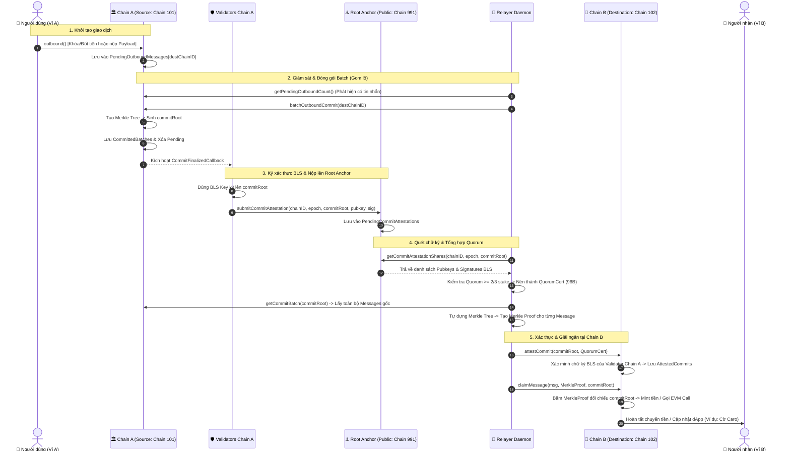

# 🌉 Luồng Giao Dịch Xuyên Chuỗi (Cross-Chain Flow) trong MetaNode

Quá trình chuyển tiền (Asset Transfer) hoặc gọi Smart Contract xuyên chuỗi (General Message Passing - GMP) từ **Chain A (Source Chain)** sang **Chain B (Destination Chain)** trong MetaNode được thiết kế theo kiến trúc **Zero-Trust & Zero-Fork**: hoàn toàn phi tập trung, bảo mật bằng chữ ký nhóm BLS (BLS Threshold Signature) và một Public Chain trung tâm làm mỏ neo (**Root Anchor - Chain 991**).

---

## 📊 Sơ Đồ Luồng Tổng Thể (Sequence Diagram)

---

## 🗺️ Bản Đồ Nguồn Dữ Liệu (Data Origin Map)

| Mảnh dữ liệu | Nơi lưu trữ gốc | Cách Relayer lấy về | Vai trò |
| :--- | :--- | :--- | :--- |
| **1. Tin nhắn gốc (Messages)** | **Chain A (101)** | `getCommitBatch(commitRoot)` | Chứa thông tin chi tiết: người gửi, người nhận, số tiền, calldata smart contract. |
| **2. Bằng chứng Merkle (Merkle Proof)** | **Relayer tự tính toán** | `BuildMerkleTree(messages)` | Mảng các hash nhánh anh em (Siblings) chứng minh tin nhắn thuộc về `commitRoot`. |
| **3. Chữ ký chứng thực (BLS Shares)** | **Root Anchor (991)** | `getCommitAttestationShares(...)` | Các phần chữ ký BLS của uỷ ban Validator Chain A bảo chứng cho `commitRoot`. |
| **4. Danh bạ chuỗi (Chain Registry)** | **Root Anchor (991)** | `getChainRegistry(chainID)` | Danh sách Public Key BLS và số lượng Stake của từng Validator để kiểm tra ngưỡng $\ge 2/3$. |

---

## 🔍 Chi Tiết Từng Bước Trong Quy Trình

### Bước 1: Người dùng khởi tạo lệnh Outbound (Chain A)
Người dùng gửi giao dịch EVM gọi hàm `outbound` trên Gateway Contract (`0x0000000000000000000000000000000000001002`) của Chain A:
- **Hành động:** 
  - Nếu là chuyển tiền: Native token (MTN) của người gửi bị **đốt (Burn)** hoặc token ERC20 bị **khóa (Lock)**.
  - Nếu là gọi Smart Contract: Người gửi nộp `gasFee` + `payload` hàm cần gọi.
- **Lưu trữ:** Tin nhắn được đưa vào hàng đợi `PendingOutboundMessages[destChainID]`.

---

### Bước 2: Relayer gom lô & Chốt gốc Merkle (Chain A)
Tiến trình `RelayerDaemon` quét định kỳ qua hàm `getPendingOutboundCount`:
- Khi phát hiện có tin nhắn đang chờ, Relayer gửi transaction gọi `batchOutboundCommit(destChainID)`.
- Gateway Chain A gom toàn bộ tin nhắn pending, xây dựng cây Merkle Tree và tạo ra mã băm gốc **`commitRoot`**.
- Dữ liệu lô được chuyển vào `CommittedBatches` và kích hoạt `CommitFinalizedCallback`.

---

### Bước 3: Validators Chain A ký BLS & Nộp lên Root Anchor (Chain 991)
Background worker (`CommitAttestationWorker`) trên từng node Validator của Chain A bắt sự kiện `CommitFinalizedCallback`:
- Mỗi Validator dùng **BLS Private Key** ký lên `commitRoot`.
- Nộp chữ ký phần lên Smart Contract Gateway của Root Anchor (Chain 991) qua hàm `submitCommitAttestation(...)`.
- Root Anchor lưu trữ chữ ký vào State Trie `PendingCommitAttestations`.

---

### Bước 4: Relayer quét Root Anchor, tổng hợp QuorumCert & Merkle Proof
Relayer thực hiện:
1. Gửi lệnh `eth_call` gọi `getCommitAttestationShares` lên Root Anchor để lấy mảng chữ ký BLS.
2. Kiểm tra tổng Stake của các Validator đã ký đối chiếu với `getChainRegistry(sourceChainID)`.
3. Khi đạt ngưỡng Quorum ($\ge 66.7\%$), Relayer dùng thư viện `blst` nén toàn bộ chữ ký thành **1 chữ ký tổng hợp duy nhất (Aggregate Signature - 96 bytes)** và tạo `SignerBitmap`.
4. Gọi `getCommitBatch(commitRoot)` lên Chain A để lấy mảng `messages`, sau đó tự tính toán `MerkleProof` cho từng tin nhắn.

---

### Bước 5: Xác thực lô trên Chain Đích (Chain B - 102)
Relayer gửi transaction `attestCommit(sourceChainID, commitRoot, quorumCert)` sang Gateway Chain B:
- Gateway Chain B lấy danh sách Public Key của uỷ ban Chain A để xác minh chữ ký BLS nhóm.
- Đảm bảo $\ge 2/3$ sức mạnh mạng của Chain A đã đồng thuận.
- Nếu hợp lệ $\rightarrow$ Ghi nhận `commitRoot` vào danh sách `AttestedCommits` (Không ai có thể giả mạo lô này).

---

### Bước 6: Thực thi tin nhắn & Giải ngân (Chain B - 102)
Relayer (hoặc chính Client) gửi transaction `claimMessage(msg, proof, commitRoot)` sang Chain B:
- **Kiểm tra chống Replay:** Xác nhận `msg.MessageID` chưa từng được claim trước đó.
- **Kiểm tra Merkle Path:** Gateway Chain B băm tin nhắn $M$ với các nhánh anh em (`proof.Siblings`). Nếu kết quả khớp chính xác 100% với `commitRoot` đã chứng thực ở Bước 5 $\rightarrow$ **Hợp lệ tuyệt đối!**
- **Thực thi logic:**
  - Chuyển tiền: Tự động **Mint (in)** số tiền tương ứng vào ví người nhận.
  - Smart Contract Call: Tự động thực thi `evm.Call(target, payload)` (ví dụ: kích hoạt hàm đánh cờ Caro `playMove(row, col)`).
- Đánh dấu trạng thái tin nhắn thành `Executed`.

---

## 🛡️ Nguyên Tắc An Ninh Mật Mã Học (Security Guarantees)

1. **Relayer không thể gian lận:** Relayer chỉ là người vận chuyển (Untrusted Courier). Nếu Relayer sửa đổi dù chỉ 1 bit trong tin nhắn, Merkle Proof sẽ sai và Chain B sẽ revert ngay lập tức.
2. **Không có điểm nghẽn tập trung:** Quá trình chứng thực dựa trên chữ ký nhóm $\ge 2/3$ của toàn bộ uỷ ban Validator độc lập.
3. **Chống chi tiêu kép (Replay Protection):** Mỗi tin nhắn có `MessageID` băm duy nhất và được lưu trạng thái `Executed` vĩnh viễn trên State Trie của chuỗi đích.
4. **Bảo toàn tổng cung (Conservation of Balance):** Số tiền bị Burn trên Chain Nguồn luôn khớp chính xác tuyệt đối với số tiền được Mint trên Chain Đích.
