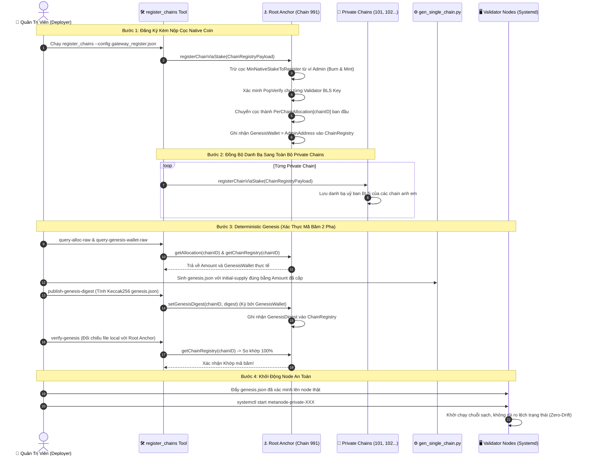
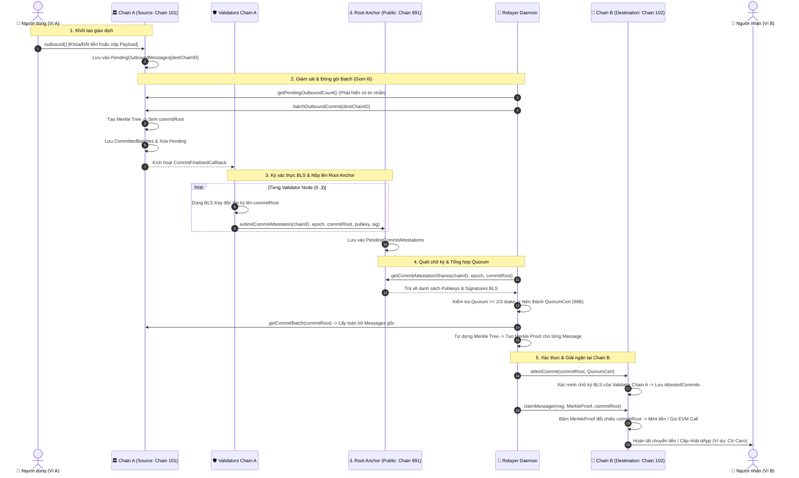

# 🌉 Luồng Đăng Ký & Giao Dịch Xuyên Chuỗi (Cross-Chain Flow) trong MetaNode

Tài liệu này mô tả toàn diện hai luồng hoạt động cốt lõi của hệ thống liên chuỗi MetaNode:
1. **Phần I: Luồng Đăng Ký Chuỗi Mới & Khởi Tạo Genesis Xác Định (Chain Registration & Deterministic Genesis Flow)** — cập nhật mới nhất theo thiết kế cọc thật và deterministic genesis (2026-09-04).
2. **Phần II: Luồng Giao Dịch Xuyên Chuỗi (Cross-Chain Transaction Flow)** — quá trình chuyển tiền và gọi smart contract phi tập trung, bảo đảm **Zero-Trust, Zero-Fork và Bảo toàn tổng cung (Conservation of Balance)** qua Gateway Precompile (`0x1002`).

---

# 🏛️ PHẦN I: LUỒNG ĐĂNG KÝ CHUỖI MỚI & DETERMINISTIC GENESIS

## 1. Bối cảnh & Các Thay Đổi Quan Trọng
- **Khai tử cơ chế cũ (`BootstrapFoundingChains`)**: Trước đây cơ chế bootstrap nạp danh bạ theo lô không yêu cầu cọc và dễ bị thao túng (lỗ hổng C6). Hàm này đã bị gỡ bỏ hoàn toàn.
- **Cơ chế mới (`registerChainViaStake`)**:
  - Mỗi chain đăng ký độc lập bằng một giao dịch EVM gửi tới Gateway Precompile (`0x1002`).
  - **Cọc thật bằng Native Coin**: Bắt buộc trừ tiền cọc (`MinNativeStakeToRegister` wei) trực tiếp từ ví người đăng ký (`tx.FromAddress()`). Tiền này được burn khỏi ví và mint vào quỹ Gateway contract.
  - **Chống Rogue Key bằng Proof-of-Possession (`PopVerify`)**: Toàn bộ BLS Public Key của validator trong uỷ ban bắt buộc phải nộp chữ ký PoP hợp lệ.
- **Cấp hạn mức tức thì theo mô hình "Eurozone" (Cập nhật 2026-09-04)**:
  - Tiền cọc mà chain trả trên Root Anchor được chuyển thẳng từ pool Reserve sang `SupplyLedger.PerChainAllocation[chainID mới]`.
  - Chain mới có ngay hạn mức lưu thông ban đầu để sử dụng mà không cần chờ mở biểu quyết governance đề xuất cấp vốn riêng.
- **Đăng ký danh bạ chéo đồng bộ (Cross-Chain Registry)**:
  - Công cụ `register_chains` gửi giao dịch `registerChainViaStake` lên **Root Anchor (Chain 991)** VÀ gửi lên **tất cả các Private Chains (Chain 101, 102...)**. Nhờ đó, Gateway của chuỗi đích có sẵn uỷ ban BLS của chuỗi nguồn để xác thực `attestCommit`.
- **Deterministic Genesis & On-Chain Digest Verification (2026-09-04)**:
  - Đảm bảo genesis của node thật khớp 100% với thông tin hạn mức đã được Root Anchor ghi nhận.

---

## 2. Sơ Đồ Trình Tự Đăng Ký Chuỗi (Sequence Diagram)

---

## 3. Chi Tiết Các Bước Trong Luồng Đăng Ký

### 🔹 Bước 1: Nộp Cọc & Đăng Ký Uỷ Ban Lên Root Anchor
1. Quản trị viên chuẩn bị cấu hình `gateway_register.json` chứa danh sách các validator, BLS Public Key, Stake và chữ ký Proof-of-Possession (`PopSignature`).
2. Gửi giao dịch EVM gọi hàm `registerChainViaStake(payload)` lên Root Anchor Gateway (`0x1002`).
3. Gateway kiểm tra:
   - Số dư ví người gọi có đủ $\ge$ `MinNativeStakeToRegister` hay không.
   - Gọi `PopVerify` kiểm tra tính hợp lệ của từng chữ ký BLS.
   - Trừ tiền từ ví và nạp vào quỹ dự phòng của Gateway.
   - Tự động chuyển số tiền cọc từ hạn mức Reserve sang `PerChainAllocation[chainID mới]` (Mô hình Eurozone tự cấp vốn).
   - Thiết lập `GenesisWallet = tx.FromAddress()`.

### 🔹 Bước 2: Phổ Biến Danh Bạ Chéo Đến Mọi Private Chain
- Để Chain B có thể xác minh chữ ký của Chain A khi có giao dịch chuyển đến, Chain B phải có danh bạ uỷ ban của Chain A.
- Script `register_chains` gửi cùng payload `registerChainViaStake` tới RPC của từng Private Chain đang chạy để cập nhật bảng `ChainRegistry` nội bộ trên từng chain.

### 🔹 Bước 3: Xác Thực Genesis Xác Định (Deterministic Genesis)
Nhằm triệt tiêu 100% rủi ro chênh lệch số dư (State Drift) hoặc giả mạo genesis:
1. **Truy vấn ngược**: Script đọc số tiền thực tế và địa chỉ ví genesis mà Root Anchor đã chấp thuận (`query-alloc-raw`).
2. **Sinh Genesis**: Gọi script `gen_single_chain.py` tạo `genesis.json` với trường `initial-supply` khớp chính xác con số Root Anchor xác nhận.
3. **Công bố Digest**: Tính mã băm Keccak256 của file `genesis.json` và gọi `setGenesisDigest(chainID, digest)` trên Root Anchor (chỉ `GenesisWallet` mới có quyền gọi).
4. **Kiểm tra chốt chặn (`verify-genesis`)**: Trước khi khởi chạy node, lệnh kiểm tra sẽ băm lại file local và đối chiếu với Root Anchor. Nếu sai lệch dù chỉ 1 byte, quá trình deploy sẽ dừng khẩn cấp (`fail-closed`).

---

# 🚀 PHẦN II: LUỒNG GIAO DỊCH XUYÊN CHUỖI (CROSS-CHAIN TRANSACTION FLOW)

Sau khi các chain đã đăng ký danh bạ thành công, người dùng và dApp có thể thực hiện giao dịch chuyển tài sản hoặc gọi Smart Contract giữa các chain.

## 1. Sơ Đồ Luồng Tổng Thể (Sequence Diagram)

---

## 2. Bản Đồ Nguồn Dữ Liệu (Data Origin Map)

| Mảnh dữ liệu | Nơi lưu trữ gốc | Cách Relayer lấy về | Vai trò |
| :--- | :--- | :--- | :--- |
| **1. Tin nhắn gốc (Messages)** | **Chain A (101)** | `getCommitBatch(commitRoot)` | Chứa thông tin chi tiết: người gửi, người nhận, số tiền, calldata smart contract. |
| **2. Bằng chứng Merkle (Merkle Proof)** | **Relayer tự tính toán** | `BuildMerkleTree(messages)` | Mảng các hash nhánh anh em (Siblings) chứng minh tin nhắn thuộc về `commitRoot`. |
| **3. Chữ ký chứng thực (BLS Shares)** | **Root Anchor (991)** | `getCommitAttestationShares(...)` | Các phần chữ ký BLS của uỷ ban Validator Chain A bảo chứng cho `commitRoot`. |
| **4. Danh bạ chuỗi (Chain Registry)** | **Root Anchor (991)** | `getChainRegistry(chainID)` | Danh sách Public Key BLS và số lượng Stake của từng Validator để kiểm tra ngưỡng $\ge 2/3$. |

---

## 3. Chi Tiết Từng Bước Trong Luồng Giao Dịch

### Bước 1: Người dùng khởi tạo lệnh Outbound (Chain A)
Người dùng gửi giao dịch EVM gọi hàm `outbound` trên Gateway Contract (`0x0000000000000000000000000000000000001002`) của Chain A:
- **Chuyển tiền**: Native coin (MTN) của người gửi bị **đốt (Burn)** trên Chain A.
- **Gọi Contract (GMP)**: Người gửi nộp `gasFee` + `payload` hàm cần gọi trên chuỗi đích.
- Tin nhắn được xếp vào hàng đợi `PendingOutboundMessages[destChainID]`.

### Bước 2: Relayer gom lô & Chốt gốc Merkle (Chain A)
Tiến trình `RelayerDaemon` quét định kỳ qua hàm `getPendingOutboundCount`:
- Khi phát hiện có tin nhắn đang chờ, Relayer gửi transaction gọi `batchOutboundCommit(destChainID)`.
- Gateway Chain A gom toàn bộ tin nhắn pending, xây dựng cây Merkle Tree và tạo ra mã băm gốc **`commitRoot`**.
- Dữ liệu lô được lưu vào `CommittedBatches` và kích hoạt sự kiện `CommitFinalizedCallback`.

### Bước 3: Validators Chain A ký BLS & Nộp lên Root Anchor (Chain 991)
Background worker (`CommitAttestationWorker`) trên từng node Validator của Chain A bắt sự kiện `CommitFinalizedCallback`:
- Từng Validator dùng **BLS Private Key** ký lên `commitRoot`.
- Nộp chữ ký phần lên Smart Contract Gateway của Root Anchor (Chain 991) qua hàm `submitCommitAttestation(...)`. Mỗi node sử dụng submitter private key riêng (`node_submitter_keys`) để tránh xung đột nonce.
- Root Anchor lưu trữ chữ ký vào State Trie `PendingCommitAttestations`.

### Bước 4: Relayer quét Root Anchor, tổng hợp QuorumCert & Merkle Proof
Relayer thực hiện:
1. Gửi lệnh `eth_call` gọi `getCommitAttestationShares` lên Root Anchor để lấy mảng chữ ký BLS.
2. Kiểm tra tổng Stake của các Validator đã ký đối chiếu với `getChainRegistry(sourceChainID)`.
3. Khi đạt ngưỡng Quorum ($\ge 66.7\%$), Relayer nén toàn bộ chữ ký thành **1 chữ ký tổng hợp duy nhất (Aggregate Signature - 96 bytes)** và tạo `SignerBitmap`.
4. Gọi `getCommitBatch(commitRoot)` lên Chain A để lấy mảng `messages`, sau đó tự tính toán `MerkleProof` cho từng tin nhắn.

### Bước 5: Xác thực lô trên Chain Đích (Chain B - 102)
Relayer gửi transaction `attestCommit(sourceChainID, commitRoot, quorumCert)` sang Gateway Chain B:
- Gateway Chain B lấy danh sách Public Key của uỷ ban Chain A (đã được nạp ở Bước Đăng Ký) để xác minh chữ ký BLS nhóm.
- Đảm bảo $\ge 2/3$ sức mạnh mạng của Chain A đã đồng thuận.
- Nếu hợp lệ $\rightarrow$ Ghi nhận `commitRoot` vào danh sách `AttestedCommits`.

### Bước 6: Thực thi tin nhắn & Giải ngân (Chain B - 102)
Relayer (hoặc chính Client) gửi transaction `claimMessage(msg, proof, commitRoot)` sang Chain B:
- **Kiểm tra chống Replay**: Xác nhận `msg.MessageID` chưa từng được claim trước đó.
- **Kiểm tra Merkle Path**: Gateway Chain B băm tin nhắn $M$ với các nhánh anh em (`proof.Siblings`). Nếu kết quả khớp chính xác 100% với `commitRoot` đã chứng thực ở Bước 5 $\rightarrow$ Hợp lệ!
- **Thực thi logic**:
  - Chuyển tiền: Tự động **Mint (in)** số tiền tương ứng vào ví người nhận.
  - Smart Contract Call: Tự động thực thi `evm.Call(target, payload)` (ví dụ: kích hoạt hàm đánh cờ Caro `playMove(row, col)`).
- Đánh dấu trạng thái tin nhắn thành `Executed`.

---

## 🛡️ Nguyên Tắc An Ninh Mật Mã Học (Security Guarantees)

1. **Relayer không thể gian lận**: Relayer chỉ là người vận chuyển (Untrusted Courier). Nếu Relayer sửa đổi dù chỉ 1 bit trong tin nhắn, Merkle Proof sẽ sai và Chain B sẽ revert ngay lập tức.
2. **Không có điểm nghẽn tập trung**: Quá trình chứng thực dựa trên chữ ký nhóm $\ge 2/3$ của toàn bộ uỷ ban Validator độc lập.
3. **Chống chi tiêu kép (Replay Protection)**: Mỗi tin nhắn có `MessageID` băm duy nhất và được lưu trạng thái `Executed` vĩnh viễn trên State Trie của chuỗi đích.
4. **Bảo toàn tổng cung (Conservation of Balance)**: Số tiền bị Burn trên Chain Nguồn luôn khớp chính xác tuyệt đối với số tiền được Mint trên Chain Đích. Cọc đăng ký và hạn mức trần lưu thông luôn tuân theo định luật bảo toàn $Sum(PerChainAllocation) == GenesisTotalSupply$.
