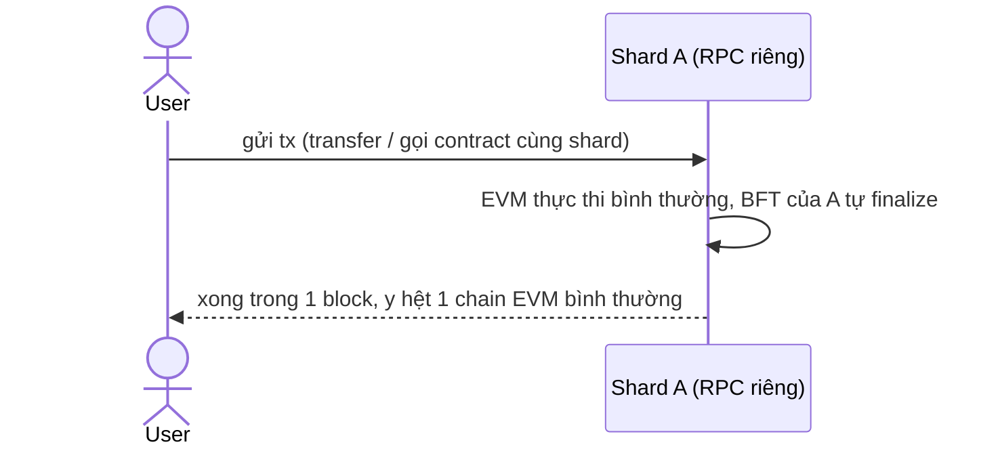
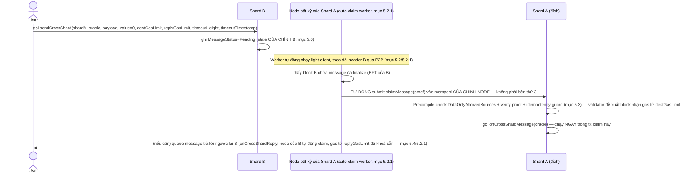
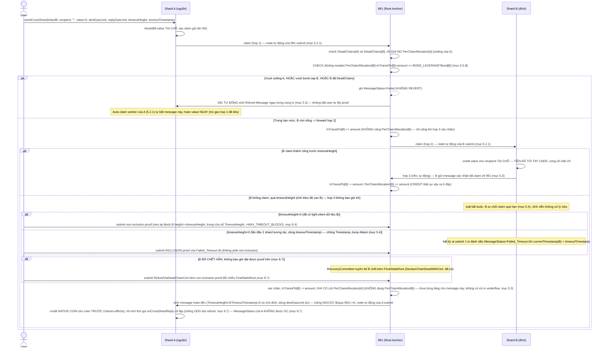
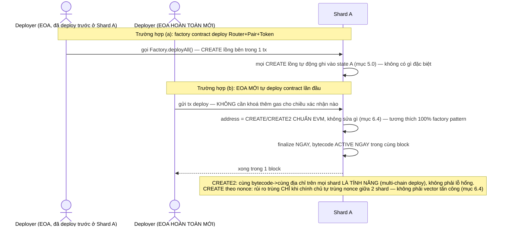

# Thiết kế Shard cho MetaNode (lấy cảm hứng TON, đã điều chỉnh cho thực tế)

**Trạng thái:** Sẵn sàng triển khai Phase 1-2. Phase 3-5 đã đủ đặc tả (mục 5.3/5.4/5.5/8) nhưng **bắt buộc 1 vòng review code-level độc lập của người (không chỉ AI)** trước khi coi là final — đây là nơi tiền thật của người dùng đi qua. Phase 5 (an ninh kinh tế cho value-transfer) đã có thiết kế cụ thể (`SecurityBond`, mục 5.5) — không còn là gap mở. **Vòng 19 (5 phát hiện, review độc lập từ người dùng) sửa 1 lỗ hổng kế toán sâu nhất trong toàn bộ doc:** value-transfer thực chất là 3-hop (không phải 2) — `PerChainAllocation[Y]` cần 1 vùng đệm `InTransitTo[Y]` tách biệt, chỉ credit thật khi Y xác nhận đã claim (hop 3), nếu không refund có thể underflow (mất tiền oan) hoặc double-credit (in tiền) tuỳ cách vá — xem mục 5.3. 4 phát hiện còn lại: Timestamp Jump Attack (đích thao túng nhãn timestamp để chặn cửa sổ hoàn tiền — sửa bằng inclusion-proof của `Failed_Timeout` thay vì non-inclusion cho nhánh timestamp-fallback, mục 5.4 — bản vá đầu tiên của chính phát hiện này, "bỏ cận trên", cũng SAI và đã tự sửa lại lần 2); head-of-line blocking chéo nguồn trên kênh `Ordered` 991→Y (mục 5.4); bypass `SecurityBond` hoàn toàn qua data-only cho custom token mint (mục 5.3); refund tự kẹt vĩnh viễn do OOG nếu callback dùng nhầm gas budget của logic khác (mục 8.7). Xem mục 10 cho tổng kết bảo mật + bản chất kiến trúc, mục 11 cho luồng giao dịch cụ thể, mục 12 cho vận hành. Lịch sử 19 vòng phản biện dẫn tới bản này (mỗi vòng tìm ra ≥1 vấn đề thật trong vòng trước, kể cả tự đảo ngược quyết định của chính mình nhiều lần): `git log -p` cho file này.

**Thay thế:** `note/cross_chain/shard_design_ton_inspired.md` (mô hình cũ dùng relayer + BLS-quorum để giả lập shard) — đã superseded bởi doc này.

---

## 1. Mục tiêu & phạm vi

**Mục tiêu:** phân chia trạng thái để quản lý — thực thi ở nhiều nơi ("shard"), nhắn tin xuyên shard nhanh hơn cross-chain hiện tại (không qua relayer + BLS-quorum), không đổi gì cho hợp đồng EVM chạy nội bộ 1 shard.

**Không nhắm tới** (đã cân nhắc và loại có chủ đích):
- Sharding tự động theo tải (split/merge động kiểu TON thật) — quá rủi ro fork với cấu trúc state hiện tại (mục 3).
- Composability đồng bộ xuyên shard cho MỌI trường hợp — chỉ đảm bảo cho nhóm contract được ghim cùng shard lúc deploy (mục 6, giới hạn cố hữu).
- Chia sẻ bảo mật/validator giữa các shard (TON thật có, thiết kế này không — đánh đổi lấy sự đơn giản, mục 7/10).

**Bản chất:** với 3 điều không nhắm tới ở trên, "shard" trong toàn bộ doc này **về kỹ thuật chính là 1 private chain hôm nay** (đăng ký/vận hành y hệt, validator độc lập, state vật lý tách biệt hoàn toàn — mục 2 #3, mục 5.0, mục 7), **không phải sharding chia sẻ bảo mật thật kiểu TON.** Khác biệt duy nhất so với private chain hôm nay: nhắn tin xuyên chain nhanh hơn (native, ~1-2 block, không qua relayer+BLS-quorum, mục 4/5.2-5.4) + lớp trình bày thống nhất cho người dùng cuối (mục 6.3).

**Hệ quả cho dev:** vì shard chính là 1 chain, dev deploy contract/chạy dApp trên 1 shard bằng đúng tooling EVM chuẩn (Hardhat/Foundry/ethers/web3.js…) trỏ vào RPC của shard đó — không cần biết có bao nhiêu shard khác tồn tại. Chỉ 2 điểm khác nếu dApp cần xuyên shard:
- Gọi/nhắn tin sang shard khác → dùng `IShardMessenger` (mục 5.4), 1 precompile mới, tường minh.
- Deploy contract — nhanh/tự do như mọi tx khác, dùng ĐÚNG công thức CREATE/CREATE2 chuẩn EVM, không sửa gì (mục 6.4) — hệ thống không đảm bảo địa chỉ duy nhất tuyệt đối toàn mạng, nhưng rủi ro thật (phân tích ở 6.4) hẹp và không phải vector tấn công bên thứ 3.

## 2. 5 quyết định kiến trúc nền tảng

| # | Quyết định | Lý do ngắn gọn |
|---|---|---|
| 1 | **Số shard cố định** — chỉ thêm shard mới (rỗng), không tách/gộp động | Cắt 1 trie đang sống một cách xác định đòi hỏi đổi key scheme NOMT (rủi ro cao) — thêm shard rỗng không cần gì trong số đó |
| 2 | **Masterchain = dùng luôn chain 991** (Root Anchor hiện tại), không tách workchain riêng | "Masterchain" chỉ còn là registry (`ChainRegistry`), không cần embed header mọi shard mỗi round — không còn lý do tách riêng |
| 3 | **Mỗi shard tự đăng ký validator độc lập** (qua `RegisterChainViaStake`), không dùng chung 1 pool | Tái dùng nguyên vẹn cơ chế đăng ký đã có; đánh đổi: không chia sẻ bảo mật giữa các shard (mục 5.5/10) |
| 4 | **Account/contract thuộc shard nơi tx tạo ra nó được gửi tới** — không có thuật toán gán | Giống hệt cách chọn 1 chain hôm nay; "ghim" composability tự nhiên có sẵn |
| 5 | **Cross-shard message = 1 giao dịch bình thường** (precompile claim-message), verify bởi BFT sẵn có của shard đích — không cần masterchain-anchoring cấp consensus | BFT round của shard đích (đủ 2/3 mới finalize) đã tự nhiên là điểm đồng thuận cần thiết cho an toàn import xuyên shard |

## 3. Vì sao không làm Split/Merge động

NOMT dùng `Keccak256(address)` làm khoá lưu trữ (`execution/pkg/trie/nomt_state_trie.go`) để phân bố đều trên trie — điều này phá vỡ tính cục bộ tiền tố mà TON cần để "cắt trie theo tiền tố" là 1 phép toán xác định, mọi validator tính ra cùng kết quả. Cố làm split động trên cấu trúc hiện tại có rủi ro fork ngay ở block đầu tiên của shard mới, vì mỗi validator có thể tính ra 1 kết quả filter khác nhau từ dữ liệu cục bộ của mình. Quyết định #1 tránh toàn bộ lớp rủi ro này bằng cách không bao giờ "cắt" — chỉ khởi tạo genesis mới cho shard thêm vào.

## 4. Vì sao không cần sửa consensus/Rust core

An toàn của việc import cross-shard (không được để 2 validator suy luận độc lập ra 2 kết quả khác nhau) đã được đảm bảo sẵn **nếu claim message được làm thành 1 giao dịch bình thường** — đúng cách BFT hoạt động cho MỌI giao dịch: proposer đề xuất, từng validator độc lập re-verify, đủ 2/3 mới finalize. Phần thật sự khác so với cross-chain hiện tại chỉ còn 1 chỗ: **cách shard đích lấy được header đã finalize + bằng chứng đồng thuận của shard nguồn** — thay vì chờ relayer poll + gom đủ BLS quorum (chậm, giây-phút), dùng 1 light-client (Go) đọc trực tiếp header + quorum certificate của shard nguồn.

**Cơ chế đã có sẵn, tái dùng được:** `consensus/metanode/meta-consensus/core/src/` — consensus hiện tại là DAG-based kiểu Mysten Labs/Sui (không phải HotStuff/Tendermint). `CommitSyncer.verify_commits()` đã verify độc lập 1 `TrustedCommit` bằng tập `SignedBlock`, cộng dồn stake vào `StakeAggregator<QuorumThreshold>`, đủ 2/3 mới coi là chứng nhận — dùng cho commit-sync giữa peer cùng chain hôm nay. `Committee::new(epoch, authorities)` tạo tự do từ bất kỳ danh sách pubkey+stake nào — dựng được `Committee` cho SHARD KHÁC (đọc từ `ChainRegistry` trên 991) rồi tái dùng nguyên vẹn logic verify đã có.

**Việc code mới thật sự:** 1 hàm FFI mới, thuần tuý/không trạng thái, bọc `verify_commits`/`Committee::new()` — xem mục 8.2.

## 5. Kiến trúc chi tiết

### 5.0. Mô hình lưu trữ: account/contract sống ở ĐÚNG 1 shard, không có trie dùng chung

Nguyên tắc nền giải thích vì sao "mỗi shard chạy độc lập nội bộ" và "các shard gọi lẫn nhau" không mâu thuẫn:

> **1 shard KHÔNG BAO GIỜ ghi trực tiếp vào state của shard khác. Toàn bộ tương tác xuyên shard chỉ là ĐỌC (có proof) trạng thái ĐÃ FINALIZE của shard khác, rồi TỰ GHI vào state CỦA CHÍNH MÌNH.**

**Lưu trữ vật lý:** mỗi shard là 1 tiến trình node riêng, với database NOMT vật lý riêng, tách biệt hoàn toàn khỏi mọi shard khác (`execution/pkg/trie/trie_factory.go`: mỗi namespace — `account_state`, `smart_contract_storage`, `stake_db`... — đã là 1 `GetOrInitNomtHandle(namespace)` riêng NGAY TRONG 1 shard; giữa 2 shard khác nhau là 2 tiến trình, 2 bộ file NOMT hoàn toàn khác nhau).

**1 account/contract chỉ tồn tại trên ĐÚNG 1 shard, trọn vẹn** — quyết định #4 chốt: shard nào nhận tx tạo ra nó thì account/contract đó sống trọn đời ở đó. "Phân tán account/contract ra nhiều shard" nghĩa là: toàn bộ address-space được chia (không chồng lấn) cho các shard theo nơi chúng được tạo ra.

**"Shard gọi lẫn nhau" hoạt động thế nào:**

```
Shard 1 (tiến trình riêng, NOMT riêng)          Shard 2 (tiến trình riêng, NOMT riêng)
┌─────────────────────────────┐                 ┌─────────────────────────────┐
│ Contract A: code+storage ────┼── ① ghi PENDING │                             │
│   ghi vào state CỦA CHÍNH    │    message vào  │                             │
│   SHARD 1                    │    state shard1 │                             │
└─────────────────────────────┘                 └─────────────────────────────┘
                                  ② light-client shard 2 ĐỌC (có proof)
                                     header đã finalize của shard 1 —
                                     KHÔNG đọc trực tiếp trie shard 1
                                                        │
                                                        ▼
                                 ③ tx claimMessage() chạy trên SHARD 2,
                                    do CHÍNH consensus shard 2 xử lý —
                                    ghi vào state CỦA SHARD 2, gọi
                                    onCrossShardMessage trên Contract B
```

- **① Ghi luôn cục bộ:** `sendCrossShard` chỉ ghi vào state của shard nguồn.
- **② Đọc xuyên shard luôn qua proof:** shard đích không có, và không cần có, quyền truy cập trực tiếp NOMT handle của shard nguồn — chỉ verify 1 header/commit đã công khai (mục 5.2).
- **③ Ghi kết quả cũng luôn cục bộ:** `claimMessage()`/`onCrossShardMessage` chạy hoàn toàn trong tiến trình + NOMT của shard đích, do chính consensus shard đích xử lý.

**Hệ quả:** mỗi shard chạy nội bộ hoàn toàn độc lập — có thể dừng, restart, đồng bộ lại từ đầu (`ExportAllXapianLogs`/`CallReplayFullDbLogs`, mục 7) mà không ảnh hưởng state shard khác. Điều duy nhất 1 shard cần từ bên ngoài để hoạt động bình thường là: đọc được header đã finalize của các shard nó có message đang chờ xử lý — nếu shard khác offline, shard hiện tại vẫn xử lý mọi tx nội bộ bình thường, chỉ message đến/đi từ shard offline đó bị treo ở `Pending` (timeout an toàn ở mục 5.4 xử lý trường hợp offline vĩnh viễn).

**`AddressShardRegistry` (mục 6.3.1) không mâu thuẫn với mô hình trên** — không chứa state thật (không balance/code/storage), chỉ là 1 bảng tra cứu SIÊU NHẸ ("địa chỉ X → shard nào") sống trên 991. Registry giúp người dùng tìm đúng nơi, không phải nơi lưu state.

### 5.1. Thêm shard mới (Phase 1)

Gần như chính xác quy trình `RegisterChainViaStake`/genesis-funding hiện tại đang dùng cho private chain (`pkg/cross_chain/gateway.go`, `cmd/tool/register_chains`) — thêm 1 shard = đăng ký chain đã có, cộng đăng ký vào `ShardTable` trên 991 (mục 8.1) + wire vào cơ chế claim-message (5.3) thay vì route qua relayer+BLS-quorum.

Shard mới bắt đầu từ state RỖNG — không di chuyển/migrate account nào từ shard khác. Vị trí shard của 1 account/contract là VĨNH VIỄN một khi đã tạo (quyết định #4) — chọn sai shard lúc deploy là không thể sửa.

**Genesis vẫn cần, nhưng nhẹ hơn nhiều:** mỗi shard là 1 mạng BFT độc lập nên vẫn cần 1 điểm khởi đầu thống nhất (validator set + chain ID) — yêu cầu của MỌI hệ thống BFT, không riêng thiết kế này. Nhưng genesis KHÔNG cần đi kèm bước "genesis-funding" (nạp sẵn số dư cho các địa chỉ cụ thể) — vốn vận hành cho shard mới nhận được **sau khi đã chạy**, qua đúng cơ chế cross-shard/cross-chain giá trị đã có (`TransferAllocationWithCert`, hoặc `IShardMessenger.sendCrossShard` với `value`, mục 5.4), y hệt cách 1 account bình thường nhận tiền.

### 5.2. Light-client cross-shard (Phase 2)

Component Go mới, đọc trực tiếp header đã finalize + bằng chứng đồng thuận của shard khác qua P2P/RPC — thay thế relayer-poll-rồi-gom-BLS-quorum. Dùng `Committee` dựng từ `ChainRegistry` của shard nguồn + hàm FFI mới (mục 8.2) để verify độc lập, không cần tin bên gửi dữ liệu. Cần mở rộng 1 RPC fetch-commit hiện có (dùng bởi `CommitSyncer` giữa peer cùng chain) để nhận request từ node của shard khác — network/wiring, không phải logic đồng thuận.

**Committee phải dựng theo đúng epoch mà commit đó tuyên bố** (`CommitRef` mang sẵn field epoch), KHÔNG PHẢI committee mới nhất đọc từ `ChainRegistry` tại thời điểm verify — nếu shard nguồn đã đổi committee (qua `ApplyCommitteeUpdate`/`UpdateCommitteeWithRecoveryCert`) sau khi 1 commit cũ được ký, verify bằng committee mới sẽ sai. `ChainRegistry` hôm nay **ghi đè trực tiếp** (map, 1 entry/chain, không versioning) — cần lưu lịch sử Committee theo epoch (mục 8.6), không chỉ committee mới nhất.

### 5.2.1. Node tự động claim — không dùng relayer permissionless

TON thật không dùng relayer cho nhắn tin xuyên shard nội bộ — validator của chính shard đích tự đọc `OutMsgQueue` của shard nguồn và tự đưa message vào block mình đề xuất. Thiết kế này lấy phần "ai submit tx claim được bundle sẵn vào phần mềm node tiêu chuẩn" (không cần sửa Rust/consensus-core), **KHÔNG lấy** phần "validator pool chung xoay ngẫu nhiên qua các shard mỗi epoch" (đó mới là shared-security thật của TON, đòi hỏi sửa sâu Rust consensus-core — quyết định #3 giữ nguyên, mỗi shard vẫn tự chủ validator).

**Cơ chế:** bundle 1 worker Go (đúng khuôn mẫu `CommitteeAttestationWorker`/`MessageSuccessAttestationWorker` đã có trong codebase — 1 goroutine nền trong chính tiến trình node) vào phần mềm node tiêu chuẩn của mọi shard:
1. Chạy light-client (5.2) liên tục, theo dõi các shard trong `ShardTable` xem có message `Pending` gửi tới CHÍNH shard mình đang chạy hay không.
2. Phát hiện message hợp lệ → tự động submit `claimMessage()` vào mempool của CHÍNH NODE ĐÓ — giao dịch chảy qua đúng luồng xử lý tx/block-proposal bình thường.
3. Validator nào đề xuất block tiếp theo (theo đúng lượt round-robin/BFT sẵn có) tự nhiên include giao dịch này nếu hợp lệ — không có bước "chọn ai làm relayer".

**Với kênh `Ordered=true` (mục 5.4): worker KHÔNG được bỏ qua message đã quá `TimeoutHeight`.** Dù message đó chắc chắn sẽ bị đích từ chối (vì đã quá hạn), worker vẫn phải submit claim cho nó — chỉ nộp claim này mới kích hoạt đích ghi `Failed_Timeout` + tăng `LastProcessedSequence` (mục 5.4), giải phóng đường cho các message `Sequence` sau. Bỏ qua vì "biết trước sẽ fail, tiết kiệm effort" sẽ làm kênh `Ordered` deadlock vĩnh viễn.

**Head-of-line blocking + fallback permissionless (kênh `Ordered=true`):** nếu worker tự động bị lỗi/rớt mạng đúng lúc bỏ lỡ message `Sequence=N` (không phải do quá hạn, chỉ đơn thuần chưa submit kịp), mọi message `Sequence=N+1, N+2...` bị kẹt cứng chờ đúng thứ tự — đây là "head-of-line blocking" kinh điển. Auto-worker sẽ tự retry, nhưng **`claimMessage()` bản chất là 1 precompile PERMISSIONLESS** (đúng tinh thần `SlashOnEquivocation`, mục 5.5.C.2 — không giới hạn ai được gọi) — bất kỳ ai cũng tự dựng + submit được đúng Merkle proof cho message `Sequence=N` (kể cả tự trả gas bằng ví của họ, không phụ thuộc `destGasLimit` đã khoá nếu muốn nhanh hơn worker). SDK/dApp nên tài liệu hoá rõ đường "cấp cứu" (fallback) này: khi phát hiện kênh `Ordered` bị treo lâu bất thường, người dùng cuối/vận hành dApp không cần chờ 100% vào auto-worker — tự lấy proof + gọi thẳng `claimMessage()` là hợp lệ và khơi thông được ngay.

**Funding:** giao dịch `claimMessage()` tự sinh vẫn được funding từ khoản đã khoá sẵn bởi người gửi lúc `sendCrossShard` (native coin locked tại nguồn) — y hệt `settleGasCappedContractCall` đã có (gas-capped, refund phần dư). Worker không tự bỏ tiền túi. Gas thực thi trả cho validator đang đề xuất block đó theo đúng cơ chế gas-fee-to-proposer bình thường của EVM — không cần sổ cái `RelayerBalances`/Tip riêng.

**Liveness:** chỉ cần không phải TẤT CẢ mọi node trên toàn mạng đều tắt worker này — yêu cầu yếu hơn nhiều so với "1 thị trường relayer cạnh tranh vì lợi nhuận phải tồn tại".

**Hệ quả lên fee — đơn giản hoá lớn:**
- Bỏ hẳn `Tip` và tách phí `hop1`/`hop2`/`reply` (`CrossShardFees` struct cũ) — chỉ còn "validator đề xuất block nhận gas-fee bình thường", giống MỌI giao dịch khác.
- `destGasLimit`/`replyGasLimit` (mục 5.4) thay thế toàn bộ struct phí cũ — 2 tham số gas-limit thuần EVM.
- `TimeoutHeight`/`timeoutTimestamp` (5.4/8.5) không đổi — vẫn cần vì shard đích có thể offline/network-partition thật.
- Idempotency-guard, `messageId` theo `(sourceShard, destShard, txHash, logIndex)`, GC lịch sử committee, kế toán NET `PerChainAllocation`, reentrancy-safety qua `isBarrierTx` — không đổi, pivot này chỉ thay đổi "ai submit giao dịch claim".

**Chi phí thật:** mỗi node bắt buộc chạy light-client cho MỌI shard nó có thể nhận message (không còn optional) — tăng yêu cầu tài nguyên/băng thông so với node chỉ chạy consensus+execution thuần tuý. Chi phí này nằm ở trong phần mềm node tiêu chuẩn (hạ tầng), không phải 1 ngành kinh doanh relayer riêng bên ngoài (thị trường/Tip).

**Không đổi Phase 5:** pivot này chỉ đổi cơ chế vận chuyển message (ai submit tx), không đổi việc mỗi shard vẫn tự chủ validator độc lập — rủi ro "mắt xích yếu nhất" (5.5) không được giải quyết bởi pivot này.

### 5.3. Precompile claim-message (Phase 3)

Precompile mới, họ hàng với Gateway precompile hiện có (`gateway.go`), verify Merkle proof bằng logic thuần Go/EVM — dùng header từ Phase 2. Không đụng `mvm_api.go`/C++ MVM, không đụng block-validity rule của consensus.

**Giữ nguyên 2 protection đã có ở `claimMessage()` hôm nay:**
- **Ceiling `PerChainAllocation`** — xem cơ chế đúng bên dưới.
- **Idempotency-guard `StatusByMessageID`/`ErrAlreadyClaimed`** — chống replay: cùng 1 Merkle proof hợp lệ không được submit 2 lần để nhận tiền 2 lần.

**Tách 2 luồng định tuyến theo loại message — không dùng chung 1 cơ chế:**

- **Data-only (`value == 0`):** P2P trực tiếp qua light-client (mục 5.2) — nhanh (~1-2 block), không có rủi ro ceiling vì không có native coin di chuyển. **Bắt buộc qua allow-list mặc định-từ-chối ở phía đích** — xem ngay dưới, không phải tuỳ chọn.
- **Value-transfer (`value > 0`, hoặc ghi nợ `PerChainAllocation`):** **bắt buộc đi qua 991**, không P2P trực tiếp. Lý do: nếu shard X bị chiếm >2/3 validator, kẻ tấn công kiểm soát toàn bộ những gì X "khai báo" ra bên ngoài — có thể equivocate, ký 2 trạng thái "tổng đã gửi" khác nhau cho 2 quan sát viên riêng biệt (double-spend cổ điển). 1 sổ cái tuần tự tập trung (991) giải quyết được vì đó là **điểm quan sát duy nhất** cho mọi claim của X — X không thể equivocate với 991 theo cách nó equivocate với 2 quan sát viên riêng biệt.

  Shard X gửi claim lên 991 trước (991 tự verify + ghi nhận vào sổ cái do CHÍNH 991 tính từ các claim đã xử lý — nếu vượt ceiling, từ chối ngay tại đây); chỉ khi 991 chấp nhận, mới sinh tiếp message chuyển tiếp sang Y. Đây chính là mô hình 2-hop A→Reserve→B đã có sẵn, đã audit trong cross-chain hiện tại (mục 7). Đánh đổi: value-transfer chậm hơn (~2 hop), nhưng là cách duy nhất đảm bảo an ninh kinh tế trong mô hình "mỗi shard tự chủ validator" (quyết định #3).

**Data-only không có ceiling giá trị (đúng — không có native coin di chuyển) nhưng vẫn cần chặn "mắt xích yếu nhất" ở tầng hệ thống, không chỉ khuyến nghị dApp.** Nếu shard X bị chiếm >2/3 validator, nó ký được chữ ký hợp lệ (đúng `ChainRegistry`) cho BẤT KỲ nội dung data-only nào — giả mạo oracle, lệnh quản trị DAO, xác thực danh tính — gửi sang bất kỳ shard đích nào đã đăng ký, và precompile đích sẽ chấp nhận vì chữ ký hợp lệ về mặt kỹ thuật nếu không có gì chặn thêm.

**Cơ chế — default-deny allow-list, thực thi CỤC BỘ tại chính shard đích, không có dependency cross-shard mới:**

```go
// Lưu trong state CỦA CHÍNH shard đích (namespace riêng, giống 8.4) — mỗi shard tự quản danh
// sách của mình, không cần hỏi 991 hay bất kỳ shard nào khác lúc claim (giữ đúng nguyên tắc
// mục 4/5.0: không phụ thuộc tra cứu chéo cho luồng xử lý tx bình thường).
type DataOnlyAllowedSources struct {
    // key: sourceChainID được phép gửi data-only message TỚI shard này; value: cho phép hay không.
    // Mặc định KHÔNG có entry nào = TỪ CHỐI TẤT CẢ.
}
```

- **Mặc định deny toàn bộ** — 1 shard mới đăng ký không nhận được bất kỳ data-only message nào cho tới khi tự thêm nguồn vào allow-list của chính mình. Đây là quyết định của SHARD ĐÍCH (giống chọn ai được validator của mình), không phải của shard nguồn hay của 991 — tránh đúng rủi ro Sybil (1 shard rác tự "xin phép" mình được tin).
- **Ai quản lý allow-list:** dùng cơ chế quản trị y hệt shard đó đang dùng cho các quyết định nội bộ khác của nó (owner/multisig do đội vận hành shard đó chọn — không phải phạm vi thiết kế lại ở đây, chỉ cần 1 hàm ghi state chuẩn, gated bởi cơ chế quyền hạn nội bộ của shard đó).
- **Precompile claim-message check allow-list TRƯỚC KHI verify Merkle proof cho message data-only** — reject sớm, tiết kiệm cả gas lẫn công verify nếu nguồn chưa được whitelist.
- **Không thay thế, chỉ bổ sung** khuyến nghị SDK/whitelist ở tầng dApp (mục 5.5: dApp có thể muốn whitelist HẸP HƠN allow-list của shard, ví dụ chỉ tin 1 vài contract cụ thể trên các shard đã được shard-level allow, không phải mọi contract trên shard đó) — phòng thủ theo lớp: allow-list ở tầng hạ tầng là lớp bắt buộc đầu tiên, whitelist ở tầng dApp là lớp tuỳ chọn thứ hai.

**⚠️ Kế toán ceiling — KHÔNG phải sổ cái NET 2-trạng-thái đơn giản như phần còn lại của hệ thống, vì hop-2 chạy trên 1 chain KHÁC 991.** `PerChainAllocation` (ghi nợ khi gửi / ghi có khi nhận, đã audit trong `gateway.go`) hoạt động đúng NET cho mọi luồng KHÁC vì cả `AttestCommit` (ghi nợ, ~dòng 1262) lẫn `ClaimMessage` (ghi có, ~dòng 1365) đều chạy TRÊN CÙNG 1 SỔ CÁI TRUNG TÂM (991) — 991 tự verify + tự ghi cả 2 vế. Nhưng với 2-hop value-transfer, "Y claim thành công ở hop 2" theo đúng mục 5.2.1 nghĩa là **auto-claim worker của Y submit lên precompile CỦA Y** — 991 KHÔNG tham gia thực thi hop 2 và không có cách nào tự động biết "Y đã claim xong" để ghi có `PerChainAllocation[Y]` trên chính sổ cái của mình. Nếu bỏ qua chi tiết này (coi hop-2-credit là 1 bước ngầm định, tự động), 2 kịch bản đều hỏng:
- Nếu 991 KHÔNG BAO GIỜ ghi có cho Y: `PerChainAllocation[Y]` không bao giờ tăng — Y nhận tiền thật ở tầng local nhưng không có "hạn mức gửi đi" tương ứng trên 991, sớm muộn cũng không gửi được nữa dù đã nhận rất nhiều.
- Nếu 991 ghi có cho Y NGAY LÚC FORWARD (trước khi biết Y có thật sự claim hay không), rồi sau đó Y timeout/chết và user xin refund (mục 8.7 ghi có lại cho X) — 991 vừa in tiền từ không khí (X được hoàn, Y coi như vẫn giữ số đã ghi) TRỪ PHI 991 cũng trừ lại của Y — nhưng nếu Y đã tiêu hết số đó qua các lần gửi đi HỢP PHÁP KHÁC trong lúc message còn treo (Y không biết/không cần biết message này còn "chưa chắc chắn"), trừ lại sẽ UNDERFLOW — refund bị revert, **user mất tiền oan vĩnh viễn dù có bằng chứng hợp lệ**.

**Sửa — sổ cái 3 trạng thái, thêm `InTransitTo[Y]` làm vùng đệm, tách CHECK (đọc, không mutate) khỏi CREDIT (mutate, chỉ 1 lần, đã xác nhận):**
```go
// Trên 991, cạnh PerChainAllocation đã có. Không lưu thông, chỉ là vùng đệm kế toán cho value
// đang "đã rời X nhưng chưa xác nhận Y đã nhận" — tách theo TỪNG đích, không dùng 1 bucket chung
// (nếu dùng 1 bucket chung cho mọi đích, không phân biệt được khi refund cần trả lại đúng phần
// của message nào).
InTransitTo map[uint64]*big.Int // destChainID -> tổng value đang "treo", đã trừ nguồn, chưa cộng đích
```
- **Hop 1 (X→991):** 991 ghi nợ `PerChainAllocation[X] -= amount` (ceiling check của X, không đổi).
- **Trước khi forward hop 2, 991 CHECK (không mutate `PerChainAllocation[Y]`, chỉ đọc):** `PerChainAllocation[Y] + InTransitTo[Y] + amount <= BOND_LEVERAGE * SecurityBond[Y]` (mục 5.5.B — PHẢI cộng cả `InTransitTo[Y]` hiện có, không chỉ `PerChainAllocation[Y]` đã xác nhận, để chặn race-condition: nhiều value-transfer TỚI Y cùng lúc, mỗi cái đều còn "treo", không được để tổng vượt cap dù từng cái riêng lẻ có vẻ hợp lệ). Vượt → auto-refund X ngay (giống `Failed_CeilingExceeded`, không có gì mới). Trong hạn mức → `InTransitTo[Y] += amount`, forward hop 2.
- **Hop 2 (991→Y):** Y claim, credit LOCAL balance cho recipient — TIỀN THẬT ĐÃ TỚI TAY USER TẠI ĐÂY, không phụ thuộc bước dưới.
- **Hop 3 (Y→991, MỚI, bắt buộc) — Y tự động sinh 1 message XÁC NHẬN gửi VỀ 991 ngay sau khi claim thành công** (dùng đúng pipeline cross-shard sẵn có, mục 5.2/5.2.1 — không phải primitive mới, chỉ là 1 hop bổ sung chạy NỀN, không chặn UX của user vì tiền đã tới tay ở hop 2 rồi): 991 nhận xác nhận → `InTransitTo[Y] -= amount`, **`PerChainAllocation[Y] += amount`** (đây mới là lúc CREDIT thật sự xảy ra, đã xác nhận chắc chắn).
- **Refund (message không bao giờ tới hop 3 vì Y timeout/chết):** 991 chỉ cần `InTransitTo[Y] -= amount`, `PerChainAllocation[X] += amount` — **KHÔNG BAO GIỜ đụng tới `PerChainAllocation[Y]`** (vì hop 3 chưa từng xảy ra, `PerChainAllocation[Y]` chưa từng tăng cho message này) — loại bỏ hoàn toàn rủi ro underflow VÀ rủi ro in tiền, vì không có gì để "trừ lại" ở phía Y trong trường hợp này.

**2 điểm kẹt giữa chừng, mỗi điểm cần đường lùi cụ thể:**

- **Kẹt ở hop 1 (991 từ chối vì vượt ceiling của X, hoặc vượt bond-cap của Y ở bước check trên, hoặc vì đích đã chết — xem dưới):** 991 **không revert** giao dịch claim (đây là tx hệ thống tự sinh, revert không có ý nghĩa) — thay vào đó cô lập lỗi: ghi `MessageStatus = Failed_CeilingExceeded` (hoặc `Failed_DestDead`), dừng forward. **Ngay trong CÙNG giao dịch xử lý reject này, 991 tự động sinh 1 Refund Message gửi ngược về X** (không đợi user làm gì) — dùng đúng `messageId` mới (`keccak256(originalMessageId,"REFUND")`, mục 8.7) + idempotency-guard riêng (không dùng lại `ClaimMessage` gốc). Auto-claim worker của X (5.2.1) tự động bắt lấy message này và hoàn tiền — user không cần tự đi lấy proof gì cả, đồng nhất với trải nghiệm hop 2 dưới đây.
- **Kẹt ở hop 2 (991 đã duyệt, forward sang Y, nhưng Y chết/không bao giờ claim — tức không bao giờ tới được hop 3 xác nhận):** cần timeout thật (`TimeoutHeight`, mục 5.4, tính theo độ cao của Y), và **bắt buộc luồng ngược Y→991→X** (không phải Y→X trực tiếp): non-inclusion proof (đúng `TimeoutHeight`, trong cửa sổ hoàn tiền — mục 8.4) submit lên 991 → 991 xác nhận, **hoàn `InTransitTo[Y]` về lại `PerChainAllocation[X]`** đúng số đã treo (xem sổ cái 3 trạng thái ở trên — KHÔNG đụng `PerChainAllocation[Y]`, không có rủi ro underflow) — rồi 991 sinh tiếp 1 message hoàn tiền gửi về X. Gas cho chặng hoàn tiền 991→X tái dùng đúng `destGasLimit` chưa tiêu (vì hop 2 chưa từng xảy ra) — không cần field riêng. Nếu Y CHẾT HẲN trước khi đạt `TimeoutHeight` (không bao giờ có block đủ cao để lấy non-inclusion proof theo height), dùng cơ chế bypass `RefundViaDeadChainCert` — mục 8.7.

**Hop-1 cũng phải kiểm tra `destChainID` không phải chain đã chết:** nếu Y đã bị `DeadChains[Y]==true` tại thời điểm X gửi claim, hop-1 nên tự động chuyển sang nhánh auto-refund ngay (như ceiling-exceeded ở trên) thay vì để tiền bị khoá ở 991 rồi ép user đi đường vòng `RefundViaDeadChainCert` cồng kềnh cho 1 việc đã biết trước là vô vọng. Đây là kiểm tra RIÊNG với việc chặn `sourceChainID` đã chết (mục 8.8): nguồn dead → hard-reject (không tin tưởng gì từ 1 chain đã bị tuyên bố xấu); đích dead → auto-refund (nguồn là bên trung thực, chỉ thiếu thông tin cập nhật).

**Phạm vi ceiling:** chỉ bắt buộc cho NATIVE COIN (`PerChainAllocation` theo dõi). Custom asset/token do dApp tự định nghĩa là trách nhiệm của dApp tự thiết kế ceiling riêng nếu cần — không phải nghĩa vụ hệ thống (commit `694e4733`, tách ledger native khỏi custom-asset).

**Rủi ro sinh thái thật dù đúng ranh giới thiết kế:** đây là ranh giới ĐÚNG cho lõi giao thức (native coin có `PerChainAllocation` audit sẵn, token tự định nghĩa thì hệ thống không biết gì về logic mint/burn của nó để mà bound) — nhưng để lại 1 vùng rủi ro sinh thái thật: nếu không có chuẩn tham khảo, mỗi dự án tự code ERC20-bridge-token xuyên shard riêng, nhiều khả năng thiếu đúng loại ceiling/rate-limit mà `PerChainAllocation`+`SecurityBond` (mục 5.5) đã audit kỹ cho native coin — 1 shard bị chiếm có thể "in" vô hạn token wrapped của chính nó rồi xả sang shard khác qua AMM, thiệt hại không hề nhỏ hơn tấn công native coin, chỉ là hệ thống không chịu trách nhiệm trực tiếp. **Khuyến nghị (SDK/tooling, không phải thay đổi phạm vi lõi):** cung cấp sẵn 1 chuẩn hợp đồng tham khảo `IStandardCrossShardToken` — bundle sẵn cơ chế ceiling/rate-limit theo đúng khuôn `PerChainAllocation`+`SecurityBond` đã audit (per-token, per-shard, không dùng chung ledger native) — để dApp kế thừa thay vì tự viết lại từ đầu. Xem mục 9 (roadmap) cho vị trí đề xuất.

**⚠️ Chỗ rủi ro cụ thể nhất: token mint/credit qua data-only message CÓ THỂ BYPASS TOÀN BỘ `SecurityBond` — không phải lý thuyết, là hệ quả trực tiếp của luật định tuyến `value == 0` → P2P (mục này).** Với token ERC20-style xuyên shard, hàm "chuyển token" gọi qua `sendCrossShard` mang `value = 0` (giá trị native `value` không liên quan gì tới số dư token, vốn nằm trong storage của contract) — nghĩa là MỌI giao dịch token, kể cả 1 lệnh "mint 1 triệu token giả", đều đi theo nhánh Data-only/P2P, **hoàn toàn không đi qua 991, không chạm `PerChainAllocation`/`SecurityBond`/ceiling-cap gì cả.** Kịch bản cụ thể: shard A (bị chiếm, hoặc chỉ low-stake) được B đưa vào `DataOnlyAllowedSources` VÌ 1 LÝ DO CHÍNH ĐÁNG KHÁC (VD B tin A làm nguồn oracle giá) — allow-list hiện tại chỉ có độ chi tiết CẤP SHARD (`sourceChainID`), KHÔNG phân biệt được "tin A cho việc X" khác "tin A cho việc Y" — 1 khi A đã được allow, NÓ ĐƯỢC PHÉP GỬI BẤT KỲ NỘI DUNG DATA-ONLY NÀO, kể cả từ 1 contract khác trên A giả mạo lệnh mint gửi thẳng tới bridge-token contract trên B. `SecurityBond[A]` bị tịch thu cũng không cứu được B — vì cơ chế đó chỉ bound native coin, không hề biết gì về token tự định nghĩa của B.

**Sửa — bắt buộc (không phải khuyến nghị) whitelist theo `(sourceShardId, sourceContractAddress)` NGAY TRONG contract nhận, không dựa vào `DataOnlyAllowedSources` cấp-shard làm lớp bảo vệ đủ:** `onCrossShardMessage` (mục 5.4) đã có sẵn `sourceShardId` VÀ `originalSender` (địa chỉ contract/EOA gốc gọi `sendCrossShard` trên shard nguồn) trong signature — với BẤT KỲ logic nào có khả năng thay đổi số dư/quyền hạn (mint, burn, cấp quyền admin), contract PHẢI tự kiểm tra CẢ HAI field này khớp đúng 1 danh sách whitelist RIÊNG, HẸP HƠN, do CHÍNH contract quản lý — không được coi `DataOnlyAllowedSources` (kiểm soát bởi vận hành SHARD, có thể vì lý do khác hoàn toàn) là đủ. `IStandardCrossShardToken` (khuyến nghị ở trên) PHẢI bundle sẵn pattern này làm mặc định bắt buộc, không phải tuỳ chọn — mọi dự án dùng chuẩn này tự động được bảo vệ, không cần tự nhớ.

**991 có phải cổ chai không?** Có thật, nhưng ít nghiêm trọng hơn nghe qua: mỗi claim value-transfer chỉ là 1 phép ghi nợ/ghi có `PerChainAllocation` (2 lần đọc/ghi map) — KHÔNG phải chạy lại EVM/logic contract của bất kỳ ai, khác hẳn tải của 1 shard chạy dApp thật. Thông lượng của 991 vì vậy xấp xỉ thông lượng BFT thuần của 1 chain đơn giản, không phải "chạy toàn bộ logic tài chính của N shard dồn vào 1 nơi". Với vài chục-vài trăm shard và tần suất value-transfer thực tế, đây khó thành nút thắt thật — nhưng nếu 1 vài CẶP shard cụ thể có lưu lượng rất cao, đi qua 991 mỗi lần vẫn là chi phí thật (thêm 1 hop round-trip).

**Hướng mở rộng tương lai nếu có bằng chứng thật là nghẽn (KHÔNG phải MVP, không bắt buộc, đánh giá lại khi có số liệu tải thật):** kênh tín dụng song phương trực tiếp ("Direct Trust channel") giữa 2 shard có traffic cao — 2 shard tự thoả thuận (governance 2 bên) 1 hạn mức NHỎ, TÁCH BIỆT khỏi `PerChainAllocation` chung trên 991, cho phép chuyển thẳng P2P trong hạn mức đó mà không qua 991 mỗi lần. Khác về bản chất so với lỗ hổng equivocation ở trên: nghịch lý double-spend-the-ceiling xảy ra vì 1 sổ NHIỀU quan sát viên cùng tin vào 1 con số CHUNG mà nguồn có thể khai khác nhau với từng người — 1 kênh song phương KHÔNG có vấn đề này vì chỉ có ĐÚNG 2 bên, hạn mức của kênh này KHÔNG chia sẻ/fungible với hạn mức kênh khác của cùng 1 shard (X có kênh riêng với Y và kênh riêng với Z — thiệt hại tối đa nếu X bị chiếm = tổng 2 hạn mức đó, con số CỐ ĐỊNH do governance đặt ra). Cần thiết kế riêng (mở/đóng kênh, đối soát định kỳ về 991 làm backstop) — chỉ nên làm khi có số liệu tải thật chứng minh 991 là nút thắt.

**Thay đổi cấu trúc lưu trữ:** `gateway_handler.go` lưu toàn bộ `GatewayEngine` (bao gồm `MessageStatus`) dưới 1 storage key duy nhất (1 JSON blob). Precompile mới **không copy mẫu này** — mỗi `messageId` cần 1 storage key riêng (namespace mới, giống cách `smart_contract_storage` lưu từng slot). Lý do: NOMT chỉ chứng minh được theo TỪNG KEY — nếu cả trạng thái nằm trong 1 blob, không thể chứng minh "message Z có/không có mặt" ở tầng trie, chỉ chứng minh được "cả blob này có root X" (không đủ cho non-inclusion proof ở mục 5.4).

### 5.4. Chuẩn hoá `IShardMessenger` + timeout an toàn (Phase 4)

`gateway.go` đã có sẵn đúng state machine cần (`MessageStatus{Pending,Success,Failed,Refunded}` + `Channel`) — vấn đề là cách dùng hôm nay (`demoPingPong.sol`) ad hoc, mỗi contract tự chế lại từ đầu. Chuẩn hoá thành 1 interface chung (giống ERC-721 chuẩn hoá `IERC721Receiver`):

```solidity
/// destGasLimit: gas-limit cho hop THỰC THI CODE ĐÍCH (nơi onCrossShardMessage chạy — hop1 nếu
/// data-only 1-hop, hop2 nếu value-transfer 2-hop qua 991). Hop trung gian (claim thuần trên 991,
/// không chạy code người dùng) tốn 1 khoản gas CỐ ĐỊNH nhỏ do protocol tự định nghĩa, tự động trừ
/// từ khoản đã khoá — không cần dev tự chọn. BẮT BUỘC destGasLimit >= MIN_CLAIM_GAS_FLOOR (8.5).
/// replyGasLimit: gas-limit RIÊNG cho chiều onCrossShardReply — 0 nếu không cần reply. Luồng hoàn
/// tiền value-transfer thất bại (5.3/8.7) dùng thẳng destGasLimit còn dư, không cần field riêng.
function sendCrossShard(
    uint64 destShardId,
    address target,
    bytes calldata payload,
    uint256 value,
    uint256 destGasLimit,
    uint256 replyGasLimit,
    uint64 timeoutHeight,
    uint64 timeoutTimestamp
) external returns (bytes32 messageId);
```

```solidity
interface IShardMessenger {
    /// Gửi tường minh 1 message xuyên shard — trả về messageId ngay (KHÔNG phải kết quả thực thi).
    /// Gateway tự động định tuyến: value == 0 -> P2P trực tiếp (~1-2 block); value > 0 -> 2 hop
    /// qua 991 (~2 hop) để enforce ceiling — dev gọi CÙNG 1 hàm, không cần biết sự khác biệt.
    /// timeoutHeight: BẮT BUỘC, tính theo ĐỘ CAO CỦA destShardId (không phải shard đang gửi).
    /// SDK/wallet tự đề xuất giá trị hợp lý. GIỚI HẠN CỨNG (8.5): revert nếu
    /// timeoutHeight > currentDestHeight + MAX_TIMEOUT_BLOCKS.
    /// timeoutTimestamp: BẮT BUỘC kèm theo (8.5) — cận thay thế khi light-client nguồn CHƯA từng
    /// verify header nào của đích (lần tương tác đầu tiên giữa 2 shard).
    function sendCrossShard(
        uint64 destShardId, address target, bytes calldata payload, uint256 value,
        uint256 destGasLimit, uint256 replyGasLimit, uint64 timeoutHeight, uint64 timeoutTimestamp
    ) external returns (bytes32 messageId);

    /// Gateway (KHÔNG phải user) gọi hàm này trên contract ĐÍCH khi message tới nơi.
    function onCrossShardMessage(
        bytes32 messageId, uint64 sourceShardId, address originalSender, bytes calldata payload
    ) external returns (bool success, bytes memory returnData);

    /// Gateway gọi lại trên contract NGUỒN khi có kết quả trả về từ đích (optional).
    function onCrossShardReply(bytes32 messageId, bool success, bytes calldata returnData) external;
}
```

**Gas trả cho ai:** validator đang đề xuất block (bất kỳ ai, theo lượt round-robin/BFT sẵn có) nhận gas-fee theo đúng cơ chế gas-fee-to-proposer bình thường của EVM — không cần sổ cái `RelayerBalances`/Tip riêng (5.2.1).

**Sàn gas bắt buộc cho `destGasLimit`/`replyGasLimit` — chống gas-griefing lên chính node tự động.** Auto-claim worker (5.2.1) tốn CPU thật để verify Merkle proof + kiểm tra idempotency-guard TRƯỚC KHI biết `destGasLimit` có đủ trả phí hay không — nếu người gửi cố tình đặt `destGasLimit` cực thấp (thấp hơn cả chi phí gas cố định để gọi `claimMessage` + revert do out-of-gas), validator đề xuất block vẫn tốn công verify nhưng thu về không đủ bù. `sendCrossShard` bắt buộc chặn ngay lúc tạo message, cùng vị trí với check `MAX_TIMEOUT_BLOCKS` (mục 8.5):

```solidity
require(destGasLimit >= MIN_CLAIM_GAS_FLOOR, "destGasLimit below protocol floor");
```

`MIN_CLAIM_GAS_FLOOR` là hằng số cấp hệ thống (đo bằng chi phí verify Merkle proof + ghi idempotency-guard + xử lý revert — chi phí gần như CỐ ĐỊNH, không phụ thuộc payload, vì độ sâu Merkle proof bị chặn bởi độ sâu trie), giống nhau trên mọi shard — cùng khuôn với `MAX_TIMEOUT_BLOCKS`.

**Thứ tự bắt buộc khi Gateway dispatch (checks-effects-interactions):** phải ghi `MessageStatus` = Success/Failed **TRƯỚC KHI** gọi `onCrossShardMessage`/`onCrossShardReply` trên contract đích/nguồn — pattern callback tới code ngoài tầm kiểm soát (giống rủi ro reentrancy của `IERC721Receiver`/`ccipReceive`); ghi state trước đảm bảo idempotency-guard đã có hiệu lực nếu contract nhận callback cố gọi ngược lại Gateway.

**Reentrancy vốn dĩ vô hại — nhưng có điều kiện cần giữ:** `true_block_stm.go`'s `isBarrierTx` kiểm tra `tx.To()` ở TẦNG ĐIỀU PHỐI BLOCK, TRƯỚC KHI bất kỳ MVM nào chạy — địa chỉ Gateway không thể bị gọi tới qua opcode `CALL` lồng trong bytecode contract khác (khác precompile 263 — `SetCrossChainContext` — vốn là context ĐỌC-CHỈ gắn ở tầng opcode MVM). `loadGatewayEngine()`→mutate→`saveGatewayEngine()` chỉ chạy đúng 1 lần cho mỗi tx cấp cao nhất, không có đường quay lại để nạp lại 1 bản `MessageStatus` chưa lưu. **Bắt buộc khi code Phase 3/4:** precompile claim-message mới phải nằm trong đúng danh sách `isBarrierTx`, tuyệt đối không wire vào dispatch opcode-level của MVM (kiểu địa chỉ 263).

**Cô lập revert của contract đích:** gọi `onCrossShardMessage` bằng low-level call (không phải call thường lan truyền revert) — nếu contract đích revert, vẫn commit `MessageStatus = Failed` (không re-throw), và validator vẫn thu gas-fee từ `destGasLimit` đã khoá — không phụ thuộc kết quả thực thi ở đích. Lỗi logic của contract đích không phải trách nhiệm của validator đề xuất block.

**Thứ tự xử lý message (ordering) — có schema sẵn nhưng chưa từng được implement, cần code mới.** Với data-only P2P (5.3), auto-claim worker submit claim ngay khi thấy message finalize — nếu shard X gửi liên tiếp `Message_1` rồi `Message_2` sang shard Y, KHÔNG có gì đảm bảo Y xử lý đúng thứ tự đó (worker có thể thấy/submit `Message_2` trước nếu độ trễ quan sát khác nhau). Nhiều dApp (đặc biệt bridge/tài chính) cần FIFO thật, kiểu Ordered Channel của IBC.

`CrossChainMessage` đã có sẵn `Sequence`/`Ordered` (`types.go`), `Outbound()` đã gán `Sequence` tăng dần theo từng cặp `(sourceChainID, destChainID)` (`ChannelSequence` map) — nhưng `Channel` struct (mang `NextSequence`/`LastProcessedSequence`, đúng thứ cần để enforce FIFO) **được định nghĩa trong `types.go` nhưng KHÔNG được `GatewayEngine` sử dụng ở bất kỳ đâu hôm nay** (xác nhận qua code: không có field `Channels` nào trong `GatewayEngine`, `ClaimMessage()` không đọc/ghi `NextSequence`/`LastProcessedSequence`) — schema đã thiết kế sẵn nhưng CHƯA từng được implement, không phải cơ chế "có sẵn, chỉ cần dùng lại" như phần lớn hạ tầng khác doc này tái dùng.

**Bắt buộc cho precompile mới:** khi `msg.Ordered == true`, precompile claim-message ở shard đích phải tự giữ 1 `LastProcessedSequence[sourceChainID]` (namespace riêng, giống 8.4) và **từ chối/hoãn** (không phải lỗi vĩnh viễn — trả về trạng thái chờ, để worker retry sau) bất kỳ claim nào có `Sequence != LastProcessedSequence[source] + 1`, chỉ tăng bộ đếm sau khi xử lý đúng thứ tự.

**Chống deadlock:** nếu message bị từ chối do quá hạn (Timeout), đích BẮT BUỘC phải ghi nhận `MessageStatus = Failed_Timeout` và **TĂNG `LastProcessedSequence`** lên 1 (trừ phí từ `destGasLimit` trả cho validator) — coi timeout như "đã xử lý" cho mục đích FIFO. Nếu từ chối ngầm mà không tăng sequence, toàn bộ message phía sau bị kẹt vĩnh viễn. Để cơ chế này có tác dụng thật, worker (mục 5.2.1) phải thực sự submit claim cho message đã quá hạn thuộc kênh `Ordered` — nếu worker tự tối ưu "biết trước sẽ fail nên bỏ qua", đích không bao giờ nhận được claim để tăng sequence, kênh vẫn deadlock dù luật ở đích đã đúng.

Data-only KHÔNG bắt buộc `Ordered = true` cho mọi message — dev tự chọn per-message (field `Ordered` trên `CrossChainMessage`, không phải property cấp channel cố định) tuỳ dApp có cần FIFO hay chấp nhận xử lý bất kỳ thứ tự nào.

**`Ordered=true` KHÔNG tự động giữ đúng thứ tự xuyên suốt value-transfer 2-hop (X→991→Y) nếu không nối dây tường minh.** `LastProcessedSequence`/`Sequence` vận hành theo TỪNG CẶP shard trực tiếp (`ChannelSequence` key `(sourceChainID, destChainID)`) — với value-transfer, hop 1 là kênh X→991 (dùng cơ chế relay-onward `EncodeRelayPayload` đã có trong `gateway.go`), còn hop 2 (991→Y) là 1 kênh HOÀN TOÀN KHÁC với `Sequence` riêng của chính 991. `Ordered=true` ở hop 1 chỉ đảm bảo 991 xử lý các claim TỪ X đúng thứ tự — KHÔNG tự động đảm bảo message forward-tiếp sang Y cũng giữ đúng thứ tự tương đối đó.

**Bắt buộc:** nếu message gốc từ X mang `Ordered=true`, precompile relay-onward trên 991 phải: (a) tự đặt `Ordered=true` cho message forward sang Y, và (b) gán `Sequence` mới tăng dần ĐÚNG theo thứ tự 991 đã xử lý xong hop 1 các claim từ X — không phải thứ tự hoàn tất xử lý song song bất kỳ. Nếu message gốc KHÔNG mang `Ordered=true`, giữ nguyên hành vi mặc định (nhanh, không FIFO).

**⚠️ Khoá `Sequence` của kênh forward PHẢI phân mảnh theo NGUỒN GỐC BAN ĐẦU, không chỉ theo đích — nếu không, 1 shard duy nhất kẹt cũng chặn cứng TOÀN BỘ message tới Y từ MỌI shard khác.** Nếu dùng chung 1 bộ đếm `ChannelSequence["991:Y"]` cho MỌI message tới Y (bất kể đến từ X, Z, W...), message của Z/W bị buộc phải đợi đúng lượt SAU message của X trong CÙNG 1 hàng đợi — dù Z, W chẳng liên quan gì tới X. 1 message của X kẹt (chưa submit được proof, hoặc chờ timeout) sẽ chặn cứng luôn message `Ordered` từ MỌI shard khác gửi tới Y — biến 1 shard bị lỗi/bị spam thành đòn tắc nghẽn toàn mạng nhắm vào Y. **Sửa:** khoá `ChannelSequence` cho chặng forward phải mang cả nguồn gốc ban đầu — `ChannelSequence["991:Y:X"]` (khoá theo bộ ba nguồn-đích-qua-hop, không phải chỉ cặp đích) — để `Sequence` của X→Y và Z→Y (dù cùng đi qua 991) tăng ĐỘC LẬP nhau, không chia sẻ hàng đợi.

**Timeout — kiểu Cosmos IBC's `TimeoutHeight` (ICS-04):** `MessageStatus` chỉ có `Pending/Success/Failed/Refunded`, không có trạng thái cho "đích không bao giờ trả lời". Refund khi quá N block theo đồng hồ của CHÍNH shard nguồn có lỗ hổng double-spend: mạng lag khiến đích chỉ CHẬM chứ không chết → nguồn tưởng timeout nên refund → đích sau đó vẫn xử lý message → user nhận tiền 2 lần. Non-inclusion proof "hiện tại" cũng không đủ — chỉ chứng minh "chưa xử lý tới giờ", không chứng minh "sẽ không bao giờ xử lý".

**Sửa đúng:** mọi message xuyên shard mang thêm `TimeoutHeight` (tính theo độ cao SHARD ĐÍCH), 2 luật bắt buộc:
1. Precompile shard ĐÍCH tự từ chối bất kỳ claim nào nếu `current_height(đích) > TimeoutHeight` — dù Merkle proof hợp lệ tới đâu. 1 khi qua mốc, đích không bao giờ xử lý message đó nữa.
2. Refund ở shard NGUỒN chỉ được chấp nhận nếu non-inclusion proof neo vào 1 block của đích có `height >= TimeoutHeight`.

Kết hợp (1)+(2): non-inclusion tại 1 điểm đã qua hạn + luật (1) đảm bảo đích không bao giờ xử lý sau mốc đó → chứng minh được "vĩnh viễn không xử lý".

**Dual-condition `timeoutHeight` + `timeoutTimestamp` (kiểu ICS-04 thật):** `currentDestHeight` dùng để chặn `timeoutHeight` quá xa (mục 8.5) không phải độ cao THẬT của đích — chỉ là độ cao cao nhất mà light-client của nguồn đã từng verify, có thể lag hoặc (lần đầu 2 shard tương tác) chưa từng có dữ liệu.
- Nếu light-client nguồn đã từng verify ≥1 header của đích → dùng giá trị lag đã lưu cho check `timeoutHeight <= currentDestHeight + MAX_TIMEOUT_BLOCKS`.
- Nếu chưa từng verify header nào → bỏ qua check theo height (`timeoutHeight = 0`, nghĩa là "bỏ qua điều kiện đó"), chuyển sang check `timeoutTimestamp <= block.timestamp(nguồn) + MAX_TIMEOUT_SECONDS` (đồng hồ của chính nguồn).
- Luật từ chối-quá-hạn ở đích: `if (msg.timeoutHeight > 0 && currentHeight > msg.timeoutHeight) || (msg.timeoutTimestamp > 0 && currentTimestamp > msg.timeoutTimestamp) { reject }`.
- Dual-condition này chỉ ảnh hưởng bước "chặn timeoutHeight không được đặt quá xa" lúc TẠO message (chống DoS-GC, mục 8.6) — không thay đổi cơ chế "đích tự chối vĩnh viễn quá hạn + refund neo sau deadline" (vẫn 100% dựa trên độ cao THẬT của đích).

**Chặn `timeoutHeight`/`timeoutTimestamp` đều bằng 0 ngay lúc tạo message** (nếu để lọt, luật check `currentHeight > 0` gần như luôn đúng → message bị từ chối oan ngay claim đầu tiên): `require(timeoutHeight > 0 || timeoutTimestamp > 0)` ngay tại `sendCrossShard`.

**`currentTimestamp` ở luật đích BẮT BUỘC là block timestamp đã consensus-hoá của CHÍNH shard đích — TUYỆT ĐỐI không phải đồng hồ OS sống đọc tại thời điểm verify.** Đây không chỉ là vấn đề "trôi giờ gây từ chối oan" — nghiêm trọng hơn: nếu mỗi validator tự đọc đồng hồ OS riêng của máy mình, các validator khác nhau (lệch giờ NTP/clock skew bình thường) có thể tính ra **kết quả khác nhau** cho ĐÚNG 1 tx claim — vỡ tính xác định (determinism) mà BFT yêu cầu MỌI validator phải đồng ý cùng 1 kết quả cho cùng 1 input, không chỉ là UX kém. `currentTimestamp` PHẢI là field timestamp nằm trong HEADER BLOCK đã finalize của shard đích (đúng giá trị `block.timestamp` mà EVM opcode `TIMESTAMP` đã trả về trên chính chain đó hôm nay — đã được TOÀN BỘ validator đồng thuận khi finalize block đó). 2 hệ quả tích cực: (1) xác định tuyệt đối — mọi validator re-verify đọc CÙNG 1 con số; (2) proof hoàn tiền ở nguồn không cần primitive mới — 1 Merkle/header proof của block đích (đã có `BlockHeight` VÀ `Timestamp` cùng chỗ) là đủ.

Verify hạ tầng dùng nguyên: `nomt-core`'s `PathProofTerminal::Terminator` (non-inclusion) + hàm FFI verify-proof-độc-lập (mục 8.3) — chỉ thêm điều kiện so sánh height/timestamp. Điểm khác so với thiết kế cũ: **precompile của shard ĐÍCH cũng phải sửa** (thêm luật tự chối claim quá hạn), không chỉ phía nguồn.

### 5.5. Chống "mắt xích yếu nhất" cho Value-transfer — thiết kế cụ thể (Phase 5)

Quyết định #3 (mỗi shard tự đăng ký validator độc lập) từ bỏ "shared security" của TON thật. Kịch bản tấn công: 1 shard bị chiếm >2/3 validator tự ký `TrustedCommit` giả cho 1 message chuyển giá trị lớn sang shard khác — shard đích/991 verify chữ ký khớp `ChainRegistry` của shard nguồn (đúng thật về kỹ thuật) nên chấp nhận. Đây không phải rủi ro mới — cross-chain hiện tại đã có (bất kỳ chain nào bị chiếm validator cũng tự `attestCommit()` giả được trong phạm vi `PerChainAllocation` của chính nó).

**Xác nhận qua code — 2 mảnh đã có sẵn nhưng KHÔNG đủ để bound thiệt hại, cần phân biệt rõ để không nhầm "đã có" với "đã giải quyết":**
- `MinNativeStakeToRegister` (`gateway.go`) **đã tồn tại thật** — 1 sàn tối thiểu, config-set (không governance-settable), bắt buộc khi `RegisterChainViaStake`. Nhưng khoản nạp này **KHÔNG bị khoá làm tài sản thế chấp** — nó được `TransferAllocation` chuyển thẳng thành `PerChainAllocation` LƯU THÔNG của chính chain đó — tức là 1 khi đã đăng ký, khoản này có thể bị RÚT HỢP LỆ bởi validator (dù captured hay không) như mọi khoản ceiling khác. Đây là VỐN KHỞI ĐỘNG (bootstrap capital), không phải collateral — không bound được "thiệt hại tối đa nếu bị chiếm".
- `DeclareChainDeadWithCert`/`UnregisterChainWithCert` (`gateway.go`) đã có, do `RecoveryCommittee` (uỷ ban cố định, không Sybil được) uỷ quyền — nhưng verify qua code: cả 2 hàm hiện **chỉ đặt cờ `DeadChains[chainID]=true` hoặc xoá khỏi registry**, không hề đụng tới `PerChainAllocation` hay tịch thu bất kỳ gì — xác nhận đúng "0 cơ chế slashing tồn tại hôm nay".

**Thiết kế cụ thể — tách biệt "Vốn khởi động" (đã có) khỏi "Tài sản thế chấp" (mới), rồi ràng buộc ceiling vào tài sản thế chấp:**

**A. `SecurityBond` — khoản khoá riêng, KHÔNG chuyển thành `PerChainAllocation`:**
```go
// Lưu trên 991, TÁCH BIỆT khỏi GlobalSupplyLedger.PerChainAllocation — không lưu thông, không
// dùng để trả gas/chi tiêu, chỉ tồn tại làm tài sản thế chấp.
type SecurityBondLedger struct {
    Bond map[uint64]*big.Int // chainID -> số native coin đã khoá vĩnh viễn làm bond
}
```
Đăng ký shard mới (`RegisterChainViaStake`, mục 5.1) nhận thêm 1 tham số `bondAmount` — TÁCH biệt khỏi `amount` (vốn khởi động, giữ nguyên hành vi cũ). `bondAmount >= MIN_BOND_TO_REGISTER` (hằng số hệ thống, cùng khuôn với `MinNativeStakeToRegister` đã có).

**Bond KHÔNG được hoàn ngay khi unregister — bắt buộc qua `Unbonding Period`.** Nếu trả ngay, kẻ tấn công có thể xin `UnregisterChainWithCert` (được `RecoveryCommittee` duyệt như 1 yêu cầu rời mạng bình thường, TRƯỚC KHI bằng chứng equivocation kịp thu thập+submit — thu thập 2 `SignedBlock` mâu thuẫn cần thời gian thật, unregister thì không) để rút bond TRƯỚC khi `SlashOnEquivocation` (C.2) kịp ra tay, vô hiệu hoá hoàn toàn đường tịch thu nhanh. Sửa theo đúng chuẩn PoS thật (Cosmos/Ethereum validator exit queue) — chi tiết implementation ở mục 8.8.

**B. Ceiling bắt buộc bị chặn theo Bond — cơ chế CHÍNH, có tác dụng NGAY cả khi không phát hiện gian lận nào:**
```
require(PerChainAllocation[X] <= BOND_LEVERAGE * SecurityBond[X])
```
Check này chèn vào MỌI nơi `PerChainAllocation[X]` tăng lên trên 991 — cấp vốn ban đầu (`TransferAllocation`, mục 5.1) tăng ngay lập tức nên check chạy ngay lúc đó; value-transfer xuyên shard thì KHÁC (mục 5.3's sổ cái 3 trạng thái): `PerChainAllocation[Y]` chỉ thật sự tăng ở HOP 3 (khi Y xác nhận đã claim), nên check bond-cap cho nhánh này chạy SỚM HƠN — ngay lúc 991 CÂN NHẮC forward hop 2 (đọc `PerChainAllocation[Y] + InTransitTo[Y] + amount`, không chờ tới hop 3 mới biết có vượt cap hay không, vì lúc đó tiền đã tới tay user trên Y rồi, từ chối lúc đó vô nghĩa). Ý nghĩa trực tiếp: dù validator của X bị chiếm hoàn toàn, số NHIỀU NHẤT rút được là `BOND_LEVERAGE * SecurityBond[X]` — 1 con số CỐ ĐỊNH, biết trước, do chính X (chọn bond lúc đăng ký) và governance (chọn `BOND_LEVERAGE`) quyết định. **Đây trả lời trực tiếp câu hỏi "thiệt hại tối đa bao nhiêu nếu bị chiếm"** — với điều kiện đã đóng băng rút-thêm ngay khi tịch thu bond, xem mục C. `BOND_LEVERAGE=1` = an toàn tuyệt đối (bond ≥ ceiling luôn) nhưng vốn chết nhiều; `BOND_LEVERAGE>1` = đòn bẩy cao hơn, vốn hiệu quả hơn, thiệt hại tối đa cũng cao hơn tương ứng — đánh đổi kinh tế governance tự chọn, không có con số "đúng" tuyệt đối.

**Ngoại lệ bắt buộc: REFUND credit vào `PerChainAllocation[nguồn]` (mục 5.3/8.7) phải MIỄN TRỪ khỏi check này.** Refund chỉ khôi phục lại đúng số đã bị GHI NỢ trước đó cho 1 lần gửi thất bại — không phải giá trị mới, không thể vượt quá mức X từng hợp lệ nắm giữ TRƯỚC lần gửi đó. Nếu áp dụng check `<= BOND_LEVERAGE*Bond` cho cả refund: 1 refund hợp lệ có thể bị CHẶN NHẦM nếu `PerChainAllocation[X]` đã tăng lên gần cap qua các khoản nhận hợp pháp KHÁC trong lúc message gốc còn treo — kẹt tiền user ngay giữa lúc đang cố khôi phục, không có lối thoát nào khác. Miễn trừ này an toàn tuyệt đối vì refund có trần tự nhiên = số đã ghi nợ, không phải nguồn giá trị độc lập.

**C. Tịch thu Bond (forfeiture) — 2 đường bổ trợ, không phải chỉ 1:**
1. **Đường chậm/chắc, tái dùng nguyên vẹn cơ chế đã có:** khi `RecoveryCommittee` xác nhận 1 chain xấu (dựa trên checkpoint vắng mặt kéo dài, báo cáo cộng đồng, hoặc bất kỳ bằng chứng nào đủ thuyết phục họ — không cần thuật toán cứng), `DeclareChainDeadWithCert` (đã có, chỉ cần thêm 1 nhánh xử lý) giờ có thêm hệ quả: `SecurityBond[X]` bị tịch thu — 1 phần thưởng cho người báo cáo/phát hiện, phần còn lại burn hoặc chuyển về Reserve.
2. **Đường nhanh/permissionless, cho đúng loại chứng cứ chứng minh được bằng toán học (mới):** nếu ai đó có 2 `SignedBlock`/`TrustedCommit` MÂU THUẪN nhau (cùng committee, cùng height/epoch, nội dung khác nhau — bằng chứng equivocation không thể chối cãi vì cùng 1 khoá ký), submit `SlashOnEquivocation(chainID, commitA, commitB)` lên 991 — 991 verify CẢ HAI bằng `VerifyQuorumCertAgainstRegistry` đã có (đúng committee/epoch, nội dung mâu thuẫn thật) → tịch thu ngay, không cần chờ `RecoveryCommittee` họp.

**Tịch thu Bond KHÔNG tự động chặn rút phần `PerChainAllocation[X]` đã tích luỹ TRƯỚC ĐÓ.** Check ở mục B chỉ chặn được lúc TĂNG allocation — không chạy khi X gửi/RÚT (debit) allocation ra shard khác. Kịch bản thật: X tích luỹ hợp pháp `PerChainAllocation[X]` lớn qua nhiều giao dịch NHẬN hợp lệ theo thời gian → validator của X sau đó bị chiếm → dù cả 2 đường tịch thu (C.1/C.2) đưa `SecurityBond[X]` về 0, **`PerChainAllocation[X]` hiện có vẫn nguyên vẹn và vẫn rút được bình thường** nếu không có thêm cơ chế chặn. Tuyên bố "thiệt hại tối đa = `BOND_LEVERAGE * SecurityBond[X]`" ở mục B do đó chỉ đúng NẾU có thêm bước sau:

**Cả 2 đường tịch thu (C.1 VÀ C.2) đều BẮT BUỘC đặt `DeadChains[X] = true` NGAY LẬP TỨC (không chỉ tịch thu Bond)** — tái dùng đúng cờ đã có (`gateway.go`). Precompile xử lý claim-gửi-đi (hop 1 value-transfer, mục 5.3) thêm `require(!DeadChains[sourceChainID])` TRƯỚC KHI xử lý bất kỳ claim mới nào từ X — chặn đứng mọi khả năng rút thêm ngay khi bị tịch thu, bất kể `PerChainAllocation[X]` hiện đang là bao nhiêu. Hệ quả: `PerChainAllocation[X]` còn lại bị ĐÓNG BĂNG (không mất, không rút được, không ai hưởng lợi) — đúng tinh thần "cô lập, không phát tán rủi ro" xuyên suốt doc này. Số dư đóng băng này là tài sản thật của người dùng đã gửi TỚI X hợp pháp trước đó — xử lý (hoàn trả cho ai, qua kênh nào) là quyết định của `RecoveryCommittee`/governance, ngoài phạm vi logic tự động của 991.

**D. Giới hạn thành thật, không giấu — cơ chế nào bắt được gì, cơ chế nào không:**
- (C.2) CHỈ bắt được equivocation (2 phát biểu mâu thuẫn) — KHÔNG bắt được 1 validator set bị chiếm ký NHẤT QUÁN 1 phát biểu SAI DUY NHẤT (VD "tôi đã khoá X đồng thật" khi thực ra không hề khoá gì) — giới hạn CĂN BẢN của mọi hệ dựa thuần vào chữ ký BFT (không có state-validity proof kiểu ZK). Cho ĐÚNG kịch bản này, (B) — ceiling bị cap theo bond — mới là lớp phòng thủ CHÍNH, vì nó không cần phát hiện gì cả, chặn trước bằng giới hạn con số cố định.
- Velocity limit (đoạn dưới) vẫn còn giá trị bổ trợ dù đã có (B): ngay cả với ceiling đã bound theo bond, 1 chain bị chiếm vẫn có thể rút HẾT ceiling đó (đã bị giới hạn) trong 1 lần — velocity limit chỉ giới hạn tốc độ, cho thời gian phát hiện+phản ứng (kích hoạt đường C) trước khi rút sạch phần đã bound.

**Giảm nhẹ bổ trợ, làm được ngay trong Phase 3, KHÔNG thay thế (A)-(C):** thêm 1 giới hạn tốc độ (velocity limit) — tối đa X% của `PerChainAllocation` được rút trong 1 cửa sổ thời gian ngắn, không cho rút hết ceiling trong 1 lần — kỹ thuật phổ biến ở các cầu nối thật.

**Data-only message không có ceiling GIÁ TRỊ nào** — `PerChainAllocation` chỉ theo dõi native coin, nhưng shard bị chiếm validator vẫn ký được chữ ký hợp lệ cho bất kỳ nội dung data-only nào (ví dụ giả mạo tín hiệu giá oracle). Cùng lớp rủi ro "mắt xích yếu nhất", chỉ đổi kênh khai thác — **đã giải quyết ở tầng hạ tầng** qua `DataOnlyAllowedSources` (mục 5.3): mọi shard mặc định TỪ CHỐI data-only message từ nguồn chưa được chính nó allow-list. Whitelist ở tầng SDK/dApp vẫn còn giá trị như lớp phòng thủ THỨ HAI (hẹp hơn, theo từng contract): `onCrossShardMessage` đã có sẵn `sourceShardId` tường minh — SDK chuẩn nên cung cấp thêm pattern tra cứu mức stake của shard nguồn qua cổng RPC thống nhất (6.3.2) để dApp tự đánh giá rủi ro cho TỪNG contract.

### 5.6. Checkpoint định kỳ lên Root Chain (991) — vai trò thật cho Root Anchor (Phase 7)

Quyết định #2 làm 991 chỉ còn là registry thụ động — không có cách biết "shard X còn sống/đúng đắn" trừ khi tình cờ có 1 cross-shard message thật đi qua nó. **Giải pháp: không quay lại per-round anchoring** (mục 4 vẫn đúng) — mỗi shard tự nộp 1 checkpoint định kỳ (mỗi K block/epoch) lên 991, dùng đúng pipeline cross-shard đã có (5.2/5.3):

```go
// Nộp lên 991 mỗi K block/epoch — 1 giao dịch bình thường, verify bằng đúng claim-message
// pipeline (5.3), không phải primitive mới.
type ShardCheckpoint struct {
    ChainID           uint64
    Epoch             uint64
    BlockHeight       uint64
    StateRootHash     common.Hash // root account_state hiện tại của shard
    ValidatorSetHash  common.Hash // hash committee hiện tại (khớp đúng epoch, 5.2)
}
```

Không cần field `CumulativeOutflow` tự khai — sau khi value-transfer bắt buộc đi qua 991 (5.3), 991 tự tính con số này trực tiếp từ các claim thật đã xử lý.

**Khác biệt cốt lõi với TON/mục 4:** đây KHÔNG phải điều kiện để block của shard được coi là hợp lệ — an toàn xử lý tx thường vẫn chỉ cần BFT của chính shard đó. Checkpoint chỉ là 1 nghĩa vụ báo cáo định kỳ, tách biệt hoàn toàn khỏi luồng xử lý block (fire-and-forget, giống mọi cross-shard message khác).

**Root Anchor dùng checkpoint cho 3 việc:**
1. Nguồn dữ liệu cho cổng RPC/explorer thống nhất (6.3.2) — trả lời ngay "trạng thái mới nhất đã biết" của mọi shard mà không cần live-query từng nơi.
2. Giám sát "mắt xích yếu nhất" (5.5) — value-transfer đã bắt buộc qua 991 nên cumulative-outflow thật đã có sẵn; checkpoint chỉ còn dùng cho state root/validator set.
3. Input cho `DeadChains`/`DeclareChainDeadWithCert`/`RecoveryCommittee` (`gateway.go`, uỷ ban cố định không Sybil được, đã tồn tại) — 1 shard không nộp checkpoint quá N epoch là bằng chứng thực tế để xem xét, tái dùng nguyên vẹn cơ chế đã có. Không tự động — chỉ là 1 tín hiệu đầu vào.

**Ai nộp:** dùng lại đúng auto-claim worker đã có (5.2.1/7) — checkpoint cũng chỉ là 1 tx bình thường.

## 6. Giới hạn EVM composability xuyên shard — cố hữu, không phải bug

**Cơ chế:** khi Contract A gọi CALL tới Contract B ở shard khác giữa chừng 1 giao dịch (không qua `IShardMessenger`), B hiện ra như 1 tài khoản rỗng (không code) — cuộc gọi "thành công" theo ngữ nghĩa EVM nhưng không làm gì, và A không phân biệt được điều này với việc B thật sự không tồn tại. `GlobalStateGet` (C++ MVM) là 1 callback đồng bộ, chỉ đọc state cục bộ của shard đang chạy — không có, và không thể có, cơ chế "tạm dừng chờ 1-2 block rồi chạy tiếp" (`C.call`/`C.execute` là 1 lời gọi cgo nguyên khối).

Với 1 hợp đồng kiểu Uniswap Router→Pair→Token (nhiều hợp đồng gọi lẫn nhau nguyên tử trong 1 tx), nếu bất kỳ hợp đồng nào rơi vào shard khác, composability vỡ âm thầm. Đây là hạn chế toán học (2 chain BFT độc lập không thể tạo giao dịch nguyên tử chung mà không có round-trip xác nhận) — mọi thiết kế sharding, kể cả TON thật, đều dính.

**Giải pháp đã chọn: composability pinning, miễn phí nhờ quyết định #4.** Người deploy 1 nhóm contract liên quan (Router+Pair+Token) tự gửi cả nhóm tx deploy tới CÙNG 1 endpoint — chỉ là chọn đúng shard lúc deploy, y hệt chọn 1 chain hôm nay. Trong phạm vi 1 shard, EVM chạy đồng bộ đầy đủ. Rủi ro còn lại: chỉ giải quyết được cho nhóm ĐÃ GHIM SẴN lúc deploy — người dùng cuối tự ý phối hợp 2 contract ở 2 shard khác nhau mà người deploy không lường trước vẫn gặp giới hạn bất đồng bộ. Đây vẫn thuần là quy ước tự giác cho vấn đề COMPOSABILITY (2 contract gọi lẫn nhau nguyên tử) — không có, và không cần, cơ chế ép buộc, vì đây là lựa chọn TỐI ƯU (dev tự chọn shard tốt nhất cho dApp của mình), không phải rủi ro an toàn. Vấn đề ĐỊA CHỈ CONTRACT BỊ TRÙNG là câu hỏi khác — mục 6.4 phân tích riêng.

**Đọc (view/query) xuyên shard còn khó hơn** — không có cách bất đồng bộ mà vẫn dùng ngay trong cùng 1 tx. 2 lối thoát: cache/mirror định kỳ (chấp nhận stale), hoặc đẩy việc đọc ra khỏi on-chain tx (UI/off-chain tự đọc cả 2 shard, gửi kèm proof, verify tại thời điểm dùng — giống oracle price feed).

**Đã cân nhắc các hướng "async EVM" thật (MPC-EVM, Firechain, Reddio, Vite Network) và không chọn:** hướng duy nhất giải quyết tận gốc (suspend/resume ở tầng interpreter, kiểu MPC-EVM) đòi hỏi thay thế toàn bộ C++ MVM bằng 1 engine hỗ trợ serialize ngữ cảnh thực thi — quy mô 1 dự án khác hẳn, không tương xứng khi composability-pinning + async request/reply + verified-input pattern đã che phủ hầu hết trường hợp thực tế.

**Chiến lược 3 lớp khuyến nghị cho xử lý bất đồng bộ:**
1. **Composability pinning (mặc định, ưu tiên cao nhất, miễn phí)** — áp dụng cho mọi composability biết trước lúc deploy (đa số DeFi thật).
2. **`IShardMessenger` async request/reply + SDK/wallet che giấu độ trễ** — khi 2 contract thật sự cần ở 2 shard khác nhau. Vì light-client (Phase 2) đưa độ trễ xuống ~1-2 block, 1 lớp SDK/ví ở tầng off-chain có thể gộp chuỗi 2-3 giao dịch thành 1 hành động UX duy nhất.
3. **Verified-input pattern cho nhu cầu ĐỌC xuyên shard** — UI/off-chain tự đọc dữ liệu + proof từ shard khác, truyền vào như tham số giao dịch, verify tại đúng thời điểm dùng (giống oracle price feed).

### 6.3. "Cảm giác 1 chain thống nhất" kiểu TON/GRAM — tách khỏi câu hỏi atomicity

"Cảm giác thống nhất" (UX/dev experience) và "composability đồng bộ xuyên mọi lúc" (atomicity ở tầng VM) là 2 yêu cầu khác nhau. TON thật cũng không có composability đồng bộ xuyên shard (Jetton transfer là 3 message nối tiếp, có thể bounce), nhưng GRAM vẫn cho cảm giác 1 chain — nhờ 4 yếu tố:

| Yếu tố tạo cảm giác "1 chain" | TON có | MetaNode hiện tại | Cần làm gì |
|---|---|---|---|
| 1 đồng tiền thống nhất | GRAM | **Đã có** — `note/eurozone_unified_native_coin_plan.md`: Reserve (991) phát hành 1 lần, mỗi chain giữ chủ quyền riêng nhưng dùng chung 1 đồng gốc qua allocation (`AllocateSupplyWithCert`/`TransferAllocationWithCert`) | Không cần làm gì thêm |
| Nhắn tin xuyên shard nhanh | ~1-2 block | **Đã thiết kế** (Phase 2, mục 5.2) | Không cần làm gì thêm |
| Địa chỉ dùng ở đâu cũng được, tự định tuyến | Address tự suy ra shard | Chưa có — quyết định #4: shard = nơi tx được gửi tới | **Mới: Registry địa chỉ→shard (6.3.1)** |
| 1 cổng/explorer nhìn thấy toàn hệ thống | Masterchain | Chưa có — mỗi shard vẫn 1 RPC riêng | **Mới: Cổng RPC thống nhất (6.3.2)** |

#### 6.3.1. Registry địa chỉ→shard

```go
// Lưu trên 991, cạnh ShardTable (mục 8.1) — công khai, ai cũng tra được.
type AddressShardRegistry struct {
    // key: địa chỉ account/contract; value: ChainID của shard nó sống.
    // Ghi 1 lần lúc account/contract được tạo, không đổi sau đó (khớp quyết định #4).
}
func (r *AddressShardRegistry) Lookup(addr common.Address) (shardChainID uint64, found bool)
```

Ví/dApp/SDK gọi `Lookup(addr)` trước khi build giao dịch, tự route request tới đúng shard — người dùng cuối không cần biết "shard là gì".

**`Lookup()` KHÔNG phải bảo đảm tuyệt đối (exclusive) cho bất kỳ loại địa chỉ nào — kể cả contract** (mục 6.4). Với cả EOA lẫn contract, registry chỉ ghi "shard đầu tiên chúng ta thấy địa chỉ này" — mang tính gợi ý/mặc định tiện lợi cho ví, không phải bảo đảm duy nhất. Với contract dùng CREATE2, rủi ro trùng địa chỉ-khác-bytecode là KHÔNG THỂ (bytecode nằm trong preimage — đổi code là đổi địa chỉ, mục 6.4); với CREATE (theo nonce), rủi ro chỉ hẹp và tự-gây-ra (cùng chủ ví trùng nonce giữa 2 shard), không phải vector tấn công bên thứ 3.

#### 6.3.2. Cổng RPC/explorer thống nhất (thuần tooling)

1 service Go độc lập (không phải precompile, không phải phần của consensus) — nhận request JSON-RPC ở 1 endpoint duy nhất, tra `AddressShardRegistry` để biết request liên quan shard nào, forward tới đúng RPC shard đó, trả kết quả nguyên vẹn. Truy vấn không gắn địa chỉ cụ thể (VD "danh sách toàn bộ shard") đọc thẳng `ShardTable` trên 991.

Lớp proxy đơn thuần — không giữ state riêng, không cần đồng thuận, không ảnh hưởng an toàn của bất kỳ shard nào (proxy chết thì user vẫn gọi thẳng RPC shard tương ứng được, chỉ mất tiện lợi). Rủi ro duy nhất: single point of failure cho TRẢI NGHIỆM (không phải AN TOÀN) — chạy nhiều instance/load-balance là đủ.

Truy vấn qua cổng này (EOA hoặc contract) chỉ trả về đúng shard `Lookup()` chỉ ra (shard đầu tiên thấy địa chỉ đó), KHÔNG PHẢI tổng số dư trên mọi shard nếu địa chỉ đó thật sự tồn tại độc lập ở nhiều nơi — giới hạn của mô hình "không có nhà duy nhất bắt buộc", không phải bug.

### 6.4. Địa chỉ contract — giữ nguyên công thức EVM chuẩn, không sửa CREATE/CREATE2

**Vấn đề gốc rễ:** địa chỉ contract EVM chuẩn tính từ `keccak256(rlp(deployer, nonce))` (CREATE) hoặc `keccak256(0xff, deployer, salt, keccak256(bytecode))` (CREATE2) — cả 2 công thức đều không biết gì về khái niệm "chain nào". Cùng 1 `(deployer, nonce)` trên 2 shard khác nhau (2 chain vật lý tách biệt, mục 5.0) tất yếu ra CÙNG 1 địa chỉ.

**Đã cân nhắc và loại: đưa `ChainID` vào công thức tính địa chỉ.** Ý tưởng ban đầu: `CREATE2: address = keccak256(0xff, deployer, chainID, salt, keccak256(bytecode))` — đảm bảo tuyệt đối không trùng địa chỉ giữa 2 shard. **Bị loại vì phá vỡ tương thích EVM (EVM equivalence):** hàng loạt pattern dApp CHUẨN, phổ biến thật (Uniswap V2/V3 Factory tính địa chỉ Pair on-chain bằng `keccak256(abi.encodePacked(hex"ff", factory, salt, initCodeHash))`; các CREATE2-factory permissionless như Nick's Factory dùng CHÍNH tính chất "cùng bytecode → cùng địa chỉ trên mọi chain" làm TÍNH NĂNG có chủ đích, cho phép Safe/Uniswap v4 và nhiều dự án khác deploy CÙNG 1 địa chỉ trên nhiều chain để tiện UX) — sẽ tính RA SAI địa chỉ ngay khi MVM tự động cộng thêm `chainID` mà contract Solidity không biết. Hệ quả nếu làm: dApp phổ biến nhất của hệ sinh thái EVM (AMM factory pattern) không hoạt động được trên MetaNode-shard — mất nhiều hơn được.

**Phân tích lại rủi ro gốc (collision) — nhỏ hơn nhiều so với đánh giá ban đầu:**
- **CREATE2: KHÔNG có rủi ro giả mạo bytecode.** Địa chỉ đã bao gồm `keccak256(bytecode)` trong preimage — đổi bytecode là đổi địa chỉ. Kẻ tấn công KHÔNG THỂ deploy mã độc tại đúng địa chỉ 1 contract thật đã có trên shard khác — muốn cùng địa chỉ thì BẮT BUỘC cùng bytecode, tức không còn là "mã độc" nữa. "Cùng địa chỉ, cùng bytecode trên nhiều shard" là 1 tính năng có lợi, không phải lỗ hổng.
- **CREATE (theo nonce): có rủi ro thật nhưng hẹp, không phải vector phishing của bên thứ 3.** Địa chỉ chỉ phụ thuộc `(deployer, nonce)`, không phụ thuộc bytecode — nhưng để khai thác, kẻ tấn công phải kiểm soát ĐÚNG private key của `deployer`, lúc đó họ đã có thể làm hại nạn nhân theo nhiều cách nghiêm trọng hơn nhiều so với "đặt trùng địa chỉ". Rủi ro thật duy nhất còn lại: chính chủ deployer VÔ TÌNH trùng nonce của chính mình giữa 2 shard (nonce đếm độc lập theo từng shard) — sai sót tự gây ra, mức độ nghiêm trọng thấp.

**Kết luận: không sửa gì ở tầng MVM/EVM.** CREATE/CREATE2 giữ NGUYÊN VẸN công thức chuẩn Ethereum trên mọi shard — tương thích 100% với mọi tooling/dApp chuẩn không cần chỉnh sửa gì.

**Điều kiện cần có sẵn (không phải việc mới, chỉ xác nhận):** mỗi shard là 1 chain riêng với `ChainID` riêng (quyết định #2) — tx phải tuân thủ EIP-155 (`chainId` nằm trong nội dung được ký) như MỌI chain EVM hiện đại, ngăn 1 tx đã ký hợp lệ trên shard A bị phát lại (replay) y nguyên sang shard B — vệ sinh cơ bản của bất kỳ hệ đa-chain nào.

**Khuyến nghị cho dev muốn CHỦ ĐỘNG có địa chỉ khác nhau giữa các shard (không phải nghĩa vụ hệ thống):** nếu dùng CREATE2 và muốn địa chỉ khác biệt theo từng shard, tự đưa `block.chainid` vào tham số `salt` ngay trong contract Solidity — công cụ đã có sẵn ở EVM chuẩn, không cần hệ thống làm hộ.

**Không đổi:** contract deploy bởi 1 contract khác (CREATE/CREATE2 lồng trong 1 hợp đồng đang chạy) tự động đúng shard, không có rủi ro gì thêm — cả chuỗi CREATE lồng chạy trong đúng 1 lời gọi cgo nguyên khối của đúng 1 shard (mục 5.0).

## 7. Những gì giữ nguyên / đổi vai trò từ hạ tầng cross-chain hiện có

| Thành phần | Vai trò cũ | Vai trò mới |
|---|---|---|
| `RelayerDaemon` + BLS quorum cert | Giả lập cầu nối "shard" | Chỉ dùng cho **cross-chain thật** (chain khác hệ sinh thái, có thể không tin cậy lẫn nhau) — không còn dùng cho intra-workchain, kể cả dạng "relayer permissionless ăn Tip" (mục 5.2.1) |
| **Auto-claim worker (5.2.1)** | Không tồn tại trước | Goroutine embedded trong node binary tiêu chuẩn (đúng khuôn `CommitteeAttestationWorker`) — chạy light-client liên tục, tự submit `claimMessage()` khi phát hiện message hợp lệ chờ xử lý cho shard mình |
| `ExportAllXapianLogs`/`CallReplayFullDbLogs` | Không dùng cho split/merge (đã loại) | Giữ nguyên vai trò gốc — P2P Sync cho node mới/lag, không liên quan thiết kế này |
| `ChainRegistry`/`RegisterChainViaStake` | Đăng ký chain độc lập | Dùng cho CẢ 2: chain thật sự độc lập (cross-chain) VÀ đăng ký shard mới (5.1) — cùng 1 cơ chế |
| Ai submit `claimMessage`/trả gas? | Relayer tự bỏ gas, thu qua Tip/GasFee | Bundle vào phần mềm node tiêu chuẩn (worker Go tự động) — gas trả cho validator đề xuất block qua cơ chế gas-fee-to-proposer bình thường, không cần Tip/`RelayerBalances` riêng |
| Vai trò Root Anchor (991) | Registry thụ động — chỉ biết shard nào tồn tại | Nâng lên chủ động một phần (5.6): nhận checkpoint định kỳ — nguồn dữ liệu cho cổng RPC thống nhất, tín hiệu sớm cho chống weakest-link, input cho `DeadChains`/`RecoveryCommittee` đã có sẵn. Vẫn KHÔNG phải điều kiện block-validity của shard nào (mục 4 không đổi) |
| `DeadChains`/`DeclareChainDeadWithCert`/`RecoveryCommittee` | Cơ chế cứu hộ cho cross-chain thật | Dùng thêm cho shard — checkpoint vắng mặt kéo dài (5.6) là 1 tín hiệu đầu vào mới cho đúng cơ chế này, VÀ là cơ chế tịch thu Bond (5.5) |

## 8. Việc cần làm trước khi code

### 8.1. `ShardTable` (schema mới)

```go
// Lưu trên 991 (masterchain, mục 2 #2), cạnh ChainRegistry đã có.
type ShardTable struct {
    WorkchainID uint64
    Shards      []ShardEntry
}
type ShardEntry struct {
    ChainID      uint64 // = ChainRegistry.ChainID hiện có — 1 shard LÀ 1 chain, không tạo namespace mới
    RegisteredAt uint64 // block height lúc đăng ký, cho mục đích thống kê/audit
}
```

Không có field định tuyến theo địa chỉ — quyết định #4 không định tuyến theo prefix, chỉ dùng để liệt kê workchain có bao nhiêu shard (phục vụ light-client biết cần theo dõi header của những chain nào).

`ChainRegistry.ValidatorEntry` (không phải `ShardTable`) cần thêm field `ProtocolKeyEd25519 []byte` cạnh `PubkeyBLS` đã có — khoá Ed25519 dùng để verify chữ ký block thật của shard (khác BLS key dùng cho attestation cross-chain hôm nay).

### 8.2. Hàm FFI mới #1 — verify commit theo committee bất kỳ (cho Phase 2)

`consensus/metanode/src/ffi.rs` là bridge FFI thật đã tồn tại cho consensus (giống `nomt_ffi`/`mvm_api.go`): `metanode_register_callbacks`, `metanode_pause_consensus`/`metanode_resume_consensus`, `metanode_init_rocksdb`, `metanode_start_consensus`, `get_go_state_root`... — toàn bộ là control-plane cho 1 instance đồng thuận ĐANG chạy, không có hàm nào cho "verify 1 commit của committee bất kỳ, không cần chạy instance đó".

**Cần thêm:** 1 hàm FFI mới, thuần tuý/không trạng thái — nhận bytes của `Committee` cần verify theo + bytes của `TrustedCommit` + `Vec<SignedBlock>`, trả về hợp lệ hay không. Bọc lại `verify_commits`/`Committee::new()` đã có sẵn (mục 4). Copy đúng khuôn mẫu `ffi.rs`.

**Khoảng trống schema:** `consensus_config::Authority` (Rust) cần 3 khoá riêng — `authority_key` (BLS12-381), `protocol_key` (Ed25519 — `crypto.rs`: `ProtocolPublicKey(ed25519::Ed25519PublicKey)`, khoá `block.verify_signature()` dùng), và `network_key` (Ed25519, P2P/TLS). `ChainRegistry.ValidatorEntry` (Go) hôm nay chỉ có `PubkeyBLS` (dùng cho attestation cross-chain, không phải khoá ký block) — không đủ dữ liệu để dựng `Committee` verify được chữ ký block thật của shard khác. Cần thêm field `protocol_key` (Ed25519) vào `ValidatorEntry` + 1 bước đăng ký thêm.

### 8.3. Hàm FFI mới #2 — verify Merkle proof độc lập (cho Phase 4)

`nomt_generate_proof` (Rust) đã có FFI wrapper Go (`Handle.GenerateProof`, `bridge.go`, dùng thật trong `nomt_state_trie.go`) — nhưng hàm VERIFY phía đối diện (`PathProof::verify` trong `nomt-core`, thuần tuý, không cần 1 NOMT instance đang mở) chưa có FFI wrapper Go. Cần thiết vì shard nhận claim phải verify proof của shard khác mà không có quyền truy cập handle sống của shard đó.

**Cần thêm:** `nomt_verify_proof(root, key, proof_bytes) -> Leaf|Terminator|invalid` — bọc `PathProof::verify` đã có sẵn.

### 8.4. Precompile: storage layout cho message-status (cho Phase 3/4)

Xem 5.3 — mỗi `messageId` cần 1 storage key riêng (không phải 1 JSON blob như `GatewayEngine` hôm nay). Struct lưu tại key đó cần: `Status`, `TimeoutHeight`, `TimeoutTimestamp` (8.5, fallback khi light-client nguồn chưa có dữ liệu đích), `DestGasLimit`/`ReplyGasLimit` (5.4 — chỉ gas-limit thuần EVM, không còn `CrossShardFees`/Tip struct cũ). Message hoàn tiền (8.7) dùng `messageId` RIÊNG (`keccak256(originalMessageId, "REFUND")`) → storage key/status độc lập với message gốc, tự chịu idempotency-guard của chính nó (8.7).

**Cách sinh `messageId`:** `gateway.go`'s `Outbound()` hôm nay dùng thẳng `messageID = txHash` (~dòng 871) khi không phải relay-onward — 1 giao dịch = tối đa 1 messageId, an toàn cho Gateway hôm nay vì `outbound()` chỉ cho gửi đúng 1 message mỗi lần gọi. Nhưng `IShardMessenger.sendCrossShard` (5.4) là 1 hàm nội bộ callable từ contract khác — 1 tx EVM có thể gọi `sendCrossShard` nhiều lần (VD 1 contract fan-out tới nhiều shard đích) — nếu tiếp tục dùng `txHash` làm `messageId`, mọi message trong cùng 1 tx sẽ trùng `messageId`, ghi đè lẫn nhau lên cùng 1 storage key.

**Sửa:** `messageId = keccak256(abi.encode(sourceShardId, destShardId, txHash, logIndex))`, với `logIndex` là số thứ tự tăng dần của lần gọi `sendCrossShard` trong CHÍNH tx đó.

**GC cho `MessageStatus` ở shard ĐÍCH — bắt buộc, và bắt buộc đồng bộ với cửa sổ hoàn tiền ở shard NGUỒN, nếu không sẽ mở lại double-refund.** Storage per-`messageId` không thể giữ vĩnh viễn — phình vô hạn theo số message đã xử lý, cùng lớp state-bloat đã xử lý cho lịch sử committee (mục 8.6). Nhưng GC đây có thêm 1 ràng buộc mà GC ở 8.6 không có: nếu shard đích XOÁ `MessageStatus=Success` của 1 message QUÁ SỚM (trước khi shard nguồn hết quyền xin hoàn tiền cho message đó), attacker lấy 1 non-inclusion proof (đúng thật, TẠI THỜI ĐIỂM ĐÃ XOÁ — "không tìm thấy" vì đã GC, không phải vì chưa từng xử lý) mang về nguồn để xin hoàn tiền → double-credit thật.

**Công thức `canGC` đúng — coi 1 field chưa dùng (=0) là ĐIỀU KIỆN VACUOUSLY-TRUE (không phải điều kiện luôn-sai), rồi AND lại** (viết `msg.TimeoutHeight > 0 && ...` rồi OR/AND ngây thơ giữa 2 vế đều sai: OR mở lại bug xoá-quá-sớm, AND-ngây-thơ khoá GC vĩnh viễn cho message chỉ dùng 1 field):

```
canGC = (msg.TimeoutHeight    == 0 || currentHeight    > msg.TimeoutHeight    + MAX_TIMEOUT_BLOCKS)
     && (msg.TimeoutTimestamp == 0 || currentTimestamp > msg.TimeoutTimestamp + MAX_TIMEOUT_SECONDS)
```

Đọc đúng: "GC được phép CHỈ KHI mọi cửa sổ THẬT SỰ ĐƯỢC DÙNG (field khác 0) đều đã đóng — field không dùng (=0) không cản GC, cũng không tự động cho phép GC ngay."

**⚠️ "Timestamp Jump Attack" — chỉ ảnh hưởng nhánh fallback dùng `TimeoutTimestamp` (khi `TimeoutHeight=0`, lần đầu 2 shard tương tác, mục 8.5), vì validator của ĐÍCH kiểm soát được nhãn timestamp trên block của chính họ, còn Height thì không.** Validator của Y (nếu độc hại/captured) có thể cố tình tạo block N với `timestamp = TimeoutTimestamp - 1` (ngay trước khi cửa sổ mở), rồi block N+1 nhảy vọt `timestamp = TimeoutTimestamp + MAX_TIMEOUT_SECONDS + 1` (ngay sau khi cửa sổ đóng) — không vi phạm luật "timestamp đơn điệu tăng, trong biên độ hợp lý so với giờ thật" mà mọi BFT chain đã áp dụng, NHƯNG không có block nào rơi vào cửa sổ `[TimeoutTimestamp, TimeoutTimestamp+MAX_TIMEOUT_SECONDS]` — user vĩnh viễn không thể lấy được 1 non-inclusion proof "trong cửa sổ" để hoàn tiền. Height không dính lỗ hổng này (mỗi block chỉ +1, không thể nhảy cóc) nên vẫn giữ nguyên cơ chế non-inclusion+cửa sổ như cũ cho trường hợp dùng height.

**⚠️ Sửa lại 1 lần nữa (tự phát hiện): "bỏ hẳn cận trên phía nguồn" — hướng sửa ban đầu — KHÔNG AN TOÀN, tệ hơn cả bug gốc.** Nếu nguồn chấp nhận non-inclusion proof BẤT CỨ LÚC NÀO (không giới hạn), thì SAU KHI đích đã GC (xoá) 1 message `Success` thật (dù đúng công thức `canGC`, GC vẫn LÀ 1 state-transition thật, khiến mọi block SAU đó có state root cho thấy key "không tồn tại"), BẤT KỲ AI cũng dựng được 1 non-inclusion proof HỢP LỆ VỀ MẶT KỸ THUẬT cho message đã GC đó — dù nó đã xử lý thành công từ trước — double-credit thật. Cận trên phía nguồn KHÔNG TỒN TẠI để ngăn double-spend (luật (1)+(2) ở trên mới làm việc đó) — nó tồn tại để đảm bảo nguồn LUÔN NGỪNG CHẤP NHẬN proof TRƯỚC KHI đích được phép xoá — bỏ nó đi phá vỡ chính bất biến đó.

**Sửa đúng — chỉ cho nhánh timestamp-fallback, đổi cơ chế bằng chứng từ NON-inclusion (dễ bị lợi dụng qua nhãn timestamp) sang INCLUSION của 1 trạng thái `Failed_Timeout` đích TỰ GHI, permissionless:**
- Khi `TimeoutHeight=0` và `currentTimestamp(đích) > msg.TimeoutTimestamp` lần đầu được quan sát (bởi BẤT KỲ ai — 1 tx "đánh dấu hết hạn" permissionless, cùng tinh thần `claimMessage()`/`SlashOnEquivocation`), đích BẮT BUỘC ghi `MessageStatus = Failed_Timeout` NGAY (không chờ ai claim, chỉ cần 1 tx kích hoạt) — 1 sự thật CỐ ĐỊNH, đã xảy ra tại 1 height cụ thể, không còn phụ thuộc "cửa sổ" hay nhãn timestamp nào nữa.
- Refund ở nguồn cho nhánh này dùng **INCLUSION proof** của chính trạng thái `Failed_Timeout` đó — giống hệt cơ chế đã có cho `Failed_CeilingExceeded` (mục 5.3) — không phải non-inclusion. Inclusion proof AN TOÀN HƠN NON-inclusion theo đúng bản chất: chứng minh "sự kiện X ĐÃ XẢY RA" không bao giờ bị vô hiệu hoá bởi GC (nếu bị GC quá sớm, nguồn ĐƠN GIẢN KHÔNG DỰNG ĐƯỢC proof — mất khả năng đòi lại tạm thời, nhưng KHÔNG BAO GIỜ có thể dựng 1 proof SAI để double-credit, khác hẳn non-inclusion nơi 1 record bị xoá vô tình biến thành "bằng chứng" ủng hộ 1 tuyên bố sai).
- Nhánh dùng HEIGHT (`TimeoutHeight>0`) giữ nguyên cơ chế non-inclusion+cửa sổ cũ — không cần đổi, vì height không bị thao túng được nên cửa sổ đó vốn đã an toàn.

### 8.5. `TimeoutHeight` trên message + luật tự-chối-quá-hạn ở precompile đích (Phase 4)

Mỗi `CrossChainMessage`/message-status (8.4) cần thêm `TimeoutHeight uint64` (tính theo độ cao shard ĐÍCH). Precompile claim-message ở MỌI shard thêm check: `if currentHeight > msg.TimeoutHeight { reject, không thực thi }`.

**Chặn `timeoutHeight`/`timeoutTimestamp` đều bằng 0 ngay lúc tạo message:** `require(timeoutHeight > 0 || timeoutTimestamp > 0)` ngay tại `sendCrossShard`, cùng chỗ với check `MAX_TIMEOUT_BLOCKS` bên dưới — nếu để lọt cả 2 field = 0, luật check `currentHeight > 0` gần như luôn đúng → message bị từ chối oan ngay claim đầu tiên; không xử lý ở phía đích (coi 0 là "vô hạn/disabled" mở lại đúng lớp rủi ro message-không-bao-giờ-hết-hạn).

**Hằng số `MAX_TIMEOUT_BLOCKS` — bắt buộc, nếu không có thì GC (8.6) không tính toán được trong thực tế.** Nếu `sendCrossShard` cho phép tự do chọn `timeoutHeight` bất kỳ, kẻ tấn công có thể đặt `timeoutHeight = currentDestHeight + 10_000_000` — 991 khi đó buộc phải giữ lịch sử committee (8.6) suốt ngần ấy thời gian, GC bị vô hiệu hoá, biến chính cơ chế an toàn timeout thành 1 vector DoS phình state. Chốt cứng ở đúng nơi message được tạo (precompile `sendCrossShard` của shard NGUỒN):

```solidity
require(
    timeoutHeight <= currentDestHeight + MAX_TIMEOUT_BLOCKS,
    "timeoutHeight too far in the future"
);
```

`MAX_TIMEOUT_BLOCKS` là hằng số cấu hình cấp hệ thống (VD ~100,000 block, tương đương vài ngày), giống nhau trên mọi shard.

**`currentDestHeight` trong `require()` trên là gì, chính xác:** shard A không có cách biết độ cao THẬT, tức thời của B — giá trị duy nhất A có là độ cao B cao nhất mà light-client của chính A đã từng verify và lưu cục bộ, có thể lag hoặc (lần đầu 2 shard tương tác) chưa từng có dữ liệu. Dùng giá trị lag chỉ khiến hệ thống từ chối oan 1 số `timeoutHeight` hợp lệ (quá thận trọng), không mở lỗ hổng an toàn nào; nhưng nếu dùng mặc định 0 khi CHƯA từng sync, mọi message đầu tiên tới 1 shard chưa từng quan sát sẽ bị revert oan — đây là bug thật, không phải cạnh biên chấp nhận được.

**Sửa (kiểu Cosmos IBC ICS-04's `TimeoutHeight` + `TimeoutTimestamp` song song):** `sendCrossShard` nhận thêm `timeoutTimestamp uint64` (mốc thời gian, theo đồng hồ CỦA CHÍNH shard nguồn) đi kèm `timeoutHeight`:
- Nếu light-client của A đã từng verify ≥1 header của B → dùng `currentDestHeight` = giá trị lag đã lưu cho check `timeoutHeight <= currentDestHeight + MAX_TIMEOUT_BLOCKS`.
- Nếu chưa từng verify header nào của B → bỏ qua check max `timeoutHeight`, truyền `timeoutHeight = 0`. Chuyển sang check `timeoutTimestamp <= block.timestamp(A) + MAX_TIMEOUT_SECONDS`.
- Luật đích: `if (msg.timeoutHeight > 0 && currentHeight > msg.timeoutHeight) || (msg.timeoutTimestamp > 0 && currentTimestamp > msg.timeoutTimestamp) { reject }` — giá trị 0 mang ý nghĩa bỏ qua điều kiện đó.
- Dual-condition này chỉ ảnh hưởng bước chặn `timeoutHeight` quá xa lúc TẠO message (chống DoS-GC, 8.6) — không thay thế cơ chế "đích tự chối vĩnh viễn quá hạn + refund neo sau deadline" (vẫn 100% dựa trên độ cao THẬT của đích).

**`currentTimestamp` ở luật đích BẮT BUỘC là block timestamp đã consensus-hoá của CHÍNH shard đích — TUYỆT ĐỐI không phải đồng hồ OS sống đọc tại thời điểm verify.** Không chỉ vấn đề "trôi giờ gây từ chối oan" — nếu mỗi validator tự đọc đồng hồ OS riêng, các validator khác nhau có thể tính ra **kết quả khác nhau** cho ĐÚNG 1 tx claim — vỡ tính xác định mà BFT yêu cầu. `currentTimestamp` PHẢI là field timestamp trong HEADER BLOCK đã finalize (đúng `block.timestamp` EVM opcode đã trả về hôm nay — đã consensus-hoá) — không phải giá trị đọc live riêng từng máy. Hệ quả tích cực: (1) xác định tuyệt đối; (2) proof hoàn tiền không cần primitive mới — 1 Merkle/header proof đã có cả `BlockHeight` VÀ `Timestamp` cùng chỗ.

Verify hạ tầng dùng nguyên: `nomt-core`'s `PathProofTerminal::Terminator` (non-inclusion) + hàm FFI verify-proof-độc-lập (mục 8.3) — chỉ thêm điều kiện so sánh height/timestamp. Điểm khác so với thiết kế cũ: **precompile của shard ĐÍCH cũng phải sửa** (thêm luật tự chối claim quá hạn), không chỉ phía nguồn.

### 8.6. Lịch sử Committee theo epoch trên `ChainRegistry` (Phase 2)

`ChainRegistry` hôm nay ghi đè (không versioning). Cần giữ N epoch gần nhất — cấu trúc gợi ý `map[chainID]map[epoch]Committee`, đủ sâu hơn thời gian trễ tối đa 1 message có thể kẹt. Hàm FFI verify (8.2) nhận tham số epoch tường minh, không ngầm định "mới nhất".

**Garbage collection bắt buộc:** nếu chỉ cộng epoch mới không xoá cũ, `ChainRegistry` trên 991 phình vô hạn — state-bloat DoS âm thầm. **Luật xoá:** 1 epoch record chỉ được xoá khi CẢ 2 điều kiện đúng — (a) đã bị thay thế bởi ≥1 epoch mới hơn (không xoá epoch hiện hành), và (b) `current_height(shard đó) > block-height-lúc-epoch-kết-thúc + MAX_TIMEOUT_BLOCKS` **và** `current_time > epoch-end-time + MAX_TIMEOUT_SECONDS` (cả 2 cùng đúng — vì 1 message hợp lệ có thể dùng cận height hoặc cận timestamp, không biết trước dùng cận nào). GC chạy định kỳ (cùng nhịp checkpoint mục 5.6) trên chính 991, không ảnh hưởng block-validity của shard nào khác.

### 8.7. Luồng hoàn tiền ngược cho value-transfer thất bại (Phase 3/4)

991 cần thêm logic: (a) chấp nhận 1 inclusion-proof của chính trạng thái claim thất bại (hoàn tiền tức thì, không cần timeout); (b) chấp nhận 1 non-inclusion-proof từ shard đích (neo đúng `TimeoutHeight`, trong cửa sổ hoàn tiền — 8.4) để **ghi có lại `PerChainAllocation[nguồn]`** đúng số đã ghi nợ, rồi tự sinh 1 message hoàn tiền gửi VỀ shard nguồn — 1 luồng message MỚI, `messageId` mới (`keccak256(originalMessageId, "REFUND")`). Gas cho chặng hoàn tiền: chặng 991→Y không xảy ra nên `destGasLimit` vẫn chưa dùng — 991 đính kèm phần gas dư này vào message hoàn tiền 991→nguồn, node tự động của shard nguồn (5.2.1) tự claim. Cần precompile riêng cho chiều ngược này, không tái dùng y nguyên hàm forward.

**Bắt buộc, dễ bỏ sót:** precompile chiều ngược này phải TỰ implement lại đầy đủ 2 protection ở mục 5.3 (idempotency-guard theo `messageId` MỚI + storage-key riêng, 8.4), không tự động kế thừa vì đây là 1 hàm hoàn toàn khác. Bắt buộc: check `MessageStatus[keccak256(originalMessageId,"REFUND")]` phải đang ở trạng thái chưa xử lý TRƯỚC khi ghi có, rồi đánh dấu Refunded NGAY (checks-effects-interactions) — trước khi sinh message gửi đi.

**⚠️ Rủi ro OOG (Out-of-Gas) khiến refund tự kẹt vĩnh viễn — vì gas dư dùng lại là gas ĐÃ ĐƯỢC ƯỚC TÍNH CHO LOGIC KHÁC.** `destGasLimit` tái dùng cho chặng hoàn tiền (đoạn trên) vốn được USER ước tính cho việc THỰC THI TẠI Y (`onCrossShardMessage` chạy trên contract đích) — nhưng khi hoàn tiền, gas đó lại dùng để chạy `onCrossShardReply`/fallback TRÊN CONTRACT GỐC TẠI X. 2 đoạn logic hoàn toàn khác nhau, không có gì đảm bảo cùng mức gas — nếu logic reply tại X tốn hơn, claim hoàn tiền liên tục OOG. Vì message hoàn tiền mang `TimeoutHeight=0` (có chủ đích, mục 8.9 — không bao giờ bị đích tự chối do quá hạn), nó sẽ **Pending mãi mãi thay vì Failed** — khác mọi message khác trong doc này (vốn luôn có 1 kết cục dứt điểm) — user KHÔNG lấy lại được tiền dù 991 đã xác nhận hoàn.

**Sửa — áp dụng ĐÚNG pattern checks-effects-interactions + cô lập revert đã có (mục 5.4), không phải cơ chế mới, cho CHÍNH luồng hoàn tiền:** khoản NATIVE COIN hoàn lại phải được ghi thẳng vào số dư của địa chỉ gốc (EOA hoặc contract) TRƯỚC TIÊN, KHÔNG ĐIỀU KIỆN — đây là phần THẬT SỰ quan trọng (tiền về tay user), không phụ thuộc gì vào việc gọi callback có thành công hay không. Chỉ SAU KHI credit xong, MỚI thử gọi `onCrossShardReply` (nếu `replyGasLimit > 0`) bằng low-level call CÔ LẬP (đúng pattern mục 5.4's "Cô lập revert của contract đích") — nếu callback này OOG/revert, `MessageStatus` vẫn chuyển `Success`/`Refunded` bình thường (tiền đã về tay user rồi), KHÔNG coi là thất bại của giao dịch hoàn tiền. Với pattern này, OOG ở callback chỉ làm mất tính năng "tự động thông báo cho contract" (tiện ích phụ), không bao giờ chặn được khoản tiền THẬT quay về.

**Bổ sung (không bắt buộc, cải thiện tỉ lệ callback thành công):** thêm field `refundGasLimit` riêng (tách khỏi `destGasLimit`) trong `sendCrossShard` (mục 5.4) — cho phép user tự ước tính đúng gas cần cho logic reply CỦA CHÍNH CONTRACT MÌNH (khác hẳn logic của contract đích trên Y), thay vì phải tái dùng gas dư từ 1 mục đích khác. Không thay thế cho fix bắt buộc ở trên (checks-effects-interactions) — chỉ giúp callback ÍT khả năng OOG hơn, trong khi fix bắt buộc đảm bảo dù callback OOG thì tiền vẫn không mất.

**Lỗ hổng liveness thật — tiền kẹt vĩnh viễn nếu shard đích CHẾT HẲN trước `TimeoutHeight`.** Luật refund đòi hỏi non-inclusion proof neo tại block có `height >= TimeoutHeight`. Nếu shard đích sập hẳn TRƯỚC KHI đạt độ cao đó, bằng chứng này không bao giờ có thể tạo ra — không phải cạnh biên hiếm, mọi kịch bản "shard đích chết" hợp lý đều đi qua đúng tình huống này.

**Sửa — tái dùng nguyên vẹn `DeclareChainDeadWithCert`/`RecoveryCommittee` (mục 5.6/7), không cần cơ chế mới, NHƯNG bản thân việc shard đích bị tuyên bố chết KHÔNG ĐỦ để 991 tự ý hoàn tiền vô điều kiện** — nếu hoàn tiền khi chưa chắc chắn đích chưa xử lý message, kẻ tấn công có thể đã rút tiền ra từ đích trước khi nó sập rồi CÒN được hoàn thêm ở nguồn → in tiền kép. Khi `RecoveryCommittee` tuyên bố 1 chain chết, uỷ ban BẮT BUỘC phải đính kèm 1 `FinalStateRoot` (hoặc chứng nhận rõ ràng về dữ liệu trạng thái cuối cùng khả dụng của shard đó). Hàm mới:

```go
// Bất kỳ node nào cũng gọi được, NHƯNG BẮT BUỘC phải nộp kèm non-inclusion proof dựa trên
// FinalStateRoot đã được RecoveryCommittee chốt lại lúc DeclareChainDead. KHÔNG bỏ qua chứng minh.
func (g *GatewayEngine) RefundViaDeadChainCert(originalMessageId common.Hash, deadChainCert QuorumCert, nonInclusionProof []byte) error
```

Nếu shard B chết hoàn toàn không để lại dấu vết để tạo proof, các khoản tiền gửi kẹt (in-flight) sẽ ĐƯỢC CHIA TỪ `SecurityBond[B]` (tài sản thế chấp của B, mục 5.5) thông qua Governance, chứ TUYỆT ĐỐI KHÔNG hoàn lại bằng cách tự ý tăng `PerChainAllocation` của nguồn (in tiền không có tài sản bảo đảm). Áp dụng được cho MỌI message đang `Pending` hướng tới 1 chain đã `DeadChains`.

**Message hoàn tiền (991→nguồn) tự nó cũng là 1 cross-shard message — dùng `TimeoutHeight`/`TimeoutTimestamp` nào?** Mọi message THƯỜNG (đi qua `sendCrossShard` của user) bắt buộc `require(timeoutHeight > 0 || timeoutTimestamp > 0)` — lý do: nếu không, message treo vĩnh viễn ở đích vì "0" đồng nghĩa "đích không bao giờ tự chối, nhưng cũng không ai ép đích phải xử lý". Message hoàn tiền do 991 TỰ SINH ra (không qua `sendCrossShard`, không qua `require` đó) — nếu implement theo bản năng là "gán cho nó 1 deadline hữu hạn như mọi message khác", sẽ tái tạo lại ĐÚNG lớp rủi ro mà toàn bộ cơ chế hoàn tiền sinh ra để giải quyết: nếu worker của shard nguồn tình cờ down đúng lúc quá hạn đó, đích (chính shard nguồn) sẽ VĨNH VIỄN từ chối xử lý message hoàn tiền của chính mình — tiền vừa được 991 xác nhận hoàn nhưng không cách nào lấy lại được nữa.

**Sửa — Message hoàn tiền PHẢI dùng `TimeoutHeight=0` VÀ `TimeoutTimestamp=0` một cách CÓ CHỦ ĐÍCH (không phải quên set), khai thác đúng ngữ nghĩa "0 = không bao giờ tự chối" đã định nghĩa sẵn — an toàn vì lý do khác hẳn message thường:** message thường cần deadline cứng vì rủi ro double-spend thật (nếu không giới hạn, nguồn có thể hoàn tiền TRƯỚC rồi đích vẫn xử lý SAU, gây trả 2 lần). Message hoàn tiền KHÔNG có rủi ro này ở CẤP 991: khoản credit `PerChainAllocation[nguồn]` đã được 991 GHI + KHOÁ VĨNH VIỄN bằng idempotency-guard riêng của chính nó (`MessageStatus[keccak256(originalMessageId,"REFUND")]` TRÊN 991) **TRƯỚC KHI** message hoàn tiền được gửi đi — sổ cái CẤP CHAIN trên 991 an toàn dù đích xử lý sớm hay muộn hay không bao giờ xử lý.

**NHƯNG: idempotency-guard CỦA CHÍNH shard nguồn (khi nó đóng vai "đích" nhận message hoàn tiền này) là 1 guard KHÁC, riêng biệt — và guard này KHÔNG được phép GC, nếu không sẽ mở lại double-credit CỤC BỘ.** Việc 991 ghi có `PerChainAllocation[nguồn]` chỉ là sổ cái cấp-chain; hành động THẬT SỰ cộng lại số dư cho ĐÚNG người dùng cụ thể xảy ra RIÊNG, khi shard nguồn tự xử lý message hoàn tiền này ở phía NÓ (X đóng vai đích của chính message hoàn tiền, verify + ghi có cho user cụ thể) — bảo vệ bởi `MessageStatus` CỦA X, không phải của 991. Vì message này mang `TimeoutHeight=0`/`TimeoutTimestamp=0`, guard timeout KHÔNG hoạt động như 1 lớp bảo vệ phụ như với message thường (message thường: dù mất `MessageStatus` do GC, luật timeout vẫn tự chặn claim muộn) — với message hoàn tiền, `MessageStatus` của X là LỚP DUY NHẤT chống 1 proof hợp lệ bị nộp lại 2 lần để cộng tiền cho user 2 lần.

**Do đó: bản ghi `MessageStatus` của message hoàn tiền (phía X) TUYỆT ĐỐI KHÔNG được đưa vào GC theo `canGC` thông thường (mục 8.4)** — giữ vĩnh viễn (hoặc theo 1 chu kỳ lưu trữ RIÊNG, rất dài, cấu hình thủ công, không phải hàm `canGC` tự động). Chấp nhận được về mặt state-bloat vì khối lượng message hoàn tiền (nhánh lỗi, không phải luồng chính) nhỏ hơn nhiều so với message thường — nhưng lý do giữ KHÔNG phải "tiết kiệm state không quan trọng", mà là "xoá sẽ mở lại double-credit thật".

**⚠️ Rủi ro spam nhắm thẳng vào tính-vĩnh-viễn này — gas thường KHÔNG định giá đúng, cần phí riêng.** Vì record hoàn tiền không bao giờ GC được (đoạn trên), nó khác về bản chất so với storage của message thường (tạm thời, cuối cùng cũng GC được, mục 8.4) — kẻ tấn công có thể cố ý spam hàng loạt `sendCrossShard` value-transfer chắc chắn thất bại (VD cố tình vượt ceiling mỗi lần, hoặc gửi tới 1 `destChainID` đã biết là dead) chỉ để ép 991 sinh ra hàng loạt Refund Message — mỗi cái để lại 1 record VĨNH VIỄN không ai dọn được. Phí gas EVM thông thường định giá đúng chi phí THỰC THI 1 lần, không định giá đúng chi phí CHIẾM DỤNG STORAGE MÃI MÃI (bài toán "state rent" kinh điển, chưa hệ EVM nào giải trọn vẹn) — nên không đủ răn đe riêng cho nhánh này.

**Sửa — thu thêm 1 khoản phí chống spam nhỏ, RIÊNG cho nhánh tạo record vĩnh viễn, tách khỏi gas thường:** `sendCrossShard` cho value-transfer tự động khoá thêm `REFUND_STATE_RENT_FEE` (hằng số hệ thống, nhỏ nhưng đủ đắt nếu spam hàng loạt) — BURN (không hoàn lại, kể cả khi giao dịch thành công không cần tới refund) ngay lúc gửi, không phải lúc thất bại (để không tạo thêm 1 nhánh "phí chỉ tính khi fail" dễ bị lách bằng cách cố tình luôn-fail nhưng khai "tưởng sẽ thành công"). Với giao dịch thành công (đa số), đây là chi phí nhỏ chấp nhận được; với spam cố tình thất bại hàng loạt để phình state, chi phí cộng dồn tuyến tính theo số lần thử — đúng nguyên tắc "chi phí tấn công tỷ lệ thuận với thiệt hại gây ra" mà state-bloat vĩnh viễn cần.

### 8.8. `SecurityBondLedger` + `SlashOnEquivocation` (mới, Phase 5 — mục 5.5)

```go
// Lưu trên 991, TÁCH BIỆT hoàn toàn khỏi GatewayEngine.SupplyLedger.PerChainAllocation — không
// dùng chung map, không lưu thông, chỉ đọc lúc check ceiling (dưới) và lúc tịch thu.
type SecurityBondLedger struct {
    Bond map[uint64]*big.Int // chainID -> native coin đã khoá vĩnh viễn làm tài sản thế chấp
}
```

**Thay đổi cần ở các hàm đã có:**
- `RegisterChainViaStake` (mục 5.1, `gateway.go:330`) nhận thêm tham số `bondAmount *big.Int`, TÁCH biệt khỏi `amount` hiện có (giữ nguyên hành vi cũ của `amount` — vẫn `TransferAllocation` thành `PerChainAllocation` lưu thông). `bondAmount >= MIN_BOND_TO_REGISTER` (hằng số hệ thống mới, cùng khuôn `MinNativeStakeToRegister` đã có ở `gateway.go:214-235`) — ghi vào `SecurityBondLedger.Bond[chainID]`, KHÔNG đi qua `TransferAllocation`.
- `TransferAllocation`/`ClaimMessage` (mọi nơi `PerChainAllocation[X]` TĂNG trên 991) thêm 1 check trước khi commit: `require(newAlloc <= BOND_LEVERAGE * bondLedger.Bond[X])` — `BOND_LEVERAGE` là hằng số cấu hình cấp hệ thống (governance chọn, xem mục 5.5.B). **Ngoại lệ bắt buộc:** nhánh REFUND-credit (mục 8.7 — cả hop-1 `Failed_CeilingExceeded` lẫn hop-2 non-inclusion/`RefundViaDeadChainCert`) PHẢI đi qua 1 đường code KHÔNG chạy check này — refund chỉ khôi phục số đã ghi nợ trước đó, chặn nhầm sẽ kẹt tiền user giữa lúc đang cố khôi phục.
- **Precompile claim-gửi-đi hop-1 (mục 5.3, MỚI — chưa tồn tại trong `attestCommitInternal` hôm nay, xác nhận qua code):** thêm `require(!DeadChains[sourceChainID])` TRƯỚC KHI xử lý bất kỳ claim value-transfer nào — chặn đứng khả năng rút thêm từ 1 chain đã bị tuyên bố chết/bị slash, bất kể `PerChainAllocation[X]` hiện tại còn bao nhiêu (thiếu check này, tịch thu Bond không ngăn được rút phần allocation đã tích luỹ trước đó). **Đồng thời, bắt buộc thêm `require(!DeadChains[destChainID])`:** nếu đích đã chết, giao dịch từ X gửi tới Y phải bị từ chối ngay lập tức tại hop-1 (auto-refund ngay trong cùng tx, giống nhánh `Failed_CeilingExceeded`), tránh việc tiền bị giam ở 991 và ép người dùng đi đường vòng `RefundViaDeadChainCert` cồng kềnh cho 1 việc đã biết trước là vô vọng.
- `DeclareChainDeadWithCert` (mục 5.6/7, `gateway.go:616`, hành vi `DeadChains[chainID]=true` ĐÃ CÓ SẴN hôm nay) thêm 1 nhánh MỚI: tịch thu `SecurityBondLedger.Bond[chainID]` — chia thưởng người báo cáo (nếu có) + phần còn lại burn/chuyển Reserve, rồi xoá `Bond[chainID]`. Việc set `DeadChains[chainID]=true` không cần thêm code (hàm đã làm sẵn) — chỉ cần đảm bảo precompile hop-1 ở trên THẬT SỰ đọc đúng cờ này.
- `UnregisterChainWithCert` (mục 7, `gateway.go:637`) thêm luồng hoàn trả `Bond[chainID]` về `GenesisWallet`. **Tuyệt đối KHÔNG trả Bond ngay lập tức** — phải đặt số dư vào trạng thái chờ (`Unbonding Period`). Trong thời gian chờ này, `SlashOnEquivocation` vẫn có hiệu lực tịch thu toàn bộ Bond đang chờ nếu phát hiện gian lận (verify bằng chain vẫn còn tồn tại trong lịch sử `ChainRegistry`, mục 8.6, đủ để build proof dù chain đã unregister). Chỉ khi qua mốc mà không bị slash, ai cũng gọi được 1 hàm `ClaimUnbondedBond(chainID)` để chuyển tiền về `GenesisWallet`.

  **Công thức tính độ dài `UNBONDING_PERIOD` — không phải chọn tuỳ ý, phải ràng buộc rõ với thời gian phát hiện gian lận thật:**
  ```
  UNBONDING_PERIOD >= MAX_TIMEOUT_BLOCKS + T_SLASH_BUFFER
  ```
  `T_SLASH_BUFFER` là hằng số hệ thống mới, đại diện thời gian dự phòng để mạng lưới (thợ săn tiền thưởng, RecoveryCommittee) phát hiện equivocation, dựng lại proof (2 `SignedBlock` mâu thuẫn), và submit `SlashOnEquivocation` thành công — một quy trình có độ trễ thật (thu thập bằng chứng, ký giao dịch, chờ block include), không phải tức thời. Cộng thêm `MAX_TIMEOUT_BLOCKS` vì trong kịch bản xấu nhất, chính bằng chứng gian lận chỉ lộ ra SAU KHI 1 message xuyên shard đã kịp hết hạn (VD: chỉ khi user đi làm thủ tục refund/non-inclusion mới phát hiện điểm bất nhất) — nếu `UNBONDING_PERIOD` chỉ bằng đúng `MAX_TIMEOUT_BLOCKS`, kẻ tấn công (validator X bị chiếm) có thể: gửi hàng loạt claim gian lận → xin `UnregisterChainWithCert` ngay lập tức → chờ đúng hết `UNBONDING_PERIOD` (không hơn) → rút Bond sát nút TRƯỚC KHI `T_SLASH_BUFFER` đủ để cộng đồng kịp đưa bằng chứng lên chain. `T_SLASH_BUFFER` nên đặt dư dả (VD gấp vài lần thời gian thực tế build+submit 1 proof) vì đây là chi phí 1 lần (vốn chết trong lúc chờ), không phải chi phí lặp lại.

**Hàm mới:**
```go
// Permissionless — bất kỳ ai cũng gọi được, không cần RecoveryCommittee. Chỉ thành công nếu 2
// commit THẬT SỰ mâu thuẫn (cùng committee/epoch, nội dung khác nhau) — cả 2 phải tự verify
// được bằng VerifyQuorumCertAgainstRegistry đã có (mục 4/8.2), không tin lời khai caller.
//
// BẮT BUỘC: hàm này PHẢI tự đặt g.DeadChains[chainID] = true CÙNG LÚC với tịch thu bond — khác
// DeclareChainDeadWithCert (đã tự làm việc này sẵn), đây là hàm MỚI hoàn toàn nên không tự động
// thừa hưởng hành vi đó. Thiếu dòng này, hop-1 vẫn xử lý claim bình thường từ 1 chain đã bị
// chứng minh equivocate — tịch thu bond thành vô nghĩa.
func (g *GatewayEngine) SlashOnEquivocation(chainID uint64, commitA, commitB TrustedCommit, certA, certB QuorumCert) error
```
Reject nếu: `certA`/`certB` không cùng epoch/committee của `chainID`; hoặc `commitA == commitB` (không mâu thuẫn, không có gì để phạt); hoặc `commitA`/`commitB` không verify được bằng chính `ChainRegistry`/lịch sử committee (mục 8.6) của `chainID` tại epoch đó.

## 9. Lộ trình & phụ thuộc

| Phase | Nội dung | Phụ thuộc | Rủi ro |
|---|---|---|---|
| 1 | Thêm shard mới (5.1) | Không (chỉ cần 8.1) | Thấp — tái dùng gần như 100% |
| 2 | Light-client cross-shard (5.2) + auto-claim worker (5.2.1) | Cần 8.2 xong trước (+ `protocol_key` Ed25519 vào `ChainRegistry`) | Trung bình — FFI mới nhưng đã scope rõ. Light-client giờ phải chạy nền liên tục + bundle worker Go tự động submit claim — vẫn thuần Go, không đụng Rust/consensus-core, nhưng tăng yêu cầu tài nguyên/băng thông mỗi node |
| 3 | Precompile claim-message (5.3) | Phụ thuộc Phase 2, cần 8.6 (lịch sử committee) | Cao — phải giữ 2 protection cũ + tách 2 luồng data-only/value-transfer + kế toán NET qua `PerChainAllocation` + luồng hoàn tiền ngược 991→A (8.7) + cô lập revert contract đích + `DataOnlyAllowedSources` default-deny (5.3) + enforcement FIFO thật cho `Ordered` (5.4, schema có sẵn nhưng chết) + `require(!DeadChains[sourceChainID/destChainID])` ở hop-1 (8.8) + relay-onward hop-2 phải tự forward đúng `Ordered`/`Sequence` (5.4) |
| 4 | `IShardMessenger` + timeout (5.4) | Phụ thuộc Phase 3, cần 8.3+8.4+8.5 | Cao — sai sót ở đây là lỗ hổng double-spend thật. `currentTimestamp` PHẢI đọc từ block header đã consensus-hoá, không phải OS clock (nếu sai, BFT mất tính xác định). Sàn `MIN_CLAIM_GAS_FLOOR` bắt buộc. Message hoàn tiền (8.7) PHẢI dùng `TimeoutHeight=0`/`TimeoutTimestamp=0` có chủ đích — không áp nhầm luật deadline-cứng của message thường vào đây |
| 5 | `SecurityBond` + ceiling-cap-theo-bond + Unbonding Period + 2 đường tịch thu (5.5) | `bondAmount` thêm vào `RegisterChainViaStake` (5.1/8.1) — có thể làm cùng lúc Phase 1; check ceiling cần trước khi Phase 3 (`ClaimMessage`) ghi có value-transfer | Trung bình — đã có thiết kế cụ thể, BẮT BUỘC trước Mainnet thật với shard giá trị không đồng đều. Chọn `BOND_LEVERAGE` là quyết định kinh tế thật (governance). Bắt buộc: ceiling-cap phải MIỄN TRỪ nhánh refund-credit + `SlashOnEquivocation` phải tự đặt `DeadChains=true` + `UnregisterChainWithCert` phải qua Unbonding Period — thiếu 1 trong 3 thì hoặc kẹt tiền user oan, hoặc tịch thu bond không có tác dụng thật |
| 6 | Cảm giác "1 chain thống nhất" (6.3): Registry địa chỉ→shard + Cổng RPC thống nhất | Cần Phase 1 xong (đọc `ShardTable`); độc lập với Phase 2-5 | Thấp — thuần tooling/registry, không giữ state đồng thuận |
| 7 | Checkpoint định kỳ lên 991 (5.6) | Phụ thuộc Phase 3 | Thấp — không phải điều kiện block-validity của shard nào, chỉ là nghĩa vụ báo cáo tách biệt |
| 8 (SDK/tooling, không phải core protocol) | `IStandardCrossShardToken` — chuẩn hợp đồng tham khảo cho custom asset xuyên shard, bundle sẵn ceiling/rate-limit theo khuôn `PerChainAllocation`+`SecurityBond` đã audit (5.3) | Nên đi kèm Phase 4/5 (khi `IShardMessenger`/`SecurityBond` đã ổn định — token contract cần API cuối cùng của cả 2) | Thấp về core protocol (không đụng gì tới precompile/consensus) — nhưng RỦI RO SINH THÁI cao nếu bỏ qua: không có chuẩn, dự án tự code token bridge dễ thiếu ceiling, 1 shard bị chiếm có thể in vô hạn token wrapped |

Phase 1 và điều tra 8.2/8.3 có thể làm song song. Không có Phase nào cần sửa Rust consensus-core hay C++ MVM — toàn bộ nằm ở tầng Go/execution + 2 hàm FFI nhỏ (Rust, thuần wrapper, không đổi luật đồng thuận/trie). Công thức địa chỉ CREATE/CREATE2 (mục 6.4) giữ nguyên vẹn — không có việc cần code ở MVM cho phần này.

## 10. Tổng kết: bảo mật còn gì, kiến trúc này thật sự là gì

**An ninh logic/toán học (data integrity, chống fork, mất tiền thật) — đã kín theo hiểu biết hiện tại, chưa qua review code-level độc lập của người:**
- Replay attack: storage key riêng từng messageId + idempotency guard (5.3/8.4).
- Double-spend-the-ceiling: P2P không thể enforce tổng cộng dồn toàn cục (shard bị chiếm có thể equivocate với từng quan sát viên riêng biệt) — sửa bằng bắt buộc value-transfer đi qua 991, P2P chỉ cho data-only (5.3).
- Timeout double-spend: non-inclusion-hiện-tại không đủ (chỉ chứng minh "chưa xử lý", không chứng minh "sẽ không bao giờ") — sửa bằng `TimeoutHeight` cố định + đích bắt buộc từ chối vĩnh viễn claim quá hạn + refund-proof neo sau deadline, kiểu Cosmos IBC ICS-04 (5.4/8.5).
- Rollback thiếu cho value-transfer bị từ chối: thêm luồng ngược B/991→A để ghi có lại `PerChainAllocation[A]` đúng lúc refund được phép (5.3/8.7).
- Lịch sử committee theo epoch: `ChainRegistry` chỉ lưu bản mới nhất — thiếu nó, light-client verify sẽ tự fail sau khi đích đổi validator dù message cũ hợp lệ tại thời điểm gửi (5.2/8.6).
- Gross-vs-Net trong kế toán ceiling: tái dùng nguyên vẹn cơ chế `PerChainAllocation` NET đã có sẵn, đã audit trong `gateway.go` — không phát minh sổ cái mới (5.3).
- `MAX_TIMEOUT_BLOCKS` không tính được nếu thiếu dual-condition height+timestamp (khi light-client nguồn chưa có dữ liệu đích) — sửa kiểu ICS-04 (8.5).
- Reentrancy: vô hại nhờ `isBarrierTx` dispatch ở tầng block, không phải chỉ nhờ thứ tự ghi-trước-gọi-sau (5.4).
- Gas griefing từ contract đích: cô lập revert qua low-level call, validator vẫn thu gas (5.4).
- Idempotency cho cả 2 luồng hoàn tiền (hop-1 và hop-2, mục 5.3/8.7) — code mới, không tự động kế thừa guard của `ClaimMessage` gốc.
- Collision địa chỉ contract giữa 2 shard: phân tích kỹ cho thấy rủi ro nhỏ hơn tưởng — KHÔNG sửa công thức CREATE/CREATE2 (giữ tương thích EVM/factory-pattern chuẩn). CREATE2 không có rủi ro giả mạo bytecode (địa chỉ đã gồm codehash); CREATE (theo nonce) chỉ có rủi ro hẹp, tự-gây-ra, không phải vector tấn công bên thứ 3 (6.4).
- State-bloat + double-refund do GC `MessageStatus` không đồng bộ cửa sổ hoàn tiền: refund window ràng buộc bằng `MAX_TIMEOUT_BLOCKS`/`MAX_TIMEOUT_SECONDS`, GC chỉ chạy khi MỌI field đang dùng đều đã hết cửa sổ — công thức `canGC` xử lý đúng trường hợp chỉ 1 field được dùng (8.4).
- Deadlock toàn bộ kênh `Ordered` khi 1 message bị từ chối do timeout mà không tăng `LastProcessedSequence`: bắt buộc mọi lần từ chối-vĩnh-viễn-do-timeout cũng phải tăng sequence + worker phải thực sự submit claim cho message đã quá hạn thuộc kênh này (5.2.1/5.4).
- Double-spend/in tiền qua `RefundViaDeadChainCert` nếu hoàn tiền vô điều kiện khi không chắc message đã được đích xử lý hay chưa: bắt buộc `FinalStateRoot` do `RecoveryCommittee` chốt + non-inclusion proof thật đối chiếu với nó; nếu chain mất dấu vết hoàn toàn, bù bằng `SecurityBond[chain đó]` qua governance, KHÔNG tự ý tăng `PerChainAllocation` nguồn (8.7).
- Tiền kẹt vĩnh viễn nếu shard đích chết hẳn TRƯỚC `TimeoutHeight` (không bao giờ tạo đủ block để lấy non-inclusion proof): bypass qua chứng nhận `DeclareChainDeadWithCert`/`RecoveryCommittee` đã có (5.3/8.7).
- "Mắt xích yếu nhất" cho data-only P2P: đã có chặn ở tầng hệ thống (không chỉ khuyến nghị dApp) — `DataOnlyAllowedSources`, mặc định từ chối mọi nguồn chưa được chính shard đích allow-list (5.3/5.5).
- Gas griefing lên auto-claim worker/validator qua `destGasLimit` cực thấp: sàn `MIN_CLAIM_GAS_FLOOR` bắt buộc ngay lúc tạo message (5.4/8.5).
- Xác định (determinism) của luật timeout theo timestamp: `currentTimestamp` bắt buộc là block-timestamp đã consensus-hoá của đích, không phải OS clock riêng từng validator (5.4/8.5).
- UX hoàn tiền hop-1 không đồng nhất với hop-2: 991 tự sinh Refund Message ngay trong tx reject, auto-claim worker tự bắt lấy — đồng nhất trải nghiệm 2 hop (5.3).
- Message hoàn tiền tự động (991→nguồn) có thể tự kẹt vĩnh viễn nếu áp nhầm luật deadline-cứng của message thường: dùng `TimeoutHeight=0`/`TimeoutTimestamp=0` có chủ đích, nhưng `MessageStatus` của nó (phía shard nguồn) là guard DUY NHẤT chống double-credit cục bộ nên TUYỆT ĐỐI KHÔNG được GC (8.7).
- Ordering (FIFO) không tự động giữ đúng thứ tự xuyên 2-hop value-transfer (X→991→Y là 2 kênh Sequence độc lập): 991 bắt buộc tự forward với `Ordered=true` + `Sequence` đúng thứ tự đã xử lý hop 1 (5.4).
- Tịch thu `SecurityBond` không tự động chặn rút phần `PerChainAllocation` đã tích luỹ trước đó (check ceiling-cap chỉ chạy lúc TĂNG, không chạy lúc RÚT): bắt buộc cả 2 đường tịch thu đặt `DeadChains[X]=true` để đóng băng rút-thêm ngay lập tức (5.5/8.8).
- Refund credit chưa miễn trừ khỏi ceiling-cap theo bond có thể chặn nhầm 1 refund hợp lệ, kẹt tiền user: miễn trừ tường minh (5.5).
- "Hit-and-run" rút Bond qua `UnregisterChainWithCert` trước khi `SlashOnEquivocation` kịp submit bằng chứng: bắt buộc Unbonding Period, `SlashOnEquivocation` vẫn có hiệu lực trong lúc chờ (5.5/8.8).
- Đích không chặn giao dịch GỬI ĐẾN 1 chain đã chết ở hop-1: bắt buộc `require(!DeadChains[destChainID])` + auto-refund ngay, tránh ép user đi đường vòng dead-chain-cert cho việc đã biết trước vô vọng (5.3/8.8).
- Công thức `UNBONDING_PERIOD` thiếu ràng buộc rõ với thời gian phát hiện gian lận thật (nếu chỉ bằng đúng `MAX_TIMEOUT_BLOCKS`, kẻ tấn công có thể rút Bond sát nút trước khi cộng đồng kịp submit `SlashOnEquivocation`): chốt `UNBONDING_PERIOD >= MAX_TIMEOUT_BLOCKS + T_SLASH_BUFFER`, hằng số mới đại diện thời gian dự phòng phát hiện+dựng+submit proof (5.5/8.8).
- Head-of-line blocking cho kênh `Ordered=true` nếu auto-claim worker lỗi/rớt mạng đúng lúc bỏ lỡ 1 message: `claimMessage()` vốn permissionless, ai cũng tự submit proof "cấp cứu" được, không phụ thuộc 100% vào worker tự động (5.2.1).
- Rủi ro sinh thái cho custom asset/token xuyên shard tự code (đúng ranh giới thiết kế nhưng để lại vùng rủi ro thật — dự án tự viết dễ thiếu ceiling, 1 shard bị chiếm có thể in vô hạn token wrapped): khuyến nghị chuẩn tham khảo `IStandardCrossShardToken`, bundle sẵn ceiling/rate-limit theo khuôn đã audit — đưa vào roadmap SDK/tooling (5.3/9).
- State-bloat vĩnh viễn từ spam message hoàn tiền (gas thường không định giá đúng chi phí chiếm dụng storage MÃI MÃI, khác message thường có GC): thêm `REFUND_STATE_RENT_FEE` — burn ngay lúc gửi value-transfer, riêng biệt với gas thường (8.7).
- **Nghịch lý kế toán 2-hop:** value-transfer thực chất chạy trên 3 chain khác nhau (X gửi, 991 trung gian, Y nhận) — nếu coi "991 ghi có cho Y ngay khi forward" là ngầm định, refund sau đó phải trừ lại của Y (rủi ro underflow nếu Y đã tiêu) hoặc bỏ qua (rủi ro in tiền). Sửa bằng sổ cái 3 trạng thái: `PerChainAllocation[X]` → `InTransitTo[Y]` (vùng đệm, chưa lưu thông) → `PerChainAllocation[Y]` (chỉ tăng khi Y gửi hop-3 xác nhận đã claim); refund chỉ hoàn từ `InTransitTo[Y]`, không bao giờ đụng `PerChainAllocation[Y]` (5.3).
- Timestamp Jump Attack: đích kiểm soát nhãn timestamp trên block của chính mình, có thể nhảy cóc qua toàn bộ cửa sổ hoàn tiền dạng non-inclusion — chỉ ảnh hưởng nhánh fallback dùng `TimeoutTimestamp` (height không nhảy cóc được). Sửa bằng đổi cơ chế bằng chứng cho nhánh này: đích tự ghi `Failed_Timeout` (permissionless trigger) khi hết hạn, refund dùng INCLUSION proof của trạng thái đó thay vì non-inclusion — an toàn hơn về bản chất (5.4).
- Head-of-line blocking chéo nguồn trên kênh `Ordered` 991→Y: nếu dùng chung 1 bộ đếm `Sequence` cho mọi message tới Y bất kể nguồn gốc, 1 shard bị kẹt/bị spam chặn cứng luôn message từ MỌI shard khác gửi tới Y. Sửa bằng khoá `Sequence` theo cả nguồn gốc ban đầu, không chỉ theo đích (5.4).
- Bypass toàn bộ `SecurityBond` qua data-only cho custom token: hàm chuyển token mang `value=0` (giá trị nằm trong storage contract) nên luôn đi P2P, không chạm 991/ceiling — `DataOnlyAllowedSources` chỉ có độ chi tiết cấp-shard, không phân biệt được "tin nguồn cho việc X" khác "tin cho việc Y" (VD tin làm oracle nhưng bị lợi dụng gửi lệnh mint giả). Sửa bằng bắt buộc (không chỉ khuyến nghị) whitelist theo `(sourceShardId, sourceContractAddress)` NGAY TRONG contract nhận cho mọi logic có khả năng đổi số dư/quyền hạn (5.3).
- Refund tự kẹt vĩnh viễn do Out-of-Gas: gas dư tái dùng cho hoàn tiền được ước tính cho logic THỰC THI TẠI ĐÍCH, không phải logic reply TẠI NGUỒN — 2 việc khác nhau, không đảm bảo đủ gas. Vì refund mang `TimeoutHeight=0` (không bao giờ tự chối), OOG khiến nó Pending mãi thay vì Failed dứt điểm. Sửa bằng credit native coin TRƯỚC (checks-effects), cô lập callback reply bằng low-level call — OOG ở callback không bao giờ chặn được khoản tiền thật (8.7).

**Bài học vận hành:** tuyên bố "đã kín" chỉ đúng tạm thời tại thời điểm rà soát — nhiều lần trong quá trình thiết kế, 1 bản vá tưởng đúng sau đó bị phát hiện vẫn sai (không chỉ thiếu), kể cả 1 lần tự đảo ngược hoàn toàn 1 quyết định của chính doc (công thức địa chỉ contract, mục 6.4). Trước khi code Phase 3/4/5 thật, mọi cơ chế ở trên phải nằm thẳng trong cấu trúc dữ liệu (mục 8), không chỉ mô tả ở tầng khái niệm — và cần 1 vòng review code-level độc lập của người trước khi coi là final.

**An ninh kinh tế (ai được phép ký, thiệt hại tối đa bao nhiêu nếu bị chiếm cho VALUE-TRANSFER): đã có thiết kế cụ thể (mục 5.5), không còn là gap mở.** `SecurityBond` (tách biệt khỏi `PerChainAllocation`, không lưu thông) + ceiling bắt buộc bị chặn theo bond (`PerChainAllocation[X] <= BOND_LEVERAGE * SecurityBond[X]`) trả lời trực tiếp câu hỏi "thiệt hại tối đa" bằng 1 công thức cụ thể, có tác dụng NGAY cả khi không phát hiện gian lận nào — khác `MinNativeStakeToRegister` đã có từ trước (khoản đó chuyển thành `PerChainAllocation` lưu thông, KHÔNG phải collateral, không bound được gì). 2 đường tịch thu bổ trợ (chậm qua `RecoveryCommittee`, nhanh qua `SlashOnEquivocation` permissionless) đều bắt buộc đặt `DeadChains[X]=true` để đóng băng rút-thêm, và bond chỉ hoàn sau `Unbonding Period` để `SlashOnEquivocation` không bị "rút trước khi bị bắt" vô hiệu hoá. Giới hạn còn lại, nói rõ: cơ chế tịch thu KHÔNG bắt được 1 validator set bị chiếm ký nhất quán 1 phát biểu sai duy nhất — đây là giới hạn căn bản của mọi hệ dựa thuần vào chữ ký BFT; ceiling-cap-theo-bond (không cần phát hiện gì) mới là lớp chặn chính cho đúng kịch bản đó.

**Kiến trúc — đây KHÔNG PHẢI 1 chain sharding thật (kiểu TON/shared security) — đây là 1 mạng lưới ĐA CHUỖI (Multi-chain), kiểu Cosmos.** Lý do chính xác: quyết định #3 (mục 2) — validator KHÔNG dùng chung/không chồng lấn giữa các shard. TON thật dùng 1 tập validator toàn cục, xoay ngẫu nhiên (VRF) qua các shard mỗi epoch — tấn công 1 shard rủi ro ngang tấn công cả mạng, KHÔNG có trần thiệt hại nào (toàn bộ mạng cùng chịu rủi ro, nhưng cũng cùng chịu chi phí tấn công rất cao). Thiết kế này: mỗi shard tự chọn validator của mình, cố định — đúng mô hình Cosmos (mỗi chain tự chủ bảo mật, tin nhau qua light-client/chữ ký chéo, không chia sẻ). Phase 5 KHÔNG biến nó thành shared security thật (vẫn không có), chỉ đảm bảo thiệt hại tối đa CỦA TỪNG shard bị chiếm là 1 con số CỐ ĐỊNH, biết trước, thay vì "mở, tuỳ ceiling đã tích luỹ tới đâu" — đây vẫn là bản chất multi-chain, chỉ khác là rủi ro giờ ĐO ĐƯỢC thay vì chỉ THỪA NHẬN.

**Bằng chứng độc lập vật lý (5.0):** 991 sập không ảnh hưởng shard khác tạo block nội bộ bình thường (checkpoint không phải điều kiện block-validity, 4/5.6) — đúng tính chất "sovereign chain".

**"Cảm giác 1 chain" (6.3) là thật, nhưng chỉ ở tầng UX/tooling, không phải tầng vật lý:** đồng tiền chung (Eurozone model) + cổng RPC thống nhất + registry tự động định tuyến — dApp dev và người dùng cuối cảm nhận đây là 1 hệ thống, nhưng bên dưới các node vẫn chạy như các chain tách biệt hoàn toàn.

**Đánh đổi có chủ đích, không phải hạn chế bị bỏ sót:** sharding thật (shared security) tốn nhiều năm nghiên cứu (Ethereum từng làm rồi chuyển hướng sang Rollups) — thiết kế này lấy được phần lớn trải nghiệm thực tế của sharding (scale ngang, người dùng không thấy ranh giới, message nhanh ~1-2 block) với độ phức tạp kỹ thuật thấp hơn nhiều, đổi lại KHÔNG có shared security thật — nhưng rủi ro đó giờ **đo được và giới hạn được** qua `SecurityBond`/ceiling-cap (mục 5.5), không còn là 1 con số mở. Khuyến nghị: triển khai Phase 1-4 tự tin; Phase 5 nên đi kèm ngay khi bất kỳ shard nào bắt đầu giữ ceiling giá trị thật đáng kể.

## 11. Luồng giao dịch thực tế — 5 kịch bản cụ thể

### 11.1. Giao dịch nội bộ 1 shard (không đổi gì, phần lớn giao dịch thật)



Không có bước nào khác các chain hôm nay — đây là >90% lưu lượng thật nếu composability-pinning (mục 6) được dùng đúng.

### 11.2. Data-only xuyên shard (P2P trực tiếp, ~1-2 block — mục 5.2/5.3)

Ví dụ: 1 dApp ở shard B gọi 1 oracle contract có sẵn ở shard A, không kèm native coin.



### 11.3. Value-transfer xuyên shard (3-hop qua 991, bắt buộc — mục 5.3)

Ví dụ: chuyển native coin từ shard A sang shard B. **3 hop, không phải 2** — hop 3 (B→991 xác nhận) chạy NỀN, không chặn UX của user (tiền đã tới tay ở hop 2).



**Độ trễ thật:** ~2 hop lúc thành công CHO TRẢI NGHIỆM USER (chậm hơn data-only), hop 3 chạy nền không chặn UX — đây là giá bắt buộc để tránh nghịch lý double-spend-the-ceiling (mục 5.3) — không có cách nào rẻ hơn trong mô hình "mỗi shard tự chủ validator" (quyết định #3). Nhánh lỗi ở hop 1 hoàn tiền gần như ngay, hoàn toàn tự động; nhánh lỗi ở hop 2 cần đợi hết `timeoutHeight`/`timeoutTimestamp` (hoặc chứng nhận Dead Chain nếu B chết hẳn) + đi đúng luồng ngược qua 991 để 991 tự sửa lại sổ cái của chính nó — không bao giờ đụng tới `PerChainAllocation[B]` vì hop 3 (credit thật) chưa từng xảy ra cho message bị hoàn.

### 11.4. Deploy contract — tự do, không xác nhận qua 991, công thức EVM chuẩn (mục 6.4)



### 11.5. Timeout & Refund an toàn (mục 5.4, khi shard đích không phản hồi)

```mermaid
sequenceDiagram
    actor User
    participant ShardA as Shard A (nguồn)
    participant ShardB as Shard B (đích, không phản hồi)
    User->>ShardA: sendCrossShard(..., timeoutHeight=H) — value đã khoá tại A
    alt B chỉ LAG (chưa chết) — vẫn CÓ THỂ claim nếu chưa qua H
        alt B claim TRƯỚC khi qua height H
            ShardB->>ShardB: xử lý bình thường — KHÔNG được refund nữa (đã Success)
        else B chưa claim, đã qua height H, trong cửa sổ [H, H+MAX_TIMEOUT_BLOCKS] (mục 8.4)
            Note over ShardB: luật bắt buộc (mục 5.4): B tự chối MỌI claim sau mốc H, vĩnh viễn
            User->>ShardB: lấy Merkle NON-INCLUSION proof, NEO tại 1 block B có height >= H
            User->>ShardA: submit proof đó (kèm bằng chứng height) cho Refund()
            ShardA->>ShardA: verify non-inclusion proof + H<=height<=H+MAX_TIMEOUT_BLOCKS — hoàn value
        end
    else B CHẾT HẲN trước khi đạt height H (mục 8.7)
        Note over ShardB: B không bao giờ tạo thêm block — non-inclusion proof theo height KHÔNG THỂ có
        Note over ShardA: RecoveryCommittee tuyên bố B chết kèm FinalStateRoot (DeclareChainDeadWithCert, đã có, mục 5.6/7)
        User->>ShardA: submit RefundViaDeadChainCert kèm non-inclusion proof đối chiếu FinalStateRoot (mục 8.7)
        ShardA->>ShardA: verify cert đúng RecoveryCommittee + proof đối chiếu FinalStateRoot — hoàn value
    end
    ShardA-->>User: hoàn value — an toàn TUYỆT ĐỐI cho nhánh B-còn-sống (luật B đảm bảo B sẽ KHÔNG BAO GIỜ xử lý sau H); nhánh B-đã-chết dựa trên proof đối chiếu trạng thái cuối cùng đã xác nhận, không phải hoàn vô điều kiện
```

**Vì sao an toàn (nhánh B còn sống):** proof "chưa xử lý tính tới thời điểm hiện tại" không đủ, vì B (chỉ lag, chưa chết) hoàn toàn có thể xử lý ở block sau thời điểm lấy proof. Neo proof vào 1 block có height đã qua `timeoutHeight`, kết hợp luật B tự chối claim quá hạn (mục 5.4) — 2 điều này cùng lúc mới đảm bảo "sẽ không bao giờ xử lý".

**Vì sao cần nhánh riêng cho B đã chết hẳn:** nếu B ngừng tạo block hoàn toàn TRƯỚC khi đạt height H, sẽ không bao giờ có block nào đạt `height >= H` được tạo ra — proof theo height ở nhánh trên không thể tồn tại (mục 8.7). Nhánh dead-chain-cert giải quyết đúng trường hợp này bằng bằng chứng khác: `FinalStateRoot` do `RecoveryCommittee` chốt (không phải hoàn tiền vô điều kiện — nếu B đã xử lý message trước khi chết, `FinalStateRoot` sẽ phản ánh điều đó và non-inclusion proof sẽ thất bại đúng như mong đợi).

## 12. Vận hành hệ thống (Operations)

### 12.1. Thêm 1 shard mới — thứ tự thao tác

1. Chuẩn bị genesis tối thiểu cho shard mới: chỉ cần validator set + chain ID (mục 5.1) — không cần genesis-funding.
2. Đăng ký vào `ChainRegistry` + `ShardTable` trên 991 (tái dùng `RegisterChainViaStake`, mục 5.1/8.1) — bao gồm `protocol_key` Ed25519 của từng validator (mục 8.2) + `bondAmount` cho `SecurityBond` (mục 5.5/8.8).
3. Khởi động node của shard mới — P2P nội bộ hoạt động độc lập ngay, không phụ thuộc bất kỳ shard nào khác để tạo block.
4. Cấp vốn vận hành ban đầu (nếu cần): nhận qua 1 value-transfer thật từ 1 shard khác (mục 11.3) — không phải bước genesis riêng.
5. (Tuỳ chọn) Đăng ký để cổng RPC thống nhất (6.3.2) biết tới shard mới — chỉ ảnh hưởng trải nghiệm, không ảnh hưởng vận hành nội bộ.

### 12.2. Ai chạy gì hàng ngày

| Vai trò | Chạy cái gì | Ghi chú |
|---|---|---|
| Validator của 1 shard | Node của CHÍNH shard đó — ký block, xử lý tx nội bộ | Không cần biết, không cần chạy gì liên quan shard khác |
| **Auto-claim worker (5.2.1)** | Bundle sẵn trong phần mềm node tiêu chuẩn — quét message chờ xử lý qua light-client, tự submit `claimMessage` + checkpoint định kỳ (5.6) vào mempool của chính node | Không còn 1 vai trò riêng/binary riêng cần ai đó chủ động chạy vì lợi nhuận — mọi node mặc định đã làm việc này. `RelayerDaemon`/Tip cũ (mục 7) chỉ còn dùng cho cross-chain thật ra ngoài hệ sinh thái |
| Light-client (5.2/5.2.1) | Là 1 phần bắt buộc (không còn optional) của mọi node — chạy nền liên tục, đọc header các shard đã đăng ký qua P2P | Verify độc lập, không tin dữ liệu do ai đưa — chính light-client này cũng là nguồn dữ liệu cho auto-claim worker |
| 991 (Root Anchor) | Vận hành y hệt 1 shard bình thường (mục 2 #2) + nhận checkpoint/claim value-transfer + quản lý `SecurityBondLedger` | Không có gì đặc biệt về hạ tầng, chỉ khác về vai trò |
| Cổng RPC/explorer thống nhất (6.3.2) | 1 service Go độc lập, không phải node | Có thể tắt/chết mà không ảnh hưởng an toàn — chỉ mất tiện lợi |

### 12.3. Giám sát & xử lý sự cố

- **Theo dõi sức khoẻ:** đọc checkpoint (5.6) qua cổng RPC thống nhất — biết ngay state/height mới nhất từng shard mà không cần tự query từng nơi.
- **Shard mất tích:** không nộp checkpoint quá N epoch → cảnh báo tự động → đưa lên `RecoveryCommittee` xem xét `DeclareChainDeadWithCert` (cơ chế đã có, 5.6/7) — không tự động tuyên bố chết chỉ từ việc vắng checkpoint. Khi tuyên bố, uỷ ban phải chốt kèm `FinalStateRoot` (mục 8.7) — không chỉ đặt cờ.
- **Nghi ngờ "mắt xích yếu nhất" (5.5):** số dư `PerChainAllocation` thật nằm ngay trên 991, ghi nợ/ghi có NET theo từng claim thật đã xử lý (không phải tự khai) — bất thường ở đây là tín hiệu đáng tin, khác checkpoint (chỉ tham khảo state root/validator set). Nếu phát hiện equivocation (2 commit mâu thuẫn), bất kỳ ai cũng submit được `SlashOnEquivocation` ngay, không cần chờ `RecoveryCommittee`.
- **Message kẹt `Pending` lâu:** kiểm tra light-client của shard đích còn kết nối P2P tới shard nguồn không; nếu shard nguồn thật sự chết, dùng đúng luồng Refund (11.5), không chờ vô thời hạn.
- **Shard đích chết hẳn TRƯỚC `TimeoutHeight` (mục 8.7/11.5):** non-inclusion proof theo height sẽ KHÔNG BAO GIỜ lấy được — đây là dấu hiệu để đội vận hành CHỦ ĐỘNG đưa chain đó lên `RecoveryCommittee` sớm (đừng chờ hết `TimeoutHeight` mới hành động), để `DeclareChainDeadWithCert` (kèm `FinalStateRoot`) + `RefundViaDeadChainCert` giải phóng được các message đang kẹt.

### 12.4. Chi phí vận hành thực tế

Mỗi shard = chi phí vận hành 1 cụm node private chain độc lập, **cộng thêm chi phí chạy light-client liên tục + auto-claim worker (5.2.1) bên trong chính node đó** (không còn 1 ngành "kinh doanh relayer" riêng bên ngoài cần ngân sách Tip/thị trường) + `SecurityBond` bị khoá vĩnh viễn (vốn chết, đánh đổi lấy an ninh kinh tế đo được, mục 5.5) + chi phí không bắt buộc cho cổng RPC thống nhất (thuần trải nghiệm).

---

Lịch sử phản biện/sửa lỗi dẫn tới bản thiết kế này (18 vòng review — AI tự phản biện xen kẽ với review độc lập từ phiên khác, mỗi vòng tìm ra ≥1 vấn đề thật trong vòng trước, kể cả 1 lần tự đảo ngược hoàn toàn 1 quyết định của chính doc): `git log -p note/cross_chain/shard_design_ton_real.md`.
