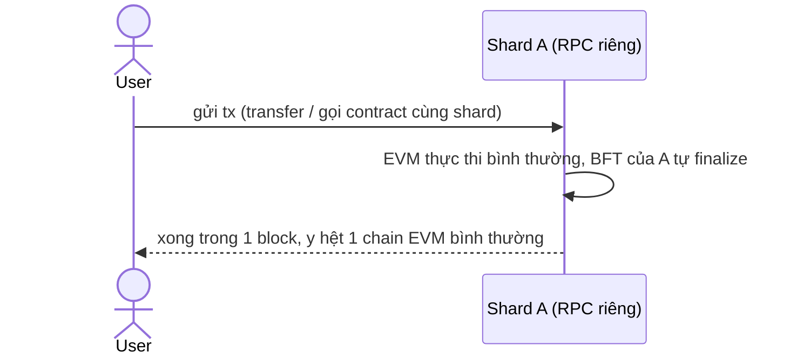
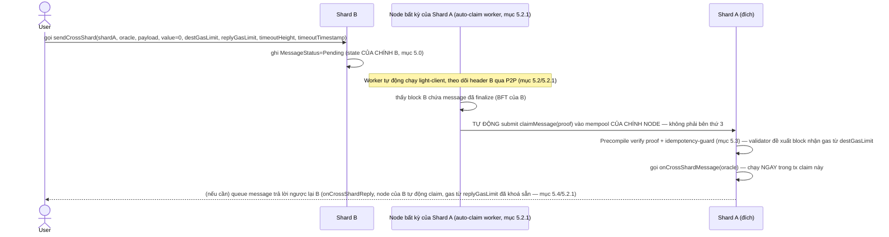
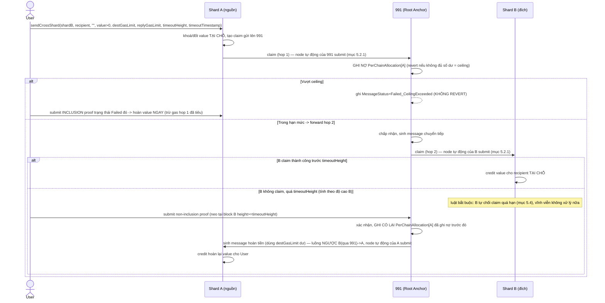
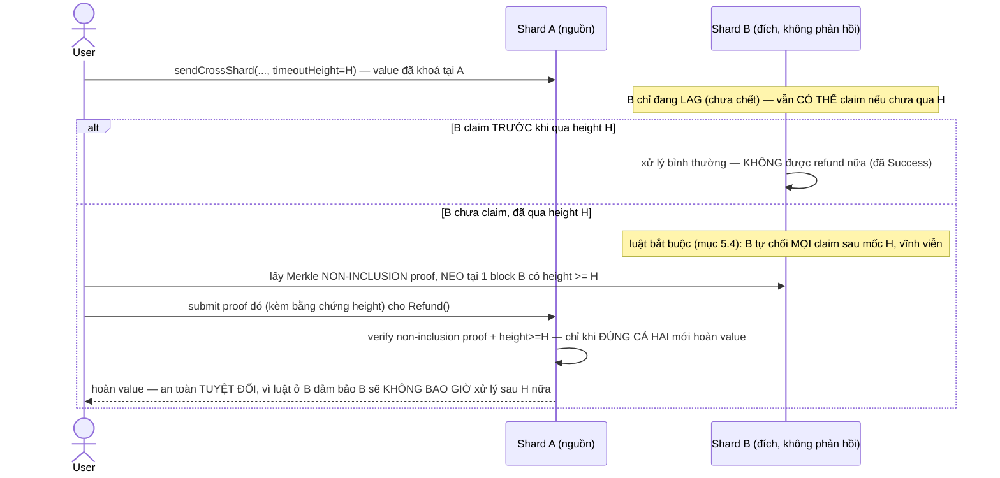

# Thiết kế Shard cho MetaNode (lấy cảm hứng TON, đã điều chỉnh cho thực tế)

**Trạng thái: đã qua 12 vòng phản biện + verify sâu trong code — CỐ Ý KHÔNG tự gọi là "AUDIT-READY" (tuyên bố đó ở vòng 8 đã bị chính vòng 11 chứng minh còn 1 lỗ hổng CRITICAL khác — kế toán ceiling Gross-vs-Net, mục 5.3/mục 10). Vòng 12 (rà soát toàn diện theo yêu cầu "đảm bảo mọi luồng giao dịch/vận hành không lỗi bảo mật, không lỗ hổng logic") chỉ còn tìm ra mức HIGH/MEDIUM (thiếu phí relayer cho chiều `onCrossShardReply`, thiếu idempotency-guard tường minh cho 2 luồng hoàn tiền) — không còn CRITICAL mới — nhưng lịch sử doc này (ít nhất 3 lần 1 bản vá tưởng đã đóng lại bị vòng sau chứng minh là sai) là lý do đủ để KHÔNG tự tin tuyên bố "không còn gì nữa". SẴN SÀNG TRIỂN KHAI Phase 1-2; Phase 3-4 đã có đủ cấu trúc dữ liệu cần thiết theo hiểu biết hiện tại (mục 5.3/5.4/8.4-8.7) nhưng BẮT BUỘC 1 vòng review độc lập nữa (code-level, không chỉ đọc doc) trước khi coi là final, vì đây là nơi tiền thật của người dùng đi qua; Phase 5-7 đã scope cụ thể, việc cần làm trước liệt kê ở mục 8.** Xem **mục 10 (Tổng kết)** cho trạng thái bảo mật + bản chất kiến trúc, **mục 11 (Luồng giao dịch cụ thể)** + **mục 12 (Vận hành)** cho kịch bản thực tế/runbook, và **Phụ lục A** cho lịch sử mọi lần sửa sai.
**Thay thế:** `note/cross_chain/shard_design_ton_inspired.md` (mô hình "tự động hoá cross-chain" — batch/BLS-quorum/relayer) đã bị superseded bởi doc này.

---

## 1. Mục tiêu & phạm vi

**Mục tiêu:** phân chia trạng thái để quản lý — thực thi ở nhiều nơi (nhiều "shard"), có nhắn tin xuyên shard nhanh hơn cross-chain hiện tại (không qua relayer + BLS-quorum), không đổi gì cho hợp đồng EVM chạy trong nội bộ 1 shard.

**Không nhắm tới** (đã cân nhắc và loại có chủ đích, xem Phụ lục A):
- Sharding tự động theo tải (split/merge động kiểu TON thật) — quá rủi ro fork với cấu trúc state hiện tại (mục 3).
- Composability đồng bộ xuyên shard cho MỌI trường hợp — chỉ đảm bảo được cho nhóm contract được ghim cùng shard lúc deploy (mục 6, giới hạn cố hữu, không sửa được).
- Chia sẻ bảo mật/validator giữa các shard (TON thật có, thiết kế này không có — đánh đổi lấy sự đơn giản, xem mục 7).

**Nói thẳng để không ai đọc nhầm:** với 3 điều KHÔNG nhắm tới ở trên, "shard" trong toàn bộ doc này **về bản chất kỹ thuật CHÍNH LÀ 1 private chain hôm nay** (đăng ký/vận hành y hệt, validator độc lập, state vật lý tách biệt hoàn toàn — mục 2 quyết định #3, mục 5.0, mục 7) — **không phải sharding chia sẻ bảo mật thật kiểu TON.** Khác biệt DUY NHẤT so với private chain hôm nay: nhắn tin xuyên chain nhanh hơn (native, ~1-2 block, không qua relayer+BLS-quorum, mục 4/5.2-5.4) + lớp trình bày thống nhất cho người dùng cuối (mục 6.3). Đây là lựa chọn có chủ đích xuyên suốt (đơn giản, ít rủi ro hơn "sharding thật"), không phải hạn chế bị bỏ sót.

**Hệ quả trực tiếp cho dev — mỗi shard có RPC riêng, phát triển/chạy dApp HOÀN TOÀN ĐỘC LẬP, y hệt 1 chain bình thường hôm nay:** vì shard chính là 1 chain (ở trên), dev deploy contract/chạy dApp trên 1 shard bằng ĐÚNG tooling EVM chuẩn (Hardhat/Foundry/ethers/web3.js...) trỏ vào RPC của shard đó — không cần biết, không cần quan tâm có bao nhiêu shard khác tồn tại, y hệt chọn 1 chain để deploy hôm nay. Không có gì thay đổi ở tầng RPC/EVM cho 1 dApp KHÔNG cần tương tác xuyên shard. Chỉ có đúng 2 điểm khác nếu dApp thật sự cần xuyên shard:
- Muốn gọi/nhắn tin sang shard khác → dùng thêm `IShardMessenger` (mục 5.4), 1 precompile mới, tường minh — không phải thay đổi ngữ nghĩa EVM sẵn có.
- Deploy contract MỚI lần đầu bằng 1 địa chỉ (EOA) CHƯA từng deploy contract nào → trả thêm ~1-2 block xác nhận "nhà" 1 lần duy nhất (mục 6.4) — không ảnh hưởng giao dịch thường (transfer, gọi hàm), không ảnh hưởng lần deploy thứ 2 trở đi.

Ngoài 2 điểm đó, RPC của 1 shard hoạt động y hệt RPC của 1 chain EVM độc lập hôm nay — không có API mới bắt buộc phải học, không có ràng buộc mới cho dApp không cần composability xuyên shard.

## 2. 5 quyết định kiến trúc nền tảng

| # | Quyết định | Lý do ngắn gọn |
|---|---|---|
| 1 | **Số shard cố định** — chỉ thêm shard mới (rỗng, chưa có state) theo thời gian, không tách/gộp động | Cắt 1 trie đang sống một cách xác định đòi hỏi đổi key scheme NOMT (rủi ro cao, ảnh hưởng mọi state root) — thêm shard rỗng không cần gì trong số đó |
| 2 | **Masterchain = dùng luôn chain 991** (Root Anchor hiện tại), không tách workchain riêng | Ý nghĩa "masterchain" đã nhẹ đi nhiều (chỉ còn là registry `ChainRegistry`, không cần embed header mọi shard mỗi round) — không còn lý do tách riêng |
| 3 | **Mỗi shard tự đăng ký validator độc lập** (như private chain hôm nay qua `RegisterChainViaStake`), không dùng chung 1 pool | Đơn giản hơn nhiều, tái dùng nguyên vẹn cơ chế đăng ký đã có; đánh đổi: không chia sẻ bảo mật giữa các shard (mục 7) |
| 4 | **Account/contract thuộc shard nơi tx tạo ra nó được gửi tới** — không có thuật toán gán (không round-robin, không theo tải) | Giống hệt cách chọn 1 chain hôm nay; "ghim" composability tự nhiên có sẵn — chỉ cần gửi các tx deploy liên quan tới cùng 1 endpoint |
| 5 | **Cross-shard message = 1 giao dịch bình thường** (precompile claim-message), verify bởi BFT sẵn có của shard đích — không cần masterchain-anchoring cấp consensus | BFT round của shard đích (proposer đề xuất, validator độc lập verify, đủ 2/3 mới finalize) đã tự nhiên là "điểm đồng thuận" cần thiết cho an toàn import xuyên shard |

## 3. Vì sao không làm Split/Merge động (tóm tắt)

Verify trực tiếp `execution/pkg/trie/nomt_state_trie.go`: NOMT dùng `Keccak256(address)` làm khoá lưu trữ ("để đảm bảo phân bố đều trên trie") — điều này phá vỡ tính cục bộ tiền tố mà TON cần để "cắt trie theo tiền tố" là 1 phép toán xác định, mọi validator tính ra cùng kết quả. Nếu cố làm split động trên cấu trúc hiện tại (ví dụ bằng cách export/import state độc lập từng validator), rủi ro **fork ngay ở block đầu tiên của shard mới** — không phải lý thuyết, mà là hệ quả trực tiếp của việc mỗi validator có thể tính ra 1 kết quả filter khác nhau từ dữ liệu cục bộ của mình. Quyết định #1 (mục 2) tránh toàn bộ lớp rủi ro này bằng cách không bao giờ "cắt" — chỉ khởi tạo genesis mới cho shard thêm vào.

## 4. Vì sao không cần sửa consensus/Rust core

Bản nháp đầu của thiết kế này từng đề xuất "masterchain phải embed hash của mọi shard vào luật đề xuất block mỗi round" (đúng nguyên bản TON) — sai lầm vì bê nguyên yêu cầu latency ~1-2 block của TON trong khi mục tiêu thật (mục 1) không cần mức đó.

Nhận ra: an toàn của việc import cross-shard (không được để 2 validator suy luận độc lập ra 2 kết quả khác nhau — nguồn gốc mọi rủi ro fork) đã được đảm bảo sẵn **nếu claim message được làm thành 1 giao dịch bình thường** — vì đó chính xác là cách BFT hoạt động cho MỌI giao dịch: proposer đề xuất, từng validator độc lập re-verify, đủ 2/3 mới finalize. Không đủ đồng thuận thì block không finalize — không có khái niệm "fork do suy luận khác nhau" trong chính luồng xử lý giao dịch bình thường.

Vậy phần thật sự khác so với cross-chain hiện tại chỉ còn 1 chỗ: **cách shard đích LẤY được header đã finalize + bằng chứng đồng thuận của shard nguồn** để verify Merkle proof — thay vì chờ relayer poll + gom đủ BLS quorum (chậm, giây-phút), dùng 1 light-client (Go, thuần execution/tooling) đọc trực tiếp header + quorum certificate của shard nguồn.

**Đã verify light-client này khả thi bằng cơ chế đã có sẵn:** đọc `consensus/metanode/meta-consensus/core/src/`. Consensus hiện tại là DAG-based kiểu Mysten Labs/Sui (không phải HotStuff/Tendermint cổ điển) — `CommitSyncer.verify_commits()` đã verify độc lập 1 `TrustedCommit` bằng tập `SignedBlock` ("vote blocks", mỗi block tự ký bởi validator tác giả) cộng dồn stake vào `StakeAggregator<QuorumThreshold>`, đủ 2/3 mới coi là chứng nhận — đây CHÍNH XÁC là artifact cần, đã tồn tại và đang chạy thật (dùng cho commit-sync giữa peer cùng chain). `Committee::new(epoch, authorities)` tạo tự do từ bất kỳ danh sách pubkey+stake nào, không hardwire vào "committee của chính chain này" — nghĩa là hoàn toàn dựng được `Committee` cho SHARD KHÁC (đọc từ `ChainRegistry` trên 991) rồi tái dùng nguyên vẹn logic verify đã có.

**Việc code mới thật sự (không phải sửa luật đồng thuận):** 1 hàm FFI mới, thuần tuý/không trạng thái, bọc `verify_commits`/`Committee::new()` — xem mục 8.

## 5. Kiến trúc chi tiết

### 5.0. Mô hình lưu trữ: account/contract sống ở ĐÚNG 1 shard, không có trie dùng chung — nguyên tắc nền cho mọi mục dưới đây

Đây là nền tảng khiến "mỗi shard chạy độc lập nội bộ" và "các shard gọi lẫn nhau" KHÔNG mâu thuẫn nhau — 1 nguyên tắc duy nhất giải thích cả 2:

> **1 shard KHÔNG BAO GIỜ ghi trực tiếp vào state của shard khác. Toàn bộ tương tác xuyên shard chỉ là ĐỌC (có proof) trạng thái ĐÃ FINALIZE của shard khác, rồi TỰ GHI vào state CỦA CHÍNH MÌNH.**

**Lưu trữ vật lý — độc lập hoàn toàn, đã verify trong code:** mỗi shard là 1 tiến trình node riêng (mục 5.1), với **database NOMT vật lý riêng, tách biệt hoàn toàn** khỏi mọi shard khác — verify `execution/pkg/trie/trie_factory.go`: mỗi namespace (`account_state`, `smart_contract_storage`, `stake_db`...) đã là 1 `GetOrInitNomtHandle(namespace)` riêng NGAY TRONG 1 shard; giữa 2 SHARD khác nhau, khoảng cách còn xa hơn nữa — là 2 tiến trình hoàn toàn khác, 2 bộ file NOMT trên đĩa hoàn toàn khác, không dùng chung bất kỳ handle/process nào. Không có khái niệm "1 trie chung cho cả workchain" ở bất kỳ đâu trong thiết kế này.

**1 account/contract chỉ tồn tại trên ĐÚNG 1 shard, trọn vẹn** (code, storage slot, số dư) — không có khái niệm "account phân mảnh trên nhiều shard". Quyết định #4 (mục 2) đã chốt: shard nào nhận tx tạo ra nó thì account/contract đó sống TRỌN ĐỜI ở đó. Vậy "phân tán account/contract ra nhiều shard" nghĩa là: TOÀN BỘ address-space của hệ thống được CHIA (không chồng lấn) cho các shard theo nơi chúng được tạo ra — không phải 1 account bị xẻ nhỏ ra nhiều nơi.

**Vậy "shard gọi lẫn nhau" hoạt động thế nào nếu không ai ghi được vào trie người khác?** Đúng theo luồng đã mô tả ở mục 5.2-5.4, nhìn từ góc độ LƯU TRỮ:

```
Shard 1 (tiến trình riêng, NOMT riêng)          Shard 2 (tiến trình riêng, NOMT riêng)
┌─────────────────────────────┐                 ┌─────────────────────────────┐
│ account_state (shard 1)     │                 │ account_state (shard 2)     │
│ smart_contract_storage (s1)  │   ①  message    │ smart_contract_storage (s2)  │
│ Contract A: code+storage ────┼──── (ghi vào ──►│                             │
│   ghi PENDING message vào    │     state CỦA   │                             │
│   state CỦA CHÍNH SHARD 1)   │     SHARD 1)    │                             │
└─────────────────────────────┘                 └─────────────────────────────┘
                                  ② light-client shard 2 ĐỌC (có proof)
                                     header đã finalize của shard 1 — 
                                     KHÔNG đọc trực tiếp trie shard 1,
                                     chỉ đọc header/commit ĐÃ CÔNG KHAI
                                                        │
                                                        ▼
                                 ③ tx claimMessage() chạy trên SHARD 2,
                                    do CHÍNH consensus shard 2 xử lý —
                                    GHI vào account_state/smart_contract_storage
                                    CỦA SHARD 2, gọi onCrossShardMessage
                                    trên Contract B (sống ở shard 2)
```

3 điểm mấu chốt từ sơ đồ trên:
- **① Ghi (write) luôn cục bộ:** Contract A gọi `sendCrossShard` → chỉ ghi vào state CỦA SHARD 1 (nơi A sống) — không đụng tới bất kỳ byte nào ở shard 2.
- **② Đọc xuyên shard luôn qua proof, không bao giờ đọc thẳng:** shard 2 không có, và không cần có, quyền truy cập trực tiếp vào NOMT handle của shard 1 — chỉ verify 1 header/commit đã công khai (mục 5.2), đúng cơ chế đã xác lập không cần masterchain-anchoring cấp consensus (mục 4).
- **③ Ghi kết quả cũng luôn cục bộ:** `claimMessage()`/`onCrossShardMessage` chạy hoàn toàn trong tiến trình + NOMT của shard 2 — Contract B (sống ở shard 2) được cập nhật bởi CHÍNH consensus của shard 2, không phải shard 1 "vươn tay" sang ghi hộ.

**Hệ quả trực tiếp: mỗi shard CHẠY NỘI BỘ hoàn toàn độc lập** (đúng ý "độc lập chạy nội bộ" bạn hỏi) — 1 shard có thể dừng, restart, đồng bộ lại từ đầu (`ExportAllXapianLogs`/`CallReplayFullDbLogs`, mục 7) mà không ảnh hưởng gì tới state của shard khác, vì chưa bao giờ có sự phụ thuộc ghi chéo. Điều DUY NHẤT 1 shard cần từ bên ngoài để tiếp tục hoạt động bình thường là: **đọc được (không cần ghi được) header đã finalize của các shard nó có message đang chờ xử lý** — nếu 1 shard khác tạm thời offline, shard hiện tại vẫn xử lý mọi tx nội bộ bình thường, chỉ riêng message ĐẾN/ĐI từ shard đang offline đó bị treo ở trạng thái `Pending` cho tới khi có lại kết nối (và timeout an toàn ở mục 5.4 xử lý trường hợp offline vĩnh viễn).

**`AddressShardRegistry` (mục 6.3.1) không mâu thuẫn với mô hình trên** — nó KHÔNG chứa state thật (không có balance/code/storage), chỉ là 1 bảng tra cứu SIÊU NHẸ ("địa chỉ X → shard nào") sống trên 991, tách biệt hoàn toàn khỏi state thật của account (vẫn chỉ nằm ở đúng 1 shard sở hữu nó). Registry giúp NGƯỜI DÙNG tìm đúng nơi, không phải nơi LƯU state.

### 5.1. Thêm shard mới (Phase 1)

Gần như CHÍNH XÁC quy trình `RegisterChainViaStake`/genesis-funding hiện tại đang dùng cho private chain (`pkg/cross_chain/gateway.go`, `cmd/tool/register_chains`) — thêm 1 shard = đăng ký chain đã có, cộng đăng ký vào `ShardTable` trên 991 (schema ở mục 8) + wire vào cơ chế claim-message (5.3) thay vì route qua relayer+BLS-quorum như 1 private chain độc lập thật.

Shard mới bắt đầu từ state RỖNG — không di chuyển/migrate bất kỳ account nào từ shard khác (khác Split, xem mục 3). **Hệ quả cần biết:** vị trí shard của 1 account/contract là VĨNH VIỄN một khi đã tạo (quyết định #4) — không có cơ chế di chuyển thủ công hay tự động nào sau này; chọn sai shard lúc deploy là không thể sửa.

**Có bỏ được yêu cầu "mỗi shard cần 1 genesis" không? — Không bỏ hoàn toàn được, nhưng bỏ được phần nặng nhất của nó.**

- **Phần KHÔNG bỏ được:** mỗi shard tự có validator riêng (quyết định #3) — nghĩa là mỗi shard là 1 mạng BFT độc lập, và **bất kỳ mạng BFT độc lập nào cũng cần 1 điểm khởi đầu đã thống nhất** (tập validator ban đầu + chain ID) để chạy được — đây không phải giới hạn riêng của thiết kế này, là yêu cầu của MỌI hệ thống BFT. Muốn bỏ hẳn genesis, phải bỏ luôn quyết định #3 (quay lại dùng chung 1 pool validator cho cả workchain) — đã cân nhắc và loại vì phức tạp hơn nhiều (mục 2), không khuyến nghị đổi lại.
- **Phần BỎ ĐƯỢC — đây mới là phần thường gây đau đầu thật:** genesis KHÔNG cần đi kèm bước "genesis-funding" (nạp sẵn số dư cho các địa chỉ cụ thể trong `genesis.json`). Dự án này đã từng gặp lỗi vận hành đúng loại này trước đây khi triển khai private chain (ví hardcode trong tooling/test client không khớp ví được nạp sẵn trong genesis — lớp lỗi "2 nơi phải đồng bộ tay với nhau" luôn dễ vỡ). Với shard mới: genesis chỉ cần định nghĩa **validator set + chain ID** (tối thiểu) — KHÔNG cần nạp số dư trước cho bất kỳ địa chỉ nào. Vốn vận hành (native coin) cho shard mới nhận được **sau khi đã chạy**, qua đúng cơ chế cross-shard/cross-chain giá trị đã có (`TransferAllocationWithCert`, hoặc `IShardMessenger.sendCrossShard` với `value`, mục 5.4) — y hệt cách 1 account bình thường nhận tiền, không phải 1 bước genesis riêng.

**Kết luận:** "genesis" ở đây rút gọn thành 1 bước rất nhẹ — khai báo validator ban đầu, không phải cả quy trình nạp tiền/đồng bộ ví như deploy 1 private chain đầy đủ hôm nay.

### 5.2. Light-client cross-shard (Phase 2)

Component Go mới, đọc trực tiếp header đã finalize + bằng chứng đồng thuận của shard khác qua P2P/RPC — thay thế relayer-poll-rồi-gom-BLS-quorum. Dùng `Committee` dựng từ `ChainRegistry` của shard nguồn (đọc trên 991) + hàm FFI mới (mục 8) để verify độc lập, không cần tin tưởng bên gửi dữ liệu.

Cần mở rộng 1 RPC fetch-commit hiện có (dùng bởi `CommitSyncer` giữa các peer CÙNG chain hôm nay) để nhận request từ node của shard KHÁC — network/wiring, không phải logic đồng thuận.

**Chi tiết đúng-sai quan trọng (phát hiện khi rà lại lần cuối):** phải dựng `Committee` **đúng theo epoch mà chính commit đó tuyên bố** (commit/`CommitRef` đã mang sẵn field epoch), KHÔNG PHẢI committee mới nhất đọc từ `ChainRegistry` tại thời điểm verify. Nếu shard nguồn đã đổi committee (qua `ApplyCommitteeUpdate`/`UpdateCommitteeWithRecoveryCert`, cơ chế đã có) sau khi 1 commit cũ được ký, verify bằng committee MỚI sẽ sai.

**⚠️ Xác nhận BẮT BUỘC phải sửa, không chỉ là "cần bổ sung nếu thiếu" (rà soát lại thấy đây là yêu cầu cứng, không phải tuỳ chọn):** verify trực tiếp `ChainRegistry` (`gateway.go`) — `UpdateCommitteeWithRecoveryCert`/`ApplyCommitteeUpdate` **GHI ĐÈ trực tiếp** `g.ChainRegistry[chainID]` (map, 1 entry/chain, không versioning) — xác nhận **không có lịch sử committee theo epoch nào được giữ lại hôm nay**, đúng như lo ngại đã nêu. Hệ quả nếu không sửa: 1 message bị lag ở cuối epoch cũ, claim ở epoch mới, sẽ bị từ chối SAI (light-client không tìm được committee cũ để verify) — **mất tiền oan cho người dùng vì hệ thống từ chối nhầm 1 giao dịch hợp lệ**, không phải chỉ là lỗi vặt. **Bắt buộc:** `ChainRegistry` trên 991 phải lưu lịch sử Committee theo epoch (tối thiểu N epoch gần nhất, ví dụ 10-20 — đủ dài hơn thời gian trễ tối đa 1 message có thể bị kẹt), không chỉ giữ committee mới nhất. Hàm FFI verify (mục 8.2) phải nhận đúng committee-snapshot của epoch được yêu cầu, không phải committee "hiện tại".

### 5.2.1. Loại bỏ relayer permissionless — Node tự động claim (PIVOT KIẾN TRÚC, 2026-09-06, theo yêu cầu người dùng)

**Bối cảnh:** sau khi đối chiếu với TON thật, xác nhận TON KHÔNG dùng relayer cho nhắn tin xuyên shard nội bộ — validator của CHÍNH shard đích tự đọc `OutMsgQueue` của shard nguồn và tự đưa message vào block mình đề xuất, như 1 phần bình thường của việc tạo block (nguồn: TON Docs, đã fetch trực tiếp — xem lịch sử hội thoại). Người dùng yêu cầu chuyển sang mô hình này.

**⚠️ Làm rõ ngay: đây KHÔNG phải áp dụng "TON thật" (đã cân nhắc và loại ở phần đầu doc này — mục 1/mục 2 quyết định #3).** Cơ chế "no relayer" của TON thực ra tách được thành 2 phần ĐỘC LẬP nhau, không bắt buộc lấy cả 2:
1. **Validator pool CHUNG, xoay ngẫu nhiên (VRF/catchain) qua các shard mỗi epoch** — đây là thứ tạo ra "shared security" thật của TON (an ninh kinh tế, mục 10) — đòi hỏi sửa sâu Rust consensus-core, quy mô dự án khác hẳn, **KHÔNG lấy phần này** (quyết định #3 giữ nguyên, không đổi — mỗi shard vẫn tự chủ validator độc lập).
2. **Việc "ai submit transaction đưa message vào block" được bundle SẴN vào phần mềm node tiêu chuẩn, chạy tự động, thay vì phải là 1 bên thứ 3 (relayer) chạy riêng vì lợi nhuận** — đây LÀ phần lấy được, và KHÔNG cần sửa Rust/consensus-core, chỉ cần thay đổi ở tầng Go (giống toàn bộ phạm vi doc này).

**Cơ chế cụ thể — không phải "validator có nghĩa vụ, nếu không làm sẽ bị phạt" (không phải vấn đề BFT/slashing mới):** đơn giản là bundle 1 worker Go (đúng khuôn mẫu `CommitteeAttestationWorker`/`MessageSuccessAttestationWorker` đã có sẵn trong codebase hôm nay — 1 goroutine chạy nền TRONG CHÍNH tiến trình node, không phải binary riêng) vào phần mềm node TIÊU CHUẨN của mọi shard. Worker này:
1. Chạy light-client (mục 5.2) LIÊN TỤC (không chỉ verify khi có ai đó submit proof) — chủ động theo dõi các shard đã đăng ký trong `ShardTable` xem có message mới nào đang chờ (Pending) gửi tới CHÍNH shard mình đang chạy hay không.
2. Khi phát hiện 1 message hợp lệ, tự động submit 1 giao dịch `claimMessage()` vào MEMPOOL CỦA CHÍNH NODE ĐÓ — giao dịch này chảy qua đúng luồng xử lý tx/block-proposal BÌNH THƯỜNG (không cần hook đặc biệt vào luật đồng thuận), y hệt bất kỳ giao dịch nào khác đang chờ trong mempool.
3. Ai đề xuất block tiếp theo (bất kỳ validator nào, theo đúng lượt round-robin/BFT sẵn có) sẽ tự nhiên include giao dịch này nếu hợp lệ — không có bước "chọn ai làm relayer" nào cả.

**Vì sao KHÔNG cần "relayer" trả tiền/Tip nữa — worker này không tự bỏ tiền túi ra:** giao dịch `claimMessage()` tự sinh ra vẫn được funding từ đúng khoản đã khoá sẵn bởi người GỬI lúc `sendCrossShard` (native coin locked/escrowed tại nguồn) — y hệt cơ chế `settleGasCappedContractCall` đã có (gas-capped, refund phần dư) — KHÔNG phải worker tự trả gas từ ví riêng. Gas thực thi trả cho validator ĐANG đề xuất block đó theo đúng cơ chế gas-fee-to-proposer BÌNH THƯỜNG của EVM (y hệt mọi giao dịch khác), không cần 1 sổ cái `RelayerBalances`/Tip riêng nào nữa.

**Vì sao KHÔNG kém an toàn/sống hơn mô hình relayer cũ — mà thực ra TỐT HƠN:** mô hình relayer cũ phụ thuộc "có ai đó chạy 1 chương trình riêng, đủ động lực lợi nhuận để làm việc này" (rủi ro đã ghi ở mục 5.5/12.3: phí quá thấp thì relayer ngừng phục vụ). Mô hình mới: khả năng claim message được BUNDLE SẴN vào MỌI node chạy phần mềm tiêu chuẩn — bất kỳ node nào (không nhất thiết phải là validator của shard đích, dù validator chạy nó là tự nhiên nhất) đang online với phần mềm mặc định đều tự động làm việc này. Sống còn (liveness) chỉ cần: **không phải TẤT CẢ mọi node trên toàn mạng đều tắt worker này** — yêu cầu YẾU HƠN nhiều so với "1 thị trường relayer cạnh tranh vì lợi nhuận phải tồn tại".

**Hệ quả lên toàn bộ thiết kế fee (thay đổi lớn, đơn giản hoá đáng kể):**
- **Bỏ hẳn `Tip`** — không còn bên thứ 3 cần khuyến khích lợi nhuận.
- **Bỏ hẳn tách `hop1`/`hop2`/`reply` phí riêng (`CrossShardFees` struct cũ)** — không còn câu hỏi "ai nhận phí ở hop nào" vì không còn khái niệm "relayer nhận phí", chỉ còn "validator đề xuất block nhận gas-fee bình thường của giao dịch đó" giống MỌI giao dịch khác.
- **Giữ nguyên, đơn giản hoá thành 1-2 tham số gas-limit thuần EVM** — xem mục 5.4 (đã viết lại interface).
- **`TimeoutHeight`/`timeoutTimestamp` (mục 5.4/8.5) GIỮ NGUYÊN, không đổi** — vẫn cần, vì shard đích vẫn có thể offline/network-partition thật (không liên quan gì tới việc ai submit claim), an toàn double-spend vẫn y hệt đã thiết kế.
- **`Failed_CeilingExceeded`/luồng hoàn tiền (mục 5.3/8.7) GIỮ NGUYÊN cơ chế, chỉ đổi cách funding** — message hoàn tiền cũng chỉ là 1 giao dịch khác, cũng được node tự động claim y hệt, không cần phí `hop2` dư đặc biệt nữa (dùng thẳng gas-limit đã khoá).
- **Idempotency-guard, messageId riêng theo `(sourceShard, destShard, txHash, logIndex)`, GC lịch sử committee, kế toán NET `PerChainAllocation`, reentrancy-safety qua `isBarrierTx` (tất cả các phát hiện vòng 2-12) — TẤT CẢ GIỮ NGUYÊN, không đổi.** Pivot này CHỈ thay đổi "ai submit giao dịch claim", không thay đổi BẤT KỲ luật xử lý/verify nào bên trong precompile.

**Chi phí vận hành thật, nói rõ không giấu:** mỗi node giờ đây BẮT BUỘC chạy light-client cho MỌI shard nó có thể nhận message (không chỉ optional như bản trước) — tăng yêu cầu tài nguyên/băng thông so với node chỉ chạy consensus+execution thuần tuý. Đây là đánh đổi thật để có "no relayer" — không miễn phí, chỉ là chi phí đó nằm Ở TRONG phần mềm node tiêu chuẩn (chi phí hạ tầng), không phải Ở NGOÀI dưới dạng 1 nghành kinh doanh relayer riêng (chi phí thị trường/Tip).

**Không đổi Phase 5 (mục 5.5/10) — nói rõ để không hiểu nhầm "đã giải quyết xong an ninh kinh tế":** pivot này chỉ đổi CƠ CHẾ VẬN CHUYỂN message (ai submit tx), KHÔNG đổi việc mỗi shard vẫn tự chủ validator độc lập (quyết định #3 không đổi) — rủi ro "mắt xích yếu nhất"/weakest-link (1 shard bị chiếm validator tự ký chứng nhận giả) vẫn y hệt, KHÔNG được giải quyết bởi pivot này. Muốn giải quyết cả 2 cùng lúc phải đi trọn hướng TON thật (bỏ quyết định #3, xem lựa chọn đã bị loại ở trên) — ngoài phạm vi pivot này.

### 5.3. Precompile claim-message (Phase 3)

Precompile mới, họ hàng với Gateway precompile hiện có (`gateway.go`), verify Merkle proof bằng logic thuần Go/EVM — y hệt cách `claimMessage()` verify hôm nay, dùng header từ Phase 2. Không đụng `mvm_api.go`/C++ MVM, không đụng block-validity rule của consensus.

**Bắt buộc giữ nguyên 2 protection đã có ở `claimMessage()` hôm nay** (dễ bị bỏ sót nếu viết code mới từ đầu thay vì fork code hiện có):
- **Ceiling `PerChainAllocation`** — xem phân tích đầy đủ + sửa lại bên dưới (bản trước ở đây SAI, đã tìm ra và fix).
- **Idempotency-guard `StatusByMessageID`/`ErrAlreadyClaimed`** — chống replay: cùng 1 Merkle proof hợp lệ không được submit 2 lần để nhận tiền 2 lần.

**⚠️ SỬA LẠI TOÀN BỘ (2026-09-06, phát hiện nghịch lý logic thật trong chính bản sửa trước đó của mục này): "tự cài lại tổng cộng dồn toàn cục" ở P2P là KHÔNG THỂ LÀM ĐƯỢC, không phải chỉ khó.**

Bản trước nói "precompile mới verify trực tiếp (P2P) nên phải tự cài lại đúng tính chất tổng cộng dồn toàn cục" — nói ra được YÊU CẦU đúng nhưng KHÔNG THỂ THỰC HIỆN yêu cầu đó trong mô hình P2P thuần tuý. Lý do: nếu Shard X bị chiếm >2/3 validator, kẻ tấn công **kiểm soát toàn bộ những gì X "khai báo" ra bên ngoài** — có thể tự ký (equivocate) 2 trạng thái "cuối cùng" KHÁC NHAU của chính X, mỗi trạng thái chỉ show cho 1 bên quan sát (Shard Y thấy 1 nhánh nói "tổng đã gửi = 1 triệu, đúng ceiling", Shard Z thấy 1 nhánh KHÁC cũng nói "tổng đã gửi = 1 triệu, đúng ceiling" — nhưng thực chất đã gửi 2 triệu, mỗi nơi 1 triệu, không nơi nào biết về nơi kia). Đây là **chính vấn đề double-spend cổ điển** mà 1 sổ cái tập trung/tuần tự vốn sinh ra để giải quyết — không thể tự "cài lại" bằng cách thêm 1 field đếm dồn vào state của X, vì X (kẻ bị chiếm) chính là bên đang bị nghi ngờ nói dối, không thể lấy lời khai của kẻ đó làm bằng chứng giới hạn chính kẻ đó.

**Sửa: tách 2 luồng định tuyến, không dùng chung 1 cơ chế cho mọi loại message:**

- **Luồng Data-only (`value == 0`)** — giữ nguyên P2P trực tiếp qua light-client (mục 5.2), KHÔNG đổi gì — nhanh (~1-2 block), không có rủi ro ceiling vì không có giá trị native coin nào di chuyển (dApp tự chịu trách nhiệm logic của chính nó nếu có, không phải rủi ro hệ thống).
- **Luồng Value-transfer (`value > 0`, hoặc bất kỳ field nào ghi nợ `PerChainAllocation` — gồm cả `fees.hop2GasFee`/`hop2Tip`, mục 5.4)** — **BẮT BUỘC đi qua 991**, không được P2P trực tiếp: Shard X gửi claim LÊN 991 trước (991 tự verify + ghi nhận vào SỔ CÁI THẬT do CHÍNH 991 tính từ các claim đã xử lý, không phải X tự khai — nếu vượt ceiling, 991 từ chối ngay tại đây); chỉ khi 991 chấp nhận, 991 mới sinh tiếp 1 message chuyển tiếp sang shard Y. Đây chính xác là mô hình 2-hop A→Reserve→B **đã có sẵn, đã audit** trong cross-chain hiện tại (mục 7) — không phải thiết kế mới, chỉ là ĐÚNG LẠI cho trường hợp value-transfer thay vì cố P2P hoá luôn cả phần này.

**⚠️ Sửa lại thuật ngữ + cơ chế (2026-09-06, phát hiện lỗi Gross-vs-Net thật, KHÔNG dùng "CumulativeOutflow" nữa — đây là 1 khái niệm SAI, không phải chỉ thiếu 1 bước trừ):** đặt tên "CumulativeOutflow" (chỉ cộng dồn, không bao giờ trừ trừ phi bị revert/timeout) tự nó đã mô tả 1 SỔ CÁI GROSS (tổng lưu lượng đã từng gửi, cộng dồn vĩnh viễn) — SAI, vì nếu X gửi cho Y rồi Y sau đó gửi lại cho X (2 giao dịch hợp lệ, độc lập, không phải refund của giao dịch lỗi), 1 sổ cái gross sẽ CỘNG DỒN cả 2 chiều mà không bao giờ trừ, dù dòng tiền ròng của X không đổi — toàn mạng sẽ dần chạm ceiling giả và tự khoá vĩnh viễn luồng value-transfer dù cung tiền không hề mất cân bằng. **Sửa tận gốc bằng cách KHÔNG phát minh sổ cái mới: tái dùng nguyên vẹn cơ chế `PerChainAllocation` NET (ghi nợ khi gửi / ghi có khi nhận) đã có sẵn, đã audit thật trong `gateway.go` hôm nay** — xác nhận qua code: `AttestCommit`/`attestCommitInternal` **GHI NỢ** `PerChainAllocation[sourceChainID] -= amount` khi X gửi đi (dòng ~1262), và `ClaimMessage` **GHI CÓ** `PerChainAllocation[destChainID] += value` khi Y nhận được (dòng ~1365) — đây VỐN DĨ đã là kế toán NET/tự cân bằng (X gửi thì giảm số dư của X, Y nhận thì tăng số dư của Y; nếu sau đó Y gửi lại cho X, chính Y bị ghi nợ và X được ghi có, tự động đảo ngược, không cộng dồn 1 chiều). **Áp dụng y nguyên cơ chế này cho value-transfer xuyên shard**: 991, khi xử lý hop 1 (claim từ X), ghi nợ `PerChainAllocation[X]` (revert nếu không đủ số dư — chính là "ceiling" nói ở trên, không cần khái niệm riêng); khi forward hop 2 tới Y và Y claim thành công, ghi có `PerChainAllocation[Y]`. Chiều ngược lại (Y gửi cho X) dùng ĐÚNG 2 bước y hệt, đảo vai trò — tự động phục hồi lại "hạn mức gửi đi" mà X đã dùng trước đó, không cần bất kỳ logic trừ-đặc-biệt nào thêm vào. Mọi chỗ trong tài liệu này còn nhắc tới "CumulativeOutflow" bên dưới là DIỄN ĐẠT CŨ, đọc là `PerChainAllocation` ghi nợ/ghi có như vừa mô tả.

**Vì sao 991 giải quyết được, còn P2P thì không:** 991 là **điểm quan sát DUY NHẤT** cho MỌI giao dịch value-transfer của X (mọi claim đều phải qua đúng 1 BFT round của 991) — X không thể equivocate với 991 theo cách nó equivocate với 2 quan sát viên Y/Z riêng biệt, vì chỉ có 1 nơi duy nhất để nói dối, và 991 tự tính số dư từ chính các claim đã xử lý qua nó (không tin lời tự khai của X). Đánh đổi: value-transfer giờ chậm hơn (~2 hop thay vì 1, đúng độ trễ mô hình 2-hop cũ) — chi phí thật, không giấu, nhưng ĐÚNG là cách DUY NHẤT đảm bảo an ninh kinh tế trong mô hình "mỗi shard tự chủ validator" (quyết định #3, mục 10). Data-only vẫn giữ được lợi ích tốc độ chính của toàn bộ thiết kế này.

**⚠️ Bổ sung BẮT BUỘC (phát hiện khi rà soát luồng lỗi/rollback — thiếu ở bản trước): 2-hop tạo ra 2 điểm có thể "kẹt giữa chừng", mỗi điểm cần đường lùi cụ thể, không thể chỉ thiết kế đường xuôi.**

- **Kẹt ở hop 1 (991 từ chối vì vượt ceiling):** ĐÂY KHÔNG PHẢI "blackhole" như lo ngại ban đầu — tuy nhiên 991 **TUYỆT ĐỐI KHÔNG ĐƯỢC REVERT** giao dịch claim này (revert 1 giao dịch hệ thống do chính node tự sinh ra — mục 5.2.1 — không có ý nghĩa gì, chỉ lãng phí; cô lập lỗi rõ ràng luôn tốt hơn). Thay vào đó, 991 phải cô lập lỗi: ghi nhận state `MessageStatus = Failed_CeilingExceeded`, và dừng forward. Shard X sau đó dùng **1 Merkle INCLUSION proof của chính trạng thái `Failed_CeilingExceeded` đó** — chứng minh ngay lập tức, không cần chờ timeout gì cả, để tự hoàn tiền cho user tại chỗ (khoản gas cố định của hop 1, mục 5.2.1, đã tiêu cho việc verify+ghi nhận, phần còn lại hoàn hết). **Idempotency BẮT BUỘC ở phía X (cùng lớp yêu cầu đã nêu ở mục 8.7 cho chiều hop-2):** X phải tự đánh dấu messageId gốc là đã-hoàn-tiền-cục-bộ NGAY khi chấp nhận proof này, TRƯỚC khi credit — nếu không, cùng 1 inclusion proof (vẫn hợp lệ mãi mãi vì nó chỉ chứng minh 1 sự kiện quá khứ không đổi) có thể bị submit lại nhiều lần để credit nhiều lần trên X.
- **Kẹt ở hop 2 (991 đã duyệt, forward sang Y, nhưng Y chết/không bao giờ claim):** đây MỚI cần cơ chế timeout thật (xem mục 5.4's `TimeoutHeight`, áp dụng y hệt cho hop này, tính theo độ cao của Y) — và **BẮT BUỘC phải có luồng ngược Y→991→X** (không phải Y→X trực tiếp): nếu Y hết hạn mà chưa claim, ai đó submit non-inclusion proof (đúng chuẩn `TimeoutHeight`, mục 5.4) LÊN 991 — 991 xác nhận, **ghi CÓ lại `PerChainAllocation[X]` đúng số tiền đã ghi nợ trước đó** (nếu không hoàn lại, hạn mức gửi đi của X bị "ăn" oan vĩnh viễn dù tiền đã hoàn) — rồi 991 mới sinh tiếp 1 message hoàn tiền gửi VỀ X. Đây là lý do bắt buộc phải đi qua 991 cả lúc lỗi, không chỉ lúc thành công — nếu chỉ thiết kế đường xuôi, hạn mức của X sẽ dần bị polluted bởi các message đã hoàn tiền nhưng vẫn bị tính là "đã gửi", khiến shard X sớm muộn cũng chạm ceiling giả dù chưa thật sự dùng hết.

**⚠️ Xác nhận (không phải gap mới — đã có lời giải ở mục 8.7, nhắc lại ở đây để không ai đọc mục này riêng lẻ mà tưởng còn thiếu): message hoàn tiền 991→X ở trên tự nó CŨNG là 1 cross-shard message cần node tự động claim trên X (mục 5.2.1) — cần gas riêng cho chặng này.** Vì hop 2 (991→Y) chưa từng xảy ra, `destGasLimit` (đã khoá từ lúc gửi, chưa ai tiêu) vẫn còn nguyên — 991 tái dùng đúng khoản dư này làm gas cho giao dịch claim hoàn tiền trên X (chảy qua đúng cơ chế gas-fee-to-proposer bình thường, mục 5.2.1), không cần field riêng (xem mục 8.7 cho chi tiết).

**Phạm vi KHÔNG áp dụng (để không mở rộng quá mức):** đây chỉ bắt buộc cho NATIVE COIN (đối tượng `PerChainAllocation` theo dõi). Custom asset/token do dApp tự định nghĩa (ERC20-style trong storage riêng của dApp) là trách nhiệm của dApp tự thiết kế cơ chế tương tự nếu cần ceiling riêng cho token của họ — không phải nghĩa vụ hệ thống (đúng tinh thần fix cũ đã có, commit `694e4733`, tách ledger native khỏi custom-asset).

**Thay đổi cấu trúc lưu trữ cần thiết (khác Gateway hiện tại):** `gateway_handler.go` lưu TOÀN BỘ `GatewayEngine` (bao gồm `MessageStatus`) dưới **1 storage key duy nhất** (1 JSON blob). Precompile mới **không được copy mẫu này** cho phần trạng thái claim theo từng message — phải cho **mỗi `messageId` 1 storage key riêng** (namespace mới, giống cách `smart_contract_storage` lưu từng slot hôm nay). Lý do: NOMT chỉ chứng minh được theo TỪNG KEY — nếu cả trạng thái nằm trong 1 blob, không thể chứng minh "message Z có/không có mặt bên trong blob" ở tầng trie, chỉ chứng minh được "cả blob này có root X" (không đủ cho mục 5.4's non-inclusion proof).

### 5.4. Chuẩn hoá `IShardMessenger` + timeout an toàn (Phase 4)

`gateway.go` đã có sẵn đúng state machine cần (`MessageStatus{Pending,Success,Failed,Refunded}` + `Channel`) — vấn đề là cách contract dùng nó hôm nay (`demoPingPong.sol`) hoàn toàn ad hoc, mỗi contract tự chế lại từ đầu (tự gọi `sendMessage`, tự parse context bằng try/catch, tự định nghĩa callback không theo chuẩn nào).

**Chuẩn hoá thành 1 interface chung** (giống ERC-721 chuẩn hoá `IERC721Receiver` thay vì để mỗi contract tự định nghĩa callback riêng):

```solidity
/// ⚠️ ĐÃ ĐƠN GIẢN HOÁ (2026-09-06, sau pivot "no relayer" — mục 5.2.1): KHÔNG còn `CrossShardFees`
/// struct/Tip/hop1-hop2-reply-fee-split nữa. Từ khi việc submit claim được bundle vào phần mềm
/// node tiêu chuẩn (chạy tự động, không phải 1 bên thứ 3 vì lợi nhuận), KHÔNG còn khái niệm
/// "relayer cần được trả Tip" — chỉ còn "gas thật để thực thi code" giống MỌI giao dịch EVM khác.
/// destGasLimit: gas-limit cho hop THỰC THI CODE ĐÍCH (nơi `onCrossShardMessage` chạy — hop1 nếu
/// data-only 1-hop, hop2 nếu value-transfer 2-hop qua 991). Hop trung gian (claim thuần trên 991,
/// không chạy code người dùng) tốn 1 khoản gas CỐ ĐỊNH nhỏ do protocol tự định nghĩa, tự động trừ
/// từ khoản đã khoá — KHÔNG cần dev tự chọn, vì chi phí đó không biến thiên theo logic dApp.
/// replyGasLimit: gas-limit RIÊNG cho chiều `onCrossShardReply` (khi đích gọi lại contract nguồn
/// với kết quả, mục 5.4/11.2) — 0 nếu không cần reply. Luồng hoàn tiền value-transfer thất bại
/// (mục 5.3/8.7) dùng THẲNG `destGasLimit` còn dư (chưa tiêu vì hop 2 chưa từng xảy ra), không
/// cần field riêng.
function sendCrossShard(
    uint64 destShardId,
    address target,
    bytes calldata payload,
    uint256 value,
    uint256 destGasLimit,
    uint256 replyGasLimit,
    uint64 timeoutHeight,
    uint64 timeoutTimestamp
) external returns (bytes32 messageId);
```

**Gas thực thi trả cho AI:** validator đang đề xuất block (bất kỳ ai, theo đúng lượt round-robin/BFT sẵn có — không còn 1 "relayer" cụ thể cần xác định danh tính) nhận gas-fee theo ĐÚNG cơ chế gas-fee-to-proposer bình thường của EVM, y hệt cách họ đã được trả cho MỌI giao dịch khác họ include vào block — không cần sổ cái `RelayerBalances`/Tip riêng nào nữa (mục 5.2.1).

```solidity
interface IShardMessenger {
    /// Gửi tường minh 1 message xuyên shard — trả về messageId ngay (KHÔNG phải kết quả thực thi ở đích).
    /// LƯU Ý (sau sửa mục 5.3): interface KHÔNG đổi hành vi định tuyến, Gateway tự động —
    /// value == 0 -> P2P trực tiếp qua light-client (nhanh, ~1-2 block);
    /// value > 0 -> tự động đi 2 hop qua 991 trước (chậm hơn, ~2 hop) để
    /// enforce đúng PerChainAllocation ceiling — dev gọi CÙNG 1 hàm, không cần biết sự khác biệt này.
    /// timeoutHeight: BẮT BUỘC (thêm sau khi tìm ra lỗ hổng timeout, xem bên dưới) — tính theo
    /// ĐỘ CAO CỦA destShardId, không phải shard đang gửi. SDK/wallet tự đề xuất giá trị hợp lý
    /// (đọc độ cao hiện tại của đích qua light-client + cộng thêm buffer), không bắt dev tự tính tay.
    /// GIỚI HẠN CỨNG (mục 8.5): revert nếu timeoutHeight > currentDestHeight + MAX_TIMEOUT_BLOCKS —
    /// bảo vệ garbage collection lịch sử committee (8.6) khỏi bị vô hiệu hoá bởi 1 timeout đặt xa vô hạn.
    /// timeoutTimestamp: BẮT BUỘC kèm theo (mục 8.5) — dùng làm cận thay thế khi light-client của
    /// nguồn CHƯA từng verify header nào của đích (lần tương tác đầu tiên giữa 2 shard).
    function sendCrossShard(
        uint64 destShardId,
        address target,
        bytes calldata payload,
        uint256 value,
        uint256 destGasLimit,
        uint256 replyGasLimit,
        uint64 timeoutHeight,
        uint64 timeoutTimestamp
    ) external returns (bytes32 messageId);

    /// Gateway (KHÔNG phải user) gọi hàm này trên contract ĐÍCH khi message tới nơi.
    function onCrossShardMessage(
        bytes32 messageId,
        uint64 sourceShardId,
        address originalSender,
        bytes calldata payload
    ) external returns (bool success, bytes memory returnData);

    /// Gateway gọi lại trên contract NGUỒN khi có kết quả trả về từ đích (optional).
    function onCrossShardReply(bytes32 messageId, bool success, bytes calldata returnData) external;
}
```

**Thứ tự bắt buộc khi Gateway dispatch (checks-effects-interactions, phát hiện khi rà lại):** phải đánh dấu `MessageStatus` = Success/Failed (ghi state) **TRƯỚC KHI** gọi `onCrossShardMessage`/`onCrossShardReply` trên contract đích/nguồn — không phải sau. Đây là pattern callback tới code ngoài tầm kiểm soát (giống mọi rủi ro reentrancy kinh điển của `IERC721Receiver`/`ccipReceive`) — nếu contract nhận callback cố tình gọi ngược lại Gateway (ví dụ tự gọi `sendCrossShard` hoặc thử claim lại cùng message) giữa chừng, ghi state TRƯỚC đảm bảo idempotency-guard (5.3) đã có hiệu lực, chặn được input tái nhập ngay từ vòng gọi lại đầu tiên.

**⚠️ Yêu cầu triển khai cụ thể cho lớp ghi state (root cause, xác nhận qua code `gateway_handler.go`/`true_block_stm.go` hôm nay, không phải suy đoán):** thứ tự "ghi trước, gọi sau" ở trên chỉ thật sự an toàn nếu precompile message-status mới (Phase 3/4) được dispatch theo ĐÚNG cùng 1 khuôn mẫu "barrier tx" mà `GATEWAY_CONTRACT_ADDRESS` đang dùng hôm nay — xác nhận cụ thể: `true_block_stm.go`'s `isBarrierTx` chỉ kiểm tra `tx.To()` ở TẦNG ĐIỀU PHỐI BLOCK, TRƯỚC KHI bất kỳ MVM nào bắt đầu chạy — nghĩa là địa chỉ Gateway KHÔNG thể bị gọi tới qua 1 opcode `CALL` lồng bên trong bytecode của contract khác (khác hẳn địa chỉ precompile 263 — `SetCrossChainContext`/`mvm_api.go` — vốn là 1 context ĐỌC-CHỈ, gắn trực tiếp vào dispatch opcode-level của MVM, KHÔNG có khả năng ghi state Gateway). Hệ quả: `loadGatewayEngine()`→mutate→`saveGatewayEngine()` chỉ chạy ĐÚNG 1 LẦN cho mỗi tx cấp cao nhất, không có đường quay lại (no reentrant path) để nạp lại 1 bản `MessageStatus` CHƯA lưu — đây mới là lý do reentrancy thật sự vô hại, không chỉ nhờ thứ tự ghi-trước-gọi-sau (thứ tự đó là phòng thủ lớp 2, không phải lớp chặn chính). **Bắt buộc khi code Phase 3/4:** precompile claim-message MỚI phải được thêm vào ĐÚNG danh sách `isBarrierTx` (dispatch tại tầng tx cấp cao nhất), TUYỆT ĐỐI không được "tiện tay" wire nó vào dispatch opcode-level của MVM (kiểu địa chỉ 263) để cho phép gọi lồng từ bytecode khác — nếu 1 refactor sau này làm vậy mà không phân tích lại reentrancy từ đầu, chính giả định "an toàn" này sẽ vỡ.

**⚠️ [SIÊU VIỆT — đã giải quyết bằng pivot mục 5.2.1, không còn là vấn đề]: bản trước đây từng lo "ai nhận phí khi value-transfer có 2 relayer khác nhau ở 2 hop", giải bằng 1 struct `CrossShardFees{hop1,hop2,reply}` khá phức tạp.** Từ khi việc submit claim được bundle vào phần mềm node tiêu chuẩn (mục 5.2.1, không còn 1 "relayer" cụ thể cần xác định danh tính/trả thưởng riêng), câu hỏi "ai nhận phí ở hop nào" không còn tồn tại nữa — chỉ còn "validator đề xuất block ở hop đó nhận gas-fee bình thường của giao dịch đó", y hệt MỌI giao dịch EVM khác. `destGasLimit`/`replyGasLimit` (mục 5.4's interface) đã thay thế toàn bộ struct cũ. Giữ lại đoạn này (thay vì xoá hẳn) để bất kỳ ai đọc lịch sử review (Phụ lục A entry #11/#12) không bị lạc, vì 2 vòng review trước đã dành khá nhiều công sức cho vấn đề này trước khi bị pivot làm cho lỗi thời.

**⚠️ Bổ sung BẮT BUỘC (rà soát tìm ra thật — gas griefing từ contract đích, không còn gọi "relayer gas griefing" vì không còn relayer, nhưng vấn đề cô lập revert vẫn y hệt): gọi `onCrossShardMessage` PHẢI qua low-level call, cô lập revert của contract đích khỏi giao dịch claim tổng thể.** Nếu contract đích tự revert (bug của dev, hoặc cố tình) mà không cô lập, cả tx `claimMessage()` sẽ revert theo — validator đã bỏ công đề xuất block chứa giao dịch này mất trắng phần gas đã tiêu mà không thu được gì (gas cũng nằm trong state bị revert cùng), làm giảm động lực node include các message tương lai từ shard/contract đó. **Sửa:** gọi `onCrossShardMessage` bằng low-level call (như `address.call()` của Solidity, không phải call thường lan truyền revert) — nếu revert, **vẫn commit `MessageStatus = Failed`** (không phải re-throw), và **validator vẫn thu được gas-fee** từ `destGasLimit` đã khoá sẵn từ lúc gửi (không phụ thuộc kết quả thực thi ở đích) — đúng nguyên tắc gas-fee-cho-công-sức-thực-thi bất kể logic contract đích đúng hay sai, lỗi logic của contract đích không phải trách nhiệm của validator.

**Timeout — vấn đề an toàn quan trọng, TÌM RA 2 LẦN, sửa đúng ở lần thứ 2 (lần đầu vẫn còn lỗ hổng):**

`MessageStatus` hiện chỉ có `Pending/Success/Failed/Refunded`, không có trạng thái cho "gửi đi rồi, đích không bao giờ trả lời". Thiết kế NGÂY THƠ (refund khi quá N block theo đồng hồ của CHÍNH shard nguồn) có lỗ hổng double-spend: mạng lag khiến shard đích chỉ CHẬM chứ không chết → nguồn tưởng timeout nên refund → đích sau đó vẫn xử lý message → user nhận tiền 2 lần.

**Lần vá đầu (SAI, đã tìm ra và sửa lại):** từng nói "non-inclusion proof HIỆN TẠI (live, tại bất kỳ thời điểm nào) là đủ, vì cờ trạng thái ghi 1 lần không đổi". **Đây là lỗi lý luận thật** — "chưa tồn tại NGAY BÂY GIỜ" chỉ chứng minh được "chưa từng tồn tại TỚI THỜI ĐIỂM NÀY", KHÔNG chứng minh được "sẽ không bao giờ tồn tại trong TƯƠNG LAI". Kịch bản: shard đích chỉ đang LAG (chưa chết) — lấy non-inclusion proof ngay lúc đó là THẬT (đúng lúc đó chưa xử lý), rồi refund ở nguồn — nhưng đích hoàn toàn có thể xử lý message này ở block SAU đó (nó chưa hề bị cấm làm vậy) → double-spend thật, y hệt kịch bản double-spend cổ điển.

**Sửa đúng (kiểu Cosmos IBC's timeout height — ICS-04, đã có tiền lệ thật, không phải tự nghĩ):** mọi message xuyên shard phải mang thêm 1 trường `TimeoutHeight` (tính theo ĐỘ CAO CỦA SHARD ĐÍCH, không phải nguồn), và bắt buộc 2 luật:
1. **Precompile của shard ĐÍCH tự từ chối (fail) bất kỳ lần claim nào nếu `current_height(đích) > TimeoutHeight`** — dù Merkle inclusion proof có hợp lệ tới đâu. Đây là luật do CHÍNH shard đích tự áp đặt, vĩnh viễn, không ai lật lại được — 1 khi đã qua mốc này, shard đích KHÔNG BAO GIỜ xử lý message đó nữa, dù muốn.
2. **Refund ở shard NGUỒN chỉ được chấp nhận nếu non-inclusion proof neo vào 1 block của shard ĐÍCH có `height >= TimeoutHeight`** — không phải "bất kỳ lúc nào". Kết hợp (1)+(2): non-inclusion tại 1 điểm ĐÃ QUA hạn, cộng với luật (1) đảm bảo đích không bao giờ xử lý sau mốc đó nữa → mới thật sự chứng minh được "vĩnh viễn không xử lý", không phải chỉ "chưa xử lý tính tới giờ".

**⚠️ `TimeoutHeight` đi kèm 1 field song song `timeoutTimestamp` (chi tiết + lý do đầy đủ ở mục 8.5) — luật (1) ở trên thực chất kiểm tra CẢ HAI điều kiện, VƯỢT MỘT TRONG HAI là đủ để đích tự chối vĩnh viễn.** Lý do cần thêm field thứ 2: đây là điều kiện `sendCrossShard` phải tự chặn NGAY LÚC TẠO message (chống 1 lỗ hổng GC khác, mục 8.5/8.6) — nguồn không phải lúc nào cũng có đủ dữ liệu height của đích (light-client có thể chưa từng sync) để tính cận hợp lý cho `timeoutHeight`, nên cần `timeoutTimestamp` làm phương án dự phòng dùng đồng hồ CỦA CHÍNH nguồn. Điều này KHÔNG làm yếu luật (1)/(2) ở trên — đích vẫn luôn tự kiểm tra bằng độ cao THẬT của chính nó, chỉ là kiểm tra thêm 1 điều kiện nữa song song.

Verify hạ tầng vẫn dùng được nguyên: `nomt-core`'s `PathProofTerminal::Terminator` (non-inclusion, mục cũ), hàm FFI verify-proof-độc-lập (mục 8.3) — chỉ thêm điều kiện SO SÁNH HEIGHT của block được neo, không cần primitive mới. Điểm khác so với thiết kế trước: **precompile của shard ĐÍCH cũng phải sửa** (thêm luật 1 — tự chối claim quá hạn), không chỉ precompile phía nguồn.

### 5.5. Chống "mắt xích yếu nhất" (Phase 5 — không bắt buộc MVP, bắt buộc production thật)

Quyết định #3 (mỗi shard tự đăng ký validator độc lập) từ bỏ "shared security" của TON thật. Kịch bản tấn công: 1 shard low-stake (hoặc bị chiếm >2/3 stake) tự ký `TrustedCommit` giả cho 1 message yêu cầu chuyển giá trị lớn sang shard khác — shard đích verify chữ ký khớp `ChainRegistry` của shard nguồn (đúng thật về mặt kỹ thuật) nên chấp nhận.

**Không phải rủi ro MỚI do redesign này** — cross-chain hiện tại đã có đúng rủi ro này (bất kỳ chain nào bị chiếm validator cũng tự `attestCommit()` giả được trong phạm vi `PerChainAllocation` của chính nó) — nhưng quan trọng hơn trong ngữ cảnh sharding vì mục tiêu "thêm shard dễ dàng" có thể khiến việc đăng ký ít bị soát xét hơn đăng ký 1 chain độc lập thật.

`PerChainAllocation` ceiling (5.3) giới hạn ĐƯỢC mức thiệt hại, không loại bỏ được rủi ro. **Xác nhận: 0 cơ chế slashing tồn tại trong `pkg/cross_chain` hôm nay** — 2 hướng khắc phục (ngưỡng stake tối thiểu khi đăng ký shard mới, và/hoặc cross-chain slashing qua fraud proof lên 991) phải xây hoàn toàn từ đầu, chưa thiết kế cụ thể trong doc này — Phase riêng, không chặn MVP.

**Giảm nhẹ tạm thời, rẻ, làm được ngay trong Phase 3 (không cần chờ Phase 5):** thêm 1 giới hạn TỐC ĐỘ (velocity limit) — ví dụ tối đa X% của `PerChainAllocation` được rút trong 1 cửa sổ thời gian ngắn (vài block/epoch), không cho rút hết ceiling trong 1 lần. Không loại bỏ được rủi ro, nhưng cho thời gian phát hiện+phản ứng (tạm khoá shard nghi vấn) trước khi toàn bộ allocation bị rút sạch — kỹ thuật phổ biến trong các cầu nối thật làm giảm thiệt hại trong lúc chờ cơ chế slashing đầy đủ.

**⚠️ Mở rộng phạm vi rủi ro (rà soát tìm ra — không chỉ value-transfer): data-only message (P2P, mục 5.3) KHÔNG có ceiling nào cả, và đó có thể là vấn đề.** `PerChainAllocation` chỉ theo dõi native coin — nhưng 1 shard bị chiếm validator vẫn ký được CHỮ KÝ HỢP LỆ cho bất kỳ NỘI DUNG data-only nào (ví dụ: giả mạo tín hiệu giá của 1 oracle) gửi sang shard khác — chữ ký đúng (đúng committee đã đăng ký), chỉ có NỘI DUNG là giả. Đây không phải lỗ hổng mới tách biệt — là **CHÍNH rủi ro "mắt xích yếu nhất" ở trên, chỉ đổi kênh khai thác** (từ rút tiền trực tiếp sang bơm dữ liệu giả để 1 dApp ở shard khác tự làm hại chính nó, ví dụ rút cạn thanh khoản 1 lending protocol dựa vào oracle giả). Verify: không có ceiling nào áp dụng được cho data-only vì bản chất không có native coin để đo — không thể "vá" bằng cùng cơ chế `PerChainAllocation`.

**Giảm nhẹ thực dụng (khuyến nghị đưa vào SDK chuẩn, không phải nghĩa vụ hệ thống):** `onCrossShardMessage` (mục 5.4) đã có sẵn tham số `sourceShardId` tường minh — khuyến nghị SDK chuẩn cung cấp sẵn pattern **whitelist nguồn tin cậy** (dApp tự khai "chỉ nhận từ 991 hoặc danh sách shard cụ thể") và/hoặc tra cứu mức stake của shard nguồn qua cổng RPC thống nhất (6.3.2, cần thêm field lộ ra mức stake/uy tín) để dApp tự đánh giá rủi ro trước khi tin nội dung. Đây vẫn là trách nhiệm CỦA DAPP (đúng nguyên tắc "custom asset là trách nhiệm dApp" đã nêu ở mục 5.3) — khác biệt là hệ thống cung cấp CÔNG CỤ cụ thể để dApp tự phòng thủ, thay vì chỉ nói suông "tự chịu trách nhiệm".

### 5.6. Checkpoint định kỳ lên Root Chain (991) — vai trò thật cho Root Anchor, không chỉ registry thụ động (Phase 7, theo yêu cầu)

**Vấn đề:** quyết định #2 (mục 2) làm 991 chỉ còn là registry thụ động — không có cách nào biết "shard X còn sống/còn đúng đắn không" trừ khi TÌNH CỜ có 1 cross-shard message thật đi qua nó. Khác TON thật (masterchain include header MỌI shard MỖI round, cho 1 điểm nhìn toàn cục) — mục 4 đã bỏ per-round anchoring vì lý do an toàn (BFT của chính shard đích đã đủ), nhưng cái giá phải trả là 991 mất hẳn vai trò giám sát.

**Giải pháp: KHÔNG quay lại per-round anchoring (mục 4 vẫn đúng, không đổi) — bắt buộc mỗi shard tự nộp 1 "checkpoint" ĐỊNH KỲ (mỗi K block/epoch, không phải mỗi round) lên 991, dùng ĐÚNG pipeline cross-shard đã có (mục 5.2/5.3), không phải cơ chế mới:**

```go
// Nộp lên 991 mỗi K block/epoch — 1 giao dịch bình thường, verify bằng đúng claim-message
// pipeline (5.3), không phải primitive mới.
type ShardCheckpoint struct {
    ChainID           uint64
    Epoch             uint64
    BlockHeight       uint64
    StateRootHash     common.Hash // root account_state hiện tại của shard
    ValidatorSetHash  common.Hash // hash committee hiện tại (khớp đúng epoch, mục 5.2's fix)
}
```

**⚠️ Đã bỏ field `CumulativeOutflow` (sau sửa mục 5.3):** không cần tự khai nữa — sau khi value-transfer bắt buộc đi qua 991 (mục 5.3), **991 tự tính con số này TRỰC TIẾP từ các claim thật đã xử lý** (bằng chứng, không phải tự khai) — không cần, và không nên, tin thêm 1 con số tự báo cáo song song có thể sai lệch với sự thật mà chính 991 đã biết.

**Khác biệt cốt lõi với TON/mục 4 đã bỏ — nói rõ để không mâu thuẫn:** đây KHÔNG phải điều kiện để block của shard được coi là hợp lệ — an toàn xử lý tx thường vẫn chỉ cần BFT của chính shard đó (mục 4 không đổi). Checkpoint chỉ là 1 NGHĨA VỤ BÁO CÁO định kỳ, tách biệt hoàn toàn khỏi luồng xử lý block — shard không "chờ" checkpoint được xác nhận mới chạy tiếp, nộp xong là xong (fire-and-forget, giống mọi cross-shard message khác).

**Root Anchor dùng checkpoint cho 3 việc thật:**
1. **Nguồn dữ liệu cho cổng RPC/explorer thống nhất (6.3.2)** — trả lời NGAY "trạng thái mới nhất đã biết" của mọi shard từ dữ liệu trên 991, không cần live-query từng shard mỗi request — cho cảm giác "1 điểm nhìn toàn cục" giống masterchain TON, mà không trả phí per-round anchoring.
2. **Giám sát "mắt xích yếu nhất" (mục 5.5) — giờ mạnh hơn dự kiến ban đầu:** vì value-transfer bắt buộc qua 991 (mục 5.3), 991 tự có SẴN con số cumulative-outflow THẬT (không cần checkpoint tự khai cho việc này nữa, xem trên) — checkpoint ở đây chỉ còn dùng cho phần CÒN LẠI (state root/validator set, không phải giá trị tài chính).
3. **Input cho cơ chế "tuyên bố chết" ĐÃ CÓ SẴN — verify thật, không xây mới:** `DeadChains`/`DeclareChainDeadWithCert`/`RecoveryCommittee` (`gateway.go`, uỷ ban cố định không Sybil được, đã tồn tại) — 1 shard không nộp checkpoint quá N epoch là bằng chứng thực tế để `RecoveryCommittee` xem xét `DeclareChainDeadWithCert`, tái dùng nguyên vẹn cơ chế đã có.

**Mức độ "bắt buộc" — ràng buộc nghĩa vụ, không tự động phạt:** không nộp checkpoint KHÔNG tự động bị coi là chết (tránh xử oan 1 shard chỉ đang gặp sự cố mạng tạm thời) — chỉ là 1 TÍN HIỆU ĐẦU VÀO cho `RecoveryCommittee` (quy trình đã có) xem xét, không tự động hoá quyết định "chết" chỉ từ việc vắng mặt checkpoint.

**Ai nộp:** dùng lại đúng auto-claim worker đã có (mục 5.2.1/7) — checkpoint cũng chỉ là 1 tx bình thường, node nào cũng tự submit được (không nhất thiết phải là validator của chính shard đó, dù họ tự làm là tự nhiên nhất).

## 6. Giới hạn EVM composability xuyên shard — cố hữu, không phải bug

**Cơ chế:** khi Contract A gọi CALL tới Contract B ở shard khác GIỮA CHỪNG 1 giao dịch (không qua `IShardMessenger` tường minh), B hiện ra như 1 tài khoản rỗng (không code) — cuộc gọi "thành công" theo đúng ngữ nghĩa EVM nhưng không làm gì cả, và A không có cách nào phân biệt điều này với việc B thật sự không tồn tại. Verify: `GlobalStateGet` (C++ MVM) là 1 callback đồng bộ, chỉ đọc state CỤC BỘ của shard đang chạy — không có, và không thể có, cơ chế "tạm dừng chờ 1-2 block rồi chạy tiếp" (`C.call`/`C.execute` là 1 lời gọi cgo nguyên khối).

Với 1 hợp đồng kiểu Uniswap Router→Pair→Token (nhiều hợp đồng gọi lẫn nhau NGUYÊN TỬ trong 1 tx), nếu bất kỳ hợp đồng nào trong chuỗi gọi rơi vào shard khác, composability vỡ ÂM THẦM. Đây là hạn chế TOÁN HỌC (2 chain BFT độc lập không thể tạo giao dịch nguyên tử chung mà không có round-trip xác nhận), không phải lỗi sửa được — mọi thiết kế sharding, kể cả TON thật, đều dính.

**Giải pháp đã chọn: composability pinning, miễn phí nhờ quyết định #4.** Người deploy 1 nhóm contract liên quan (Router+Pair+Token) tự gửi CẢ nhóm tx deploy tới CÙNG 1 endpoint — không cần "ghim" như 1 API/primitive riêng, chỉ là chọn đúng shard lúc deploy, y hệt chọn 1 chain hôm nay. Trong phạm vi 1 shard, EVM chạy đồng bộ đầy đủ, không mất gì.

**Rủi ro còn lại, không biến mất:** chỉ giải quyết được cho nhóm ĐÃ GHIM SẴN lúc deploy. Người dùng cuối (không phải người deploy) tự ý phối hợp 2 contract ở 2 shard khác nhau mà người deploy không lường trước vẫn gặp giới hạn bất đồng bộ — không có cách "tự sửa" tại thời điểm gọi. Cần ghi rõ trong tài liệu dev khi triển khai thật. **Cập nhật (mục 6.4): "ghim sẵn lúc deploy" giờ không còn là quy ước tự giác — đã nâng thành điều kiện bắt buộc, hệ thống tự từ chối deploy sai shard, không còn phụ thuộc trí nhớ dev cho phần ĐÃ CHỌN ghim. Phần chưa ghim được (2 bên độc lập không phối hợp) vẫn còn nguyên, không đổi.**

**Đọc (view/query) xuyên shard còn khó hơn** — không có cách nào làm bất đồng bộ mà vẫn dùng được ngay trong cùng 1 tx. 2 lối thoát duy nhất: cache/mirror định kỳ (chấp nhận stale, không dùng được cho quyết định tài chính chính xác), hoặc đẩy việc đọc ra khỏi on-chain tx (UI/off-chain tự đọc cả 2 shard, gửi kèm proof, verify tại thời điểm dùng — giống oracle price feed).

### 6.1. Đối chiếu 4 dự án/nghiên cứu async-EVM thật (2026-09-06, đã fetch trực tiếp nội dung, không đoán)

Bạn gửi 4 tham khảo cho hướng "xử lý EVM bất đồng bộ" — đã fetch trực tiếp 3/4 (Vite bị lỗi encoding PDF khi fetch, dùng kiến thức nền công khai đã biết về kiến trúc Vite, có ghi rõ để không lẫn với phần đã verify). Đối chiếu thẳng với ràng buộc CỤ THỂ của hệ thống này (đã xác lập: `C.call`/`C.execute` là 1 lời gọi cgo nguyên khối, C++ MVM không có suspend/resume, mục 6 phần trên):

| Dự án | Cơ chế thật (đã fetch) | Áp dụng được cho MetaNode không? |
|---|---|---|
| **MPC-EVM** (arXiv 2507.20554) | Lưu tiến trình giao dịch KHI VÀO 1 lời gọi MPC, tiếp tục thực thi khi MPC xong — tức **suspend/resume thật ở tầng interpreter** (không phải fire-and-forget), thông lượng chỉ giảm <3% | **Đây MỚI thật sự là "giải pháp" cho vấn đề mục 6** (không phải composability-pinning, vốn chỉ né tránh vấn đề) — nhưng đòi hỏi bản thân EVM interpreter hỗ trợ SERIALIZE được toàn bộ ngữ cảnh thực thi (stack, memory, PC, sub-call frame) giữa chừng. **Không tương thích với C++ MVM hiện tại theo kiến trúc cgo nguyên khối đã verify** — muốn có, phải viết lại/thay thế hẳn engine thực thi, không phải thêm 1 tính năng. Ghi nhận là hướng NGHIÊN CỨU TƯƠNG LAI khác hẳn (và lớn hơn nhiều) so với toàn bộ phạm vi doc này, không đề xuất làm ngay. |
| **Firechain Async VM** | Xác nhận rõ **"không phải fork của EVM"** — actor model, mỗi account có stack + hàng đợi message riêng, `call` là bất đồng bộ, `await` mới tạm dừng NGỮ CẢNH HIỆN TẠI (không phải toàn VM) | Xác nhận đúng hướng (B) đã cân nhắc và KHÔNG chọn ở các vòng trước: muốn async-native thật sự phải từ bỏ tương thích bytecode EVM chuẩn — không phải chi tiết kỹ thuật thiếu, mà là đánh đổi kiến trúc cơ bản. Củng cố lý do đã chọn composability-pinning thay vì viết lại VM. |
| **Reddio** (arXiv 2503.04595) | Tách rời I/O đĩa khỏi thực thi (đọc trie song song, pipeline 3 giai đoạn) để tăng thông lượng — **giữ nguyên 100% tương thích EVM, không đổi ngữ nghĩa thực thi** | **Trả lời câu hỏi khác** — đây là tối ưu hiệu năng THỰC THI NỘI BỘ 1 shard (giống tinh thần Block-STM/NOMT/Beatree đã có trong dự án này), không liên quan gì tới composability XUYÊN shard. Không áp dụng cho vấn đề mục 6 — nhưng đáng lưu ý riêng cho hiệu năng nội bộ 1 shard nếu cần tối ưu thêm sau này (ngoài phạm vi doc này). |
| **Vite Network** | Account-Chain (mỗi account 1 chain riêng) + Send/Receive block (2 giao dịch tách biệt, y hệt outbound/claim đã có) + **Snapshot Chain neo TOÀN BỘ Account Chain định kỳ** (masterchain-anchoring thật, dùng validator riêng) | **Xác nhận thực tế (production, không phải lý thuyết): pattern "Send/Receive = 2 tx tách biệt" đã chọn ở mục 5.4 là đúng hướng đã được kiểm chứng.** NHƯNG Vite vẫn giữ Snapshot Chain (masterchain-anchoring) — đúng thứ đã CÂN NHẮC VÀ BỎ ở mục 4. Đáng ghi nhận: 1 mạng lưới thật đang chạy chọn giữ lại global-anchor — có thể vì lợi ích KHÁC ngoài an toàn thuần tuý (light-client dễ hơn, audit toàn cục dễ hơn), không nhất thiết vì BFT-per-account-chain không đủ an toàn. Không đổi quyết định mục 4 (lý do ở đó vẫn đúng — BFT của shard đích đã đủ điểm neo cho AN TOÀN), chỉ ghi nhận đây là 1 lợi ích phụ đã từ bỏ có ý thức, không phải bỏ sót. |

**Kết luận cho thiết kế này:** không có tham khảo nào trong 4 cái trên đủ để đổi quyết định đã chốt (composability-pinning + fire-and-forget, mục 6/5.4) — MPC-EVM là hướng duy nhất thật sự "giải quyết" vấn đề gốc thay vì né tránh, nhưng đòi hỏi thay hẳn execution engine, ngoài phạm vi mọi quyết định đã có trong doc này. Reddio trả lời 1 câu hỏi khác (hiệu năng nội bộ, không phải composability liên shard). Firechain và Vite đều CỦNG CỐ (không mâu thuẫn) các lựa chọn đã chốt.

### 6.2. Khuyến nghị cuối cùng: chiến lược 3 lớp cho xử lý EVM bất đồng bộ — phù hợp nhất với tình hình hiện tại

Tổng hợp lại toàn bộ mục 6/6.1 thành 1 câu trả lời dứt khoát cho câu hỏi "xử lý EVM không đồng bộ tốt nhất bằng cách nào" — không phải liệt kê lựa chọn nữa, mà xếp thứ tự ưu tiên cụ thể cho ĐÚNG tình hình của dự án này (C++ MVM không thể suspend/resume, đã xác lập chắc chắn):

**Lớp 1 — Mặc định, ưu tiên cao nhất: Composability pinning (đã có, mục 6, miễn phí).** Áp dụng cho MỌI composability biết trước lúc deploy (99% DeFi thật). PHẢI là chiến lược chính, không phải phương án dự phòng.

**Lớp 2 — Cho tương tác xuyên shard thật sự cần thiết: `IShardMessenger` async request/reply (đã thiết kế, mục 5.4) + 1 lớp SDK/wallet che giấu độ trễ.** Khi 2 contract THẬT SỰ cần ở 2 shard khác nhau (không ghim được, ví dụ: 1 dApp mới tương tác với 1 contract cũ có sẵn ở shard khác) — dùng đúng pattern gửi/nhận đã chuẩn hoá, có timeout an toàn (non-inclusion proof, mục 5.4). **Bổ sung khuyến nghị mới (để trả lời "tốt nhất" thay vì chỉ "đúng"):** vì light-client (Phase 2, mục 5.2) đã đưa độ trễ xuống ~1-2 block (không còn giây-phút như relayer+BLS-quorum cũ), 1 vòng gửi-nhận đơn giản hoàn tất trong khoảng thời gian đủ ngắn để **1 lớp SDK/ví ở tầng OFF-CHAIN** (không phải on-chain, không cần sửa gì ở giao thức) có thể gộp toàn bộ chuỗi 2-3 giao dịch thành **1 hành động UX duy nhất** ("đang xác nhận xuyên shard...", tự động submit tx tiếp theo khi light-client xác nhận tx trước đã claim xong) — cho người dùng CẢM GIÁC gần như đồng bộ mà không cần đổi bất kỳ gì ở tầng EVM/precompile đã thiết kế. Đây là việc làm được NGAY, rẻ, không rủi ro kỹ thuật, nên làm song song lúc build Phase 4.

**Lớp 3 — Cho nhu cầu ĐỌC xuyên shard: verified-input pattern (đã có ở mục 6, promote thành khuyến nghị chính thức).** Không cố đọc "trong lúc chờ" — để UI/off-chain tự đọc dữ liệu + proof từ shard khác, truyền vào như tham số của giao dịch, verify tại đúng thời điểm dùng (giống oracle price feed). Cho kết quả ĐÚNG (verify được) và gần như không có độ trễ cảm nhận được.

**KHÔNG làm ở giai đoạn này: MPC-EVM-style suspend/resume ở tầng interpreter (mục 6.1).** Đây là hướng duy nhất giải quyết TẬN GỐC (không né tránh) nhưng đòi hỏi thay thế toàn bộ C++ MVM bằng 1 engine hỗ trợ serialize ngữ cảnh thực thi — quy mô 1 dự án hoàn toàn khác, không tương xứng khi Lớp 1+2+3 đã che phủ được hầu hết trường hợp thực tế. Chỉ cân nhắc lại NẾU sau này có lý do KHÁC (không liên quan sharding) để thay MVM.

### 6.3. "Cảm giác 1 chain thống nhất" kiểu TON/GRAM — tách khỏi câu hỏi atomicity, không cần MPC-EVM

Người dùng muốn hệ thống này CẢM GIÁC là 1 chain thống nhất (như TON/GRAM), không tách biệt như hiện tại. Quan trọng: đây là **2 yêu cầu khác nhau**, dễ bị gộp nhầm — "cảm giác thống nhất" (trải nghiệm người dùng/dev) và "composability đồng bộ xuyên mọi lúc" (atomicity ở tầng VM, mục 6.2). **Bằng chứng cho thấy 2 thứ này tách rời được:** verify lại TON thật — Jetton transfer (chuyển token cơ bản nhất) đã **không atomic** (`transfer`→`internal_transfer`→`transfer_notification`, 3 message nối tiếp, có thể "bounce", mục 6.1) — TON KHÔNG có composability đồng bộ xuyên shard, nhưng GRAM vẫn cho cảm giác 1 chain. Cảm giác đó tới từ 4 yếu tố khác:

| Yếu tố tạo cảm giác "1 chain" | TON có | MetaNode hiện tại | Cần làm gì |
|---|---|---|---|
| 1 đồng tiền thống nhất | GRAM | **Đã có sẵn** — verify `note/eurozone_unified_native_coin_plan.md`: Reserve (991) phát hành 1 lần, mỗi chain giữ chủ quyền riêng nhưng dùng chung 1 đồng gốc qua allocation (`AllocateSupplyWithCert`/`TransferAllocationWithCert`) — đúng mô hình "Eurozone" | Không cần làm gì thêm |
| Nhắn tin xuyên shard nhanh | ~1-2 block | **Đã thiết kế** (Phase 2 light-client, mục 5.2) | Không cần làm gì thêm |
| Địa chỉ dùng ở đâu cũng được, ví tự định tuyến | Address = workchain+account_id, tự suy ra shard | **CHƯA CÓ** — quyết định #4 (mục 2): shard = nơi tx được gửi tới, nghĩa là ví/tooling phải tự biết đúng endpoint | **Mới: Registry địa chỉ→shard (6.3.1)** |
| 1 cổng/explorer nhìn thấy toàn hệ thống | Masterchain | **CHƯA CÓ** — mỗi shard vẫn là 1 RPC riêng | **Mới: Cổng RPC thống nhất (6.3.2)** |

**Kết luận: không cần MPC-EVM để có cảm giác TON — chỉ thiếu 2 thành phần tầng Go/tooling, không đụng execution engine, không đổi bất kỳ quyết định kiến trúc nào đã chốt ở mục 2.**

#### 6.3.1. Registry địa chỉ→shard (mới)

```go
// Lưu trên 991, cạnh ShardTable (mục 8.1) — công khai, ai cũng tra được.
type AddressShardRegistry struct {
    // key: địa chỉ account/contract; value: ChainID của shard nó sống.
    // Ghi 1 lần lúc account/contract được tạo (cùng lúc với tx tạo tài khoản ở mục 5.1/6),
    // không đổi sau đó (khớp quyết định #4: vị trí shard là vĩnh viễn).
}
func (r *AddressShardRegistry) Lookup(addr common.Address) (shardChainID uint64, found bool)
```

Ví/dApp/SDK gọi `Lookup(addr)` (1 RPC read-only, không cần biết khái niệm shard) trước khi build giao dịch, tự route request tới đúng shard — người dùng cuối không bao giờ cần biết "shard là gì". Ghi registry là 1 bước cộng thêm nhỏ vào đúng quy trình đã có ở mục 5.1 (tạo shard mới)/mục 6 (deploy contract) — không phải cơ chế tách biệt cần đồng bộ riêng.

**⚠️ Làm rõ (sau mục 6.4, tránh đọc mâu thuẫn): `Lookup()` là bảo đảm TUYỆT ĐỐI (exclusive) cho CONTRACT — không phải cho EOA.** Với contract, `AddressShardRegistry` được enforce qua bước xác nhận bất đồng bộ (mục 6.4) — 1 kết quả `Lookup()` cho contract chắc chắn là NƠI DUY NHẤT nó tồn tại. Với EOA (account thường), registry **chỉ ghi "shard ĐẦU TIÊN chúng ta thấy địa chỉ này"** — mang tính GỢI Ý/mặc định tiện lợi cho ví (route request tới đó trước), KHÔNG phải bảo đảm exclusivity, vì EOA được phép tồn tại độc lập ở nhiều shard (mục 6.4). Ví/SDK muốn biết CHẮC CHẮN 1 địa chỉ có mặt ở những shard nào (ví dụ để tính tổng số dư) phải tự hỏi TỪNG shard, registry không trả lời được câu đó cho EOA.

#### 6.3.2. Cổng RPC/explorer thống nhất (mới, thuần tooling)

1 service Go độc lập (không phải precompile, không phải part của consensus) — nhận request JSON-RPC ở **1 endpoint duy nhất**, tra `AddressShardRegistry` (6.3.1) để biết request liên quan tới shard nào, forward tới đúng RPC shard đó, trả kết quả về nguyên vẹn. Với truy vấn không gắn với 1 địa chỉ cụ thể (ví dụ "danh sách toàn bộ shard"), đọc thẳng `ShardTable` (mục 8.1) trên 991.

Đây là lớp proxy đơn thuần — không giữ state riêng, không cần đồng thuận, không ảnh hưởng an toàn của bất kỳ shard nào (nếu proxy chết, người dùng vẫn gọi thẳng RPC của shard tương ứng được, chỉ mất tiện lợi "1 cổng"). Rủi ro duy nhất: điểm lỗi đơn (single point of failure) cho TRẢI NGHIỆM (không phải cho AN TOÀN) — nên chạy nhiều instance/load-balance, không phải vấn đề kiến trúc.

**Hệ quả của mục 6.3.1's làm rõ (EOA không exclusive):** truy vấn số dư 1 EOA qua cổng này chỉ trả về đúng shard `Lookup()` chỉ ra (shard ĐẦU TIÊN thấy địa chỉ đó) — KHÔNG PHẢI tổng số dư trên mọi shard địa chỉ đó có mặt (nếu có). Đây là giới hạn của mô hình "EOA không bắt buộc 1 nhà" (mục 6.4), không phải bug của cổng RPC — cổng chỉ trung thực phản ánh đúng những gì registry biết.

### 6.4. Ghim shard — nâng từ khuyến nghị thành ĐIỀU KIỆN BẮT BUỘC, được hệ thống ép buộc (2026-09-06, đơn giản hoá theo góp ý)

**Vấn đề của mục 6 bản gốc:** "composability pinning" là 1 QUY ƯỚC dev tự giác tuân theo (tự nhớ gửi cả nhóm deploy tới cùng 1 endpoint) — nếu dev quên/sai 1 tx trong nhóm, hệ thống **không phát hiện được**, contract vẫn deploy "thành công" nhưng lạc sang shard khác, composability vỡ ÂM THẦM mà không ai biết cho tới khi gọi thử. Đây là quy ước, không phải ràng buộc.

**⚠️ SỬA LẠI (2026-09-06, sau khi tự chất vấn đúng chỗ): bản trên có 1 mâu thuẫn kiến trúc thật, đã sửa.** `CheckSenderShard` như viết ở bản trước ngầm định gọi được `AddressShardRegistry` (sống trên 991) **NGAY LÚC XỬ LÝ MỌI GIAO DỊCH BÌNH THƯỜNG trên MỌI shard** — đây chính xác là thứ đã bị loại bỏ ở mục 4/5.0 (shard không được phụ thuộc tra cứu chéo cho giao dịch bình thường — đó là lý do bỏ masterchain-anchoring ngay từ đầu). Không thể "check() live, per-tx" mà không phá chính nguyên tắc nền của thiết kế này.

**Cơ chế đúng: biến "đăng ký nhà" thành 1 hành động BẤT ĐỒNG BỘ, TƯỜNG MINH, CHỈ 1 LẦN — dùng ĐÚNG cơ chế cross-shard đã thiết kế sẵn (mục 5.2/5.3), không phải 1 phép check mới.**

- **Contract deploy bởi 1 contract KHÁC (CREATE/CREATE2 lồng trong 1 hợp đồng đang chạy) — vẫn tự động đúng, KHÔNG CẦN cơ chế gì, không đổi.** Verify mục 5.0: cả tx (kể cả CREATE lồng) chạy trong ĐÚNG 1 lời gọi cgo nguyên khối của ĐÚNG 1 shard — không có cách nào để CREATE lồng ghi ra shard khác.
- **Contract deploy trực tiếp bởi 1 EOA (top-level tx) — CHỈ enforce ở bước "lần đầu 1 địa chỉ xuất hiện" (không phải mọi tx sau đó), qua chính pipeline claim-message đã có, không phải 1 phép tra cứu mới:**

1. Shard X nhận tx đầu tiên từ địa chỉ A mà nó chưa từng thấy (không có account entry cục bộ) — **không xử lý ngay như tx bình thường**, mà tạo 1 "yêu cầu xác nhận nhà" gửi lên 991 — dùng ĐÚNG luồng cross-shard đã thiết kế (mục 5.2: light-client + mục 5.3: claim-message là 1 tx bình thường, verify bởi BFT của 991).
2. 991 xử lý yêu cầu này như 1 giao dịch bình thường trên CHÍNH NÓ (đúng nguyên tắc mục 4: BFT của 991 tự verify, không cần thêm gì): nếu địa chỉ A **chưa có nhà** trong `AddressShardRegistry` → ghi nhận "nhà của A là shard X", chấp nhận. Nếu A **đã có nhà ở shard khác** → từ chối.

**⚠️ "Shard X biết ngay để báo lỗi" ở trên là diễn đạt SAI, vi phạm chính nguyên tắc bất đồng bộ của toàn bộ thiết kế này (rà soát tìm ra) — 991 KHÔNG có cách nào "báo ngay" cho X, chỉ có thể GỬI 1 MESSAGE NGƯỢC 991→X, tự nó lại là 1 cross-shard message bình thường, mang đúng những rủi ro treo/kẹt như mọi message khác — phải xử lý tường minh, không được lờ đi:**
- **Ai trả gas cho giao dịch relay message trả lời (chấp nhận HOẶC từ chối) 991→X?** Sửa: tx "xin cấp nhà" gốc từ A phải tự khoá kèm gas-limit (`destGasLimit`/`replyGasLimit`, mục 5.4/5.2.1 — dùng cho chiều X→991 của yêu cầu và chiều phản hồi 991→X) — đủ trả gas cho node tự động claim ở CẢ 2 chiều (mục 5.2.1, không còn "relayer" riêng cần trả phí — bất kỳ node nào chạy phần mềm tiêu chuẩn cũng tự làm), bất kể kết quả là chấp nhận hay từ chối. Không có "miễn phí" ở đây, đúng tinh thần đã nêu ở đoạn chống-spam bên dưới.
- **Nếu chính yêu cầu "xin cấp nhà" (X→991) bị timeout trên đường đi (không phải bị 991 từ chối, mà không bao giờ TỚI được 991) thì sao?** Sửa: yêu cầu này PHẢI mang `TimeoutHeight`/`timeoutTimestamp` y hệt mọi cross-shard message khác (mục 5.4/8.5) — không phải trường hợp đặc biệt.
- **`Pending_Deploy` treo vĩnh viễn nếu 991 không bao giờ trả lời (do KHÔNG node nào kịp claim, hoặc do chính yêu cầu bị timeout) thì sao?** Sửa: trạng thái `Pending_Deploy` tại X tự nó mang một timeout cục bộ. Nếu quá hạn mà X chưa nhận được BẤT KỲ phản hồi nào từ 991, có 2 trường hợp thật sự xảy ra trên 991 mà user phải tự dùng proof để gỡ kẹt:
  1. **991 CHƯA TỪNG ghi nhận A (tức là yêu cầu X→991 đã mất):** Bất kỳ node nào cũng có thể tự động submit 1 **NON-INCLUSION proof** (chứng minh 991 chưa ghi nhận A vào `AddressShardRegistry`) LÊN SHARD X — X tự huỷ `Pending_Deploy`, hoàn lại phí gas gốc (trừ phần gas đã tiêu cho các bước trước đó).
  2. **991 ĐÃ ghi nhận A (tức là 991 đã cấp nhà, nhưng phản hồi 991→X bị mất/timeout):** User KHÔNG THỂ lấy non-inclusion proof. Lúc này user submit 1 **INCLUSION proof** (chứng minh `AddressShardRegistry[A] == X` trên 991) LÊN SHARD X — X coi như nhận được phản hồi thành công, lập tức kích hoạt bytecode sang trạng thái `Active`.
3. **⚠️ Làm rõ CƠ CHẾ CHÍNH XÁC (rà soát tìm ra: chữ "đợi" ở bản trước ĐỌC ĐƯỢC theo nghĩa sai — "block sản xuất block để chờ 991", TUYỆT ĐỐI KHÔNG được hiểu vậy):** tx deploy gốc của A **KHÔNG treo, KHÔNG chặn block production của X**. Nó được thực thi VÀ finalize NGAY trong block hiện tại, nhưng trả về 1 trạng thái trung gian `Pending_Deploy` (bytecode CHƯA active, contract CHƯA nhận được cuộc gọi nào) — y hệt mọi cross-shard message khác trong toàn bộ thiết kế này (mục 5.0/11: luôn là 2 tx độc lập, không bao giờ 1 tx "treo" chờ tx kia). Khi 991 xác nhận xong (~1-2 block sau), hệ thống tự động chèn **1 giao dịch hệ thống nội bộ THỨ HAI** (không phải user tự gửi) để chính thức kích hoạt bytecode/state của contract — đây là **"Asynchronous Contract Initialization"**, không phải suspend/resume (đã xác lập không khả thi ở mục 6.1) — chỉ là đúng pattern 2-tx đã dùng cho MỌI cross-shard interaction khác trong doc này.
4. **Sau khi đã xác nhận 1 lần, MỌI tx sau đó của A trên ĐÚNG shard X xử lý HOÀN TOÀN CỤC BỘ, không cần hỏi 991 nữa** — chỉ trả giá bất đồng bộ ĐÚNG 1 LẦN cho mỗi địa chỉ mới, không phải mỗi giao dịch.

**Chi phí thật, nói rõ không giấu:** giao dịch ĐẦU TIÊN của 1 địa chỉ hoàn toàn mới sẽ có contract ở trạng thái `Pending_Deploy` trong ~1-2 block trước khi kích hoạt thật (không phải chậm tức thì, mà là "chưa dùng được ngay") — đây là giá THẬT phải trả để có bảo đảm "không thể đăng ký trùng 2 shard", không phải miễn phí. Mọi giao dịch SAU đó của địa chỉ đó — kể cả deploy contract khác — vẫn nhanh/cục bộ như thường.

**Chống spam/DoS (rà soát tìm ra: nếu không nói rõ, có thể hiểu nhầm là lỗ hổng OOM):** mỗi tx deploy-lần-đầu vẫn tốn GAS THẬT như mọi giao dịch bình thường (không có gì miễn phí) — kẻ tấn công muốn tạo hàng ngàn request `Pending_Deploy` để làm phình state phải trả hàng ngàn lần phí gas, đúng cơ chế chống spam CHUẨN đã có sẵn cho MỌI giao dịch EVM, không cần thêm rate-limit/cơ chế mới riêng cho trường hợp này.

**Phạm vi áp dụng — chỉ cần cho CONTRACT DEPLOY, không cần cho EOA thường:** đây là điểm quan trọng để không áp phí bất đồng bộ lên MỌI người dùng mới một cách không cần thiết. Rủi ro thật (composability vỡ) chỉ xảy ra ở tầng CONTRACT (ảnh hưởng người khác dùng chung); 1 EOA thường tồn tại "trùng" ở 2 shard (nếu có) chỉ ảnh hưởng chính chủ nhân địa chỉ đó, không ảnh hưởng ai khác — **khuyến nghị: chỉ bắt buộc bước xác nhận này cho giao dịch DEPLOY CONTRACT, không bắt buộc cho giao dịch thường (transfer, gọi hàm)** — giữ trải nghiệm gửi tiền/gọi hàm thường nhanh như hôm nay, chỉ deploy mới trả thêm độ trễ 1 lần.

**Với contract deploy trực tiếp bởi EOA khác nhau (không chung 1 EOA, không qua factory chung):** vẫn là trường hợp duy nhất cần dev tự phối hợp — dùng 1 factory contract chung (khuyến nghị mặc định, rơi đúng luật CREATE-lồng ở trên, không tốn thêm độ trễ), hoặc deployer thứ 2 tự đợi bước xác nhận ở trên khi deploy tới đúng shard deployer thứ nhất đang ở.

**Vì sao contract KHÔNG được nới lỏng giống EOA (mục 6.3.1) — rủi ro khác hẳn, nặng hơn nhiều:** địa chỉ contract tính từ `(deployer, nonce)` hoặc `(deployer, salt, bytecode hash)` — công thức này không biết gì về khái niệm shard. Nếu không enforce, cùng 1 công thức địa chỉ có thể cho ra **cùng 1 địa chỉ nhưng mang 2 bytecode hoàn toàn khác nhau** trên 2 shard (kể cả 1 bản do kẻ tấn công cố tình deploy) — không chỉ gây nhầm lẫn cho chính chủ như EOA, mà còn là rủi ro giả mạo/spoofing ảnh hưởng bất kỳ ai tương tác với địa chỉ đó. Đây là lý do mục 6.4 bắt buộc xác nhận nhà cho contract, còn EOA (không có "code" để giả mạo, chỉ có khoá ký) thì không cần.

**Giới hạn còn lại, không cơ chế bắt buộc nào xoá được (giới hạn phối hợp, không phải kỹ thuật):** 2 EOA hoàn toàn độc lập, không quen biết, không biết trước cần phối hợp — không có cách nào ép buộc họ chọn cùng shard trước khi cả 2 đã tồn tại. Đây chính là ranh giới cuối cùng của "hạn chế toán học" đã nêu ở đầu mục 6.

## 7. Những gì giữ nguyên / đổi vai trò từ hạ tầng cross-chain hiện có

| Thành phần | Vai trò cũ | Vai trò mới |
|---|---|---|
| `RelayerDaemon` + BLS quorum cert | Giả lập cầu nối "shard" | Chỉ dùng cho **cross-chain thật** (chain khác hệ sinh thái, có thể không tin cậy lẫn nhau) — KHÔNG dùng cho intra-workchain nữa, kể cả ở dạng "relayer permissionless ăn Tip" (đã bỏ hẳn, mục 5.2.1) |
| **Mới: Auto-claim worker (mục 5.2.1)** | Không tồn tại trước pivot | Goroutine embedded TRONG node binary tiêu chuẩn (đúng khuôn `CommitteeAttestationWorker`) — chạy light-client liên tục, tự submit `claimMessage()` vào mempool của chính node khi phát hiện message hợp lệ chờ xử lý cho shard mình |
| `ExportAllXapianLogs`/`CallReplayFullDbLogs` | (đã cân nhắc, loại) dùng cho split/merge | Giữ nguyên vai trò gốc — P2P Sync cho node mới/lag, không liên quan thiết kế này |
| `ChainRegistry`/`RegisterChainViaStake` | Đăng ký chain độc lập | Dùng cho CẢ 2: chain thật sự độc lập (cross-chain) VÀ đăng ký shard mới (5.1) — cùng 1 cơ chế |
| Ai submit `claimMessage`/trả gas? | Relayer tự bỏ gas, thu qua Tip/GasFee | **ĐÃ ĐỔI (mục 5.2.1, pivot "no relayer"):** không còn 1 relayer riêng chạy vì lợi nhuận — bundle vào phần mềm node tiêu chuẩn (worker Go tự động, đúng khuôn `CommitteeAttestationWorker`), tự submit khi phát hiện message hợp lệ. Gas trả cho validator đề xuất block chứa giao dịch đó, qua đúng cơ chế gas-fee-to-proposer bình thường — không cần Tip/`RelayerBalances` riêng nữa |
| Vai trò Root Anchor (991) | Registry thụ động (`ChainRegistry`) — chỉ biết shard nào tồn tại, không biết shard có "khoẻ" hay không | **Nâng lên chủ động một phần (mục 5.6, Phase 7):** nhận checkpoint định kỳ từ mọi shard — nguồn dữ liệu cho cổng RPC thống nhất (6.3.2), tín hiệu sớm cho chống weakest-link (5.5), input cho `DeadChains`/`RecoveryCommittee` **đã có sẵn** (không xây mới). Vẫn KHÔNG phải điều kiện cho block-validity của bất kỳ shard nào (mục 4 không đổi) |
| `DeadChains`/`DeclareChainDeadWithCert`/`RecoveryCommittee` | Cơ chế cứu hộ cho cross-chain thật (chain chết hẳn) | Dùng THÊM cho shard — checkpoint vắng mặt kéo dài (5.6) là 1 tín hiệu đầu vào mới cho đúng cơ chế này, không phải cơ chế riêng |

## 8. Việc cần làm trước khi code (đã scope cụ thể, không còn "chưa biết")

### 8.1. `ShardTable` (schema mới, thay bản cũ đã lỗi thời)

```go
// Lưu trên 991 (masterchain, mục 2 #2), cạnh ChainRegistry đã có.
type ShardTable struct {
    WorkchainID uint64
    Shards      []ShardEntry
}
type ShardEntry struct {
    ChainID      uint64 // = ChainRegistry.ChainID hiện có — 1 shard LÀ 1 chain, không tạo namespace mới
    RegisteredAt uint64 // block height lúc đăng ký, cho mục đích thống kê/audit
}
```

Không có field định tuyến theo địa chỉ (khác bản cũ đã superseded) — vì quyết định #4 không định tuyến theo prefix, chỉ dùng để liệt kê workchain có bao nhiêu shard (phục vụ light-client biết cần theo dõi header của những chain nào).

**Bổ sung (phát hiện ở mục 8.2): `ChainRegistry.ValidatorEntry` (không phải `ShardTable`) cần thêm field `ProtocolKeyEd25519 []byte`** cạnh `PubkeyBLS` đã có — khoá Ed25519 dùng để verify chữ ký block thật của shard (khác BLS key dùng cho attestation cross-chain hôm nay). Không phải field mới của `ShardTable`, nhưng là schema-gap cùng nhóm việc "cần làm trước Phase 2", ghi ở đây cho đủ.

### 8.2. Hàm FFI mới #1 — verify commit theo committee bất kỳ (cho Phase 2)

Đã tìm `consensus/metanode/src/ffi.rs` — bridge FFI thật đã tồn tại cho consensus (giống `nomt_ffi`/`mvm_api.go`). Liệt kê các hàm export hiện có: `metanode_register_callbacks`, `metanode_pause_consensus`/`metanode_resume_consensus`, `metanode_init_rocksdb`, `metanode_start_consensus`, `get_go_state_root`, hàng đợi tx — toàn bộ là control-plane cho 1 instance đồng thuận ĐANG chạy, **không có hàm nào cho "verify 1 commit của committee bất kỳ, không cần chạy instance đó"**.

**Cần thêm:** 1 hàm FFI mới, thuần tuý/không trạng thái — nhận bytes của `Committee` cần verify theo + bytes của `TrustedCommit` + `Vec<SignedBlock>`, trả về hợp lệ hay không. Bọc lại `verify_commits`/`Committee::new()` đã có sẵn (mục 4) — không đụng `metanode_start_consensus` hay control-plane nào khác. Copy đúng khuôn mẫu file `ffi.rs` đã có.

**⚠️ Khoảng trống schema thật, mới phát hiện khi verify kỹ (chưa nằm trong bất kỳ mục nào trước đây):** `consensus_config::Authority` (Rust) cần 3 khoá riêng biệt — `authority_key` (BLS12-381), **`protocol_key` (Ed25519 — verify `crypto.rs`: `ProtocolPublicKey(ed25519::Ed25519PublicKey)`, đây chính là khoá `block.verify_signature()` dùng để verify chữ ký block)**, và `network_key` (Ed25519, cho P2P/TLS). Trong khi đó `ChainRegistry.ValidatorEntry` (Go, `types.go`) hôm nay **chỉ có `PubkeyBLS`** — dùng cho attestation cross-chain, KHÔNG PHẢI khoá ký block. Nghĩa là: **`ChainRegistry` hôm nay không đủ dữ liệu để dựng `Committee` verify được chữ ký block thật của 1 shard khác** — cần thêm field `protocol_key` (Ed25519) vào `ValidatorEntry`, và mỗi validator phải đăng ký thêm khoá này (họ đã tự sinh ra để tham gia consensus của chính họ, chỉ chưa công bố lên `ChainRegistry`). Đây là việc cần làm THÊM cho Phase 2, không lớn (thêm 1 field + 1 bước đăng ký) nhưng CHƯA nằm trong phạm vi đã scope trước đây — bổ sung vào mục 8.1.

### 8.3. Hàm FFI mới #2 — verify Merkle proof độc lập, không cần live handle (cho Phase 4)

`nomt_generate_proof` (Rust) đã có FFI wrapper Go (`Handle.GenerateProof`, `bridge.go`, đã dùng thật trong `nomt_state_trie.go`) — nhưng hàm VERIFY phía đối diện (`PathProof::verify` trong `nomt-core`, thuần tuý, không cần 1 NOMT instance đang mở) **chưa có FFI wrapper Go**. Cần thiết vì shard nhận claim phải verify proof của shard KHÁC mà không có quyền truy cập handle sống của shard đó.

**Cần thêm:** `nomt_verify_proof(root, key, proof_bytes) -> Leaf|Terminator|invalid` — bọc `PathProof::verify` đã có sẵn. Cùng loại việc với 8.2, nên làm chung 1 đợt.

### 8.4. Precompile: storage layout mới cho message-status (cho Phase 3/4)

Xem 5.3 — mỗi `messageId` cần 1 storage key riêng (không phải 1 JSON blob như `GatewayEngine` hôm nay), để 8.3's proof hoạt động đúng độ chi tiết. Struct lưu tại key đó cần đủ các field đã chốt qua các vòng rà soát: `Status`, `TimeoutHeight` (8.5), `TimeoutTimestamp` (8.5, fallback khi light-client nguồn chưa có dữ liệu đích), `DestGasLimit`/`ReplyGasLimit` (5.4, sau pivot "no relayer" mục 5.2.1 — chỉ còn gas-limit thuần EVM, KHÔNG còn `CrossShardFees`/Tip struct của bản trước) — không phải 1 cặp `gasFee`/`tip` đơn như bản trước nữa. Message hoàn tiền (8.7) dùng `messageId` RIÊNG (`keccak256(originalMessageId, "REFUND")`) → có storage key/status ĐỘC LẬP với message gốc, tự chịu idempotency-guard của chính nó (mục 8.7's yêu cầu mới).

**⚠️ Cách sinh `messageId` — lỗ hổng root-cause thật, xác nhận qua code, KHÔNG được kế thừa nguyên trạng từ Gateway hôm nay.** `gateway.go`'s `Outbound()` hôm nay dùng thẳng `messageID = txHash` (dòng ~871) khi không phải relay-onward — tức là 1 GIAO DỊCH = TỐI ĐA 1 messageId. Điều này an toàn cho Gateway hôm nay vì `outbound()` chỉ cho phép gửi ĐÚNG 1 message mỗi lần gọi. Nhưng `IShardMessenger.sendCrossShard` (mục 5.4) là 1 hàm nội bộ (`internal`/callable từ contract khác) — 1 tx EVM hoàn toàn có thể gọi `sendCrossShard` NHIỀU LẦN (ví dụ 1 contract fan-out gửi tới nhiều shard đích, hoặc gọi nó trong 1 vòng lặp) — nếu tiếp tục dùng `txHash` làm `messageId`, TẤT CẢ các message trong CÙNG 1 tx sẽ trùng `messageId`, ghi đè lẫn nhau lên CÙNG 1 storage key (8.4) → mất message, hoặc tệ hơn, message thứ 2 "thừa hưởng" trạng thái Success của message thứ 1 mà chưa hề được xử lý (idempotency-guard tưởng đã claim rồi). **Sửa tận gốc:** `messageId = keccak256(abi.encode(sourceShardId, destShardId, txHash, logIndex))`, với `logIndex` là số thứ tự tăng dần của lần gọi `sendCrossShard` THỨ MẤY trong CHÍNH tx đó (tương đương log index của 1 event trong cùng tx, không phải index toàn cục) — đảm bảo duy nhất tuyệt đối kể cả khi 1 tx gọi hàm này nhiều lần, và bao gồm cả `sourceShardId`/`destShardId` để 2 message khác cặp shard nhưng vô tình cùng `(txHash, logIndex)` (không thể xảy ra thật với logIndex cục bộ, nhưng giữ cho tường minh/đúng thông lệ — giống cách `messageId` của LayerZero/CCIP luôn bao gồm cả nguồn+đích, không chỉ tx gốc) không bị lẫn.

### 8.5. `TimeoutHeight` trên message + luật tự-chối-quá-hạn ở precompile đích (mới, Phase 4 — mục 5.4)

Mỗi `CrossChainMessage`/message-status (8.4) cần thêm field `TimeoutHeight uint64` (tính theo độ cao shard ĐÍCH). Precompile claim-message ở MỌI shard (không chỉ shard đóng vai nguồn) phải thêm 1 check: `if currentHeight > msg.TimeoutHeight { reject, không thực thi }` — đây là thay đổi 2 CHIỀU (cả phía tạo message lẫn phía nhận claim), không phải chỉ 1 phía như bản thiết kế trước.

**⚠️ Cận DƯỚI bắt buộc (Phụ lục A entry #13): chặn `timeoutHeight`/`timeoutTimestamp` đều bằng 0 NGAY LÚC TẠO message.** Nếu để lọt 1 message với cả 2 field = 0 (mặc định uint64 khi SDK quên set), luật check phía trên (`currentHeight > 0`) gần như luôn đúng → message bị từ chối oan ngay claim đầu tiên. `require(timeoutHeight > 0 || timeoutTimestamp > 0)` ngay tại `sendCrossShard`, cùng chỗ với check `MAX_TIMEOUT_BLOCKS` bên dưới — không xử lý ở phía đích (coi 0 là "vô hạn/disabled" sẽ mở lại đúng lớp rủi ro message-không-bao-giờ-hết-hạn đã tốn công đóng).

**⚠️ Bắt buộc thêm 1 hằng số protocol-level: `MAX_TIMEOUT_BLOCKS` — nếu không có, mục 8.6's GC không thể tính toán được trong thực tế (chỉ đúng trên lý thuyết).** Nếu `sendCrossShard` cho phép người gửi tự do chọn `timeoutHeight` bất kỳ, kẻ tấn công có thể cố tình đặt `timeoutHeight = currentDestHeight + 10_000_000` (nhiều năm sau) — 991 khi đó BẮT BUỘC phải giữ lịch sử committee (8.6) của epoch tương ứng suốt ngần ấy thời gian để còn khả năng verify non-inclusion proof sau này, vì "quá mọi TimeoutHeight khả dĩ" (8.6's điều kiện xoá) không bao giờ đúng — GC bị vô hiệu hoá hoàn toàn, biến chính cơ chế an toàn timeout thành 1 vector DoS phình state khác. **Chốt cứng ở đúng nơi message được tạo ra (precompile `sendCrossShard` của shard NGUỒN), không phải ở đích:**

```solidity
require(
    timeoutHeight <= currentDestHeight + MAX_TIMEOUT_BLOCKS,
    "timeoutHeight too far in the future"
);
```

`MAX_TIMEOUT_BLOCKS` là 1 hằng số cấu hình cấp hệ thống (ví dụ ~100,000 block, tương đương vài ngày, con số cụ thể do team vận hành chọn dựa trên độ trễ light-client thực tế), giống nhau trên MỌI shard — không phải tham số per-message. Với hằng số này, mục 8.6's "TimeoutHeight tối đa hệ thống cho phép" không còn là 1 khái niệm mơ hồ nữa mà là con số CỐ ĐỊNH, tính được: bất kỳ epoch nào cũ hơn `now - MAX_TIMEOUT_BLOCKS` chắc chắn không còn `TimeoutHeight` nào (hợp lệ, vì đã bị chặn tại nguồn) có thể còn tham chiếu tới nó — GC chạy an toàn tuyệt đối, không cần dò từng message còn treo.

**⚠️ `currentDestHeight` trong `require()` trên LÀ GÌ, chính xác — lỗ hổng logic thật nếu hiểu nhầm là "đọc trực tiếp/đồng bộ độ cao thật của B".** Shard A **không có cách nào** biết độ cao THẬT, tức thời của B (2 tiến trình OS độc lập, mục 5.0) — giá trị duy nhất A có là **độ cao B cao nhất mà light-client CỦA CHÍNH A (mục 5.2, chạy trên A, mirror header của B) đã từng verify và lưu cục bộ**, tự nhiên CÓ THỂ LAG so với B thật. 2 hệ quả cần xử lý, không phải 1:
1. **Light-client của A đang lag (đã có dữ liệu, nhưng cũ):** dùng giá trị lag làm `currentDestHeight` khiến cận trên `MAX_TIMEOUT_BLOCKS` bị tính THẤP hơn thực tế — chỉ khiến hệ thống từ chối OAN 1 số `timeoutHeight` hợp lệ (quá thận trọng), KHÔNG mở lỗ hổng an toàn nào (an toàn timeout ở đích, mục 5.4, vẫn luôn dùng độ cao THẬT của chính B, không liên quan giá trị lag này) — chấp nhận được như 1 giới hạn UX, không phải bug an toàn dữ liệu.
2. **Light-client của A CHƯA TỪNG sync header nào của B (lần đầu 2 shard tương tác — trường hợp thật, không phải hiếm):** không có `currentDestHeight` nào để so sánh — nếu cứ dùng giá trị mặc định (0), MỌI message đầu tiên tới 1 shard chưa từng quan sát sẽ bị revert oan (vì `timeoutHeight` hợp lý do SDK tính từ độ cao THẬT của B, vốn > 0 rất nhiều, chắc chắn vượt `0 + MAX_TIMEOUT_BLOCKS`) — đây là bug thật, không phải cạnh biên chấp nhận được.

**Sửa đúng (kiểu Cosmos IBC ICS-04's `TimeoutHeight` + `TimeoutTimestamp` SONG SONG, không phải chỉ 1 trong 2 — đã có tiền lệ thật):** `sendCrossShard` nhận thêm 1 field `timeoutTimestamp uint64` (mốc thời gian thật, tính theo đồng hồ CỦA CHÍNH shard nguồn — không cần biết gì về B) đi kèm `timeoutHeight`. Luật enforce tại nguồn trở thành:
- **Nếu light-client của A đã từng verify ít nhất 1 header của B** → dùng `currentDestHeight` = giá trị lag đã lưu (chấp nhận cận dưới thận trọng như (1) ở trên) cho check `timeoutHeight <= currentDestHeight + MAX_TIMEOUT_BLOCKS`.
- **Nếu light-client của A CHƯA từng verify header nào của B** → BỎ QUA check max `timeoutHeight` ở nguồn, truyền `timeoutHeight = 0` (để báo cho B biết là bỏ qua check height). Chuyển hẳn sang check theo `timeoutTimestamp`: `require(timeoutTimestamp <= block.timestamp(A) + MAX_TIMEOUT_SECONDS)` — dùng đồng hồ CỦA CHÍNH A.
- Message mang CẢ 2 field. Luật từ chối-quá-hạn ở đích BẮT BUỘC kiểm tra theo công thức: `if (msg.timeoutHeight > 0 && currentHeight > msg.timeoutHeight) || (msg.timeoutTimestamp > 0 && currentTimestamp > msg.timeoutTimestamp) { reject }`. **(Giá trị 0 mang ý nghĩa bỏ qua điều kiện đó)**. Nếu không thêm luật `> 0`, việc truyền `timeoutHeight = 0` sẽ khiến B tự động từ chối mọi message vì `currentHeight > 0` luôn đúng. Khớp đúng ngữ nghĩa linh hoạt của ICS-04 thật, không phải tự nghĩ.
- **Quan trọng — KHÔNG làm thay đổi tính an toàn double-spend đã chốt (mục 5.4, phần "Sửa đúng kiểu Cosmos IBC"):** dual-condition này CHỈ ảnh hưởng bước "chặn `timeoutHeight` không được đặt quá xa" (mục đích chống DoS-GC ở 8.6) tại thời điểm TẠO message — nó KHÔNG thay thế cơ chế "đích tự chối vĩnh viễn quá hạn + refund neo sau deadline" (vẫn 100% dựa trên độ cao THẬT của đích, do chính đích tự kiểm tra cục bộ, không liên quan gì tới light-client-lag của nguồn).

### 8.6. Lịch sử Committee theo epoch trên `ChainRegistry` (mới, Phase 2 — mục 5.2)

Xác nhận `ChainRegistry` hôm nay ghi đè (không versioning). Cần: giữ N epoch gần nhất (không chỉ committee mới nhất) — cấu trúc gợi ý `map[chainID]map[epoch]Committee` hoặc tương đương, đủ sâu hơn thời gian trễ tối đa 1 message có thể kẹt. Hàm FFI verify (8.2) nhận tham số epoch tường minh, không ngầm định "mới nhất".

**⚠️ Bắt buộc kèm theo, không được bỏ sót: garbage collection cho lịch sử này.** Nếu chỉ CỘNG epoch mới mà không bao giờ xoá epoch cũ, `ChainRegistry` trên 991 phình vô hạn theo thời gian (mỗi shard × mỗi epoch × 1 bản committee đầy đủ) — một dạng state-bloat DoS âm thầm, không phải lỗi an toàn dữ liệu nhưng là lỗi vận hành thật nếu bỏ qua. **Luật xoá cụ thể, ràng buộc trực tiếp vào cơ chế `TimeoutHeight` (8.5) đã có, không phải số tuỳ ý:** một epoch record chỉ được phép xoá khi CẢ 2 điều kiện đúng — (a) epoch đó đã bị thay thế bởi ít nhất 1 epoch mới hơn (không xoá epoch hiện hành), và (b) `current_height(shard đó) > block-height-lúc-epoch-này-kết-thúc + MAX_TIMEOUT_BLOCKS` (hằng số hệ thống, mục 8.5 — KHÔNG phải "TimeoutHeight tối đa" mơ hồ, mà là con số cố định vì `sendCrossShard` đã bị chặn cứng không cho `timeoutHeight` vượt quá mốc này) — tức là không còn message xuyên shard NÀO khả dĩ còn tham chiếu tới committee của epoch này nữa (mọi `TimeoutHeight` neo vào epoch đó chắc chắn đã quá hạn, vì không message hợp lệ nào có thể vượt `MAX_TIMEOUT_BLOCKS` ngay từ lúc gửi). Việc GC chạy như 1 tác vụ định kỳ (cùng nhịp với mục 5.6's checkpoint, không phải mỗi block) trên chính 991, không ảnh hưởng block-validity của shard nào khác.

**⚠️ Cập nhật điều kiện (b) sau khi thêm `timeoutTimestamp` (mục 8.5's dual-condition fix):** vì 1 message hợp lệ có thể dùng cận `timeoutHeight` (khi light-client nguồn đã có dữ liệu) HOẶC cận `timeoutTimestamp` (fallback lần tương tác đầu), GC phải lấy cận CHẶT HƠN của CẢ HAI để an toàn tuyệt đối — điều kiện (b) đúng là: `current_height > epoch-end-height + MAX_TIMEOUT_BLOCKS` **VÀ** `current_time > epoch-end-time + MAX_TIMEOUT_SECONDS` (cả 2 cùng đúng mới được xoá) — không chỉ 1 trong 2, vì không biết trước message nào đã dùng cận nào.

### 8.7. Luồng hoàn tiền ngược cho value-transfer thất bại (mới, Phase 3/4 — mục 5.3)

991 cần thêm logic: (a) chấp nhận 1 inclusion-proof của chính trạng thái claim thất bại (hoàn tiền tức thì, không cần timeout); (b) chấp nhận 1 non-inclusion-proof từ shard đích (neo đúng `TimeoutHeight`, mục 8.5) để **GHI CÓ LẠI `PerChainAllocation[nguồn]`** đúng số đã ghi nợ nhầm (mục 5.3's sửa Gross-vs-Net), rồi tự sinh 1 message hoàn tiền gửi VỀ shard nguồn — đây là 1 luồng message MỚI, với `messageId` mới (vd: `keccak256(originalMessageId, "REFUND")`). **Gas cho chặng hoàn tiền (mục 5.2.1, sau pivot — không còn "động lực relayer" cần thiết kế riêng):** Chặng 991→Y không xảy ra nên `destGasLimit` vẫn chưa được dùng. 991 đính kèm phần gas dư này vào message hoàn tiền 991→nguồn — node tự động của shard nguồn (mục 5.2.1) tự claim, gas trả bình thường cho validator đề xuất block đó. Cần thiết kế precompile riêng cho chiều ngược này, không tái dùng y nguyên hàm forward.

**⚠️ Bắt buộc, dễ bỏ sót chính vì "không tái dùng y nguyên hàm forward" ở trên: precompile CHIỀU NGƯỢC này phải TỰ implement lại đầy đủ 2 protection đã yêu cầu ở mục 5.3 (idempotency-guard theo `messageId` MỚI + storage-key riêng, mục 8.4), KHÔNG được coi là tự động kế thừa chỉ vì "cùng nguyên tắc thiết kế".** Vì đây là 1 hàm hoàn toàn khác (không phải gọi lại `ClaimMessage`), rủi ro thật nếu bỏ sót: cùng 1 non-inclusion proof bị submit 2 lần → 2 lần ghi có `PerChainAllocation[nguồn]` + 2 lần sinh message hoàn tiền → double-credit thật. Bắt buộc: check `MessageStatus[keccak256(originalMessageId,"REFUND")]` phải đang ở trạng thái chưa xử lý TRƯỚC khi ghi có, rồi đánh dấu Refunded NGAY (cùng thứ tự checks-effects-interactions đã áp dụng ở mục 5.4) — TRƯỚC khi sinh message gửi đi, không phải sau.

## 9. Lộ trình & phụ thuộc

| Phase | Nội dung | Phụ thuộc | Rủi ro |
|---|---|---|---|
| 1 | Thêm shard mới (5.1) | Không (chỉ cần 8.1) | Thấp — tái dùng gần như 100% |
| 2 | Light-client cross-shard (5.2) + **auto-claim worker (5.2.1, mới sau pivot)** | Cần 8.2 xong trước (**+ bổ sung `protocol_key` Ed25519 vào `ChainRegistry`, mới phát hiện**) | Trung bình — FFI mới nhưng đã scope rõ. **Scope tăng sau pivot 5.2.1:** light-client giờ phải chạy NỀN LIÊN TỤC (không chỉ verify on-demand) + bundle 1 worker Go tự động submit claim — vẫn thuần Go, không đụng Rust/consensus-core, nhưng tăng yêu cầu tài nguyên/băng thông mỗi node |
| 3 | Precompile claim-message (5.3) | Phụ thuộc Phase 2, cần 8.6 (lịch sử committee) | Cao — phải cẩn thận giữ 2 protection cũ + tách 2 luồng data-only/value-transfer (5.3) + kế toán NET qua `PerChainAllocation` ghi-nợ/ghi-có (KHÔNG tự phát minh sổ cái gross riêng — lỗi thật đã tìm ra, mục 5.3/10) + luồng hoàn tiền ngược 991→A (8.7) + cô lập revert contract đích khi trả gas cho validator đề xuất block (5.4) — nhiều chi tiết dễ bỏ sót, đã nhiều vòng rà soát tìm lỗi thật ở đây |
| 4 | `IShardMessenger` + timeout (5.4) | Phụ thuộc Phase 3, cần 8.3+8.4+8.5 (`TimeoutHeight`+`timeoutTimestamp`) | Cao — sai sót ở đây là lỗ hổng double-spend thật, ĐÃ tìm sai 1 lần ở chính lần sửa trước (mục 5.4) — cần đặc biệt cẩn thận khi code đúng luật "đích tự chối claim quá hạn theo CẢ height lẫn timestamp", không chỉ verify phía nguồn. **Đơn giản hơn sau pivot 5.2.1:** không còn `CrossShardFees{hop1,hop2}` phải tách đúng — chỉ còn `destGasLimit`/`replyGasLimit` thuần EVM |
| 5 | Chống weakest-link (5.5) | Độc lập, làm bất kỳ lúc nào | Chưa thiết kế cụ thể — không bắt buộc MVP, bắt buộc trước production thật với shard giá trị không đồng đều. **Pivot 5.2.1 KHÔNG giải quyết Phase này** — vẫn mở nguyên |
| 6 (mới) | Cảm giác "1 chain thống nhất" (6.3): Registry địa chỉ→shard + Cổng RPC thống nhất | Cần Phase 1 xong (đọc `ShardTable`); độc lập với Phase 2-5 | Thấp — thuần tooling/registry, không giữ state đồng thuận, không ảnh hưởng an toàn shard nào |
| 6b (mới, sửa 2026-09-06) | Enforce "deploy contract lần đầu = xác nhận nhà qua 991" (6.4) — **KHÁC Phase 6, phụ thuộc thật vào pipeline cross-shard** | **Phụ thuộc Phase 2 (light-client) + Phase 3 (claim-message) đã xong** — không độc lập như Phase 6, vì tái dùng đúng luồng đó | Trung bình — sai chỗ này thì quay lại đúng lỗ hổng "composability vỡ âm thầm" ban đầu. Luồng phản hồi 991→X (chấp nhận/từ chối) phải tự mang gas (`destGasLimit`/`replyGasLimit`) + `TimeoutHeight`/`timeoutTimestamp` + `Pending_Deploy` phải có deadline+refund riêng (lỗi thật đã tìm ra, mục 6.4/10) — không được coi là "báo lỗi ngay". Cần chạy trước khi cho phép deploy contract thật |
| 7 (mới, theo yêu cầu) | Checkpoint định kỳ lên 991 (5.6) — vai trò thật cho Root Anchor | **Phụ thuộc Phase 3** (dùng đúng claim-message pipeline để nộp checkpoint) | Thấp — không phải điều kiện block-validity của shard nào (mục 4 không đổi), chỉ là nghĩa vụ báo cáo tách biệt. Có thể làm song song Phase 4/5/6 sau khi Phase 3 xong |

Phase 1 và điều tra 8.2/8.3 có thể làm song song. Không có Phase nào cần sửa Rust consensus-core hay C++ MVM — toàn bộ nằm ở tầng Go/execution + 2 hàm FFI nhỏ (Rust, nhưng thuần wrapper, không đổi luật đồng thuận/trie).

## 10. Tổng kết: bảo mật còn gì, kiến trúc này thật sự là gì (2026-09-06)

**Bảo mật — phân biệt 2 loại, KHÔNG được gộp chung:**
- **An ninh logic/toán học (data integrity, chống fork, mất tiền thật): ĐÃ KÍN — nhưng qua 5 vòng vá, không phải 4, và vòng 5 phát hiện ra chính vòng 4 đã VÁ SAI.**
  - Vòng 1-4 (không đổi so với bản trước): replay attack (storage key riêng từng messageId + idempotency guard, mục 5.3/8.4), collision địa chỉ contract giữa 2 shard (xác nhận nhà bắt buộc qua 991, mục 6.4), nghịch lý double-spend-the-ceiling ở chính `PerChainAllocation` (mục 5.3 — P2P không thể enforce tổng cộng dồn toàn cục vì shard bị chiếm có thể equivocate với từng quan sát viên riêng biệt; sửa bằng bắt buộc value-transfer đi qua 991, giữ P2P chỉ cho data-only).
  - **Vòng 5 — 2 lỗ hổng CRITICAL thật, không phải rà soát hình thức:**
    1. **Bản vá timeout ở vòng 4 (Merkle non-inclusion proof) tự nó SAI.** "Không tìm thấy proof tại thời điểm hiện tại" chỉ chứng minh "chưa xử lý" — KHÔNG chứng minh "sẽ không bao giờ xử lý" (shard đích có thể chỉ đang chậm, không phải chết, và vẫn có thể claim message sau khi A đã refund). Refund dựa trên non-inclusion-hiện-tại mở lại đúng cửa double-spend tưởng đã đóng. Sửa đúng bằng `TimeoutHeight` cố định (không phải đồng hồ tường) + luật shard đích BẮT BUỘC từ chối vĩnh viễn mọi claim quá hạn + refund-proof phải neo tại 1 height SAU deadline — đúng mẫu Cosmos IBC ICS-04 (mục 5.4/8.5). Nói thẳng: vòng 4 **không thực sự đóng** bug này, chỉ đóng ở vòng 5.
    2. **Thiếu hẳn luồng rollback cho value-transfer bị từ chối** — dù bị 991 tự chối (payload revert) hay B timeout thật — `CumulativeOutflow[A]` trong mục 5.3 chỉ có chiều tăng, không có chiều giảm, nên 1 giao dịch bị từ chối đúng luật vẫn khiến tiền người dùng bị khoá vĩnh viễn (không mất về tay kẻ tấn công, nhưng mất khỏi người dùng — hậu quả thực tế như nhau). Thêm luồng message ngược B/991→A để giảm `CumulativeOutflow[A]` đúng lúc refund được phép (mục 5.3/8.7).
    3. **Bổ sung completeness bắt buộc, không phải bug độc lập nhưng chặn được Phase 2 nếu bỏ qua:** `ChainRegistry` hiện chỉ lưu 1 bộ validator/committee mới nhất — `UpdateCommitteeWithRecoveryCert`/`ApplyCommitteeUpdate` ghi đè thẳng vào map, không versioning (xác nhận qua code). Thiếu lịch sử theo epoch, light-client verify sẽ tự nhiên fail sau khi shard đích đổi validator, dù message cũ hoàn toàn hợp lệ tại thời điểm gửi. Đã thêm yêu cầu lưu N-epoch committee history (mục 5.2/8.6).
  - **3 phát hiện còn lại của vòng 5 là hardening/vận hành, KHÔNG phải lỗ hổng an toàn dữ liệu** (nhưng vẫn đã sửa vì ảnh hưởng UX/kinh tế thật): home-confirmation đồng bộ có thể bị lợi dụng làm DoS lên tx deploy contract — sửa bằng tx gốc hoàn tất ngay ở trạng thái `Pending_Deploy`, kích hoạt bytecode bằng 1 tx hệ thống không đồng bộ sau (mục 6.4); message data-only (P2P) chưa có cơ chế tin cậy/whitelist theo `sourceShardId` — thêm khuyến nghị tooling ở tầng SDK, không phải lỗi cần vá bắt buộc (mục 5.5); relayer có thể bị gas-griefing bởi 1 target cố ý revert để bòn phí — sửa bằng cô lập revert qua low-level call, vẫn commit `MessageStatus=Failed` và vẫn trả phí relayer (mục 5.4).
  - **Bài học lặp lại, lần này nghiêm trọng hơn:** không chỉ có thêm 1 bug mới độc lập — chính CÁCH VÁ của vòng trước (timeout bằng non-inclusion proof) mới là thứ sai. "Đã kín" luôn là kết luận tạm thời tại thời điểm rà soát, không phải bảo đảm vĩnh viễn; một bản vá tưởng đúng vẫn cần bị chất vấn lại, không chỉ các phần chưa vá. Trước khi code Phase 3/Phase 4 thật, `TimeoutHeight` và luồng rollback 2 chiều phải nằm thẳng trong định nghĩa cấu trúc dữ liệu của precompile (mục 8.5/8.7), không chỉ mô tả ở tầng khái niệm.
  - **⚠️ Vòng 6 (sau khi header từng tuyên bố "AUDIT-READY") — LẠI tìm ra 1 lỗ hổng CRITICAL thật, chứng minh tuyên bố đó cũng chỉ tạm thời:** kế toán ceiling `PerChainAllocation`/"CumulativeOutflow" (mục 5.3) hoá ra là 1 sổ cái GROSS (chỉ cộng, gần như không bao giờ trừ ngoại trừ đường lỗi) thay vì NET — 2 shard trao đổi tiền qua lại BÌNH THƯỜNG (không phải tấn công, không phải lỗi) vẫn khiến ceiling dần bị "ăn" oan tới mức tự khoá toàn mạng. Sửa bằng bỏ hẳn khái niệm "CumulativeOutflow", tái dùng ĐÚNG cơ chế ghi-nợ/ghi-có NET đã tồn tại và đã audit thật trong `gateway.go` từ trước khi có thiết kế shard này — bài học ở đây khác các lần trước: đây không phải 1 bug MỚI phát sinh khi thiết kế shard, mà là 1 lần THIẾT KẾ SHARD TỰ Ý PHÁT MINH LẠI 1 CƠ CHẾ ĐÃ ĐÚNG SẴN và vô tình làm nó sai đi — nhắc nhở cụ thể: khi 1 cơ chế mới "tương đương" 1 cơ chế cũ đã audit, PHẢI verify từng bước nó THẬT SỰ tương đương, không chỉ tương đương về Ý ĐỊNH. Cùng vòng này còn 3 phát hiện High/Medium khác (cận timeout không tính được khi light-client thiếu dữ liệu, thiếu fee cho relayer hop 2, luồng phản hồi 991→X khi từ chối cấp nhà bị mô tả sai là đồng bộ) — chi tiết đầy đủ ở Phụ lục A entry #11.
  - **Vòng 7 — rà soát toàn diện lần cuối trước triển khai, 1 HIGH + 1 MEDIUM, không phải CRITICAL mới:** chiều `onCrossShardReply` (data-only, mục 5.4/11.2) thiếu phí relayer riêng — khác `refund` (đã có lời giải ở mục 8.7 qua tái dùng `hop2Fee` dư) vì data-only 1-hop không hề có `hop2Fee` nào để tái dùng — sửa bằng thêm `replyGasFee`/`replyTip` riêng vào `CrossShardFees`. Và: cả 2 luồng hoàn tiền (hop-1 tại mục 5.3, hop-2 tại mục 8.7) đều chưa nói rõ yêu cầu idempotency-guard cho CHÍNH luồng hoàn tiền — vì đây là code MỚI, không tự động thừa hưởng guard của `ClaimMessage` gốc — thêm yêu cầu tường minh. Chi tiết đầy đủ ở Phụ lục A entry #12. Không tìm thêm lỗ hổng CRITICAL/an toàn dữ liệu nào khác ở vòng này — dấu hiệu tốt (2 vòng gần nhất liên tiếp chỉ còn hardening-level, không còn Critical mới), nhưng theo đúng bài học đã lặp lại nhiều lần ở trên, KHÔNG coi đây là bằng chứng "hết bug vĩnh viễn".
- **An ninh kinh tế (ai được phép ký, thiệt hại tối đa bao nhiêu nếu bị chiếm): CHƯA XONG, còn ở Phase 5.** Velocity limit (mục 5.5) chỉ là giảm nhẹ tạm thời — trước khi chạy production thật với nhiều shard giá trị không đồng đều, BẮT BUỘC phải có ngưỡng stake tối thiểu và/hoặc cross-chain slashing, hiện chưa thiết kế cụ thể (0 cơ chế slashing tồn tại hôm nay, xác nhận qua code).

**Kiến trúc — nói thẳng, không né tránh: đây KHÔNG PHẢI 1 chain sharding thật (kiểu TON/shared security) — đây là 1 mạng lưới ĐA CHUỖI (Multi-chain), kiểu Cosmos.**

Lý do CHÍNH XÁC (không phải "shard B không verify logic EVM của shard A" — điều đó đúng nhưng KHÔNG phải điểm khác biệt thật, vì kể cả TON thật cũng không có shard nào re-execute EVM của shard khác để verify, chỉ tin chữ ký neo qua masterchain — không ai làm khác được, chi phí sẽ ngang chạy lại toàn mạng): **điểm khác biệt thật là quyết định #3 (mục 2) — validator KHÔNG dùng chung/không chồng lấn giữa các shard.** TON thật dùng 1 tập validator toàn cục, xoay ngẫu nhiên (VRF) qua các shard mỗi epoch — tấn công 1 shard có rủi ro ngang tấn công cả mạng vì không biết trước bị xoay vào đâu. Thiết kế này: mỗi shard tự chọn validator CỦA MÌNH, cố định — đúng mô hình Cosmos (mỗi chain tự chủ bảo mật, tin nhau qua light-client/chữ ký chéo, không chia sẻ) — đây chính là gốc rễ của "nợ an ninh kinh tế" Phase 5 ở trên, không phải 2 vấn đề tách rời.

**Bằng chứng độc lập vật lý (mục 5.0):** 991 sập không ảnh hưởng shard khác tạo block nội bộ bình thường (mục 4/5.6: checkpoint không phải điều kiện block-validity) — đúng tính chất "sovereign chain", không phải 1 chain vật lý thống nhất.

**"Cảm giác 1 chain" (mục 6.3) là thật, nhưng chỉ ở tầng UX/tooling, không phải tầng vật lý:** đồng tiền chung (Eurozone model) + cổng RPC thống nhất (giấu việc chọn mạng) + registry (tự động định tuyến ngầm) — dApp dev và người dùng cuối cảm nhận đây là 1 hệ thống, nhưng bên dưới các node vẫn chạy như các chain tách biệt hoàn toàn.

**Đây là đánh đổi có chủ đích, không phải hạn chế bị bỏ sót:** sharding thật (shared security) tốn nhiều năm nghiên cứu (Ethereum từng làm rồi chuyển hướng sang Rollups) — thiết kế này lấy được phần lớn trải nghiệm thực tế của sharding (scale ngang, người dùng không thấy ranh giới, message nhanh ~1-2 block) với độ phức tạp kỹ thuật thấp hơn nhiều, đổi lại chấp nhận rủi ro an ninh kinh tế (Phase 5) thay vì shared security. Khuyến nghị: triển khai Phase 1-4 tự tin, nhưng đội ngũ vận hành cần hiểu đúng bản chất "multi-chain" của hệ thống để không chủ quan với bài toán validator ở Phase 5.

## 11. Luồng giao dịch thực tế — 5 kịch bản cụ thể

Ghép lại mọi cơ chế đã thiết kế ở mục 4-8 thành các luồng thực thi cụ thể, theo đúng thứ tự bước — dùng để đối chiếu khi code, không phải lý thuyết trừu tượng nữa.

### 11.1. Giao dịch nội bộ 1 shard (không đổi gì, phần lớn giao dịch thật)



Không có bước nào khác các chain hôm nay — đây là >90% lưu lượng thật nếu composability-pinning (mục 6) được dùng đúng.

### 11.2. Data-only xuyên shard (P2P trực tiếp, ~1-2 block — mục 5.2/5.3)

Ví dụ: 1 dApp ở shard B gọi 1 oracle contract có sẵn ở shard A, KHÔNG kèm native coin.



### 11.3. Value-transfer xuyên shard (2-hop qua 991, BẮT BUỘC sau fix mục 5.3)

Ví dụ: chuyển native coin từ shard A sang shard B.



**Độ trễ thật:** ~2 hop lúc thành công (chậm hơn data-only), nhưng đây là giá bắt buộc để tránh nghịch lý double-spend-the-ceiling (mục 5.3) — không có cách nào rẻ hơn trong mô hình "mỗi shard tự chủ validator" (quyết định #3). Nhánh lỗi ở hop 1 (991 từ chối) hoàn tiền GẦN NHƯ NGAY (inclusion proof của tx revert, không cần chờ); nhánh lỗi ở hop 2 (B không phản hồi) cần đợi hết `timeoutHeight` + đi đúng luồng ngược qua 991 (không phải B→A trực tiếp) để 991 tự sửa lại sổ cái của chính nó.

### 11.4. Deploy contract — 2 trường hợp khác hẳn nhau (mục 6.4)

```mermaid
sequenceDiagram
    actor DeployerA as Deployer (EOA, đã có nhà ở Shard A)
    actor DeployerNew as Deployer (EOA HOÀN TOÀN MỚI)
    participant ShardA as Shard A
    participant RootAnchor as 991
    Note over DeployerA,ShardA: Trường hợp (a): factory contract deploy Router+Pair+Token
    DeployerA->>ShardA: gọi Factory.deployAll() — CREATE lồng bên trong 1 tx
    ShardA->>ShardA: mọi CREATE lồng tự động ghi vào state A (mục 5.0) — KHÔNG cần xác nhận gì
    Note over DeployerNew,RootAnchor: Trường hợp (b): EOA MỚI tự deploy contract lần đầu
    DeployerNew->>ShardA: gửi tx deploy (kèm khoá destGasLimit/replyGasLimit cho CẢ 2 chiều + timeoutHeight/timeoutTimestamp riêng của Pending_Deploy)
    ShardA->>ShardA: tx VẪN finalize NGAY trong block hiện tại — trạng thái Pending_Deploy (KHÔNG treo block production)
    ShardA->>RootAnchor: node tự động của 991 submit "xin xác nhận nhà" — 1 cross-shard message bình thường (mục 5.2.1)
    alt 991 phản hồi TRƯỚC khi Pending_Deploy hết hạn
        RootAnchor->>ShardA: node tự động của A submit message trả lời — chấp nhận hoặc từ chối
        ShardA->>ShardA: chấp nhận -> chèn tx nội bộ THỨ HAI kích hoạt bytecode; từ chối -> huỷ Pending_Deploy, hoàn phí
    else Pending_Deploy hết hạn mà CHƯA thấy phản hồi nào (yêu cầu bị mất trên đường đi/mọi node tạm thời không kịp claim)
        Note over ShardA: KHÔNG được coi ngầm là "từ chối" — user tự gỡ kẹt bằng 1 trong 2 loại proof từ 991:
        alt 991 CHƯA ghi nhận A (yêu cầu X->991 thất bại)
            DeployerNew->>ShardA: submit NON-INCLUSION proof sau mốc hết hạn
            ShardA->>ShardA: huỷ Pending_Deploy, hoàn phí gas gốc
        else 991 ĐÃ ghi nhận A (nhưng phản hồi 991->X thất bại)
            DeployerNew->>ShardA: submit INCLUSION proof (AddressShardRegistry[A] == X)
            ShardA->>ShardA: chèn tx nội bộ kích hoạt bytecode (coi như thành công)
        end
    end
```

### 11.5. Timeout & Refund an toàn (mục 5.4, khi shard đích không phản hồi)



**Vì sao an toàn hơn hẳn bản trước (đã tìm ra lỗi ở bản đầu):** bản đầu chỉ cần proof "chưa xử lý TÍNH TỚI THỜI ĐIỂM HIỆN TẠI" — không đủ, vì B (chỉ lag, chưa chết) hoàn toàn có thể xử lý ở block SAU thời điểm lấy proof. Bản sửa neo proof vào 1 block có height ĐÃ QUA `timeoutHeight`, kết hợp luật B tự chối claim quá hạn (mục 5.4) — 2 điều này CÙNG LÚC mới đảm bảo "sẽ không bao giờ xử lý", không chỉ "chưa xử lý tới giờ".

## 12. Vận hành hệ thống (Operations)

### 12.1. Thêm 1 shard mới — thứ tự thao tác thật

1. Chuẩn bị genesis TỐI THIỂU cho shard mới: chỉ cần validator set + chain ID (mục 5.1) — KHÔNG cần genesis-funding.
2. Đăng ký vào `ChainRegistry` + `ShardTable` trên 991 (tái dùng `RegisterChainViaStake`, mục 5.1/8.1) — bao gồm `protocol_key` Ed25519 của từng validator (mục 8.2, bổ sung mới).
3. Khởi động node của shard mới — P2P nội bộ hoạt động độc lập ngay, không phụ thuộc bất kỳ shard nào khác để tạo block.
4. Cấp vốn vận hành ban đầu (nếu cần): nhận qua 1 value-transfer THẬT từ 1 shard khác (mục 11.3) — không phải bước genesis riêng.
5. (Tuỳ chọn, không bắt buộc an toàn) Đăng ký để cổng RPC thống nhất (6.3.2) biết tới shard mới — chỉ ảnh hưởng trải nghiệm, không ảnh hưởng vận hành nội bộ.

### 12.2. Ai chạy gì hàng ngày

| Vai trò | Chạy cái gì | Ghi chú |
|---|---|---|
| Validator của 1 shard | Node của CHÍNH shard đó — ký block, xử lý tx nội bộ | Không cần biết, không cần chạy gì liên quan shard khác |
| **Auto-claim worker (mục 5.2.1, thay thế Relayer/Keeper cho intra-workchain)** | Bundle SẴN trong phần mềm node tiêu chuẩn — quét message chờ xử lý qua light-client, tự submit `claimMessage` + checkpoint định kỳ (mục 5.6) vào mempool của chính node | KHÔNG còn 1 vai trò riêng/binary riêng cần ai đó chủ động chạy vì lợi nhuận — mọi node mặc định đã làm việc này. `RelayerDaemon`/Tip cũ (mục 7) chỉ còn dùng cho cross-chain thật ra ngoài hệ sinh thái |
| Light-client (mục 5.2/5.2.1) | Là 1 phần BẮT BUỘC (không còn optional) của MỌI node — chạy NỀN LIÊN TỤC, đọc header các shard đã đăng ký qua P2P | Verify độc lập, không tin dữ liệu do ai đưa — chính light-client này cũng là nguồn dữ liệu cho auto-claim worker |
| 991 (Root Anchor) | Vận hành y hệt 1 shard bình thường (mục 2 #2) + nhận checkpoint/claim value-transfer | Không có gì đặc biệt về hạ tầng, chỉ khác về ROLE |
| Cổng RPC/explorer thống nhất (6.3.2) | 1 service Go độc lập, KHÔNG phải node | Có thể tắt/chết mà không ảnh hưởng an toàn — chỉ mất tiện lợi |

### 12.3. Giám sát & xử lý sự cố

- **Theo dõi sức khoẻ:** đọc checkpoint (mục 5.6) qua cổng RPC thống nhất — biết ngay state/height mới nhất từng shard mà không cần tự query từng nơi.
- **Shard mất tích:** không nộp checkpoint quá N epoch → cảnh báo tự động → đưa lên `RecoveryCommittee` xem xét `DeclareChainDeadWithCert` (cơ chế đã có, mục 5.6/7) — KHÔNG tự động tuyên bố chết chỉ từ việc vắng checkpoint.
- **Nghi ngờ "mắt xích yếu nhất" (mục 5.5):** kể từ fix mục 5.3, số dư `PerChainAllocation` thật nằm ngay trên 991, ghi nợ/ghi có NET theo từng claim thật đã xử lý (không phải tự khai) — bất thường ở đây là tín hiệu ĐÁNG TIN, khác checkpoint (chỉ để tham khảo state root/validator set).
- **Message kẹt `Pending` lâu:** kiểm tra light-client của shard đích còn kết nối P2P tới shard nguồn không; nếu shard nguồn thật sự chết, dùng đúng luồng Refund (mục 11.5), không chờ vô thời hạn.

### 12.4. Chi phí vận hành thực tế

Mỗi shard = chi phí vận hành 1 cụm node private chain độc lập, **cộng thêm chi phí chạy light-client liên tục + auto-claim worker (mục 5.2.1) BÊN TRONG chính node đó** (không còn 1 ngành "kinh doanh relayer" riêng bên ngoài cần ngân sách Tip/thị trường — chi phí này giờ là chi phí hạ tầng node, không phải chi phí thị trường) + chi phí KHÔNG BẮT BUỘC cho cổng RPC thống nhất (thuần trải nghiệm, có thể bỏ qua nếu chỉ cần vận hành tối thiểu).

---

## Phụ lục A: Lịch sử quyết định & phản biện (tham khảo, không cần đọc để triển khai)

Doc này đã qua nhiều vòng chỉnh sửa trong ngày 2026-09-06, mỗi vòng tìm ra ít nhất 1 sai lầm thật trong vòng trước — liệt kê ngắn gọn để không lặp lại. **Lưu ý đánh số:** danh sách dưới đây (1-11) là lịch sử chỉnh sửa CỦA DOC, không khớp 1-1 với các "vòng" nhắc tới trong mục 10 (mục 10 chỉ đếm riêng các vòng liên quan an ninh LOGIC — "vòng 5" ở mục 10 ứng với entry #8 dưới đây, "vòng 6" ứng với entry #11) — 2 cách đếm độc lập, không phải lỗi đánh số.

1. **Bản đầu tiên** đề xuất tái dùng nguyên vẹn hạ tầng cross-chain (relayer+BLS-quorum) để giả lập shard — bị nhận xét là "tự động hoá cross-chain, không phải TON thật" (đúng), dẫn tới viết lại toàn bộ theo hướng "TON thật".
2. **Bản "TON thật" đầu tiên** đề xuất đổi key scheme NOMT (giữ N bit tiền tố thô) để hỗ trợ Split/Merge động — tự phản biện tìm ra 1 bug thật (tham số `prefixBits` không được đổi theo thời gian, sẽ làm mất dữ liệu), 2 gap phạm vi (`smart_contract_storage`/`OutMsgQueue` không tự động được cắt), và người dùng chỉ ra đúng: cắt trie độc lập từng validator có rủi ro fork thật — dẫn tới quyết định #1 (mục 2): bỏ hẳn Split/Merge, chỉ thêm shard mới.
3. **Bản có Split/Merge bị loại** vẫn còn yêu cầu masterchain-anchoring cấp consensus (embed ShardHashes vào luật đề xuất block) — người dùng chất vấn đúng chỗ ("có cần sửa đồng thuận không?"), dẫn tới nhận ra BFT của shard đích đã tự nhiên đủ an toàn nếu claim-message là 1 tx bình thường — quyết định #5 (mục 2).
4. **Đánh giá bảo mật sâu (từ bên ngoài + tự đánh giá)** tìm ra 2 lỗ hổng CRITICAL thật: (a) "weakest link" do validator độc lập — không phải rủi ro mới nhưng cần Phase 5 xử lý cho production thật; (b) double-spend qua timeout dựa vào đồng hồ nguồn — sửa bằng Merkle non-inclusion proof (mục 5.4).
5. **Đánh giá hoàn thiện cuối cùng** (đọc lại toàn văn) tìm ra: `GatewayEngine` lưu dưới 1 blob duy nhất (ảnh hưởng thiết kế storage cho message-status, mục 5.3/8.4), thiếu 2 hàm FFI cụ thể (mục 8.2/8.3), và `ShardTable` cũ có field thừa (mục 8.1).
6. **Rà soát dọn dẹp** (sau khi doc tích luỹ nhiều vòng sửa) tìm 2 đoạn bị lặp nguyên văn trong mục 6 (do chèn thêm mục 6.1/6.2/6.3 mà quên xoá bản gốc) — đã gộp lại, không mất nội dung, chỉ bớt trùng.
7. **Sau khi đã tuyên bố "an ninh logic đã kín" (mục 10, bản đầu)** — người dùng rà soát lần cuối tìm ra 1 nghịch lý double-spend-the-ceiling THẬT ẩn trong chính lần sửa `PerChainAllocation` trước đó (mục 5.3): P2P không thể enforce "tổng cộng dồn toàn cục" vì shard bị chiếm validator có thể equivocate (khai báo khác nhau) với từng quan sát viên riêng biệt — bài học "double-spend cổ điển" áp dụng nguyên vẹn cho ceiling xuyên shard. Sửa bằng tách 2 luồng: data-only giữ P2P nhanh, value-transfer bắt buộc đi qua 991 (đúng mô hình 2-hop A→Reserve→B đã có, không phải thiết kế mới) — 991 tự tính cumulative outflow thật từ claim đã xử lý, không tin số tự khai.
8. **Rà soát bảo mật/logic chi tiết lần 6, đóng vai kiểm toán ngoài (2026-09-06), 6 phát hiện** — nghiêm trọng nhất: **chính bản vá timeout của vòng 4 (Merkle non-inclusion proof, mục 5.4) tự nó SAI**, không chỉ là "chưa đủ" — "không thấy proof tại thời điểm hiện tại" chỉ chứng minh "chưa xử lý", không chứng minh "sẽ không bao giờ xử lý", nên refund dựa trên đó mở lại đúng double-spend tưởng đã đóng; sửa bằng `TimeoutHeight` cố định + đích bắt buộc từ chối vĩnh viễn claim quá hạn + refund-proof neo sau deadline, đúng mẫu Cosmos IBC ICS-04 (mục 5.4/8.5). Cùng lúc lộ thêm 1 gap thiết kế thật: chưa có luồng rollback khi 991 tự chối claim value-transfer hoặc B timeout thật, khiến `CumulativeOutflow[A]` chỉ tăng không giảm và tiền người dùng bị khoá vĩnh viễn dù bị từ chối đúng luật — thêm luồng ngược B/991→A (mục 5.3/8.7). Và 1 gap completeness bắt buộc trước Phase 2: `ChainRegistry` chỉ lưu 1 bộ committee mới nhất, không versioning theo epoch (xác nhận qua code `UpdateCommitteeWithRecoveryCert`) — thiếu nó light-client verify sẽ tự fail sau khi đích đổi validator dù message cũ hợp lệ (mục 5.2/8.6). 3 phát hiện còn lại là hardening/vận hành chứ không phải lỗ hổng an toàn dữ liệu: home-confirmation đồng bộ có thể bị lợi dụng làm DoS lên tx deploy — sửa bằng `Pending_Deploy` không chặn, kích hoạt bytecode không đồng bộ sau (mục 6.4); message data-only chưa có whitelist/trust theo `sourceShardId` — thêm khuyến nghị tooling SDK (mục 5.5); relayer có thể bị gas-griefing bởi target cố ý revert — sửa bằng cô lập revert qua low-level call, vẫn trả phí relayer (mục 5.4). Bài học: lần này không chỉ thêm 1 bug độc lập, mà chính CÁCH VÁ của vòng trước mới là thứ sai — "đã kín" cần bị chất vấn lại ngay cả ở phần tưởng đã vá xong, không chỉ ở phần chưa vá.

9. **3 cảnh báo triển khai cụ thể từ người dùng (2026-09-06), truy tới tận gốc trong code thay vì chỉ ghi nhận ở mức khái niệm:**
   - **Reentrancy ở precompile (mục 5.4):** xác nhận qua `true_block_stm.go`/`gateway_handler.go` rằng `GATEWAY_CONTRACT_ADDRESS` hôm nay được dispatch qua `isBarrierTx` — kiểm tra `tx.To()` Ở TẦNG BLOCK, trước khi MVM chạy — nên không hề có đường gọi lồng (nested `CALL`) nào từ bytecode contract khác quay lại được logic Go của Gateway (khác hẳn địa chỉ precompile 263, vốn chỉ là context ĐỌC-CHỈ gắn ở tầng opcode MVM). Đây mới là lý do reentrancy thật sự vô hại — thứ tự "ghi trước, gọi sau" đã có chỉ là phòng thủ lớp 2. Thêm yêu cầu cứng: precompile Phase 3/4 phải dispatch theo đúng khuôn `isBarrierTx`, không được wire vào tầng opcode MVM.
   - **Garbage collection cho lịch sử committee (mục 8.6):** xác nhận đúng — nếu chỉ cộng epoch mới không xoá cũ, `ChainRegistry` phình vô hạn. Thêm luật xoá cụ thể ràng buộc vào `TimeoutHeight` (8.5): chỉ xoá epoch đã bị thay thế VÀ đã quá mọi `TimeoutHeight` khả dĩ còn tham chiếu tới nó.
   - **Format `messageId` (mục 8.4):** xác nhận qua code `gateway.go`'s `Outbound()` hôm nay dùng thẳng `txHash` làm `messageId` — an toàn cho Gateway hôm nay (1 tx = tối đa 1 message) nhưng SẼ VỠ với `sendCrossShard` (mục 5.4, gọi được nhiều lần trong 1 tx) — messageId trùng sẽ ghi đè lẫn nhau. Sửa: `keccak256(sourceShardId, destShardId, txHash, logIndex cục bộ trong tx)`.

10. **"Hòn đá tảng" cuối cùng cho GC (2026-09-06, cùng ngày):** người dùng chỉ ra đúng điều 8.6's luật xoá epoch (mục 9's finding trước) vẫn CHƯA thể tính toán được trong thực tế nếu thiếu 1 giới hạn cứng cho `timeoutHeight` — không có nó, kẻ tấn công đặt `timeoutHeight` xa vô hạn (VD: +10 triệu block) sẽ buộc 991 giữ lịch sử committee vĩnh viễn, vô hiệu hoá chính GC vừa thiết kế, biến cơ chế timeout thành 1 vector DoS state-bloat khác. Sửa bằng 1 hằng số protocol-level mới `MAX_TIMEOUT_BLOCKS`, chốt cứng ngay tại `sendCrossShard` của shard NGUỒN (`require(timeoutHeight <= currentDestHeight + MAX_TIMEOUT_BLOCKS)`) — biến điều kiện xoá epoch ở 8.6 từ "TimeoutHeight tối đa hệ thống cho phép" (mơ hồ) thành 1 con số cố định, tính được (mục 5.4/8.5/8.6 đều cập nhật).

11. **Rà soát sau khi đã tuyên bố "AUDIT-READY" (header, sau vòng 10) — 4 phát hiện thật nữa, KHÔNG phải rà soát hình thức, 3/4 là Critical/High.** Bài học lặp lại lần thứ 3 trong doc này: tuyên bố "sẵn sàng" luôn chỉ đúng tạm thời tại thời điểm rà soát.
    1. **CRITICAL — Gross vs Net trong kế toán ceiling (mục 5.3).** "CumulativeOutflow" (đặt tên/thiết kế từ vòng 4-8) tự nó là 1 khái niệm SAI — chỉ cộng dồn, không bao giờ trừ khi có 1 luồng chuyển tiền hợp lệ, độc lập đi CHIỀU NGƯỢC LẠI (không phải refund của giao dịch lỗi). Hệ quả: 2 shard trao đổi tiền qua lại bình thường (dòng tiền ròng không đổi) vẫn khiến CẢ HAI dần chạm ceiling giả, tự DoS toàn mạng lưới value-transfer xuyên shard. Sửa TẬN GỐC bằng cách bỏ hẳn khái niệm "CumulativeOutflow", tái dùng nguyên vẹn cơ chế `PerChainAllocation` NET (ghi nợ khi gửi/ghi có khi nhận) đã có sẵn, đã audit thật trong `gateway.go` (`AttestCommit`/`ClaimMessage`, xác nhận qua code) — không phát minh sổ cái mới, chỉ áp dụng đúng cơ chế cũ cho cả 2 chiều X↔Y.
    2. **HIGH — `MAX_TIMEOUT_BLOCKS` (vòng 10) không tính toán được trong thực tế vì shard nguồn không có cách nào biết độ cao THẬT, đồng bộ của shard đích.** Chỉ có độ cao đã lag qua light-client cục bộ, hoặc — nếu 2 shard chưa từng tương tác — HOÀN TOÀN không có dữ liệu, khiến MỌI message đầu tiên gửi tới 1 shard mới bị revert oan. Sửa bằng dual-condition kiểu Cosmos IBC ICS-04 thật (`timeoutHeight` + `timeoutTimestamp` song song, không phải chỉ 1) — fallback sang cận thời gian (đồng hồ CỦA CHÍNH nguồn, không cần dữ liệu chéo shard) khi light-client chưa có dữ liệu đích. Không ảnh hưởng luật an toàn double-spend ở đích (vẫn 100% height-based, không đổi).
    3. **HIGH — thiếu cơ chế fee cho 2 relayer khác nhau ở 2 hop của value-transfer (mục 5.4).** 1 cặp gasFee/tip chung không trả lời được "ai nhận" khi 2 hop có thể do 2 relayer khác nhau thực hiện — relayer hop 2 không có động lực, message kẹt vĩnh viễn ở 991. Sửa bằng tách hẳn `CrossShardFees{hop1GasFee, hop1Tip, hop2GasFee, hop2Tip}` ở tầng interface, mỗi hop tự nhận đúng phần của mình — đối chiếu qua code xác nhận `GasFee` hôm nay ĐÃ carry-forward qua relay-onward (đúng hướng) nhưng `Tip` bị bỏ ở hop 2 (chấp nhận được cho mô hình cũ vì hop giữa do chính 991/Reserve tự vận hành, KHÔNG chấp nhận được cho thiết kế shard này vì cả 2 hop đều cần permissionless).
    4. **MEDIUM — mục 6.4's "shard X biết ngay để báo lỗi" khi 991 từ chối cấp nhà là diễn đạt lạc quan sai, vi phạm chính nguyên tắc bất đồng bộ của toàn thiết kế.** 991 chỉ có thể gửi 1 message NGƯỢC 991→X (không phải "biết ngay") — cần trả lời rõ: ai trả gas relayer cho chiều phản hồi (sửa: tx deploy gốc khoá phí cho CẢ 2 chiều), yêu cầu "xin nhà" bị timeout giữa đường thì sao (sửa: mang `TimeoutHeight`/`timeoutTimestamp` như mọi message khác), và `Pending_Deploy` treo vĩnh viễn nếu 991 không bao giờ trả lời thì sao (sửa: `Pending_Deploy` tự mang deadline riêng tại X, quá hạn thì huỷ+hoàn tiền qua non-inclusion proof, đúng khuôn mẫu 8.7 đã có cho value-transfer).

Cập nhật mục 5.3, 5.4, 6.4, 8.4, 8.5, 8.6, 11.3, 11.4 theo cả 4 phát hiện trên. Mục 10/header cần đọc lại cùng lúc — "AUDIT-READY" tuyên bố ở vòng 10 đã bị chính vòng này chứng minh là chưa đủ, xem mục 10 để có phát biểu đúng hiện trạng.

12. **Rà soát toàn diện theo yêu cầu "đảm bảo mọi luồng giao dịch/vận hành không lỗi bảo mật, không lỗ hổng logic trước khi triển khai" (2026-09-06, cùng ngày) — 1 phát hiện HIGH thật + 1 hoàn thiện MEDIUM:**
    1. **HIGH — chiều `onCrossShardReply` (mục 5.4/11.2) thiếu hẳn phí cho relayer, khác nhưng CÙNG LỚP lỗi đã sửa ở mục 6.4 (xác nhận nhà) và đã tự có lời giải ở mục 8.7 (refund value-transfer tái dùng `hop2Fee` dư) — nhưng KHÔNG có lời giải tương tự cho reply của message DATA-ONLY (1-hop, không hề có `hop2Fee` nào để tái dùng).** Không có phí, message reply có thể treo vĩnh viễn dù message gốc đã xử lý xong. Sửa bằng thêm field `replyGasFee`/`replyTip` riêng vào `CrossShardFees` (mục 5.4) — CHỈ dùng cho chiều reply, không lẫn với refund (đã có cơ chế riêng, không cần field mới). Đồng thời làm rõ semantics `GasFee` chỉ thật sự cần ở hop THỰC THI CODE ĐÍCH (nơi có chi phí biến thiên), hop thuần claim-ledger chỉ cần `Tip` cố định — tránh nhầm 2 field `hop1GasFee`/`hop1Tip` làm cùng 1 việc.
    2. **MEDIUM — cả luồng hoàn tiền hop-1 (mục 5.3, inclusion-proof `Failed_CeilingExceeded`) lẫn luồng hoàn tiền ngược hop-2 (mục 8.7, precompile MỚI) đều chưa nói rõ yêu cầu idempotency-guard cho CHÍNH luồng hoàn tiền** — dễ bỏ sót vì đây là code MỚI viết riêng, không tự động kế thừa guard đã có ở `ClaimMessage` gốc. Thiếu nó: cùng 1 proof (luôn hợp lệ vĩnh viễn vì chứng minh 1 sự kiện quá khứ không đổi) có thể bị submit lại nhiều lần để credit nhiều lần. Thêm yêu cầu tường minh: cả 2 luồng phải tự đánh dấu trạng thái đã-xử-lý (dùng đúng pattern `messageId` riêng + storage key riêng, mục 8.4) TRƯỚC khi credit, không phải sau.

Cập nhật mục 5.3 (2 chỗ), 5.4 (struct `CrossShardFees`), 8.4, 8.7, 11.2. Không tìm thấy thêm lỗ hổng an toàn dữ liệu/double-spend nào khác sau khi đọc lại toàn văn lần này — 2 phát hiện trên là hoàn thiện/hardening (tương tự lớp đã sửa ở vòng 11), không phải lớp CRITICAL mới như vòng 11's Gross-vs-Net.

**⚠️ Ghi chú dọn dẹp (2026-09-06): mục này từng có 1 entry "12" trùng số với entry #12 ở trên, liệt kê 4 "phát hiện" — rà lại thấy 3/4 (relayer gas griefing hop-1, `Pending_Deploy` bricked, phí hoàn tiền) ĐÃ được ghi nhận + sửa ở đúng những chỗ entry #12 (và các entry trước đó) đã chỉ ra — không phải phát hiện mới, chỉ là bản nháp bị trùng lặp còn sót lại. Đã gỡ phần trùng, giữ lại đúng 1 phát hiện THẬT SỰ chưa từng được ghi nhận ở đâu khác — xem entry #13 ngay dưới đây.

13. **Edge case timeout=0 chưa từng được xử lý (2026-09-06, cùng ngày — phần sống sót duy nhất từ bản nháp trùng lặp ở trên):** nếu `timeoutHeight` (và `timeoutTimestamp`) bị bỏ trống/mặc định `0` (do bug SDK, hoặc caller quên set) trong khi luật đích chỉ đơn giản check `current_height > TimeoutHeight` (mục 5.4), MỌI message dùng giá trị 0 sẽ bị từ chối oan NGAY LẦN CLAIM ĐẦU TIÊN (vì `current_height` gần như luôn > 0). **Sửa ĐÚNG, không phải "coi 0 là disabled" (cách đó tạo ra 1 message KHÔNG BAO GIỜ hết hạn — vi phạm chính yêu cầu "mọi message PHẢI có timeout", mục 5.4/8.5, mở lại đúng lớp rủi ro treo-vĩnh-viễn đã tốn nhiều vòng để đóng):** chặn ở tầng TẠO message thay vì tầng đích — thêm `require(timeoutHeight > 0 || timeoutTimestamp > 0)` vào `sendCrossShard` (mục 8.5, cùng chỗ với check `MAX_TIMEOUT_BLOCKS`/`MAX_TIMEOUT_SECONDS`) — nếu bị chặn ngay từ lúc gửi, đích không bao giờ cần xử lý giá trị 0 nữa, không cần thêm nhánh "disabled" nào ở phía đích.

Toàn bộ các mục *"[KHÔNG CÒN ÁP DỤNG]"*, *"[ĐÃ SỬA]"* của các bản trước đã được gỡ khỏi doc chính (chỉ giữ kết luận cuối ở trên) — nếu cần xem lại chi tiết từng bug/lý luận gốc, dùng `git log`/lịch sử hội thoại cho file này.
