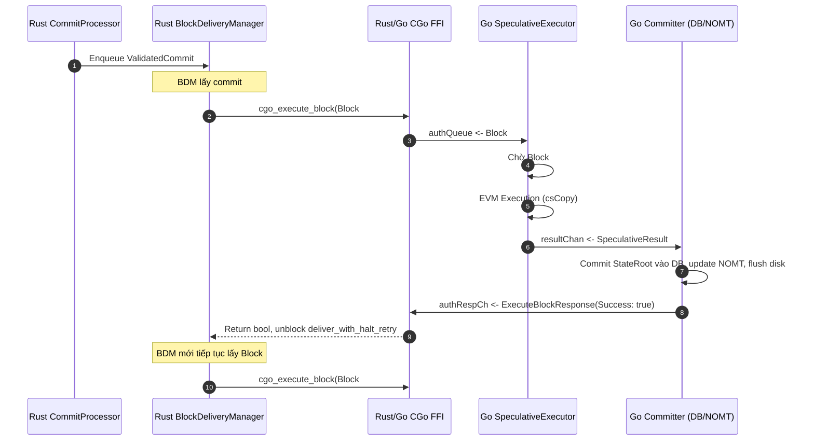

# Thiết kế Kỹ thuật: Giao Commit Pipelined giữa Rust Consensus Core và Go Execution Engine

> **Trạng thái:** DỰ THẢO THIẾT KẾ (Dành cho Review — TUYỆT ĐỐI CHƯA VIẾT CODE CHO ĐẾN KHI ĐƯỢC DUYỆT)  
> **Tài liệu tham chiếu:** [plan_perf_followups.md](file:///home/abc/chain-n/metanode/note/plan_perf_followups.md) (Bước 4), [AGENTS.md](file:///home/abc/chain-n/metanode/AGENTS.md) (Part 2.5 Zero-Fork Invariant), [DAG_ARCHITECTURE_VN.md](file:///home/abc/chain-n/metanode/consensus/metanode/docs/DAG_ARCHITECTURE_VN.md).  
> **Tác giả:** Metanode Core Developer Agent  
> **Ngày:** 2026-10-07  

---

## 1. Bối cảnh & Vấn đề Kỹ thuật (Problem Statement)

### 1.1. Hiện trạng: Cơ chế Giao Commit Tuần tự (Stop-and-Wait)

Hiện nay, luồng giao block từ Rust Consensus Core sang Go Execution Engine hoạt động theo mô hình **Stop-and-Wait RPC** đồng bộ:



### 1.2. Điểm nghẽn Hiệu năng (Latency & Resource Waste)
1. **Rust giao commit bị chặn:** Trong `consensus/metanode/src/node/block_delivery.rs`, `BlockDeliveryManager` chạy vòng lặp tuần tự:
   ```rust
   while let Some(msg) = self.receiver.recv().await {
       let geis_consumed = self.deliver_with_halt_retry(&msg).await;
       msg.response_tx.send(geis_consumed);
   }
   ```
   Mỗi lời gọi `deliver_with_halt_retry` phải chờ đến khi Go thực thi xong toàn bộ EVM + tính StateRoot + ghi DB (mất khoảng 15ms đến 80ms trên các batch lớn).
2. **Go Executor bị đói dữ liệu (Pipeline Starvation):**
   - Khi Go đang bận ghi đĩa block $N$, Go hoàn toàn không nhận được block $N+1$ từ Rust để làm trước các tác vụ tốn CPU nhưng an toàn (như: protobuf unmarshal, kiểm tra chữ ký Secp256k1/BLS, dựng transaction context, pre-warm cache).
   - Khi block $N$ vừa commit xong, Go lại phải chờ FFI CGo của Rust đóng gói, encode protobuf, và gọi sang thì Go mới bắt đầu unmarshal và verify block $N+1$.
3. **Tổng thời gian xử lý là phép cộng tuần tự:**
   $$\text{Latency per Block} = T_{\text{Rust Packaging}} + T_{\text{FFI}} + T_{\text{Go Unmarshal \& Verify}} + T_{\text{Go EVM}} + T_{\text{Go DB Commit}}$$

---

## 2. Rủi ro Cốt lõi & Nguyên tắc Bất biến (Zero-Fork Guardrails)

> 🚨 **CẢNH BÁO TỐI THƯỢNG:** Việc cho phép 2 hoặc nhiều commit in-flight giữa Rust và Go là khu vực có **RỦI RO FORK CAO NHẤT** trong toàn bộ hệ thống blockchain.

### 2.1. Bản chất Tuần tự của State Machine Replication
Trạng thái blockchain tuân theo phương trình trạng thái chuyển tiếp xác định:
$$S_N = f(S_{N-1}, \text{Block}_N)$$
Trong đó:
- $S_{N-1}$ là StateRoot sau khi thực thi và commit block $N-1$.
- $\text{Block}_N$ là tập hợp giao dịch đã đồng thuận tại vị trí $N$.
- Không thể xác định chính xác StateRoot $S_N$ nếu $S_{N-1}$ chưa hoàn tất.

### 2.2. Bốn Nguy cơ Gây Fork Khi Mở Pipeline
| Nguy cơ | Kịch bản chi tiết | Hậu quả nếu không có thiết kế chặn |
| :--- | :--- | :--- |
| **F1: Quorum Divergence / Conflict** | Commit $N$ được gửi sang Go. Trong khi Go đang chạy speculative block $N+1$, `CommitVoteMonitor` phát hiện $2f+1$ peers vote cho một digest khác (`PeerAttestResult::Conflict`). Local commit $N$ bị hủy để lấy `CertifiedCommit`. | Nếu block $N$ hoặc $N+1$ đã lỡ làm bẩn NOMT/DB hoặc in-memory state của Go, Go sẽ bị rẽ nhánh vĩnh viễn (Permanent Fork). |
| **F2: Cascading Poisoning** | Block $N$ gặp lỗi thực thi (ví dụ: payload missing không khôi phục được hoặc lỗi định dạng FFI). | Block $N+1$ dựa trên state rác của block $N$, dẫn đến crash hoặc state corruption hàng loạt. |
| **F3: Ghost Block / GEI Sequence Gap** | Rust pipeline gửi block $N+1$ nhưng block $N$ bị retry hoặc trượt khỏi FFI buffer. | Go nhận out-of-order block, sinh ra khoảng trống GEI (GEI gap), làm gãy chuỗi Block Number. |
| **F4: Futex Starvation & Thread Pool Exhaustion** | Bật nhiều worker đồng thời gọi FFI qua CGo khiến Tokio worker pool hoặc CGo thread pool bị cạn kiệt (tương tự bài học `RawRwLock::wait_for_readers` tại `GLOBAL_TX_CACHE`). | Toàn bộ node bị freeze (liveness failure). |

### 2.3. Các Điều CẤM Tuyệt đối (Strict Invariants)
1. **CẤM TIMEOUT:** Tuyệt đối không dùng `sleep`, `timeout`, hay `Duration` để quyết định chuyển trạng thái commit từ PENDING sang COMMITTED.
2. **CẤM DIRTY WRITE VÀO DB:** Không một block in-flight nào được phép ghi bất kỳ byte nào vào RocksDB / NOMT storage chính thức trước khi commit đó được $2f+1$ peers xác nhận (`PeerAttestResult::Ok`).
3. **THÀ PENDING CHỨ KHÔNG FORK:** Nếu có nghi ngờ hoặc chưa đủ bằng chứng quorum, pipeline phải giữ trạng thái chờ (hold/pending), không được suy đoán liều lĩnh.

---

## 3. Kiến trúc Đề xuất: Phân tầng Pipeline (Two-Tier Pipeline Model)

Để tối ưu hiệu năng mà **100% không vi phạm Zero-Fork Invariant**, thiết kế đề xuất phân tách rõ ràng 2 tầng:

```
┌─────────────────────────────────────────────────────────────────────────────────────────────────┐
│ TẦNG 1: INGESTION & PREPARATION PIPELINE (In-Flight Bounded = 4 Commits)                         │
│ - Trao đổi song song Rust -> Go                                                                 │
│ - Protobuf Unmarshal, Batch Signature Verification (Secp256k1 Cache), Tx Pre-grouping          │
│ - Chuẩn bị sẵn ExecutableContext trong RAM                                                     │
│ - KHÔNG ĐỤNG VÀO STATE TRIE / DB                                                                │
└────────────────────────────────────────────────┬────────────────────────────────────────────────┘
                                                 │
                                                 ▼
┌─────────────────────────────────────────────────────────────────────────────────────────────────┐
│ TẦNG 2: AUTHORITATIVE STATE TRANSITION & COMMIT (Strictly Sequential = 1 Commit at a time)     │
│ - Chỉ kích hoạt khi thỏa mãn CẢ HAI ĐIỀU KIỆN:                                                  │
│     1. Predecessor GEI-1 đã commit xong 100% vào DB (S_{N-1} sẵn sàng)                         │
│     2. CommitVoteMonitor trả về PeerAttestResult::Ok (2f+1 peers đồng thuận digest)             │
│ - EVM Execution -> Tính StateRoot -> Write Changelog -> Commit DB/NOMT                          │
└─────────────────────────────────────────────────────────────────────────────────────────────────┘
```

### 3.1. Tầng 1: Pipelined Ingestion & Pre-Validation (Không Rủi ro Fork)
- **Cơ chế:**
  - Rust `BlockDeliveryManager` duy trì cửa sổ trượt (sliding window) kích thước $K$ (mặc định $K = 2$, tối đa $K = 4$).
  - Cho phép Rust gửi tối đa $K$ block sang Go mà không cần chờ `ExecuteBlockResponse` hoàn thành toàn bộ vòng đời commit.
  - Rust gọi một hàm FFI mới: `cgo_enqueue_block_pipelined(payload, len, callback_handle)`.
- **Nhiệm vụ của Go trong Tầng 1:**
  1. `UnmarshalVT` ExecutableBlock.
  2. Kiểm tra tính toàn vẹn chữ ký (`FilterInvalidSignatures` + tận dụng `boundSigKey` cache vừa tối ưu ở Bước 2).
  3. Pre-group transactions theo sender address để chuẩn bị nhóm chạy EVM.
  4. Lưu trữ vào hàng đợi chuẩn bị `PreparedBlockQueue` có giới hạn buffer nghiêm ngặt ($K=4$).
- **Đánh giá rủi ro:** **0% Rủi ro Fork.** Vì Tầng 1 là các phép toán thuần túy (pure computational logic), không thay đổi state của blockchain, không chạm vào database. Nếu Rust yêu cầu hủy block, Go chỉ việc giải phóng struct trong RAM.

### 3.2. Tầng 2: Authoritative State Transition & Quorum Gate
- **Điều kiện kích hoạt thực thi EVM và commit:**
  Khối $N$ trong `PreparedBlockQueue` chỉ được chuyển sang bộ thực thi EVM khi và chỉ khi:
  ```go
  // ZERO-FORK AUTHORITATIVE GATE:
  // 1. Block N-1 đã commit hoàn tất vào Storage
  // 2. Commit N đã đạt Quorum Consensus (PeerAttestResult::Ok)
  if !se.isCommitted(gei - 1) {
      se.waitCommitted(ctx, gei - 1)
  }
  if !se.hasQuorumAttestation(commitIndex, commitDigest) {
      se.waitQuorumAttestation(ctx, commitIndex, commitDigest)
  }
  ```
- **Cơ chế Copy-on-Write (CoW) State Stacking (Nâng cao):**
  - Để tận dụng thời gian Go ghi đĩa (fsync RocksDB/NOMT) của block $N$, block $N+1$ có thể thực thi EVM trên bản copy in-memory `csCopy = cs.CloneSpeculative()`.
  - Kết quả StateRoot của block $N+1$ được tính toán trên RAM.
  - Tuy nhiên, kết quả này **chỉ được phép ghi xuống đĩa** khi block $N$ đã hoàn tất fsync thành công.

---

## 4. Tương tác Chi tiết với `CommitVoteMonitor` & `PeerAttestResult`

Trong hệ thống đồng thuận Metanode Core, `CommitVoteMonitor` là nguồn dữ liệu duy nhất để xác thực digest của commit giữa các peers.

### 4.1. Bảng Quyết định Điều phối Pipeline

| Trạng thái từ `CommitVoteMonitor` | Trạng thái Block trong Go | Hành động của Pipeline Rust $\to$ Go |
| :--- | :--- | :--- |
| `PeerAttestResult::Ok` (2f+1 peers khớp digest) | Đã chuẩn bị trong `PreparedBlockQueue` | **DISPATCH AUTHORITATIVE:** Chuyển sang State Transition, thực thi EVM, tính StateRoot và commit DB. Gửi phản hồi thành công về Rust. |
| `PeerAttestResult::Insufficient` (Chưa đủ 2f+1 votes) | Giữ tại `PreparedBlockQueue` | **HOLD / PENDING:** Giữ nguyên trong RAM, KHÔNG thực thi EVM, KHÔNG commit DB. Pipeline Rust tạm thời dừng gửi block $N+K+1$ để tránh tràn buffer. **Thà chờ chứ không fork.** |
| `PeerAttestResult::Conflict` (2f+1 peers digest khác) | Bất kỳ trạng thái nào | **EMERGENCY PURGE & ROLLBACK:** Báo động đỏ! Hủy bỏ commit $N$ và toàn bộ các commit sau nó ($N+1, \dots$). Xóa sạch state trong RAM, rollback Go state về block $N-1$. Chờ `CertifiedCommit` từ `CommitSyncer`. |
| TRUE Cold-Start (Chưa ai có digest data) | Khối đầu tiên epoch mới | **DETERMINISTIC COLD DISPATCH:** Vì tất cả các node đều có DAG giống hệt nhau khi khởi động, cho phép dispatch an toàn. |

### 4.2. Quy trình Xử lý Rollback Khi Có Xung đột (Cascading Invalidation)

```mermaid
flowchart TD
    A[CommitVoteMonitor phát hiện Conflict tại Block #N] --> B[Rust phát tín hiệu FFI: cgo_purge_pipeline_from(GEI_N)]
    B --> C[Go SpeculativeExecutor hủy Context của Block #N, #N+1, #N+2]
    C --> D[Go gọi AbortClonedState trên tất cả in-flight sessions]
    D --> E[NOMT Trie Session được Abort, activeCount trở về 0]
    E --> F[Giải phóng bộ nhớ PreparedBlockQueue]
    F --> G[Xác nhận Go StateRoot vẫn ở nguyên vị trí Block #N-1]
    G --> H[Rust CommitSyncer kéo CertifiedCommit chuẩn từ Peers]
```

1. **Rust FFI Call:** Khi `commit_processor` phát hiện conflict, Rust gọi ngay `cgo_purge_pipeline_from(from_gei u64)`.
2. **Hủy worker contexts:** Go gọi `cancel()` trên tất cả các `inFlightSession` có $\text{GEI} \ge \text{from\_gei}$.
3. **Hủy State bản sao:** Gọi `res.AbortClonedState()` $\to$ gọi `csCopy.AbortSpeculative()` để hủy mọi tham chiếu trong bộ nhớ NOMT, đảm bảo không có rò rỉ session trie.
4. **Bảo toàn Database:** Vì Tầng 2 chưa bao giờ gọi `CommitBlockState` cho block $N$, RocksDB và BlockDatabase trên đĩa vẫn giữ nguyên 100% tính toàn vẹn của block $N-1$.

---

## 5. Giới hạn Buffer (Bounded Concurrency) & Kiểm soát Áp lực ngược (Backpressure)

Hệ thống phải tuyệt đối tránh hiện tượng nổ bộ nhớ (OOM) hoặc deadlock do các kênh channel không có giới hạn.

### 5.1. Bounded Buffer Parameters
```rust
/// Số lượng commit tối đa được phép in-flight giữa Rust và Go cùng một thời điểm
pub const MAX_IN_FLIGHT_COMMITS: usize = 2; // Khởi đầu thận trọng với 2, tối đa 4 khi ổn định

/// Giới hạn dung lượng hàng đợi AuthoritativeQueue trong Go
pub const AUTH_QUEUE_CAPACITY: usize = 16;

/// Giới hạn số lượng giao dịch tối đa in-flight
pub const MAX_IN_FLIGHT_TXS: usize = 8192;
```

### 5.2. Chuỗi Tín hiệu Backpressure (Tự nhiên & Không Deadlock)
1. Nếu Go bị nghẽn (ví dụ: ổ đĩa bận, fsync chậm):
   - Hàng đợi `PreparedBlockQueue` trong Go đạt ngưỡng $K$ (ví dụ: 2 blocks).
   - Go từ chối nhận thêm bằng cách trả về `PipelineStatus::Busy` qua FFI.
2. Rust `BlockDeliveryManager` nhận tín hiệu `Busy`:
   - Dừng gọi FFI tiếp theo, chờ oneshot channel của block đang in-flight phản hồi.
3. Kênh `delivery_sender` (giới hạn 100 commits) giữa `CommitProcessor` và `BlockDeliveryManager` bắt đầu đầy dần:
   - Khi đạt 100 commits, `sender.send(validated).await` trong `executor.rs` sẽ tự động tạm dừng (pause) `CommitProcessor`.
4. `CommitProcessor` tạm dừng $\to$ Consensus Engine giảm tốc độ propose block mới.
5. **Kết quả:** Hệ thống đạt trạng thái cân bằng tự nhiên từ tầng lưu trữ (Go) ngược lên tầng đồng thuận (Rust) mà không cần dùng bất kỳ vòng lặp `sleep` hay heuristic timeout nào!

---

## 6. Phòng chống Deadlock & Bài học từ Codebase

Thiết kế này kết hợp các bài học xương máu đã được kiểm chứng trên cụm testnet/mainnet:

1. **Bài học `GLOBAL_TX_CACHE` & Futex Starvation (`parking_lot`):**
   - Không bao giờ giữ lock qua điểm `.await` trong Rust.
   - Không dùng CGo blocking trực tiếp trên thread pool chính của Tokio. Mọi FFI call sang Go bắt buộc phải bọc trong `tokio::task::spawn_blocking` để không làm cạn kiệt worker của Tokio runtime.
2. **Bài học MVM Concurrent Map Writes:**
   - Trong Go, các session in-flight không được phép chia sẻ chung con trỏ VM runtime context. Mỗi block speculative phải có state clone độc lập hoặc chỉ thực hiện tuần tự sau khi block trước giải phóng handle.
3. **Bài học Ghost Block (Nhảy cóc Block Number):**
   - Rust là cơ quan duy nhất gán `block_number` và `global_exec_index` tăng đơn điệu liên tục.
   - Kể cả block rỗng (empty commit không có tx), Rust vẫn phải đóng gói `ExecutableBlock` rỗng và gửi qua pipeline để Go xác nhận, tránh việc Go tự ước lượng block number dẫn đến sequence gaps.

---

## 7. Bằng chứng Toán học: Tính Xác định & Zero-Fork (Correctness Invariants)

Hệ thống được chứng minh là an toàn tuyệt đối (Safety) và luôn tiến triển (Liveness) dựa trên 3 định lý:

### Định lý 1 (An toàn Trạng thái - State Safety)
*Mọi trạng thái $S_K$ được ghi bền vững vào cơ sở dữ liệu đều là kết quả của một chuỗi chuyển tiếp duy nhất, xác định từ trạng thái khởi nguyên $S_0$:*
$$S_K = f(f(\dots f(S_0, B_1), \dots), B_K)$$
*Chứng minh:* Vì Tầng 2 chỉ commit $B_K$ khi và chỉ khi:
1. $S_{K-1}$ đã ghi bền vững vào DB.
2. Digest của $B_K$ đã đạt quorum $2f+1$ xác nhận từ peers.
3. Do đó, không tồn tại bất kỳ phân nhánh trạng thái nào có thể được commit vào DB. $\blacksquare$

### Định lý 2 (Không Bế tắc Vĩnh viễn - Liveness)
*Miễn là có ít nhất $2f+1$ validators hoạt động bình thường, pipeline sẽ không bao giờ bị deadlock vĩnh viễn.*  
*Chứng minh:*
- Các block in-flight luôn có channel phản hồi có giới hạn (bounded oneshot).
- Nếu commit đạt quorum $\to$ `CommitVoteMonitor` kích hoạt dispatch $\to$ tiến trình tiếp tục.
- Nếu commit bị conflict $\to$ `cgo_purge_pipeline` dọn sạch in-flight trong $\mathcal{O}(1)$ $\to$ Go đón nhận `CertifiedCommit` từ `CommitSyncer` $\to$ tiến trình tiếp tục.
- Backpressure hoạt động hoàn toàn dựa trên async channel notifications của Tokio/Go, không có vòng lặp phụ thuộc vòng tròn (circular lock dependency). $\blacksquare$

---

## 8. Lộ trình Triển khai Đề xuất (Phased Implementation Roadmap)

> **Lưu ý:** Chỉ bắt đầu Bước 4.1 sau khi Người dùng (User/Operator) duyệt toàn bộ tài liệu thiết kế này.

| Giai đoạn | Nội dung công việc | Tiêu chí nghiệm thu (Acceptance Criteria) |
| :--- | :--- | :--- |
| **Giai đoạn 1: FFI Async Non-blocking Protocol** | Thêm API FFI non-blocking và channel response riêng biệt, tách biệt `cgo_execute_block` đồng bộ hiện tại. | `build_check.sh` xanh, Go & Rust biên dịch sạch sẽ. |
| **Giai đoạn 2: Tách Tầng 1 (Preparation Pipeline)** | Triển khai `PreparedBlockQueue` trong Go. Go unmarshal và verify chữ ký song song trước khi block trước commit xong. Tầng 2 vẫn serialize EVM. | Benchmark TPS tăng, CPU đa lõi của Go được tận dụng cho verify chữ ký, 0% thay đổi logic commit. |
| **Giai đoạn 3: Tích hợp Quorum-Aware Pipeline** | Kết nối trực tiếp `CommitVoteMonitor` với Tầng 2. Thử nghiệm kịch bản inject Conflict/Drop trên cụm 4 node local. | Node tự động purge pipeline khi có conflict, rollback sạch sẽ về $N-1$, 0 trường hợp fork. |
| **Giai đoạn 4: CoW EVM Stacking (Tùy chọn)** | Cho phép EVM chạy trước trên in-memory state nếu Giai đoạn 2 chưa đạt mức TPS mong muốn. | Kiểm thử tải cao với `tps_blast`, đo đạc số liệu thực tế so với baseline. |

---

## 9. Kết luận & Đề xuất gửi Người dùng

1. **Khuyến nghị chiến lược:** Bắt đầu triển khai **Tầng 1 (Preparation Pipeline)** trước. Tầng 1 giải quyết được phần lớn thời gian chờ CPU (unmarshal protobuf, verify chữ ký EIP-1559, dựng context) mà **hoàn toàn không đụng vào state transition**, rủi ro fork bằng 0.
2. **Yêu cầu phê duyệt:** Kính mời người dùng xem xét thiết kế trên. Nếu đồng ý với kiến trúc và lộ trình 4 giai đoạn, vui lòng phê duyệt để bắt đầu triển khai Giai đoạn 1.
