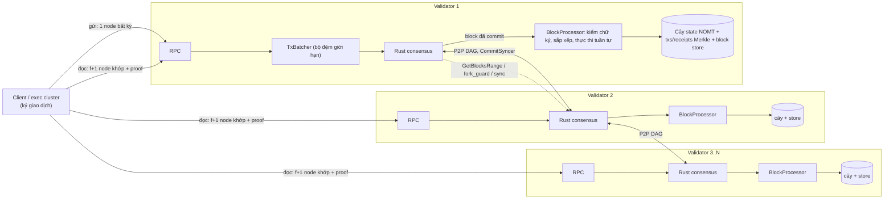

# Kế hoạch: Parent Chain là một chain đầy đủ, nhiều validator, dữ liệu dạng cây Merkle

> Phiên bản 2, 2026-09-30. Dành cho agent/dev nhận việc. Tài liệu tự đủ: đọc mục 0–4 trước khi viết dòng code nào.
> Trạng thái: **chưa triển khai**. Có một prototype một phần trên nhánh `wip/parent-chain-multinode-stage1` (commit `a6564afd`; xem mục 8, WP1 để biết phần nào còn dùng). Nhánh đó tách từ `dev` tại `f5e14338` nên chứa cả 2 commit EIP-7702 chưa push: chỉ `git cherry-pick a6564afd`, đừng merge cả nhánh.

---

## 0. QUYẾT ĐỊNH ĐÃ CHỐT (không hỏi lại, chỉ làm)

Chủ dự án đã chốt (2026-09-30):

| # | Quyết định | Nội dung |
|---|---|---|
| **Đ1** | **Chain nhiều validator, đầy đủ** | Parent Chain là một blockchain thật: **n ≥ 4 validator độc lập** (chịu được f = ⌊(n−1)/3⌋ node lỗi, xem `note/bft_fault_tolerance_node_count.md`), có block, header, giao dịch, biên lai, đồng bộ, fork detection, RPC đầy đủ. Không còn là dịch vụ đơn node. |
| **Đ2** | **Mọi lệnh gọi lên chain là GIAO DỊCH** | Mọi thay đổi trạng thái chỉ xảy ra bằng một giao dịch **đã ký**, được **Rust consensus sắp xếp thống nhất**, rồi **mọi node thực thi tất định**. Không có endpoint nào ghi thẳng vào state. HTTP/RPC chỉ (a) nhận giao dịch đã ký để đưa vào đồng thuận, (b) đọc. |
| **Đ3** | **Dữ liệu là cây Merkle** | State là **cây Merkle thưa (NOMT, `pkg/trie`)**; `txs_root` và `receipts_root` là **cây Merkle nhị phân thật** (có proof thành viên). Header chứa các root này, nên có proof cho mọi dữ liệu. Không dùng hash-chain của write-set (prototype cũ) làm state root. |
| **Đ4** | **Chain đầy đủ** | Có: header (number, parent_hash, state_root, txs_root, receipts_root, timestamp, epoch, commit_index, GEI, leader, commit_digest, tx_count), block store, tx/receipt store + index theo hash, RPC `getBlock/getTransaction/getReceipt/getProof/getStatus/getValidators`, đồng bộ block giữa các node. |

Các quyết định kèm theo (agent triển khai theo đây; nếu Discovery ở mục 4 phá một điều nào, **dừng và báo**):

| # | Quyết định | Lý do ngắn |
|---|---|---|
| Đ5 | **Phong bì giao dịch = `pb.Transaction` chuẩn của Metanode**, cùng hàm băm/ký/kiểm chữ ký với chain chính (ECDSA `R,S,V` hoặc BLS). `ToAddress` = một **địa chỉ hệ thống mới** của Parent Chain (kiểm không trùng `pkg/common/constant.go`; hiện có `PARENT_CHAIN_GATEWAY_CONTRACT_ADDRESS = 0x…1003`), `Data` = `CallData` mã hóa phương thức + tham số. `Nonce` tuần tự theo người gửi, `ChainID` riêng. | Tái dùng công cụ đã có, không phát minh định dạng mới |
| Đ6 | **Chữ ký được kiểm trong bước thực thi tất định** (không chỉ ở cổng HTTP). Tx sai chữ ký/nonce/chainID bị loại giống hệt nhau trên mọi node. | Đóng lỗ hổng G8: hiện `DepositToFloat` không có chữ ký nào ở bước thực thi |
| Đ7 | **`ChainID` của Parent Chain khác** Root Anchor (991) và các cụm exec (101–104) để tách miền chữ ký. Đề xuất `990`; agent grep xác nhận không trùng rồi cập nhật tài liệu (ansible đang ghi "Parent Chain ChainID 991"). | Chống replay chéo chain |
| Đ8 | **Thực thi tuần tự** (không Block-STM). Thứ tự trong block: loại trùng theo `tx_hash` (giữ bản đầu), rồi sắp theo `(FromAddress, Nonce, TxHash)` tăng dần. | Parent Chain là control plane, cần đúng và tất định hơn là nhanh; thứ tự này giữ nonce tuần tự. Xác nhận ở D13 |
| Đ9 | **Không dùng JSON cho giá trị trong cây state.** Dùng mã hóa nhị phân chuẩn tắc (protobuf `Deterministic: true` hoặc RLP) với test vector. | JSON không phải chuẩn tắc, dễ lệch giữa phiên bản |
| Đ10 | **Đồng thuận cuối cùng (finality) = commit của Rust BFT**, không có reorg. Client v1 xác minh bằng **đọc quorum f+1 header khớp + Merkle proof**; v2 (backlog) thêm **chữ ký tổng hợp BLS của validator trên header** để tin được một nguồn duy nhất. | v1 đủ an toàn và đơn giản; v2 làm sau |
| Đ11 | **Chống spam v1:** không có token gas. Người gửi phải là tài khoản/cluster đã đăng ký (cluster do chứng nhận, người dùng do `RegisterAccount`), có `nonce` và giới hạn tốc độ ở ingress. Phí = việc sau. | Đủ cho control plane có người vận hành |
| Đ12 | **Chain mới dựng từ genesis, không di chuyển dữ liệu cũ** (chủ dự án chốt 2026-10-01: đang dev). Wipe và redeploy đồng loạt parent + exec. | Tránh trộn hai mô hình dữ liệu, không tốn công migrate |
| Đ13 | **Mô hình tin cậy:** các validator do **các operator độc lập** vận hành; nếu một bên điều khiển ≥ 2/3 stake thì BFT không thêm bảo đảm tin cậy (chỉ thêm khả dụng). Ghi rõ trong tài liệu vận hành. | Trung thực về giới hạn |
| Đ14 | **Committee cố định trong giai đoạn đầu** (file genesis chung). Đổi committee = quy trình vận hành có chủ đích, chưa hỗ trợ tự động. | Giảm rủi ro chuyển epoch |

---

## 1. Luật bắt buộc (`AGENTS.md`, không có ngoại lệ)

1. **Zero-fork:** thà pending còn hơn fork. Không dùng `sleep`/timeout/`Duration` để quyết định dispatch hay thoát deadlock; thoát bằng dữ liệu từ peer (đồng bộ block, so hash), không bằng thời gian.
2. Mọi queue/worker mới có giới hạn bộ đệm. Không I/O chặn trong vòng lặp async.
3. Không sửa kiểu/interface dùng chung nếu chưa phân tích blast radius (`grep`/codegraph).
4. Sau mỗi thay đổi code: chạy `consensus/metanode/scripts/build_check.sh` (Go + Rust + FFI) sạch, không warning.
5. Cập nhật `PROJECT_STRUCTURE.md` khi thêm module/file quan trọng. Tóm tắt cuối mỗi phản hồi bằng tiếng Việt theo mẫu `AGENTS.md`.
6. **Máy này có parent chain đang chạy thật** (`/opt/metanode/parent_chain`, HTTP `:8547`; mạng `:9000`, peer RPC `:19300`, metrics `:9110` theo mặc định của template; log `/var/log/metanode/parent_chain.log`, ~59.000 block, cụm exec đang phụ thuộc vào nó). **Không dừng, không ghi đè, không dùng lại các cổng đó.** Mọi thử nghiệm dùng thư mục dữ liệu và dải cổng riêng (gợi ý: HTTP `18601–18604`, mạng `19001–19004`, peer RPC `19501–19504`, metrics `19601–19604`).
7. Commit bằng tên file (`git add <file>`), không `git add <thư mục>` (worktree dùng chung). Không push `dev` nếu chưa được chủ dự án đồng ý.
8. Bài học đã trả giá (đọc trước khi đụng NOMT/commit): `execution/pkg/blockchain/block_state_commit.go` mục 8a/8b (**ghi block DB bền TRƯỚC khi commit NOMT**, để NOMT không bao giờ vượt tip bền); `execution/pkg/rollup/N1_DURABILITY_REPORT.md`; đừng gọi `Checkpoint()` NOMT trên đường nóng (gây đứng hệ thống); đừng dùng khóa `parking_lot` lồng nhau trong consensus-core.

---

## 2. Hiện trạng (đã xác minh bằng đọc code, 2026-09-30)

### 2.1. Luồng hiện tại (đi qua đồng thuận nhưng chỉ với 1 node, dữ liệu không phải cây)

```
Client/exec ──HTTP JSON (không ký)──> pkg/parentchain/http_rpc.go (handleTx)
   └─> chan ─> cmd/parent_chain/processor/tx_batcher.go (gom 100ms, tối đa 2000 tx)
        └─> executor.SubmitTransactionBatch ──FFI──> Rust consensus
             └─> block đã commit ──FFI──> executor.GetAuthoritativeBlockQueue()
                  └─> processor/block_processor.go processBlock
                       └─> pkg/parentchain/state.go ──> DBStore (LevelDB, khóa/giá trị JSON rời rạc)
```

### 2.2. Các thiếu sót (mã G1–G11)

| Mã | Thiếu sót | Bằng chứng |
|---|---|---|
| **G1** | Committee **hard-code 1 validator**, khóa nhúng trong source | `cmd/parent_chain/app.go:59-103` |
| **G2** | Rust config và triển khai chỉ 1 node (`node_id=0`, `peer_rpc_addresses=[]`, inventory 1 host) | `deploy/ansible_clusters/roles/parent_chain/templates/node_parent.toml.j2` |
| **G3** | `SyncBlocks` no-op, `GetBlocksRange` trả rỗng | `app.go:105-127` |
| **G4** | Không có state root/hash block; `GetStateRoot()` trả toàn 0; `cgo_get_state_root` trả `nil` | `processor/block_processor.go`, `executor/ffi_bridge.go:430` |
| **G5** | Không lưu tiến độ (`last block`, `GEI`) | `block_processor.go` (cuối `processBlock`) |
| **G6** | Thực thi **không nguyên tử/không idempotent**: `DepositToFloat` ghi số dư trước rồi mới ghi `TransferRecord` (chống trùng). Crash giữa chừng rồi replay ⇒ cộng tiền hai lần | `pkg/parentchain/state.go:114-170` |
| **G7** | `time.Now()` khi `CommitTimestampMs == 0` | `block_processor.go:processBlock` |
| **G8** | **Không giao dịch nào là giao dịch thật:** payload JSON không ký; `DepositToFloat` không có chữ ký nào được kiểm lúc thực thi (chỉ token HTTP ở cổng) ⇒ với nhiều node, một validator hoặc bất kỳ ai gửi được tới consensus mint float tùy ý | `block_processor.go`, `http_rpc.go handleTx` |
| **G9** | Client đọc **một endpoint** và tin hoàn toàn | `pkg/parentchain/http_rpc.go`, `pkg/rollup/*` |
| **G10** | **Dữ liệu không phải cây**: KV JSON rời rạc, không có state root Merkle, không proof | `pkg/parentchain/db_store.go` |
| **G11** | **Không phải chain đầy đủ**: không lưu header/tx/receipt, không index, không RPC block/tx/receipt/proof | toàn bộ `cmd/parent_chain`, `pkg/parentchain` |

Đã ổn (đừng làm lại): `state.go` không dùng `time.Now`/`rand`/duyệt map; `blockTime` truyền từ ngoài; HTTP chỉ xếp hàng vào consensus (không ghi thẳng store).

### 2.3. Rust đã có sẵn cơ chế multi-node, Go chỉ cần phục vụ đúng

- `consensus/metanode/src/node/peer_go_client.rs` + `PeerRpcServer` (`peer_rpc_port`): Rust lấy block từ Go của peer.
- `.../setup_consensus/fork_guard.rs`: so `(block_hash, state_root)` của block cục bộ (lấy từ Go qua `GetBlocksRange`) với đa số peer. `startup_sync.rs`, `health_check.rs` cũng dùng `GetBlocksRange` và `get_go_state_root()`.
- Mẫu nhiều node của chain chính: `consensus/metanode/config/node_{0..4}.toml`, `committee.json`, `DISTRIBUTED_DEPLOYMENT.md`.
- Công cụ cây: `execution/pkg/trie/state_trie.go` (`StateTrie`: `Get/Update/BatchUpdate/Hash/Commit`, NOMT có `GenerateProof`); **đã có `nomt_ffi.VerifyProof` (kiểm) lẫn `GenerateProof` (sinh).
- Công cụ giao dịch: `execution/pkg/proto/transaction.proto` (`pb.Transaction`), `pkg/transaction`, `pkg/bls`, và mẫu kiểm chữ ký ở thực thi `pkg/blockchain/tx_processor/signature_enforcement.go` (`checkTxSignature`, `FilterInvalidSignatures`).

---

## 3. Kiến trúc đích



Nguyên tắc: **consensus sắp xếp giao dịch; mọi node chạy cùng một hàm tất định trên cùng chuỗi giao dịch ⇒ cùng `state_root`, `txs_root`, `receipts_root` ⇒ cùng `block_hash`; node tụt lại lấy block từ peer, tự thực thi và tự kiểm root; client kiểm bằng proof so với header.**

---

## 4. Việc phải làm trước khi viết code (Discovery)

Trả lời bằng văn bản vào `note/`, mỗi câu dẫn `file:dòng`. Nếu câu trả lời phá một quyết định ở mục 0, **dừng và báo chủ dự án**.

| # | Câu hỏi | Tìm ở đâu |
|---|---|---|
| D1 | Khi Go trả `ExecuteBlockResponse{Success:false}`, Rust làm gì (retry/halt/bỏ qua)? Giới hạn số lần thử? | `consensus/metanode/src/node/block_delivery.rs` (`deliver_with_halt_retry`) |
| D2 | `GetBlocksRange` được gọi khi nào, khoảng nào; Rust đọc những trường nào của `BlockData` (`block_hash`, `state_root`, `parent_hash`, `raw_block_bytes`)? | `fork_guard.rs`, `startup_sync.rs`, `peer_go_client.rs`, `rpc_queries.rs` |
| D3 | Lúc khởi động Rust hỏi Go gì (last block, last GEI, epoch)? Sau restart Rust replay từ đâu? Go phải đặt lại `storage.UpdateLastBlockNumber/UpdateLastGlobalExecIndex` thế nào? | `executor/unix_socket_handler_epoch*.go`, `recovery.rs`, `pkg/storage/block_number_state.go` |
| D4 | Ngữ nghĩa `SyncBlocks` (`execute_mode`, `preserve_own_commit_index`); ai gọi nó cho node tụt lại? | `executor/unix_socket_handler.go HandleSyncBlocksRequest`, `startup_sync.rs` |
| D5 | Cách chain chính dựng `EpochBoundaryData` và `GetValidatorsAtBlock` (nguồn committee, thứ tự, stake) | `executor/unix_socket_handler_epoch.go`, `unix_socket_handler_validators.go` |
| D6 | Đánh số block: bắt đầu từ 1? Có block `block_number = 0`? Với `is_authoritative_gei=false`, `GlobalExecIndex` có luôn bằng `block_number` (log: `block 58774 (GEI 58774)`)? | proto `ExecutableBlock`, log parent chain |
| D7 | Chuyển epoch của parent chain (`EpochDurationSeconds=86400` đang hard-code); có hỗ trợ đổi committee giữa chừng không? (theo Đ14: không, chỉ cần biết hành vi khi epoch kết thúc) | `app.go`, Rust epoch monitor |
| D8 | Rust dựng `PeerRpcServer` từ `peer_rpc_addresses` thế nào và gọi Go local ra sao? | `consensus/metanode/src/node/` (grep `PeerRpcServer`) |
| D9 | Dùng `pkg/trie` (NOMT) từ Go cho một **namespace không phải account**: `trie_factory.go` chọn namespace thế nào; cách sinh proof (`GenerateProof`); cách **kiểm proof** (`nomt_ffi.VerifyProof` đã có, xác nhận dùng đúng KeyPath băm); chi phí commit; giới hạn key. | `pkg/trie/trie_factory.go`, `pkg/trie/nomt_state_trie.go`, `pkg/nomt_ffi/bridge.go`, `crates/nomt_db` |
| D10 | Rào chắn độ bền: mẫu `CommitBlockState` (block DB bền trước NOMT), cách khôi phục khi NOMT lệch tip. Parent Chain dùng lại đúng mẫu đó. | `pkg/blockchain/block_state_commit.go`, `execution/pkg/rollup/N1_DURABILITY_REPORT.md` |
| D11 | Danh tính người gửi: địa chỉ ↔ khóa BLS/ECDSA (`bls.GetAddressFromPublicKey`), đăng ký khóa (cluster do `ChainRegistry`/chứng nhận, validator/người dùng thế nào), và cách bootstrap tài khoản đầu tiên từ genesis. | `pkg/parentchain/state.go` (`RegisterAccount`, `ensureChainRegistry`), `pkg/bls` |
| D12 | Miền chữ ký: `TransactionHashData` có gồm `ChainID` không? xác nhận `ChainID=990` (hoặc giá trị chốt) không trùng chain nào; tx của parent chain không thể replay ở chain khác và ngược lại. | `pkg/transaction/transaction.go`, `pkg/common/constant.go`, ansible/config |
| D13 | Thứ tự `transactions` trong `ExecutableBlock` (đã loại trùng và sắp theo gì?), và cách chain chính nhóm/sắp giao dịch để giữ nonce tuần tự (`PrepareTransactions`, `GroupTransactionsDeterministic`). Xác nhận quy tắc `(FromAddress, Nonce, TxHash)` của Đ8 khớp. | `cmd/simple_chain/processor/speculative_executor.go PrepareTransactions`, `pkg/grouptxns` |
| D14 | Cách lấy `leader_address`, `commit_digest`, `commit_timestamp_ms` từ `ExecutableBlock` để đưa vào header; các trường nào là chuẩn tắc giữa các node. | proto `ExecutableBlock`, `executor/` |

---

## 5. Đặc tả tất định (byte-exact; mọi node phải ra cùng kết quả)

> Đây là bản đặc tả **cây Merkle** (Đ3). Prototype hash-chain của write-set trong nhánh `wip/...` **không** dùng cho state root; chỉ giữ ý tưởng overlay và nguyên tử (xem WP1).

### 5.1. Header và hash
```
Header {
  number, parent_hash, state_root, txs_root, receipts_root,
  timestamp_ms (commit_timestamp_ms của consensus), epoch, commit_index, gei,
  leader_address, commit_digest, tx_count
}
block_hash = keccak256(canonical_encoding(Header))     // mã hóa nhị phân chuẩn tắc, có test vector
```
Không dùng đồng hồ máy: nếu `commit_timestamp_ms == 0` thì dùng `timestamp_ms` của block trước (không `time.Now()`).

### 5.2. Cây state (Đ3)
- Cây NOMT thưa, **khóa 32 byte** = `keccak256(namespace_byte ‖ khóa_nghiệp_vụ)`. Namespace: `0x01` chain registry, `0x02` float, `0x03` claimed, `0x04` transfer record, `0x05` seq, `0x06` velocity, `0x07` account registry, `0x08` cluster state root, `0x09` inbound log, `0x0A` inbound seq, `0x0B` nonce người gửi, `0x0C` cấu hình/hệ thống.
- **Giá trị nhị phân chuẩn tắc** (Đ9), không JSON. `big.Int` = byte big-endian tối thiểu.
- **Không được duyệt cây trong logic đồng thuận** (khóa đã băm nên không quét theo tiền tố). Cần liệt kê (ví dụ mọi chain đã đăng ký) thì duy trì **danh sách tường minh trong cây** (ví dụ khóa đếm + khóa theo chỉ số), hoặc chỉ mục phụ ngoài cây phục vụ RPC (cập nhật tất định khi commit, không dùng trong thực thi).
- Ghi vào cây theo lô **sắp theo khóa** (thứ tự tất định) rồi lấy `state_root`.

#### 5.2b. Cách lưu trữ: theo đúng simple_chain (NOMT), không tự chế
Parent Chain **tái dùng nguyên lớp NOMT của simple_chain** (đã chạy production, đã sửa nhiều lỗi độ bền), không viết lớp lưu trữ riêng:
- **Khởi tạo:** `trie.InitNomtDB(basePath, commitConcurrency, pageCacheMB, leafCacheMB)` một lần lúc khởi động (mẫu `cmd/simple_chain/app.go:181`), rồi `trie.GetOrInitNomtHandle(namespace)` (`pkg/trie/trie_factory.go`). Mỗi namespace = **một thư mục NOMT riêng** dưới `basePath`. Parent Chain dùng **một namespace `parent_state`** (cache nhỏ; hashtable 64000 bucket, `preallocate` theo mặc định của namespace không nặng), không dùng `account_state`/`smart_contract_storage` (đã gán cấu hình nặng).
- **Truy cập:** qua `trie.StateTrie`/`NomtStateTrie` (`pkg/trie/nomt_state_trie.go`): `Get`, `BatchUpdate(keys, values)`, `Hash()`, `Commit()`; khóa nghiệp vụ được băm `keccak256(namespace ‖ key)` thành KeyPath 32 byte bởi `addressToKeyPathWithNamespace` (khớp thiết kế mục 5.2, nên **để `NomtStateTrie` tự băm**, không tự băm lần hai).
- **Chu trình block (mẫu `pkg/blockchain/block_state_commit.go`):** `BatchUpdate` toàn bộ ghi của block → `Commit` (hoặc `ExtractPendingPayload` + `CommitPayload` khi cần tách bước để giữ rào chắn độ bền: **ghi block DB bền trước, commit NOMT sau**) → `state_root = Hash()`. Khôi phục lệch tip: `AlignWithExpectedRoot` + changelog (`state_changelog`), như simple_chain.
- **Proof:** `NomtStateTrie.GenerateProof(key)` sinh; **`nomt_ffi.VerifyProof(root, keyPath, val, proof)` đã có sẵn ở Go** (`pkg/nomt_ffi/bridge.go`, hỗ trợ cả chứng minh không tồn tại khi `val` rỗng), nên client kiểm proof được ngay; không cần viết bộ kiểm mới. Ví dụ dùng: `cmd/simple_chain/rpc_state.go` (`eth_getProof`-kiểu, ~dòng 440-650).
- **Liệt kê khóa:** `NomtStateTrie` có registry khóa (`RegisterKnownKey`, `GetAll`) do simple_chain dựng để duyệt; **không dùng `GetAll` trong logic đồng thuận** (giữ quy tắc ở trên: danh sách tường minh trong cây). Registry chỉ phục vụ RPC/debug.
- **Cấm:** `Checkpoint()` trên đường nóng (gây đứng, xem bộ nhớ `feedback_checkpoint_causes_stall`); ghi song song vào cùng handle từ nhiều goroutine ngoài cơ chế của `NomtStateTrie`.
- **Không dùng** `FlatStateTrie` (root là bộ cộng dồn, không có proof thành viên) hay MPT/Verkle cho parent state.

### 5.3. Cây giao dịch và biên lai
- `txs_root`: cây Merkle nhị phân thật trên `keccak256(tx_bytes)` theo thứ tự thực thi. `receipts_root`: cây Merkle nhị phân trên `keccak256(receipt_bytes)` cùng thứ tự. Quy ước lá lẻ và băm nút nội bộ có test vector; **không** dùng bộ cộng dồn modulo như `FlatStateTrie` của chain chính.
- `Receipt {tx_hash, status, error_code, events[]}` (ví dụ event `InboundTransfer`), mã hóa chuẩn tắc.

### 5.4. Thực thi một block
1. Loại trùng theo `tx_hash` (giữ bản đầu), sắp theo `(FromAddress, Nonce, TxHash)` (Đ8).
2. Với mỗi tx **theo thứ tự**: kiểm chữ ký (ECDSA `R,S,V` hoặc BLS đã đăng ký), `ChainID`, `nonce == nonce_hiện_tại`, người gửi hợp lệ (Đ6, Đ11). Sai ⇒ receipt lỗi, **không đụng state**, nonce xử lý theo quy tắc chốt ở WP2 (tất định).
3. Thực thi handler trên **overlay**: lớp block + lớp tx. Tx lỗi giữa chừng ⇒ **bỏ lớp tx** (không để lại ghi dở, fix G6). Tx ổn ⇒ gộp vào lớp block. Đọc rơi xuống cây; ghi chỉ ở overlay.
4. Cuối block: đẩy toàn bộ ghi của lớp block (sắp theo khóa) vào cây bằng một lô, tính `state_root`; dựng `txs_root`, `receipts_root`, header, `block_hash`.
5. **Độ bền (theo D10):** ghi block/tx/receipt/index + dấu tiến độ vào DB khối **bền trước**, rồi mới commit NOMT; khi khởi động đối chiếu và tự khôi phục nếu NOMT lệch tip.
6. **Exactly-once:** `Number ≤ LastBlock` ⇒ không thực thi lại, trả record cũ, và nếu nội dung khác thì `ErrBlockConflict` (báo động fork, không chấp nhận). `Number ≠ LastBlock+1` ⇒ `ErrBlockGap` (phải sync). Chain mới chỉ nhận `Number == 1`.

### 5.5. Tiêu chí "cùng state"
Hai node cùng chạy block 1..N phải có `state_root`, `txs_root`, `receipts_root`, `block_hash` **giống hệt** ở mọi block. Đây là **test chấp nhận trung tâm** (T-U1, T-I1).

---

## 6. Ánh xạ các thao tác hiện có sang giao dịch (Đ2, Đ5, Đ6)

| Thao tác cũ (JSON không ký) | Giao dịch mới (`pb.Transaction`, `ToAddress = ParentChainSystem`) | Ai ký / kiểm gì lúc thực thi |
|---|---|---|
| `DepositToFloat` | `depositToFloat(destKey, amount, msgID, sender, target, cert)` | **Chứng nhận của cluster nguồn** (khóa cluster đã đăng ký) trên thông điệp deposit; chữ ký giao dịch của bên chuyển tiếp; deposit không hợp lệ bị loại trên mọi node như nhau. Cần chốt định dạng thông điệp (ghi vào `note/`, xin duyệt trước khi code). |
| `TransferFloat` | `transferFloat(...)` | Chữ ký khóa cluster nguồn trên `ComputeTransferFloatMessage` (đã có) + chữ ký giao dịch |
| `MarkClaimed`, `ReclaimFloat` | `markClaimed`, `reclaimFloat` | Chứng nhận cluster như hiện có, kiểm ở thực thi |
| `RegisterAccount` | `registerAccount(user, floatIdentityKey, userSig)` | Chữ ký người dùng + chứng nhận cluster (đã có) |
| `SubmitStateRoot` | `submitStateRoot(epoch, root, cert)` | Chứng nhận cluster (đã có) |
| (mới) đăng ký cluster/validator, cấu hình | giao dịch quản trị hoặc genesis | Từ genesis (Đ14), sau này qua giao dịch có quyền |

Các endpoint HTTP ghi cũ (`POST /tx` JSON không ký) **bị bỏ**; chỉ còn nhận giao dịch đã ký (raw `pb.Transaction`). `pkg/parentchain.Client.Send*` được sửa để **dựng và ký** giao dịch bằng khóa cluster (WP8).

---

## 7. Sơ đồ phụ thuộc gói việc

```
WP0 ─┬─> WP1 ──> WP2 ──> WP3 ──> WP4 ──> WP5 ──┐
     ├─> WP6 ────────────────────────────────────┼──> WP7 ──> WP9 ──> WP11
     └─> WP8 ─────────────────────────────────────┘          └──> WP10 (chạy song song từ WP1)
```

---

## 8. Các gói công việc

### WP0 — Hạ tầng thử nghiệm cô lập
- Script dựng cụm N=4 cục bộ **trên cổng riêng** (mục 1.6): 4 thư mục dữ liệu, sinh khóa, sinh committee, sinh 4 `node_parent_i.toml`, chạy 4 tiến trình, dừng/khởi động lại từng node. Đặt ở `deploy/cluster/local_parent_chain/` (mô phỏng `deploy/cluster/local_devnet/`).
- **Nghiệm thu:** `./run.sh up` chạy 4 node; `./run.sh status` in `last_block`, `block_hash`, `state_root` từng node; không đụng tiến trình `:8547`.

### WP1 — Mô hình dữ liệu cây và thực thi block nguyên tử
- Cài đặt mục 5 (lưu trữ theo mục 5.2b, tái dùng `pkg/trie` của simple_chain): overlay hai lớp trên cây NOMT, mã hóa chuẩn tắc, `Header`/`block_hash`, cây Merkle nhị phân cho `txs_root`/`receipts_root`, `ApplyBlock` idempotent + `ErrBlockGap/ErrBlockConflict`, rào chắn độ bền (D10).
- **Tái dùng từ prototype `a6564afd`:** ý tưởng `overlayKV` (lớp block + lớp tx, `push/drop/merge`, `scan` gộp) và `ApplyBlock` (exactly-once, gap, conflict). **Thay** `levelKV` bằng lớp truy cập cây NOMT và **thay** công thức hash-chain write-set bằng `state_root` của cây. Prototype dùng khóa/giá trị JSON và duyệt tiền tố: cả hai **không** được mang sang đường đồng thuận (Đ9, mục 5.2).
- Giữ `Store` typed hiện có (`pkg/parentchain/store.go`) làm giao diện cho `state.go` (logic nghiệp vụ không đổi): cài lại nó trên `treeKV` (đọc qua overlay xuống cây, ghi vào overlay).
- **Nghiệm thu:** T-U1..T-U12 (mục 9) pass; `state_root` do hai node độc lập ra giống hệt; proof của một khóa kiểm được so với `state_root` bằng `nomt_ffi.VerifyProof`.

### WP2 — Phong bì giao dịch và xác thực ở thực thi
- Địa chỉ hệ thống, `ChainID` (Đ7), mã hóa `CallData` cho từng phương thức (mục 6), `nonce` người gửi lưu trong cây (namespace `0x0B`), quy tắc nonce khi tx lỗi (tất định, chốt và ghi lại), receipt, xác thực chữ ký (dùng lại `checkTxSignature` làm mẫu), bootstrap tài khoản/cluster từ genesis (D11).
- Chuyển từng hàm trong `state.go` thành handler nhận `(ctx, tx, args)`, kiểm ủy quyền **trong** handler (xóa mọi giả định "cổng HTTP đã kiểm").
- **Định dạng `depositToFloat` phải được chủ dự án duyệt** trước khi code (mục 6).
- **Nghiệm thu:** T-U13..T-U18; deposit không hợp lệ bị loại đồng nhất trên mọi node; tx replay (nonce cũ, chainID sai) bị loại.

### WP3 — Tích hợp `BlockProcessor`
- `processBlock` dùng `ApplyBlock`; `ErrBlockGap` ⇒ trả `ExecuteBlockResponse{Success:false}` (theo D1) **và** kích hoạt đồng bộ (WP5), **không** thêm timeout/sleep; `ErrBlockConflict` ⇒ dừng, log lỗi nghiêm trọng, đặt cờ `forkDetected`, không ghi gì.
- Khởi động: đọc tiến độ bền, gọi `storage.UpdateLastBlockNumber/UpdateLastGlobalExecIndex` (D3).
- Phản hồi `Success:true` + `StateRoot`; hook mới `executor.SetStateRootProvider(func() string)` để `cgo_get_state_root` trả `"0x"+hex(state_root)` khi không có `SnapshotManager`.
- Bỏ `time.Now()`; block `block_number == 0` bỏ qua (xác nhận ở D6).
- **Nghiệm thu:** T-P1..T-P6.

### WP4 — Chain đầy đủ: lưu trữ và RPC
- Lưu header, tx, receipt, index `tx_hash → (block, vị trí)`, `number ↔ hash`.
- RPC: `getBlockByNumber/Hash`, `getTransactionByHash`, `getReceipt`, `getProof(key, block)` (Merkle proof của state, và proof thành viên của tx/receipt so với `txs_root`/`receipts_root`), `getStatus` (`last_block`, `last_hash`, `state_root`, `syncing`), `getValidators`, và nhận `sendRawTransaction` (chỉ đưa vào đồng thuận). Giới hạn kích thước/tốc độ mọi endpoint.
- Node đang sync **từ chối ghi mới** (503), vẫn phục vụ đọc.
- **Nghiệm thu:** T-P7..T-P10; proof của một khóa/tx/receipt kiểm được offline so với header.

### WP5 — Đồng bộ block
- `GetBlocksRange` trả `pb.BlockData{block_number, block_hash, epoch, timestamp_ms, parent_hash, state_root, transactions_root, receipts_root, raw_block_bytes}` (giới hạn số block và kích thước mỗi lần; xem D2 để biết trường bắt buộc).
- `SyncBlocks` (`execute_mode`): với mỗi block theo thứ tự — đã áp dụng thì **so** `block_hash/state_root` (khác ⇒ lỗi fork); chưa áp dụng thì tự thực thi đúng đường thường rồi **so** các root tính được với `BlockData`; khác ⇒ dừng, không đi tiếp.
- Chính sách lưu giữ: v1 giữ toàn bộ block; cắt tỉa là việc sau (cần mốc snapshot đồng thuận).
- **Nghiệm thu:** T-I2, T-I6.

### WP6 — Committee từ genesis
- File genesis chung `parent_genesis.json`: `chain_id`, `validators[]` (`name, address, stake, authority_key(BLS), protocol_key, network_key, p2p_address`, cùng thứ tự trên mọi node), tài khoản/cluster khởi tạo (D11), tham số epoch. `parentchain.LoadGenesis(path)` + kiểm hợp lệ (không rỗng, không trùng khóa, stake > 0, cảnh báo n < 4).
- Thay hai callback ở `app.go` bằng dữ liệu từ genesis; cờ `--genesis`; **xóa khóa hard-code khỏi source**. `EpochDurationSeconds`, `BoundaryBlock` từ genesis.
- Công cụ sinh khóa và genesis cho N node (mẫu: `crates/metanode-keytool`, `execution/cmd/tool/founding_entry`, `deploy/systemd/gen_validator_entry.py`).
- **Nghiệm thu:** cùng genesis ⇒ mọi node trả **đúng cùng** danh sách validator (so byte); khớp `committee.json` của Rust (test đối chiếu).

### WP7 — Triển khai N node
- Template Rust `node_parent.toml.j2`/`parent_consensus.toml.j2`: `node_id`, `network_address`, `peer_rpc_port`, `peer_rpc_addresses` (các node còn lại), khóa theo node, `storage_path` riêng, `metrics_port` riêng (mẫu `consensus/metanode/config/node_1.toml`).
- Ansible `deploy/ansible_clusters`: `parent_chain_nodes` nhiều host (`parent_node_id`, `ansible_host`, cổng); phân phối cùng một `parent_genesis.json`; mở cổng P2P/peer RPC giữa các node; unit systemd đọc `security.env`.
- **Nghiệm thu:** `./deploy_clusters.sh` với inventory 4 parent node dựng được cụm (thử cục bộ với cổng riêng); mọi node lên cùng block và cùng `state_root`.

### WP8 — Client và exec cluster
- `pkg/parentchain.Client.Send*`: dựng **giao dịch đã ký** bằng khóa cluster, gửi tới một node (thử lần lượt nếu lỗi, không quyết định bằng timeout).
- `QuorumClient` (`pkg/parentchain/quorum_client.go`): đọc từ mọi endpoint, chấp nhận giá trị khi **≥ f+1** node trả header khớp **và** proof hợp lệ; không đủ ⇒ trả lỗi (thà chờ còn hơn tin sai). Cấu hình `parent_chain_urls: [...]` (giữ tương thích `parent_chain_url` cho devnet đơn node). Cập nhật nơi tạo client trong `cmd/simple_chain/app.go` và `pkg/rollup`.
- **Nghiệm thu:** T-C1..T-C3; T-I7.

### WP9 — Phát hiện fork và vận hành
- Nối `ErrBlockConflict` và so root với cờ `forkDetected` + metrics (`parent_chain_last_block`, `parent_chain_state_root_hex`, `parent_chain_fork_detected`).
- Xác nhận `fork_guard.rs`/`health_check.rs` hoạt động với dữ liệu Go mới (D2): cố ý tạo lệch (sửa DB một node) ⇒ bị phát hiện.
- Tool giám sát mô phỏng `execution/cmd/tool/block_hash_checker` (so `getStatus` các node theo thời gian).
- Runbook `note/runbook_parent_chain_multinode.md`: khởi động lại một node, node tụt lại tự bắt kịp, wipe và resync một node, mất quorum thì dừng ra sao và tự tiến khi đủ node quay lại, quy trình đổi committee (thủ công, có wipe).

### WP10 — Bộ test (viết song song từ WP1)
Đơn vị (`pkg/parentchain/*_test.go`, dùng `t.TempDir()`):
- **T-U1** hai node cùng chạy chuỗi block ⇒ `state_root/txs_root/receipts_root/block_hash` giống hệt từng block.
- **T-U2** thứ tự khác ⇒ hash khác; nhưng thứ tự vào (chưa sắp) khác mà cùng tập giao dịch ⇒ sau bước sắp Đ8 cho kết quả **giống** nhau.
- **T-U3** replay block đã áp dụng ⇒ không đổi gì, `Replayed=true`. **T-U4** cùng số khác nội dung ⇒ `ErrBlockConflict`, state không đổi.
- **T-U5** nhảy cóc ⇒ `ErrBlockGap`; chain mới nhận block ≠ 1 ⇒ `ErrBlockGap`.
- **T-U6** tx lỗi giữa chừng (đã ghi rồi lỗi) ⇒ **không** để lại ghi dở, tx sau vẫn chạy.
- **T-U7** giả lập crash ở từng bước rào chắn độ bền ⇒ mở lại tự nhất quán (hoặc trọn block hoặc không gì; NOMT không vượt tip bền).
- **T-U8** không dùng đồng hồ: chạy hai thời điểm khác nhau ⇒ kết quả giống nhau (kể cả `commit_timestamp_ms == 0`).
- **T-U9** vector mã hóa chuẩn tắc (header, receipt, giá trị state) cố định qua các lần chạy.
- **T-U10** cây Merkle nhị phân: root, proof thành viên, số lá 0/1/lẻ/chẵn.
- **T-U11** proof state của một khóa kiểm được; proof sai bị từ chối.
- **T-U12** `overlay` gộp đúng lớp ghi và dữ liệu nền.
- **T-U13** chữ ký sai/thiếu ⇒ tx bị loại đồng nhất; **T-U14** nonce cũ/nhảy ⇒ loại; **T-U15** `ChainID` sai ⇒ loại; **T-U16** `depositToFloat` không có chứng nhận hợp lệ ⇒ loại (đóng G8); **T-U17** trùng `msgID` ⇒ áp dụng một lần; **T-U18** mọi handler kiểm ủy quyền bên trong.
Processor: **T-P1** `ErrBlockGap` ⇒ `Success:false` và không đổi state; **T-P2** restart giữa hai block ⇒ tiếp tục đúng; **T-P3** `GetBlocksRange` đúng và có giới hạn; **T-P4** `SyncBlocks` áp dụng đúng và từ chối block bị sửa; **T-P5** `block_number == 0` bị bỏ qua; **T-P6** `cgo_get_state_root` trả root mới nhất; **T-P7..T-P10** các RPC block/tx/receipt/proof/status.
Genesis/client: **T-C1** genesis hợp lệ/không hợp lệ; **T-C2** `QuorumClient` với 4 server giả, 1 nói dối ⇒ đúng; 2 nói dối ⇒ báo lỗi thay vì trả sai; **T-C3** proof giả bị từ chối.
Tích hợp (cụm WP0, cổng riêng):
- **T-I1** 4 node, 1000 giao dịch ký qua node ngẫu nhiên ⇒ mọi node cùng `state_root`.
- **T-I2** dừng 1 node giữa chừng, tiếp tục gửi (còn 3/4 = đủ quorum) ⇒ hệ thống vẫn tiến; bật lại ⇒ tự bắt kịp, trùng root.
- **T-I3** dừng 2 node ⇒ hệ thống **dừng** (không quorum), không fork; bật lại ⇒ tự tiếp tục.
- **T-I4** sửa DB một node ⇒ bị phát hiện, không tiếp tục âm thầm.
- **T-I5** gửi cùng giao dịch tới 2 node ⇒ áp dụng đúng một lần.
- **T-I6** wipe một node ⇒ resync từ block 1 ra cùng `state_root`.
- **T-I7** exec cluster dùng `QuorumClient` chạy e2e trong khi 1 parent node bị chặn hoặc nói dối.
- **T-I8** một validator cố đưa deposit không hợp lệ vào block ⇒ mọi node loại đồng nhất.

### WP11 — Triển khai lại sạch, tài liệu
- **Không có bước di chuyển dữ liệu cũ** (chủ dự án chốt 2026-10-01: đang dev, chưa có bản nào cần bảo toàn). Wipe parent chain cũ, dựng cụm mới từ genesis, cấu hình lại exec cluster, đăng ký lại cluster/tài khoản.
- Tài liệu: `PROJECT_STRUCTURE.md`, `OPERATIONS_GUIDE.md`, `note/parent_chain_multinode_design.md`, runbook (WP9), `deploy/ansible_clusters/README.md`; sửa các chỗ ghi "Parent Chain ChainID 991".

---

## 9. Định nghĩa "xong" (checklist chấp nhận cuối)

- [ ] N ≥ 4 validator chạy độc lập; committee đọc từ một genesis chung; **không còn khóa hard-code** trong source.
- [ ] **Mọi thay đổi state chỉ bằng giao dịch đã ký**, kiểm chữ ký/nonce/chainID trong thực thi tất định; không còn endpoint ghi thẳng (T-U13..T-U18, T-I8).
- [ ] State là **cây Merkle**; `state_root`, `txs_root`, `receipts_root` trong header; proof kiểm được offline (T-U10, T-U11, T-P7..T-P10).
- [ ] Chain đầy đủ: block/tx/receipt store + index + RPC `getBlock/getTransaction/getReceipt/getProof/getStatus/getValidators`.
- [ ] Mọi node cùng root/hash ở mọi block (T-U1, T-I1); thực thi nguyên tử, exactly-once, không dùng đồng hồ (T-U3, T-U6..T-U8).
- [ ] Node tụt lại/mới tự đồng bộ và tự kiểm root; block bị sửa bị từ chối (T-I2, T-I4, T-I6).
- [ ] Mất quorum ⇒ dừng an toàn, không fork; đủ quorum ⇒ tự tiến (T-I3).
- [ ] Client đọc qua `QuorumClient` + proof chịu được 1 node nói dối (T-C2, T-I7).
- [ ] `build_check.sh` sạch; `go test ./...` pass; `PROJECT_STRUCTURE.md`, runbook, tài liệu triển khai đã cập nhật.
- [ ] Không có thay đổi nào lên tiến trình parent chain đang chạy ở `:8547` ngoài việc chủ dự án chủ động chuyển đổi.

---

## 10. Rủi ro và việc để sau (không nằm trong phạm vi này)

| Vấn đề | Xử lý |
|---|---|
| **Backlog v2:** chữ ký tổng hợp BLS của validator trên header để client tin một nguồn (Đ10) | Sau khi v1 ổn định |
| Phí/gas cho giao dịch (Đ11) | Sau, khi cần chống spam kinh tế |
| Đổi committee tự động, chuyển epoch có thay validator (Đ14) | Sau; hiện là quy trình thủ công có wipe |
| Cắt tỉa block cũ, snapshot đồng thuận | Sau; v1 giữ toàn bộ |
| Hiệu năng: parent chain ~1 block/giây (đa số block rỗng); cây NOMT + ghi bền `Sync` mỗi block | Đo ở WP1, ghi số liệu vào `note/`; nếu cần, chỉ commit NOMT khi block có tx (giữ nguyên đúng root cho block rỗng) |
| Proof NOMT | Đã có `GenerateProof`/`VerifyProof` ở Go; WP1 chỉ cần test vector và xác nhận KeyPath |
| Nếu một bên điều khiển ≥ 2/3 stake (Đ13) | Ghi rõ trong tài liệu vận hành; không có biện pháp kỹ thuật |

---

## 11. Bản đồ file

| Vùng | File |
|---|---|
| App, callback committee/sync | `execution/cmd/parent_chain/app.go`, `main.go` |
| Thực thi block | `execution/cmd/parent_chain/processor/block_processor.go` (+ `_test.go`), `tx_batcher.go` |
| Logic nghiệp vụ | `execution/pkg/parentchain/state.go`, `store.go`, `tx.go` |
| Lưu trữ | `execution/pkg/parentchain/db_store.go` (prototype trên nhánh `wip/...`: `kv.go`, `block_exec.go`) |
| RPC/client | `execution/pkg/parentchain/http_rpc.go`, `client.go` |
| Cây và giao dịch tái dùng | `execution/pkg/trie/`, `pkg/nomt_ffi/`, `crates/nomt_db`, `pkg/proto/transaction.proto`, `pkg/transaction/`, `pkg/bls/`, mẫu `pkg/blockchain/tx_processor/signature_enforcement.go`, `pkg/blockchain/block_state_commit.go` |
| Cầu FFI | `execution/executor/ffi_bridge.go`, `unix_socket_handler*.go` |
| Rust liên quan | `consensus/metanode/src/node/{block_delivery.rs, peer_go_client.rs, executor_client/, setup_consensus/{fork_guard,startup_sync}.rs, health_check.rs}` |
| Cấu hình mẫu | `consensus/metanode/config/{node_*.toml, committee.json, DISTRIBUTED_DEPLOYMENT.md}` |
| Triển khai | `deploy/ansible_clusters/roles/parent_chain/`, `deploy/ansible_clusters/inventory.example.yml` |
| Tài liệu nền | `note/bft_fault_tolerance_node_count.md`, `note/cross_chain_root_anchor_architecture.md`, `AGENTS.md` |

## 12. Lời nhắn cho agent thực hiện

1. Làm **WP0 và Discovery (mục 4) trước**; nếu bất kỳ câu nào phá một quyết định ở mục 0, dừng và báo.
2. Thứ tự: WP1 → WP2 → WP3 → WP4 → WP5, mỗi gói một commit có test; chạy `build_check.sh` mỗi lần.
3. Không tối ưu sớm, không thêm lớp trừu tượng ngoài kế hoạch (KISS/YAGNI của `AGENTS.md`); riêng phần đồng thuận, tất định và độ bền thì ưu tiên **đúng** hơn gọn.
4. Nếu chỉ còn cách "thoát kẹt" bằng chờ theo thời gian: **dừng và hỏi**, không thêm timeout.
5. Báo cáo trung thực: cái nào đã chạy thật trên cụm N node, cái nào mới chỉ có test đơn vị.
