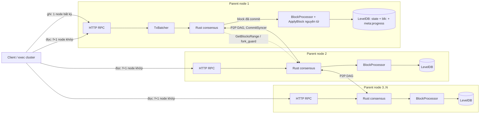

# Kế hoạch: Parent Chain chạy nhiều node, thực thi đồng bộ kiểu blockchain

> Viết 2026-09-30. Dành cho một agent/dev khác nhận việc. Tài liệu tự đủ: đọc hết mục 0–3 trước khi viết dòng code nào.
> Trạng thái: **chưa triển khai**, chỉ có một prototype WP1 trên nhánh `wip/parent-chain-multinode-stage1` (commit `a6564afd`, biên dịch được, test cũ pass, **code mới chưa có test**). Nhánh đó tách từ `dev` tại `f5e14338` nên chứa cả 2 commit EIP-7702 chưa push; chỉ `git cherry-pick a6564afd`, đừng merge cả nhánh.

---

## 0. Việc cần làm trong một câu, và luật bắt buộc

**Làm cho `cmd/parent_chain` chạy được với N ≥ 4 node độc lập (mỗi node = Rust consensus + Go executor), nhận cùng chuỗi block đã đồng thuận, thực thi tất định để mọi node ra cùng state, tự đồng bộ khi tụt lại, tự phát hiện fork, và client đọc dữ liệu không phải tin một node.**

Luật bắt buộc (`AGENTS.md`, không có ngoại lệ):
1. **Zero-fork:** thà pending còn hơn fork. Không dùng `sleep`/timeout/`Duration` để quyết định dispatch hay thoát deadlock; thoát bằng dữ liệu từ peer (đồng bộ block, so hash), không bằng thời gian.
2. Mọi queue/worker mới phải có giới hạn bộ đệm. Không I/O chặn trong vòng lặp async.
3. Không sửa kiểu/interface dùng chung nếu chưa phân tích blast radius (`grep`/codegraph).
4. Sau mỗi thay đổi code: chạy `consensus/metanode/scripts/build_check.sh` (Go + Rust + FFI) phải sạch, không warning.
5. Cập nhật `PROJECT_STRUCTURE.md` khi thêm module/file quan trọng. Tóm tắt cuối mỗi phản hồi bằng tiếng Việt theo mẫu ở `AGENTS.md`.
6. **Máy này có parent chain đang chạy thật** (`/opt/metanode/parent_chain`, HTTP `:8547`; mạng `:9000`, peer RPC `:19300`, metrics `:9110` theo mặc định của template; log `/var/log/metanode/parent_chain.log`, ~59.000 block, cụm exec đang phụ thuộc vào nó). **Không dừng, không ghi đè, không dùng lại các cổng này.** Mọi thử nghiệm dùng thư mục dữ liệu và dải cổng riêng (gợi ý: HTTP `18601–18604`, mạng `19001–19004`, peer RPC `19501–19504`, metrics `19601–19604`).
7. Commit bằng tên file (`git add <file>`), không `git add <thư mục>` (worktree dùng chung). Không push `dev` nếu chưa được chủ dự án đồng ý.

---

## 1. Hiện trạng (đã xác minh bằng đọc code, 2026-09-30)

### 1.1. Luồng giao dịch hiện tại (đã đi qua đồng thuận, nhưng chỉ với 1 node)

```
Client/exec cluster ──HTTP──> pkg/parentchain/http_rpc.go (handleTx: xác thực + tạo msgID)
   └─> chan ─> cmd/parent_chain/processor/tx_batcher.go (gom mỗi 100ms, tối đa 2000 tx)
        └─> executor.SubmitTransactionBatch  ──FFI──> Rust consensus (Mysticeti/BFT)
             └─> block đã commit ──FFI──> executor.GetAuthoritativeBlockQueue()
                  └─> cmd/parent_chain/processor/block_processor.go processBlock
                       └─> pkg/parentchain/state.go (DepositToFloat, TransferFloat, ...) ghi vào DBStore (LevelDB)
```

Giao dịch **có** đi qua Rust consensus rồi mới được thực thi. Nhưng cả hệ thống chỉ là **1 validator**.

### 1.2. Các thiếu sót cần sửa (mã G1–G9, dùng lại làm tham chiếu)

| Mã | Thiếu sót | Bằng chứng | Hậu quả khi có nhiều node |
|---|---|---|---|
| **G1** | Committee **hard-code 1 validator** (`node-0`, khóa nhúng trong source) | `cmd/parent_chain/app.go:59-103` (`CustomGetEpochBoundaryDataCallback`, `CustomGetValidatorsCallback`) | Không thể có quorum; khóa nằm trong mã nguồn |
| **G2** | Cấu hình Rust và triển khai chỉ có 1 node | `deploy/ansible_clusters/roles/parent_chain/templates/node_parent.toml.j2` (`node_id = 0`, `peer_rpc_addresses = []`, khóa `node_0_*`); inventory chỉ có host `parent_node` | Không có mạng P2P giữa các parent node |
| **G3** | `SyncBlocks` là no-op, `GetBlocksRange` trả **rỗng** | `app.go:105-127` | Node mới hoặc node tụt lại **không bao giờ bắt kịp**; `fork_guard` và `startup_sync` của Rust không có dữ liệu để so |
| **G4** | Không có **state root / hash block**: `GetStateRoot()` trả toàn số 0; phản hồi chỉ `Success:true`; `cgo_get_state_root` trả `nil` vì không có `SnapshotManager` | `block_processor.go:GetStateRoot`, `executor/ffi_bridge.go:cgo_get_state_root` | Không phát hiện được các node lệch state |
| **G5** | **Không lưu tiến độ** (`last block`, `GEI`): chỉ cập nhật bộ đếm trong RAM `storage.UpdateLastBlockNumber` | `block_processor.go:processBlock` (cuối hàm) | Sau restart Rust có thể replay từ đầu; xem G6 |
| **G6** | **Thực thi không nguyên tử, không idempotent:** `DepositToFloat` ghi số dư → tổng cung → `SetTransferRecord` → `AppendInboundTransfer` bằng các `Put` rời; bản ghi chống trùng (`TransferRecord`) ghi **sau** số dư | `pkg/parentchain/state.go:114-170`, `db_store.go` | Crash giữa chừng rồi replay ⇒ **cộng tiền hai lần** (mint). Đây là lỗi cả với 1 node |
| **G7** | Còn nguồn không tất định: `time.Now()` khi `CommitTimestampMs == 0` | `block_processor.go:processBlock` | Hai node ra hai `blockTime` khác nhau |
| **G8** | `DepositToFloat` **không có chữ ký nào được kiểm ở bước thực thi**, chỉ có token HTTP ở cổng vào (`PARENT_CHAIN_RPC_TOKEN`) | `block_processor.go` (`case TxTypeDepositToFloat`), `http_rpc.go handleTx` | Với nhiều node BFT: một validator (hoặc bất kỳ ai submit được tới consensus) mint float tùy ý. **Lỗi bảo mật nghiêm trọng, phải có quyết định thiết kế (WP6)** |
| **G9** | Client đọc **một endpoint**, tin hoàn toàn | `pkg/parentchain/http_rpc.go httpClient`, các worker `pkg/rollup/*` | Một parent node bị chiếm là nói dối được cả cụm exec (state root, inbound transfer) |

Các thứ đã ổn (đừng làm lại): logic nghiệp vụ trong `state.go` **không** dùng `time.Now`, `rand`, hay duyệt map (đã grep); `blockTime` được truyền vào từ ngoài; JSON struct có thứ tự trường cố định; HTTP chỉ **xếp hàng** vào consensus, không ghi thẳng vào store.

### 1.3. Rust đã có sẵn cơ chế multi-node, chỉ cần Go phục vụ đúng

- `consensus/metanode/src/node/peer_go_client.rs` + `PeerRpcServer` (cổng `peer_rpc_port`): Rust lấy block từ Go của peer. Go **không** cần tự mở TCP; chỉ cần trả lời đúng callback `GetBlocksRange`.
- `consensus/metanode/src/node/setup_consensus/fork_guard.rs`: so `(block_hash, state_root)` của block cục bộ (lấy từ Go qua `GetBlocksRange`) với đa số peer.
- `.../startup_sync.rs`, `.../health_check.rs`: dùng `GetBlocksRange`, `get_go_state_root()`.
- Mẫu cấu hình nhiều node của chain chính: `consensus/metanode/config/node_{0..4}.toml`, `committee.json`, `DISTRIBUTED_DEPLOYMENT.md`; công thức chịu lỗi: `note/bft_fault_tolerance_node_count.md` (`f = ⌊(n−1)/3⌋`; cần **n ≥ 4** để chịu 1 node lỗi; n = 3 không chịu được lỗi nào).

---

## 2. Kiến trúc đích



Nguyên tắc: **đồng thuận sắp xếp giao dịch; mọi node thực thi cùng chuỗi đó bằng cùng một hàm tất định; hash chain của block làm bằng chứng các node đồng ý; node tụt lại tự bắt kịp bằng cách lấy block từ peer rồi tự thực thi và tự kiểm tra hash.**

---

## 3. Việc phải làm trước khi viết code (Discovery, trả lời bằng văn bản vào `note/`)

Mỗi câu trả lời cần dẫn `file:dòng`. Nếu câu trả lời khác giả định ở mục 4–5 thì **sửa kế hoạch trước, code sau**.

| # | Câu hỏi | Tìm ở đâu | Vì sao quan trọng |
|---|---|---|---|
| D1 | Khi Go trả `ExecuteBlockResponse{Success:false}`, Rust làm gì (retry, halt, bỏ qua)? Có giới hạn số lần thử không? | `consensus/metanode/src/node/block_delivery.rs` (`deliver_with_halt_retry`) | Quyết định cách xử lý `ErrBlockGap` (WP2) |
| D2 | `GetBlocksRange` được gọi khi nào, với khoảng nào, và Rust đọc những trường nào của `BlockData` (`block_hash`, `state_root`, `parent_hash`, `raw_block_bytes`)? | `fork_guard.rs`, `startup_sync.rs`, `peer_go_client.rs`, `rpc_queries.rs` | Định dạng `BlockData` Go phải trả (WP3) |
| D3 | Lúc khởi động Rust hỏi Go những gì (last block, last GEI, epoch)? Sau restart Rust replay từ đâu? Go cần đặt lại `storage.UpdateLastBlockNumber`/`UpdateLastGlobalExecIndex` thế nào? | `executor/unix_socket_handler_epoch*.go`, `recovery.rs`, `pkg/storage/block_number_state.go` | G5/WP2 |
| D4 | Ngữ nghĩa chính xác của `SyncBlocks` (`execute_mode`, `preserve_own_commit_index`) và ai gọi nó cho một node tụt lại | `executor/unix_socket_handler.go HandleSyncBlocksRequest`, `startup_sync.rs` | WP3 |
| D5 | Cách chain chính dựng `EpochBoundaryData` và `GetValidatorsAtBlock` (nguồn committee, thứ tự, stake) | `executor/unix_socket_handler_epoch.go`, `unix_socket_handler_validators.go` | WP4: committee của parent chain phải sắp xếp giống nhau tuyệt đối trên mọi node |
| D6 | Đánh số block: `block_number` có bắt đầu từ 1? Có block `block_number = 0` (commit rỗng, ranh giới epoch)? `is_authoritative_gei=false` thì `GlobalExecIndex` có luôn bằng `block_number` không (log thực tế: `block 58774 (GEI 58774)`)? | `proto ExecutableBlock`, log parent chain | Điều kiện `ErrBlockGap` (WP1/WP2) |
| D7 | Chuyển epoch của parent chain: `EpochDurationSeconds = 86400` đang hard-code trong `app.go`; đổi committee giữa chừng có được hỗ trợ không? | `app.go`, Rust epoch monitor | Phạm vi WP4 (đề xuất: committee cố định trong giai đoạn đầu, đổi committee = quy trình vận hành thủ công có wipe) |
| D8 | Rust dựng `PeerRpcServer` từ `peer_rpc_addresses` như thế nào và nó gọi Go local ra sao? | `consensus/metanode/src/node/` (grep `PeerRpcServer`) | WP5 |

---

## 4. Đặc tả tất định (byte-exact, mọi node và mọi lần chạy phải ra cùng kết quả)

Prototype WP1 (`pkg/parentchain/kv.go`, `db_store.go`, `block_exec.go`) đã cài đặt đúng đặc tả này. Nếu đổi, phải đổi cả tài liệu và test vector.

### 4.1. Layout khóa (LevelDB)

`cr:`+hash (chain registry) · `fl:`+hash (float) · `cl:`+msgID (claimed) · `tx:`+msgID (transfer record) · `sq:`+hash (seq) · `vl:`+hash (velocity) · `ac:`+addr (account) · `sr:`+hash+epoch(BE8) (state root cụm) · `in:`+dest+seq(BE8) (inbound log) · `in_sq:`+dest · **mới:** `blk:`+number(BE8) (record block) · `meta:progress` (tiến độ).
Giá trị: JSON `encoding/json` cho struct, byte big-endian tối thiểu cho `big.Int` (float, seq). Phải có test khẳng định mã hóa ổn định giữa các lần chạy.

### 4.2. Thực thi một block

1. `applyMu` (một block một lúc). Đọc `meta:progress`.
2. **Exactly-once:** `Number ≤ LastBlock` ⇒ không thực thi lại; trả record đã lưu; nếu `txs_root` khác ⇒ `ErrBlockConflict` (báo động fork, **không** chấp nhận).
3. **Liên tục:** `Number` phải bằng `LastBlock+1`, ngược lại `ErrBlockGap` (phải sync). Chain mới (`LastBlock == 0`) chỉ nhận `Number == 1`; DB cũ đã có state nhưng chưa có progress (nâng cấp từ bản đơn node) thì nhận block đầu tiên nhận được làm mốc.
4. Thực thi từng tx trên **overlay** (lớp block, mỗi tx một lớp con): tx lỗi ⇒ bỏ lớp tx (không để lại ghi dở); tx ổn ⇒ gộp vào lớp block.
5. Tính:
   - `txs_root = keccak(lenprefix(tx_1) ‖ … ‖ lenprefix(tx_n))`, `lenprefix(x) = BE32(len(x)) ‖ x`, `tx_i` là **byte nguyên bản** consensus giao.
   - `writeset_digest = keccak(lenprefix(k_1) ‖ lenprefix(v_1) ‖ …)` trên các cặp khóa/giá trị cuối cùng của lớp block, **sắp theo khóa (bytewise)**, loại trừ `blk:` và `meta:progress`.
   - `state_root_n = keccak(lenprefix(state_root_{n-1}) ‖ lenprefix(writeset_digest))`.
   - `block_hash_n = keccak(lenprefix(block_hash_{n-1}) ‖ lenprefix(BE64(number)‖BE64(gei)‖BE64(epoch)‖BE64(timestamp_ms)) ‖ lenprefix(txs_root) ‖ lenprefix(state_root_n))`.
6. **Một `leveldb.Batch` ghi đồng bộ (`Sync: true`)** gồm: mọi ghi state của block, `blk:`+number, `meta:progress`. Hoặc cả block hoặc không gì cả.
7. **Không dùng đồng hồ:** thời gian duy nhất là `commit_timestamp_ms` do consensus cấp. Nếu bằng 0, dùng `LastTimestampMs` của block trước (**không** `time.Now()`).

### 4.3. Tiêu chí "cùng state"
Hai node cùng chạy block 1..N phải có `state_root_N` và `block_hash_N` giống hệt nhau. Đây là **test chấp nhận trung tâm** (WP8-T1).

---

## 5. Các gói công việc (thứ tự và phụ thuộc)

```
WP0 ─┬─> WP1 ──> WP2 ──> WP3 ──┐
     ├─> WP4 ──────────────────┼──> WP5 ──> WP7 ──> WP9
     └─> WP6 ──────────────────┘          └──> WP8 (chạy song song từ WP1)
```

### WP0 — Hạ tầng thử nghiệm cô lập
- Script dựng cụm parent chain N=4 cục bộ **trên cổng riêng** (mục 0.6): tạo 4 thư mục dữ liệu, sinh khóa, sinh `committee.json`, sinh 4 file `node_parent_i.toml`, chạy 4 tiến trình, dừng/khởi động lại từng node. Đặt ở `deploy/cluster/local_parent_chain/` (mô phỏng `deploy/cluster/local_devnet/`).
- **Nghiệm thu:** `./run.sh up` chạy 4 node, `./run.sh status` in `last_block`, `block_hash`, `state_root` của từng node; tất cả node commit được block (dù rỗng); dừng script không đụng tiến trình `:8547`.

### WP1 — Thực thi block nguyên tử, tất định (prototype có sẵn)
- Cherry-pick `a6564afd` rồi hoàn thiện: `rawKV`/`levelKV`/`overlayKV` (`kv.go`), `kvStore` (`db_store.go`), `ApplyBlock`, `LastApplied`, `GetBlockRecord(s)` (`block_exec.go`).
- Việc còn thiếu: **toàn bộ test** (WP8-U), kiểm tra `DBStore` mới **tương đương từng hàm** với bản cũ (`git show a6564afd~1:execution/pkg/parentchain/db_store.go`), bỏ `hasLegacyState` nếu D6 cho thấy không cần, xem xét `MemoryStore` (giữ nguyên cho test hoặc cho implement `BlockCommitter` để test dùng chung).
- **Nghiệm thu:** test WP8-U1..U9 pass; mọi test cũ của `pkg/parentchain` và `cmd/parent_chain/processor` pass; `build_check.sh` sạch.

### WP2 — Tích hợp `BlockProcessor`
- `processBlock` dùng `ApplyBlock` khi store là `BlockCommitter`; nhánh cũ giữ cho `MemoryStore` (test).
- `ErrBlockGap` ⇒ trả `ExecuteBlockResponse{Success:false}` (kết luận D1 quyết định Rust sẽ làm gì) **và** kích hoạt đường đồng bộ (WP3). **Không** dùng timeout/sleep để "thử lại cho đến khi được".
- `ErrBlockConflict` ⇒ dừng xử lý block, log mức lỗi nghiêm trọng, đặt cờ `forkDetected` (WP7), **không** ghi gì.
- Khi khởi động: đọc `meta:progress`, gọi `storage.UpdateLastBlockNumber` và `UpdateLastGlobalExecIndex` (D3) để Rust biết đúng điểm tiếp tục.
- Phản hồi: `Success:true` + `StateRoot = state_root` (giữ nguyên các trường khác như hiện tại, xem D1/D6 trước khi thêm `BlockNumber/ActualGei`).
- Bỏ `time.Now()`. Block `block_number == 0` ⇒ không thực thi, không đổi progress (kiểm chứng ở D6).
- Đăng ký hook `executor.SetStateRootProvider(func() string)` (mới, thêm vào `executor/ffi_bridge.go`) để `cgo_get_state_root` trả `"0x"+hex(state_root)` khi không có `SnapshotManager`.
- **Nghiệm thu:** replay cùng block hai lần không đổi state (T3); crash giả lập giữa block không để lại ghi dở (T4); sau restart node tiếp tục đúng block kế; log không còn `time.Now` trong đường thực thi.

### WP3 — Lưu block, phục vụ và đồng bộ
- `GetBlocksRange`: đọc `blk:` ⇒ `pb.BlockData{block_number, block_hash, epoch, timestamp_ms, parent_hash, state_root, transactions_root=txs_root, raw_block_bytes = ExecutableBlock đã marshal}`. Giới hạn số block mỗi lần (ví dụ 500) và kích thước phản hồi.
- `SyncBlocks` (`execute_mode`): với mỗi block theo thứ tự: nếu đã áp dụng thì **so** `block_hash`/`state_root` (khác ⇒ lỗi fork); nếu chưa thì unmarshal `raw_block_bytes` và `ApplyBlock` cùng đường thực thi thường, rồi **so** hash/state_root tính được với `BlockData` nhận về; khác ⇒ dừng và báo lỗi (không tiếp tục). Trả `SyncedCount`, `LastSyncedBlock`, `LastExecutedGei`.
- Chính sách lưu giữ `raw_block`: mặc định giữ toàn bộ (parent chain ~1 block/giây, ~86.000 block/ngày, phần lớn là block rỗng nên nhỏ); thêm cấu hình cắt tỉa theo số block cách xa `last_block` **chỉ khi** đã có snapshot/mốc đồng thuận, nếu chưa thì để trong phần "chưa làm".
- **Nghiệm thu:** node A chạy 1000 block, node B (DB trống) đồng bộ từ A và ra `state_root_1000` giống hệt; một block bị sửa giữa đường bị phát hiện và từ chối (WP8-I4).

### WP4 — Committee do cấu hình, không hard-code
- Định dạng file `parent_committee.json` (mọi node dùng **cùng một file**, thứ tự cố định, đề nghị lấy nguyên định dạng `consensus/metanode/config/committee.json` + trường `address` Ethereum của validator):
  `validators[]: {name, address, stake, authority_key(BLS), protocol_key, network_key, p2p_address}`.
- `parentchain.LoadCommittee(path)` + kiểm tra: không rỗng, không trùng khóa/địa chỉ, stake > 0, cảnh báo nếu `n < 4` (không chịu lỗi, xem `note/bft_fault_tolerance_node_count.md`).
- Thay hai callback trong `app.go` bằng dữ liệu từ file; cờ `--committee` (hoặc biến `PARENT_CHAIN_COMMITTEE_FILE`); thiếu file ⇒ **chế độ devnet đơn node cũ** kèm cảnh báo lớn (giữ tương thích cụm đang chạy). **Xóa khóa nhúng khỏi source** khi cụm cũ được chuyển sang file (không được để lại lâu dài).
- `EpochDurationSeconds`, `BoundaryBlock` lấy từ cấu hình (D5/D7), không hard-code.
- Công cụ sinh khóa: dùng `crates/metanode-keytool`, `execution/cmd/tool/founding_entry`, `deploy/systemd/gen_validator_entry.py` làm mẫu; sinh trọn bộ cho N node.
- **Nghiệm thu:** cùng một file ⇒ mọi node trả **đúng cùng** danh sách validator cho cùng epoch (test so byte); `committee.json` Rust và file Go khớp nhau (test đối chiếu).

### WP5 — Cấu hình Rust và triển khai N node
- Template `node_parent.toml.j2` và `parent_consensus.toml.j2`: `node_id`, `network_address`, `peer_rpc_port`, `peer_rpc_addresses` (danh sách các node còn lại), đường dẫn khóa theo node (`node_{{id}}_*`), `storage_path` riêng, `metrics_port` riêng; mẫu tham chiếu là `consensus/metanode/config/node_1.toml`.
- Ansible `deploy/ansible_clusters`: `parent_chain_nodes` nhiều host (mỗi host có `parent_node_id`, `ansible_host`, các cổng); sinh/phân phối `parent_committee.json` giống nhau; mở tường lửa cổng P2P/peer RPC giữa các node; unit systemd đọc `security.env` (đã có: `PARENT_CHAIN_RPC_TOKEN`).
- Lưu ý: role `roles/build` và `inventory.yml` đã được xử lý ở commit `540d1cf6`.
- **Nghiệm thu:** `./deploy_clusters.sh` với inventory 4 parent node dựng được cụm (thử trên máy cục bộ với cổng riêng); mọi node lên cùng block và cùng `state_root`.

### WP6 — RPC đa node, bảo mật và đọc quorum
- **Quyết định thiết kế bắt buộc cho G8:** `DepositToFloat` phải được xác thực **trong bước thực thi tất định**, không chỉ ở cổng HTTP. Phương án đề xuất: deposit mang một chứng nhận (`Cert`) ký bởi khóa cluster nguồn (đã đăng ký ở `ChainRegistry`) trên thông điệp deposit; `DepositToFloat` kiểm chữ ký; deposit không hợp lệ bị bỏ (tx lỗi) trên **mọi** node như nhau. Cần thống nhất định dạng thông điệp và ai là bên ký (ghi kết luận vào `note/`, xin chủ dự án duyệt trước khi code).
- Kiểm toán mọi loại tx còn lại: `TransferFloat`, `RegisterAccount`, `SubmitStateRoot`, `MarkClaimed`, `ReclaimFloat` đều phải kiểm ủy quyền **trong `state.go`** (hiện phần lớn đã có, kiểm lại từng hàm).
- HTTP mọi node nhận ghi (đưa vào consensus); endpoint mới `GET /status`: `last_block`, `last_hash`, `state_root`, `syncing` (true khi `ErrBlockGap` đang chờ); node đang sync **từ chối ghi mới** (trả 503), vẫn cho đọc.
- Idempotency: cùng nội dung gửi tới hai node ⇒ cùng `msgID` ⇒ thực thi chỉ một lần (đã có cơ chế `TransferRecord`, viết test).
- `QuorumClient` (`pkg/parentchain/quorum_client.go`): cùng interface `Client`; ghi vào một endpoint (thử lần lượt nếu lỗi, **không** timeout để quyết định dữ liệu); đọc từ tất cả endpoint và chỉ chấp nhận giá trị mà **≥ f+1** node trả giống hệt (với `f = ⌊(n−1)/3⌋`); nếu không đủ ⇒ trả lỗi (thà chờ còn hơn tin sai). Cấu hình `parent_chain_urls: [...]` thay cho `parent_chain_url` (giữ tương thích). Cập nhật nơi tạo client trong `cmd/simple_chain/app.go` và `pkg/rollup`.
- **Nghiệm thu:** test với 4 server giả, 1 server nói dối ⇒ client vẫn ra giá trị đúng; 2 server nói dối ⇒ client báo lỗi thay vì trả sai; mint qua HTTP không có chứng nhận hợp lệ bị từ chối ở bước thực thi trên mọi node.

### WP7 — Phát hiện fork và vận hành
- Nối kết quả `ErrBlockConflict`/so hash với cờ `forkDetected` và metrics (`parent_chain_last_block`, `parent_chain_state_root_hex`, `parent_chain_fork_detected`).
- Xác nhận `fork_guard.rs` và `health_check.rs` hoạt động với dữ liệu Go mới (D2): cố ý tạo lệch (sửa DB một node) ⇒ phát hiện.
- Tool giám sát: mô phỏng `execution/cmd/tool/block_hash_checker` cho parent chain (so `/status` của các node theo thời gian).
- Runbook (`note/runbook_parent_chain_multinode.md`): khởi động lại một node, node tụt lại tự bắt kịp thế nào, wipe và resync một node, thêm/thay validator (nêu rõ nếu chưa hỗ trợ), mất quorum thì hệ thống dừng ra sao và tự tiến triển thế nào khi đủ node quay lại.

### WP8 — Bộ test (viết song song từ WP1)
Unit (`pkg/parentchain/block_exec_test.go`, dùng LevelDB ở `t.TempDir()`):
- **U1** hai `DBStore` chạy cùng chuỗi block ⇒ `state_root`, `block_hash` giống hệt từng block.
- **U2** thứ tự tx khác ⇒ hash khác (đảm bảo hash nhạy với thứ tự).
- **U3** replay block đã áp dụng ⇒ không đổi state, trả record cũ, `Replayed=true`.
- **U4** replay block cùng số nhưng nội dung khác ⇒ `ErrBlockConflict`, state không đổi.
- **U5** `Number` nhảy cóc ⇒ `ErrBlockGap`; chain mới nhận block khác 1 ⇒ `ErrBlockGap`; DB có state cũ nhận block bất kỳ làm mốc.
- **U6** tx lỗi giữa chừng (ghi số dư rồi lỗi) ⇒ **không** để lại ghi dở, các tx sau vẫn chạy.
- **U7** giả lập crash (đóng DB giữa chừng / batch không ghi) ⇒ mở lại: hoặc trọn block hoặc không gì.
- **U8** `DBStore` mới tương đương bản cũ trên mọi hàm `Store` (test bảng, gồm phân trang `GetInboundTransfers`).
- **U9** không dùng đồng hồ: chạy cùng block ở hai thời điểm khác nhau ⇒ kết quả giống nhau (kể cả `CommitTimestampMs == 0`).
- **U10** `overlayKV.scan` gộp đúng lớp ghi và dữ liệu nền, đúng thứ tự.
Processor (`cmd/parent_chain/processor`): **P1** `ErrBlockGap` ⇒ `Success:false` và không đổi state; **P2** restart giữa hai block ⇒ tiếp tục đúng; **P3** `GetBlocksRange` trả đúng và giới hạn; **P4** `SyncBlocks` áp dụng đúng và từ chối block bị sửa; **P5** `block_number == 0` bị bỏ qua.
Committee/client: **C1** file committee hợp lệ và không hợp lệ; **C2** `QuorumClient` như WP6.
Tích hợp (cụm WP0 với cổng riêng):
- **I1** 4 node, gửi 1000 tx qua node ngẫu nhiên ⇒ mọi node cùng `state_root`.
- **I2** dừng 1 node giữa chừng, tiếp tục gửi tx (còn 3/4 = đủ quorum) ⇒ hệ thống vẫn tiến; bật lại node ⇒ tự bắt kịp và trùng hash.
- **I3** dừng 2 node ⇒ hệ thống **dừng** (không quorum), không fork; bật lại ⇒ tự tiếp tục.
- **I4** sửa DB của một node ⇒ node đó bị phát hiện, không tiếp tục âm thầm.
- **I5** gửi cùng tx tới 2 node khác nhau ⇒ áp dụng đúng một lần.
- **I6** wipe một node ⇒ resync từ block 1 ra cùng `state_root`.
- **I7** exec cluster dùng `QuorumClient` chạy được e2e trong khi 1 parent node bị chặn hoặc nói dối.

### WP9 — Di chuyển và triển khai
- Cụm parent chain đang chạy (1 node, ~59.000 block, có state, chưa có progress): bản mới nhận block đầu tiên nhận được làm mốc và tính hash từ đó (chuỗi hash của node này sẽ **không** trùng với cụm N node dựng mới). Vì vậy: **cụm multi-node dựng mới từ block 1 với dữ liệu trống**; cụm đơn node cũ chỉ nâng cấp tại chỗ để có tiến độ và atomicity (WP1–WP2), rồi ngừng sau khi cụm mới thay thế.
- Thứ tự nâng cấp và chiến lược quay lui (giữ nguyên binary/DB cũ ở `backup_*` như quy trình `project_cluster_231_230_upgrade_20260929` trong memory).
- Không đổi kết quả thực thi của các hàm nghiệp vụ trong `state.go` (chỉ thêm kiểm chứng ở WP6); mọi thay đổi định dạng phải kèm cờ phiên bản.

### WP10 — Tài liệu và dọn dẹp
- `PROJECT_STRUCTURE.md` (mục parent chain), `OPERATIONS_GUIDE.md`, `note/parent_chain_multinode_design.md` (bản thiết kế kết quả), runbook (WP7).
- Xóa khóa hard-code, xóa `TODO` của `GetStateRoot`, cập nhật `deploy/ansible_clusters/README.md`.

---

## 6. Định nghĩa "xong" (checklist chấp nhận cuối)

- [ ] N=4 parent node chạy độc lập; committee đọc từ một file chung; **không còn khóa hard-code** trong source.
- [ ] Mọi node ra cùng `state_root`/`block_hash` tại mọi block (I1) và test tự động chứng minh (U1).
- [ ] Thực thi nguyên tử, exactly-once, không dùng đồng hồ; crash không gây cộng tiền hai lần (U3, U6, U7).
- [ ] Node tụt lại/mới tự đồng bộ từ peer và tự kiểm hash; block bị sửa bị từ chối (I2, I4, I6).
- [ ] Mất quorum ⇒ dừng an toàn, không fork; đủ quorum trở lại ⇒ tự tiến (I3).
- [ ] `DepositToFloat` và mọi tx được xác thực ở bước thực thi tất định (WP6); có test từ chối tx không hợp lệ trên mọi node.
- [ ] Client đọc qua `QuorumClient` chịu được 1 node nói dối (I7, C2).
- [ ] `build_check.sh` sạch; `go test ./...` pass; `PROJECT_STRUCTURE.md` và runbook đã cập nhật.
- [ ] Không có thay đổi nào lên tiến trình parent chain đang chạy ở `:8547` ngoài việc chủ dự án chủ động triển khai.

---

## 7. Rủi ro và quyết định cần chủ dự án duyệt trước khi làm sâu

| # | Vấn đề | Khuyến nghị mặc định |
|---|---|---|
| Q1 | **Ai vận hành các validator của parent chain?** Nếu tất cả do một bên điều khiển thì BFT không thêm được bảo đảm tin cậy (chỉ thêm khả dụng). | N ≥ 4, các operator độc lập; ghi rõ mô hình tin cậy trong tài liệu |
| Q2 | Cách xác thực `DepositToFloat` (G8) | Chứng nhận của cluster nguồn kiểm ở bước thực thi (WP6); cần thống nhất định dạng |
| Q3 | Thay đổi committee giữa chừng (D7) | Giai đoạn đầu: committee cố định; đổi committee là quy trình có chủ đích và có wipe |
| Q4 | Lưu giữ block: `raw_block` mọi block tăng dần | Giữ hết ở giai đoạn đầu; cắt tỉa chỉ khi có mốc snapshot đã đồng thuận |
| Q5 | Ngưỡng đọc quorum `f+1` khiến đọc phụ thuộc số node sống | Chấp nhận (thà lỗi còn hơn tin sai); có cờ chế độ "một node" cho devnet |
| Q6 | Nhiều node nhận ghi HTTP: giới hạn tốc độ và spam vào consensus | Token và giới hạn ở HTTP (đã có), hàng đợi `TxBatcher` giữ giới hạn có sẵn (1000), thêm metrics khi đầy |
| Q7 | Chuỗi hash bắt đầu tại mốc nâng cấp trên cụm cũ | Không so hash giữa cụm cũ và cụm mới; chỉ cụm mới dựng từ block 1 |

---

## 8. Bản đồ file

| Vùng | File |
|---|---|
| App, callback committee/sync | `execution/cmd/parent_chain/app.go`, `main.go` |
| Thực thi block | `execution/cmd/parent_chain/processor/block_processor.go` (+ `_test.go`), `tx_batcher.go` |
| Logic nghiệp vụ | `execution/pkg/parentchain/state.go`, `store.go`, `tx.go` |
| Lưu trữ (WP1) | `execution/pkg/parentchain/db_store.go`, `kv.go`, `block_exec.go` (prototype `a6564afd`) |
| RPC/client | `execution/pkg/parentchain/http_rpc.go`, `client.go` |
| Cầu FFI | `execution/executor/ffi_bridge.go`, `unix_socket_handler*.go` |
| Rust liên quan | `consensus/metanode/src/node/{block_delivery.rs, peer_go_client.rs, executor_client/, setup_consensus/{fork_guard,startup_sync}.rs, health_check.rs}` |
| Cấu hình mẫu | `consensus/metanode/config/{node_*.toml, committee.json, DISTRIBUTED_DEPLOYMENT.md}` |
| Triển khai | `deploy/ansible_clusters/roles/parent_chain/`, `deploy/ansible_clusters/inventory.example.yml` |
| Tài liệu nền | `note/bft_fault_tolerance_node_count.md`, `note/cross_chain_root_anchor_architecture.md`, `AGENTS.md` |

## 9. Lời nhắn cho agent thực hiện

1. Làm **WP0 và phần Discovery (mục 3) trước**; gửi kết quả cho chủ dự án nếu bất kỳ câu nào phá giả định của kế hoạch.
2. Làm theo thứ tự WP1 → WP2 → WP3, mỗi gói một commit có test; chạy `build_check.sh` mỗi lần.
3. Không tối ưu sớm, không thêm lớp trừu tượng ngoài những gì kế hoạch nêu (KISS/YAGNI của `AGENTS.md`); riêng phần đồng thuận và thực thi tất định thì ưu tiên đúng hơn gọn.
4. Nếu gặp tình huống mà cách duy nhất để "thoát kẹt" là chờ theo thời gian: **dừng và hỏi**, đừng thêm timeout.
5. Báo cáo trung thực: cái nào đã chạy thật trên cụm N node, cái nào mới chỉ có test đơn vị.
