# Runbook: Cutover Toàn Mạng Chain ID 991 & Protobuf Serialization

- **Mục tiêu:** Thực hiện chuyển đổi đồng thời (hard cutover: wipe + redeploy) toàn bộ mạng MetaNode sang Parent Chain ID `991` và định dạng payload protobuf binary (`CreditAttestationRequest`, `CreditAttestationBatch`, `AccountRegistrationEnvelope`).
- **Thời điểm áp dụng:** Cắt chuyển môi trường Production.
- **Trạng thái tài liệu:** DỰ THẢO THAO TÁC (CHỈ VIẾT, CHƯA THỰC THI TRÊN CỤM THẬT).
- **Nguyên tắc an toàn tối thượng:**
  - 🚨 **CẢNH BÁO PHÁ HỦY DỮ LIỆU:** Thao tác wipe dữ liệu là KHÔNG THỂ PHỤC HỒI nếu không có bản sao lưu hợp lệ. Mọi bước dừng tiến trình và wipe dữ liệu **BẮT BUỘC PHẢI CÓ SỰ XÁC NHẬN BẰNG VĂN BẢN CỦA USER TỪNG LẦN**.
  - 🛡️ **Zero-Fork Invariant (AGENTS.md 2.5):** Không dùng timeout/sleep để quyết định dispatch; thà PENDING chứ tuyệt đối không fork.
  - 🔒 **Chỉ sử dụng định danh tiến trình hoặc service systemd chuẩn:** Không bao giờ `pkill` theo port hoặc pattern tuỳ tiện.

---

## 1. Bối cảnh & Lý do kỹ thuật (Why)

1. **Thay đổi Chain ID Parent:** Đổi từ `990` sang `991` ở Parent Chain và mọi cụm Execution (`chain_id=991`). Tất cả chữ ký EIP-712/secp256k1 và attestation envelope trên chain ID cũ sẽ bị từ chối fail-closed.
2. **Nâng cấp Serialization:** Chuyển đổi payload đăng ký tài khoản và attestation tín dụng xuyên cụm từ định dạng legacy JSON sang chuẩn Protobuf nhị phân. Các node chạy binary cũ không thể parse payload mới và ngược lại.
3. **Tính chất Cutover:** Do thay đổi cấu trúc định dạng và domain separator chữ ký, mạng không hỗ trợ soft-fork tương thích ngược tại ranh giới block. Yêu cầu chuyển đổi đồng thời (coordinated full-network cutover).

---

## 2. Phân công vai trò (RACI Matrix)

| Vai trò | Nhân sự phụ trách | Nhiệm vụ chính |
| :--- | :--- | :--- |
| **Lead Coordinator (Điều phối chính)** | Tech Lead / Architecture Agent | Chỉ đạo thứ tự, phê duyệt các mốc Go/No-Go, ra lệnh Rollback nếu có sự cố. |
| **Deployment Engineer (Kỹ sư triển khai)** | SRE / DevOps / Infra Team | Chạy playbook Ansible, quản lý services, thực hiện lệnh backup & wipe dữ liệu. |
| **Verification Engineer (Kỹ sư kiểm thử)** | QA / Blockchain Core Engineer | Chạy test suite, kiểm tra RPC, Prometheus metrics, xác minh tính toàn vẹn 0 fork. |
| **User / System Owner** | Product Owner / Node Operator | Phê duyệt bằng văn bản trước khi thực hiện bước phá hủy dữ liệu (Phase 3). |

---

## 3. Khung thời gian dự kiến (Maintenance Window)

- **Tổng thời gian dự kiến (Happy Path):** ~85 phút
- **Cửa sổ bảo trì dự phòng (Maintenance Window):** 120 phút
- **Thời gian Rollback dự phòng:** ~25 phút

```mermaid
gantt
    title Kế hoạch Cutover Chain ID 991 & Proto
    dateFormat  X
    axisFormat %s m
    section Chuẩn bị
    Phase 0 - Đóng cổng & Thông báo          :0, 5
    Phase 1 - Dừng toàn bộ services          :5, 15
    Phase 2 - Sao lưu & Verify backup        :15, 30
    section Cutover Core
    Phase 3 - Wipe dữ liệu (Cần User Phê duyệt) :30, 40
    Phase 4 - Triển khai binary & Genesis 991  :40, 55
    Phase 5 - Khởi động Parent & Exec        :55, 65
    section Kiểm thử & Bàn giao
    Phase 6 - Post-Deploy Verification       :65, 85
    Phase 7 - Mở cổng & Bàn giao              :85, 90
```



---

## 4. 🔑 Yêu cầu khoá Validator & Cách cấu hình (BẮT BUỘC)

### 4.1 Nguyên tắc khớp khoá
Mỗi node validator trong cụm phải có sự khớp nối tuyệt đối giữa 3 thành phần:
1. **Khoá riêng BLS:** Được lưu tại cấu hình node (`Databases.BLSPrivateKey` hoặc file keystore bảo mật). Độ dài: 64 hex characters (32 bytes).
2. **Khoá công khai BLS:** Dẫn xuất từ khoá riêng, độ dài 96 hex characters kèm tiền tố `0x` (48 bytes compressed G1).
3. **Genesis Allocation:** Mục `alloc` trong `genesis.json` tương ứng với địa chỉ `address` của node PHẢI chứa:
   ```json
   "0x<ValidatorAddress>": {
     "balance": "...",
     "publicKeyBls": "0x<96_hex_chars_exact_matching_bls_pubkey>"
   }
   ```
Nếu lệch 1 ký tự, node sẽ rơi vào trạng thái `[COMMITTEE-KEY-MISMATCH]`, metric `master_validator_committee_key_valid = 0`, probe `/readiness` trả về **HTTP 503**, và mọi attestation/đăng ký tài khoản sẽ bị treo `PENDING` vĩnh viễn!

### 4.2 Công cụ sinh & xác thực khoá
Sử dụng công cụ chính thức trong repo:
```bash
# Đường dẫn: execution/cmd/tool/bls_pubkey
cd /path/to/metanode/execution

# Sinh public key định dạng 0x + 96 hex chars từ private key
go run ./cmd/tool/bls_pubkey -priv <64_HEX_BLS_PRIVATE_KEY> -hex

# Ví dụ output:
# 0x985265185a2a1a627af51c143de2f21d939970ed7099544775324b9eebf0bbe0d324ce053cd7d4192238724829f8ba66
```

### 4.3 Kiểm tra tự động tại bước deploy (Ansible Pre-flight)
Role `exec_cluster` trong Ansible playbook đã tích hợp sẵn bước kiểm tra này:
```yaml
# deploy/ansible_clusters/roles/exec_cluster/tasks/main.yml
- name: Verify validator BLS public key matches genesis alloc
  ansible.builtin.assert:
    that:
      - derived_bls_pub.stdout | lower == expected_bls_pub | lower
    fail_msg: "FATAL: BLS private key produces public key {{ derived_bls_pub.stdout }} which does NOT match genesis publicKeyBls {{ expected_bls_pub }}"
```
Nếu có bất kỳ sự sai lệch nào, lệnh `ansible-playbook` sẽ dừng ngay lập tức và từ chối deploy.

---

## 5. Quy trình chi tiết từng bước (Step-by-Step Procedure)

### Phase 0: Thông báo & Đóng cổng mạng (T - 30m đến T)
- **Người thực hiện:** SRE / Network Admin
- **Mục đích:** Ngăn chặn các giao dịch mới của user trong quá trình cắt chuyển, bảo toàn tính nhất quán tuyệt đối.
- **Thao tác:**
  ```bash
  # 1. Đóng ingress tại Reverse Proxy / Load Balancer / Firewall cho cổng RPC công khai (ví dụ 8545, 8547)
  # Chuyển traffic vào trang bảo trì HTTP 503 Maintenance Mode
  sudo iptables -I INPUT -p tcp --dport 8545 -j DROP
  sudo iptables -I INPUT -p tcp --dport 8547 -j DROP
  
  # 2. Xác nhận không còn traffic client gửi vào
  ss -tna '( dport = :8545 or dport = :8547 )'
  ```
- **Tiêu chí Go/No-Go (G0):** Ingress đóng 100%, không còn client connection.

---

### Phase 1: Dừng toàn bộ Services (Theo thứ tự: Exec trước, Parent sau)
- **Người thực hiện:** SRE / Deployment Engineer
- **Nguyên tắc:** DỪNG EXECUTION TRƯỚC, DỪNG PARENT CHAIN SAU để không có attestation nào bị mồ côi (orphaned) giữa chừng.
- **Thao tác:**
  ```bash
  # 1. Dừng các Execution Clusters trên toàn bộ các node (Ansible hoặc Systemd)
  ansible exec_clusters -m systemd -a "name=metanode-exec-cluster state=stopped" --become
  # Hoặc kiểm tra trực tiếp:
  sudo systemctl stop metanode-exec-cluster
  
  # 2. Xác nhận tiến trình execution đã dừng hoàn toàn
  ps aux | grep simple_chain | grep -v grep || echo "Exec processes stopped"

  # 3. Dừng Parent Chain
  ansible parent_nodes -m systemd -a "name=metanode-parent-chain state=stopped" --become
  sudo systemctl stop metanode-parent-chain

  # 4. Xác nhận tiến trình parent chain đã dừng hoàn toàn
  ps aux | grep parent_chain | grep -v grep || echo "Parent processes stopped"
  ```
- **Tiêu chí Go/No-Go (G1):** Không còn bất kỳ tiến trình `simple_chain` hoặc `parent_chain` nào đang chạy.

---

### Phase 2: Sao lưu & Xác minh bản sao lưu (Backup & Integrity Check)
- **Người thực hiện:** SRE / Deployment Engineer
- **Nguyên tắc:** Dữ liệu cũ phải được nén, gắn thẻ timestamp, và kiểm tra tính toàn vẹn (checksum) trước khi chuyển sang bước tiếp theo.
- **Thao tác:**
  ```bash
  BACKUP_TS=$(date +%Y%m%d_%H%M%S)
  BACKUP_DIR="/opt/metanode_backups/pre_cutover_${BACKUP_TS}"
  sudo mkdir -p "${BACKUP_DIR}"

  # 1. Backup dữ liệu Parent Chain
  sudo tar -czf "${BACKUP_DIR}/parent_data.tar.gz" -C /opt/metanode/parent data backup config.json parent_genesis.json
  
  # 2. Backup dữ liệu Exec Nodes (trên từng máy host)
  sudo tar -czf "${BACKUP_DIR}/exec_data.tar.gz" -C /opt/metanode/exec data backup config.json genesis.json raft

  # 3. Kiểm tra tính toàn vẹn bản sao lưu (tar test -t)
  tar -tzf "${BACKUP_DIR}/parent_data.tar.gz" > /dev/null && echo "Parent backup OK"
  tar -tzf "${BACKUP_DIR}/exec_data.tar.gz" > /dev/null && echo "Exec backup OK"

  # 4. Ghi checksum sha256
  sha256sum "${BACKUP_DIR}"/*.tar.gz | sudo tee "${BACKUP_DIR}/SHA256SUMS"
  ```
- **Tiêu chí Go/No-Go (G2):** Bản sao lưu đã nén thành công, tar test không có lỗi, checksum được lưu trữ an toàn.

---

### Phase 3: Wipe dữ liệu cũ (XÁC NHẬN BẰNG VĂN BẢN TỪNG BƯỚC)
> 🚨 **ĐIỂM DỪNG BẮT BUỘC (CRITICAL HOLD POINT):**
> Thao tác này sẽ xoá sạch state trie, Pebble databases, và Raft logs cũ.
> **CHỈ THỰC HIỆN KHI CÓ XÁC NHẬN TRỰC TIẾP CỦA USER BẰNG VĂN BẢN TRONG PHIÊN.**

- **Thao tác sau khi user đồng ý:**
  ```bash
  # 1. Xoá dữ liệu Parent Chain
  sudo rm -rf /opt/metanode/parent/data/*
  sudo rm -rf /opt/metanode/parent/backup/*
  sudo rm -rf /opt/metanode/parent/logs/*

  # 2. Xoá dữ liệu Execution Clusters (trên từng node)
  sudo rm -rf /opt/metanode/exec/data/*
  sudo rm -rf /opt/metanode/exec/backup/*
  sudo rm -rf /opt/metanode/exec/logs/*
  sudo rm -rf /opt/metanode/exec/raft/*
  sudo rm -rf /opt/metanode/exec/explorer/*
  
  # 3. Xác nhận thư mục rỗng
  ls -la /opt/metanode/parent/data /opt/metanode/exec/data
  ```
- **Tiêu chí Go/No-Go (G3):** Toàn bộ thư mục dữ liệu state đã sạch, không còn file lock hoặc registry cũ.

---

### Phase 4: Triển khai Binary mới & Cấu hình Genesis mới (Chain ID 991, Proto)
- **Người thực hiện:** Deployment Engineer
- **Nội dung:** Deploy binary build từ commit mốc đã verify, cấu hình chain ID `991`, định dạng payload proto binary.
- **Thao tác:**
  ```bash
  # 1. Chạy Ansible playbook deploy (với Ansible Vault cho secrets)
  cd /path/to/metanode/deploy/ansible_clusters
  ansible-playbook -i inventories/production/hosts.yml site.yml \
    --ask-vault-pass \
    -e "chain_id=991" \
    -e "tx_signature_mode=secp" \
    -e "account_gate=parent_registered" \
    -e "metanode_env=production"

  # 2. Xác minh pre-flight assertions trong playbook đều PASS:
  # - Khoá BLS khớp 100% với genesis allocation.
  # - Chain ID trong exec_config và parent_genesis đều là 991.
  # - Không có cờ SKIP_MEMPOOL_SIG_VERIFY hay mật khẩu devnet.
  ```
- **Tiêu chí Go/No-Go (G4):** Ansible playbook hoàn tất với `failed=0`, pre-flight key check PASS.

---

### Phase 5: Khởi động hệ thống (Parent trước, Exec sau)
- **Người thực hiện:** Deployment Engineer
- **Nguyên tắc:** KHỞI ĐỘNG PARENT CHAIN TRƯỚC để sẵn sàng phục vụ RPC đăng ký và cluster identity, sau đó KHỞI ĐỘNG CÁC EXECUTION NODES.
- **Thao tác:**
  ```bash
  # 1. Khởi động Parent Chain
  ansible parent_nodes -m systemd -a "name=metanode-parent-chain state=started" --become
  
  # Chờ Parent Chain mở cổng HTTP và sinh Genesis block
  curl -s -m 5 http://127.0.0.1:8547/status | grep -q '"chain_id":991' && echo "Parent 991 UP"

  # 2. Khởi động Execution Clusters
  ansible exec_clusters -m systemd -a "name=metanode-exec-cluster state=started" --become

  # 3. Theo dõi startup log của các validator:
  ansible exec_clusters -m shell -a "journalctl -u metanode-exec-cluster -n 30 --no-pager" --become
  ```
- **Tiêu chí Go/No-Go (G5):** 
  - Parent Chain trả về chain ID `991`.
  - Toàn bộ các node Exec khởi động thành công, log ghi nhận `[COMMITTEE-KEY-OK]`.

---

### Phase 6: Post-Deployment Verification (Kiểm tra chất lượng & Zero-Fork)
- **Người thực hiện:** Verification Engineer / QA
- **Danh sách lệnh kiểm tra:**

```bash
# 1. Kiểm tra Cluster Identity và Chain ID qua RPC
curl -s -X POST -H 'Content-Type: application/json' \
  --data '{"jsonrpc":"2.0","method":"mtn_getClusterIdentity","params":[],"id":1}' \
  http://127.0.0.1:8545 | jq .

# Kết quả mong đợi: chain_id == 991, cluster_id khớp cấu hình.

# 2. Kiểm tra Health & Readiness probe trên từng validator
curl -s http://127.0.0.1:8545/health | jq .
# Kết quả mong đợi:
# {
#   "status": "ok",
#   "committee_key": "valid",
#   "parent_chain_id": 991
# }

curl -s -i http://127.0.0.1:8545/readiness
# Kết quả mong đợi: HTTP/1.1 200 OK, {"ready": true}

# 3. Kiểm tra Prometheus Metrics
curl -s http://127.0.0.1:31400/metrics | grep -E "master_validator_committee_key_valid|master_parent_chain_id_mismatch|master_rollup_signatures_rejected_total"
# Kết quả mong đợi:
# master_validator_committee_key_valid 1
# master_parent_chain_id_mismatch 0
# master_rollup_signatures_rejected_total 0

# 4. Thực hiện 1 giao dịch đăng ký tài khoản mẫu và chuyển khoản
# Đăng ký tài khoản uTest -> Kiểm tra trạng thái chuyển từ PENDING sang CONFIRMED trong < 3 giây.
```

- **Tiêu chí Go/No-Go (G6):**
  - Tất cả probes `/health` và `/readiness` trả về 200 OK và `committee_key: valid`.
  - Mọi metric lỗi = 0.
  - Test đăng ký tài khoản đạt `CONFIRMED`.
  - State root đồng nhất tuyệt đối giữa tất cả các validator trong cụm (0 fork).

---

### Phase 7: Mở cổng Ingress & Bàn giao hệ thống
- **Người thực hiện:** SRE / Lead Coordinator
- **Thao tác:**
  ```bash
  # Mở lại cổng firewall cho client traffic
  sudo iptables -D INPUT -p tcp --dport 8545 -j DROP
  sudo iptables -D INPUT -p tcp --dport 8547 -j DROP

  # Thông báo hoàn thành bảo trì tới các bên liên quan
  ```

---

## 6. Kịch bản Rollback (Khôi phục khẩn cấp)

### 6.1 Điều kiện kích hoạt Rollback
Kích hoạt Rollback ngay lập tức nếu gặp bất kỳ điều kiện nào sau đây:
1. Phase 4 hoặc Phase 5 thất bại không thể khắc phục trong vòng 15 phút.
2. Probe `/readiness` trả về 503 do lỗi không xác định.
3. Xuất hiện state root mismatch (lệch trạng thái giữa các validator).
4. Lead Coordinator ra lệnh No-Go.

### 6.2 Các bước thực hiện Rollback (~25 phút)
```bash
# 1. Dừng toàn bộ cụm mới
ansible exec_clusters -m systemd -a "name=metanode-exec-cluster state=stopped" --become
ansible parent_nodes -m systemd -a "name=metanode-parent-chain state=stopped" --become

# 2. Dọn dẹp dữ liệu mới sinh
sudo rm -rf /opt/metanode/parent/data/* /opt/metanode/exec/data/* /opt/metanode/exec/raft/*

# 3. Khôi phục dữ liệu từ bản backup đã tạo ở Phase 2
sudo tar -xzf "${BACKUP_DIR}/parent_data.tar.gz" -C /opt/metanode/parent
sudo tar -xzf "${BACKUP_DIR}/exec_data.tar.gz" -C /opt/metanode/exec

# 4. Deploy lại binary cũ (pre-cutover release)
# (Sử dụng binary đã lưu trữ sẵn trong thư mục backup hoặc git checkout commit cũ)

# 5. Khởi động lại Parent Chain cũ -> Khởi động lại Exec Nodes cũ
sudo systemctl start metanode-parent-chain
sleep 5
sudo systemctl start metanode-exec-cluster

# 6. Xác minh lại tính nguyên vẹn của cụm cũ
curl -s http://127.0.0.1:8547/status | grep -q '"chain_id":990' && echo "Rollback Parent 990 OK"
curl -s http://127.0.0.1:8545/health | grep -q '"ok"' && echo "Rollback Exec OK"

# 7. Mở lại cổng ingress cho cụm cũ
```

---

## 7. Bảng tổng hợp Tiêu chí Go / No-Go

| Mốc kiểm tra | Tiêu chí Go (Được đi tiếp) | Tiêu chí No-Go (Dừng lại / Rollback) |
| :--- | :--- | :--- |
| **G0 (Ingress)** | Cổng đóng hoàn toàn, 0 client connection. | Còn client kết nối đang thực hiện dở dang. |
| **G1 (Stop)** | Tất cả tiến trình exec và parent đã exit 0. | Tiến trình bị treo hoặc không thể stop cleanly. |
| **G2 (Backup)** | File tar nén thành công, test checksum hợp lệ. | File backup rỗng, lỗi CRC/tar, không đủ dung lượng đĩa. |
| **G3 (Wipe)** | User phê duyệt bằng văn bản; thư mục data đã sạch. | User chưa phê duyệt hoặc huỷ lệnh. |
| **G4 (Deploy)** | Ansible playbook xong với 0 fail; BLS key check OK. | Ansible lỗi, BLS key mismatch với genesis alloc. |
| **G5 (Startup)** | Parent & Exec nodes start thành công, log sạch. | Node crash-loop, panic, hoặc log báo lỗi FFI/NOMT. |
| **G6 (Verify)** | Chain ID 991, 100% state parity, /readiness 200 OK. | Lệch state root, committee key mismatch, attestation treo. |
