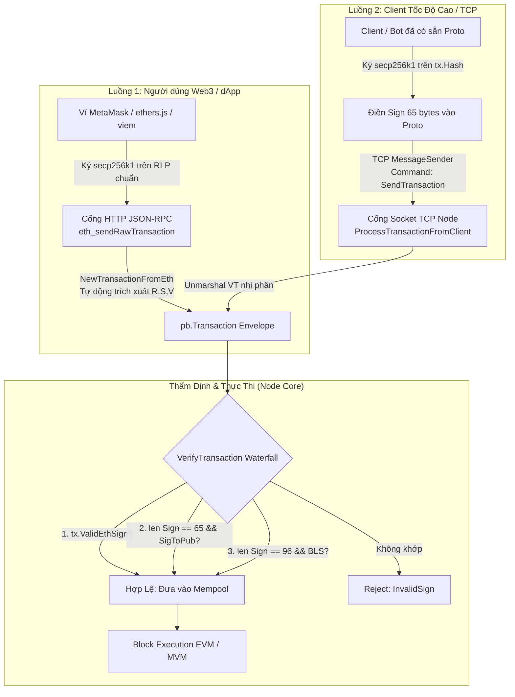

# 📐 Tài Liệu Thiết Kế: Kiến Trúc Giao Dịch Secp256k1 Qua TCP & RPC Chuẩn Với Protobuf

> **Trạng thái:** Đề xuất kiến trúc hoàn chỉnh (DRAFT)  
> **Ngày lập:** 2026-10-03  
> **Mục tiêu:** Cho phép người dùng ký `secp256k1` (ECDSA) gửi qua TCP bằng Protobuf một cách thanh lịch, đồng thời bảo đảm luồng RPC chuẩn EVM (MetaMask/Web3) tự động chuyển đổi không bị ảnh hưởng.

---

## 1. 🎯 Bối Cảnh & Vấn Đề (Problem Statement)

### 1.1. Hiện trạng trước đây (Simple Chain cũ)
- **Mô hình tài khoản:** Bắt buộc mô hình "Dual-Key" — mỗi người dùng vừa có địa chỉ EVM vừa phải gửi giao dịch đăng ký khóa BLS on-chain (`as.PublicKeyBls()`).
- **Luồng nạp giao dịch qua TCP:**
  - Client gọi lệnh TCP `SendTransactionWithDeviceKey`.
  - Phải trải qua 3 round-trips: `GetAccountState` ➔ `GetDeviceKey` ➔ `SendTransactionWithDeviceKey`.
  - Bắt buộc kiểm tra `as.PublicKeyBls()` của người dùng phải tồn tại và khớp với khóa ký.
  - Gói tin TCP bọc một lớp vỏ `pb.TransactionWithDeviceKey` mang theo `DeviceKey` (32 bytes sinh từ `LastHash`) để chống replay.

### 1.2. Chuyển dịch sang mô hình mới (Node Thực Thi BLS)
- **Node Thực Thi BLS:** Khóa BLS12-381 chỉ còn thuộc về **Node / Sequencer / Cluster** (Master BLS Key) dùng để quản lý quỹ Float, ký State Root và cam kết batch lên Parent Chain.
- **Người dùng KHÔNG ký BLS nữa:** Người dùng là tài khoản EVM thông thường, ký bằng thuật toán `secp256k1` (ECDSA).
- **Điểm gãy tương thích:**
  - Client gửi qua TCP bị văng lỗi: `"lỗi tài khoản chưa đăng ký public key bls trên chain"` hoặc `"account has no BLS public key registered on-chain"`.
  - Mempool Node reject với mã lỗi 66 (`InvalidSign`).
  - Hash ký của Ethereum (Sighash) là hàm số động theo các chuẩn EIP (Legacy, EIP-155, EIP-1559, EIP-4844...) mã hóa bằng RLP, hoàn toàn không trùng với hash của `pb.TransactionHashData`.

---

## 2. 💡 Kiến Trúc Giải Pháp: Mô Hình Vỏ Bọc Lai (Dual-Mode Envelope Architecture)

Hệ thống hỗ trợ song song **2 luồng giao dịch độc lập**, cùng hội tụ về một cấu trúc dữ liệu duy nhất trong Mempool:



---

## 3. 🔍 Đặc Tả Kỹ Thuật Chi Tiết

### 3.1. Luồng 1: RPC Chuẩn EVM Tự Động Convert (Hoàn toàn không bị ảnh hưởng)
- **Nguyên lý:** Giữ nguyên 100% cơ chế hiện có. Người dùng dùng ví Web3 ký bình thường.
- **Tại Node Ingress:** Hàm [`NewTransactionFromEth`](file:///home/abc/chain-n/metanode/execution/pkg/transaction/transaction.go#L84) tự động bóc tách các trường:
  - `pTx.R = r.Bytes()`
  - `pTx.S = s.Bytes()`
  - `pTx.V = v.Bytes()`
  - `pTx.Sign = append(r.Bytes(), append(s.Bytes(), recoveryID)...)`
  - `pTx.Type = ethTx.Type()` (0: Legacy, 1: EIP-2930, 2: EIP-1559, 3: EIP-4844, 4: EIP-7702)
- **Thẩm định:** Hàm [`tx.ValidEthSign()`](file:///home/abc/chain-n/metanode/execution/pkg/transaction/transaction.go#L1057) dựng lại `ethTx` và gọi bộ `types.Signer` chuẩn của `go-ethereum` để khôi phục địa chỉ người gửi.

---

### 3.2. Luồng 2: Client TCP Dùng Proto Ký Secp256k1 Trực Tiếp (Drop-in Replacement)
Dành cho các Client/Script đã quen dùng Protobuf từ trước, muốn gửi qua TCP socket mà không cần RLP phức tạp.

#### Quy cách đóng gói ở Client:
Client giữ nguyên 100% schema `pb.Transaction` cũ, **thêm định danh loại giao dịch và thay đổi hàm ký**:
1. Chuẩn bị `pb.Transaction` (From, To, Amount, Nonce, Data, ChainID).
2. **Quy định loại giao dịch:** Gán `pTx.Type = 0xFF` (255) để phân định đây là giao dịch Proto nội bộ, tránh xung đột với các loại giao dịch RLP của Ethereum (0, 1, 2, 3, 4...).
3. Lấy hash dữ liệu: `hash = tx.Hash().Bytes()` (chính là `keccak256(TransactionHashData)`).
4. Ký bằng private key `secp256k1` (thay vì BLS):
   $$\text{Signature} = \text{secp256k1.Sign}(hash, \text{privateKey}) \quad \text{(đúng 65 bytes: } [R (32B) \mid S (32B) \mid V (1B)]\text{)}$$
5. Gán trực tiếp 65 bytes vào trường `Sign`:
   ```go
   pTx.Sign = sig // 65 bytes
   ```
6. Serialize Protobuf và gửi qua socket TCP với command:
   ```go
   messageSender.SendBytes(conn, "SendTransaction", protoBytes)
   ```
   *(Không dùng command cũ `SendTransactionWithDeviceKey`).*

---

## 4. ⚙️ Cơ Chế Thẩm Định Thác Nước (Waterfall Validation Tại Node)

Tại hàm thẩm định chữ ký [`VerifyTransaction`](file:///home/abc/chain-n/metanode/execution/pkg/blockchain/tx_processor/validation.go#L228), Node phân loại thông minh để hỗ trợ cả 2 luồng mà không gây xung đột hay sinh log lỗi giả:

```go
// ══════════════════════════════════════════════════════════════════════════
// WATERFALL SIGNATURE VERIFICATION (Dual-Mode Secp256k1 & Legacy BLS)
// ══════════════════════════════════════════════════════════════════════════

// Nhánh 1: Giao dịch từ Luồng RPC chuẩn (MetaMask / EIP-1559 RLP)
if tx.ValidEthSign() {
    // Chữ ký secp256k1 hợp lệ theo chuẩn EIP của Ethereum
    return nil
}

// Nhánh 2: Giao dịch từ Luồng TCP Proto (Ký secp256k1 trực tiếp trên tx.Hash)
txSign := tx.Sign().Bytes()
if len(txSign) == 65 && tx.Type() == 0xFF {
    recoveredPubKey, err := crypto.SigToPub(tx.Hash().Bytes(), txSign)
    if err == nil && crypto.PubkeyToAddress(*recoveredPubKey) == tx.FromAddress() {
        // Chữ ký secp256k1 trên Protobuf hợp lệ
        return nil
    }
    return transaction.InvalidSign
}

// Nhánh 3: Tương thích ngược với Chữ ký BLS cũ (96 bytes)
if len(txSign) == 96 && len(as.PublicKeyBls()) > 0 {
    request := transaction.NewVerifyTransactionRequest(
        tx.Hash(),
        common.PubkeyFromBytes(as.PublicKeyBls()),
        tx.Sign(),
    )
    if request.Valid() {
        return nil
    }
}

// Không thỏa mãn bất kỳ chuẩn nào
return transaction.InvalidSign
```

---

## 5. 📊 Bảng So Sánh Hai Luồng

| Tiêu chí | Luồng 1: RPC Chuẩn EVM | Luồng 2: TCP Proto Trực Tiếp |
| :--- | :--- | :--- |
| **Đối tượng sử dụng** | Người dùng Web3, dApp, MetaMask, ví di động | Backend nội bộ, bot arbitrage, app có sẵn Proto SDK |
| **Trường Type (`tx.Type()`)** | Động theo chuẩn EVM (0, 1, 2, 3, 4...) | Cố định `0xFF` (255) |
| **Chuẩn ký** | Ethereum RLP Sighash (EIP-155, 1559, 4844...) | Keccak256 trên `pb.TransactionHashData` |
| **Thuật toán khóa** | secp256k1 (ECDSA) | secp256k1 (ECDSA) |
| **Giao thức mạng** | HTTP JSON-RPC (`eth_sendRawTransaction`) | TCP Socket Native (`command.SendTransaction`) |
| **Số bước round-trip** | 1 (HTTP POST) | 1 (TCP Send) |
| **Độ phức tạp Client** | Rất thấp (dùng thư viện ethers/viem có sẵn) | Cực thấp (dùng tiếp struct Proto cũ, chỉ đổi hàm ký) |
| **Độ trễ xử lý (Latency)** | Trung bình (~10-20ms) | Siêu thấp (< 1ms, tận dụng Zero-copy ReadLoop) |

---

## 6. 🚀 Kế Hoạch Triển Khai (Khi Bắt Đầu Sửa Code)

Khi tiến hành triển khai, chỉ cần thực hiện 3 chỉnh sửa tối thiểu:

1. **Tại `validation.go` ([`execution/pkg/blockchain/tx_processor/validation.go`](file:///home/abc/chain-n/metanode/execution/pkg/blockchain/tx_processor/validation.go)):**
   - Áp dụng cơ chế thẩm định thác nước (Waterfall Validation) như mục 4.
   - Bỏ kiểm tra cứng `len(as.PublicKeyBls()) == 0`.
2. **Tại `eth_tx_converter.go` ([`execution/cmd/simple_chain/eth_tx_converter.go`](file:///home/abc/chain-n/metanode/execution/cmd/simple_chain/eth_tx_converter.go)):**
   - Gỡ bỏ câu lệnh chặn `account has no BLS public key registered on-chain` ở dòng 65.
3. **Tại Client TCP:**
   - Đổi lệnh gửi từ `SendTransactionWithDeviceKey` sang `SendTransaction`.
   - Đổi hàm ký từ `bls.Sign()` sang `crypto.Sign(tx.Hash(), secpKey)`.

---
*Tài liệu này là cơ sở kỹ thuật để đội ngũ phát triển kích hoạt tính năng ký secp256k1 trên nền tảng Protobuf và TCP mà không ảnh hưởng tới hệ sinh thái EVM hiện hành.*
